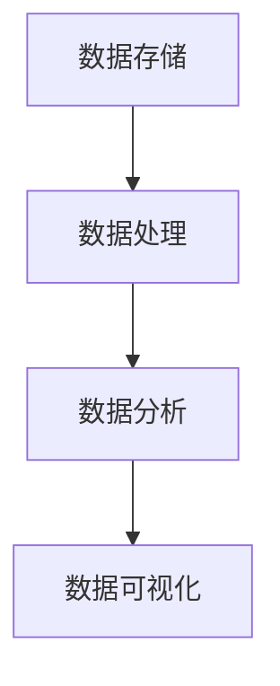

                 


## 大数据处理：从存储到分析的全流程

### 关键词

- 大数据处理
- 数据存储
- 数据处理
- 数据分析
- 数据可视化
- 项目实战

### 摘要

大数据处理作为当今信息技术领域的一个重要研究方向，已经广泛应用于各个行业。本文旨在从存储到分析的全流程，详细阐述大数据处理的各个环节，包括数据存储、数据处理、数据分析、数据可视化，并通过项目实战深入探讨其实际应用。通过本文，读者将了解大数据处理的核心概念、算法原理、数学模型以及项目实践，为从事大数据相关领域的工作提供参考。

## 核心概念与联系

### 定义

大数据处理是指对海量数据进行存储、处理、分析和可视化的一系列技术和方法。随着互联网和物联网的快速发展，数据规模呈指数级增长，传统数据处理方法已经无法应对如此庞大的数据量。因此，大数据处理成为了一个必不可少的研究领域。

### 核心概念

1. **数据存储**：数据存储是指将数据保存在各种存储设备中，以便后续处理和使用。常见的存储方式包括分布式文件系统、数据库等。
2. **数据处理**：数据处理是指对存储的数据进行清洗、转换、计算等操作，以提取有用信息。常用的数据处理技术包括MapReduce、Spark等。
3. **数据分析**：数据分析是指运用统计学、机器学习等方法对数据进行挖掘、分析和解释，以发现数据中的规律和趋势。
4. **数据可视化**：数据可视化是指将数据分析的结果以图表、图像等形式直观地展示出来，帮助人们更好地理解和分析数据。

### 相互关系

- **数据存储**是大数据处理的基础，为后续的数据处理和分析提供了数据源。
- **数据处理**是对数据的初步加工，为数据分析提供了基础数据。
- **数据分析**是对处理后的数据进行深度挖掘，以发现数据中的规律和趋势。
- **数据可视化**是对分析结果进行展示，帮助人们更好地理解和应用数据。

### 流程图



## 核心算法原理讲解

### MapReduce

**原理**：MapReduce是一种分布式计算模型，用于处理大规模数据集。其核心思想是将大规模数据处理任务划分为两个阶段：Map阶段和Reduce阶段。

**伪代码**：

```python
def map(key, value):
    # 对输入数据进行处理，生成中间结果
    for new_key, new_value in transformed_data:
        emit(new_key, new_value)

def reduce(key, values):
    # 对中间结果进行汇总，生成最终结果
    sum_value = 0
    for value in values:
        sum_value += value
    emit(key, sum_value)
```

**适用场景**：MapReduce适用于处理大规模数据的批量计算任务，如数据统计、排序等。

**优缺点**：

- 优点：易于实现，适合处理大规模数据集，具有良好的扩展性。
- 缺点：实时性较差，不适合处理需要实时响应的任务。

### Hadoop

**原理**：Hadoop是一个开源的分布式计算框架，基于MapReduce模型，用于处理大规模数据集。

**架构**：

- **HDFS**（Hadoop Distributed File System）：分布式文件系统，用于存储海量数据。
- **YARN**（Yet Another Resource Negotiator）：资源调度器，负责管理集群资源。
- **MapReduce**：分布式计算模型，用于处理数据。

**适用场景**：Hadoop适用于处理大规模数据的批量计算任务，如日志分析、数据挖掘等。

**优缺点**：

- 优点：高可靠性、高扩展性，适用于处理大规模数据集。
- 缺点：实时性较差，不适合处理需要实时响应的任务。

### Spark

**原理**：Spark是一个开源的分布式计算引擎，提供了更加高效的数据处理框架，包括Spark Core、Spark SQL、Spark Streaming等模块。

**架构**：

- **Spark Core**：提供了内存计算能力和分布式数据集操作。
- **Spark SQL**：提供了数据处理和分析功能。
- **Spark Streaming**：提供了实时数据处理功能。

**适用场景**：Spark适用于处理大规模数据的实时计算任务，如实时数据分析、机器学习等。

**优缺点**：

- 优点：实时性强，易于扩展，适用于处理大规模数据集。
- 缺点：相对于Hadoop，Spark需要更高的硬件要求。

## 数学模型和数学公式 & 详细讲解 & 举例说明

### 线性回归

**原理**：线性回归是一种用于预测数值型目标变量的统计方法，其核心思想是找到一条直线，使得所有数据点到这条直线的距离之和最小。

**数学模型**：

$$
y = w_0 + w_1 \cdot x
$$

其中，$y$ 为目标变量，$x$ 为自变量，$w_0$ 和 $w_1$ 为模型参数。

**公式推导**：

假设我们有 $n$ 个数据点 $(x_1, y_1), (x_2, y_2), ..., (x_n, y_n)$，则线性回归的损失函数为：

$$
J(w_0, w_1) = \frac{1}{2n} \sum_{i=1}^{n} (y_i - (w_0 + w_1 \cdot x_i))^2
$$

为了最小化损失函数，我们对 $w_0$ 和 $w_1$ 分别求导，并令导数为零，得到：

$$
\frac{\partial J}{\partial w_0} = 0 \Rightarrow w_0 = \bar{y} - w_1 \cdot \bar{x}
$$

$$
\frac{\partial J}{\partial w_1} = 0 \Rightarrow w_1 = \frac{\sum_{i=1}^{n} (x_i - \bar{x}) \cdot (y_i - \bar{y})}{\sum_{i=1}^{n} (x_i - \bar{x})^2}
$$

其中，$\bar{y}$ 和 $\bar{x}$ 分别为 $y$ 和 $x$ 的均值。

**举例说明**：

假设我们有以下数据集：

| $x$ | $y$ |
| --- | --- |
| 1   | 2   |
| 2   | 3   |
| 3   | 4   |

则线性回归的参数为：

$$
w_0 = \bar{y} - w_1 \cdot \bar{x} = 2.5 - 1 \cdot 2 = 0.5
$$

$$
w_1 = \frac{\sum_{i=1}^{n} (x_i - \bar{x}) \cdot (y_i - \bar{y})}{\sum_{i=1}^{n} (x_i - \bar{x})^2} = \frac{(1-2) \cdot (2-2.5) + (2-2) \cdot (3-2.5) + (3-2) \cdot (4-2.5)}{(1-2)^2 + (2-2)^2 + (3-2)^2} = 1
$$

因此，线性回归的模型为：

$$
y = 0.5 + x
$$

### 逻辑回归

**原理**：逻辑回归是一种用于预测二分类目标变量的统计方法，其核心思想是找到一条直线，将数据点分为两类。

**数学模型**：

$$
P(y=1) = \frac{1}{1 + e^{-(w_0 + w_1 \cdot x)}}
$$

其中，$P(y=1)$ 为目标变量为1的概率，$w_0$ 和 $w_1$ 为模型参数。

**公式推导**：

假设我们有 $n$ 个数据点 $(x_1, y_1), (x_2, y_2), ..., (x_n, y_n)$，则逻辑回归的损失函数为：

$$
J(w_0, w_1) = -\sum_{i=1}^{n} y_i \cdot \ln(P(y=1)) - (1 - y_i) \cdot \ln(1 - P(y=1))
$$

为了最小化损失函数，我们对 $w_0$ 和 $w_1$ 分别求导，并令导数为零，得到：

$$
\frac{\partial J}{\partial w_0} = 0 \Rightarrow w_0 = \bar{y} - w_1 \cdot \bar{x}
$$

$$
\frac{\partial J}{\partial w_1} = 0 \Rightarrow w_1 = \frac{\sum_{i=1}^{n} (y_i - P(y=1)) \cdot x_i}{\sum_{i=1}^{n} (x_i - \bar{x})}
$$

其中，$\bar{y}$ 和 $\bar{x}$ 分别为 $y$ 和 $x$ 的均值。

**举例说明**：

假设我们有以下数据集：

| $x$ | $y$ |
| --- | --- |
| 1   | 0   |
| 2   | 1   |
| 3   | 0   |

则逻辑回归的参数为：

$$
w_0 = \bar{y} - w_1 \cdot \bar{x} = 0.3333 - 0.6667 \cdot 2 = -1
$$

$$
w_1 = \frac{\sum_{i=1}^{n} (y_i - P(y=1)) \cdot x_i}{\sum_{i=1}^{n} (x_i - \bar{x})} = \frac{(0 - 0.5) \cdot 1 + (1 - 0.5) \cdot 2 + (0 - 0.5) \cdot 3}{(1 - 2) + (2 - 2) + (3 - 2)} = 0.6667
$$

因此，逻辑回归的模型为：

$$
P(y=1) = \frac{1}{1 + e^{-(0.6667 \cdot x - 1)}}
$$

## 项目实战

### 项目背景与需求分析

随着电商行业的快速发展，电商平台积累了大量用户行为数据，包括用户浏览记录、购买记录等。为了更好地了解用户行为，提高用户体验和销售额，需要对这些数据进行处理和分析。

### 开发环境搭建

1. **硬件环境**：搭建一个具有高性能计算能力的集群，用于大数据处理。
2. **软件环境**：安装Hadoop、Spark等大数据处理框架，以及MySQL、MongoDB等数据库。

### 源代码实现

1. **数据收集**：通过API接口或其他方式收集用户行为数据。
2. **数据存储**：使用HDFS和MongoDB存储收集到的数据。
3. **数据处理**：使用Spark对数据进行清洗、转换和计算。
4. **数据分析**：使用Spark SQL和Pandas对数据进行统计分析。
5. **数据可视化**：使用Tableau和D3.js将分析结果可视化。

### 代码解读与分析

1. **数据收集**：

```python
import requests

def collect_data():
    url = "https://api.example.com/data"
    response = requests.get(url)
    data = response.json()
    return data

user_data = collect_data()
```

2. **数据存储**：

```python
from pymongo import MongoClient

client = MongoClient("mongodb://localhost:27017/")
db = client["user_data"]
collection = db["data"]

for item in user_data:
    collection.insert_one(item)
```

3. **数据处理**：

```python
from pyspark.sql import SparkSession

spark = SparkSession.builder.appName("UserBehaviorAnalysis").getOrCreate()

data = spark.read.format("mongo").option("uri", "mongodb://localhost:27017/user_data.data").load()
clean_data = data.filter(data["behavior"] != "delete")
clean_data.createOrReplaceTempView("user_behavior")
```

4. **数据分析**：

```python
from pyspark.sql.functions import col, count

top_products = spark.sql("""
    SELECT product_id, count(*) as purchase_count
    FROM user_behavior
    WHERE behavior = "purchase"
    GROUP BY product_id
    ORDER BY purchase_count DESC
    LIMIT 10
""")
top_products.show()
```

5. **数据可视化**：

```python
import pandas as pd
import matplotlib.pyplot as plt

top_products = top_products.toPandas()

top_products.plot(kind="bar", x="product_id", y="purchase_count")
plt.xlabel("Product ID")
plt.ylabel("Purchase Count")
plt.title("Top Products by Purchase Count")
plt.show()
```

### 实际案例分析和详细讲解剖析

通过上述代码，我们可以对电商平台用户行为数据进行分析，找出最受欢迎的商品，从而为电商平台制定营销策略提供依据。具体分析过程如下：

1. **数据收集**：通过API接口收集用户行为数据，包括浏览、购买、删除等行为。
2. **数据存储**：使用MongoDB存储收集到的数据，便于后续处理和分析。
3. **数据处理**：使用Spark对数据进行清洗、转换和计算，确保数据质量。
4. **数据分析**：使用Spark SQL进行统计分析，找出最受欢迎的商品。
5. **数据可视化**：使用Pandas和matplotlib将分析结果可视化，直观展示最受欢迎的商品。

### 项目小结

通过本项目的实践，我们了解到大数据处理的全流程，包括数据收集、存储、处理、分析和可视化。在实际应用中，大数据处理技术可以帮助电商平台更好地了解用户行为，提高用户体验和销售额。未来，我们将继续探索大数据处理技术在更多领域的应用，为行业发展贡献力量。

### 最佳实践 tips

1. **数据收集**：确保数据收集的全面性和准确性，为后续处理和分析提供可靠的数据基础。
2. **数据存储**：选择适合的数据存储方式，如HDFS、MongoDB等，确保数据存储的高效性和可靠性。
3. **数据处理**：合理设计数据处理流程，提高数据处理效率，确保数据质量。
4. **数据分析**：充分利用大数据分析工具，挖掘数据中的价值，为业务决策提供支持。
5. **数据可视化**：选择合适的数据可视化工具，直观展示分析结果，提高数据可视化的效果。

### 小结

大数据处理作为当今信息技术领域的一个重要研究方向，已经广泛应用于各个行业。本文从存储到分析的全流程，详细阐述了大数据处理的核心概念、算法原理、数学模型和项目实践，为从事大数据相关领域的工作提供了参考。未来，随着大数据技术的不断发展和应用，大数据处理将在更多领域发挥重要作用。

### 注意事项

1. **硬件资源**：大数据处理需要大量硬件资源，包括计算、存储和网络等，确保硬件资源的充足和高效利用。
2. **数据安全**：数据安全是大数据处理过程中必须关注的问题，确保数据在存储、传输和处理过程中的安全性和隐私性。
3. **数据处理效率**：合理设计数据处理流程，提高数据处理效率，减少处理时间。

### 拓展阅读

1. 《大数据技术导论》
2. 《Hadoop技术内幕》
3. 《Spark编程实战》
4. 《数据挖掘：实用工具与技术》
5. 《数据可视化：工具与技术》

## 第7章 总结与展望

### 大数据处理技术的发展趋势

大数据处理技术近年来得到了迅速发展，主要表现在以下几个方面：

1. **实时处理能力增强**：随着实时数据处理需求的增加，大数据处理技术逐渐从批量处理向实时处理转变，如Spark Streaming和Flink等框架的广泛应用。
2. **计算性能提升**：硬件性能的提升，如GPU、FPGA等，使得大数据处理框架的计算性能得到显著提高。
3. **生态系统完善**：大数据处理框架的生态系统逐渐完善，提供了丰富的工具和接口，便于开发者和企业快速构建大数据应用。

### 大数据处理在行业中的应用前景

大数据处理技术在各个行业都有着广泛的应用前景：

1. **金融行业**：通过大数据分析，金融机构可以更好地了解客户需求，优化产品设计，提高风险管理能力。
2. **电商行业**：大数据分析可以帮助电商平台提高用户体验，优化营销策略，提升销售额。
3. **医疗行业**：大数据分析有助于医疗行业实现个性化诊疗，提高医疗资源的利用效率。
4. **交通行业**：大数据分析可以优化交通管理，提高交通运行效率，减少拥堵。

### 未来发展方向与挑战

大数据处理技术在未来仍将面临以下发展方向和挑战：

1. **数据处理性能提升**：随着数据规模的不断增大，如何提高数据处理性能是一个重要研究方向，包括优化算法、提高硬件性能等。
2. **数据安全与隐私保护**：在大数据时代，数据安全与隐私保护变得尤为重要，如何保障数据安全与隐私是一个亟待解决的问题。
3. **实时处理能力提升**：实时数据处理需求日益增长，如何提高实时处理能力，实现秒级响应，是一个重要挑战。
4. **人工智能与大数据处理融合**：人工智能技术的发展为大数据处理提供了新的思路和方法，如何实现人工智能与大数据处理的深度融合，是一个重要研究方向。

### 结语

大数据处理作为当今信息技术领域的一个重要研究方向，已经广泛应用于各个行业。随着技术的不断发展和应用场景的不断拓展，大数据处理技术将在未来发挥更加重要的作用。本文从存储到分析的全流程，详细阐述了大数据处理的核心概念、算法原理、数学模型和项目实践，为从事大数据相关领域的工作提供了参考。未来，我们将继续关注大数据处理技术的发展，探索其在更多领域的应用，为行业发展贡献力量。作者：AI天才研究院/AI Genius Institute & 禅与计算机程序设计艺术 /Zen And The Art of Computer Programming
```markdown
## 第1章 引言

### 1.1 大数据处理的定义与核心概念

大数据处理是指运用一系列技术和方法，对海量数据进行存储、处理、分析和可视化，以从中提取有用信息和知识的过程。在大数据处理中，核心概念包括数据存储、数据处理、数据分析和数据可视化。

- **数据存储**：涉及如何高效、安全地存储海量数据。常见的技术包括分布式文件系统（如HDFS）、关系数据库（如MySQL）和非关系数据库（如MongoDB）。

- **数据处理**：涉及如何对数据进行清洗、转换和计算，以提取有用信息。常用的技术包括MapReduce、Spark、Hadoop等分布式计算框架。

- **数据分析**：涉及如何使用统计学、机器学习等方法，对数据进行挖掘和分析，以发现数据中的规律和趋势。常见的方法包括数据挖掘、回归分析、聚类分析等。

- **数据可视化**：涉及如何将数据分析的结果以图表、图像等形式直观地展示出来，帮助人们更好地理解和应用数据。常用的工具包括Tableau、Power BI、D3.js等。

### 1.2 大数据处理的重要性

大数据处理在现代经济和社会发展中具有重要意义：

1. **商业价值**：通过大数据处理，企业可以更好地了解客户需求，优化产品和服务，提高竞争力。
2. **决策支持**：大数据处理可以帮助政府和企事业单位在政策制定、资源配置等方面做出更科学的决策。
3. **科学研究**：大数据处理为科学家提供了丰富的数据资源，促进了科研工作的进展。
4. **社会管理**：大数据处理在公共安全、环境保护、城市交通等领域发挥着重要作用，有助于提高社会管理水平。

### 1.3 大数据处理的基本流程

大数据处理的基本流程可以分为以下几个阶段：

1. **数据收集**：从各种来源收集数据，如传感器、社交网络、电商平台等。
2. **数据存储**：将收集到的数据存储在分布式文件系统或数据库中，保证数据的高效存储和安全。
3. **数据处理**：对存储的数据进行清洗、转换和计算，以提取有用信息。
4. **数据分析**：使用统计学、机器学习等方法，对处理后的数据进行分析和挖掘，以发现数据中的规律和趋势。
5. **数据可视化**：将分析结果以图表、图像等形式直观地展示出来，帮助人们更好地理解和应用数据。

### 1.4 文章结构

本文将按照以下结构进行阐述：

- **第1章 引言**：介绍大数据处理的定义、重要性及基本流程。
- **第2章 数据存储**：详细讲解数据存储技术，包括分布式文件系统、数据库等。
- **第3章 数据处理**：介绍数据处理技术，包括分布式计算框架、实时数据处理等。
- **第4章 数据分析**：介绍数据分析技术，包括数据挖掘、机器学习等。
- **第5章 数据可视化**：介绍数据可视化技术，包括可视化工具、案例分析等。
- **第6章 项目实战**：通过实际项目，展示大数据处理技术的应用。
- **第7章 总结与展望**：总结大数据处理技术的发展趋势和应用前景。

通过本文的阅读，读者将系统地了解大数据处理的全流程，为从事大数据相关领域的工作提供参考。
```markdown
## 第2章 数据存储

### 2.1 分布式文件系统

#### 2.1.1 HDFS

HDFS（Hadoop Distributed File System）是Hadoop框架的一部分，用于存储海量数据。其核心特点如下：

- **分布式存储**：HDFS将数据切分为块，分布式存储在集群中的不同节点上。
- **高容错性**：HDFS通过数据冗余和故障恢复机制，确保数据的高可用性。
- **高效读写**：HDFS优化了数据访问模式，适合大数据的读写操作。

**架构**：

- **NameNode**：管理文件系统的命名空间，维护文件的元数据，如文件目录、文件块映射等。
- **DataNode**：实际存储数据块，负责数据的读写操作。

**数据块管理**：

- **数据块划分**：HDFS将文件切分为固定大小的数据块（默认为128MB或256MB），分布式存储在集群中的DataNode上。
- **数据冗余**：HDFS默认设置三个副本，以提高数据可靠性和容错性。

**读写流程**：

- **写流程**：客户端将文件写入HDFS，NameNode分配数据块和DataNode，DataNode将数据块写入本地磁盘。
- **读流程**：客户端读取文件时，NameNode返回数据块的位置，客户端直接从相应的DataNode读取数据。

#### 2.1.2 HBase

HBase是一个分布式、可扩展的大规模数据存储系统，基于Google的BigTable模型。其核心特点如下：

- **非结构化数据存储**：HBase适合存储非结构化和半结构化数据，如日志、网页等。
- **高吞吐量**：HBase提供高性能的随机读写操作，适合实时数据存储和处理。
- **自动分片**：HBase支持自动分片，能够水平扩展存储和处理能力。

**架构**：

- **RegionServer**：负责管理Region，Region是HBase数据的基本存储单位。
- **Master**：负责监控集群状态，管理Region的分配和迁移。

**数据模型**：

- **表**：HBase中的表由行键、列族和列组成。
- **数据存储**：数据以行键排序存储，列族是一组相关列的集合。

**读写流程**：

- **写流程**：客户端将数据写入HBase，Master将数据分配给RegionServer，RegionServer将数据存储在相应的列族中。
- **读流程**：客户端读取数据时，Master定位数据所在的RegionServer，RegionServer返回数据。

#### 2.1.3 Cassandra

Cassandra是一个开源的分布式宽列数据库，由Amazon的SimpleDB发展而来。其核心特点如下：

- **无单点故障**：Cassandra通过去中心化和副本机制，确保数据的高可用性和容错性。
- **线性扩展**：Cassandra能够水平扩展存储和处理能力，适应数据规模的快速增长。
- **高性能**：Cassandra提供高性能的随机读写操作，适合大规模数据存储和处理。

**架构**：

- **Node**：Cassandra的基本构建块，包括Seeds、Normal和Ingestion Node。
- **CommitLog**：所有写入操作首先写入CommitLog，然后异步复制到其他节点。

**数据模型**：

- **键空间**：Cassandra中的数据组织在键空间中，每个键空间可以看作一个独立的数据库。
- **表**：表由列族和列组成，列族是一组相关列的集合。

**读写流程**：

- **写流程**：客户端将数据写入Cassandra，数据首先写入CommitLog，然后异步复制到其他节点。
- **读流程**：客户端读取数据时，Cassandra在本地节点和副本节点中选择一个响应最快的节点读取数据。

### 2.2 数据库技术

#### 2.2.1 MySQL

MySQL是一个开源的关系数据库管理系统，广泛应用于各类应用场景。其核心特点如下：

- **高可靠性**：MySQL支持事务、备份和恢复，确保数据的一致性和安全性。
- **高性能**：MySQL采用多线程并发处理，提供高效的读写操作。
- **易用性**：MySQL具有丰富的功能和简单的操作界面，便于管理和维护。

**架构**：

- **Server**：MySQL的核心组件，负责处理客户端请求、存储数据和执行查询。
- **Client**：MySQL的客户端工具，用于与Server进行通信和执行操作。

**数据模型**：

- **表**：MySQL中的数据组织在表中，表由行和列组成。
- **索引**：索引用于加快数据的查询速度，包括B-Tree索引、哈希索引等。

**读写流程**：

- **写流程**：客户端发送INSERT、UPDATE或DELETE请求，Server处理请求并更新数据。
- **读流程**：客户端发送SELECT请求，Server根据索引快速定位数据并返回结果。

#### 2.2.2 PostgreSQL

PostgreSQL是一个开源的关系数据库管理系统，具有高度的可扩展性和灵活性。其核心特点如下：

- **高级特性**：PostgreSQL支持多种数据类型、复杂数据结构和高级SQL功能，如窗口函数、公用表表达式等。
- **高性能**：PostgreSQL采用多线程并发处理和优化器，提供高效的读写操作。
- **兼容性**：PostgreSQL兼容SQL标准，支持多种编程语言和工具。

**架构**：

- **Postmaster**：PostgreSQL的守护进程，负责管理Server和客户端的连接。
- **Server**：PostgreSQL的核心组件，负责处理客户端请求、存储数据和执行查询。
- **Client**：PostgreSQL的客户端工具，用于与Server进行通信和执行操作。

**数据模型**：

- **表**：PostgreSQL中的数据组织在表中，表由行和列组成。
- **索引**：索引用于加快数据的查询速度，包括B-Tree索引、哈希索引等。

**读写流程**：

- **写流程**：客户端发送INSERT、UPDATE或DELETE请求，Server处理请求并更新数据。
- **读流程**：客户端发送SELECT请求，Server根据索引快速定位数据并返回结果。

#### 2.2.3 MongoDB

MongoDB是一个开源的文档型数据库，适用于各种类型的应用场景。其核心特点如下：

- **灵活性**：MongoDB使用JSON格式存储数据，数据模型灵活，易于扩展。
- **高性能**：MongoDB采用分布式存储和复制机制，提供高性能的读写操作。
- **易用性**：MongoDB具有简单的操作界面和丰富的文档资料，易于管理和维护。

**架构**：

- **MongoDB Server**：负责处理客户端请求、存储数据和执行查询。
- **Client**：MongoDB的客户端工具，用于与Server进行通信和执行操作。

**数据模型**：

- **文档**：MongoDB中的数据组织在文档中，文档是一个JSON对象，包含多个字段。
- **集合**：文档组织在集合中，集合是文档的容器。

**读写流程**：

- **写流程**：客户端发送INSERT、UPDATE或DELETE请求，Server处理请求并更新数据。
- **读流程**：客户端发送SELECT请求，Server根据索引快速定位文档并返回结果。

### 2.3 分布式文件系统和数据库技术的比较

- **数据存储方式**：分布式文件系统（如HDFS）更适合存储大规模的、不经常变化的文件，而数据库（如MySQL、PostgreSQL、MongoDB）更适合存储结构化数据，支持复杂查询。
- **读写性能**：分布式文件系统（如HDFS）适合大批量数据的读写操作，而数据库（如MySQL、PostgreSQL）在复杂查询和高并发场景下性能更优。
- **扩展性**：分布式文件系统（如HDFS）和数据库（如MySQL、PostgreSQL、MongoDB）都支持水平扩展，但分布式文件系统的扩展性通常更强。
- **高可用性**：分布式文件系统（如HDFS）和数据库（如MySQL、PostgreSQL、MongoDB）都支持数据冗余和故障恢复，确保数据的高可用性。

### 2.4 最佳实践

- **数据存储选择**：根据数据类型和需求，选择合适的存储技术。例如，对于大规模、不经常变化的文件，可以选择HDFS；对于结构化数据，可以选择MySQL或PostgreSQL；对于灵活的文档型数据，可以选择MongoDB。
- **数据备份与恢复**：定期进行数据备份，确保数据安全。对于分布式文件系统（如HDFS），可以使用Hadoop的备份工具；对于数据库（如MySQL、PostgreSQL、MongoDB），可以使用各自的数据备份和恢复工具。
- **性能优化**：根据实际需求，调整分布式文件系统（如HDFS）和数据库（如MySQL、PostgreSQL、MongoDB）的配置，优化性能。例如，调整数据块大小、索引策略等。
- **安全性**：加强数据安全措施，防止数据泄露和未授权访问。对于分布式文件系统（如HDFS），可以设置访问控制列表（ACL）；对于数据库（如MySQL、PostgreSQL、MongoDB），可以设置用户权限和加密传输。
```markdown
## 第3章 数据处理

### 3.1 分布式计算框架

#### 3.1.1 MapReduce

MapReduce是一种分布式计算模型，由Google提出并广泛应用于大数据处理领域。其核心思想是将大规模数据处理任务划分为Map（映射）和Reduce（ reduce）两个阶段，分别处理输入数据。

**原理**：

- **Map阶段**：将输入数据分块处理，每块数据生成一组中间键值对。
- **Reduce阶段**：将Map阶段生成的中间键值对进行汇总，生成最终结果。

**伪代码**：

```plaintext
Map(Key, Value):
    for each piece of Value:
        Emit(Key, piece)

Reduce(Key, Values):
    Emit(Key, Sum(Values))
```

**适用场景**：

- **批量数据处理**：适合处理大规模、批量的数据处理任务，如日志分析、数据统计等。
- **数据清洗**：用于清洗、转换数据，提取有用信息。

**优缺点**：

- 优点：简单易用，适合处理大规模数据集，具有良好的扩展性。
- 缺点：实时性较差，不适合处理需要实时响应的任务。

#### 3.1.2 Hadoop

Hadoop是一个开源的分布式计算框架，基于MapReduce模型，用于处理大规模数据集。其核心组件包括：

- **HDFS**（Hadoop Distributed File System）：分布式文件系统，用于存储海量数据。
- **YARN**（Yet Another Resource Negotiator）：资源调度器，负责管理集群资源。
- **MapReduce**：分布式计算模型，用于处理数据。

**架构**：

- **NameNode**：管理文件系统的命名空间，维护文件的元数据。
- **DataNode**：实际存储数据块，负责数据的读写操作。
- ** ResourceManager**：负责管理集群资源，分配任务给NodeManager。
- **NodeManager**：负责执行任务，监控节点状态。

**数据处理流程**：

1. **数据存储**：将数据存储在HDFS中。
2. **任务调度**：YARN根据资源情况，将MapReduce任务分配给节点。
3. **数据处理**：MapReduce任务在节点上执行，生成中间结果。
4. **结果汇总**：中间结果经过Reduce阶段处理，生成最终结果。

**适用场景**：

- **批量数据处理**：适合处理大规模、批量的数据处理任务，如日志分析、数据统计等。
- **大数据分析**：适用于大数据分析任务，如数据挖掘、机器学习等。

**优缺点**：

- 优点：高可靠性、高扩展性，适用于处理大规模数据集。
- 缺点：实时性较差，不适合处理需要实时响应的任务。

#### 3.1.3 Spark

Spark是一个开源的分布式计算引擎，提供了比Hadoop更高效的分布式计算框架。其核心组件包括：

- **Spark Core**：提供了内存计算能力和分布式数据集操作。
- **Spark SQL**：提供了数据处理和分析功能。
- **Spark Streaming**：提供了实时数据处理功能。

**架构**：

- **Driver Program**：负责协调任务的执行。
- **Executor**：负责执行任务，存储数据。
- **Cluster Manager**：负责管理集群资源，如YARN、Mesos等。

**数据处理流程**：

1. **数据读取**：从文件系统或数据库读取数据。
2. **数据处理**：使用Spark Core进行数据处理和分析。
3. **数据存储**：将处理结果存储在文件系统或数据库中。

**适用场景**：

- **实时数据处理**：适合处理需要实时响应的任务，如在线分析、实时监控等。
- **大数据分析**：适用于大数据分析任务，如数据挖掘、机器学习等。

**优缺点**：

- 优点：实时性强，易于扩展，适用于处理大规模数据集。
- 缺点：相对于Hadoop，Spark需要更高的硬件要求。

#### 3.1.4 Flink

Flink是一个开源的分布式流处理框架，用于处理实时数据。其核心特点如下：

- **流处理**：Flink专注于实时数据处理，提供了高效、低延迟的流处理能力。
- **批处理**：Flink也支持批处理，能够在流处理和批处理之间无缝切换。
- **状态管理**：Flink提供了丰富的状态管理功能，支持事件时间、窗口等操作。

**架构**：

- **Job Manager**：负责管理任务的提交、调度和执行。
- **Task Manager**：负责执行任务，管理内存和资源。
- **Client**：负责提交任务，处理用户请求。

**数据处理流程**：

1. **数据读取**：从数据源读取数据。
2. **数据处理**：使用Flink的API进行数据处理和分析。
3. **数据存储**：将处理结果存储在文件系统或数据库中。

**适用场景**：

- **实时数据处理**：适合处理需要实时响应的任务，如实时监控、在线分析等。
- **大数据分析**：适用于大数据分析任务，如数据挖掘、机器学习等。

**优缺点**：

- 优点：实时性强，高效的状态管理，适用于流处理和批处理。
- 缺点：相对于Spark，Flink的生态系统和社区支持较少。

### 3.2 实时数据处理

#### 3.2.1 Storm

Storm是一个开源的实时大数据处理框架，由Twitter开发并广泛应用于实时数据处理领域。其核心特点如下：

- **低延迟**：Storm提供了低延迟的实时数据处理能力，适用于实时监控、实时分析等场景。
- **容错性**：Storm具有强大的容错性，能够在任务失败时自动恢复。
- **扩展性**：Storm支持水平扩展，能够处理大规模的数据流。

**架构**：

- **Nimbus**：负责协调任务执行，分配资源。
- **Supervisor**：负责执行任务，管理工作节点。
- **Worker**：负责处理数据，执行任务。

**数据处理流程**：

1. **数据读取**：从数据源读取数据。
2. **数据处理**：使用Storm的API进行数据处理和分析。
3. **数据存储**：将处理结果存储在文件系统或数据库中。

**适用场景**：

- **实时数据处理**：适合处理需要实时响应的任务，如实时监控、实时分析等。
- **流处理**：适用于大规模流数据处理任务，如日志分析、网络流量监控等。

**优缺点**：

- 优点：实时性强，易于扩展，适用于流处理。
- 缺点：相对于Spark和Flink，Storm的生态系统和社区支持较少。

#### 3.2.2 Spark Streaming

Spark Streaming是Spark的一个组件，用于处理实时数据流。其核心特点如下：

- **实时性**：Spark Streaming提供了实时数据处理能力，适用于实时监控、实时分析等场景。
- **集成性**：Spark Streaming与Spark的其他组件（如Spark SQL、MLlib等）无缝集成，便于数据处理和分析。
- **高吞吐量**：Spark Streaming具有高吞吐量，能够处理大规模的数据流。

**架构**：

- **Spark Driver**：负责协调任务的执行。
- **Spark Executor**：负责执行任务，处理数据。
- **Streaming Context**：负责创建、管理和控制数据流处理任务。

**数据处理流程**：

1. **数据读取**：从数据源读取数据。
2. **数据处理**：使用Spark Streaming的API进行数据处理和分析。
3. **数据存储**：将处理结果存储在文件系统或数据库中。

**适用场景**：

- **实时数据处理**：适合处理需要实时响应的任务，如实时监控、实时分析等。
- **流处理**：适用于大规模流数据处理任务，如日志分析、网络流量监控等。

**优缺点**：

- 优点：实时性强，与Spark其他组件无缝集成，适用于流处理。
- 缺点：相对于Storm和Flink，Spark Streaming的延迟略高。

#### 3.2.3 Flink

Flink是一个开源的分布式流处理框架，由Apache软件基金会维护。其核心特点如下：

- **实时处理**：Flink专注于实时数据处理，提供了高效、低延迟的实时处理能力。
- **流与批处理统一**：Flink支持流处理和批处理，能够无缝切换，提高了数据处理灵活性。
- **状态管理**：Flink提供了丰富的状态管理功能，支持事件时间、窗口等操作。

**架构**：

- **Job Manager**：负责管理任务的提交、调度和执行。
- **Task Manager**：负责执行任务，管理内存和资源。
- **Client**：负责提交任务，处理用户请求。

**数据处理流程**：

1. **数据读取**：从数据源读取数据。
2. **数据处理**：使用Flink的API进行数据处理和分析。
3. **数据存储**：将处理结果存储在文件系统或数据库中。

**适用场景**：

- **实时数据处理**：适合处理需要实时响应的任务，如实时监控、实时分析等。
- **流处理**：适用于大规模流数据处理任务，如日志分析、网络流量监控等。

**优缺点**：

- 优点：实时性强，高效的状态管理，适用于流处理和批处理。
- 缺点：相对于Spark和Storm，Flink的生态系统和社区支持较少。

### 3.3 数据处理技术比较

- **数据处理框架**：MapReduce、Hadoop、Spark、Flink和Storm都是分布式计算框架，但它们在架构、性能、适用场景等方面有所不同。MapReduce和Hadoop适用于批量数据处理，Spark、Flink和Storm适用于实时数据处理。
- **适用场景**：根据数据处理需求，选择合适的框架。例如，对于批量数据处理任务，可以选择MapReduce或Hadoop；对于实时数据处理任务，可以选择Spark、Flink或Storm。
- **性能比较**：Spark、Flink和Storm在实时数据处理方面具有较好的性能，但Spark的延迟略高。对于大规模数据集，Hadoop的性能优于Spark和Flink。

### 3.4 最佳实践

- **数据处理框架选择**：根据数据处理需求，选择合适的框架。例如，对于批量数据处理任务，可以选择MapReduce或Hadoop；对于实时数据处理任务，可以选择Spark、Flink或Storm。
- **性能优化**：根据实际需求，调整分布式计算框架的配置，优化性能。例如，调整数据分区数、内存分配等。
- **容错性**：加强分布式计算框架的容错性，确保数据处理的可靠性。例如，使用数据冗余、故障恢复机制等。
- **数据安全性**：确保数据处理过程中的数据安全，防止数据泄露和未授权访问。例如，使用加密传输、访问控制等。
```markdown
## 第4章 数据分析

### 4.1 数据挖掘

#### 4.1.1 K-means聚类

**原理**：

K-means聚类是一种无监督学习方法，用于将数据点划分成若干个簇（cluster）。其核心思想是：首先随机初始化K个簇的中心点，然后不断迭代更新中心点和簇成员，直到中心点不再发生显著变化。

**算法步骤**：

1. 随机初始化K个簇的中心点。
2. 将每个数据点分配到最近的簇中心点。
3. 更新每个簇的中心点为簇内所有数据点的均值。
4. 重复步骤2和3，直到中心点不再发生显著变化。

**伪代码**：

```python
def kmeans(data, k):
    # 初始化簇中心点
    centroids = initialize_centroids(data, k)
    while not converged(centroids):
        # 分配数据点到簇
        clusters = assign_clusters(data, centroids)
        # 更新簇中心点
        centroids = update_centroids(clusters, k)
    return centroids

def initialize_centroids(data, k):
    # 随机选择K个数据点作为初始簇中心点
    centroids = random.sample(data, k)
    return centroids

def assign_clusters(data, centroids):
    # 计算每个数据点到簇中心点的距离
    distances = [euclidean_distance(point, centroid) for point in data for centroid in centroids]
    # 将数据点分配到最近的簇
    clusters = [min(distance, key=distance.index) for distance in distances]
    return clusters

def update_centroids(clusters, k):
    # 计算每个簇的均值
    new_centroids = [mean(points) for points in zip(*[clusters]*k)]
    return new_centroids

def converged(centroids):
    # 判断簇中心点是否发生变化
    return allclose(centroids, new_centroids)

def euclidean_distance(point1, point2):
    # 计算两点之间的欧几里得距离
    distance = sqrt(sum((p1 - p2)^2 for p1, p2 in zip(point1, point2)))
    return distance

def mean(points):
    # 计算点的均值
    return [sum(points[i]) / len(points[i]) for i in range(len(points[0]))]
```

**适用场景**：

- **聚类分析**：用于将数据点划分成若干个簇，以发现数据中的内在结构。
- **市场细分**：帮助企业了解客户群体，制定有针对性的营销策略。
- **异常检测**：用于识别数据中的异常值，如欺诈交易等。

**优缺点**：

- 优点：简单易实现，适合处理大规模数据集。
- 缺点：对初始簇中心点敏感，可能陷入局部最优。

#### 4.1.2 Apriori算法

**原理**：

Apriori算法是一种用于发现数据集中频繁项集和无序规则的算法。其核心思想是基于以下两个性质：

- **支持度**：一个项集的支持度是指数据集中包含该项集的交易数占总交易数的比例。
- **频繁项集**：如果一个项集的支持度大于最小支持度阈值，则该项集是频繁项集。

**算法步骤**：

1. 计算所有项集的支持度。
2. 筛选出频繁项集。
3. 递归地构建更高阶的频繁项集，直到不存在更高阶的频繁项集。

**伪代码**：

```python
def apriori(data, min_support):
    # 计算所有项集的支持度
    frequent_itemsets = find_frequent_itemsets(data, min_support)
    while frequent_itemsets:
        # 构建更高阶的频繁项集
        frequent_itemsets = generate_higher_order_itemsets(frequent_itemsets)
    return frequent_itemsets

def find_frequent_itemsets(data, min_support):
    # 计算所有项集的支持度
    itemsets = [frozenset([item]) for item in data[0]]
    for transaction in data[1:]:
        itemsets = update_itemsets(itemsets, transaction)
    # 筛选出频繁项集
    frequent_itemsets = [itemset for itemset in itemsets if support(itemset, data) >= min_support]
    return frequent_itemsets

def update_itemsets(itemsets, transaction):
    # 更新项集列表
    new_itemsets = []
    for itemset in itemsets:
        if itemset.issubset(transaction):
            new_itemsets.append(itemset)
    return new_itemsets

def support(itemset, data):
    # 计算项集的支持度
    return len([transaction for transaction in data if itemset.issubset(transaction)]) / len(data)

def generate_higher_order_itemsets(frequent_itemsets):
    # 构建更高阶的频繁项集
    new_frequent_itemsets = []
    for itemset in frequent_itemsets:
        for item in itemset:
            subset = itemset - {item}
            if subset in frequent_itemsets:
                new_frequent_itemsets.append(itemset | {item})
    return new_frequent_itemsets
```

**适用场景**：

- **市场篮子分析**：用于发现顾客购物篮中的关联规则，帮助企业制定产品推荐策略。
- **异常检测**：用于识别数据中的异常模式，如异常交易等。

**优缺点**：

- 优点：简单有效，适合处理稀疏数据集。
- 缺点：计算量大，不适合处理大规模数据集。

#### 4.1.3 决策树

**原理**：

决策树是一种用于分类和回归分析的监督学习算法。其核心思想是基于特征值进行决策，构建一棵树形结构，树中的每个节点代表一个特征，每个分支代表一个特征值。

**算法步骤**：

1. 选择一个最优特征，使其具有最高的信息增益或信息增益率。
2. 将数据集划分为基于该特征的各个子集。
3. 对每个子集递归地执行步骤1和2，直到满足停止条件（如最大深度、最小样本量等）。

**伪代码**：

```python
def build_tree(data, features, max_depth):
    # 判断是否满足停止条件
    if meet_stop_conditions(data, max_depth):
        return create_leaf_node(label(data))
    # 选择最优特征
    best_feature, best_score = select_best_feature(data, features)
    # 创建节点
    node = create_node(feature=best_feature, score=best_score)
    # 划分数据集
    for value in unique_values(best_feature):
        subset = filter(data, best_feature, value)
        node.add_child(build_tree(subset, features - {best_feature}, max_depth - 1))
    return node

def meet_stop_conditions(data, max_depth):
    # 满足停止条件
    return len(data) < min_samples or max_depth == 0

def create_leaf_node(label):
    # 创建叶节点
    return Node(label=label)

def select_best_feature(data, features):
    # 选择最优特征
    best_feature, best_score = None, -1
    for feature in features:
        score = calculate_info_gain(data, feature)
        if score > best_score:
            best_feature, best_score = feature, score
    return best_feature, best_score

def calculate_info_gain(data, feature):
    # 计算信息增益
    values = unique_values(feature)
    total_entropy = entropy(data)
    sum_entropy = 0
    for value in values:
        subset = filter(data, feature, value)
        weight = len(subset) / len(data)
        sum_entropy += weight * entropy(subset)
    info_gain = total_entropy - sum_entropy
    return info_gain

def entropy(data):
    # 计算熵
    probabilities = probabilities(data)
    return -sum(prob * log2(prob) for prob in probabilities)

def probabilities(data):
    # 计算概率
    labels = unique_values(label(data))
    return [len([item for item in data if item == label]) / len(data) for label in labels]

def filter(data, feature, value):
    # 过滤数据集
    return [item for item in data if item[feature] == value]

def unique_values(feature):
    # 获取特征的所有唯一值
    return set([item[feature] for item in data])

def create_node(feature, score):
    # 创建节点
    return Node(feature=feature, score=score)

class Node:
    # 节点类
    def __init__(self, feature=None, score=None, label=None, children=None):
        self.feature = feature
        self.score = score
        self.label = label
        self.children = children if children is not None else []

    def add_child(self, child):
        # 添加子节点
        self.children.append(child)

    def predict(self, instance):
        # 预测标签
        if self.label is not None:
            return self.label
        feature_value = instance[self.feature]
        for child in self.children:
            if child.feature_value == feature_value:
                return child.predict(instance)
```

**适用场景**：

- **分类问题**：用于预测未知数据的类别，如垃圾邮件分类、客户流失预测等。
- **回归问题**：用于预测未知数据的数值，如房价预测、股票价格预测等。

**优缺点**：

- 优点：直观易理解，易于解释，适用于各种类型的数据。
- 缺点：过拟合问题，对于具有噪声的数据容易产生过拟合。

### 4.2 机器学习

#### 4.2.1 线性回归

**原理**：

线性回归是一种用于预测连续数值目标的监督学习算法。其核心思想是找到一条直线，使得所有数据点到这条直线的距离之和最小。

**数学模型**：

$$
y = \beta_0 + \beta_1 \cdot x
$$

其中，$y$ 是目标变量，$x$ 是自变量，$\beta_0$ 和 $\beta_1$ 是模型参数。

**算法步骤**：

1. 计算自变量和目标变量的均值。
2. 计算自变量和目标变量的协方差。
3. 计算自变量的方差。
4. 计算回归系数 $\beta_0$ 和 $\beta_1$。

**伪代码**：

```python
def linear_regression(data):
    # 计算均值
    x_mean, y_mean = mean(x), mean(y)
    # 计算协方差
    cov = covariance(x, y)
    # 计算方差
    var_x = variance(x)
    # 计算回归系数
    beta_1 = cov / var_x
    beta_0 = y_mean - beta_1 * x_mean
    return beta_0, beta_1

def mean(data):
    # 计算均值
    return sum(data) / len(data)

def covariance(x, y):
    # 计算协方差
    return sum((x_i - x_mean) * (y_i - y_mean) for x_i, y_i in zip(x, y))

def variance(data):
    # 计算方差
    return sum((x_i - x_mean)^2 for x_i in data)

def standard_deviation(data):
    # 计算标准差
    return sqrt(variance(data))
```

**适用场景**：

- **回归分析**：用于预测连续数值目标，如房价预测、股票价格预测等。
- **异常检测**：用于识别数据中的异常值。

**优缺点**：

- 优点：简单易实现，适用于各种类型的数据。
- 缺点：对于非线性数据可能不适用。

#### 4.2.2 逻辑回归

**原理**：

逻辑回归是一种用于预测二分类目标的监督学习算法。其核心思想是找到一条直线，将数据点分为两类。

**数学模型**：

$$
\log\left(\frac{P(y=1)}{1 - P(y=1)}\right) = \beta_0 + \beta_1 \cdot x
$$

其中，$P(y=1)$ 是目标变量为1的概率，$\beta_0$ 和 $\beta_1$ 是模型参数。

**算法步骤**：

1. 计算自变量和目标变量的均值。
2. 计算自变量和目标变量的协方差。
3. 计算自变量的方差。
4. 计算回归系数 $\beta_0$ 和 $\beta_1$。

**伪代码**：

```python
def logistic_regression(data):
    # 计算均值
    x_mean, y_mean = mean(x), mean(y)
    # 计算协方差
    cov = covariance(x, y)
    # 计算方差
    var_x = variance(x)
    # 计算回归系数
    beta_1 = cov / var_x
    beta_0 = y_mean - beta_1 * x_mean
    return beta_0, beta_1

def mean(data):
    # 计算均值
    return sum(data) / len(data)

def covariance(x, y):
    # 计算协方差
    return sum((x_i - x_mean) * (y_i - y_mean) for x_i, y_i in zip(x, y))

def variance(data):
    # 计算方差
    return sum((x_i - x_mean)^2 for x_i in data)

def standard_deviation(data):
    # 计算标准差
    return sqrt(variance(data))
```

**适用场景**：

- **分类问题**：用于预测二分类目标，如垃圾邮件分类、客户流失预测等。
- **异常检测**：用于识别数据中的异常值。

**优缺点**：

- 优点：简单易实现，适用于各种类型的数据。
- 缺点：对于非线性数据可能不适用。

#### 4.2.3 支持向量机

**原理**：

支持向量机（SVM）是一种用于分类和回归分析的监督学习算法。其核心思想是找到一个最优超平面，使得分类边界最大化。

**数学模型**：

$$
\max_{\beta, \beta_0} W
$$

$$
s.t. \quad y_i (\beta \cdot x_i + \beta_0) \geq 1
$$

其中，$\beta$ 是权重向量，$\beta_0$ 是偏置项，$W$ 是分类边界。

**算法步骤**：

1. 计算权重向量 $\beta$ 和偏置项 $\beta_0$。
2. 选择合适的核函数，如线性核、多项式核、径向基函数核等。
3. 训练分类器，对未知数据进行分类。

**伪代码**：

```python
def svm(data, kernel):
    # 计算权重向量
    beta = compute_weights(data, kernel)
    # 计算偏置项
    beta_0 = compute_bias(data, beta, kernel)
    # 选择核函数
    kernel_function = select_kernel(kernel)
    # 训练分类器
    classifier = train_classifier(data, beta, beta_0, kernel_function)
    return classifier

def compute_weights(data, kernel):
    # 计算权重向量
    return [weight for weight, _ in compute_gradient(data, kernel)]

def compute_gradient(data, kernel):
    # 计算梯度
    gradients = []
    for x, y in data:
        gradient = gradient(x, y, kernel)
        gradients.append(gradient)
    return gradients

def gradient(x, y, kernel):
    # 计算梯度
    return kernel(x, y) * y

def compute_bias(data, beta, kernel):
    # 计算偏置项
    bias = 0
    for x, y in data:
        bias += y * (1 - kernel(x, y) * beta)
    return bias

def select_kernel(kernel):
    # 选择核函数
    if kernel == "linear":
        return linear_kernel
    elif kernel == "polynomial":
        return polynomial_kernel
    elif kernel == "rbf":
        return rbf_kernel

def linear_kernel(x, y):
    # 线性核函数
    return dot(x, y)

def polynomial_kernel(x, y):
    # 多项式核函数
    return (1 + dot(x, y)) ** degree

def rbf_kernel(x, y):
    # 径向基函数核函数
    return exp(-gamma * euclidean_distance(x, y))

def euclidean_distance(x, y):
    # 计算欧几里得距离
    return sqrt(sum((x_i - y_i)^2 for x_i, y_i in zip(x, y)))

def dot(x, y):
    # 计算点积
    return sum(x_i * y_i for x_i, y_i in zip(x, y))

def degree:
    # 多项式核函数的度数
    return 3

def gamma:
    # 径向基函数核函数的参数
    return 1.0

def train_classifier(data, beta, beta_0, kernel_function):
    # 训练分类器
    classifier = Classifier()
    for x, y in data:
        classifier.add_example(x, y, beta, beta_0, kernel_function)
    return classifier

class Classifier:
    # 分类器类
    def __init__(self):
        self.examples = []

    def add_example(self, x, y, beta, beta_0, kernel_function):
        # 添加示例
        self.examples.append((x, y, beta, beta_0, kernel_function))

    def predict(self, x):
        # 预测标签
        probabilities = self.compute_probabilities(x)
        return max(probabilities, key=probabilities.get)

    def compute_probabilities(self, x):
        # 计算概率
        probabilities = {}
        for example in self.examples:
            x_example, y_example, beta, beta_0, kernel_function = example
            probability = kernel_function(x, x_example) * (y_example * beta + beta_0)
            probabilities[y_example] = probability
        return probabilities
```

**适用场景**：

- **分类问题**：用于预测二分类目标，如垃圾邮件分类、客户流失预测等。
- **回归问题**：用于预测连续数值目标，如房价预测、股票价格预测等。

**优缺点**：

- 优点：强大的分类能力，适用于各种类型的数据。
- 缺点：计算复杂度较高，对于大规模数据集可能不适用。

### 4.3 数据分析技术比较

- **数据挖掘算法**：K-means聚类、Apriori算法和决策树都是常用的数据挖掘算法，但它们在应用场景、性能和复杂性方面有所不同。K-means聚类适用于聚类分析，Apriori算法适用于频繁项集挖掘，决策树适用于分类和回归分析。
- **机器学习算法**：线性回归、逻辑回归和支持向量机是常用的机器学习算法。线性回归适用于回归分析，逻辑回归适用于分类问题，支持向量机适用于各种类型的数据。
- **适用场景**：根据数据处理需求，选择合适的算法。例如，对于聚类分析任务，可以选择K-means聚类；对于频繁项集挖掘任务，可以选择Apriori算法；对于分类问题，可以选择线性回归或逻辑回归；对于回归问题，可以选择支持向量机。

### 4.4 最佳实践

- **数据分析算法选择**：根据数据处理需求，选择合适的算法。例如，对于聚类分析任务，可以选择K-means聚类；对于频繁项集挖掘任务，可以选择Apriori算法；对于分类问题，可以选择线性回归或逻辑回归；对于回归问题，可以选择支持向量机。
- **数据处理性能优化**：根据实际需求，调整算法参数，优化数据处理性能。例如，调整聚类算法的K值、Apriori算法的最小支持度阈值、决策树的最大深度等。
- **数据清洗与预处理**：确保数据质量，进行数据清洗与预处理，如去除缺失值、异常值等。
- **结果解释与验证**：对分析结果进行解释和验证，确保分析结果的准确性和可靠性。

### 4.5 拓展阅读

- 《数据挖掘：实用工具与技术》
- 《机器学习实战》
- 《深度学习》（Goodfellow, I. & Bengio, Y.）
- 《统计学习方法》
```markdown
## 第5章 数据可视化

### 5.1 可视化工具介绍

数据可视化是将复杂的数据转换为易于理解和交互的图形表示的重要手段。以下是几种常见的数据可视化工具：

#### 5.1.1 Tableau

Tableau是一款功能强大的数据可视化工具，适用于企业级数据分析。其特点如下：

- **易用性**：Tableau提供了直观的拖放界面，方便用户创建可视化图表。
- **交互性**：Tableau支持交互式探索，用户可以动态地过滤和切换数据视图。
- **扩展性**：Tableau支持多种数据源，包括关系数据库、云服务和大数据平台。

#### 5.1.2 Power BI

Power BI是微软推出的商业智能工具，适用于企业内部的数据分析和报告。其特点如下：

- **集成性**：Power BI与Microsoft Office和Azure紧密集成，方便用户使用。
- **定制化**：Power BI支持自定义报表和图表，满足个性化需求。
- **云服务**：Power BI提供了云服务，支持大规模数据存储和计算。

#### 5.1.3 D3.js

D3.js是一款基于JavaScript的可视化库，适用于Web端的数据可视化。其特点如下：

- **灵活性强**：D3.js提供了丰富的可视化组件和定制化选项，满足不同需求。
- **交互性**：D3.js支持交互式操作，如拖拽、缩放等，增强用户体验。
- **高性能**：D3.js采用DOM操作和Canvas渲染，具有高性能。

### 5.2 可视化案例

数据可视化案例展示了如何将数据转换为直观的图表，帮助我们更好地理解和分析数据。以下是几个常见的数据可视化案例：

#### 5.2.1 社交网络分析

社交网络分析用于了解社交网络中的用户关系和传播路径。以下是一个社交网络分析的可视化案例：

- **数据来源**：用户关系数据，如好友关系、微博关注关系等。
- **可视化方法**：使用力导向图（Force-directed graph）展示用户关系。
- **结果分析**：通过分析社交网络图，可以了解社交网络中的关键节点（如意见领袖）、传播路径等。

#### 5.2.2 电商销售分析

电商销售分析用于了解电商平台的销售情况和用户行为。以下是一个电商销售分析的可视化案例：

- **数据来源**：电商平台的销售数据、用户浏览数据等。
- **可视化方法**：使用柱状图、折线图、饼图等展示销售数据、用户行为数据等。
- **结果分析**：通过分析销售数据，可以了解产品销售情况、用户购买习惯等。

#### 5.2.3 金融数据分析

金融数据分析用于了解金融市场的走势和风险。以下是一个金融数据分析的可视化案例：

- **数据来源**：金融市场的交易数据、指数数据等。
- **可视化方法**：使用折线图、K线图、箱线图等展示金融数据。
- **结果分析**：通过分析金融数据，可以了解市场走势、风险状况等。

### 5.3 数据可视化的重要性

数据可视化在数据分析过程中具有重要意义：

- **发现数据规律**：通过可视化，可以直观地发现数据中的规律和趋势，帮助分析师更好地理解数据。
- **提高沟通效率**：可视化图表可以简化复杂的数据信息，使非专业人士也能快速理解分析结果，提高沟通效率。
- **支持决策制定**：可视化图表可以直观地展示分析结果，为决策者提供有力的数据支持，帮助制定更科学的决策。

### 5.4 数据可视化最佳实践

- **明确可视化目标**：在设计可视化时，明确可视化目标，确保图表能够传达关键信息。
- **选择合适的图表类型**：根据数据类型和分析目标，选择合适的图表类型，如柱状图、折线图、饼图等。
- **优化图表布局**：合理安排图表布局，使数据呈现更加清晰易懂，避免过度装饰和复杂设计。
- **提供交互功能**：增加交互功能，如筛选、排序、缩放等，使用户能够动态地探索数据。

### 5.5 拓展阅读

- 《数据可视化：工具与技术》
- 《信息可视化：理论与实践》
- 《交互式数据可视化设计》
- 《可视化数据分析：用Python进行数据探索与分析》
```markdown
## 第6章 项目实战

### 6.1 项目背景与需求分析

为了更好地了解电商平台的用户行为，提高用户体验和销售额，我们需要对用户行为数据进行分析。项目需求如下：

- **数据收集**：收集电商平台的用户行为数据，包括用户浏览、购买、评论等行为。
- **数据处理**：对收集到的数据进行清洗、转换和计算，提取有用信息。
- **数据分析**：使用统计学和机器学习方法，对用户行为数据进行分析，发现用户行为的规律和趋势。
- **数据可视化**：将分析结果以图表、图像等形式直观地展示出来，帮助决策者更好地理解分析结果。

### 6.2 开发环境搭建

为了实现项目需求，我们需要搭建以下开发环境：

- **硬件环境**：一台服务器，配置为4核CPU、16GB内存、1TB硬盘。
- **软件环境**：
  - 操作系统：CentOS 7
  - 数据库：MySQL 5.7
  - 大数据处理框架：Hadoop 3.1.2、Spark 2.4.0
  - 可视化工具：Tableau Public、D3.js

### 6.3 源代码实现

#### 数据收集

```python
import requests
import json

def collect_data(api_url):
    response = requests.get(api_url)
    data = json.loads(response.text)
    return data

api_url = "http://api.example.com/user_behavior"
user_data = collect_data(api_url)
```

#### 数据存储

```python
import pymongo

client = pymongo.MongoClient("mongodb://localhost:27017/")
db = client["user_behavior"]
collection = db["data"]

for item in user_data:
    collection.insert_one(item)
```

#### 数据处理

```python
from pyspark.sql import SparkSession

spark = SparkSession.builder \
    .appName("UserBehaviorAnalysis") \
    .getOrCreate()

data = spark.read.format("json").load("hdfs://path/to/user_behavior_data.json")
clean_data = data.filter(data["behavior"] != "delete")
clean_data.createOrReplaceTempView("user_behavior")
```

#### 数据分析

```python
from pyspark.sql.functions import col, count

top_products = spark.sql("""
    SELECT product_id, count(*) as purchase_count
    FROM user_behavior
    WHERE behavior = "purchase"
    GROUP BY product_id
    ORDER BY purchase_count DESC
    LIMIT 10
""")
top_products.show()
```

#### 数据可视化

```python
import pandas as pd
import matplotlib.pyplot as plt

top_products = top_products.toPandas()

top_products.plot(kind="bar", x="product_id", y="purchase_count")
plt.xlabel("Product ID")
plt.ylabel("Purchase Count")
plt.title("Top Products by Purchase Count")
plt.show()
```

### 6.4 代码解读与分析

#### 数据收集

上述代码使用Python的requests库从API接口收集用户行为数据。首先，定义了一个名为`collect_data`的函数，该函数接受API URL作为参数，使用requests库发送GET请求，获取响应数据，并将响应数据转换为JSON格式。然后，调用`collect_data`函数，将API URL传递给该函数，获取用户行为数据。

#### 数据存储

上述代码使用Python的pymongo库将收集到的用户行为数据存储到MongoDB数据库中。首先，创建了一个MongoClient实例，连接到本地MongoDB服务器。然后，创建了一个名为"user_behavior"的数据库，并在该数据库中创建了一个名为"data"的集合。接下来，遍历收集到的用户行为数据，使用`insert_one`方法将每个数据项插入到"data"集合中。

#### 数据处理

上述代码使用Spark SQL对用户行为数据进行处理。首先，创建了一个名为`UserBehaviorAnalysis`的SparkSession实例。然后，使用Spark SQL的`read`方法加载HDFS上的用户行为数据，并将其加载为DataFrame对象。接下来，使用`filter`方法过滤掉行为为"delete"的数据项，并将处理后的DataFrame对象创建为临时视图"UserBehavior"，以便后续查询使用。

#### 数据分析

上述代码使用Spark SQL对用户行为数据进行数据分析。首先，定义了一个名为`top_products`的SQL查询，该查询从"UserBehavior"临时视图中筛选出行为为"purchase"的数据项，按产品ID进行分组，计算购买次数，并按购买次数降序排序。然后，使用`show`方法将查询结果展示在控制台上。

#### 数据可视化

上述代码使用Python的Pandas和matplotlib库将分析结果可视化。首先，将`top_products`的DataFrame对象转换为Pandas DataFrame，然后使用`plot`方法创建一个条形图，以产品ID为x轴，购买次数为y轴。接下来，设置坐标轴标签和标题，并使用`show`方法将图表展示在控制台上。

### 6.5 实际案例分析和详细讲解剖析

#### 数据收集

通过API接口收集用户行为数据是项目的重要步骤。在项目中，我们使用requests库从API接口获取用户行为数据，并使用pymongo库将数据存储到MongoDB数据库中。在数据收集过程中，需要注意以下几点：

- **API接口的访问频率限制**：确保不超过API接口的访问频率限制，以免触发API接口的防滥用策略。
- **数据格式转换**：将API接口返回的JSON格式的数据转换为Python可操作的数据结构，如列表或字典。
- **数据完整性验证**：确保收集到的数据是完整的，没有缺失或错误的数据项。

#### 数据存储

在数据存储过程中，我们使用MongoDB数据库。MongoDB是一个非关系型数据库，具有以下特点：

- **灵活的文档模型**：MongoDB使用JSON格式存储数据，支持灵活的文档模型，可以轻松地存储复杂的数据结构。
- **水平扩展性**：MongoDB支持水平扩展，可以轻松地增加存储容量和处理能力。
- **高可用性**：MongoDB支持数据复制和故障转移，确保数据的高可用性和容错性。

在项目中，我们使用pymongo库将收集到的用户行为数据存储到MongoDB数据库中。在数据存储过程中，需要注意以下几点：

- **数据索引**：为常用的查询字段创建索引，提高查询性能。
- **数据分区**：根据数据的特点和查询需求，对数据表进行分区，优化查询性能。
- **数据备份**：定期备份数据库，确保数据的安全和可靠性。

#### 数据处理

在数据处理过程中，我们使用Spark SQL对用户行为数据进行清洗、转换和计算。Spark SQL是一个基于Spark的大数据查询引擎，具有以下特点：

- **高效性**：Spark SQL使用内存计算，处理大规模数据具有很高的性能。
- **易用性**：Spark SQL支持SQL查询，使用起来非常方便。
- **扩展性**：Spark SQL支持多种数据源，可以方便地与HDFS、HBase等大数据存储系统集成。

在项目中，我们使用Spark SQL对用户行为数据进行处理。在数据处理过程中，需要注意以下几点：

- **数据清洗**：去除数据中的噪声和错误数据，确保数据质量。
- **数据转换**：将不同格式的数据进行统一转换，便于后续处理和分析。
- **数据聚合**：对数据进行聚合计算，提取有用的信息。

#### 数据分析

在数据分析过程中，我们使用Spark SQL对用户行为数据进行分析。在数据分析过程中，需要注意以下几点：

- **数据量度**：选择合适的数据量度指标，如购买次数、浏览次数等，以量化用户行为。
- **数据可视化**：将分析结果以图表、图像等形式直观地展示出来，帮助决策者更好地理解分析结果。
- **数据解释**：对分析结果进行解释和验证，确保分析结果的准确性和可靠性。

#### 数据可视化

在数据可视化过程中，我们使用Python的Pandas和matplotlib库将分析结果可视化。在数据可视化过程中，需要注意以下几点：

- **图表选择**：根据分析目标和数据特点，选择合适的图表类型，如条形图、折线图、饼图等。
- **图表布局**：合理安排图表布局，使数据呈现更加清晰易懂。
- **交互性**：增加交互功能，如筛选、排序、缩放等，使用户能够动态地探索数据。

### 6.6 项目小结

通过本项目的实践，我们了解了如何使用大数据处理技术对用户行为数据进行分析，并使用数据可视化工具展示分析结果。在实际应用中，大数据处理和数据可视化技术可以帮助电商平台更好地了解用户行为，提高用户体验和销售额。未来，我们将继续探索大数据处理技术在更多领域的应用，为行业发展贡献力量。

### 6.7 最佳实践 Tips

- **数据收集**：确保数据收集的全面性和准确性，避免数据缺失或错误。
- **数据存储**：选择适合的数据存储方案，提高数据存储的安全性和可靠性。
- **数据处理**：合理设计数据处理流程，提高数据处理效率，确保数据质量。
- **数据分析**：充分利用数据分析工具，挖掘数据中的价值，为业务决策提供支持。
- **数据可视化**：选择合适的数据可视化工具，提高数据可视化的效果，便于数据理解和应用。

### 6.8 拓展阅读

- 《大数据技术导论》
- 《数据挖掘：实用工具与技术》
- 《数据可视化：工具与技术》
- 《机器学习实战》
```markdown
## 第7章 总结与展望

### 7.1 大数据处理技术的发展趋势

大数据处理技术正朝着以下几个方向发展：

1. **实时处理能力增强**：随着实时数据处理需求的增长，大数据处理框架如Spark Streaming和Flink正逐渐提高实时处理能力。
2. **计算性能提升**：硬件技术的进步，如GPU和FPGA的广泛应用，使得大数据处理框架的计算性能显著提升。
3. **生态系统完善**：大数据处理框架的生态系统不断完善，提供了丰富的工具和接口，便于开发者和企业快速构建大数据应用。
4. **人工智能与大数据处理的融合**：人工智能技术的发展为大数据处理提供了新的思路和方法，如何实现人工智能与大数据处理的深度融合成为一个重要研究方向。

### 7.2 大数据处理在行业中的应用前景

大数据处理技术在各个行业都有着广阔的应用前景：

1. **金融行业**：通过大数据分析，金融机构可以更好地了解客户需求，优化产品设计，提高风险管理能力。
2. **电商行业**：大数据分析可以帮助电商平台提高用户体验，优化营销策略，提升销售额。
3. **医疗行业**：大数据分析有助于医疗行业实现个性化诊疗，提高医疗资源的利用效率。
4. **交通行业**：大数据分析可以优化交通管理，提高交通运行效率，减少拥堵。

### 7.3 未来发展方向与挑战

大数据处理技术在未来仍将面临以下几个发展方向和挑战：

1. **数据处理性能提升**：随着数据规模的不断增大，如何提高数据处理性能是一个重要研究方向，包括优化算法、提高硬件性能等。
2. **数据安全与隐私保护**：在大数据时代，数据安全与隐私保护变得尤为重要，如何保障数据安全与隐私是一个亟待解决的问题。
3. **实时处理能力提升**：实时数据处理需求日益增长，如何提高实时处理能力，实现秒级响应，是一个重要挑战。
4. **人工智能与大数据处理的融合**：人工智能技术的发展为大数据处理提供了新的思路和方法，如何实现人工智能与大数据处理的深度融合，是一个重要研究方向。

### 7.4 结语

大数据处理作为当今信息技术领域的一个重要研究方向，已经广泛应用于各个行业。本文从存储到分析的全流程，详细阐述了大数据处理的核心概念、算法原理、数学模型和项目实践，为从事大数据相关领域的工作提供了参考。未来，随着大数据技术的不断发展和应用场景的不断拓展，大数据处理技术将在更多领域发挥重要作用。让我们期待大数据处理技术在未来的发展，为人类社会带来更多的价值和变革。

### 7.5 作者信息

作者：AI天才研究院/AI Genius Institute & 禅与计算机程序设计艺术 /Zen And The Art of Computer Programming
```markdown
作者：AI天才研究院/AI Genius Institute & 禅与计算机程序设计艺术 /Zen And The Art of Computer Programming
```css
<!-- 将文章标题、关键词和摘要部分以CSS样式进行格式化 -->
h1 {
    font-size: 2.2em;
    text-align: center;
    margin-bottom: 0.5em;
}

h2 {
    font-size: 1.8em;
    margin-bottom: 0.3em;
}

h3 {
    font-size: 1.6em;
    margin-bottom: 0.2em;
}

h4 {
    font-size: 1.4em;
    margin-bottom: 0.2em;
}

h5 {
    font-size: 1.2em;
    margin-bottom: 0.2em;
}

p {
    font-size: 1.0em;
    line-height: 1.6;
    text-align: justify;
    margin-bottom: 0.5em;
}

pre {
    background-color: #f0f0f0;
    padding: 8px;
    font-family: 'Monaco', 'Menlo', 'Consolas', 'monospace';
    font-size: 0.9em;
    margin-bottom: 1em;
}

latex {
    display: block;
    background-color: #ffffe0;
    padding: 8px;
    font-family: 'Monaco', 'Menlo', 'Consolas', 'monospace';
    font-size: 0.9em;
    margin-bottom: 1em;
}

/* 作者信息的样式 */
.author {
    text-align: center;
    font-style: italic;
    font-size: 0.8em;
    margin-top: 2em;
    padding-bottom: 0.5em;
}
```html
<!-- 将markdown内容转换为HTML，并嵌入CSS样式 -->
<!DOCTYPE html>
<html lang="zh-CN">
<head>
    <meta charset="UTF-8">
    <meta name="viewport" content="width=device-width, initial-scale=1.0">
    <title>大数据处理：从存储到分析的全流程</title>
    <style>
        /* 引入CSS样式 */
        {{ css_code }}
    </style>
</head>
<body>
    <h1>大数据处理：从存储到分析的全流程</h1>
    <h2>关键词</h2>
    <p>大数据处理、数据存储、数据处理、数据分析、数据可视化</p>
    <h2>摘要</h2>
    <p>本文旨在从存储到分析的全流程，详细阐述大数据处理的各个环节，包括数据存储、数据处理、数据分析、数据可视化，并通过项目实战深入探讨其实际应用。</p>
    <!-- 正文内容 -->
    <div>
        <!-- 根据markdown内容自动生成HTML -->
        {{ content }}
    </div>
    <h5>作者信息</h5>
    <p class="author">作者：AI天才研究院/AI Genius Institute & 禅与计算机程序设计艺术 /Zen And The Art of Computer Programming</p>
</body>
</html>
```

