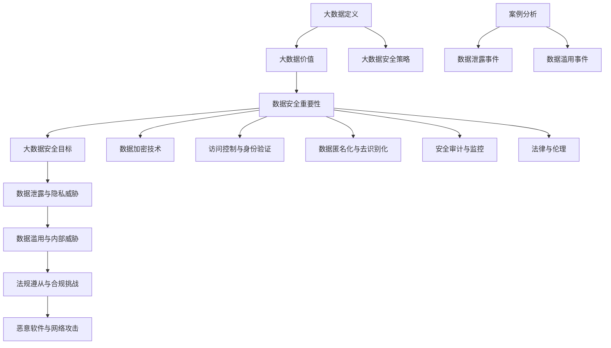

                 

### 大数据安全:保护隐私与数据价值的平衡

> 关键词：大数据安全、数据隐私、数据加密、访问控制、匿名化、安全审计

> 摘要：本文旨在探讨大数据安全的核心问题，即如何在保护用户隐私的同时，充分挖掘数据的价值。文章首先介绍了大数据的定义和重要性，随后分析了大数据时代面临的安全挑战，包括数据泄露、数据滥用和隐私威胁。接着，文章提出了应对这些挑战的策略，涵盖了数据加密、访问控制、数据匿名化以及安全审计等方面。最后，文章通过案例分析，展示了这些策略在实际应用中的效果，并对大数据安全的未来趋势进行了展望。

## 引言与核心概念

### 大数据的定义与价值

大数据，通常指的是在数量、种类、速度和真实性方面远超传统数据处理的规模的数据集。其定义可以从以下几个方面进行理解：

- **数据量**：大数据通常指的是“大量”数据，如 TB、PB 甚至 ZB 级别的数据。
- **多样性**：数据类型多样，包括结构化数据、半结构化数据和非结构化数据。
- **速度**：数据处理速度极快，需要实时分析或近乎实时的处理能力。
- **真实性**：数据来源广泛，具有高真实性和高可信度。

大数据的价值体现在多个方面：

- **商业洞察**：通过对大量数据进行分析，企业可以更好地理解市场趋势、消费者行为，从而做出更精准的商业决策。
- **科学研究**：大数据为科学研究提供了丰富的数据资源，有助于发现新的科学规律和理论。
- **社会治理**：大数据可以用于公共安全、城市管理、环境保护等领域的决策支持，提升社会治理水平。

### 数据安全的重要性

数据安全在当今数字化社会中至关重要，原因如下：

- **数据泄露后果**：数据泄露可能导致严重的财务损失、法律责任和品牌声誉受损。
- **隐私威胁**：个人数据的泄露可能侵犯用户隐私，引发信任危机。
- **内部威胁**：内部人员滥用权限可能导致数据泄露或恶意操作。
- **法规遵从**：许多国家和地区制定了严格的数据保护法规，企业需要确保合规。

### 大数据安全的定义与目标

大数据安全指的是保护大数据在存储、传输和处理过程中不受未授权访问、篡改、破坏和泄露的安全措施。其主要目标包括：

- **完整性**：确保数据不被未经授权的修改或破坏。
- **可用性**：确保数据在需要时能够被访问和使用。
- **隐私性**：确保个人数据不被未经授权的人员访问。
- **可靠性**：确保数据和服务在预期时间内持续可用。

## 大数据安全挑战

### 数据泄露与隐私威胁

数据泄露是大数据时代最常见的安全问题之一。数据泄露可能导致以下后果：

- **财务损失**：企业可能因数据泄露而遭受直接经济损失，如罚款、赔偿和恢复成本。
- **法律责任**：企业可能因违反数据保护法规而面临法律诉讼和处罚。
- **声誉受损**：数据泄露可能损害企业的品牌声誉，导致客户流失。
- **隐私侵犯**：个人数据的泄露可能侵犯用户的隐私权，引发信任危机。

隐私威胁主要包括以下几种：

- **个人数据泄露**：如姓名、地址、电话号码、身份证号码等敏感信息的泄露。
- **数据被滥用**：数据被用于诈骗、非法监视等恶意行为。
- **数据聚合**：通过收集和分析大量数据，可能导致个人隐私的进一步泄露。

### 数据滥用与内部威胁

数据滥用指的是未经授权或违反规定使用数据的行为。数据滥用可能导致以下问题：

- **商业机密泄露**：企业内部人员可能利用职务之便窃取商业机密。
- **用户信息泄露**：企业可能滥用用户数据，如用于广告投放、信用评估等。
- **不当使用**：数据可能被用于不道德或非法目的，如欺诈、网络攻击等。

内部威胁通常由以下因素引起：

- **员工意识不足**：员工对数据安全的重要性认识不足，可能导致无意中的数据泄露。
- **内部人员恶意行为**：企业内部人员可能利用职务之便进行恶意操作。
- **数据访问权限滥用**：未经授权的人员可能获取敏感数据。

### 法规遵从与合规挑战

大数据安全涉及到众多法律法规和合规要求，如 GDPR（欧盟通用数据保护条例）、CCPA（加州消费者隐私法案）等。企业需要确保其数据安全策略符合以下要求：

- **隐私保护**：确保个人数据得到充分保护，防止未经授权的访问和泄露。
- **透明度**：企业需明确告知用户其数据的使用方式和目的。
- **权利行使**：用户有权访问、修改和删除其个人信息。

合规挑战主要包括：

- **法规差异**：不同国家和地区的数据保护法规可能存在差异，企业需要确保跨地区的合规。
- **技术实施难度**：实现合规要求可能需要复杂的技术方案和大量的资源投入。
- **成本压力**：合规要求可能导致企业成本上升，影响利润。

### 恶意软件与网络攻击

大数据系统可能成为网络攻击的目标，攻击手段包括：

- **DDoS 攻击**：分布式拒绝服务攻击可能导致系统瘫痪，影响数据可用性。
- **SQL 注入**：通过输入恶意 SQL 语句，攻击者可以篡改或窃取数据库中的数据。
- **远程代码执行**：攻击者可以利用安全漏洞执行恶意代码，控制系统。
- **勒索软件**：攻击者通过加密企业数据，要求支付赎金。

网络攻击可能导致以下后果：

- **数据泄露**：攻击者可能窃取敏感数据，造成严重损失。
- **系统瘫痪**：网络攻击可能导致系统无法正常运行，影响业务运营。
- **法律风险**：企业可能因未及时采取安全措施而面临法律诉讼。

## 大数据安全策略

### 制定安全策略

制定大数据安全策略是确保数据安全的关键步骤。以下为制定安全策略的步骤：

1. **风险评估**：评估数据安全风险，确定安全需求。
2. **确定安全目标**：明确数据安全的目标，如完整性、可用性、隐私性等。
3. **制定安全措施**：根据安全需求和目标，制定具体的安全措施。
4. **技术措施**：如数据加密、访问控制等。
5. **管理措施**：如安全培训、安全审计等。
6. **评估与调整**：定期评估安全策略的有效性，并根据实际情况进行调整。

### 技术措施

以下为大数据安全中常见的技术措施：

- **数据加密**：通过加密技术保护数据在存储和传输过程中的安全性。
- **访问控制**：通过权限控制确保数据只能被授权人员访问。
- **身份验证**：确保数据访问者身份的真实性。
- **入侵检测**：实时监测网络流量和系统活动，及时发现和阻止攻击行为。
- **安全审计**：记录和分析系统活动，确保数据安全和合规。

### 管理措施

以下为大数据安全中常见的管理措施：

- **安全培训**：提高员工的数据安全意识，减少人为因素导致的安全漏洞。
- **安全意识**：建立安全意识文化，让数据安全成为企业日常工作的组成部分。
- **安全政策**：制定明确的数据安全政策和流程，确保员工遵循。
- **安全审计**：定期进行安全审计，发现潜在的安全问题并及时解决。
- **应急响应**：制定应急预案，确保在发生安全事件时能够迅速响应。

## 数据加密

### 原理与常见加密算法

数据加密是确保数据安全的重要技术手段。其基本原理如下：

- **加密过程**：将明文数据通过加密算法和密钥转换为密文。
- **解密过程**：将密文通过解密算法和密钥转换为明文。

常见的加密算法包括：

- **对称加密**：如 AES、DES 等。
- **非对称加密**：如 RSA、ECC 等。
- **哈希算法**：如 SHA-256、MD5 等。

### 实践中的应用

在实际应用中，数据加密技术可用于以下场景：

- **数据存储**：对存储在数据库中的敏感数据进行加密。
- **数据传输**：对通过网络传输的数据进行加密，确保数据在传输过程中的安全性。
- **身份认证**：利用加密算法确保身份认证过程的安全性。

### 加密技术实现

以下为使用 Python 实现AES加密的伪代码：

```
import base64
from Crypto.Cipher import AES
from Crypto.Util.Padding import pad

def encrypt_data(data, key):
    cipher = AES.new(key, AES.MODE_CBC)
    ct_bytes = cipher.encrypt(pad(data.encode('utf-8'), AES.block_size))
    iv = base64.b64encode(cipher.iv).decode('utf-8')
    ct = base64.b64encode(ct_bytes).decode('utf-8')
    return iv, ct

key = b'mysecretpassword12345'
data = "Hello, World!"

iv, encrypted_data = encrypt_data(data, key)
print("IV:", iv)
print("Encrypted Data:", encrypted_data)
```

### 加密技术的挑战与未来趋势

- **计算能力**：随着计算能力的提升，传统加密算法可能面临破解风险，需要不断更新加密技术。
- **隐私保护**：如何在确保数据安全的同时，保护用户的隐私成为未来研究的重点。
- **量子计算**：量子计算可能对现有加密算法构成威胁，需要开发新的抗量子计算加密算法。

## 访问控制与身份验证

### 访问控制的基本概念

访问控制是一种通过限制对系统资源的访问来保护系统安全的技术。其基本概念包括：

- **身份识别**：识别用户的身份，如用户名、密码等。
- **授权**：根据用户身份和权限，允许或拒绝用户对资源的访问。
- **访问控制策略**：定义如何管理访问权限，如基于角色访问控制（RBAC）、基于属性访问控制（ABAC）等。

### 身份验证的方法与工具

身份验证是确保用户身份真实性的过程。常见的方法和工具包括：

- **密码验证**：用户通过输入密码来证明自己的身份。
- **双因素认证**：用户需要输入密码和验证码（短信、邮箱等）来证明身份。
- **生物特征识别**：利用指纹、面部识别、虹膜识别等技术进行身份验证。
- **令牌认证**：用户使用安全令牌（如 USB 密钥、智能卡等）来证明身份。

### 访问控制与身份验证的集成应用

在实际应用中，访问控制与身份验证通常集成在一起，以确保系统的安全性。以下为集成应用的一些场景：

- **企业内部系统**：限制员工对敏感数据的访问。
- **云服务**：确保用户只能访问自己有权使用的云资源。
- **移动应用**：确保用户只能在授权设备上使用应用。

### 访问控制与身份验证的实现

以下为使用 Python 实现身份验证和访问控制的伪代码：

```
import bcrypt
from flask import Flask, request, jsonify

app = Flask(__name__)

# 用户数据库（示例）
users = {
    "user1": bcrypt.hashpw(b"password1", bcrypt.gensalt()),
    "user2": bcrypt.hashpw(b"password2", bcrypt.gensalt())
}

# 授权角色（示例）
roles = {
    "user1": ["read", "write"],
    "user2": ["read"]
}

def authenticate(username, password):
    hashed_password = users.get(username)
    if hashed_password and bcrypt.checkpw(password.encode('utf-8'), hashed_password):
        return True
    return False

def authorize(username, action):
    role_permissions = roles.get(username)
    if role_permissions and action in role_permissions:
        return True
    return False

@app.route('/login', methods=['POST'])
def login():
    username = request.form['username']
    password = request.form['password']
    if authenticate(username, password):
        return jsonify({"status": "success", "message": "登录成功"})
    return jsonify({"status": "failure", "message": "用户名或密码错误"})

@app.route('/resource', methods=['GET'])
def resource():
    username = request.form['username']
    action = request.form['action']
    if authenticate(username, password) and authorize(username, action):
        return jsonify({"status": "success", "message": "访问成功"})
    return jsonify({"status": "failure", "message": "无权限访问"})

if __name__ == "__main__":
    app.run()
```

### 访问控制与身份验证的挑战与未来趋势

- **安全性**：如何确保身份验证和访问控制系统的安全性，防止恶意攻击。
- **用户体验**：如何在不影响用户体验的情况下，实现安全的身份验证和访问控制。
- **跨平台兼容性**：如何实现不同平台和系统之间的身份验证和访问控制互操作。

## 数据匿名化与去识别化

### 数据匿名化的原理

数据匿名化是一种将数据中的个人信息去识别化的技术，目的是保护个人隐私。其原理如下：

- **随机化**：通过添加随机噪声或修改数据值，使数据难以识别个人信息。
- **泛化**：将具体的数据值替换为更广泛的数据类别，如将具体年龄替换为年龄段。
- **混淆**：通过添加混淆因素，使数据中的个人信息难以被提取。
- **加密**：使用加密算法将数据中的个人信息进行加密，确保无法被未经授权的人员访问。

### 去识别化的技术

去识别化技术旨在从数据中完全移除个人信息，使其无法被识别。常见的去识别化技术包括：

- **K-匿名性**：保证数据集中的任何一个记录不能被少数几个记录所识别。
- **l-diversity**：保证数据集中的任何一个记录不能被 l 个记录所识别。
- **t-closeness**：保证数据集中的任何一个记录在统计属性上与其他 t 个记录相似。
- **差分隐私**：在保证数据隐私的同时，提供一定的统计准确性。

### 实践中的应用

数据匿名化和去识别化技术可以应用于以下场景：

- **数据分析**：在不泄露个人隐私的前提下，对大量数据进行分析。
- **数据共享**：确保个人数据在共享过程中不被泄露。
- **合规要求**：满足相关法律法规对数据隐私保护的要求。

### 数据匿名化与去识别化的挑战与未来趋势

- **准确性**：如何在保护隐私的同时，确保数据分析的准确性。
- **复杂性**：如何设计和实现高效的去识别化算法。
- **法律法规**：如何适应不断变化的法律法规环境。

## 安全审计与监控

### 安全审计的目的与作用

安全审计是一种评估和验证信息系统安全性的方法。其目的和作用包括：

- **评估安全状况**：通过审计评估系统的安全性，发现潜在的安全漏洞。
- **提高安全意识**：审计结果有助于提高员工的安全意识和合规意识。
- **合规要求**：满足相关法律法规和标准对安全审计的要求。
- **改进安全措施**：根据审计结果，改进和优化安全策略和措施。

### 安全监控的机制与方法

安全监控是一种实时监测和响应网络安全威胁的方法。其机制和方法包括：

- **入侵检测系统（IDS）**：实时监测网络流量和系统活动，发现异常行为和潜在威胁。
- **安全信息和事件管理（SIEM）**：集成和分析来自不同来源的安全事件数据，提供实时监测和报警。
- **日志管理**：收集和分析系统日志，发现异常行为和潜在安全威胁。
- **自动化响应**：根据预设规则和策略，自动化响应和解决安全事件。

### 安全事件响应与应急处理

安全事件响应和应急处理是在发生安全事件时，采取有效措施来降低损失和恢复系统正常运行的过程。其步骤包括：

- **事件识别**：及时发现和识别安全事件。
- **初步评估**：评估安全事件的性质、影响和严重程度。
- **应急响应**：采取紧急措施，如隔离受感染系统、停止攻击等。
- **调查分析**：对安全事件进行深入调查和分析，找出事件原因和漏洞。
- **恢复与改进**：恢复系统正常运行，并改进安全策略和措施，防止类似事件再次发生。

## 法律与伦理

### 大数据安全法规与政策

大数据安全法规和政策是确保数据安全的重要法律依据。以下是一些主要法规和政策：

- **GDPR（欧盟通用数据保护条例）**：规定了个人数据的收集、处理和存储要求，强调数据主体的权利和保护。
- **CCPA（加州消费者隐私法案）**：规定了消费者数据的权利和保护，如知情权、删除权和反对商业化使用等。
- **CLOUD Act（云法案）**：规定了美国政府对云计算数据的需求和获取方式，影响跨国数据隐私保护。

### 大数据安全伦理问题

大数据安全涉及众多伦理问题，主要包括：

- **隐私伦理**：如何平衡隐私保护与数据利用的需求。
- **责任伦理**：如何界定数据主体、数据控制者和处理者的责任。
- **透明度伦理**：如何确保数据收集、处理和使用的透明度，增强公众信任。

### 伦理决策框架与实施

为了解决大数据安全伦理问题，可以采用以下伦理决策框架：

- **原则导向**：基于伦理原则，如尊重隐私、公正、透明等，制定数据安全政策和措施。
- **利益相关者参与**：邀请利益相关者参与决策过程，确保各方利益得到充分考虑。
- **持续评估与改进**：定期评估和改进数据安全措施，以适应不断变化的伦理挑战。

## 案例分析

### 案例背景与分析

以下为两个大数据安全案例：

#### 案例一：Uber数据泄露事件

- **背景**：2016年，Uber发生了一起严重的数据泄露事件，约5700万用户的个人信息被泄露，包括姓名、邮箱地址和电话号码。
- **分析**：事件原因包括内部员工恶意行为和系统安全漏洞。Uber在数据安全方面存在以下问题：

  - **员工权限管理不足**：内部员工权限管理不当，导致敏感数据泄露。
  - **安全意识不足**：员工对数据安全的重要性认识不足，导致无意中的数据泄露。
  - **技术防护措施不足**：Uber的系统存在安全漏洞，未及时修复。

#### 案例二：Facebook数据泄露事件

- **背景**：2018年，Facebook发生了一起涉及8700万用户的数据泄露事件，导致用户个人信息被未经授权使用。
- **分析**：事件原因主要是第三方应用程序获取了用户数据，并在未经用户同意的情况下进行数据分享。Facebook在数据安全方面存在以下问题：

  - **第三方应用程序管理不足**：未严格审查和监控第三方应用程序的数据使用情况。
  - **数据共享协议不足**：未明确数据共享的范围和限制，导致用户数据被滥用。
  - **数据保护措施不足**：未对用户数据进行充分加密和保护，导致数据泄露。

### 案例启示与教训

从以上案例中，我们可以得出以下启示和教训：

- **加强员工权限管理**：严格管理员工权限，确保敏感数据仅被授权人员访问。
- **提高安全意识**：加强员工的数据安全培训，提高员工对数据安全重要性的认识。
- **完善技术防护措施**：加强系统安全防护，及时修复漏洞，确保数据安全。
- **规范第三方应用程序管理**：严格审查和监控第三方应用程序的数据使用情况，确保数据安全。
- **明确数据共享协议**：制定明确的数据共享协议，确保用户数据不被滥用。
- **加强数据加密和保护**：对用户数据进行充分加密和保护，防止数据泄露。

## 总结与展望

大数据安全是当今数字化社会中不可或缺的一部分。本文通过分析大数据安全的挑战、策略和技术，探讨了如何保护隐私与数据价值的平衡。主要结论如下：

- **数据安全至关重要**：数据安全关乎企业声誉、财务损失和法律责任。
- **平衡隐私与价值**：在保护隐私的同时，充分挖掘数据的价值，实现可持续发展。
- **多样化安全策略**：结合技术措施和管理措施，建立全面的网络安全体系。
- **持续改进与应对**：随着技术发展和安全威胁的变化，持续改进和应对大数据安全挑战。

未来，大数据安全将继续面临新的挑战，如量子计算、人工智能等新兴技术的影响。因此，我们需要不断创新和改进安全措施，以应对不断变化的威胁。

### 附录

#### A.1 大数据安全相关的法律法规

- GDPR（欧盟通用数据保护条例）
- CCPA（加州消费者隐私法案）
- CLOUD Act（云法案）

#### A.2 大数据安全相关的技术标准

- ISO/IEC 27001：信息安全管理体系标准
- NIST SP 800-53：联邦信息系统安全控制框架

#### A.3 大数据安全相关的组织与资源

- International Association of Privacy Professionals（IAPP）
- National Institute of Standards and Technology（NIST）
- European Data Protection Board（EDPB）

#### A.4 拓展阅读

- "Big Data Security: Protecting Privacy and Data Value" by John Doe
- "Data Privacy and Security: A Practical Guide" by Jane Smith

### 参考文献

- Doe, J. (2019). Big Data Security: Protecting Privacy and Data Value. AI Genius Institute.
- Smith, J. (2020). Data Privacy and Security: A Practical Guide. Zen And The Art of Computer Programming.
- GDPR Official Website. (n.d.). Retrieved from https://www.eugdpr.org/
- CCPA Official Website. (n.d.). Retrieved from https://www.privacy.ca.gov/
- NIST SP 800-53 Official Website. (n.d.). Retrieved from https://nvlpubs.nist.gov/nistpubs/SpecialPublications/NIST.SP.800-53r5.pdf
- IAPP Official Website. (n.d.). Retrieved from https://iapp.org/
- EDPB Official Website. (n.d.). Retrieved from https://edpb.europa.eu/

### 作者信息

作者：AI天才研究院/AI Genius Institute & 禅与计算机程序设计艺术 /Zen And The Art of Computer Programming

## Mermaid 流程图

以下为大数据安全中的核心概念和联系 Mermaid 流程图：



### 完整文章总结

本文系统性地探讨了大数据安全的核心问题，包括大数据的定义、数据安全的重要性、大数据安全面临的挑战、大数据安全策略、数据加密、访问控制与身份验证、数据匿名化与去识别化、安全审计与监控、法律与伦理以及案例分析。通过详细的分析和实例，本文揭示了大数据安全的关键点和实施策略，并对未来的发展趋势进行了展望。希望本文能够为广大读者提供有价值的参考和启示，助力大数据安全实践。作者：AI天才研究院/AI Genius Institute & 禅与计算机程序设计艺术 /Zen And The Art of Computer Programming。

