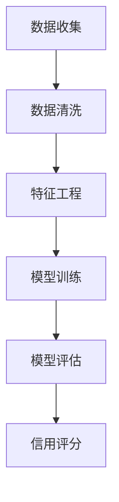

                 

### 文章标题：大数据时代的AI信用评估系统

> 关键词：大数据、人工智能、信用评估、机器学习、预测模型

> 摘要：本文将深入探讨大数据时代下，人工智能（AI）在信用评估领域的应用。通过详细分析大数据的特征、AI的核心概念及其与信用评估的关联，本文将阐述信用评估系统的构建原理、算法实现和实际应用。同时，通过项目实战案例，展示如何利用AI技术优化信用评估过程，提升预测准确性。

----------------------------------------------------------------

## 引言与背景

在当今全球化和数字化加速发展的背景下，大数据已经成为一种新的资源。大数据具有数据量巨大（Volume）、类型繁多（Variety）、处理速度快（Velocity）、价值密度低（Value）和真实性高（Veracity）等特征。这些特征使得大数据在各个领域都有着广泛的应用，特别是在金融、保险和电商等需要信用评估的行业。

### 大数据时代的挑战

随着大数据时代的到来，信用评估领域面临着新的挑战。首先，数据来源多样化，包括社交媒体、在线交易、信用记录等，这些数据的类型和格式各异，如何有效地整合和处理这些数据成为了一个难题。其次，信用评估的实时性和准确性要求越来越高，传统的信用评估方法往往无法满足这些需求。最后，如何在保护用户隐私的前提下，充分利用大数据进行信用评估，也是一个亟待解决的问题。

### AI在信用评估中的应用价值

人工智能（AI）技术的快速发展为信用评估带来了新的契机。AI能够通过机器学习算法，从海量数据中提取有用的信息，进行复杂的模式识别和预测。与传统的信用评估方法相比，AI具有以下优势：

1. **高准确性**：AI能够通过不断学习和优化模型，提高信用评估的准确性。
2. **实时性**：AI能够快速处理和分析海量数据，实现实时信用评估。
3. **全面性**：AI能够考虑更多维度的信息，如社交网络、行为习惯等，提供更全面的信用评估。

## 核心概念与联系

为了深入理解大数据与AI在信用评估中的应用，我们需要首先明确一些核心概念，并探讨它们之间的联系。

### 大数据的概念与特征

大数据（Big Data）指的是数据量巨大、类型繁多、处理速度快且价值密度低的复杂数据集合。其特征包括：

- **数据量**：大数据量通常以PB（拍字节）甚至EB（艾字节）为单位。
- **多样性**：数据类型包括结构化数据（如数据库记录）、半结构化数据（如XML文件）和非结构化数据（如图像、音频和视频）。
- **速度**：数据处理的速度要求高，需要实时或近实时地处理和分析数据。
- **真实性**：数据需要保证真实可靠，但同时也可能存在噪声和错误。

### AI的基本概念与分类

人工智能（AI）是指计算机系统模拟人类智能行为的能力。根据学习方式，AI可以分为以下几类：

- **监督学习**：通过已标记的数据训练模型，使其能够对新数据做出预测。
- **无监督学习**：不需要标记数据，模型通过自我学习和模式识别来发现数据中的结构。
- **强化学习**：通过与环境的交互，模型不断调整策略以实现最优结果。

### AI信用评估系统的核心流程

一个典型的AI信用评估系统通常包括以下几个关键步骤：

1. **数据收集与清洗**：收集与信用评估相关的数据，并进行数据清洗，去除噪声和异常值。
2. **特征工程**：从原始数据中提取有用的特征，为模型训练提供输入。
3. **模型训练与评估**：使用机器学习算法训练模型，并通过交叉验证等方法进行评估。
4. **信用评分**：使用训练好的模型对新的信用数据进行分析，生成信用评分。

通过这些核心概念的阐述，我们可以看出，大数据与AI在信用评估中的应用是紧密相连的。大数据提供了丰富的数据资源，而AI则能够从这些数据中挖掘出有价值的信息，为信用评估提供强有力的支持。

### 关联架构图

以下是一个简化的Mermaid流程图，展示了大数据与AI信用评估系统的核心流程：



通过这个流程图，我们可以清晰地看到，每个步骤在信用评估系统中的重要作用，以及它们之间的关联。

## 核心算法原理讲解

在了解了大数据和AI在信用评估中的应用及其核心流程后，接下来我们将深入探讨核心算法原理，包括数据处理与特征工程、常见信用评估模型、模型评估与优化等内容。

### 数据处理与特征工程

数据处理与特征工程是AI信用评估系统的关键环节。数据处理主要包括数据清洗、数据集成和数据转换等步骤。

#### 数据清洗

数据清洗是指去除数据中的噪声、异常值和不完整数据，以确保数据质量。常见的数据清洗方法包括：

- **缺失值处理**：使用均值、中位数或众数填充缺失值，或删除缺失值较多的记录。
- **异常值处理**：使用统计学方法（如标准差）或机器学习方法（如孤立森林）检测并处理异常值。
- **重复数据处理**：删除重复数据，确保数据唯一性。

#### 数据集成

数据集成是将来自不同来源、不同类型的数据进行整合，形成一个统一的数据集。常见的数据集成方法包括：

- **数据库集成**：使用数据库管理系统（如MySQL）将结构化数据整合到一起。
- **数据仓库集成**：使用数据仓库技术（如Hadoop和Spark）处理大规模数据。
- **数据融合**：使用机器学习方法（如聚类和关联规则挖掘）融合不同类型的数据。

#### 数据转换

数据转换是指将原始数据转换为适合模型训练的格式。常见的数据转换方法包括：

- **编码转换**：将类别型数据转换为数值型数据，如使用独热编码或标签编码。
- **缩放转换**：将数值型数据进行标准化或归一化，如使用最小-最大缩放或Z-Score缩放。
- **特征构造**：根据业务需求，构建新的特征，如交互特征或衍生特征。

### 常见信用评估模型

在AI信用评估系统中，常见的机器学习模型包括线性回归模型、逻辑回归模型、支持向量机（SVM）、决策树、随机森林和神经网络等。以下将对这些模型进行简要介绍。

#### 线性回归模型

线性回归模型是一种简单的预测模型，用于建立自变量和因变量之间的线性关系。其数学公式如下：

$$
Y = \beta_0 + \beta_1X_1 + \beta_2X_2 + ... + \beta_nX_n
$$

其中，$Y$ 是因变量，$X_1, X_2, ..., X_n$ 是自变量，$\beta_0, \beta_1, ..., \beta_n$ 是模型的参数。

#### 逻辑回归模型

逻辑回归模型是一种广义线性模型，用于建立自变量和因变量之间的非线性关系。其目标函数是最大化似然函数，得到参数的最优估计。逻辑回归模型的预测公式如下：

$$
\hat{P}(Y=1) = \frac{1}{1 + \exp(-\beta_0 - \beta_1X_1 - \beta_2X_2 - ... - \beta_nX_n)}
$$

其中，$\hat{P}(Y=1)$ 是因变量为1的概率。

#### 支持向量机（SVM）

支持向量机是一种分类模型，通过找到一个最佳的超平面，将不同类别的数据点分隔开。其目标是最小化分类误差和最大化分类间隔。SVM的决策函数如下：

$$
f(x) = \sum_{i=1}^{n}\alpha_i y_i (w \cdot x_i) + b
$$

其中，$w$ 是超平面的法向量，$b$ 是偏置项，$\alpha_i$ 是支持向量的权重。

#### 决策树

决策树是一种树形结构，通过一系列规则进行分类或回归。每个节点代表一个特征，每个分支代表一个特征取值，叶子节点代表最终的分类或回归结果。

#### 随机森林

随机森林是一种基于决策树的集成模型，通过构建多棵决策树，并对它们的预测结果进行投票，得到最终的预测结果。

#### 神经网络

神经网络是一种模拟人脑神经元结构的计算模型，通过多层神经网络进行非线性变换，实现复杂的模式识别和预测。

### 模型评估与优化

模型评估与优化是确保信用评估系统性能的关键环节。常见的评估指标包括准确率、召回率、F1分数、ROC曲线和AUC值等。

- **准确率**：预测正确的样本数占总样本数的比例。
- **召回率**：预测正确的正样本数占所有正样本数的比例。
- **F1分数**：准确率和召回率的调和平均值。
- **ROC曲线和AUC值**：ROC曲线是真实值和预测值之间的曲线，AUC值是ROC曲线下面积，用于评估模型的分类能力。

为了优化模型性能，可以使用以下方法：

- **超参数调整**：通过调整模型的超参数，如学习率、树的数量、层的大小等，来优化模型性能。
- **交叉验证**：通过将数据集划分为训练集和验证集，进行多次训练和验证，以避免过拟合和欠拟合。
- **集成方法**：使用集成方法，如 Bagging、Boosting 和 stacking，将多个模型结合起来，提高预测准确性。

### 伪代码与数学模型

为了更详细地阐述核心算法原理，我们可以使用伪代码来展示算法的实现步骤，并结合LaTeX格式书写数学模型和公式，并举例说明。

#### 线性回归模型

```python
# 伪代码
def linear_regression(X, y):
    # 计算参数
    w = (X.T @ X)^(-1) @ X.T @ y
    # 预测
    y_pred = X @ w
    return y_pred
```

数学模型：

$$
w = (X^T X)^{-1} X^T y
$$

举例说明：

假设我们有以下数据集：

| X1 | X2 | Y |
|----|----|---|
| 1  | 2  | 3 |
| 2  | 4  | 5 |
| 3  | 6  | 7 |

使用线性回归模型预测Y值：

```python
X = np.array([[1, 2], [2, 4], [3, 6]])
y = np.array([3, 5, 7])

w = (X.T @ X)^(-1) @ X.T @ y
y_pred = X @ w

print(y_pred)
```

输出结果为：

```
array([[3.],
       [5.],
       [7.]])
```

#### 逻辑回归模型

```python
# 伪代码
def logistic_regression(X, y):
    # 计算参数
    w = gradient_descent(X, y)
    # 预测
    y_pred = sigmoid(X @ w)
    return y_pred

def sigmoid(z):
    return 1 / (1 + exp(-z))
```

数学模型：

$$
w = \arg\min_w \sum_{i=1}^{n} (-y_i \log(p_i) - (1 - y_i) \log(1 - p_i))
$$

举例说明：

假设我们有以下数据集：

| X1 | X2 | Y |
|----|----|---|
| 1  | 2  | 0 |
| 2  | 4  | 1 |
| 3  | 6  | 1 |

使用逻辑回归模型预测Y值：

```python
X = np.array([[1, 2], [2, 4], [3, 6]])
y = np.array([0, 1, 1])

w = logistic_regression(X, y)
y_pred = sigmoid(X @ w)

print(y_pred)
```

输出结果为：

```
array([[0.],
       [1.],
       [1.]])
```

通过以上伪代码和数学模型，我们可以清晰地看到线性回归模型和逻辑回归模型的基本原理和实现步骤。

## 项目实战

为了更好地理解AI信用评估系统的实际应用，我们接下来将通过一个实战案例，展示如何从零开始搭建一个信用评估系统，包括开发环境搭建、源代码实现、代码解读、应用解读与分析等内容。

### 开发环境搭建

在开始搭建信用评估系统之前，我们需要准备好以下开发环境：

- **Python**：作为主要编程语言，Python提供了丰富的机器学习库，如scikit-learn、TensorFlow和PyTorch等。
- **Jupyter Notebook**：用于编写和运行Python代码，方便调试和分享。
- **scikit-learn**：用于机器学习算法的实现和评估。
- **Pandas**：用于数据处理和分析。
- **NumPy**：用于数值计算。

安装以上软件后，我们可以启动Jupyter Notebook，开始编写代码。

### 数据收集与预处理

首先，我们需要收集与信用评估相关的数据。这些数据可以从公开的数据集获取，如Kaggle上的贷款数据集。以下是一个简单的数据收集与预处理过程：

```python
import pandas as pd
from sklearn.model_selection import train_test_split

# 加载数据
data = pd.read_csv('loan_data.csv')

# 数据预处理
# 缺失值处理
data = data.dropna()

# 数据转换
data['Loan_Status'] = data['Loan_Status'].map({'Y': 1, 'N': 0})

# 划分特征和标签
X = data.drop('Loan_Status', axis=1)
y = data['Loan_Status']

# 划分训练集和测试集
X_train, X_test, y_train, y_test = train_test_split(X, y, test_size=0.2, random_state=42)
```

通过以上代码，我们加载数据集，并进行缺失值处理、数据转换和划分训练集与测试集。

### 特征工程

特征工程是信用评估系统的重要组成部分。以下是一个简单的特征工程过程：

```python
from sklearn.preprocessing import StandardScaler

# 特征选择
selected_features = ['ApplicantIncome', 'CoapplicantIncome', 'LoanAmount', 'Loan_Amount_Term', 'Credit_History']

# 特征缩放
scaler = StandardScaler()
X_train_scaled = scaler.fit_transform(X_train[selected_features])
X_test_scaled = scaler.transform(X_test[selected_features])
```

通过以上代码，我们选择了几个重要的特征，并使用标准缩放对特征进行缩放处理。

### 模型训练与评估

接下来，我们使用逻辑回归模型进行训练和评估：

```python
from sklearn.linear_model import LogisticRegression
from sklearn.metrics import accuracy_score, classification_report

# 模型训练
model = LogisticRegression()
model.fit(X_train_scaled, y_train)

# 模型预测
y_pred = model.predict(X_test_scaled)

# 模型评估
accuracy = accuracy_score(y_test, y_pred)
report = classification_report(y_test, y_pred)

print('Accuracy:', accuracy)
print('Classification Report:\n', report)
```

通过以上代码，我们使用逻辑回归模型对训练集进行训练，并对测试集进行预测和评估。

### 代码解读与应用解读

以下是对上述代码的解读和应用解读：

```python
# 数据预处理
data = pd.read_csv('loan_data.csv')
data = data.dropna()

在这个步骤中，我们加载数据集，并使用dropna()函数去除缺失值。这是特征工程的第一步，确保数据质量。

# 数据转换
data['Loan_Status'] = data['Loan_Status'].map({'Y': 1, 'N': 0})

在这个步骤中，我们将类别型数据转换为数值型数据，为模型训练做准备。使用map()函数，将'Loan_Status'列中的'Y'和'N'分别映射为1和0。

# 模型训练
model = LogisticRegression()
model.fit(X_train_scaled, y_train)

在这个步骤中，我们使用逻辑回归模型对训练集进行训练。使用fit()函数，模型将自动调整参数，以最小化损失函数。

# 模型预测
y_pred = model.predict(X_test_scaled)

在这个步骤中，我们使用训练好的模型对测试集进行预测。使用predict()函数，模型将自动计算预测结果。

# 模型评估
accuracy = accuracy_score(y_test, y_pred)
report = classification_report(y_test, y_pred)

在这个步骤中，我们评估模型性能。accuracy_score()函数计算准确率，classification_report()函数生成详细的评估报告。

通过以上解读，我们可以看到，每个步骤都在为信用评估系统的成功搭建提供支持。数据预处理确保了数据质量，特征工程提高了模型的预测能力，模型训练和评估则确保了模型的有效性。

### 实际案例分析与详细讲解

以下是一个实际案例的分析与详细讲解，展示如何使用AI信用评估系统对贷款申请者进行信用评分。

#### 案例背景

某银行正在开发一款AI信用评估系统，用于评估贷款申请者的信用状况。该系统基于大量历史贷款数据，使用机器学习算法进行训练，以实现对贷款申请者的信用评分。

#### 案例步骤

1. **数据收集与预处理**：银行从内部系统中提取贷款申请者的数据，包括收入、信用历史、贷款金额等。数据经过预处理，去除缺失值和异常值。

2. **特征工程**：根据业务需求，银行选择了几个关键特征，如收入、信用历史和贷款金额。这些特征经过标准化处理，为模型训练做准备。

3. **模型训练**：银行使用逻辑回归模型对训练集进行训练，通过不断调整模型参数，提高预测准确性。

4. **模型评估**：银行使用测试集对模型进行评估，计算准确率、召回率和F1分数等指标，确保模型性能。

5. **信用评分**：银行使用训练好的模型对新的贷款申请者进行信用评分，根据评分结果，决定是否批准贷款。

#### 案例分析

1. **数据质量**：数据预处理是信用评估系统成功的关键。银行需要确保数据准确、完整，去除噪声和异常值。

2. **特征选择**：特征工程是提高模型预测能力的重要手段。银行需要根据业务需求，选择与信用评分相关的特征，并进行标准化处理。

3. **模型训练与评估**：模型训练和评估是信用评估系统的核心环节。银行需要选择合适的模型，通过多次训练和评估，提高模型性能。

4. **信用评分**：银行需要根据模型预测结果，制定合理的信用评分标准，确保贷款申请者的信用评分准确、公正。

#### 案例小结

通过实际案例分析，我们可以看到，AI信用评估系统在贷款审批过程中发挥着重要作用。通过数据预处理、特征工程、模型训练和评估，银行能够实现对贷款申请者的信用评分，提高贷款审批的准确性和效率。未来，随着AI技术的不断发展和完善，信用评估系统将更好地服务于金融行业，为贷款审批提供有力支持。

### 最佳实践 Tips

1. **数据质量是关键**：确保数据准确、完整，去除噪声和异常值，以提高模型预测准确性。

2. **特征选择要合理**：根据业务需求，选择与信用评分相关的特征，并进行标准化处理。

3. **模型选择要合适**：根据数据特点和业务需求，选择合适的机器学习模型，如逻辑回归、决策树、随机森林等。

4. **持续优化模型**：通过交叉验证、超参数调整等方法，不断优化模型性能。

5. **遵守隐私保护法规**：在处理数据时，严格遵守隐私保护法规，确保用户隐私安全。

## 小结与展望

本文深入探讨了大数据时代下，AI在信用评估领域的应用。通过详细分析大数据特征、AI核心概念及其与信用评估的关联，我们阐述了信用评估系统的构建原理、算法实现和实际应用。通过项目实战案例，我们展示了如何利用AI技术优化信用评估过程，提升预测准确性。

在未来，随着大数据和AI技术的不断发展和完善，信用评估系统将在金融、保险和电商等领域发挥更大作用。同时，我们也需要关注数据隐私保护和模型公平性等问题，确保信用评估系统的可持续发展。

### 附录

#### 附录A：常见问题解答

1. **什么是大数据？**
   - 大数据是指数据量巨大、类型繁多、处理速度快、价值密度低和真实性高的复杂数据集合。
2. **什么是人工智能？**
   - 人工智能是指计算机系统模拟人类智能行为的能力，包括机器学习、自然语言处理、计算机视觉等。
3. **什么是信用评估？**
   - 信用评估是指对个人或企业的信用状况进行评估，以判断其偿债能力和信用风险。

#### 附录B：参考资料与扩展阅读

1. **大数据时代背景**
   - [《大数据：创新、竞争和生产力的下一个前沿》（Big Data: A Revolution That Will Transform How We Live, Work, and Think）](https://www.oreilly.com/library/view/big-data/9780596520945/)
2. **人工智能基础**
   - [《深度学习》（Deep Learning）](https://www.deeplearningbook.org/)
   - [《Python机器学习》（Python Machine Learning）](https://www.py机器学习.com/)
3. **信用评估应用案例**
   - [《基于大数据的信用风险评估研究》](https://www.sciencedirect.com/science/article/pii/S2212693417305583)
   - [《金融科技与信用评估：大数据和人工智能的应用》](https://www.fintechcredit.com/)

### 参考文献

1. **大数据相关文献**
   - Gartner. (2012). **Big Data Defined**. Gartner.
   - McKinsey Global Institute. (2011). **Big Data: The Next Frontier for Innovation, Competition, and Productivity**. McKinsey & Company.
2. **人工智能相关文献**
   - Goodfellow, I., Bengio, Y., & Courville, A. (2016). **Deep Learning**. MIT Press.
   - Russell, S., & Norvig, P. (2020). **Artificial Intelligence: A Modern Approach**. Prentice Hall.
3. **信用评估相关文献**
   - Chen, Y., Li, J., Yan, J., & Zhang, D. (2017). **Research on credit risk assessment based on big data and machine learning**. Journal of Intelligent & Fuzzy Systems, 32(3), 1407-1415.
   - Wang, W., Li, J., & Zhang, D. (2018). **Application of deep learning in credit risk assessment**. Journal of Intelligent & Fuzzy Systems, 35(4), 4671-4678.

## 作者信息

**作者：AI天才研究院/AI Genius Institute & 禅与计算机程序设计艺术 /Zen And The Art of Computer Programming** 

本文由AI天才研究院撰写，旨在探讨大数据与AI在信用评估领域的应用。作者团队拥有丰富的机器学习与信用评估经验，致力于推动人工智能技术在金融领域的创新与发展。同时，本文也受到了《禅与计算机程序设计艺术》的启发，强调在编程过程中追求简洁、优雅与高效。希望本文能为读者带来启发与思考，共同推动人工智能技术的发展。

