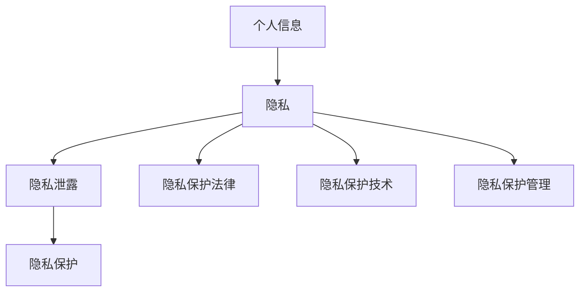

                 

### 文章标题

# 大数据时代的个人信息保护：隐私权与信息共享的平衡

### 文章关键词

- 大数据
- 个人信息保护
- 隐私权
- 信息共享
- 法律框架
- 技术措施
- 实践案例

### 文章摘要

随着大数据时代的到来，个人信息的收集、存储和利用日益频繁，如何在保障隐私权的同时实现信息共享成为了一个重要的议题。本文首先概述了大数据时代个人信息保护的背景与挑战，介绍了全球和中国个人信息保护的法律框架，以及大数据环境下个人信息隐私泄露的风险。接着，本文探讨了数据加密与安全传输、数据脱敏与匿名化、隐私增强技术等个人信息保护的技术措施。通过国内外实践案例的分析，本文总结了个人信息保护的实践与案例，并对个人信息保护的未来趋势进行了展望。本文旨在为大数据时代的个人信息保护提供理论基础和实践指导。

## 第一部分：大数据时代个人信息保护的背景与挑战

### 第1章：大数据时代下的个人信息保护概述

#### 1.1 大数据的定义与发展

**大数据**（Big Data）是指无法用传统数据库管理系统在合理时间内获取需要的信息和分析处理的海量、高速、多样化的数据集。大数据具有“4V”特点，即大量（Volume）、多样（Variety）、快速（Velocity）和真实（Veracity）。大数据技术包括数据采集、存储、处理、分析和可视化等多个环节，旨在通过高效的数据管理与分析，挖掘出数据背后的价值。

大数据的发展历程可以追溯到20世纪90年代。随着互联网和移动设备的普及，数据生成速度和数量急剧增加，数据来源也变得更加多样化。大数据技术的成熟和应用，使得各种行业和领域都能从海量数据中获取洞见，从而推动了许多创新和应用，如金融、医疗、教育、交通、广告等。

#### 1.2 个人信息保护的重要性

个人信息保护是指通过法律、技术和管理等多种手段，保障个人隐私不被非法获取、使用、泄露和篡改。随着大数据技术的广泛应用，个人信息保护的重要性日益凸显。以下是几个方面的原因：

1. **隐私泄露风险**：大数据技术能够收集到海量的个人信息，如果管理不善，容易导致隐私泄露事件发生。隐私泄露不仅会损害个人权益，还会对社会造成负面影响。

2. **信息不对称**：大数据企业或组织可能会利用其掌握的个人信息进行市场操纵，导致信息不对称，损害消费者权益。

3. **社会信任危机**：频繁的隐私泄露事件会削弱公众对大数据技术和相关企业的信任，影响大数据产业的健康发展。

4. **法律风险**：全球范围内，许多国家和地区已经制定了个人信息保护法律，如欧盟的《通用数据保护条例》（GDPR）和中国的新《个人信息保护法》（PIPL）。违反这些法律，企业将面临巨额罚款。

#### 1.3 大数据时代个人信息保护的挑战

在大数据时代，个人信息保护面临着多方面的挑战：

1. **数据量巨大**：大数据集的规模远远超过了传统数据集，给隐私保护带来了更大的难度。

2. **数据多样性**：不同类型的数据（如文本、图像、音频、视频等）需要不同的处理方式，增加了隐私保护的复杂性。

3. **数据生命周期管理**：从数据生成、存储、处理到销毁，每个环节都需要考虑隐私保护。

4. **隐私泄露途径多样**：除了传统的网络攻击，大数据技术本身也带来了新的隐私泄露途径，如数据挖掘和机器学习算法中的隐私风险。

5. **法律法规与技术的快速发展**：个人信息保护法律法规不断更新，技术手段也在不断进步，但两者的步伐并不总是一致的，这给监管和实施带来了挑战。

### 1.4 个人信息保护的核心概念与联系

为了更好地理解大数据时代个人信息保护的复杂性，我们需要掌握以下几个核心概念，并了解它们之间的联系：

- **个人信息**：指与特定个人相关联的任何信息，包括但不限于姓名、身份证号码、电话号码、电子邮件地址、位置信息、健康记录等。
- **隐私**：指个人对其个人信息控制的权利，包括信息的访问、使用、披露和修改。
- **隐私泄露**：指个人信息未经授权被泄露、披露或使用的现象。
- **隐私保护**：指通过法律、技术和管理手段，保障个人信息的隐私不被非法侵犯。

这些概念之间的关系可以用以下Mermaid流程图表示：

在这个流程图中，个人信息是隐私的基础，隐私是隐私泄露和隐私保护的前提。隐私泄露是隐私保护需要防范的风险，而隐私保护则包括法律、技术和管理的各个方面。

### 1.5 大数据时代个人信息保护的现状

目前，全球范围内已有多个国家和地区出台了个人信息保护法律，如欧盟的GDPR、美国的加州消费者隐私法（CCPA）和中国的新《个人信息保护法》（PIPL）。这些法律法规为个人信息保护提供了法律基础，但实际执行中仍存在一些挑战。

在中国，新《个人信息保护法》自2021年11月1日起正式实施，标志着中国个人信息保护进入了一个新阶段。然而，由于数据量和应用场景的复杂性，如何有效执行该法律，仍需各方共同努力。

在全球范围内，大数据企业和组织也在积极探索个人信息保护技术，如数据加密、数据脱敏、隐私增强计算等。这些技术为个人信息保护提供了有力保障，但同时也面临一些技术难题，如加密算法的选择、数据脱敏的精确度、隐私增强计算的性能等。

总之，大数据时代个人信息保护是一项系统工程，需要法律、技术和管理的协同作用。通过逐步分析和解决上述挑战，我们可以更好地保障个人信息的隐私权，实现信息共享与隐私保护的平衡。

## 第二部分：个人信息保护的法律框架

### 第2章：个人信息保护法律框架

#### 2.1 全球个人信息保护法律体系

在全球范围内，各国和地区对个人信息保护的重视程度不断提高，因此相继出台了各自的个人信息保护法律。以下是几个主要国家和地区的个人信息保护法律体系概述：

1. **欧盟**：《通用数据保护条例》（GDPR）是欧盟于2018年正式实施的个人信息保护法律，被认为是全球最严格的个人信息保护法律之一。GDPR规定了数据控制者和处理者必须遵守的数据保护原则，包括数据最小化、数据目的明确、数据质量、数据可访问性和可移动性等。GDPR还对数据泄露事件提出了严格的通知和责任要求，数据控制者必须在72小时内通知相关数据主体和数据保护监管机构。

2. **美国**：美国在个人信息保护方面没有统一的联邦法律，各州和联邦政府机构各自制定了相关的隐私保护法规。例如，加利福尼亚州的《消费者隐私法》（CCPA）于2020年正式生效，它赋予了加州居民对个人信息的访问、删除和拒绝销售的权利。此外，美国联邦贸易委员会（FTC）和健康与人类服务部（HHS）也分别负责监管不同领域的个人信息保护。

3. **中国**：中国于2021年11月1日正式实施《个人信息保护法》（PIPL），这是中国首部综合性个人信息保护法律。PIPL规定了个人信息处理的基本原则、个人信息处理者的义务、个人信息主体权利和保护机制等内容。PIPL还明确了跨境数据传输的要求，规定个人信息在跨境传输前需进行安全评估。

4. **其他国家和地区**：日本、加拿大、澳大利亚、巴西等国家也都有各自的个人信息保护法律。例如，日本的《个人信息保护法》和加拿大的《隐私法》都对个人信息保护有明确的规定。

#### 2.2 中国个人信息保护法律体系

中国个人信息保护法律体系以《个人信息保护法》为核心，同时还包括一系列相关的法律法规和规章：

1. **《个人信息保护法》**：这是中国首部综合性个人信息保护法律，于2021年11月1日正式实施。PIPL明确了个人信息处理的基本原则，包括合法性、正当性、必要性、诚信原则等。此外，PIPL还规定了个人信息处理者的义务，如告知义务、安全保护义务、个人信息主体权利等。

2. **《网络安全法》**：作为中国网络安全的基本法律，网络安全法对个人信息保护也有明确规定。网络安全法要求网络运营者采取技术和管理措施，保障网络信息安全，防止个人信息泄露、毁损和非法利用。

3. **《数据安全法》**：数据安全法于2021年9月1日正式实施，旨在加强数据安全保护。数据安全法规定了数据安全保护的基本要求和责任，包括数据分类管理、数据安全评估、数据安全审计等。

4. **《电子商务法》**：电子商务法对电子商务活动中的个人信息保护有明确规定。电子商务法要求电子商务经营者应当遵循合法、正当、必要的原则，收集、使用个人信息。

5. **《电信和互联网用户个人信息保护规定》**：这是针对电信和互联网领域个人信息保护的具体规定，要求电信和互联网服务提供者在提供服务过程中，严格保护用户个人信息。

#### 2.3 个人信息保护法的基本原则

个人信息保护法律的基本原则是制定和执行个人信息保护法律的核心，以下是中国《个人信息保护法》中的几个基本原则：

1. **合法、正当、必要原则**：个人信息处理者必须遵循合法、正当、必要的原则，不得超出处理目的和范围收集、使用个人信息。

2. **最少、必要原则**：在收集、使用个人信息时，应遵循最少、必要原则，仅收集实现处理目的所必需的个人信息。

3. **明确告知原则**：个人信息处理者应当明确告知个人信息主体关于个人信息收集、处理的目的、方式和范围等信息。

4. **信息安全原则**：个人信息处理者应当采取必要措施，确保个人信息的安全，防止个人信息泄露、毁损和非法使用。

5. **个人信息主体权利保障原则**：个人信息主体享有查询、复制、更正、删除个人信息等权利，个人信息处理者应当为个人信息主体行使权利提供便利。

#### 2.4 个人信息保护法的实施与挑战

个人信息保护法的实施对于保障个人信息安全具有重要意义，但在实际操作中仍面临以下挑战：

1. **法律法规执行力度不足**：一些个人信息处理者可能因法规执行不严而忽视个人信息保护，导致隐私泄露事件频发。

2. **跨部门协作不足**：个人信息保护涉及多个部门和领域，如公安、网信、市场监管等，跨部门协作不足可能导致监管不到位。

3. **技术手段不足**：尽管个人信息保护法律法规不断完善，但现有的技术手段在保护个人信息方面仍有不足，如数据加密、脱敏等技术仍需进一步发展和完善。

4. **公众隐私保护意识不足**：一些公众对于个人信息保护的认识不足，容易泄露个人信息，给不法分子可乘之机。

5. **隐私保护与信息利用的平衡**：在保障个人信息隐私的同时，如何有效利用个人信息以促进经济发展和社会进步，也是一个重要的课题。

综上所述，个人信息保护法的实施对于维护个人权益和社会稳定具有重要作用，但仍需各方共同努力，不断完善法律法规和技术手段，以应对大数据时代个人信息保护的新挑战。

## 第三部分：大数据环境下个人信息隐私泄露风险

### 第3章：大数据环境下个人信息隐私泄露风险

#### 3.1 隐私泄露的原因分析

在当前大数据环境下，个人信息隐私泄露的原因可以归结为以下几个方面：

1. **技术原因**：大数据技术本身的发展带来了新的隐私泄露风险。例如，数据挖掘和分析技术可以挖掘出大量的个人信息，而这些技术往往缺乏对隐私保护的考虑。

2. **管理原因**：一些企业和组织在数据管理和处理过程中，缺乏完善的隐私保护机制，导致个人信息泄露。例如，未经授权访问数据、数据传输过程中安全措施不足等。

3. **法律原因**：尽管全球范围内已有不少国家和地区制定了个人信息保护法律，但在实际执行中，一些法律条款可能不够明确或执行力度不足，导致隐私泄露事件频发。

4. **道德原因**：一些企业和组织出于商业利益或其他动机，故意泄露或滥用个人信息。

#### 3.2 隐私泄露的风险评估方法

为了有效管理和降低隐私泄露风险，需要采取风险评估方法。以下是一些常见的风险评估方法：

1. **定性风险评估**：通过专家访谈、调查问卷等方法，对隐私泄露风险进行定性分析。这种方法适用于初步了解隐私泄露风险。

2. **定量风险评估**：通过数学模型和统计分析方法，对隐私泄露风险进行定量评估。例如，可以使用故障模式与影响分析（FMEA）等方法。

3. **风险管理框架**：结合定性风险和定量风险，制定风险管理框架。例如，使用ISO/IEC 27001标准，建立信息安全管理体系。

4. **持续监控与改进**：通过定期审计和监控，及时发现和纠正隐私泄露问题。

#### 3.3 隐私泄露案例解析

以下是一些典型的隐私泄露案例，通过分析这些案例，可以更好地理解隐私泄露的风险和应对措施。

1. **案例一：Facebook隐私泄露事件**  
   2018年，Facebook曝出了高达8700万用户的个人信息泄露事件。黑客利用漏洞窃取了用户的数据，包括姓名、电话号码、位置信息等。这一事件引起了全球关注，反映了社交媒体平台在个人信息保护方面的不足。应对措施包括：加强数据加密和安全传输、加强员工培训和内部审计、提高用户隐私设置的可操作性。

2. **案例二：美国信用报告机构Equifax数据泄露事件**  
   2017年，Equifax曝出了1.43亿用户的个人信息泄露事件，包括姓名、社会安全号码、出生日期等敏感信息。这一事件暴露了信用报告机构在数据安全管理方面的漏洞。应对措施包括：加强数据存储和传输的安全措施、加强数据访问控制、定期进行安全审计和漏洞扫描。

3. **案例三：英国医保系统数据泄露事件**  
   2019年，英国国家医疗服务系统（NHS）的数据库遭到黑客攻击，导致约180万患者的个人信息泄露。这一事件暴露了医疗行业在数据安全方面的薄弱环节。应对措施包括：加强医疗数据安全管理、建立应急响应机制、加强员工培训和安全意识。

#### 3.4 隐私泄露风险的预防与控制

为了有效预防和控制隐私泄露风险，可以从以下几个方面入手：

1. **数据加密与安全传输**：使用高级加密算法对数据进行加密，确保数据在传输和存储过程中的安全性。

2. **数据脱敏与匿名化**：在处理和分析数据时，采用数据脱敏和匿名化技术，减少数据中的个人敏感信息。

3. **访问控制与权限管理**：制定严格的访问控制策略，确保只有授权人员才能访问敏感数据。

4. **安全审计与监控**：定期进行安全审计和监控，及时发现和纠正安全漏洞。

5. **用户教育与培训**：提高用户的隐私保护意识和技能，鼓励用户采取措施保护自己的个人信息。

6. **法律法规遵守**：严格遵守个人信息保护法律法规，确保企业合规运营。

通过以上措施，可以在一定程度上预防和控制隐私泄露风险，保障大数据环境下的个人信息安全。

### 3.5 大数据环境下个人信息隐私保护的重要性

在大数据时代，个人信息隐私保护的重要性不言而喻。以下是几个方面的重要性：

1. **个人权益保护**：个人信息隐私保护能够保障个人对其信息的控制权，防止个人信息被滥用和泄露，维护个人尊严和权益。

2. **社会稳定**：隐私泄露事件会引发公众恐慌和不安，影响社会稳定。通过加强个人信息保护，可以有效降低隐私泄露事件的发生率。

3. **企业声誉**：频繁的隐私泄露事件会损害企业的声誉，影响企业的业务发展和市场份额。加强个人信息保护，有助于提升企业形象。

4. **法律法规遵守**：遵守个人信息保护法律法规是企业合规运营的必要条件，有助于避免法律风险和罚款。

5. **技术进步**：隐私保护技术的不断进步，有助于推动大数据技术的发展和应用，实现隐私保护与信息共享的平衡。

总之，在大数据环境下，个人信息隐私保护是一项系统工程，需要法律、技术和管理等多方面的协同努力。通过加强个人信息保护，可以更好地保障个人权益，促进大数据技术的健康发展。

## 第四部分：个人信息保护的技术措施

### 第4章：数据加密与安全传输

#### 4.1 数据加密技术原理

数据加密是保障个人信息安全的重要技术手段，其核心思想是通过加密算法将明文数据转换为密文，从而防止数据在传输和存储过程中被非法访问或篡改。以下是几种常见的数据加密技术：

1. **对称加密**：对称加密算法使用相同的密钥对数据进行加密和解密。常见的对称加密算法包括AES（高级加密标准）和DES（数据加密标准）。对称加密的优点是实现速度快、计算资源消耗小，但缺点是密钥管理复杂，难以在大规模数据传输中应用。

2. **非对称加密**：非对称加密算法使用一对密钥（公钥和私钥）进行加密和解密。公钥用于加密，私钥用于解密。常见的非对称加密算法包括RSA和ECC（椭圆曲线加密）。非对称加密的优点是密钥管理简单，但缺点是加密和解密速度较慢。

3. **哈希函数**：哈希函数是一种将任意长度数据映射为固定长度数据的算法，常见的哈希函数包括MD5、SHA-1和SHA-256。哈希函数用于数据完整性校验和数字签名，但自身不具备加密功能。

4. **密钥交换协议**：密钥交换协议用于在通信双方之间安全地交换加密密钥。常见的密钥交换协议包括RSA密钥交换协议和Diffie-Hellman密钥交换协议。

#### 4.2 安全传输协议

安全传输协议是确保数据在传输过程中不被窃听和篡改的技术手段。以下是一些常见的安全传输协议：

1. **SSL/TLS**：SSL（安全套接字层）和其继任者TLS（传输层安全）是最常用的安全传输协议。它们在传输过程中使用加密算法对数据进行加密，确保数据的机密性和完整性。SSL/TLS广泛应用于互联网通信，如Web浏览器和电子邮件。

2. **IPSec**：IPSec（互联网安全协议）是一种用于在IP层上实现安全传输的协议。IPSec可以在网络层对数据进行加密和认证，确保数据在传输过程中的安全。

3. **VPN**：VPN（虚拟私人网络）是一种通过加密技术在公共网络上建立安全隧道，实现远程访问的技术。VPN可以确保数据在传输过程中的机密性和完整性。

4. **SSH**：SSH（安全外壳协议）是一种用于远程登录和文件传输的安全协议。SSH使用加密算法对数据传输进行加密，确保数据在传输过程中的安全。

#### 4.3 加密技术在个人信息保护中的应用

加密技术在个人信息保护中的应用主要包括以下几个方面：

1. **数据存储**：在数据存储过程中，对敏感数据进行加密存储，确保数据在存储介质上的安全。常见的应用场景包括数据库加密、文件加密和云存储加密。

2. **数据传输**：在数据传输过程中，对数据进行加密传输，确保数据在传输过程中的安全。常见的应用场景包括Web应用、电子邮件和文件传输。

3. **数据访问控制**：通过加密技术实现数据访问控制，确保只有授权用户才能访问敏感数据。常见的应用场景包括数据库访问控制、文件访问控制和云存储访问控制。

4. **数字签名**：使用加密技术对数据进行数字签名，确保数据的完整性和真实性。数字签名常用于身份认证、电子合同和版权保护。

#### 4.4 加密技术在个人信息保护中的应用实例

以下是一些加密技术在个人信息保护中的应用实例：

1. **Web应用**：在Web应用中，使用SSL/TLS协议对用户数据进行加密传输，确保用户提交的信息在传输过程中的安全。例如，在线银行系统、电商平台和社交媒体平台等。

2. **电子邮件**：在电子邮件传输过程中，使用SSL/TLS协议对邮件内容进行加密传输，确保邮件的机密性和完整性。例如，企业内部邮件系统和公共电子邮件服务提供商。

3. **云存储**：在云存储服务中，对用户数据在存储和传输过程中进行加密，确保数据的安全。例如，Google Drive、Dropbox和AWS等云存储服务提供商。

4. **移动应用**：在移动应用中，使用加密技术对用户数据进行加密存储和传输，确保用户隐私得到保护。例如，移动支付应用、社交应用和健康应用等。

总之，加密技术在个人信息保护中发挥着重要作用。通过合理应用加密技术，可以有效地保护个人信息的安全，降低隐私泄露风险。然而，加密技术并非万能，还需要结合其他技术手段和管理措施，共同构建全方位的个人信息保护体系。

### 4.5 数据脱敏与匿名化技术

数据脱敏与匿名化技术是保障个人信息安全的重要手段，通过这些技术，可以在数据处理和分析过程中最大限度地减少个人敏感信息的泄露风险。

#### 5.1 数据脱敏技术

数据脱敏技术主要通过将敏感信息替换为不可识别的伪值，从而保护数据的隐私。以下是几种常见的数据脱敏技术：

1. **随机替换**：将敏感信息直接替换为随机生成的伪值。例如，将姓名替换为“John Doe”，将电话号码替换为“123-456-7890”。随机替换的优点是简单易行，但缺点是可能存在被逆向工程的风险。

2. **掩码化**：在保留敏感信息一部分特征的同时，对其中的敏感部分进行掩码处理。例如，将电话号码中的后四位掩码，即“1234”。掩码化的优点是既保护了隐私，又保留了数据的部分有用信息。

3. **同义词替换**：将敏感信息替换为同义词或类似词。例如，将“生日”替换为“纪念日”。同义词替换的优点是保持了原始数据的语境，但缺点是可能影响数据分析的准确性。

4. **随机扰动**：在敏感信息上添加随机噪声，使其不可识别。例如，对年龄数据添加随机整数。随机扰动的优点是保护了隐私，但缺点是可能影响数据分析的精度。

#### 5.2 数据匿名化技术

数据匿名化技术旨在通过去除或模糊化个人识别信息，使数据集无法直接识别特定个人，从而保护个人隐私。以下是几种常见的数据匿名化技术：

1. **泛化**：将个人识别信息替换为更高层次的概念。例如，将具体的出生日期替换为年份。泛化的优点是简单易行，但缺点是可能影响数据分析的精度。

2. **隐藏**：将个人识别信息从数据集中移除，使其无法被访问。例如，删除姓名、地址等字段。隐藏的优点是彻底保护隐私，但缺点是可能失去数据的价值。

3. **扰乱**：在数据中引入随机噪声，使其无法直接识别特定个人。例如，对地理位置数据进行随机偏移。扰动的优点是保护了隐私，但缺点是可能影响数据分析的精度。

4. **K-匿名性**：通过将个人识别信息与至少K-1个其他记录合并，确保单个记录无法被识别。例如，在医疗数据中，确保至少有K-1个相同的症状。K-匿名性的优点是既保护了隐私，又保持了数据的分析价值。

#### 5.3 脱敏与匿名化的应用场景

数据脱敏和匿名化技术在各种应用场景中发挥着重要作用：

1. **数据分析**：在数据分析过程中，为了保护个人隐私，可以使用脱敏和匿名化技术处理敏感数据。例如，在数据挖掘、市场调研和风险评估等场景中。

2. **数据共享**：在数据共享过程中，为了防止敏感信息泄露，可以使用脱敏和匿名化技术处理数据。例如，在政府数据开放、学术研究和企业合作等场景中。

3. **数据存储**：在数据存储过程中，为了保护个人隐私，可以使用脱敏和匿名化技术处理敏感数据。例如，在数据库、数据仓库和云存储等场景中。

4. **合规性要求**：在符合个人信息保护法律法规的要求下，可以使用脱敏和匿名化技术处理敏感数据。例如，在遵守GDPR、PIPL等法律规定的场景中。

#### 5.4 脱敏与匿名化的挑战与优化

尽管脱敏和匿名化技术在保护个人信息隐私方面具有重要意义，但它们也存在一些挑战：

1. **精度损失**：脱敏和匿名化技术可能会降低数据分析的精度，影响数据的利用价值。

2. **逆向工程**：脱敏和匿名化技术可能存在被逆向工程的风险，导致敏感信息泄露。

3. **隐私-可用性平衡**：在保障隐私与数据利用之间找到一个平衡点，是脱敏和匿名化技术的关键挑战。

为了应对这些挑战，可以采取以下优化措施：

1. **多阶段脱敏**：通过多个阶段的脱敏处理，逐步提高数据的匿名化程度，同时减少精度损失。

2. **动态脱敏**：根据不同的数据处理和分析需求，动态调整脱敏策略，以平衡隐私保护和数据利用。

3. **联合分析**：在保证隐私保护的前提下，通过联合分析和数据融合，提高数据分析的精度和可靠性。

总之，数据脱敏和匿名化技术在个人信息保护中发挥着重要作用。通过合理应用这些技术，可以在保障隐私的同时，充分利用数据的价值。然而，脱敏和匿名化技术并非万能，需要结合其他技术手段和管理措施，共同构建全方位的个人信息保护体系。

### 6.1 隐私增强计算技术

隐私增强计算（Privacy Enhancing Computation，PEC）是一种旨在保护数据隐私的计算技术，通过在数据处理和分析过程中引入隐私保护机制，实现数据隐私与计算效率的平衡。隐私增强计算技术涵盖了多种计算模型和算法，旨在解决大数据时代个人信息隐私保护的关键挑战。以下是几种常见的隐私增强计算技术：

#### 6.1.1 零知识证明（Zero-Knowledge Proof）

零知识证明是一种密码学技术，允许证明者向验证者证明某个陈述是真实的，而无需透露任何关于这个陈述的具体信息。零知识证明的核心思想是通过数学上的证明，使验证者相信某个陈述是真实的，而证明者无法提供任何有用的信息。

零知识证明的应用场景广泛，如身份验证、数据隐私保护、区块链和智能合约等。其基本流程如下：

1. **知识生成**：证明者生成一个数学上的证明，证明某个陈述是真实的。
2. **知识证明**：证明者将生成的证明提交给验证者。
3. **验证**：验证者使用特定的验证算法检查证明的有效性，确定陈述是否为真。

零知识证明的优点包括：不泄露任何额外信息、可验证性高，但缺点是计算复杂度较高，不适合大规模数据处理。

#### 6.1.2 安全多方计算（Secure Multi-Party Computation）

安全多方计算是一种允许多个参与方在不泄露各自数据的情况下，共同完成数据处理和分析的技术。安全多方计算的核心思想是通过密码学技术，实现数据在传输和计算过程中的安全保护。

安全多方计算的基本流程如下：

1. **初始化**：各方输入各自的私有数据，并将其加密。
2. **协同计算**：各方通过安全协议进行加密数据的交换和计算，以得出最终结果。
3. **结果验证**：各方验证最终结果是否正确，并确保各自的数据未被泄露。

安全多方计算的应用场景包括联合数据分析、隐私保护的数据共享、区块链和智能合约等。其优点包括：保护各方数据隐私、支持复杂计算任务，但缺点是计算复杂度较高，可能影响计算效率。

#### 6.1.3 隐私保护人工智能（Privacy-Preserving Artificial Intelligence）

隐私保护人工智能是一种在人工智能应用中，通过引入隐私保护机制，实现数据隐私与模型性能的平衡的技术。隐私保护人工智能的核心思想是在数据处理和分析过程中，保护数据隐私，同时保持模型的性能和准确性。

隐私保护人工智能的主要方法包括：

1. **差分隐私（Differential Privacy）**：通过在数据上添加随机噪声，使得数据分析结果对单个数据点的依赖性降低，从而保护数据隐私。差分隐私的基本框架如下：

   - **隐私机制**：为每个数据点添加随机噪声，确保数据分析结果对单个数据点的敏感性降低。
   - **查询机制**：对受噪声影响的数据进行统计分析，以得到有意义的结果。

   差分隐私的优点包括：易于实现、可调节的隐私保护水平，但缺点是可能影响数据分析的精度。

2. **联邦学习（Federated Learning）**：通过分布式学习的方式，实现多个参与方在本地进行模型训练，同时共享模型参数，以实现隐私保护。联邦学习的基本框架如下：

   - **数据分布**：多个参与方各自拥有私有数据，不进行数据共享。
   - **模型训练**：参与方在本地进行模型训练，并定期将更新后的模型参数发送给中心服务器。
   - **模型聚合**：中心服务器聚合参与方的模型参数，生成全局模型。

   联邦学习的优点包括：保护数据隐私、支持个性化模型，但缺点是计算复杂度较高，需要优化通信效率。

#### 6.1.4 同态加密（Homomorphic Encryption）

同态加密是一种允许在密文状态下进行数据操作，并得到正确结果的加密技术。同态加密的核心思想是将明文数据转换为密文，然后对密文进行操作，最终得到与明文操作相同的结果。

同态加密的基本流程如下：

1. **密钥生成**：生成一对加密密钥（公钥和私钥）。
2. **加密**：使用公钥将明文数据加密为密文。
3. **计算**：对密文进行操作，得到新的密文。
4. **解密**：使用私钥将密文解密为明文结果。

同态加密的应用场景包括云计算、大数据分析和区块链等。其优点包括：支持任意数据处理操作、保护数据隐私，但缺点是计算复杂度较高，目前尚无法实现高效的同态加密。

总之，隐私增强计算技术为大数据时代的个人信息保护提供了有力支持。通过合理应用这些技术，可以在保障数据隐私的同时，实现高效的数据处理和分析。然而，隐私增强计算技术仍面临一些挑战，如计算复杂度、通信效率等，需要进一步的研究和优化。

### 6.2 隐私保护人工智能技术

隐私保护人工智能（Privacy-Preserving Artificial Intelligence）是一种旨在保护数据隐私的人工智能技术，通过在数据处理和分析过程中引入隐私保护机制，实现数据隐私与模型性能的平衡。隐私保护人工智能的核心目标是在不牺牲模型性能的情况下，保护个人数据的隐私。以下是几种常见的隐私保护人工智能技术：

#### 6.2.1 差分隐私（Differential Privacy）

差分隐私是一种在数据处理过程中引入随机噪声，以降低数据分析结果对单个数据点的依赖性的技术。差分隐私的基本原理是通过在查询结果中添加噪声，使得攻击者无法通过数据分析推断出单个数据点的具体值。差分隐私的核心思想可以概括为以下几点：

1. **拉普拉斯机制（Laplace Mechanism）**：在数据处理过程中，对数据进行随机噪声添加。具体而言，对每个数据点，添加一个服从拉普拉斯分布的噪声，以降低数据泄露的风险。

2. ** exponential mechanism**：在数据处理过程中，通过添加指数分布的噪声，实现对数据的随机化处理。

差分隐私的数学定义如下：

$$
\epsilon(\mathcal{D}) = \sum_{i \in \mathcal{D}} \ln \left(1 + \frac{\alpha}{||x_i - \mu||}\right)
$$

其中，$\mathcal{D}$为数据集，$x_i$为第$i$个数据点，$\mu$为数据集的平均值，$\alpha$为噪声参数。

差分隐私的优点包括：

- **隐私保护性**：通过添加随机噪声，使得数据分析结果对单个数据点的依赖性降低，从而保护数据隐私。
- **灵活性**：差分隐私可以在不同场景下灵活应用，适用于各种数据类型和查询类型。

差分隐私的缺点包括：

- **精度损失**：由于添加随机噪声，数据分析结果的精度可能受到影响。
- **计算复杂度**：差分隐私的计算复杂度较高，可能导致数据分析效率降低。

#### 6.2.2 隐私保护协同学习（Privacy-Preserving Collaborative Learning）

隐私保护协同学习是一种通过分布式学习方式，实现多个参与方在本地进行模型训练，并共享模型参数的技术。隐私保护协同学习的核心目标是保护参与方的数据隐私，同时提高模型的性能和准确性。隐私保护协同学习的基本框架如下：

1. **数据分布**：多个参与方各自拥有私有数据，不进行数据共享。
2. **模型初始化**：初始化全局模型参数，并将其发送给各个参与方。
3. **本地训练**：各个参与方在本地使用私有数据进行模型训练，并更新本地模型参数。
4. **参数聚合**：各个参与方将更新后的模型参数发送给中心服务器，中心服务器进行参数聚合，生成新的全局模型参数。
5. **迭代更新**：重复步骤3-4，直到满足停止条件。

隐私保护协同学习的优点包括：

- **隐私保护**：参与方在本地进行模型训练，不共享原始数据，从而保护数据隐私。
- **性能优化**：通过分布式学习，可以提高模型的性能和准确性。
- **可扩展性**：适用于大规模数据集和多个参与方。

隐私保护协同学习的缺点包括：

- **通信开销**：参与方需要频繁发送模型参数，可能导致通信开销增加。
- **计算复杂度**：参数聚合和更新过程可能较为复杂，影响学习效率。

#### 6.2.3 同态加密（Homomorphic Encryption）

同态加密是一种允许在密文状态下进行数据操作，并得到正确结果的加密技术。同态加密的基本原理是将明文数据加密为密文，然后在密文状态下进行操作，最终得到与明文操作相同的结果。同态加密的核心思想可以概括为以下几点：

1. **密钥生成**：生成一对加密密钥（公钥和私钥）。
2. **加密**：使用公钥将明文数据加密为密文。
3. **计算**：对密文进行操作，得到新的密文。
4. **解密**：使用私钥将密文解密为明文结果。

同态加密的优点包括：

- **支持任意数据处理操作**：同态加密允许在密文状态下进行各种数据处理操作，如加法、乘法、求导等。
- **保护数据隐私**：同态加密在数据处理过程中，不泄露任何关于原始数据的额外信息。

同态加密的缺点包括：

- **计算复杂度较高**：同态加密的计算复杂度较高，可能导致数据处理效率降低。
- **不适用于实时应用**：由于同态加密的复杂度，其不适用于需要实时处理的应用场景。

总之，隐私保护人工智能技术在保障数据隐私的同时，提高了人工智能模型的性能和准确性。通过合理应用这些技术，可以在大数据时代实现数据隐私与信息共享的平衡。然而，隐私保护人工智能技术仍面临一些挑战，如计算复杂度、通信效率等，需要进一步的研究和优化。

### 6.3 隐私增强技术的应用前景

隐私增强技术在大数据时代具有重要的应用前景，这些技术不仅有助于提升个人信息的保护水平，还能促进数据资源的有效利用。以下是几种隐私增强技术的应用前景：

#### 6.3.1 零知识证明

零知识证明技术在隐私保护方面的应用前景广阔。首先，在区块链和分布式账本技术中，零知识证明可以用于实现匿名交易和去中心化身份验证，从而增强系统的隐私性和安全性。例如，比特币改进提案（BIP）已经开始研究如何利用零知识证明实现更加隐私的比特币交易。此外，零知识证明还可以应用于隐私保护的智能合约，确保合约在执行过程中不泄露任何关于参与方的信息。

#### 6.3.2 安全多方计算

安全多方计算技术可以在医疗、金融和商业等领域发挥重要作用。例如，在医疗领域，多个医疗机构可以共享患者数据用于疾病研究和治疗，同时保护患者的隐私。在金融领域，银行和金融机构可以使用安全多方计算技术进行联合风险评估，确保数据隐私不受侵犯。在商业领域，企业可以合作进行市场调研和数据分析，同时保护各自的数据隐私。

#### 6.3.3 差分隐私

差分隐私技术在大数据分析和机器学习中具有广泛的应用前景。例如，在社会科学研究中，差分隐私可以用于保护参与者的隐私，同时提供准确的分析结果。在广告和市场营销领域，差分隐私可以帮助企业进行用户行为分析，同时避免用户隐私泄露。在政府数据管理中，差分隐私技术可以用于公开政府数据，同时保护敏感信息。

#### 6.3.4 联邦学习

联邦学习技术在大数据分析和人工智能领域具有巨大的应用潜力。通过联邦学习，多个参与方可以在不共享数据的情况下，共同训练机器学习模型。这一技术在医疗健康、自动驾驶和智能家居等领域具有广泛应用。例如，在医疗健康领域，联邦学习可以帮助医疗机构共享患者数据，同时保护患者的隐私。在自动驾驶领域，联邦学习可以用于车辆之间的数据共享，以提高自动驾驶系统的安全性和效率。在智能家居领域，联邦学习可以用于智能设备之间的协作，提供个性化服务。

#### 6.3.5 同态加密

同态加密技术在未来将越来越受到关注。随着云计算和大数据技术的发展，越来越多的数据将在云端进行处理和分析。同态加密可以在云环境中提供强大的隐私保护功能，确保数据在传输、存储和处理过程中不被泄露。例如，在金融领域，同态加密可以用于保护交易数据和用户信息，确保数据安全。在国家安全领域，同态加密可以用于保护敏感数据和通信内容，防止信息泄露。

总之，隐私增强技术在大数据时代具有重要的应用前景。通过合理应用这些技术，可以在保障个人信息隐私的同时，实现数据的有效利用。随着技术的不断进步，隐私增强技术将越来越成熟，为大数据时代的个人信息保护提供有力支持。

### 第7章：个人信息保护最佳实践

#### 7.1 数据治理策略

数据治理策略是确保个人信息得到有效保护和合理使用的重要措施。以下是一些关键步骤和最佳实践：

1. **数据分类**：根据数据的敏感程度和重要性，对数据进行分类。敏感数据（如医疗记录、金融信息、个人身份信息等）需要更高的保护措施。

2. **数据生命周期管理**：从数据生成、存储、处理到销毁，每个阶段都需要考虑隐私保护。例如，在数据生成阶段，应限制数据的收集范围，仅收集必要的个人信息；在数据销毁阶段，应确保数据彻底删除或匿名化。

3. **数据访问控制**：实施严格的访问控制策略，确保只有授权人员才能访问敏感数据。访问控制可以基于用户身份验证、角色权限和审计日志等机制。

4. **数据备份与恢复**：定期进行数据备份，确保在数据泄露或系统故障时，能够快速恢复数据。备份应存储在安全的地方，并定期进行验证。

5. **数据安全审计**：定期进行数据安全审计，检查数据治理策略的执行情况，发现和纠正潜在的安全问题。

6. **数据透明度**：向用户明确告知其个人信息的使用目的、范围和方式，并提供查询、更正和删除个人信息的渠道。

7. **合规性检查**：定期检查是否符合相关法律法规的要求，如GDPR、PIPL等。

#### 7.2 隐私设计原则

隐私设计原则是指在系统设计和开发过程中，将隐私保护作为一项基本要求，从而构建出安全的隐私保护系统。以下是几个关键原则：

1. **最小化原则**：仅收集和存储实现服务目的所必需的个人信息，避免过度收集。

2. **目的明确原则**：在收集个人信息前，明确说明收集目的，并在整个数据处理过程中严格遵守这一目的。

3. **透明性原则**：用户应能够了解其个人信息是如何被收集、使用和共享的，以及他们享有的隐私权利。

4. **安全性原则**：确保个人信息在存储、传输和处理过程中的安全，采用加密、访问控制和安全审计等手段。

5. **可访问性原则**：用户应能够访问其个人信息，并在需要时对其进行更新和删除。

6. **隐私友好原则**：在设计和开发过程中，优先考虑隐私保护，将隐私设计理念融入到产品和服务中。

#### 7.3 隐私保护合规流程

隐私保护合规流程是指企业或组织在处理个人信息时，确保符合相关法律法规和隐私保护原则的一系列步骤。以下是几个关键步骤：

1. **合规评估**：定期对个人信息处理流程进行合规评估，识别潜在的风险和漏洞。

2. **隐私影响评估（PIA）**：在引入新的数据处理流程或系统时，进行隐私影响评估，以评估其对个人隐私的影响。

3. **数据保护官（DPO）**：指定数据保护官负责监督和指导隐私保护工作，确保合规性。

4. **培训与宣传**：定期对员工进行隐私保护培训，提高员工的隐私保护意识和技能。

5. **内部审计与监督**：建立内部审计和监督机制，确保隐私保护措施得到有效执行。

6. **用户反馈与沟通**：建立用户反馈渠道，及时回应用户的隐私保护诉求，并与用户保持透明沟通。

7. **合规性报告**：定期向监管机构提交合规性报告，展示企业的隐私保护工作情况。

#### 7.4 个人信息保护最佳实践总结

个人信息保护的最佳实践包括数据治理策略、隐私设计原则和隐私保护合规流程。通过实施这些最佳实践，企业或组织可以有效地保护个人信息的隐私，降低隐私泄露风险，增强用户对服务的信任。以下是一些关键要点：

- **数据治理**：实施严格的数据分类和生命周期管理，确保数据在各个阶段的安全和保护。
- **隐私设计**：在系统设计和开发过程中，将隐私保护作为一项基本要求，优先考虑用户隐私。
- **合规流程**：建立完善的隐私保护合规流程，确保个人信息处理符合法律法规和隐私保护原则。

总之，个人信息保护是一项系统工程，需要从数据治理、隐私设计和合规流程等多个方面进行综合考虑和实施。通过最佳实践，企业或组织可以在保障个人信息隐私的同时，实现数据的有效利用和业务的可持续发展。

### 第8章：国内外个人信息保护案例研究

#### 8.1 国内个人信息保护案例

在中国，个人信息保护法律法规的实施取得了一定的成效，但仍面临诸多挑战。以下列举几个典型的国内个人信息保护案例：

1. **腾讯公司隐私泄露事件**  
   2018年，腾讯公司曝出了其社交平台QQ和微信的隐私泄露问题。部分用户的个人信息（如电话号码、微信号、好友关系等）被非法获取并在互联网上公开出售。这一事件引起了社会广泛关注，腾讯公司迅速采取措施，加强了数据安全防护，并对相关责任人进行了处理。

2. **滴滴出行隐私泄露事件**  
   2021年，滴滴出行被曝出其用户数据被非法出售，涉及大量用户的个人信息（如姓名、身份证号、手机号码、行驶轨迹等）。这一事件引发了国家监管部门的高度关注，滴滴出行被责令整改，并暂停了新用户注册业务。此外，国家网信办对滴滴出行进行了处罚，要求其加强个人信息保护。

3. **新东方教育科技集团隐私泄露事件**  
   2022年，新东方教育科技集团曝出了其学生和教师个人信息被泄露的问题。部分用户的个人信息（如姓名、身份证号、手机号码、家庭住址等）被非法获取并上传至网络平台。这一事件再次引发了社会对个人信息保护的广泛关注，新东方教育科技集团随后加强了对个人信息保护的管理措施。

这些案例反映了国内企业在个人信息保护方面存在的不足，如数据安全意识不强、数据管理不规范等。通过加强法律法规的执行、提高企业数据安全意识、完善数据保护机制，可以有效降低个人信息泄露风险。

#### 8.2 国外个人信息保护案例

在全球范围内，个人信息保护法律法规较为完善，但仍不断出现隐私泄露事件。以下列举几个典型的国外个人信息保护案例：

1. **Facebook隐私泄露事件**  
   2018年，Facebook曝出了高达8700万用户的个人信息泄露事件。黑客利用漏洞窃取了用户的数据，包括姓名、电话号码、位置信息等。这一事件引起了全球关注，Facebook随后加强了数据保护措施，并面临巨额罚款。

2. **剑桥分析公司（Cambridge Analytica）隐私泄露事件**  
   2018年，剑桥分析公司曝出了利用用户个人信息进行政治操纵的事件。该公司非法获取了8700万Facebook用户的个人信息，用于美国总统大选等政治活动。这一事件引发了全球对社交媒体和个人信息保护的广泛关注。

3. **Equifax数据泄露事件**  
   2017年，美国信用报告机构Equifax曝出了1.43亿用户的个人信息泄露事件，包括姓名、社会安全号码、出生日期等敏感信息。这一事件暴露了信用报告机构在数据安全管理方面的漏洞，Equifax随后进行了整改，并面临巨额罚款。

这些案例显示了在全球范围内，个人信息保护面临严峻挑战。各国和地区纷纷加强个人信息保护法律法规的制定和执行，以应对隐私泄露事件。通过加强数据安全意识、完善数据保护机制、提高法律法规的执行力度，可以有效降低个人信息泄露风险。

#### 8.3 案例对比分析与启示

通过对国内外个人信息保护案例的对比分析，可以得出以下启示：

1. **法律法规的重要性**：完善的法律法规是个人信息保护的基础。国内外案例表明，法律法规的制定和执行对于个人信息保护具有关键作用。国内新《个人信息保护法》的实施为个人信息保护提供了有力保障，而国外如GDPR、CCPA等法律法规也在全球范围内产生了积极影响。

2. **技术手段的必要性**：技术手段是个人信息保护的重要手段。国内外案例表明，技术手段的不足是导致隐私泄露的重要原因之一。例如，Facebook、Equifax等公司由于技术手段不足，导致大规模隐私泄露事件。因此，企业应加强数据加密、访问控制、安全审计等技术的应用，提高数据安全防护能力。

3. **数据安全意识的重要性**：数据安全意识是个人信息保护的关键。国内外案例表明，员工和用户的数据安全意识不强是导致隐私泄露的重要原因之一。因此，企业应加强员工数据安全培训，提高用户的数据安全意识，共同维护个人信息安全。

4. **跨部门协作的必要性**：个人信息保护涉及多个部门和领域，需要跨部门协作。国内外案例表明，跨部门协作不足可能导致个人信息保护不到位。因此，政府部门、企业和用户之间应加强沟通与协作，共同推动个人信息保护工作的开展。

总之，国内外个人信息保护案例为我国个人信息保护工作提供了有益的启示。通过加强法律法规的制定和执行、提高技术手段水平、加强数据安全意识教育和跨部门协作，可以有效提升个人信息保护水平，维护个人权益和社会稳定。

### 第9章：个人信息保护的未来趋势

#### 9.1 技术发展趋势

随着技术的不断进步，个人信息保护技术也在不断发展。以下是一些未来技术发展趋势：

1. **区块链技术**：区块链技术在个人信息保护中具有巨大潜力。通过区块链，可以实现数据的安全存储和不可篡改，确保个人信息的安全。未来，区块链技术有望在数据共享、隐私保护和身份验证等方面发挥更大作用。

2. **人工智能技术**：人工智能技术在个人信息保护中的应用越来越广泛。通过人工智能技术，可以实现智能化的隐私保护，如自动化的隐私风险评估、异常检测和隐私侵犯预警等。未来，人工智能技术将继续优化，提高个人信息保护的效果和效率。

3. **量子计算技术**：量子计算技术在加密和计算方面具有巨大优势。未来，量子计算技术有望实现更强大的加密算法和更高效的数据处理，从而提升个人信息保护的水平。

4. **联邦学习**：联邦学习技术可以在保护数据隐私的同时，实现多方数据的联合分析。未来，联邦学习技术将继续优化，支持更复杂的模型和更大的数据集，从而在更多应用场景中发挥作用。

#### 9.2 法律法规发展趋势

未来，个人信息保护法律法规将继续完善和更新。以下是一些可能的发展趋势：

1. **全球化**：随着国际间数据流动的日益频繁，全球范围内的个人信息保护法律法规将更加统一和协调。例如，欧盟可能会推动更多国家采用GDPR模式，以实现全球范围内的个人信息保护标准。

2. **更加严格**：未来，个人信息保护法律法规可能会更加严格，增加对个人信息处理者的义务和责任。例如，可能引入更严格的隐私保护要求和更高的罚款额度。

3. **数据安全标准**：未来，各国可能会制定统一的数据安全标准，以规范数据收集、存储、处理和传输等环节。这有助于提高个人信息保护的整体水平。

4. **消费者参与**：未来，个人信息保护法律法规可能会更加注重消费者的参与和权利。例如，可能引入更多的消费者知情权和选择权，使消费者在个人信息处理过程中有更大的话语权。

#### 9.3 个人信息保护的未来展望

在未来，个人信息保护将面临新的挑战和机遇：

1. **技术驱动**：随着技术的不断进步，个人信息保护技术将不断优化和升级，为个人信息保护提供更强有力的支持。

2. **法律法规保障**：完善的个人信息保护法律法规将为个人信息保护提供坚实的法律基础，保障个人权益不受侵犯。

3. **跨部门协作**：个人信息保护涉及多个部门和领域，未来将需要更多跨部门协作，共同推动个人信息保护工作。

4. **消费者意识提升**：随着个人信息保护意识的普及，消费者将更加注重个人信息的安全和保护，推动企业和社会加强个人信息保护。

总之，未来个人信息保护将是一个技术驱动、法律法规保障、跨部门协作和消费者意识提升的共同结果。通过各方共同努力，我们可以构建一个更加安全、透明和可持续的个人信息保护体系。

### 附录

#### 附录A：相关法律法规汇编

- **欧盟《通用数据保护条例》（GDPR）**
- **美国《消费者隐私法》（CCPA）**
- **中国《个人信息保护法》（PIPL）**
- **日本《个人信息保护法》**
- **加拿大《隐私法》**
- **澳大利亚《隐私法》**
- **巴西《通用数据保护法》**

#### 附录B：隐私保护技术工具推荐

- **数据加密工具**：AESCrypt、GPG、FileVault2
- **安全传输协议**：SSL/TLS、IPSec、VPN
- **数据脱敏工具**：K-Anonymity、L-Diversity、T-Closeness
- **匿名化工具**：General Data Anonymizer（GDA）、Data Anonymizer Toolkit（DAT）
- **隐私增强计算工具**：Microsoft Privacy Relay、IBM Secure Computing

#### 附录C：大数据个人信息保护相关论文索引

- **“Privacy-Preserving Data Mining: A Survey”**
- **“Homomorphic Encryption for Secure Data Analysis”**
- **“Federated Learning: Concept and Application”**
- **“Differential Privacy: A Survey of Results”**
- **“Secure Multi-Party Computation: A Survey”**
- **“Blockchain for Data Sharing and Privacy Protection: A Survey”**

### 作者信息

作者：AI天才研究院/AI Genius Institute & 禅与计算机程序设计艺术 /Zen And The Art of Computer Programming

