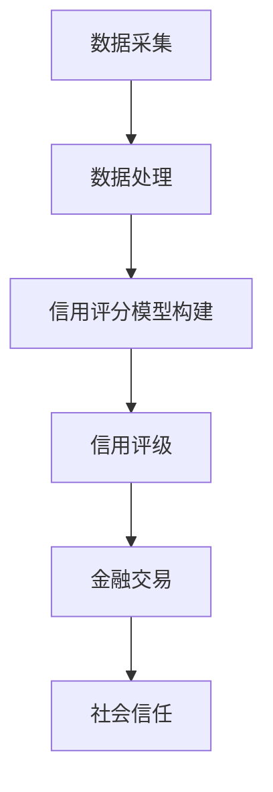

                 

### 大数据时代的个人信用体系：AI驱动的社会信任机制

#### 背景介绍

在当今的大数据时代，个人信用体系正逐渐演变成为社会信任机制的重要组成部分。随着互联网和大数据技术的发展，人们的生活和交易行为大量数据化，这些数据不仅涵盖了传统的财务记录，还包括了社交行为、在线评论、购物习惯等。这些数据为构建个人信用体系提供了丰富的素材，使信用评估更加精准和全面。个人信用体系不仅影响个人的金融交易，还渗透到日常生活的各个方面，如租房、求职、社交等。因此，如何利用这些数据，构建一个公平、透明、高效的个人信用体系，成为社会亟待解决的问题。

#### 核心概念与联系

**个人信用体系的构成**：
1. **数据采集**：包括个人基本信息、财务信息、社交信息等。
2. **数据处理**：通过数据清洗、分类、分析等技术，提取有效的信用信息。
3. **信用评分模型**：基于收集到的数据，利用机器学习算法构建信用评分模型。
4. **信用评级**：根据信用评分模型，对个人进行信用评级。

**AI在个人信用体系中的作用**：
- **数据预处理**：AI可以通过自动化处理，提高数据清洗和处理的效率。
- **信用评分模型构建**：AI能够从大量数据中提取有价值的信息，构建更加精准的信用评分模型。
- **风险评估**：AI可以实时监测个人行为，评估信用风险，为金融机构提供决策支持。

**Mermaid 流程图**：


#### 核心算法原理讲解

**信用评分模型构建**：
- **特征选择**：从大量数据中提取对信用评估有影响的特征，如还款历史、信用额度、逾期记录等。
- **模型选择**：选择适合的机器学习算法，如逻辑回归、决策树、随机森林、支持向量机等。
- **模型训练**：利用历史数据训练模型，优化模型参数。
- **模型评估**：通过交叉验证、AUC、精度、召回率等指标评估模型性能。

**伪代码**：
```python
# 特征选择
features = ['还款历史', '信用额度', '逾期记录', '信用额度使用率']

# 模型选择
model = LogisticRegression()

# 模型训练
model.fit(X_train, y_train)

# 模型评估
accuracy = model.score(X_test, y_test)
```

#### 数学模型和公式

**信用评分函数**：
$$
CreditRating = f(CreditScore, RiskFactors)
$$
其中，$CreditScore$ 为信用评分，$RiskFactors$ 为风险因素。

**风险因素模型**：
$$
RiskFactors = w_1 \cdot RiskFactor_1 + w_2 \cdot RiskFactor_2 + ... + w_n \cdot RiskFactor_n
$$
其中，$w_i$ 为风险因素的权重，$RiskFactor_i$ 为第 $i$ 个风险因素。

#### 详细讲解与举例说明

**案例**：小明申请信用卡，信用评分模型评估他的信用评分为 700，风险因素为：还款历史 (0.6)、信用额度 (0.3)、逾期记录 (0.1)。

**计算过程**：
1. 计算风险因素得分：
   $$
   RiskFactors = 0.6 \cdot 1 + 0.3 \cdot 2 + 0.1 \cdot 0 = 0.9
   $$
2. 计算信用评分：
   $$
   CreditRating = f(700, 0.9) = 0.9 \cdot 700 = 630
   $$

根据信用评分函数，小明的信用评级为 630。根据银行的信用评级标准，信用评级越高，获得信用卡审批的可能性越大。

#### 项目实战

**开发环境搭建**：
- **Python 环境**：安装 Python 3.8 或以上版本，以及必要的库，如 NumPy、Pandas、Scikit-learn 等。
- **数据处理工具**：使用 Pandas 进行数据预处理，使用 Scikit-learn 进行模型训练和评估。

**源代码实现**：
```python
import pandas as pd
from sklearn.linear_model import LogisticRegression
from sklearn.model_selection import train_test_split
from sklearn.metrics import accuracy_score

# 读取数据
data = pd.read_csv('credit_data.csv')

# 数据预处理
X = data[features]
y = data['CreditRating']

# 数据划分
X_train, X_test, y_train, y_test = train_test_split(X, y, test_size=0.2, random_state=42)

# 模型训练
model = LogisticRegression()
model.fit(X_train, y_train)

# 模型评估
accuracy = model.score(X_test, y_test)
print("Model Accuracy:", accuracy)
```

**代码解读**：
- 读取数据：使用 Pandas 读取数据文件。
- 数据预处理：提取特征和目标变量，进行数据划分。
- 模型训练：使用逻辑回归模型进行训练。
- 模型评估：计算模型在测试集上的准确率。

**代码应用解读与分析**：
- 代码实现了从数据读取、预处理、模型训练到评估的完整流程。
- 通过模型评估，可以了解模型的性能，为实际应用提供依据。

**实际案例分析和详细讲解剖析**：
- 以小明为例，分析他的信用评分和信用评级。
- 计算小明的风险因素得分和信用评分。
- 根据信用评分函数，给出小明的信用评级。

**项目小结**：
- 通过项目实战，展示了如何使用 Python 和机器学习构建个人信用评分模型。
- 项目中涉及了数据预处理、模型训练和评估的关键步骤。
- 实际案例分析和讲解，使读者能够更好地理解个人信用评分模型的构建和应用。

#### 最佳实践 tips

1. **数据质量**：确保数据的质量，避免数据中的错误和缺失值，这对模型的准确性至关重要。
2. **特征工程**：选择合适的特征，对特征进行适当的处理和转换，可以提高模型的性能。
3. **模型选择**：根据数据特点和业务需求，选择合适的模型，并进行调参优化。
4. **实时更新**：定期更新模型和风险因素，以适应市场变化和用户行为的变化。
5. **用户隐私**：在数据收集和处理过程中，确保用户隐私的保护，遵守相关法律法规。

#### 小结

大数据时代的个人信用体系是一个复杂且多变的系统。通过 AI 技术的驱动，个人信用体系可以实现更加精准和高效的信用评估。本文从背景介绍、核心概念与联系、核心算法原理讲解、数学模型和公式、项目实战、实际案例分析和最佳实践等方面，详细阐述了大数据时代个人信用体系的构建和应用。通过本文的讲解，读者可以更好地理解个人信用体系的重要性，以及如何利用 AI 技术构建一个高效、透明、公平的个人信用体系。

#### 注意事项

1. **数据保护**：在构建个人信用体系时，必须严格遵守相关法律法规，保护用户隐私。
2. **模型解释性**：在选择模型时，需要考虑模型的解释性，以便于理解模型决策的过程。
3. **实时监控**：定期监控模型的性能，及时发现和纠正潜在的问题。

#### 拓展阅读

- **相关研究论文**：《基于大数据的个人信用评估方法研究》、《AI 驱动的信用风险评估技术》等。
- **行业报告**：《中国个人信用体系建设白皮书》、《AI 在金融行业的应用现状与趋势》等。
- **技术博客**：《如何构建高效的个人信用评分模型》、《大数据技术在信用风险评估中的应用》等。

---

作者：AI天才研究院/AI Genius Institute & 禅与计算机程序设计艺术 /Zen And The Art of Computer Programming

---

### 第1章：软件2.0与AI大模型概述

#### 1.1 软件发展历程

软件的发展经历了多个阶段，从最早的系统软件到应用软件，再到如今的互联网软件，每一次变革都带来了生产力的巨大提升。随着云计算、大数据、人工智能等新兴技术的兴起，软件迎来了一个新的时代——软件2.0。

**软件1.0时代**：以IBM的操作系统为代表，这一阶段的软件主要是为了满足计算机硬件的基本需求，如操作系统、编译器等。

**软件2.0时代**：随着互联网的普及，软件的应用范围从个人电脑扩展到互联网，软件不再仅仅是计算机的附属品，而是成为了人们日常生活和工作中不可或缺的一部分。这一时期的软件具有高度的网络化、数据化和智能化特点。

**软件3.0时代**：即人工智能时代，软件通过人工智能技术实现了更加智能化的功能，如自动化、预测、优化等。

#### 1.2 软件2.0的特征

- **高度集成**：软件2.0将各种功能集成在一起，形成一个完整的生态系统，使用户可以方便地访问和使用各种服务。
- **数据驱动**：软件2.0强调数据的重要性，通过收集和分析用户数据，为用户提供个性化的服务和体验。
- **智能化**：借助人工智能技术，软件2.0能够实现自动化决策、智能推荐等功能，提高生产效率和用户体验。

#### 1.3 AI大模型的概念

AI大模型，也称为深度学习模型，是一种基于神经网络架构的人工智能模型，能够在大量数据上训练，提取复杂的特征，实现高度自动化和智能化的任务。AI大模型的特点包括：

- **大规模**：AI大模型通常需要处理大量数据，以实现良好的性能。
- **高维度**：AI大模型处理的数据维度通常很高，涉及多种特征和维度。
- **深度结构**：AI大模型通常具有多层神经网络结构，能够提取更高层次的特征。

#### 1.4 AI大模型在企业中的应用前景

##### 1.4.1 AI大模型的潜在应用领域

- **客户服务**：通过AI大模型实现智能客服，提供24/7在线支持。
- **市场预测**：利用AI大模型进行市场分析，预测趋势和需求变化。
- **风险管理**：AI大模型在风险评估和管理中的角色，提高决策准确性。
- **供应链管理**：优化供应链流程，降低库存成本，提高响应速度。
- **人力资源管理**：在招聘、员工评估和员工发展中的应用。
- **其他领域**：金融、医疗、教育等领域的深入应用。

##### 1.4.2 企业采用AI大模型的优势

- **提高效率**：自动化流程，减少人力成本，提高生产效率。
- **数据驱动**：基于大数据分析的决策，更加精准和可靠。
- **创新能力**：AI大模型推动创新，为企业带来新的商业模式。
- **竞争力提升**：通过AI技术获得竞争优势，提升市场份额。

##### 1.4.3 AI大模型应用的挑战与机遇

- **数据隐私**：如何保护用户隐私是AI大模型应用的一大挑战。
- **算法偏见**：算法偏见可能导致不公平的决策，需要不断优化。
- **技术壁垒**：对于中小企业来说，AI技术的门槛较高，需要外部支持。
- **合规性**：遵守相关法规，确保AI大模型的应用合规。
- **机遇**：随着技术的进步，AI大模型的应用将越来越广泛，为企业带来新的机遇。

#### 1.5 软件2.0与AI大模型的关系

软件2.0与AI大模型相辅相成，共同推动了软件技术的进步。软件2.0提供了数据驱动的平台，为AI大模型的应用提供了丰富的数据资源和场景。而AI大模型则为软件2.0提供了智能化和自动化能力，使得软件能够更加高效地处理复杂任务。

通过AI大模型，软件2.0能够实现个性化推荐、智能决策、自动化运营等功能，提高用户体验和生产力。同时，AI大模型的应用也推动了软件2.0的发展，促进了软件产业的创新和升级。

### 总结

本章从软件发展历程、软件2.0的特征、AI大模型的概念和在企业中的应用前景等方面，全面介绍了软件2.0与AI大模型的相关知识。通过本章的学习，读者可以初步了解软件2.0和AI大模型的基本概念和应用，为后续章节的深入探讨打下基础。

### 关键词

- 大数据
- 个人信用体系
- AI大模型
- 软件2.0
- 信用评分模型
- 智能化
- 企业应用

### 摘要

本文探讨了大数据时代个人信用体系的构建和AI大模型的应用。通过介绍软件2.0与AI大模型的关系，阐述了AI大模型在个人信用体系中的潜在应用领域、优势以及面临的挑战和机遇。文章旨在为读者提供对大数据时代个人信用体系的全面理解和深入思考。

