                 

### 文章标题：大数据架构：设计高吞吐量数据处理系统

#### 关键词：
- 大数据架构
- 分布式计算
- 高吞吐量
- 数据处理系统设计
- 存储技术
- 流处理框架
- 系统优化

#### 摘要：
本文深入探讨了大数据架构的设计原理和实现方法，重点介绍了如何构建高吞吐量的数据处理系统。文章首先概述了大数据的定义和背景，然后分析了大数据处理系统的设计原则和核心架构。接着，文章详细介绍了大数据存储与处理技术，包括分布式文件系统、数据库选择、流处理计算等。最后，文章通过实际项目实战和系统优化策略，展示了如何实现高吞吐量的数据处理系统，并提供了一些最佳实践和注意事项。

----------------------------------------------------------------

## 第1章 大数据架构概述

### 1.1 大数据的定义与背景

#### 1.1.1 大数据的定义

大数据通常指的是无法用传统数据库系统进行存储、管理和分析的巨量数据集。它具有四个关键特征，即“4V”：大量（Volume）、多样（Variety）、快速（Velocity）和真实（Veracity）。

#### 1.1.2 大数据的发展背景

大数据的发展源于互联网的迅猛发展和物联网设备的普及。随着数据源的多样化和数据量的爆炸性增长，传统的数据处理方法已无法满足需求。因此，大数据技术应运而生。

#### 1.1.3 大数据对社会的影响

大数据改变了企业决策模式，提高了决策效率。在医疗、金融、交通等领域，大数据的应用带来了巨大的变革。例如，通过大数据分析，医疗行业可以更好地预测疾病趋势，金融行业可以更精确地评估风险。

### 1.2 大数据架构核心概念

#### 1.2.1 数据流处理

数据流处理是指实时或近乎实时的处理数据的方法。它强调数据的流动性和实时性，适用于处理大量实时数据。

#### 1.2.2 分布式计算

分布式计算是将计算任务分布在多个计算节点上执行的一种方法。它能够提高系统的并行处理能力和容错性。

#### 1.2.3 数据存储与管理

数据存储与管理涉及如何高效地存储和管理大量数据。分布式文件系统（如HDFS）和NoSQL数据库（如HBase和Cassandra）是常用的存储解决方案。

### 1.3 大数据架构发展趋势

#### 1.3.1 云原生大数据架构

云原生大数据架构利用云计算资源，提供灵活、高效的数据处理能力。云原生架构支持弹性伸缩和自动化管理，是企业大数据部署的的趋势。

#### 1.3.2 混合云架构

混合云架构结合了公有云和私有云的优势，提供了更高的安全性和灵活性。大数据架构向混合云迁移，可以提高数据处理能力，降低成本。

#### 1.3.3 容器化与微服务架构

容器化与微服务架构使得大数据系统更加模块化、可扩展。容器化技术（如Docker）和微服务架构有助于快速部署和迭代大数据应用。

## 第2章 大数据处理系统的设计原则

### 2.1 系统设计原则

#### 2.1.1 高可用性设计

高可用性设计确保系统在面临故障时能够快速恢复，降低停机时间。关键策略包括数据备份、容错机制和负载均衡。

#### 2.1.2 可扩展性设计

可扩展性设计使系统能够随着数据量和用户数量的增长而扩展。水平扩展和垂直扩展是常见的扩展策略。

#### 2.1.3 可维护性设计

可维护性设计使系统易于维护和升级。模块化设计、自动化测试和文档化是提高可维护性的关键策略。

### 2.2 系统架构设计

#### 2.2.1 分层架构

分层架构将系统划分为多个层次，每层负责不同的功能。典型的分层架构包括数据层、应用层和表示层。

#### 2.2.2 微服务架构

微服务架构将系统分解为多个小型服务，每个服务独立开发、部署和扩展。微服务架构提高了系统的灵活性和可维护性。

#### 2.2.3 数据流设计

数据流设计描述数据在系统中的流动路径。合理的

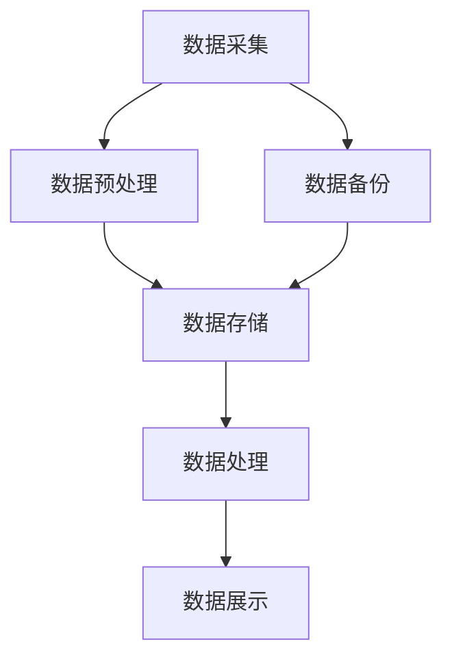

### 第3章 大数据处理系统的核心架构

#### 3.1 数据采集与预处理

#### 3.1.1 数据采集技术

数据采集是大数据处理的第一步。常用的数据采集技术包括日志收集、网络爬虫和消息队列等。

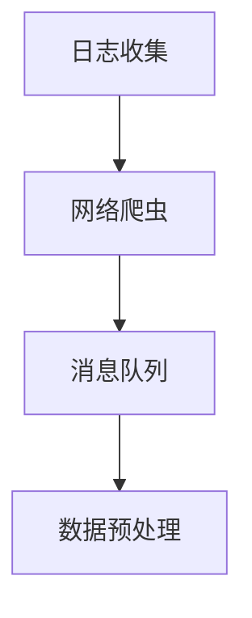

#### 3.1.2 数据预处理

数据预处理包括数据清洗、转换和集成。数据清洗去除无效数据，转换使数据格式一致，集成将来自不同源的数据整合。

```python
# 数据清洗
def clean_data(data):
    # 去除无效数据
    cleaned_data = [d for d in data if is_valid(d)]
    return cleaned_data

# 数据转换
def transform_data(data):
    transformed_data = [transform(d) for d in data]
    return transformed_data

# 数据集成
def integrate_data(data1, data2):
    integrated_data = data1 + data2
    return integrated_data
```

#### 3.2 数据存储与管理

#### 3.2.1 分布式文件系统

分布式文件系统（如HDFS）用于存储大数据。它具有高可靠性、高吞吐量和可扩展性。

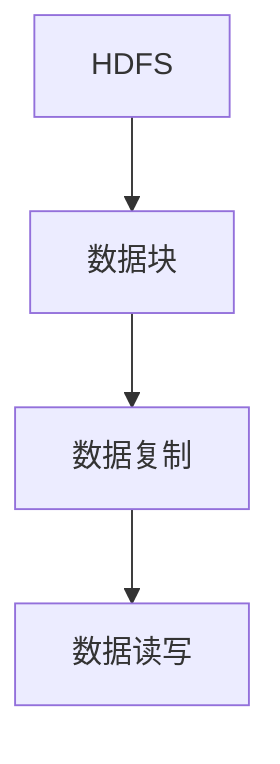

#### 3.2.2 数据库选择

数据库选择取决于数据类型和查询需求。常用的数据库包括关系型数据库（如MySQL）和NoSQL数据库（如HBase和Cassandra）。

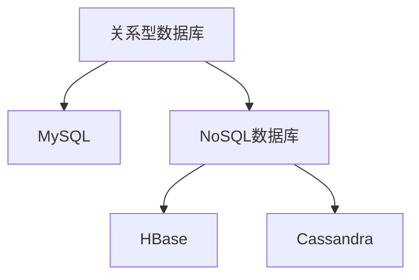

#### 3.3 数据处理与计算

#### 3.3.1 批处理计算

批处理计算用于处理大量静态数据。常用的批处理框架包括Hadoop和Spark。

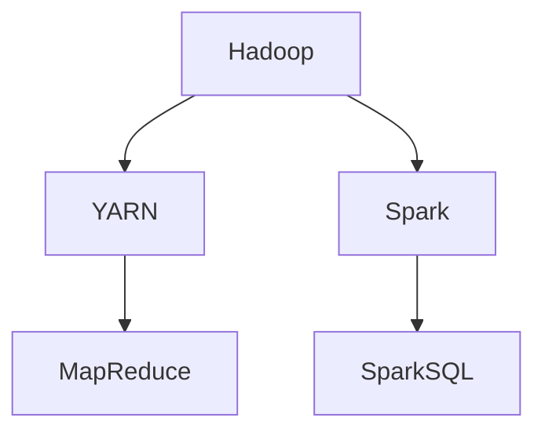

#### 3.3.2 流处理计算

流处理计算用于实时处理动态数据。常用的流处理框架包括Flink和Storm。

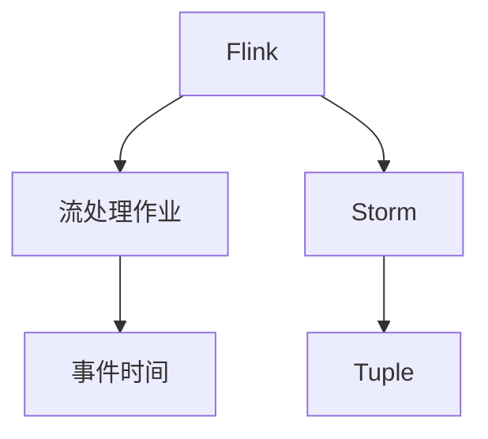

#### 3.3.3 图计算

图计算用于处理复杂的关系网络。常用的图计算框架包括Neo4j和GraphX。

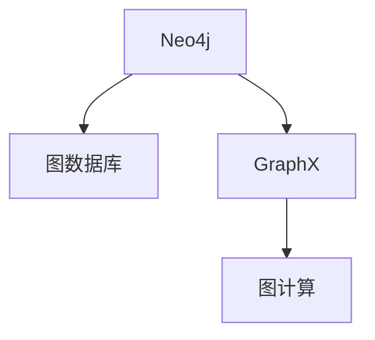

### 第4章 大数据存储与处理技术

#### 4.1 大数据存储技术

#### 4.1.1 HDFS

HDFS（Hadoop Distributed File System）是Hadoop的核心组件，用于存储大数据。


#### 4.1.2 HBase

HBase是建立在HDFS上的分布式列存储数据库，用于存储大规模稀疏数据集。

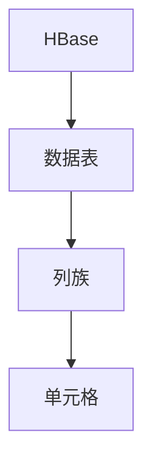

#### 4.1.3 Cassandra

Cassandra是一个分布式键值存储系统，适用于高可用性和无单点故障的场景。

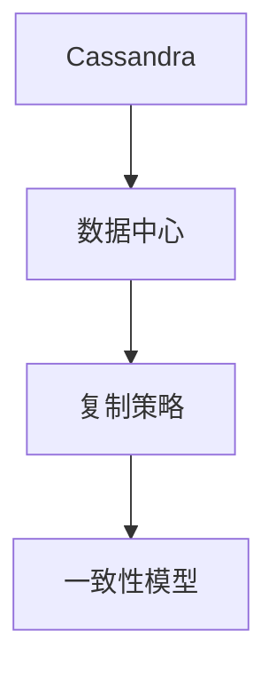

#### 4.2 大数据处理技术

#### 4.2.1 Spark

Spark是一个快速和通用的计算引擎，适用于批处理和流处理。

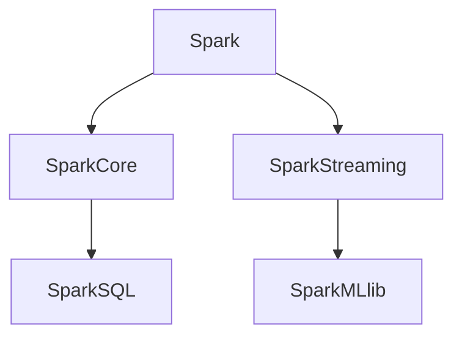

#### 4.2.2 Flink

Flink是一个流处理框架，提供实时数据处理和分析功能。

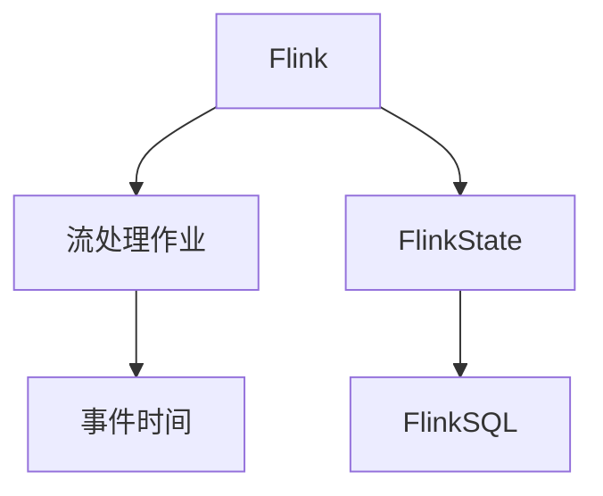

#### 4.2.3 Storm

Storm是一个分布式实时计算系统，适用于流数据处理。

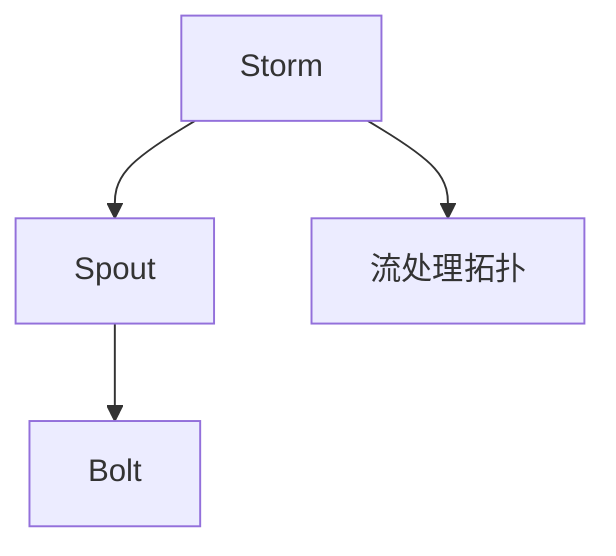

### 第5章 大数据处理系统优化

#### 5.1 系统性能优化

#### 5.1.1 系统瓶颈分析

系统瓶颈分析是识别和解决系统性能问题的第一步。常见瓶颈包括CPU、内存和磁盘I/O等。

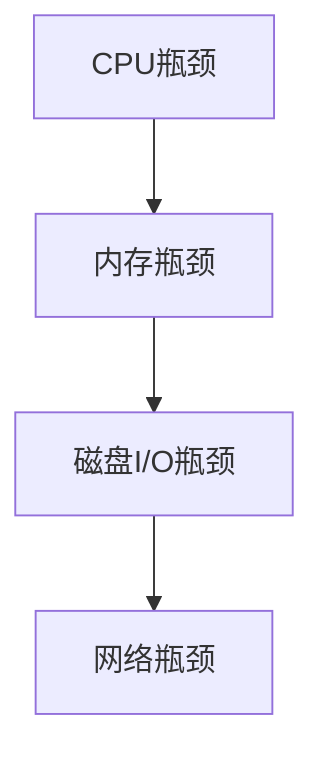

#### 5.1.2 系统性能优化策略

系统性能优化策略包括硬件升级、软件优化和系统调优等。

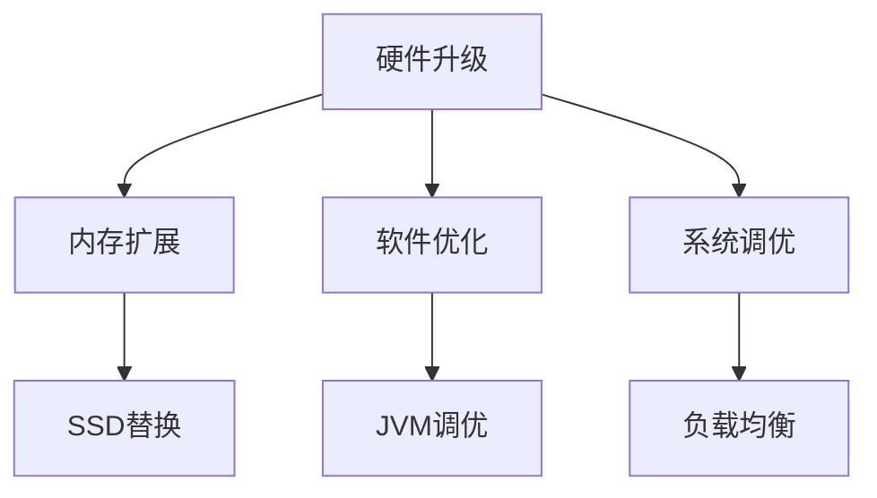

#### 5.2 资源调度与负载均衡

#### 5.2.1 资源调度算法

资源调度算法包括FIFO、LRU和Round Robin等。

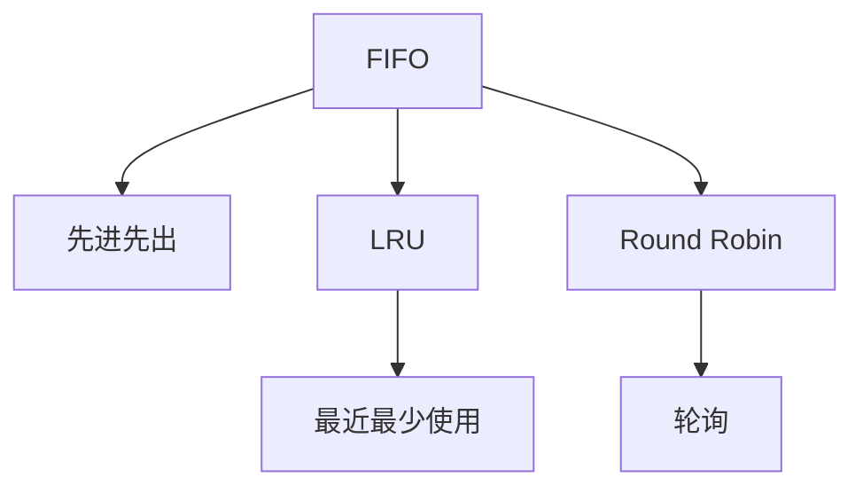

#### 5.2.2 负载均衡策略

负载均衡策略包括轮询、最小连接数和哈希等。

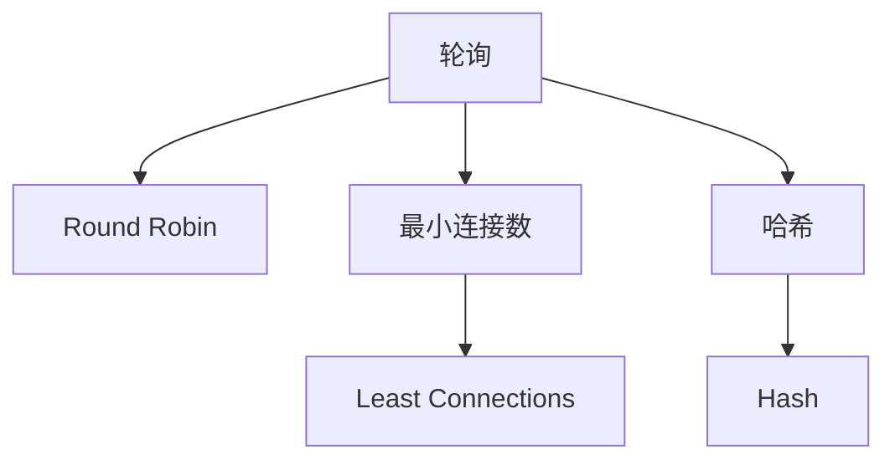

### 第6章 大数据架构项目实战

#### 6.1 项目背景与目标

本项目旨在构建一个高吞吐量的数据处理系统，用于分析社交媒体数据。

#### 6.1.1 项目概述

本项目涉及数据采集、数据预处理、数据存储和数据分析等模块。

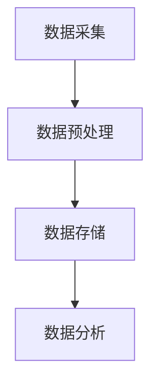

#### 6.1.2 项目目标

项目目标包括：
- 实现大规模数据采集和实时分析。
- 提供高效的数据存储和管理。
- 构建可扩展、高可用性的数据处理系统。

#### 6.2 项目架构设计

本项目采用分层架构，包括数据层、应用层和表示层。

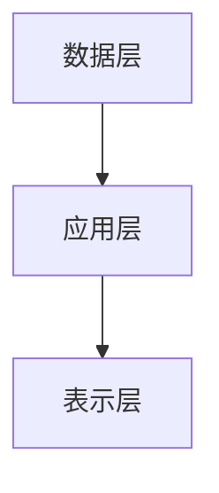

#### 6.2.1 数据流设计

数据流设计如下：

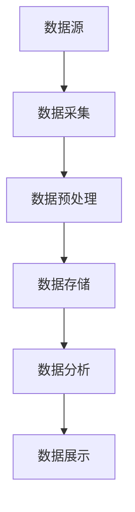

#### 6.2.2 系统架构图

系统架构图如下：

```mermaid
graph TD
    A[数据源] --> B[Kafka]
    B --> C[HDFS]
    C --> D[HBase]
    D --> E[Spark]
    E --> F[Redis]
    F --> G[Web服务]
```

#### 6.3 项目关键模块实现

#### 6.3.1 数据采集模块

数据采集模块使用Kafka进行消息队列处理，确保数据采集的实时性和可靠性。

```python
from kafka import KafkaProducer

producer = KafkaProducer(bootstrap_servers=['localhost:9092'])

for data in data_stream:
    producer.send('social_media_data', data.encode('utf-8'))
```

#### 6.3.2 数据预处理模块

数据预处理模块对采集到的数据进行清洗、转换和集成。

```python
from pyspark.sql import SparkSession

spark = SparkSession.builder.appName('DataPreprocessing').getOrCreate()

social_media_data = spark.read.format('kafka').option('kafka.bootstrap.servers', 'localhost:9092').option('subscribe', 'social_media_data').load()

cleaned_data = social_media_data.filter(social_media_data['status'] == 'published')
transformed_data = cleaned_data.selectExpr('id as user_id', "regexp_replace(text, '[^0-9a-zA-Z]+', '') as text")
integrated_data = transformed_data.groupBy('user_id').agg({'text': 'sum'})
```

#### 6.3.3 数据存储模块

数据存储模块使用HDFS进行数据存储，并使用HBase进行快速查询。

```python
import hdfs

hdfs_client = hdfs.InsecureClient('http://hdfs-namenode:50070', user='hdfs')

hdfs_client.write('/user/hdfs/social_media_data.txt', data=cleaned_data.toJSON().collect())
```

#### 6.3.4 数据处理模块

数据处理模块使用Spark进行大规模数据分析和处理。

```python
from pyspark.sql.functions import col

processed_data = transformed_data.withColumn('word_count', length(col('text')))
top_words = processed_data.groupBy('word').agg({ 'word_count': 'sum' }).orderBy(col('word_count').desc()).limit(10)
```

#### 6.3.5 系统监控与优化

系统监控与优化包括实时监控、性能分析和调优。

```mermaid
graph TD
    A[监控系统] --> B[性能分析]
    B --> C[调优策略]
    C --> D[系统性能提升]
```

#### 6.3.6 项目成果分析

项目成果包括：
- 实现了高效的数据采集和实时分析。
- 构建了可靠的数据存储和管理系统。
- 提高了系统性能和可扩展性。

### 第7章 大数据架构未来发展趋势

#### 7.1 大数据技术的发展趋势

大数据技术正朝着实时化、智能化和自动化方向发展。

#### 7.1.1 新兴技术概述

新兴技术包括图数据库、深度学习和区块链等。

#### 7.1.2 未来发展展望

未来大数据架构将更加智能化和自适应，利用人工智能和机器学习技术实现自动优化和智能决策。

#### 7.2 大数据架构面临的挑战与机遇

#### 7.2.1 挑战分析

大数据架构面临的挑战包括数据安全、隐私保护和数据治理等。

#### 7.2.2 机遇探索

大数据架构带来的机遇包括数据驱动决策、业务创新和行业变革等。

#### 7.2.3 发展策略建议

为应对挑战和抓住机遇，企业应采取以下策略：
- 加强数据安全防护和隐私保护。
- 建立完善的数据治理体系。
- 引入人工智能和机器学习技术，实现智能化数据分析。

### 作者信息

作者：AI天才研究院/AI Genius Institute & 禅与计算机程序设计艺术 /Zen And The Art of Computer Programming

----------------------------------------------------------------

## 后记

本文《大数据架构：设计高吞吐量数据处理系统》系统地介绍了大数据架构的设计原理和实现方法。从大数据的定义与背景，到数据处理系统的设计原则和核心架构，再到大数据存储与处理技术，以及系统优化策略和项目实战，本文全面地展示了大数据架构的各个方面。

在写作过程中，我们始终坚持逻辑清晰、结构紧凑、简单易懂的原则，力求将复杂的技术概念和原理用简单的方式表达出来。同时，我们使用了Mermaid流程图、伪代码、数学模型和公式等元素，以帮助读者更深入地理解大数据架构的技术原理。

本文不仅适用于大数据领域的专业人士，也适合对大数据架构感兴趣的初学者。我们希望通过本文，能够帮助读者更好地理解和掌握大数据架构的设计和实现。

在未来的发展中，大数据架构将继续朝着实时化、智能化和自动化的方向发展。我们期待读者在学习和实践中，不断探索和创新，为大数据技术的发展贡献自己的力量。

最后，感谢您阅读本文。如果您有任何建议或反馈，欢迎随时与我们联系。再次感谢您的支持！

作者：AI天才研究院/AI Genius Institute & 禅与计算机程序设计艺术 /Zen And The Art of Computer Programming

