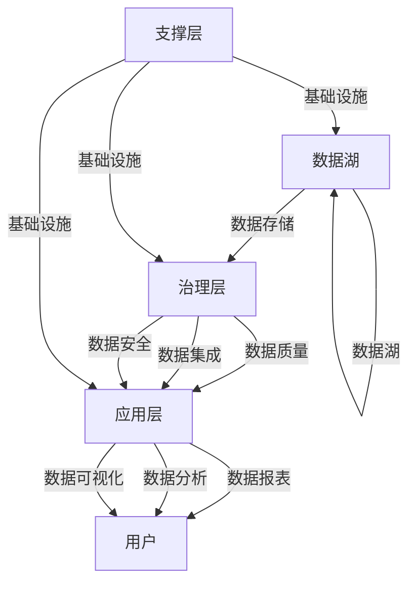
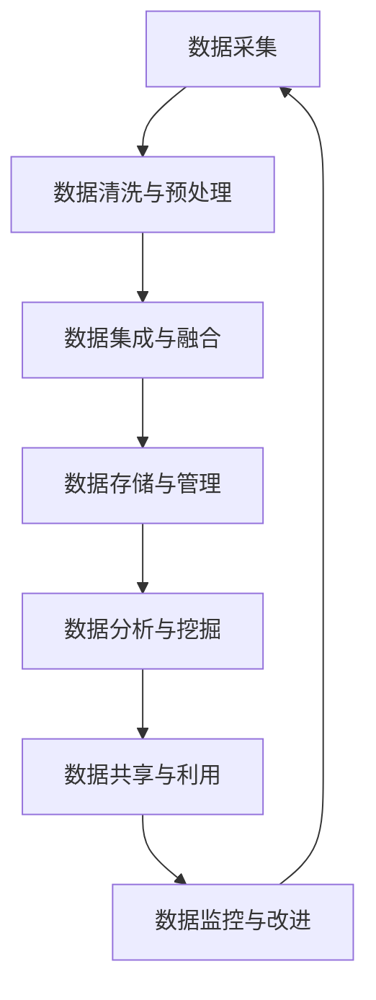
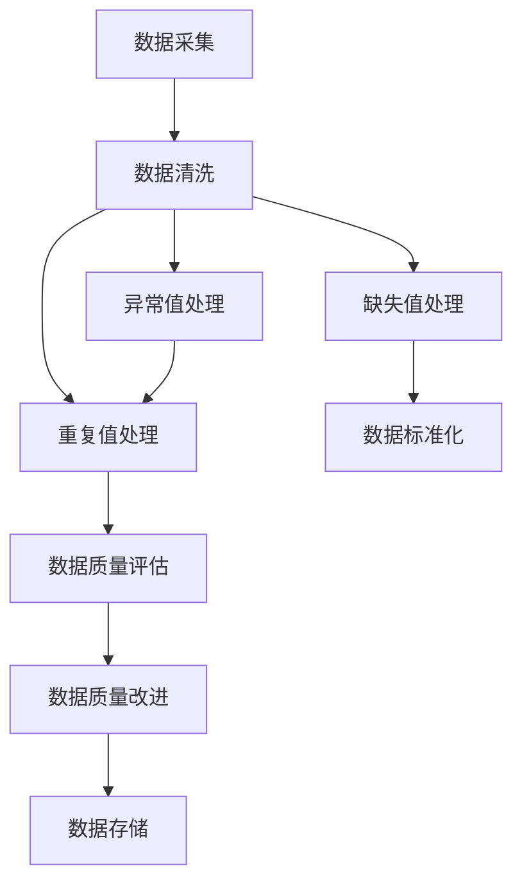
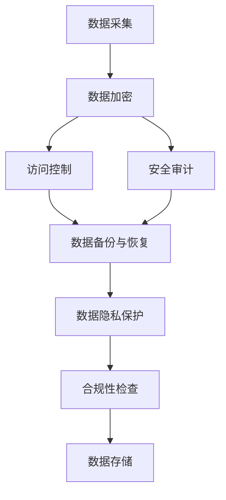
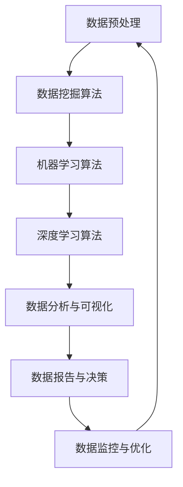

                 

### 文章标题

# 大数据治理：管理和利用海量数据资产

### 关键词

- 大数据治理
- 数据质量管理
- 数据安全与隐私保护
- 大数据架构
- 数据挖掘算法
- 人工智能与大数据

### 摘要

本文深入探讨了大数据治理的各个方面，从定义与重要性、关键技术、实际应用，到未来发展趋势。首先，我们介绍了大数据治理的基本概念和其重要性，并探讨了数据质量管理、数据安全与隐私保护等关键挑战。接着，本文详细阐述了大数据治理的核心技术，包括数据清洗与预处理、数据集成与融合、数据安全与隐私保护技术等，并运用伪代码和Mermaid流程图进行了详细讲解。随后，我们展示了大数据治理在企业、政府以及金融行业等领域的实际应用，并结合具体案例进行了剖析。最后，本文展望了大数据治理的未来发展趋势，并提出了发展策略与建议。希望通过本文，读者能够对大数据治理有更深入的理解和认识。

## 大数据治理的概述

### 1.1 大数据治理的定义与重要性

#### 1.1.1 大数据的定义

大数据（Big Data）指的是规模巨大、类型繁多的数据集合，这些数据量通常远远超出了传统数据处理系统的处理能力。大数据通常具有4V特性：Volume（数据量巨大）、Velocity（数据生成和处理速度极快）、Variety（数据类型繁多，包括结构化数据、半结构化数据和非结构化数据）和Veracity（数据的真实性和准确性难以保证）。

大数据的概念最初由Gartner提出，用来描述这样一种现象：随着数据生成和存储技术的不断发展，数据量呈现爆炸性增长，传统的数据处理方法已经无法满足需求。从互联网、社交媒体、物联网到企业内部系统，各种来源的数据不断涌入，形成了海量的数据资产。

#### 1.1.2 大数据治理的内涵

大数据治理（Big Data Governance）是指通过一系列的规则、流程和技术手段，确保数据的质量、安全、合规和有效利用的过程。大数据治理不仅仅是对数据的简单管理，而是一个系统性、全面性的过程，涉及数据的产生、存储、处理、分析和使用的各个环节。

大数据治理的主要目标是：

1. **数据质量管理**：确保数据的一致性、完整性和准确性。
2. **数据安全与隐私保护**：防止数据泄露、未授权访问和滥用。
3. **合规性管理**：遵守相关法律法规和行业标准。
4. **数据利用最大化**：通过有效的数据分析，挖掘数据的价值。

#### 1.1.3 大数据治理的重要性

大数据治理的重要性体现在以下几个方面：

1. **价值最大化**：通过治理，可以确保数据的高质量，从而最大化数据的价值。
2. **风险最小化**：有效的数据治理可以降低数据隐私泄露、合规性风险等风险。
3. **决策支持**：良好的数据治理能够提供准确、及时的数据支持，辅助决策者做出明智的决策。
4. **企业竞争力**：在数据驱动的时代，具备强大数据治理能力的企业将更具竞争力。

大数据治理的关键在于构建一个有效的数据治理框架，这个框架应包括数据策略、组织结构、流程规范、技术工具等要素，并确保这些要素相互协调、相互支撑，从而实现数据治理的目标。

### 1.2 大数据治理的挑战与机遇

#### 1.2.1 数据质量管理

数据质量管理是大数据治理的核心之一，其目标是确保数据的准确性、一致性、完整性和及时性。在大数据环境中，数据质量管理面临着诸多挑战：

1. **数据多样性**：大数据涵盖多种类型的数据，包括结构化、半结构化和非结构化数据，这使得数据质量管理的难度大大增加。
2. **数据来源广泛**：大数据来源多样，包括内部和外部数据，数据质量的差异性和不一致性给数据治理带来挑战。
3. **数据动态性**：大数据环境的动态性使得数据质量需要不断更新和验证。

为了应对这些挑战，数据质量管理需要采用一系列的技术和策略，包括数据清洗、数据集成、数据质量监控等。

#### 1.2.2 数据安全与隐私保护

数据安全和隐私保护是大数据治理的另一个重要方面。在大数据时代，数据泄露和隐私侵犯事件层出不穷，这不仅给企业和个人带来巨大的经济损失，还可能导致法律诉讼和声誉受损。

1. **数据泄露风险**：大数据的集中存储和处理增加了数据泄露的风险。
2. **隐私保护要求**：随着数据隐私保护法律法规的不断完善，企业和组织需要确保数据处理过程符合相关法规要求。
3. **用户信任**：用户对数据隐私的关注度不断提高，这要求企业和组织采取有效的隐私保护措施。

为了确保数据安全和隐私保护，大数据治理需要采用一系列安全技术和策略，包括数据加密、访问控制、安全审计等。

#### 1.2.3 大数据治理的战略规划

大数据治理的战略规划是确保数据治理工作有效实施的关键。一个良好的大数据治理战略应包括以下方面：

1. **明确目标和愿景**：确定数据治理的目标和愿景，确保与企业的整体战略相一致。
2. **建立组织架构**：设立专门的数据治理团队，明确职责和权限，确保数据治理工作的有效执行。
3. **制定流程和标准**：制定详细的数据治理流程和标准，确保数据从产生到使用整个过程都有据可依。
4. **技术工具支持**：选择合适的数据治理工具，提高数据治理的效率和效果。
5. **培训与文化建设**：加强数据治理相关培训，培养数据治理意识和能力，建立数据文化。

通过制定和实施有效的数据治理战略，企业和组织可以更好地管理和利用其数据资产，实现数据驱动的业务增长和创新。

### 1.3 大数据治理的核心架构

大数据治理的核心架构是确保数据治理工作有序、高效开展的基础。一个完整的大数据治理架构应包括以下几个关键组件：

#### 1.3.1 大数据治理框架

大数据治理框架是一个系统化的指导框架，用于定义数据治理的目标、原则、流程和责任。它通常包括以下几个关键组成部分：

1. **数据治理策略**：明确数据治理的目标、原则和方向，确保数据治理工作与企业战略一致。
2. **数据治理组织**：设立数据治理委员会、数据治理团队等组织架构，明确职责和权限，确保数据治理工作有序开展。
3. **数据治理流程**：制定详细的数据治理流程，包括数据采集、存储、处理、分析、共享等各个环节，确保数据治理工作规范化、制度化。
4. **数据治理标准**：制定统一的数据治理标准，包括数据质量标准、数据安全标准、数据合规性标准等，确保数据治理工作有据可依。

#### 1.3.2 大数据治理的关键组件

大数据治理的关键组件是实施数据治理策略和流程的技术工具和平台。以下是一些主要的关键组件：

1. **数据质量管理工具**：用于监控、评估和改进数据质量，包括数据清洗工具、数据集成工具、数据质量监控工具等。
2. **数据安全与隐私保护工具**：用于确保数据的安全和隐私，包括数据加密工具、访问控制工具、安全审计工具等。
3. **数据治理平台**：集成多种数据治理工具和功能，提供统一的数据治理门户，方便用户进行数据管理和监控。
4. **数据仓库和数据湖**：用于存储和管理大规模数据，提供高效的数据存储和处理能力。
5. **数据治理API**：提供与外部系统和工具的集成接口，支持数据治理工作的自动化和智能化。

#### 1.3.3 大数据治理流程设计

大数据治理流程设计是确保数据治理工作有序、高效开展的关键。以下是一个典型的大数据治理流程设计：

1. **数据采集与整合**：从各种数据源采集数据，并进行数据整合，确保数据的全面性和一致性。
2. **数据清洗与预处理**：对采集到的数据进行清洗和预处理，包括去除重复数据、填补缺失值、格式标准化等，确保数据的质量。
3. **数据存储与管理**：将清洗后的数据存储到数据仓库或数据湖中，并进行分类、标签管理等操作，方便数据检索和管理。
4. **数据分析与挖掘**：利用数据挖掘算法和工具，对存储好的数据进行深入分析，发现数据中的隐藏价值。
5. **数据共享与利用**：将分析结果和有价值的数据进行共享，支持业务决策和战略规划。
6. **数据监控与改进**：持续监控数据质量和安全，发现问题及时进行改进和优化。

通过设计科学合理的大数据治理流程，企业和组织可以更好地管理和利用其数据资产，实现数据驱动的业务增长和创新。

### 1.4 大数据治理的国际标准与最佳实践

#### 1.4.1 国际大数据治理标准

大数据治理的国际标准为全球企业和组织提供了统一的指导和规范，确保数据治理工作的高效和合规。以下是一些主要的大数据治理国际标准：

1. **ISO/IEC 27001**：国际标准化组织（ISO）和国际电工委员会（IEC）共同发布的《信息安全管理体系（ISMS）》，用于指导信息安全管理的全过程，包括数据保护、数据安全等。
2. **ISO/IEC 27002**：该标准提供了信息安全管理的最佳实践，包括数据治理、数据安全、访问控制、数据备份和恢复等。
3. **ISO/IEC 27017**：专门针对云计算环境下的信息安全管理体系，为云计算服务提供商和用户提供了数据治理和信息安全管理的指导。
4. **ISO/IEC 27018**：专门针对个人数据处理的信息安全标准，为处理个人数据的组织提供了数据治理和隐私保护的最佳实践。

#### 1.4.2 国内大数据治理法规

国内大数据治理法规为企业和组织提供了法律依据和规范，确保数据治理工作的合规性。以下是一些主要的大数据治理国内法规：

1. **《中华人民共和国网络安全法》**：该法律明确了网络运营者的数据安全保护责任，要求加强对数据的采集、存储、处理、传输等环节的安全管理。
2. **《信息安全技术个人信息安全规范》**：该规范为个人数据处理提供了详细的要求和指导，确保个人信息的安全和保护。
3. **《网络安全审查办法》**：该办法对涉及国家安全、社会公共利益等关键信息基础设施的网络安全审查进行了规定，确保网络产品和服务的安全可靠。
4. **《数据安全法》**：该法律明确了数据安全保护的基本要求和原则，规定了数据处理者的数据安全保护义务和责任。

#### 1.4.3 大数据治理最佳实践

大数据治理最佳实践是国内外成功企业和组织的成功经验总结，为其他企业和组织提供了宝贵的参考。以下是一些典型的大数据治理最佳实践：

1. **建立数据治理组织**：设立专门的数据治理委员会或团队，明确数据治理的责任和权限，确保数据治理工作的高效和有序。
2. **制定数据治理策略和流程**：根据企业的实际情况，制定详细的数据治理策略和流程，包括数据质量管理、数据安全与隐私保护、数据合规性管理等。
3. **采用先进的数据治理工具和技术**：选择适合企业需求的数据治理工具和技术，提高数据治理的效率和效果。
4. **加强数据文化建设**：培养员工的数据治理意识和能力，建立数据驱动的企业文化和组织氛围。
5. **持续改进和优化**：定期评估数据治理工作的效果，发现问题及时进行改进和优化，确保数据治理工作的持续改进。

通过学习和借鉴国际标准和国内法规，以及成功企业的最佳实践，企业和组织可以更好地开展大数据治理工作，实现数据价值的最大化。

## 数据质量管理技术

### 2.1.1 数据清洗与预处理

数据清洗与预处理是数据质量管理的重要环节，其目的是确保数据的质量和一致性，为后续的数据分析提供可靠的基础。以下我们将详细探讨数据清洗与预处理的技术和策略。

#### 2.1.1.1 数据清洗算法

数据清洗通常包括以下几个步骤：

1. **缺失值处理**：缺失值处理是数据清洗的首要任务。常见的缺失值处理方法包括：
   - **删除缺失值**：对于某些数据集，可以删除缺失值较多的记录，但这种方法可能会丢失有价值的信息。
   - **填充缺失值**：常见的填充方法包括：
     - **平均值填充**：用该特征的平均值来填充缺失值。
     - **中位数填充**：用该特征的中位数来填充缺失值。
     - **众数填充**：用该特征的众数来填充缺失值。
     - **线性插值**：根据已知值进行线性插值，填补缺失值。

2. **异常值处理**：异常值可能会对数据分析产生误导，因此需要对其进行处理。常见的异常值处理方法包括：
   - **删除异常值**：对于影响较大的异常值，可以考虑删除。
   - **修正异常值**：通过数据分析方法修正异常值，例如使用回归分析估计真实值。
   - **标准化处理**：对数据进行标准化处理，使得异常值对整体数据的影响减小。

3. **重复值处理**：重复值会导致数据分析结果不准确，因此需要删除重复值。重复值的识别可以通过比较不同记录的某个或某些特征，例如ID、时间戳等，来确定。

#### 2.1.1.2 数据预处理流程

数据预处理流程通常包括以下几个步骤：

1. **数据采集**：从各种数据源采集数据，包括结构化数据、半结构化数据和非结构化数据。
2. **数据清洗**：对采集到的数据进行清洗，处理缺失值、异常值和重复值。
3. **数据集成**：将来自不同数据源的数据进行集成，消除数据冗余，保证数据的一致性。
4. **数据标准化**：对数据进行标准化处理，包括数值型数据的缩放、分类数据的编码等，以便于后续的数据分析。
5. **数据存储**：将清洗后的数据存储到数据仓库或数据湖中，便于后续的数据分析和使用。

以下是一个简化的数据预处理流程的伪代码：

```plaintext
function data_preprocessing(data):
    # 缺失值处理
    data = handle_missing_values(data)
    # 异常值处理
    data = handle_outliers(data)
    # 重复值处理
    data = remove_duplicates(data)
    # 数据集成
    data = data_integration(data)
    # 数据标准化
    data = data_standardization(data)
    # 数据存储
    store_data(data)
    return data
```

#### 2.1.2 数据集成与融合

数据集成与融合是数据质量管理的重要组成部分，其目的是将来自不同来源和格式的数据整合成一个统一的数据视图，以便于后续的分析和使用。

##### 2.1.2.1 数据集成算法

数据集成算法主要解决以下问题：

1. **数据一致性**：确保不同数据源中的数据在语义和结构上的一致性。常见的方法包括：
   - **主键匹配**：通过主键或唯一标识符将不同数据源中的记录进行匹配。
   - **实体识别**：通过自然语言处理和机器学习技术，识别和匹配不同数据源中的实体。

2. **数据冗余**：消除冗余数据，确保数据的唯一性和准确性。常见的方法包括：
   - **去重**：通过比较不同数据源中的记录，删除重复的记录。
   - **数据合并**：将具有相同主键或唯一标识符的记录进行合并，消除冗余。

3. **数据转换**：将不同格式和结构的数据转换为统一的格式，以便于后续的数据分析。常见的方法包括：
   - **数据类型转换**：将字符串转换为数值型、日期型等。
   - **数据格式转换**：将不同格式的数据转换为统一的JSON、CSV等格式。

##### 2.1.2.2 数据融合策略

数据融合策略主要包括以下几种：

1. **全量融合**：将所有数据源的数据进行融合，形成一个全面的数据视图。这种方法可能会引入大量的冗余数据，但能够提供最全面的数据视图。

2. **增量融合**：仅融合新增的数据，对已有数据进行更新。这种方法能够降低数据冗余，提高数据处理效率。

3. **分层融合**：根据数据的用途和重要性，将数据分为不同的层次进行融合。例如，将核心业务数据与其他辅助数据进行分层融合，确保核心数据的高质量和一致性。

以下是一个简化的数据集成与融合流程的伪代码：

```plaintext
function data_integration(data_sources):
    # 数据一致性处理
    data = handle_data_consistency(data_sources)
    # 数据冗余处理
    data = remove_data_redundancy(data)
    # 数据格式转换
    data = convert_data_format(data)
    return data

function data_fusion(data):
    # 全量融合
    full_data = full_integration(data)
    # 增量融合
    incremental_data = incremental_integration(data)
    # 分层融合
    layered_data = layered_integration(data)
    return full_data, incremental_data, layered_data
```

通过数据清洗与预处理、数据集成与融合等技术，我们可以确保数据的质量和一致性，为后续的数据分析和决策提供可靠的基础。

### 数据安全与隐私保护技术

在当前的大数据环境中，数据安全和隐私保护是至关重要的。随着数据泄露事件和数据隐私侵犯案例的不断增加，企业和组织必须采取有效的技术手段来确保数据的安全和隐私。以下我们将详细探讨数据安全与隐私保护的关键技术和策略。

#### 2.2.1 加密技术

加密技术是确保数据安全和隐私保护的基础。通过加密，我们可以将明文数据转换为密文，从而防止未授权的访问和篡改。加密技术主要分为以下几类：

##### 2.2.1.1 对称加密

对称加密是一种加密和解密使用相同密钥的加密方法。常见的对称加密算法包括：

- **AES（高级加密标准）**：AES是一种常用的对称加密算法，具有高效、安全的特点，广泛应用于大数据处理和存储领域。
- **DES（数据加密标准）**：DES是一种较早的对称加密算法，但由于密钥长度较短，已逐渐被AES替代。

以下是对称加密的基本算法原理：

```plaintext
输入：明文消息M，密钥K
输出：密文C

加密过程：
C = E_K(M)

解密过程：
M = D_K(C)
```

对称加密的优点是计算速度快，但缺点是密钥管理复杂，无法确保密钥的安全传输。

##### 2.2.1.2 非对称加密

非对称加密是一种加密和解密使用不同密钥的加密方法。常见的非对称加密算法包括：

- **RSA（RSA算法）**：RSA是一种基于大整数分解难题的非对称加密算法，具有高安全性和可扩展性的优点，广泛应用于大数据处理和存储领域。
- **ECC（椭圆曲线加密）**：ECC是一种基于椭圆曲线离散对数问题的非对称加密算法，具有更高的安全性和更小的密钥长度。

以下是非对称加密的基本算法原理：

```plaintext
输入：公钥(PK)，私钥(SK)，明文消息M
输出：密文C

加密过程：
C = E_PK(M)

解密过程：
M = D_SK(C)
```

非对称加密的优点是解决了密钥管理问题，但缺点是计算速度较慢。

#### 2.2.2 数据隐私保护算法

数据隐私保护算法主要用于保护数据在传输和存储过程中的隐私，防止数据泄露和未经授权的访问。以下是一些常见的数据隐私保护算法：

##### 2.2.2.1 隐蔽传输

隐蔽传输是一种通过加密和隐藏数据传输内容的方法，以防止数据泄露。常见的隐蔽传输技术包括：

- **匿名通信**：通过加密和中间人技术实现匿名通信，防止通信双方的隐私泄露。
- **隐蔽通道**：通过将隐私数据隐藏在其他非隐私数据中，实现隐私数据的隐蔽传输。

以下是一个简单的匿名通信的伪代码：

```plaintext
输入：消息M，接收方公钥PK2
输出：匿名消息A

匿名通信过程：
A = E_PK2(M)
```

##### 2.2.2.2 隐私同化

隐私同化是一种通过将隐私数据与大量非隐私数据混合，使得隐私数据无法被单独识别的方法。常见的隐私同化技术包括：

- **噪声注入**：通过在隐私数据上添加噪声，使得隐私数据无法被单独识别。
- **数据扰动**：通过改变隐私数据的某些特征，使得隐私数据无法被单独识别。

以下是一个简单的噪声注入的伪代码：

```plaintext
输入：隐私数据D，噪声N
输出：同化数据A

噪声注入过程：
A = D + N
```

通过加密技术、匿名通信和数据隐私保护算法，我们可以有效地保护大数据的安全和隐私，确保数据在传输和存储过程中的安全性和隐私性。

### 数据治理工具与平台

在大数据治理过程中，选择合适的数据治理工具与平台至关重要。这些工具和平台不仅能够提高数据治理的效率，还能确保数据的质量、安全性和合规性。以下我们将详细介绍开源大数据治理工具、商业大数据治理平台以及大数据治理平台的架构设计。

#### 2.3.1 开源大数据治理工具

开源大数据治理工具因其灵活性和可定制性，受到许多企业和开发者的青睐。以下是一些常见的大数据治理开源工具：

1. **Apache Atlas**：Apache Atlas是一个开源的数据治理框架，提供元数据管理、数据分类和标签管理等功能。Atlas能够帮助企业和组织实现对大规模数据的统一管理和监控。

2. **Apache governance**：Apache governance提供了一套数据治理工具，包括数据质量评估、数据分类、数据标签管理等功能，旨在帮助企业管理和保护其数据资产。

3. **Apache Sentry**：Apache Sentry是一个开源的数据访问控制工具，主要用于管理对大数据集群中数据的访问权限。Sentry支持细粒度的权限控制，能够确保数据的安全和合规性。

4. **OpenLineage**：OpenLineage是一个开源的数据 lineage 工具，用于追踪和记录数据处理过程中的数据流动。OpenLineage能够帮助企业和组织实现数据治理的可视化和透明化。

这些开源大数据治理工具各自具有独特的功能和优势，企业和组织可以根据具体需求选择合适的工具进行集成和应用。

#### 2.3.2 商业大数据治理平台

商业大数据治理平台通常提供更全面和专业的数据治理功能，能够满足企业大规模数据治理的需求。以下是一些常见的大数据治理商业平台：

1. **Informatica Master Data Management**：Informatica 是一家知名的数据管理软件公司，其 Master Data Management 平台提供数据质量、数据集成、数据安全和数据治理等功能。Informatica 平台支持多种数据源和数据类型，能够帮助企业实现全面的的数据治理。

2. **IBM InfoSphere**：IBM InfoSphere 是一款功能强大的数据治理平台，提供数据质量、数据集成、数据安全和数据治理等功能。InfoSphere 支持多种数据源和数据类型，能够帮助企业实现端到端的数据治理。

3. **Talend Data Management Platform**：Talend 是一家提供大数据治理解决方案的公司，其 Data Management Platform 提供数据质量、数据集成、数据安全和数据治理等功能。Talend 平台具有高性能和高扩展性，能够满足企业大规模数据治理的需求。

4. **Alation Data Management Platform**：Alation 是一家提供数据治理和数据 catalog 软件的公司，其 Data Management Platform 提供数据质量、数据分类、数据标签管理和数据治理等功能。Alation 平台具有智能推荐和数据治理自动化功能，能够帮助企业提高数据治理的效率。

商业大数据治理平台通常提供更全面的功能、更好的性能和更专业的技术支持，是企业进行大规模数据治理的理想选择。

#### 2.3.3 大数据治理平台架构

大数据治理平台的架构设计是确保数据治理工作高效、稳定和安全的关键。以下是一个典型的大数据治理平台架构：

1. **数据层**：数据层是大数据治理平台的基础，包括数据存储、数据仓库和数据湖等组件。数据层负责存储和管理大规模数据，支持数据的质量管理和安全控制。

2. **治理层**：治理层是大数据治理平台的核心，包括数据质量管理、数据集成、数据安全和数据治理等组件。治理层负责确保数据的质量、安全性和合规性，支持数据的高效管理和利用。

3. **应用层**：应用层是大数据治理平台面向用户的接口，包括数据报表、数据分析、数据可视化和数据治理工具等组件。应用层提供直观的用户界面和强大的数据分析功能，支持用户对数据进行查询、分析和决策。

4. **支撑层**：支撑层是大数据治理平台的基础设施，包括服务器、存储、网络和云计算等组件。支撑层负责提供稳定、高效的基础设施支持，确保大数据治理平台的高可用性和可扩展性。

以下是一个简化的大数据治理平台架构的 Mermaid 流程图：



通过合理的大数据治理平台架构设计，企业和组织可以高效、稳定和安全地进行大数据治理，实现数据价值的最大化。

### 大数据治理的算法原理与实现

大数据治理不仅依赖于技术工具和平台，还依赖于一系列核心算法原理，这些算法能够帮助我们从海量数据中提取有用信息，确保数据的质量和安全性。以下，我们将详细探讨数据挖掘算法、机器学习算法、深度学习算法等在大数据治理中的应用，并使用伪代码和 Mermaid 流程图进行阐述。

#### 2.4.1 数据挖掘算法

数据挖掘算法是大数据治理中用于发现数据中隐藏的模式和关联性的重要工具。以下是一些常见的数据挖掘算法及其基本原理：

1. **关联规则挖掘（Apriori 算法）**：关联规则挖掘用于发现数据中的频繁模式，例如购物篮分析。Apriori 算法通过迭代计算支持度和置信度来发现关联规则。

   ```plaintext
   输入：数据集D，最小支持度min_support，最小置信度min_confidence
   输出：频繁项集L和关联规则R

   Apriori算法：
   1. 计算所有项集的支持度，生成频繁项集L1
   2. 对于每个频繁项集k，生成其直接后代项集Lk+1
   3. 去除不满足最小支持度的项集，生成新的频繁项集Lk
   4. 重复步骤2和3，直到不存在新的频繁项集为止
   5. 生成关联规则R
   ```

2. **分类算法（K-最近邻算法）**：分类算法用于将数据划分为不同的类别。K-最近邻算法通过计算未知数据与训练数据之间的相似度，来预测未知数据的类别。

   ```plaintext
   输入：训练集T，测试集X，邻居数量k
   输出：预测类别y

   K-最近邻算法：
   1. 对于每个测试数据x，计算它与训练集中每个数据的距离
   2. 选择距离最小的k个邻居
   3. 根据邻居的类别预测当前数据的类别
   ```

3. **聚类算法（K-均值算法）**：聚类算法用于将数据划分为若干个聚类，每个聚类内的数据相似度较高，而不同聚类间的数据相似度较低。K-均值算法通过迭代计算聚类中心，来优化聚类结果。

   ```plaintext
   输入：数据集D，聚类数量k
   输出：聚类结果C

   K-均值算法：
   1. 随机初始化k个聚类中心
   2. 对于每个数据点，计算它与各个聚类中心的距离，并将其分配到最近的聚类
   3. 更新聚类中心
   4. 重复步骤2和3，直到聚类中心不再发生变化或满足停止条件
   ```

#### 2.4.2 机器学习算法

机器学习算法是大数据治理中的重要工具，能够自动从数据中学习模式和规律，为数据治理提供有力支持。以下是一些常见的机器学习算法及其基本原理：

1. **线性回归**：线性回归用于预测连续值变量，其基本原理是通过最小化损失函数来拟合一条直线，表示输入变量和输出变量之间的关系。

   ```plaintext
   输入：训练集T，特征矩阵X，标签向量y
   输出：回归系数θ

   线性回归：
   1. 定义损失函数：J(θ) = (1/2m) * Σ(yi - θ^Txi)^2
   2. 计算梯度：∇J(θ) = X^T(y - Xθ)
   3. 更新系数：θ = θ - α * ∇J(θ)
   ```

2. **决策树**：决策树用于分类和回归任务，其基本原理是通过递归地将数据集划分为若干个子集，直到满足停止条件，形成一棵树形结构。

   ```plaintext
   输入：训练集T，特征集合F
   输出：决策树T

   决策树构建：
   1. 对于每个特征，计算其在当前数据集上的增益
   2. 选择增益最大的特征作为切分特征
   3. 根据切分特征将数据集划分为若干个子集
   4. 对于每个子集，重复步骤1-3，直到满足停止条件
   ```

3. **支持向量机（SVM）**：SVM用于分类和回归任务，其基本原理是通过找到一个最优的超平面，将不同类别的数据点分隔开，并最大化分类边界。

   ```plaintext
   输入：训练集T，特征矩阵X，标签向量y
   输出：支持向量超平面θ

   SVM：
   1. 定义损失函数：L(θ) = (1/2m) * Σ(θ^Txi - yi)^2
   2. 计算梯度：∇L(θ) = X^T(θ - y)
   3. 更新系数：θ = θ - α * ∇L(θ)
   ```

#### 2.4.3 深度学习算法

深度学习算法是机器学习的一种重要分支，通过构建多层神经网络，能够自动从数据中学习复杂的模式和关联性。以下是一些常见的深度学习算法及其基本原理：

1. **卷积神经网络（CNN）**：CNN 用于图像和视频等数据的分类和识别，其基本原理是通过卷积层、池化层和全连接层等结构，提取数据中的特征。

   ```plaintext
   输入：训练集T，输入矩阵X，标签向量y
   输出：输出矩阵Y

   CNN：
   1. 卷积层：计算输入数据与卷积核之间的点积，生成特征图
   2. 池化层：对特征图进行下采样，减少数据维度
   3. 全连接层：将池化层输出的特征图映射到输出空间
   4. 损失函数：使用交叉熵损失函数来计算预测结果与真实标签之间的差异
   ```

2. **循环神经网络（RNN）**：RNN 用于序列数据的建模和预测，其基本原理是通过递归结构，将前一个时刻的输出作为当前时刻的输入。

   ```plaintext
   输入：训练集T，输入序列X，标签序列y
   输出：输出序列Y

   RNN：
   1. 前向传播：计算当前时刻的输出，并更新隐藏状态
   2. 反向传播：计算损失函数，并更新网络参数
   3. 递归更新：将当前时刻的隐藏状态传递到下一个时刻
   ```

3. **生成对抗网络（GAN）**：GAN 用于生成与真实数据分布相近的数据，其基本原理是通过生成器和判别器的对抗训练，使生成器生成的数据越来越接近真实数据。

   ```plaintext
   输入：训练集T，生成器G，判别器D
   输出：生成数据X'

   GAN：
   1. 生成器G：生成与真实数据分布相近的数据
   2. 判别器D：判断输入数据是真实数据还是生成数据
   3. 对抗训练：通过优化生成器和判别器的参数，使生成器生成的数据越来越接近真实数据
   ```

通过数据挖掘算法、机器学习算法和深度学习算法，大数据治理能够自动从海量数据中提取有价值的信息，提高数据的质量和安全性。这些算法不仅为大数据治理提供了强大的技术支持，还推动了人工智能和大数据技术的深度融合。

### 大数据治理在企业中的应用

大数据治理在企业中的应用正日益普及，它不仅提升了企业的数据管理能力，还为企业带来了显著的商业价值。以下，我们将探讨大数据治理在企业中的具体应用，包括企业数据资产管理、企业数据治理体系建设以及企业大数据治理实践案例。

#### 3.1.1 企业数据资产管理

企业数据资产是企业最宝贵的资源之一，对其进行有效的管理和利用是企业实现数据驱动发展的关键。以下是企业数据资产管理的几个关键步骤：

1. **数据资产识别**：首先，企业需要识别其内部的数据资产，包括结构化数据、非结构化数据以及半结构化数据。这可以通过数据资产盘点、数据分类和标签管理等方式实现。

2. **数据资产评估**：识别出数据资产后，企业需要对数据资产进行评估，确定其价值和使用频率。这有助于企业了解哪些数据资产是关键性的，以及如何优化这些数据资产的使用。

3. **数据资产存储**：企业需要选择合适的数据存储方案，确保数据的安全和可靠性。这包括选择合适的数据库、数据仓库和数据湖，并确保数据的备份和恢复机制。

4. **数据资产流通**：为了最大化数据资产的价值，企业需要确保数据能够顺畅地在各个业务部门之间流通。这可以通过建立数据交换平台和数据共享机制来实现。

5. **数据资产保护**：企业需要采取有效的数据安全措施，防止数据泄露、篡改和滥用。这包括数据加密、访问控制、数据监控等安全措施。

#### 3.1.2 企业数据治理体系建设

企业数据治理体系建设是企业进行大数据治理的基础，它确保企业的数据管理具有系统性、规范性和可持续性。以下是企业数据治理体系建设的关键步骤：

1. **制定数据治理策略**：企业需要制定详细的数据治理策略，明确数据治理的目标、原则、流程和责任。这有助于确保数据治理工作与企业战略保持一致，并为企业提供明确的指导。

2. **建立数据治理组织**：企业需要设立专门的数据治理团队或委员会，明确团队成员的职责和权限。这有助于确保数据治理工作的高效和有序开展。

3. **制定数据治理流程**：企业需要制定详细的数据治理流程，包括数据采集、存储、处理、分析和共享等各个环节。这有助于确保数据治理工作的规范化、制度化和可持续性。

4. **建立数据质量标准**：企业需要建立统一的数据质量标准，包括数据准确性、一致性、完整性和及时性等。这有助于确保数据的质量和可靠性。

5. **建立数据安全与隐私保护机制**：企业需要制定详细的数据安全与隐私保护策略，确保数据的机密性、完整性和可用性。这包括数据加密、访问控制、安全审计等安全措施。

6. **建立数据合规性管理体系**：企业需要确保其数据处理过程符合相关法律法规和行业标准，以避免法律风险和合规性问题。

#### 3.1.3 企业大数据治理实践案例

以下是一些企业大数据治理的实践案例，展示了大数据治理如何在不同行业和企业中实现成功：

1. **电商行业**：某大型电商平台通过大数据治理，实现了用户行为数据的全面收集和分析。通过对用户行为数据的挖掘，该平台优化了推荐算法，提高了用户的购物体验和购买转化率。此外，该平台还通过数据质量管理，确保了用户数据的准确性和一致性，为精准营销提供了可靠的数据支持。

2. **金融行业**：某金融机构通过大数据治理，建立了全面的数据治理体系。该体系包括数据资产识别、数据质量监控、数据安全与隐私保护等多个方面。通过这个体系，该金融机构能够确保其数据的安全和合规，同时提高了数据利用效率，为风险管理、投资决策等提供了有力支持。

3. **制造业**：某制造企业通过大数据治理，实现了生产过程的数据化和智能化。该企业通过数据采集、数据清洗、数据分析和数据监控等环节，优化了生产流程，提高了生产效率和产品质量。此外，该企业还通过数据资产管理和数据安全控制，确保了生产数据的安全和合规。

4. **医疗行业**：某医疗企业通过大数据治理，实现了医疗数据的全面收集和分析。该企业通过建立数据治理体系，确保了医疗数据的准确性和一致性，为临床决策、疾病预测和健康管理提供了可靠的数据支持。此外，该企业还通过数据安全控制，确保了患者隐私的保护。

通过这些实践案例，我们可以看到大数据治理在企业中的应用不仅提升了企业的数据管理能力，还为企业带来了显著的商业价值。未来，随着大数据技术的不断发展，大数据治理将在更多行业和企业中发挥重要作用。

### 大数据治理在政府部门的应用

大数据治理在政府部门中的应用正在逐渐深入，通过有效的数据管理和治理，政府能够提高决策效率、提升公共服务质量，并实现资源的优化配置。以下，我们将探讨大数据治理在政府部门中的应用，包括政府数据资源整合、政府数据开放与共享以及政府大数据治理案例分析。

#### 3.2.1 政府数据资源整合

政府数据资源整合是大数据治理的关键步骤，通过整合各部门的数据资源，实现数据的统一管理和共享，为决策提供全面、准确的数据支持。以下为政府数据资源整合的几个关键环节：

1. **数据采集与集中**：政府部门需要从各个业务系统中采集数据，并将数据集中存储到统一的数据平台。这包括结构化数据、非结构化数据和半结构化数据等。

2. **数据清洗与预处理**：对采集到的数据进行清洗和预处理，包括去除重复数据、填补缺失值、格式标准化等，确保数据的质量和一致性。

3. **数据存储与管理**：将清洗后的数据存储到数据仓库或数据湖中，采用分布式存储和计算技术，确保数据的高效存储和管理。

4. **数据共享与交换**：建立数据共享机制，实现各部门之间的数据交换和共享，提高数据的利用效率。

5. **数据安全与隐私保护**：在数据整合和共享过程中，确保数据的安全和隐私保护，采用数据加密、访问控制、安全审计等技术，防止数据泄露和未授权访问。

#### 3.2.2 政府数据开放与共享

政府数据开放与共享是推进政府透明化、提升公共服务质量的重要手段。通过开放和共享政府数据，可以激发社会创新，促进公共服务和社会治理的改进。以下为政府数据开放与共享的几个关键方面：

1. **数据开放平台**：建立政府数据开放平台，集中发布政府数据资源，提供便捷的数据检索和下载服务。

2. **数据目录与分类**：制定政府数据目录，对数据资源进行分类和标注，明确数据的主题、范围、格式等属性，便于用户查找和使用。

3. **数据质量保障**：确保开放数据的质量，通过数据清洗、数据校验等技术手段，消除数据中的错误和冗余，提高数据的准确性和一致性。

4. **数据使用规范**：制定数据使用规范，明确数据的使用权限、用途和责任，确保数据的安全和合规使用。

5. **数据应用示范**：通过数据应用示范项目，推动政府数据在社会创新和公共服务中的应用，促进数据价值的最大化。

#### 3.2.3 政府大数据治理案例分析

以下是一些政府大数据治理的实践案例，展示了大数据治理在政府部门中的应用效果和经验：

1. **智慧城市**：某市政府通过大数据治理，建立了智慧城市平台，实现了城市运行数据的全面采集、分析和监控。通过平台，政府能够实时掌握城市交通、环境、公共安全等各方面信息，优化城市管理和公共服务。例如，该平台通过实时监控交通流量，优化交通信号灯控制，缓解交通拥堵问题。

2. **公共卫生**：某市政府通过大数据治理，建立了公共卫生监测系统，对疫情进行实时监控和分析。通过整合医疗数据、交通数据、人口数据等多源数据，政府能够快速识别疫情风险，制定科学的防控措施，提高疫情防控效果。例如，该系统通过分析人群流动数据，预测疫情发展趋势，为政府提供科学决策依据。

3. **公共安全**：某市政府通过大数据治理，建立了公共安全大数据平台，整合了公安、交通、城管等多部门数据，实现公共安全的实时监控和应急响应。通过平台，政府能够快速响应突发事件，提高公共安全保障。例如，该平台通过分析交通数据，实时监控交通状况，及时发现和处置交通事故。

4. **政务服务**：某市政府通过大数据治理，优化了政务服务流程，提升了公共服务效率。通过大数据分析，政府能够了解公民的需求和行为习惯，提供个性化的政务服务。例如，该市政府通过分析公民的访问数据，优化了网上办事指南，提高了公民办事满意度。

通过这些实践案例，我们可以看到大数据治理在政府部门中的应用不仅提升了政府的数据管理能力，还为公共服务和社会治理带来了显著改善。未来，随着大数据技术的不断发展，大数据治理将在政府治理中发挥更加重要的作用。

### 大数据治理在金融行业的应用

大数据治理在金融行业的应用正日益广泛，通过高效的数据管理和治理，金融机构能够提升风险管理能力、优化业务流程，并为客户提供更加个性化的服务。以下，我们将探讨大数据治理在金融行业的应用，包括金融数据安全与管理、金融数据风控与预测以及金融大数据治理实践。

#### 3.3.1 金融数据安全与管理

金融数据安全与管理是大数据治理在金融行业中的首要任务。金融行业的数据量巨大，且涉及敏感信息，如客户账户信息、交易记录、信贷信息等。以下为金融数据安全与管理的几个关键方面：

1. **数据加密**：对敏感数据采用加密技术，防止数据在传输和存储过程中被窃取或篡改。常用的加密技术包括对称加密和非对称加密。

2. **访问控制**：通过严格的访问控制机制，确保只有授权人员能够访问敏感数据。访问控制包括身份验证、权限管理和审计等。

3. **数据备份与恢复**：定期备份数据，并建立有效的数据恢复机制，确保数据在意外情况下的恢复和可用性。

4. **安全审计**：对数据访问和使用进行审计，确保数据的合规性和安全性。安全审计包括日志记录、异常检测和风险评估等。

5. **数据隐私保护**：遵守数据隐私保护法律法规，对客户数据隐私进行保护，防止数据泄露和滥用。

#### 3.3.2 金融数据风控与预测

金融数据风控与预测是大数据治理在金融行业中的重要应用。通过大数据技术，金融机构能够实时监控风险、预测市场趋势，并制定相应的风险控制策略。以下为金融数据风控与预测的几个关键方面：

1. **风险监测**：利用大数据技术，对金融市场的交易数据、新闻事件、经济指标等进行实时监控，及时发现潜在风险。

2. **信用评分**：通过分析客户的信用历史、行为数据、社会关系等多维数据，对客户进行信用评分，为信贷审批提供依据。

3. **欺诈检测**：通过大数据分析技术，对交易行为进行实时分析，识别和预防金融欺诈行为。

4. **市场预测**：利用大数据技术，分析市场趋势、经济指标和投资者情绪等数据，预测市场走势，为投资决策提供支持。

5. **风险模型**：构建基于大数据的风险模型，对金融产品、业务流程和客户行为进行风险评估，优化风险管理策略。

#### 3.3.3 金融大数据治理实践

以下是一些金融大数据治理的实践案例，展示了大数据治理在金融行业中的成功应用：

1. **某商业银行**：该银行通过大数据治理，建立了全面的数据管理体系。该体系包括数据采集、数据清洗、数据存储、数据分析等各个环节。通过大数据技术，该银行能够实时监控交易风险、优化客户服务和提升业务效率。

2. **某保险公司**：该保险公司通过大数据治理，实现了客户数据的全面收集和分析。通过分析客户行为数据和保险理赔数据，该保险公司优化了产品设计、定价策略和营销策略，提高了客户满意度和市场竞争力。

3. **某证券公司**：该证券公司通过大数据治理，建立了智能投资决策系统。通过分析市场数据、新闻事件和投资者情绪等多维数据，该系统能够实时提供投资建议，帮助投资者做出明智的投资决策。

4. **某互联网金融公司**：该互联网金融公司通过大数据治理，建立了风险监控和欺诈检测系统。通过实时分析交易数据和行为数据，该系统能够快速识别和预防金融欺诈行为，确保交易的安全和合规。

通过这些实践案例，我们可以看到大数据治理在金融行业中的应用不仅提升了金融机构的风险管理能力，还为客户提供了更加个性化的服务，为金融行业的创新发展提供了有力支持。

### 大数据治理的未来发展趋势

大数据治理作为数据管理的重要领域，正随着技术的进步和应用的深化，不断迈向新的发展阶段。以下，我们将探讨大数据治理的未来发展趋势，包括技术发展趋势、大数据治理与人工智能的融合以及未来面临的挑战与机遇。

#### 4.1.1 大数据治理的技术发展趋势

随着技术的不断发展，大数据治理的技术也将发生深刻变革。以下是一些主要的技术发展趋势：

1. **分布式数据处理**：分布式数据处理技术，如Hadoop、Spark等，将在大数据治理中发挥更大的作用。这些技术能够处理大规模、多源异构数据，提高数据处理效率和实时性。

2. **区块链技术**：区块链技术以其去中心化、不可篡改和透明等特点，正在逐渐被应用于大数据治理。通过区块链，可以确保数据的安全性和可追溯性，提高数据治理的信任度。

3. **人工智能与机器学习**：人工智能与机器学习算法将更加深入地应用于大数据治理，帮助企业和组织从海量数据中提取有价值的信息。例如，利用机器学习算法进行数据预测、模式识别和异常检测等。

4. **数据隐私保护技术**：随着数据隐私保护意识的提高，数据隐私保护技术将得到广泛应用。例如，差分隐私、同化技术等，将帮助企业在确保数据隐私的同时，实现数据的有效利用。

5. **自动化与智能化**：自动化和智能化技术将在大数据治理中发挥关键作用。通过自动化工具，可以降低数据治理的复杂性和人力成本，提高数据治理的效率和准确性。智能化技术，如自然语言处理、智能推荐等，将进一步提升数据治理的效果。

#### 4.1.2 大数据治理与人工智能的融合

大数据治理与人工智能的融合，将推动数据治理向智能化、自动化方向发展。以下为大数据治理与人工智能融合的几个方面：

1. **智能数据治理**：通过人工智能技术，可以自动化数据治理流程，实现数据质量监控、数据安全评估和合规性检测等。智能数据治理能够提高数据治理的效率，降低人为错误。

2. **数据智能分析**：人工智能技术将使数据分析更加智能化。例如，通过深度学习技术，可以自动发现数据中的隐藏模式，进行预测分析和决策支持。此外，智能数据分析还可以实现实时监控和自适应调整，提高数据利用的灵活性和准确性。

3. **自动化数据资产管理**：通过人工智能技术，可以实现对数据资产的自动化管理，包括数据分类、标签管理、数据共享和优化等。自动化数据资产管理将提高数据资产的价值，支持企业数字化转型。

4. **智能数据安全与隐私保护**：人工智能技术将帮助企业和组织更加有效地管理和保护数据安全与隐私。例如，通过异常检测和预测模型，可以及时发现和预防数据泄露和隐私侵犯行为。

#### 4.1.3 大数据治理的未来挑战与机遇

尽管大数据治理面临着诸多挑战，但同时也带来了巨大的机遇。以下为大数据治理的未来挑战与机遇：

1. **挑战**：
   - **数据质量和完整性**：随着数据来源和类型的多样化，如何确保数据的质量和完整性成为一大挑战。
   - **数据安全与隐私保护**：如何在确保数据安全与隐私保护的前提下，实现数据的高效利用，是大数据治理面临的重要挑战。
   - **技术复杂性**：大数据治理涉及到多种技术和工具，如何有效整合和管理这些技术，提高治理效率，是一个复杂的问题。

2. **机遇**：
   - **数据驱动的决策**：通过大数据治理，企业和组织可以更好地利用数据，实现数据驱动的决策，提高业务效率和竞争力。
   - **智能服务与体验**：大数据治理与人工智能的融合，将推动智能服务与体验的发展，为企业提供更多创新机会。
   - **数据资产价值最大化**：通过大数据治理，企业可以更好地管理和利用数据资产，实现数据价值的最大化。

总之，大数据治理的未来发展趋势充满机遇与挑战。随着技术的不断进步和应用场景的拓展，大数据治理将在更多领域发挥重要作用，助力企业和组织实现数据驱动的创新发展。

### 4.2 大数据治理的创新应用

随着技术的不断发展，大数据治理的应用领域也在不断扩展，尤其在区块链、物联网和医疗健康等领域，大数据治理的创新应用正在带来革命性的变化。以下，我们将探讨大数据治理在这三个领域的应用，并分析其潜在的价值和挑战。

#### 4.2.1 区块链在大数据治理中的应用

区块链技术以其去中心化、不可篡改和透明等特点，正在逐渐应用于大数据治理。区块链能够确保数据的安全性和完整性，提供可靠的数据源和信任机制。

1. **数据溯源**：区块链技术可以帮助企业和组织实现数据的溯源功能。通过区块链，可以记录数据的生成、传输和存储过程，确保数据的可追溯性和透明度。这对于食品安全、药品追溯等行业具有重要意义。

2. **隐私保护**：区块链的加密和去中心化特性，有助于保护数据的隐私。通过区块链，可以在不泄露个人隐私的情况下，实现数据的共享和利用，从而满足数据隐私保护的需求。

3. **数据完整性**：区块链的不可篡改性，确保了数据的完整性和可靠性。通过区块链，可以验证数据的真实性和一致性，防止数据被篡改或伪造。

然而，区块链技术在应用过程中也面临一些挑战，如交易性能瓶颈、数据隐私保护技术的不完善等。未来，需要进一步优化区块链技术，提高其性能和安全性，以更好地满足大数据治理的需求。

#### 4.2.2 物联网大数据治理

物联网（IoT）技术的快速发展，使得大量的设备和传感器能够实时收集数据。这些数据的处理和管理，是物联网大数据治理的关键。

1. **数据集成**：物联网设备产生的大量数据，通常具有不同的格式和标准。物联网大数据治理需要实现这些异构数据的集成和统一管理，以便于后续的分析和应用。

2. **数据流处理**：物联网数据通常具有高速、实时性的特点。物联网大数据治理需要采用流处理技术，实现对数据的实时监控、分析和处理，确保数据的高效利用。

3. **数据安全与隐私保护**：物联网设备数量庞大，且分布在不同的地理位置，数据安全和隐私保护是物联网大数据治理的重要挑战。需要采用数据加密、访问控制、安全审计等技术，确保物联网数据的安全和隐私。

物联网大数据治理的应用前景广阔，例如，在智能交通、智能家居、工业制造等领域，物联网大数据治理可以提升系统的运行效率和用户体验，创造巨大的商业价值。

#### 4.2.3 大数据治理在医疗健康领域的应用

医疗健康领域的数据量庞大，且数据类型多样，大数据治理在医疗健康领域的应用，有助于提升医疗服务质量、优化医疗资源配置。

1. **精准医疗**：通过大数据治理，可以实现对病人健康数据的全面收集和分析，发现疾病的风险因素和早期迹象，从而实现精准医疗和个性化治疗。

2. **智能诊断**：大数据治理技术，如机器学习和深度学习，可以帮助医生进行智能诊断。通过分析大量病例数据和医学知识库，智能诊断系统能够快速、准确地识别疾病，辅助医生做出诊断。

3. **医疗资源优化**：通过大数据治理，可以对医疗资源进行优化配置，提高医疗资源的使用效率。例如，通过分析患者流量数据，医院可以合理安排门诊、手术和住院资源，减少等待时间和资源浪费。

尽管大数据治理在医疗健康领域具有巨大潜力，但同时也面临一些挑战，如数据隐私保护、数据安全和合规性问题等。未来，需要进一步完善相关法律法规和技术手段，确保大数据治理在医疗健康领域的安全、有效应用。

### 4.3 大数据治理的发展策略与建议

为了充分发挥大数据治理的价值，企业和组织需要制定科学合理的发展策略，并采取一系列措施确保大数据治理工作的有效实施。以下为大数据治理的发展策略与建议：

#### 4.3.1 企业大数据治理策略

1. **制定数据治理战略**：企业应首先明确大数据治理的目标和愿景，将其与企业的整体战略相结合。制定详细的数据治理战略，包括数据质量管理、数据安全与隐私保护、数据合规性管理等方面的内容。

2. **建立数据治理组织**：设立专门的数据治理团队或委员会，明确团队成员的职责和权限。确保数据治理工作的高效和有序开展。

3. **制定数据治理流程和标准**：制定详细的数据治理流程和标准，涵盖数据的采集、存储、处理、分析和共享等各个环节。确保数据治理工作有据可依，规范化和制度化。

4. **采用先进的数据治理工具和技术**：选择适合企业需求的数据治理工具和技术，提高数据治理的效率和效果。例如，采用分布式数据处理技术、区块链技术、人工智能等。

5. **加强数据文化建设**：培养员工的数据治理意识和能力，建立数据驱动的企业文化和组织氛围。提高员工对数据治理重要性的认识，促进数据治理工作的顺利开展。

#### 4.3.2 政府大数据治理策略

1. **加强政策法规建设**：政府应制定和完善大数据治理相关法律法规，明确数据治理的原则、目标和要求。确保大数据治理工作有法可依，规范化和制度化。

2. **推动数据资源共享与开放**：政府应推动各部门间的数据资源共享与开放，提高数据的利用效率。建立统一的数据共享平台，制定数据开放目录和使用规范。

3. **提升数据治理能力**：政府应加强大数据治理的培训和人才引进，提高政府工作人员的数据治理能力和水平。建立大数据治理专家库，为政府提供专业支持和咨询服务。

4. **加强数据安全与隐私保护**：政府应制定和实施数据安全与隐私保护措施，防止数据泄露、篡改和滥用。建立数据安全监控和审计机制，确保数据的安全和合规。

5. **推动智慧城市建设**：政府应利用大数据治理技术，推动智慧城市建设。通过大数据治理，提高城市管理的效率和质量，提升公共服务水平。

#### 4.3.3 行业大数据治理策略

1. **制定行业数据治理指南**：行业协会和组织应制定行业数据治理指南，明确行业数据治理的原则、流程和标准。为行业内企业提供数据治理的参考和指导。

2. **推动数据标准化**：行业内应推动数据标准化工作，统一数据格式、编码和术语等，提高数据互操作性，促进数据共享和利用。

3. **建立行业数据平台**：行业内应建立统一的数据平台，实现数据的集中存储、管理和共享。平台应具备数据质量管理、数据安全与隐私保护等功能，提高数据治理的效率和效果。

4. **加强数据培训和交流**：行业内应加强数据治理的培训和交流，提高企业对数据治理的认识和重视。通过培训、研讨会、论坛等形式，分享数据治理的最佳实践和经验。

5. **推动数据创新应用**：行业内应鼓励企业利用大数据治理技术，开展创新应用，提升业务效率和竞争力。例如，在金融、医疗、制造等行业，大数据治理可以应用于风险控制、疾病预测、智能制造等领域。

通过制定和实施科学合理的大数据治理策略，企业和组织可以更好地管理和利用其数据资产，实现数据驱动的业务增长和创新。

### 附录A：大数据治理相关资源与工具

#### A.1 开源大数据治理工具列表

1. **Apache Atlas**：Apache Atlas是一个开源的数据治理框架，提供元数据管理、数据分类和标签管理等功能。

2. **Apache governance**：Apache governance提供了一套数据治理工具，包括数据质量评估、数据分类、数据标签管理等功能。

3. **Apache Sentry**：Apache Sentry是一个开源的数据访问控制工具，主要用于管理对大数据集群中数据的访问权限。

4. **OpenLineage**：OpenLineage是一个开源的数据 lineage 工具，用于追踪和记录数据处理过程中的数据流动。

5. **Apache Superset**：Apache Superset是一个开源的数据探索和可视化工具，支持多种数据源和数据类型。

6. **Apache NiFi**：Apache NiFi是一个开源的数据集成工具，用于数据流的管理和传输。

7. **Apache Druid**：Apache Druid是一个开源的大规模实时数据存储和查询引擎，适用于实时数据分析和报表。

8. **Apache Kafka**：Apache Kafka是一个开源的分布式流处理平台，用于构建实时数据流应用。

9. **Apache Flume**：Apache Flume是一个开源的数据收集工具，用于从各种数据源收集日志和数据，并将数据传输到Hadoop集群。

10. **Apache Hive**：Apache Hive是一个开源的数据仓库基础设施，用于在Hadoop上进行数据存储、查询和分析。

#### A.2 商业大数据治理平台介绍

1. **Informatica Master Data Management**：Informatica Master Data Management 是一个商业大数据治理平台，提供数据质量管理、数据集成、数据安全和数据治理等功能。

2. **IBM InfoSphere**：IBM InfoSphere 是一个功能强大的商业大数据治理平台，提供数据质量、数据集成、数据安全和数据治理等功能。

3. **Talend Data Management Platform**：Talend Data Management Platform 是一个商业大数据治理平台，提供数据质量、数据集成、数据安全和数据治理等功能。

4. **Alation Data Management Platform**：Alation Data Management Platform 是一个商业大数据治理平台，提供数据质量、数据分类、数据标签管理和数据治理等功能。

5. **Collibra Data Governance**：Collibra Data Governance 是一个商业数据治理平台，提供数据质量管理、数据安全与隐私保护、数据治理流程管理等功能。

6. **Oracle Enterprise Data Management**：Oracle Enterprise Data Management 是一个商业大数据治理平台，提供数据质量管理、数据集成、数据安全和数据治理等功能。

7. **TIBCO Data Science**：TIBCO Data Science 是一个商业大数据治理平台，提供数据质量、数据集成、数据分析和数据治理等功能。

8. **SAP Data Management**：SAP Data Management 是一个商业大数据治理平台，提供数据质量管理、数据集成、数据安全和数据治理等功能。

#### A.3 大数据治理相关的书籍与论文

1. **《大数据治理：数据、平台和策略》**：由Michael J. Minella和Thomas Erl共同撰写的这本书，详细介绍了大数据治理的概念、架构和最佳实践。

2. **《大数据治理实战：构建和运行高效的数据治理体系》**：作者Stuart Taylor提供了大数据治理的实用方法和工具，涵盖数据质量管理、数据安全与隐私保护等关键领域。

3. **《大数据治理框架：确保大数据的有效利用》**：作者David Loshin介绍了大数据治理框架的构建和实践，包括数据质量管理、数据安全和数据合规性等方面。

4. **《数据治理：实用指南》**：作者Daniel Lohrmann和John Weber提供了数据治理的理论和实践指导，涵盖数据治理框架、流程和工具等方面。

5. **《大数据治理：从数据湖到数据洞察》**：作者Annie Cushing和Carla Everingham介绍了大数据治理的关键技术、方法和实践，包括数据质量管理、数据安全和数据治理流程等。

6. **《大数据治理：设计与实现》**：作者Xiaohui (Helen) Liu和Alessandro Fiaschi详细阐述了大数据治理的设计和实现方法，包括数据质量管理、数据安全和数据治理架构等方面。

7. **论文《大数据治理：现状与趋势》**：作者Yinglian Xie、Xiaotie Deng和Wanlei Zhou分析了大数据治理的现状和未来趋势，包括数据质量管理、数据安全与隐私保护等方面的挑战和机遇。

8. **论文《大数据治理：一个系统化方法》**：作者Xiaohui (Helen) Liu和Alessandro Fiaschi提出了一个系统化的大数据治理方法，涵盖数据质量管理、数据安全和数据治理架构等方面。

通过阅读这些书籍和论文，读者可以更深入地了解大数据治理的理论和实践，为实际工作提供有价值的指导。

### 附录B：大数据治理流程图与算法流程图

#### B.1 大数据治理总体流程图



#### B.2 数据质量管理流程图



#### B.3 数据安全与隐私保护流程图



#### B.4 大数据治理算法流程图



通过这些流程图，读者可以清晰地了解大数据治理的各个环节和步骤，以及数据质量管理、数据安全与隐私保护等关键流程的具体实施方法。这些流程图和算法流程图为大数据治理的实际操作提供了直观的指导。

