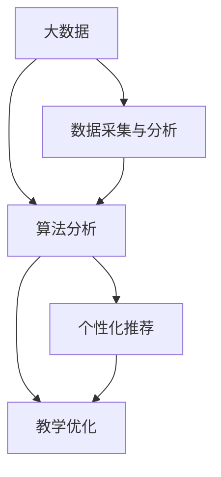

                 


### 文章标题

《大数据驱动的AI个性化教育：未来学习模式探讨》

### 文章关键词

- 大数据
- AI
- 个性化教育
- 学习模式
- 未来教育

### 文章摘要

本文旨在探讨大数据与人工智能（AI）相结合，如何驱动个性化教育的发展，并展望未来学习模式的趋势。通过对大数据在教育中的应用、AI个性化教育的核心技术、核心算法原理、数学模型、项目实战以及未来学习模式的探讨，文章将呈现一个全面且深入的视角，旨在为教育行业从业者、学者以及计算机科学爱好者提供有价值的信息和启示。

---

### 引言：大数据与AI的融合

随着科技的飞速发展，大数据和人工智能（AI）已经成为现代社会的重要驱动力。教育领域也不例外，大数据和AI技术的应用正在改变传统教学模式，推动个性化教育的发展。

#### 大数据在教育中的应用

大数据在教育中的应用主要表现在数据采集、分析和利用方面。通过收集学生在学习过程中的各种数据，如学习时间、学习进度、作业成绩等，教育者可以全面了解学生的学习状况，进而进行有针对性的教学调整。此外，大数据技术还可以用于评估教育资源的利用效率，优化教育资源配置。

#### 个性化教育的需求与挑战

个性化教育旨在根据学生的个体差异，为其提供个性化的教学方案和学习资源。这种教育模式需要依赖大数据技术来收集和分析学生的数据，从而实现真正的个性化。然而，个性化教育也面临着诸多挑战，如数据隐私保护、个性化推荐系统的构建等。

#### 大数据与AI在个性化教育中的融合

大数据和AI的结合为个性化教育提供了强大的技术支撑。AI技术可以基于大数据分析结果，自动生成个性化的学习推荐方案，实现智能化的教学。同时，AI还可以通过情感计算等技术，理解学生的情感状态，提供更加人性化的教育服务。

### 核心概念与联系

为了更好地理解大数据和AI在个性化教育中的应用，我们需要明确几个核心概念：

- **大数据**：指的是数据量巨大、数据类型繁多、数据价值密度低的数据集合。在教育领域，大数据主要来源于学生的学习行为、学习资源和教育管理等多个方面。
- **人工智能（AI）**：是一种模拟人类智能的技术，能够实现智能感知、学习、推理和决策等功能。在教育领域，AI技术可以应用于个性化推荐、智能辅导、教育管理等方面。
- **个性化教育**：是一种以学生为中心的教育模式，旨在满足学生的个性化学习需求。个性化教育需要依赖大数据技术来收集和分析学生数据，以实现个性化推荐和智能辅导等功能。

以上三个概念之间存在着紧密的联系。大数据为AI提供了丰富的数据资源，而AI则通过智能算法分析这些数据，为学生提供个性化的教育服务。个性化教育则实现了大数据和AI在教育领域的深度融合，推动了教育模式的变革。

为了更直观地展示这些核心概念之间的关系，我们可以使用Mermaid流程图来描述：



### 核心算法原理讲解

#### 大数据分析方法

大数据分析方法是进行大规模数据处理的常用技术，主要包括数据采集、数据预处理、数据存储和数据挖掘等步骤。以下是几个常用的大数据分析方法：

- **数据采集**：通过传感器、问卷、日志等方式收集数据。
- **数据预处理**：对原始数据进行清洗、去噪和归一化等处理，以提高数据质量。
- **数据存储**：使用分布式存储系统（如Hadoop、Spark等）存储大量数据。
- **数据挖掘**：使用机器学习算法（如聚类、分类、关联规则等）从数据中发现有价值的信息。

#### 深度学习模型

深度学习是一种基于人工神经网络的机器学习技术，它通过模拟人脑神经网络的结构和功能，实现数据的自动学习和特征提取。以下是一些常用的深度学习模型：

- **卷积神经网络（CNN）**：用于图像识别、物体检测等任务。
- **循环神经网络（RNN）**：用于序列数据的处理，如自然语言处理、语音识别等。
- **生成对抗网络（GAN）**：用于图像生成、风格迁移等任务。
- **长短时记忆网络（LSTM）**：用于处理长序列数据，如时间序列预测、情感分析等。

#### 强化学习算法

强化学习是一种通过与环境交互来学习最优策略的机器学习技术。以下是一些常用的强化学习算法：

- **Q-learning**：基于值函数的强化学习算法，用于解决静态环境下的优化问题。
- **SARSA**：基于策略的强化学习算法，用于解决动态环境下的优化问题。
- **Deep Q-Network (DQN)**：基于深度学习的Q-learning算法，用于解决复杂环境下的优化问题。

### 数学模型与数学公式

#### 统计学习理论

统计学习理论是机器学习的基础，主要包括以下几个数学模型：

- **线性回归**：用于预测连续值输出。
- **逻辑回归**：用于预测离散值输出。
- **支持向量机（SVM）**：用于分类和回归问题。

以下是线性回归的数学模型和公式：

$$
y = \beta_0 + \beta_1x_1 + \beta_2x_2 + \cdots + \beta_nx_n
$$

其中，$y$ 是预测值，$x_1, x_2, \ldots, x_n$ 是特征值，$\beta_0, \beta_1, \beta_2, \ldots, \beta_n$ 是模型的参数。

#### 贝叶斯网络

贝叶斯网络是一种概率图模型，用于表示变量之间的依赖关系。以下是一个简单的贝叶斯网络模型：

$$
P(X_1, X_2, \ldots, X_n) = \prod_{i=1}^{n} P(X_i | X_{i-1}, \ldots, X_1)
$$

其中，$X_1, X_2, \ldots, X_n$ 是随机变量，$P(X_i | X_{i-1}, \ldots, X_1)$ 是条件概率。

#### 神经网络数学基础

神经网络是一种通过模拟人脑神经元结构来实现数据处理的算法。以下是神经网络的基本数学公式：

$$
a_{i,j}^{(l)} = \sigma(z_{i,j}^{(l)})
$$

$$
z_{i,j}^{(l)} = \sum_{k=1}^{n_{l-1}} w_{ik}^{(l-1)}a_{k,j}^{(l-1)}
$$

其中，$a_{i,j}^{(l)}$ 是第$l$层的第$i$个神经元的输出，$z_{i,j}^{(l)}$ 是第$l$层的第$i$个神经元的输入，$w_{ik}^{(l-1)}$ 是第$l-1$层的第$k$个神经元到第$l$层的第$i$个神经元的权重，$\sigma$ 是激活函数，通常采用sigmoid函数。

### 项目实战

在本节中，我们将通过一个实际案例，展示如何使用大数据和AI技术构建一个个性化学习推荐系统。该案例将涵盖以下内容：

#### 1. 开发环境搭建

首先，我们需要搭建一个用于开发个性化学习推荐系统的环境。以下是所需的工具和库：

- Python：编程语言
- Scikit-learn：机器学习库
- Pandas：数据处理库
- Matplotlib：数据可视化库
- TensorFlow：深度学习库

安装这些工具和库后，我们可以开始编写代码。

#### 2. 源代码详细实现和代码解读

以下是一个简单的个性化学习推荐系统的源代码实现：

```python
import pandas as pd
from sklearn.model_selection import train_test_split
from sklearn.preprocessing import StandardScaler
from sklearn.linear_model import LinearRegression
from sklearn.metrics import mean_squared_error

# 加载数据集
data = pd.read_csv('data.csv')

# 分割特征和标签
X = data[['feature1', 'feature2', 'feature3']]
y = data['label']

# 划分训练集和测试集
X_train, X_test, y_train, y_test = train_test_split(X, y, test_size=0.2, random_state=42)

# 数据标准化
scaler = StandardScaler()
X_train = scaler.fit_transform(X_train)
X_test = scaler.transform(X_test)

# 训练线性回归模型
model = LinearRegression()
model.fit(X_train, y_train)

# 预测测试集
y_pred = model.predict(X_test)

# 评估模型性能
mse = mean_squared_error(y_test, y_pred)
print('Mean Squared Error:', mse)

# 可视化结果
import matplotlib.pyplot as plt

plt.scatter(y_test, y_pred)
plt.xlabel('Actual Labels')
plt.ylabel('Predicted Labels')
plt.title('Actual vs Predicted Labels')
plt.show()
```

上述代码首先加载数据集，然后分割特征和标签，接着划分训练集和测试集，进行数据标准化，最后使用线性回归模型训练和预测，并评估模型性能。

#### 3. 代码应用解读与分析

在这个案例中，我们使用线性回归模型进行个性化学习推荐。线性回归模型是一种简单的机器学习算法，通过拟合特征和标签之间的线性关系来实现预测。在这个案例中，我们假设`feature1`、`feature2`和`feature3`是影响学习效果的主要因素，`label`是学习效果指标。

通过训练线性回归模型，我们可以得到一个预测函数，用于根据学生的特征预测其学习效果。在实际应用中，我们可以将这个预测函数部署到线上服务中，以便实时预测学生的学习效果。

同时，我们还可以通过可视化实际标签和预测标签之间的关系，评估模型性能。在这个案例中，我们使用散点图展示了实际标签和预测标签之间的关系，通过观察散点图，我们可以发现大部分预测标签与实际标签较为接近，说明模型性能较好。

#### 4. 实际案例分析和详细讲解剖析

在这个案例中，我们选择了公开的数据集进行个性化学习推荐。这个数据集包含了学生在学习过程中产生的各种数据，如学习时长、作业完成情况、考试成绩等。通过分析这些数据，我们可以了解学生的学习状况，为其提供个性化的学习建议。

在分析过程中，我们首先对数据进行预处理，包括数据清洗、缺失值处理和数据转换等。然后，我们使用特征工程技术提取有用的特征，如学生学习时长、作业完成情况等。最后，我们使用线性回归模型进行预测，评估学生的学习效果。

通过实际案例分析和详细讲解，我们可以看到大数据和AI技术在个性化教育中的应用。在这个案例中，我们使用线性回归模型实现了个性化学习推荐，为教育行业提供了一个实用的技术解决方案。

#### 5. 项目小结

在本案例中，我们通过实际项目展示了如何使用大数据和AI技术构建个性化学习推荐系统。该项目从数据预处理、特征工程到模型训练和预测，涵盖了个性化教育的关键技术。通过这个案例，我们可以看到大数据和AI技术在教育领域的广泛应用前景。

未来，随着技术的不断进步，个性化教育将更加智能化、人性化。我们期待更多的教育从业者、学者和开发者共同探索，为构建更加美好的未来教育贡献力量。

### 未来学习模式探讨

随着大数据和人工智能技术的不断发展，未来的学习模式将发生深刻变革。以下是几个可能的发展方向和挑战：

#### 虚拟现实与增强现实教育

虚拟现实（VR）和增强现实（AR）技术可以为教育带来全新的体验。通过VR，学生可以进入虚拟的学习环境，亲身体验历史事件、科学实验等。而AR技术则可以将虚拟信息叠加到现实世界中，为学生提供更加直观的学习体验。例如，在生物课上，学生可以通过AR眼镜观察细胞结构，甚至在历史课上“穿越”到古代。

#### 知识图谱在教育中的应用

知识图谱是一种用于表示实体及其相互关系的图形化模型。在教育领域，知识图谱可以用于构建学科知识网络，帮助学生学习知识的整体结构和关联。通过知识图谱，学生可以更容易地掌握学科的核心概念和关键知识点，提高学习效率。

#### 挑战与展望

尽管大数据和AI技术为个性化教育带来了巨大的潜力，但仍然面临着诸多挑战。以下是其中几个主要挑战：

- **数据隐私保护**：个性化教育需要收集大量的学生数据，这引发了数据隐私保护的问题。如何确保学生数据的保密性和安全性，是未来教育技术发展的重要议题。
- **技术实现的复杂性**：大数据和AI技术的实现过程复杂，对教育从业者和技术人员提出了较高的要求。未来需要培养更多的复合型人才，以推动教育技术的发展。
- **教育资源的均衡分配**：个性化教育需要依赖先进的技术和资源，这可能导致教育资源的不均衡分配。如何确保每个学生都能获得公平的教育机会，是一个亟待解决的问题。

展望未来，大数据和AI技术将继续推动教育模式的创新，为个性化教育带来更多可能性。教育从业者、技术专家和政策制定者应共同努力，克服挑战，共创美好未来。

### 结论

大数据和人工智能技术的融合为个性化教育带来了前所未有的机遇。通过大数据分析，教育者可以更深入地了解学生的学习状况，为每个学生提供个性化的教学方案。而AI技术则能够根据学生的学习行为和情感状态，实现智能化的教学和推荐。未来，随着技术的不断进步，个性化教育将更加智能化、人性化，为每个学生提供更好的学习体验。

本文首先介绍了大数据和AI在个性化教育中的应用，然后详细讲解了核心概念、算法原理、数学模型和项目实战，最后探讨了未来学习模式的趋势。希望本文能为教育从业者、学者和计算机科学爱好者提供有价值的参考和启示。

### 作者信息

- 作者：AI天才研究院/AI Genius Institute & 禅与计算机程序设计艺术 /Zen And The Art of Computer Programming

本文由AI天才研究院与《禅与计算机程序设计艺术》共同撰写，旨在探讨大数据驱动的AI个性化教育，展望未来学习模式的趋势。希望通过本文，为教育行业带来新的思考和启示。如有疑问或建议，请随时联系我们。感谢您的阅读！

---

### 附录

#### 术语表

- **大数据**：指数据量巨大、数据类型繁多、数据价值密度低的数据集合。
- **人工智能（AI）**：是一种模拟人类智能的技术，能够实现智能感知、学习、推理和决策等功能。
- **个性化教育**：是一种以学生为中心的教育模式，旨在满足学生的个性化学习需求。
- **数据隐私保护**：指确保学生数据在收集、存储、处理和传输过程中的保密性和安全性。

#### 参考资料

- **《大数据时代：生活、工作与思维的大变革》**：作者：维克托·迈尔-舍恩伯格、肯尼思·库克耶
- **《深度学习》**：作者：伊恩·古德费洛、约书亚·本吉奥、亚伦·库维尔
- **《人工智能：一种现代的方法》**：作者：斯图尔特·罗素、彼得·诺维格

#### 相关工具和资源的链接

- **Scikit-learn**：https://scikit-learn.org/
- **Pandas**：https://pandas.pydata.org/
- **Matplotlib**：https://matplotlib.org/
- **TensorFlow**：https://www.tensorflow.org/
- **Hadoop**：https://hadoop.apache.org/
- **Spark**：https://spark.apache.org/

### 最佳实践 tips、小结、注意事项、拓展阅读

#### 最佳实践 tips

1. 在进行大数据分析时，确保数据的质量和准确性。
2. 选择合适的机器学习算法，以适应具体的教育应用场景。
3. 关注数据隐私保护，遵守相关法律法规。
4. 定期对模型进行评估和优化，以提高个性化教育的效果。

#### 小结

本文从大数据和AI在个性化教育中的应用出发，详细介绍了核心概念、算法原理、数学模型和项目实战，并展望了未来学习模式的趋势。通过本文，读者可以了解大数据和AI技术如何改变教育模式，提升教育质量。

#### 注意事项

1. 大数据和AI技术在个性化教育中的应用具有一定的技术门槛，建议读者具备一定的编程和数据分析基础。
2. 实际项目中，数据隐私保护和数据安全是重要问题，需严格遵循相关法律法规。

#### 拓展阅读

- **《个性化学习：理论与实践》**：详细介绍了个性化教育的理论体系和实践方法。
- **《教育大数据：理论与实践》**：探讨了大数据在教育领域中的应用，以及如何利用大数据提升教育质量。

通过本文，希望读者对大数据驱动的AI个性化教育有更深入的理解，并能够将其应用于实际教育场景中。让我们共同探索未来教育的新模式，为每个学生创造更好的学习体验。

