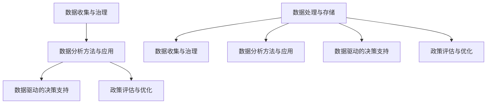
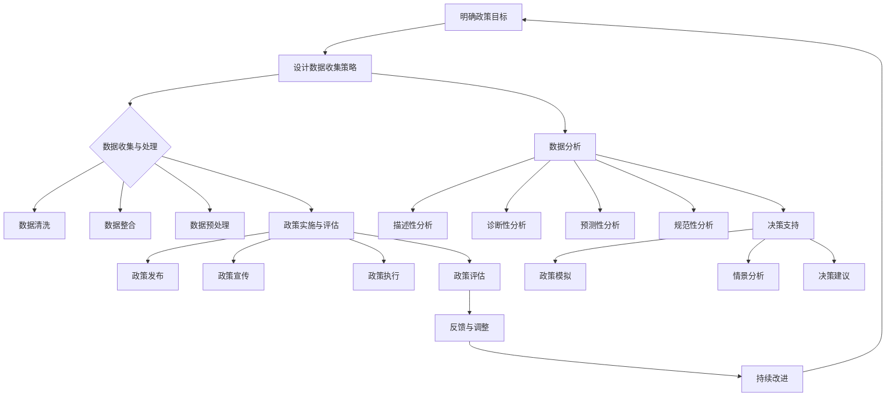

                 

### 第1章：大数据驱动的公共政策制定概述

#### 1.1 大数据的定义及其在公共政策制定中的作用

##### 1.1.1 大数据的定义与特征

大数据（Big Data）是指那些数据规模巨大、数据类型多样化、数据生成速度极快、数据价值密度较低的数据集合。其四大特征，即“4V”，分别是：

- **数据量大（Volume）**：大数据的数据量往往达到PB（皮字节，10^15字节）级别，甚至更高。
- **数据类型多样（Variety）**：大数据不仅包括结构化数据，如关系型数据库中的数据，还包括非结构化数据，如图像、视频、音频等。
- **数据生成速度快（Velocity）**：随着互联网和物联网的发展，数据以极快的速度被生成、存储、处理和共享。
- **数据价值密度低（Value）**：由于数据量大，真正有价值的信息往往占比很小。

##### 1.1.2 大数据在公共政策制定中的应用

大数据在公共政策制定中的应用，主要体现在以下几个方面：

- **数据驱动的决策支持**：通过收集和分析大量数据，政府可以更精准地了解社会问题和需求，从而制定更加科学合理的公共政策。实时数据监测和分析能够帮助政府及时响应社会变化，提高决策效率。

- **政策评估与优化**：利用大数据技术，可以对政策执行效果进行评估，发现政策执行中的问题与挑战，提出改进措施，从而优化政策。

- **数据收集与治理**：有效的数据收集和治理是大数据在公共政策制定中的基础。通过建立健全的数据收集与治理机制，可以保证数据的准确性和完整性，为政策制定提供可靠的数据支持。

- **数据分析方法与应用**：大数据分析技术，如数据挖掘、机器学习、深度学习等，可以揭示数据中的隐藏模式和规律，帮助政府更好地理解和应对社会问题。

##### 1.1.3 大数据与公共政策制定的联系

- **数据收集与治理**：数据的收集和治理是大数据在公共政策制定中的关键。有效的数据收集需要建立多渠道的数据来源，包括政府内部数据、企业数据、社交媒体数据等。数据治理则包括数据的质量管理、数据隐私保护和数据安全等。

- **数据分析方法与应用**：大数据分析技术可以广泛应用于公共政策制定中。例如，描述性分析可以用来了解当前的社会状况；诊断性分析可以帮助政府识别问题；预测性分析可以帮助预测社会趋势；规范性分析可以帮助制定最佳的政策方案。

#### 1.2 大数据驱动的公共政策制定架构

大数据驱动的公共政策制定架构主要包括数据收集与来源、数据处理与存储、数据分析与决策支持三个关键环节。

##### 1.2.1 数据收集与来源

数据收集与来源是大数据驱动的公共政策制定的基础。数据来源可以分为内部数据来源和外部数据来源。

- **内部数据来源**：包括政府机构内部的数据，如统计局、民政部门、税务部门等；企业运营数据，如金融机构、电信公司等；以及网络数据，如政府网站、社交媒体等。

- **外部数据来源**：包括开放数据平台，如国家数据开放平台、世界银行数据等；社交媒体数据，如Twitter、Facebook等；以及第三方数据服务，如数据提供商、市场调研公司等。

##### 1.2.2 数据处理与存储

数据处理与存储是大数据驱动的公共政策制定的核心。数据处理包括数据清洗与预处理、数据存储与管理等。

- **数据清洗与预处理**：数据清洗是数据处理的第一步，目的是去除重复数据、纠正错误数据、填补缺失数据等。数据预处理包括数据格式转换、数据归一化、特征工程等，以提高数据的质量和可用性。

- **数据存储与管理**：数据存储与管理包括数据仓库、数据湖、分布式存储技术等。数据仓库用于存储和管理结构化数据；数据湖则用于存储和管理非结构化数据；分布式存储技术可以提高数据的可靠性和可扩展性。

##### 1.2.3 数据分析与决策支持

数据分析与决策支持是大数据驱动的公共政策制定的最终目的。数据分析包括描述性分析、诊断性分析、预测性分析和规范性分析等。

- **描述性分析**：通过统计分析，描述数据的基本特征和分布情况，帮助政府了解当前的社会状况。

- **诊断性分析**：通过分析数据，找出问题产生的原因，帮助政府识别社会问题。

- **预测性分析**：通过分析历史数据，预测未来的社会趋势，帮助政府制定前瞻性的政策。

- **规范性分析**：通过分析数据，提出最优的政策方案，帮助政府制定科学合理的政策。

### 1.3 大数据驱动的公共政策制定案例研究

#### 1.3.1 案例一：健康政策制定

##### 1.3.1.1 数据来源与处理

健康政策制定中，数据来源主要包括医院的电子健康记录、公共卫生数据、社交媒体数据等。数据处理包括数据清洗、数据预处理和特征工程等，以提高数据的质量和可用性。

##### 1.3.1.2 数据分析与应用

通过描述性分析，政府可以了解当前居民的健康状况；通过诊断性分析，政府可以识别健康问题的主要原因；通过预测性分析，政府可以预测未来健康趋势；通过规范性分析，政府可以制定科学合理的健康政策。

#### 1.3.2 案例二：教育政策制定

##### 1.3.2.1 数据来源与处理

教育政策制定中，数据来源主要包括教育统计数据、学校运营数据、学生表现数据等。数据处理包括数据清洗、数据预处理和特征工程等，以提高数据的质量和可用性。

##### 1.3.2.2 数据分析与应用

通过描述性分析，政府可以了解当前的教育状况；通过诊断性分析，政府可以识别教育问题的主要原因；通过预测性分析，政府可以预测未来教育趋势；通过规范性分析，政府可以制定科学合理的教育政策。

### 1.4 大数据驱动的公共政策制定的挑战与机遇

大数据驱动的公共政策制定带来了巨大的挑战和机遇。

- **挑战**：包括数据隐私与安全问题、数据质量问题、技术实现难题等。

- **机遇**：包括更科学的政策制定、更高效的决策支持、更精准的政策评估等。

### 1.5 总结

大数据驱动的公共政策制定是一种科学、高效、透明的政策制定方法。通过大数据技术，政府可以更精准地了解社会问题，制定更加科学合理的政策，从而提高政策的有效性和公信力。在未来，大数据将继续在公共政策制定中发挥重要作用，推动社会进步和发展。


## 1.1.1 数据的四个 V 特征

在深入探讨大数据在公共政策制定中的作用之前，我们首先需要明确大数据的四个 V 特征：数据量大（Volume）、数据类型多样（Variety）、数据生成速度快（Velocity）和数据价值密度低（Value）。这些特征共同构成了大数据的复杂性和挑战性，同时也为其应用提供了丰富的机遇。

#### 1.1.1.1 数据量大（Volume）

数据量大是大数据的首要特征。传统数据存储和处理系统在面对PB级别甚至更高的数据量时，常常力不从心。大数据量使得政府可以收集和分析海量的数据，这为公共政策制定提供了更加丰富和详细的信息基础。例如，通过收集城市交通流量、居民出行习惯、公共交通使用数据等，政府可以更准确地了解交通状况，从而制定更有效的交通政策。

#### 1.1.1.2 数据类型多样（Variety）

大数据不仅包括结构化数据，如关系型数据库中的数据，还包括非结构化数据，如图像、视频、音频、社交媒体帖子等。这种多样性的数据类型为公共政策制定带来了新的挑战，但同时也提供了更全面的视角。例如，通过分析社交媒体数据，政府可以更深入地了解公众对某一政策的看法和态度，从而调整政策以更好地满足公众需求。

#### .1.1.3 数据生成速度快（Velocity）

数据生成速度快是指数据以极快的速度被生成、存储、处理和共享。这种速度使得政府需要实时监控和分析数据，以便快速响应社会变化。例如，在疫情爆发期间，实时监控疫情数据、医院床位使用情况、医疗物资储备等，可以帮助政府及时调整公共卫生政策，最大限度地减少疫情对社会的影响。

#### 1.1.1.4 数据价值密度低（Value）

数据价值密度低意味着在大量数据中，真正有价值的信息占比很小。这种特征要求政府在数据收集和处理过程中，必须进行有效的数据筛选和清洗，以提取有价值的信息。例如，在制定教育政策时，通过分析学生成绩、课堂参与度、家庭背景等数据，可以更准确地识别教育不平等问题，从而制定有针对性的政策。

### 1.1.2 大数据在公共政策制定中的应用

大数据在公共政策制定中的应用主要体现在以下几个方面：

#### 1.1.2.1 数据驱动的决策支持

数据驱动的决策支持是大数据在公共政策制定中最基本的应用。通过收集和分析大量数据，政府可以更准确地了解社会问题和需求，从而制定更加科学合理的公共政策。例如，通过对交通流量的实时监测和分析，政府可以优化公共交通路线和班次，提高交通效率。

#### 1.1.2.2 政策评估与优化

大数据技术可以帮助政府评估政策效果，识别政策执行中的问题与挑战，并提出改进措施。例如，通过对环保政策的实施效果进行分析，可以发现哪些措施最有效，哪些需要调整或加强。

#### 1.1.2.3 数据收集与治理

有效的数据收集和治理是大数据在公共政策制定中的基础。通过建立健全的数据收集与治理机制，可以保证数据的准确性和完整性，为政策制定提供可靠的数据支持。例如，通过整合不同部门的数据，可以更全面地了解社会问题，从而制定更综合的政策方案。

#### 1.1.2.4 数据分析方法与应用

大数据分析技术，如数据挖掘、机器学习、深度学习等，可以揭示数据中的隐藏模式和规律，帮助政府更好地理解和应对社会问题。例如，通过分析社交媒体数据，可以了解公众对某一政策的看法和态度，从而调整政策以更好地满足公众需求。

### 1.1.3 大数据与公共政策制定的联系

大数据与公共政策制定之间的联系可以从以下几个方面来理解：

#### 1.1.3.1 数据收集与治理

有效的数据收集和治理是大数据在公共政策制定中的基础。数据收集需要建立多渠道的数据来源，包括政府内部数据、企业数据、社交媒体数据等。数据治理则包括数据的质量管理、数据隐私保护和数据安全等。

#### 1.1.3.2 数据分析方法与应用

大数据分析技术，如数据挖掘、机器学习、深度学习等，可以应用于公共政策的各个方面，帮助政府更准确地识别问题、预测趋势和制定政策。这些技术不仅能够提高数据分析的效率，还能提供更深入的洞察力。

#### 1.1.3.3 政策制定与实施

大数据技术可以用于政策制定的全过程，从问题识别、方案设计、政策评估到实施反馈。通过实时监测和数据分析，政府可以更灵活地调整政策，以适应不断变化的社会环境。

### 1.2 大数据驱动的公共政策制定架构

大数据驱动的公共政策制定架构包括数据收集与来源、数据处理与存储、数据分析与决策支持三个关键环节。

#### 1.2.1 数据收集与来源

数据收集与来源是大数据驱动的公共政策制定的基础。数据来源可以分为内部数据来源和外部数据来源。

- **内部数据来源**：包括政府机构内部的数据，如统计局、民政部门、税务部门等；企业运营数据，如金融机构、电信公司等；以及网络数据，如政府网站、社交媒体等。

- **外部数据来源**：包括开放数据平台，如国家数据开放平台、世界银行数据等；社交媒体数据，如Twitter、Facebook等；以及第三方数据服务，如数据提供商、市场调研公司等。

#### 1.2.2 数据处理与存储

数据处理与存储是大数据驱动的公共政策制定的核心。数据处理包括数据清洗与预处理、数据存储与管理等。

- **数据清洗与预处理**：数据清洗是数据处理的第一步，目的是去除重复数据、纠正错误数据、填补缺失数据等。数据预处理包括数据格式转换、数据归一化、特征工程等，以提高数据的质量和可用性。

- **数据存储与管理**：数据存储与管理包括数据仓库、数据湖、分布式存储技术等。数据仓库用于存储和管理结构化数据；数据湖则用于存储和管理非结构化数据；分布式存储技术可以提高数据的可靠性和可扩展性。

#### 1.2.3 数据分析与决策支持

数据分析与决策支持是大数据驱动的公共政策制定的最终目的。数据分析包括描述性分析、诊断性分析、预测性分析和规范性分析等。

- **描述性分析**：通过统计分析，描述数据的基本特征和分布情况，帮助政府了解当前的社会状况。

- **诊断性分析**：通过分析数据，找出问题产生的原因，帮助政府识别社会问题。

- **预测性分析**：通过分析历史数据，预测未来的社会趋势，帮助政府制定前瞻性的政策。

- **规范性分析**：通过分析数据，提出最优的政策方案，帮助政府制定科学合理的政策。

### 1.3 大数据驱动的公共政策制定案例研究

#### 1.3.1 案例一：健康政策制定

##### 1.3.1.1 数据来源与处理

健康政策制定中，数据来源主要包括医院的电子健康记录、公共卫生数据、社交媒体数据等。数据处理包括数据清洗、数据预处理和特征工程等，以提高数据的质量和可用性。

##### 1.3.1.2 数据分析与应用

通过描述性分析，政府可以了解当前居民的健康状况；通过诊断性分析，政府可以识别健康问题的主要原因；通过预测性分析，政府可以预测未来健康趋势；通过规范性分析，政府可以制定科学合理的健康政策。

#### 1.3.2 案例二：教育政策制定

##### 1.3.2.1 数据来源与处理

教育政策制定中，数据来源主要包括教育统计数据、学校运营数据、学生表现数据等。数据处理包括数据清洗、数据预处理和特征工程等，以提高数据的质量和可用性。

##### 1.3.2.2 数据分析与应用

通过描述性分析，政府可以了解当前的教育状况；通过诊断性分析，政府可以识别教育问题的主要原因；通过预测性分析，政府可以预测未来教育趋势；通过规范性分析，政府可以制定科学合理的教育政策。

### 1.4 大数据驱动的公共政策制定的挑战与机遇

大数据驱动的公共政策制定带来了巨大的挑战和机遇。

- **挑战**：包括数据隐私与安全问题、数据质量问题、技术实现难题等。

- **机遇**：包括更科学的政策制定、更高效的决策支持、更精准的政策评估等。

### 1.5 总结

大数据驱动的公共政策制定是一种科学、高效、透明的政策制定方法。通过大数据技术，政府可以更精准地了解社会问题，制定更加科学合理的政策，从而提高政策的有效性和公信力。在未来，大数据将继续在公共政策制定中发挥重要作用，推动社会进步和发展。



### 1.2 大数据驱动的公共政策制定架构

大数据驱动的公共政策制定需要一个全面、系统化的架构，以确保数据的收集、处理和分析能够高效、准确地支持政策制定过程。这个架构主要包括数据收集与来源、数据处理与存储、数据分析与决策支持三个关键环节。

#### 1.2.1 数据收集与来源

数据收集与来源是大数据驱动的公共政策制定的基础。有效的数据收集需要建立多渠道的数据来源，以保证数据的全面性和准确性。

- **内部数据来源**：政府机构内部的数据是公共政策制定的重要基础。这些数据包括统计局、民政部门、税务部门、教育部门等收集的各种统计数据和报告。此外，企业运营数据也是重要的内部数据来源，如金融机构、电信公司等企业可以通过其业务活动产生大量的数据，这些数据可以反映经济活动的动态和趋势。

- **外部数据来源**：外部数据来源包括开放数据平台、社交媒体数据、第三方数据服务等多种渠道。开放数据平台如国家数据开放平台、世界银行数据等提供了丰富的公共数据资源。社交媒体数据如Twitter、Facebook等平台上的数据可以帮助政府了解公众的观点和需求。第三方数据服务则提供了专业化的数据分析和处理服务，如市场调研公司、数据提供商等。

#### 1.2.2 数据处理与存储

数据处理与存储是大数据驱动的公共政策制定的核心。在这个环节中，数据需要经过清洗、预处理、存储和管理，以确保其质量和可用性。

- **数据清洗与预处理**：数据清洗是数据处理的第一步，目的是去除重复数据、纠正错误数据、填补缺失数据等。数据预处理包括数据格式转换、数据归一化、特征工程等，以提高数据的质量和可用性。例如，将不同来源的数据统一格式，对缺失值进行插补，对异常值进行处理等。

- **数据存储与管理**：数据存储与管理包括数据仓库、数据湖、分布式存储技术等多种方式。数据仓库用于存储和管理结构化数据，如关系型数据库中的数据；数据湖则用于存储和管理非结构化数据，如图像、视频、文本等；分布式存储技术可以提高数据的可靠性和可扩展性，如Hadoop、Spark等大数据处理框架。

#### 1.2.3 数据分析与决策支持

数据分析与决策支持是大数据驱动的公共政策制定的最终目的。通过有效的数据分析，政府可以更准确地识别社会问题、预测未来趋势、制定科学合理的政策。

- **描述性分析**：描述性分析通过统计分析，描述数据的基本特征和分布情况，帮助政府了解当前的社会状况。例如，通过对居民健康数据的描述性分析，政府可以了解居民的整体健康状况和疾病分布。

- **诊断性分析**：诊断性分析通过分析数据，找出问题产生的原因，帮助政府识别社会问题。例如，通过对教育数据的诊断性分析，政府可以识别教育不平等问题的主要原因。

- **预测性分析**：预测性分析通过分析历史数据，预测未来的社会趋势，帮助政府制定前瞻性的政策。例如，通过对经济数据的预测性分析，政府可以预测未来经济增长趋势，从而制定相应的经济政策。

- **规范性分析**：规范性分析通过分析数据，提出最优的政策方案，帮助政府制定科学合理的政策。例如，通过对环保数据的规范性分析，政府可以制定最有效的环保政策，以减少污染和提升环境质量。

### 1.3 大数据驱动的公共政策制定案例研究

为了更好地理解大数据在公共政策制定中的应用，我们可以通过两个具体的案例来展示大数据技术如何帮助政府制定和优化政策。

#### 1.3.1 案例一：健康政策制定

##### 1.3.1.1 数据来源与处理

在健康政策制定中，数据来源主要包括以下几个方面：

- **医院电子健康记录**：包括患者的基本信息、诊断记录、治疗方案等。
- **公共卫生数据**：包括疫苗接种率、疾病爆发情况、卫生资源分布等。
- **社交媒体数据**：包括用户对健康话题的讨论、健康产品的评价等。

数据处理过程包括以下步骤：

- **数据清洗**：去除重复、错误或无效的数据，确保数据的准确性。
- **数据整合**：将来自不同来源的数据进行整合，形成一个统一的数据集。
- **特征工程**：提取与政策制定相关的特征，如疾病爆发率、疫苗接种覆盖率等。

##### 1.3.1.2 数据分析与应用

通过数据分析，政府可以：

- **描述性分析**：了解居民的健康状况和疾病分布，为制定健康政策提供基础数据。
- **诊断性分析**：识别影响健康的主要因素，如生活方式、环境因素等。
- **预测性分析**：预测未来疾病爆发趋势，提前制定预防措施。
- **规范性分析**：根据数据分析结果，提出最佳的健康政策方案，如提高疫苗接种率、加强健康教育等。

#### 1.3.2 案例二：教育政策制定

##### 1.3.2.1 数据来源与处理

在教育政策制定中，数据来源主要包括以下几个方面：

- **教育统计数据**：包括学生数量、入学率、辍学率、升学率等。
- **学校运营数据**：包括教师资源、课程设置、教学质量等。
- **学生表现数据**：包括考试成绩、学习进度、课堂参与度等。

数据处理过程包括以下步骤：

- **数据清洗**：确保数据的准确性和一致性。
- **数据整合**：将来自不同学校的数据进行整合，形成统一的数据库。
- **特征工程**：提取与教育政策相关的特征，如学生成绩分布、教师评价等。

##### 1.3.2.2 数据分析与应用

通过数据分析，政府可以：

- **描述性分析**：了解当前的教育状况，如入学率、辍学率等。
- **诊断性分析**：识别教育不平等问题，如城乡教育差距、性别差距等。
- **预测性分析**：预测未来教育趋势，如学生需求、教师短缺等。
- **规范性分析**：根据数据分析结果，提出最佳的教育政策方案，如改善城乡教育资源分配、提高教师待遇等。

### 1.4 大数据驱动的公共政策制定的挑战与机遇

大数据驱动的公共政策制定虽然带来了许多机遇，但也面临一系列挑战。

- **数据隐私与安全问题**：大量数据的收集和处理可能涉及到个人隐私和信息安全，如何保护数据隐私和安全是一个重要的挑战。

- **数据质量**：大数据的质量直接影响到政策制定的效果。数据清洗和预处理过程中，如何确保数据的准确性、完整性和一致性是一个关键问题。

- **技术实现难题**：大数据技术的实现需要强大的计算能力和专业的技术团队，这对许多政府机构来说是一个挑战。

- **跨部门合作**：大数据驱动的公共政策制定需要不同部门和机构的合作，如何协调各部门之间的数据共享和合作是一个难题。

然而，这些挑战也伴随着巨大的机遇：

- **更科学的政策制定**：通过大数据分析，政府可以更加科学地制定政策，提高政策的针对性和有效性。

- **更高效的决策支持**：实时数据分析和预测性分析可以帮助政府快速响应社会变化，提高决策效率。

- **更精准的政策评估**：大数据技术可以提供更全面、详细的政策评估数据，帮助政府评估政策效果，优化政策。

### 1.5 总结

大数据驱动的公共政策制定是一种创新的方法，通过充分利用大数据技术，政府可以更加科学、高效地制定和实施政策，提高政策的科学性、透明度和公信力。在未来，随着大数据技术的不断发展和应用，大数据将继续在公共政策制定中发挥重要作用，为社会带来更多的福祉。

## 2.1 数据挖掘技术在公共政策制定中的应用

数据挖掘技术是大数据分析的重要工具，它通过从大量数据中发现有用的模式和知识，为公共政策制定提供有力的支持。在公共政策制定中，数据挖掘技术可以帮助政府更深入地了解社会问题、预测未来趋势和优化政策方案。以下是数据挖掘技术的基本概念、主要方法和在公共政策制定中的应用案例。

### 2.1.1 数据挖掘的基本概念

#### 2.1.1.1 数据挖掘的定义与任务

数据挖掘（Data Mining）是指从大量的数据中通过计算机算法和统计方法发现有用的信息、模式和知识的过程。数据挖掘的主要任务包括：

- **分类**：将数据分为不同的类别，如根据学生的成绩预测其是否会被录取。
- **聚类**：将相似的数据归为同一类，如根据用户的购买习惯将用户分为不同的群体。
- **关联规则挖掘**：发现数据之间的关联性，如购买牛奶的顾客通常也会购买面包。
- **异常检测**：识别数据中的异常或离群点，如发现金融交易中的欺诈行为。
- **预测性分析**：利用历史数据预测未来的趋势或行为，如预测股票价格的走势。

#### 2.1.1.2 数据挖掘的方法与技术

数据挖掘涉及多种方法和技术，包括但不限于：

- **机器学习**：通过训练模型来发现数据中的模式，如决策树、随机森林、支持向量机等。
- **深度学习**：基于多层神经网络，通过反向传播算法进行训练，如卷积神经网络（CNN）、递归神经网络（RNN）等。
- **关联规则挖掘**：基于频繁项集和关联规则算法，如Apriori算法、Eclat算法等。
- **聚类算法**：包括K-均值、层次聚类、DBSCAN等。
- **异常检测**：基于统计方法、聚类方法和基于规则的方法，如孤立森林、洛伦兹曲线等。

### 2.1.2 数据挖掘在公共政策制定中的应用案例

#### 2.1.2.1 案例一：反欺诈政策制定

**数据来源与处理**：
- 数据来源：金融机构的交易记录、用户行为数据等。
- 数据处理：数据清洗、数据归一化、特征工程等。

**数据分析与应用**：
- **分类算法**：利用分类算法，如随机森林，对交易进行分类，识别潜在欺诈行为。
  ```python
  from sklearn.ensemble import RandomForestClassifier
  # 特征工程和数据准备
  X = ...  # 特征矩阵
  y = ...  # 标签矩阵
  # 训练模型
  clf = RandomForestClassifier()
  clf.fit(X, y)
  # 预测新交易是否为欺诈
  predictions = clf.predict(new_data)
  ```

- **关联规则挖掘**：通过关联规则挖掘算法，如Apriori算法，发现交易中的异常关联，如“购买机票后通常不购买酒店”。
  ```python
  from mlxtend.frequent_patterns import apriori
  from mlxtend.frequent_patterns import association_rules
  
  # Apriori算法
  df = apriori(df, min_support=0.05, use_colnames=True)
  # 关联规则
  rules = association_rules(df, metric="support", min_threshold=0.05)
  ```

#### 2.1.2.2 案例二：环境保护政策制定

**数据来源与处理**：
- 数据来源：环境监测数据、气象数据、交通数据等。
- 数据处理：数据清洗、数据整合、特征工程等。

**数据分析与应用**：
- **聚类分析**：利用聚类算法，如K-均值，将污染源进行分类，识别主要污染区域。
  ```python
  from sklearn.cluster import KMeans
  # 特征工程和数据准备
  X = ...  # 特征矩阵
  # K-均值聚类
  kmeans = KMeans(n_clusters=5)
  kmeans.fit(X)
  # 聚类结果
  clusters = kmeans.predict(X)
  ```

- **预测性分析**：利用时间序列分析，如ARIMA模型，预测未来的污染趋势。
  ```python
  from statsmodels.tsa.arima.model import ARIMA
  # 时间序列数据准备
  series = ...
  # ARIMA模型
  model = ARIMA(series, order=(5, 1, 2))
  model_fit = model.fit()
  # 预测未来污染水平
  forecast = model_fit.forecast(steps=5)
  ```

### 2.1.3 数据挖掘在公共政策制定中的挑战与机遇

#### 挑战：

- **数据质量和隐私**：数据挖掘依赖于高质量的数据，但往往面临数据不完整、不一致和隐私保护的问题。
- **算法选择和调优**：选择合适的算法并进行调优是数据挖掘的关键，但这对专业人员的要求较高。
- **结果解释和验证**：如何解释和验证数据挖掘结果，使其真正对政策制定有帮助，是一个挑战。

#### 机遇：

- **更科学的政策制定**：通过数据挖掘，政府可以基于数据做出更科学的决策，提高政策的有效性。
- **更精准的问题识别**：数据挖掘可以帮助政府更精准地识别社会问题，从而制定更有针对性的政策。
- **更高效的资源利用**：通过分析数据，政府可以更高效地分配资源，提高公共服务的质量。

### 2.1.4 总结

数据挖掘技术在公共政策制定中具有广泛的应用前景。通过利用数据挖掘技术，政府可以更科学地制定和优化政策，提高公共服务的效率和质量。然而，同时也需要关注数据质量和隐私保护等问题，确保数据挖掘技术的应用能够真正服务于公众利益。

## 2.2 机器学习技术在公共政策制定中的应用

机器学习技术作为人工智能的核心组成部分，已经成为公共政策制定过程中不可或缺的工具。在政策制定中，机器学习技术通过构建复杂的预测模型和分类系统，可以帮助政府更准确地分析社会现象、预测未来趋势，并优化政策决策。以下是机器学习技术的基本概念、主要算法和其在公共政策制定中的应用案例。

### 2.2.1 机器学习的基本概念

#### 2.2.1.1 机器学习的定义与分类

机器学习（Machine Learning）是一种通过算法让计算机从数据中学习、自动改进并做出决策的技术。根据学习方式，机器学习可以分为：

- **监督学习**：在有标注的数据集上训练模型，然后利用模型对新数据进行预测。常见的算法包括线性回归、决策树、支持向量机等。
- **无监督学习**：在没有标注的数据集上训练模型，用于发现数据中的隐藏结构和模式。常见的算法包括聚类分析、关联规则挖掘等。
- **强化学习**：通过与环境交互，不断调整策略以最大化累积奖励。常见的算法包括Q学习、深度Q网络（DQN）等。

#### 2.2.1.2 常见机器学习算法

- **线性回归**：通过建立线性模型，预测连续值输出。常用算法包括简单线性回归和多元线性回归。
  ```python
  from sklearn.linear_model import LinearRegression
  model = LinearRegression()
  model.fit(X, y)
  predictions = model.predict(X_new)
  ```

- **决策树**：通过树形结构对数据进行划分，用于分类和回归任务。常见算法包括ID3、C4.5和CART。
  ```python
  from sklearn.tree import DecisionTreeClassifier
  model = DecisionTreeClassifier()
  model.fit(X, y)
  predictions = model.predict(X_new)
  ```

- **随机森林**：通过构建多个决策树，并投票决定最终预测结果。常用算法包括随机森林和极端随机森林。
  ```python
  from sklearn.ensemble import RandomForestClassifier
  model = RandomForestClassifier()
  model.fit(X, y)
  predictions = model.predict(X_new)
  ```

- **支持向量机**：通过寻找最优超平面，将不同类别的数据分隔开来。常用算法包括线性SVM和核SVM。
  ```python
  from sklearn.svm import SVC
  model = SVC()
  model.fit(X, y)
  predictions = model.predict(X_new)
  ```

- **神经网络**：通过多层神经元网络进行非线性变换，实现对复杂数据的建模。常见算法包括前馈神经网络和卷积神经网络。
  ```python
  from keras.models import Sequential
  from keras.layers import Dense

  model = Sequential()
  model.add(Dense(units=64, activation='relu', input_shape=(input_shape,)))
  model.add(Dense(units=1, activation='sigmoid'))
  model.compile(optimizer='adam', loss='binary_crossentropy', metrics=['accuracy'])

  model.fit(X, y, epochs=10, batch_size=32)
  predictions = model.predict(X_new)
  ```

### 2.2.2 机器学习在公共政策制定中的应用案例

#### 2.2.2.1 案例一：智能交通政策制定

**数据来源与处理**：
- 数据来源：交通流量数据、公共交通使用数据、交通事故数据等。
- 数据处理：数据清洗、数据归一化、特征工程等。

**数据分析与应用**：

- **预测性分析**：利用时间序列分析和线性回归模型，预测未来的交通流量。
  ```python
  from sklearn.linear_model import LinearRegression
  model = LinearRegression()
  model.fit(X, y)
  predictions = model.predict(X_new)
  ```

- **聚类分析**：利用K-均值聚类算法，将交通流量数据分为不同的群体，分析不同区域的交通状况。
  ```python
  from sklearn.cluster import KMeans
  model = KMeans(n_clusters=5)
  model.fit(X)
  clusters = model.predict(X_new)
  ```

- **分类算法**：利用决策树或随机森林模型，预测交通事故的发生概率。
  ```python
  from sklearn.ensemble import RandomForestClassifier
  model = RandomForestClassifier()
  model.fit(X, y)
  predictions = model.predict(X_new)
  ```

#### 2.2.2.2 案例二：社会福利政策制定

**数据来源与处理**：
- 数据来源：居民收入数据、家庭支出数据、社会保障数据等。
- 数据处理：数据清洗、数据归一化、特征工程等。

**数据分析与应用**：

- **回归分析**：利用线性回归模型，分析居民收入与社会保障支出之间的关系。
  ```python
  from sklearn.linear_model import LinearRegression
  model = LinearRegression()
  model.fit(X, y)
  predictions = model.predict(X_new)
  ```

- **分类算法**：利用支持向量机或神经网络模型，预测居民是否需要额外的社会福利支持。
  ```python
  from sklearn.svm import SVC
  model = SVC()
  model.fit(X, y)
  predictions = model.predict(X_new)
  ```

- **聚类分析**：利用K-均值聚类算法，将居民分为不同的经济群体，分析每个群体的需求。
  ```python
  from sklearn.cluster import KMeans
  model = KMeans(n_clusters=5)
  model.fit(X)
  clusters = model.predict(X_new)
  ```

### 2.2.3 挑战与机遇

#### 挑战：

- **数据质量和隐私**：机器学习模型的准确性高度依赖于数据质量，同时数据的隐私保护也是一大挑战。
- **算法选择和调优**：选择合适的算法并进行调优是机器学习应用的关键，但这对专业人员的要求较高。
- **模型解释性**：许多复杂的机器学习模型难以解释，这可能导致政策制定者对模型结果的不信任。

#### 机遇：

- **更科学的政策制定**：机器学习可以帮助政府基于数据做出更科学的决策，提高政策的有效性。
- **更精准的问题识别**：机器学习可以更准确地识别社会问题，从而制定更有针对性的政策。
- **更高效的资源利用**：通过分析数据，政府可以更高效地分配资源，提高公共服务的质量。

### 2.2.4 总结

机器学习技术在公共政策制定中具有广泛的应用前景。通过利用机器学习技术，政府可以更科学地制定和优化政策，提高公共服务的效率和质量。然而，同时也需要关注数据质量和隐私保护等问题，确保机器学习技术的应用能够真正服务于公众利益。

## 2.3 深度学习技术在公共政策制定中的应用

深度学习作为人工智能领域的一大突破，其在图像识别、自然语言处理和复杂预测模型方面展现出了强大的能力。随着深度学习技术的不断进步，其在公共政策制定中的应用也日益广泛。本文将探讨深度学习技术的基本概念、常见模型以及其在公共政策制定中的应用案例。

### 2.3.1 深度学习的基本概念

#### 2.3.1.1 深度学习的定义与原理

深度学习（Deep Learning）是一种基于多层神经网络（Neural Network）的机器学习方法，通过多层非线性变换，将输入数据转换为高维抽象特征，从而实现复杂的任务。深度学习的核心原理包括：

- **多层神经网络**：与传统的单层神经网络相比，多层神经网络可以捕捉更复杂的特征和模式。
- **反向传播算法**：通过反向传播算法，将输出误差反向传播到输入层，不断调整网络权重，以优化模型性能。
- **激活函数**：激活函数用于引入非线性，使神经网络能够处理复杂的非线性问题。

#### 2.3.1.2 常见深度学习模型

- **卷积神经网络（CNN）**：卷积神经网络通过卷积操作和池化操作，对图像数据提取特征，适用于图像识别、目标检测等任务。
  ```python
  from keras.models import Sequential
  from keras.layers import Conv2D, MaxPooling2D, Flatten, Dense

  model = Sequential()
  model.add(Conv2D(32, (3, 3), activation='relu', input_shape=(64, 64, 3)))
  model.add(MaxPooling2D(pool_size=(2, 2)))
  model.add(Flatten())
  model.add(Dense(1, activation='sigmoid'))
  model.compile(optimizer='adam', loss='binary_crossentropy', metrics=['accuracy'])
  ```

- **递归神经网络（RNN）**：递归神经网络通过循环结构处理序列数据，适用于时间序列预测、文本生成等任务。
  ```python
  from keras.models import Sequential
  from keras.layers import LSTM, Dense

  model = Sequential()
  model.add(LSTM(128, input_shape=(timesteps, features)))
  model.add(Dense(1))
  model.compile(optimizer='adam', loss='mse')
  ```

- **生成对抗网络（GAN）**：生成对抗网络由生成器和判别器组成，通过相互博弈生成逼真的数据，适用于图像生成、数据增强等任务。
  ```python
  from keras.models import Sequential
  from keras.layers import Dense, Flatten, Reshape

  generator = Sequential()
  generator.add(Dense(256, activation='relu', input_shape=(z_dim,)))
  generator.add(Reshape((7, 7, 1)))
  generator.add(Conv2D(1, kernel_size=(7, 7), activation='tanh'))
  ```

- **自适应深度学习模型**：自适应深度学习模型通过在线学习，不断调整网络结构和参数，以适应动态变化的环境。

### 2.3.2 深度学习在公共政策制定中的应用案例

#### 2.3.2.1 案例一：智能安防政策制定

**数据来源与处理**：
- 数据来源：监控视频数据、犯罪统计数据、社交媒体数据等。
- 数据处理：数据清洗、数据归一化、特征提取等。

**数据分析与应用**：

- **目标检测**：利用卷积神经网络，对监控视频中的目标进行检测，识别潜在的犯罪行为。
  ```python
  from keras.applications import YOLOv3
  model = YOLOv3()
  model.fit(X, y, epochs=10, batch_size=32)
  predictions = model.predict(X_new)
  ```

- **行为分析**：利用循环神经网络，分析监控视频中的行为序列，预测潜在的风险行为。
  ```python
  from keras.layers import LSTM, TimeDistributed
  model = Sequential()
  model.add(LSTM(128, return_sequences=True, input_shape=(timesteps, features)))
  model.add(TimeDistributed(Dense(num_classes)))
  model.compile(optimizer='adam', loss='categorical_crossentropy', metrics=['accuracy'])
  ```

- **数据增强**：利用生成对抗网络，生成更多具有代表性的监控视频数据，以提高模型的泛化能力。
  ```python
  from keras.models import Sequential
  from keras.layers import Dense, Flatten, Reshape

  generator = Sequential()
  generator.add(Dense(256, activation='relu', input_shape=(z_dim,)))
  generator.add(Reshape((7, 7, 1)))
  generator.add(Conv2D(1, kernel_size=(7, 7), activation='tanh'))
  generator.compile(optimizer='adam', loss='binary_crossentropy')
  ```

#### 2.3.2.2 案例二：智能医疗政策制定

**数据来源与处理**：
- 数据来源：电子健康记录、医疗影像数据、基因数据等。
- 数据处理：数据清洗、数据归一化、特征提取等。

**数据分析与应用**：

- **疾病预测**：利用深度学习模型，对电子健康记录进行预测，提前发现潜在的健康风险。
  ```python
  from keras.models import Sequential
  from keras.layers import LSTM, Dense

  model = Sequential()
  model.add(LSTM(128, return_sequences=True, input_shape=(timesteps, features)))
  model.add(Dense(1, activation='sigmoid'))
  model.compile(optimizer='adam', loss='binary_crossentropy', metrics=['accuracy'])
  ```

- **影像分析**：利用卷积神经网络，对医疗影像进行自动分析，辅助医生进行疾病诊断。
  ```python
  from keras.applications import VGG16
  model = VGG16()
  model.fit(X, y, epochs=10, batch_size=32)
  predictions = model.predict(X_new)
  ```

- **基因组分析**：利用深度学习模型，对基因数据进行分析，预测个体对疾病的易感性。
  ```python
  from keras.models import Sequential
  from keras.layers import LSTM, Dense

  model = Sequential()
  model.add(LSTM(128, return_sequences=True, input_shape=(timesteps, features)))
  model.add(Dense(num_classes, activation='softmax'))
  model.compile(optimizer='adam', loss='categorical_crossentropy', metrics=['accuracy'])
  ```

### 2.3.3 挑战与机遇

#### 挑战：

- **计算资源**：深度学习模型通常需要大量的计算资源，这对许多政府机构来说是一个挑战。
- **数据隐私**：深度学习模型的训练和部署过程中可能涉及敏感数据，数据隐私保护是一个重要问题。
- **模型解释性**：深度学习模型的“黑箱”性质可能导致政策制定者对其结果的不信任。

#### 机遇：

- **精准决策**：通过深度学习模型，政府可以更准确地预测社会现象、优化政策方案，提高决策的科学性。
- **资源优化**：深度学习可以帮助政府更高效地利用资源，提高公共服务的效率。
- **创新应用**：深度学习技术不断突破传统方法的局限，为公共政策制定带来更多创新性的解决方案。

### 2.3.4 总结

深度学习技术在公共政策制定中的应用前景广阔。通过利用深度学习技术，政府可以更加精准地制定和优化政策，提高公共服务的质量和效率。然而，同时也需要关注计算资源、数据隐私和模型解释性等问题，确保深度学习技术的应用能够真正服务于公众利益。


## 2.3.1 深度学习的定义与原理

深度学习是一种基于人工神经网络的方法，它通过多层神经网络结构来模拟人脑处理信息的方式，从而实现对复杂数据的建模和预测。其核心原理包括：

#### 2.3.1.1 多层神经网络

多层神经网络（Multilayer Neural Networks）是深度学习的基础。与传统的一层神经网络相比，多层神经网络可以通过增加隐藏层来捕捉更复杂的特征和模式。每层神经元都会接收前一层神经元的输出，并通过激活函数进行非线性变换，从而将输入数据转化为更高维度的抽象特征。

#### 2.3.1.2 前向传播与反向传播

深度学习模型通过前向传播（Forward Propagation）和反向传播（Backpropagation）两个过程进行训练。在**前向传播**过程中，输入数据从输入层传递到隐藏层，再传递到输出层，通过神经元的激活函数进行计算，得到输出结果。在**反向传播**过程中，模型通过计算输出结果与实际结果的误差，将误差反向传播到输入层，并利用梯度下降（Gradient Descent）算法调整网络权重，以优化模型性能。

#### 2.3.1.3 激活函数

激活函数（Activation Function）是深度学习模型中的一个关键组件，它用于引入非线性特性。常见的激活函数包括：

- **Sigmoid函数**：输出范围在0到1之间，适用于二分类问题。
  ```math
  f(x) = \frac{1}{1 + e^{-x}}
  ```

- **ReLU函数**：输出为x或0，可以加快神经网络的学习速度。
  ```math
  f(x) = \max(0, x)
  ```

- **Tanh函数**：输出范围在-1到1之间，具有对称性。
  ```math
  f(x) = \frac{e^x - e^{-x}}{e^x + e^{-x}}
  ```

#### 2.3.1.4 损失函数

损失函数（Loss Function）用于衡量模型预测值与实际值之间的差距。常见的损失函数包括：

- **均方误差（MSE）**：用于回归问题。
  ```math
  MSE = \frac{1}{n} \sum_{i=1}^{n} (y_i - \hat{y}_i)^2
  ```

- **交叉熵（Cross-Entropy）**：用于分类问题。
  ```math
  CE = -\sum_{i=1}^{n} y_i \log(\hat{y}_i)
  ```

#### 2.3.1.5 优化算法

深度学习模型通常使用优化算法来调整网络权重，以最小化损失函数。常见的优化算法包括：

- **随机梯度下降（SGD）**：通过随机选择一部分数据进行梯度下降，可以加快学习速度。
- **Adam优化器**：结合了SGD和动量项，可以更有效地调整学习率。

### 2.3.2 常见深度学习模型

深度学习模型种类繁多，以下介绍几种在公共政策制定中常见的模型：

#### 2.3.2.1 卷积神经网络（CNN）

卷积神经网络（Convolutional Neural Networks，CNN）是一种专门用于处理图像数据的深度学习模型。它通过卷积层和池化层对图像进行特征提取和降维，从而实现图像识别和分类。

**卷积层**：通过卷积操作提取图像的特征。

```python
import tensorflow as tf

model = tf.keras.Sequential([
  tf.keras.layers.Conv2D(32, (3, 3), activation='relu', input_shape=(64, 64, 3)),
  tf.keras.layers.MaxPooling2D(pool_size=(2, 2))
])
```

**池化层**：通过最大池化或平均池化操作降低图像的分辨率。

```python
model.add(tf.keras.layers.MaxPooling2D(pool_size=(2, 2)))
```

#### 2.3.2.2 递归神经网络（RNN）

递归神经网络（Recurrent Neural Networks，RNN）是一种专门用于处理序列数据的深度学习模型。它通过循环结构对序列数据进行处理，可以捕捉时间序列中的依赖关系。

```python
from tensorflow.keras.models import Sequential
from tensorflow.keras.layers import LSTM

model = Sequential()
model.add(LSTM(128, input_shape=(timesteps, features)))
model.add(Dense(1, activation='sigmoid'))
model.compile(optimizer='adam', loss='binary_crossentropy', metrics=['accuracy'])
```

#### 2.3.2.3 生成对抗网络（GAN）

生成对抗网络（Generative Adversarial Networks，GAN）是一种由生成器和判别器组成的深度学习模型。生成器生成与真实数据相似的数据，判别器判断生成数据是否真实，通过两个模型的相互博弈，生成器不断优化，最终可以生成高质量的数据。

```python
from tensorflow.keras.models import Sequential
from tensorflow.keras.layers import Dense, Flatten, Reshape

generator = Sequential()
generator.add(Dense(256, activation='relu', input_shape=(z_dim,)))
generator.add(Reshape((7, 7, 1)))
generator.add(Conv2D(1, kernel_size=(7, 7), activation='tanh'))
generator.compile(optimizer='adam', loss='binary_crossentropy')
```

### 2.3.3 深度学习在公共政策制定中的应用

深度学习在公共政策制定中的应用非常广泛，以下是一些具体的案例：

#### 2.3.3.1 智能交通系统

通过深度学习模型，可以对交通流量进行实时预测，优化交通信号灯控制策略，提高交通效率。以下是一个简单的交通流量预测模型：

```python
from keras.models import Sequential
from keras.layers import LSTM, Dense

model = Sequential()
model.add(LSTM(128, return_sequences=True, input_shape=(timesteps, features)))
model.add(Dense(1))
model.compile(optimizer='adam', loss='mse')
```

#### 2.3.3.2 社会安全监控

通过深度学习模型，可以对监控视频进行实时分析，识别潜在的安全威胁，如犯罪行为等。以下是一个简单的目标检测模型：

```python
from tensorflow.keras.models import Sequential
from tensorflow.keras.layers import Conv2D, MaxPooling2D, Flatten, Dense

model = Sequential()
model.add(Conv2D(32, (3, 3), activation='relu', input_shape=(64, 64, 3)))
model.add(MaxPooling2D(pool_size=(2, 2)))
model.add(Flatten())
model.add(Dense(1, activation='sigmoid'))
model.compile(optimizer='adam', loss='binary_crossentropy', metrics=['accuracy'])
```

#### 2.3.3.3 智能医疗

通过深度学习模型，可以对医疗数据进行分析，如诊断疾病、预测患者康复情况等。以下是一个简单的疾病预测模型：

```python
from keras.models import Sequential
from keras.layers import LSTM, Dense

model = Sequential()
model.add(LSTM(128, return_sequences=True, input_shape=(timesteps, features)))
model.add(Dense(1, activation='sigmoid'))
model.compile(optimizer='adam', loss='binary_crossentropy', metrics=['accuracy'])
```

### 2.3.4 深度学习在公共政策制定中的挑战与机遇

#### 挑战：

- **计算资源**：深度学习模型通常需要大量的计算资源，这对许多政府机构来说是一个挑战。
- **数据隐私**：深度学习模型的训练和部署过程中可能涉及敏感数据，数据隐私保护是一个重要问题。
- **模型解释性**：深度学习模型的“黑箱”性质可能导致政策制定者对其结果的不信任。

#### 机遇：

- **精准决策**：通过深度学习模型，政府可以更准确地预测社会现象、优化政策方案，提高决策的科学性。
- **资源优化**：深度学习可以帮助政府更高效地利用资源，提高公共服务的效率。
- **创新应用**：深度学习技术不断突破传统方法的局限，为公共政策制定带来更多创新性的解决方案。

### 2.3.5 总结

深度学习技术在公共政策制定中具有巨大的应用潜力。通过利用深度学习技术，政府可以更加精准地制定和优化政策，提高公共服务的质量和效率。然而，同时也需要关注计算资源、数据隐私和模型解释性等问题，确保深度学习技术的应用能够真正服务于公众利益。


## 2.3.3 深度学习在公共政策制定中的应用案例

深度学习技术在公共政策制定中已经展现出了其强大的能力，以下是几个具体的案例研究，展示了深度学习如何在不同领域内帮助政府制定更加科学、高效的公共政策。

### 2.3.3.1 案例一：智能安防政策制定

#### 数据来源与处理

智能安防政策制定中的数据来源包括监控视频、传感器数据、历史犯罪数据等。这些数据在进入深度学习模型之前，需要经过一系列的预处理步骤，如数据清洗、数据增强、数据归一化等。

#### 数据分析与应用

- **目标检测与跟踪**：利用卷积神经网络（CNN）进行目标检测，能够识别监控视频中的异常行为，如行窃、打架等。以下是一个简单的目标检测模型：

  ```python
  from tensorflow.keras.models import Sequential
  from tensorflow.keras.layers import Conv2D, MaxPooling2D, Flatten, Dense

  model = Sequential([
      Conv2D(32, (3, 3), activation='relu', input_shape=(64, 64, 3)),
      MaxPooling2D(pool_size=(2, 2)),
      Conv2D(64, (3, 3), activation='relu'),
      MaxPooling2D(pool_size=(2, 2)),
      Flatten(),
      Dense(1024, activation='relu'),
      Dense(1, activation='sigmoid')
  ])

  model.compile(optimizer='adam', loss='binary_crossentropy', metrics=['accuracy'])
  ```

- **行为识别**：通过递归神经网络（RNN）或长短期记忆网络（LSTM）对监控视频进行行为识别，能够预测行为趋势，如人群聚集或异常行为。以下是一个简单的LSTM模型：

  ```python
  from tensorflow.keras.models import Sequential
  from tensorflow.keras.layers import LSTM, Dense

  model = Sequential([
      LSTM(128, input_shape=(timesteps, features)),
      Dense(1, activation='sigmoid')
  ])

  model.compile(optimizer='adam', loss='binary_crossentropy', metrics=['accuracy'])
  ```

- **生成对抗网络（GAN）**：利用生成对抗网络（GAN）生成更多具有代表性的监控视频数据，以提高模型的泛化能力和鲁棒性。以下是一个简单的GAN模型：

  ```python
  from tensorflow.keras.models import Sequential
  from tensorflow.keras.layers import Dense, Flatten, Reshape

  generator = Sequential([
      Dense(256, activation='relu', input_shape=(z_dim,)),
      Reshape((7, 7, 1)),
      Conv2D(1, kernel_size=(7, 7), activation='tanh')
  ])

  generator.compile(optimizer='adam', loss='binary_crossentropy')
  ```

### 2.3.3.2 案例二：智能交通政策制定

#### 数据来源与处理

智能交通政策制定中的数据来源包括交通流量数据、公共交通使用数据、道路状况数据等。这些数据在进入深度学习模型之前，需要进行数据清洗、特征工程等预处理步骤。

#### 数据分析与应用

- **交通流量预测**：利用时间序列分析和深度学习模型，如长短期记忆网络（LSTM）或卷积神经网络（CNN），预测未来的交通流量，优化交通信号控制策略。以下是一个简单的LSTM模型：

  ```python
  from tensorflow.keras.models import Sequential
  from tensorflow.keras.layers import LSTM, Dense

  model = Sequential([
      LSTM(128, return_sequences=True, input_shape=(timesteps, features)),
      LSTM(128),
      Dense(1)
  ])

  model.compile(optimizer='adam', loss='mse')
  ```

- **交通模式识别**：通过卷积神经网络（CNN）对交通数据进行分析，识别不同的交通模式，如高峰时段、非高峰时段等。以下是一个简单的CNN模型：

  ```python
  from tensorflow.keras.models import Sequential
  from tensorflow.keras.layers import Conv2D, MaxPooling2D, Flatten, Dense

  model = Sequential([
      Conv2D(32, (3, 3), activation='relu', input_shape=(64, 64, 3)),
      MaxPooling2D(pool_size=(2, 2)),
      Flatten(),
      Dense(128, activation='relu'),
      Dense(1, activation='sigmoid')
  ])

  model.compile(optimizer='adam', loss='binary_crossentropy', metrics=['accuracy'])
  ```

### 2.3.3.3 案例三：智能医疗政策制定

#### 数据来源与处理

智能医疗政策制定中的数据来源包括电子健康记录、医疗影像数据、基因组数据等。这些数据需要进行数据清洗、特征提取等预处理步骤，以供深度学习模型使用。

#### 数据分析与应用

- **疾病预测**：利用深度学习模型对电子健康记录进行分析，预测患者的疾病风险。以下是一个简单的卷积神经网络（CNN）模型：

  ```python
  from tensorflow.keras.models import Sequential
  from tensorflow.keras.layers import Conv2D, MaxPooling2D, Flatten, Dense

  model = Sequential([
      Conv2D(32, (3, 3), activation='relu', input_shape=(64, 64, 3)),
      MaxPooling2D(pool_size=(2, 2)),
      Flatten(),
      Dense(128, activation='relu'),
      Dense(1, activation='sigmoid')
  ])

  model.compile(optimizer='adam', loss='binary_crossentropy', metrics=['accuracy'])
  ```

- **影像分析**：利用深度学习模型对医疗影像进行分析，如CT、MRI等，辅助医生进行疾病诊断。以下是一个简单的卷积神经网络（CNN）模型：

  ```python
  from tensorflow.keras.models import Sequential
  from tensorflow.keras.layers import Conv2D, MaxPooling2D, Flatten, Dense

  model = Sequential([
      Conv2D(32, (3, 3), activation='relu', input_shape=(64, 64, 3)),
      MaxPooling2D(pool_size=(2, 2)),
      Conv2D(64, (3, 3), activation='relu'),
      MaxPooling2D(pool_size=(2, 2)),
      Flatten(),
      Dense(128, activation='relu'),
      Dense(1, activation='sigmoid')
  ])

  model.compile(optimizer='adam', loss='binary_crossentropy', metrics=['accuracy'])
  ```

### 2.3.3.4 案例四：智能环保政策制定

#### 数据来源与处理

智能环保政策制定中的数据来源包括环境监测数据、气象数据、生态数据等。这些数据需要进行数据清洗、特征提取等预处理步骤，以供深度学习模型使用。

#### 数据分析与应用

- **污染预测**：利用深度学习模型对环境监测数据进行预测，识别污染趋势和原因。以下是一个简单的长短期记忆网络（LSTM）模型：

  ```python
  from tensorflow.keras.models import Sequential
  from tensorflow.keras.layers import LSTM, Dense

  model = Sequential([
      LSTM(128, return_sequences=True, input_shape=(timesteps, features)),
      LSTM(128),
      Dense(1)
  ])

  model.compile(optimizer='adam', loss='mse')
  ```

- **生态分析**：利用深度学习模型对生态数据进行分析，预测生态系统变化，优化环保政策。以下是一个简单的卷积神经网络（CNN）模型：

  ```python
  from tensorflow.keras.models import Sequential
  from tensorflow.keras.layers import Conv2D, MaxPooling2D, Flatten, Dense

  model = Sequential([
      Conv2D(32, (3, 3), activation='relu', input_shape=(64, 64, 3)),
      MaxPooling2D(pool_size=(2, 2)),
      Flatten(),
      Dense(128, activation='relu'),
      Dense(1, activation='sigmoid')
  ])

  model.compile(optimizer='adam', loss='binary_crossentropy', metrics=['accuracy'])
  ```

### 挑战与机遇

深度学习在公共政策制定中的应用面临着一系列挑战，包括数据隐私、计算资源、模型解释性等。但同时，深度学习技术也为政策制定提供了前所未有的机遇，通过更精准的预测、更有效的资源分配和更科学的决策支持，深度学习有望推动公共政策制定进入一个全新的时代。

### 总结

深度学习技术在公共政策制定中的应用已经取得了一定的成果，通过具体的案例研究，我们可以看到深度学习如何在不同领域内帮助政府制定更加科学、高效的公共政策。在未来，随着深度学习技术的不断发展和完善，其应用范围将更加广泛，为公共政策制定带来更多创新性的解决方案。


## 3.1 大数据驱动的公共政策制定的实施步骤

大数据驱动的公共政策制定是一个系统化的过程，涉及多个关键步骤。以下是具体实施步骤的详细说明：

### 3.1.1 明确政策目标

在开始大数据驱动的公共政策制定之前，首先需要明确政策的目标和需求。这包括确定政策的核心问题、目标受众、预期成果等。通过明确政策目标，可以确保后续的数据收集、分析和决策过程具有明确的方向和目的。

### 3.1.2 设计数据收集策略

数据收集是大数据驱动的公共政策制定的基础。设计数据收集策略时，需要考虑以下方面：

- **数据类型**：确定需要收集的数据类型，包括结构化数据、非结构化数据等。
- **数据来源**：选择数据来源，包括内部数据源（如政府机构数据、企业数据）和外部数据源（如开放数据平台、社交媒体数据）。
- **数据收集方法**：选择合适的数据收集方法，如自动化数据抓取、问卷调查、传感器数据采集等。
- **数据质量保障**：制定数据质量保障措施，确保数据的准确性、完整性和一致性。

### 3.1.3 数据收集与处理

在数据收集完成后，需要对其进行处理，以提高数据的质量和可用性。数据处理的步骤包括：

- **数据清洗**：去除重复、错误或无效的数据，确保数据的准确性。
- **数据整合**：将来自不同来源的数据进行整合，形成一个统一的数据集。
- **数据预处理**：对数据进行归一化、标准化等预处理操作，提取有用的特征，为后续分析做准备。

### 3.1.4 数据分析

数据分析是大数据驱动的公共政策制定的核心环节。数据分析的步骤包括：

- **描述性分析**：通过统计分析，描述数据的基本特征和分布情况，帮助政府了解当前的社会状况。
- **诊断性分析**：通过分析数据，找出问题产生的原因，帮助政府识别社会问题。
- **预测性分析**：通过分析历史数据，预测未来的社会趋势，帮助政府制定前瞻性的政策。
- **规范性分析**：通过分析数据，提出最优的政策方案，帮助政府制定科学合理的政策。

### 3.1.5 决策支持

在数据分析的基础上，需要利用分析结果为政策制定提供决策支持。决策支持的步骤包括：

- **政策模拟**：通过构建模型，模拟不同政策方案的效果，评估其潜在影响。
- **情景分析**：分析不同社会环境下政策的效果，为政策制定提供多种可能的方案。
- **决策建议**：根据分析结果，提出具体的政策建议，供政策制定者参考。

### 3.1.6 政策实施与评估

政策实施与评估是大数据驱动的公共政策制定的重要环节。政策实施的步骤包括：

- **政策发布**：根据决策结果，制定和发布具体的政策。
- **政策宣传**：通过多种渠道宣传政策，提高公众的知晓度和参与度。
- **政策执行**：确保政策得到有效执行，解决执行过程中出现的问题。

政策评估的步骤包括：

- **政策评估**：对政策实施效果进行评估，包括政策目标的实现程度、政策效果的持续性等。
- **反馈与调整**：根据评估结果，对政策进行调整和优化，以提高政策的有效性。

### 3.1.7 持续改进

大数据驱动的公共政策制定是一个持续改进的过程。在政策实施过程中，需要不断收集新的数据，进行新一轮的分析和评估，以持续改进政策。通过持续改进，可以确保政策始终与社会的需求和发展相适应。

### 总结

大数据驱动的公共政策制定是一个系统化、科学化的过程，涉及明确政策目标、设计数据收集策略、数据收集与处理、数据分析、决策支持、政策实施与评估等多个关键步骤。通过这些步骤，政府可以更加科学、高效地制定和实施政策，提高公共服务的质量和效率。


### 3.2 大数据驱动的公共政策制定的实施步骤

#### 3.2.1 明确政策目标

在实施大数据驱动的公共政策制定之前，首先需要明确政策的目标和需求。政策目标应当具体、明确，例如减少失业率、提高教育质量、改善医疗服务等。明确政策目标有助于确保数据收集、分析和决策过程具有明确的方向和目的。

#### 3.2.2 设计数据收集策略

设计数据收集策略时，需要考虑以下方面：

- **数据类型**：确定需要收集的数据类型，包括结构化数据（如数据库记录、统计数据）和非结构化数据（如文本、图像、视频等）。
- **数据来源**：选择数据来源，包括内部数据源（如政府机构、企业数据）和外部数据源（如开放数据平台、社交媒体数据）。
- **数据收集方法**：选择合适的数据收集方法，如自动化数据抓取、问卷调查、传感器数据采集等。
- **数据质量保障**：制定数据质量保障措施，确保数据的准确性、完整性和一致性。

#### 3.2.3 数据收集与处理

数据收集完成后，需要进行处理以提高数据的质量和可用性。数据处理的步骤包括：

- **数据清洗**：去除重复、错误或无效的数据，确保数据的准确性。
- **数据整合**：将来自不同来源的数据进行整合，形成一个统一的数据集。
- **数据预处理**：对数据进行归一化、标准化等预处理操作，提取有用的特征，为后续分析做准备。

#### 3.2.4 数据分析

数据分析是大数据驱动的公共政策制定的核心环节。数据分析的步骤包括：

- **描述性分析**：通过统计分析，描述数据的基本特征和分布情况，帮助政府了解当前的社会状况。
- **诊断性分析**：通过分析数据，找出问题产生的原因，帮助政府识别社会问题。
- **预测性分析**：通过分析历史数据，预测未来的社会趋势，帮助政府制定前瞻性的政策。
- **规范性分析**：通过分析数据，提出最优的政策方案，帮助政府制定科学合理的政策。

#### 3.2.5 决策支持

在数据分析的基础上，需要利用分析结果为政策制定提供决策支持。决策支持的步骤包括：

- **政策模拟**：通过构建模型，模拟不同政策方案的效果，评估其潜在影响。
- **情景分析**：分析不同社会环境下政策的效果，为政策制定提供多种可能的方案。
- **决策建议**：根据分析结果，提出具体的政策建议，供政策制定者参考。

#### 3.2.6 政策实施与评估

政策实施与评估是大数据驱动的公共政策制定的重要环节。政策实施的步骤包括：

- **政策发布**：根据决策结果，制定和发布具体的政策。
- **政策宣传**：通过多种渠道宣传政策，提高公众的知晓度和参与度。
- **政策执行**：确保政策得到有效执行，解决执行过程中出现的问题。

政策评估的步骤包括：

- **政策评估**：对政策实施效果进行评估，包括政策目标的实现程度、政策效果的持续性等。
- **反馈与调整**：根据评估结果，对政策进行调整和优化，以提高政策的有效性。

#### 3.2.7 持续改进

大数据驱动的公共政策制定是一个持续改进的过程。在政策实施过程中，需要不断收集新的数据，进行新一轮的分析和评估，以持续改进政策。通过持续改进，可以确保政策始终与社会的需求和发展相适应。

### 实施步骤总结

大数据驱动的公共政策制定需要明确政策目标、设计数据收集策略、进行数据收集与处理、进行数据分析、提供决策支持、实施政策并评估政策效果，同时不断进行持续改进。通过这些步骤，政府可以更加科学、高效地制定和实施政策，提高公共服务的质量和效率。

### Mermaid 流程图



### 实施步骤具体解释

1. **明确政策目标**：这是公共政策制定的第一步，需要明确政策的目标和预期效果。例如，为了提高就业率，政策目标可能是减少失业率、提高就业质量等。

2. **设计数据收集策略**：在这一步，需要确定需要收集哪些数据以及如何收集这些数据。例如，可以通过问卷调查、公共记录、社交媒体等渠道收集数据。

3. **数据收集与处理**：在数据收集完成后，需要进行数据清洗、整合和预处理。数据清洗包括去除重复、错误或无效的数据；数据整合是将来自不同来源的数据合并；数据预处理包括归一化、标准化等操作，以便后续分析。

4. **数据分析**：这一步包括描述性分析、诊断性分析、预测性分析和规范性分析。描述性分析用于了解当前状况；诊断性分析用于找出问题原因；预测性分析用于预测未来趋势；规范性分析用于提出最佳政策方案。

5. **决策支持**：利用数据分析结果，为政策制定提供决策支持。政策模拟、情景分析和决策建议是这一步骤的主要内容。

6. **政策实施与评估**：这一步包括政策发布、宣传、执行和评估。政策发布是将决策结果转化为具体的政策文件；宣传是提高公众对政策的知晓度和参与度；执行是确保政策得到有效执行；评估是检查政策目标的实现程度和效果。

7. **持续改进**：通过不断收集新的数据，进行新一轮的分析和评估，持续改进政策。这是确保政策与社会的需求和发展相适应的关键。

### 实施步骤示例

假设某市政府希望制定一项减少交通拥堵的政策。以下是实施步骤的示例：

1. **明确政策目标**：减少城市中心地区的交通拥堵，提高公共交通的使用率。

2. **设计数据收集策略**：收集交通流量数据、公共交通使用数据、道路施工信息等。

3. **数据收集与处理**：清理数据，去除重复或错误信息；整合不同来源的数据；对数据归一化和标准化处理。

4. **数据分析**：进行描述性分析，了解当前交通状况；诊断性分析，找出交通拥堵的主要原因；预测性分析，预测未来交通趋势；规范性分析，提出减少交通拥堵的政策方案。

5. **决策支持**：通过政策模拟，评估不同方案的效果；情景分析，分析不同天气、节假日等条件下的交通状况；根据分析结果，提出具体的政策建议。

6. **政策实施与评估**：发布政策文件，宣传政策，确保政策得到有效执行；定期评估政策效果，根据评估结果调整政策。

7. **持续改进**：根据新的数据，如实时交通流量数据，持续优化政策，提高政策效果。

通过上述步骤，该市政府可以制定出一套科学、合理的减少交通拥堵的政策，提高城市交通效率。

### 注意事项

- **数据质量**：确保数据质量是大数据驱动的公共政策制定的关键。收集的数据应当是准确、完整和一致的。
- **数据隐私**：在收集和处理数据时，需要严格遵守数据隐私保护法规，保护个人隐私。
- **跨部门合作**：公共政策制定通常需要跨部门合作，确保各部门之间的数据共享和协调。
- **持续改进**：政策制定是一个动态过程，需要根据新数据和新情况不断调整和优化政策。

### 拓展阅读

- **《大数据时代：生活、工作与思维的大变革》**：维克托·迈尔-舍恩伯格、肯尼思·库克耶 著，电子工业出版社，2013年。
- **《深度学习》（Goodfellow, I., Bengio, Y., & Courville, A.著，电子工业出版社，2016年）**：这是一本关于深度学习基础和应用的经典教材。
- **《政策分析教程》**：菲利普·库珀（Philip K. Robins）著，上海财经大学出版社，2015年。这本书详细介绍了政策分析的方法和应用。

通过上述实施步骤和示例，我们可以看到大数据驱动的公共政策制定如何帮助政府更科学、高效地制定和实施政策，为社会带来更大的福祉。随着大数据和深度学习技术的不断进步，这一领域将继续发展，为公共政策制定提供更多创新的解决方案。

