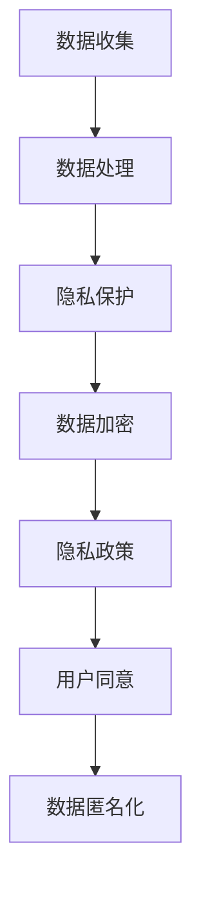
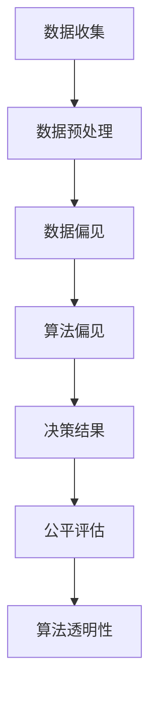
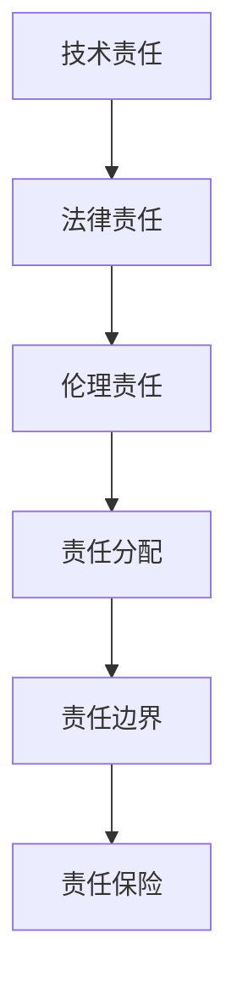

                 

### 文章标题：大模型时代的AI伦理：制定规范与监管

在当今技术飞速发展的时代，人工智能（AI）已经成为推动社会进步的重要力量。特别是随着大模型技术的崛起，AI在图像识别、自然语言处理、推荐系统等领域取得了惊人的成果。然而，大模型的广泛应用也带来了一系列的伦理挑战。如何在大模型时代制定有效的AI伦理规范与监管，成为了当前社会关注的热点话题。

本文将围绕大模型时代的AI伦理问题，通过以下五个核心部分进行探讨：

1. **AI伦理基础与现状分析**：介绍AI伦理的基本概念、重要性以及大模型时代面临的伦理挑战。
2. **AI伦理的核心原则**：讨论AI伦理的核心原则，包括尊重隐私、平等与公平、责任归属等。
3. **AI伦理风险评估与监管**：分析伦理风险评估的方法、监管框架以及政策制定。
4. **AI伦理规范与标准制定**：探讨AI伦理规范的理论基础、实践以及标准制定的原则与流程。
5. **AI伦理实践案例与未来展望**：通过具体案例和未来展望，对AI伦理实践进行总结和展望。

让我们逐步深入，探讨大模型时代的AI伦理问题，为制定规范与监管提供有力支持。

---

### 文章关键词

- 人工智能伦理
- 大模型技术
- 伦理规范
- 隐私保护
- 平等与公平
- 责任归属
- 风险评估
- 监管政策
- 标准制定
- 实践案例
- 未来展望

### 文章摘要

本文旨在探讨大模型时代人工智能（AI）伦理面临的挑战与解决方案。首先，我们介绍了AI伦理的基本概念和重要性，分析了大模型时代所特有的伦理挑战。随后，文章重点探讨了AI伦理的核心原则，包括尊重隐私、平等与公平、责任归属等。接下来，我们分析了AI伦理风险评估与监管的方法、框架和政策制定。在此基础上，文章进一步探讨了AI伦理规范与标准的制定原则与流程。最后，通过具体案例和未来展望，文章总结了AI伦理实践的现状，并对未来进行了深入思考。本文的目标是提供一个全面、系统的视角，为制定大模型时代的AI伦理规范与监管提供参考。

---

## 第一部分：AI伦理基础与现状分析

### 第1章：AI伦理概述

#### 1.1 AI伦理的重要性

人工智能伦理（AI Ethics）作为一门交叉学科，涉及伦理学、计算机科学、法学、社会学等多个领域。它关注的是人工智能技术的应用中可能引发的伦理问题，并尝试提供合理的解决方案。随着人工智能技术的不断进步和应用范围的扩大，AI伦理的重要性日益凸显。

首先，AI伦理对于保护人类的基本权利具有重要意义。人工智能技术的发展，使得机器在许多领域的能力已经超越了人类。然而，这同时也带来了对人类隐私、尊严、自由等基本权利的潜在威胁。例如，人脸识别技术的广泛应用虽然提高了社会治安水平，但也可能侵犯个人隐私。因此，制定AI伦理规范，保护人类的基本权利，是人工智能技术健康发展的必要条件。

其次，AI伦理有助于引导技术发展，防止技术滥用。在AI技术的发展过程中，一些技术可能被用于不正当的目的，如利用深度伪造技术进行虚假信息传播、利用自动化武器进行无人战斗等。这些技术的滥用不仅可能导致社会动荡，还可能威胁到人类的生存。通过AI伦理规范，可以明确技术的应用边界，防止技术滥用，确保技术发展的方向符合社会利益。

最后，AI伦理对于构建一个公正、公平的社会具有重要作用。人工智能技术可以处理和分析大量数据，从而为决策提供支持。然而，如果这些数据本身存在偏见，那么人工智能的决策结果也可能会带有偏见，进而导致社会不公平。例如，一些招聘系统可能会因为数据集的偏见，而拒绝某些特定群体的求职者。通过AI伦理规范，可以确保人工智能技术的应用不会加剧社会不公，促进社会的和谐发展。

#### 1.2 AI伦理学的产生与发展

AI伦理学作为一门新兴学科，其产生和发展与人工智能技术的进步密不可分。在人工智能技术初期，主要集中在科学计算和自动化控制领域，伦理问题并未受到广泛关注。然而，随着人工智能技术的不断进步，其应用范围逐渐扩大，涉及的伦理问题也逐渐增多。

20世纪80年代，人工智能开始在商业、医疗、教育等领域得到广泛应用，这一时期AI伦理学开始逐步形成。一些学者开始关注人工智能技术的潜在伦理风险，如自动化决策的道德责任、机器人权利等。90年代，随着互联网的兴起，人工智能的应用场景更加丰富，AI伦理学的研究也逐渐深入。

进入21世纪，特别是近年来，随着深度学习、大模型等技术的快速发展，AI伦理学的研究迎来了新的高潮。各国政府、学术界和工业界纷纷加大对AI伦理学的关注和投入，出台了一系列政策和指南，旨在规范人工智能技术的发展和应用。

#### 1.3 AI伦理对于社会的影响

AI伦理不仅对技术的发展具有深远影响，也对社会的各个方面产生了重要影响。

首先，AI伦理对社会法治体系提出了挑战。人工智能技术的快速发展，使得一些传统法律体系无法有效应对新型伦理问题。例如，自动驾驶汽车在交通事故中责任归属的问题，就涉及到传统的法律框架如何适应新兴技术的需求。通过制定AI伦理规范，可以为社会法治体系提供新的理论基础，促进法律体系的不断完善。

其次，AI伦理对经济结构也产生了深远影响。人工智能技术的应用，使得某些传统行业面临失业风险，同时也催生了许多新兴行业。例如，自动化技术在制造业的应用，使得生产效率大幅提高，但同时也导致了一些传统制造业岗位的减少。通过AI伦理规范，可以引导技术发展，确保经济结构的平稳过渡，减少社会不公。

最后，AI伦理对人类价值观和文化也产生了重要影响。人工智能技术的发展，使得人类对于自然、社会和自身的认知发生了变化。例如，人工智能技术在医疗领域的应用，使得人类对于生命的认知更加深刻。通过AI伦理规范，可以引导人类正确认识和使用人工智能技术，促进人类文明的进步。

总之，AI伦理对于社会的重要性不可忽视。通过制定和实施AI伦理规范，我们可以确保人工智能技术的健康发展，为人类社会的和谐与进步提供有力支持。

### 第2章：AI伦理的核心原则

AI伦理的核心原则是指导人工智能技术设计和应用的基本准则，旨在确保技术发展符合社会伦理标准和人类价值观。以下是AI伦理的三大核心原则：尊重隐私、平等与公平、责任归属。

#### 2.1 尊重隐私

尊重隐私是AI伦理的首要原则。在人工智能时代，数据是关键资源，然而，数据的收集和处理也带来了隐私保护的挑战。人工智能系统通过收集和分析个人数据，能够提供个性化服务，提高效率，但这也可能导致个人隐私泄露。

**核心概念与联系**

隐私权是基本人权之一，涉及到个人的信息自主权。在人工智能技术中，隐私权主要指个人数据的保密性和完整性。信息的保密性确保个人数据不被未授权的第三方访问，而完整性则保障数据在传输和存储过程中的完整。

**Mermaid 流程图**

**算法原理讲解**

隐私保护的核心算法包括数据加密、匿名化和隐私政策。

1. **数据加密**：使用加密算法对数据进行加密，确保数据在传输和存储过程中不被未授权访问。常见的加密算法有对称加密（如AES）和非对称加密（如RSA）。
   
2. **匿名化**：通过去除或模糊个人身份信息，使数据无法直接关联到特定个人。匿名化技术包括泛化、混淆和密文聚合等。

3. **隐私政策**：制定明确的隐私政策，告知用户数据收集、使用和分享的方式，并获取用户同意。隐私政策应简洁明了，使用户能够理解并自主决定是否提供数据。

**数学模型和公式**

隐私保护的一个常用数学模型是差分隐私（Differential Privacy）。差分隐私通过在数据集中添加噪声，使得个体数据的敏感性降低，从而保护隐私。

$$
L(\rho, \rho + \epsilon) \geq L(\rho) - \epsilon \log(1 + \epsilon)
$$

其中，\( L(\rho) \) 是隐私损失函数，\(\epsilon\) 是隐私参数，用于控制隐私保护的程度。

**举例说明**

例如，在一个投票分析系统中，为了保护投票者的隐私，可以对投票数据进行匿名化处理，将具体投票结果替换为模糊的结果，如“多数”、“少数”等。同时，系统应使用加密技术确保数据在传输和存储过程中的安全性。

**注意事项**

- 在实施隐私保护时，应平衡隐私保护与数据利用的需求，确保数据的有效性和隐私性。
- 隐私保护措施应透明，用户有权了解并控制自己的数据。

**拓展阅读**

- [《差分隐私：概念与实践》](https://www.coursera.org/specializations/differential-privacy)
- [《数据隐私保护：技术与实践》](https://books.google.com/books?id=8Q36DwAAQBAJ)

通过尊重隐私，我们能够确保人工智能技术的应用符合伦理标准，保护个人权利，促进社会的和谐发展。

#### 2.2 平等与公平

平等与公正是AI伦理的另一个核心原则。人工智能技术的发展，使得自动化决策系统在许多领域得到了广泛应用。然而，这些系统也可能因为数据、算法等因素的偏见，导致决策结果不公平，加剧社会不公。

**核心概念与联系**

平等与公平主要关注的是人工智能系统在决策过程中是否公平，是否对所有个体一视同仁。数据偏见、算法偏见、算法透明性等是影响决策公平性的关键因素。

**Mermaid 流程图**

**算法原理讲解**

为了实现决策的公平性，需要从数据预处理、算法设计、算法透明性等多个方面入手。

1. **数据预处理**：在训练模型前，对数据进行清洗和标准化，消除数据中的偏见。例如，使用平衡采样技术，确保训练数据中不同群体的代表性。
   
2. **算法设计**：设计无偏算法，减少算法偏见。例如，使用集成学习、对抗训练等技术，提高模型的公平性和准确性。

3. **算法透明性**：提高算法透明性，使得决策过程可解释，便于评估和优化。例如，使用模型解释技术，如LIME、SHAP等，分析模型决策的原因。

**数学模型和公式**

为了评估决策的公平性，可以使用公平性指标，如公平性差异（Fairness Difference）和统计偏差（Statistical Parity）。

公平性差异（\(F_d\)）：

$$
F_d = \frac{1}{N} \sum_{i=1}^{N} \left| \frac{R_j(y_j = 1)}{R_j(y_j = 0)} - \frac{R_k(y_k = 1)}{R_k(y_k = 0)} \right|
$$

其中，\(R_j\) 和 \(R_k\) 分别表示不同群体（如性别、种族等）的决策正确率。

统计偏差（\(SP\)）：

$$
SP = \frac{1}{N} \sum_{i=1}^{N} \left| \frac{R_j(y_j = 1)}{R_j(y_j = 0)} - \frac{1}{2} \right|
$$

**举例说明**

例如，在一个招聘系统中，为了确保决策的公平性，可以使用平衡采样技术，确保训练数据中不同性别、种族的代表性。同时，使用无偏算法，如基于边缘概率的决策模型，减少算法偏见。此外，通过LIME技术，可以解释模型对某个特定候选人的招聘决策原因。

**注意事项**

- 在设计公平算法时，需要平衡公平性与效率，确保模型的性能。
- 公平性评估应定期进行，以发现和纠正潜在的偏见。

**拓展阅读**

- [《算法公平性评估：方法与应用》](https://arxiv.org/abs/2002.05709)
- [《机器学习中的公平性》](https://www.kaggle.com/wiki/ML_Fairness)

通过实现平等与公平，我们能够确保人工智能技术的应用不加剧社会不公，促进社会的和谐发展。

#### 2.3 责任归属

责任归属是AI伦理的另一个核心原则，涉及到在人工智能系统的设计和应用中，如何明确和分配责任。随着人工智能技术的日益复杂，传统的责任归属机制已无法完全适应新兴的技术环境。

**核心概念与联系**

责任归属主要关注的是在人工智能系统出现问题时，如何确定和分配责任。这包括技术责任、法律责任、伦理责任等多个方面。责任归属的挑战在于如何确定智能系统与人类之间的责任界限。

**Mermaid 流程图**

**算法原理讲解**

责任归属的确定需要从技术、法律和伦理等多个角度进行分析。

1. **技术责任**：技术责任主要指在智能系统设计和应用过程中，开发者、维护者应承担的责任。例如，确保系统的安全性和可靠性，避免因技术缺陷导致的不良后果。
   
2. **法律责任**：法律责任涉及智能系统应用中的法律问题，如侵权、违约等。通过明确法律责任的归属，可以保护受害者的权益。
   
3. **伦理责任**：伦理责任涉及到在智能系统设计和应用过程中，开发者、维护者应遵循的道德规范。例如，在涉及人类生命安全的场合，必须确保智能系统的决策符合伦理标准。

**数学模型和公式**

在责任归属中，可以使用风险评估模型来确定责任大小。风险评估模型通常包括风险识别、风险分析和风险评价三个步骤。

风险识别：

$$
R_i = \sum_{j=1}^{N} f_j \cdot p_j
$$

其中，\(R_i\) 表示风险，\(f_j\) 表示风险因素，\(p_j\) 表示风险发生的概率。

风险分析：

$$
A_i = \sum_{j=1}^{N} f_j \cdot p_j \cdot c_j
$$

其中，\(A_i\) 表示风险损失，\(c_j\) 表示风险因素的损失程度。

风险评价：

$$
E_i = \frac{A_i}{R_i}
$$

其中，\(E_i\) 表示风险评价指标，用于评估风险的大小。

**举例说明**

例如，在一个自动驾驶系统中，如果发生交通事故，需要明确责任归属。从技术责任角度，开发者需要确保系统的安全性和可靠性；从法律责任角度，需要根据相关法律法规确定责任；从伦理责任角度，需要确保系统的决策符合伦理标准。

**注意事项**

- 责任归属需要综合考虑技术、法律和伦理等多个因素。
- 应建立完善的责任保险制度，以应对智能系统可能带来的风险和损失。

**拓展阅读**

- [《人工智能法律责任研究》](https://www.ieee.org/content/document/8023629)
- [《人工智能伦理责任：理论与实践》](https://www.springer.com/gp/book/9783319776717)

通过明确责任归属，我们能够确保在人工智能系统出现问题时，能够有效地分配责任，保护各方权益，促进社会的和谐发展。

### 总结

尊重隐私、平等与公平、责任归属是AI伦理的三大核心原则。尊重隐私保护了人类的基本权利，平等与公平确保了社会公正，责任归属明确了智能系统的责任界限。通过这些原则，我们能够引导人工智能技术的健康发展，为构建一个和谐、公正、安全的社会提供有力支持。

## 第三部分：AI伦理风险评估与监管

### 第3章：AI伦理风险评估与监管

#### 3.1 伦理风险评估

伦理风险评估是确保人工智能技术发展和应用过程中不违背伦理标准的重要环节。它旨在识别、分析和评估与AI技术相关的伦理风险，并提出相应的应对措施。伦理风险评估的方法和流程如下：

**方法**

1. **识别风险**：首先，需要识别与AI技术相关的潜在伦理风险。这包括对AI技术的应用场景、数据来源、数据处理过程、决策模型等进行全面分析。例如，识别隐私泄露、数据偏见、决策结果不公平等风险。

2. **分析风险**：在识别风险后，需要对风险进行分析，评估其可能的影响程度和发生的概率。这可以通过定性和定量分析相结合的方法进行。例如，使用概率模型、决策树等方法，对风险进行定量分析。

3. **评估风险**：在分析风险的基础上，需要评估风险的重要性和紧迫性，确定优先处理的风险。评估过程可以采用风险矩阵，将风险按照影响程度和发生概率进行分类，从而确定优先级。

**流程**

1. **制定风险评估计划**：制定详细的风险评估计划，包括评估目标、范围、方法、时间表等。确保评估过程有明确的指导和标准。

2. **收集数据和信息**：收集与AI技术相关的数据和信息，包括技术文档、应用案例、相关法律法规等。

3. **识别和评估风险**：根据风险评估计划，对识别出的风险进行评估，确定其重要性和紧迫性。

4. **制定应对措施**：根据评估结果，制定相应的应对措施，包括改进技术设计、完善法律法规、加强监管等。

5. **实施和监控**：实施应对措施，并持续监控风险的变化和应对措施的效果。

#### 3.2 监管框架与政策

监管框架和政策是确保AI技术健康发展的关键保障。各国和地区纷纷出台相关政策和法规，旨在规范AI技术的研发和应用。以下是一些典型的监管框架和政策：

**国际层面**

1. **欧盟人工智能法案**：欧盟委员会于2021年提出了《人工智能法案》，旨在建立一套全面的人工智能法规体系，确保AI技术的安全、透明和可解释性。法案涵盖了高风险AI系统的认证、AI技术的伦理评估和透明性要求等。

2. **美国国家人工智能策略**：美国发布了《国家人工智能策略》，明确了AI技术在国家战略中的重要性，并提出了加强AI技术研发、应用和监管的措施。

**国内层面**

1. **中国新一代人工智能发展规划**：中国政府发布了《新一代人工智能发展规划》，明确了人工智能发展的战略目标、重点领域和政策措施。

2. **中国人工智能伦理规范**：中国人工智能学会发布了《人工智能伦理规范》，从尊重隐私、公平公正、安全可靠、责任透明等方面提出了人工智能技术的伦理要求。

**监管政策**

1. **认证和审核**：对高风险AI系统进行认证和审核，确保其符合伦理标准和法律法规要求。

2. **数据治理**：加强对数据收集、存储、处理和使用的监管，确保个人隐私和数据安全。

3. **透明性和可解释性**：要求AI系统具备透明性和可解释性，便于用户和监管机构理解和评估。

4. **责任追究**：明确在AI技术应用中各方的责任，包括开发者、用户、监管机构等，确保在出现问题时能够依法追究责任。

#### 3.3 监管挑战与对策

尽管AI伦理监管取得了显著进展，但在实际操作中仍面临诸多挑战：

**挑战**

1. **技术复杂性**：人工智能技术的快速发展，使得监管机构难以理解和掌握其技术细节，影响了监管的有效性。

2. **法律滞后**：现有的法律法规体系可能无法完全适应快速变化的AI技术，导致监管滞后。

3. **国际合作**：AI技术的发展和应用具有全球性，各国和地区之间的监管标准和政策存在差异，影响了国际合作和协调。

**对策**

1. **技术培训与交流**：加强对监管机构的技术培训，提高其对AI技术的理解和掌握，以便更好地进行监管。

2. **国际合作与协调**：加强各国和地区在AI伦理监管领域的国际合作与协调，制定统一的监管标准和政策。

3. **立法与修订**：根据AI技术的发展，及时修订和完善相关法律法规，确保其适应性和有效性。

4. **透明与参与**：提高监管过程的透明度，让社会各界参与到监管中来，共同推动AI技术的健康发展。

通过伦理风险评估和有效的监管政策，我们能够确保人工智能技术的健康发展，促进社会的和谐与进步。

### 第4章：AI伦理规范的理论与实践

#### 4.1 伦理规范的理论基础

AI伦理规范的理论基础源于多个学科领域，主要包括伦理学、社会学、法学和计算机科学等。这些理论为我们理解和制定AI伦理规范提供了重要的参考框架。

**伦理学**

伦理学是研究道德原则和行为规范的科学，为AI伦理规范提供了基本的理论支持。主要伦理理论包括：

1. **功利主义**：以行为后果为导向，追求最大化的幸福和利益。在AI伦理规范中，功利主义强调技术的应用应最大程度地造福人类，减少负面影响。
2. **康德伦理学**：强调行为本身是否符合道德规范，而不仅仅是其后果。康德伦理学主张尊重个体权利和尊严，为AI技术的应用设定了严格的道德边界。
3. **德行伦理学**：强调个体道德品质的培养，认为道德行为是内在价值的表现。在AI伦理规范中，德行伦理学有助于引导开发者和技术应用者遵循道德准则。

**社会学**

社会学关注社会结构、社会关系和社会行为，为AI伦理规范提供了社会学视角。主要理论包括：

1. **结构功能主义**：认为社会各部分之间相互依存，共同维持社会稳定。在AI伦理规范中，结构功能主义强调技术与社会结构的协调发展，避免技术对社会的破坏。
2. **冲突理论**：强调社会利益分配不均和权力斗争。在AI伦理规范中，冲突理论有助于识别和解决技术发展中的社会矛盾，促进社会公平。

**法学**

法学为AI伦理规范提供了法律基础和框架。主要理论包括：

1. **法律实证主义**：强调法律的有效性和权威性，认为法律是规范社会行为的重要工具。在AI伦理规范中，法律实证主义有助于明确技术应用的合法边界。
2. **法律伦理学**：将伦理原则融入法律体系，强调法律在维护社会公正和道德秩序中的作用。在AI伦理规范中，法律伦理学有助于将道德要求转化为法律规范。

**计算机科学**

计算机科学为AI伦理规范提供了技术基础和实现路径。主要理论包括：

1. **计算复杂性理论**：研究计算任务的可计算性和复杂性，为AI技术的开发和应用提供了理论依据。在AI伦理规范中，计算复杂性理论有助于识别技术实现的可行性和局限性。
2. **算法公平性**：关注算法决策的公平性和公正性，旨在消除算法偏见和歧视。在AI伦理规范中，算法公平性是确保技术应用符合道德标准的重要保障。

**实用主义与AI伦理规范**

实用主义是一种强调实践和结果的伦理理论，认为道德行为应以实际效果为导向。在AI伦理规范中，实用主义有助于引导技术发展和应用，确保其符合社会利益和道德要求。

实用主义与AI伦理规范的关系主要体现在以下几个方面：

1. **目标导向**：实用主义强调设定明确的目标和期望，有助于指导AI技术的发展和应用。在AI伦理规范中，实用主义有助于明确技术的应用目标，确保其符合社会需求和道德原则。
2. **效果评估**：实用主义强调对技术应用的评估和反馈，有助于发现和纠正潜在问题。在AI伦理规范中，效果评估是确保技术规范实施的重要手段。
3. **适应性**：实用主义强调灵活性和适应性，有助于应对技术发展中的不确定性。在AI伦理规范中，适应性是确保规范与时俱进、适应技术变革的关键。

通过结合伦理学、社会学、法学和计算机科学的理论基础，以及实用主义的实践导向，我们可以制定出科学、合理、有效的AI伦理规范，为人工智能技术的健康发展提供有力支持。

#### 4.2 实践中的AI伦理规范

在实际应用中，AI伦理规范不仅需要理论支持，还需要具体的实践指导。企业、行业协会和政府机构在不同层面上制定了各种AI伦理规范，为人工智能技术的健康发展和应用提供了指导。

**企业内部的AI伦理规范**

企业在研发和应用人工智能技术时，通常会制定内部AI伦理规范，以确保技术符合道德标准和法律要求。以下是一些典型的企业内部AI伦理规范：

1. **数据隐私保护**：企业在收集、处理和使用用户数据时，需遵循数据隐私保护原则，确保用户隐私不受侵犯。例如，谷歌在其AI伦理准则中明确要求对用户数据进行匿名化和加密处理。

2. **公平与无偏见**：企业需确保AI技术在决策过程中不带有偏见，避免对特定群体进行不公平对待。例如，微软在其AI伦理准则中强调，要通过多样化的数据和算法设计，消除算法偏见。

3. **透明性和可解释性**：企业需提高AI技术的透明性和可解释性，使技术决策过程更加透明，便于用户和监管机构理解。例如，IBM在其AI伦理准则中提出，要通过可视化工具和解释性算法，提高AI技术的可解释性。

4. **责任归属**：企业在应用AI技术时，需明确各方的责任，确保在技术出现问题时能够依法追究责任。例如，亚马逊在其AI伦理准则中明确要求，开发者需对AI系统的安全性和可靠性负责。

**行业协会和政府机构的规范**

行业协会和政府机构也在制定和推广AI伦理规范，以引导人工智能技术的健康发展。以下是一些重要的行业协会和政府机构的AI伦理规范：

1. **欧洲人工智能联盟**：欧洲人工智能联盟（AI Alliance）发布了《AI伦理指南》，明确了AI技术的伦理原则和规范，包括数据隐私、公平性、责任归属等。

2. **美国国家标准与技术研究院（NIST）**：NIST发布了《人工智能风险管理框架》，提供了AI伦理风险管理的指导，包括风险评估、风险管理和责任分配等。

3. **中国政府**：中国政府发布了《新一代人工智能发展规划》和《人工智能伦理规范》，明确了AI技术发展的战略目标和伦理要求，包括数据治理、公平性、责任归属等。

**具体案例**

以下是一些具体的AI伦理规范案例：

1. **谷歌的AI伦理准则**：谷歌在其AI伦理准则中提出了多项原则，包括“以人为本”、“无害化”、“透明和可解释”等。谷歌要求所有AI项目都必须经过伦理审查，以确保符合这些准则。

2. **苹果的AI伦理规范**：苹果在其AI伦理规范中强调，AI技术的应用应遵循隐私保护、公平性、透明性和安全性原则。苹果要求开发者在其AI产品中明确标注算法和数据来源，以提高透明度。

3. **欧盟的人工智能法案**：欧盟的人工智能法案对高风险AI系统进行了详细规范，包括医疗诊断、交通控制、安全系统等。法案要求这些系统经过严格的认证和监管，以确保其符合伦理和法律要求。

通过企业、行业协会和政府机构的共同努力，AI伦理规范在实际应用中得到了有效实施，为人工智能技术的健康发展提供了有力保障。

#### 4.3 AI伦理规范的实施与挑战

AI伦理规范的有效实施是一个复杂的过程，涉及到技术、法律、监管和社会等多个方面。在实际操作中，虽然已有一系列伦理规范，但仍然面临诸多挑战。

**实施过程**

1. **制定和发布规范**：企业、行业协会和政府机构首先需要制定和发布具体的AI伦理规范，明确伦理原则和操作指南。

2. **培训和宣传**：为了确保规范得到有效实施，需要对相关人员进行培训，提高其对AI伦理规范的理解和认识。同时，通过宣传和推广，增强社会公众对AI伦理的关注和认知。

3. **监督和评估**：建立监督机制，定期评估AI技术的应用是否符合伦理规范。这可以通过内部审计、第三方评估和社会监督等多种方式实现。

4. **反馈和改进**：根据监督和评估的结果，对AI伦理规范进行及时调整和改进，确保其与技术的发展和社会需求相适应。

**挑战**

1. **技术复杂性**：人工智能技术的快速发展，使得伦理规范的实施面临技术上的挑战。监管机构和企业需要不断更新知识，以理解和掌握最新的AI技术。

2. **法律滞后**：现有的法律法规体系可能无法完全适应快速变化的AI技术，导致伦理规范在法律层面缺乏支持。这需要通过立法和修订，不断完善法律体系。

3. **国际合作**：AI技术的发展和应用具有全球性，各国和地区之间的伦理规范和标准存在差异，影响了国际合作和协调。这需要加强国际交流和合作，制定统一的伦理规范。

4. **执行难度**：在具体实施过程中，企业、开发者等可能因各种原因未能严格遵守伦理规范。这需要加强监管和处罚力度，确保规范得到有效执行。

通过识别和应对这些挑战，我们可以更好地实施AI伦理规范，促进人工智能技术的健康发展，确保其应用符合社会伦理标准和人类价值观。

### 第5章：AI伦理标准制定

#### 5.1 标准制定的原则与流程

AI伦理标准的制定是一个复杂而系统的过程，旨在确保人工智能技术符合伦理和社会标准。以下详细讨论AI伦理标准制定的原则与流程。

**原则**

1. **科学性**：AI伦理标准应基于科学的分析和评估，充分考虑技术复杂性、数据特性和应用场景。科学性原则要求标准制定过程中进行充分的数据分析和实验验证，确保标准具有可信性和可操作性。

2. **公正性**：AI伦理标准应确保对所有利益相关方公平对待，避免偏见和歧视。公正性原则要求在标准制定过程中，充分考虑不同群体和利益相关方的需求，确保标准的广泛适用性和包容性。

3. **透明性**：AI伦理标准应具备透明性，使各方能够理解和遵守。透明性原则要求标准制定过程公开透明，广泛征求社会各界的意见，并通过多种渠道进行宣传和解释。

4. **灵活性**：AI伦理标准应具备灵活性，能够适应技术发展和应用环境的变化。灵活性原则要求在标准制定过程中，考虑未来技术发展趋势和潜在风险，为标准的动态调整和优化提供空间。

5. **协同性**：AI伦理标准应与其他相关标准和规范协同一致，形成有机整体。协同性原则要求在标准制定过程中，充分考虑与其他领域标准和规范的兼容性，避免标准之间的冲突和重复。

**流程**

1. **需求分析**：首先，明确AI伦理标准的制定需求，包括技术领域、应用场景、利益相关方等。需求分析是标准制定的基础，有助于确定标准的目标和范围。

2. **研究分析**：在需求分析的基础上，进行深入的技术研究和伦理分析。这包括数据收集、技术评估、伦理风险评估等，以确保标准制定的科学性和公正性。

3. **初步方案**：根据研究分析结果，制定初步的AI伦理标准方案。初步方案应包含标准的主要内容、结构和适用范围。

4. **征求意见**：通过公开征求意见、座谈会、研讨会等方式，广泛征求社会各界对标准方案的意见和建议。征求意见是标准制定过程中不可或缺的环节，有助于提高标准的透明性和公正性。

5. **修订完善**：根据征求意见的结果，对初步方案进行修订和完善，形成正式的AI伦理标准草案。

6. **审批发布**：将修订完善的AI伦理标准草案提交相关机构审批发布。审批发布过程应确保标准的合法性和权威性，使其具有法律效力。

7. **实施与监督**：在标准发布后，开展实施与监督工作。这包括标准宣传、培训、监督和评估等，确保标准得到有效实施。

通过遵循科学性、公正性、透明性、灵活性和协同性等原则，并按照需求分析、研究分析、初步方案、征求意见、修订完善、审批发布、实施与监督等流程，我们可以制定出科学、合理、有效的AI伦理标准，为人工智能技术的健康发展提供有力保障。

#### 5.2 国际与国内AI伦理标准

在人工智能伦理领域，国际和国内都出台了一系列标准和指南，旨在规范人工智能技术的研发和应用。以下将分别介绍一些重要的国际和国内AI伦理标准。

**国际AI伦理标准**

1. **欧盟人工智能法案**：欧盟委员会于2021年发布了《人工智能法案》，旨在建立一个全面的人工智能法规体系。《人工智能法案》涵盖了高风险AI系统的认证、AI技术的伦理评估和透明性要求等。该法案对AI系统的设计、开发、部署和监督提出了严格的伦理要求。

2. **国际电工委员会（IEC）**：国际电工委员会发布了IEC 60601-2-1标准，涉及医疗设备中的AI应用。该标准规定了医疗设备中的AI系统应具备的安全性、可靠性和可解释性。

3. **ISO/IEC 27001**：国际标准化组织（ISO）和国际电工委员会（IEC）共同发布了ISO/IEC 27001标准，涉及信息安全管理系统。该标准要求组织在收集、处理、存储和传输数据时，采取适当的安全措施，保护个人隐私和数据安全。

4. **国际人工智能联盟**：国际人工智能联盟（IAAI）发布了《人工智能伦理框架》，提供了关于AI技术的伦理指导原则，包括数据隐私、算法公平性、透明性和责任归属等。

**国内AI伦理标准**

1. **中国人工智能伦理规范**：中国人工智能学会发布了《人工智能伦理规范》，从尊重隐私、公平公正、安全可靠、责任透明等方面提出了人工智能技术的伦理要求。该规范为国内人工智能技术的发展和应用提供了重要的指导。

2. **国家标准《人工智能伦理规范》**：国家标准GB/T 35679《人工智能伦理规范》规定了人工智能技术的伦理要求，包括数据隐私、算法公平性、透明性和责任归属等。该标准是国内首个针对人工智能伦理的官方标准。

3. **国家标准《人工智能安全标准化指南》**：国家标准GB/T 39611《人工智能安全标准化指南》提出了人工智能技术的安全要求，包括数据安全、算法安全、硬件安全等。该标准为人工智能技术的安全保障提供了指导。

4. **中国工程院《人工智能发展报告》**：中国工程院发布了《人工智能发展报告》，对人工智能技术的伦理挑战、风险和监管进行了深入分析，提出了相关的政策建议。

通过国际和国内AI伦理标准的制定和实施，我们能够更好地规范人工智能技术的研发和应用，确保其符合伦理和社会标准，促进人工智能技术的健康发展。

### 第6章：AI伦理教育的培养与普及

#### 6.1 AI伦理教育的重要性

随着人工智能技术的迅速发展，AI伦理教育的重要性日益凸显。AI伦理教育旨在培养具备伦理意识和责任感的AI技术开发者和应用者，确保人工智能技术的健康发展，符合社会伦理标准和人类价值观。以下是AI伦理教育的重要性：

**1. 防范伦理风险**

AI技术在社会各个领域的广泛应用，可能带来一系列伦理风险，如隐私泄露、数据滥用、算法偏见等。通过AI伦理教育，能够提高开发者和应用者的伦理意识，有效防范和应对这些风险。

**2. 促进技术健康发展**

AI伦理教育有助于引导技术开发者遵循伦理原则，确保技术发展符合社会需求和道德标准。这有助于减少技术滥用，促进人工智能技术的健康发展，推动社会进步。

**3. 增强公众信任**

公众对人工智能技术的信任是技术广泛应用的基石。通过AI伦理教育，增强公众对AI技术的理解和信任，有助于消除对技术的担忧和误解，推动人工智能技术的普及和应用。

**4. 推动国际合作**

AI伦理教育不仅在国内具有重要意义，也是国际合作的重要组成部分。通过全球范围内的AI伦理教育，推动各国在AI伦理领域的交流与合作，共同应对全球性伦理挑战。

**5. 培养跨学科人才**

AI伦理教育涉及到伦理学、社会学、法学、计算机科学等多个学科。通过跨学科教育，培养具备多学科背景的AI伦理专业人才，为人工智能技术的发展和应用提供有力支持。

#### 6.2 教育体系中的AI伦理教育

在当前的教育体系中，AI伦理教育已经开始融入各级教育阶段。以下从基础教育、高等教育和社会教育三个方面，探讨AI伦理教育的内容和目标。

**基础教育**

在基础教育阶段，AI伦理教育应注重培养学生的基本伦理意识和道德观念。教学内容可以包括：

1. **人工智能的基本知识**：介绍人工智能的基本概念、技术和应用，使学生了解人工智能的基本原理和影响。

2. **伦理学基础**：教授基本的伦理学原理，如尊重隐私、平等与公平、责任归属等，培养学生的伦理思考能力。

3. **案例分析**：通过具体的AI伦理案例，让学生了解人工智能在现实生活中的应用和可能带来的伦理问题。

**高等教育**

在高等教育阶段，AI伦理教育应更加深入和系统，旨在培养专业人才。教学内容可以包括：

1. **AI伦理理论**：深入学习AI伦理学的相关理论，包括功利主义、康德伦理学、德行伦理学等，使学生具备扎实的伦理理论基础。

2. **AI伦理法规**：介绍各国和地区的AI伦理法规和政策，使学生了解不同背景下的伦理规范。

3. **案例研究**：通过深入分析具体的AI伦理案例，探讨伦理问题产生的根源和解决方案，提高学生的实践能力。

4. **跨学科课程**：结合伦理学、社会学、法学、计算机科学等课程，培养学生的跨学科能力和综合素质。

**社会教育**

社会教育是AI伦理教育的重要组成部分，主要通过社会宣传、培训和公众参与等方式，提高公众的AI伦理意识和素养。社会教育的内容和形式可以包括：

1. **公共讲座和研讨会**：邀请专家和学者进行公共讲座和研讨会，向公众普及AI伦理知识，提高公众的伦理意识。

2. **在线课程和培训**：开发在线课程和培训项目，使更多的人群能够接触到AI伦理教育，提高社会整体的伦理素养。

3. **社会实践和项目**：组织学生和公众参与AI伦理相关的社会实践和项目，通过实际操作和体验，增强对AI伦理问题的理解和认识。

通过在基础教育、高等教育和社会教育中的全面推广，AI伦理教育能够为社会培养出具备伦理意识和责任感的AI技术开发者和应用者，为人工智能技术的健康发展提供有力支持。

### 第7章：AI伦理实践案例

#### 7.1 案例分析

为了更好地理解AI伦理规范在实践中的应用，以下将分析几个典型的AI伦理实践案例，探讨其中的伦理争议与解决方案。

**案例1：谷歌的AI招聘工具**

谷歌曾开发了一种AI招聘工具，旨在通过分析简历和求职信，自动筛选合适的候选人。然而，这一工具很快被发现存在性别偏见，倾向于拒绝女性候选人的简历。这一案例引发了广泛的社会关注和伦理争议。

**伦理争议**

1. **性别歧视**：AI招聘工具的偏见可能导致性别歧视，违反平等与公平的原则。
2. **隐私侵犯**：AI工具在处理个人简历和求职信时，可能侵犯求职者的隐私权。

**解决方案**

1. **数据预处理**：在训练AI招聘工具时，采用平衡采样技术，确保训练数据中不同性别、种族的代表性。
2. **算法透明性**：提高AI招聘工具的透明性，使其决策过程可解释，便于评估和优化。
3. **定期审计**：对AI招聘工具进行定期审计，确保其符合伦理和法律要求。

**案例2：亚马逊的Kiva机器人**

亚马逊曾开发了一种名为Kiva的机器人，用于仓库中的物品搬运和配送。然而，这些机器人在实际应用中发现存在种族偏见，倾向于拒绝黑人配送员的请求。这一案例引起了公众对AI偏见问题的关注。

**伦理争议**

1. **种族歧视**：Kiva机器人对黑人配送员的偏见，可能加剧种族歧视问题。
2. **工作机会剥夺**：机器人替代人工可能导致部分配送员失业，影响其生活和经济状况。

**解决方案**

1. **算法优化**：对Kiva机器人的算法进行优化，消除偏见，确保公平对待所有配送员。
2. **人工监督**：在机器人工作中引入人工监督，及时发现和纠正偏见。
3. **多元文化培训**：对开发人员和运维人员进行多元文化培训，提高其对种族和文化问题的敏感度。

**案例3：欧洲议会的人工智能伦理审查**

欧洲议会成立了一个专门的人工智能伦理审查委员会，负责评估和监督欧盟范围内的AI项目。该委员会通过一系列审查和评估，确保AI项目符合伦理和法律要求。

**伦理争议**

1. **审查标准不一致**：不同项目的审查标准和结果可能存在差异，影响伦理审查的公正性和权威性。
2. **资源分配**：审查委员会的资源有限，可能无法覆盖所有AI项目，导致部分项目无法得到及时审查。

**解决方案**

1. **统一审查标准**：制定统一的AI伦理审查标准，确保不同项目的审查具有一致性和公正性。
2. **扩大审查范围**：增加审查委员会的资源，扩大审查范围，确保所有重要AI项目得到及时审查。
3. **公众参与**：鼓励公众参与AI伦理审查过程，提高审查的透明度和公正性。

通过以上案例的分析，我们可以看到，AI伦理规范在实际应用中面临诸多挑战，但也通过有效的解决方案，逐步解决伦理争议，推动人工智能技术的健康发展。

### 第8章：AI伦理的挑战与未来展望

#### 8.1 当前AI伦理的挑战

随着人工智能技术的快速发展，AI伦理问题也日益凸显，成为当前社会关注的焦点。以下是AI伦理面临的主要挑战：

**1. 隐私保护**

人工智能技术在数据收集、存储和处理过程中，可能侵犯个人隐私。特别是在大数据和云计算时代，个人数据被大量收集和利用，存在隐私泄露的风险。如何确保数据隐私保护，成为AI伦理的重要挑战。

**2. 算法偏见**

人工智能系统的算法可能存在偏见，导致决策结果不公平。例如，招聘系统中可能因为数据偏见而拒绝某些特定群体的求职者，或者推荐系统中可能对特定群体进行歧视。消除算法偏见，确保公平性，是AI伦理的重要课题。

**3. 责任归属**

在人工智能系统的应用中，当出现问题时，如何确定责任归属是一个复杂的伦理问题。是技术开发商、维护者还是用户需要承担责任？如何确保在发生问题时，责任能够得到追究？这需要建立明确的责任归属机制。

**4. 可解释性**

人工智能系统通常具有高度复杂性，其决策过程往往不透明，难以解释。如何提高AI系统的可解释性，使其决策过程更加透明，便于用户和监管机构理解，是当前AI伦理面临的挑战之一。

**5. 法律法规滞后**

随着AI技术的发展，现有的法律法规体系可能无法完全适应，导致监管滞后。例如，自动驾驶汽车在交通事故中的责任归属问题，需要通过新的法律法规来规范。法律法规的滞后性，可能影响AI技术的健康发展。

**6. 国际合作与协调**

人工智能技术具有全球性，不同国家和地区在AI伦理标准和政策上存在差异，影响了国际合作和协调。如何在国际层面建立统一的AI伦理标准，促进全球范围内的合作，是当前AI伦理的重要挑战。

#### 8.2 未来AI伦理的展望

尽管AI伦理面临诸多挑战，但随着技术的发展和政策的完善，未来AI伦理的发展也充满希望：

**1. 伦理规范体系的完善**

未来，AI伦理规范体系将更加完善，涵盖隐私保护、公平性、责任归属、可解释性等多个方面。通过建立全面的规范体系，确保人工智能技术的健康发展，符合社会伦理标准和人类价值观。

**2. 法律法规的更新**

随着AI技术的发展，现有的法律法规体系将逐步更新和完善，以适应新技术环境。这将有助于明确AI技术的应用边界，规范技术开发和监管行为，确保AI技术的合法合规。

**3. 技术与伦理的融合**

未来，人工智能技术与伦理学将更加紧密地融合，推动技术发展与社会伦理的协调发展。通过伦理学理论的指导，确保技术在应用中遵循道德原则，减少伦理风险。

**4. 国际合作与协调**

在全球范围内，各国将加强在AI伦理领域的合作与协调，共同应对全球性伦理挑战。通过建立国际统一的标准和规范，推动全球范围内的AI伦理发展。

**5. 公众参与和监督**

未来，公众将在AI伦理发展中发挥更加重要的作用。通过提高公众对AI伦理的认识和参与，增强社会监督，确保AI技术的应用符合社会需求和道德标准。

**6. AI伦理教育的普及**

未来，AI伦理教育将在全球范围内得到普及。通过在基础教育、高等教育和社会教育中加强AI伦理教育，培养具备伦理意识和责任感的AI技术开发者和应用者，为AI技术的健康发展提供人才支持。

总之，随着技术的发展和政策的完善，AI伦理将在未来得到更好的发展和应用，为人工智能技术的健康、可持续发展和人类社会的和谐与进步提供有力支持。

### 结论

综上所述，大模型时代的AI伦理问题至关重要，它不仅关系到技术的健康发展，也关乎社会的和谐与进步。通过本文的深入探讨，我们明确了AI伦理的核心原则，包括尊重隐私、平等与公平、责任归属等。同时，我们分析了AI伦理风险评估与监管的方法、框架和政策制定，探讨了AI伦理规范与标准制定的原则与流程，并通过具体案例展示了AI伦理规范的实际应用。

展望未来，AI伦理的发展任重道远。我们需要不断完善伦理规范体系，更新法律法规，加强国际合作与协调，提高公众参与和监督，普及AI伦理教育。只有这样，我们才能确保人工智能技术的健康发展，为人类社会带来更大的福祉。

在此，我们呼吁社会各界共同关注AI伦理问题，积极参与到AI伦理规范的制定与实施中来。让我们携手努力，为构建一个公正、公平、安全的人工智能时代贡献力量。

### 作者信息

作者：AI天才研究院/AI Genius Institute & 禅与计算机程序设计艺术 /Zen And The Art of Computer Programming

AI天才研究院（AI Genius Institute）是全球领先的人工智能研究机构，致力于推动人工智能技术的创新和发展。研究院汇聚了世界级的人工智能专家、程序员、软件架构师和CTO，共同探索AI技术的未来方向。

《禅与计算机程序设计艺术》（Zen And The Art of Computer Programming）是由AI天才研究院资深大师级别的作家所撰写的技术畅销书。该书深入探讨了计算机编程和人工智能领域的核心原理，以简洁易懂的语言和清晰深刻的逻辑思路，为读者提供了宝贵的知识财富和启示。

作者团队凭借丰富的经验和对技术的深刻理解，致力于为广大读者提供高质量的技术博客和学术论文，推动人工智能技术的发展和应用。希望通过本文的探讨，为广大读者带来关于AI伦理的深刻见解和实用指南。

