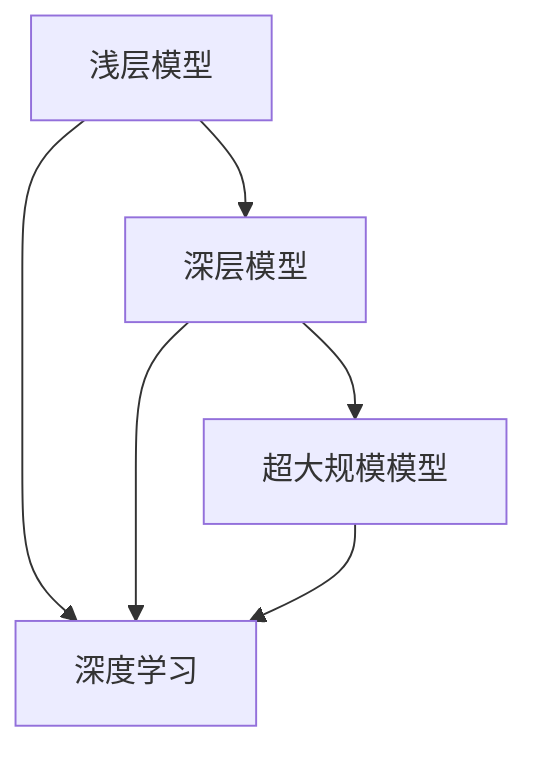
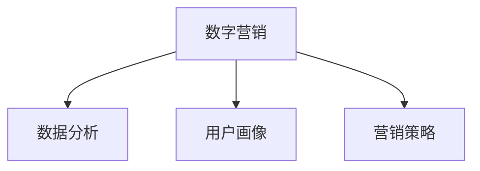
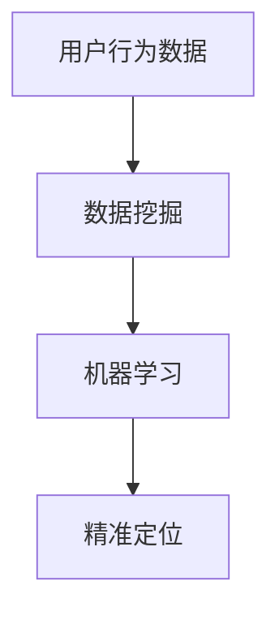
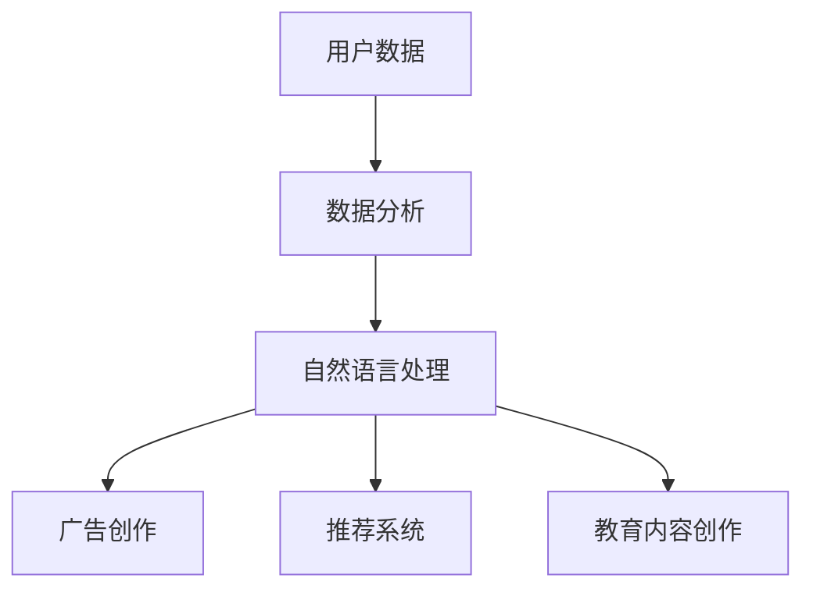

                 


### 《大模型时代的数字营销：精准定位与个性化内容》

#### 文章关键词
- 大模型
- 数字营销
- 精准定位
- 个性化内容
- 深度学习
- 机器学习

#### 文章摘要
本文将探讨大模型时代下的数字营销，重点关注精准定位与个性化内容创作。通过深入分析大模型的基本原理和技术架构，我们将揭示其在数字营销中的应用价值，并分享实际案例和策略。文章旨在为读者提供全面了解大模型在数字营销领域的应用指南。

---

## 第一部分：大模型与数字营销概述

### 1.1 大模型时代的来临

#### 1.1.1 大模型的概念及其发展历程

大模型，即具有巨大规模、高容量和强计算能力的人工智能模型。从浅层模型到深层模型，再到超大规模模型，大模型的发展历程体现了人工智能技术的不断进步。

**核心概念与联系**

大模型的发展与深度学习、神经网络等基础技术密切相关。深度学习为神经网络提供了更强的表达能力和自学习能力，而神经网络则为深度学习提供了实现框架。

**Mermaid 流程图**


#### 1.1.2 数字营销的定义及其重要性

数字营销，即利用数字技术和工具进行的营销活动。在互联网普及和大数据时代的背景下，数字营销已成为企业提升营销效果、降低成本、增加客户满意度的重要手段。

**核心概念与联系**

数字营销的核心在于利用数据和技术手段，实现对目标客户的精准定位和个性化服务。这一过程涉及到数据分析、用户画像、营销策略等多个方面。

**Mermaid 流程图**


### 1.2 大模型在数字营销中的应用

#### 1.2.1 大模型在精准定位中的应用

精准定位，即对目标客户进行精确识别和定位。大模型在精准定位中的应用，主要体现在用户行为分析、兴趣识别和偏好预测等方面。

**核心概念与联系**

大模型具有强大的计算能力和自学习能力，能够从海量数据中提取有价值的信息，从而实现对目标客户的精准定位。这一过程涉及到数据挖掘、机器学习等多个技术。

**Mermaid 流流程图**


#### 1.2.2 大模型在个性化内容创作中的应用

个性化内容创作，即根据用户特点和需求生成独特的内容。大模型在个性化内容创作中的应用，主要体现在广告、推荐系统和教育内容等领域。

**核心概念与联系**

大模型能够通过对用户数据的分析，了解用户的兴趣和需求，从而生成符合用户个性化需求的广告、推荐和教育内容。这一过程涉及到自然语言处理、生成对抗网络等多个技术。

**Mermaid 流流程图**


## 第二部分：大模型技术基础

### 2.1 大模型的原理与架构

#### 2.1.1 大模型的基本原理

大模型的基本原理主要基于深度学习、神经网络等基础技术。深度学习为神经网络提供了更强的表达能力和自学习能力，使得大模型能够处理更加复杂的任务。

**核心算法原理讲解（伪代码）**
```python
# 深度学习模型基本架构
class DeepLearningModel:
    def __init__(self, input_size, hidden_size, output_size):
        self.input_size = input_size
        self.hidden_size = hidden_size
        self.output_size = output_size
        self.model = NeuralNetwork(input_size, hidden_size, output_size)
        
    def forward(self, x):
        return self.model.forward(x)
        
    def backward(self, x, y):
        return self.model.backward(x, y)
```

#### 2.1.2 大模型的主要架构

大模型的主要架构通常基于Transformer架构，该架构具有强大的并行处理能力和自注意力机制，适用于处理长文本等复杂任务。

**核心算法原理讲解（伪代码）**
```python
# Transformer模型基本架构
class TransformerModel:
    def __init__(self, input_size, hidden_size, output_size):
        self.input_size = input_size
        self.hidden_size = hidden_size
        self.output_size = output_size
        self.encoder = Encoder(input_size, hidden_size)
        self.decoder = Decoder(hidden_size, output_size)
        
    def forward(self, x):
        encoded = self.encoder(x)
        decoded = self.decoder(encoded)
        return decoded
        
    def backward(self, x, y):
        encoded = self.encoder.backward(x)
        decoded = self.decoder.backward(encoded, y)
        return decoded
```

### 2.2 大模型的关键技术

#### 2.2.1 大模型的训练与优化

大模型的训练与优化是关键环节，涉及到大规模数据集的训练、优化算法的应用等方面。

**核心算法原理讲解（伪代码）**
```python
# 大模型训练过程
class ModelTraining:
    def __init__(self, model, data_loader, optimizer):
        self.model = model
        self.data_loader = data_loader
        self.optimizer = optimizer
        
    def train(self):
        for epoch in range(num_epochs):
            for data in self.data_loader:
                inputs, targets = data
                outputs = self.model(inputs)
                loss = self.model.loss(outputs, targets)
                self.optimizer.backward(loss)
                self.optimizer.update()
```

#### 2.2.2 大模型的部署与应用

大模型的部署与应用涉及云计算、边缘计算等多个环境，需要考虑模型的压缩、迁移学习等方面。

**核心算法原理讲解（伪代码）**
```python
# 大模型部署过程
class ModelDeployment:
    def __init__(self, model, environment):
        self.model = model
        self.environment = environment
        
    def deploy(self):
        if self.environment == "cloud":
            self.model.compress()
            self.model.upload_to_cloud()
        elif self.environment == "edge":
            self.model.compress()
            self.model.upload_to_edge_device()
```

---

接下来，我们将进一步探讨大模型在数字营销中的应用案例，以及如何在实践中运用大模型实现精准定位和个性化内容创作。敬请期待。

