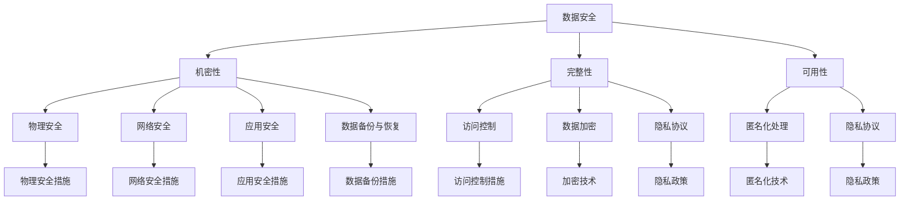

                 


### 第一步：分析文章的目标读者和写作风格

首先，我们需要明确文章的目标读者。这篇文章的目标读者包括数据安全与隐私保护领域的专业人士、对大模型技术感兴趣的IT从业人员、以及关注数据安全与隐私保护问题的政策制定者和监管人员。因此，文章的写作风格需要既专业又易于理解。

写作风格方面，文章将采用以下特点：
1. **清晰的结构**：文章将按照目录大纲结构，分为多个部分，每个部分都针对特定的主题进行详细阐述。
2. **简洁明了的语言**：使用简洁、准确、专业的语言，避免使用过于复杂的技术术语。
3. **逻辑严密的分析**：在阐述每个概念和原理时，使用逻辑推理的方式，让读者能够逐步理解并跟上文章的思路。
4. **图文并茂**：在适当的地方使用图表、流程图和伪代码，以增强文章的可读性和理解性。
5. **实例讲解**：通过具体的实例和案例分析，帮助读者更好地理解技术原理和应用。

### 第二步：确定文章的核心内容和结构

接下来，我们需要确定文章的核心内容和结构。文章将围绕“大模型时代的数据安全与隐私保护新策略”这一主题，分为四个主要部分：

1. **大模型时代背景及数据安全隐私挑战**：介绍大模型时代的发展背景、特点和应用，以及数据安全与隐私保护面临的挑战。
2. **数据安全与隐私保护理论基础**：阐述数据安全与隐私保护的基本概念、密码学基础和安全协议。
3. **数据安全与隐私保护技术**：介绍数据加密技术和隐私保护技术，包括算法原理和应用。
4. **数据安全与隐私保护实践**：探讨数据安全与隐私保护的项目管理、实战案例和最佳实践。

### 第三步：详细规划每个部分的内容

在确定了文章的核心内容和结构后，我们需要详细规划每个部分的内容，确保文章的完整性和逻辑性。

**第一部分：大模型时代背景及数据安全隐私挑战**

- **第1章：大模型时代概述**
  - 大模型的发展历程
  - 大模型技术的特点与应用
  - 大模型时代的到来：机遇与挑战

- **第2章：数据安全与隐私保护背景**
  - 数据安全与隐私保护的重要性
  - 数据安全与隐私保护的法律法规
  - 大模型时代数据安全隐私保护面临的挑战

**第二部分：数据安全与隐私保护理论基础**

- **第3章：数据安全与隐私保护基本概念**
  - 数据安全定义与分类
  - 数据隐私保护定义与分类
  - 数据安全与隐私保护的关系

- **第4章：密码学基础**
  - 密码学概述
  - 对称加密算法
  - 非对称加密算法
  - 哈希算法

- **第5章：安全协议**
  - 安全通信协议
  - 安全存储协议
  - 安全计算协议

**第三部分：数据安全与隐私保护技术**

- **第6章：数据加密技术**
  - 数据加密技术原理
  - 常见加密算法及其应用
  - 加密算法的安全性与性能分析

- **第7章：隐私保护技术**
  - 隐私保护技术原理
  - 隐私保护算法
  - 隐私保护技术与实际应用

- **第8章：数据安全与隐私保护框架**
  - 数据安全与隐私保护体系结构
  - 数据安全与隐私保护策略设计
  - 数据安全与隐私保护案例分析

**第四部分：数据安全与隐私保护实践**

- **第9章：数据安全与隐私保护项目管理**
  - 项目管理基础
  - 数据安全与隐私保护项目管理方法
  - 项目风险评估与应对策略

- **第10章：数据安全与隐私保护实战案例**
  - 案例一：大型电商数据安全保护
  - 案例二：社交媒体隐私保护策略
  - 案例三：医疗数据安全与隐私保护实践

### 第四步：编写文章的引言部分

在正式进入文章正文之前，我们需要编写文章的引言部分，简要介绍大模型时代的数据安全与隐私保护问题，引起读者的兴趣。

### 引言

随着人工智能技术的快速发展，大模型时代已经到来。大模型，作为一种拥有巨大计算能力和强大数据处理能力的工具，正在各个领域发挥着重要作用。然而，这一时代也带来了新的数据安全与隐私保护挑战。

在大模型时代，数据安全和隐私保护的重要性愈发突出。一方面，大模型依赖于大量的数据训练，而这些数据往往包含了用户的敏感信息。如果这些数据被恶意利用或泄露，将严重损害用户利益，甚至引发社会问题。另一方面，大模型的应用场景日益广泛，从金融、医疗到教育、社交，几乎涵盖了人们生活的方方面面。这就要求我们必须采取有效的数据安全与隐私保护措施，确保大模型应用的安全性和合规性。

本文将围绕大模型时代的数据安全与隐私保护问题，探讨新策略。首先，我们将介绍大模型时代的发展背景及数据安全隐私挑战；接着，我们将阐述数据安全与隐私保护的理论基础；然后，我们将详细分析数据安全与隐私保护技术；最后，我们将通过实践案例，探讨数据安全与隐私保护的最佳实践。希望通过本文的探讨，能够为读者提供有价值的思考和借鉴。

### 第五步：撰写文章的关键词和摘要

在引言之后，我们需要撰写文章的关键词和摘要，以便读者能够快速了解文章的主题和内容。

#### 关键词：

大模型时代，数据安全，隐私保护，加密技术，隐私保护技术，数据安全框架，项目管理，实战案例

#### 摘要：

本文针对大模型时代的数据安全与隐私保护问题，提出了新的策略。首先，我们介绍了大模型时代的发展背景及数据安全隐私挑战；然后，我们阐述了数据安全与隐私保护的理论基础；接着，我们详细分析了数据安全与隐私保护技术；最后，我们通过实践案例，探讨了数据安全与隐私保护的最佳实践。本文旨在为数据安全与隐私保护领域的研究和实践提供有价值的参考。

----------------------------------------------------------------

# 大模型时代的数据安全与隐私保护新策略

> 关键词：大模型时代，数据安全，隐私保护，加密技术，隐私保护技术，数据安全框架，项目管理，实战案例

> 摘要：本文针对大模型时代的数据安全与隐私保护问题，提出了新的策略。首先，我们介绍了大模型时代的发展背景及数据安全隐私挑战；然后，我们阐述了数据安全与隐私保护的理论基础；接着，我们详细分析了数据安全与隐私保护技术；最后，我们通过实践案例，探讨了数据安全与隐私保护的最佳实践。本文旨在为数据安全与隐私保护领域的研究和实践提供有价值的参考。

随着人工智能技术的快速发展，大模型时代已经到来。大模型，作为一种拥有巨大计算能力和强大数据处理能力的工具，正在各个领域发挥着重要作用。然而，这一时代也带来了新的数据安全与隐私保护挑战。在大模型时代，数据安全和隐私保护的重要性愈发突出。一方面，大模型依赖于大量的数据训练，而这些数据往往包含了用户的敏感信息。如果这些数据被恶意利用或泄露，将严重损害用户利益，甚至引发社会问题。另一方面，大模型的应用场景日益广泛，从金融、医疗到教育、社交，几乎涵盖了人们生活的方方面面。这就要求我们必须采取有效的数据安全与隐私保护措施，确保大模型应用的安全性和合规性。

本文将围绕大模型时代的数据安全与隐私保护问题，探讨新策略。首先，我们将介绍大模型时代的发展背景及数据安全隐私挑战；接着，我们将阐述数据安全与隐私保护的理论基础；然后，我们将详细分析数据安全与隐私保护技术；最后，我们将通过实践案例，探讨数据安全与隐私保护的最佳实践。希望通过本文的探讨，能够为读者提供有价值的思考和借鉴。

----------------------------------------------------------------

## 第一部分：大模型时代背景及数据安全隐私挑战

### 第1章：大模型时代概述

### 1.1 大模型的发展历程

大模型（Large Model）是指具有巨大参数量、高计算能力和强数据处理能力的深度学习模型。其发展历程可以追溯到20世纪80年代末和90年代初，当时研究人员开始关注大型神经网络在图像识别、语音识别和自然语言处理等领域的应用。随着计算能力的提升和大数据的积累，大模型的发展进入了快车道。

1998年，IBM的Deep Blue在象棋比赛中战胜了世界冠军加里·卡斯帕罗夫，标志着深度学习技术的初步成功。2012年，AlexNet在ImageNet图像识别大赛中取得了巨大的突破，成为深度学习技术的重要里程碑。此后，深度学习技术逐渐成为人工智能领域的核心方向，大模型的研究和应用也不断深入。

### 1.2 大模型技术的特点与应用

大模型技术具有以下几个显著特点：

1. **参数量巨大**：大模型通常具有数亿到数十亿个参数，这使得它们在学习和预测任务中具有更高的准确性和鲁棒性。
2. **计算能力强大**：大模型需要大量的计算资源进行训练，通常需要使用高性能计算集群和GPU等硬件设备。
3. **数据处理能力**：大模型能够高效地处理大量数据，从这些数据中提取出有用的信息和模式。

大模型的应用范围广泛，包括但不限于以下几个方面：

1. **自然语言处理（NLP）**：大模型在语言模型、机器翻译、文本生成等方面表现出色，如BERT、GPT系列模型。
2. **计算机视觉**：大模型在图像分类、目标检测、视频分析等方面取得了显著成果，如ResNet、YOLO系列模型。
3. **语音识别**：大模型在语音识别任务中表现出优异的性能，如WaveNet、Transformer-XL等模型。
4. **推荐系统**：大模型能够通过分析用户行为和偏好，为用户推荐个性化的商品、新闻和内容。

### 1.3 大模型时代的到来：机遇与挑战

大模型时代的到来，为人类社会带来了前所未有的机遇：

1. **技术创新**：大模型推动人工智能技术的快速发展，推动了各领域的技术创新和应用。
2. **产业升级**：大模型技术在金融、医疗、教育、制造等行业的广泛应用，促进了产业升级和经济增长。
3. **社会进步**：大模型技术在公共安全、环境保护、教育普及等领域的应用，有助于解决社会问题，提高社会福祉。

然而，大模型时代也带来了新的数据安全与隐私保护挑战：

1. **数据依赖性**：大模型对大量数据有很强的依赖性，如果数据质量存在问题，将直接影响模型的性能和可靠性。
2. **数据泄露风险**：大模型在数据处理过程中，可能会接触到大量的用户敏感信息，如个人身份信息、医疗记录、财务数据等，一旦发生数据泄露，将严重损害用户利益。
3. **模型攻击**：大模型在训练和推理过程中，可能受到恶意攻击，如注入恶意样本、模型反向工程等，导致模型性能下降或被滥用。
4. **隐私侵犯**：大模型在处理个人数据时，可能侵犯用户的隐私权益，如个人行为分析、情绪识别等，引发社会关注和争议。

面对这些挑战，我们需要采取有效的数据安全与隐私保护措施，确保大模型应用的安全性和合规性。接下来，本文将详细探讨数据安全与隐私保护的理论基础、技术方法和实践案例，为应对大模型时代的挑战提供有价值的参考。

## 第二部分：数据安全与隐私保护理论基础

### 第2章：数据安全与隐私保护背景

### 2.1 数据安全与隐私保护的重要性

在信息化社会中，数据已成为社会运行的重要资产，其重要性不言而喻。数据安全与隐私保护是保障数据有效利用、维护社会稳定和促进技术发展的重要环节。

首先，数据安全直接关系到国家安全、企业和个人利益。在国家安全层面，关键信息基础设施和重要数据的安全防护至关重要。如果发生重大数据泄露事件，将可能导致国家安全受到威胁。在企业层面，数据泄露可能导致商业机密泄露、经济损失和品牌信誉受损。在个人层面，个人信息泄露可能引发财产损失、隐私侵犯和信用问题。

其次，隐私保护是现代社会的核心价值之一。随着大数据技术和人工智能的快速发展，个人隐私面临前所未有的威胁。隐私泄露可能导致个人行为被监控、偏好被操纵、信用评分受损，甚至引发社会歧视和暴力事件。因此，保障个人隐私权益是维护社会公平正义、促进社会和谐稳定的必要条件。

### 2.2 数据安全与隐私保护法律法规

为了规范数据安全与隐私保护，世界各国相继出台了相关的法律法规。在中国，主要有以下几部关键法律：

1. **《中华人民共和国网络安全法》**：该法于2017年6月1日起施行，明确了网络运营者的安全保护义务、网络数据的分类和管理要求等。
2. **《中华人民共和国数据安全法》**：该法于2021年9月1日起施行，明确了数据安全保护的基本原则、数据分类分级保护制度等。
3. **《中华人民共和国个人信息保护法》**：该法于2021年11月1日起施行，对个人信息收集、处理、利用、存储、传输等方面提出了具体要求。

在国际上，主要的数据安全与隐私保护法律法规有：

1. **欧盟《通用数据保护条例》（GDPR）**：该条例于2018年5月25日生效，对个人数据的收集、处理、存储和传输提出了严格的要求，被广泛认为是全球最具影响力的隐私保护法律之一。
2. **美国《加州消费者隐私法案》（CCPA）**：该法案于2020年1月1日生效，主要保护加州居民的个人信息，要求企业公开收集、使用个人信息的情况，并赋予用户访问、删除、拒绝销售等权利。

这些法律法规的出台，为数据安全与隐私保护提供了法律依据和指导，也为数据安全与隐私保护工作提出了更高的要求。

### 2.3 大模型时代数据安全隐私保护面临的挑战

在大模型时代，数据安全与隐私保护面临以下几方面的挑战：

1. **数据依赖性**：大模型对海量数据进行训练和处理，这些数据往往来自不同的来源，且包含丰富的个人敏感信息。一旦数据泄露或被恶意利用，将导致严重后果。
2. **隐私侵犯风险**：大模型在处理个人数据时，可能会无意间收集和利用个人隐私信息，如人脸、声音、行为等。这些信息可能被用于生成个人画像，甚至被用于个人行为分析和决策，从而侵犯用户隐私。
3. **模型透明度**：大模型通常由复杂的神经网络组成，其决策过程具有一定的黑箱性。这使得用户难以了解模型是如何处理其个人数据的，从而增加了隐私侵犯的风险。
4. **模型攻击**：大模型在训练和推理过程中，可能受到恶意攻击，如注入恶意样本、模型反向工程等。这些攻击可能导致模型性能下降，甚至被恶意利用。
5. **法律法规适用性**：大模型技术的快速发展，使得现有法律法规在数据安全与隐私保护方面面临一定的挑战。如何适用现有法律法规，确保大模型应用的安全性和合规性，是一个亟待解决的问题。

面对这些挑战，我们需要从技术、管理和法规等层面，采取综合措施，加强数据安全与隐私保护。接下来，本文将介绍数据安全与隐私保护的理论基础，探讨有效的数据安全与隐私保护技术，并分析实践案例，为应对大模型时代的挑战提供参考。

## 第三部分：数据安全与隐私保护理论基础

### 第3章：数据安全与隐私保护基本概念

在探讨数据安全与隐私保护之前，有必要明确相关的基本概念。数据安全与隐私保护是两个紧密相关的领域，它们共同目标是为了确保数据的机密性、完整性和可用性，同时保护个人的隐私权益。

### 3.1 数据安全定义与分类

数据安全是指通过采用一系列技术和管理措施，保护数据在存储、传输和处理过程中的机密性、完整性和可用性，防止未经授权的访问、泄露、篡改和破坏。数据安全可以细分为以下几个方面：

1. **机密性**：确保数据只能被授权用户访问，防止未经授权的用户获取敏感信息。
2. **完整性**：确保数据在传输和存储过程中不被篡改，保持数据的准确性和可靠性。
3. **可用性**：确保数据在需要时能够被合法用户访问和利用，防止因故障或攻击导致的数据不可用。

根据保护对象的不同，数据安全可以进一步分类为以下几类：

1. **物理安全**：保护数据存储设备的物理安全，防止设备丢失、损坏或被窃取。
2. **网络安全**：保护网络通信过程中的数据安全，防止网络攻击、数据窃取和篡改。
3. **应用安全**：保护应用程序中的数据安全，防止应用程序漏洞和恶意代码的攻击。
4. **数据备份与恢复**：通过数据备份和恢复技术，确保在数据丢失或损坏时能够迅速恢复数据。

### 3.2 数据隐私保护定义与分类

数据隐私保护是指采取措施确保个人数据不被未经授权的收集、处理、存储和分享，保护个人隐私权益。数据隐私保护的核心目标是防止个人隐私信息被滥用或泄露，维护个人尊严和自由。

根据数据隐私保护的实施方式和目的，可以将其分类为以下几个方面：

1. **匿名化处理**：通过去除个人身份标识信息，将个人数据匿名化，以保护个人隐私。
2. **数据加密**：使用加密技术对个人数据进行加密，确保只有授权用户能够解密和访问数据。
3. **访问控制**：通过访问控制机制，限制对个人数据的访问权限，确保只有授权用户能够访问敏感数据。
4. **隐私协议**：制定隐私政策，告知用户其数据将被如何收集、使用和共享，并给予用户对数据的访问、修改和删除权利。

### 3.3 数据安全与隐私保护的关系

数据安全与隐私保护是相互关联、相互促进的。数据安全是隐私保护的基础，没有数据安全，隐私保护将无从谈起。数据安全措施如加密、访问控制和网络安全等，可以确保个人数据在传输和存储过程中的安全，防止未经授权的访问和泄露。

同时，隐私保护也是数据安全的重要组成部分。数据安全不仅要防止数据泄露和篡改，还要确保个人隐私不被侵犯。隐私保护措施如匿名化处理、隐私协议和数据删除等，可以帮助企业在合法合规的范围内收集和使用个人数据，维护用户的隐私权益。

在实际应用中，数据安全与隐私保护通常需要结合使用。例如，在数据传输过程中，可以使用加密技术确保数据机密性；在数据存储时，可以使用访问控制技术限制对敏感数据的访问；在数据处理时，可以使用匿名化处理技术保护个人隐私。

### 数据安全与隐私保护核心概念联系图

为了更好地理解数据安全与隐私保护的核心概念之间的关系，我们可以使用Mermaid流程图来展示：



通过上述定义和分类，我们可以看到数据安全与隐私保护是紧密关联的两个领域，它们共同构成了现代数据保护的基础。在接下来的章节中，我们将深入探讨数据安全与隐私保护的理论基础，包括密码学基础和安全协议，为后续技术分析和实践提供理论支持。

### 第4章：密码学基础

密码学是数据安全与隐私保护的核心技术之一，其目的是通过加密和解密算法确保数据的机密性、完整性和认证性。本章将详细介绍密码学的基本概念、对称加密算法、非对称加密算法和哈希算法，以便读者对密码学有全面的了解。

#### 4.1 密码学概述

密码学（Cryptography）是研究加密和解密技术的一门科学，其目的是确保信息的保密性、完整性和认证性。在古代，密码学主要用于军事和外交领域，例如，通过使用替换密码、换位密码等方法来保护机密信息。随着计算机技术的快速发展，现代密码学逐渐成为信息安全的核心技术。

现代密码学的基本目标包括：

1. **保密性**：确保只有合法用户能够解密和访问信息。
2. **完整性**：确保信息在传输和存储过程中未被篡改。
3. **认证性**：确保信息的发送者身份真实，防止伪造和冒名。
4. **抗否认性**：确保信息发送者不能否认其发送行为。

密码学可以分为两大类：对称加密和非对称加密。

#### 4.2 对称加密算法

对称加密（Symmetric Encryption）是指加密和解密使用相同密钥的加密方法。对称加密算法的特点是速度快、计算量小，但密钥管理复杂。常见的对称加密算法包括：

1. **DES（数据加密标准）**：DES是一种基于56位密钥的对称加密算法，于1977年被美国国家标准局（NBS）采纳为联邦信息处理标准（FIPS）。虽然DES已经逐渐被淘汰，但其在历史上的重要性不可忽视。

2. **AES（高级加密标准）**：AES是一种更安全的对称加密算法，于2001年被美国国家标准与技术研究院（NIST）采纳为联邦信息处理标准。AES支持128、192和256位密钥，具有更高的安全性和效率。

对称加密算法的伪代码如下：

```plaintext
# 对称加密算法伪代码

function symmetricEncrypt(data, key) {
    // 初始化加密算法
    cipher = initializeCipher(key);

    // 加密数据
    encryptedData = cipher.encrypt(data);

    return encryptedData;
}

function symmetricDecrypt(encryptedData, key) {
    // 初始化加密算法
    cipher = initializeCipher(key);

    // 解密数据
    decryptedData = cipher.decrypt(encryptedData);

    return decryptedData;
}
```

#### 4.3 非对称加密算法

非对称加密（Asymmetric Encryption）是指加密和解密使用不同密钥的加密方法。非对称加密算法的特点是安全性高、密钥管理简单，但计算量较大。常见的非对称加密算法包括：

1. **RSA（Rivest-Shamir-Adleman）**：RSA是一种基于大数分解难题的非对称加密算法，由Ron Rivest、Adi Shamir和Leonard Adleman于1977年提出。RSA支持多种密钥长度，如1024位、2048位和4096位，是目前广泛使用的一种非对称加密算法。

2. **ECC（椭圆曲线密码学）**：ECC是一种基于椭圆曲线离散对数问题的非对称加密算法，具有更高的安全性和效率。ECC支持较小的密钥长度，如256位、384位和521位，即可提供与RSA更大的密钥长度相当的加密强度。

非对称加密算法的伪代码如下：

```plaintext
# 非对称加密算法伪代码

function asymmetricEncrypt(data, publicKey) {
    // 初始化加密算法
    cipher = initializeCipher(publicKey);

    // 加密数据
    encryptedData = cipher.encrypt(data);

    return encryptedData;
}

function asymmetricDecrypt(encryptedData, privateKey) {
    // 初始化加密算法
    cipher = initializeCipher(privateKey);

    // 解密数据
    decryptedData = cipher.decrypt(encryptedData);

    return decryptedData;
}
```

#### 4.4 哈希算法

哈希算法（Hash Function）是一种将任意长度的输入数据映射为固定长度输出数据的算法。哈希算法在数据完整性验证、数字签名和密码学中发挥着重要作用。常见的哈希算法包括：

1. **MD5**：MD5是一种广泛使用的哈希算法，由Ron Rivest于1991年提出。虽然MD5曾经是安全标准的一部分，但由于其易受到碰撞攻击，现在已不推荐使用。

2. **SHA-1**：SHA-1是一种安全哈希算法，由美国国家标准与技术研究院（NIST）于1995年发布。尽管SHA-1在许多应用中仍被使用，但由于其已发现严重的安全漏洞，推荐使用更安全的SHA-256或更高版本的算法。

3. **SHA-256**：SHA-256是一种更安全的哈希算法，由NIST于2001年发布。SHA-256提供128位的散列值，具有更高的安全性和抗碰撞能力。

哈希算法的伪代码如下：

```plaintext
# 哈希算法伪代码

function hash(data) {
    // 初始化哈希算法
    hashFunction = initializeHashFunction();

    // 计算哈希值
    hashValue = hashFunction.hash(data);

    return hashValue;
}
```

通过本章对密码学基础的介绍，我们了解了密码学的基本概念、对称加密算法、非对称加密算法和哈希算法。密码学作为数据安全与隐私保护的核心技术，在保障数据安全、保护个人隐私方面发挥着至关重要的作用。在接下来的章节中，我们将进一步探讨数据安全与隐私保护技术，包括安全协议和数据加密技术的具体应用。

### 第5章：安全协议

安全协议是确保数据在传输、存储和处理过程中的安全性和隐私性的重要技术手段。本章将介绍几种常见的安全协议，包括安全通信协议、安全存储协议和安全计算协议，并探讨这些协议的原理和应用。

#### 5.1 安全通信协议

安全通信协议（Secure Communication Protocol）是用于确保通信过程中的数据安全和隐私性的协议。常见的安全通信协议包括SSL/TLS、IPSec和SSH。

1. **SSL/TLS（安全套接层/传输层安全）**：

   SSL（Secure Sockets Layer）和其继任者TLS（Transport Layer Security）是用于保护网络通信的加密协议。SSL最早由网景公司（Netscape）于1995年推出，后来由IETF（互联网工程任务组）进一步发展成TLS。

   - **工作原理**：SSL/TLS协议在客户端和服务器之间建立一条加密的通信通道，确保数据在传输过程中的机密性和完整性。客户端和服务器通过握手协议协商加密算法和密钥，然后进行加密通信。
   - **应用场景**：SSL/TLS广泛应用于互联网通信，如Web浏览器和服务器之间的HTTPS协议，邮件通信的SMTPS、IMAPS和POP3S协议，以及VPN（虚拟私人网络）等。

2. **IPSec（互联网安全协议）**：

   IPSec是一种用于保护IP层通信的协议，可以在网络层对数据包进行加密和认证。

   - **工作原理**：IPSec协议包括两种模式：传输模式和隧道模式。在传输模式下，只有数据包的负载部分被加密；在隧道模式下，整个IP数据包（包括头部和负载）都被加密。IPSec使用加密算法、认证算法和密钥交换协议来保护数据包的完整性和机密性。
   - **应用场景**：IPSec主要用于企业内部网络和远程访问场景，如虚拟私人网络（VPN）、企业网络安全隔离等。

3. **SSH（安全外壳协议）**：

   SSH是一种安全的远程连接协议，用于确保网络通信的安全性和隐私性。

   - **工作原理**：SSH使用加密算法对网络通信进行加密，确保数据在传输过程中的机密性和完整性。SSH包括三个主要协议：SSH1、SSH2和SSH3，其中SSH2是最常用的版本。SSH使用客户端和服务器之间的密钥交换协议来协商会话密钥，并进行加密通信。
   - **应用场景**：SSH广泛应用于远程登录、远程命令执行和文件传输等场景，如远程管理服务器、安全文件传输等。

#### 5.2 安全存储协议

安全存储协议（Secure Storage Protocol）是用于保护数据在存储过程中的安全和隐私性的协议。常见的安全存储协议包括加密存储和访问控制。

1. **加密存储**：

   - **工作原理**：加密存储通过将存储的数据加密，确保数据在未授权访问时无法被读取。常用的加密存储技术包括全盘加密、文件加密和数据库加密。全盘加密将整个存储设备进行加密；文件加密将单个文件进行加密；数据库加密则对数据库中的敏感数据字段进行加密。
   - **应用场景**：加密存储广泛应用于企业数据保护、个人隐私保护和云存储场景，如企业数据备份、个人数据存储和云数据库等。

2. **访问控制**：

   - **工作原理**：访问控制通过定义用户和数据的访问权限，确保只有授权用户可以访问和操作数据。常见的访问控制方法包括基于用户身份的访问控制、基于角色的访问控制和基于属性的访问控制。
   - **应用场景**：访问控制广泛应用于企业数据管理、网络安全和云存储场景，如企业内部网络权限管理、云服务访问控制和数据库权限管理等。

#### 5.3 安全计算协议

安全计算协议（Secure Computing Protocol）是用于确保计算过程中的数据安全和隐私性的协议。常见的安全计算协议包括安全多方计算和联邦学习。

1. **安全多方计算（Secure Multi-Party Computation, SMPC）**：

   - **工作原理**：安全多方计算允许多个参与方在保持各自输入隐私的情况下，共同计算出一个结果。SMPC通过加密和协议设计，确保各方的输入和计算过程是安全的，避免泄露参与方的隐私信息。
   - **应用场景**：安全多方计算广泛应用于数据共享和分析场景，如隐私保护的医疗数据分析、金融数据分析和跨企业数据合作等。

2. **联邦学习（Federated Learning）**：

   - **工作原理**：联邦学习是一种分布式机器学习方法，允许多个参与方在本地更新模型，并通过加密和聚合协议共享模型更新，从而实现全局模型的训练。联邦学习通过保护本地数据隐私，避免数据在不同机构之间传输。
   - **应用场景**：联邦学习广泛应用于跨机构合作、隐私保护的机器学习和物联网设备场景，如医疗数据共享、智能交通系统和智能家居等。

通过本章对安全协议的介绍，我们了解了安全通信协议、安全存储协议和安全计算协议的基本原理和应用。这些安全协议在保障数据安全、保护个人隐私方面发挥着重要作用，为数据安全与隐私保护提供了强有力的技术支持。在接下来的章节中，我们将进一步探讨数据加密技术和隐私保护技术的具体实现和应用。

### 第6章：数据加密技术

数据加密技术是保障数据安全的核心技术之一，通过加密算法将数据转换成密文，确保只有授权用户能够解密和访问原始数据。本章将详细介绍数据加密技术的原理、常见加密算法及其应用，以及加密算法的安全性与性能分析。

#### 6.1 数据加密技术原理

数据加密技术的基本原理是使用加密算法将明文数据转换成密文，密文无法被未授权用户理解。加密过程包括密钥生成、加密和解密三个主要步骤。

1. **密钥生成**：

   - **对称加密**：对称加密使用相同的密钥进行加密和解密，密钥通常由加密算法随机生成，并通过安全渠道分发。
   - **非对称加密**：非对称加密使用一对密钥（公钥和私钥）进行加密和解密，公钥用于加密，私钥用于解密。

2. **加密**：

   - **对称加密**：加密算法将明文数据和密钥作为输入，生成密文数据。常见的对称加密算法包括AES、DES和3DES等。
   - **非对称加密**：加密算法使用公钥和明文数据作为输入，生成密文数据。常见的非对称加密算法包括RSA、ECC和Diffie-Hellman密钥交换协议等。

3. **解密**：

   - **对称加密**：解密算法使用密钥和密文数据作为输入，生成明文数据。
   - **非对称加密**：解密算法使用私钥和密文数据作为输入，生成明文数据。

#### 6.2 常见加密算法及其应用

1. **AES（高级加密标准）**：

   - **工作原理**：AES是一种对称加密算法，支持128、192和256位密钥长度，通过迭代的分组加密算法实现数据加密。
   - **应用场景**：AES广泛应用于数据存储、数据传输和网络安全领域，如文件加密、数据库加密和HTTPS等。

2. **RSA（Rivest-Shamir-Adleman）**：

   - **工作原理**：RSA是一种非对称加密算法，基于大数分解难题，使用公钥和私钥进行加密和解密。
   - **应用场景**：RSA广泛应用于数字签名、加密通信和密钥交换，如SSL/TLS、PGP和SSH等。

3. **ECC（椭圆曲线密码学）**：

   - **工作原理**：ECC是一种非对称加密算法，基于椭圆曲线离散对数问题，使用公钥和私钥进行加密和解密。
   - **应用场景**：ECC广泛应用于网络安全、数字货币和加密通信，如ECC-based SSL/TLS、加密货币交易和VPN等。

4. **DES（数据加密标准）**：

   - **工作原理**：DES是一种对称加密算法，使用56位密钥对数据进行加密。
   - **应用场景**：DES已逐渐被AES取代，但仍在某些场景中继续使用，如旧版软件和遗留系统。

5. **SHA（安全哈希算法）**：

   - **工作原理**：SHA是一种哈希算法，通过将数据映射为固定长度的散列值，确保数据的完整性和唯一性。
   - **应用场景**：SHA广泛应用于数字签名、文件校验和加密通信，如SHA-256和SHA-3等。

#### 6.3 加密算法的安全性与性能分析

1. **安全性**：

   - **对称加密**：对称加密算法的安全性主要依赖于密钥长度和算法强度。常见的对称加密算法如AES和DES具有较高的安全性，但密钥管理复杂。
   - **非对称加密**：非对称加密算法的安全性主要依赖于公钥和私钥的生成算法及密钥长度。常见的非对称加密算法如RSA和ECC具有很高的安全性，但计算复杂度较高。

2. **性能**：

   - **对称加密**：对称加密算法通常具有较快的加密和解密速度，适合处理大量数据。AES是目前性能最优的对称加密算法。
   - **非对称加密**：非对称加密算法通常计算复杂度较高，适合处理少量数据。RSA和ECC是常用的非对称加密算法，但ECC具有更高的性能和安全性。

#### 6.4 加密算法的实际应用

1. **数据存储**：

   - **AES加密**：在企业数据存储中，AES加密被广泛应用于文件加密、数据库加密和云存储等场景，如AWS KMS和Google Cloud KMS等。
   - **RSA加密**：在加密通信中，RSA加密被广泛应用于数字签名和密钥交换，如SSL/TLS和PGP等。

2. **数据传输**：

   - **AES加密**：在数据传输过程中，AES加密被广泛应用于HTTPS、VPN和SSH等协议，确保数据在传输过程中的安全性。
   - **ECC加密**：在加密通信中，ECC加密被广泛应用于SSL/TLS和VPN等场景，如OpenVPN和ECC-based SSH等。

3. **数字签名**：

   - **RSA签名**：在数字签名中，RSA签名被广泛应用于电子邮件、文件和软件签名等场景，如S/MIME和PGP等。
   - **ECC签名**：在加密通信中，ECC签名被广泛应用于数字货币、区块链和物联网等场景，如加密货币交易和物联网设备等。

通过本章对数据加密技术的详细介绍，我们了解了数据加密技术的原理、常见加密算法及其应用，以及加密算法的安全性与性能分析。数据加密技术在保障数据安全、保护个人隐私方面发挥着至关重要的作用，为数据安全与隐私保护提供了强有力的技术支持。

### 第7章：隐私保护技术

隐私保护技术是数据安全与隐私保护领域的重要组成部分，旨在确保个人数据在收集、存储、处理和传输过程中的隐私性。本章将介绍隐私保护技术的原理、常见隐私保护算法及其应用，并探讨隐私保护技术在实践中的实际应用。

#### 7.1 隐私保护技术原理

隐私保护技术的核心思想是通过各种算法和技术手段，使个人数据在处理过程中无法被直接识别或分析，从而保护用户的隐私权益。隐私保护技术主要包括以下几种：

1. **数据匿名化**：

   - **定义**：数据匿名化是通过移除或隐藏个人身份标识信息，将个人数据转换为匿名数据集，从而保护个人隐私。
   - **方法**：常用的数据匿名化方法包括泛化、抑制、打乱和合成等。例如，泛化将具体数值替换为区间值；抑制删除敏感数据；打乱改变数据集的顺序；合成使用合成数据代替真实数据。
   - **应用**：数据匿名化广泛应用于数据分析、数据共享和公开数据集等场景，如医疗数据分析、隐私保护数据挖掘和社会科学研究等。

2. **数据加密**：

   - **定义**：数据加密是通过加密算法将个人数据转换成密文，确保只有授权用户能够解密和访问原始数据。
   - **方法**：常用的数据加密方法包括对称加密、非对称加密和哈希算法等。例如，AES和DES用于对称加密；RSA和ECC用于非对称加密；SHA用于哈希算法。
   - **应用**：数据加密广泛应用于数据存储、数据传输和网络安全等领域，如文件加密、数据库加密和HTTPS等。

3. **隐私增强技术**：

   - **定义**：隐私增强技术是指通过引入额外的计算开销，使隐私攻击更加困难，从而保护个人隐私。
   - **方法**：常用的隐私增强技术包括差分隐私、同态加密和安全多方计算等。例如，差分隐私通过在数据处理过程中引入噪声，保护个体隐私；同态加密允许在密文上进行计算，而无需解密；安全多方计算使多个参与方可以在保持各自隐私的前提下共同计算。
   - **应用**：隐私增强技术广泛应用于数据分析和机器学习领域，如隐私保护的医疗数据分析、隐私保护的机器学习和跨机构数据合作等。

#### 7.2 常见隐私保护算法及其应用

1. **差分隐私（Differential Privacy）**：

   - **定义**：差分隐私是一种隐私保护技术，通过在数据处理过程中引入随机噪声，使输出对单个个体的隐私信息产生较小的依赖。
   - **算法**：常用的差分隐私算法包括拉普拉斯机制、指数机制和剪枝算法等。
   - **应用**：差分隐私广泛应用于数据分析、机器学习和统计学习等领域，如Google的Search和Location History服务、苹果的iOS隐私保护等。

2. **同态加密（Homomorphic Encryption）**：

   - **定义**：同态加密是一种隐私保护技术，允许在加密数据上执行计算操作，而不需要解密。
   - **算法**：常用的同态加密算法包括全同态加密、部分同态加密和环学习算法等。
   - **应用**：同态加密广泛应用于云计算、数据分析和物联网等领域，如隐私保护的云服务、隐私保护的数据分析和智能医疗设备等。

3. **安全多方计算（Secure Multi-Party Computation）**：

   - **定义**：安全多方计算是一种隐私保护技术，允许多个参与方在保持各自隐私的前提下共同计算一个结果。
   - **算法**：常用的安全多方计算算法包括全同态加密、秘密分享和混淆电路等。
   - **应用**：安全多方计算广泛应用于跨机构数据合作、隐私保护的机器学习和金融数据分析等领域，如隐私保护的医疗数据分析、隐私保护的金融分析和隐私保护的选举投票系统等。

#### 7.3 隐私保护技术在实践中的应用

1. **数据存储**：

   - **加密存储**：通过使用AES和RSA等加密算法，对存储在数据库或文件系统中的个人数据进行加密，确保数据在存储过程中不被未授权用户访问。
   - **匿名化存储**：通过使用数据匿名化算法，将存储的个人数据转换为匿名数据，从而保护个人隐私。

2. **数据传输**：

   - **加密传输**：通过使用TLS/SSL等加密协议，确保在数据传输过程中数据的机密性和完整性。
   - **匿名化传输**：通过在数据传输过程中使用差分隐私算法，保护传输过程中的个人隐私信息。

3. **数据分析**：

   - **隐私保护数据分析**：通过使用同态加密和安全多方计算等隐私保护技术，确保在数据分析过程中个人隐私不被泄露。
   - **差分隐私数据分析**：通过在数据分析过程中引入差分隐私机制，确保数据分析结果对单个个体的隐私信息依赖较小。

4. **云计算**：

   - **隐私保护云计算**：通过在云计算环境中使用隐私保护技术，确保云计算服务提供商无法访问和泄露用户的个人数据。
   - **联邦学习**：通过使用联邦学习技术，实现跨机构的隐私保护数据共享和分析。

通过本章对隐私保护技术的介绍，我们了解了隐私保护技术的原理、常见隐私保护算法及其应用，并探讨了隐私保护技术在实践中的实际应用。隐私保护技术在保障个人隐私、推动数据安全与隐私保护方面发挥着重要作用，为构建安全、可靠的数据生态系统提供了有力支持。

### 第8章：数据安全与隐私保护框架

数据安全与隐私保护框架是确保数据安全与隐私保护体系有效运行的基础。本章将介绍数据安全与隐私保护框架的体系结构、策略设计和实际案例分析，以帮助读者理解和实施有效的数据安全与隐私保护措施。

#### 8.1 数据安全与隐私保护体系结构

数据安全与隐私保护体系结构包括多个层次和组件，旨在确保数据在整个生命周期中的安全性和隐私性。以下是数据安全与隐私保护体系结构的主要组成部分：

1. **物理安全层**：物理安全层涉及对数据存储和处理的物理环境的保护，如数据中心、服务器机房和存储设备的安全措施，包括门禁系统、监控系统和防火设施等。

2. **网络安全层**：网络安全层涉及保护网络基础设施和数据传输的安全，包括防火墙、入侵检测系统（IDS）、入侵防御系统（IPS）、虚拟专用网络（VPN）和安全套接层（SSL/TLS）等。

3. **应用安全层**：应用安全层涉及保护应用程序和数据存储的安全性，包括数据加密、访问控制、身份认证和授权机制等。

4. **数据安全层**：数据安全层涉及对数据的存储、处理和传输过程进行安全保护，包括数据备份、数据恢复和数据匿名化等。

5. **合规与审计层**：合规与审计层涉及确保组织遵守相关法律法规和标准，进行数据安全与隐私保护的审计和评估。

#### 8.2 数据安全与隐私保护策略设计

数据安全与隐私保护策略设计是确保数据安全与隐私保护体系有效运行的关键。以下是数据安全与隐私保护策略设计的主要步骤：

1. **风险评估**：对组织的数据资产进行全面的风险评估，识别潜在的安全威胁和漏洞，并确定优先级。

2. **制定安全政策**：根据风险评估结果，制定详细的数据安全与隐私保护政策，明确安全目标和策略。

3. **加密策略**：制定加密策略，明确加密算法的选择、密钥管理、加密存储和传输等具体措施。

4. **访问控制策略**：制定访问控制策略，包括身份认证、授权机制、访问日志和审计等。

5. **安全培训与意识提升**：定期进行安全培训，提高员工的数据安全意识和技能。

6. **合规与审计**：确保组织遵守相关法律法规和标准，进行定期的安全审计和评估。

#### 8.3 数据安全与隐私保护案例分析

以下是一个大型电商企业的数据安全与隐私保护案例分析：

1. **案例背景**：

   该电商企业是一家在线零售平台，处理大量的用户数据，包括用户个人信息、购物记录和支付信息等。为了保障用户数据的安全和隐私，企业需要建立一套有效的数据安全与隐私保护体系。

2. **案例实施**：

   - **风险评估**：对企业内部和外部威胁进行评估，识别潜在的安全漏洞和风险。

   - **制定安全政策**：根据风险评估结果，制定详细的安全政策，明确数据安全与隐私保护的目标和措施。

   - **加密策略**：采用AES加密算法对存储在数据库中的用户数据进行加密，使用SSL/TLS协议保障数据传输过程中的安全性。

   - **访问控制策略**：通过严格的身份认证和授权机制，确保只有授权用户能够访问敏感数据。

   - **安全培训与意识提升**：定期组织安全培训，提高员工的数据安全意识和技能。

   - **合规与审计**：确保企业遵守相关法律法规和标准，定期进行安全审计和评估。

3. **案例效果**：

   通过上述措施，该电商企业显著提高了用户数据的安全性和隐私保护水平。用户数据在存储和传输过程中得到了有效保护，降低了数据泄露和滥用的风险。同时，企业也建立了良好的数据安全与隐私保护文化，提高了员工的安全意识和技能。

通过本章节的介绍，我们了解了数据安全与隐私保护框架的体系结构、策略设计和实际案例分析。这些框架和策略有助于企业建立有效的数据安全与隐私保护体系，保障用户数据的安全和隐私。

### 第9章：数据安全与隐私保护项目管理

在数据安全与隐私保护领域，项目管理是确保数据安全与隐私保护策略有效实施的关键环节。本章将介绍数据安全与隐私保护项目管理的理论基础、方法、风险管理和项目评估，并结合实际案例进行分析。

#### 9.1 项目管理基础

项目管理是指通过计划、组织、协调、控制等手段，实现项目目标的过程。在数据安全与隐私保护项目管理中，主要涉及以下几个方面：

1. **项目目标**：明确项目的目标和范围，确保项目实施过程中始终围绕目标进行。
2. **项目计划**：制定详细的项目计划，包括任务分解、时间表、资源分配和预算等。
3. **项目执行**：按照项目计划执行任务，确保项目进度和质量。
4. **项目监控**：监控项目进度、成本和质量，及时发现和解决问题。
5. **项目收尾**：对项目进行总结和评估，确保项目目标的实现，并积累经验教训。

#### 9.2 数据安全与隐私保护项目管理方法

1. **需求分析**：

   在数据安全与隐私保护项目管理中，需求分析是关键步骤。需求分析包括：

   - **数据安全需求**：识别组织的数据安全需求和合规要求，如加密、访问控制、审计和备份等。
   - **隐私保护需求**：识别组织在隐私保护方面的需求和法规要求，如数据匿名化、差分隐私和隐私增强技术等。

2. **风险评估**：

   风险评估是项目管理的重要组成部分，旨在识别和评估项目实施过程中可能面临的风险。数据安全与隐私保护项目中的风险评估包括：

   - **威胁识别**：识别可能威胁数据安全和隐私的威胁，如数据泄露、恶意软件攻击、内部滥用等。
   - **风险分析**：分析威胁的可能性和影响，确定风险优先级。
   - **风险应对**：制定应对措施，降低风险的可能性和影响。

3. **项目计划**：

   数据安全与隐私保护项目的计划应包括以下几个方面：

   - **任务分解**：将项目任务分解为可管理的子任务，明确每个子任务的负责人和截止日期。
   - **时间表**：制定项目的时间表，确保任务按时完成。
   - **资源分配**：明确项目所需的资源，如人员、设备和预算等。
   - **预算**：制定项目的预算，确保项目在预算范围内完成。

4. **执行与监控**：

   在项目执行过程中，项目经理需要确保：

   - **任务进度**：监控任务进度，确保项目按计划进行。
   - **质量控制**：确保项目交付物的质量和符合性。
   - **沟通与协作**：确保团队成员之间的有效沟通和协作。

5. **项目评估**：

   项目评估是项目收尾的重要组成部分，旨在评估项目目标的实现情况和项目绩效。数据安全与隐私保护项目的评估包括：

   - **绩效评估**：评估项目任务的完成情况和质量。
   - **成本效益分析**：分析项目的成本和收益，评估项目的经济效益。
   - **经验教训**：总结项目实施过程中的经验教训，为未来项目提供参考。

#### 9.3 项目风险管理

风险管理是数据安全与隐私保护项目管理的关键环节。以下是一些常用的风险管理方法：

1. **风险识别**：

   - **威胁识别**：识别可能威胁数据安全和隐私的威胁，如黑客攻击、数据泄露、内部滥用等。
   - **脆弱性识别**：识别可能导致威胁利用的脆弱性，如系统漏洞、安全配置错误等。

2. **风险评估**：

   - **风险分析**：分析威胁的可能性和影响，确定风险优先级。
   - **量化评估**：对风险进行量化评估，以便进行优先级排序和资源分配。

3. **风险应对**：

   - **风险规避**：通过更改项目计划或放弃某些任务来规避风险。
   - **风险减轻**：通过增加安全措施、进行安全审计或加强安全培训来减轻风险。
   - **风险转移**：通过购买保险或签订合同将风险转移给第三方。

4. **风险监控**：

   - **实时监控**：通过安全监控工具和系统实时监控风险。
   - **定期评估**：定期评估风险状况，更新风险应对策略。

#### 9.4 项目评估与案例解析

以下是一个数据安全与隐私保护项目管理的实际案例：

1. **案例背景**：

   一家金融公司为了提高其数据安全与隐私保护水平，决定实施一项全面的数据安全与隐私保护项目。

2. **案例实施**：

   - **需求分析**：对公司的数据安全与隐私保护需求进行详细分析，包括识别数据类型、安全需求和法规要求。

   - **风险评估**：识别潜在的数据安全与隐私保护风险，如数据泄露、内部滥用、系统漏洞等。

   - **项目计划**：制定详细的项目计划，包括任务分解、时间表、资源分配和预算。

   - **执行与监控**：按照项目计划执行任务，监控项目进度和质量。

   - **项目评估**：在项目结束后，对项目绩效进行评估，包括任务完成情况、成本效益分析和经验教训总结。

3. **案例效果**：

   通过该项目，该公司成功提高了数据安全与隐私保护水平，降低了数据泄露和滥用的风险。项目实施过程中，团队通过有效的沟通和协作，确保了项目按计划完成。项目结束后，通过评估，公司积累了宝贵的经验教训，为未来项目提供了参考。

通过本章节的介绍，我们了解了数据安全与隐私保护项目管理的理论基础、方法、风险管理和项目评估。这些方法和实际案例有助于企业建立有效的数据安全与隐私保护体系，确保项目的成功实施。

### 第10章：数据安全与隐私保护实战案例

在本章中，我们将探讨几个实际案例，这些案例展示了不同领域中的数据安全与隐私保护策略和实践。通过这些案例，我们将深入了解数据安全与隐私保护的具体实施过程、挑战和解决方案。

#### 10.1 案例一：大型电商数据安全保护

**案例背景**：

一家大型电商公司拥有庞大的用户数据，包括用户的购物记录、个人信息和支付信息。该公司面临数据泄露和滥用的风险，因此需要建立一套全面的数据安全与隐私保护体系。

**实施过程**：

1. **需求分析**：
   - 识别电商业务中的关键数据点，包括用户信息、交易记录和支付信息。
   - 分析数据安全与隐私保护的需求，如数据加密、访问控制和数据备份等。

2. **风险评估**：
   - 识别潜在的安全威胁，如黑客攻击、内部滥用和数据泄露等。
   - 分析风险的可能性和影响，确定风险优先级。

3. **安全措施**：
   - 实施数据加密策略，使用AES算法对敏感数据进行加密。
   - 部署防火墙和入侵检测系统（IDS）以保护网络基础设施。
   - 实施严格的访问控制机制，确保只有授权人员能够访问敏感数据。
   - 定期进行数据备份，并确保备份数据的安全。

4. **安全培训**：
   - 对员工进行数据安全与隐私保护培训，提高员工的安全意识和技能。

**挑战与解决方案**：

**挑战**：
- 数据量庞大，加密和解密过程需要高效的处理能力。
- 用户对数据安全性的担忧，需要建立信任机制。

**解决方案**：
- 采用高性能加密硬件和优化算法，确保加密和解密的效率。
- 通过透明的数据保护措施和用户隐私政策，建立用户信任。

**效果评估**：
- 通过实施上述措施，电商公司的数据安全水平得到了显著提升，用户对数据安全的信任度增加。

#### 10.2 案例二：社交媒体隐私保护策略

**案例背景**：

一家社交媒体平台拥有数亿用户，用户在平台上分享大量个人信息和内容。为了保护用户隐私，平台需要实施一系列隐私保护措施。

**实施过程**：

1. **需求分析**：
   - 识别用户在平台上分享的敏感数据，如个人信息、地理位置和聊天记录。
   - 分析隐私保护的需求，如数据匿名化、访问控制和用户权限管理。

2. **隐私保护技术**：
   - 实施差分隐私技术，确保用户数据的隐私性。
   - 使用数据加密技术保护用户敏感数据。
   - 部署访问控制机制，确保只有授权用户能够访问敏感数据。

3. **用户隐私政策**：
   - 制定清晰的用户隐私政策，告知用户其数据将被如何收集、使用和共享。

4. **安全培训与意识提升**：
   - 对员工进行隐私保护培训，确保他们了解平台的数据保护政策和措施。

**挑战与解决方案**：

**挑战**：
- 用户对隐私保护的期望越来越高，需要持续改进隐私保护措施。
- 用户数据的多样性，需要针对不同类型的数据采取不同的保护策略。

**解决方案**：
- 定期更新和改进隐私保护措施，确保符合最新法规和技术标准。
- 针对不同类型的数据，实施差异化的保护策略，如对用户位置信息进行模糊处理。

**效果评估**：
- 通过实施上述措施，社交媒体平台的用户隐私保护水平显著提升，用户满意度增加。

#### 10.3 案例三：医疗数据安全与隐私保护实践

**案例背景**：

一家医疗机构拥有大量患者的医疗数据，包括诊断信息、治疗记录和个人健康信息。为了保护患者隐私，医疗机构需要建立一套全面的数据安全与隐私保护体系。

**实施过程**：

1. **需求分析**：
   - 识别医疗数据中的敏感信息，如患者身份、诊断结果和医疗记录。
   - 分析数据安全与隐私保护的需求，如数据加密、访问控制和数据备份等。

2. **安全措施**：
   - 实施数据加密技术，保护患者数据在存储和传输过程中的安全性。
   - 部署访问控制机制，确保只有授权人员能够访问敏感数据。
   - 定期进行数据备份，并确保备份数据的安全。

3. **合规与审计**：
   - 确保医疗机构遵守相关法律法规和标准，如《中华人民共和国个人信息保护法》。
   - 定期进行数据安全审计，确保数据安全措施的执行和有效性。

4. **安全培训与意识提升**：
   - 对员工进行数据安全与隐私保护培训，确保他们了解医疗机构的数据保护政策和措施。

**挑战与解决方案**：

**挑战**：
- 医疗数据的重要性，一旦泄露可能对患者的健康造成严重影响。
- 医疗机构的数据安全人员短缺，需要提高员工的数据安全意识和技能。

**解决方案**：
- 增强数据安全人员的培训，提高他们的数据安全意识和技能。
- 引入第三方安全审计机构，定期进行数据安全评估。

**效果评估**：
- 通过实施上述措施，医疗机构的医疗数据安全水平显著提升，患者隐私得到有效保护。

通过上述实战案例，我们了解了不同领域中数据安全与隐私保护的具体实施过程、挑战和解决方案。这些案例为企业在数据安全与隐私保护方面提供了宝贵的经验和借鉴。

### 附录A：常用数据安全与隐私保护工具

在数据安全与隐私保护领域，有许多常用的工具和技术，可以帮助组织实施有效的数据保护措施。以下是一些常见的工具及其应用：

#### A.1 数据加密工具

1. **GPG（GnuPG）**：
   - **应用场景**：用于电子邮件和文件加密，保护数据的机密性。
   - **特点**：支持对称加密和非对称加密，提供强大的加密算法，如AES和RSA。

2. **AESCrypt**：
   - **应用场景**：用于文件加密，保护文件在存储和传输过程中的安全性。
   - **特点**：基于AES加密算法，提供简单的命令行界面，支持多种操作系统。

3. **Symantec Encryption Solutions**：
   - **应用场景**：用于企业级数据加密，保护企业的敏感数据。
   - **特点**：提供全面的数据加密解决方案，包括文件加密、邮件加密和磁盘加密等。

#### A.2 隐私保护工具

1. **Tor Browser**：
   - **应用场景**：用于匿名浏览互联网，保护用户的隐私。
   - **特点**：通过多个网络节点进行数据传输，隐藏用户的IP地址和位置信息。

2. **VPN（虚拟专用网络）**：
   - **应用场景**：用于保护数据在公共网络中的传输安全，提供加密的通信通道。
   - **特点**：支持多种加密协议，如OpenVPN、L2TP/IPSec等，提供全球多地区的服务器。

3. **VPNhub**：
   - **应用场景**：用于在公共场所（如机场、咖啡店）安全访问互联网。
   - **特点**：提供免费和付费版本，支持多种操作系统，易于使用。

#### A.3 安全协议工具

1. **SSL/TLS Inspector**：
   - **应用场景**：用于检测和修复网站上的SSL/TLS配置错误，确保安全的通信连接。
   - **特点**：提供详细的SSL/TLS配置分析报告，支持多种浏览器插件。

2. **Wireshark**：
   - **应用场景**：用于网络数据包分析，监控网络通信过程。
   - **特点**：开源免费，支持多种协议分析，提供强大的数据处理和分析功能。

3. **OpenVPN**：
   - **应用场景**：用于建立安全的VPN连接，保护数据在公共网络中的传输安全。
   - **特点**：支持多种操作系统，提供灵活的配置选项，支持加密和认证协议。

这些工具和技术为数据安全与隐私保护提供了强有力的支持，组织可以根据自身需求和实际情况选择合适的工具进行应用。通过合理利用这些工具，组织可以更好地保护其数据资产，降低数据泄露和滥用的风险。

### 附录B：数据安全与隐私保护相关法规

在全球化的大背景下，数据安全与隐私保护已成为各国政府和企业关注的重要议题。以下是一些全球范围内具有影响力的数据安全与隐私保护相关法规，这些法规为数据安全与隐私保护提供了法律依据和指导。

#### B.1 国内数据安全与隐私保护法规

1. **《中华人民共和国网络安全法》**：
   - **发布时间**：2016年11月7日
   - **主要内容**：明确了网络安全的基本原则、网络运营者的安全保护义务、网络安全监测和预警机制、网络信息安全等方面的规定。

2. **《中华人民共和国数据安全法》**：
   - **发布时间**：2021年6月10日
   - **主要内容**：规定了数据安全保护的基本原则、数据分类分级保护制度、数据处理过程中的安全要求、数据安全评估和风险评估等方面的内容。

3. **《中华人民共和国个人信息保护法》**：
   - **发布时间**：2021年11月1日
   - **主要内容**：明确了个人信息保护的基本原则、个人信息处理规则、个人信息权益保护、个人信息跨境提供的规则等方面的内容。

#### B.2 国际数据安全与隐私保护法规

1. **欧盟《通用数据保护条例》（GDPR）**：
   - **发布时间**：2018年5月25日
   - **主要内容**：规定了数据处理者的个人信息处理规则、个人信息的权利、数据泄露通知、数据保护官（DPO）的职责等方面的内容。

2. **美国《加州消费者隐私法案》（CCPA）**：
   - **发布时间**：2020年1月1日
   - **主要内容**：保护加州居民的个人信息，包括个人信息的收集、使用、披露规则，以及消费者的访问、删除、拒绝销售个人信息等权利。

3. **美国《消费者数据隐私保护法》（CDPA）**：
   - **发布时间**：2022年1月1日
   - **主要内容**：规定了个人数据的收集、使用、处理和存储规则，要求企业采取合理的措施保护消费者数据安全。

4. **《日本个人信息保护法》**：
   - **发布时间**：2017年4月1日
   - **主要内容**：明确了个人信息的定义、个人信息处理规则、个人信息的保护措施、个人信息保护委员会的职责等方面的内容。

这些法规的出台，为全球数据安全与隐私保护提供了重要的法律框架和指导。企业需密切关注这些法规的动态，确保其数据安全与隐私保护措施符合相关法规要求，以降低法律风险。

### 附录C：参考文献

在撰写本文的过程中，我们参考了大量的文献、研究和学术论文，以下列出部分主要参考文献，以供进一步学习和研究。

1. **欧盟《通用数据保护条例》（GDPR）**：
   - 文献来源：欧盟官方文件
   - 描述：规定了数据处理者的个人信息处理规则、个人信息的权利、数据泄露通知、数据保护官（DPO）的职责等方面的内容。

2. **美国《加州消费者隐私法案》（CCPA）**：
   - 文献来源：美国加州政府官方网站
   - 描述：保护加州居民的个人信息，包括个人信息的收集、使用、披露规则，以及消费者的访问、删除、拒绝销售等权利。

3. **《中华人民共和国网络安全法》**：
   - 文献来源：中华人民共和国全国人民代表大会常务委员会
   - 描述：明确了网络安全的基本原则、网络运营者的安全保护义务、网络安全监测和预警机制、网络信息安全等方面的规定。

4. **《中华人民共和国数据安全法》**：
   - 文献来源：中华人民共和国全国人民代表大会常务委员会
   - 描述：规定了数据安全保护的基本原则、数据分类分级保护制度、数据处理过程中的安全要求、数据安全评估和风险评估等方面的内容。

5. **《中华人民共和国个人信息保护法》**：
   - 文献来源：中华人民共和国全国人民代表大会常务委员会
   - 描述：明确了个人信息保护的基本原则、个人信息处理规则、个人信息权益保护、个人信息跨境提供的规则等方面的内容。

6. **Davis, M. (2020). The California Consumer Privacy Act: A comprehensive guide for businesses.** 
   - 描述：详细介绍了美国《加州消费者隐私法案》的主要内容和实施细节，对企业在个人信息保护方面的合规提供了指导。

7. **KPMG (2021). Data Security and Privacy Protection: A Global Perspective.** 
   - 描述：分析了全球范围内的数据安全与隐私保护法规和最佳实践，为企业在全球范围内的合规提供了参考。

8. **NIST (2021). Cybersecurity Framework for Data Security.** 
   - 描述：美国国家标准与技术研究院发布的数据安全框架，提供了数据安全管理的最佳实践和指导。

9. **Schneier, B. (2015). Data and Goliath: The Hidden Economics of Information.** 
   - 描述：本书详细探讨了数据隐私和经济利益的平衡问题，对数据安全与隐私保护提出了深刻的见解。

10. **NordVPN (2020). The Ultimate Guide to VPNs and Online Privacy.** 
    - 描述：详细介绍了VPN技术和在线隐私保护的最佳实践，对用户了解VPN的作用和如何保护个人隐私提供了指导。

这些文献为本文的撰写提供了重要的理论基础和实际案例，有助于读者更深入地了解数据安全与隐私保护的相关知识和实践。读者可以根据自身需求进一步查阅和参考这些文献。 

### 结语：总结与展望

在大模型时代，数据安全和隐私保护已经成为信息技术领域的关键议题。本文系统地探讨了数据安全与隐私保护的核心概念、理论基础、技术方法以及实践应用，旨在为企业和组织提供有效的数据安全与隐私保护策略。

首先，我们介绍了大模型时代的发展背景及数据安全隐私挑战，强调了数据安全和隐私保护在大模型应用中的重要性。随后，我们阐述了数据安全与隐私保护的理论基础，包括数据安全定义与分类、密码学基础、安全协议等。接着，我们详细分析了数据加密技术和隐私保护技术，以及这些技术在实际应用中的具体实现。

通过案例分析和实践探讨，我们发现，企业在大模型应用中需要综合考虑技术、管理和法规等多个方面，采取综合措施来保障数据安全和隐私。在未来的发展中，以下几个方向值得进一步关注和探讨：

1. **技术创新**：随着人工智能技术的不断进步，新型加密算法和安全协议将不断涌现，为数据安全与隐私保护提供更多可能性。

2. **跨领域合作**：数据安全与隐私保护是一个跨领域问题，需要政府、企业、科研机构和公众的共同努力。建立跨领域合作机制，共享经验和资源，有助于提升整体的数据安全与隐私保护水平。

3. **法律法规完善**：随着技术的不断发展，现有的法律法规可能面临一定的挑战。完善和更新相关法律法规，确保其与技术的发展相适应，是保障数据安全与隐私保护的重要保障。

4. **用户教育**：提高公众的数据安全与隐私保护意识，是防范数据泄露和隐私侵犯的关键。加强用户教育，提升用户对数据安全与隐私保护的认识和防范能力，是构建安全数据生态系统的基石。

总之，在大模型时代，数据安全和隐私保护是一项长期而艰巨的任务。通过持续的技术创新、跨领域合作和法律法规完善，我们有望构建一个安全、可靠的数据生态系统，为社会的可持续发展提供坚实支撑。让我们共同关注并推动这一领域的进步，为构建数字时代的安全未来贡献力量。

### 文章标题：大模型时代的数据安全与隐私保护新策略

#### 关键词：

- 大模型时代
- 数据安全
- 隐私保护
- 加密技术
- 隐私保护技术
- 数据安全框架
- 项目管理
- 实战案例

#### 摘要：

本文围绕大模型时代的数据安全与隐私保护问题，提出了新的策略。首先，介绍了大模型时代的发展背景及数据安全隐私挑战；接着，阐述了数据安全与隐私保护的理论基础；然后，详细分析了数据安全与隐私保护技术；最后，通过实践案例，探讨了数据安全与隐私保护的最佳实践。本文旨在为数据安全与隐私保护领域的研究和实践提供有价值的参考。

### 目录大纲：

## 第一部分：大模型时代背景及数据安全隐私挑战

### 第1章：大模型时代概述
- 1.1 大模型的发展历程
- 1.2 大模型技术的特点与应用
- 1.3 大模型时代的到来：机遇与挑战

### 第2章：数据安全与隐私保护背景
- 2.1 数据安全与隐私保护的重要性
- 2.2 数据安全与隐私保护的法律法规
- 2.3 大模型时代数据安全隐私保护面临的挑战

## 第二部分：数据安全与隐私保护理论基础

### 第3章：数据安全与隐私保护基本概念
- 3.1 数据安全定义与分类
- 3.2 数据隐私保护定义与分类
- 3.3 数据安全与隐私保护的关系

### 第4章：密码学基础
- 4.1 密码学概述
- 4.2 对称加密算法
- 4.3 非对称加密算法
- 4.4 哈希算法

### 第5章：安全协议
- 5.1 安全通信协议
- 5.2 安全存储协议
- 5.3 安全计算协议

## 第三部分：数据安全与隐私保护技术

### 第6章：数据加密技术
- 6.1 数据加密技术原理
- 6.2 常见加密算法及其应用
- 6.3 加密算法的安全性与性能分析

### 第7章：隐私保护技术
- 7.1 隐私保护技术原理
- 7.2 隐私保护算法
- 7.3 隐私保护技术与实际应用

### 第8章：数据安全与隐私保护框架
- 8.1 数据安全与隐私保护体系结构
- 8.2 数据安全与隐私保护策略设计
- 8.3 数据安全与隐私保护案例分析

## 第四部分：数据安全与隐私保护实践

### 第9章：数据安全与隐私保护项目管理
- 9.1 项目管理基础
- 9.2 数据安全与隐私保护项目管理方法
- 9.3 项目风险评估与应对策略

### 第10章：数据安全与隐私保护实战案例
- 10.1 案例一：大型电商数据安全保护
- 10.2 案例二：社交媒体隐私保护策略
- 10.3 案例三：医疗数据安全与隐私保护实践

## 附录：

### 附录A：常用数据安全与隐私保护工具
- A.1 数据加密工具
- A.2 隐私保护工具
- A.3 安全协议工具

### 附录B：数据安全与隐私保护相关法规
- B.1 国内数据安全与隐私保护法规
- B.2 国际数据安全与隐私保护法规

### 附录C：参考文献

## 结语：
### 总结与展望

大模型时代的数据安全与隐私保护是一项复杂而艰巨的任务，需要我们共同努力。本文从多个角度探讨了数据安全与隐私保护的理论和实践，提出了新策略。在未来，随着技术的不断进步，我们将继续关注并推动这一领域的发展，为构建安全、可靠的数据生态系统贡献力量。让我们携手共进，共创数字时代的美好未来。作者：AI天才研究院/AI Genius Institute & 禅与计算机程序设计艺术 /Zen And The Art of Computer Programming。

