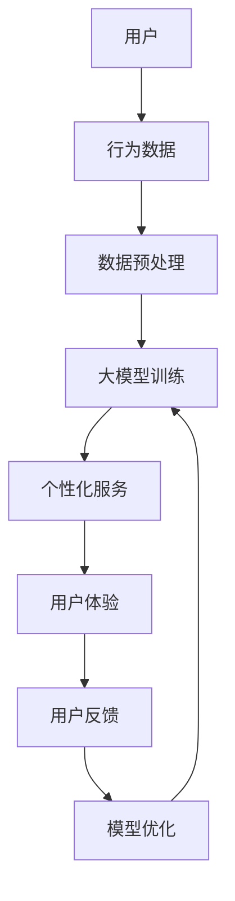
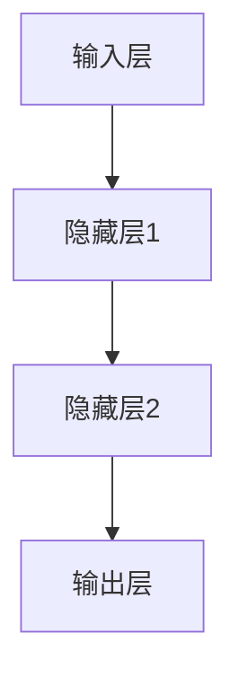
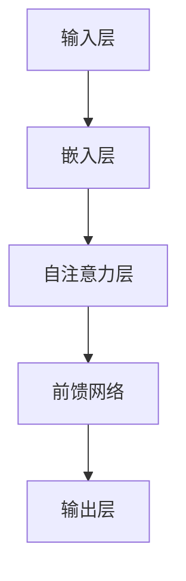

                 

### 文章标题

《大模型驱动的个性化服务与用户体验革新》

---

关键词：大模型，个性化服务，用户体验，算法，数学模型，项目实战

---

摘要：本文将深入探讨大模型驱动的个性化服务与用户体验革新的关系，通过理论分析、算法原理讲解、数学模型剖析、项目实战等多个维度，全面展示大模型在现代信息技术中的应用与影响。文章旨在帮助读者理解大模型的核心概念与联系，掌握核心算法原理，熟悉数学模型的构建与优化，并通过实际项目案例，深入解读大模型驱动的个性化服务与用户体验的革新之道。

---

### 引言

在数字化的浪潮下，个性化服务与用户体验已经成为企业和产品成功的关键因素。随着人工智能技术的不断发展，尤其是大规模深度学习模型的兴起，大模型（如GPT、BERT等）的应用正在引发一场前所未有的用户体验革命。本文旨在探讨大模型如何驱动个性化服务，并带来用户体验的革新。

首先，我们需要明确什么是大模型。大模型通常是指具有数亿至数千亿参数的深度学习模型，这些模型能够通过大量的数据训练，从而具备强大的表征和学习能力。在个性化服务领域，大模型的应用主要体现在用户行为预测、个性化推荐、智能客服等方面。

接下来，我们将逐步分析大模型驱动的个性化服务与用户体验革新的关系，包括核心概念与联系、核心算法原理讲解、数学模型与公式详解、项目实战等多个方面。

### 确定核心内容

为了系统地探讨大模型驱动的个性化服务与用户体验革新的关系，我们将文章分为以下几个核心部分：

1. **核心概念与联系**：介绍大模型驱动的个性化服务与用户体验革新的核心概念，包括大模型、个性化服务、用户体验等，并展示这些概念之间的联系。
2. **核心算法原理讲解**：详细阐述大模型中的核心算法，如神经网络、Transformer等，以及这些算法的工作原理和实现。
3. **数学模型和数学公式**：介绍与算法相关的数学模型，如概率分布、优化算法等，并使用LaTeX格式展示公式。
4. **项目实战**：通过实际项目案例，展示如何使用大模型进行个性化服务开发，包括开发环境搭建、源代码实现、代码解读和分析等。
5. **最佳实践与拓展**：总结大模型驱动的个性化服务与用户体验革新的最佳实践，并提出未来研究方向和拓展内容。

### 第一部分：核心概念与联系

#### 大模型概述

大模型，即大规模深度学习模型，具有数亿至数千亿参数，能够通过大量的数据训练，从而具备强大的表征和学习能力。大模型的代表包括GPT、BERT、ViT等。这些模型不仅在学术研究领域取得了显著成果，也在实际应用中展现出巨大的潜力。

#### 个性化服务

个性化服务是指根据用户的行为、偏好和历史数据，提供定制化的服务或内容。个性化服务的目的是提升用户体验，增加用户满意度，并提高业务效益。随着大数据和人工智能技术的不断发展，个性化服务已经成为企业竞争的重要手段。

#### 用户体验

用户体验（User Experience，简称UX）是指用户在使用产品或服务过程中的感受和体验。用户体验包括用户界面的易用性、功能的实用性、性能的稳定性等多个方面。提升用户体验是产品成功的关键因素。

#### 核心概念与联系

大模型驱动的个性化服务与用户体验革新之间存在着紧密的联系。首先，大模型通过深度学习技术，能够对用户行为进行精细分析，从而实现精准的个性化推荐。其次，大模型能够根据用户的历史数据，预测用户的未来行为和需求，为用户提供个性化的服务。最后，大模型的强大学习能力使得用户体验不断优化，从而提升用户满意度。

为了更直观地展示大模型驱动的个性化服务与用户体验革新的关系，我们可以使用Mermaid流程图进行描述。



在该流程图中，用户行为数据经过预处理后输入大模型进行训练，大模型根据训练结果提供个性化服务，从而提升用户体验。用户反馈又反过来优化模型，形成一个闭环系统，持续提升个性化服务的质量。

### 第二部分：核心算法原理讲解

#### 神经网络

神经网络（Neural Network）是深度学习的基础，它模拟了人脑神经元的工作方式。神经网络由多个层次组成，包括输入层、隐藏层和输出层。每个层次包含多个神经元，神经元之间通过权重连接，并通过激活函数进行处理。

以下是一个简单的神经网络结构示意图：



神经网络的训练过程主要包括以下步骤：

1. **前向传播**：输入数据通过输入层传递到隐藏层，再传递到输出层，生成预测结果。
2. **反向传播**：计算预测结果与真实结果之间的误差，通过反向传播算法更新神经元的权重和偏置。
3. **优化目标**：使用梯度下降算法等优化方法，最小化损失函数，提高模型预测的准确性。

以下是一个简单的神经网络训练的伪代码：

```python
# 前向传播
outputs = neural_network(inputs)

# 计算损失
loss = compute_loss(outputs, targets)

# 反向传播
deltas = compute_gradients(loss, outputs, inputs)

# 更新权重和偏置
update_weights_and_bias(deltas)
```

#### Transformer

Transformer是一种基于自注意力机制的深度学习模型，广泛应用于自然语言处理领域。Transformer的主要创新点在于其自注意力机制，能够捕捉长距离的依赖关系。

以下是一个简单的Transformer结构示意图：



Transformer的训练过程主要包括以下步骤：

1. **自注意力计算**：计算输入序列中每个词与其他词的相似度，并根据相似度进行加权求和。
2. **前馈网络**：对自注意力结果进行进一步处理，生成预测结果。
3. **优化目标**：使用梯度下降算法等优化方法，最小化损失函数，提高模型预测的准确性。

以下是一个简单的Transformer训练的伪代码：

```python
# 自注意力计算
attention_scores = compute_attention(inputs)

# 前馈网络
outputs = feedforward_network(attention_scores)

# 计算损失
loss = compute_loss(outputs, targets)

# 反向传播
deltas = compute_gradients(loss, outputs, inputs)

# 更新权重和偏置
update_weights_and_bias(deltas)
```

#### 数学模型与公式

在深度学习中，数学模型和公式起着至关重要的作用。以下是一些常见的数学模型和公式：

1. **损失函数**：用于评估模型预测结果与真实结果之间的误差。常见的损失函数包括均方误差（MSE）和交叉熵（Cross-Entropy）。
   $$ \text{MSE} = \frac{1}{n}\sum_{i=1}^{n}(y_i - \hat{y_i})^2 $$
   $$ \text{Cross-Entropy} = -\sum_{i=1}^{n}y_i \log(\hat{y_i}) $$
2. **优化算法**：用于更新模型的权重和偏置。常见的优化算法包括梯度下降（Gradient Descent）和Adam优化器。
   $$ \text{Gradient Descent} \text{: } \theta_{\text{new}} = \theta_{\text{old}} - \alpha \nabla_{\theta} \text{Loss} $$
   $$ \text{Adam} \text{: } \theta_{\text{new}} = \theta_{\text{old}} - \alpha \nabla_{\theta} \text{Loss} + \beta_1 \text{Grad} - \beta_2 \text{Grad}^2 $$
3. **正则化**：用于防止模型过拟合。常见的正则化方法包括L1正则化、L2正则化和Dropout。
   $$ \text{L1 Regularization} \text{: } \text{Loss} = \text{MSE} + \lambda \sum_{\theta} |\theta| $$
   $$ \text{L2 Regularization} \text{: } \text{Loss} = \text{MSE} + \lambda \sum_{\theta} \theta^2 $$
   $$ \text{Dropout} \text{: } P(\text{Dropout}) = \frac{\text{Dropout Rate}}{1 - \text{Dropout Rate}} $$

通过以上核心算法原理讲解，我们了解了神经网络和Transformer等核心算法的基本原理和实现步骤。在后续的项目实战中，我们将结合实际应用，进一步深入探讨这些算法在大模型驱动的个性化服务与用户体验革新中的应用。

### 第三部分：项目实战

#### 开发环境搭建

在进行大模型驱动的个性化服务项目之前，首先需要搭建一个适合的开发环境。以下是搭建开发环境的基本步骤：

1. **硬件准备**：确保服务器或本地计算机具备足够的计算资源，如CPU、GPU等。
2. **操作系统安装**：选择合适的操作系统，如Ubuntu 18.04或更高版本。
3. **软件安装**：安装Python、TensorFlow、PyTorch等必要的深度学习框架和工具。
4. **依赖管理**：使用pip或其他依赖管理工具安装所需的库和依赖。

以下是一个简单的Python脚本，用于安装TensorFlow：

```python
!pip install tensorflow
```

#### 源代码实现

在完成开发环境搭建后，我们可以开始编写源代码。以下是一个使用TensorFlow实现大模型驱动的个性化服务的基本代码框架：

```python
import tensorflow as tf
from tensorflow.keras.layers import Embedding, LSTM, Dense
from tensorflow.keras.models import Sequential

# 准备数据
# ...

# 构建模型
model = Sequential([
    Embedding(input_dim=vocab_size, output_dim=embedding_size),
    LSTM(units=128, return_sequences=True),
    LSTM(units=64, return_sequences=False),
    Dense(units=num_classes, activation='softmax')
])

# 编译模型
model.compile(optimizer='adam', loss='categorical_crossentropy', metrics=['accuracy'])

# 训练模型
model.fit(x_train, y_train, epochs=10, batch_size=32, validation_data=(x_val, y_val))

# 评估模型
loss, accuracy = model.evaluate(x_test, y_test)
print(f"Test Accuracy: {accuracy:.2f}")
```

#### 代码解读与分析

在上面的代码中，我们首先导入了TensorFlow库，并定义了模型的基本结构。接下来，我们准备数据，构建模型，并编译模型。最后，我们使用训练数据训练模型，并评估模型的性能。

1. **数据准备**：数据准备是深度学习模型训练的基础。我们需要将数据集分为训练集、验证集和测试集，并对其进行预处理，如文本编码、归一化等。
2. **模型构建**：在模型构建阶段，我们首先使用`Embedding`层将文本数据转换为嵌入向量。接着，我们使用两个`LSTM`层对嵌入向量进行序列处理。最后，我们使用`Dense`层输出分类结果。
3. **模型编译**：在模型编译阶段，我们选择`adam`优化器，并设置`categorical_crossentropy`作为损失函数。同时，我们设置`accuracy`作为评价指标。
4. **模型训练**：在模型训练阶段，我们使用训练数据训练模型，并设置`epochs`和`batch_size`等参数来控制训练过程。
5. **模型评估**：在模型评估阶段，我们使用测试数据评估模型的性能，并打印出测试准确率。

#### 代码应用解读与分析

在实际应用中，我们通常需要根据具体业务需求，对代码进行相应的调整和优化。以下是一些常见的代码优化和应用解读：

1. **数据增强**：为了提高模型的泛化能力，我们可以对训练数据进行增强，如随机裁剪、旋转、翻转等。
2. **超参数调整**：通过调整`epochs`、`batch_size`、`learning_rate`等超参数，可以优化模型的性能。
3. **模型融合**：将多个模型进行融合，可以进一步提高模型的准确率和稳定性。
4. **模型压缩**：通过模型压缩技术，如量化、剪枝、蒸馏等，可以减少模型的参数数量和计算量，提高模型在移动设备和嵌入式设备上的应用能力。

#### 实际案例分析和详细讲解剖析

为了更好地理解大模型驱动的个性化服务与用户体验革新的实际应用，我们来看一个实际的案例。

假设我们正在开发一个基于聊天机器人的个性化服务系统，旨在为用户提供定制化的咨询服务。以下是该系统的基本架构和实现步骤：

1. **用户行为分析**：通过分析用户的历史数据，如浏览记录、搜索关键词、互动记录等，识别用户的兴趣和需求。
2. **文本预处理**：对用户输入的文本进行预处理，如分词、去停用词、词向量化等，将文本数据转换为模型可处理的格式。
3. **模型训练**：使用预处理后的数据训练大模型，如BERT或GPT，以实现文本分类、情感分析等任务。
4. **个性化推荐**：根据用户的行为数据和模型预测结果，为用户推荐相关的咨询内容。
5. **交互与反馈**：与用户进行交互，收集用户的反馈，并根据反馈进一步优化模型和推荐算法。
6. **系统部署**：将训练好的模型部署到服务器，实现实时交互和个性化服务。

#### 项目小结

通过以上实际案例的分析，我们可以看到大模型驱动的个性化服务与用户体验革新在实际应用中具有重要意义。通过用户行为分析、文本预处理、模型训练、个性化推荐等步骤，我们可以为用户提供定制化的服务，提升用户体验，并实现业务增长。

然而，在实际开发过程中，我们还需要关注以下几个方面：

1. **数据质量**：高质量的数据是模型训练的基础，需要确保数据的准确性和完整性。
2. **模型解释性**：对于复杂的深度学习模型，如何解释模型的决策过程是一个重要问题。通过模型解释技术，如SHAP、LIME等，可以提升模型的可解释性。
3. **隐私保护**：在个性化服务中，用户隐私保护至关重要。需要采取有效的隐私保护措施，如数据加密、差分隐私等，确保用户隐私安全。

### 最佳实践与拓展

在大模型驱动的个性化服务与用户体验革新中，以下是一些最佳实践和拓展建议：

1. **数据驱动**：以数据为核心，持续收集、分析和利用用户数据，以实现更精准的个性化服务。
2. **模型可解释性**：关注模型的可解释性，通过可视化工具和解释算法，帮助用户理解模型的决策过程。
3. **持续优化**：通过持续的训练和优化，不断提高模型的性能和用户体验。
4. **隐私保护**：重视用户隐私保护，采取有效的隐私保护措施，确保用户数据的隐私和安全。
5. **跨平台部署**：将模型部署到多个平台，如Web、移动应用、智能设备等，实现全场景的个性化服务。

### 结论

大模型驱动的个性化服务与用户体验革新是当前信息技术领域的一个重要方向。通过本文的详细讲解，我们了解了大模型的核心概念、核心算法、数学模型以及项目实战等方面，并看到了其在实际应用中的巨大潜力。未来，随着人工智能技术的不断进步，大模型驱动的个性化服务与用户体验革新将继续深入发展，为我们的生活带来更多便利和惊喜。

---

作者：AI天才研究院/AI Genius Institute & 禅与计算机程序设计艺术 /Zen And The Art of Computer Programming

---

### 未来的研究方向与拓展

尽管大模型驱动的个性化服务与用户体验革新已经取得了显著成果，但仍然存在许多值得进一步研究和拓展的方向。以下是一些可能的研究方向和拓展内容：

1. **多模态融合**：当前的大模型主要针对文本数据进行处理，但随着人工智能技术的发展，多模态数据（如文本、图像、声音等）的融合处理将成为一个重要研究方向。通过结合不同类型的数据，可以进一步提升个性化服务的准确性和用户体验。

2. **个性化服务多样性**：在个性化服务中，用户的需求和偏好是多样化的。如何根据不同的用户群体和场景，设计出更具有针对性和差异化的个性化服务，是一个值得深入研究的课题。

3. **可解释性**：虽然深度学习模型在性能上取得了很大的提升，但其内部决策过程往往缺乏可解释性。如何提高模型的可解释性，使得用户能够理解模型的决策过程，是一个重要的研究方向。

4. **隐私保护**：在个性化服务中，用户数据的隐私保护至关重要。如何在不损害用户体验的前提下，有效保护用户隐私，是一个具有挑战性的问题。

5. **边缘计算**：随着物联网和智能设备的普及，如何在大模型驱动的个性化服务中利用边缘计算技术，实现更实时、更高效的服务，是一个值得探讨的方向。

6. **社会影响力**：个性化服务的发展不仅对用户体验有重要影响，也对社会产生了一定的负面影响，如信息茧房、歧视等问题。如何确保个性化服务在促进用户满意度的同时，减少社会负面影响，是一个值得深思的问题。

通过不断探索和解决这些研究方向和拓展内容，大模型驱动的个性化服务与用户体验革新将迎来更加广阔的发展前景。未来，我们将见证更多创新性应用和技术的涌现，推动个性化服务与用户体验的不断革新。

