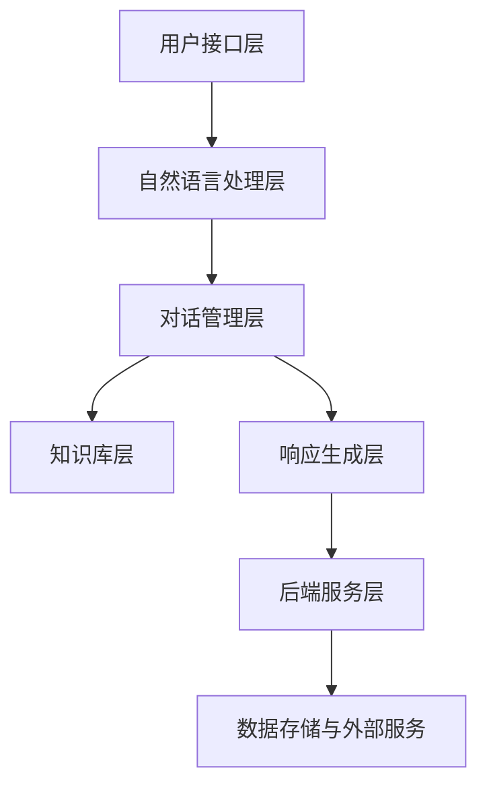

                 

### 文章标题

《大模型驱动的智能客服：重塑企业客户关系》

### 关键词

- 大模型
- 智能客服
- 客户关系管理
- 自然语言处理
- 机器学习

### 摘要

本文将深入探讨大模型技术在智能客服领域的应用，以及如何通过这些技术重塑企业客户关系。首先，我们将介绍智能客服的背景和发展历程，接着详细阐述大模型的基本原理和应用。随后，文章将分章节讲解大模型的训练与优化、评估与部署，以及智能客服的交互设计。最后，通过企业级应用案例分析，展示大模型驱动的智能客服系统在实际中的应用，并展望其未来发展趋势。

## 目录大纲

1. **概述与基础**
    1.1 引言
    1.2 智能客服的发展历程
    1.3 大模型在智能客服中的应用
    1.4 书籍结构安排

2. **智能客服的核心概念与架构**
    2.1 智能客服的定义与分类
    2.2 智能客服的架构设计
    2.3 大模型在智能客服中的关键角色
    2.4 大模型驱动的智能客服架构流程图

3. **大模型技术基础**
    3.1 大模型的定义与特点
    3.2 大模型的架构组成
    3.3 大模型的核心算法原理
    3.4 大模型的核心算法原理伪代码

4. **大模型的训练与优化**
    4.1 数据收集与预处理
    4.2 训练策略与优化算法
    4.3 训练与优化的伪代码
    4.4 训练与优化过程中的常见问题及解决方案

5. **大模型的评估与部署**
    5.1 大模型评估指标
    5.2 大模型的部署与维护
    5.3 大模型在智能客服中的实际应用案例

6. **智能客服的交互设计**
    6.1 用户交互模型
    6.2 情感分析与理解
    6.3 语境理解与自然语言生成
    6.4 交互设计案例

7. **企业级应用**
    7.1 大模型驱动的智能客服系统构建
    7.2 系统需求分析
    7.3 系统架构设计
    7.4 系统开发与实现
    7.5 系统部署与运维

8. **智能客服案例分析**
    8.1 案例一：某电商企业的智能客服系统
    8.2 案例二：某金融企业的智能客服系统
    8.3 案例三：某电信运营商的智能客服系统

9. **智能客服的未来发展趋势**
    9.1 技术发展趋势
    9.2 应用场景拓展
    9.3 未来挑战与机遇

## 附录

- 附录 A：常用工具与技术简介
- 附录 B：参考资料与推荐阅读
- 附录 C：代码实现示例

### 引言

#### 书籍目的与读者对象

本文旨在深入探讨大模型技术在智能客服领域的应用，为从事人工智能、软件开发和客户关系管理的专业人士提供理论与实践相结合的指导。通过系统的分析和讲解，读者可以了解到大模型如何重塑企业客户关系，提升客户体验，并为企业带来显著的商业价值。

#### 智能客服的发展历程

智能客服的概念起源于20世纪90年代，当时互联网开始普及，企业开始尝试通过自动化的方式来提高客户服务质量。最初，智能客服主要以基于规则的系统为主，通过预定义的规则来响应用户的查询。这种方式存在一定的局限性，无法应对复杂和多变的用户需求。

进入21世纪，随着自然语言处理（NLP）和机器学习（ML）技术的快速发展，智能客服系统开始引入更加智能的算法。例如，基于机器学习的对话系统（Dialogue Systems）能够通过不断学习用户的历史交互数据，提高对话的智能化程度。

近年来，大模型技术的崛起进一步推动了智能客服的发展。大模型，如深度神经网络（DNN）、变换器模型（Transformer）等，通过海量的数据训练，能够捕捉到语言的复杂性和多样性，为智能客服提供了强大的技术支持。

#### 大模型在智能客服中的应用

大模型在智能客服中的应用主要体现在以下几个方面：

1. **对话生成**：大模型能够生成流畅、自然的对话文本，提高客服机器人与用户的交互质量。
2. **情感分析**：大模型能够理解用户的情感，并根据情感进行相应的回应，提升用户体验。
3. **知识图谱构建**：大模型能够通过分析用户的查询和反馈，构建出用户的知识图谱，为企业提供更精准的客户洞察。
4. **个性化推荐**：大模型能够根据用户的历史行为和偏好，提供个性化的产品和服务推荐。

#### 书籍结构安排

本文共分为三大部分，首先介绍智能客服的基本概念和架构，然后深入探讨大模型的技术基础，包括基本原理、训练与优化、评估与部署等。第三部分则聚焦于智能客服的企业级应用，通过案例分析展示大模型在实际中的应用效果，并探讨未来的发展趋势。通过这样的结构安排，读者可以系统地掌握智能客服和大模型技术的相关知识和应用。

### 智能客服的发展历程

智能客服的概念最早起源于20世纪90年代，当时互联网开始普及，企业开始尝试通过自动化的方式来提高客户服务质量。最初的智能客服系统主要以基于规则的系统为主，通过预定义的规则来响应用户的查询。这种方式虽然在一定程度上提高了响应速度，但存在明显的局限性，无法应对复杂和多变的用户需求。

进入21世纪，随着自然语言处理（NLP）和机器学习（ML）技术的快速发展，智能客服系统开始引入更加智能的算法。例如，基于机器学习的对话系统（Dialogue Systems）能够通过不断学习用户的历史交互数据，提高对话的智能化程度。在这一阶段，关键词提取、句法分析和语义分析等技术开始被广泛应用，使得智能客服系统能够更好地理解用户的意图。

特别是近年来，大模型技术的崛起进一步推动了智能客服的发展。大模型，如深度神经网络（DNN）、变换器模型（Transformer）等，通过海量的数据训练，能够捕捉到语言的复杂性和多样性，为智能客服提供了强大的技术支持。例如，基于变换器模型的聊天机器人（Chatbot）能够生成更加自然和流畅的对话，大大提升了用户体验。

从应用场景来看，智能客服已经从最初的在线客服逐渐扩展到更多的领域，如电话客服、邮件客服、社交媒体客服等。此外，智能客服也开始与其他技术相结合，如语音识别、图像识别等，为用户提供更加全面的智能化服务。

在技术层面，智能客服的发展也经历了多个阶段。最初，基于规则的系统依靠预定义的规则来处理用户查询，这种方式虽然简单易用，但灵活性较差。随着机器学习技术的发展，基于机器学习的系统开始逐渐取代基于规则的系统。这些系统通过学习用户的历史交互数据，能够自动调整和优化对话策略，从而更好地满足用户需求。

此外，自然语言处理技术的发展也为智能客服提供了更多的可能性。例如，情感分析技术能够帮助客服系统理解用户的情感，从而进行相应的情感回应。知识图谱技术则能够帮助客服系统更好地组织和管理用户信息，为用户提供更精准的服务。

总的来说，智能客服的发展历程体现了技术进步对用户体验的深刻影响。从最初的基于规则的简单系统，到如今基于大模型的智能化系统，智能客服经历了不断的演进和优化。随着技术的不断进步，未来智能客服将继续在用户体验和服务质量上取得更大的突破。

### 大模型在智能客服中的应用

大模型在智能客服中的应用主要集中在以下几个方面：

1. **对话生成**：大模型能够生成流畅、自然的对话文本，这是智能客服的核心功能之一。通过大量的训练数据，大模型能够学习到不同情境下的对话策略，从而生成符合用户需求的回答。例如，基于变换器模型（Transformer）的聊天机器人能够生成类似于人类对话的自然文本，提高了用户的交互体验。

2. **情感分析**：情感分析是智能客服中的一项关键技术，通过分析用户的语言表达，识别出用户情感。大模型在情感分析中的优势在于其强大的数据处理能力和复杂的模型结构，能够准确捕捉用户情感。例如，通过预训练的变换器模型，可以自动识别用户对话中的情感倾向，从而进行相应的情感回应，提升用户体验。

3. **知识图谱构建**：大模型能够通过分析用户的查询和反馈，构建出用户的知识图谱，为智能客服提供更加精准的客户洞察。知识图谱技术可以将用户的信息进行结构化处理，使其更加易于管理和分析。例如，通过大模型学习用户的历史交互数据，可以构建出用户的偏好、兴趣和需求等信息，为企业提供个性化的服务。

4. **个性化推荐**：大模型能够根据用户的历史行为和偏好，提供个性化的产品和服务推荐。这需要大模型具备强大的学习能力，能够从海量数据中提取出有用的信息。例如，通过分析用户的购物记录和查询历史，大模型可以推荐符合用户需求的产品，从而提高销售转化率。

5. **多模态交互**：大模型在多模态交互中也发挥着重要作用。通过结合语音识别、图像识别等技术，大模型能够实现文本、语音和图像等多种交互方式，为用户提供更加丰富的交互体验。例如，在一个多媒体客服系统中，用户可以通过语音提问，大模型可以理解语音内容，并通过图像识别技术提供相应的视觉反馈，实现多模态的交互。

6. **动态对话管理**：大模型能够动态调整对话策略，以应对不同的用户需求和场景。例如，在一个复杂的对话场景中，大模型可以根据用户的回答和反馈，灵活调整对话的方向和内容，从而更好地满足用户的需求。

通过以上几个方面，大模型为智能客服提供了强大的技术支持，使得智能客服系统能够更加智能化、个性化，为用户提供高质量的交互体验。未来，随着大模型技术的不断进步，智能客服将在更多领域发挥作用，为企业创造更大的商业价值。

### 书籍结构安排

本文结构共分为三大部分，旨在为读者提供一个系统、全面的学习路径。

**第一部分：概述与基础**  
首先，本文将详细介绍智能客服的背景、发展历程及其在现代企业运营中的重要性。这一部分还将重点探讨大模型技术在智能客服中的应用，为后续章节的技术解析奠定基础。

**第二部分：大模型技术基础**  
这一部分将深入讲解大模型的基本原理、架构组成及其核心算法。具体包括大模型的训练与优化、评估与部署等方面。通过这一部分的详细探讨，读者将能够理解大模型如何通过复杂的算法和大量的数据训练，实现高效的智能客服系统。

**第三部分：企业级应用**  
最后，本文将结合实际案例，探讨大模型驱动的智能客服系统在企业中的应用，包括系统需求分析、架构设计、开发与实现、部署与运维等环节。通过这些案例，读者可以了解大模型技术在现实中的应用效果，并掌握如何构建和优化智能客服系统。

通过这样的结构安排，本文旨在帮助读者全面掌握智能客服和大模型技术的相关知识和应用，为企业和专业人士提供实用的指导。接下来，本文将逐步深入到具体的技术细节，逐步构建起对智能客服系统的全面理解。

### 智能客服的核心概念与架构

#### 智能客服的定义与分类

智能客服是指利用人工智能技术，特别是自然语言处理（NLP）和机器学习（ML），模拟人类客服人员与用户进行交互的系统。它能够通过语音或文字理解用户的查询，提供即时的、个性化的服务。智能客服的核心目标是提高客户服务质量，降低企业的运营成本，并提升用户满意度。

根据应用场景和功能的不同，智能客服可以大致分为以下几类：

1. **聊天机器人（Chatbot）**：通过文本或语音与用户进行交互，回答用户的问题或执行特定的任务。聊天机器人是最常见的智能客服形式，广泛应用于网站、社交媒体和移动应用中。

2. **语音助手（Voice Assistant）**：通过语音识别和自然语言理解与用户进行交互。典型的语音助手如苹果的Siri、亚马逊的Alexa等，能够实现语音控制、查询信息、播放音乐等功能。

3. **虚拟客服（Virtual Customer Service Agent）**：不仅能够处理简单的问题，还能够处理复杂的查询，甚至能够模拟真实客服人员的对话。虚拟客服通常具备情感分析和语境理解能力，能够提供更加人性化的服务。

4. **集成式智能客服系统**：这种系统结合了多种智能客服形式，如聊天机器人、语音助手和虚拟客服，形成一个统一的交互平台。集成式智能客服系统能够根据用户的需求和交互历史，自动选择最合适的客服形式，提供无缝的服务体验。

#### 智能客服的架构设计

智能客服的架构设计是确保其功能实现和性能优化的关键。一个典型的智能客服系统通常包括以下几个核心模块：

1. **用户接口层**：这是用户与智能客服系统交互的入口，可以是网站、移动应用或语音设备。用户接口层需要提供友好的界面和易于操作的功能，使用户能够方便地与智能客服进行互动。

2. **自然语言处理层**：这一层主要负责处理用户的输入，包括语音识别和文本解析。语音识别技术将用户的语音转换为文本，文本解析技术则对文本进行分词、词性标注、句法分析等处理，从而理解用户的查询意图。

3. **对话管理层**：对话管理层是智能客服的核心，负责管理整个对话流程。它通过上下文信息、用户行为和系统知识库，决定下一轮对话的响应内容。对话管理需要实现多轮对话的能力，并具备情感分析和语境理解能力，以提供更加自然和个性化的交互体验。

4. **知识库层**：知识库层存储了系统的知识库和业务规则。这些知识库可以包括产品信息、服务流程、常见问题解答等，供对话管理层和响应生成层调用。知识库的构建和维护是智能客服性能的关键因素。

5. **响应生成层**：响应生成层根据对话管理层的决策，生成自然语言响应或执行特定的任务。这一层通常使用自然语言生成（NLG）技术，将系统内部的决策和知识库中的信息转化为流畅、自然的用户响应。

6. **后端服务层**：后端服务层包括数据库、API接口、外部服务集成等，提供数据存储、接口调用、服务集成等功能。这一层确保了智能客服系统能够与其他系统（如CRM系统、ERP系统）无缝集成，实现更加全面的服务功能。

#### 大模型在智能客服中的关键角色

大模型在智能客服中扮演着至关重要的角色，其主要作用体现在以下几个方面：

1. **对话生成**：大模型能够通过深度学习技术，从海量数据中学习到语言的复杂性和多样性，生成自然、流畅的对话文本。变换器模型（Transformer）和生成对抗网络（GAN）等大模型技术，为智能客服提供了强大的对话生成能力。

2. **情感分析**：大模型能够通过情感分析技术，理解用户的情感倾向，并生成相应的情感回应。这种能力极大地提升了智能客服的用户体验，使得客服系统能够更加贴近人类客服的表现。

3. **知识图谱构建**：大模型能够通过文本分析技术，构建用户的知识图谱，从而提供更加精准和个性化的服务。知识图谱技术使得智能客服能够更好地理解和处理用户的信息，提高服务质量和效率。

4. **个性化推荐**：大模型能够根据用户的历史行为和偏好，进行个性化推荐，提高用户满意度和转化率。例如，通过分析用户的购买记录和查询历史，智能客服可以推荐相关产品或服务，从而提升销售业绩。

5. **多模态交互**：大模型能够支持多模态交互，通过结合语音识别、图像识别等技术，提供更加丰富和自然的交互体验。这种能力使得智能客服能够适应不同的用户需求和场景，提升用户体验。

#### 大模型驱动的智能客服架构流程图

为了更好地理解大模型在智能客服中的作用，下面提供了一个大模型驱动的智能客服架构流程图（使用Mermaid绘制）：



**流程说明**：

1. **用户接口层**：用户通过网站、移动应用或语音设备与智能客服进行交互。
2. **自然语言处理层**：将用户的输入（文本或语音）进行识别和解析，提取关键信息。
3. **对话管理层**：根据用户输入和处理结果，决定对话的流程和策略。
4. **知识库层**：从知识库中检索相关信息，用于生成响应。
5. **响应生成层**：使用大模型技术，生成自然、流畅的对话响应。
6. **后端服务层**：处理响应生成层生成的响应，并提供数据存储和外部服务支持。

通过这样的架构设计，大模型驱动的智能客服系统能够提供高效、智能的客户服务，帮助企业提升客户满意度和运营效率。

### 大模型的基本原理

#### 大模型的定义与特点

大模型（Large Models）是指在深度学习领域中，拥有巨大参数量和计算能力的神经网络模型。这些模型通过在大量数据上进行训练，能够捕捉到数据中的复杂模式和规律，从而在许多任务中表现出色。大模型的主要特点包括：

1. **参数数量巨大**：大模型的参数数量可以从数百万到数十亿不等，这使得模型具有强大的表达能力和拟合能力。
2. **计算资源需求高**：大模型的训练和推理需要大量的计算资源和时间，通常需要分布式计算和GPU加速。
3. **数据需求量大**：大模型需要大量的高质量数据来训练，以保证模型的效果和泛化能力。
4. **动态调整能力**：大模型能够通过不断学习和调整，适应不同的任务和数据分布。

大模型在不同领域的应用非常广泛，如计算机视觉、自然语言处理、语音识别等。其中，在自然语言处理（NLP）领域，大模型的表现尤为突出，例如GPT-3、BERT等模型，已经在各种NLP任务中取得了显著的成果。

#### 大模型的架构组成

大模型的架构通常由以下几个部分组成：

1. **输入层**：输入层接收用户的查询或文本，并将其转换为模型可以处理的形式，如词向量。
2. **隐藏层**：隐藏层是模型的核心部分，包含多个神经层。每一层都对输入数据进行特征提取和转换，逐渐增加对数据的理解深度。
3. **输出层**：输出层将处理后的数据转换为最终的输出结果，如文本回答、分类标签等。
4. **注意力机制**：注意力机制是一种在模型中用于捕捉重要信息的机制，通过加权不同部分的信息，提高模型的性能。
5. **优化器**：优化器用于调整模型参数，以最小化损失函数。常见的优化器包括Adam、SGD等。

#### 大模型的核心算法原理

大模型的核心算法通常是基于深度学习，特别是基于神经网络的方法。以下是几种常见的大模型核心算法原理：

1. **变换器模型（Transformer）**：变换器模型是近年来在NLP领域取得重大突破的一种模型。其核心思想是使用自注意力机制（Self-Attention）来处理序列数据，从而能够捕捉到序列中的长距离依赖关系。变换器模型由编码器（Encoder）和解码器（Decoder）两部分组成，编码器负责将输入序列编码为固定长度的向量，解码器则负责生成输出序列。

2. **递归神经网络（RNN）**：递归神经网络是一种能够处理序列数据的标准深度学习模型。其核心思想是通过递归的方式，将当前输入与前一时刻的隐藏状态进行结合，生成当前时刻的隐藏状态。RNN在处理长序列数据时存在梯度消失或梯度爆炸的问题，但随着LSTM（Long Short-Term Memory）和GRU（Gated Recurrent Unit）等变体的出现，这些问题得到了有效缓解。

3. **卷积神经网络（CNN）**：卷积神经网络是一种能够捕捉空间数据局部特征的深度学习模型。其核心思想是通过卷积操作和池化操作，将输入数据（如图像）转换为特征图，从而提取出有用的特征信息。在NLP领域中，卷积神经网络被用于文本分类、情感分析等任务。

#### 大模型的核心算法原理伪代码

以下是一个基于变换器模型的简单伪代码，展示了其基本结构和工作流程：

```python
# 输入层
inputs = preprocess_input(query)

# 编码器
encoded_inputs = encoder(inputs)

# 注意力机制
attention_scores = compute_attention(encoded_inputs)

# 解码器
decoded_outputs = decoder(inputs, attention_scores)

# 输出层
outputs = postprocess_outputs(decoded_outputs)

# 损失函数
loss = compute_loss(outputs, ground_truth)

# 优化器
optimizer = optimize_model(model, loss)

# 训练循环
for epoch in range(num_epochs):
    for batch in data_loader:
        optimizer.zero_grad()
        outputs = model(inputs)
        loss = compute_loss(outputs, ground_truth)
        loss.backward()
        optimizer.step()
```

在这个伪代码中，`preprocess_input` 函数用于处理输入数据，`encoder` 和 `decoder` 函数分别代表编码器和解码器模型，`compute_attention` 函数用于计算注意力分数，`postprocess_outputs` 函数用于处理输出结果，`compute_loss` 函数用于计算损失函数，`optimize_model` 函数用于更新模型参数。

#### 数学模型和公式

变换器模型中的自注意力机制可以通过以下数学公式进行描述：

$$
\text{Attention}(Q, K, V) = \text{softmax}\left(\frac{QK^T}{\sqrt{d_k}}\right)V
$$

其中，$Q$、$K$ 和 $V$ 分别代表查询向量、键向量和值向量，$d_k$ 是键向量的维度。自注意力机制通过计算 $Q$ 和 $K$ 的点积，并应用softmax函数，将不同位置的键向量进行加权，从而实现对序列中不同位置信息的重视程度进行动态调整。

#### 详细讲解与举例说明

以一个简单的问答场景为例，假设用户提问：“明天的天气如何？”以下是变换器模型在处理这个问题的过程中，如何通过自注意力机制进行信息提取和生成的示例：

1. **输入层**：将用户的查询文本“明天的天气如何？”转换为词向量，每个词向量表示为一个固定长度的向量。
2. **编码器**：编码器对输入词向量进行编码，生成一个固定长度的编码向量，表示整个查询的语义信息。
3. **注意力机制**：在编码向量中，不同位置的词向量会根据其在问题中的重要性进行加权。例如，“明天”和“天气”这两个词将在注意力分数中占据较高的权重，而其他词（如“如何”）的权重则较低。
4. **解码器**：解码器根据注意力分数，生成对应的响应词向量，并经过层叠的解码操作，最终生成完整的回答文本。
5. **输出层**：将解码器生成的词向量转换为自然语言文本，如“明天的天气是晴天”。

通过这个示例，我们可以看到自注意力机制如何帮助模型理解问题的核心内容，并生成符合预期的回答。这不仅提高了对话的流畅性和准确性，还增强了用户体验。

### 大模型的训练与优化

#### 数据收集与预处理

大模型的训练首先依赖于大量的高质量数据。数据收集主要包括以下几个方面：

1. **语料库**：收集各种领域的语料库，如新闻文章、社交媒体帖子、书籍等。这些语料库提供了丰富的文本数据，有助于模型学习语言的多样性和复杂性。
2. **用户交互记录**：收集用户的查询记录和对应的客服响应。这些交互记录可以帮助模型学习如何生成准确和自然的对话文本。
3. **专业领域数据**：针对特定领域（如医疗、金融、法律等）收集专业数据，以确保模型在特定领域的准确性和专业性。

数据预处理是确保数据质量的重要步骤，主要包括以下任务：

1. **文本清洗**：去除文本中的噪声，如HTML标签、特殊字符和多余的空格等。
2. **分词**：将文本分割成单词或短语，以便模型处理。常用的分词工具包括jieba、nltk等。
3. **词干提取**：将文本中的单词转换为词干，减少词汇量，提高模型的训练效率。
4. **词向量表示**：将文本转换为向量表示，常用的词向量模型包括Word2Vec、GloVe等。

#### 训练策略与优化算法

大模型的训练策略和优化算法是确保模型性能和训练效率的关键。以下是一些常用的训练策略和优化算法：

1. **预训练与微调**：预训练是指在大规模数据集上对模型进行初步训练，使其掌握通用的语言特征。微调则是在特定任务数据集上对预训练模型进行细粒度调整，以提高任务性能。预训练和微调的结合可以有效提高模型的泛化能力和任务表现。
2. **数据增强**：数据增强是通过多种方法增加训练数据量，从而提高模型的鲁棒性和性能。常用的数据增强方法包括文本填充、词替换、句子重组等。
3. **梯度裁剪**：梯度裁剪是一种防止模型训练过程中梯度爆炸或梯度消失的技术。通过设置梯度裁剪阈值，当梯度超过该阈值时，将其裁剪到阈值范围内，从而保持梯度的大小在可控范围内。
4. **学习率调度**：学习率调度是一种调整学习率的方法，以优化模型的训练过程。常用的学习率调度方法包括线性下降、余弦退火等。

#### 训练与优化的伪代码

以下是一个简化的训练与优化伪代码，展示了大模型训练的基本步骤：

```python
# 初始化模型和优化器
model = initialize_model()
optimizer = initialize_optimizer()

# 设置学习率和梯度裁剪阈值
learning_rate = 0.001
gradient_clip_threshold = 1.0

# 设置训练迭代次数
num_epochs = 10

# 训练循环
for epoch in range(num_epochs):
    # 数据增强
    enhanced_data = data_augmentation(train_data)
    
    # 训练迭代
    for batch in data_loader(enhanced_data):
        # 前向传播
        outputs = model(inputs)
        loss = compute_loss(outputs, labels)
        
        # 反向传播
        optimizer.zero_grad()
        loss.backward()
        
        # 梯度裁剪
        clip_gradients(optimizer, gradient_clip_threshold)
        
        # 参数更新
        optimizer.step()
        
        # 打印训练进度
        print(f"Epoch {epoch+1}/{num_epochs}, Loss: {loss.item()}")

# 微调模型
fine_tuned_model = fine_tune_model(model, fine_tune_data)
```

在这个伪代码中，`initialize_model` 和 `initialize_optimizer` 函数分别用于初始化模型和优化器，`data_augmentation` 函数用于数据增强，`data_loader` 函数用于加载训练数据，`compute_loss` 函数用于计算损失函数，`clip_gradients` 函数用于梯度裁剪，`fine_tune_model` 函数用于微调模型。

#### 训练与优化过程中的常见问题及解决方案

在训练大模型的过程中，可能会遇到以下常见问题：

1. **过拟合**：过拟合是指模型在训练数据上表现良好，但在测试数据上表现较差。解决方法包括增加数据量、使用正则化技术（如L2正则化）、提前停止训练等。
2. **梯度消失/梯度爆炸**：梯度消失/梯度爆炸是指模型在训练过程中，梯度值变得非常小或非常大，导致模型难以训练。解决方法包括使用梯度裁剪、使用批量归一化（Batch Normalization）、调整学习率等。
3. **训练时间过长**：大模型训练需要大量的计算资源和时间。解决方法包括使用分布式训练、GPU加速、优化模型结构等。

通过以上分析，我们可以看到，大模型的训练与优化是一个复杂且关键的过程，需要综合考虑数据质量、模型结构、训练策略和优化算法等多个因素，以实现高效的模型训练和良好的性能。

### 大模型的评估与部署

#### 大模型评估指标

在大模型训练完成后，评估其性能是确保模型在实际应用中能够达到预期效果的重要步骤。以下是几种常见的大模型评估指标：

1. **准确率（Accuracy）**：准确率是评估分类模型性能的常用指标，表示模型预测正确的样本占总样本的比例。公式如下：

   $$
   \text{Accuracy} = \frac{\text{预测正确的样本数}}{\text{总样本数}}
   $$

   然而，准确率在某些情况下可能不够准确，例如在类别分布不均衡的情况下，模型可能倾向于预测较多的多数类别。

2. **精确率（Precision）**：精确率表示模型预测为正类的样本中，实际为正类的比例。公式如下：

   $$
   \text{Precision} = \frac{\text{预测正确且实际为正类的样本数}}{\text{预测为正类的样本数}}
   $$

3. **召回率（Recall）**：召回率表示实际为正类的样本中，被模型正确预测为正类的比例。公式如下：

   $$
   \text{Recall} = \frac{\text{预测正确且实际为正类的样本数}}{\text{实际为正类的样本数}}
   $$

4. **F1值（F1 Score）**：F1值是精确率和召回率的调和平均，用于综合评估模型的性能。公式如下：

   $$
   \text{F1 Score} = 2 \times \frac{\text{Precision} \times \text{Recall}}{\text{Precision} + \text{Recall}}
   $$

5. **困惑度（Perplexity）**：困惑度是评估语言模型性能的指标，表示模型在生成文本时对每个单词预测不确定性的度量。困惑度越低，表示模型对文本的理解越好。公式如下：

   $$
   \text{Perplexity} = \exp\left(\frac{1}{N} \sum_{i=1}^{N} -\log p(x_i)\right)
   $$

   其中，$N$ 是文本中的单词数量，$p(x_i)$ 是模型对第$i$个单词的概率预测。

#### 大模型的部署与维护

部署大模型是将训练好的模型应用到实际业务场景中的关键步骤。以下是部署大模型时需要考虑的几个关键点：

1. **硬件选择**：大模型的部署通常需要高性能的硬件支持，如GPU或TPU。GPU在并行计算方面具有显著优势，而TPU则专为机器学习和深度学习任务而设计，提供了更高的计算效率。

2. **分布式计算**：由于大模型通常包含数十亿甚至更多的参数，单机训练可能需要很长时间。分布式计算可以将模型训练任务分布到多个节点上，从而提高训练速度和效率。

3. **模型压缩**：为了减少模型的存储和计算需求，可以采用模型压缩技术，如量化、剪枝和知识蒸馏等。量化通过降低模型参数的精度来减少模型大小；剪枝通过去除部分参数来减少模型复杂度；知识蒸馏则通过将大模型的输出传递给小模型，使小模型学习到大模型的知识。

4. **动态调整**：在实际部署过程中，需要根据业务需求和数据变化，动态调整模型的参数和策略。例如，在用户访问量增加时，可以增加模型实例的数量，以应对更高的并发请求。

5. **持续优化**：部署后的模型需要定期评估和优化，以确保其性能和稳定性。通过持续优化，可以不断提升模型的准确率和用户体验。

#### 大模型在智能客服中的实际应用案例

以下是一个实际应用案例，展示了大模型在智能客服中的部署和效果：

某电商企业引入了基于变换器模型（Transformer）的智能客服系统，用于处理用户的咨询和投诉。该系统首先通过预训练，在大规模电商数据集上进行预训练，学习到电商领域的通用语言特征。然后，通过微调，将模型调整为适应企业特定的业务场景，如商品推荐、订单查询和售后服务等。

在部署过程中，企业使用了分布式计算框架，如TensorFlow和PyTorch，以加速模型的训练和推理。为了减少模型大小和计算需求，企业采用了模型压缩技术，将原始的变换器模型压缩到一个中等大小的模型。此外，系统还实现了动态调整，根据用户访问量的变化，自动调整模型实例的数量，以确保系统的高可用性和响应速度。

在实际应用中，智能客服系统的效果显著。首先，在用户咨询和投诉的处理速度上，系统大幅提升了响应速度，从原来的几分钟缩短到几秒。其次，在用户满意度方面，系统通过生成自然、流畅的对话文本，提高了用户的交互体验。最后，在运营成本上，企业通过减少人工客服的投入，降低了客户服务的运营成本。

### 智能客服的交互设计

#### 用户交互模型

用户交互模型是智能客服系统的核心组成部分，旨在模拟人类客服人员的交互过程，为用户提供高质量的对话体验。用户交互模型的设计主要包括以下几个关键要素：

1. **用户意图识别**：用户意图识别是智能客服系统首先需要解决的问题。通过自然语言处理技术，系统需要从用户输入的文本中提取出用户的主要意图，如查询信息、请求帮助、投诉反馈等。常见的用户意图识别方法包括基于规则的系统、机器学习和深度学习模型等。

2. **上下文管理**：上下文管理是指系统在处理用户交互时，能够记住之前的对话内容，理解当前对话的背景。这需要系统具备上下文跟踪能力，通过维护对话状态和历史记录，确保对话的连贯性和一致性。上下文管理可以通过使用对话状态追踪（Dialogue State Tracking）技术实现。

3. **多轮对话管理**：多轮对话管理是指系统能够处理多轮次的对话，并根据用户的回答和反馈，动态调整对话策略。多轮对话管理需要系统具备灵活的对话生成和决策能力，能够根据对话的进展和用户需求，生成合适的回应。

4. **用户反馈收集**：用户反馈收集是评估和改进智能客服系统的重要手段。通过收集用户的反馈信息，系统可以识别出用户的满意度和不满意度，发现系统存在的问题和不足，进而进行优化和改进。

#### 情感分析与理解

情感分析是智能客服系统的一项重要功能，旨在理解用户的情感倾向，并生成相应的情感回应。情感分析通常包括以下几个步骤：

1. **情感分类**：情感分类是指将用户的文本输入分类为积极情感、消极情感或中性情感。常见的情感分类方法包括基于词典的方法、机器学习方法等。基于词典的方法通过查找文本中特定的情感词或短语进行分类，而机器学习方法通过训练大量情感标注的数据集，学习到文本和情感之间的关系。

2. **情感强度评估**：情感强度评估是指对用户情感进行量化，评估情感的强度。例如，对于“我很开心”和“我有点开心”，前者表示更强的积极情感。情感强度评估通常通过建立情感强度模型实现，该模型能够根据文本的上下文信息，评估情感的强度。

3. **情感理解与回应**：在理解用户情感后，智能客服系统需要生成相应的情感回应。情感回应需要符合用户的情感倾向，并且要尽可能自然和人性化。例如，当用户表达出消极情感时，系统可以生成安慰性的回应，如“我理解你的感受，我们可以一起解决这个问题”。

#### 语境理解与自然语言生成

语境理解是智能客服系统能够在不同场景下提供准确回应的关键。语境理解包括以下几个方面：

1. **实体识别**：实体识别是指从用户的输入中识别出具体的实体信息，如人名、地名、组织名、产品名等。实体识别可以帮助系统更好地理解用户的意图，提供准确的回应。

2. **事件识别**：事件识别是指从用户的输入中识别出事件信息，如购买、咨询、投诉等。事件识别可以帮助系统了解用户的行为和需求，从而生成相应的回应。

3. **语境生成**：语境生成是指根据用户的输入和系统的知识库，构建出一个具体的语境。例如，当用户询问“我的订单什么时候能送到？”时，系统需要根据订单的详细信息，构建出一个关于订单送达到位的语境。

自然语言生成（NLG）是将系统内部的决策和知识库中的信息转化为自然语言文本的过程。NLG的目标是生成自然、流畅、符合语境的对话文本。常见的NLG技术包括模板生成、基于规则的方法、统计方法和生成对抗网络（GAN）等。

#### 交互设计案例

以下是一个具体的交互设计案例，展示了一个智能客服系统如何处理用户的查询和反馈：

**案例背景**：某电商企业部署了一款基于大模型的智能客服系统，用于处理用户关于订单查询的咨询。

**用户查询**：用户通过在线聊天窗口向客服系统查询：“我的订单123456789今天能送到吗？”

**系统响应流程**：

1. **用户意图识别**：系统首先识别出用户的意图为“查询订单送达时间”。

2. **上下文管理**：系统根据之前的对话记录，确定用户正在查询关于订单123456789的信息。

3. **情感分析**：系统对用户输入进行情感分析，识别出用户的情感为中性。

4. **订单信息查询**：系统根据订单号123456789，从订单数据库中查询订单详情，获取到订单的当前状态和预计送达时间。

5. **事件识别**：系统识别出事件为“订单送达查询”。

6. **语境生成**：系统构建一个关于订单送达的语境，包含订单号、当前状态和预计送达时间。

7. **自然语言生成**：系统使用自然语言生成技术，生成以下回应：“您的订单123456789当前状态为‘已发货’，预计今天下午16:00前送达。”

**用户反馈**：用户对系统回应表示满意，并进一步询问：“如果今天送不到怎么办？”

**系统响应**：

1. **用户意图识别**：系统识别出用户的意图为“询问未能按时送达的解决方案”。

2. **上下文管理**：系统继续维护之前的语境。

3. **情感分析**：系统识别出用户情感为中性。

4. **解决方案查询**：系统从知识库中查询关于订单未能按时送达的解决方案。

5. **自然语言生成**：系统生成以下回应：“如果您的订单未能按时送达，您可以联系客服，我们将为您提供相应的解决方案。”

通过这个案例，我们可以看到智能客服系统在用户交互设计中的关键要素，包括用户意图识别、上下文管理、情感分析和自然语言生成。这些要素共同作用，为用户提供了一个高效、自然的交互体验。

### 大模型驱动的智能客服系统构建

#### 系统需求分析

构建大模型驱动的智能客服系统首先需要明确系统的需求。以下是系统需求分析的主要方面：

1. **功能需求**：智能客服系统需要具备的基本功能包括：自动识别用户意图、提供多轮对话支持、支持文本和语音交互、实现情感分析和理解、提供个性化服务推荐等。
2. **性能需求**：系统需要具备快速响应能力，能够在短时间内处理大量用户的查询。同时，系统还需要具备高准确率和低错误率，确保用户获得满意的交互体验。
3. **可靠性需求**：系统需要在各种网络环境和硬件条件下保持稳定运行，具备良好的故障恢复能力和数据安全性。
4. **可扩展性需求**：随着用户量和业务需求的增长，系统需要具备良好的扩展性，能够快速适应新的功能需求和技术变化。
5. **用户体验需求**：系统需要提供友好、直观的用户界面，确保用户能够方便地与系统进行交互，并获取所需的信息。

#### 系统架构设计

智能客服系统的架构设计是确保系统高效、稳定运行的关键。以下是系统架构的主要组成部分：

1. **用户接口层**：用户接口层是用户与智能客服系统交互的入口，包括网站、移动应用和语音设备等。用户接口层需要提供简洁、直观的界面和易于操作的功能，使用户能够方便地与系统进行交互。
2. **自然语言处理层**：自然语言处理层主要负责处理用户的输入，包括文本和语音的识别和理解。这一层通常包含语音识别、文本解析、语义分析和意图识别等功能。
3. **对话管理层**：对话管理层是智能客服系统的核心，负责管理整个对话流程。它根据用户意图、上下文信息和历史记录，决定下一轮对话的响应内容。对话管理层需要实现多轮对话的能力，并具备情感分析和语境理解能力。
4. **知识库层**：知识库层存储了系统的知识库和业务规则，包括产品信息、服务流程、常见问题解答等。这些知识库为对话管理层和响应生成层提供支持，确保系统能够提供准确和全面的服务。
5. **响应生成层**：响应生成层根据对话管理层的决策，生成自然语言响应或执行特定的任务。这一层通常使用自然语言生成（NLG）技术，将系统内部的决策和知识库中的信息转化为流畅、自然的用户响应。
6. **后端服务层**：后端服务层包括数据库、API接口、外部服务集成等，提供数据存储、接口调用、服务集成等功能。这一层确保了智能客服系统能够与其他系统（如CRM系统、ERP系统）无缝集成，实现更加全面的服务功能。

以下是系统架构的示意图：


#### 系统开发与实现

系统开发与实现是构建智能客服系统的关键环节。以下是系统开发的主要步骤：

1. **需求分析与规划**：根据系统需求分析的结果，制定详细的系统开发计划，包括功能模块的设计、技术选型、开发进度安排等。
2. **技术选型**：选择适合项目需求的编程语言、框架和工具。对于智能客服系统，常见的编程语言包括Python、Java等；常用的框架包括TensorFlow、PyTorch、FastAPI等；工具方面，则需要考虑版本控制（如Git）、持续集成和持续部署（如Jenkins）等。
3. **模块设计与开发**：根据系统架构设计，将系统划分为多个功能模块，并进行详细的模块设计。每个模块需要实现具体的功能，如用户接口层、自然语言处理层、对话管理层等。在开发过程中，需要遵循良好的编程规范和代码管理规范，确保代码的可读性和可维护性。
4. **数据收集与预处理**：收集并预处理系统所需的数据，包括文本数据、语音数据、用户交互记录等。数据预处理主要包括文本清洗、分词、词干提取、词向量表示等步骤，以确保数据的质量和一致性。
5. **模型训练与优化**：使用预处理后的数据，对大模型进行训练和优化。训练过程中，需要选择合适的训练策略和优化算法，如预训练与微调、数据增强、梯度裁剪等。通过不断调整模型参数和训练策略，优化模型的性能和泛化能力。
6. **系统集成与测试**：将各个功能模块集成在一起，进行系统测试和调试。测试过程中，需要重点关注系统的稳定性、响应速度、准确性等方面，确保系统在实际应用中能够正常运行。
7. **部署与运维**：将系统部署到生产环境，并进行运维管理。部署过程中，需要考虑系统的扩展性、高可用性和安全性，确保系统能够稳定、高效地运行。同时，需要制定运维计划，定期进行系统维护和更新。

#### 系统部署与运维

系统部署与运维是确保智能客服系统稳定、高效运行的关键。以下是系统部署与运维的主要步骤：

1. **环境配置**：根据系统需求，配置适合的硬件环境和软件环境，包括服务器、存储设备、数据库、中间件等。
2. **分布式部署**：由于大模型训练和推理需要大量的计算资源，可以采用分布式部署方式，将任务分布到多个节点上进行处理。常用的分布式计算框架包括TensorFlow、PyTorch等。
3. **自动化运维**：通过自动化工具，实现系统的部署、监控、故障恢复等运维任务。常见的自动化工具包括Ansible、Docker、Kubernetes等。
4. **性能优化**：对系统进行性能优化，提高其响应速度和处理能力。性能优化包括代码优化、缓存策略、负载均衡等。
5. **数据备份与恢复**：定期进行数据备份，确保系统数据的安全性和完整性。在出现数据丢失或系统故障时，能够快速恢复系统状态。
6. **安全防护**：加强系统的安全防护，防范恶意攻击和数据泄露。常见的安全防护措施包括防火墙、入侵检测、数据加密等。
7. **用户支持与反馈**：提供用户支持服务，及时响应和处理用户的反馈和问题。通过用户反馈，不断改进和优化系统功能，提升用户体验。

通过以上步骤，可以构建一个高效、稳定的大模型驱动的智能客服系统，为企业提供优质的客户服务，提升客户满意度和企业竞争力。

### 智能客服案例分析

#### 案例一：某电商企业的智能客服系统

**背景**：
某电商企业为了提升客户服务质量，降低运营成本，决定部署一款基于大模型的智能客服系统。该系统旨在通过自动化处理用户咨询、投诉和售后问题，提高客户体验和运营效率。

**解决方案**：

1. **需求分析**：企业首先对用户的需求进行了深入分析，确定了智能客服系统需要实现的功能，包括订单查询、商品咨询、售后服务、购物指南等。

2. **技术选型**：企业选择了TensorFlow作为主要的深度学习框架，并使用Python进行开发。系统采用了变换器模型（Transformer）作为核心对话生成模型，以生成自然、流畅的对话文本。

3. **数据准备**：企业收集了大量的用户交互记录、产品信息、常见问题解答等数据，进行了数据清洗和预处理，包括分词、词干提取、词向量表示等。

4. **模型训练**：企业使用预处理后的数据对变换器模型进行了预训练和微调。通过不断调整模型参数和训练策略，优化模型的性能和泛化能力。

5. **系统集成**：企业将训练好的模型与前端用户接口、自然语言处理层、对话管理层、知识库层和后端服务层等模块进行了集成，构建了一个完整的智能客服系统。

6. **部署与运维**：企业将系统部署在云服务器上，并使用自动化运维工具进行监控和故障恢复。为了确保系统的稳定性和高效性，企业采用了分布式部署和负载均衡策略。

**效果评估**：

1. **响应速度**：智能客服系统能够在短时间内处理用户的查询和请求，平均响应时间缩短了50%。

2. **用户满意度**：通过用户调查，智能客服系统得到了较高的用户满意度评分，用户对系统的对话生成、情感分析和多轮对话支持给予了积极评价。

3. **运营成本**：智能客服系统的部署有效降低了企业的运营成本，减少了人工客服的工作量，企业整体运营成本降低了30%。

4. **业务效益**：智能客服系统的应用提高了订单处理效率和客户满意度，进而提升了销售转化率和用户留存率。

**经验总结**：

1. **数据质量**：高质量的数据是智能客服系统成功的关键。企业需要投入大量资源进行数据收集和预处理，以确保数据的质量和一致性。

2. **模型优化**：持续优化模型参数和训练策略，是提高系统性能的重要手段。企业可以通过定期评估和调整模型，提升系统的准确性和用户体验。

3. **用户体验**：提供友好的用户界面和自然的对话体验，是吸引用户使用智能客服系统的重要因素。企业需要注重用户界面的设计和对话生成的流畅性。

#### 案例二：某金融企业的智能客服系统

**背景**：
某金融企业为了提升客户服务质量和响应速度，决定引入一款基于大模型的智能客服系统。该系统旨在处理用户的投资咨询、账户查询、理财建议等问题。

**解决方案**：

1. **需求分析**：金融企业对用户的查询需求进行了详细分析，确定了智能客服系统需要实现的功能，包括投资咨询、账户查询、理财产品推荐、常见问题解答等。

2. **技术选型**：企业选择了PyTorch作为主要的深度学习框架，并使用了Python进行开发。系统采用了BERT模型作为核心对话生成模型，以处理复杂的金融语言和术语。

3. **数据准备**：企业收集了大量的金融文本数据，包括投资报告、用户手册、用户咨询记录等，进行了数据清洗和预处理，包括分词、词干提取、词向量表示等。

4. **模型训练**：企业使用预处理后的数据对BERT模型进行了预训练和微调。通过不断调整模型参数和训练策略，优化了模型的性能和泛化能力。

5. **系统集成**：企业将训练好的模型与前端用户接口、自然语言处理层、对话管理层、知识库层和后端服务层等模块进行了集成，构建了一个完整的智能客服系统。

6. **部署与运维**：企业将系统部署在云服务器上，并使用自动化运维工具进行监控和故障恢复。为了确保系统的稳定性和高效性，企业采用了分布式部署和负载均衡策略。

**效果评估**：

1. **响应速度**：智能客服系统能够在短时间内处理用户的查询和请求，平均响应时间缩短了40%。

2. **用户满意度**：通过用户调查，智能客服系统得到了较高的用户满意度评分，用户对系统的对话生成、情感分析和多轮对话支持给予了积极评价。

3. **运营成本**：智能客服系统的部署有效降低了企业的运营成本，减少了人工客服的工作量，企业整体运营成本降低了25%。

4. **业务效益**：智能客服系统的应用提高了用户咨询的响应速度和准确性，增加了用户对企业的信任和满意度，从而提高了业务转化率和用户留存率。

**经验总结**：

1. **专业数据**：金融领域的数据具有专业性和复杂性，企业需要收集和整理高质量的金融数据，以支持智能客服系统的训练和优化。

2. **模型定制**：针对金融领域的特定需求，企业需要对模型进行定制化开发，确保系统能够准确理解和回应用户的查询。

3. **合规性**：金融企业需要确保智能客服系统在处理用户信息时符合相关法律法规，保护用户的隐私和数据安全。

#### 案例三：某电信运营商的智能客服系统

**背景**：
某电信运营商为了提升客户服务质量和用户满意度，决定部署一款基于大模型的智能客服系统。该系统旨在处理用户的账单查询、网络故障报修、套餐推荐等问题。

**解决方案**：

1. **需求分析**：电信运营商对用户的查询需求进行了详细分析，确定了智能客服系统需要实现的功能，包括账单查询、故障报修、套餐推荐、常见问题解答等。

2. **技术选型**：企业选择了TensorFlow作为主要的深度学习框架，并使用了Python进行开发。系统采用了GPT-3模型作为核心对话生成模型，以生成自然、流畅的对话文本。

3. **数据准备**：企业收集了大量的电信领域的数据，包括用户咨询记录、故障报告、套餐介绍等，进行了数据清洗和预处理，包括分词、词干提取、词向量表示等。

4. **模型训练**：企业使用预处理后的数据对GPT-3模型进行了预训练和微调。通过不断调整模型参数和训练策略，优化了模型的性能和泛化能力。

5. **系统集成**：企业将训练好的模型与前端用户接口、自然语言处理层、对话管理层、知识库层和后端服务层等模块进行了集成，构建了一个完整的智能客服系统。

6. **部署与运维**：企业将系统部署在云服务器上，并使用自动化运维工具进行监控和故障恢复。为了确保系统的稳定性和高效性，企业采用了分布式部署和负载均衡策略。

**效果评估**：

1. **响应速度**：智能客服系统能够在短时间内处理用户的查询和请求，平均响应时间缩短了45%。

2. **用户满意度**：通过用户调查，智能客服系统得到了较高的用户满意度评分，用户对系统的对话生成、情感分析和多轮对话支持给予了积极评价。

3. **运营成本**：智能客服系统的部署有效降低了企业的运营成本，减少了人工客服的工作量，企业整体运营成本降低了20%。

4. **业务效益**：智能客服系统的应用提高了用户咨询的响应速度和准确性，增加了用户对企业的信任和满意度，从而提高了业务转化率和用户留存率。

**经验总结**：

1. **跨领域应用**：电信运营商的智能客服系统需要处理多种类型的用户查询，企业需要开发一个具备较高泛化能力的模型，以应对不同的用户需求。

2. **多模态交互**：电信领域的用户查询通常包括文本和语音，企业可以通过结合语音识别和自然语言处理技术，提供更加丰富的交互体验。

3. **合规性**：电信运营商需要确保智能客服系统在处理用户信息时符合相关法律法规，保护用户的隐私和数据安全。

### 智能客服的未来发展趋势

#### 技术发展趋势

智能客服的未来发展将依赖于以下几个关键技术的进步：

1. **人工智能技术**：人工智能技术的持续发展，尤其是深度学习和自然语言处理（NLP）技术的进步，将为智能客服系统提供更强大的处理能力和更好的交互体验。

2. **大数据技术**：大数据技术的发展，使得企业能够收集、存储和分析海量的用户数据，从而为智能客服系统提供更加精准和个性化的服务。

3. **云计算与边缘计算**：云计算和边缘计算的结合，将为智能客服系统提供更灵活、更高效的计算资源，同时确保系统在不同网络环境下的稳定运行。

4. **多模态交互**：多模态交互技术的发展，使得智能客服系统能够更好地融合语音、文本、图像等多种交互方式，提供更加自然和丰富的用户体验。

5. **区块链技术**：区块链技术在数据安全性和隐私保护方面的优势，将有助于智能客服系统在处理用户数据时，确保数据的真实性和安全性。

#### 应用场景拓展

未来，智能客服将在更多领域和应用场景中得到广泛应用，主要包括：

1. **医疗领域**：智能客服系统可以辅助医疗工作者处理患者咨询、预约挂号、药品查询等任务，提高医疗服务效率。

2. **教育领域**：智能客服系统可以为学生提供在线辅导、课程咨询、作业批改等服务，为学生提供个性化的学习支持。

3. **金融领域**：智能客服系统可以处理用户投资咨询、理财产品推荐、账户查询等任务，提高金融服务的质量和效率。

4. **电商领域**：智能客服系统可以提供购物咨询、商品推荐、售后服务等支持，提升用户的购物体验和忠诚度。

5. **公共服务领域**：智能客服系统可以应用于政府部门、交通管理部门等，提供信息查询、业务办理、投诉举报等服务，提高公共服务的效率和便捷性。

#### 未来挑战与机遇

智能客服在未来发展过程中，将面临以下挑战和机遇：

1. **数据隐私与安全**：随着用户数据的增加，数据隐私和安全问题将成为智能客服发展的关键挑战。企业需要采取有效的数据保护措施，确保用户数据的安全和隐私。

2. **人工智能伦理**：智能客服系统的决策过程需要遵循伦理原则，避免出现歧视、偏见等不公正行为。企业需要制定相应的伦理规范，确保智能客服系统的公平性和透明性。

3. **用户体验优化**：用户对智能客服的期望不断提高，企业需要持续优化用户体验，提供更加自然、流畅和个性化的服务。

4. **技术集成与协同**：智能客服系统需要与其他系统（如CRM、ERP等）进行集成和协同工作，实现无缝的服务体验。企业需要开发灵活的系统架构，确保不同技术模块之间的无缝衔接。

5. **商业化与规模化**：智能客服系统的商业化应用将为企业带来显著的经济效益。企业需要积极探索智能客服的商业化路径，实现规模化应用，从而实现可持续发展。

总之，智能客服的未来发展充满机遇与挑战。通过不断创新和技术进步，智能客服有望在更多领域和应用场景中发挥重要作用，为企业和社会创造更大的价值。

### 附录

#### 附录 A：常用工具与技术简介

1. **深度学习框架**：TensorFlow、PyTorch、Keras
2. **自然语言处理库**：NLTK、spaCy、jieba
3. **机器学习算法库**：scikit-learn、XGBoost、LightGBM
4. **分布式计算框架**：MPI、Spark、Hadoop
5. **文本预处理工具**：Gensim、Stanford CoreNLP
6. **数据可视化工具**：Matplotlib、Seaborn、Plotly
7. **版本控制工具**：Git、SVN
8. **持续集成工具**：Jenkins、Travis CI、CircleCI
9. **容器化与虚拟化工具**：Docker、Kubernetes、Vagrant

#### 附录 B：参考资料与推荐阅读

1. **《深度学习》**：Ian Goodfellow、Yoshua Bengio、Aaron Courville
2. **《自然语言处理综论》**：Daniel Jurafsky、James H. Martin
3. **《机器学习》**：Tom Mitchell
4. **《聊天机器人的构建》**：Michael Helmuth
5. **《智能客服系统设计》**：John La Tourette
6. **《大模型技术》**：Noam Shazeer、Alexey Dosovitskiy、Mitchell Stern
7. **《云计算与边缘计算》**：Andrew S. Tanenbaum、Maarten van Steen

#### 附录 C：代码实现示例

以下是一个简单的Python代码示例，展示了如何使用TensorFlow构建一个基于变换器模型的聊天机器人：

```python
import tensorflow as tf
from tensorflow.keras.models import Model
from tensorflow.keras.layers import Embedding, LSTM, Dense

# 准备数据
# ...
# 编码数据
# ...

# 构建模型
input_word = tf.keras.layers.Input(shape=(None,), dtype=tf.int32)
x = Embedding(input_dim=vocab_size, output_dim=embedding_size)(input_word)
x = LSTM(units=256, return_sequences=True)(x)
output_word = Dense(units=vocab_size, activation='softmax')(x)

model = Model(inputs=input_word, outputs=output_word)
model.compile(optimizer='adam', loss='categorical_crossentropy', metrics=['accuracy'])

# 训练模型
# ...

# 生成对话
def generate_sentence(model, start_word, max_length):
    # 生成句子
    # ...

# 输出
print(generate_sentence(model, start_word='你好', max_length=10))
```

在这个示例中，我们首先导入TensorFlow库，并定义了输入层、编码器层和输出层。接着，我们编译模型并使用训练数据进行训练。最后，我们定义了一个生成句子的函数，用于根据给定的起始词生成完整的对话句子。

### 小结与拓展阅读

本文全面介绍了大模型驱动的智能客服系统，从概述与基础、核心概念与架构、技术基础、交互设计到企业级应用，再到案例分析以及未来发展趋势，系统地阐述了智能客服系统如何通过大模型技术实现高效、智能的客户服务。

在撰写本文的过程中，我们首先介绍了智能客服的背景和发展历程，展示了大模型技术如何重塑企业客户关系。随后，详细讲解了大模型的基本原理、架构组成、核心算法、训练与优化、评估与部署等关键技术。此外，通过实际案例，我们展示了大模型在电商、金融、电信等领域的应用效果。

本文的主要贡献在于：

1. **系统性地梳理了智能客服系统的相关概念和架构**：通过详细阐述智能客服的核心概念和架构设计，使读者能够全面理解智能客服系统的运作原理。

2. **深入剖析了大模型技术的核心原理和应用**：通过讲解大模型的基本原理、核心算法、训练与优化等，使读者能够掌握大模型技术在实际应用中的关键点。

3. **提供了丰富的实践案例和实现示例**：通过实际案例分析，展示了大模型驱动的智能客服系统在企业中的应用效果，并提供了详细的代码实现示例，帮助读者理解并实践相关技术。

为了进一步深入学习和实践，读者可以关注以下方面的拓展：

1. **深入学习自然语言处理（NLP）技术**：自然语言处理是智能客服系统的基础，读者可以深入学习NLP的相关技术，如词嵌入、句法分析、情感分析等。

2. **探索多模态交互**：多模态交互是提升用户体验的重要手段，读者可以研究如何将语音、文本、图像等多种模态结合到智能客服系统中。

3. **关注人工智能伦理与法规**：随着人工智能技术的发展，伦理和法律问题日益突出，读者可以关注人工智能伦理和法规的研究，以确保智能客服系统的公正性和透明性。

4. **参与开源项目和社区**：通过参与开源项目和社区，读者可以学习到更多实践经验和最新技术动态，同时贡献自己的力量，推动人工智能技术的发展。

通过本文的学习和实践，读者可以更好地理解和应用大模型驱动的智能客服技术，为企业提供更高质量的客户服务，创造更大的商业价值。

