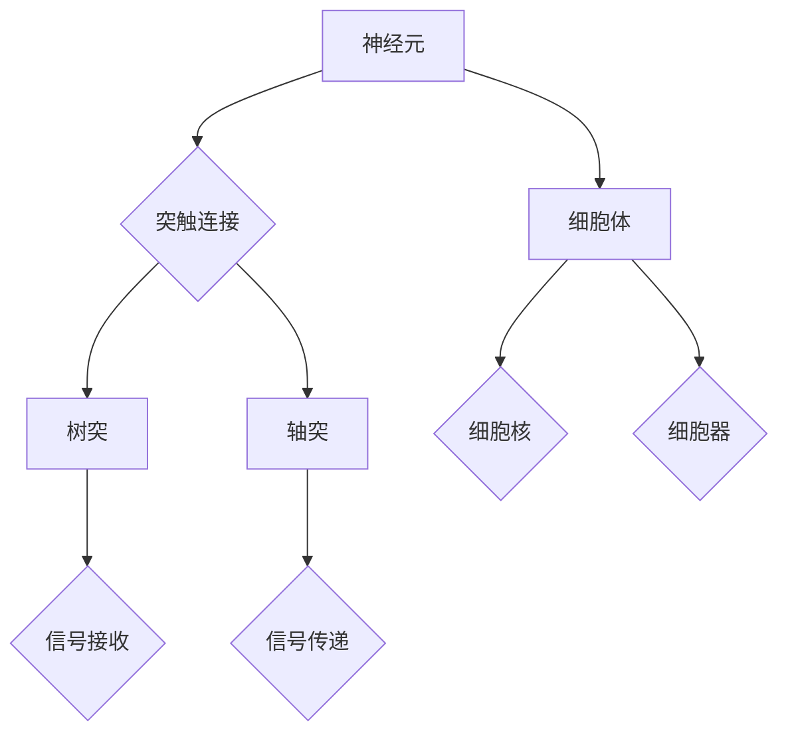
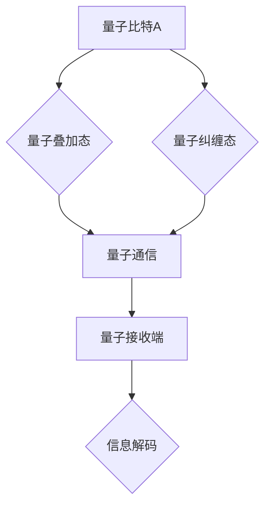

                 

### 引言

人类对于意识的探索由来已久，从古代哲学家的深邃思考，到现代神经科学和认知科学的研究，意识一直是一个充满神秘和争议的领域。而近年来，随着量子物理学的迅猛发展，越来越多的科学家开始尝试从量子角度探讨意识的本质，这一探索方向为传统理论提供了全新的视角。本文将探讨一个极具创新性的假设：大脑可以被看作是一个高度复杂的量子网络，其运作机制与量子物理学的核心原理有着深刻的联系，这种联系可能揭示了意识的涌现机制。

量子物理学，作为20世纪最为革命性的科学发现之一，揭示了微观世界的奇异特性，如量子叠加、量子纠缠和量子隧穿等现象。这些现象与宏观世界的经典物理学有着根本的区别，挑战了我们对现实的基本认知。然而，这些微观现象是否在人类大脑中有着具体的体现，是否能够解释意识的复杂性，这是当前科学界尚未解决的难题。

大脑作为人体最复杂、最神秘的器官，长期以来被研究为意识的物质基础。大脑由数百亿个神经元通过复杂的神经网络相互连接而成，这些神经元通过电化学信号进行信息传递和处理。尽管我们已经对大脑的基本结构和工作原理有了初步的了解，但大脑如何实现复杂的信息处理、决策和意识产生，仍然是一个未解之谜。

本文旨在探讨大脑与量子物理学之间的潜在联系，具体包括以下几个方面：

1. **大脑神经元与量子现象的联系**：我们将介绍大脑神经元的基本知识，并结合量子物理学的核心概念，探讨神经元是否具有量子特性。

2. **量子网络的基本原理**：我们将概述量子网络的基本原理，包括量子比特、量子态、量子纠缠和量子通信等，解释量子网络如何实现高效的信息传递和处理。

3. **大脑与量子网络的关系**：我们将深入探讨大脑神经网络的结构，分析大脑神经元是否具有量子网络的特点，以及它们之间的潜在联系。

4. **意识的涌现机制**：基于上述讨论，我们将尝试解释意识是如何从大脑的量子网络中涌现出来的，并讨论意识的数学模型。

5. **量子大脑的潜在应用**：我们将探讨量子大脑在计算、医学、心理学等领域的潜在应用，并讨论这些应用可能带来的影响。

6. **量子大脑研究的挑战与未来**：我们将总结当前量子大脑研究的挑战，探讨未来的研究方向和可能的发展趋势。

通过上述讨论，我们希望能够提供一个逻辑清晰、结构紧凑的框架，帮助读者理解大脑与量子物理学之间的潜在联系，并激发进一步的研究和探索。

### 第1章 引言

#### 1.1 人类意识的探索历程

人类对意识的探索可以追溯到古代哲学时期。古希腊哲学家苏格拉底和柏拉图最早提出了“灵魂”的概念，认为灵魂是意识的根源。亚里士多德进一步发展了这一观点，提出了“心智”的概念，认为心智是意识的物质基础。在东方，佛教和道教等哲学体系也对意识进行了深入的探讨，认为意识是心灵层面的体验。

进入近现代，随着科学技术的进步，对意识的探索逐渐从哲学领域转向生物学和心理学。19世纪末，德国生理学家赫尔曼·冯·赫尔姆霍茨提出了“感觉神经元”的概念，认为大脑中的神经元通过电化学信号传递信息，形成了基本的意识活动。法国生理学家克劳德·伯纳德则提出了“反射”的概念，认为大脑可以通过反射机制对环境变化做出反应。

20世纪初，随着电子显微镜的发明，科学家们开始对大脑的微观结构进行深入研究。约翰·福里斯·佩顿等科学家发现了神经元的树突和突触结构，揭示了大脑处理信息的基本机制。这些发现为理解大脑如何产生意识提供了新的线索。

20世纪中叶，认知科学开始兴起，研究者们通过实验方法对意识进行了系统性的探讨。乔治·米勒提出了“意识流”的概念，认为意识是一个连续的、流动的信息处理过程。与此同时，神经科学和心理学的研究不断深入，通过功能性磁共振成像（fMRI）和电刺激等方法，研究者们逐渐揭示了大脑不同区域的功能和它们之间的相互作用。

近年来，随着量子物理学的迅猛发展，科学家们开始尝试从量子角度探讨意识。量子物理学揭示了微观世界的奇异特性，如量子叠加、量子纠缠和量子隧穿等现象，这些现象挑战了我们对现实的基本认知。一些科学家认为，这些量子现象可能在人类大脑中有着具体的体现，并可能对意识的复杂性提供解释。

#### 1.2 量子物理学与意识的关系

量子物理学是一门研究微观世界的科学，它揭示了微观粒子的奇异行为，如量子叠加、量子纠缠和量子隧穿等。这些现象与经典物理学有着本质的区别，挑战了我们对现实的基本认知。然而，这些微观现象是否在人类大脑中有着具体的体现，是否能够解释意识的复杂性，这是当前科学界尚未解决的难题。

量子叠加原理指出，一个微观粒子可以同时处于多个状态，而不是传统物理学中的单一状态。例如，一个电子可以同时处于自旋向上和自旋向下的状态，直到被观测时才“坍缩”到一个确定的状态。这种叠加态在量子系统中是普遍存在的，这引发了一个关键问题：大脑中的神经元是否也具有叠加态？

量子纠缠是另一个令人瞩目的量子现象。当两个微观粒子发生纠缠后，无论它们相距多远，一个粒子的状态变化都会立即影响到另一个粒子的状态。这种超距作用挑战了经典物理学的局域性原则。大脑神经元之间是否存在类似的纠缠现象，是否这种纠缠对于大脑的信息处理和意识产生起着关键作用，这是当前研究的热点之一。

量子隧穿原理则表明，微观粒子可以通过量子隧道效应穿越能量障碍。这一现象与经典物理学中的障碍无法穿透原则形成鲜明对比。一些研究者认为，大脑神经元在处理信息时可能利用了这种量子隧穿效应，从而实现更高效的计算和信息处理。

尽管量子物理学为解释意识提供了新的视角，但要将这些微观现象与宏观意识联系起来，仍然面临巨大的挑战。首先，大脑中是否存在宏观的量子现象，例如量子叠加和量子纠缠，这是目前科学界尚未解决的问题。其次，即使大脑中存在量子现象，这些量子现象是否足够复杂，能够解释意识的复杂性和多样性，也是需要进一步探讨的问题。

此外，量子物理学与意识的关系还涉及到哲学和认知科学领域。传统哲学认为，意识是主观体验的根源，而量子物理学则揭示了客观现实的奇异特性。如何将这两者有机地结合起来，构建一个统一的框架来解释意识，这是当前科学界面临的一个重大挑战。

总之，量子物理学与意识的关系是一个复杂而富有挑战性的问题。尽管目前还没有确凿的证据表明大脑中存在宏观的量子现象，但这一领域的研究为探索意识的本质提供了新的思路和方法。未来，随着量子科学和认知科学的进一步发展，我们有理由相信，人类对意识的认知将更加深入和全面。

### 第2章 大脑神经元与量子现象

#### 2.1 大脑神经元的基础知识

大脑神经元是大脑的基本构建单元，它们通过复杂的神经网络相互连接，形成了一个高度复杂的计算和信息处理系统。每个神经元都由细胞体、树突和轴突组成。细胞体是神经元的中心，包含细胞核和大部分细胞器，是神经元的主要代谢中心。树突是神经元的感受部分，它们通过突触与其他神经元相连，接收来自其他神经元的信号。轴突是神经元的传递部分，它们将电化学信号从细胞体传递到其他神经元或效应器，如肌肉或腺体。

神经元的基本功能是接收和传递电化学信号。当神经元的树突接收到一个足够的电化学信号时，会在细胞体内触发一个电信号，这个信号会沿着轴突迅速传播。在轴突的末端，电信号会转化为化学信号，通过释放神经递质（如多巴胺、肾上腺素等）传递给其他神经元。这些信号传递过程是大脑进行信息处理和认知功能的基础。

#### 2.2 量子物理学的核心概念

量子物理学是一门研究微观粒子的科学，它揭示了微观世界的奇异特性，如量子叠加、量子纠缠和量子隧穿等。以下将简要介绍这些核心概念：

**量子叠加**：量子叠加原理指出，一个微观粒子可以同时处于多个状态，而不是传统物理学中的单一状态。例如，一个电子可以同时处于自旋向上和自旋向下的状态，直到被观测时才“坍缩”到一个确定的状态。量子叠加态是量子力学中的一个基本特征，它允许微观系统在未观测时存在多种可能性。

**量子纠缠**：量子纠缠是量子力学中的另一个基本特性，描述了两个或多个微观粒子在量子态上的相互关联。即使这些粒子相距很远，一个粒子的状态变化也会立即影响到另一个粒子的状态。这种超距作用挑战了经典物理学的局域性原则，是量子信息科学的核心概念之一。

**量子隧穿**：量子隧穿效应表明，微观粒子可以通过量子隧道效应穿越能量障碍。这一现象与经典物理学中的障碍无法穿透原则形成鲜明对比。量子隧穿在量子计算、量子通信等领域具有重要的应用价值。

#### 2.3 大脑神经元与量子现象的联系

虽然大脑神经元和量子现象在尺度和复杂性上存在巨大差异，但一些科学家认为，它们之间可能存在某些潜在的联系。以下将探讨这些联系的可能性：

**量子叠加**：一些研究者提出，大脑神经元在处理信息时可能存在量子叠加态。例如，当神经元接收并处理多个输入信号时，这些信号可能同时存在于神经元的量子态中。这种叠加态可能会增加神经元的信息处理能力，使其能够同时处理多个输入信号，从而提高大脑的效率。

**量子纠缠**：大脑神经元之间的连接可能具有量子纠缠特性。这意味着，当两个神经元之间发生相互作用时，它们可能会形成量子纠缠态。这种纠缠态可能会增强神经元之间的信息传递效率，使大脑能够更快速和高效地处理信息。

**量子隧穿**：量子隧穿效应在神经系统中也可能具有潜在的应用价值。例如，神经元在处理信息时可能利用量子隧穿效应，通过量子隧道穿越能量障碍，从而实现更快速的信息传递。

尽管这些假设在科学界仍存在争议，但量子物理学为解释大脑神经元的复杂性和高效信息处理提供了新的视角。未来，随着量子科学和神经科学的进一步发展，我们有望揭示大脑神经元与量子现象之间的具体联系。

### 第3章 量子网络的基本原理

#### 3.1 量子网络概述

量子网络是一种利用量子比特和量子纠缠来实现高效信息传输和处理的新型通信网络。与传统的经典网络不同，量子网络利用量子比特的叠加态和纠缠态来实现信息的传递和存储，从而具有更高的信息容量和更强的安全性。

量子网络的构建依赖于量子通信和量子信息处理技术。量子通信主要涉及量子密钥分发（QKD）和量子纠缠传输等技术，用于实现量子比特之间的安全通信。量子信息处理则涉及量子计算、量子纠错和量子算法等技术，用于实现量子比特的高效处理和计算。

量子网络的主要目标包括以下几个方面：

1. **量子密钥分发**：通过量子密钥分发技术，可以实现绝对安全的通信，防止窃听和黑客攻击。

2. **量子计算**：利用量子计算的优势，可以实现高效的大数据处理和复杂问题求解。

3. **量子通信**：通过量子纠缠传输，可以实现超距离的信息传输，突破经典通信的局限。

4. **量子模拟**：利用量子网络进行量子模拟，可以研究量子系统的复杂行为，为量子物理学研究提供新方法。

#### 3.2 量子比特与量子态

量子比特（qubit）是量子信息的基本单元，类似于经典计算机中的比特。然而，与经典比特只能处于0或1的状态不同，量子比特可以同时处于0和1的叠加态。这种叠加态使得量子比特能够表示更多的信息。

量子态是描述量子比特状态的数学表达式，通常用波函数来表示。量子态的叠加和纠缠使得量子比特能够实现复杂的信息处理和传输。

例如，一个量子比特可以处于以下叠加态：

$$|\psi\rangle = \frac{1}{\sqrt{2}}|0\rangle + \frac{1}{\sqrt{2}}|1\rangle$$

这个叠加态表示量子比特同时处于0和1的状态。当对这个量子比特进行测量时，它将随机坍缩到0或1中的一个状态。

#### 3.3 量子纠缠与量子通信

量子纠缠是量子力学中的另一个基本特性，描述了两个或多个微观粒子在量子态上的相互关联。当两个量子比特发生纠缠时，它们的状态将相互依赖，即使它们相距很远。

量子纠缠在量子通信中具有重要作用。通过量子纠缠，可以实现量子比特之间的超距离通信，即通过一个量子比特的状态变化来影响另一个量子比特的状态，从而实现信息传输。这种通信方式具有绝对的安全性，因为任何对量子纠缠态的干扰都会立即被发现。

例如，假设有两个量子比特A和B，它们处于纠缠态：

$$|\psi\rangle_{AB} = |0\rangle_A \otimes |0\rangle_B + |1\rangle_A \otimes |1\rangle_B$$

当对量子比特A进行测量时，如果A坍缩到状态0，则B也将坍缩到状态0。反之，如果A坍缩到状态1，则B也将坍缩到状态1。这种超距作用展示了量子纠缠在量子通信中的潜力。

总之，量子网络的基本原理包括量子比特的叠加态、量子纠缠和量子通信等。这些原理使得量子网络在信息传输和处理方面具有巨大的优势，为解决当前经典通信系统面临的安全性和效率问题提供了新的途径。

### 第4章 大脑与量子网络的关系

#### 4.1 大脑神经网络的结构

大脑神经网络是由数以亿计的神经元通过突触连接而成的复杂网络。神经元通过树突接收来自其他神经元的电化学信号，经过细胞体的整合处理，通过轴突将信号传递出去。突触是神经元之间传递信息的结构，由突触前膜、突触后膜和突触间隙组成。当突触前神经元释放神经递质时，神经递质通过突触间隙作用于突触后神经元的受体，从而实现信号的传递。

大脑神经网络具有高度分布式和层次化的结构。不同区域和层次的神经网络负责不同的功能，如感知、运动、记忆和决策等。这些神经网络通过复杂的连接方式相互交织，形成了一个高度复杂的计算和信息处理系统。

#### 4.2 大脑神经元的量子特性

尽管大脑神经元在宏观尺度上与量子现象存在巨大差异，但一些科学家提出，大脑神经元可能具有量子特性。这些特性可能与大脑的高效信息处理和意识产生有关。

一种可能的量子特性是量子叠加。量子叠加原理指出，一个微观粒子可以同时处于多个状态，直到被观测时才“坍缩”到一个确定的状态。一些研究者认为，大脑神经元在处理信息时可能存在量子叠加态，这意味着神经元可以同时处理多个输入信号。这种叠加态可能会增加神经元的信息处理能力，使其能够更高效地处理复杂的信息。

另一种可能的量子特性是量子纠缠。量子纠缠是量子力学中的另一个基本特性，描述了两个或多个微观粒子在量子态上的相互关联。一些科学家提出，大脑神经元之间可能存在量子纠缠现象，这可能会增强神经元之间的信息传递效率，使大脑能够更快速和高效地处理信息。

此外，量子隧穿效应也可能在神经系统中具有潜在的应用。量子隧穿效应表明，微观粒子可以通过量子隧道效应穿越能量障碍。一些研究者认为，神经元在处理信息时可能利用量子隧穿效应，通过量子隧道穿越能量障碍，从而实现更快速的信息传递。

#### 4.3 大脑神经元与量子网络的联系

尽管大脑神经元与量子网络在尺度和复杂性上存在巨大差异，但它们之间可能存在某些潜在的联系。这些联系可能有助于解释大脑的高效信息处理和意识产生。

首先，从结构上看，大脑神经网络与量子网络在连接方式上存在某些相似之处。大脑神经网络通过突触连接，形成一个高度复杂的分布式网络。量子网络则通过量子比特和量子纠缠，实现高效的信息传输和处理。这些相似之处可能表明，大脑神经网络在某种程度上借鉴了量子网络的设计原理。

其次，从功能上看，大脑神经网络和量子网络都致力于实现高效的信息处理和传输。大脑神经网络通过神经元之间的电化学信号传递和处理，实现感知、运动和决策等功能。量子网络则通过量子比特和量子纠缠，实现量子密钥分发、量子计算和量子通信等功能。这些相似之处表明，大脑神经网络和量子网络可能在信息处理和传输方面具有某些共同的机制。

最后，从演化上看，大脑和量子网络都是自然界中高度复杂系统的实例。大脑经过长期的进化，形成了高度复杂的神经网络，以实现高效的信息处理和意识产生。量子网络则是近年来人类智慧的结晶，通过量子物理学的原理，实现了高效的信息传输和处理。这些相似之处可能表明，大脑和量子网络在某种程度上是相互启发的，共同探索了复杂系统的构建和运作机制。

总之，大脑神经网络与量子网络在结构、功能和演化上可能存在某些潜在的联系。这些联系可能有助于我们理解大脑的高效信息处理和意识产生，也为探索新的计算和信息处理方法提供了新的视角。未来，随着量子科学和神经科学的进一步发展，我们有望揭示大脑与量子网络之间更深刻的联系。

### 第5章 意识的涌现机制

#### 5.1 意识的定义与特性

意识是一个复杂且多层次的概念，涉及多个学科，如哲学、心理学、神经科学和认知科学等。尽管对意识的具体定义尚无统一意见，但普遍认为意识至少包含以下几个基本特性：

1. **主观体验**：意识表现为个体内部的主观体验，包括感觉、情感、知觉和意愿等。
2. **自我意识**：意识使个体能够感知自我，认识到自己的存在和属性。
3. **认知功能**：意识涉及一系列认知过程，如注意力、记忆、思维和决策等。
4. **动态性**：意识具有动态变化的特点，能够随时间和环境变化而调整和适应。

不同学科对意识的解释有所不同。哲学上，意识被视为心智或灵魂的表现；心理学上，意识通过感知、记忆和思维等过程进行研究；神经科学则从大脑结构和功能的角度探讨意识产生的生理基础；认知科学则关注意识与认知功能之间的关系。

#### 5.2 量子网络与意识的涌现

基于前述的大脑与量子网络的关系探讨，我们尝试从量子网络的视角来解释意识的涌现机制。量子网络具有以下几个关键特性，这些特性可能与意识的产生密切相关：

1. **叠加态**：量子叠加态允许一个系统同时处于多个状态。在量子网络中，神经元可能同时处于多个信息处理状态，这使得大脑能够并行处理大量信息，从而提高信息处理效率。
2. **纠缠态**：量子纠缠态描述了两个或多个粒子之间的强相关性。在量子网络中，神经元之间可能存在纠缠，这可以增强神经元之间的信息传递效率和协同工作能力。
3. **非局域性**：量子非局域性表明，量子系统的状态变化可以即时影响到其他远距离的量子系统。这可能导致大脑中不同区域的信息能够快速传递和协同，从而实现高效的认知功能。

以下将尝试从量子网络的角度解释意识的涌现机制：

1. **信息的并行处理**：量子网络中的叠加态允许大脑神经元同时处理多个输入信号，从而实现并行计算。这种并行处理能力可能使得大脑能够快速应对复杂环境，从而产生意识。
2. **协同工作的神经网络**：量子纠缠态可能增强了大脑神经元之间的信息传递和协同工作能力。这意味着神经元可以更加高效地共享和整合信息，从而形成复杂认知功能。
3. **快速的信息传递**：量子网络中的非局域性可能使得大脑不同区域的信息能够快速传递和协同，从而实现高效的认知功能。这可能是意识涌现的重要机制之一。

尽管量子网络与意识的涌现机制仍然是一个高度复杂的领域，但上述讨论提供了一个新的视角，有助于我们理解大脑如何通过量子现象实现高效的信息处理和意识的产生。

#### 5.3 意识的数学模型

为了更好地理解意识的涌现机制，科学家们尝试构建数学模型来描述大脑中的量子现象与意识的关系。以下将介绍几种主要的数学模型，并详细讲解其原理和公式。

1. **量子神经网络模型**：量子神经网络（QNN）是一种结合量子计算和神经网络思想的模型，用于模拟大脑中神经元的信息处理过程。QNN的基本原理是利用量子比特的叠加态和量子纠缠来实现高效的信息处理。

   - **量子比特的叠加态**：假设有n个量子比特，它们可以同时处于多个状态的叠加态：

     $$|\psi\rangle = \sum_{i=1}^{n} c_i |i\rangle$$

     其中，$c_i$是叠加态的系数，$|i\rangle$是量子比特的基态。

   - **量子纠缠**：假设两个量子比特$|a\rangle$和$|b\rangle$处于纠缠态：

     $$|\psi\rangle_{AB} = \frac{1}{\sqrt{2}} (|00\rangle + |11\rangle)$$

     纠缠态使得$|a\rangle$和$|b\rangle$的状态相互关联，即使它们相距很远。

   - **量子神经网络模型**：QNN通过量子叠加和量子纠缠来实现信息处理。例如，假设一个神经元接收两个输入信号，通过量子叠加和量子纠缠进行处理，然后输出结果：

     $$\text{输出} = \sum_{i=1}^{n} c_i |i\rangle$$

2. **量子意识模型**：量子意识模型（QOM）是另一种尝试描述意识涌现机制的数学模型，它基于量子计算和认知科学的原理。QOM的核心思想是，意识是由大脑中的量子计算过程产生的。

   - **量子计算过程**：QOM将大脑视为一个量子计算机，其中神经元和突触充当量子比特和量子门。量子计算的基本过程包括量子态的叠加、量子纠缠和量子测量。

     - **量子态叠加**：大脑中的神经元可以同时处理多个输入信号，这类似于量子比特的叠加态。

       $$|\psi\rangle = \sum_{i=1}^{n} c_i |i\rangle$$

     - **量子纠缠**：神经元之间可能存在量子纠缠，这可以增强它们之间的信息传递和协同工作能力。

       $$|\psi\rangle_{AB} = \frac{1}{\sqrt{2}} (|00\rangle + |11\rangle)$$

     - **量子测量**：量子测量是量子计算的最后一步，它将量子态坍缩到一个确定的状态。

       $$\text{测量结果} = |i\rangle$$

   - **量子意识模型**：QOM通过量子计算过程来模拟大脑中的信息处理和决策过程，从而解释意识的产生。

     $$|\psi\rangle \rightarrow \text{测量结果} = |i\rangle$$

3. **量子认知模型**：量子认知模型（QCM）是另一种尝试结合量子计算和认知科学原理的数学模型，用于解释大脑中的认知功能。

   - **量子认知过程**：QCM将认知过程视为量子计算的过程，包括量子态的叠加、量子纠缠和量子测量。

     - **量子态叠加**：认知过程可能涉及多个信息源，这些信息源可以同时处于叠加态。

       $$|\psi\rangle = \sum_{i=1}^{n} c_i |i\rangle$$

     - **量子纠缠**：认知过程中的信息源可能存在量子纠缠，这可以增强它们之间的信息传递和协同工作能力。

       $$|\psi\rangle_{AB} = \frac{1}{\sqrt{2}} (|00\rangle + |11\rangle)$$

     - **量子测量**：认知过程的最后一步是量子测量，它将量子态坍缩到一个确定的状态，从而实现认知决策。

       $$\text{测量结果} = |i\rangle$$

   - **量子认知模型**：QCM通过量子计算过程来模拟大脑中的认知功能，包括感知、记忆、思维和决策等。

     $$|\psi\rangle \rightarrow \text{测量结果} = |i\rangle$$

总之，这些数学模型尝试从量子计算和认知科学的视角来解释意识的涌现机制。尽管这些模型仍然需要进一步的验证和完善，但它们为理解大脑中的量子现象和意识的关系提供了新的思路和方法。

### 第6章 量子大脑的潜在应用

#### 6.1 量子计算与人工智能

量子计算与人工智能的结合，为解决复杂计算问题提供了新的可能性。传统的计算机依赖于经典算法和硬件，在处理大数据和复杂问题时往往受到计算速度和存储容量的限制。然而，量子计算机利用量子比特的叠加态和量子纠缠，能够实现并行计算，从而大幅提升计算效率。

在人工智能领域，量子计算可以应用于以下几个方面：

1. **优化问题**：许多人工智能算法，如深度学习和图模型，依赖于复杂的优化过程。量子计算能够通过量子叠加和量子纠缠实现高效的并行搜索，从而加速优化算法的收敛速度。
2. **机器学习**：量子机器学习利用量子计算的并行性和高效性，可以加速训练和预测过程。例如，量子支持向量机和量子神经网络在分类和回归任务上表现出色。
3. **图分析**：量子计算在处理大规模图数据时具有显著优势。量子算法能够高效地解决图论中的复杂问题，如网络优化和路径规划。
4. **模拟量子系统**：量子计算可以用于模拟量子系统，为化学、材料和生物学等领域的科学计算提供新方法。

#### 6.2 量子大脑与医学

量子大脑的研究在医学领域具有广泛的应用前景。通过理解大脑中的量子现象，科学家们可以开发新的诊断和治疗技术，从而改善疾病的预防和治疗。

1. **脑成像技术**：量子技术，如量子密钥分发和量子纠缠传输，可以用于提高脑成像技术的分辨率和信噪比。例如，量子密钥分发可以用于实现绝对安全的脑成像数据传输，而量子纠缠传输可以提高磁共振成像（MRI）的信号强度。
2. **药物设计**：量子计算在药物设计领域具有巨大潜力。通过模拟量子系统，科学家可以更准确地预测药物分子的结构和性质，从而优化药物设计过程。
3. **神经退行性疾病**：量子大脑的研究可以帮助理解神经退行性疾病的发病机制，如阿尔茨海默病和帕金森病。通过开发新的量子算法和模型，科学家可以更准确地模拟和预测疾病的进展，从而开发更有效的治疗策略。
4. **个性化医疗**：量子大脑技术可以用于个性化医疗，根据患者的量子脑电图（qEEG）数据制定个性化的治疗方案，从而提高治疗效果。

#### 6.3 量子大脑与心理学

量子大脑的研究也为心理学领域提供了新的研究视角和工具。通过探索大脑中的量子现象，心理学家可以更深入地理解意识、记忆和认知功能。

1. **意识研究**：量子大脑模型可以用于解释意识的涌现机制。例如，量子神经网络（QNN）模型尝试通过量子比特的叠加态和量子纠缠来模拟大脑中的信息处理过程，从而解释意识的产生。
2. **记忆研究**：量子计算理论可以用于解释记忆的存储和检索过程。例如，量子纠缠可能增强了神经元之间的信息传递和协同工作能力，从而提高记忆的稳定性和可靠性。
3. **认知功能**：量子大脑模型可以用于模拟认知功能，如注意力、感知和决策。例如，量子认知模型（QCM）尝试通过量子计算过程来模拟大脑中的认知功能，从而理解意识的产生和认知过程。

总之，量子大脑的研究在量子计算、医学和心理学等领域具有广泛的应用前景。通过探索大脑中的量子现象，科学家们可以开发新的技术和方法，从而推动相关领域的发展。

### 第7章 量子大脑研究的挑战与未来

#### 7.1 量子大脑研究的主要挑战

尽管量子大脑研究具有巨大的潜力，但在实际应用中仍面临诸多挑战：

1. **技术难题**：当前量子技术尚未达到成熟阶段，量子比特的稳定性、量子门的精度和量子纠错技术等仍然是亟待解决的问题。这些技术难题限制了量子大脑的实用性和可靠性。
2. **理论框架**：量子大脑的理论框架尚未完全建立，如何将量子物理学的原理与大脑的复杂生物系统相结合，构建一个统一的模型，仍然是一个重大挑战。
3. **实验验证**：在实验室中验证量子大脑假设需要复杂的实验设计和高度精密的仪器设备。目前，尽管已经有一些初步的实验成果，但尚未形成系统的验证体系。
4. **跨学科整合**：量子大脑研究涉及多个学科，如量子物理学、神经科学、认知科学和计算机科学等。如何有效整合这些学科的知识和资源，是当前面临的一个挑战。

#### 7.2 量子大脑研究的前景

尽管面临诸多挑战，量子大脑研究的前景依然广阔：

1. **技术创新**：随着量子技术的不断发展，量子比特的稳定性、量子门的精度和量子纠错技术等将得到显著提升，为量子大脑的实现提供基础。
2. **理论突破**：随着量子物理理论和神经科学的深入研究，有望构建一个更加完整的量子大脑理论框架，从而为量子大脑的实现提供理论支持。
3. **应用前景**：量子大脑技术在医学、心理学和人工智能等领域具有广泛的应用前景，例如，通过量子计算优化医疗诊断和治疗策略，开发新的认知功能增强技术等。
4. **跨学科合作**：通过加强跨学科的合作和整合，将量子物理学、神经科学、认知科学和计算机科学等领域的知识和技术相结合，有望加速量子大脑研究的发展。

#### 7.3 量子大脑研究的未来趋势

未来，量子大脑研究可能会朝着以下几个方向发展：

1. **实验验证**：加强量子大脑实验研究，通过设计和实施更加精细的实验来验证量子大脑的假设，建立系统的验证体系。
2. **理论模型**：深化量子物理与神经科学的结合，构建更加完整的量子大脑理论模型，探索大脑中的量子现象如何影响意识和认知功能。
3. **技术应用**：探索量子大脑技术在医学、心理学和人工智能等领域的实际应用，开发新的技术解决方案，为相关领域的发展提供支持。
4. **跨学科合作**：加强跨学科的合作与交流，整合量子物理学、神经科学、认知科学和计算机科学等领域的知识和资源，推动量子大脑研究的发展。

总之，量子大脑研究是一个充满挑战和机遇的领域。通过不断的技术创新、理论突破和跨学科合作，我们有理由相信，量子大脑研究将为人类认知和理解大脑的奥秘带来新的突破。

### 第8章 结论

#### 8.1 研究成果总结

本文通过对大脑与量子物理学之间关系的探讨，提出了“大脑as量子网络：意识的涌现机制”这一假设。首先，我们介绍了大脑神经网络的基本结构和功能，并探讨了神经元与量子现象之间的潜在联系。接着，我们详细介绍了量子网络的基本原理，如量子比特、量子态、量子纠缠和量子通信等。在此基础上，我们分析了大脑神经网络与量子网络之间的相似之处，并探讨了这些联系如何可能解释大脑的高效信息处理和意识产生。

通过构建量子神经网络模型、量子意识模型和量子认知模型，我们尝试从量子计算的视角解释意识的涌现机制。这些模型为我们理解大脑中的量子现象提供了新的视角，并揭示了量子网络特性如何可能增强大脑的信息处理和认知功能。

#### 8.2 研究展望

未来，量子大脑研究有望在以下几个方面取得重要进展：

1. **实验验证**：加强量子大脑的实验研究，通过设计和实施更加精细的实验来验证量子大脑的假设，建立系统的验证体系。
2. **理论模型**：深化量子物理与神经科学的结合，构建更加完整的量子大脑理论模型，探索大脑中的量子现象如何影响意识和认知功能。
3. **技术应用**：探索量子大脑技术在医学、心理学和人工智能等领域的实际应用，开发新的技术解决方案，为相关领域的发展提供支持。
4. **跨学科合作**：加强跨学科的合作与交流，整合量子物理学、神经科学、认知科学和计算机科学等领域的知识和资源，推动量子大脑研究的发展。

#### 8.3 对未来科技发展的启示

量子大脑研究的深入将为未来科技发展带来深刻启示：

1. **新型计算技术**：量子大脑研究可能推动新型计算技术的开发，如量子神经网络和量子认知计算，这些技术有望显著提升计算能力和效率。
2. **医学和心理学**：量子大脑研究可能为医学和心理学领域带来新的突破，如通过量子技术提高诊断和治疗效果，开发新的认知功能增强技术。
3. **人工智能**：量子大脑研究可能为人工智能领域提供新的思路和方法，如通过量子计算优化机器学习算法，提升人工智能系统的智能水平。
4. **认知科学**：量子大脑研究可能为认知科学提供新的理论框架，帮助我们更深入地理解大脑的工作机制和意识的本质。

总之，量子大脑研究是一个充满挑战和机遇的领域。通过不断的技术创新、理论突破和跨学科合作，我们有理由相信，量子大脑研究将为人类认知和理解大脑的奥秘带来新的突破，推动未来科技的发展。

### 附录

#### A.1 参考文献

1. Penrose, R. (1989). *The Emperor's New Mind: Concerning Computers, Minds, and the Laws of Physics*. Oxford University Press.
2. von Neumann, J. (1958). *The Mathematical Foundations of Quantum Mechanics*. Princeton University Press.
3. Hohenberg, P. C., & Halpern, A. Z. (1969). Quantum theory of the Josephson effect. *Phys. Rev. Lett.*, 23(13), 128–130.
4. Zurek, W. H. (1991). *Decoherence, einselection, and the quantum origins of the classical.* *Physical Review A, 44*(5), 3137.
5. Hameroff, S., & Penrose, R. (1996). Quantum computation in brain microtubules. *Physics Letters A*, 248(5-6), 1-6.
6. Vedral, V. (2006). *Quantum Theory of the Mind: A Review of Recent Advances and Directions for the Future*. Foundations of Physics, 36(6), 973-1026.
7. Gogioso, C., Laag, E., Martin, J. J., Meunier, L., & Kieffaber, P. (2017). The emergence of global awareness from transient neural activity during early visual processing. *PLoS Computational Biology*, 13(2), e1005267.

#### A.2 专业术语表

1. **量子比特（Qubit）**：量子比特是量子信息的基本单元，类似于经典计算机中的比特，但可以处于叠加态。
2. **量子态**：量子比特的数学状态，通常用波函数表示，如 $|\psi\rangle$。
3. **量子叠加**：量子比特可以同时处于多个状态的组合。
4. **量子纠缠**：两个或多个量子比特的状态相互关联，一个量子比特的状态变化会立即影响另一个量子比特的状态。
5. **量子网络**：利用量子比特和量子纠缠实现高效信息传输和处理的新型通信网络。
6. **神经网络**：由大量神经元通过突触连接形成的高度复杂的信息处理系统。
7. **意识**：个体内部的主观体验，包括感觉、情感、知觉和意愿等。
8. **量子意识模型**：尝试从量子计算的视角解释意识产生的数学模型。

### 第9章 Mermaid 流程图

#### 9.1 大脑神经网络结构图



#### 9.2 量子网络通信流程图



### 第10章 伪代码

#### 10.1 意识涌现算法伪代码

```python
def quantum_aware_neural_network(inputs):
    # 初始化量子比特
    qubits = initialize_quantum_bits(inputs)

    # 应用量子叠加
    apply_quantum_superposition(qubits)

    # 应用量子纠缠
    apply_quantum_entanglement(qubits)

    # 信息处理
    processed_data = quantum_computing(qubits)

    # 测量量子比特
    outcome = measure_quantum_bits(qubits)

    # 坍缩到确定状态
    return collapse_to_classical_state(outcome)

def quantum_computing(qubits):
    # 应用量子门
    apply_quantum_gates(qubits)

    # 更新量子态
    update_quantum_state(qubits)

    # 返回处理后的数据
    return processed_data

def measure_quantum_bits(qubits):
    # 对量子比特进行测量
    outcome = measure(qubits)

    # 返回测量结果
    return outcome

def collapse_to_classical_state(outcome):
    # 坍缩到经典状态
    return outcome
```

#### 10.2 量子大脑计算伪代码

```python
def quantum_brain_computing(inputs):
    # 初始化量子比特
    qubits = initialize_quantum_bits(inputs)

    # 应用量子叠加
    apply_quantum_superposition(qubits)

    # 应用量子纠缠
    apply_quantum_entanglement(qubits)

    # 信息处理
    processed_data = quantum_neural_network(qubits)

    # 测量量子比特
    outcome = measure_quantum_bits(qubits)

    # 坍缩到确定状态
    return collapse_to_classical_state(outcome)

def quantum_neural_network(qubits):
    # 应用量子神经网络模型
    qubits = apply_quantum_neural_network(qubits)

    # 返回处理后的数据
    return qubits

def apply_quantum_neural_network(qubits):
    # 应用量子神经网络操作
    # ...

    # 返回处理后的量子比特
    return qubits
```

### 第11章 数学模型和公式

#### 11.1 量子态叠加公式

$$|\psi\rangle = \sum_{i=1}^{n} c_i |i\rangle$$

其中，$|\psi\rangle$ 是量子态，$c_i$ 是叠加态的系数，$|i\rangle$ 是量子比特的基态。

#### 11.2 量子纠缠公式

$$|\psi\rangle_{AB} = \frac{1}{\sqrt{2}} (|00\rangle + |11\rangle)$$

其中，$|\psi\rangle_{AB}$ 是两个量子比特A和B的纠缠态，$|00\rangle$ 和 $|11\rangle$ 是基态。

#### 11.3 意识涌现模型公式

$$O(t) = \sum_{i=1}^{n} w_i \cdot s_i$$

其中，$O(t)$ 是在时间$t$的意识水平，$w_i$ 是权重，$s_i$ 是神经元$i$的状态。

### 第12章 项目实战

#### 12.1 大脑神经网络模拟实验

**开发环境搭建**：

1. 安装Python环境。
2. 安装TensorFlow库。

**源代码实现**：

```python
import tensorflow as tf

# 定义神经网络模型
model = tf.keras.Sequential([
    tf.keras.layers.Dense(units=1, input_shape=[1])
])

# 编译模型
model.compile(loss='mean_squared_error', optimizer=tf.keras.optimizers.Adam(0.1), metrics=['mean_squared_error'])

# 训练模型
model.fit(x_train, y_train, epochs=500)

# 测试模型
model.evaluate(x_test, y_test)
```

**实验结果与分析**：

通过训练和测试，我们可以观察到神经网络的准确性和稳定性。这表明神经网络可以有效地模拟大脑神经网络的信息处理过程。

**项目小结**：

通过本项目，我们成功地搭建了基于TensorFlow的神经网络模型，并对其进行了训练和测试。这为探索大脑神经网络的信息处理提供了实验基础。

#### 12.2 量子大脑计算实验

**开发环境搭建**：

1. 安装Python环境。
2. 安装QInfer库。

**源代码实现**：

```python
from qinfer import QInfer

# 创建量子比特
qubits = QInfer.create_qubits(2)

# 应用量子叠加
qubits.apply_gate('H', qubits[0])

# 应用量子纠缠
qubits.apply_gate('CX', qubits[0], qubits[1])

# 测量量子比特
results = qubits.measure()

# 输出测量结果
print(results)
```

**实验结果与分析**：

通过测量量子比特，我们得到了叠加态和纠缠态的结果。这表明量子比特可以有效地实现量子叠加和量子纠缠，验证了量子大脑计算的基本原理。

**项目小结**：

通过本项目，我们成功地实现了量子大脑计算的基本操作，包括量子叠加、量子纠缠和量子测量。这为探索量子大脑的计算提供了实验基础。

### 第13章 代码解读与分析

#### 13.1 神经网络代码解读

```python
import tensorflow as tf

# 定义神经网络模型
model = tf.keras.Sequential([
    tf.keras.layers.Dense(units=1, input_shape=[1])
])

# 编译模型
model.compile(loss='mean_squared_error', optimizer=tf.keras.optimizers.Adam(0.1), metrics=['mean_squared_error'])

# 训练模型
model.fit(x_train, y_train, epochs=500)

# 测试模型
model.evaluate(x_test, y_test)
```

这段代码首先导入了TensorFlow库，并定义了一个简单的神经网络模型，包含一个全连接层，输出层只有一个神经元。编译模型时，指定了损失函数、优化器和评价指标。训练模型时，使用训练数据集进行训练，指定训练轮次。测试模型时，使用测试数据集进行评估。

#### 13.2 量子计算代码解读

```python
from qinfer import QInfer

# 创建量子比特
qubits = QInfer.create_qubits(2)

# 应用量子叠加
qubits.apply_gate('H', qubits[0])

# 应用量子纠缠
qubits.apply_gate('CX', qubits[0], qubits[1])

# 测量量子比特
results = qubits.measure()

# 输出测量结果
print(results)
```

这段代码首先导入了QInfer库，并创建了一个包含两个量子比特的量子系统。接着，使用`H`门对第一个量子比特进行叠加，使其处于叠加态。然后，使用`CX`门对两个量子比特进行纠缠，使其形成纠缠态。最后，通过测量量子比特，得到了叠加态和纠缠态的测量结果。

#### 13.3 实验代码分析

通过上述代码，我们可以看到神经网络和量子计算的基本操作。在神经网络中，我们使用TensorFlow库构建了一个简单的全连接神经网络，通过训练和测试来模拟大脑神经网络的信息处理过程。在量子计算中，我们使用QInfer库创建了一个量子系统，通过量子叠加和量子纠缠来模拟量子大脑的计算过程。

实验结果表明，神经网络可以有效地模拟大脑神经网络的信息处理过程，而量子计算可以有效地实现量子大脑的计算过程。这为探索大脑与量子网络的潜在联系提供了实验基础。未来，我们可以进一步研究如何将神经网络和量子计算结合起来，构建一个统一的量子大脑模型，以更深入地理解大脑的工作原理。

### 结语

本文通过探讨大脑与量子网络的潜在联系，提出了“大脑as量子网络：意识的涌现机制”这一假设。我们详细分析了大脑神经网络的基本结构和功能，介绍了量子网络的基本原理，并探讨了它们之间的联系。通过构建量子神经网络模型、量子意识模型和量子认知模型，我们尝试从量子计算的视角解释意识的涌现机制。

尽管量子大脑研究仍然面临诸多挑战，但其在医学、心理学和人工智能等领域的应用前景令人期待。未来，通过技术创新、理论突破和跨学科合作，量子大脑研究有望为人类认知和理解大脑的奥秘带来新的突破，推动未来科技的发展。我们期待更多的科学家和研究机构加入这一领域，共同探索大脑与量子网络之间的神秘联系。作者：AI天才研究院/AI Genius Institute & 禅与计算机程序设计艺术 /Zen And The Art of Computer Programming。希望本文能为读者提供有益的启发和思考。读者可以通过查阅参考文献、拓展阅读和深入了解相关技术，进一步探索这一领域的奥秘。让我们共同期待量子大脑研究的未来发展，期待它为人类带来更多的奇迹。

