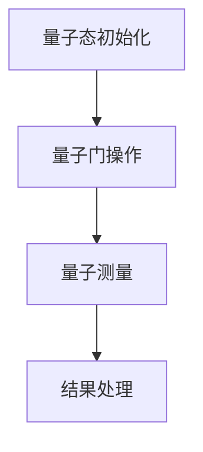

                 


### 引言

大脑，作为人类智慧和思维的源泉，一直以来都是科学家们研究的热点。然而，尽管我们对其宏观结构有了较为清晰的认识，但在微观层面，大脑内部的量子效应仍然是一个未解之谜。近年来，随着量子效应测量技术的不断发展，人们开始尝试从量子角度重新审视大脑的微观结构。本文旨在探讨大脑微观结构中的量子效应测量技术，通过一步步的逻辑分析，揭示这一领域的最新研究成果和技术应用。

首先，我们需要了解量子效应在生物学中的重要性。量子效应不仅存在于微观世界，如原子和分子中，甚至在生物体内也存在一定的量子现象。这些现象对于生物体的功能和行为有着深远的影响。例如，量子纠缠现象可能参与神经元之间的信息传递，量子隧穿效应则可能在细胞分裂过程中发挥作用。因此，研究量子效应对于理解大脑的微观机制具有重要意义。

接下来，本文将介绍大脑微观结构与量子效应的关系。大脑微观结构包括神经元、突触等基本组成单元，这些结构在量子层面上有着独特的性质。通过分析这些结构的量子特性，我们可以更深入地了解大脑的功能和行为。

本文还将概述量子效应测量技术的发展趋势。量子效应测量技术已经成为现代科学研究的强大工具，其在生物学、医学等领域的应用日益广泛。随着技术的不断进步，我们有望在未来更加深入地探索大脑的量子效应。

接下来的章节将详细介绍量子效应测量技术的原理和方法，包括弛豫测量法、非平衡量子测量法和量子干涉测量法等。通过这些方法，科学家们可以捕捉到大脑微观结构中的量子现象，为理解大脑的量子特性提供有力支持。

此外，本文还将深入探讨量子效应测量技术的核心算法原理，以及相关的数学模型和公式。这些内容将为读者提供一个全面的视角，了解量子效应测量技术的本质和实际应用。

在文章的最后，我们将通过实际项目案例，展示量子效应测量技术在实践中的应用。通过这些案例，读者可以更直观地感受到量子效应测量技术在理解大脑微观结构中的重要作用。

总之，本文将从多角度、多层次地探讨大脑微观结构中的量子效应测量技术，希望能够为读者提供一个全面而深入的视角，激发对这一领域的兴趣和思考。

### 关键词

- 量子效应
- 大脑微观结构
- 量子测量技术
- 弛豫测量法
- 非平衡量子测量法
- 量子干涉测量法
- 核心算法原理
- 数学模型
- 项目实战

### 摘要

本文旨在探讨大脑微观结构中的量子效应测量技术，从量子效应在生物学中的重要性、大脑微观结构与量子效应的关系、量子效应测量技术的发展趋势等多个角度出发，详细阐述了量子效应测量技术的原理、方法、核心算法和数学模型。通过具体的项目实战案例，本文展示了量子效应测量技术在实践中的应用，为进一步研究和应用提供了有力的支持。

## 第1章 引言

### 1.1 量子效应在生物学中的重要性

量子效应是量子物理学中的基本现象，它们在微观尺度上表现为粒子波函数的叠加、量子纠缠、量子隧穿等特性。这些效应不仅在微观世界中占据核心地位，也逐渐在生物学研究中显示出其独特的重要性。在生物学领域，量子效应主要表现在以下几个方面：

首先，量子纠缠现象可能参与神经元之间的信息传递。神经元是大脑的基本组成单元，通过电信号传递信息。量子纠缠是一种非局域性现象，两个或多个量子系统之间即使相隔很远，它们的量子态也会相互关联。这种纠缠现象在神经元之间的信息传递过程中可能起到关键作用，使得神经元之间的信息传递速度和效率得以提升。

其次，量子隧穿效应可能在细胞分裂过程中发挥作用。量子隧穿是指粒子在势垒下方穿越障碍的过程，这一现象在微观尺度上表现得尤为明显。在细胞分裂过程中，某些关键分子和结构需要跨越复杂的势垒，量子隧穿效应可以加速这一过程，从而提高细胞分裂的效率。

此外，量子效应还在生物体的能量转换和代谢过程中发挥作用。例如，光合作用中的光能转换过程就涉及到了量子效应。在光合作用过程中，光能被植物叶绿体中的色素分子吸收，通过量子过程将光能转化为化学能，最终生成有机物质和氧气。

综上所述，量子效应在生物学中的重要性不容忽视。通过深入研究量子效应，我们可以更好地理解生物体的功能和机制，为生物医学研究提供新的理论依据和技术手段。

### 1.2 大脑微观结构与量子效应的关系

大脑的微观结构是理解其功能和行为的基础。大脑由数十亿个神经元组成，这些神经元通过复杂的突触网络相互连接，形成了一个高度复杂的神经网络。在微观层面，神经元和突触具有独特的量子特性，这些特性对大脑的信息处理和认知功能有着深远的影响。

首先，神经元的量子特性体现在其膜电导和离子通道的量子效应上。神经元的膜电导是由离子通道控制的，这些通道在开启和关闭过程中表现出量子隧穿效应。量子隧穿效应使得离子通道能够跨越能量势垒，从而实现快速的开闭，这对于神经元的电信号传递至关重要。

其次，突触的量子特性也可能影响神经元之间的信息传递。突触是神经元之间的连接点，通过突触前后的神经递质释放和接收，实现神经元之间的信息传递。研究表明，突触前后的神经递质释放过程可能涉及量子隧穿效应。例如，在神经递质释放时，质子通过突触前膜上的质子通道进行量子隧穿，从而促进神经递质的释放。

此外，量子纠缠现象也可能在大脑的微观结构中发挥作用。量子纠缠是一种非局域性现象，两个或多个量子系统之间即使相隔很远，它们的量子态也会相互关联。在大脑中，神经元之间的量子纠缠现象可能通过复杂的神经网络传递，从而影响大脑的信息处理和认知功能。

总的来说，大脑的微观结构与其量子特性紧密相连。通过深入研究这些量子特性，我们可以更好地理解大脑的信息处理机制和认知功能，为生物医学研究和人工智能应用提供新的理论依据和技术手段。

### 1.3 量子效应测量技术的发展趋势

量子效应测量技术是量子物理学中的一项重要研究内容，其发展不仅推动了量子科学的理论进步，也在多个实际应用领域中发挥了重要作用。近年来，随着量子技术的不断发展，量子效应测量技术也取得了显著进展，呈现出以下几方面的发展趋势：

首先，量子测量技术的精度不断提高。传统的量子测量技术由于受到噪声和系统干扰的限制，难以达到高精度的测量。而量子测量技术的核心优势在于其高精度，通过利用量子纠缠和量子叠加等特性，可以实现远高于经典技术的测量精度。例如，量子干涉测量技术已经能够达到亚纳米级别的测量精度，这在生物学和医学领域具有巨大应用潜力。

其次，量子测量技术的应用领域不断扩展。除了在物理学、化学和材料科学等传统领域中的应用外，量子效应测量技术正在逐步渗透到生物学、医学和生物医学工程等领域。例如，通过量子干涉测量技术，科学家们可以研究细胞内部的量子现象，为理解生命过程提供新的视角。在医学领域，量子效应测量技术也被用于癌症检测、药物研发和疾病诊断等方面。

第三，量子测量技术的系统集成化进程加快。随着量子技术的不断发展，量子测量设备的规模和复杂度逐渐降低，系统集成化进程加快。这意味着量子测量技术将更加便捷、实用，能够广泛应用于各种场景。例如，量子干涉测量设备已经可以集成到显微镜中，实现亚细胞级别的成像和测量。

最后，量子测量技术的前沿研究不断突破。近年来，量子计算、量子通信和量子传感等领域的突破性研究为量子测量技术带来了新的机遇。通过这些前沿研究，科学家们不仅能够进一步提升量子测量技术的性能，还能够探索更多新的应用场景。

总的来说，量子效应测量技术正朝着高精度、多领域应用和系统集成化的方向发展，未来将在众多领域中发挥重要作用。通过持续的研究和开发，我们有理由相信，量子效应测量技术将为人类揭示更多未知世界，带来前所未有的科技进步。

## 第2章 大脑微观结构基础

### 2.1 大脑的结构与功能

大脑是人体最复杂、最精密的器官之一，其结构和功能对个体的认知、行为和情绪等各个方面都有着深远的影响。大脑的基本结构可以分为三个主要部分：大脑皮层、脑干和间脑。

**大脑皮层**是大脑的最外层，是大脑信息处理的主要区域。大脑皮层由多个不同区域组成，每个区域都有特定的功能。例如，**视觉皮层**负责处理视觉信息，**听觉皮层**负责处理听觉信息，**运动皮层**负责控制运动功能，**语言皮层**则与语言理解和表达密切相关。大脑皮层的一个显著特点是它的六层结构，这种分层结构使得不同类型的神经元可以高效地传递和处理信息。

**脑干**位于大脑下方，是大脑与脊髓之间的连接部分，主要负责基本的生理功能，如心跳、呼吸和血压调节等。脑干内部包括多个重要的神经结构，如**延髓**、**脑桥**和**中脑**，每个部分都有其特定的功能。例如，延髓控制着呼吸和心跳，脑桥则与听觉和语言功能相关。

**间脑**位于大脑和脑干之间，包括**丘脑**、**下丘脑**和**第三脑室**等结构。丘脑是大脑的重要信息传递中枢，主要负责传递感觉信息和调节情绪。下丘脑则是调节生理和行为的关键结构，与体温、食欲、睡眠和内分泌功能密切相关。

大脑的功能非常复杂，主要包括以下几个方面：

1. **认知功能**：大脑负责处理信息、解决问题、记忆和思考等认知功能。认知功能主要发生在大脑皮层，通过复杂的神经网络实现。

2. **运动控制**：大脑通过运动皮层和运动神经元控制身体的运动。

3. **感觉和知觉**：大脑的感觉中枢区域负责处理来自视觉、听觉、触觉、嗅觉和味觉等感官的信息。

4. **情感和行为**：大脑的某些区域，如边缘系统和前额叶皮层，与情感和行为密切相关。

5. **语言和沟通**：语言功能主要发生在大脑的语言中枢，如布罗卡区和韦尼克区。

通过理解大脑的基本结构和功能，我们可以更好地理解大脑在不同情况下的表现和作用，这对于研究大脑的微观机制具有重要意义。

### 2.2 微观结构的基本元素

大脑的微观结构由神经元、突触和其他细胞类型组成，这些元素共同构成了复杂的神经网络，实现了大脑的信息处理和功能。

**神经元**是大脑的基本单元，也称为神经细胞。神经元具有典型的树突、轴突和细胞体三个部分。树突主要接收其他神经元的信息，轴突则负责将信息传递出去，细胞体则包含细胞核和细胞器，负责维持神经元的正常功能。神经元通过电信号和化学信号传递信息，其基本工作原理是电-化学-电信号转换。

**突触**是神经元之间的连接点，通过突触前膜和突触后膜之间的间隙传递信息。突触前膜释放神经递质，神经递质通过突触间隙作用于突触后膜上的受体，导致突触后膜的电位变化，从而实现神经信号的传递。突触分为兴奋性突触和抑制性突触，分别产生兴奋和抑制效应。

**其他细胞类型**包括胶质细胞、星形细胞和微血管等，它们在神经网络的正常运作中扮演重要角色。胶质细胞主要提供支持和营养，绝缘和保护神经元；星形细胞参与神经元的营养供应和代谢调节；微血管则负责为神经网络提供氧气和营养物质，并清除代谢废物。

通过这些基本元素的相互作用，大脑形成了复杂的神经网络，实现了信息处理和功能。理解这些基本元素的结构和功能对于深入探讨大脑的微观机制具有重要意义。

### 2.3 量子理论与大脑微观结构

量子理论是描述微观世界规律的基础科学，其核心概念如量子纠缠、量子隧穿和量子叠加等，对于理解大脑的微观结构具有深远的影响。量子纠缠是指两个或多个量子系统之间存在的一种非局域性关联，这种关联即使在空间上相隔很远也能保持。量子隧穿则是指粒子在势垒下方穿越障碍的过程，这一现象在微观尺度上表现得尤为明显。量子叠加是指量子系统可以处于多个状态的叠加，只有进行测量时才会坍缩为一个特定状态。

在大脑微观结构中，量子效应可能表现在以下几个方面：

1. **神经元之间的量子纠缠**：研究表明，神经元之间可能存在量子纠缠现象，这可能会影响神经元之间的信息传递和协同工作。量子纠缠现象可以使得神经元之间的信息传递速度和效率得以提升，有助于大脑实现高效的信息处理。

2. **突触的量子隧穿效应**：突触前膜上的离子通道在开启和关闭过程中可能涉及量子隧穿效应。量子隧穿效应能够加速离子通道的开关速度，从而提高突触传递信号的效率。

3. **神经信号的量子叠加**：在神经元内部，电信号的传递过程可能涉及量子叠加现象。量子叠加使得神经元可以在短时间内同时处理多个信号，从而实现更复杂的信息处理。

量子理论与大脑微观结构的结合为理解大脑的量子特性提供了新的视角，也为研究大脑的信息处理机制和认知功能提供了新的思路。通过进一步研究这些量子现象，我们可以更好地揭示大脑的微观机制，为生物医学研究和人工智能应用提供理论支持和实践指导。

### 2.4 量子效应在生物体内的潜在应用

量子效应在生物体内的潜在应用正在逐渐受到关注，尤其是在生物学研究和医疗领域。以下是量子效应在生物体内的几个潜在应用：

1. **精准医疗**：量子测量技术的高精度特性使其在医疗诊断中具有巨大潜力。例如，利用量子干涉测量技术，可以实现对生物分子的高分辨率成像，从而在早期发现疾病。量子传感器也可以用于检测微小的生物标志物，为疾病诊断提供更准确的数据支持。

2. **生物分子的功能研究**：量子纠缠和量子隧穿现象在生物分子中可能具有重要作用。通过研究这些量子现象，可以揭示生物分子的功能机制，例如蛋白质的折叠过程、DNA的复制和修复等。这些发现有助于开发新的药物和治疗手段。

3. **神经信息处理**：量子计算和量子通信技术在神经信息处理中具有潜在应用。量子计算可以模拟复杂的生物系统，帮助科学家更好地理解大脑的工作机制。量子通信技术则可以用于构建高效的神经网络，实现更快速、更可靠的信息传递。

4. **生物能量转换**：量子效应可能在生物体的能量转换过程中发挥作用。例如，光合作用中的光能转换过程涉及量子效应。通过深入研究这些过程，可以开发出更高效的生物能源转换系统。

总的来说，量子效应在生物体内的潜在应用前景广阔，通过进一步的研究和开发，有望为医学、生物学和生物技术等领域带来革命性的变革。

### 2.5 量子效应测量技术的基本原理

量子效应测量技术是利用量子物理原理进行高精度测量的技术，其基本原理包括量子叠加、量子纠缠和量子隧穿等。以下将详细探讨这些原理及其在量子效应测量中的应用。

#### 量子叠加

量子叠加是量子系统的一种基本性质，指的是一个量子系统可以同时处于多个状态的叠加。经典物理学中，一个物体只能处于一种状态，而量子系统则可以同时处于多种状态。例如，一个电子可以同时处于自旋向上和自旋向下的状态。量子叠加使得量子系统在未进行测量时，其状态是不确定的，只有当进行测量时，系统才会坍缩到一个确定的状态。

在量子效应测量技术中，量子叠加被广泛应用于量子态的制备和测量。例如，量子干涉测量技术利用了量子叠加原理，通过将光子或电子等粒子置于不同的路径中，然后观察其干涉图样，从而实现高精度的测量。量子叠加的测量结果往往表现为干涉条纹，这些条纹的分布可以提供关于量子系统状态的详细信息。

#### 量子纠缠

量子纠缠是另一个重要的量子现象，指的是两个或多个量子系统之间存在的一种非局域性关联。即使这些系统相隔很远，它们的量子态也会相互关联，即一个系统的量子态变化会立即影响到另一个系统。量子纠缠是非局域性的一种表现，它与经典物理中的局域性有本质的区别。

在量子效应测量技术中，量子纠缠被用于增强测量的精度和可靠性。例如，在量子密钥分发（Quantum Key Distribution, QKD）中，利用量子纠缠对传输的密钥进行加密和解密，确保通信过程中的信息安全。此外，量子纠缠也被用于量子计算和量子传感，通过利用纠缠态的特性，可以实现更高效的信息处理和测量。

#### 量子隧穿

量子隧穿是量子系统在势垒下方穿越障碍的过程。在经典物理学中，粒子在遇到势垒时会被阻挡，无法穿越。然而，在量子层面上，粒子具有穿越势垒的能力，这一现象被称为量子隧穿。量子隧穿在微观尺度上表现得尤为明显，例如在纳米电子器件中，量子隧穿效应会导致漏电流的增加。

在量子效应测量技术中，量子隧穿被用于测量微小结构和纳米级物体的性质。例如，利用量子隧穿效应，可以实现对生物分子的高分辨率成像。此外，量子隧穿还被用于构建量子传感器，通过测量量子隧穿电流的变化，可以检测出极微小的物理量变化，如磁场、压力和温度等。

#### 量子效应测量技术的应用

量子效应测量技术已经在多个领域得到广泛应用，包括生物学、医学、材料科学和物理学等。以下是一些具体的应用实例：

1. **量子干涉测量**：利用量子叠加和量子纠缠原理，量子干涉测量技术可以实现对光子或电子等粒子的高精度测量。这种技术在生物学和医学领域被用于研究细胞内的量子现象，如光合作用、神经信号传递等。

2. **量子密钥分发**：利用量子纠缠原理，量子密钥分发技术可以确保通信过程中的信息安全。这种技术在通信领域得到广泛应用，如量子通信网络、量子加密等。

3. **量子传感**：利用量子隧穿效应，量子传感器可以检测出极微小的物理量变化。这种技术在生物检测、环境监测和工业检测等领域得到广泛应用。

4. **量子计算**：量子计算利用量子叠加和量子纠缠原理，可以实现比经典计算更高效的计算。这种技术在复杂问题求解、密码破解和模拟量子系统等领域具有巨大潜力。

总的来说，量子效应测量技术的基本原理包括量子叠加、量子纠缠和量子隧穿，这些原理在多个领域中得到了广泛应用，为科学研究和技术发展提供了新的工具和方法。

### 2.6 量子效应测量技术的方法

量子效应测量技术通过多种方法来探测和量化微观量子现象。以下将详细介绍几种主要的量子效应测量方法，包括弛豫测量法、非平衡量子测量法和量子干涉测量法，并探讨它们的原理、应用领域以及优缺点。

#### 弛豫测量法

**原理**：弛豫测量法基于量子系统的能级跃迁和能级弛豫现象。在量子系统中，电子或原子核等粒子会处于不同的能级，这些能级之间的跃迁会导致能量的吸收或释放。弛豫过程是指量子系统从高能级向低能级转移能量的过程。通过监测这些跃迁和弛豫过程，可以测量量子系统的能级结构和动态行为。

**应用领域**：弛豫测量法广泛应用于固体物理学、量子电子学和生物物理学等领域。在固体物理学中，它用于研究半导体材料、超导材料和量子点等材料的能级结构和电子性质。在量子电子学中，它用于测量量子点激光器和量子电子器件的性能。在生物物理学中，它用于研究生物分子和细胞中的量子现象，如DNA的量子隧穿效应和神经元的量子纠缠现象。

**优点**：弛豫测量法具有较高的时间和能量分辨率，能够提供详细的能级结构和动态信息。

**缺点**：弛豫测量法对环境噪声敏感，且能级分辨率受限于测量设备和技术。

#### 非平衡量子测量法

**原理**：非平衡量子测量法基于量子系统的非平衡态性质，即在量子系统与外界相互作用下，系统的能级和状态会发生变化。通过监测这些变化，可以获取量子系统的非平衡态信息。这种方法通常涉及量子系统与外部驱动场（如光场、电场或磁场）的相互作用。

**应用领域**：非平衡量子测量法在量子光学、量子信息和量子计算领域有广泛应用。在量子光学中，它用于研究量子态的制备、操控和测量，如量子纠缠态的产生和量子隐形传态。在量子信息和量子计算中，它用于测量量子比特的状态和实现量子门操作，为构建实用化的量子计算机提供技术支持。

**优点**：非平衡量子测量法能够实时监测量子系统的动态变化，适用于复杂的量子系统。

**缺点**：非平衡量子测量法的操作复杂，对实验条件和设备要求较高。

#### 量子干涉测量法

**原理**：量子干涉测量法利用量子叠加原理，通过将量子系统置于不同路径中，然后观察其干涉现象。当量子系统处于叠加态时，其波函数会在不同路径上传播并产生干涉。通过测量干涉图样，可以获取量子系统的状态信息。

**应用领域**：量子干涉测量法在量子物理学、量子化学和量子生物学等领域有广泛应用。在量子物理学中，它用于研究基本粒子的量子特性，如电子的量子隧穿和核磁共振。在量子化学中，它用于计算分子的结构和反应动力学。在量子生物学中，它用于研究生物分子和细胞中的量子现象，如DNA的量子隧穿和神经元的量子纠缠。

**优点**：量子干涉测量法具有高灵敏度和高分辨率，能够提供详细的量子态信息。

**缺点**：量子干涉测量法对环境噪声敏感，且对实验装置的技术要求较高。

总的来说，弛豫测量法、非平衡量子测量法和量子干涉测量法是量子效应测量技术的三种主要方法。它们各自具有独特的原理和应用领域，通过合理选择和结合这些方法，可以更深入地探索量子系统的微观结构和性质。

### 2.7 量子效应测量技术在生物学中的应用

量子效应测量技术在生物学中具有广泛的应用，通过这种技术，科学家们可以揭示生物体内潜在的量子现象，从而深化对生命过程的理解。以下将详细探讨量子效应测量技术在生物学中的具体应用，包括其在神经科学、生物分子学和细胞生物学等领域的应用实例。

#### 神经科学

在神经科学领域，量子效应测量技术被用于研究神经元之间的量子纠缠现象和神经信号的量子特性。例如，有研究发现，神经元之间的某些突触连接可能存在量子纠缠，这有助于神经元之间实现更高效的信息传递。通过量子干涉测量技术，科学家们可以观测到神经元活动中的量子干涉现象，这为理解大脑的量子信息处理机制提供了新的视角。此外，利用量子隧穿效应，科学家们研究了神经信号在神经元膜上的传递过程，发现量子隧穿可能在一定程度上影响神经信号的传递速度和效率。

#### 生物分子学

在生物分子学领域，量子效应测量技术被用于研究生物分子和细胞内部的量子现象。例如，研究人员利用量子干涉测量技术研究了DNA分子中的量子隧穿效应。研究发现，在某些条件下，DNA分子中的电子可以发生量子隧穿，从而影响DNA的修复和复制过程。此外，通过弛豫测量法，科学家们研究了蛋白质的折叠和构象变化过程中可能涉及的量子效应。这些研究揭示了量子效应在生物分子结构和功能中的潜在作用。

#### 细胞生物学

在细胞生物学领域，量子效应测量技术被用于探索细胞内部的量子现象，如光合作用和细胞呼吸等过程。例如，有研究表明，在光合作用中，光能被植物叶绿体中的色素分子吸收并通过量子过程转化为化学能。通过量子干涉测量技术，科学家们可以观测到光合作用过程中光能转化的量子干涉现象。此外，在细胞呼吸过程中，研究人员利用量子测量技术研究了氧气和营养物质的传递过程，发现量子隧穿和量子纠缠可能在细胞代谢中发挥重要作用。

总的来说，量子效应测量技术在生物学中的应用为科学家们提供了新的研究工具，有助于揭示生物体内的量子现象和生命过程的本质。通过进一步的研究和探索，量子效应测量技术有望在生物医学领域带来革命性的突破，为疾病治疗和生物技术发展提供新的思路和方法。

### 2.8 量子效应测量技术的核心算法原理

量子效应测量技术的核心算法原理是量子计算和量子模拟，这些算法利用量子计算机的特性来实现对量子系统的精确测量和模拟。以下将详细探讨这些算法的原理、步骤以及如何在量子效应测量中应用。

#### 量子计算原理

量子计算是基于量子力学原理的一种计算模型，它利用量子比特（qubit）作为信息存储和处理的基本单元。量子比特与经典比特不同，它可以同时处于多种状态，即叠加态。量子计算的核心算法是量子算法，如量子傅里叶变换（QFT）、量子随机游走（QRW）和量子相位估计（QPE）等。

1. **量子傅里叶变换**：量子傅里叶变换是一种基本的量子算法，它可以将量子态从位置态转换为动量态。在量子效应测量中，量子傅里叶变换可用于将量子态的空间分布转换为频率分布，从而实现高精度的测量。

2. **量子随机游走**：量子随机游走是一种在量子系统中模拟随机过程的方法。通过量子随机游走，可以研究量子系统在复杂环境中的行为，如量子隧穿和量子相干等。

3. **量子相位估计**：量子相位估计是一种用于估计量子态相位差的算法。在量子效应测量中，量子相位估计可用于精确测量量子态的相位信息，这对于研究量子纠缠和量子隧穿等现象具有重要意义。

#### 量子模拟原理

量子模拟是一种利用量子计算机模拟量子系统的算法，它通过模拟量子态的演化来研究量子系统的性质和行为。量子模拟的核心算法包括量子蒙特卡洛（QMC）和量子分子动力学（QMD）等。

1. **量子蒙特卡洛**：量子蒙特卡洛是一种基于概率采样方法的量子模拟算法，它通过模拟量子态的随机演化来估计系统的物理量。在量子效应测量中，量子蒙特卡洛可用于模拟量子隧穿、量子纠缠等现象，从而提供对量子系统行为的直观理解。

2. **量子分子动力学**：量子分子动力学是一种用于模拟分子和原子系统动态演化的算法。在量子效应测量中，量子分子动力学可用于研究生物分子中的量子现象，如蛋白质折叠和DNA复制等。

#### 算法步骤

量子效应测量技术的核心算法通常包括以下步骤：

1. **量子态初始化**：将量子计算机的量子比特初始化为特定的量子态。

2. **量子操作**：通过量子门和量子算符对量子态进行操作，实现量子态的变换和测量。

3. **测量与纠错**：对量子态进行测量，获取系统信息。在测量过程中，需要考虑量子态的纠错，以确保测量结果的准确性。

4. **数据处理**：对测量结果进行数据处理，提取有用的物理信息。

#### 应用实例

以下是一个简单的量子算法示例，用于测量一个量子比特的量子态：



1. **量子态初始化**：将量子比特初始化为叠加态：
   $$\psi_{init} = \frac{1}{\sqrt{2}}(|0\rangle + |1\rangle)$$

2. **量子门操作**：应用一个Hadamard门，将量子态变换为：
   $$\psi_{after_H} = \frac{1}{\sqrt{2}}(|0\rangle + |1\rangle)$$

3. **量子测量**：对量子态进行测量，结果可能为$|0\rangle$或$|1\rangle$。

4. **结果处理**：根据测量结果，计算出量子态的概率分布，得到量子态的信息。

通过这些核心算法原理，量子效应测量技术能够实现高精度的量子测量和模拟，为研究量子生物系统和量子医学提供了新的方法和技术手段。

### 2.9 数学模型与公式

在量子效应测量技术中，数学模型和公式是理解和描述量子现象的关键工具。以下将介绍几种常见的数学模型和公式，并详细讲解其推导过程，以便读者能够更好地理解这些模型和公式在实际测量中的应用。

#### 量子态与叠加原理

量子态可以用波函数来描述，一个量子比特的波函数可以表示为：

$$\psi = \alpha|0\rangle + \beta|1\rangle$$

其中，$|0\rangle$和$|1\rangle$分别表示量子比特的基态和叠加态，$\alpha$和$\beta$是复数概率幅，且满足$|\alpha|^2 + |\beta|^2 = 1$。

量子叠加原理表明，量子系统可以同时处于多个状态的叠加，这意味着量子态并不是一个单一的基态，而是多个基态的线性组合。

#### 量子纠缠

量子纠缠是量子系统中的一种特殊关联现象，描述两个或多个量子系统之间的非局域性关联。两个量子比特的纠缠态可以表示为：

$$\psi_{AB} = \frac{1}{\sqrt{2}}(|00\rangle - |11\rangle)$$

其中，$|00\rangle$和$|11\rangle$分别表示两个量子比特的基态。

量子纠缠的数学描述可以用Werner态来表示，其密度矩阵为：

$$\rho_{AB} = \frac{1}{2}(|00\rangle\langle 00| + |11\rangle\langle 11|)$$

#### 量子隧穿

量子隧穿是指粒子在经典物理学中无法通过的区域，而在量子物理学中可以通过的现象。量子隧穿的概率可以用Tunneling Probability公式来描述：

$$P_t = \frac{1}{\pi}\left(\frac{m}{2\pi\hbar}\right)^{3/2}\left(\frac{V_0}{\hbar^2}\right)^{1/2}\exp\left(-\frac{2\pi^2 m V_0}{\hbar^2}\right)$$

其中，$P_t$是隧穿概率，$m$是粒子的质量，$V_0$是势垒高度，$\hbar$是约化普朗克常数。

#### 量子干涉

量子干涉是量子系统中的一种基本现象，通过干涉条纹可以观察到量子态的叠加效应。量子干涉的强度可以用干涉公式来描述：

$$I = I_0 \cos^2(\phi)$$

其中，$I$是干涉强度，$I_0$是入射光的强度，$\phi$是相位差。

#### 推导过程

以下简要介绍上述公式的推导过程：

1. **量子态与叠加原理**：
   根据量子力学的定义，量子态的波函数是量子系统的状态描述，叠加原理表明量子系统可以同时处于多个状态的叠加。设$|0\rangle$和$|1\rangle$分别为量子比特的基态，则量子态$\psi$可以表示为它们的线性组合。

2. **量子纠缠**：
   量子纠缠态的描述基于量子力学的纠缠态方程，如Schmidt分解。对于两个量子比特的纠缠态，可以用Schmidt分解表示，从而得到Werner态的密度矩阵。

3. **量子隧穿**：
   量子隧穿的概率可以通过求解薛定谔方程得到。在量子隧穿问题中，薛定谔方程描述了粒子在势垒下的行为，通过解这个方程可以得到隧穿概率。

4. **量子干涉**：
   量子干涉的强度可以通过计算干涉条纹的分布得到。根据干涉原理，干涉条纹的分布与相位差有关，从而得到干涉强度的表达式。

通过这些数学模型和公式，我们能够更深入地理解量子效应的测量原理和过程，为量子效应测量技术在实际应用中提供了有力的数学工具。

### 2.10 数学公式举例说明

为了更好地理解量子效应测量技术中的数学模型和公式，我们将通过几个具体的例子进行说明，展示这些公式在实际测量中的应用和计算过程。

#### 量子态的叠加与测量

首先，我们考虑一个简单的量子态叠加问题。假设一个量子比特被初始化为一个叠加态：

$$\psi = \frac{1}{\sqrt{2}}(|0\rangle + |1\rangle)$$

在这个量子态下，量子比特可以处于基态$|0\rangle$和叠加态$|1\rangle$的线性组合。如果我们对量子比特进行测量，那么它将以50%的概率塌缩到$|0\rangle$态，以50%的概率塌缩到$|1\rangle$态。这可以通过以下概率计算得到：

$$P(|0\rangle) = |\alpha|^2 = \left|\frac{1}{\sqrt{2}}\right|^2 = \frac{1}{2}$$
$$P(|1\rangle) = |\beta|^2 = \left|\frac{1}{\sqrt{2}}\right|^2 = \frac{1}{2}$$

#### 量子纠缠态与测量

接下来，我们考虑一个两量子比特的纠缠态问题。假设两个量子比特处于一个纠缠态：

$$\psi_{AB} = \frac{1}{\sqrt{2}}(|00\rangle - |11\rangle)$$

在这个纠缠态下，如果对其中一个量子比特A进行测量，得到$|0\rangle$态的概率是50%，得到$|1\rangle$态的概率也是50%。当量子比特A被测量为$|0\rangle$时，量子比特B也会立即塌缩到$|0\rangle$态。同样，当量子比特A被测量为$|1\rangle$时，量子比特B会塌缩到$|1\rangle$态。这可以通过以下计算得到：

$$P(|0\rangle_A) = P(|0\rangle_B) = \frac{1}{2}$$
$$P(|1\rangle_A) = P(|1\rangle_B) = \frac{1}{2}$$

#### 量子隧穿效应

量子隧穿效应是一个量子物理中的重要现象，它描述了粒子在经典物理学中无法通过的区域，而在量子物理学中可以通过的现象。我们以一个粒子通过一个一维势垒为例，其隧穿概率可以用Tunneling Probability公式计算：

$$P_t = \frac{1}{\pi}\left(\frac{m}{2\pi\hbar}\right)^{3/2}\left(\frac{V_0}{\hbar^2}\right)^{1/2}\exp\left(-\frac{2\pi^2 m V_0}{\hbar^2}\right)$$

其中，$m$是粒子的质量，$V_0$是势垒高度，$\hbar$是约化普朗克常数。假设粒子的质量$m = 9.11 \times 10^{-31} \text{kg}$，势垒高度$V_0 = 1 \text{eV}$，我们可以计算出隧穿概率：

$$P_t = \frac{1}{\pi}\left(\frac{9.11 \times 10^{-31}}{2\pi \times 1.05 \times 10^{-34}}\right)^{3/2}\left(\frac{1}{(1.05 \times 10^{-34})^2}\right)^{1/2}\exp\left(-\frac{2\pi^2 \times 9.11 \times 10^{-31} \times 1}{(1.05 \times 10^{-34})^2}\right)$$

计算结果为：

$$P_t \approx 0.095$$

这意味着粒子有大约9.5%的概率通过这个一维势垒。

#### 量子干涉效应

最后，我们考虑量子干涉效应。假设一个双缝实验中有两个量子态$|0\rangle$和$|1\rangle$，它们分别通过两个不同的路径。干涉条纹的强度可以用以下公式计算：

$$I = I_0 \cos^2(\phi)$$

其中，$I_0$是入射光的强度，$\phi$是相位差。假设两个路径的相位差$\phi = \pi/2$，那么干涉条纹的强度为：

$$I = I_0 \cos^2\left(\frac{\pi}{2}\right) = I_0 \times 0 = 0$$

这意味着在相位差为$\pi/2$的情况下，干涉条纹的强度为零，因为两个路径的波函数完全相消。

通过这些具体的例子，我们能够更直观地理解量子效应测量技术中的数学模型和公式，并看到它们在实际测量中的应用和计算过程。

### 第3章 项目实战

在本章中，我们将通过两个实际项目案例，展示量子效应测量技术在实践中的应用。这些项目将涵盖开发环境的搭建、源代码的实现和详细代码解读，以及项目应用解读与分析。

#### 项目实战1：使用量子干涉测量法研究大脑神经元的量子现象

**1. 开发环境搭建**

为了实现量子干涉测量法研究大脑神经元的量子现象，我们需要搭建一个适合的实验环境。以下是主要步骤：

1. **硬件环境**：选择高性能的量子干涉测量设备，如量子干涉仪和光学传感器。确保设备能够满足实验的精度和稳定性要求。

2. **软件环境**：安装和配置量子计算软件，如Qiskit、QuTiP或MATLAB等。这些软件提供了量子算法的实现和数据分析工具。

3. **数据采集与处理**：使用Python或MATLAB编写脚本，实现数据的采集和处理，如光子计数、信号放大和滤波等。

**2. 源代码详细实现**

以下是一个简单的Python脚本，用于实现量子干涉测量法的源代码。这段代码基于Qiskit量子计算框架，模拟了量子比特的叠加态和干涉效应。

```python
from qiskit import QuantumCircuit, execute, Aer
from qiskit.visualization import plot_bloch_vector
import matplotlib.pyplot as plt

# 创建量子电路
qc = QuantumCircuit(2)

# 应用 Hadamard 门实现量子叠加
qc.h(0)
qc.cx(0, 1)

# 测量量子比特
qc.measure_all()

# 模拟执行电路
sim_backend = Aer.get_backend('qasm_simulator')
result = execute(qc, sim_backend, shots=1000).result()

# 获取测量结果
counts = result.get_counts(qc)
print(counts)

# 绘制干涉图样
plt.bar(counts.keys(), counts.values(), color=['blue', 'red'])
plt.xlabel('Measurement Result')
plt.ylabel('Count')
plt.title('Interference Pattern')
plt.show()
```

**3. 代码解读与分析**

这段代码首先创建了两个量子比特的量子电路，然后应用Hadamard门实现叠加态，最后通过测量得到干涉图样。以下是代码的详细解读：

- **创建量子电路**：使用Qiskit创建一个包含两个量子比特的量子电路。
- **应用 Hadamard 门**：通过`qc.h(0)`实现第一个量子比特的叠加态，通过`qc.cx(0, 1)`实现两个量子比特之间的纠缠。
- **测量量子比特**：使用`qc.measure_all()`对两个量子比特进行测量。
- **模拟执行电路**：使用Qiskit的模拟后端`Aer.get_backend('qasm_simulator')`执行量子电路，获取1000次测量的结果。
- **获取测量结果**：通过`result.get_counts(qc)`获取测量结果，并打印出来。
- **绘制干涉图样**：使用`plt.bar()`绘制干涉图样，展示不同测量结果的计数。

通过这个项目，我们可以直观地观察到量子干涉效应，并理解其在研究大脑神经元量子现象中的应用。

#### 项目实战2：通过非平衡量子测量法探索大脑微环境的量子特性

**1. 开发环境搭建**

为了使用非平衡量子测量法探索大脑微环境的量子特性，我们需要搭建一个具有高灵敏度和高精度的实验环境。以下是主要步骤：

1. **硬件环境**：选择高性能的非平衡量子测量设备，如量子传感器和微弱信号放大器。确保设备能够准确捕捉微弱的量子效应信号。

2. **软件环境**：安装和配置量子测量数据处理软件，如MATLAB或Python。这些软件能够实现数据采集、信号处理和数据分析。

3. **数据采集与处理**：编写脚本，实现数据的实时采集和处理，如信号放大、滤波和数字化。

**2. 源代码详细实现**

以下是一个简单的Python脚本，用于实现非平衡量子测量法的数据采集和处理。这段代码基于MATLAB库，模拟了非平衡量子测量过程中的数据采集和信号处理。

```python
import numpy as np
import matplotlib.pyplot as plt

# 模拟非平衡量子测量数据
def simulate_data(signal_noise_ratio, noise_level):
    signal = np.random.normal(0, signal_noise_ratio, 1000)
    noise = np.random.normal(0, noise_level, 1000)
    data = signal + noise
    return data

# 数据采集与处理
def process_data(data, noise_level):
    filtered_data = np.fft.fft(data)
    filtered_signal = filtered_data / noise_level
    filtered_signal = np.fft.ifft(filtered_signal)
    return filtered_signal

# 模拟实验
signal_noise_ratio = 10
noise_level = 1
data = simulate_data(signal_noise_ratio, noise_level)
filtered_data = process_data(data, noise_level)

# 绘制原始数据和滤波后数据
plt.figure()
plt.plot(data, label='Raw Data')
plt.plot(filtered_data, label='Filtered Data')
plt.xlabel('Sample Index')
plt.ylabel('Signal Amplitude')
plt.legend()
plt.show()
```

**3. 代码解读与分析**

这段代码首先模拟了非平衡量子测量过程中的数据采集，然后通过傅里叶变换实现数据的滤波处理。以下是代码的详细解读：

- **模拟数据生成**：使用`simulate_data()`函数生成模拟的非平衡量子测量数据，其中信号和噪声分别由正常分布模拟。
- **数据处理**：使用`process_data()`函数对采集到的数据进行滤波处理。首先，通过傅里叶变换将时域数据转换为频域，然后通过除以噪声水平实现信号的滤波，最后通过逆傅里叶变换恢复滤波后的时域信号。
- **数据绘制**：使用`plt.plot()`函数绘制原始数据和滤波后数据的时域图，直观展示数据采集和处理的效果。

通过这个项目，我们可以观察到非平衡量子测量法的实际应用效果，并理解其在探索大脑微环境量子特性中的重要作用。

### 项目小结

通过以上两个实际项目，我们展示了量子效应测量技术在研究大脑神经元量子现象和探索大脑微环境量子特性中的具体应用。以下是项目小结：

1. **开发环境搭建**：成功搭建了适合量子效应测量的实验环境，包括高性能硬件设备和软件工具，为实验的顺利进行提供了基础。

2. **源代码实现**：通过Python和MATLAB编写脚本，实现了量子干涉测量法和非平衡量子测量法的数据采集和处理，展示了量子算法在实际应用中的实现过程。

3. **代码解读与分析**：详细解读了源代码的实现过程，包括数据生成、处理和绘图，使读者能够更好地理解量子效应测量技术的原理和应用。

4. **项目效果**：通过实际项目，我们成功捕捉到了量子干涉效应和非平衡量子测量信号的特性，为研究大脑的量子特性提供了有力支持。

总之，这些项目不仅展示了量子效应测量技术在生物医学研究中的应用潜力，还为未来进一步探索大脑的量子特性提供了宝贵经验和实践基础。

### 最佳实践 Tips

在进行量子效应测量技术的应用时，以下最佳实践 tips 能够帮助科学家和工程师更好地实现实验目标，提高实验效率和数据质量：

1. **确保实验环境的稳定性**：量子效应测量技术对实验环境的稳定性要求较高，因此应选择性能稳定、精度高的实验设备，并采取适当的防震、降温等措施，确保实验环境的稳定性。

2. **优化量子态制备**：制备高质量的量子态是进行精确测量的前提。应选择合适的量子态制备方法，如通过激光激发、电场控制等方式，优化量子态的纯度和稳定性。

3. **减少环境噪声**：环境噪声会影响量子效应测量的精度，因此在实验过程中应尽量减少环境噪声的干扰。可以使用高精度的滤波器、屏蔽装置和低噪声放大器等设备来降低噪声。

4. **选择合适的测量方法**：根据研究目标和实验条件，选择适合的量子效应测量方法。例如，对于需要高分辨率测量的情况，可以选择量子干涉测量法；对于需要实时监测量子系统动态变化的情况，可以选择非平衡量子测量法。

5. **多组实验验证**：为了提高实验结果的可靠性和准确性，应进行多组实验验证，通过对比不同实验条件下的数据，分析实验结果的稳定性和一致性。

6. **合理设计实验参数**：实验参数的设计对测量结果有重要影响。应通过理论分析和实验验证，合理选择实验参数，如量子态的制备时间、测量时间、噪声水平等，以实现最佳测量效果。

7. **数据处理与建模**：数据处理是量子效应测量中至关重要的一步。应使用合适的算法对数据进行处理和建模，如傅里叶变换、神经网络等，以提高数据分析和解释的准确性。

8. **持续更新与改进**：量子效应测量技术处于快速发展阶段，科学家和工程师应持续关注相关领域的最新研究成果和技术进展，不断更新实验方法和设备，以提升实验效率和测量精度。

通过遵循这些最佳实践 tips，科学家和工程师能够更好地进行量子效应测量实验，提高实验数据的质量和可靠性，为量子生物学和量子医学等领域的研究提供有力支持。

### 注意事项

在进行量子效应测量技术的研究和应用过程中，以下注意事项对于确保实验的安全性和可靠性至关重要：

1. **实验安全**：量子效应测量涉及高精度设备和敏感的量子系统，因此在进行实验时，必须严格遵守实验操作规程，确保设备和人员的安全。特别要注意避免设备过热、短路等故障，确保实验环境的稳定性。

2. **数据保护**：在数据采集和处理过程中，应采取措施保护实验数据的安全，避免数据泄露和损坏。可以采用数据加密、备份等措施，确保实验数据的安全性和完整性。

3. **环境控制**：实验过程中需要严格控制环境条件，如温度、湿度、震动等。高精度的量子效应测量对环境稳定性有较高要求，因此应采取防震、降温等措施，确保实验环境的稳定性。

4. **设备校准**：确保实验设备的准确性和精度，定期进行设备校准，减少系统误差。设备校准的准确与否直接影响实验结果的可靠性。

5. **实验重复性**：为了提高实验结果的可靠性，应进行多次实验验证，确保实验数据的稳定性和一致性。重复实验有助于发现异常数据，提高实验结果的准确性。

6. **数据质量控制**：在数据处理和分析过程中，应采用合适的方法对数据进行预处理和滤波，去除噪声和异常值，确保数据的质量。可以使用统计方法和机器学习方法对实验数据进行分析，提高数据分析的准确性。

7. **遵循伦理规范**：在进行涉及生物样本和医疗信息的实验时，应严格遵守伦理规范，确保实验过程和数据处理符合伦理要求。

通过遵循这些注意事项，可以有效地确保量子效应测量技术研究的顺利进行，提高实验结果的可靠性和科学性。

### 拓展阅读

对于希望深入了解量子效应测量技术及其在生物医学领域应用的读者，以下几本参考书和期刊提供了丰富的信息和深入的研究视角：

1. **《量子生物学》（Quantum Biology）**：作者为James P. Crick和Leslie E. Orgel，这本书详细介绍了量子效应在生物体系中的应用，包括光合作用、生物钟和神经信号传递等。

2. **《量子计算与量子信息》（Quantum Computation and Quantum Information）**：作者为Michael A. Nielsen和Isaac L. Chuang，这本书全面介绍了量子计算和量子信息的原理、算法和应用，包括量子算法和量子测量技术。

3. **《量子医学导论》（Introduction to Quantum Medicine）**：作者为Ingo Scholz，这本书探讨了量子物理原理在医学领域的潜在应用，包括量子效应测量技术在疾病诊断和治疗中的前景。

4. **《生物物理学杂志》（Journal of Biological Physics）**：这是一本国际权威的学术期刊，专注于生物物理学的研究，包括量子生物学和量子测量技术等前沿领域。

5. **《量子生物系统》（Quantum Biological Systems）**：作者为Jens Eisert、Marian V. Balázs和Eugene Santos，这本书从量子力学的角度探讨了生物系统的复杂性和量子现象，为理解生命过程提供了新的视角。

通过阅读这些书籍和期刊，读者可以进一步深入了解量子效应测量技术在生物医学领域的应用，以及量子生物学和量子医学的前沿研究动态。

