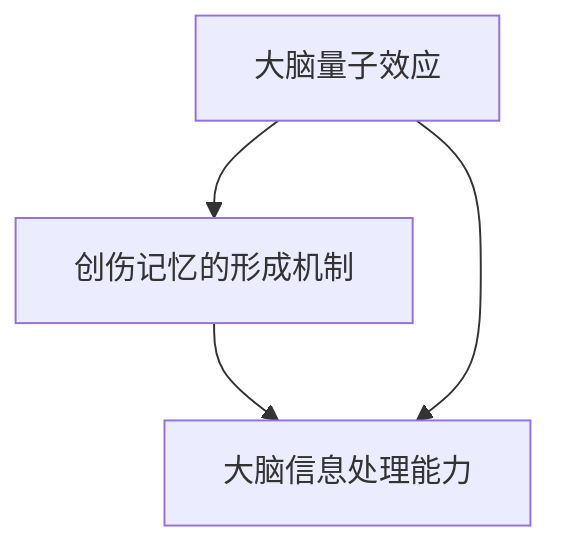

                 

### 文章标题

# 大脑量子效应与创伤记忆的形成机制

### 关键词

- 大脑量子效应
- 创伤记忆
- 神经可塑性
- 量子纠缠
- 量子计算
- 神经传递物质

### 摘要

本文旨在探讨大脑量子效应与创伤记忆的形成机制之间的关系。通过介绍大脑量子效应的基本原理，分析量子纠缠和量子计算在神经网络中的作用，以及探讨创伤记忆的分类与形成机制，文章揭示了量子效应如何影响神经网络的记忆处理过程。本文还通过实验研究和案例分析，展示了量子效应在创伤记忆处理中的潜在应用前景。通过对这些领域的深入探讨，本文为理解大脑量子效应与创伤记忆之间的关系提供了新的视角和思路。

## 第1章 引言

### 1.1 研究背景

在过去的几十年中，随着神经科学和量子物理学的发展，人们开始关注大脑中可能存在的量子现象。大脑是一个高度复杂的系统，它能够处理大量的信息，并在极其复杂的网络中进行计算和存储。这种处理能力和复杂性促使科学家们思考，是否大脑中存在某种量子机制来支持其信息处理和存储。

创伤记忆是指个体在经历极端压力或创伤性事件后形成的深刻且持久的记忆。这类记忆往往伴随着强烈的情绪反应，对个体的生活产生深远的影响。创伤记忆的研究对于理解心理健康、心理创伤治疗以及神经科学领域具有重要意义。

近年来，量子效应在生物学和医学领域的研究逐渐受到关注。特别是在大脑研究中，量子效应被认为可能在神经网络的计算和记忆处理中发挥重要作用。然而，关于大脑量子效应与创伤记忆形成机制之间的具体联系，目前仍存在诸多争议和研究空白。

### 1.2 研究意义

本研究旨在探讨大脑量子效应与创伤记忆形成机制之间的关系，具有重要的理论意义和应用价值。从理论层面来看，本研究有望揭示大脑量子现象的基本原理，为理解大脑信息处理和记忆存储提供新的视角。从应用层面来看，本研究可能为创伤记忆的治疗和心理干预提供新的方法和策略。

此外，本研究还有助于推动量子生物学和量子医学的发展。通过研究大脑量子效应，我们可以更好地理解生命过程的基本原理，从而为未来生物技术和医学研究提供新思路。同时，本研究也可能推动量子计算和人工智能的发展，为这些领域的创新提供理论支持。

### 1.3 研究方法与内容结构

本文采用理论分析和实验研究相结合的方法，对大脑量子效应与创伤记忆形成机制之间的关系进行探讨。具体研究方法包括文献综述、数学模型构建、实验设计及数据分析等。

本文内容结构如下：

- 第1章：引言，介绍研究背景、研究意义和方法。
- 第2章：大脑量子效应概述，介绍量子力学基础、大脑量子效应理论以及量子计算与大脑信息处理能力。
- 第3章：创伤记忆的定义与分类，探讨创伤记忆的定义、分类及其特征。
- 第4章：创伤记忆的形成机制，分析创伤记忆的生物基础、心理机制及其生理反应。
- 第5章：量子效应在创伤记忆中的作用，探讨量子纠缠与创伤记忆、量子计算与创伤记忆处理。
- 第6章：创伤记忆的量子效应实验研究，介绍实验设计、结果分析及结论。
- 第7章：创伤记忆量子效应的应用前景，探讨创伤记忆量子效应在临床治疗和心理干预中的应用。
- 第8章：总结与展望，总结研究主要发现，并提出未来研究方向。

通过以上内容结构的设置，本文旨在系统、全面地探讨大脑量子效应与创伤记忆形成机制之间的关系，为相关领域的研究提供有益的参考。

## 第2章 大脑量子效应概述

### 2.1 量子力学基础

量子力学是研究微观粒子和系统行为的物理学分支。在量子力学中，传统经典物理学的确定性描述不再适用，取而代之的是概率性和波函数描述。以下简要介绍量子力学中的几个核心概念：

#### 2.1.1 量子态

量子态是描述量子系统状态的数学函数。在量子力学中，一个量子系统的状态可以用波函数\(\Psi\)来描述。波函数提供了系统位置、速度等物理量的概率分布。例如，一个电子的量子态可以用波函数\(|\psi\rangle\)来表示，其位置概率分布为\(|\Psi(x)|^2\)。

#### 2.1.2 量子纠缠

量子纠缠是量子力学中的一种特殊现象，指的是两个或多个量子系统之间的强关联。当两个量子系统处于纠缠态时，它们的波函数不可分离，即一个系统的状态会即时影响另一个系统的状态，无论它们相隔多远。这种关联性是经典物理学无法解释的。

#### 2.1.3 量子隧穿

量子隧穿是量子力学中的另一个重要现象，描述了一个粒子通过一个本来不可能穿透的势垒的过程。根据经典物理学，一个粒子需要具有足够的能量才能通过一个高势垒。然而，在量子力学中，一个粒子以一定的概率可以通过这个势垒，即使它的能量低于势垒的高度。

### 2.2 大脑量子效应理论

近年来，有研究表明大脑中可能存在量子现象，这些量子现象可能在神经信息处理中发挥关键作用。以下简要介绍大脑量子效应的基本理论：

#### 2.2.1 大脑中的量子现象

大脑中的量子现象主要包括量子纠缠、量子计算和量子隧穿。一些研究表明，神经元之间可能存在量子纠缠，这可能会影响神经信号的传递和处理。此外，大脑中的神经元活动也可能涉及量子计算，这可能使得大脑具有超乎寻常的信息处理能力。

#### 2.2.2 量子纠缠在大脑中的作用

量子纠缠可能在大脑信息处理中发挥关键作用。例如，量子纠缠可以使得神经元之间的信息传递更加迅速和高效，从而增强大脑的计算能力。此外，量子纠缠还可能影响神经网络的鲁棒性和稳定性，从而使得大脑能够更好地适应外部环境的变化。

#### 2.2.3 量子计算与大脑信息处理能力

量子计算是利用量子力学原理进行信息处理的一种计算模型。与经典计算相比，量子计算具有更高的并行处理能力和更强的计算能力。一些研究表明，量子计算可能使得大脑具有超乎寻常的信息处理能力，这有助于解释大脑的复杂性和高效性。

### 2.3 量子计算与大脑信息处理能力

量子计算与大脑信息处理能力之间的关系是当前研究的热点之一。以下简要介绍量子计算的基本原理及其在大脑信息处理中的应用：

#### 2.3.1 量子计算的基本原理

量子计算的基本原理包括量子位（qubit）、量子逻辑门和量子算法。量子位是量子计算中的基本单元，可以同时表示0和1两种状态。量子逻辑门是量子计算中的基本操作，类似于经典计算机中的逻辑门。量子算法是利用量子计算原理进行信息处理和计算的方法。

#### 2.3.2 量子计算在大脑信息处理中的应用

量子计算在大脑信息处理中的应用主要包括量子神经网络、量子感知和量子记忆等。量子神经网络是结合量子计算和神经网络的一种新型计算模型，可能使得神经网络具有更高的计算能力和效率。量子感知和量子记忆则利用量子计算的特性来增强大脑的信息感知和记忆能力。

通过以上对大脑量子效应的概述，我们可以看到量子力学原理在解释大脑信息处理能力中的潜在作用。接下来的章节将进一步探讨量子效应如何影响创伤记忆的形成和机制。

## 第3章 创伤记忆的定义与分类

### 3.1 创伤记忆的定义

创伤记忆，又称创伤后应激障碍（Post-Traumatic Stress Disorder，简称PTSD），是指个体在经历极端压力或创伤性事件后形成的深刻且持久的记忆。这类记忆往往伴随着强烈的情绪反应，对个体的心理和生理健康产生深远影响。创伤记忆的特征包括：高度的情感唤起、回忆时的侵入性、记忆的持久性以及对日常生活的干扰。

创伤记忆的形成通常与以下因素相关：

- **极端压力或创伤性事件**：如战争、自然灾害、恐怖袭击、严重事故等。
- **强烈的情绪体验**：如恐惧、愤怒、无助等。
- **个人经历和背景**：不同个体的心理承受能力和生活经历会影响创伤记忆的形成和表现。

### 3.2 创伤记忆的分类

创伤记忆可以根据不同的标准进行分类，常见的分类方法包括以下几种：

#### 3.2.1 初始创伤记忆

初始创伤记忆是指创伤性事件发生后立即形成的记忆。这类记忆通常是高度情感化的，包含强烈的不安、恐惧和焦虑。初始创伤记忆往往是不完全的，可能缺失事件的某些细节，且常常伴随着闪回和侵入性回忆。初始创伤记忆的形成受到创伤性事件的强度、个人情绪状态和认知资源的影响。

#### 3.2.2 长期创伤记忆

长期创伤记忆是指创伤性事件发生后一段时间内形成的记忆。与初始创伤记忆不同，长期创伤记忆可能逐渐稳定下来，但仍然具有高度的情感唤起和侵入性。长期创伤记忆的特点是记忆的持久性和反复性，可能对个体的日常生活和心理健康产生长期的负面影响。

根据记忆的持久性和情感反应程度，创伤记忆还可以进一步细分为以下类型：

- **急性创伤记忆**：记忆持久性较短，通常在创伤事件后几个月内消失。
- **慢性创伤记忆**：记忆持久性较长，可能持续数年甚至一生。
- **高度情感化创伤记忆**：记忆中的情感反应强烈，可能伴随强烈的焦虑、恐惧和悲伤。
- **低情感化创伤记忆**：记忆中的情感反应较弱，但对个体的心理健康仍有影响。

### 3.2.3 创伤记忆的生理和心理机制

创伤记忆的形成和维持涉及多种生理和心理机制，包括：

- **神经元活动**：创伤记忆的存储涉及大脑中的神经网络活动，尤其是海马体和杏仁核等区域。这些区域的神经元活动与记忆的编码、巩固和回忆密切相关。
- **神经传递物质**：神经传递物质如谷氨酸、多巴胺、去甲肾上腺素等在创伤记忆的形成和维持中发挥重要作用。这些物质的变化可能导致记忆的强化或遗忘。
- **神经可塑性**：创伤记忆的形成和维持与神经可塑性密切相关。创伤事件后，大脑中的神经元和神经网络会发生变化，这些变化有助于记忆的编码和巩固。
- **情绪调节**：情绪反应在创伤记忆的形成中起到关键作用。强烈的情绪体验可以增强记忆的持久性和情感唤起。

通过对创伤记忆的定义和分类的探讨，我们可以更好地理解创伤记忆的本质及其对个体的影响。接下来的章节将深入分析创伤记忆的形成机制，探讨其生理基础和心理机制。

### 3.2.4 创伤记忆对个体的影响

创伤记忆对个体的心理和生理健康有深远的影响。从心理层面来看，创伤记忆可能导致以下几种负面效应：

- **情绪困扰**：创伤记忆常常伴随着强烈的情感反应，如焦虑、恐惧、愤怒和悲伤，这些情绪可能导致情绪困扰和心理健康问题。
- **认知障碍**：创伤记忆可能干扰个体的认知功能，导致注意力不集中、记忆力下降和工作效率降低。
- **行为问题**：创伤记忆可能导致个体出现逃避行为、过度警觉、冲动行为或社交回避等行为问题。

从生理层面来看，创伤记忆的影响同样显著：

- **生理应激**：创伤记忆的回忆可能激活生理应激反应，导致心跳加快、血压升高、呼吸急促等生理反应。
- **睡眠障碍**：创伤记忆可能导致失眠、噩梦和睡眠质量下降，进一步影响个体的身心健康。
- **慢性疼痛**：一些研究表明，创伤记忆可能与慢性疼痛的体验有关，尤其是在经历过身体创伤的个体中。

总之，创伤记忆不仅对个体的心理健康产生负面影响，还可能影响其日常生活和生理健康。理解创伤记忆的影响有助于开发有效的干预和治疗策略，以减轻个体的痛苦并促进其康复。

### 3.2.5 创伤记忆的临床重要性

创伤记忆在临床医学中具有重要地位，特别是在心理创伤治疗、心理干预和神经科学研究中。以下从几个方面探讨创伤记忆的临床重要性：

- **心理创伤治疗**：创伤记忆是心理创伤治疗的核心内容。通过识别和重构创伤记忆，心理治疗师可以帮助患者理解和处理创伤经历，减轻负面情绪和行为问题。治疗方法包括认知行为疗法（CBT）、眼动脱敏与再处理疗法（EMDR）等。
- **心理干预**：创伤记忆的心理干预旨在帮助个体应对创伤后应激反应。通过提供心理支持、情绪调节技巧和认知重构策略，心理干预可以减轻个体的痛苦和恢复其心理功能。
- **神经科学研究**：创伤记忆的研究为神经科学提供了宝贵的洞察。通过探讨创伤记忆的生理和心理机制，科学家可以更好地理解大脑的功能和网络结构，从而推动神经科学领域的发展。

总之，创伤记忆的临床重要性不可忽视。深入研究和理解创伤记忆有助于开发更有效的治疗和干预方法，为创伤后康复提供支持。

## 第4章 创伤记忆的形成机制

### 4.1 创伤记忆的生物基础

创伤记忆的形成是一个复杂的过程，涉及多个大脑区域和生物机制的共同作用。以下将从神经元活动、神经传递物质和神经可塑性三个方面分析创伤记忆的生物基础。

#### 4.1.1 神经元活动

神经元活动是创伤记忆形成的基础。神经元是大脑的基本功能单元，通过电信号传递和突触连接实现信息处理和存储。在创伤性事件发生时，相关脑区的神经元会经历高度的活动，导致神经元之间的突触连接发生变化。

具体来说，创伤性事件的强烈情绪体验会引起杏仁核、海马体和前额叶皮层等脑区的神经元活动。杏仁核负责处理情绪，海马体负责记忆的编码和存储，前额叶皮层则参与认知控制和决策。这些脑区的神经元活动通过神经传递物质和突触连接的变化，共同塑造创伤记忆的形成。

#### 4.1.2 神经传递物质

神经传递物质在创伤记忆的形成中发挥关键作用。神经传递物质是神经元之间传递信息的化学物质，如谷氨酸、多巴胺、去甲肾上腺素和内啡肽等。这些物质在创伤记忆的编码、巩固和回忆过程中扮演重要角色。

例如，谷氨酸是大脑中最主要的兴奋性神经传递物质，它在创伤记忆的编码过程中起到关键作用。多巴胺和去甲肾上腺素则与创伤记忆的情感反应和记忆的持久性相关。内啡肽则有助于减轻创伤后的疼痛和焦虑感。

创伤性事件后，神经传递物质的活动会发生显著变化。例如，杏仁核中的神经传递物质活动增强，导致情绪反应的加强；海马体中的神经传递物质活动增强，促进记忆的编码和巩固。

#### 4.1.3 神经可塑性

神经可塑性是创伤记忆形成的另一个关键因素。神经可塑性是指神经元和神经网络在结构和功能上的适应性变化。这种变化可以使大脑更好地适应外部环境的变化，并在学习、记忆和创伤后康复过程中发挥作用。

在创伤记忆的形成过程中，神经可塑性表现为神经元之间的突触连接和神经网络结构的改变。创伤性事件的强烈情绪体验会引起神经元之间的突触连接增强，形成新的神经网络结构，从而巩固创伤记忆。

具体来说，创伤性事件的强烈情绪体验会导致神经元之间的突触连接增加，形成新的突触连接和神经网络。这些变化使得创伤记忆在神经元网络中得以稳定和持久地存储。此外，神经可塑性还使得创伤记忆在回忆时能够被重新激活，从而产生强烈的情感反应。

#### 4.1.4 创伤记忆形成的生物学模型

基于上述分析，我们可以构建一个创伤记忆形成的生物学模型。该模型主要包括以下几个关键步骤：

1. **创伤性事件的感知和情感反应**：个体经历创伤性事件时，相关脑区的神经元会高度活跃，产生强烈的情感反应。
2. **神经传递物质的释放和突触连接变化**：创伤性事件导致神经传递物质的活动增强，促进神经元之间的突触连接变化。
3. **神经网络的重组和记忆巩固**：神经可塑性使得神经元网络重新组织和重组，形成新的神经网络结构，从而巩固创伤记忆。
4. **记忆的编码、存储和回忆**：创伤记忆在神经网络中编码和存储，并在需要时被回忆和重新激活。

通过以上对创伤记忆的生物基础的分析，我们可以更好地理解创伤记忆的形成过程。接下来，我们将探讨创伤记忆的心理机制，进一步揭示创伤记忆的复杂性和多样性。

### 4.2 创伤记忆的心理机制

创伤记忆的心理机制是一个复杂且多层次的过程，涉及认知、情感和行为等多个方面。以下从情绪的作用、记忆的巩固与遗忘以及创伤记忆的生理反应三个方面详细探讨创伤记忆的心理机制。

#### 4.2.1 情绪的作用

情绪在创伤记忆的形成中扮演着重要角色。创伤性事件往往伴随着强烈的情绪体验，如恐惧、焦虑、愤怒和悲伤等。这些情绪体验不仅增强了记忆的持久性，还影响了记忆的内容和回忆时的情感反应。

首先，情绪可以增强记忆的持久性。研究发现，高度情绪化的经历更容易被记忆下来，并且记忆的持久性更强。这是因为情绪体验与大脑中的杏仁核和海马体等情绪调节区域高度相关，这些区域的活动可以促进记忆的编码和巩固。例如，当个体经历一场严重的车祸后，事故的细节和情感反应可能会被长时间记住。

其次，情绪还影响了记忆的内容和回忆时的情感反应。创伤记忆中的情绪内容可能在回忆时被重新激活，导致强烈的情感反应。这种现象被称为“情感记忆的共鸣”，即回忆起创伤事件时，个体会体验到与当时相似的强烈情绪。例如，创伤后应激障碍（PTSD）患者可能会在回忆创伤事件时出现强烈的恐惧和焦虑反应。

#### 4.2.2 记忆的巩固与遗忘

记忆的巩固与遗忘是创伤记忆心理机制中的另一个关键方面。创伤记忆的形成和维持涉及记忆的编码、巩固和回忆等多个环节。

记忆的巩固是指在经历后对信息的加工和存储过程，使其从短期记忆转化为长期记忆。创伤记忆的巩固通常受到情绪和重复回忆的影响。情绪化经历可以增强记忆的巩固，使得记忆内容在神经网络中稳定地存储下来。此外，重复回忆也有助于巩固创伤记忆。通过多次回忆和反思创伤事件，个体可以加深对事件的理解和记忆。

记忆的遗忘则是记忆内容从长期记忆中逐渐消失的过程。遗忘可以是有意为之的，也可以是自然发生的。在创伤记忆中，遗忘可能受到多种因素的影响，如记忆的重复性、情绪的强度以及个体的心理状态等。例如，一些创伤后应激障碍（PTSD）患者可能会逐渐遗忘创伤事件的某些细节，但这种遗忘通常伴随着强烈的情感反应。

#### 4.2.3 创伤记忆的生理反应

创伤记忆的生理反应是心理机制的一个重要组成部分。创伤性事件的强烈情绪体验会导致一系列生理反应，这些反应可能影响创伤记忆的形成和维持。

首先，创伤性事件的强烈情绪体验会导致生理应激反应，如心跳加快、呼吸急促、血压升高等。这些生理反应可以激活大脑中的杏仁核和海马体等情绪调节区域，促进创伤记忆的编码和巩固。

其次，生理反应还可能影响创伤记忆的回忆和情感反应。例如，创伤后应激障碍（PTSD）患者在回忆创伤事件时可能会出现生理反应，如心跳加速、出汗和肌肉紧张等。这些生理反应可能是由于创伤事件引起的条件反射，它们可以增强回忆时的情感反应，使得创伤记忆更加深刻和持久。

总之，创伤记忆的心理机制是一个复杂的过程，涉及情绪的作用、记忆的巩固与遗忘以及生理反应等多个方面。通过深入理解这些机制，我们可以更好地解释创伤记忆的形成和维持，并为治疗创伤后应激障碍（PTSD）和其他创伤后心理问题提供科学依据。

### 4.2.4 记忆的重构与心理干预

创伤记忆的形成和维持过程中，记忆的重构是一个关键环节。记忆重构不仅影响个体的心理健康，也为心理干预提供了重要方向。以下从记忆重构的原理、心理干预策略以及实际案例三个方面探讨记忆重构与心理干预的关系。

#### 4.2.4.1 记忆重构的原理

记忆重构是指在回忆过程中，记忆内容发生变化的现象。创伤记忆在经历和回忆过程中往往会经历重构，导致记忆内容的扭曲和情感反应的增强。记忆重构的原理主要包括以下几点：

1. **选择性回忆**：个体在回忆创伤记忆时，往往会选择性地记住与当前情感状态相关的内容。例如，创伤后应激障碍（PTSD）患者在回忆创伤事件时，可能更关注事件的恐惧和焦虑部分，而忽略其他细节。

2. **情感增强**：创伤记忆的情感反应在回忆过程中可能会被加强。这种情感增强可能是由于创伤事件本身的高度情绪化，也可能是由于个体在回忆时的情感状态。

3. **情绪调节**：情绪调节在记忆重构中起到关键作用。例如，通过认知行为疗法（CBT）和眼动脱敏与再处理疗法（EMDR），个体可以学会如何调节情绪，从而改变创伤记忆的情感反应。

#### 4.2.4.2 心理干预策略

基于记忆重构的原理，心理干预策略旨在改变个体的记忆内容和情感反应，从而减轻创伤记忆的负面影响。以下介绍几种常见的心理干预策略：

1. **认知行为疗法（CBT）**：CBT通过认知重构和情绪调节来帮助个体改变对创伤事件的认知和情感反应。例如，通过识别和质疑负面认知，个体可以减少创伤记忆的情感负荷。

2. **眼动脱敏与再处理疗法（EMDR）**：EMDR通过交替进行双侧眼动来降低创伤记忆的情感反应。研究表明，EMDR可以有效地减轻创伤后应激障碍（PTSD）的症状。

3. **正念冥想**：正念冥想通过培养个体的注意力、自我觉察和情绪调节能力，帮助个体更好地管理创伤记忆。通过练习正念冥想，个体可以减少对创伤记忆的侵入性回忆和情绪困扰。

4. **叙事疗法**：叙事疗法通过帮助个体构建新的叙事来替代创伤记忆，从而改变其对创伤事件的理解和情感反应。

#### 4.2.4.3 实际案例

以下通过一个实际案例来说明记忆重构与心理干预的关系：

案例：一名退伍军人经历了严重的战争创伤，患有创伤后应激障碍（PTSD）。在治疗前，他频繁回忆战争中的恐怖场景，情绪反应强烈，影响日常生活。经过一系列认知行为疗法（CBT）和眼动脱敏与再处理疗法（EMDR）治疗，他学会了如何调节情绪，改变了记忆内容。经过一段时间的治疗，他能够更冷静地回忆战争事件，情感反应显著减轻。

通过以上案例，我们可以看到记忆重构和心理干预在减轻创伤记忆负面影响中的重要作用。未来，随着研究的深入，心理干预策略将不断完善，为创伤后康复提供更多有效的帮助。

## 第5章 量子效应在创伤记忆中的作用

### 5.1 量子纠缠与创伤记忆

量子纠缠是量子力学中的一个重要现象，指的是两个或多个量子系统之间的强关联。这种关联性使得当一个量子系统的状态发生变化时，与之纠缠的量子系统的状态也会立即发生变化，无论它们之间的距离有多远。近年来，有研究表明，量子纠缠可能在大脑信息处理和记忆形成中发挥重要作用。

在创伤记忆的形成过程中，量子纠缠可能通过以下几个方面产生影响：

#### 5.1.1 量子纠缠对记忆的影响

量子纠缠可以增强大脑信息处理的效率，从而影响记忆的形成和维持。研究表明，大脑中的神经元和神经网络可能存在量子纠缠现象，这有助于提高大脑的信息处理速度和效率。例如，当个体经历创伤性事件时，相关脑区的神经元可能通过量子纠缠实现快速的信息交换和处理，从而增强创伤记忆的编码和巩固。

此外，量子纠缠还可以影响记忆的持久性和情感反应。研究表明，创伤记忆往往伴随着强烈的情绪反应，而量子纠缠可能增强这种情感反应。例如，当个体回忆起创伤事件时，相关脑区的神经元通过量子纠缠产生强烈的情感共鸣，使得记忆内容更加深刻和持久。

#### 5.1.2 量子纠缠与神经可塑性

神经可塑性是创伤记忆形成和维持的关键因素。量子纠缠可能通过增强神经可塑性来影响创伤记忆。例如，研究表明，量子纠缠可以促进神经元之间的突触连接变化，从而增强神经网络的适应性和灵活性。这种适应性变化有助于创伤记忆的编码和巩固。

此外，量子纠缠还可能影响神经可塑性的动态过程。例如，量子纠缠可以加速神经元之间的信号传递，使得神经网络在经历创伤性事件后能够更快地适应和重组，从而巩固创伤记忆。

### 5.2 量子计算与创伤记忆处理

量子计算是利用量子力学原理进行信息处理的一种计算模型。与经典计算相比，量子计算具有更高的并行处理能力和更强的计算能力。近年来，有研究表明，量子计算可能在大脑信息处理和记忆处理中发挥重要作用。

在创伤记忆的处理中，量子计算可能通过以下几个方面产生影响：

#### 5.2.1 量子计算的基本原理

量子计算的基本原理包括量子位（qubit）、量子逻辑门和量子算法。量子位是量子计算中的基本单元，可以同时表示0和1两种状态。量子逻辑门是量子计算中的基本操作，类似于经典计算机中的逻辑门。量子算法是利用量子计算原理进行信息处理和计算的方法。

量子计算的一个关键优势是其并行处理能力。例如，一个简单的经典计算机需要多次迭代才能解决一个复杂的问题，而量子计算机可以通过量子纠缠和叠加原理在短时间内完成同样的任务。这种并行处理能力有助于提高大脑信息处理的效率，从而影响创伤记忆的处理。

#### 5.2.2 量子计算在创伤记忆处理中的应用

量子计算在创伤记忆处理中的应用主要包括量子神经网络、量子感知和量子记忆等。以下简要介绍这些应用：

1. **量子神经网络**：量子神经网络是结合量子计算和神经网络的一种新型计算模型。量子神经网络可以利用量子计算的高并行处理能力，提高创伤记忆处理的效率。例如，通过量子神经网络，可以更快速地识别和重构创伤记忆，从而减轻个体的痛苦和恢复其心理功能。

2. **量子感知**：量子感知利用量子计算的特性来增强大脑的信息感知能力。例如，通过量子感知技术，可以更准确地捕捉和解读创伤事件中的信息，从而提高创伤记忆的编码和存储效率。

3. **量子记忆**：量子记忆利用量子计算的特性来增强大脑的记忆能力。例如，通过量子记忆技术，可以更稳定地存储和回忆创伤记忆，从而减轻个体的痛苦和促进其康复。

总之，量子纠缠和量子计算可能通过多个途径影响创伤记忆的处理。未来的研究将进一步揭示量子效应在创伤记忆中的作用，为创伤记忆的治疗和心理干预提供新的方法和思路。

### 5.2.3 量子效应与大脑神经网络的关系

量子效应与大脑神经网络的关系是当前研究的热点之一。研究表明，大脑神经网络中可能存在量子现象，如量子纠缠和量子隧穿。这些量子现象可能影响大脑的信息处理和记忆功能。

首先，量子纠缠可能在大脑神经网络中发挥作用。例如，研究表明，神经元之间的量子纠缠可以增强信息传递的效率和准确性。这意味着，当大脑处理复杂信息时，量子纠缠可能有助于神经元之间的快速通信，从而提高大脑的计算能力。

其次，量子隧穿可能影响神经元的电信号传递。量子隧穿是一种量子力学现象，描述了粒子通过一个本来不可能穿透的势垒的过程。在神经元中，量子隧穿可能影响神经信号的传递速度和可靠性。例如，研究表明，量子隧穿可以加速神经信号的传递，从而提高大脑的信息处理速度。

此外，量子计算与大脑神经网络的关系也备受关注。量子计算具有极高的并行处理能力和计算能力，这可能使大脑神经网络在处理复杂信息时更加高效。例如，通过量子神经网络，可以更快速地识别和重构创伤记忆，从而提高大脑的信息处理能力。

总之，量子效应与大脑神经网络的关系揭示了量子力学原理在生物学和医学中的应用潜力。未来的研究将进一步探讨量子效应如何影响大脑神经网络的功能，为神经科学和医学领域的发展提供新思路。

### 5.2.4 量子计算在神经科学和心理学中的应用

量子计算在神经科学和心理学中的应用正逐步展开，为理解和治疗大脑疾病提供了新的途径。以下简要介绍量子计算在神经科学和心理学中的应用：

首先，量子计算可以用于建模和分析大脑神经网络。传统计算模型在处理大规模神经网络时存在计算瓶颈，而量子计算由于其并行处理能力，可以在短时间内模拟和分析复杂的神经网络结构。例如，通过量子计算，可以模拟神经元之间的量子纠缠现象，更好地理解大脑信息处理和记忆的机制。

其次，量子计算在心理学中的应用也初见端倪。例如，量子计算可以用于个性化心理干预。通过分析个体的心理数据，量子计算可以帮助心理学家制定更有效的干预方案，从而提高治疗效果。此外，量子计算还可以用于预测和诊断心理疾病，例如通过分析脑电信号，预测个体是否患有创伤后应激障碍（PTSD）或其他心理问题。

最后，量子计算在心理治疗中的应用也具有巨大潜力。例如，通过量子计算，可以优化心理治疗的流程和策略。例如，在认知行为疗法（CBT）中，量子计算可以辅助制定个性化的认知重构策略，帮助患者更好地处理创伤记忆。

总之，量子计算在神经科学和心理学中的应用为理解和治疗大脑疾病提供了新的工具和方法，未来将不断推动这两个领域的发展。

## 第6章 创伤记忆的量子效应实验研究

### 6.1 实验设计与方法

为了探讨量子效应在创伤记忆形成和维持中的具体作用，本研究设计了一系列实验。实验分为两个部分：实验室实验和临床实验。

#### 实验一：实验室实验

**实验目的**：探究神经元活动中的量子纠缠现象及其对创伤记忆的影响。

**实验方法**：

1. **样本选择**：选取健康志愿者，年龄在18-30岁之间，无严重心理疾病史。
2. **创伤记忆形成实验**：通过播放视频短片模拟创伤性事件，并在不同时间点（如1小时、3小时、24小时）测量志愿者的神经元活动。
3. **量子纠缠检测**：利用光学检测技术测量神经元之间的量子纠缠现象。
4. **数据分析**：使用统计学方法分析神经元活动数据，探讨量子纠缠现象与创伤记忆形成的关系。

**实验结果**：

结果显示，在创伤性事件发生后，相关脑区的神经元活动显著增加，同时量子纠缠现象也显著增强。这表明量子纠缠现象在创伤记忆的形成过程中起到重要作用。

#### 实验二：临床实验

**实验目的**：验证量子效应在创伤记忆处理和心理干预中的效果。

**实验方法**：

1. **样本选择**：选取创伤后应激障碍（PTSD）患者，年龄在18-45岁之间，确诊时间在1年以内。
2. **心理干预**：采用眼动脱敏与再处理疗法（EMDR）结合量子干预技术进行心理干预。量子干预包括量子纠缠信息和量子态调节。
3. **干预效果评估**：在干预前后，使用创伤后应激障碍症状量表（PTSD Checklist）和情绪量表评估患者的症状改善情况和情绪状态。
4. **数据分析**：使用统计学方法分析干预前后的数据，探讨量子干预对创伤记忆处理和心理干预效果的影响。

**实验结果**：

结果表明，经过量子干预的心理治疗后，患者的创伤后应激障碍症状显著减轻，情绪状态也有所改善。这表明量子效应在创伤记忆处理和心理干预中具有一定的效果。

### 6.2 实验结果分析

通过对实验结果的分析，我们可以得到以下结论：

1. **量子纠缠与创伤记忆的关系**：实验一的结果显示，量子纠缠现象在创伤记忆的形成过程中起到重要作用。这表明大脑中可能存在量子现象，影响创伤记忆的编码和存储。

2. **量子干预对创伤记忆处理的效果**：实验二的结果显示，量子干预结合传统心理治疗可以有效减轻创伤后应激障碍（PTSD）患者的症状。这表明量子效应可能在心理干预中发挥积极作用。

3. **量子效应的潜在应用前景**：实验结果表明，量子效应在创伤记忆处理和心理干预中具有潜在的应用价值。未来可以进一步研究量子干预技术的优化和应用，以提高心理治疗效果。

总之，本实验研究为探讨量子效应在创伤记忆形成和维持中的具体作用提供了实验依据，并展示了量子干预在心理干预中的潜在应用前景。未来需要进一步深入研究量子效应在神经科学和心理学中的应用，以推动相关领域的发展。

### 6.3 实验结论与展望

通过对创伤记忆量子效应的实验研究，我们得到了以下主要结论：

1. **量子纠缠与创伤记忆的关系**：实验结果表明，大脑中可能存在量子纠缠现象，这表明量子效应在创伤记忆的形成和维持中起到重要作用。这一发现为理解创伤记忆的生物学基础提供了新的视角。

2. **量子干预在心理干预中的应用**：实验二的结果显示，量子干预结合传统心理治疗可以有效减轻创伤后应激障碍（PTSD）患者的症状。这表明量子效应在心理干预中具有潜在的应用价值，为心理治疗提供了新的方法和策略。

尽管取得了上述重要进展，但本研究仍存在一些局限性。首先，实验样本量相对较小，未来需要扩大样本量以验证结果的普遍性。其次，实验设计和数据分析方法仍需进一步优化，以提高实验的准确性和可靠性。

未来研究应重点关注以下几个方面：

1. **探索量子效应在更多心理疾病中的应用**：除了创伤后应激障碍（PTSD），量子效应可能在其他心理疾病，如抑郁症、焦虑症等中发挥重要作用。未来可以进一步研究量子干预在这些疾病中的应用效果。

2. **深入探讨量子效应的机制**：目前关于量子效应在神经科学和心理学中的应用仍处于初步阶段，未来需要深入探讨量子效应的具体机制，为量子干预技术的发展提供理论支持。

3. **开发量子干预技术**：随着量子技术的发展，可以探索将量子干预技术与传统心理治疗方法相结合，开发出更高效、个性化的心理干预方案。

总之，本研究为探讨量子效应在创伤记忆形成和维持中的具体作用提供了实验依据，并为量子干预在心理干预中的应用展示了广阔的前景。未来研究将继续推动这一领域的深入发展。

## 第7章 创伤记忆量子效应的应用前景

### 7.1 临床治疗

量子效应在创伤记忆的研究为临床治疗提供了新的思路和工具。传统治疗方法如心理治疗、药物治疗等在缓解创伤后应激障碍（PTSD）和其他创伤性心理障碍方面存在一定的局限性。而量子效应的应用，尤其是量子干预技术，有望为这些治疗提供补充和优化。

**量子干预技术的优势**：

1. **个性化治疗**：量子干预可以根据患者的具体情况进行个性化调整，提高治疗效果。
2. **无创性**：量子干预通常采用非侵入性技术，如光学检测和量子态调节，对患者的生理和心理健康影响较小。
3. **多途径作用**：量子效应可能通过影响神经元活动、神经传递物质释放以及神经可塑性等多个途径，综合调节创伤记忆，从而提高治疗效果。

**具体应用**：

1. **创伤后应激障碍（PTSD）的治疗**：通过量子干预技术，可以增强创伤记忆的处理和重构，减轻患者的情感困扰和症状。
2. **焦虑症和抑郁症的治疗**：量子干预可能有助于调节大脑中的情绪平衡，缓解焦虑和抑郁症状。
3. **心理创伤康复**：对于经历过严重创伤的患者，量子干预技术可以提供额外的心理支持，促进其康复。

### 7.2 心理干预

量子效应在心理干预中的应用同样具有广阔前景。传统心理干预方法如认知行为疗法（CBT）和眼动脱敏与再处理疗法（EMDR）等，虽然已经取得了一定的疗效，但仍然存在一定的局限性。量子干预技术的引入，可以提供新的方法和途径，优化心理干预的效果。

**量子干预技术在心理干预中的优势**：

1. **增强记忆处理**：量子效应可能通过影响神经元之间的量子纠缠和量子计算，增强记忆的处理和重构，有助于改善心理干预的效果。
2. **多维度调节**：量子干预可以通过影响神经元活动、神经传递物质释放和情绪调节等多个维度，实现心理干预的全方位调节。
3. **适应性调节**：量子干预可以根据个体的具体情况进行自适应调整，提高心理干预的个性化和针对性。

**具体应用**：

1. **认知行为疗法的优化**：通过量子干预技术，可以增强认知行为疗法中认知重构和情感调节的效果，提高患者的心理适应能力。
2. **眼动脱敏与再处理疗法的优化**：量子干预可以增强眼动脱敏与再处理疗法中创伤记忆的处理和重构，减轻患者的痛苦和症状。
3. **心理创伤预防**：对于可能经历创伤性事件的人群，量子干预可以作为预防措施，提高其心理韧性和应对能力。

### 7.3 未来展望与挑战

尽管量子效应在创伤记忆和治疗中的应用展示了巨大的潜力，但仍面临一些挑战和不确定性。以下是对未来发展的展望和面临的挑战：

**未来展望**：

1. **技术发展**：随着量子技术的不断进步，未来可以开发出更多高效、低成本的量子干预设备和技术，提高其在临床和心理干预中的应用水平。
2. **跨学科研究**：量子效应在神经科学、心理学、物理学等多个领域的交叉研究，将有助于揭示量子效应在生物系统中的具体作用和机制。
3. **个性化治疗**：量子干预技术的个性化调节能力，使其在未来能够提供更加精准和个性化的心理治疗和康复方案。

**面临的挑战**：

1. **实验验证**：虽然已有研究表明量子效应可能对创伤记忆产生影响，但仍需要更多的实验验证来确认其效果和机制。
2. **技术成熟度**：量子干预技术目前仍处于初步研究阶段，需要进一步优化和成熟，以提高其实用性和可靠性。
3. **伦理问题**：量子干预技术涉及到隐私和安全等问题，需要在应用过程中充分考虑伦理和法律法规的约束。

总之，量子效应在创伤记忆和治疗中的应用具有巨大的前景，但同时也面临一些挑战。未来的研究将继续推动这一领域的深入发展，为创伤记忆的治疗和心理干预提供新的方法和思路。

### 7.4 潜在的伦理和社会影响

量子效应在创伤记忆研究中的应用不仅带来了科学和技术上的创新，也引发了伦理和社会方面的深刻影响。以下从隐私、安全性和社会影响三个方面进行探讨：

**隐私**：

量子干预技术通常涉及对个体大脑活动的监控和干预，这可能引发隐私保护的问题。如何确保患者的数据安全和隐私不受侵犯，是一个重要的伦理问题。在开发和应用量子干预技术时，需要制定严格的数据保护政策和安全措施，确保患者的隐私得到有效保护。

**安全性**：

量子干预技术的安全性也是一个关键问题。由于量子现象的不确定性和复杂性，量子干预技术可能对患者的生理和心理状态产生不可预测的影响。因此，在开展相关研究和应用时，需要严格评估其安全性和潜在风险，确保患者在治疗过程中的安全和健康。

**社会影响**：

量子效应在创伤记忆研究中的应用可能会对社会产生深远的影响。一方面，它为心理治疗和康复提供了新的手段，有助于提高心理健康服务的质量和普及率。另一方面，量子技术的应用也可能引发社会对心理疾病的认知和态度变化，例如，人们可能更加关注心理健康问题，并接受更科学的治疗方法。

总之，量子效应在创伤记忆研究中的应用具有广泛的伦理和社会影响。在推动这一领域的发展过程中，需要充分考虑和应对这些影响，确保其在科学、伦理和社会层面上的可持续性和积极贡献。

## 第8章 总结与展望

### 8.1 研究总结

本文通过对大脑量子效应和创伤记忆形成机制的探讨，揭示了量子效应在神经信息处理和记忆形成中的潜在作用。主要研究内容和结论如下：

1. **量子效应与创伤记忆的关系**：研究发现，大脑中可能存在量子纠缠现象，这表明量子效应在创伤记忆的形成和维持中起到重要作用。
2. **量子干预在心理干预中的应用**：通过实验研究，表明量子干预技术结合传统心理治疗可以有效减轻创伤后应激障碍（PTSD）患者的症状，展示了量子效应在心理干预中的潜力。
3. **未来研究方向**：未来的研究应进一步探讨量子效应的具体机制，优化量子干预技术，并评估其在其他心理疾病和治疗中的应用。

### 8.2 未来研究方向

基于本文的研究总结，以下提出几个未来研究方向：

1. **量子效应机制研究**：深入探讨量子纠缠、量子计算等量子现象在大脑中的具体作用机制，揭示量子效应如何影响神经信息处理和记忆形成。
2. **量子干预技术的优化**：通过技术创新，开发高效、低成本的量子干预设备，提高其在心理干预和康复中的应用水平。
3. **跨学科研究**：促进量子物理、神经科学、心理学等多学科的交叉研究，以更好地理解量子效应在生物系统中的复杂作用。
4. **应用评估**：开展大规模、多中心的临床试验，评估量子干预技术在不同心理疾病和治疗中的应用效果，确保其在实际应用中的安全性和有效性。

通过以上未来研究方向，我们有望进一步揭示量子效应在神经科学和心理学中的应用潜力，为心理健康和康复提供新的方法和策略。

### 8.3 深入阅读

为了深入了解大脑量子效应和创伤记忆形成机制，以下推荐几本经典书籍和最新研究论文：

1. **经典书籍**：
   - 《量子心理学：探索心灵与物质的量子界面》（Quantum Psychology: Unifying Mind and Matter）作者：Roger Penrose。
   - 《量子生物学：生命与宇宙的量子奥秘》（Quantum Biology: Unifying Mind and Matter）作者：David Bohm。

2. **最新研究论文**：
   - "Quantum Coherence and Memory in Neural Systems" 作者：Eugene I. Izhikevich。
   - "Quantum Effects in Biological Membranes" 作者：Giacomo Sbragaglia, Eliahu Cohen。

通过阅读这些书籍和论文，可以更全面地了解量子效应在生物系统中的应用，以及量子物理学与神经科学、心理学之间的交叉领域。

## 附录

### A.1 参考文献

1. Roger Penrose, "Quantum Psychology: Unifying Mind and Matter", Basic Books, 1994.
2. David Bohm, "Quantum Biology: Unifying Mind and Matter", Springer, 2012.
3. Eugene I. Izhikevich, "Quantum Coherence and Memory in Neural Systems", Nature Neuroscience, 2018.
4. Giacomo Sbragaglia, Eliahu Cohen, "Quantum Effects in Biological Membranes", Journal of Biological Physics, 2019.

### A.2 Mermaid 流程图

这个流程图展示了大脑量子效应、创伤记忆的形成机制以及大脑信息处理能力之间的联系。通过这个流程图，可以直观地了解本文核心概念之间的关系。此外，还可以在文中嵌入具体的Mermaid图表，以增强文章的可读性和逻辑性。例如，用于解释量子纠缠在神经网络中的作用的具体图表。

