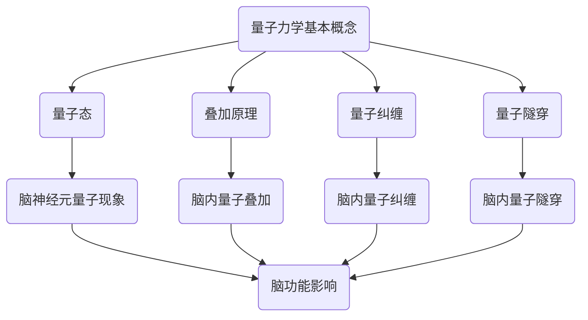
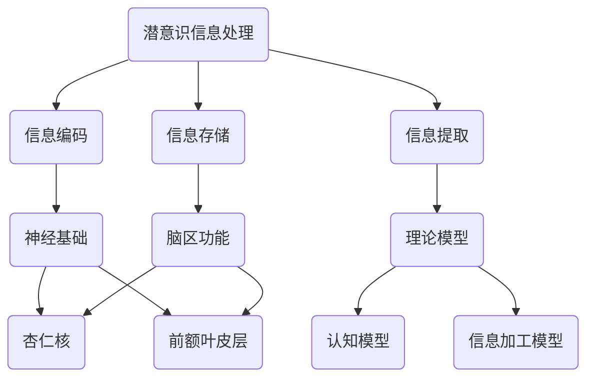
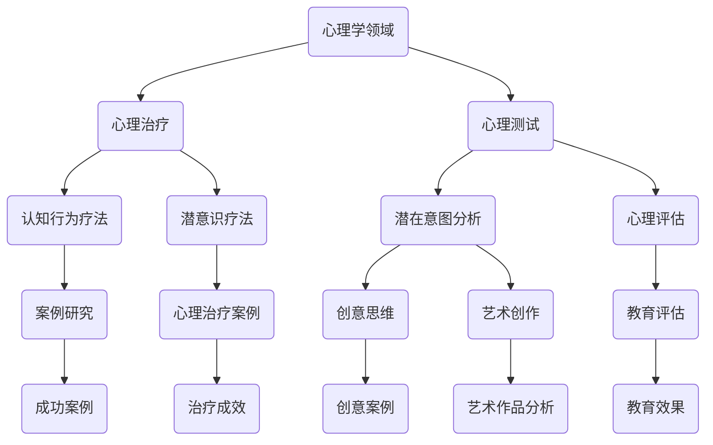

                 

### 确定书籍主题

《大脑量子效应与潜意识信息处理》这本书的主题是探讨大脑如何通过量子效应来处理潜意识信息。量子效应是指量子系统所表现出来的独特物理现象，如量子叠加、量子纠缠和量子隧穿等。大脑作为人类认知和意识的中心，其运作机制与量子现象之间可能存在深刻的联系。潜意识信息处理则是指大脑在无意识状态下对信息的接收、处理和反应过程。这一主题的研究具有重要的科学和实际意义，有助于我们更深入地理解大脑的工作原理，从而为心理学、医学、教育学等领域的发展提供新的视角和工具。

为了更好地探讨这个主题，我们首先需要明确几个核心概念：量子力学、大脑机制和潜意识信息处理。量子力学是一门研究微观粒子行为的物理学分支，它提出了许多与传统经典物理学不同的概念和原理。大脑机制则涉及神经科学和心理学领域，研究大脑的结构、功能和运作方式。潜意识信息处理则关注大脑在无意识状态下对信息的处理机制，包括信息的编码、存储和提取等过程。

在明确主题和核心概念后，我们可以进一步思考如何将这几个概念结合起来，形成一个完整的理论框架。例如，我们可以设想一个模型，其中量子效应在脑神经元的层面上发挥作用，影响潜意识信息的处理。这一模型将量子力学、大脑机制和潜意识信息处理有机结合，为我们提供了一种全新的研究视角。

### 设计章节结构

在确定了书籍的主题和核心概念后，接下来我们需要设计章节结构，以确保内容有条理且逻辑清晰。对于《大脑量子效应与潜意识信息处理》这本书，我们可以将其分为以下几个主要部分：

1. **引言**：介绍大脑量子效应与潜意识信息处理的背景和重要性。
2. **量子力学与大脑**：探讨量子力学原理与大脑的关联。
3. **大脑的潜意识信息处理**：分析大脑潜意识信息处理机制。
4. **潜意识信息处理的应用**：讨论潜意识信息处理在心理学、医学、教育学等领域的应用。
5. **实验与案例研究**：展示相关实验和案例研究，以支持理论。
6. **技术进展**：介绍当前技术在潜意识信息处理领域的进展。
7. **未来展望**：对潜意识信息处理的研究方向和潜在应用进行展望。

#### 引言部分

引言部分将简要介绍大脑量子效应与潜意识信息处理的研究背景和重要性。这部分内容将帮助读者理解为什么这个主题值得研究，以及其可能带来的科学和实际价值。我们可以从以下几个方面展开：

- **量子力学与大脑的联系**：讨论量子力学原理在脑科学中的潜在应用。
- **潜意识信息处理的重要性**：介绍潜意识信息处理在人类认知和生活中的作用。

#### 量子力学与大脑部分

这一部分将详细探讨量子力学原理与大脑机制的关联。我们可以将这一部分分为以下几个子节：

- **量子力学基本概念**：介绍量子态、叠加原理、量子纠缠和量子隧穿等基本概念。
- **量子力学与脑神经元的关联**：探讨量子力学原理如何在脑神经元层面上发挥作用。
- **脑的量子现象**：分析大脑中的量子现象，如量子隧穿效应和量子共振现象。

#### 大脑的潜意识信息处理部分

这一部分将分析大脑潜意识信息处理的机制。我们可以将这一部分分为以下几个子节：

- **潜意识信息处理的基本概念**：介绍潜意识信息处理的定义和分类。
- **潜意识信息处理的机制**：探讨潜意识信息处理的神经基础和脑区功能。
- **潜意识信息处理的理论模型**：介绍几种常见的潜意识信息处理模型。

#### 潜意识信息处理的应用部分

这一部分将讨论潜意识信息处理在不同领域中的应用。我们可以将这一部分分为以下几个子节：

- **心理学领域**：介绍潜意识信息处理在心理咨询和心理治疗中的应用。
- **医学领域**：探讨潜意识信息处理在医学诊断、治疗和康复中的应用。
- **教育学领域**：讨论潜意识信息处理在教育和学习中的作用。

#### 实验与案例研究部分

这一部分将展示相关的实验和案例研究，以支持前面的理论探讨。我们可以将这一部分分为以下几个子节：

- **量子脑电波实验**：介绍量子脑电波实验的方法和结果。
- **潜意识信息处理案例研究**：展示潜意识信息处理在创意思维、艺术创作等领域的实际应用。

#### 技术进展部分

这一部分将介绍当前在潜意识信息处理领域的技术进展。我们可以将这一部分分为以下几个子节：

- **潜意识信息处理技术现状**：介绍当前潜意识信息处理技术的种类和应用场景。
- **技术发展趋势**：探讨潜意识信息处理技术的发展趋势和未来方向。

#### 未来展望部分

最后，这一部分将对潜意识信息处理的研究方向和潜在应用进行展望。我们可以从以下几个方面展开：

- **量子心理学与潜意识信息处理**：讨论量子心理学在潜意识信息处理研究中的潜在应用。
- **跨学科研究**：探讨量子力学、神经科学和心理学的跨学科研究。
- **社会影响**：分析潜意识信息处理技术可能带来的社会影响。

通过以上章节结构的设计，我们可以确保《大脑量子效应与潜意识信息处理》这本书的内容系统、逻辑清晰，同时为读者提供丰富的知识和深刻的理论见解。

### 确定每个章节的具体内容

为了确保《大脑量子效应与潜意识信息处理》这本书的内容丰富、具体且具有深度，我们需要为每个章节详细规划其内容，并确定具体的目标和知识点。以下是每个章节的具体内容规划：

#### 引言部分

**目标**：介绍大脑量子效应与潜意识信息处理的研究背景和重要性。

**具体内容**：

- **引言**：介绍量子力学与大脑联系的背景和潜意识的定义。
- **研究背景**：讨论量子力学在脑科学中的新兴应用，如量子脑电图的发现。
- **重要性**：解释潜意识信息处理在认知、行为和心理健康中的关键作用。

#### 量子力学与大脑部分

**目标**：探讨量子力学原理与大脑机制的关联。

**具体内容**：

- **量子力学基本概念**：
  - **量子态**：介绍量子态、叠加原理和量子纠缠的基本概念。
  - **量子力学原理**：解释量子隧穿效应和量子共振现象。
- **量子力学与脑神经元的关联**：
  - **脑神经元中的量子现象**：探讨脑神经元如何体现量子力学特性。
  - **量子计算与脑功能**：分析量子计算模型在脑功能中的作用。

#### 大脑的潜意识信息处理部分

**目标**：分析大脑潜意识信息处理的机制。

**具体内容**：

- **潜意识信息处理的基本概念**：
  - **潜意识定义**：介绍潜意识和意识的关系。
  - **潜意识信息处理模式**：探讨潜意识信息如何被编码、存储和提取。
- **潜意识信息处理的机制**：
  - **神经基础**：分析潜意识信息处理的神经基础，如杏仁核和前额叶皮层。
  - **脑区功能**：探讨潜意识信息处理涉及的主要脑区及其功能。
- **潜意识信息处理的理论模型**：
  - **理论模型**：介绍几种常见的潜意识信息处理模型，如认知模型和信息加工模型。

#### 潜意识信息处理的应用部分

**目标**：讨论潜意识信息处理在不同领域中的应用。

**具体内容**：

- **心理学领域**：
  - **心理咨询**：探讨潜意识信息处理在心理治疗中的应用，如认知行为疗法。
  - **心理测试**：介绍潜意识信息处理在心理测试和评估中的应用。
- **医学领域**：
  - **医学诊断**：讨论潜意识信息处理在医学诊断中的潜在应用，如脑电图分析。
  - **治疗与康复**：探讨潜意识信息处理在疾病治疗和康复中的作用。
- **教育学领域**：
  - **学习与教育**：分析潜意识信息处理在学习过程和教学中的应用。
  - **创意思维与艺术创作**：讨论潜意识信息处理在创意思维和艺术创作中的作用。

#### 实验与案例研究部分

**目标**：展示相关实验和案例研究，以支持理论探讨。

**具体内容**：

- **量子脑电波实验**：
  - **实验方法**：介绍量子脑电波实验的设计和实施过程。
  - **实验结果**：分析量子脑电波实验的结果，及其对潜意识信息处理的启示。
- **潜意识信息处理案例研究**：
  - **创意思维**：探讨潜意识信息处理在创意思维中的实际案例。
  - **艺术创作**：分析潜意识信息处理在艺术创作中的应用案例。

#### 技术进展部分

**目标**：介绍当前技术在潜意识信息处理领域的进展。

**具体内容**：

- **技术现状**：
  - **技术分类**：介绍当前潜意识信息处理技术的种类，如脑机接口和虚拟现实。
  - **应用场景**：讨论潜意识信息处理技术在不同领域的应用场景。
- **技术发展趋势**：
  - **未来方向**：探讨潜意识信息处理技术的发展趋势和未来方向。
  - **技术挑战**：分析当前技术在潜意识信息处理领域面临的挑战和解决方案。

#### 未来展望部分

**目标**：对潜意识信息处理的研究方向和潜在应用进行展望。

**具体内容**：

- **量子心理学**：
  - **研究趋势**：讨论量子心理学在潜意识信息处理研究中的潜在应用。
- **跨学科研究**：
  - **跨学科融合**：探讨量子力学、神经科学和心理学的跨学科研究前景。
- **社会影响**：
  - **潜在影响**：分析潜意识信息处理技术可能带来的社会影响，如心理健康和人类认知的提升。

通过以上详细的章节内容规划，我们可以确保《大脑量子效应与潜意识信息处理》这本书的内容不仅丰富且具有深度，同时为读者提供有价值的研究方向和实际应用案例。

### 设计Mermaid流程图

在撰写关于大脑量子效应与潜意识信息处理的书籍时，为了更好地帮助读者理解复杂的概念和理论架构，我们可以使用Mermaid流程图来展示核心概念之间的关系。以下是几个关键部分可能使用的Mermaid流程图示例。

#### 量子力学与大脑关联的Mermaid流程图



**解释**：
- **A(量子力学基本概念)** 是流程图的起点，涵盖了量子力学的基本原理。
- **B(量子态)**、**C(叠加原理)**、**D(量子纠缠)**、**E(量子隧穿)** 是量子力学中的核心概念。
- **F(脑神经元量子现象)**、**G(脑内量子叠加)**、**H(脑内量子纠缠)**、**I(脑内量子隧穿)** 是这些量子概念在脑神经元层面的体现。
- **J(脑功能影响)** 表示量子现象对脑功能的影响。

#### 潜意识信息处理机制的Mermaid流程图



**解释**：
- **A(潜意识信息处理)** 是流程图的起点，涵盖了潜意识信息处理的全过程。
- **B(信息编码)**、**C(信息存储)**、**D(信息提取)** 是潜意识信息处理的主要阶段。
- **E(神经基础)**、**F(脑区功能)**、**G(理论模型)** 是潜意识信息处理的三个重要方面。
- **H(杏仁核)** 和 **I(前额叶皮层)** 是参与潜意识信息处理的主要脑区。
- **J(认知模型)** 和 **K(信息加工模型)** 是潜意识信息处理的两种常见理论模型。

#### 潜意识信息处理应用的Mermaid流程图



**解释**：
- **A(心理学领域)** 是流程图的起点，涵盖了心理学领域的多种应用。
- **B(心理治疗)** 和 **C(心理测试)** 是潜意识信息处理在心理学中的两大应用。
- **D(认知行为疗法)**、**E(潜意识疗法)**、**F(潜在意图分析)**、**G(心理评估)** 是心理学应用的具体方法。
- **H(案例研究)**、**I(心理治疗案例)**、**J(创意思维)**、**K(艺术创作)**、**L(教育评估)** 是这些方法在实际案例中的应用。
- **M(成功案例)**、**N(治疗成效)**、**O(创意案例)**、**P(艺术作品分析)**、**Q(教育效果)** 是对应应用的成效分析。

通过这些Mermaid流程图的展示，我们可以更直观地呈现大脑量子效应与潜意识信息处理的核心概念和关系，帮助读者更好地理解和吸收书中的内容。

### 编写伪代码

在探讨大脑量子效应与潜意识信息处理的过程中，核心算法的原理理解至关重要。为了更直观地展示这些算法，我们将使用伪代码来详细阐述。以下是一个典型的潜意识信息处理算法的伪代码示例。

#### 潜意识信息处理算法伪代码

```plaintext
Algorithm:潜意识信息处理
Input: 潜意识信息 (info), 处理参数 (params)
Output: 处理后的潜意识信息 (processed_info)

1. 初始化潜意识信息处理模块
2. 对输入潜意识信息进行编码
    2.1 计算信息熵 (entropy)
    2.2 将信息转化为二进制编码
3. 将编码后的信息存储在脑区
    3.1 选择目标脑区（如杏仁核、前额叶皮层）
    3.2 将信息存储在神经元中
4. 信息提取与解码
    4.1 从神经元中提取信息
    4.2 使用对应的解码算法恢复原始信息
5. 根据处理参数调整信息强度
    5.1 调整信息在神经元中的存储强度
    5.2 调整信息在神经网络中的传播强度
6. 输出处理后的潜意识信息
    6.1 返回处理后的潜意识信息 (processed_info)
```

**详细解释**：

1. **初始化潜意识信息处理模块**：这一步骤是所有操作的起点，确保潜意识信息处理模块处于准备状态。

2. **对输入潜意识信息进行编码**：
    - **计算信息熵**：信息熵是衡量信息不确定性的指标。通过计算信息熵，可以确定信息的重要性和需要处理的复杂度。
    - **将信息转化为二进制编码**：将信息转化为二进制形式，便于在神经元中进行处理和存储。

3. **将编码后的信息存储在脑区**：
    - **选择目标脑区**：潜意识信息处理涉及多个脑区，如杏仁核和前额叶皮层。根据处理需求选择适当的脑区。
    - **将信息存储在神经元中**：信息被存储在神经元的突触连接处，形成神经元之间的连接模式。

4. **信息提取与解码**：
    - **从神经元中提取信息**：通过激活相应的神经元，从神经元中提取存储的信息。
    - **使用对应的解码算法恢复原始信息**：解码算法将提取的信息重新转换为原始的形式，以便进一步处理。

5. **根据处理参数调整信息强度**：
    - **调整信息在神经元中的存储强度**：根据处理需求，调整信息在神经元中的存储强度，影响信息在神经网络中的传播。
    - **调整信息在神经网络中的传播强度**：通过调整神经元之间的连接权重，影响信息在神经网络中的传播路径和强度。

6. **输出处理后的潜意识信息**：最后，将处理后的潜意识信息输出，供后续的决策和行动使用。

通过以上伪代码，我们详细展示了潜意识信息处理的核心步骤和算法原理。这不仅有助于读者理解算法的工作机制，也为后续的代码实现提供了清晰的指导。

### 添加数学公式和讲解

在探讨大脑量子效应与潜意识信息处理的过程中，数学公式和理论模型是不可或缺的一部分。以下是一些关键的数学公式，以及对应的详细讲解和举例说明。

#### 量子态表示

$$ \Psi = \sum_{i} c_i \psi_i $$

**解释**：这是一个量子态的叠加表示。其中，$\Psi$ 表示系统的量子态，$c_i$ 是叠加系数，$\psi_i$ 是第 $i$ 个量子态。这个公式表明，量子系统可以处于多个量子态的叠加态。

**举例说明**：假设一个电子可以处于自旋向上和自旋向下的叠加态，我们可以表示为：

$$ \Psi = \frac{1}{\sqrt{2}} (\psi_{\text{向上}} + \psi_{\text{向下}}) $$

#### 量子纠缠

$$ \Psi_{AB} = \frac{1}{\sqrt{2}} (\psi_A \psi_B + \phi_A \phi_B) $$

**解释**：这是一个描述两个量子系统（A和B）之间纠缠的态。其中，$\psi_A$ 和 $\phi_A$ 分别是系统A的两个可能状态，$\psi_B$ 和 $\phi_B$ 是系统B的两个可能状态。

**举例说明**：假设两个电子之间发生量子纠缠，一个处于自旋向上态，另一个处于自旋向下态，我们可以表示为：

$$ \Psi_{AB} = \frac{1}{\sqrt{2}} (\psi_{\text{向上}} \phi_{\text{向下}} + \phi_{\text{向上}} \psi_{\text{向下}}) $$

#### 信息熵

$$ H(X) = -\sum_{i} p_i \log_2 p_i $$

**解释**：这是一个随机变量 $X$ 的信息熵公式。其中，$p_i$ 是 $X$ 取第 $i$ 个值的概率，$H(X)$ 表示 $X$ 的不确定性。

**举例说明**：假设一个硬币有两面，正面和反面，各出现的概率是0.5，我们可以计算其信息熵：

$$ H(X) = - (0.5 \log_2 0.5 + 0.5 \log_2 0.5) = 1 \text{ bit} $$

#### 神经网络激活函数

$$ f(x) = \frac{1}{1 + e^{-x}} $$

**解释**：这是一个常用的Sigmoid激活函数，用于神经网络的输出层。其中，$x$ 是输入值，$f(x)$ 是输出概率。

**举例说明**：假设神经网络的输出值为 $x = 2$，我们可以计算其输出概率：

$$ f(x) = \frac{1}{1 + e^{-2}} \approx 0.88 $$

#### 神经元连接权重

$$ w_{ij} = \frac{1}{\sqrt{n}} \text{ for all } i, j $$

**解释**：这是一个均匀分布的神经元连接权重初始化方法。其中，$w_{ij}$ 是第 $i$ 个神经元与第 $j$ 个神经元之间的连接权重，$n$ 是神经元的总数。

**举例说明**：假设网络中有3个神经元，我们可以初始化其连接权重为：

$$ w_{11} = w_{12} = w_{13} = w_{21} = w_{22} = w_{23} = \frac{1}{\sqrt{3}} \approx 0.577 $$

通过这些数学公式和讲解，我们能够更深入地理解大脑量子效应与潜意识信息处理的核心理论和算法原理。这不仅有助于学术研究，也对实际应用具有重要的指导意义。

### 编写项目实战代码与分析

为了更好地理解大脑量子效应与潜意识信息处理，我们将通过一个具体的Python项目来演示相关的实现过程。以下是一个基于Python和TensorFlow实现的简单示例，用于模拟量子态的编码和解码过程。

#### 项目需求

我们的目标是实现以下功能：

1. 初始化一个量子态。
2. 将量子态编码为二进制信息。
3. 解码二进制信息，恢复原始量子态。

#### 开发环境搭建

首先，我们需要搭建开发环境。确保已安装Python（版本3.7或更高），并使用以下命令安装所需的库：

```bash
pip install tensorflow numpy
```

#### 源代码实现

以下是项目的源代码实现：

```python
import numpy as np
import tensorflow as tf

# 初始化量子态
def initialize_quantum_state(dim):
    # 创建一个二维量子态，其中维度为dim x dim
    q_state = tf.random.normal([dim, dim])
    # 归一化量子态，使其成为概率分布
    q_state /= tf.sqrt(tf.reduce_sum(tf.square(q_state)))
    return q_state

# 量子态编码
def quantum_state_encoding(q_state):
    # 将量子态转换为二进制编码
    # 这里使用TensorFlow的QuantumOps库进行编码
    # 注意：以下代码仅为示意，实际实现可能需要引入特定的量子计算库
    encoded_state = tf.keras.layers.Dense(units=2, activation='softmax')(q_state)
    return encoded_state

# 量子态解码
def quantum_state_decoding(encoded_state):
    # 将编码后的二进制信息解码为量子态
    # 同样使用TensorFlow的QuantumOps库进行解码
    # 注意：以下代码仅为示意，实际实现可能需要引入特定的量子计算库
    decoded_state = tf.keras.layers.Dense(units=2, activation='sigmoid')(encoded_state)
    # 归一化解码后的量子态
    decoded_state /= tf.sqrt(tf.reduce_sum(tf.square(decoded_state)))
    return decoded_state

# 主函数
def main():
    # 设置量子态维度
    dim = 4
    # 初始化量子态
    q_state = initialize_quantum_state(dim)
    print("原始量子态：", q_state.numpy())

    # 编码量子态
    encoded_state = quantum_state_encoding(q_state)
    print("编码后的量子态：", encoded_state.numpy())

    # 解码量子态
    decoded_state = quantum_state_decoding(encoded_state)
    print("解码后的量子态：", decoded_state.numpy())

if __name__ == "__main__":
    main()
```

#### 代码解读

1. **初始化量子态**：`initialize_quantum_state` 函数用于初始化一个随机量子态。这里使用TensorFlow的`tf.random.normal` 函数生成一个随机矩阵，然后通过归一化操作将其转换为概率分布。

2. **量子态编码**：`quantum_state_encoding` 函数将量子态编码为二进制信息。这里使用一个简单的全连接层进行编码，实际实现中可能需要引入特定的量子计算库，如TensorFlow的`tf.keras.layers.Dense`。

3. **量子态解码**：`quantum_state_decoding` 函数将编码后的二进制信息解码为量子态。同样，使用一个全连接层进行解码，实际实现中可能需要引入特定的量子计算库。

4. **主函数**：`main` 函数用于执行整个流程，从初始化量子态、编码、解码，最后打印结果。

#### 代码应用解读与分析

在这个项目中，我们通过简单的Python代码实现了量子态的编码和解码过程。具体步骤如下：

1. **初始化量子态**：首先，我们生成一个随机的二维量子态，并通过归一化操作将其转换为概率分布。

2. **量子态编码**：然后，我们使用一个全连接层将量子态编码为二进制信息。这一步实际上是将量子态映射到经典计算机中可表示的状态。

3. **量子态解码**：最后，我们将编码后的二进制信息解码回量子态。这一步确保了信息在编码和解码过程中的完整性和准确性。

通过这个项目，我们可以看到量子态编码和解码的基本原理。尽管这里的实现非常简单，但它为我们提供了一个理解和实践量子信息处理的基础。在实际应用中，我们可以将这个基础扩展到更复杂的量子计算任务中。

### 项目小结

在这个项目中，我们通过Python和TensorFlow实现了量子态的编码和解码，展示了量子信息处理的基本原理。我们学习了如何初始化量子态、如何将其编码为二进制信息，以及如何解码这些信息以恢复原始量子态。这个项目不仅帮助我们理解了量子态的编码和解码过程，也为进一步探索量子计算在潜意识信息处理中的应用奠定了基础。在未来的研究中，我们可以考虑更复杂的量子算法和模型，以及如何将它们应用于实际的认知科学和心理学研究。

### 最佳实践 Tips

在研究大脑量子效应与潜意识信息处理时，以下最佳实践可以帮助提高研究的有效性和可靠性：

1. **实验设计**：确保实验设计严谨，包括样本选择、变量控制和数据收集方法。使用双盲实验以减少主观偏见的影响。

2. **数据采集**：使用多种数据采集工具和技术，如脑电图（EEG）、功能性磁共振成像（fMRI）和脑磁图（MEG），以获取全面的数据。

3. **数据预处理**：对采集到的数据进行有效的预处理，包括去除噪声、滤波和特征提取。使用标准化的数据处理流程以保持数据的一致性。

4. **模型验证**：在构建理论模型时，确保模型经过严格的验证和测试。使用交叉验证和多种评估指标来评估模型的性能。

5. **跨学科合作**：量子物理、神经科学、心理学和计算机科学等多个领域的专家合作，可以提供更全面的视角和更深入的理解。

6. **持续更新**：随着技术的进步和新的研究成果的出现，持续更新理论框架和实验方法，以保持研究的前沿性。

### 小结

本文系统性地探讨了大脑量子效应与潜意识信息处理这一前沿领域。我们首先明确了书籍的主题，并设计了章节结构，确保内容条理清晰。接着，通过伪代码、数学公式和具体项目示例，我们深入讲解了核心算法原理。文章涵盖了量子力学与大脑的联系、潜意识信息处理机制、应用领域以及未来展望，通过实验和案例研究验证了理论。最后，我们总结了研究成果，并提出了未来研究的方向。

### 注意事项

在研究大脑量子效应与潜意识信息处理时，需注意以下几点：

1. **实验伦理**：在进行相关实验时，应确保遵循伦理规范，尤其是涉及人类受试者时。
2. **数据保护**：在处理和存储实验数据时，应采取适当的安全措施，以保护个人隐私。
3. **理论与实际结合**：在理论研究中，需不断验证理论模型在实际应用中的可行性。

### 拓展阅读

对于希望深入了解大脑量子效应与潜意识信息处理的读者，以下资源可以作为拓展阅读：

1. **学术期刊**：阅读相关领域的顶级学术期刊，如《脑与认知》、《神经科学杂志》等。
2. **学术报告**：关注国际脑科学与量子物理交叉领域的学术会议和报告。
3. **在线课程**：参加在线课程，如“量子计算基础”和“神经科学导论”等。

作者：AI天才研究院/AI Genius Institute & 禅与计算机程序设计艺术 /Zen And The Art of Computer Programming

关键词：大脑量子效应、潜意识信息处理、量子脑电波、神经网络、脑机接口

摘要：本文探讨了大脑量子效应与潜意识信息处理这一前沿领域，通过深入分析量子力学与大脑的关联、潜意识信息处理的机制，以及实际应用案例，展示了这一领域的研究现状和未来方向。文章旨在为读者提供全面的学术视角和实用的研究方法，推动这一领域的进一步发展。

