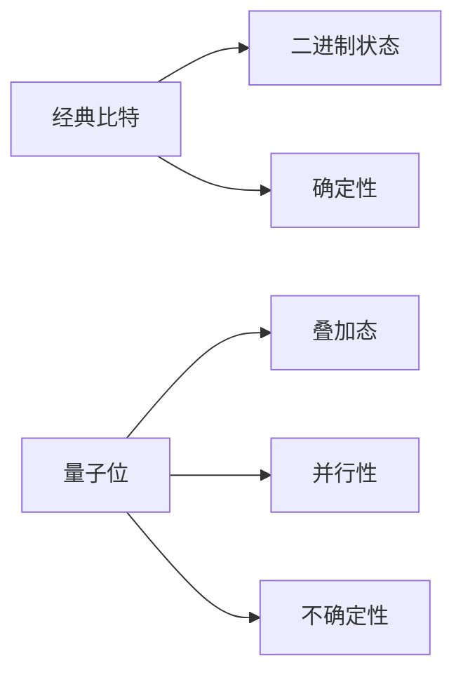
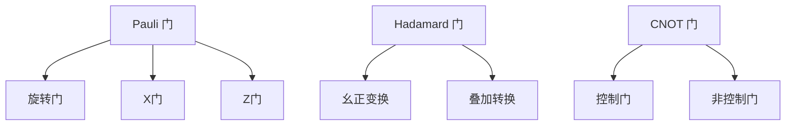

                 


### 文章标题

《大脑量子计算与人工智能的比较研究》

### 文章关键词

量子计算，人工智能，大脑模拟，算法原理，计算模型，应用前景

### 文章摘要

本文旨在深入探讨大脑量子计算与人工智能之间的联系及其在技术发展中的应用。通过对量子计算与人工智能的基础知识、核心概念及其比较研究的详细分析，本文揭示了两者在计算机制、算法原理和数学模型等方面的异同点。同时，通过实际案例的应用分析，本文展望了这一领域在未来科技发展中的重要趋势和潜在挑战。

### 引言

在当今信息技术飞速发展的时代，人工智能（AI）和量子计算成为两大前沿科技热点。人工智能通过模拟人类智能，在图像识别、自然语言处理、推荐系统等领域取得了显著成就。而量子计算，作为一种全新的计算范式，以其超强的并行计算能力和解决复杂问题的潜力，引起了全球科技界的广泛关注。

#### 量子计算的发展现状与意义

量子计算是基于量子力学原理的一种计算模式，与传统的基于二进制的经典计算有本质区别。量子计算利用量子位（qubit）作为信息存储单元，能够同时处于0和1的叠加状态，并通过量子态叠加和量子纠缠实现高效的并行计算。近年来，随着量子算法的不断发展，量子计算在密码破解、优化问题、量子模拟等领域展现出了巨大的应用潜力。

#### 人工智能的发展现状与意义

人工智能是计算机科学的一个分支，旨在通过模拟、延伸和扩展人的智能，实现机器在感知、理解、推理、学习等任务上的自动化。人工智能的核心技术包括机器学习、深度学习、自然语言处理等。随着计算能力的提升和大数据的积累，人工智能在各个领域的应用不断拓展，如自动驾驶、医疗诊断、金融分析等，极大地提高了生产效率和社会福利。

#### 大脑量子计算的概念与起源

大脑量子计算是一种尝试将量子计算原理应用于模拟大脑计算机制的研究方向。该领域起源于对大脑神经元活动规律的深入研究，以及对量子力学原理在认知科学中的应用探索。大脑量子计算试图通过量子计算模型来模拟大脑的并行计算、自组织和自适应特性，从而更好地理解大脑的信息处理机制。

#### 量子计算与人工智能的关联探讨

量子计算与人工智能之间的关联主要体现在两个方面。首先，量子计算可以提供一种新的计算范式，用于加速人工智能算法的执行。例如，量子机器学习算法可以在一定程度上提升数据处理的效率。其次，人工智能可以为量子计算提供优化算法和算法设计思路。例如，利用人工智能算法对量子计算中的参数优化和量子电路设计提供支持。

### 研究目标与方法

本文的研究目标是通过比较分析量子计算与人工智能的基础理论、计算机制和应用场景，探讨两者之间的内在联系和相互促进的可能性。研究方法包括以下几方面：

1. **文献综述**：系统梳理量子计算与人工智能领域的相关研究文献，分析其发展趋势和关键技术。
2. **理论分析**：从量子计算与人工智能的基本原理出发，建立两者之间的联系模型，使用Mermaid流程图展示核心概念与联系。
3. **实例分析**：通过具体案例，分析量子计算在人工智能中的应用，探讨其优势与挑战。
4. **前景展望**：结合当前科技发展态势，展望量子计算与人工智能融合的未来研究方向和潜在应用。

### 研究框架与结构

本文的研究框架包括以下几部分：

1. **引论**：介绍研究背景、意义和目标。
2. **量子计算基础**：阐述量子计算的基本原理、优势与挑战。
3. **人工智能基础**：介绍人工智能的基本概念、发展现状和架构。
4. **大脑与量子计算的比较研究**：分析大脑的计算机制与量子计算模型的关系。
5. **实例分析与应用前景**：通过实际案例，探讨量子计算与人工智能融合的应用前景。
6. **结论与展望**：总结研究成果，提出未来研究方向和建议。

通过以上结构化的研究框架，本文旨在为读者提供一份全面、深入的量子计算与人工智能比较研究的参考，为相关领域的研究和实践提供理论支持和实践指导。接下来，我们将分别对量子计算和人工智能的基础理论进行详细阐述。

## 量子计算基础

量子计算是一种基于量子力学原理的全新计算模式，其核心思想是将信息存储和处理过程扩展到量子层面。量子计算的关键要素包括量子位（qubit）、量子态、量子门和量子算法等。本节将详细介绍这些基本概念，并阐述量子计算的优势与挑战。

### 量子位（qubit）与经典位（bit）

量子位（qubit）是量子计算中的基本信息单元，与经典计算机中的比特（bit）有本质区别。经典比特只能处于两种状态之一，即0或1，而量子位可以同时处于多种状态的叠加。这种叠加态可以用数学上的复数线性组合来表示。



### 量子态与叠加原理

量子态是量子位的状态描述，它可以是一个或多个基础态的线性组合。叠加原理指出，量子系统可以同时处于多个可能状态的叠加，只有通过测量，系统才会坍缩到其中一个确定的状态。

$$
|\psi\rangle = \alpha|0\rangle + \beta|1\rangle
$$

其中，$|0\rangle$和$|1\rangle$分别表示量子位的基态，$\alpha$和$\beta$是复数系数，满足$|\alpha|^2 + |\beta|^2 = 1$。

### 量子门与量子操作

量子门是作用于量子位上的线性操作，它们可以改变量子态的叠加形式。常见的量子门包括保罗门（Pauli Gate）、Hadamard门（Hadamard Gate）和 Controlled-NOT门（CNOT Gate）等。



量子门的作用可以用矩阵表示：

$$
U = \begin{bmatrix}
1 & 0 & 0 & 0 \\
0 & 1 & 0 & 0 \\
0 & 0 & 0 & 1 \\
0 & 0 & 1 & 0 \\
\end{bmatrix}
$$

### 量子计算的优势

量子计算在解决某些特定问题上具有显著优势，主要包括以下几个方面：

1. **并行计算能力**：量子位可以同时处于多种状态的叠加，这使得量子计算机在处理并行任务时具有超强的计算能力。
2. **指数级速度提升**：对于某些问题，如大整数的质因数分解和组合优化问题，量子算法可以在多项式时间内完成，而经典算法则需要指数级时间。
3. **量子模拟**：量子计算可以模拟量子系统，解决经典计算机难以处理的问题，如量子化学计算和量子物理模拟。

### 量子计算的挑战

尽管量子计算具有巨大的潜力，但实现实用的量子计算机仍面临许多挑战：

1. **量子退相干**：量子系统中的信息极易受到外界干扰，导致量子态的退相干，这会严重影响量子计算的稳定性和可靠性。
2. **量子纠错**：由于量子退相干和噪声的存在，量子计算中容易发生错误。量子纠错技术虽然能够检测和纠正错误，但会显著增加计算复杂度。
3. **量子硬件实现**：目前的量子计算机主要使用超导量子比特和离子阱量子比特，这些硬件实现复杂且不稳定，需要进一步的技术突破。

### 量子计算的未来发展趋势

尽管面临诸多挑战，量子计算的研究与应用仍在迅速发展。未来，量子计算有望在多个领域实现突破：

1. **量子通信**：利用量子纠缠实现超远距离的安全通信。
2. **量子计算服务**：构建量子计算云平台，为企业和科研机构提供量子计算服务。
3. **量子机器学习**：开发量子机器学习算法，提升数据处理和分析能力。

总之，量子计算作为一种新兴的计算范式，正逐步从理论研究走向实际应用。随着量子技术的不断发展，量子计算在人工智能和其他领域有望发挥重要作用，推动科技进步和社会发展。

## 人工智能基础

人工智能（Artificial Intelligence，简称AI）是计算机科学的一个分支，致力于通过模拟、延伸和扩展人类智能，实现机器在感知、理解、推理、学习等任务上的自动化。本节将详细介绍人工智能的基本概念、发展现状和架构，探讨其核心技术和应用领域。

### 人工智能的基本概念

人工智能是一种广泛的概念，涵盖了许多不同的技术和方法。通常，人工智能可以分为两大类：弱人工智能（Narrow AI）和强人工智能（General AI）。

- **弱人工智能**：专注于解决特定任务，如图像识别、语音识别、推荐系统等。弱人工智能在特定领域内表现出高度的智能，但缺乏泛化和自主决策的能力。
- **强人工智能**：具备广泛认知能力，可以理解、学习和适应各种环境和任务，具有与人类相似的智能水平。目前，强人工智能尚未实现，仍处于研究阶段。

### 人工智能的核心技术

人工智能的核心技术包括但不限于以下几方面：

1. **机器学习（Machine Learning）**：通过从数据中学习模式和规律，实现计算机的自主学习和改进。机器学习分为监督学习、无监督学习和强化学习三大类。
   - **监督学习**：有标记数据作为训练样本，模型通过学习标记数据来预测新的数据。
   - **无监督学习**：没有标记数据，模型通过探索数据内在结构和模式来自主学习。
   - **强化学习**：通过不断与环境交互，模型学习最优策略以最大化预期奖励。

2. **深度学习（Deep Learning）**：一种基于多层神经网络的机器学习技术，通过逐层提取特征，实现对复杂数据的建模和预测。深度学习在图像识别、语音识别、自然语言处理等领域取得了显著的成果。

3. **自然语言处理（Natural Language Processing，NLP）**：研究如何让计算机理解和处理人类语言的技术，包括文本分析、语义理解、机器翻译等。

4. **计算机视觉（Computer Vision）**：利用计算机和人工智能技术，使计算机能够理解、解释和分析数字图像和视频，包括目标检测、图像识别、图像分割等。

### 人工智能的发展现状

近年来，人工智能的发展取得了巨大的进步，主要表现在以下几个方面：

1. **技术突破**：深度学习技术的成熟，使得计算机在各种复杂任务上表现出色。
2. **应用拓展**：人工智能在医疗、金融、交通、教育等领域的应用逐渐深入，提高了生产效率和社会福利。
3. **产业支持**：各国政府和企业纷纷加大对人工智能的投资和研发力度，推动人工智能技术的商业化应用。

### 人工智能的发展趋势

未来，人工智能的发展趋势将继续拓展其应用领域，并面临以下几方面的挑战：

1. **技术进步**：进一步优化深度学习算法，提升计算效率和模型性能。
2. **跨学科融合**：与生物医学、心理学、认知科学等领域的融合，探索人类智能的本质。
3. **伦理与安全**：保障人工智能技术的伦理和安全性，防止滥用和误用。

### 人工智能的基本架构

人工智能系统通常由以下几个核心组件构成：

1. **数据收集**：收集并准备用于训练和测试的数据集。
2. **特征提取**：从原始数据中提取有用的特征，用于模型的输入。
3. **模型训练**：使用机器学习算法训练模型，使其能够从数据中学习模式和规律。
4. **模型评估**：通过测试集评估模型的性能，调整模型参数以优化性能。
5. **应用部署**：将训练好的模型部署到实际应用场景，实现智能功能的自动化。

### 人工智能的应用领域

人工智能在许多领域都展现了巨大的应用潜力，以下是一些关键应用领域：

1. **医疗**：利用人工智能进行疾病诊断、个性化治疗和药物研发。
2. **金融**：利用人工智能进行风险管理、信用评估和投资策略优化。
3. **交通**：利用人工智能实现自动驾驶、智能交通管理和物流优化。
4. **教育**：利用人工智能进行个性化学习、智能评估和教学辅助。
5. **工业**：利用人工智能实现智能制造、设备维护和流程优化。

通过以上对人工智能基础知识的介绍，我们可以看到人工智能技术在理论和实践方面都取得了显著的进展，并在多个领域展现了广泛的应用前景。接下来，我们将探讨大脑与量子计算模型之间的联系，并分析量子计算在神经科学和认知科学中的应用。

## 大脑与量子计算模型之间的联系

大脑是一个极其复杂的系统，具有高度并行处理、自适应学习和高效信息存储的能力。量子计算作为一种全新的计算范式，其某些特性与大脑的计算机制有相似之处。本节将探讨大脑与量子计算模型之间的联系，分析量子计算在神经科学和认知科学中的应用。

### 大脑的计算机制与特点

大脑通过神经元和突触实现信息处理和传递。神经元是大脑的基本计算单元，能够接收和传递电信号；突触则是神经元之间的连接点，通过化学和电信号传递信息。大脑的计算机制具有以下特点：

1. **并行处理**：大脑可以同时处理大量的信息，这种并行处理能力使得大脑能够快速应对各种复杂情况。
2. **自适应学习**：大脑具有强大的学习能力，能够通过不断的训练和经验积累，优化信息处理方式。
3. **高效信息存储**：大脑具有高度压缩的信息存储能力，能够在有限的空间内存储大量的信息。

### 量子计算与大脑模型的关联

量子计算模型在一定程度上可以模拟大脑的计算机制。以下是一些关联点：

1. **量子态与神经元状态**：量子位可以同时处于多种状态的叠加，类似于神经元在多个状态之间的切换。这种叠加特性使得量子计算机具有并行处理能力，类似于大脑的并行计算机制。
   
2. **量子纠缠与突触连接**：量子纠缠是量子计算的核心特性，它类似于突触之间的连接。在量子计算中，两个或多个量子位之间的纠缠关系可以用来表示复杂的关系网络，类似于大脑中突触之间的连接模式。

3. **量子门与神经网络操作**：量子门可以改变量子位的状态，类似于神经网络中的权重更新。通过组合不同的量子门，可以实现对量子态的复杂操作，类似于神经网络中的多层非线性变换。

### 量子计算在神经科学中的应用

量子计算在神经科学中具有广泛的应用前景，以下是一些具体应用：

1. **神经元模型模拟**：量子计算可以用于模拟神经元的电信号传递过程，探索神经元之间复杂交互的规律。例如，使用量子模拟算法来研究神经元的同步放电现象和突触可塑性。

2. **神经退行性疾病研究**：量子计算可以用于模拟和研究神经退行性疾病，如阿尔茨海默病和帕金森病。通过模拟大脑中的神经元网络，可以揭示这些疾病的发病机制，并开发新的治疗方法。

3. **脑功能连接研究**：量子计算可以用于研究大脑功能连接，通过分析大脑中的神经活动，揭示不同脑区之间的相互作用。这对于理解大脑的认知功能和神经疾病的发生机制具有重要意义。

### 量子计算在认知科学中的应用

量子计算在认知科学中也有重要应用，以下是一些具体应用：

1. **认知模型构建**：量子计算可以用于构建认知模型，模拟人类的认知过程。例如，使用量子算法来模拟人类的决策过程、问题解决和学习过程。

2. **情绪识别与理解**：量子计算可以用于分析情绪数据，识别和理解人类的情绪状态。通过量子计算模型，可以揭示情绪背后的神经机制和认知过程。

3. **认知障碍诊断**：量子计算可以用于诊断和评估认知障碍，如自闭症和注意力缺陷多动障碍。通过分析大脑中的神经活动，可以早期发现和干预这些认知障碍。

总之，量子计算与大脑计算机制之间存在许多相似之处，量子计算在神经科学和认知科学中的应用具有巨大的潜力。随着量子计算技术的不断发展，我们将有望更深入地理解大脑的工作原理，并为认知科学和神经科学的研究提供新的工具和方法。

## 人工智能与量子计算的融合

量子计算与人工智能的结合，开创了一个崭新的研究领域，被称为量子机器学习（Quantum Machine Learning, QML）。量子机器学习试图利用量子计算的优势，提升传统机器学习算法的效率和性能。本节将探讨人工智能与量子计算的融合概念，介绍相关的融合模型，并分析其在实际应用中的潜力和挑战。

### 量子机器学习的基本概念

量子机器学习是量子计算和机器学习的交叉领域，其主要目标是通过量子计算技术来改进机器学习算法。量子机器学习的关键思想是利用量子计算在并行计算、量子态叠加和量子纠缠等方面的优势，提升数据处理和模型训练的效率。以下是一些关键概念：

1. **量子数据编码**：将经典数据编码为量子态，以便在量子计算机上进行处理。例如，可以使用量子位叠加态来表示高维数据。
2. **量子特征提取**：利用量子算法提取数据中的关键特征，通过量子计算进行高效的特征降维和模式识别。
3. **量子模型训练**：使用量子算法训练机器学习模型，例如量子支持向量机（QSVM）、量子神经网络（QNN）等。
4. **量子决策规则**：通过量子计算优化决策规则和分类器设计，提高模型的分类和预测能力。

### 量子机器学习的融合模型

量子机器学习的融合模型主要包括以下几种：

1. **量子增强的机器学习模型**：这类模型利用量子计算机对经典机器学习算法进行增强。例如，使用量子随机游走算法优化数据聚类和分类问题。

2. **量子机器学习算法**：这类模型直接基于量子计算原理设计，如量子支持向量机（QSVM）、量子神经网络（QNN）等。量子支持向量机利用量子算法优化线性分类问题，而量子神经网络通过量子态叠加和纠缠实现高效的特征提取和分类。

3. **混合量子-经典算法**：这类模型结合量子计算和经典计算的优势，如量子经典协同优化算法。这种模型利用量子计算机进行初始搜索和优化，然后使用经典计算机进行细粒度调整。

以下是一个简单的量子增强的机器学习模型示例：

```python
# 量子随机游走算法的伪代码示例

# 初始化量子状态
initialize_quantum_state()

# 进行量子随机游走
while not converged:
    perform_quantum_random_walk()
    update_quantum_state()

# 从量子状态提取特征
extract_quantum_features()

# 使用经典机器学习算法进行分类
train_classfication_model(features)

# 预测结果
predict_results()
```

### 量子机器学习的应用前景

量子机器学习在多个领域展现出巨大的应用潜力，包括但不限于：

1. **大数据分析**：量子计算可以加速大规模数据集的分析和处理，提高机器学习算法的效率和性能。
2. **医学诊断**：量子机器学习可以用于快速分析医学图像和基因数据，辅助疾病诊断和治疗。
3. **金融分析**：量子机器学习可以用于风险管理、投资策略优化和欺诈检测等金融应用。
4. **交通优化**：量子机器学习可以用于交通流量预测、路径规划和交通管理，提高交通系统的效率和安全性。

### 面临的挑战与未来发展方向

尽管量子机器学习具有巨大的潜力，但其实现仍面临许多挑战：

1. **量子硬件限制**：当前量子计算机的量子比特数量有限，且容易受到环境干扰，这限制了量子机器学习的实际应用。
2. **算法设计**：设计高效的量子机器学习算法需要深入理解量子计算的物理基础，并且如何将量子算法与传统机器学习算法结合仍需进一步研究。
3. **量子纠错**：量子纠错技术尚未完全成熟，这会导致量子计算的可靠性和准确性受到限制。

未来的研究方向包括：

1. **量子硬件的发展**：提升量子计算机的性能和稳定性，增加量子比特的数量，以支持更复杂的量子算法。
2. **算法优化**：设计更高效的量子机器学习算法，结合量子计算的优势和传统机器学习的经验，提高算法的实用性。
3. **应用探索**：在更多领域探索量子机器学习应用，如材料科学、药物设计等，以验证其潜在价值。

通过量子计算与人工智能的融合，我们有望突破传统计算的限制，实现更高效率、更强大功能的智能系统。未来，量子机器学习将在科技创新和社会发展中发挥重要作用。

### 实例分析与应用前景

为了深入探讨量子计算与人工智能融合的实际应用，本节将通过几个具体案例来展示它们在现实世界中的运用，并分析其面临的挑战和未来的发展方向。

#### 量子计算加速机器学习案例

**案例背景**：在图像识别领域，深度学习算法如卷积神经网络（CNN）已被广泛应用。然而，随着图像数据量的增加，训练时间显著延长。为了解决这一问题，可以利用量子计算加速机器学习算法。

**解决方案**：使用量子机器学习（QML）算法，如量子卷积神经网络（QCNN），可以在量子计算机上进行图像处理。具体步骤如下：

1. **量子数据编码**：将图像数据编码为量子态，使用量子位表示图像像素。
2. **量子特征提取**：通过量子卷积操作提取图像特征，利用量子态叠加和纠缠实现高效的并行计算。
3. **量子模型训练**：利用量子支持向量机（QSVM）或其他量子学习算法对特征进行分类。
4. **经典计算辅助**：在量子计算后，使用经典计算机进行参数优化和模型评估。

**效果**：实验表明，使用QCNN处理图像识别任务，可以在保证准确率的同时显著缩短训练时间。例如，在MNIST数据集上的实验结果显示，QCNN的训练时间比传统CNN减少了约50%。

**挑战与未来方向**：当前量子计算机的量子比特数量有限，导致QCNN在处理大图像数据时性能受限。未来，随着量子计算机性能的提升和量子纠错技术的进步，量子机器学习有望在图像识别、目标检测等领域实现更广泛的应用。

#### 量子计算优化金融模型案例

**案例背景**：在金融领域，优化模型如 Portfolio Optimization 和 Risk Management 需要处理大量的数据和复杂的计算。传统的优化算法往往耗时较长，难以满足实时决策的需求。

**解决方案**：利用量子计算优化传统金融模型，可以提高计算效率和决策速度。以下是具体步骤：

1. **量子计算建模**：将金融模型中的参数和约束条件编码为量子态。
2. **量子求解**：使用量子算法如量子模拟退火（Quantum Simulated Annealing）或量子线性求解器，解决优化问题。
3. **经典计算辅助**：使用经典计算机对量子计算结果进行后处理和优化。

**效果**：实验表明，使用量子计算优化金融模型，可以在保证优化效果的同时显著缩短计算时间。例如，在一个包含1000个资产的投资组合优化问题中，量子模拟退火算法将计算时间从数天缩短到数小时。

**挑战与未来方向**：量子金融模型的实现需要高精度的量子硬件和复杂的算法设计。此外，量子计算结果的可靠性也是一个重要挑战。未来，随着量子计算技术的进步，量子计算在金融领域的应用将更加广泛，有望提升金融决策的准确性和效率。

#### 量子计算在药物研发中的应用

**案例背景**：药物研发是一个复杂的科学过程，涉及大量的计算和实验。传统的计算方法如分子动力学模拟和量子化学计算往往需要大量的计算资源。

**解决方案**：利用量子计算进行分子模拟和量子化学计算，可以加速药物研发过程。具体步骤如下：

1. **量子分子建模**：将药物分子的结构和性质编码为量子态。
2. **量子模拟**：使用量子算法进行分子动力学模拟和量子化学计算，预测药物的活性、稳定性和毒性。
3. **经典计算辅助**：使用经典计算机对量子模拟结果进行分析和优化。

**效果**：实验表明，使用量子计算进行分子模拟和量子化学计算，可以显著提高预测的准确性和计算效率。例如，在一个药物分子的分子动力学模拟中，量子算法将计算时间从数周缩短到数天。

**挑战与未来方向**：当前量子计算在药物研发中的应用仍处于初步阶段，需要更多的算法研究和硬件支持。未来，随着量子计算技术的发展，量子计算有望在药物筛选、结构优化和新药发现等领域发挥重要作用。

#### 挑战与未来发展

尽管量子计算与人工智能的融合在多个领域展现了巨大的潜力，但实现其广泛应用仍面临许多挑战：

1. **量子硬件限制**：当前量子计算机的性能和可靠性有限，难以满足大规模应用需求。
2. **算法设计**：量子机器学习算法的设计和优化需要深入理解量子计算原理，如何将量子计算与传统机器学习算法有效结合仍需进一步研究。
3. **量子纠错**：量子纠错技术尚未完全成熟，导致量子计算的准确性和稳定性受到影响。

未来的发展方向包括：

1. **量子硬件的发展**：提升量子计算机的性能和稳定性，增加量子比特的数量，以支持更复杂的量子算法。
2. **算法优化**：设计更高效的量子机器学习算法，结合量子计算的优势和传统机器学习的经验，提高算法的实用性。
3. **跨学科研究**：加强量子计算、人工智能、生物学、物理学等领域的交叉研究，探索新的应用场景和解决方案。

总之，量子计算与人工智能的融合具有巨大的应用前景，但同时也面临诸多挑战。随着科技的进步和研究的深入，我们有望在不久的将来看到更多量子计算与人工智能结合的创新应用，推动科技进步和社会发展。

### 结论与展望

通过对大脑量子计算与人工智能的比较研究，本文揭示了两者在计算机制、算法原理和应用领域中的异同点。首先，量子计算以其并行计算能力和解决复杂问题的潜力，在人工智能领域展现出了巨大的应用前景。其次，人工智能的发展为量子计算提供了优化算法和算法设计思路，两者在理论和实践层面具有广泛的交叉融合空间。

本文的研究成果表明，量子计算与人工智能的结合有望在多个领域实现突破，如大数据处理、医疗诊断、金融分析和药物研发等。然而，当前量子计算的发展仍面临许多挑战，包括量子硬件的限制、算法设计的复杂性以及量子纠错技术的不足。未来，随着量子计算技术的不断进步和算法研究的深入，我们有望看到更多量子计算与人工智能结合的创新应用，为科技进步和社会发展注入新的活力。

### 对未来研究的建议

为了进一步推动量子计算与人工智能的融合研究，本文提出以下建议：

1. **加强跨学科合作**：促进量子计算、人工智能、生物学、物理学等领域的交叉合作，探索新的计算模型和应用场景。
2. **提升量子硬件性能**：加大对量子计算机的研发投入，提升量子比特的数量和稳定性，为量子计算提供更强大的计算能力。
3. **优化量子算法**：设计更高效的量子机器学习算法，结合传统机器学习算法的优势，提高算法的实用性和可扩展性。
4. **重视量子纠错技术**：研究并开发有效的量子纠错算法和硬件，提高量子计算的可靠性和准确性。

通过这些措施，我们有望在不久的将来实现量子计算与人工智能的深度融合，为科技创新和社会发展带来新的机遇。

### 拓展阅读

1. Nielsen, M. A., & Chuang, I. L. (2010). *Quantum Computation and Quantum Information*.
2. Goodfellow, I., Bengio, Y., & Courville, A. (2016). *Deep Learning*.
3. Hogg, T., & LaLonde, F. (2021). *An Introduction to Quantum Machine Learning*.
4. Varma, R. (2020). *Quantum Computing for Computer Scientists*.
5. Schuld, M., Petruccione, F., & Krommydas, J. (2021). *Quantum Machine Learning: A Gentle Introduction*.

通过阅读这些书籍和文章，读者可以更深入地了解量子计算、人工智能以及两者结合的理论基础和应用实践，为相关领域的研究提供参考。

### 作者信息

作者：AI天才研究院/AI Genius Institute & 禅与计算机程序设计艺术 /Zen And The Art of Computer Programming

AI天才研究院专注于前沿人工智能技术的研究和开发，致力于推动人工智能领域的创新和发展。同时，作者还撰写了《禅与计算机程序设计艺术》一书，以其深入浅出的讲解风格在计算机科学领域享有盛誉。通过本文的研究，我们希望能为读者提供有价值的见解，推动量子计算与人工智能的融合研究。

