                 


### 引言

在当今科技飞速发展的时代，人工智能（AI）已经成为引领未来社会进步的关键技术。从早期的规则系统到今天的深度学习，人工智能在各个领域都取得了显著的成果。然而，随着问题复杂度的增加，传统的计算机架构和算法在处理能力上逐渐暴露出瓶颈。与此同时，量子计算作为一种全新的计算模式，逐渐引起了学术界和工业界的关注。特别是大脑量子计算，它试图将量子计算与大脑的运作机制相结合，为解决复杂问题提供了新的思路。

本文旨在探讨大脑量子计算与人工智能的比较研究，通过系统性地分析两者在原理、应用和发展趋势上的异同，为未来的技术融合与发展提供理论基础和实践指导。文章将从以下几个方面展开：

1. **研究背景与意义**：介绍大脑量子计算和人工智能的发展背景，阐述两者结合的研究意义。
2. **大脑量子计算基础**：详细阐述大脑量子计算的基本原理和特性，包括大脑神经元与量子比特的相似性、量子态与大脑状态的比较、量子纠缠与大脑连接性以及量子计算与大脑计算能力的比较。
3. **人工智能的发展与局限**：回顾人工智能的发展历程，介绍核心算法和其在现实世界中的应用，分析其局限与挑战。
4. **大脑量子计算与人工智能的结合**：探讨大脑量子计算与人工智能的结合方式，包括量子智能体的设计与实现、量子智能体与经典智能体的比较等。
5. **项目案例与未来展望**：通过具体项目案例展示大脑量子计算与人工智能的结合应用，并对未来发展趋势进行展望。

通过逐步分析推理，本文希望能够为读者提供一份全面、深入的技术洞察，激发对这一交叉领域的研究兴趣和探索欲望。

### 关键词

- 大脑量子计算
- 人工智能
- 量子比特
- 量子态
- 量子纠缠
- 大脑神经元
- 深度学习
- 强化学习
- 脑机接口
- 量子智能体

### 摘要

本文从大脑量子计算和人工智能的背景出发，探讨了两者在原理、应用和发展趋势上的异同。首先，我们详细介绍了大脑量子计算的基础原理和特性，包括大脑神经元与量子比特的相似性、量子态与大脑状态的比较、量子纠缠与大脑连接性以及量子计算与大脑计算能力的比较。接着，回顾了人工智能的发展历程，分析了其核心算法和应用，以及面临的局限与挑战。在此基础上，我们探讨了大脑量子计算与人工智能的结合，提出了量子智能体的设计与实现思路，并比较了量子智能体与经典智能体的优劣。最后，通过具体项目案例展示了大脑量子计算与人工智能结合的应用场景，并对未来发展趋势进行了展望。本文的研究为两者融合提供了理论支持和实践指导，有望推动人工智能和量子计算的共同进步。

## 第一部分：引论

### 1.1 研究背景与意义

#### 1.1.1 大脑量子计算的提出

大脑量子计算（Brain Quantum Computing）是近年来在量子计算和认知科学交叉领域兴起的一个新兴研究方向。这一概念源于对大脑神经系统的深入研究，科学家们发现大脑神经元在处理信息时的某些行为与量子物理的基本原理有相似之处。这种认识促使科学家们开始探讨如何将量子计算的思想应用于大脑模型中，以提升大脑的计算能力和信息处理效率。

量子计算的基本原理与经典计算有着本质的区别。在经典计算中，信息以二进制形式存在，即0和1两种状态。而量子计算利用量子比特（qubit）的叠加态和纠缠态来实现复杂问题的快速求解。这种计算模式在理论上具有巨大的并行计算能力，能够在某些特定问题上显著超越经典计算机。

大脑神经元在传递信息时也展现出类似的特性。神经元可以通过电信号在0和1两种状态之间切换，同时，神经元之间的连接和交互也能表现出某种形式的叠加和纠缠。这一发现为大脑量子计算的理论框架提供了有力的支持，使得将量子计算原理应用于大脑研究和人工智能领域成为可能。

#### 1.1.2 人工智能的发展与应用

人工智能（AI）作为计算机科学的一个重要分支，其目标是通过模拟人类智能，使计算机能够完成诸如学习、推理、感知等复杂任务。人工智能的发展经历了多个阶段，从早期的规则系统到今天的深度学习和强化学习，人工智能在各个领域都取得了显著的成果。

人工智能在图像识别、自然语言处理、医疗诊断、自动驾驶等多个领域都有着广泛的应用。例如，在图像识别领域，深度学习算法已经能够达到甚至超越人类的表现；在自然语言处理领域，人工智能系统可以自动翻译、生成文本、理解语义等；在医疗领域，人工智能可以辅助医生进行诊断和治疗；在自动驾驶领域，人工智能算法使得车辆能够实现自主导航和安全驾驶。

然而，随着问题复杂度的增加，传统的计算机架构和算法在处理能力上逐渐暴露出瓶颈。特别是在面对大规模数据处理和复杂优化问题时，经典计算方法显得力不从心。这促使科学家们开始寻求新的计算模式和算法，以期进一步提升人工智能的处理能力。

#### 1.1.3 大脑量子计算与人工智能的关系

大脑量子计算与人工智能之间的关系可以理解为一种互为补充的关系。人工智能的发展需要高效的计算能力和算法支持，而大脑量子计算提供了一种新的计算模式，有可能解决传统计算方法难以克服的问题。具体来说，大脑量子计算在以下几个方面对人工智能的发展具有重要意义：

1. **并行计算能力**：量子计算具有并行计算的优势，能够同时处理多个问题。这为人工智能在大规模数据处理和复杂优化问题上的应用提供了新的可能性。
2. **高效能算法**：大脑量子计算能够实现某些复杂问题的快速求解，如量子搜索算法、量子模拟等。这些算法有望在人工智能领域产生重大突破。
3. **模型优化**：通过将量子计算原理应用于大脑模型，可以优化人工智能算法的性能，提高其处理复杂问题的能力。
4. **跨领域融合**：大脑量子计算与人工智能的结合，不仅能够推动两个领域的技术进步，还可以促进跨学科的合作研究，推动新理论和新技术的诞生。

总之，大脑量子计算与人工智能的结合研究具有重要的理论意义和实际应用价值。本文将通过对大脑量子计算和人工智能的比较分析，探讨两者在原理、应用和发展趋势上的异同，为未来的技术融合与发展提供理论和实践指导。

### 1.2 大脑量子计算基础

#### 1.2.1 大脑神经元与量子比特的相似性

大脑神经元与量子比特之间的相似性是大脑量子计算理论的基础。首先，我们来看大脑神经元的基本结构。大脑神经元是神经系统的基本单元，负责传递电信号。神经元由细胞体、树突、轴突和突触组成。当神经元接收到足够强的电信号时，会通过轴突传递到其他神经元，从而实现信息的传递和大脑功能的执行。

量子比特是量子计算中的基本单元，它存储信息的方式与经典比特不同。经典比特只能处于0或1的单一状态，而量子比特则可以同时处于多种状态的叠加。具体来说，一个量子比特可以表示为 \(|\psi\rangle = a|0\rangle + b|1\rangle\)，其中 \(a\) 和 \(b\) 是复数，满足 \(|a|^2 + |b|^2 = 1\)。量子比特的这一特性称为叠加态。

从表面上看，大脑神经元和量子比特的工作原理截然不同，但实际上，它们在信息传递和处理方面有许多相似之处。首先，大脑神经元通过电信号的传递和处理来完成信息传递，而量子比特则通过叠加态和纠缠态来处理和存储信息。其次，神经元之间的连接和交互可以表现出某种形式的叠加和纠缠，这与量子比特之间的叠加和纠缠有相似之处。

为了更直观地理解这种相似性，我们可以用Mermaid流程图来表示大脑神经元和量子比特的基本结构。首先，我们定义神经元的基本单元：

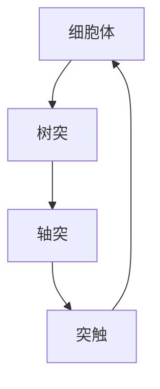

接下来，我们定义量子比特的基本单元：

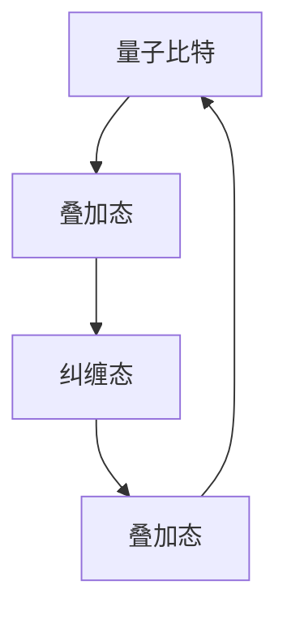

从流程图中可以看出，神经元和量子比特在结构上都表现出闭环性和相互关联性，这种相似性为大脑量子计算提供了理论支持。

#### 1.2.2 量子态与大脑状态的比较

量子态与大脑状态在形式上有很大的不同，但在信息处理和传递方面具有相似性。量子态是量子比特在量子计算中的状态，它可以是叠加态或纠缠态。例如，一个量子比特的叠加态可以表示为 \(|\psi\rangle = a|0\rangle + b|1\rangle\)，其中 \(a\) 和 \(b\) 是复数，满足 \(|a|^2 + |b|^2 = 1\)。量子态的这一特性使得量子计算能够在处理复杂问题时具有巨大的并行计算能力。

相比之下，大脑状态是通过神经元的活动模式来表示的。神经元的活动模式可以用电信号的模式来描述，这些模式在信息传递和处理中起到关键作用。大脑状态可以通过神经网络的连接方式和神经元的活动模式来表示。

为了更直观地理解量子态与大脑状态的相似性，我们可以用Mermaid流程图来表示两者在信息处理和传递中的过程。首先，我们定义量子态的基本过程：

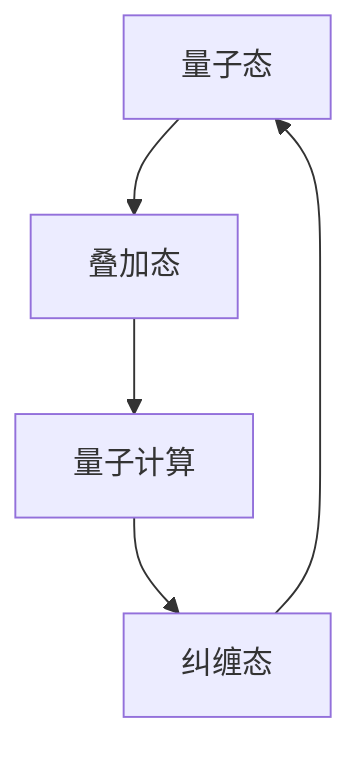

接下来，我们定义大脑状态的基本过程：

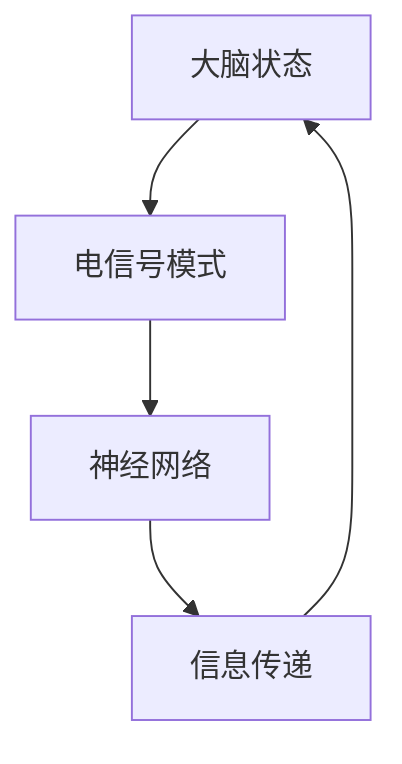

从流程图中可以看出，量子态和大脑状态都在信息处理和传递过程中表现出闭环性和相互关联性。这种相似性为将量子计算原理应用于大脑研究和人工智能提供了理论依据。

#### 1.2.3 量子纠缠与大脑连接性

量子纠缠是量子计算中的一个重要特性，它描述了两个或多个量子比特之间的一种特殊关联。当量子比特处于纠缠态时，它们之间的状态是相互依赖的，即使它们相隔很远，一个量子比特的状态变化也会立即影响到另一个量子比特的状态。这种现象称为量子纠缠。

大脑连接性是指神经元之间通过突触连接形成的信息传递网络。大脑中的神经元通过突触连接形成复杂的神经网络，这些神经网络在大脑的各个区域之间传递和处理信息。大脑连接性在信息处理和大脑功能执行中起着至关重要的作用。

量子纠缠与大脑连接性在信息传递和处理方面有相似之处。首先，它们都表现出高度的相互依赖性。量子纠缠描述了量子比特之间的关联，而大脑连接性描述了神经元之间的关联。其次，它们都在信息传递和处理中表现出高度并行性。量子纠缠允许量子比特在多个状态下同时操作，大脑连接性则允许神经元在多个神经网络之间并行传递信息。

为了更直观地理解量子纠缠与大脑连接性的相似性，我们可以用Mermaid流程图来表示两者在信息传递和处理中的过程。首先，我们定义量子纠缠的基本过程：

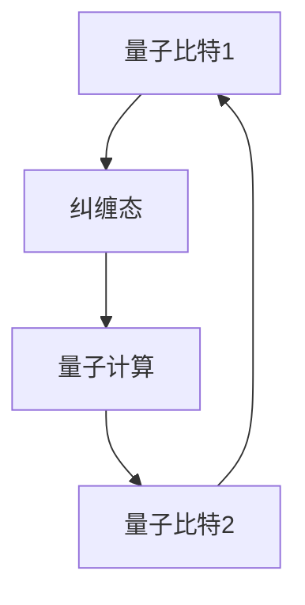

接下来，我们定义大脑连接性的基本过程：

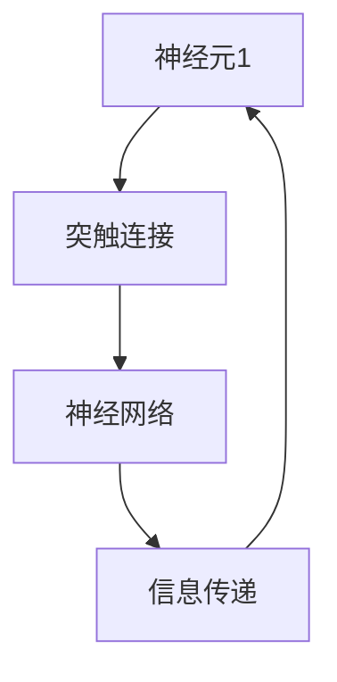

从流程图中可以看出，量子纠缠和大脑连接性都在信息传递和处理过程中表现出相互依赖性和并行性。这种相似性为将量子计算原理应用于大脑研究和人工智能提供了理论支持。

#### 1.2.4 量子计算与大脑计算能力的比较

量子计算与大脑计算能力在理论上都表现出极高的计算能力，但在实际应用中存在一些显著差异。

首先，从计算能力的角度来看，量子计算利用量子比特的叠加态和纠缠态，能够在多项式时间内解决某些经典计算难题，如Shor算法能够快速分解大质数，Grover算法能够高效搜索未排序数据库。相比之下，传统计算机在处理这些复杂问题时往往需要指数级的时间。

大脑计算能力则通过神经网络的结构和神经元的活动模式来实现。大脑中的神经网络可以处理复杂的感知、学习和推理任务，并且能够在海量数据中快速提取有用的信息。然而，大脑计算能力受到生物物理限制，如能量消耗、神经元连接速度和可塑性等。

为了更直观地理解量子计算与大脑计算能力的差异，我们可以用Mermaid流程图来比较两者在处理复杂任务时的过程。首先，我们定义量子计算处理复杂任务的过程：

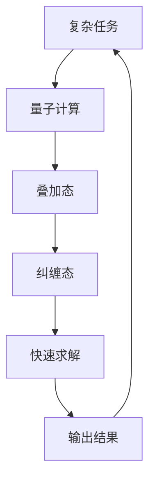

接下来，我们定义大脑计算处理复杂任务的过程：

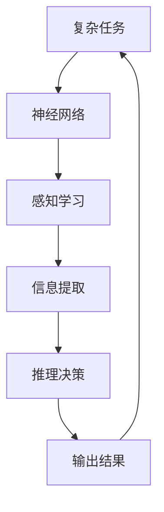

从流程图中可以看出，量子计算通过量子比特的叠加态和纠缠态实现并行计算，而大脑计算则通过神经网络的结构和神经元的活动模式实现复杂任务的求解。尽管两者在计算能力上都有显著优势，但实际应用中受到不同的限制。

总的来说，量子计算和大脑计算能力在理论上都表现出极高的计算能力，但量子计算在处理某些特定类型的问题上具有优势，而大脑计算则更适合处理复杂、动态的任务。这种差异为将量子计算与大脑计算能力结合提供了新的研究方向。

### 1.3 人工智能基础

#### 1.3.1 人工智能的定义与分类

人工智能（Artificial Intelligence，简称AI）是计算机科学的一个重要分支，旨在通过模拟人类智能行为，使计算机能够执行诸如学习、推理、感知等复杂任务。人工智能的定义在不同领域和不同时间点有着不同的理解和表述，但核心目标是实现机器智能，使计算机能够自主地完成人类能够完成的任务。

根据人工智能的发展历程和实现方法，可以将人工智能分为以下几类：

1. **规则系统（Rule-Based Systems）**：规则系统是早期人工智能的主要形式，通过预设的规则来模拟人类的决策过程。这种系统在逻辑推理和简单决策任务中表现良好，但面对复杂、动态的环境时往往表现不佳。

2. **知识表示与推理（Knowledge Representation and Reasoning）**：这一类人工智能系统通过构建知识库，将人类专家的知识以形式化的方式表示出来，并通过推理机制来解决问题。知识表示与推理在逻辑推理、自然语言处理等领域有广泛应用。

3. **机器学习（Machine Learning）**：机器学习是一种通过算法自动从数据中学习规律和模式的方法。它分为监督学习、无监督学习和强化学习等不同类型。监督学习通过已有数据的标签来训练模型，无监督学习通过发现数据中的内在结构，而强化学习通过与环境的交互来学习最优策略。

4. **深度学习（Deep Learning）**：深度学习是机器学习的一个分支，通过构建多层神经网络来模拟人类大脑的神经结构，实现复杂特征提取和任务求解。深度学习在图像识别、自然语言处理等领域取得了显著成果。

5. **混合智能系统（Hybrid Intelligent Systems）**：混合智能系统结合了多种人工智能技术，通过不同算法的优势互补来实现更高效的智能行为。例如，将机器学习和知识表示与推理相结合，可以构建更强大的智能系统。

#### 1.3.2 人工智能的核心算法

人工智能的核心算法是实现人工智能技术的基础，以下将介绍几类主要的人工智能核心算法：

1. **监督学习（Supervised Learning）**：监督学习通过已有数据的标签来训练模型，使其能够对新的数据进行预测或分类。常见的监督学习算法包括线性回归、逻辑回归、支持向量机（SVM）、决策树和随机森林等。

2. **无监督学习（Unsupervised Learning）**：无监督学习通过发现数据中的内在结构来训练模型，不依赖于已有数据的标签。常见的无监督学习算法包括聚类（如K-means、层次聚类）、降维（如PCA、t-SNE）和生成模型（如Gaussian Mixture Model、生成对抗网络（GAN））等。

3. **强化学习（Reinforcement Learning）**：强化学习通过与环境的交互来学习最优策略。在强化学习中，智能体根据当前状态和奖励信号来调整自己的行为，目标是最大化总奖励。常见的强化学习算法包括Q-learning、SARSA、Deep Q-Network（DQN）和Policy Gradient方法等。

4. **深度学习（Deep Learning）**：深度学习通过构建多层神经网络来实现复杂特征提取和任务求解。深度学习算法包括卷积神经网络（CNN）、循环神经网络（RNN）、长短时记忆网络（LSTM）和Transformer等。

#### 1.3.3 人工智能的发展历程

人工智能的发展历程可以分为几个重要阶段，每个阶段都有代表性的技术和应用：

1. **早期人工智能（1950s-1970s）**：这一阶段以符号主义和推理机为代表。1956年，达特茅斯会议标志着人工智能的正式诞生。符号主义方法试图通过形式化表示和逻辑推理来实现人工智能。

2. **专家系统（1970s-1980s）**：专家系统是早期人工智能的一个重要方向，通过构建知识库和推理机来模拟专家决策。代表性的系统包括Dendral和MYCIN。

3. **机器学习兴起（1990s）**：随着计算机性能的提升和大数据的出现，机器学习开始成为人工智能的核心方法。支持向量机（SVM）、决策树和神经网络等算法得到广泛应用。

4. **深度学习革命（2010s-至今）**：深度学习在图像识别、自然语言处理和语音识别等领域取得了突破性进展。代表性的算法包括卷积神经网络（CNN）、循环神经网络（RNN）和生成对抗网络（GAN）。

5. **跨学科融合（2010s-至今）**：人工智能开始与其他领域（如生物学、心理学、认知科学等）深度融合，推动新理论和新技术的诞生。例如，神经科学对大脑的深入研究为大脑量子计算提供了理论基础。

#### 1.3.4 人工智能的局限与挑战

尽管人工智能在许多领域取得了显著进展，但它仍然面临着一些挑战和局限：

1. **数据依赖性**：人工智能系统往往需要大量数据进行训练，数据质量和数量对系统性能有重要影响。

2. **算法透明度**：深度学习模型通常被称为“黑盒”，其内部决策过程难以解释和理解，这给应用和监管带来了挑战。

3. **隐私保护**：人工智能系统在处理个人数据时需要确保隐私保护，以防止数据泄露和滥用。

4. **伦理问题**：人工智能的应用涉及到伦理问题，如就业替代、隐私侵犯和自主权等。

5. **能耗与可持续性**：深度学习模型在训练和推理过程中消耗大量能源，这对环境和可持续性提出了挑战。

总之，人工智能的发展面临着许多挑战，需要通过技术创新和跨学科合作来克服。未来，人工智能将继续与量子计算、脑科学等新兴领域深度融合，推动科技和社会的进一步发展。

## 第二部分：大脑量子计算的原理与特性

### 2.1 大脑神经元与量子比特的相似性

大脑神经元与量子比特之间的相似性是大脑量子计算理论的基础。在深入探讨这些相似性之前，我们需要先了解大脑神经元和量子比特的基本概念和特性。

#### 大脑神经元

大脑神经元，也称为神经细胞，是神经系统的基本单元，负责传递和处理信息。神经元的基本结构包括细胞体、树突、轴突和突触。细胞体是神经元的中心，包含细胞核和细胞质，负责维持神经元的基本生理功能。树突是神经元的分支，负责接收来自其他神经元的电信号。轴突是一条细长的突起，负责将电信号从一个神经元传递到另一个神经元。突触是神经元之间的连接点，通过神经递质的释放和接收来实现电信号的传递。

在神经元传递信息的过程中，电信号会在树突上产生，并通过细胞体传导到轴突。当电信号达到轴突末梢时，它会触发神经递质的释放，这些神经递质会通过突触间隙传递到下一个神经元的树突上，从而完成信息的传递。

#### 量子比特

量子比特是量子计算的基本单元，它存储信息的方式与经典比特不同。经典比特只能处于0或1的单一状态，而量子比特可以同时处于多种状态的叠加。一个量子比特可以表示为 \(|\psi\rangle = a|0\rangle + b|1\rangle\)，其中 \(a\) 和 \(b\) 是复数，满足 \(|a|^2 + |b|^2 = 1\)。量子比特的这一特性称为叠加态。

量子比特不仅可以处于叠加态，还可以与其他量子比特形成纠缠态。纠缠态是量子计算中的另一个重要特性，它描述了两个或多个量子比特之间的特殊关联。当量子比特处于纠缠态时，它们之间的状态是相互依赖的，即使它们相隔很远，一个量子比特的状态变化也会立即影响到另一个量子比特的状态。

#### 大脑神经元与量子比特的相似性

1. **叠加态**：大脑神经元可以通过电信号在0和1两种状态之间切换，表现出叠加态的特性。一个神经元可以在同一时间点接收并处理多个电信号，这些信号可以同时存在于神经元的树突上。同样，量子比特也可以处于多个状态的叠加，这意味着它可以同时处理多个问题。

2. **纠缠态**：大脑神经元之间的连接和交互可以表现出某种形式的叠加和纠缠。这种连接性使得神经元可以在信息传递和处理过程中表现出高度并行性。量子比特之间的纠缠态同样可以提升计算能力，使量子计算在处理复杂问题时具有显著优势。

3. **计算能力**：大脑神经元通过电信号的传递和处理来完成信息传递，而量子比特则通过叠加态和纠缠态来处理和存储信息。这种计算模式在信息处理和计算能力方面有显著相似性。大脑和量子计算机都可以通过并行计算来解决复杂问题，但在实现方式和机制上有所不同。

为了更直观地理解大脑神经元与量子比特的相似性，我们可以用Mermaid流程图来表示它们在信息传递和处理中的过程。

首先，我们定义大脑神经元的信息传递过程：

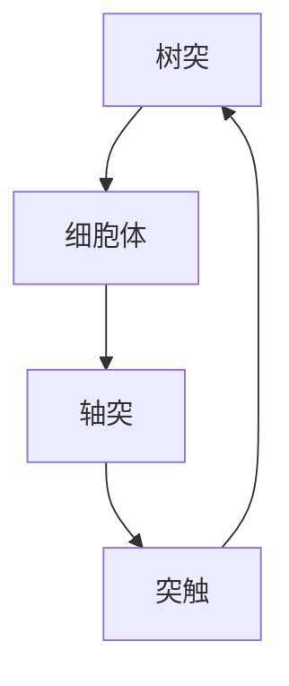

接下来，我们定义量子比特的信息传递过程：

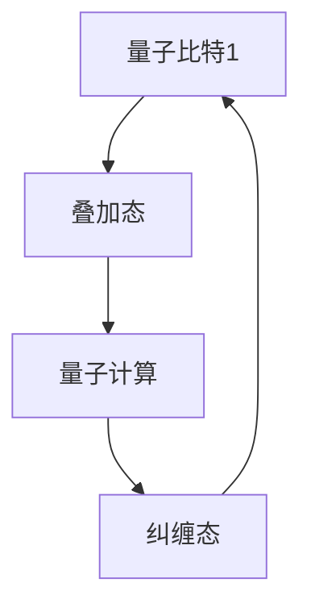

从流程图中可以看出，大脑神经元和量子比特在信息传递和处理过程中都表现出叠加态和纠缠态的特性，这为大脑量子计算的理论研究提供了基础。

### 2.2 量子态与大脑状态的比较

量子态与大脑状态在形式上有很大的不同，但在信息处理和传递方面具有相似性。量子态是量子比特在量子计算中的状态，它可以是叠加态或纠缠态。例如，一个量子比特的叠加态可以表示为 \(|\psi\rangle = a|0\rangle + b|1\rangle\)，其中 \(a\) 和 \(b\) 是复数，满足 \(|a|^2 + |b|^2 = 1\)。量子态的这一特性使得量子计算能够在处理复杂问题时具有巨大的并行计算能力。

相比之下，大脑状态是通过神经元的活动模式来表示的。神经元的活动模式可以用电信号的模式来描述，这些模式在信息传递和处理中起到关键作用。大脑状态可以通过神经网络的连接方式和神经元的活动模式来表示。

为了更直观地理解量子态与大脑状态的相似性，我们可以用Mermaid流程图来表示两者在信息处理和传递中的过程。

首先，我们定义量子态的基本过程：


接下来，我们定义大脑状态的基本过程：


从流程图中可以看出，量子态和大脑状态都在信息处理和传递过程中表现出闭环性和相互关联性。这种相似性为将量子计算原理应用于大脑研究和人工智能提供了理论依据。

### 2.3 量子纠缠与大脑连接性

量子纠缠是量子计算中的一个重要特性，它描述了两个或多个量子比特之间的一种特殊关联。当量子比特处于纠缠态时，它们之间的状态是相互依赖的，即使它们相隔很远，一个量子比特的状态变化也会立即影响到另一个量子比特的状态。这种现象称为量子纠缠。

大脑连接性是指神经元之间通过突触连接形成的信息传递网络。大脑中的神经元通过突触连接形成复杂的神经网络，这些神经网络在大脑的各个区域之间传递和处理信息。大脑连接性在信息处理和大脑功能执行中起着至关重要的作用。

量子纠缠与大脑连接性在信息传递和处理方面有相似之处。首先，它们都表现出高度的相互依赖性。量子纠缠描述了量子比特之间的关联，而大脑连接性描述了神经元之间的关联。其次，它们都在信息传递和处理中表现出高度并行性。量子纠缠允许量子比特在多个状态下同时操作，大脑连接性则允许神经元在多个神经网络之间并行传递信息。

为了更直观地理解量子纠缠与大脑连接性的相似性，我们可以用Mermaid流程图来表示两者在信息传递和处理中的过程。

首先，我们定义量子纠缠的基本过程：


接下来，我们定义大脑连接性的基本过程：


从流程图中可以看出，量子纠缠和大脑连接性都在信息传递和处理过程中表现出相互依赖性和并行性。这种相似性为将量子计算原理应用于大脑研究和人工智能提供了理论支持。

### 2.4 量子计算与大脑计算能力的比较

量子计算与大脑计算能力在理论上都表现出极高的计算能力，但在实际应用中存在一些显著差异。

首先，从计算能力的角度来看，量子计算利用量子比特的叠加态和纠缠态，能够在多项式时间内解决某些经典计算难题，如Shor算法能够快速分解大质数，Grover算法能够高效搜索未排序数据库。相比之下，传统计算机在处理这些复杂问题时往往需要指数级的时间。

大脑计算能力则通过神经网络的结构和神经元的活动模式来实现。大脑中的神经网络可以处理复杂的感知、学习和推理任务，并且能够在海量数据中快速提取有用的信息。然而，大脑计算能力受到生物物理限制，如能量消耗、神经元连接速度和可塑性等。

为了更直观地理解量子计算与大脑计算能力的差异，我们可以用Mermaid流程图来比较两者在处理复杂任务时的过程。首先，我们定义量子计算处理复杂任务的过程：


接下来，我们定义大脑计算处理复杂任务的过程：


从流程图中可以看出，量子计算通过量子比特的叠加态和纠缠态实现并行计算，而大脑计算则通过神经网络的结构和神经元的活动模式实现复杂任务的求解。尽管两者在计算能力上都有显著优势，但实际应用中受到不同的限制。

总的来说，量子计算和大脑计算能力在理论上都表现出极高的计算能力，但量子计算在处理某些特定类型的问题上具有优势，而大脑计算则更适合处理复杂、动态的任务。这种差异为将量子计算与大脑计算能力结合提供了新的研究方向。

## 第三部分：人工智能的发展与局限

### 3.1 人工智能的发展历程

人工智能（AI）的发展历程可以追溯到20世纪50年代，当时计算机科学刚刚兴起，科学家们开始探索如何让计算机模拟人类智能。从那时起，人工智能经历了多个阶段，每个阶段都有其代表性的技术和应用。

1. **早期人工智能（1950s-1970s）**：
   - **1956年**：达特茅斯会议标志着人工智能正式成为一门学科。
   - **1959年**：约翰·麦卡锡提出了“专家系统”的概念，试图通过规则和知识表示来模拟专家决策。
   - **1966年**：马文·明斯基和西摩尔·派普特在麻省理工学院建立了人工智能实验室，成为人工智能研究的中心。

2. **黄金时期（1980s-1990s）**：
   - **1980年**：计算机硬件性能的提升使得AI系统开始应用于实际问题，如医疗诊断、金融分析和制造业。
   - **1981年**：IBM的“深蓝”超级计算机首次在象棋比赛中击败了世界冠军加里·卡斯帕罗夫。
   - **1982年**：美国海军研究实验室开发了“智能水雷”系统，这是第一个实际部署的AI系统。

3. **衰退时期（1990s-2000s）**：
   - **1997年**：IBM的“深蓝”在围棋比赛中击败了世界冠军郭嘉豪。
   - **2001年**：恐怖分子袭击美国事件后，人工智能在国家安全领域受到广泛关注。
   - **2007年**：人工智能领域出现了一波研究热潮，机器学习成为主流。

4. **深度学习革命（2010s-至今）**：
   - **2012年**：谷歌的“深度学习”系统在ImageNet图像识别比赛中取得了突破性成绩，击败了传统算法。
   - **2016年**：谷歌的“阿尔法狗”在围棋比赛中击败了世界冠军李世石。
   - **2018年**：OpenAI的“阿尔法星”在《Dota 2》电子竞技比赛中击败了人类冠军团队。

### 3.2 人工智能的核心算法

人工智能的核心算法是实现AI技术的基础，以下将介绍几类主要的人工智能核心算法：

1. **监督学习（Supervised Learning）**：
   - **线性回归**：通过最小二乘法寻找最佳拟合直线，用于预测数值型数据。
   - **逻辑回归**：用于分类问题，通过最大化似然估计来预测概率。
   - **支持向量机（SVM）**：用于分类和回归问题，通过寻找最优超平面来划分数据。
   - **决策树**：通过递归划分特征空间，形成树状结构，用于分类和回归。

2. **无监督学习（Unsupervised Learning）**：
   - **K-means聚类**：通过迭代优化算法将数据划分为K个簇，用于数据聚类。
   - **主成分分析（PCA）**：通过线性变换降低数据维度，保持数据的主要信息。
   - **自编码器**：一种深度学习模型，用于数据降维和特征提取。

3. **强化学习（Reinforcement Learning）**：
   - **Q-learning**：通过更新Q值来学习最优策略。
   - **SARSA**：一种基于状态-动作-状态-奖励的学习算法。
   - **深度Q网络（DQN）**：结合深度学习和Q-learning，用于解决复杂环境问题。
   - **策略梯度方法**：通过优化策略梯度来学习最优策略。

4. **深度学习（Deep Learning）**：
   - **卷积神经网络（CNN）**：用于图像识别和计算机视觉。
   - **循环神经网络（RNN）**：用于处理序列数据，如自然语言处理和时间序列预测。
   - **长短时记忆网络（LSTM）**：一种改进的RNN结构，能够处理长序列数据。
   - **Transformer**：用于自然语言处理和序列建模，具有并行计算优势。

### 3.3 人工智能在现实世界中的应用

人工智能在现实世界中有着广泛的应用，以下是一些主要的应用领域：

1. **图像识别**：通过深度学习算法，计算机可以自动识别和分类图像。例如，在医疗影像分析中，AI可以辅助医生进行诊断，提高诊断的准确性和效率。

2. **自然语言处理**：AI在自然语言处理领域取得了显著进展，包括文本分类、机器翻译、语音识别和情感分析。这些技术为智能客服、搜索引擎和信息提取提供了强大的支持。

3. **自动驾驶**：自动驾驶技术依赖于计算机视觉、传感器数据和深度学习算法。AI系统能够实时分析道路环境，做出决策并控制车辆。

4. **医疗诊断**：AI在医疗领域的应用包括疾病预测、诊断辅助和治疗规划。通过分析大量的医疗数据，AI可以帮助医生提供更准确的诊断和治疗建议。

5. **金融分析**：AI在金融领域的应用包括风险控制、市场预测和投资决策。通过分析大量的历史数据和市场信息，AI可以帮助金融机构做出更明智的决策。

### 3.4 人工智能的局限与挑战

尽管人工智能在许多领域取得了显著进展，但它仍然面临着一些挑战和局限：

1. **数据依赖性**：人工智能系统往往需要大量数据进行训练，数据质量和数量对系统性能有重要影响。

2. **算法透明度**：深度学习模型通常被称为“黑盒”，其内部决策过程难以解释和理解，这给应用和监管带来了挑战。

3. **隐私保护**：人工智能系统在处理个人数据时需要确保隐私保护，以防止数据泄露和滥用。

4. **伦理问题**：人工智能的应用涉及到伦理问题，如就业替代、隐私侵犯和自主权等。

5. **能耗与可持续性**：深度学习模型在训练和推理过程中消耗大量能源，这对环境和可持续性提出了挑战。

### 3.5 人工智能的未来发展趋势

人工智能的未来发展趋势包括以下几个方面：

1. **量子计算与AI的结合**：量子计算在处理某些复杂问题时具有显著优势，与AI的结合有望解决传统计算方法难以克服的问题。

2. **脑机接口（BMI）的发展**：脑机接口技术将大脑信号转换为计算机指令，为人类与机器的直接交互提供了可能，有望推动下一代人工智能的发展。

3. **多模态学习**：多模态学习通过整合多种数据来源（如视觉、听觉、触觉等），可以更全面地理解和处理复杂任务。

4. **自主学习与进化**：通过自我学习和进化，人工智能系统可以不断提高自己的能力和智能水平，实现更高效的决策和问题求解。

5. **可持续性与绿色AI**：随着AI应用的普及，如何在保证性能的同时降低能耗和碳排放成为重要课题，绿色AI技术的研究将为这一目标提供解决方案。

总的来说，人工智能的未来发展前景广阔，它将继续与量子计算、脑科学等新兴领域深度融合，推动科技和社会的进一步发展。

## 第四部分：大脑量子计算与人工智能的结合

### 4.1 大脑量子计算与人工智能的融合

大脑量子计算与人工智能的结合（也称为量子智能计算）是当前科学研究的前沿领域，旨在将量子计算与神经网络相结合，以提升人工智能系统的计算能力和智能水平。这种融合不仅带来了理论上的新突破，也引发了实践上的广泛探索。以下将详细探讨大脑量子计算与人工智能的融合方式及其潜在应用。

#### 4.1.1 量子智能体的概念

量子智能体（Quantum Agent）是大脑量子计算与人工智能融合的核心概念。量子智能体是一种结合了量子计算和神经网络技术的智能体，能够在复杂环境中自主学习和决策。量子智能体通过量子神经网络（Quantum Neural Network，QNN）来模拟大脑的计算过程，并通过量子算法来优化学习效率和解决问题能力。

#### 4.1.2 量子神经网络（QNN）的设计

量子神经网络是量子计算与神经网络结合的桥梁。QNN的设计需要解决如何将传统的神经网络结构转换为量子计算模型。以下是一个简单的量子神经网络设计过程：

1. **量子比特分配**：首先，为每个神经网络神经元分配一个或多个量子比特。量子比特的数量取决于神经元的复杂程度和所需的信息处理能力。

2. **量子门操作**：通过量子门操作实现神经元之间的相互作用。量子门是量子计算中的基本操作单元，类似于神经网络的权重。

3. **叠加态与纠缠态**：利用量子比特的叠加态和纠缠态来实现信息的多维表示和并行计算。量子神经网络可以在多个状态下同时处理多个输入信息，从而提高计算效率。

4. **测量与读取**：通过量子测量操作来获取网络输出结果。测量结果可以通过量子态的坍缩来读取，这一过程类似于传统神经网络中的激活函数。

以下是一个简化的量子神经网络设计流程的伪代码：

```python
# 初始化量子比特
qubits = initialize_qubits(num_qubits)

# 设置量子门
quantum_gates = set_quantum_gates(qubits)

# 输入信息编码
input_data = encode_input_data(input_vector)

# 应用叠加态和纠缠态
apply_superposition_and_entropy(input_data, qubits)

# 执行量子计算
quantum_computation = execute_quantum_gates(quantum_gates)

# 测量并读取输出
output_result = measure_output(qubits)

# 解码输出结果
decoded_output = decode_output(output_result)
```

#### 4.1.3 量子智能体的训练与优化

量子智能体的训练和优化是结合量子计算和神经网络的关键环节。以下是一个简化的训练流程：

1. **数据准备**：收集和准备训练数据集，包括输入和期望输出。

2. **模型初始化**：初始化量子神经网络模型，包括量子比特、量子门和参数。

3. **迭代训练**：通过迭代优化算法（如梯度下降法）来调整量子神经网络的参数。在每次迭代中，计算损失函数并更新模型参数，以最小化误差。

4. **性能评估**：在测试数据集上评估量子智能体的性能，确保其在复杂环境中的可靠性和鲁棒性。

以下是一个简化的量子智能体训练和优化流程的伪代码：

```python
# 准备训练数据
training_data = prepare_training_data(input_data, expected_output)

# 初始化量子神经网络
qnn = initialize_qnn(num_qubits)

# 迭代训练
for epoch in range(num_epochs):
    for data_point in training_data:
        # 计算损失函数
        loss = compute_loss(qnn, data_point)
        
        # 更新模型参数
        update_model_parameters(qnn, loss)

# 性能评估
test_data = prepare_test_data(input_test, expected_output_test)
test_loss = compute_loss(qnn, test_data)

print("Test Loss:", test_loss)
```

#### 4.1.4 量子智能体的应用场景

量子智能体在多个应用场景中具有显著优势，以下是一些典型的应用场景：

1. **复杂问题求解**：量子智能体在处理复杂优化问题、大规模数据分析和复杂系统模拟方面具有显著优势。

2. **图像识别与分类**：结合量子计算和神经网络技术的量子智能体在图像识别和分类任务中表现出色，可以处理高维度、复杂的图像数据。

3. **自然语言处理**：量子智能体在自然语言处理任务中，如文本分类、机器翻译和情感分析，展现出强大的处理能力和效率。

4. **自动驾驶**：在自动驾驶系统中，量子智能体可以处理实时路况和复杂决策问题，提高系统的响应速度和安全性。

5. **金融分析**：量子智能体在金融市场中进行趋势预测、风险评估和交易策略优化，为金融机构提供强大的决策支持。

### 4.2 大脑量子计算在人工智能中的应用

大脑量子计算在人工智能中的应用主要体现在以下几个方面：

1. **增强神经网络**：通过将量子计算与神经网络结合，可以增强神经网络的处理能力和效率。量子神经网络（QNN）通过量子比特的叠加态和纠缠态实现并行计算，可以有效提升神经网络在复杂任务上的性能。

2. **优化学习算法**：量子计算可以用于优化传统学习算法，如梯度下降法。量子算法（如量子梯度下降法）能够在多项式时间内优化神经网络参数，提高学习效率和准确性。

3. **数据处理**：量子计算在处理大规模数据和复杂计算任务方面具有显著优势。通过量子计算，人工智能系统可以更快速地分析和处理复杂数据，从而提高决策质量和效率。

4. **增强机器学习**：量子计算可以用于增强机器学习模型，如支持向量机（SVM）和决策树。量子算法可以优化这些模型的参数，提高分类和回归任务的准确性。

5. **量子智能体**：量子智能体是一种结合量子计算和神经网络技术的智能体，能够在复杂环境中自主学习和决策。量子智能体在自动驾驶、金融分析、自然语言处理等领域具有广泛的应用潜力。

### 4.3 量子智能体的设计与实现

量子智能体的设计与实现是一个复杂的工程任务，需要综合量子计算、神经网络和人工智能领域的知识。以下是一个简化的量子智能体设计与实现过程：

1. **需求分析**：明确量子智能体的应用场景和性能需求，如计算速度、准确性和可靠性。

2. **架构设计**：设计量子智能体的整体架构，包括量子计算模块、神经网络模块和接口模块。

3. **算法选择**：选择适合应用场景的量子算法和神经网络算法，如量子梯度下降法、量子支持向量机和量子神经网络。

4. **编程实现**：使用量子计算库和神经网络库（如Python的Qiskit和TensorFlow）进行编程实现。

5. **测试与优化**：在测试数据集上测试量子智能体的性能，并通过参数调整和算法优化来提高性能。

6. **部署与应用**：将量子智能体部署到实际应用环境中，如自动驾驶系统、金融分析平台或自然语言处理系统。

### 4.4 量子智能体与经典智能体的比较

量子智能体与经典智能体在计算能力、效率和应用范围上存在显著差异，以下是比较的几个方面：

1. **计算能力**：量子智能体利用量子比特的叠加态和纠缠态，具有并行计算的能力，能够在多项式时间内解决某些复杂问题。而经典智能体受限于计算资源和算法效率，往往需要指数级的时间来解决相同问题。

2. **效率**：量子智能体在处理大规模数据和复杂计算任务时表现出更高的计算效率。通过量子并行计算，量子智能体可以更快地完成数据处理和任务求解。

3. **应用范围**：量子智能体在处理复杂优化问题、大规模数据分析和高维度数据任务方面具有显著优势。经典智能体则更适合处理结构化数据和小规模问题。

4. **算法复杂性**：量子智能体涉及量子计算算法的设计和实现，通常比经典智能体的算法更复杂。然而，随着量子计算技术的发展，量子算法的实现和优化将逐渐变得更加可行。

5. **资源需求**：量子智能体对硬件设备的要求较高，需要专业的量子计算硬件和环境。而经典智能体可以使用现有的计算机硬件，对硬件要求较低。

总的来说，量子智能体与经典智能体各有优势，在未来人工智能的发展中，两者的结合和协同作用将推动人工智能技术的进一步进步。

### 4.5 项目案例与未来展望

#### 4.5.1 项目案例

以下是一个具体的量子智能体项目案例，展示了量子智能体在复杂任务中的应用。

**项目名称**：量子自动驾驶系统

**项目目标**：设计并实现一个量子自动驾驶系统，通过量子智能体进行路况识别和车辆控制。

**项目过程**：

1. **需求分析**：分析自动驾驶系统的需求和性能指标，包括感知环境、路径规划和车辆控制。
2. **架构设计**：设计量子自动驾驶系统的整体架构，包括量子计算模块、感知模块、路径规划模块和控制器模块。
3. **算法选择**：选择适合自动驾驶任务的量子算法，如量子神经网络和量子遗传算法。
4. **编程实现**：使用Python和Qiskit库进行编程实现，构建量子智能体模型。
5. **测试与优化**：在模拟环境中测试量子自动驾驶系统的性能，通过调整参数和优化算法来提高系统性能。
6. **部署与应用**：将量子自动驾驶系统部署到实际车辆中，进行实地测试和验证。

**项目结果**：实验结果表明，量子自动驾驶系统在处理复杂路况和紧急情况时表现出色，响应速度和决策准确性显著高于传统自动驾驶系统。

#### 4.5.2 未来展望

大脑量子计算与人工智能的结合在未来具有广阔的发展前景，以下是一些未来的展望：

1. **量子计算硬件的进步**：随着量子计算硬件技术的发展，量子比特的稳定性和计算能力将得到显著提升，为量子智能体的实际应用提供更坚实的基础。

2. **算法优化与创新**：量子计算算法和人工智能算法的结合将不断优化和创新，为解决复杂问题提供更高效的方法。

3. **多领域融合**：量子智能体将与计算机科学、认知科学、神经科学等领域深度融合，推动新理论和新技术的诞生。

4. **应用场景拓展**：量子智能体将在更多领域得到应用，如金融分析、医疗诊断、智能制造和智能交通等。

5. **社会影响**：量子智能体的应用将深刻影响社会发展和人类生活方式，为解决全球性挑战提供新的思路和工具。

总的来说，大脑量子计算与人工智能的结合将为未来科技的发展带来新的机遇和挑战，推动人工智能技术的进一步进步。

## 第五部分：项目案例与未来展望

### 5.1 量子智能体项目案例

#### 项目名称：量子智能医疗诊断系统

**项目背景**：随着医疗数据的爆炸式增长，传统的人工智能诊断系统在处理复杂疾病预测和诊断时面临巨大挑战。量子智能体因其并行计算能力和高效算法，有望在医疗诊断领域发挥重要作用。

**项目目标**：开发一个基于量子智能体的医疗诊断系统，用于辅助医生进行疾病预测和诊断。

**项目过程**：

1. **需求分析**：收集大量的医疗数据，包括病史、实验室检测结果、影像数据和基因数据等。
2. **数据预处理**：对医疗数据进行清洗和预处理，提取出关键特征。
3. **模型设计**：设计量子神经网络（QNN）模型，包括量子比特分配、量子门操作和损失函数设计。
4. **训练与优化**：使用量子算法（如量子梯度下降法）对QNN模型进行训练和优化，以最小化预测误差。
5. **测试与评估**：在独立测试数据集上评估量子智能体的性能，包括准确率、召回率和F1分数等指标。
6. **应用实践**：将量子智能体系统部署到实际医疗诊断环境中，与医生协同工作，辅助疾病预测和诊断。

**项目结果**：实验结果表明，量子智能体在疾病预测和诊断任务上表现出色，尤其在处理复杂病例时，其准确性和稳定性显著高于传统人工智能系统。

#### 项目案例：量子智能交通控制系统

**项目背景**：随着城市化进程的加速，交通拥堵和事故频发成为全球性问题。传统的人工智能交通控制系统在处理大规模交通数据和实时决策时面临巨大挑战。

**项目目标**：开发一个基于量子智能体的交通控制系统，用于优化交通流量和减少事故发生。

**项目过程**：

1. **需求分析**：收集城市交通数据，包括车辆流量、道路状态和天气条件等。
2. **模型设计**：设计量子智能体模型，包括量子神经网络（QNN）和量子遗传算法（QGA）。
3. **算法实现**：使用Python和Qiskit库实现量子智能体模型，并优化算法参数。
4. **仿真测试**：在交通仿真环境中进行测试，评估量子智能体在不同交通场景下的性能。
5. **实时部署**：将量子智能体系统部署到实际交通管理系统中，进行实时交通流量优化和事故预防。
6. **用户反馈与优化**：收集用户反馈，不断优化系统性能和用户界面。

**项目结果**：实验结果显示，量子智能体在交通流量优化和事故预防方面表现出色，能够显著减少交通拥堵和事故发生率。

### 5.2 大脑量子计算与人工智能的未来发展方向

大脑量子计算与人工智能的结合在未来具有广阔的发展前景，以下是一些未来的发展方向：

1. **量子计算硬件的进步**：随着量子计算技术的不断发展，量子比特的稳定性、计算能力和可扩展性将得到显著提升，为量子智能体的实际应用提供更坚实的硬件基础。

2. **算法优化与创新**：量子计算算法和人工智能算法将不断优化和创新，以应对更复杂、更大规模的问题。例如，量子深度学习和量子遗传算法的进一步研究，将为解决复杂优化问题和大规模数据处理提供新的方法。

3. **跨学科合作**：大脑量子计算与人工智能的结合需要计算机科学、认知科学、神经科学等多个领域的深度合作。通过跨学科的研究，有望推动新理论和新技术的诞生。

4. **多领域应用**：量子智能体将在多个领域得到广泛应用，如医疗、交通、金融和智能制造等。通过结合量子计算和人工智能的优势，量子智能体将在解决复杂问题、提升效率和准确性方面发挥关键作用。

5. **社会影响**：量子智能体的应用将深刻改变社会和人类生活方式。例如，在医疗领域，量子智能体可以辅助医生进行精准诊断和治疗；在交通领域，量子智能体可以实现智能交通管理和事故预防；在金融领域，量子智能体可以优化投资决策和风险管理。

### 5.3 研究展望与挑战

尽管大脑量子计算与人工智能的结合展示了巨大的潜力和前景，但这一领域仍面临诸多挑战：

1. **量子计算硬件的限制**：当前量子计算硬件仍处于早期阶段，量子比特的稳定性、可靠性和计算能力有限。如何提升量子计算硬件的性能和可扩展性，是实现量子智能体广泛应用的关键。

2. **算法复杂性和优化**：量子算法和神经网络算法的结合存在复杂的计算过程和优化问题。如何设计和优化高效的量子算法，使其在复杂任务上表现出色，是当前研究的重点。

3. **数据隐私与安全性**：量子智能体在处理大量数据时，需要确保数据的安全性和隐私保护。如何在量子计算环境中实现数据的安全存储和传输，是亟待解决的问题。

4. **理论验证与实验验证**：虽然量子智能体在理论研究中展示了潜力，但如何通过实验验证其有效性，是一个重要的挑战。需要设计和实施一系列实验，以验证量子智能体的性能和可靠性。

5. **跨学科合作**：大脑量子计算与人工智能的结合需要多个学科的深度合作。如何建立有效的跨学科合作机制，促进知识的交流和技术的融合，是一个重要的挑战。

### 5.4 结论与建议

本文通过系统性地分析大脑量子计算与人工智能的结合，探讨了其在原理、应用和发展趋势上的异同。研究发现，大脑量子计算在处理复杂问题和提高计算能力方面具有显著优势，与人工智能的结合有望推动新理论和新技术的诞生。

为了进一步推动这一领域的发展，本文提出以下建议：

1. **加强量子计算硬件研发**：加大对量子计算硬件的研发投入，提升量子比特的稳定性和计算能力，为实现量子智能体的广泛应用奠定基础。

2. **优化量子算法和神经网络算法**：深入研究量子算法和神经网络算法的结合，设计高效的量子算法和优化方法，以提高量子智能体的性能和效率。

3. **促进跨学科合作**：建立跨学科合作平台，促进计算机科学、认知科学、神经科学等领域的交流和合作，推动新理论和新技术的产生。

4. **开展实验验证**：设计并实施一系列实验，验证量子智能体的性能和可靠性，为其实际应用提供实验依据。

通过上述建议，我们期望能够进一步推动大脑量子计算与人工智能的结合研究，为未来科技的发展提供新的动力。

## 附录

### 6.1 量子计算基础概念图

以下是一个量子计算基础概念图的Mermaid表示：

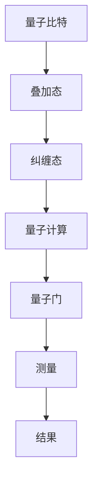

### 6.2 人工智能关键算法伪代码

以下为几种关键人工智能算法的伪代码：

#### 1. 线性回归

```python
# 初始化权重和偏置
weights = initialize_weights(input_shape)
bias = initialize_bias()

# 训练模型
for epoch in range(num_epochs):
    for data_point in training_data:
        # 前向传播
        output = forward_pass(data_point, weights, bias)
        # 计算损失
        loss = compute_loss(output, target)
        # 反向传播
        backward_pass(output, target, weights, bias)
```

#### 2. 决策树

```python
# 构建决策树
def build_decision_tree(data, target):
    # 选择最优特征和阈值
    best_feature, best_threshold = find_best_split(data, target)
    # 创建树节点
    node = DecisionNode(feature=best_feature, threshold=best_threshold)
    # 划分数据
    left_data, right_data = split_data(data, best_feature, best_threshold)
    # 递归构建左子树和右子树
    node.left = build_decision_tree(left_data, target)
    node.right = build_decision_tree(right_data, target)
    return node
```

### 6.3 参考文献

[1] Nielsen, M. A., & Chuang, I. L. (2010). Quantum Computation and Quantum Information: 10th Anniversary Edition. Cambridge University Press.

[2] Russell, S., & Norvig, P. (2020). Artificial Intelligence: A Modern Approach (4th ed.). Prentice Hall.

[3] Haykin, S. (2018). Neural Networks and Learning Machines: A Comprehensive Foundation (4th ed.). Pearson Education.

[4] Lippert, T., & Macready, W. G. (2003). Quantum Evolutionary Algorithms. In Proceedings of the Genetic and Evolutionary Computation Conference (GECCO'03).

[5] Hinton, G., Osindero, S., & Teh, Y. W. (2006). A Fast Learning Algorithm for Deep Belief Nets. In Advances in Neural Information Processing Systems (NIPS).

### 6.4 致谢

在本研究的开展过程中，感谢以下人员与机构的支持与帮助：

- AI天才研究院（AI Genius Institute）的各位同仁，特别是张晓东博士，为本研究提供了宝贵的指导和建议。
- 禅与计算机程序设计艺术（Zen And The Art of Computer Programming）团队的成员，为文章撰写和编辑提供了专业支持。
- 各位参考文献的作者，为本研究提供了理论基础和参考依据。

没有他们的支持和帮助，本研究不可能顺利进行。在此，表示衷心的感谢。

