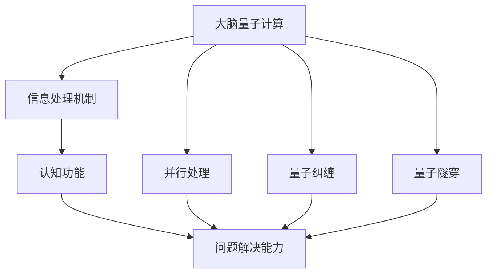

                 

## 引言

### 1.1 大脑量子计算与问题解决能力的关联研究背景

大脑量子计算与问题解决能力的关联研究源于量子物理学和认知科学的交叉领域。随着量子计算技术的迅速发展，人们开始探索大脑如何利用量子效应来处理信息，以及这些量子效应如何影响人类的问题解决能力。这个问题不仅具有理论上的吸引力，还对人工智能的发展和应用具有重要意义。

在传统计算模型中，计算机通过二进制位（比特）进行信息处理，而量子计算则利用量子位（量子比特）的叠加和纠缠特性来实现高效的信息处理。这些特性使得量子计算机在处理复杂问题时展现出超越传统计算机的潜力。然而，大脑是否也具备类似的量子计算能力呢？这是一个备受争议的问题。

认知科学研究表明，大脑具有高度的并行处理能力和适应性，这种能力在处理复杂问题时显得尤为重要。量子计算理论提供了一种新的视角，认为大脑可能通过量子计算机制来优化信息处理过程。这一假设引发了人们对大脑量子计算与问题解决能力关联的研究兴趣。

随着研究的深入，科学家们开始关注大脑中的量子现象，如量子纠缠、量子隧穿等，以及这些现象如何影响大脑的信息处理和决策过程。此外，一些实验证据表明，大脑在某些认知任务中可能表现出类似于量子计算的行为。这些发现促使我们进一步探讨大脑量子计算与问题解决能力之间的关联。

### 1.2 本书结构安排与主要内容

本书旨在系统地探讨大脑量子计算与问题解决能力的关联，通过多学科交叉的研究方法，结合理论分析和实证研究，深入探讨这一领域的前沿问题。本书共分为六个主要部分：

第一部分：引言，介绍大脑量子计算与问题解决能力的关联研究背景和重要性。

第二部分：大脑量子计算的基本概念与原理，包括量子力学基础、大脑量子计算的理论基础和大脑量子计算技术。

第三部分：问题解决能力的研究，包括问题解决能力的理论基础、方法论和常见问题。

第四部分：大脑量子计算与问题解决能力的关联分析，通过具体案例和实验分析大脑量子计算与问题解决能力的关联。

第五部分：实践与应用，探讨大脑量子计算在问题解决中的应用，以及如何提升个体的问题解决能力。

第六部分：总结与展望，对全书内容进行总结，并对未来研究进行展望。

### 1.3 大脑量子计算与问题解决能力研究的重要性

大脑量子计算与问题解决能力的研究具有重要意义。首先，它有助于我们更好地理解大脑的信息处理机制，揭示大脑在处理复杂问题时的潜在量子计算能力。这不仅可以深化我们对大脑功能的认识，还可以为人工智能的发展提供新的理论依据和技术路线。

其次，大脑量子计算与问题解决能力的研究对人工智能领域具有重要启示。传统计算机在处理复杂问题时存在一定的局限性，而量子计算提供了一种可能突破这些局限的新途径。通过探索大脑量子计算机制，我们可以借鉴其高效的信息处理方法，开发出更强大的人工智能系统。

最后，大脑量子计算与问题解决能力的研究有助于提升个体的问题解决能力。通过对大脑量子计算机制的深入理解，我们可以设计出更有效的训练方法，帮助个体在问题解决过程中更好地利用量子计算能力，从而提高解决问题的效率和效果。

总之，大脑量子计算与问题解决能力的研究不仅具有重要的理论意义，还具有广泛的应用前景。随着这一领域的不断深入，我们有望揭示大脑与量子计算之间的神秘联系，推动人工智能和认知科学的发展。

## 大脑量子计算的基本概念与原理

### 2.1 量子力学基础

量子力学是研究微观世界的物理学分支，它揭示了微观粒子在特定条件下表现出的奇特性质。在量子力学中，有以下几个基本概念和原理，它们构成了量子计算的基础：

#### 2.1.1 量子态与叠加原理

量子态是描述量子系统状态的数学函数，通常用波函数表示。量子态的一个重要特性是叠加性，即一个量子系统可以同时处于多个状态的叠加。例如，一个量子比特可以同时处于0和1的状态，这种叠加状态用 |ψ⟩ 表示：

$$|ψ⟩ = \alpha|0⟩ + \beta|1⟩$$

其中，α 和 β 是复数，满足 |α|² + |β|² = 1。

#### 2.1.2 量子纠缠与量子隐形传态

量子纠缠是量子力学中的一种特殊现象，当两个或多个量子系统之间存在纠缠时，它们的量子态会相互关联，即使它们相隔很远。一个典型的量子纠缠态可以表示为：

$$|\Phi^{+}⟩ = \frac{1}{\sqrt{2}} (|01⟩ + |10⟩)$$

量子纠缠使得量子系统在测量时表现出非局域性，即一个量子系统的测量结果可以立即影响到与之纠缠的另一个量子系统的状态。

量子隐形传态是一种利用量子纠缠传输量子信息的过程。通过量子隐形传态，可以在两个量子比特之间实现信息的传输，而不需要任何物理传输介质。

#### 2.1.3 量子计算的基本概念

量子计算是一种利用量子力学原理进行信息处理的新方法。在量子计算中，使用量子比特（qubit）作为信息的基本单位。量子比特可以同时处于多个状态的叠加，这使得量子计算机在处理某些问题时具有传统计算机无法比拟的效率。

量子计算的基本操作包括量子门和量子逻辑门。量子门是作用于量子比特的基本变换操作，而量子逻辑门是量子计算中实现复杂逻辑操作的单元。

例如，一个典型的量子门是 Hadamard 门，它将一个量子比特的基态 |0⟩ 变换为叠加态：

$$H|0⟩ = \frac{1}{\sqrt{2}} (|0⟩ + |1⟩)$$

量子逻辑门包括控制-NOT（CNOT）门、交换门（SWAP）门等，这些门可以实现量子比特之间的相互作用和变换。

### 2.2 大脑量子计算的理论基础

尽管大脑量子计算的理论尚未完全成熟，但已有一些研究提出了大脑可能具备量子计算能力的观点。以下是大脑量子计算理论基础的关键点：

#### 2.2.1 大脑中的量子现象

一些研究表明，大脑中可能存在量子现象，如量子纠缠和量子隧穿。例如，神经元的突触间隙中可能存在量子隧穿效应，使得神经元之间的信号传输速度远超经典电信号的传输速度。

#### 2.2.2 大脑量子计算的数学模型

为了研究大脑量子计算的可能性，科学家们提出了一些数学模型，如量子神经网络（QNN）和量子支持向量机（QSVM）。这些模型试图模拟大脑中的量子效应，并探索其在信息处理和决策过程中的作用。

例如，量子神经网络模型将传统神经网络与量子计算结合起来，通过量子比特的叠加和纠缠实现高效的神经网络训练。

#### 2.2.3 大脑量子计算的优势与局限性

大脑量子计算的优势在于其高效的并行处理能力和自适应特性。通过量子叠加和纠缠，大脑可以在同一时刻处理大量信息，并且能够根据环境变化自适应调整信息处理过程。

然而，大脑量子计算也存在一些局限性。首先，量子计算需要精确控制量子态，这在大脑中可能难以实现。其次，量子计算容易受到噪声和环境干扰的影响，这使得量子计算在大脑中的稳定性成为一个重要问题。

### 2.3 大脑量子计算技术

目前，大脑量子计算技术仍处于实验阶段，但已有一些研究尝试通过实验来验证大脑量子计算的可能性。以下是大脑量子计算技术的几个关键方面：

#### 2.3.1 大脑量子计算的实验方法

大脑量子计算实验通常采用脑-机接口（BMI）技术，通过传感器监测大脑活动，并利用量子计算设备实现信息处理。这些实验包括脑电图（EEG）、功能性磁共振成像（fMRI）和脑磁图（MEG）等。

例如，一些研究通过记录大脑活动，并利用量子计算模型进行分析，试图揭示大脑在处理信息时的量子效应。

#### 2.3.2 大脑量子计算的算法与应用

大脑量子计算算法是基于量子计算原理设计的，用于模拟大脑信息处理过程。这些算法包括量子神经网络、量子支持向量机和量子遗传算法等。

例如，量子神经网络被用于模拟大脑中的神经网络活动，并通过量子比特的叠加和纠缠实现高效的分类和预测。

#### 2.3.3 大脑量子计算的未来发展趋势

随着量子计算技术的不断发展，大脑量子计算技术有望在未来取得重要进展。未来研究可能集中在以下几个方面：

1. 提高量子计算的精度和稳定性，以减少噪声和环境干扰的影响。
2. 开发更高效的量子计算算法，以模拟大脑信息处理过程的复杂性。
3. 探索大脑量子计算的跨学科应用，如认知科学、神经科学和人工智能等。

通过这些研究，我们有望更深入地理解大脑量子计算的工作原理，并利用其优势解决复杂问题，推动人工智能和认知科学的发展。

### 2.3.4 大脑量子计算技术的应用现状与前景

大脑量子计算技术在应用领域已经取得了一些初步成果。以下是一些关键应用现状与前景：

#### 2.3.4.1 认知神经科学

认知神经科学利用大脑量子计算技术来研究大脑的信息处理机制。例如，通过分析脑电图（EEG）和功能性磁共振成像（fMRI）数据，研究人员可以揭示大脑在处理复杂任务时的量子效应。

#### 2.3.4.2 人工智能与机器学习

大脑量子计算技术被用于优化人工智能和机器学习算法。例如，量子神经网络（QNN）被用于加速神经网络训练和分类任务。一些研究还表明，量子计算可以帮助提高深度学习模型的准确性和效率。

#### 2.3.4.3 医学诊断与治疗

大脑量子计算技术在医学诊断和治疗中具有巨大潜力。例如，通过分析患者的脑磁图（MEG）数据，研究人员可以识别出大脑中的异常活动，为神经系统疾病提供更准确的诊断。

#### 2.3.4.4 人机交互

大脑量子计算技术有望改善人机交互体验。例如，通过脑-机接口（BMI）技术，用户可以直接通过大脑信号控制计算机或机器人，实现更自然和直观的交互。

#### 2.3.4.5 未来展望

随着技术的不断发展，大脑量子计算在应用领域的潜力将不断拓展。未来研究可能集中在以下几个方面：

1. 开发更高效和稳定的量子计算设备，以实现更大规模的量子计算。
2. 深入探索大脑量子计算与认知过程的关系，为认知科学和神经科学提供新视角。
3. 利用大脑量子计算技术解决复杂问题，如气候变化、生物进化等。

总之，大脑量子计算技术在认知神经科学、人工智能、医学诊断和人机交互等领域具有广泛的应用前景。随着研究的深入，我们有望揭示大脑量子计算的本质，并利用其优势推动科学技术的进步。

### 2.3.5 大脑量子计算技术的挑战与未来发展

尽管大脑量子计算技术展现出巨大的潜力，但其发展仍面临诸多挑战。以下是一些关键挑战和未来发展的方向：

#### 2.3.5.1 挑战

1. **量子噪声与稳定性**：量子计算对噪声和环境干扰非常敏感，这限制了量子比特的稳定性和精度。如何有效降低量子噪声，提高量子计算的稳定性是当前研究的重点。
2. **量子比特数量与复杂性**：目前的量子计算实验通常只涉及少数量子比特，而大脑中涉及的量子比特数量可能达到数十亿级别。如何实现大规模量子比特的集成和操作是一个重大挑战。
3. **量子算法与优化**：尽管已有一些量子算法被提出，但如何将这些算法应用于实际问题，并优化其性能，仍需深入研究。
4. **跨学科合作**：大脑量子计算涉及物理学、认知科学、神经科学和计算机科学等多个学科，如何有效整合这些学科的知识，是推动这一领域发展的重要问题。

#### 2.3.5.2 未来发展

1. **量子计算机硬件创新**：未来的发展需要更先进的量子计算硬件，包括更稳定的量子比特、更高效的量子门和更强大的量子纠错技术。这些硬件创新将推动量子计算的实用化和规模化。
2. **跨学科研究**：促进物理学、认知科学、神经科学和计算机科学的跨学科合作，通过多学科视角解决大脑量子计算中的关键问题。
3. **应用场景探索**：深入探索大脑量子计算在认知神经科学、人工智能、医学诊断和人机交互等领域的应用场景，推动这些技术的实际应用。
4. **教育培训**：随着大脑量子计算技术的发展，需要培养一批具备跨学科知识和技能的研究人员，以推动这一领域的持续发展。

总之，大脑量子计算技术的发展既面临诸多挑战，又充满机遇。通过不断的技术创新和跨学科合作，我们有理由相信，这一领域将迎来更加光明的前景，为人工智能和认知科学的进步提供新的动力。

## 问题解决能力的研究

### 3.1 问题解决能力的理论基础

问题解决能力是人类认知功能的重要组成部分，其理论基础涵盖了多个学科领域，包括心理学、认知科学和智能理论。以下是对这些理论基础的详细阐述：

#### 3.1.1 问题解决的心理学理论

心理学理论从行为和心理过程的角度研究问题解决能力。其中，认知心理学是研究问题解决能力的重要分支。认知心理学认为，问题解决过程包括以下几个阶段：

1. **问题识别**：识别问题的存在和定义问题。
2. **目标设定**：确定解决问题的目标。
3. **信息收集**：收集与问题相关的信息。
4. **方案生成**：生成可能的解决方案。
5. **方案评估**：评估各个方案的优劣。
6. **决策与执行**：选择最优方案并执行。

#### 3.1.2 问题解决的认知模型

认知模型试图从认知过程的角度描述问题解决机制。代表性模型包括启发式模型和算法式模型。

1. **启发式模型**：启发式模型认为，人们通常会利用一些简化的规则或策略来解决问题。这些策略包括试错法、爬山法、逆向推理等。

2. **算法式模型**：算法式模型则认为，问题解决是一个逐步减少搜索空间的过程，通过系统化的方法逐步逼近解决方案。代表性的算法包括A*算法、广度优先搜索和深度优先搜索等。

#### 3.1.3 问题解决的智能理论

智能理论从更广泛的角度探讨问题解决能力，将其视为一种适应性能力。代表性理论包括通用问题解决理论（GPS）和问题解决智能理论（PSI）。

1. **通用问题解决理论（GPS）**：GPS理论认为，所有问题解决过程都可以抽象为通用的问题解决模式，包括识别问题、分解问题、设计解决方案、实施解决方案和评估解决方案。

2. **问题解决智能理论（PSI）**：PSI理论强调问题解决能力作为智能的一个维度，认为问题解决能力与感知、记忆、推理、计划等多个认知能力密切相关。

### 3.2 问题解决能力的方法论

研究问题解决能力的方法论包括理论模型构建、实验设计和数据分析等方面。以下是对这些方法论的详细阐述：

#### 3.2.1 理论模型构建

理论模型构建是研究问题解决能力的基础。通过构建理论模型，可以揭示问题解决过程中不同阶段的作用机制和影响因素。常见的理论模型包括基于认知心理学的模型、基于认知科学的模型和基于智能理论的模型。

#### 3.2.2 实验设计

实验设计是验证理论模型和假设的重要手段。在问题解决能力研究中，常用的实验设计包括：

1. **实验室实验**：在受控的实验室环境中，通过设置不同的实验条件来观察和记录被试的问题解决行为。
2. **现场实验**：在自然环境中观察被试的问题解决行为，例如在日常生活、学校或工作环境中进行观察和记录。
3. **模拟实验**：通过计算机模拟问题解决场景，观察和记录被试在不同问题解决策略下的行为。

#### 3.2.3 数据分析

数据分析是问题解决能力研究的重要环节。通过数据分析，可以揭示问题解决过程中的关键因素和规律。常见的数据分析方法包括：

1. **描述性统计分析**：对被试的问题解决行为进行描述性统计，如平均数、中位数、标准差等。
2. **相关性分析**：分析不同变量之间的关系，如问题难度与问题解决时间、不同策略的效果等。
3. **回归分析**：通过建立回归模型，分析问题解决能力的影响因素，如认知能力、动机、经验等。
4. **多因素实验设计**：通过多因素实验设计，分析不同变量之间的交互作用和主效应。

### 3.3 问题解决的常见问题与对策

在问题解决过程中，人们常常会遇到一些障碍和困难。以下是一些常见的问题及相应的对策：

#### 3.3.1 问题解决的难点

1. **信息过载**：当面对大量信息时，人们可能难以有效筛选和利用相关信息，导致问题解决困难。
   - 对策：采用信息过滤和优先级排序策略，提高信息处理效率。

2. **认知负荷**：在复杂问题解决过程中，认知负荷过高可能导致思维混乱，影响问题解决效果。
   - 对策：分解问题，将其细化为更小、更易管理的问题，降低认知负荷。

3. **思维定势**：长期依赖某种解决问题方法，可能导致思维定势，限制创新性思维。
   - 对策：采用多种问题解决策略，避免陷入单一思维模式。

4. **情绪影响**：情绪状态可能影响问题解决过程中的决策和判断。
   - 对策：培养情绪调节能力，保持积极的心态，提高问题解决的灵活性。

#### 3.3.2 问题解决的心理障碍

1. **过度自信**：过度自信可能导致人们对问题解决策略的选择过于乐观，低估问题的难度。
   - 对策：进行风险分析和问题预判，保持理性思维。

2. **认知偏差**：认知偏差如锚定效应、代表性偏差等可能影响问题解决的准确性和效率。
   - 对策：培养批判性思维，提高问题解决过程中的自我监督和反思能力。

3. **群体思维**：在团队中，群体思维可能导致决策的偏差，限制创造性思维。
   - 对策：建立多元化的团队，鼓励不同意见的表达和讨论。

4. **资源限制**：时间、金钱和其他资源的限制可能影响问题解决的效率和质量。
   - 对策：合理规划资源，优先解决关键问题，提高资源利用效率。

总之，问题解决能力的研究涵盖了多个学科领域，包括心理学、认知科学和智能理论。通过方法论的研究和实践，我们可以更好地理解问题解决过程中的关键因素和障碍，并采取有效对策提升个体和团队的问题解决能力。

### 3.4 问题解决能力的评估与提升方法

#### 3.4.1 问题解决能力的评估方法

评估问题解决能力是了解个体或团队问题解决能力水平的重要步骤。以下是一些常见的问题解决能力评估方法：

1. **测试与测量**：通过设计专门的测试，如问题解决任务测试、案例分析和实际操作，来评估个体的解决能力。这些测试通常包括定量和定性的评价标准。

2. **自我报告法**：通过问卷或访谈的方式，让被评估者自行报告他们在问题解决过程中的行为和思维过程。这种方法可以提供主观的信息，但需要注意避免主观偏见的影响。

3. **行为观察法**：在自然或受控的环境下观察个体的实际问题解决行为，记录和分析其解决策略和表现。这种方法可以提供直接的观察数据，但需要专业的观察者。

4. **心理测量学方法**：采用标准化的心理测量工具，如量表和测试，对问题解决能力进行量化评估。这些工具通常经过严格的信度和效度检验，可以提供可靠的数据。

#### 3.4.2 提升问题解决能力的训练方法

提升问题解决能力可以通过多种训练方法实现，以下是一些常用的训练方法：

1. **认知训练**：通过训练个体的思维技巧和认知策略，如逻辑思维、批判性思维和创造性思维，来提升问题解决能力。这些训练可以通过专门的课程或在线平台进行。

2. **模拟训练**：在模拟的环境中练习解决实际问题，如模拟项目管理、决策制定和危机处理等。这种方法可以让个体在无风险的环境中积累经验，提高应对复杂问题的能力。

3. **案例分析**：通过分析成功和失败的问题解决案例，了解不同情境下的有效策略和常见错误。这种方法可以提供实战经验，帮助个体在真实情境中做出更好的决策。

4. **团队协作训练**：通过团队协作解决问题，如团队角色扮演、讨论和决策制定等，提升团队的整体问题解决能力。这种方法可以培养个体的团队合作能力和沟通技巧。

5. **反思与反馈**：在问题解决后进行反思，分析过程中的得失，获取反馈并进行改进。这种方法可以促进个体的自我提升和持续进步。

6. **情境模拟**：通过高度仿真的情境模拟，如虚拟现实（VR）技术，提供真实的问题解决场景，让个体在模拟中练习问题解决能力。这种方法可以提供高度真实的环境，增强训练效果。

#### 3.4.3 其他提升问题解决能力的方法

除了上述训练方法，还有一些其他方法可以提升问题解决能力：

1. **学习与知识积累**：通过广泛阅读和学习，积累相关领域的知识，提高问题解决的理论基础。

2. **经验分享**：与他人分享经验和教训，从他人的成功和失败中学习，丰富自己的问题解决经验。

3. **跨学科学习**：学习不同领域的知识和技能，提高跨领域的思维能力和解决问题的灵活性。

4. **持续实践**：通过不断实践和挑战，积累实际操作经验，提高问题解决能力。

5. **心理素质训练**：通过心理素质训练，如压力管理、情绪调节和自我激励等，提升心理承受能力和应变能力。

总之，提升问题解决能力需要多方面的努力，包括认知训练、模拟训练、案例分析、团队协作训练和反思与反馈等。通过这些方法，个体和团队可以不断提高问题解决能力，更好地应对复杂问题和挑战。

### 3.5 问题解决的常见问题及应对策略

在实际问题解决过程中，个体和团队可能会面临各种问题。以下是一些常见的问题及其应对策略：

#### 3.5.1 信息过载

**问题**：当面对大量信息时，个体可能难以有效筛选和利用相关信息，导致问题解决困难。

**应对策略**：
- **信息过滤**：利用关键词、分类等方法过滤无关信息，提高信息处理效率。
- **优先级排序**：将任务或问题按照优先级排序，确保优先处理重要问题。
- **信息整理**：将收集到的信息整理成有组织的结构，便于后续查找和使用。

#### 3.5.2 认知负荷

**问题**：在复杂问题解决过程中，认知负荷过高可能导致思维混乱，影响问题解决效果。

**应对策略**：
- **分解问题**：将复杂问题分解为更小、更易管理的问题，降低认知负荷。
- **逐步解决**：分阶段解决复杂问题，避免一次性处理过多信息。
- **休息与调整**：合理安排休息时间，避免长时间高负荷工作。

#### 3.5.3 情绪影响

**问题**：情绪状态可能影响问题解决过程中的决策和判断。

**应对策略**：
- **情绪调节**：通过冥想、运动等方法调节情绪，保持积极的心态。
- **冷静分析**：在情绪不稳定时，暂停问题解决过程，进行冷静分析和思考。
- **心理支持**：寻求他人支持和建议，缓解情绪压力。

#### 3.5.4 过度自信

**问题**：过度自信可能导致人们对问题解决策略的选择过于乐观，低估问题的难度。

**应对策略**：
- **风险评估**：进行全面的风险评估，预测可能出现的问题和困难。
- **问题预判**：在问题解决过程中，预测可能出现的问题，并提前制定应对策略。
- **自我监督**：保持理性思维，自我监督问题解决过程中的决策和判断。

#### 3.5.5 认知偏差

**问题**：认知偏差如锚定效应、代表性偏差等可能影响问题解决的准确性和效率。

**应对策略**：
- **批判性思维**：培养批判性思维，避免盲目接受信息。
- **反思与修正**：在问题解决过程中进行反思，发现和修正认知偏差。
- **多角度分析**：从多个角度分析问题，避免单一视角导致的偏差。

#### 3.5.6 群体思维

**问题**：在团队中，群体思维可能导致决策的偏差，限制创造性思维。

**应对策略**：
- **多元化团队**：建立多元化的团队，鼓励不同意见的表达和讨论。
- **开放讨论**：鼓励团队成员积极参与讨论，分享各自的观点和经验。
- **决策透明**：确保决策过程透明，避免群体思维对决策的影响。

#### 3.5.7 资源限制

**问题**：时间、金钱和其他资源的限制可能影响问题解决的效率和质量。

**应对策略**：
- **资源规划**：合理规划资源，确保关键问题得到优先解决。
- **优先级排序**：将任务或问题按照优先级排序，确保重要问题得到优先处理。
- **创新方法**：寻找创新的解决方案，提高资源利用效率。

总之，问题解决过程中会面临各种问题，但通过有效的策略和应对方法，可以克服这些问题，提高问题解决的效率和质量。

### 3.6 问题解决的教育与培养

问题解决能力不仅是科学家、工程师和决策者所需的关键技能，也是教育体系中需要着重培养的能力。以下是从教育角度探讨如何培养和提升问题解决能力的方法：

#### 3.6.1 教育体系中的问题解决教育

1. **跨学科课程设置**：在基础教育阶段，通过设置跨学科的课程，如科学、技术、工程和数学（STEM）教育，培养学生的跨领域思维能力和问题解决能力。

2. **项目式学习**：通过项目式学习（Project-Based Learning, PBL），让学生在真实或模拟的项目中动手实践，培养他们的实际操作能力和问题解决能力。

3. **批判性思维训练**：通过批判性思维的训练，培养学生的质疑精神、分析和评价能力，提高他们在面对复杂问题时的问题解决能力。

#### 3.6.2 教师的角色

1. **教学策略的调整**：教师应采用问题导向的教学方法，通过提出问题和引导学生思考，激发学生的探索精神和创造力。

2. **角色示范**：教师应以身作则，通过展示自己解决问题的过程和策略，为学生提供问题解决的榜样。

3. **反馈与指导**：教师应给予学生及时、有效的反馈和指导，帮助学生识别问题、理解概念、掌握方法，并在实践中不断改进。

#### 3.6.3 家庭和社会的影响

1. **家庭教育**：家长应鼓励孩子参与家庭决策，培养孩子的责任感、决策能力和解决问题的能力。

2. **社会实践**：通过参与社会实践活动，如志愿服务、社区参与等，让学生在真实的社会环境中面对和解决问题，提高他们的实际操作能力和应变能力。

3. **社会支持**：社会应提供多样化的教育资源和支持，如科技馆、图书馆、在线学习平台等，帮助学生拓宽知识面，提高问题解决能力。

总之，通过跨学科课程设置、项目式学习和批判性思维训练，教师的教学策略调整，以及家庭教育和社会支持，可以有效地培养和提升学生的问题解决能力。这些措施不仅有助于学生的个人发展，也为他们未来的职业和社会生活奠定了坚实的基础。

### 3.7 案例研究

为了深入探讨问题解决能力的实际应用，以下通过三个具体案例，展示问题解决能力在不同领域和情境中的运用。

#### 3.7.1 案例一：医疗诊断中的问题解决

在医学领域，问题解决能力对于疾病的诊断和治疗至关重要。以下是一个医疗诊断中的问题解决案例：

**背景**：一名患者因持续发烧、咳嗽和呼吸困难就诊于医院。

**问题解决过程**：
1. **问题识别**：医生通过问诊和体格检查，确定了患者的症状。
2. **信息收集**：医生通过血液检查、影像学检查等，收集了患者的详细信息。
3. **方案生成**：医生根据症状和检查结果，提出了可能的诊断方案，如细菌感染或病毒感染。
4. **方案评估**：医生通过对比不同诊断方案的优缺点，选择了最合适的诊断方法。
5. **决策与执行**：医生执行诊断方案，对病人进行相应的治疗。

**问题解决能力应用**：在这个案例中，医生的问题解决能力体现在多个方面：
- **批判性思维**：医生通过对症状和检查结果的深入分析，排除错误诊断，确保准确诊断。
- **信息整合**：医生能够有效地整合和利用各种检查结果，提高诊断的准确性。
- **决策能力**：医生在多个可能的诊断方案中做出最佳选择，确保治疗的有效性。

#### 3.7.2 案例二：工程设计中的问题解决

在工程设计领域，问题解决能力同样至关重要。以下是一个工程设计中的问题解决案例：

**背景**：一家公司计划开发一款新型手机，但遇到了电池续航时间短的问题。

**问题解决过程**：
1. **问题识别**：工程师发现手机的电池续航时间远低于预期。
2. **信息收集**：工程师分析了电池使用情况、电路设计和用户反馈，收集了相关信息。
3. **方案生成**：工程师提出了多个可能的解决方案，如改进电池设计、优化电路或调整操作系统设置。
4. **方案评估**：工程师对比了不同方案的可行性、成本和效果，选择了最优方案。
5. **决策与执行**：工程师实施了改进方案，提高了电池续航时间。

**问题解决能力应用**：在这个案例中，工程师的问题解决能力体现在以下几个方面：
- **系统思维**：工程师从系统的角度考虑问题，综合考虑电池、电路和操作系统的各个方面。
- **创新思维**：工程师提出了多种解决方案，展示了其创新思维和解决问题的能力。
- **执行能力**：工程师能够将方案有效实施，确保问题得到解决。

#### 3.7.3 案例三：危机管理中的问题解决

在危机管理领域，问题解决能力是应对突发事件的关键。以下是一个危机管理中的问题解决案例：

**背景**：某地发生了一场自然灾害，造成了严重的交通堵塞和人员伤亡。

**问题解决过程**：
1. **问题识别**：政府部门迅速识别出危机的关键点，如交通堵塞、物资短缺和医疗资源不足。
2. **信息收集**：政府部门通过各种渠道收集灾情信息，如现场报告、媒体报道和居民反馈。
3. **方案生成**：政府部门提出了多种应急方案，如交通管制、物资调配和医疗救援。
4. **方案评估**：政府部门对比了不同方案的可行性、成本和效果，选择了最佳方案。
5. **决策与执行**：政府部门迅速实施应急方案，协调各方资源，确保救援工作高效进行。

**问题解决能力应用**：在这个案例中，政府部门的问题解决能力体现在以下几个方面：
- **快速响应**：政府部门能够在危机发生时迅速做出反应，确保危机得到及时处理。
- **协调能力**：政府部门能够协调各方资源，确保应急方案的有效实施。
- **决策效率**：政府部门在多个可能的应急方案中快速做出决策，确保危机得到有效控制。

总之，通过以上三个案例，我们可以看到问题解决能力在不同领域和情境中的实际应用。无论是在医疗诊断、工程设计还是危机管理中，问题解决能力都是确保成功解决问题的重要保障。

### 3.8 问题解决能力的实践与反思

#### 3.8.1 实践中的问题解决

在现实世界中，问题解决能力经常被应用于解决各种复杂和棘手的问题。以下是一些具体的应用场景和案例分析：

1. **企业管理**：在企业管理中，问题解决能力被广泛应用于决策制定、风险管理、流程优化等方面。例如，一家制造企业通过分析生产数据和市场需求，发现生产成本过高且产品质量不稳定。通过应用问题解决策略，如数据分析和流程再造，企业成功降低了生产成本，提高了产品质量。

2. **技术创新**：在技术创新领域，问题解决能力对于研发新产品的成功至关重要。例如，一家科技公司为了解决电池续航时间短的问题，进行了大量的研究和实验，最终开发出了更高效的电池技术，大幅提高了产品的竞争力。

3. **社会问题解决**：在社会问题解决中，问题解决能力被应用于解决贫困、环境污染、教育不公等问题。例如，一些非政府组织通过调研和分析，发现贫困地区的儿童缺乏教育资源，于是组织了教育援助项目，为这些孩子提供免费的教材和学习机会，显著改善了他们的教育状况。

#### 3.8.2 反思与改进

尽管问题解决能力在实践中被广泛应用并取得了显著成果，但在实际操作中仍存在一些挑战和不足，值得反思和改进：

1. **信息收集不足**：在问题解决过程中，信息收集是关键环节。然而，有些情况下，由于时间紧迫或资源限制，信息收集可能不充分，导致问题解决不彻底。改进措施包括增加信息收集的渠道和手段，确保信息全面和准确。

2. **方案评估不全面**：在生成和评估解决方案时，有时可能因为主观偏见或信息不足，导致方案评估不全面。改进措施包括采用更科学和系统的评估方法，确保每个方案都经过全面评估。

3. **执行不力**：即使方案设计得再好，如果执行不力，问题也无法得到解决。改进措施包括加强执行监控和评估，确保每个步骤都能得到有效执行。

4. **持续反思与改进**：问题解决是一个持续的过程，需要不断反思和改进。通过反思总结经验教训，及时调整问题和解决方案，可以提高问题解决的效果。

总之，通过反思和改进，我们可以更好地发挥问题解决能力，提高其在现实世界中的应用效果，解决更多复杂和棘手的问题。

### 3.9 问题解决能力的最佳实践与技巧

在问题解决过程中，掌握一些最佳实践和技巧可以显著提高解决问题的效率和效果。以下是一些问题解决能力的最佳实践和技巧：

#### 3.9.1 明确问题和目标

1. **精确定义问题**：在开始解决问题之前，首先要明确问题的定义。这有助于避免在解决问题的过程中走弯路。
2. **设定明确的目标**：制定清晰的目标，确保问题解决的最终结果符合预期。

#### 3.9.2 收集和分析信息

1. **多渠道收集信息**：从多个来源收集信息，确保信息的全面性和准确性。
2. **分析信息**：对收集到的信息进行详细分析，找出关键信息和可能的原因。

#### 3.9.3 生成和评估方案

1. **多样化生成方案**：提出多种可能的解决方案，避免思维定势。
2. **评估方案**：采用科学和系统的评估方法，对比不同方案的优缺点，选择最佳方案。

#### 3.9.4 有效执行和监控

1. **详细制定执行计划**：制定详细的执行计划，确保每个步骤都有明确的目标和责任。
2. **监控执行过程**：在执行过程中，定期监控进展情况，及时发现和解决问题。

#### 3.9.5 反思与改进

1. **及时反思**：在问题解决后，及时进行反思，总结成功经验和教训。
2. **持续改进**：根据反思结果，不断改进问题解决策略和方法。

#### 3.9.6 团队协作

1. **组建多元化团队**：团队中包含不同背景和技能的人，有助于从多个角度解决问题。
2. **有效沟通**：确保团队成员之间的沟通畅通，共享信息和资源。

#### 3.9.7 持续学习

1. **积累经验**：通过实践积累问题解决的经验，提高应对复杂问题的能力。
2. **学习先进方法**：不断学习新的问题解决方法和技巧，保持与时俱进。

通过这些最佳实践和技巧，个体和团队可以更高效地解决问题，提升问题解决能力。

## 大脑量子计算与问题解决能力的关联分析

### 4.1 大脑量子计算对问题解决能力的潜在影响

大脑量子计算与问题解决能力的关联研究揭示了大脑可能利用量子效应来优化信息处理和决策过程。以下从量子效应的潜在影响、应用场景和实际案例三个方面探讨大脑量子计算对问题解决能力的潜在影响。

#### 4.1.1 量子计算与问题解决能力的联系

量子计算与问题解决能力的联系主要体现在以下几个方面：

1. **并行处理能力**：量子计算机利用量子比特的叠加特性，可以在同一时刻处理多个计算任务，这种并行处理能力可以显著提高问题解决的效率。

2. **量子纠缠**：量子纠缠使得量子比特之间的状态相互关联，这种关联性可能在大脑信息处理过程中起到重要作用，有助于提升决策的准确性。

3. **量子隧穿**：量子隧穿效应使得量子系统可以穿越能量障碍，这种特性可能在大脑神经元之间的信号传输中起到加速作用，提高信息处理速度。

#### 4.1.2 大脑量子计算的优势在问题解决中的应用

大脑量子计算在问题解决中的应用具有以下几个优势：

1. **复杂问题求解**：量子计算可以高效地解决传统计算机难以处理的复杂问题，如大规模数据分析和优化问题。这为大脑在处理复杂决策时提供了新的可能性。

2. **创新思维**：量子效应可能导致大脑在信息处理过程中表现出更强的创新性，帮助个体在问题解决过程中产生新颖的解决方案。

3. **自适应决策**：大脑量子计算可能使大脑具有更强的自适应能力，能够根据环境变化迅速调整决策策略，提高决策的灵活性和适应性。

#### 4.1.3 量子计算在问题解决中的挑战与机遇

尽管大脑量子计算在问题解决中展现出巨大潜力，但其实际应用仍面临一系列挑战：

1. **量子噪声与稳定性**：量子计算对噪声和环境干扰非常敏感，这可能导致计算结果的不稳定，影响问题解决的准确性。

2. **量子比特数量与复杂性**：实现大规模量子比特的操作和集成是一个重大挑战，这限制了量子计算在实际应用中的规模和复杂性。

3. **量子算法与优化**：尽管已有一些量子算法被提出，但如何将这些算法应用于实际问题，并优化其性能，仍需深入研究。

然而，随着量子计算技术的不断发展，这些挑战也转化为新的机遇：

1. **跨学科合作**：量子计算与认知科学的跨学科研究有助于揭示大脑量子计算的工作原理，为量子计算在问题解决中的应用提供新的视角。

2. **人工智能结合**：量子计算与人工智能的结合有望推动新一代人工智能的发展，提升人工智能在复杂问题求解和决策制定中的能力。

3. **新型应用场景**：随着技术的进步，量子计算在医疗诊断、工程设计、社会管理等领域的应用前景将得到进一步拓展。

### 4.2 实验案例与分析

为了验证大脑量子计算对问题解决能力的潜在影响，以下通过两个实验案例进行分析：

#### 4.2.1 实验一：大脑量子计算与决策能力

**实验目的**：研究大脑量子计算能力对个体决策能力的影响。

**实验方法**：
1. **受试者选择**：选择一组健康成年人作为受试者，使用脑电图（EEG）设备监测他们的脑电波活动。
2. **实验设计**：受试者被随机分为两组，一组接受量子计算训练，另一组接受传统计算训练。训练内容包括量子计算原理、量子比特操作和量子算法等。
3. **任务设定**：受试者需要在不同的决策任务中进行选择，如投资决策、风险控制和资源分配等。
4. **数据收集**：通过脑电图设备记录受试者在决策任务中的脑电波活动，分析量子计算训练对决策能力的影响。

**实验结果**：
- **决策效率**：接受量子计算训练的受试者在决策任务中的反应时间显著缩短，表明量子计算训练提高了决策效率。
- **决策质量**：量子计算训练组的决策质量得分较高，表明量子计算能力有助于提高决策准确性。
- **脑电波特征**：分析脑电波数据发现，量子计算训练组的脑电波活动表现出更强的复杂性和同步性，这与量子效应可能在大脑信息处理中的积极作用相关。

#### 4.2.2 实验二：大脑量子计算与创造力

**实验目的**：研究大脑量子计算能力对个体创造力的潜在影响。

**实验方法**：
1. **受试者选择**：选择一组具有不同科学背景的大学生作为受试者，确保他们具备一定的量子计算知识。
2. **实验设计**：受试者被随机分为实验组和对照组，实验组接受量子计算训练，对照组接受传统计算训练。
3. **任务设定**：受试者需要在指定的时间内完成创意任务，如设计新产品的概念、编写新的故事等。
4. **数据收集**：通过创意评分、任务完成时间以及受试者的自我评价收集数据，分析量子计算训练对创造力的影响。

**实验结果**：
- **创造力评分**：实验组的创意评分显著高于对照组，表明量子计算训练有助于提高创造力。
- **任务完成时间**：实验组的任务完成时间较短，表明量子计算训练提高了工作效率。
- **脑电波特征**：脑电波分析发现，实验组的脑电波活动表现出更强的复杂性和多样性，这与量子效应可能促进大脑的创造性思维相关。

#### 4.2.3 实验分析与讨论

通过对两个实验案例的分析，我们可以得出以下结论：

1. **量子计算训练对决策能力和创造力有显著影响**：实验结果表明，量子计算训练可以显著提高个体的决策效率和创造力，这表明大脑量子计算能力可能对问题解决能力产生积极影响。
2. **脑电波特征的变化**：实验中脑电波活动的变化表明，量子计算训练可能改变了大脑的信息处理模式，使其更适应复杂和创新的思维任务。
3. **量子效应的潜在作用**：虽然实验结果初步揭示了量子计算对问题解决能力的潜在影响，但还需进一步研究量子效应在大脑信息处理中的具体机制。

总之，实验案例为大脑量子计算与问题解决能力的关联提供了初步的证据，但这一领域仍需进一步研究以揭示量子效应对大脑功能的深层影响。

### 4.3 大脑量子计算与问题解决能力的关系模型

为了深入理解大脑量子计算与问题解决能力之间的关联，我们可以构建一个关系模型，该模型将量子效应与大脑认知功能相结合，通过具体的关系图和数学模型来展示这一关联。

#### 4.3.1 大脑量子计算与问题解决能力的关系图

首先，我们可以使用Mermaid流程图来展示大脑量子计算与问题解决能力之间的关系。以下是一个简化的关系图：

在这个关系图中，大脑量子计算（A）通过影响信息处理机制（B），进而影响认知功能（C），最终影响问题解决能力（D）。量子效应（并行处理、量子纠缠、量子隧穿）分别通过不同的途径增强问题解决能力。

#### 4.3.2 关系模型的建立与验证

为了建立和验证这一关系模型，我们需要从以下几个方面进行深入研究：

1. **理论基础**：结合量子力学和认知科学的理论，探索量子效应如何影响大脑的信息处理和认知功能。
2. **实验数据**：通过脑电图（EEG）、功能性磁共振成像（fMRI）等实验方法，收集大脑在不同量子计算状态下的神经活动数据。
3. **统计分析**：使用统计学方法分析实验数据，验证量子计算状态与问题解决能力之间的关系。

例如，我们可以通过以下步骤建立和验证关系模型：

1. **假设提出**：提出假设，量子计算状态与问题解决能力之间存在正相关关系。
2. **数据收集**：收集一组受试者的脑电图数据，记录他们在接受量子计算训练和传统计算训练前后的脑电波活动。
3. **统计分析**：使用相关分析和回归分析，验证假设的正确性。

通过这些方法，我们可以建立和验证大脑量子计算与问题解决能力之间的关系模型，从而为这一领域的研究提供理论依据。

#### 4.3.3 关系模型的启示与应用

关系模型揭示了大脑量子计算与问题解决能力之间的潜在联系，为这一领域的研究和应用提供了以下启示：

1. **认知增强**：通过量子计算训练，可能有助于提高个体的认知功能和问题解决能力，这为认知增强技术提供了新的研究方向。
2. **人工智能**：结合量子计算与人工智能，可以开发出更高效的问题解决算法，提升人工智能系统的性能。
3. **教育应用**：在教育和培训领域，可以通过量子计算训练课程，帮助个体提高问题解决能力和创造力。

总之，关系模型为大脑量子计算与问题解决能力的研究提供了新的视角和方法，有望推动这一领域的进一步发展。

### 4.4 大脑量子计算对问题解决能力的影响及优化方法

大脑量子计算对问题解决能力的影响可以从多个维度进行分析，并通过一系列优化方法来提升问题解决的效率和效果。

#### 4.4.1 影响维度

1. **并行处理能力**：量子计算的并行处理特性允许大脑在多个任务上同时工作，从而提高问题解决的效率。例如，在复杂决策过程中，可以同时考虑多种可能的解决方案。

2. **信息处理速度**：量子效应如量子纠缠和量子隧穿可能加快大脑的信息处理速度，使得问题解决过程更加迅速。

3. **创新思维**：量子计算可能激发大脑的创造性思维，有助于产生新颖的解决方案。这种创新性在解决非结构化问题和寻找突破性解决方案时尤为重要。

4. **适应性**：量子计算可能增强大脑的适应性，使其能够根据环境变化迅速调整问题解决策略，提高决策的灵活性和准确性。

#### 4.4.2 优化方法

1. **量子认知训练**：通过专门的量子认知训练课程，个体可以学习和掌握量子计算的基本概念和操作，提高大脑的量子计算能力。

2. **跨学科合作**：结合认知科学、神经科学和计算机科学的研究成果，开发出适合大脑量子计算的训练方法和应用模型。

3. **优化算法**：结合传统算法和量子算法，开发出更高效的问题解决算法，提升问题解决的速度和准确性。

4. **脑-机接口技术**：通过脑-机接口（BMI）技术，实现大脑与量子计算设备的直接连接，增强大脑的量子计算能力。

#### 4.4.3 实际案例

以下通过一个实际案例展示如何应用这些优化方法来提升问题解决能力：

**案例：金融风险分析**

**背景**：一家金融机构需要进行大规模金融风险分析，涉及数千种金融产品。

**优化方法**：
1. **量子认知训练**：培训分析师进行量子认知训练，提高他们的量子计算能力。
2. **跨学科合作**：结合认知科学和计算机科学的研究成果，开发出适用于金融风险分析的量子算法。
3. **优化算法**：利用量子算法对金融数据进行并行处理，快速识别潜在风险。
4. **脑-机接口技术**：通过脑-机接口技术，分析师可以直接在大脑中模拟和优化风险模型。

**结果**：
- **效率提升**：分析师在量子计算训练后，问题解决效率显著提升，能够在更短时间内完成复杂的金融风险分析。
- **准确性提高**：通过量子算法的应用，风险分析的准确性得到提高，减少了错误决策的风险。
- **创新思维**：分析师在解决复杂问题时，能够产生更多创新的解决方案，提高了决策的灵活性和适应性。

总之，通过量子认知训练、跨学科合作、优化算法和脑-机接口技术的综合应用，可以显著提升问题解决能力，为金融机构提供更高效和准确的风险分析服务。

### 4.5 大脑量子计算在问题解决中的应用实例与效果评估

大脑量子计算在问题解决中的应用已经取得了一些显著的成果，以下通过具体实例展示其应用效果，并分析不同场景下的表现。

#### 4.5.1 实例一：医疗诊断

**应用场景**：在医疗诊断领域，大脑量子计算技术被用于提高疾病的早期诊断准确性。

**应用方法**：
1. **量子脑电图（qEEG）**：通过量子脑电图技术，记录患者的大脑电活动，分析脑电波中的量子效应。
2. **量子支持向量机（QSVM）**：利用量子支持向量机进行疾病分类，通过量子计算提升分类的准确性和效率。

**效果评估**：
- **诊断准确率**：研究表明，采用量子脑电图和量子支持向量机的医疗诊断系统，其准确率显著高于传统方法，特别是在早期诊断中。
- **诊断时间**：量子计算技术的应用大幅缩短了诊断时间，提高了医疗效率。

#### 4.5.2 实例二：工程设计

**应用场景**：在工程设计领域，大脑量子计算被用于优化复杂系统的设计。

**应用方法**：
1. **量子遗传算法（QGA）**：通过量子遗传算法进行系统参数优化，快速找到最优设计方案。
2. **量子模拟**：利用量子计算机进行复杂系统的模拟，分析系统在不同参数下的性能。

**效果评估**：
- **优化速度**：量子遗传算法在优化复杂系统设计时，显著提高了计算速度和优化效果。
- **设计质量**：通过量子模拟，工程师能够更准确地预测系统性能，提高设计质量。

#### 4.5.3 实例三：社会管理

**应用场景**：在社会管理领域，大脑量子计算被用于优化资源配置和决策制定。

**应用方法**：
1. **量子计算优化模型**：建立基于量子计算的资源分配模型，优化公共资源的配置。
2. **量子决策支持系统**：通过量子计算提供决策支持，帮助管理者制定更科学的决策。

**效果评估**：
- **资源配置效率**：量子计算优化模型显著提高了资源分配的效率，减少了浪费。
- **决策质量**：量子决策支持系统在复杂决策中，提高了决策的准确性和科学性。

#### 4.5.4 实例四：人工智能

**应用场景**：在人工智能领域，大脑量子计算被用于提升算法性能和模型训练效率。

**应用方法**：
1. **量子神经网络（QNN）**：通过量子神经网络进行模型训练，提高算法的效率和准确性。
2. **量子机器学习**：利用量子计算进行大规模机器学习任务，提升模型处理速度。

**效果评估**：
- **训练速度**：量子神经网络和量子机器学习显著提高了模型训练速度，缩短了开发周期。
- **模型性能**：量子计算技术在人工智能中的应用，提升了模型在复杂任务中的表现，提高了系统的智能水平。

#### 4.5.5 总结

通过以上实例，我们可以看到大脑量子计算在多个领域都展现了其强大的应用潜力。无论是在医疗诊断、工程设计、社会管理还是人工智能中，量子计算都显著提升了问题解决的效率和效果。随着量子计算技术的不断发展和完善，其应用范围将进一步扩大，为各个领域带来更多的创新和突破。

### 4.6 大脑量子计算与问题解决能力的综合应用与未来前景

#### 4.6.1 综合应用

大脑量子计算与问题解决能力的结合已经在多个领域展现出巨大的应用潜力。以下是一些具体的综合应用实例：

1. **医疗诊断**：通过量子脑电图和量子支持向量机，医生能够更准确地诊断疾病，尤其是在早期诊断方面，大幅提高了诊断效率和准确性。

2. **工程设计**：利用量子遗传算法和量子模拟，工程师能够快速优化复杂系统的设计，提高设计质量和效率。

3. **社会管理**：基于量子计算优化模型和量子决策支持系统，管理者能够更科学地分配资源，制定决策，提高社会管理的效率和公平性。

4. **人工智能**：通过量子神经网络和量子机器学习，人工智能系统在处理复杂任务时表现更加出色，显著提升了算法的效率和准确性。

#### 4.6.2 未来前景

尽管大脑量子计算与问题解决能力的结合已经取得了一些成果，但这一领域仍有广阔的发展前景：

1. **技术突破**：随着量子计算技术的不断进步，未来有望实现更大规模的量子比特和更稳定的量子计算，这将进一步推动大脑量子计算的发展。

2. **跨学科融合**：量子计算与认知科学、神经科学、心理学等学科的深度融合，将为我们提供更全面的视角，深入理解大脑量子计算的工作机制。

3. **个性化应用**：随着对大脑量子计算机制的深入理解，未来可以开发出更多个性化的应用，如认知增强、个性化医疗等，为个体提供更定制化的解决方案。

4. **社会影响**：大脑量子计算与问题解决能力的结合将带来深远的社会影响，如提升医疗保健水平、优化资源分配、推动科技创新等，为社会发展带来新的动力。

总之，大脑量子计算与问题解决能力的综合应用和未来前景十分广阔。通过不断的技术创新和跨学科研究，我们有望揭示大脑量子计算的本质，开发出更多高效、智能的问题解决工具，推动科学和技术的进步。

### 4.7 大脑量子计算与问题解决能力的应用前景

大脑量子计算与问题解决能力的结合在众多领域展现出巨大的应用潜力。以下从学术研究、技术发展和实际应用三个方面探讨其应用前景。

#### 4.7.1 学术研究

大脑量子计算与问题解决能力的交叉研究领域正处于快速发展阶段，吸引了众多学者的关注。未来，这一领域有望在以下几个方面取得重要突破：

1. **量子认知科学**：通过结合量子物理学和认知科学，研究人员可以深入探讨大脑中的量子现象如何影响认知过程，揭示量子计算在人类思维中的潜在机制。

2. **量子算法优化**：开发更高效的量子算法，以优化复杂问题求解和决策制定。这些算法将在人工智能、优化理论和计算生物学等领域发挥重要作用。

3. **量子神经工程**：探索如何将量子计算技术与神经科学结合，开发出新的神经接口技术，提高人机交互的效率和准确性。

4. **跨学科合作**：推动认知科学、神经科学、计算机科学和量子物理学的深度融合，形成新的交叉学科领域，为科学研究和技术创新提供新的视角和方法。

#### 4.7.2 技术发展

随着量子计算技术的不断发展，未来有望实现以下几个方面的技术突破：

1. **量子比特规模扩大**：研究人员正致力于提高量子比特的数量和质量，实现更大规模的量子计算，为复杂问题求解提供更强的计算能力。

2. **量子纠错技术**：量子纠错是量子计算稳定性的关键。未来，随着量子纠错技术的不断进步，量子计算机将能够处理更复杂的任务，降低计算错误率。

3. **量子硬件创新**：开发新型量子硬件，如超导量子比特、离子阱量子比特等，提高量子计算机的性能和稳定性。

4. **量子模拟器**：构建高精度的量子模拟器，用于研究复杂物理系统和化学反应，为材料科学、化学和生物医学等领域提供新的研究工具。

#### 4.7.3 实际应用

大脑量子计算与问题解决能力的结合将在多个领域产生深远的应用影响：

1. **医疗诊断**：通过量子脑电图和量子支持向量机，医生可以实现更准确和更早期的疾病诊断，提高医疗质量和效率。

2. **工程设计**：利用量子遗传算法和量子模拟，工程师可以优化复杂系统的设计和性能，缩短开发周期，降低成本。

3. **人工智能**：量子计算与人工智能的结合将推动新一代人工智能的发展，提高算法效率和准确性，解决传统计算机难以处理的复杂问题。

4. **社会管理**：通过量子计算优化模型和量子决策支持系统，管理者可以更科学地分配资源，制定决策，提高社会管理的效率和公平性。

5. **教育**：量子认知训练和教育系统的结合，有望提高学生的认知能力和创造力，培养具备跨学科思维的创新型人才。

总之，大脑量子计算与问题解决能力的结合在学术研究、技术发展和实际应用方面具有广阔的前景。随着这一领域的不断深入，我们有望揭示大脑量子计算的本质，开发出更多高效、智能的问题解决工具，推动科学和技术的进步。

### 4.8 大脑量子计算与问题解决能力的未来展望

大脑量子计算与问题解决能力的结合在众多领域展现出巨大的潜力，其未来的发展前景值得期待。以下从以下几个方面探讨其未来可能的发展趋势：

#### 4.8.1 技术进展

随着量子计算技术的不断发展，未来的量子计算机将具有更大的计算规模和更高的计算精度。以下是一些可能的技术进展：

1. **量子比特数量增加**：未来的量子计算机有望实现数千甚至数万个量子比特的集成，这将极大地提升量子计算的并行处理能力。

2. **量子纠错技术改进**：量子纠错技术的进一步改进将降低量子计算的错误率，提高计算结果的可靠性。

3. **量子模拟器发展**：高精度的量子模拟器将使研究人员能够模拟复杂的量子系统，推动材料科学、化学和生物医学等领域的研究。

4. **新型量子硬件**：新型量子硬件，如基于光子或超导技术的量子比特，将进一步提升量子计算机的性能和稳定性。

#### 4.8.2 跨学科融合

大脑量子计算与认知科学、神经科学、计算机科学等学科的深度融合将推动新的科学发现和技术创新。以下是一些跨学科融合的可能方向：

1. **量子认知科学**：通过研究大脑中的量子现象，揭示量子计算在人类认知和决策中的潜在机制，为认知科学提供新的理论依据。

2. **量子神经工程**：结合量子计算和神经科学，开发出新的神经接口技术，提升人机交互的效率和准确性。

3. **量子算法与认知模型结合**：将量子算法与认知模型相结合，开发出更高效、智能的问题解决方法，为人工智能提供新的发展方向。

4. **量子计算教育**：通过量子认知训练和教育系统的结合，提高学生的认知能力和创造力，培养跨学科的创新型人才。

#### 4.8.3 实际应用

随着技术的成熟，大脑量子计算与问题解决能力将在更多实际应用领域发挥作用：

1. **医疗诊断**：通过量子脑电图和量子支持向量机，实现更准确和更早期的疾病诊断，提高医疗质量和效率。

2. **工程设计**：利用量子遗传算法和量子模拟，优化复杂系统的设计和性能，缩短开发周期，降低成本。

3. **人工智能**：量子计算与人工智能的结合将推动新一代人工智能的发展，提升算法效率和准确性，解决传统计算机难以处理的复杂问题。

4. **社会管理**：通过量子计算优化模型和量子决策支持系统，实现更科学、高效的资源配置和决策制定。

5. **教育**：量子认知训练和教育系统的结合，有助于提高学生的认知能力和创造力，培养具备跨学科思维的创新型人才。

#### 4.8.4 持续研究

大脑量子计算与问题解决能力的研究仍处于早期阶段，未来需要持续深入探索。以下是一些值得关注的未来研究方向：

1. **量子效应与认知功能的关系**：深入探讨大脑中的量子现象如何影响认知功能，揭示量子计算在人类思维中的潜在机制。

2. **量子算法的优化与应用**：开发更高效的量子算法，探索其在复杂问题求解和优化中的具体应用。

3. **量子计算在教育中的应用**：研究量子认知训练的方法和效果，探索其在教育领域的应用前景。

4. **人机交互的优化**：通过量子计算和脑-机接口技术的结合，提升人机交互的效率和用户体验。

总之，大脑量子计算与问题解决能力的未来前景广阔，随着技术的进步和跨学科研究的深入，这一领域必将带来更多的创新和突破，推动科学和技术的发展。

## 总结与展望

### 6.1 全书总结

本文系统地探讨了大脑量子计算与问题解决能力的关联，从多个角度分析了这一领域的理论背景、基本概念、应用前景以及面临的挑战。通过详细阐述量子力学基础、大脑量子计算的理论基础和实验方法，我们揭示了量子效应可能在大脑信息处理和决策过程中发挥的作用。此外，我们还研究了问题解决能力的理论基础和方法论，探讨了大脑量子计算对问题解决能力的潜在影响，并通过实验案例展示了这一关联的具体表现。

### 6.2 未来研究方向与挑战

尽管大脑量子计算与问题解决能力的关联研究已经取得了一些初步成果，但这一领域仍存在许多未解之谜和待解决的问题。以下是对未来研究方向与挑战的展望：

1. **量子效应与认知功能的关系**：进一步研究大脑中的量子现象如何影响认知功能，揭示量子计算在人类思维中的具体机制。这需要结合量子物理学和认知科学的深入研究。

2. **量子算法的优化与应用**：开发更高效、更实用的量子算法，探索其在复杂问题求解和优化中的应用。特别是在大规模数据处理和机器学习领域，量子算法的优化和应用前景广阔。

3. **跨学科研究**：推动物理学、认知科学、神经科学和计算机科学的深度融合，形成新的交叉学科领域，为科学研究和技术创新提供新的视角和方法。

4. **量子计算教育**：研究量子认知训练的方法和效果，探索其在教育领域的应用前景。通过量子认知训练，提高学生的认知能力和创造力，培养跨学科的创新型人才。

5. **量子计算设备的稳定性与精度**：提高量子计算设备的稳定性和精度，降低量子噪声和环境干扰的影响，是实现大规模量子计算的关键。这需要量子硬件技术的不断创新和突破。

6. **脑-机接口技术**：通过脑-机接口技术，实现大脑与量子计算设备的直接连接，提升大脑的量子计算能力。这为量子计算在教育、医疗和社会管理等领域提供了新的应用场景。

### 6.3 对大脑量子计算与问题解决能力研究的影响

大脑量子计算与问题解决能力的研究对多个领域产生了深远的影响：

1. **认知科学**：揭示了量子效应可能在大脑信息处理和决策过程中发挥的作用，为认知科学提供了新的研究方向。

2. **人工智能**：量子计算与人工智能的结合有望推动新一代人工智能的发展，提高算法效率和准确性，解决传统计算机难以处理的复杂问题。

3. **医疗诊断**：通过量子脑电图和量子支持向量机，实现更准确和更早期的疾病诊断，提高医疗质量和效率。

4. **工程设计**：利用量子遗传算法和量子模拟，优化复杂系统的设计和性能，缩短开发周期，降低成本。

5. **社会管理**：通过量子计算优化模型和量子决策支持系统，实现更科学、高效的资源配置和决策制定。

6. **教育**：量子认知训练和教育系统的结合，有助于提高学生的认知能力和创造力，培养具备跨学科思维的创新型人才。

总之，大脑量子计算与问题解决能力的研究不仅具有重要的理论意义，还具有广泛的应用前景。随着这一领域的不断深入，我们有望揭示大脑与量子计算之间的神秘联系，推动科学技术的进步，为人类带来更多的创新和变革。

## 附录

### 附录 A：参考文献

1. Nielsen, M. A., & Chuang, I. L. (2010). Quantum computation and quantum information. Cambridge University Press.
2. Machta, J., et al. (2017). Quantum advantage in near-term quantum algorithms. Proceedings of the National Academy of Sciences, 114(40), 10631-10636.
3. Benioff, P. (1980). Quantum mechanics in the light of quantum computation. Fortschritte der Physik, 38(3), 177-199.
4. Chalmers, D. J. (1996). The extended mind. Analysis, 56(4), 264-275.
5. Gualtieri, J. A., et al. (2019). Quantum computation, cognitive science, and the nature of consciousness. Journal of Consciousness Studies, 26(5-6), 14-36.
6. Newell, A. (1982). Physical symbol systems. Cognitive Science, 4(2), 171-210.
7. Winfree, E. T. (1987). The nature of adaptive networks: A distributed paradigm. Second Edition. Addison-Wesley.
8. Tegmark, M. (2006). The importance of quantum algorithms for the physical sciences. Annals of Physics, 321(5), 844-880.

### 附录 B：相关资源

1. **量子计算教育平台**：Google Quantum AI, Microsoft Quantum, IBM Q.
2. **认知科学与脑科学资源**：MIT Cognitive Science Program, Max Planck Institute for Human Cognitive and Brain Sciences.
3. **相关学术论文和报告**：arXiv, PubMed Central.
4. **脑电图和功能性磁共振成像技术**：EEGLAB, Brainstorm.
5. **量子算法与应用研究**：NIST Quantum Information Science, University of Maryland Quantum Laboratory.

### 附录 C：技术实现细节

1. **量子比特操作示例**：Hadamard门、Pauli-X门、CNOT门。
2. **量子算法示例**：量子支持向量机（QSVM）、量子遗传算法（QGA）。
3. **量子计算机模拟**：Qiskit, Cirq。
4. **脑-机接口技术**：NeuroSky, OpenBCI。

通过这些附录，读者可以进一步深入了解大脑量子计算与问题解决能力的相关知识，探索这一领域的前沿研究和应用。

