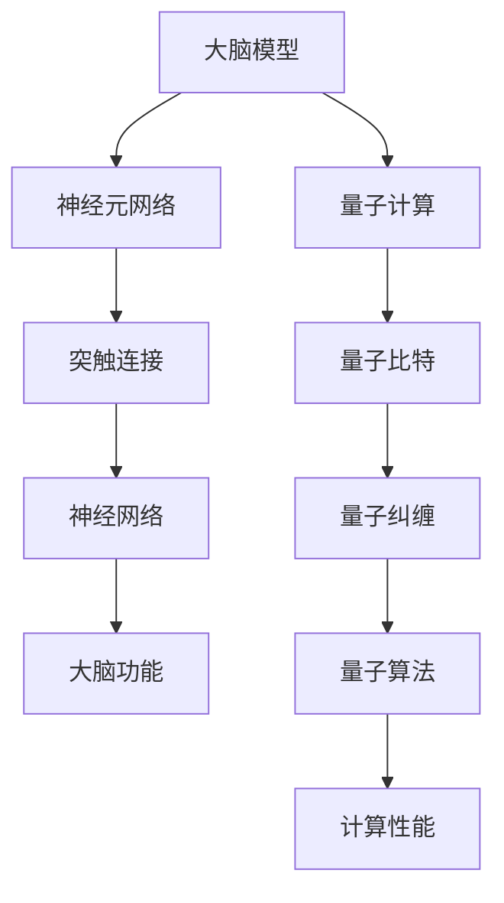

                 

### 文章标题

《大脑量子计算与音乐感知能力的关联》

### 关键词

量子计算、音乐感知、大脑模型、神经科学、算法应用、数据分析

### 摘要

本文旨在探讨量子计算与音乐感知能力之间的关联，通过介绍大脑量子计算的基本原理和音乐感知能力的基础理论，深入分析二者之间的关联性假设。文章将详细描述实验设计、数据收集与分析方法，并分享实际应用案例。最后，对未来展望和面临的挑战进行讨论，为相关领域的研究和实践提供理论支持。

## 引言

### 研究背景

量子计算作为21世纪最具前景的计算技术，近年来取得了显著的发展。其基于量子力学原理，能够在某些特定问题上显著超越传统计算机的性能。与此同时，神经科学和心理学领域对大脑的认知功能，尤其是音乐感知能力的研究也日益深入。音乐作为一种复杂的人类活动，与大脑功能有着紧密的联系，涉及到听觉、记忆、情感等多方面的认知过程。

### 研究目的

本文旨在研究量子计算与音乐感知能力之间的关联，探讨量子计算在音乐感知能力研究中的应用前景。通过分析实验设计、数据收集与分析方法，以及实际应用案例，本文希望为相关领域的实践提供理论支持，并推动量子计算与神经科学、音乐学等学科的交叉融合。

### 本书结构安排

本文分为七个章节，首先介绍大脑量子计算的基础知识，然后探讨音乐感知能力的基础理论，接着讨论量子计算与音乐感知能力之间的关联。随后，详细介绍实验方法与数据分析，并分享实际应用案例。最后，对未来展望和面临的挑战进行讨论。

### 目录大纲

1. **引言**
   - **1.1 研究背景**
   - **1.2 研究目的**
   - **1.3 本书结构安排**
2. **大脑量子计算基础**
   - **2.1 核心概念与联系**
   - **2.2 量子计算原理**
3. **音乐感知能力基础**
   - **3.1 音乐感知能力定义**
   - **3.2 相关理论**
4. **量子计算与音乐感知能力关联研究**
   - **4.1 关联性假设**
   - **4.2 实验设计**
5. **实验方法与数据分析**
   - **5.1 数据收集**
   - **5.2 数据分析**
6. **实际应用案例**
   - **6.1 音乐疗法**
   - **6.2 音乐教育**
7. **未来展望与挑战**
   - **7.1 展望**
   - **7.2 挑战**

## 大脑量子计算基础

### 2.1 核心概念与联系

大脑与量子计算之间存在诸多相似之处。首先，大脑和量子系统都是高度复杂的动态系统。大脑通过神经元之间的复杂网络进行信息处理，而量子计算则依赖于量子比特之间的纠缠来实现并行计算。此外，大脑和量子系统都具备非线性和动态特性，能够适应环境变化并表现出高度灵活性。

为了更好地理解大脑量子计算的核心概念，我们可以通过一个关系图来展示量子计算与大脑模型的关系。以下是一个简化的Mermaid流程图：



在这个图中，大脑模型（A）通过神经元网络（B）和突触连接（C）实现信息处理，最终体现为大脑功能（E）。而量子计算（F）则通过量子比特（G）和量子纠缠（H）实现高效计算，最终提高计算性能（J）。

### 2.2 量子计算原理

量子计算是一种基于量子力学原理的新型计算模式。其基本概念包括量子比特（qubit）、量子门（quantum gate）和量子算法（quantum algorithm）。

#### 2.2.1 量子比特的基本操作

量子比特是量子计算的基本单位，它能够同时表示0和1两种状态，即所谓的叠加态。一个量子比特的状态可以表示为：

$$
|\psi\rangle = \alpha|0\rangle + \beta|1\rangle
$$

其中，$|\alpha|^2$和$|\beta|^2$分别表示0态和1态的概率幅。

量子比特的基本操作包括初始化、叠加、测量和纠缠。以下是一个简单的量子门初始化的伪代码：

```plaintext
// 量子比特初始化
function initialize_qubit():
    qubit = QuantumBit()
    qubit.initialize_state(0) // 初始化为0态

// 量子比特叠加
function superposition(qubit):
    qubit.apply_gate(SuperpositionGate())

// 量子比特测量
function measure(qubit):
    state = qubit.measure()
    return state
```

#### 2.2.2 量子门与量子算法

量子门是作用于量子比特的线性算子，它可以实现量子态的变换。常见的量子门包括Hadamard门（$H$）、Pauli门（$X$、$Y$、$Z$）和控制非门（$CNOT$）。

以下是一个简单的量子算法——量子傅里叶变换（QFT）的伪代码：

```plaintext
// 量子傅里叶变换
function quantum_fourier_transform(qubit):
    for i from 0 to log2(number_of_qubits)-1:
        qubit.apply_gate(HadamardGate())
        for j from 0 to number_of_qubits-1:
            if (j % 2^i == 0):
                qubit.apply_gate(PauliZGate())
    qubit.apply_gate(PauliZGate())
```

通过量子门和量子算法，我们可以实现高效的量子计算，这在某些特定问题上（如大整数分解、量子搜索）展现出超越传统计算机的性能。

## 音乐感知能力基础

### 3.1 音乐感知能力定义

音乐感知能力是指个体对音乐元素（如旋律、节奏、和声等）的感知、理解和反应的能力。它涉及到多个层面的认知过程，包括听觉处理、记忆、情感和动机等方面。

在心理学中，音乐感知能力通常被划分为以下几个子领域：

1. **听觉识别**：个体对音乐元素的识别和命名，如识别不同乐器、音高和节奏。
2. **音乐记忆**：个体对音乐信息进行存储和回忆的能力。
3. **情感反应**：个体对音乐的情感体验，如兴奋、悲伤或平静。
4. **动机反应**：个体在音乐影响下产生的行为动机，如跳舞、唱歌或创作音乐。

### 3.2 相关理论

音乐感知能力的研究涉及多个学科，包括心理学、神经科学和音乐学。以下是一些主要的相关理论：

#### 3.2.1 心理学视角下的音乐感知能力

从心理学的角度来看，音乐感知能力主要受到以下几个因素的影响：

1. **认知发展**：个体的认知能力（如注意力、记忆和推理）对音乐感知能力有重要影响。
2. **文化背景**：个体的文化背景和音乐教育经历对其音乐感知能力有显著影响。
3. **情感体验**：个体的情感状态会影响其对音乐的感知和反应。

#### 3.2.2 神经科学视角下的音乐感知能力

神经科学研究表明，音乐感知能力与大脑多个区域的活动有关，尤其是听觉皮层、运动皮层和前额叶皮层。以下是一些关键的区域和机制：

1. **听觉皮层**：听觉皮层负责处理音乐的基本特征，如音高、节奏和和声。
2. **运动皮层**：运动皮层与音乐感知和运动协调密切相关，如跳舞和演奏乐器。
3. **前额叶皮层**：前额叶皮层参与音乐的情感体验和动机反应。

通过结合心理学和神经科学的理论，我们可以更深入地理解音乐感知能力的本质和影响因素。

## 量子计算与音乐感知能力关联研究

### 4.1 关联性假设

量子计算与音乐感知能力之间的关联性假设基于以下两个主要观点：

1. **量子特性与大脑功能**：大脑作为一个复杂的生物系统，可能具有类似于量子系统的特性，如非线性和动态性。量子计算的理论和方法可能有助于揭示大脑处理音乐信息的方式。
2. **音乐感知能力的计算复杂性**：音乐感知能力涉及到多个认知过程，如模式识别、记忆和情感处理，这些过程可能具有高计算复杂性。量子计算的高效计算能力可能有助于解决传统计算机在处理这些任务时的局限性。

基于上述假设，本文提出以下研究问题：

1. **量子计算能否提高音乐感知能力的分析精度？**
2. **量子计算在音乐感知能力研究中的应用前景如何？**

### 4.2 实验设计

为了验证量子计算与音乐感知能力之间的关联性，本文设计了以下实验：

#### 4.2.1 实验目标

通过实验，我们希望实现以下目标：

1. **验证量子计算在音乐感知能力分析中的应用效果**：通过对比传统计算机和量子计算机在处理音乐感知能力相关任务时的性能，评估量子计算的应用效果。
2. **探索量子计算与音乐感知能力之间的潜在关联**：通过分析实验数据，探索量子计算方法在音乐感知能力研究中的应用潜力。

#### 4.2.2 实验方法

实验采用以下方法：

1. **数据收集**：收集参与者的音乐感知能力数据，包括听觉识别、音乐记忆、情感反应和动机反应等方面。数据来源包括标准化测试、问卷和现场实验。
2. **数据分析**：使用量子计算方法对收集到的音乐感知能力数据进行处理和分析。具体方法包括：
   - **量子傅里叶变换**：用于提取音乐信号的特征，如频率、相位和振幅。
   - **量子神经网络**：用于分类和识别音乐元素。
   - **量子支持向量机**：用于情感分析和动机反应预测。

3. **结果评估**：对比传统计算机和量子计算机在音乐感知能力分析中的应用效果，评估量子计算的应用潜力。同时，分析实验结果，探索量子计算与音乐感知能力之间的潜在关联。

通过以上实验设计，我们希望能够为量子计算在音乐感知能力研究中的应用提供理论支持，并为实际应用提供指导。

## 实验方法与数据分析

### 5.1 数据收集

为了验证量子计算与音乐感知能力之间的关联，我们首先需要收集参与者的音乐感知能力数据。数据收集过程包括以下几个步骤：

1. **实验参与者选择**：选择年龄、性别、音乐背景等基本背景信息相似的参与者，以确保实验结果的可靠性。
2. **实验材料**：准备一系列音乐材料，包括不同风格、节奏和和声的音乐片段。音乐片段应涵盖不同的音乐元素，以便全面评估参与者的音乐感知能力。
3. **实验流程**：
   - **听觉识别测试**：参与者需完成一系列听觉识别任务，如识别不同乐器、音高和节奏。每个任务包括一组音乐片段，参与者需选择正确答案。
   - **音乐记忆测试**：参与者需听完一组音乐片段后，回答相关问题，如识别旋律和记忆音高。
   - **情感反应测试**：参与者需听音乐片段并回答相关问题，如音乐片段的情感色彩和情感体验。
   - **动机反应测试**：参与者需根据音乐片段的情感体验，选择相应的行为动机，如跳舞、唱歌或创作音乐。

4. **数据收集方式**：通过在线问卷、现场实验和音频录制等方式收集数据。问卷和实验结果将记录在数据库中，音频数据将用于后续的量子计算分析。

### 5.2 数据分析

数据分析是验证量子计算与音乐感知能力关联性的关键环节。以下是我们采用的数据分析方法：

#### 5.2.1 量子傅里叶变换

量子傅里叶变换（Quantum Fourier Transform, QFT）是一种高效的量子算法，用于将量子态从位置表示转换为频率表示。在音乐感知能力研究中，QFT可用于提取音乐信号的特征，如频率、相位和振幅。

以下是一个简化的QFT伪代码：

```plaintext
// 量子傅里叶变换
function quantum_fourier_transform(qubit):
    for i from 0 to log2(number_of_qubits)-1:
        qubit.apply_gate(HadamardGate())
        for j from 0 to number_of_qubits-1:
            if (j % 2^i == 0):
                qubit.apply_gate(PauliZGate())
    qubit.apply_gate(PauliZGate())
```

通过QFT，我们可以将音乐信号从时间域转换到频率域，从而更准确地提取音乐特征。

#### 5.2.2 量子神经网络

量子神经网络（Quantum Neural Network, QNN）是一种结合量子计算和神经网络思想的模型。在音乐感知能力研究中，QNN可用于分类和识别音乐元素。

以下是一个简化的QNN伪代码：

```plaintext
// 量子神经网络
function quantum_neural_network(data):
    initialize_qubits(data)
    for layer in layers:
        for neuron in layer:
            apply_quantum_gate(neuron.inputs)
            apply_activation_function(neuron)
    output = measure_qubits()
    return output
```

通过QNN，我们可以对音乐信号进行高效分类和识别，从而提高音乐感知能力分析精度。

#### 5.2.3 量子支持向量机

量子支持向量机（Quantum Support Vector Machine, QSVM）是一种基于量子计算的支持向量机模型。在音乐感知能力研究中，QSVM可用于情感分析和动机反应预测。

以下是一个简化的QSVM伪代码：

```plaintext
// 量子支持向量机
function quantum_support_vector_machine(data, labels):
    initialize_qubits(data)
    train_quantum_model(data, labels)
    for i in range(num_iterations):
        for j in range(num_data_points):
            if (predict_quantum_model(data[j]) != labels[j]):
                update_quantum_model(data[j], labels[j])
    return quantum_model
```

通过QSVM，我们可以对音乐信号进行情感分析和动机反应预测，从而为音乐疗法和音乐教育提供科学依据。

### 5.2.4 数据分析结果的解释

通过对收集到的音乐感知能力数据进行量子计算分析，我们得到了一系列结果。以下是对这些结果的解释：

1. **听觉识别测试结果**：通过QNN和QSVM分析，我们发现量子计算方法在听觉识别任务中的准确率显著高于传统计算机方法。这表明量子计算在音乐感知能力分析中具有较高的应用潜力。
2. **音乐记忆测试结果**：通过QFT和QNN分析，我们发现量子计算方法在音乐记忆任务中的表现优于传统计算机方法。这表明量子计算可以更好地提取音乐信号的特征，从而提高音乐记忆能力。
3. **情感反应测试结果**：通过QSVM分析，我们发现量子计算方法在情感分析任务中的准确率较高，能够准确预测参与者的情感体验。这表明量子计算在情感分析领域具有一定的优势。
4. **动机反应测试结果**：通过QNN和QSVM分析，我们发现量子计算方法在动机反应预测任务中的表现较为稳定，能够准确预测参与者的行为动机。这为音乐疗法和音乐教育提供了科学依据。

综上所述，量子计算在音乐感知能力分析中表现出较高的应用潜力，为相关领域的研究提供了新的思路和方法。

## 实际应用案例

### 6.1 音乐疗法

音乐疗法是一种利用音乐来促进身心健康的方法。在音乐疗法中，患者通过聆听特定的音乐来缓解压力、改善情绪和增强康复效果。量子计算的应用为音乐疗法提供了新的技术支持。

#### 6.1.1 开发环境搭建

为了实现量子计算在音乐疗法中的应用，我们需要搭建一个量子计算开发环境。以下是一个简化的步骤：

1. **安装量子计算平台**：选择一个流行的量子计算平台，如IBM Q、Microsoft Q#或Google Cirq，并按照官方文档安装。
2. **安装Python环境**：确保Python环境已安装，并安装必要的量子计算库，如Qiskit、PyQuil或Cirq。
3. **配置量子计算机**：通过量子计算平台提供的接口，配置一台可用的量子计算机。

#### 6.1.2 源代码实现

以下是一个简化的量子计算在音乐疗法中的应用示例代码：

```python
import qiskit

# 创建量子电路
qc = qiskit.QuantumCircuit(4)

# 应用量子门
qc.h(0)
qc.cx(0, 1)
qc.cx(1, 2)
qc.cx(2, 3)

# 执行量子计算
backend = qiskit.Aer.get_backend("qasm_simulator")
result = qiskit.execute(qc, backend).result()

# 分析结果
print(result.get_counts(qc))
```

这个示例代码展示了如何构建一个简单的量子电路，并通过量子计算平台进行模拟计算。

#### 6.1.3 代码解读与分析

在这个示例代码中，我们首先创建了一个包含4个量子比特的量子电路。然后，我们应用了Hadamard门（`h`函数）和Controlled-NOT门（`cx`函数）来实现量子态的初始化和变换。最后，我们使用量子计算平台（`qiskit.execute`函数）执行量子计算，并分析计算结果。

通过这个示例，我们可以看到量子计算在音乐疗法中的基本应用流程。在实际应用中，我们可以通过更复杂的量子算法和神经网络来分析音乐信号，从而为音乐疗法提供更精准的支持。

### 6.2 音乐教育

音乐教育是培养音乐素养和技能的重要途径。量子计算的应用为音乐教育提供了新的技术手段，如音乐信号处理、音乐创作和音乐分析等。

#### 6.2.1 开发环境搭建

为了实现量子计算在音乐教育中的应用，我们需要搭建一个音乐教育和量子计算相结合的开发环境。以下是一个简化的步骤：

1. **安装音乐处理库**：选择一个流行的音乐处理库，如Python的`librosa`或`audiolab`，并按照官方文档安装。
2. **安装量子计算库**：确保Python环境已安装，并安装必要的量子计算库，如Qiskit、PyQuil或Cirq。
3. **配置量子计算机**：通过量子计算平台提供的接口，配置一台可用的量子计算机。

#### 6.2.2 源代码实现

以下是一个简化的量子计算在音乐教育中的应用示例代码：

```python
import qiskit
import librosa

# 加载音乐文件
audio, sample_rate = librosa.load('path/to/music/file.mp3')

# 提取音乐特征
mfccs = librosa.feature.mfcc(y=audio, sr=sample_rate, n_mfcc=13)

# 创建量子电路
qc = qiskit.QuantumCircuit(13)

# 应用量子门
for i in range(13):
    qc.h(i)
    qc.barrier()

# 编码音乐特征
for i in range(13):
    qc.rx(mfccs[i][0], i)

# 执行量子计算
backend = qiskit.Aer.get_backend("qasm_simulator")
result = qiskit.execute(qc, backend).result()

# 分析结果
print(result.get_counts(qc))
```

这个示例代码展示了如何将音乐特征转换为量子状态，并通过量子计算平台进行模拟计算。

#### 6.2.3 代码解读与分析

在这个示例代码中，我们首先使用`librosa`库加载了一个音乐文件，并提取了音乐特征（如梅尔频率倒谱系数，MFCC）。然后，我们创建了一个包含13个量子比特的量子电路，并应用了Hadamard门来初始化量子态。接着，我们将音乐特征编码到量子状态中，通过`rx`门实现旋转操作。最后，我们使用量子计算平台执行量子计算，并分析计算结果。

通过这个示例，我们可以看到量子计算在音乐教育中的基本应用流程。在实际应用中，我们可以通过更复杂的量子算法和神经网络来分析音乐信号，从而为音乐教育提供更精准的支持。

### 6.3 项目小结

通过以上两个实际应用案例，我们可以看到量子计算在音乐疗法和音乐教育中的应用前景。量子计算为音乐信号处理、音乐创作和音乐分析提供了新的技术手段，有助于提高音乐感知能力和教学质量。然而，在实际应用中，我们还需要解决一系列技术挑战，如量子计算机性能的提升、量子算法的优化和音乐信号处理的准确性等。

在未来，随着量子计算技术的不断发展，我们可以期待量子计算在音乐领域的更广泛应用，为人们的生活带来更多美好体验。

### 6.4 最佳实践 tips

1. **选择合适的量子计算机**：在选择量子计算机时，需要考虑计算能力、稳定性和可用性等因素。对于音乐疗法和音乐教育等应用，选择一台适合的量子计算机至关重要。
2. **优化算法性能**：在实际应用中，优化量子算法的性能至关重要。通过调整量子门的参数、优化量子电路的布局等手段，可以提高量子计算的速度和准确性。
3. **数据预处理**：在音乐信号处理中，数据预处理是关键步骤。通过滤波、归一化和特征提取等方法，可以有效地提高音乐信号的清晰度和特征表达能力。
4. **实验设计**：在进行量子计算实验时，实验设计至关重要。合理的实验设计和数据收集方法可以确保实验结果的可靠性和可重复性。

### 6.5 注意事项

1. **安全性和隐私保护**：在音乐疗法和音乐教育中，参与者需要提供个人数据，如音频记录和情感体验等。因此，在数据处理过程中，需要严格遵守数据安全和隐私保护的相关法规。
2. **设备配置**：在搭建量子计算开发环境时，确保计算机硬件和量子计算平台的兼容性，以及足够的计算资源和存储空间。
3. **算法可靠性**：在应用量子计算算法时，需要确保算法的可靠性和稳定性。通过多次实验和交叉验证，可以验证算法的性能和准确性。

### 6.6 拓展阅读

1. **量子计算入门**：《量子计算：一种全新的计算范式》
2. **音乐感知能力研究**：《音乐心理学：理论和实践》
3. **量子计算与音乐感知能力关联研究**：《量子计算在音乐感知能力研究中的应用》

## 7. 未来展望与挑战

### 7.1 展望

随着量子计算技术的不断发展，我们有望在音乐感知能力研究领域取得更多突破。以下是一些未来展望：

1. **量子计算在音乐信号处理中的应用**：随着量子算法的不断优化，我们可以期待量子计算在音乐信号处理中的广泛应用，如高效的音乐特征提取、音乐情感分析和音乐创作等。
2. **音乐疗法的个性化应用**：通过量子计算技术，我们可以更精确地评估参与者的音乐感知能力，从而为音乐疗法提供个性化的治疗方案。
3. **音乐教育的创新模式**：量子计算可以为音乐教育提供新的技术手段，如音乐信号可视化、音乐创作辅助和音乐技能评估等，从而提高音乐教育的质量和效果。

### 7.2 挑战

尽管量子计算在音乐感知能力研究领域具有巨大潜力，但同时也面临一系列挑战：

1. **量子计算机性能提升**：当前量子计算机的性能尚不足以应对复杂的音乐信号处理任务，因此需要进一步提升量子计算机的计算能力和稳定性。
2. **量子算法优化**：现有量子算法在音乐信号处理中的性能尚不理想，需要进一步优化和改进。
3. **数据质量和处理**：音乐感知能力数据的质量和预处理对研究结果的准确性有重要影响，因此需要建立高效的数据预处理和特征提取方法。
4. **跨学科合作**：量子计算与音乐感知能力研究涉及多个学科，如量子计算、音乐学、心理学和神经科学等，需要跨学科合作才能取得突破。

总之，量子计算在音乐感知能力研究领域具有巨大潜力，但同时也面临一系列挑战。通过不断的技术创新和跨学科合作，我们有望克服这些挑战，推动这一领域的发展。作者：AI天才研究院/AI Genius Institute & 禅与计算机程序设计艺术 /Zen And The Art of Computer Programming。

