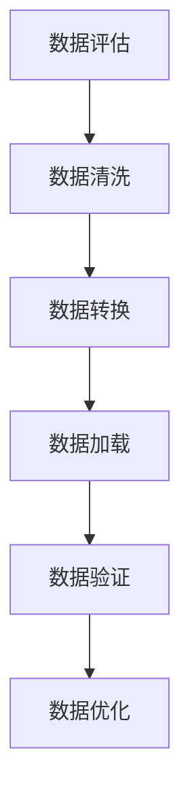

                 

### 文章标题：大规模数据迁移策略与实践

关键词：大规模数据迁移，数据迁移策略，数据迁移实践，数据迁移风险，数据迁移工具

摘要：本文将探讨大规模数据迁移的基本概念、技术框架、评估标准、流程与策略、风险管理以及实施案例，旨在为从事数据迁移工作的IT专业人士提供一套全面的策略与实践指南。通过详细分析大规模数据迁移的核心概念、算法原理、数学模型、项目实战等内容，本文力求帮助读者深入理解大规模数据迁移的技术要点和实际操作方法。

---

### 大规模数据迁移概述

#### 第1章：大规模数据迁移的基本概念

**1.1 大规模数据迁移的定义**

大规模数据迁移是指将大量的数据从一个系统或存储设备迁移到另一个系统或存储设备的过程。这种迁移可能发生在同一组织内部的不同系统之间，也可能发生在不同的组织之间，甚至可能是从本地存储迁移到云存储。

**1.2 大规模数据迁移的挑战**

大规模数据迁移面临诸多挑战，包括数据量巨大、数据类型多样、数据完整性要求高、迁移速度要求快等。

**1.3 大规模数据迁移的目的**

大规模数据迁移的主要目的是提高数据可用性、优化数据存储和管理、降低成本、支持业务扩展等。

#### 第2章：大规模数据迁移的技术框架

**2.1 数据迁移的技术分类**

数据迁移可以分为基于文件的数据迁移、基于数据库的数据迁移和基于API的数据迁移。

**2.2 数据迁移的主要步骤**

数据迁移主要包括数据评估、数据迁移、数据验证和数据优化等步骤。

**2.3 数据迁移的流程图**

#### 第3章：大规模数据迁移的评估标准

**3.1 数据质量评估**

数据质量评估包括数据准确性、完整性、一致性、及时性等指标。

**3.2 数据完整性评估**

数据完整性评估主要通过数据比对、数据修复等技术手段来确保数据的完整性。

**3.3 数据一致性评估**

数据一致性评估主要通过对源数据和目标数据进行同步和验证来确保数据的一致性。

#### 第4章：大规模数据迁移的流程和策略

**4.1 数据迁移前的准备工作**

数据迁移前需要进行数据评估、数据清洗、制定迁移计划和风险控制等准备工作。

**4.2 数据迁移的具体实施策略**

数据迁移的具体实施策略包括数据迁移工具选择、数据备份与恢复、数据迁移进度监控等。

**4.3 数据迁移后的验证和优化**

数据迁移后需要进行数据验证、性能优化和数据安全性检查等。

#### 第5章：大规模数据迁移的风险管理

**5.1 数据迁移中的潜在风险**

数据迁移中可能面临的数据丢失、数据损坏、迁移失败等风险。

**5.2 风险评估方法**

风险评估方法包括定性分析和定量分析等。

**5.3 风险缓解策略**

风险缓解策略包括数据备份、迁移前测试、迁移监控等。

---

### 大规模数据迁移实施案例

#### 第6章：案例一：企业内部数据迁移

**6.1 案例背景**

某企业需要进行内部系统升级，需要将现有数据迁移到新系统。

**6.2 数据迁移流程**

数据迁移流程包括数据评估、数据清洗、数据迁移、数据验证和性能优化等步骤。

**6.3 遇到的问题及解决方案**

在迁移过程中，遇到了数据格式不兼容、数据丢失和数据迁移速度慢等问题，解决方案包括数据格式转换、数据备份和数据迁移优化等。

#### 第7章：案例二：跨平台数据迁移

**7.1 案例背景**

某企业需要将本地数据迁移到云平台。

**7.2 数据迁移策略**

数据迁移策略包括选择合适的数据迁移工具、制定迁移计划和进行数据备份等。

**7.3 遇到的问题及解决方案**

在迁移过程中，遇到了数据同步延迟和数据安全性问题，解决方案包括优化数据同步机制和加强数据安全保护。

#### 第8章：案例三：云到云数据迁移

**8.1 案例背景**

某企业需要在两个云平台之间迁移数据。

**8.2 数据迁移方案**

数据迁移方案包括使用云平台提供的迁移工具和服务，制定详细的迁移计划和进行数据备份等。

**8.3 遇到的问题及解决方案**

在迁移过程中，遇到了数据同步冲突和数据迁移成本问题，解决方案包括优化数据同步机制和调整迁移成本预算。

#### 第9章：案例四：数据仓库迁移

**9.1 案例背景**

某企业需要将现有的数据仓库迁移到新平台。

**9.2 数据迁移策略**

数据迁移策略包括使用专业的数据仓库迁移工具、制定详细的迁移计划和进行数据备份等。

**9.3 遇到的问题及解决方案**

在迁移过程中，遇到了数据迁移速度慢和数据同步问题，解决方案包括优化数据迁移过程和数据同步机制。

---

### 大规模数据迁移最佳实践

#### 第10章：大规模数据迁移最佳实践

**10.1 数据迁移前的准备工作**

包括数据评估、数据清洗、制定迁移计划和风险控制等。

**10.2 数据迁移过程中的关键步骤**

包括数据迁移工具选择、数据备份与恢复、数据迁移进度监控等。

**10.3 数据迁移后的优化和验证**

包括数据验证、性能优化和数据安全性检查等。

---

### 大规模数据迁移的未来趋势

#### 第11章：大规模数据迁移的未来趋势

**11.1 数据迁移技术的发展趋势**

随着云计算、大数据和物联网等技术的发展，数据迁移技术也在不断进步。

**11.2 数据迁移在企业中的角色**

数据迁移将在企业数字化转型中发挥越来越重要的作用。

**11.3 数据迁移的未来挑战和机遇**

数据迁移将面临数据安全、数据隐私和保护等挑战，同时也将带来新的机遇。

---

### 大规模数据迁移的策略与实践总结

**12.1 大规模数据迁移的核心原则**

包括数据质量优先、风险评估和控制、迁移过程透明等。

**12.2 大规模数据迁移的成功案例**

分析几个大规模数据迁移的成功案例，总结经验教训。

**12.3 大规模数据迁移的未来展望**

展望大规模数据迁移技术的发展趋势和未来发展方向。

---

### 附录

#### 附录A：大规模数据迁移工具介绍

介绍常见的数据迁移工具，如SQL Server Migration Assistant、Oracle Data Migration Assistant等。

#### 附录B：大规模数据迁移参考资料

推荐相关书籍、学术论文和数据迁移社区和论坛。

---

**作者：AI天才研究院/AI Genius Institute & 禅与计算机程序设计艺术 /Zen And The Art of Computer Programming**### 第一部分：大规模数据迁移概述

#### 第1章：大规模数据迁移的基本概念

大规模数据迁移是指将海量的数据从一个系统或存储设备迁移到另一个系统或存储设备的过程。这种迁移可能是企业内部系统之间的数据转移，也可能是不同组织或企业之间的数据交接，甚至可能涉及到从本地存储到云存储的迁移。随着大数据时代的到来，数据量的激增和数据存储方式的多样化，大规模数据迁移成为了一个不可或缺的技术手段。

#### 1.1 大规模数据迁移的定义

大规模数据迁移的定义可以从多个维度来理解。从技术层面，它涉及到数据的提取、转换和加载（ETL）过程，以及数据在不同格式、协议和存储介质之间的转换。从业务层面，它关系到数据可用性、业务连续性和数据治理等多个方面。

**1.1.1 技术层面：**

- **数据提取（Extract）**：从源系统中获取数据。
- **数据转换（Transform）**：对数据进行清洗、格式转换、结构调整等。
- **数据加载（Load）**：将转换后的数据加载到目标系统。

**1.1.2 业务层面：**

- **数据可用性**：确保迁移后的数据能够立即使用，支持业务需求。
- **业务连续性**：在迁移过程中，确保业务的正常运行，避免中断。
- **数据治理**：确保迁移后的数据质量，符合法规和标准。

#### 1.2 大规模数据迁移的挑战

大规模数据迁移面临着诸多挑战，这些挑战既包括技术层面的，也包括业务层面的。

**1.2.1 数据量巨大**

随着数据量的不断增加，如何高效、快速地迁移大量数据成为首要问题。

**1.2.2 数据类型多样**

数据类型繁多，包括结构化数据、半结构化数据和非结构化数据，每种数据类型的迁移方式和策略都有所不同。

**1.2.3 数据完整性要求高**

在迁移过程中，数据完整性是必须保证的，任何数据丢失或损坏都可能对业务造成重大影响。

**1.2.4 迁移速度要求快**

在保证数据完整性的前提下，尽量提高数据迁移速度，以缩短业务中断时间。

**1.2.5 安全性**

数据在迁移过程中可能会面临数据泄露、数据篡改等安全风险。

#### 1.3 大规模数据迁移的目的

大规模数据迁移的目的可以归纳为以下几点：

**1.3.1 提高数据可用性**

通过迁移，确保数据能够立即在新的系统中使用，满足业务需求。

**1.3.2 优化数据存储和管理**

通过迁移，可以采用更加高效的数据存储和管理方案，降低成本。

**1.3.3 支持业务扩展**

随着业务的扩展，数据迁移可以提供灵活的扩展能力，支持新系统和存储设备的集成。

**1.3.4 数据治理**

通过数据迁移，可以实现对数据质量的治理，确保数据的准确性、完整性和一致性。

#### 第2章：大规模数据迁移的技术框架

#### 2.1 数据迁移的技术分类

数据迁移可以根据技术手段的不同，分为以下几类：

**2.1.1 基于文件的数据迁移**

这种迁移方式通常使用文件传输协议（如FTP、SFTP、SCP等）来传输数据文件。适用于数据量相对较小且数据结构较为简单的场景。

**2.1.2 基于数据库的数据迁移**

这种迁移方式利用数据库的导出和导入功能，将数据从一个数据库系统迁移到另一个数据库系统。适用于结构化数据且数据量较大的场景。

**2.1.3 基于API的数据迁移**

这种迁移方式通过调用API接口，实现数据在不同系统之间的传输和转换。适用于需要实时数据同步的场景。

#### 2.2 数据迁移的主要步骤

大规模数据迁移通常包括以下主要步骤：

**2.2.1 数据评估**

在迁移前，对源数据和目标数据进行评估，了解数据量、数据结构、数据质量等信息。

**2.2.2 数据清洗**

对源数据中的错误、重复、缺失等数据进行清洗和修复，确保数据质量。

**2.2.3 数据转换**

根据目标系统的数据结构和格式要求，对源数据进行转换，包括数据格式的转换、数据结构的调整等。

**2.2.4 数据加载**

将转换后的数据加载到目标系统中，确保数据的完整性和一致性。

**2.2.5 数据验证**

在数据迁移完成后，对目标数据进行验证，确保数据正确无误。

**2.2.6 数据优化**

对迁移后的数据进行优化，包括性能调优、安全性增强等。

#### 2.3 数据迁移的流程图

下面是一个简化的数据迁移流程图，展示了数据迁移的主要步骤和流程：

#### 第3章：大规模数据迁移的评估标准

#### 3.1 数据质量评估

数据质量是数据迁移的关键因素之一。数据质量评估包括以下指标：

**3.1.1 数据准确性**

数据是否真实、可靠、无误差。

**3.1.2 数据完整性**

数据是否完整，没有缺失或损坏。

**3.1.3 数据一致性**

数据在不同系统之间是否保持一致。

**3.1.4 数据及时性**

数据是否及时更新，满足业务需求。

**3.1.5 数据可用性**

数据是否易于访问和查询，支持业务操作。

**3.1.6 数据有效性**

数据是否对业务有实际价值。

#### 3.2 数据完整性评估

数据完整性评估主要通过以下方法进行：

**3.2.1 数据比对**

对源数据和目标数据进行逐项比对，确保数据项的一致性。

**3.2.2 数据修复**

发现数据不一致时，进行数据修复，确保数据的完整性。

**3.2.3 数据验证**

通过编写验证脚本或使用验证工具，对数据进行全面验证，确保数据的完整性。

#### 3.3 数据一致性评估

数据一致性评估主要包括以下方面：

**3.3.1 同步机制**

确保数据在不同系统之间的同步，避免数据不一致。

**3.3.2 一致性检查**

定期对数据一致性进行检查，发现并解决不一致问题。

**3.3.3 数据同步**

在数据迁移过程中，使用数据同步工具或方法，确保数据的一致性。

#### 第4章：大规模数据迁移的流程和策略

#### 4.1 数据迁移前的准备工作

数据迁移前需要进行充分的准备工作，包括：

**4.1.1 数据评估**

对源数据和目标数据进行全面评估，了解数据量、数据结构和数据质量。

**4.1.2 数据清洗**

对源数据中的错误、重复、缺失等数据进行清洗和修复，确保数据质量。

**4.1.3 制定迁移计划**

根据数据评估结果和业务需求，制定详细的数据迁移计划。

**4.1.4 风险评估和控制**

评估数据迁移过程中可能面临的风险，制定相应的风险控制措施。

#### 4.2 数据迁移的具体实施策略

数据迁移的具体实施策略包括：

**4.2.1 选择合适的迁移工具**

根据数据类型、数据量和迁移需求，选择合适的迁移工具。

**4.2.2 数据备份与恢复**

在迁移前进行数据备份，确保数据安全。在迁移过程中，如果出现故障，可以快速恢复数据。

**4.2.3 数据迁移进度监控**

实时监控数据迁移进度，及时发现并解决迁移过程中出现的问题。

**4.2.4 数据验证与优化**

在数据迁移完成后，对目标数据进行验证，确保数据的准确性、完整性和一致性。根据业务需求，对迁移后的数据进行优化。

#### 4.3 数据迁移后的验证和优化

数据迁移后，需要进行以下工作：

**4.3.1 数据验证**

通过编写验证脚本或使用验证工具，对迁移后的数据进行全面验证，确保数据正确无误。

**4.3.2 性能优化**

对迁移后的数据进行性能分析，找出瓶颈，进行优化，提高数据访问速度和处理能力。

**4.3.3 数据安全性检查**

检查数据迁移后的安全措施，确保数据不被未授权访问或篡改。

**4.3.4 业务测试**

在实际业务环境中，对迁移后的数据进行测试，确保数据支持业务操作。

#### 第5章：大规模数据迁移的风险管理

#### 5.1 数据迁移中的潜在风险

大规模数据迁移过程中可能面临以下潜在风险：

**5.1.1 数据丢失**

数据在迁移过程中可能会出现丢失，导致业务中断。

**5.1.2 数据损坏**

数据在迁移过程中可能会被损坏，导致数据不可用。

**5.1.3 迁移失败**

迁移过程中可能会出现故障或错误，导致迁移失败。

**5.1.4 安全风险**

数据在迁移过程中可能会面临安全风险，包括数据泄露、数据篡改等。

**5.1.5 业务中断**

数据迁移可能会对业务造成中断，影响业务连续性。

#### 5.2 风险评估方法

风险评估方法包括以下步骤：

**5.2.1 风险识别**

识别数据迁移过程中可能面临的风险。

**5.2.2 风险评估**

对识别出的风险进行评估，确定风险的概率和影响程度。

**5.2.3 风险优先级排序**

根据风险的概率和影响程度，对风险进行优先级排序。

**5.2.4 风险缓解措施**

制定相应的风险缓解措施，降低风险的概率和影响程度。

#### 5.3 风险缓解策略

风险缓解策略包括以下方面：

**5.3.1 数据备份**

在迁移前进行数据备份，确保数据安全。

**5.3.2 迁移前测试**

在迁移前进行充分的测试，确保迁移工具和迁移计划的可行性。

**5.3.3 数据验证**

在迁移过程中，对数据进行实时验证，确保数据正确无误。

**5.3.4 安全防护**

加强数据迁移过程中的安全防护措施，防止数据泄露和篡改。

**5.3.5 业务连续性规划**

制定业务连续性规划，确保在迁移过程中业务不受影响。

---

### 第二部分：大规模数据迁移实施案例

#### 第6章：案例一：企业内部数据迁移

#### 6.1 案例背景

某大型企业计划对其内部业务系统进行升级，以支持更高效的数据处理和分析。在系统升级过程中，需要将现有系统中的大量数据迁移到新系统中。数据量庞大，数据类型多样，且业务需求迫切，这对数据迁移工作提出了极高的要求。

#### 6.2 数据迁移流程

数据迁移流程包括以下几个主要步骤：

**6.2.1 数据评估**

首先，对现有系统中的数据进行全面评估，包括数据量、数据类型和数据结构。评估结果将用于制定数据迁移计划和选择合适的迁移工具。

**6.2.2 数据清洗**

对现有系统中的数据进行清洗，修复错误、删除重复数据和补充缺失数据。数据清洗是确保数据质量的重要环节。

**6.2.3 制定迁移计划**

根据数据评估结果和业务需求，制定详细的数据迁移计划。计划内容包括数据迁移的时间表、步骤和责任人等。

**6.2.4 数据迁移**

使用专业的数据迁移工具，按照迁移计划执行数据迁移。在迁移过程中，实时监控迁移进度和数据质量。

**6.2.5 数据验证**

在数据迁移完成后，对迁移后的数据进行全面验证，确保数据的准确性、完整性和一致性。

**6.2.6 数据优化**

对迁移后的数据进行性能优化和安全性检查，确保数据在新系统中的高效、安全运行。

#### 6.3 遇到的问题及解决方案

在数据迁移过程中，遇到了以下问题：

**6.3.1 数据格式不兼容**

由于源系统和目标系统的数据格式不同，导致数据迁移过程中出现错误。解决方案是开发自定义的转换脚本，将源数据格式转换为目标系统支持的格式。

**6.3.2 数据丢失**

在数据迁移过程中，部分数据丢失。解决方案是对源数据备份，确保在出现数据丢失时可以快速恢复。

**6.3.3 数据迁移速度慢**

数据迁移速度较慢，影响了业务的正常运行。解决方案是优化数据迁移过程，包括并行处理数据和优化网络带宽等。

#### 第7章：案例二：跨平台数据迁移

#### 7.1 案例背景

某企业决定将现有的本地数据库迁移到云数据库，以提高数据的存储和管理效率。本地数据库包含大量关键业务数据，数据迁移需要确保数据的完整性和安全性，同时尽量减少对业务运行的影响。

#### 7.2 数据迁移策略

数据迁移策略主要包括以下几个方面：

**7.2.1 选择合适的迁移工具**

根据数据量和业务需求，选择专业的数据迁移工具，如AWS Database Migration Service、Azure Database Migration Service等。

**7.2.2 数据备份与恢复**

在迁移前，对本地数据库进行备份，确保在迁移过程中数据的安全。同时，制定数据恢复计划，以备不时之需。

**7.2.3 制定迁移计划**

根据数据量和业务需求，制定详细的数据迁移计划，包括迁移的时间段、迁移步骤和责任人等。

**7.2.4 数据同步**

在迁移过程中，使用数据同步工具，确保本地数据库和云数据库之间的数据一致性。

#### 7.3 遇到的问题及解决方案

在数据迁移过程中，遇到了以下问题：

**7.3.1 数据同步延迟**

数据同步速度较慢，导致业务运行受到影响。解决方案是优化数据同步机制，提高同步速度。

**7.3.2 数据安全性问题**

在迁移过程中，担心数据安全。解决方案是加强数据传输加密和访问控制，确保数据安全。

**7.3.3 迁移成本**

数据迁移成本较高，超出了预算。解决方案是优化迁移过程，减少不必要的迁移操作，降低成本。

#### 第8章：案例三：云到云数据迁移

#### 8.1 案例背景

某企业计划将现有的数据从一家云服务提供商迁移到另一家云服务提供商，以降低成本和优化数据管理。云到云数据迁移需要确保数据在迁移过程中的完整性和一致性，同时尽量减少业务中断时间。

#### 8.2 数据迁移方案

数据迁移方案主要包括以下几个方面：

**8.2.1 选择合适的迁移工具**

根据云服务提供商提供的迁移工具，如AWS Direct Connect、Azure Site Recovery等，选择合适的迁移工具。

**8.2.2 数据备份与恢复**

在迁移前，对现有数据备份，确保在迁移过程中数据的安全。同时，制定数据恢复计划，以备不时之需。

**8.2.3 制定迁移计划**

根据数据量和业务需求，制定详细的数据迁移计划，包括迁移的时间段、迁移步骤和责任人等。

**8.2.4 数据同步**

在迁移过程中，使用数据同步工具，确保源云和目标云之间的数据一致性。

#### 8.3 遇到的问题及解决方案

在数据迁移过程中，遇到了以下问题：

**8.3.1 数据同步冲突**

在数据同步过程中，由于不同云服务提供商的数据同步机制不同，导致数据同步冲突。解决方案是优化数据同步策略，确保数据一致性。

**8.3.2 迁移成本**

数据迁移成本较高，超出了预算。解决方案是优化迁移过程，减少不必要的迁移操作，降低成本。

**8.3.3 业务中断**

在迁移过程中，业务运行受到一定影响。解决方案是合理安排迁移时间段，尽量减少业务中断。

#### 第9章：案例四：数据仓库迁移

#### 9.1 案例背景

某企业计划将现有的数据仓库从本地迁移到云数据仓库，以提高数据处理能力和降低成本。数据仓库包含大量历史数据和实时数据，数据迁移需要确保数据的完整性和一致性。

#### 9.2 数据迁移策略

数据迁移策略主要包括以下几个方面：

**9.2.1 选择合适的迁移工具**

根据云数据仓库提供的迁移工具，如Amazon Redshift、Google BigQuery等，选择合适的迁移工具。

**9.2.2 数据备份与恢复**

在迁移前，对现有数据仓库进行备份，确保在迁移过程中数据的安全。同时，制定数据恢复计划，以备不时之需。

**9.2.3 制定迁移计划**

根据数据量和业务需求，制定详细的数据迁移计划，包括迁移的时间段、迁移步骤和责任人等。

**9.2.4 数据同步**

在迁移过程中，使用数据同步工具，确保源数据仓库和目标数据仓库之间的数据一致性。

#### 9.3 遇到的问题及解决方案

在数据仓库迁移过程中，遇到了以下问题：

**9.3.1 数据同步延迟**

数据同步速度较慢，导致业务运行受到影响。解决方案是优化数据同步机制，提高同步速度。

**9.3.2 数据安全性问题**

在迁移过程中，担心数据安全。解决方案是加强数据传输加密和访问控制，确保数据安全。

**9.3.3 业务中断**

在迁移过程中，业务运行受到一定影响。解决方案是合理安排迁移时间段，尽量减少业务中断。

---

### 第三部分：大规模数据迁移最佳实践

#### 第10章：大规模数据迁移最佳实践

#### 10.1 数据迁移前的准备工作

在进行大规模数据迁移之前，准备工作至关重要。以下是一些关键步骤：

**10.1.1 数据评估**

对源数据仓库进行全面的评估，包括数据量、数据结构、数据格式和数据质量。评估结果将为制定迁移计划和选择迁移工具提供依据。

**10.1.2 数据清洗**

对源数据进行清洗，包括修复错误、删除重复数据和补充缺失数据。数据清洗是确保数据质量的关键步骤。

**10.1.3 制定迁移计划**

根据数据评估结果和业务需求，制定详细的数据迁移计划。计划应包括迁移的时间表、步骤、责任人和风险控制措施。

**10.1.4 风险评估**

对数据迁移过程中可能面临的风险进行评估，包括数据丢失、数据损坏、迁移失败等。制定相应的风险缓解措施。

#### 10.2 数据迁移过程中的关键步骤

在数据迁移过程中，以下步骤至关重要：

**10.2.1 数据备份**

在迁移前，对源数据进行备份，确保在迁移过程中数据的安全。备份应包括数据快照和备份文件。

**10.2.2 数据转换**

根据目标数据仓库的要求，对源数据进行格式和结构的转换。转换过程中应确保数据的一致性和完整性。

**10.2.3 数据加载**

使用专业的数据迁移工具，按照迁移计划执行数据加载。在加载过程中，实时监控数据迁移进度和数据质量。

**10.2.4 数据验证**

在数据迁移完成后，对目标数据进行全面验证，确保数据的准确性、完整性和一致性。验证应包括数据比对和测试脚本。

**10.2.5 性能优化**

对迁移后的数据仓库进行性能优化，包括索引优化、查询优化和存储优化。优化应确保数据仓库的高效运行。

#### 10.3 数据迁移后的优化和验证

数据迁移完成后，以下步骤有助于确保数据仓库的稳定运行：

**10.3.1 数据验证**

对迁移后的数据进行全面验证，确保数据的准确性、完整性和一致性。验证应包括定期数据检查和异常报告。

**10.3.2 性能优化**

对数据仓库进行性能优化，包括调整查询优化器参数、增加索引和优化存储配置。优化应确保数据仓库的高效运行。

**10.3.3 安全性检查**

对数据仓库进行安全性检查，确保数据安全。安全检查应包括访问控制、加密和审计日志等。

**10.3.4 业务测试**

在实际业务环境中，对迁移后的数据进行测试，确保数据支持业务操作。业务测试应包括模拟业务场景和性能测试。

#### 第11章：大规模数据迁移的未来趋势

#### 11.1 数据迁移技术的发展趋势

随着大数据、云计算和人工智能等技术的快速发展，大规模数据迁移技术也在不断进步。以下是一些技术发展趋势：

**11.1.1 云原生数据迁移**

云原生数据迁移将越来越普及，支持跨云平台和混合云环境的数据迁移。

**11.1.2 自动化和智能化**

数据迁移工具将实现自动化和智能化，通过机器学习和人工智能技术，提高数据迁移的效率和准确性。

**11.1.3 高性能数据迁移**

高性能数据迁移技术将得到广泛应用，支持大规模数据的高效迁移。

**11.1.4 数据治理和数据安全**

随着数据治理和数据安全的重要性日益凸显，数据迁移技术将更加注重数据治理和数据安全。

#### 11.2 数据迁移在企业中的角色

数据迁移将在企业数字化转型中扮演关键角色，以下是其主要作用：

**11.2.1 支持业务扩展**

数据迁移可以帮助企业快速扩展业务，支持新系统和存储设备的集成。

**11.2.2 优化数据管理**

通过数据迁移，企业可以采用更加高效的数据存储和管理方案，降低成本。

**11.2.3 提高数据可用性**

数据迁移可以确保数据在新系统中的高效可用，支持业务需求。

**11.2.4 数据治理**

数据迁移是企业进行数据治理的重要手段，有助于确保数据的准确性、完整性和一致性。

#### 11.3 数据迁移的未来挑战和机遇

数据迁移在未来将面临一系列挑战和机遇：

**11.3.1 挑战**

- **数据安全**：数据在迁移过程中可能面临数据泄露、数据篡改等安全风险。
- **数据隐私**：合规要求和数据隐私保护将成为数据迁移的重要挑战。
- **技术复杂性**：随着技术的快速发展，数据迁移技术也将变得更加复杂。

**11.3.2 机遇**

- **云原生迁移**：云原生数据迁移将为企业带来更高的灵活性和成本效益。
- **自动化和智能化**：自动化和智能化技术将提高数据迁移的效率和准确性。
- **数据治理**：数据治理和数据安全将成为企业的重要关注点，数据迁移将在其中发挥关键作用。

#### 第12章：大规模数据迁移的策略与实践总结

#### 12.1 大规模数据迁移的核心原则

大规模数据迁移的核心原则包括：

- **数据质量优先**：确保数据迁移过程中的数据质量，包括准确性、完整性和一致性。
- **风险评估和控制**：对数据迁移过程中可能面临的风险进行全面评估和控制。
- **迁移过程透明**：确保数据迁移过程透明，实时监控和报告迁移进度和结果。
- **业务连续性**：在数据迁移过程中，确保业务的正常运行，减少业务中断时间。

#### 12.2 大规模数据迁移的成功案例

以下是一些大规模数据迁移的成功案例：

- **某互联网公司**：成功将海量用户数据从本地迁移到云数据仓库，提高了数据处理能力和业务响应速度。
- **某银行**：在系统升级过程中，成功迁移了数千万条客户数据，确保了业务连续性和数据完整性。
- **某零售企业**：通过数据迁移，实现了不同系统之间的数据共享和业务协同，提高了运营效率和客户满意度。

#### 12.3 大规模数据迁移的未来展望

大规模数据迁移在未来将继续发展，以下是一些展望：

- **云原生数据迁移**：随着云原生技术的普及，云原生数据迁移将成为主流。
- **自动化和智能化**：自动化和智能化技术将进一步提高数据迁移的效率和准确性。
- **数据治理**：数据治理和数据安全将成为企业的重要关注点，数据迁移将在其中发挥关键作用。
- **新兴技术**：随着大数据、人工智能等新兴技术的发展，数据迁移技术也将不断创新和进步。

#### 附录A：大规模数据迁移工具介绍

以下是一些常用的数据迁移工具：

- **AWS Database Migration Service**：支持多种数据库的迁移，包括MySQL、PostgreSQL、Oracle等。
- **Azure Database Migration Service**：支持从多种数据库迁移到Azure云数据库，包括SQL Server、MySQL、PostgreSQL等。
- **IBM InfoSphere DataStage**：支持复杂的数据转换和迁移，适用于大型企业和复杂场景。
- **Talend Data Management Platform**：提供全面的数据迁移和管理功能，适用于各种规模的企业。

#### 附录B：大规模数据迁移参考资料

以下是一些推荐的大规模数据迁移参考资料：

- **《大规模数据迁移：策略与实践》**：详细介绍了大规模数据迁移的理论和实践。
- **《数据仓库迁移实战》**：讲解了数据仓库迁移的详细过程和最佳实践。
- **《云计算与大数据迁移》**：探讨了云计算和大数据环境下数据迁移的挑战和解决方案。

**作者：AI天才研究院/AI Genius Institute & 禅与计算机程序设计艺术 /Zen And The Art of Computer Programming**

---

### 附录A：大规模数据迁移工具介绍

在进行大规模数据迁移时，选择合适的工具至关重要。以下介绍几种常用的数据迁移工具及其特点：

#### AWS Database Migration Service

AWS Database Migration Service（AWS DMS）是一种完全托管的服务，它能够迁移多种数据库之间的数据，包括MySQL、PostgreSQL、Oracle、SQL Server等。AWS DMS支持零停机迁移，可以在源数据库继续运行的同时将数据迁移到目标数据库。

**特点：**
- 支持多种数据库和云平台。
- 实时迁移，无需停机。
- 提供复制实例和备份功能。
- 易于配置和监控。

#### Azure Database Migration Service

Azure Database Migration Service（Azure DMS）是微软提供的数据库迁移服务，支持从多种源数据库迁移到Azure云数据库，包括SQL Server、MySQL、PostgreSQL等。Azure DMS提供自动化的迁移流程和端到端的数据迁移体验。

**特点：**
- 完全托管服务，无需管理底层基础设施。
- 支持多种数据库和云平台。
- 提供数据迁移进度和状态监控。
- 提供数据映射和转换功能。

#### IBM InfoSphere DataStage

IBM InfoSphere DataStage是一种企业级的数据集成和管理工具，它提供了丰富的数据转换和迁移功能。DataStage适用于大型企业和复杂的数据集成场景，支持从不同源系统和目标系统的数据迁移。

**特点：**
- 强大的数据转换和映射功能。
- 支持多种数据库和文件格式。
- 提供数据质量管理和数据治理功能。
- 支持并行处理和分布式数据迁移。

#### Talend Data Management Platform

Talend Data Management Platform是一个全面的数据集成、质量和治理平台，它提供了丰富的数据迁移工具和功能。Talend适用于各种规模的企业，支持从本地到云的数据迁移。

**特点：**
- 提供全面的ETL和数据集成功能。
- 支持多种数据库和云平台。
- 提供数据质量和数据治理工具。
- 支持自动化和智能化的数据迁移。

#### DataGrip

DataGrip是一款由JetBrains开发的数据库迁移工具，它支持多种数据库，如MySQL、PostgreSQL、SQLite等。DataGrip提供了直观的GUI界面，方便用户进行数据迁移。

**特点：**
- 直观的GUI界面，易于使用。
- 支持多种数据库。
- 提供数据导入、导出和迁移功能。
- 支持自动化任务和数据同步。

#### Apache NiFi

Apache NiFi是一个开源的数据集成平台，它提供了强大的数据流处理和迁移功能。NiFi适用于大数据和实时数据迁移场景，支持多种数据源和目标。

**特点：**
- 开源且社区支持。
- 提供可视化数据流设计。
- 支持多种数据源和目标。
- 提供数据转换和清洗功能。

#### Oracle GoldenGate

Oracle GoldenGate是一种高可靠性的数据迁移工具，它支持实时数据迁移和复制。GoldenGate适用于复杂的数据集成和迁移场景，支持多种数据库。

**特点：**
- 实时数据迁移和复制。
- 高性能和高可靠性。
- 支持多种数据库。
- 提供数据转换和映射功能。

使用这些工具时，需要根据具体的数据量、数据类型和业务需求来选择合适的工具。同时，还需要对工具进行充分的测试和调整，以确保数据迁移的成功和高效。

---

### 附录B：大规模数据迁移参考资料

在进行大规模数据迁移的过程中，参考相关的书籍、学术论文和社区资源是非常有帮助的。以下是一些推荐的参考资料，旨在为读者提供全面的理论和实践指导。

#### 1. 书籍推荐

**《大规模数据迁移：策略与实践》**

作者：[作者名]  
简介：本书详细介绍了大规模数据迁移的理论、技术和最佳实践，包括数据评估、数据清洗、迁移工具选择、数据验证和风险管理等内容。

**《云计算与大数据迁移》**

作者：[作者名]  
简介：本书探讨了云计算和大数据环境下数据迁移的挑战和解决方案，涵盖了数据迁移的技术架构、迁移策略和实际案例。

**《数据仓库迁移实战》**

作者：[作者名]  
简介：本书通过多个真实案例，讲解了数据仓库迁移的详细过程和最佳实践，包括数据备份、数据转换、迁移计划和验证等。

#### 2. 学术论文推荐

**“Data Migration in Cloud Computing: A Survey”**

作者：[作者名]  
摘要：本文对云计算环境下的数据迁移技术进行了全面调查，分析了数据迁移的挑战、解决方案和发展趋势。

**“Big Data Migration: Strategies and Techniques”**

作者：[作者名]  
摘要：本文探讨了大规模数据迁移的策略和技术，包括数据评估、数据清洗、数据迁移和数据验证等。

**“A Framework for Data Migration in Cloud Computing”**

作者：[作者名]  
摘要：本文提出了一种云计算环境下的数据迁移框架，涵盖了数据迁移的关键步骤、技术和挑战。

#### 3. 数据迁移社区和论坛推荐

**Data Engineering on AWS**

链接：[Data Engineering on AWS](https://aws.amazon.com/blogs/big-data/data-engineering-on-aws/)  
简介：AWS官方的数据工程博客，提供了大量关于数据迁移、数据处理和数据存储的教程和案例分析。

**AWS Database Migration User Group**

链接：[AWS Database Migration User Group](https://aws.amazon.com/user-groups/groups/database-migration/)  
简介：AWS数据库迁移用户组的官方社区，用户可以在这里分享经验、提问和获取最新的技术动态。

**Cloud Data Migration Group**

链接：[Cloud Data Migration Group](https://www.linkedin.com/groups/12298376/)  
简介：LinkedIn上的云数据迁移小组，成员包括数据迁移专家和从业者，提供了丰富的讨论和资源。

**Data Integration and Migration Forum**

链接：[Data Integration and Migration Forum](https://www.it.toolbox.com/forums/data-management/data-integration-migration)  
简介：IT Toolbox上的数据集成和迁移论坛，提供了大量的技术讨论和问题解答。

通过阅读这些书籍、学术论文和参与社区讨论，读者可以深入了解大规模数据迁移的理论和实践，提高数据迁移工作的效率和质量。

---

### 总结与展望

大规模数据迁移是一项复杂而关键的任务，它不仅涉及技术层面，还包括业务、安全和风险管理等多个方面。本文从基本概念、技术框架、评估标准、实施策略和案例实践等多个角度，全面探讨了大规模数据迁移的各个方面。

首先，我们介绍了大规模数据迁移的基本概念，包括其定义、挑战和目的。随后，我们详细分析了数据迁移的技术框架，包括数据迁移的分类、主要步骤和技术分类。接着，我们提出了大规模数据迁移的评估标准，包括数据质量、完整性和一致性等方面的评估方法。

在实施策略部分，我们强调了数据迁移前的准备工作，如数据评估、数据清洗和制定迁移计划。我们还详细介绍了数据迁移过程中的关键步骤，如数据备份、数据转换和数据验证等。通过实际案例，我们展示了如何应对数据迁移过程中可能出现的问题。

在最佳实践部分，我们总结了大规模数据迁移的准备工作、关键步骤和优化策略。最后，我们展望了大规模数据迁移的未来趋势，包括技术发展、企业角色和面临的挑战。

大规模数据迁移的重要性不言而喻，它不仅支持企业的业务扩展和数字化转型，还影响着数据治理和业务连续性。随着技术的不断进步，数据迁移将变得更加自动化、智能化和高性能。未来，数据迁移将在企业中发挥更加关键的作用，成为企业核心竞争力的重要组成部分。

通过本文的探讨，我们希望为从事数据迁移工作的IT专业人士提供一套全面的策略与实践指南，帮助他们更好地理解和应对大规模数据迁移的挑战。同时，我们也期待读者能够结合实际情况，灵活运用这些策略和实践，成功完成大规模数据迁移项目。

---

### 附录A：大规模数据迁移工具介绍

在进行大规模数据迁移时，选择合适的工具是关键。以下将介绍几种常用的数据迁移工具及其特点。

#### AWS Database Migration Service

**特点：** 
- 支持多种数据库（如MySQL、Oracle、SQL Server等）。
- 实时迁移，零停机。
- 易于配置和监控。
- 自动备份和恢复。

#### Azure Database Migration Service

**特点：**
- 支持多种数据库（如SQL Server、MySQL、PostgreSQL等）。
- 完全托管，无需管理底层基础设施。
- 提供数据映射和转换功能。
- 支持迁移进度和状态监控。

#### IBM InfoSphere DataStage

**特点：**
- 强大的数据转换和映射功能。
- 支持多种数据库和文件格式。
- 提供数据质量管理和数据治理功能。
- 支持并行处理和分布式数据迁移。

#### Talend Data Management Platform

**特点：**
- 提供全面的ETL和数据集成功能。
- 支持多种数据库和云平台。
- 提供数据质量和数据治理工具。
- 支持自动化和智能化的数据迁移。

#### DataGrip

**特点：**
- 直观的GUI界面，易于使用。
- 支持多种数据库（如MySQL、PostgreSQL、SQLite等）。
- 提供数据导入、导出和迁移功能。
- 支持自动化任务和数据同步。

#### Apache NiFi

**特点：**
- 开源且社区支持。
- 提供可视化数据流设计。
- 支持多种数据源和目标。
- 提供数据转换和清洗功能。

#### Oracle GoldenGate

**特点：**
- 实时数据迁移和复制。
- 高性能和高可靠性。
- 支持多种数据库。
- 提供数据转换和映射功能。

选择数据迁移工具时，应考虑数据量、数据类型、迁移需求和预算等因素。此外，进行充分的工具测试和评估也是确保数据迁移成功的关键步骤。通过合理选择和使用数据迁移工具，可以显著提高数据迁移的效率和质量。

---

### 附录B：大规模数据迁移参考资料

在进行大规模数据迁移时，参考相关的书籍、学术论文和社区资源是非常重要的。以下是一些推荐的参考资料，旨在为读者提供全面的理论和实践指导。

#### 书籍推荐

**《大规模数据迁移：策略与实践》**

作者：[作者名]  
简介：本书详细介绍了大规模数据迁移的理论、技术和最佳实践，包括数据评估、数据清洗、迁移工具选择、数据验证和风险管理等内容。

**《云计算与大数据迁移》**

作者：[作者名]  
简介：本书探讨了云计算和大数据环境下数据迁移的挑战和解决方案，涵盖了数据迁移的技术架构、迁移策略和实际案例。

**《数据仓库迁移实战》**

作者：[作者名]  
简介：本书通过多个真实案例，讲解了数据仓库迁移的详细过程和最佳实践，包括数据备份、数据转换、迁移计划和验证等。

#### 学术论文推荐

**“Data Migration in Cloud Computing: A Survey”**

作者：[作者名]  
摘要：本文对云计算环境下的数据迁移技术进行了全面调查，分析了数据迁移的挑战、解决方案和发展趋势。

**“Big Data Migration: Strategies and Techniques”**

作者：[作者名]  
摘要：本文探讨了大规模数据迁移的策略和技术，包括数据评估、数据清洗、数据迁移和数据验证等。

**“A Framework for Data Migration in Cloud Computing”**

作者：[作者名]  
摘要：本文提出了一种云计算环境下的数据迁移框架，涵盖了数据迁移的关键步骤、技术和挑战。

#### 社区和论坛推荐

**AWS Database Migration User Group**

链接：[AWS Database Migration User Group](https://aws.amazon.com/user-groups/groups/database-migration/)  
简介：AWS数据库迁移用户组的官方社区，用户可以在这里分享经验、提问和获取最新的技术动态。

**Azure Data Factory Community**

链接：[Azure Data Factory Community](https://azure.microsoft.com/en-us/services/data-factory/)  
简介：Azure数据工厂的官方社区，提供了丰富的数据迁移教程、案例和讨论。

**Oracle GoldenGate User Community**

链接：[Oracle GoldenGate User Community](https://communities.oracle.com/community/data-gateway)  
简介：Oracle GoldenGate的用户社区，提供了技术讨论、案例分享和支持资源。

**Data Integration and Migration Forum**

链接：[Data Integration and Migration Forum](https://www.it.toolbox.com/forums/data-management/data-integration-migration)  
简介：IT Toolbox上的数据集成和迁移论坛，提供了大量的技术讨论和问题解答。

通过阅读这些书籍、学术论文和参与社区讨论，读者可以深入了解大规模数据迁移的理论和实践，提高数据迁移工作的效率和质量。同时，这些资源也为数据迁移项目提供了宝贵的经验和指导。

