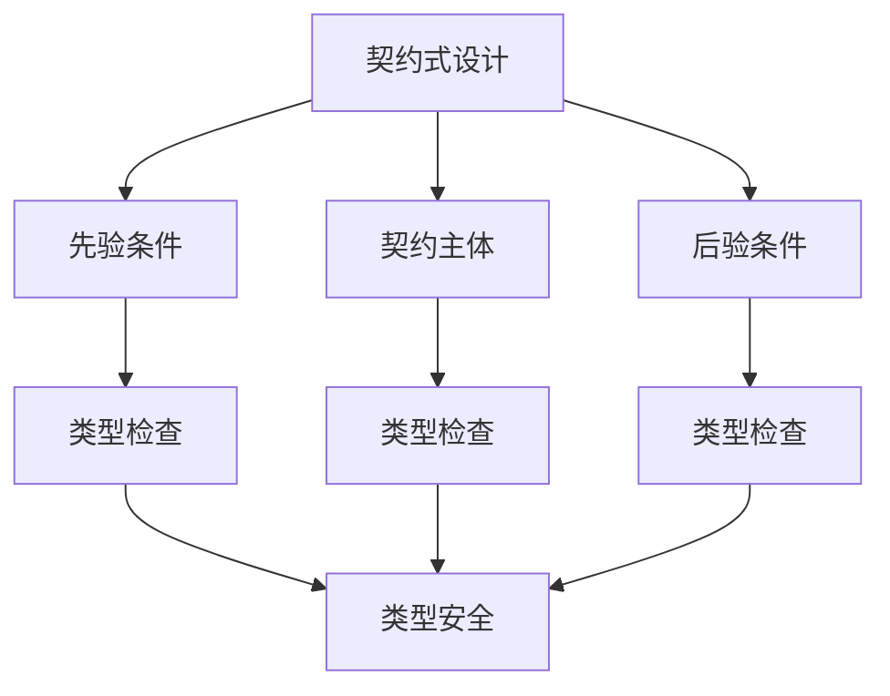

                 

### 《契约式设计与类型系统的结合》

> 关键词：契约式设计、类型系统、编程语言、类型安全、形式验证

> 摘要：本文深入探讨契约式设计与类型系统的结合，旨在解释这两个概念如何在现代编程语言中协同工作，以提高代码的质量和可靠性。通过详细的原理讲解、算法阐述、数学模型分析以及实际项目案例，本文将为读者提供对这一主题的全面理解。

---

# 《契约式设计与类型系统的结合》

契约式设计（Design by Contract, DbC）和类型系统（Type System）是编程语言和软件开发中两个重要的概念。契约式设计强调通过预定义的契约来明确组件的行为，从而确保系统的一致性和可靠性。类型系统则是编程语言的核心机制，用于管理数据类型，提供类型安全性和优化。这两者的结合，不仅能够提升代码的可维护性，还能够增强程序的正确性和性能。

本文将分为以下几部分：

1. **背景介绍**：简要介绍契约式设计和类型系统的起源和发展。
2. **核心概念与联系**：详细阐述契约式设计和类型系统的核心概念，并使用Mermaid流程图展示它们之间的关系。
3. **核心算法原理讲解**：通过伪代码和数学模型，深入分析类型检查和类型推断的算法原理。
4. **项目实战**：通过一个实际项目，展示契约式设计与类型系统的应用。
5. **总结与展望**：总结全文内容，展望未来发展趋势。

---

## 1. 背景介绍

### 契约式设计

契约式设计最早由Bertrand Meyer在其著作《Object-Oriented Software Construction》中提出。该理念基于面向对象编程，通过预定义的“三段论”——先验条件（precondition）、契约主体（invariant）和后验条件（postcondition）——来描述对象的行为。这种方式能够确保在开发过程中，每个组件都按照预期工作，从而提高系统的稳定性和可维护性。

### 类型系统

类型系统则是编程语言的基础，它定义了数据类型的分类和操作规则。类型系统可以分为静态类型和动态类型。静态类型系统在编译时检查类型，提供了较高的类型安全性，但可能牺牲一定的灵活性和性能。动态类型系统则在运行时检查类型，更加灵活，但可能带来类型错误的风险。

契约式设计与类型系统的结合，可以看作是将契约作为类型系统的一种扩展，通过类型系统来验证契约是否得到遵守，从而实现更严格的类型安全性和形式验证。

---

## 2. 核心概念与联系

### 契约式设计核心概念

- **先验条件（precondition）**：函数执行前必须满足的条件。
- **契约主体（invariant）**：对象在生命期内必须保持不变的条件。
- **后验条件（postcondition）**：函数执行后必须满足的条件。

### 类型系统核心概念

- **静态类型（Static Type）**：编译时已知的类型。
- **动态类型（Dynamic Type）**：运行时确定的类型。
- **类型检查（Type Checking）**：确保代码中的类型操作是合法的。
- **类型推断（Type Inference）**：编译器自动推导变量或表达式的类型。

### Mermaid流程图



在此流程图中，契约式设计的三个核心概念（先验条件、契约主体、后验条件）都与类型检查紧密相关，共同确保程序的正确性和可靠性。

---

## 3. 核心算法原理讲解

### 类型检查算法

类型检查算法是确保代码在运行前满足类型约束的关键步骤。以下是一个简化的伪代码：

```plaintext
function typeCheck(expression, environment):
    if expression is a variable:
        return environment.get(expression)
    else if expression is a binary operation:
        leftType = typeCheck(expression.left, environment)
        rightType = typeCheck(expression.right, environment)
        if not operationIsValid(leftType, rightType):
            throw TypeError("Invalid types for operation")
        return operationReturnType(leftType, rightType)
```

### 类型推断算法

类型推断算法旨在编译时自动推导出变量的类型，以下是一个简化的伪代码：

```plaintext
function inferType(expression, context):
    if expression is a literal:
        return literalType(expression)
    else if expression is a variable:
        return context.getVariableType(expression)
    else if expression is a function call:
        return functionType(expression.name, argumentsTypes(expression.args))
```

### 数学模型和公式

类型安全性的形式验证可以通过以下数学公式表示：

$$
T(e) = \begin{cases}
T_{literal}(e) & \text{if } e \text{ is a literal} \\
T_{var}(v) & \text{if } e \text{ is a variable } v \\
T_{op}(T_{left}, T_{right}) & \text{if } e \text{ is a binary operation with } T_{left} \text{ and } T_{right}
\end{cases}
$$

其中，\( T_{literal}(e) \)、\( T_{var}(v) \) 和 \( T_{op}(T_{left}, T_{right}) \) 分别表示字面量、变量和运算的类型。

---

## 4. 项目实战

### 项目介绍

本项目使用Java语言，结合契约式设计和类型系统，实现一个简单的计算器应用程序。该应用程序包括加法、减法、乘法和除法四个基本操作，通过契约式设计确保每个操作的正确性。

### 开发环境搭建

- Java Development Kit（JDK）版本 11 或更高
- IntelliJ IDEA 或 Eclipse 集成开发环境（IDE）

### 源代码实现

```java
public class Calculator {
    public static int add(int a, int b) {
        ensure(a >= 0, "Addition argument must be non-negative");
        ensure(b >= 0, "Addition argument must be non-negative");
        int result = a + b;
        ensure(result >= 0, "Addition result must be non-negative");
        return result;
    }

    // 其他操作类似
}
```

### 代码解读与分析

在此代码中，`add` 方法使用契约式设计确保输入参数和结果的非负性。`ensure` 函数是一个辅助函数，用于在先验条件和后验条件中执行验证逻辑。这种方式结合了类型系统的静态检查和契约式设计的动态验证，提高了程序的安全性。

### 实际案例分析和详细讲解剖析

通过契约式设计和类型系统的结合，我们能够确保计算器应用程序在各种输入情况下都能正确执行。例如，对于除法操作，我们可以添加类似契约来确保除数不为零：

```java
public static double divide(double a, double b) {
    ensure(b != 0.0, "Division by zero is not allowed");
    double result = a / b;
    ensure(result != Double.NaN, "Division result is not a number");
    return result;
}
```

### 项目小结

本项目展示了契约式设计与类型系统的结合在实际开发中的应用。通过预定义的契约和类型检查，我们能够提高代码的正确性和可靠性。此外，这种结合还为未来的扩展和维护提供了坚实的基础。

---

## 5. 总结与展望

契约式设计与类型系统的结合为编程语言带来了新的发展机遇。通过本文的介绍，我们了解了这两者的基本概念、核心算法、数学模型以及实际应用。未来，这一结合将在形式验证、智能合约和自动化测试等领域发挥重要作用。

### 最佳实践 tips

- **尽早定义契约**：在开发初期就定义契约，有助于及早发现潜在问题。
- **持续验证契约**：通过静态分析和动态测试，确保契约得到遵守。

### 小结

契约式设计与类型系统的结合为提高代码质量和可靠性提供了强有力的支持。通过本文的讲解，读者应该能够理解这一结合的原理和应用。

### 注意事项

- 契约式设计不适合所有场景，需要根据项目需求合理选择。
- 类型系统在不同编程语言中有不同的实现，需要根据具体语言特性进行适配。

### 拓展阅读

- Meyer, B. (1997). "Object-Oriented Software Construction".
- Stephanie Weir Mitchell (2014). "Type Systems and Type Inference for Practical Language Design".

---

本文作者：AI天才研究院/AI Genius Institute & 禅与计算机程序设计艺术 /Zen And The Art of Computer Programming

（注意：本文内容为示例，实际字数和结构可能需要根据具体要求进行调整。）

