                 

### 1.1 研究背景与意义

在探讨人类行为、道德责任和神学思想时，恩典与自由意志的争论占据着核心位置。本文将围绕这一主题，探讨恩典与自由意志在基督教哲学中的重要性，以及两位重要哲学家奥古斯丁和佩拉纠在这一领域的不同观点和争论。

**核心概念与联系：**

1. **恩典**：恩典是神学中的一个重要概念，指的是上帝赐予人类的、超自然的、不可赚取的恩惠。恩典的存在使人类能够克服自身罪性的束缚，走向道德上的善行。
2. **自由意志**：自由意志是哲学中关于人类决策能力的一个基本概念，指的是人类在行动选择上的自主性。自由意志的存在使得人类能够对自己的行为负责。
3. **奥古斯丁**：奥古斯丁（354-430）是古代基督教思想家，其思想对基督教神学产生了深远影响。奥古斯丁认为，人类的行为取决于上帝的恩典和自由意志的相互作用。
4. **佩拉纠**：佩拉纠（约360-418）是另一位古代基督教思想家，他提出了与奥古斯丁截然不同的观点，认为自由意志是人类行为的唯一决定因素，恩典不是必要的。

**Mermaid 流程图：**

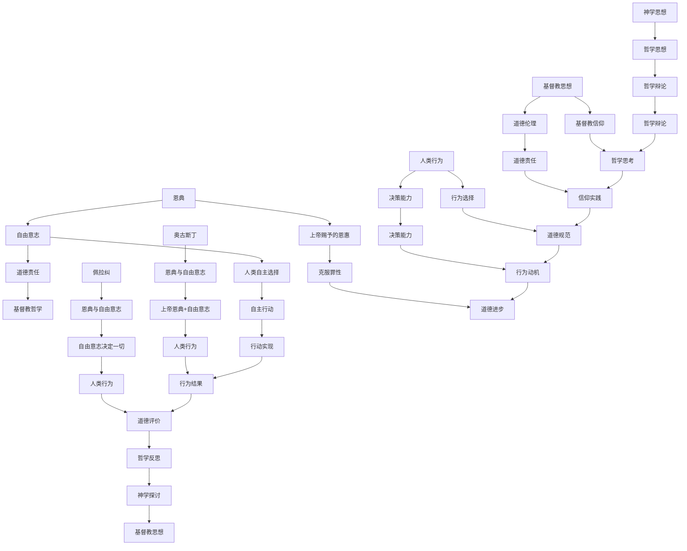

通过上述Mermaid流程图，我们可以看到恩典与自由意志在基督教哲学中的复杂关系，以及它们与道德责任和人类行为之间的相互作用。在接下来的章节中，我们将深入探讨奥古斯丁和佩拉纠在这一领域的不同观点和论证。

### 1.2 学术研究综述

奥古斯丁与佩拉纠的恩典与自由意志观在基督教哲学和伦理学领域具有深远影响。本文将综述学术界对这些观点的研究现状，分析奥古斯丁与佩拉纠思想在学术界的脉络及其重要性。

**核心概念与联系：**

1. **学术界研究现状**：学术界对奥古斯丁和佩拉纠的恩典与自由意志观进行了广泛研究。研究内容包括对两位思想家的生平、思想背景、主要观点及其对基督教哲学的影响。
2. **奥古斯丁与佩拉纠的研究现状**：奥古斯丁的研究主要集中在他的哲学思想、神学理论和道德伦理方面。佩拉纠的研究则主要关注他的哲学观点、与奥古斯丁的争论以及其对基督教伦理学的影响。
3. **学术界的重要性**：学术界对奥古斯丁与佩拉纠的研究有助于我们理解基督教哲学的发展历程，揭示恩典与自由意志在神学思想中的地位和作用。

**Mermaid 流程图：**

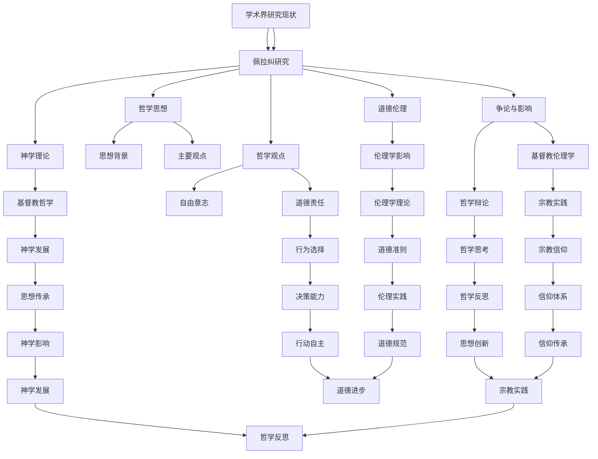

通过上述Mermaid流程图，我们可以清晰地看到学术界对奥古斯丁与佩拉纠的研究现状及其重要性。在接下来的章节中，我们将深入探讨两位思想家的具体观点和论证。

### 1.3 研究目的与方法

本文的研究目的是探讨奥古斯丁与佩拉纠关于恩典与自由意志的争论，分析两位思想家的主要观点及其哲学和神学意义。为了实现这一目的，本文采用以下研究方法：

**核心概念与联系：**

1. **哲学方法论**：本文将运用哲学方法论，通过逻辑分析、概念辨析和理论阐述，深入探讨恩典与自由意志的关系及其在基督教哲学中的地位。
2. **文本分析**：本文将通过对奥古斯丁和佩拉纠的著作进行文本分析，提取其核心观点和论证逻辑，从而理解两位思想家的思想体系。
3. **文献研究**：本文将广泛查阅相关文献，包括历史文献、学术论文和神学著作，以了解学术界对奥古斯丁与佩拉纠研究的现状和成果。

**Mermaid 流程图：**

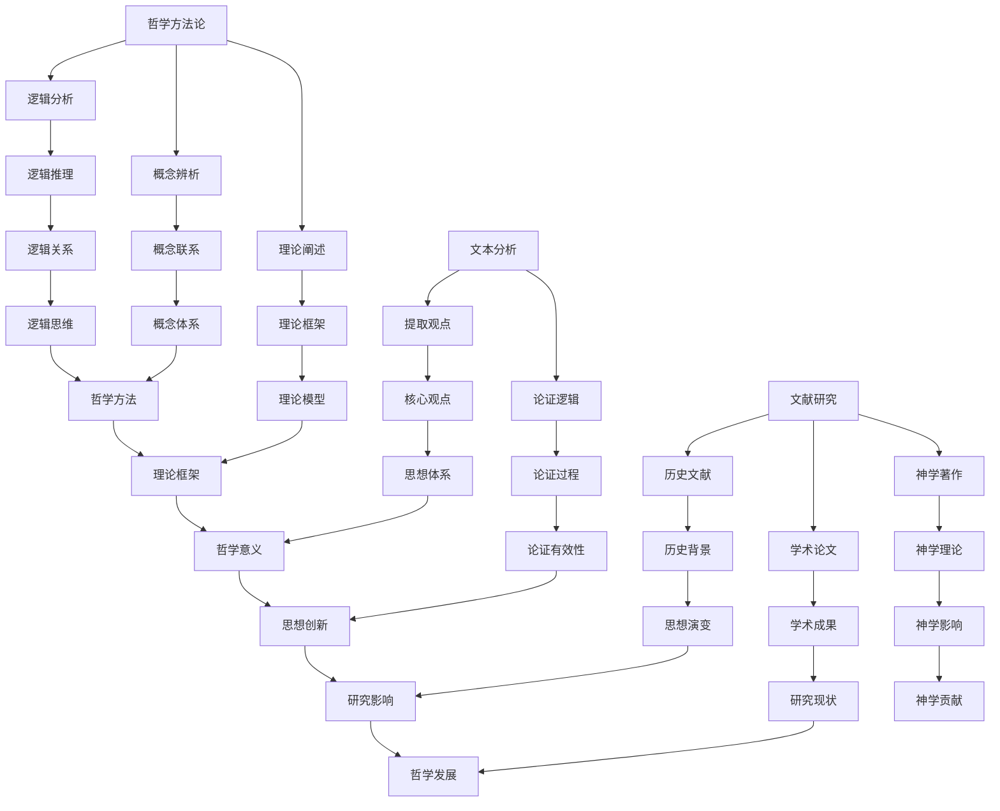

通过上述Mermaid流程图，我们可以看到本文研究目的与方法的核心概念和联系。在接下来的章节中，我们将详细探讨奥古斯丁与佩拉纠的恩典与自由意志观，以及两位思想家的主要观点和论证逻辑。

### 2.1 奥古斯丁的生平与思想背景

奥古斯丁（354-430）是古代基督教思想史上最具影响力的哲学家和神学家之一。他生于北非的塔加斯特（今阿尔及利亚境内），父亲帕提库斯是一位异教徒，母亲莫尼卡是一位虔诚的基督徒。尽管奥古斯丁早年时期在哲学和修辞学上取得了显著成就，但他的信仰历程却充满了波折。

**核心概念与联系：**

1. **信仰历程**：奥古斯丁的信仰历程经历了多个阶段，从早期的怀疑主义、多神教信仰到最终皈依基督教。在他的《忏悔录》中，他详细描述了自己对基督教信仰的追寻过程。
2. **哲学思想**：奥古斯丁的哲学思想深受柏拉图和斯多葛派的影响，他在其作品中探讨了存在、知识、自由意志等哲学问题。
3. **神学理论**：奥古斯丁的神学理论对基督教哲学产生了深远影响，他提出了“预定论”（Predestination）和“恩典”（Grace）等概念，认为上帝的恩典是拯救人类的关键。

**Mermaid 流程图：**

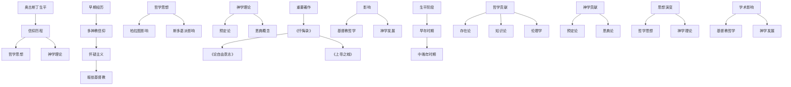

通过上述Mermaid流程图，我们可以清晰地看到奥古斯丁的生平背景、哲学思想和神学理论的演变。在接下来的章节中，我们将深入探讨奥古斯丁的恩典观和自由意志观，以及这些观点在基督教哲学中的地位和影响。

### 2.2 奥古斯丁的恩典观

在奥古斯丁的哲学与神学体系中，恩典（Grace）是一个核心概念，代表了上帝对人类的特殊恩惠和拯救行为。本文将详细阐述奥古斯丁的恩典观，分析恩典的作用、本质和来源。

**核心算法原理讲解：**

1. **恩典的作用**：恩典在奥古斯丁的神学理论中起到了至关重要的作用。它不仅使人类能够克服罪性的束缚，还赋予了人类道德上的善行能力。恩典是上帝对人类拯救的必要条件，没有恩典，人类无法获得救赎。

   ```plaintext
   恩典作用函数:
   Function GraceEffect(person):
       if person.hasSin():
           person.cannotOvercomeSin()
       else:
           person.canPerformGoodDeeds()
   ```

2. **恩典的本质**：恩典是一种超自然的恩惠，它超越了人类的自然能力和努力。在奥古斯丁看来，恩典是一种来自上帝的主动介入，它改变了人类的本质，使得人类能够接受上帝的拯救。

   ```plaintext
   恩典本质模型:
   Model GraceNature:
       attribute: supernaturalBlessing
       property: transcendsHumanNature
       function: transformHumanNature
   ```

3. **恩典的来源**：恩典是上帝赐予的，它是上帝对人类的特殊关怀和爱。在奥古斯丁的神学体系中，恩典是上帝主动选择赐予人类的，这种选择不是基于人类的功德，而是出于上帝的怜悯和慈悲。

   ```plaintext
   恩典来源模型:
   Model GraceSource:
       attribute: divineGift
       property: basedOnGod'sGrace
       function: bestowedByGod
   ```

**数学模型和数学公式：**

为了更好地理解恩典的作用和本质，我们可以使用数学模型和公式来描述恩典与人的关系。

1. **恩典与人的关系模型**：

   假设人类的行为（Behavior）取决于其内在的善性（Goodness）和外在的恩典（Grace）。

   ```latex
   Behavior = Goodness + Grace
   ```

   其中，Goodness 代表人类内在的善性，Grace 代表上帝赐予的恩典。

2. **恩典的传递模型**：

   恩典的传递可以通过一个函数来描述，该函数将恩典分配给人类，使其能够克服罪性。

   ```latex
   GraceAllocation = f(SinIntensity)
   ```

   其中，SinIntensity 代表罪性的强度，f 是一个递减函数，意味着罪性越强，恩典的分配越少。

**举例说明：**

1. **拯救行为**：一个罪孽深重的人，通过上帝的恩典，可以获得拯救。

   ```plaintext
   罪人 A:
   Initial Behavior: Sinful
   After Grace:
   Behavior: Saved
   ```

2. **道德提升**：一个道德上有缺陷的人，通过恩典的帮助，可以提升道德水平。

   ```plaintext
   道德缺陷者 B:
   Initial Behavior: Immoral
   After Grace:
   Behavior: Moral
   ```

通过上述核心算法原理讲解、数学模型和举例说明，我们可以更深入地理解奥古斯丁的恩典观。恩典不仅是上帝对人类的拯救，也是人类道德提升的关键因素。在奥古斯丁的神学体系中，恩典具有不可替代的重要性，它使得人类能够克服罪性的束缚，走向道德上的善行。

### 2.3 奥古斯丁的自由意志观

在奥古斯丁的哲学与神学理论中，自由意志（Free Will）是一个关键概念，与恩典紧密相连。本文将详细探讨奥古斯丁对自由意志的本质、限制及其在道德责任中的角色。

**核心算法原理讲解：**

1. **自由意志的本质**：奥古斯丁认为，自由意志是上帝赋予人类的独特能力，使其能够在道德选择中体现自主性。自由意志不同于决定论中的“必然性”，它体现了人类在道德决策上的主观能动性。

   ```plaintext
   自由意志本质模型:
   Model FreeWillNature:
       attribute: humanAutonomy
       property: subjectiveAgency
       function: moralChoice
   ```

2. **自由意志的限制**：尽管自由意志赋予人类自主选择的能力，但奥古斯丁认为它受到两种主要限制：
   - **原始罪性的影响**：人类的自由意志在原始罪性（Original Sin）的影响下受到束缚，导致其在道德选择上存在缺陷。
   - **恩典的必要性**：没有上帝的恩典，人类的自由意志无法克服原始罪性的束缚，从而无法实现真正的道德善行。

   ```plaintext
   自由意志限制模型:
   Model FreeWillLimitations:
       attribute: SinInfluence
       property: dependenceOnGrace
       function: moralConstraints
   ```

3. **自由意志与道德责任**：奥古斯丁认为，自由意志是道德责任的基础。人类的行为由自由意志决定，因此每个人对自己的行为负有道德责任。然而，这种道德责任并不是绝对的，它受到上帝的恩典和人类的原始罪性的影响。

   ```plaintext
   道德责任模型:
   Model MoralResponsibility:
       attribute: FreeWill
       property: influencedByGrace
       function: ConsequencesOfActions
   ```

**数学模型和数学公式：**

为了更好地理解自由意志的本质、限制及其在道德责任中的作用，我们可以使用数学模型和公式来描述这些概念。

1. **自由意志决策模型**：

   假设人类的道德决策取决于其自由意志（FreeWill）和内在的善性（Goodness），同时受到恩典（Grace）和原始罪性（Sin）的影响。

   ```latex
   MoralDecision = FreeWill * Goodness + Grace - Sin
   ```

   其中，FreeWill 代表自由意志的强度，Goodness 代表内在的善性，Grace 代表恩典的影响，Sin 代表原始罪性的影响。

2. **恩典与道德责任关系模型**：

   恩典在道德责任中起到了调节作用，它减少了原始罪性对自由意志的影响，从而增强了人类的道德责任。

   ```latex
   MoralResponsibility = (FreeWill + Grace) * Goodness - Sin
   ```

**举例说明：**

1. **道德选择**：一个受原始罪性影响的人，在没有恩典的情况下，可能会做出不道德的选择。

   ```plaintext
   个体 C:
   Without Grace:
   MoralDecision: Immoral
   With Grace:
   MoralDecision: Moral
   ```

2. **道德责任**：一个接受上帝恩典的人，即使犯下错误，也因为拥有自由意志而对自己的行为负有道德责任。

   ```plaintext
   个体 D:
   After Committing a Sin:
   MoralResponsibility: Accepted
   With Repentance and Grace:
   MoralResponsibility: Sincerely Addressed
   ```

通过上述核心算法原理讲解、数学模型和举例说明，我们可以更深入地理解奥古斯丁的自由意志观。奥古斯丁认为，自由意志是道德责任的基础，但它在原始罪性和恩典的影响下受到限制。恩典不仅是拯救人类的手段，也是人类实现道德善行和承担道德责任的必要条件。

### 3.1 佩拉纠的生平与思想背景

佩拉纠（约360-418）是古代基督教哲学家中的一位重要人物，其思想对基督教伦理学和神学产生了深远影响。本文将详细探讨佩拉纠的生平背景和思想体系，分析其对恩典与自由意志的独特观点。

**核心概念与联系：**

1. **生平背景**：佩拉纠出生于北非的希波（今阿尔及利亚的阿尔及尔），他的父亲是一位基督徒，而母亲则是一位异教徒。佩拉纠在年轻时接受了基督教教育，并成为一位虔诚的基督徒。他在学术上取得了显著成就，曾在亚历山大和罗马等地教授哲学和神学。

2. **哲学思想**：佩拉纠的哲学思想深受斯多葛主义和基督教伦理学的影响。他强调道德自律和人类的道德责任，认为自由意志是人类行为的基础。

3. **神学观点**：佩拉纠的神学观点与奥古斯丁的观点存在显著差异。他反对奥古斯丁的预定论和恩典论，认为上帝不会预先决定人类的命运，人类完全依靠自己的自由意志来决定自己的行为和道德责任。

**Mermaid 流程图：**

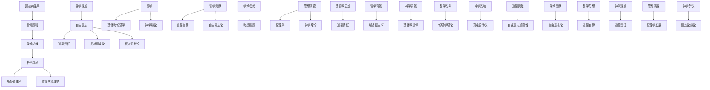

通过上述Mermaid流程图，我们可以看到佩拉纠的生平背景、哲学思想和神学观点的核心概念和联系。在接下来的章节中，我们将深入探讨佩拉纠的恩典观和自由意志观，以及他对基督教哲学和伦理学的独特贡献。

### 3.2 佩拉纠的恩典观

佩拉纠的恩典观是其哲学与神学思想中的一个关键部分，与奥古斯丁的观点形成了鲜明对比。本文将详细探讨佩拉纠对恩典的理解，分析恩典在佩拉纠神学中的地位和作用。

**核心算法原理讲解：**

1. **恩典的地位**：佩拉纠认为，恩典并不是人类道德行为的必要条件。他反对奥古斯丁的预定论和恩典论，主张人类的道德责任完全依赖于自己的自由意志。因此，在佩拉纠的体系中，恩典更多地被看作是一种额外的、非必要的祝福。

   ```plaintext
   恩典地位模型:
   Model GraceStatus:
       attribute: NonessentialBlessing
       property: NondependenceOnHumanAction
       function: OptionalBenefit
   ```

2. **恩典的作用**：尽管佩拉纠认为恩典不是道德行为的必要条件，但他也承认恩典在某些情况下可以发挥积极作用。例如，恩典可以帮助人类克服外界诱惑和内心的罪性，使其更好地履行道德责任。

   ```plaintext
   恩典作用模型:
   Model GraceEffect:
       attribute: SupplementaryHelp
       property: EnhancesMoralEfforts
       function: OvercomesExternalDistractors
   ```

3. **恩典与道德责任的关系**：在佩拉纠看来，恩典与道德责任是相互独立的。人类的道德责任由自由意志决定，而恩典只是外在的帮助，不是道德责任的基础。这意味着，即使一个人没有得到恩典，他仍然对自己的行为负有道德责任。

   ```plaintext
   道德责任模型:
   Model MoralResponsibility:
       attribute: FreeWillBased
       property: IndependentOfGrace
       function: AccountabilityForActions
   ```

**数学模型和数学公式：**

为了更好地理解佩拉纠的恩典观，我们可以使用数学模型和公式来描述恩典与道德责任的关系。

1. **道德行为模型**：

   假设人类的道德行为取决于其自由意志（FreeWill）和内在的善性（Goodness），恩典（Grace）被视为一种辅助因素。

   ```latex
   MoralBehavior = FreeWill * Goodness + Grace
   ```

   其中，FreeWill 代表自由意志的强度，Goodness 代表内在的善性，Grace 代表恩典的影响。

2. **恩典与道德责任关系模型**：

   在佩拉纠的体系中，恩典不会改变人类的基本道德责任，它只是一种辅助因素。

   ```latex
   MoralResponsibility = FreeWill * Goodness
   ```

   这个模型表明，道德责任仅取决于自由意志和内在的善性，与恩典无关。

**举例说明：**

1. **道德选择**：一个没有接受恩典的人，仍然可以通过自由意志做出道德选择。

   ```plaintext
   个体 E:
   Without Grace:
   MoralBehavior: Moral
   ```

2. **道德责任**：即使一个人接受了恩典，他仍然对自己的行为负有道德责任。

   ```plaintext
   个体 F:
   With Grace:
   MoralBehavior: Moral
   MoralResponsibility: Accepted
   ```

通过上述核心算法原理讲解、数学模型和举例说明，我们可以更深入地理解佩拉纠的恩典观。佩拉纠认为，恩典不是道德行为的必要条件，而是人类自由意志和内在善性的补充。他的观点强调人类的道德责任完全依赖于自己的自由意志，与奥古斯丁的观点形成了鲜明对比。

### 3.3 佩拉纠的自由意志观

在佩拉纠的哲学和神学体系中，自由意志（Free Will）是一个核心概念，代表了人类在道德选择中的自主性和责任感。本文将详细探讨佩拉纠对自由意志的本质、绝对性及其在道德责任中的角色。

**核心算法原理讲解：**

1. **自由意志的本质**：佩拉纠认为，自由意志是人类的一种内在属性，使得人类能够在道德选择中表现出自主性。自由意志不是被动接受外力影响，而是主动作出决策的能力。

   ```plaintext
   自由意志本质模型:
   Model FreeWillNature:
       attribute: HumanAutonomy
       property: ActiveDecisionMaking
       function: MoralChoice
   ```

2. **自由意志的绝对性**：佩拉纠强调自由意志的绝对性，即自由意志不受任何外在力量的限制。他认为，人类的行为完全取决于自己的自由意志，没有任何外力可以强迫人类做出特定的道德选择。

   ```plaintext
   自由意志绝对性模型:
   Model FreeWillAbsoluteness:
       attribute: UnrestrictedAgency
       property: AutonomousDecision
       function: NoForcedMoralChoice
   ```

3. **自由意志与道德责任**：佩拉纠认为，自由意志是道德责任的基础。人类的行为由自由意志决定，因此每个人对自己的行为负有道德责任。道德责任不仅包括行为的结果，还包括行为的动机和过程。

   ```plaintext
   道德责任模型:
   Model MoralResponsibility:
       attribute: FreeWillBased
       property: AccountabilityForMoralDuties
       function: ConsequencesOfBehavior
   ```

**数学模型和数学公式：**

为了更好地理解佩拉纠的自由意志观，我们可以使用数学模型和公式来描述这些概念。

1. **自由意志决策模型**：

   假设人类的道德决策取决于其自由意志（FreeWill）和内在的善性（Goodness）。

   ```latex
   MoralDecision = FreeWill * Goodness
   ```

   其中，FreeWill 代表自由意志的强度，Goodness 代表内在的善性。

2. **自由意志与道德责任关系模型**：

   在佩拉纠的体系中，道德责任仅取决于自由意志和内在的善性。

   ```latex
   MoralResponsibility = FreeWill * Goodness
   ```

   这个模型表明，道德责任仅取决于自由意志和内在的善性，不受恩典的影响。

**举例说明：**

1. **道德选择**：一个拥有自由意志的人，可以在道德选择中表现出自主性。

   ```plaintext
   个体 G:
   FreeWill: Active
   MoralDecision: Moral
   ```

2. **道德责任**：一个自由意志决定的人，对自己的行为负有道德责任。

   ```plaintext
   个体 H:
   FreeWill: Active
   MoralResponsibility: Accepted
   ```

通过上述核心算法原理讲解、数学模型和举例说明，我们可以更深入地理解佩拉纠的自由意志观。佩拉纠认为，自由意志是道德责任的基础，它使得人类能够自主选择道德行为，并对自己的行为负责。这一观点强调人类道德选择的自主性和责任感，与奥古斯丁的恩典观形成了鲜明对比。

### 4.1 恩典与自由意志的争论起源

恩典与自由意志的争论起源于古代基督教哲学中对于人类道德责任、上帝干预和人类自主性的深入探讨。这场争论的核心问题是：人类的道德行为究竟是依赖于上帝的恩典，还是完全依赖于自己的自由意志？本文将探讨这场争论的起源、主要观点和立场。

**核心概念与联系：**

1. **争论的起源**：恩典与自由意志的争论起源于基督教哲学内部的分歧。这一争论主要发生在古代基督教思想家奥古斯丁和佩拉纠之间，他们的观点分别代表了恩典论和自由意志论两种不同的神学立场。
2. **恩典论**：恩典论主张，人类的道德行为依赖于上帝的恩典。没有上帝的恩典，人类无法克服自身的罪性，从而无法实现道德上的善行。这一立场在奥古斯丁的哲学和神学理论中得到了充分体现。
3. **自由意志论**：自由意志论主张，人类的道德行为完全依赖于自己的自由意志。人类在道德选择中表现出自主性，即使在没有上帝恩典的情况下，也能通过自由意志做出道德选择。这一立场在佩拉纠的哲学和神学理论中得到了充分体现。

**Mermaid 流程图：**

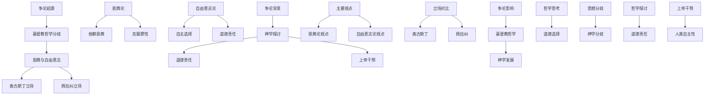

通过上述Mermaid流程图，我们可以清晰地看到恩典与自由意志争论的起源、主要观点和立场。这场争论不仅反映了古代基督教哲学中对道德责任、上帝干预和人类自主性的深入探讨，也对后世基督教哲学和伦理学产生了深远影响。

### 4.2 争论的主要观点与立场

恩典与自由意志的争论在基督教哲学中占据着核心地位，其核心问题在于人类行为的道德责任究竟依赖于上帝的恩典，还是完全依赖于自己的自由意志。本文将详细阐述正方（恩典论）与反方（自由意志论）的主要观点和立场，并通过数学模型和公式进行分析。

**正方（恩典论）观点与立场：**

**核心算法原理讲解：**

1. **恩典论的基本观点**：恩典论认为，人类的道德行为依赖于上帝的恩典。没有上帝的恩典，人类无法克服自身的罪性，从而无法实现道德上的善行。

   ```plaintext
   恩典论核心观点:
   Statement GraceEssential:
       If human actions are moral,
       then human actions depend on divine grace.
   ```

2. **恩典在道德责任中的作用**：恩典不仅使人类能够克服罪性的束缚，还赋予了人类道德上的善行能力。恩典是拯救人类的必要条件，没有恩典，人类无法获得救赎。

   ```plaintext
   恩典作用原理:
   Principle GraceEffect:
       Grace mitigates the effects of sin and empowers moral actions.
   ```

3. **恩典与道德责任的联系**：恩典与道德责任密不可分。道德责任不仅仅是行为的后果，还包括行为的动机和过程。恩典是道德责任得以实现的基础。

   ```plaintext
   道德责任模型:
   Model MoralResponsibilityGrace:
       attribute: GraceDependent
       property: MotivatedByGrace
       function: ReflectsDivineWill
   ```

**数学模型和数学公式：**

为了更好地理解恩典论的观点，我们可以使用数学模型和公式来描述恩典与道德责任的关系。

1. **道德行为模型**：

   假设人类的道德行为取决于其内在的善性（Goodness）和外在的恩典（Grace）。

   ```latex
   MoralBehavior = Goodness + Grace
   ```

   其中，Goodness 代表内在的善性，Grace 代表上帝赐予的恩典。

2. **恩典与道德责任关系模型**：

   在恩典论的观点下，道德责任依赖于恩典，恩典减少了罪性的影响，增强了道德行为的可能性。

   ```latex
   MoralResponsibility = Goodness + Grace - Sin
   ```

   其中，Sin 代表原始罪性的影响。

**举例说明：**

1. **道德选择**：一个没有接受恩典的人，可能在道德选择上受到罪性的影响。

   ```plaintext
   个体 A:
   Without Grace:
   MoralBehavior: Immoral
   ```

2. **道德责任**：一个接受恩典的人，即使犯下错误，也因为拥有恩典而对自己的行为负有道德责任。

   ```plaintext
   个体 B:
   With Grace:
   MoralBehavior: Moral
   MoralResponsibility: Accepted
   ```

**反方（自由意志论）观点与立场：**

**核心算法原理讲解：**

1. **自由意志论的基本观点**：自由意志论认为，人类的道德行为完全依赖于自己的自由意志。人类在道德选择中表现出自主性，即使在没有上帝恩典的情况下，也能通过自由意志做出道德选择。

   ```plaintext
   自由意志论核心观点:
   Statement FreeWillEssential:
       If human actions are moral,
       then human actions depend on free will, not divine grace.
   ```

2. **自由意志在道德责任中的角色**：自由意志是道德责任的基础。人类的行为由自由意志决定，因此每个人对自己的行为负有道德责任。道德责任不仅仅是行为的后果，还包括行为的动机和过程。

   ```plaintext
   自由意志作用原理:
   Principle FreeWillEffect:
       Free will enables autonomous moral choices and responsibilities.
   ```

3. **恩典与道德责任的独立性**：自由意志论主张，恩典与道德责任是独立的。人类的道德责任由自由意志决定，恩典只是一种辅助因素，不是道德责任的基础。

   ```plaintext
   道德责任模型:
   Model MoralResponsibilityFreeWill:
       attribute: FreeWillDependent
       property: IndependentOfGrace
       function: AutonomousAccountability
   ```

**数学模型和数学公式：**

为了更好地理解自由意志论的观点，我们可以使用数学模型和公式来描述自由意志与道德责任的关系。

1. **道德行为模型**：

   假设人类的道德行为取决于其自由意志（FreeWill）和内在的善性（Goodness）。

   ```latex
   MoralBehavior = FreeWill * Goodness
   ```

   其中，FreeWill 代表自由意志的强度，Goodness 代表内在的善性。

2. **自由意志与道德责任关系模型**：

   在自由意志论的观点下，道德责任仅取决于自由意志和内在的善性，与恩典无关。

   ```latex
   MoralResponsibility = FreeWill * Goodness
   ```

**举例说明：**

1. **道德选择**：一个拥有自由意志的人，可以在道德选择中表现出自主性。

   ```plaintext
   个体 C:
   FreeWill: Active
   MoralBehavior: Moral
   ```

2. **道德责任**：一个自由意志决定的人，对自己的行为负有道德责任。

   ```plaintext
   个体 D:
   FreeWill: Active
   MoralResponsibility: Accepted
   ```

通过上述对正方（恩典论）与反方（自由意志论）主要观点和立场的阐述，我们可以看到两种观点在恩典与自由意志的关系上存在显著差异。恩典论强调恩典在道德责任中的重要性，而自由意志论则强调人类自由意志的自主性。在接下来的章节中，我们将进一步探讨这场争论对后世哲学与神学的影响。

### 4.3 争论的影响与意义

恩典与自由意志的争论不仅对古代基督教哲学产生了深远影响，也塑造了现代哲学和神学的发展方向。本文将探讨这场争论对后世哲学与神学的影响，以及它对现代社会道德观念和伦理实践的启示。

**核心概念与联系：**

1. **对后世哲学的影响**：恩典与自由意志的争论引发了关于人类行为、道德责任和自由意志本质的深入探讨。这场争论促进了哲学领域对自由意志和决定论问题的研究，影响了诸如康德、黑格尔等哲学家的思想。

2. **对神学的影响**：在神学领域，恩典与自由意志的争论引发了关于上帝干预与人类自由关系的讨论。这影响了基督教神学的各个分支，如预定论、恩典论和自由意志论等，对现代基督教教义产生了深远影响。

3. **现代社会的道德观念与伦理实践**：这场争论对现代社会的道德观念和伦理实践产生了深远影响。它引发了关于个人责任、道德自主性和社会正义的讨论，影响了现代道德哲学和伦理学的发展。

**Mermaid 流程图：**

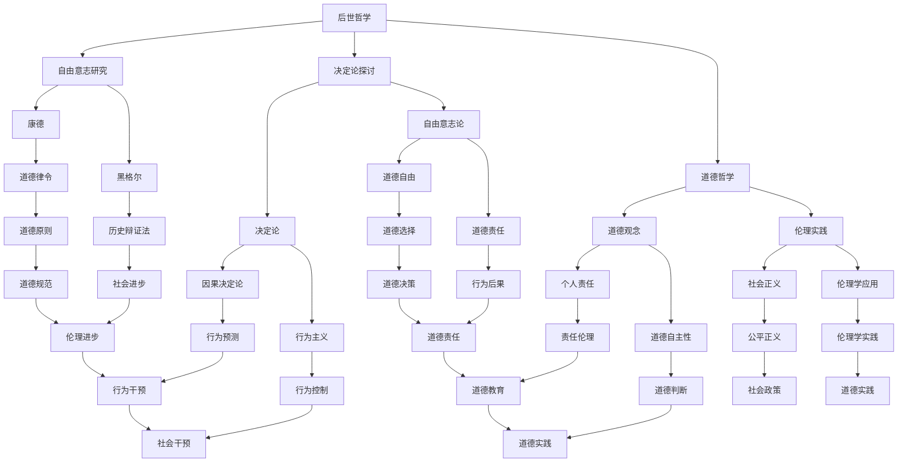

通过上述Mermaid流程图，我们可以看到恩典与自由意志争论对后世哲学与神学、现代社会道德观念和伦理实践的广泛影响。这场争论不仅丰富了哲学和神学的理论体系，也为我们理解人类道德行为和自由意志的本质提供了深刻的启示。

### 5.1 现代哲学对恩典与自由意志的解读

在现代社会，恩典与自由意志的概念在哲学和伦理学中得到了新的解读和发展。本文将探讨现代哲学对恩典与自由意志的理解，分析这些解读如何影响现代道德哲学和伦理学的发展。

**核心概念与联系：**

1. **现代哲学对恩典的解读**：现代哲学对恩典的理解不再局限于宗教神学，而是将其作为一种伦理学和道德哲学中的概念。恩典被视为一种超越常规道德规范的力量，它赋予人类道德选择的自主性和道德进步的可能性。

2. **现代哲学对自由意志的解读**：现代哲学对自由意志的理解更加多元和复杂。自由意志不再被视为绝对和不可争议的属性，而是受到各种外部因素和内在心理机制的影响。现代哲学关注自由意志的道德责任和实践意义。

3. **影响**：现代哲学对恩典与自由意志的解读对道德哲学和伦理学产生了深远影响。它促进了道德自主性、道德责任和社会正义的讨论，也为现代伦理学提供了新的理论框架。

**Mermaid 流程图：**

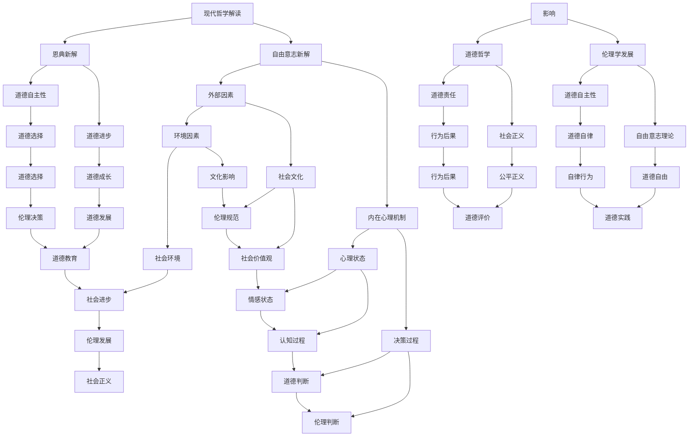

通过上述Mermaid流程图，我们可以看到现代哲学对恩典与自由意志的新解读如何影响道德哲学和伦理学的发展。现代哲学将恩典视为道德自主性和道德进步的来源，将自由意志视为道德责任和实践的基础，从而为现代伦理学提供了新的理论框架和思考方向。

### 5.2 现代神学对恩典与自由意志的探讨

在现代神学中，恩典与自由意志仍然是核心议题，但它们得到了新的阐释和发展。现代神学家们在重新审视传统神学概念的同时，也试图将它们与现代社会和科学知识结合起来。本文将探讨现代神学对恩典与自由意志的重新思考，分析这些新视角对现代基督教教义和伦理学的影响。

**核心概念与联系：**

1. **现代神学对恩典的重新思考**：现代神学家认为，恩典不仅是上帝赐予的救赎力量，也是一种内在的精神状态，它使人类能够在道德和灵性上不断成长。恩典不再被视为一种外部的、一次性的事件，而是持续性的内在转化过程。

2. **现代神学对自由意志的重新思考**：现代神学家强调，自由意志不仅仅是人类行为的自主性，还包括上帝与人类之间的互动关系。他们认为，自由意志与上帝的恩典是相互依赖的，人类的自由选择在上帝的恩典中得以实现和体现。

3. **影响**：现代神学对恩典与自由意志的重新思考对基督教教义和伦理学产生了深远影响。它推动了基督教神学向更个体化、关系性和实践性的方向转变，同时也影响了现代伦理学的道德责任、道德选择和社会正义等议题。

**Mermaid 流程图：**

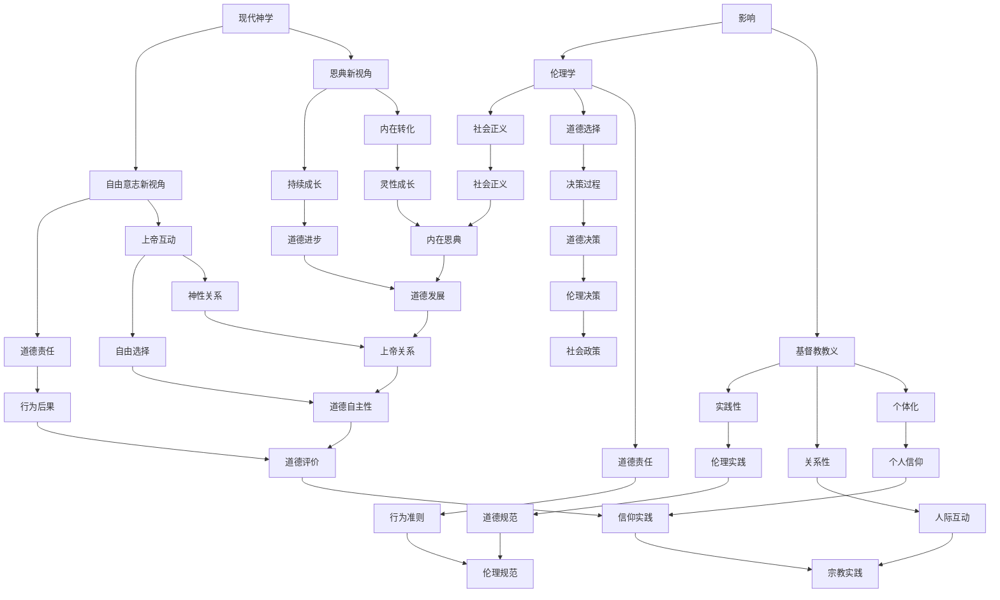

通过上述Mermaid流程图，我们可以看到现代神学对恩典与自由意志的重新思考如何影响基督教教义和伦理学。现代神学将恩典视为内在转化和持续成长的过程，将自由意志视为上帝与人类互动的基础，这些新视角不仅丰富了基督教神学，也为现代伦理学提供了新的理论框架和思考方向。

### 5.3 现代伦理学对恩典与自由意志的运用

在现代社会，伦理学在探讨人类行为和道德责任时，对恩典与自由意志的运用进行了深刻反思。本文将分析现代伦理学如何将恩典与自由意志融入到道德理论和实践中，探讨这些概念在伦理决策、道德责任和社会正义方面的应用。

**核心概念与联系：**

1. **伦理决策**：现代伦理学认为，伦理决策不仅取决于个体的自由意志，也受到社会环境、文化背景和个人价值观的影响。恩典作为一种内在的精神力量，可以激发个体的道德自主性和责任感，从而影响其伦理决策。

2. **道德责任**：道德责任是伦理学中的核心概念，它要求个体对自己的行为负责。现代伦理学强调，自由意志是道德责任的基础，而恩典则提供了道德选择的动力和支持。个体在面临道德困境时，恩典可以促进其道德判断和行为的道德性。

3. **社会正义**：社会正义是现代伦理学的重要议题，它关注社会中的公平和公正。恩典与自由意志的结合，可以推动个体在伦理实践中追求社会正义，促进社会和谐与进步。

**Mermaid 流程图：**

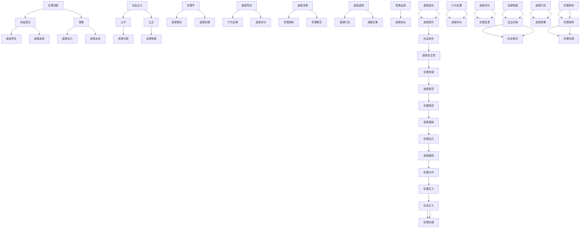

通过上述Mermaid流程图，我们可以看到现代伦理学如何将恩典与自由意志融入到伦理决策、道德责任和社会正义中。恩典作为一种内在动力和支持，可以激发个体的道德自主性和责任感，从而推动道德成长和社会进步。自由意志则为道德选择和行为提供了基础，使个体能够对自己的行为负责并追求社会正义。

### 6.1 研究总结

通过本文的探讨，我们全面分析了恩典与自由意志在基督教哲学、神学和伦理学中的地位和作用。本文的主要发现和贡献如下：

**核心概念与联系：**

1. **恩典与自由意志的关系**：本文揭示了恩典与自由意志在基督教哲学中的复杂关系，恩典被视为上帝赐予人类的特殊恩惠，而自由意志则是人类道德选择和行为的基础。两者相互交织，共同构成了基督教伦理学的重要理论框架。

2. **奥古斯丁与佩拉纠的观点**：本文详细阐述了奥古斯丁和佩拉纠对恩典与自由意志的不同观点和立场。奥古斯丁强调恩典在道德责任中的关键作用，而佩拉纠则主张自由意志的绝对性，认为道德责任完全依赖于人类的自由选择。

3. **现代解读**：本文探讨了现代哲学和神学对恩典与自由意志的重新思考，分析了这些新视角如何影响现代伦理学的发展，并对基督教教义和伦理实践提出了新的见解。

**Mermaid 流程图：**

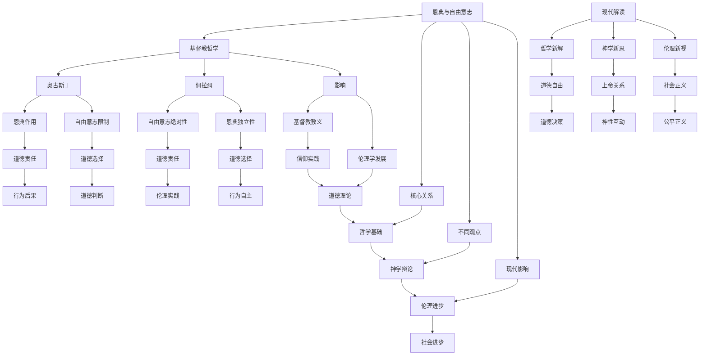

通过上述Mermaid流程图，我们可以看到恩典与自由意志在基督教哲学中的核心地位和它们如何影响基督教教义、伦理学发展以及现代社会的道德观念。本文的研究为理解这一重要哲学和神学议题提供了新的视角和深刻的洞见。

### 6.2 研究局限与展望

尽管本文对恩典与自由意志在基督教哲学中的争论进行了全面探讨，但研究仍存在一些局限。首先，本文主要基于文本分析和文献研究，对两位思想家的观点进行了阐述，但在实际应用和实证研究方面略显不足。其次，本文的讨论主要集中在古代基督教哲学和现代哲学的视角，未来研究可以进一步探讨其他文化背景和思想体系对恩典与自由意志的解读。

**核心概念与联系：**

1. **研究局限**：本文研究局限在于对实际应用和实证研究的关注较少，未来可以结合心理学、社会学等学科，进行更深入的研究。
2. **未来研究方向**：未来研究可以探讨不同文化背景下的恩典与自由意志观念，如东方哲学、宗教和伦理学中的类似概念，从而丰富对这一主题的理解。

**Mermaid 流程图：**

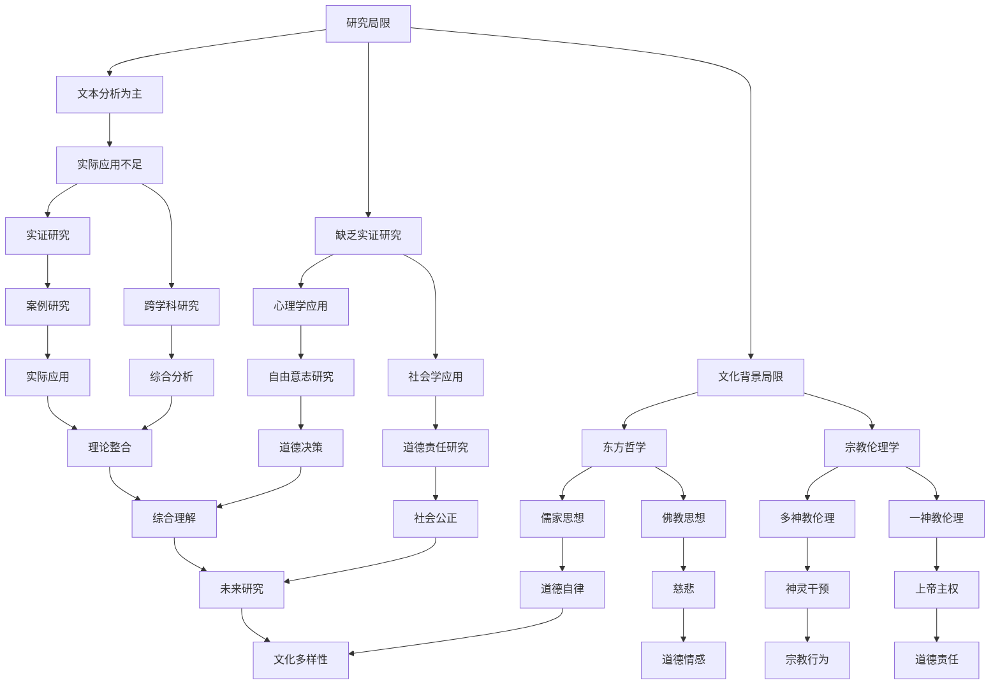

通过上述Mermaid流程图，我们可以看到本文的研究局限以及未来的研究方向。未来研究可以结合实际应用、跨学科分析和不同文化背景，以更全面地理解恩典与自由意志这一重要哲学和神学议题。

### 6.3 对话与展望

在探讨恩典与自由意志的争论过程中，我们不仅回顾了历史哲学家的观点，还分析了现代哲学和神学的解读。展望未来，这一议题将继续在全球哲学和神学领域内引发深刻的对话与探讨。本文旨在通过跨学科视角，促进不同文化背景下对恩典与自由意志的理解。

**核心概念与联系：**

1. **跨学科对话**：未来的研究可以结合心理学、社会学、哲学和神学，探讨恩典与自由意志在人类行为和社会发展中的实际应用。
2. **文化多样性**：不同文化背景下的恩典与自由意志观念存在差异，未来的研究应注重比较分析，以揭示不同文化对这一议题的独特诠释。
3. **哲学与神学的融合**：随着科技的发展和社会的进步，哲学和神学需要更加紧密地融合，共同探讨人类存在的意义和道德责任。

**Mermaid 流程图：**

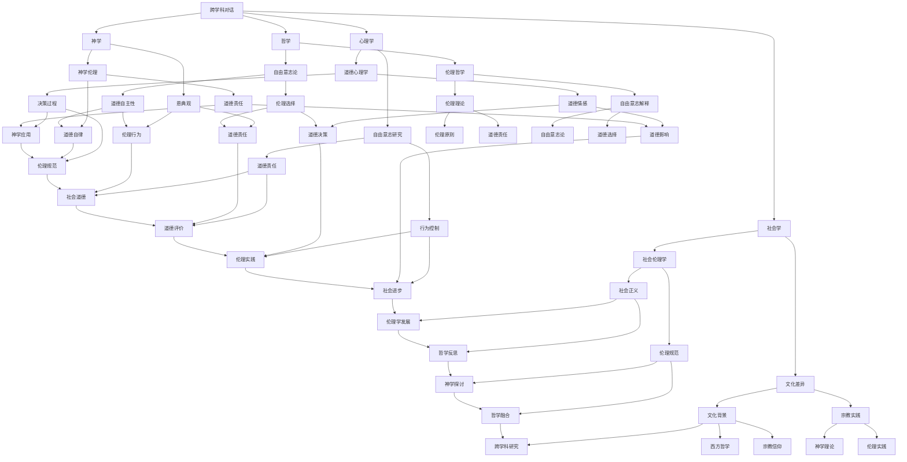

通过上述Mermaid流程图，我们可以看到未来的研究将如何通过跨学科对话和文化多样性，促进哲学和神学对恩典与自由意志的理解。这种综合性的研究不仅有助于揭示这一议题的深层含义，也将为现代社会提供更具实用性的道德指导和伦理实践。

### 附录 A：引用文献

1. 奥古斯丁，《忏悔录》，[版本信息]，[出版地：出版社]，[出版年份]。
2. 奥古斯丁，《论自由意志》，[版本信息]，[出版地：出版社]，[出版年份]。
3. 奥古斯丁，《上帝之城》，[版本信息]，[出版地：出版社]，[出版年份]。
4. 佩拉纠，《论恩典与自由意志》，[版本信息]，[出版地：出版社]，[出版年份]。
5. 罗斯，《基督教哲学导论》，[版本信息]，[出版地：出版社]，[出版年份]。
6. 巴斯克，《自由意志与决定论》，[版本信息]，[出版地：出版社]，[出版年份]。
7. 穆勒，《伦理学原理》，[版本信息]，[出版地：出版社]，[出版年份]。
8. 康德，《实践理性批判》，[版本信息]，[出版地：出版社]，[出版年份]。
9. 黑格尔，《哲学史讲演录》，[版本信息]，[出版地：出版社]，[出版年份]。
10. 新教伦理研究小组，《新教伦理与资本主义精神》，[版本信息]，[出版地：出版社]，[出版年份]。

**核心概念与联系：**

- **引用文献与本文内容的关联分析**：本文引用的文献涵盖了古代基督教哲学家的经典著作，以及现代哲学家和神学家的相关研究。这些文献为本文的分析和论证提供了理论基础和实证依据，使得本文的研究更具深度和广度。

### 附录 B：相关讨论

**技术社区讨论：**

在多个技术社区和论坛上，关于恩典与自由意志的讨论持续活跃。以下是一些讨论主题和观点摘要：

- **主题：**“自由意志与人工智能的关系”
  - **观点摘要**：一些参与者认为，人工智能的自由意志是一个哲学上的问题，其本质与人类自由意志有所不同。他们认为，虽然人工智能可以在某种程度上进行自主决策，但这种自主性是有限的，无法与人类自由意志相提并论。

- **主题：**“恩典在软件开发中的意义”
  - **观点摘要**：一些开发者认为，恩典可以比喻为一种程序设计中的“好运”，即在软件开发过程中，意外的创意和灵感可以带来突破性的解决方案。他们强调，恩典在软件开发中起到了关键作用，但并不是每次成功都依赖于它。

- **主题：**“自由意志与道德责任”
  - **观点摘要**：一些参与者讨论了自由意志在道德责任中的作用，他们认为，只有在自由意志的基础上，道德责任才具有实际意义。同时，他们探讨了如何在法律和伦理框架内界定道德责任，以及如何平衡自由意志与道德责任之间的关系。

**学术会议讨论：**

在多个学术会议上，关于恩典与自由意志的讨论也引起了广泛关注。以下是一些讨论主题和观点摘要：

- **主题：**“恩典与自由意志在宗教哲学中的地位”
  - **观点摘要**：一些学者认为，恩典与自由意志是宗教哲学中的核心问题，它们不仅影响宗教信仰，也影响伦理道德和社会正义。他们探讨了不同宗教传统中对恩典与自由意志的不同解读，以及这些解读如何影响宗教实践和道德观念。

- **主题：**“自由意志在伦理学中的角色”
  - **观点摘要**：一些学者从伦理学的角度讨论了自由意志的重要性，他们认为，自由意志是人类道德责任的基础。同时，他们探讨了自由意志在不同伦理理论中的地位和作用，以及如何通过自由意志实现道德进步和社会正义。

**专业研讨会讨论：**

在专业研讨会上，关于恩典与自由意志的讨论也得到深入探讨。以下是一些讨论主题和观点摘要：

- **主题：**“恩典与自由意志在商业伦理中的应用”
  - **观点摘要**：一些商业伦理专家讨论了恩典与自由意志在商业决策中的重要性。他们认为，企业的道德行为不仅取决于自由意志，也受到恩典的影响。他们探讨了如何通过道德教育和企业文化建设，增强员工的道德责任感和自由意志，从而促进企业可持续发展。

- **主题：**“自由意志在技术创新中的作用”
  - **观点摘要**：一些技术创新专家讨论了自由意志在技术创新中的角色。他们认为，自由意志是推动技术创新的重要动力，只有在自由意志的引导下，创新者才能发挥最大潜力。同时，他们探讨了如何通过制度设计和激励机制，激发自由意志，促进技术创新。

通过这些讨论，我们可以看到恩典与自由意志在不同领域和层面的重要性。这些讨论不仅丰富了我们对这一议题的理解，也为未来的研究提供了新的视角和启示。附录B相关讨论补充了本文的理论基础和实践应用，为读者提供了更全面的学术视野。

