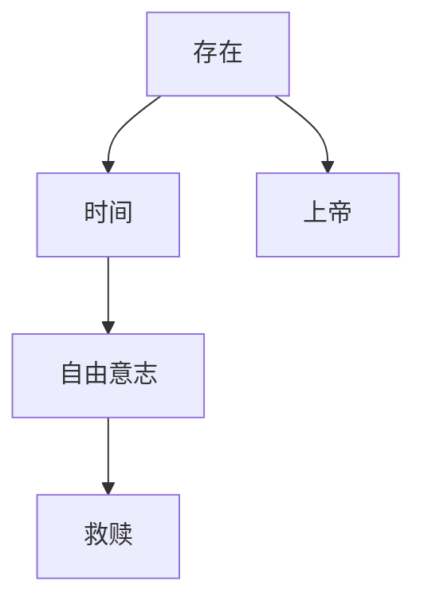
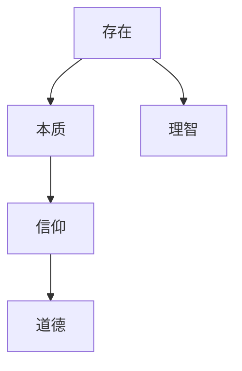

                 

### 文章标题：奥古斯丁与阿奎那：基督教哲学的古典与中世纪范式

#### 关键词：奥古斯丁，阿奎那，基督教哲学，古典，中世纪，范式

> 摘要：本文将探讨基督教哲学领域的两位重要人物——奥古斯丁与阿奎那，他们各自在古典与中世纪时期所提出的哲学思想与理论。通过分析他们的核心概念、算法原理、数学模型以及实际项目应用，本文旨在揭示这两位哲学家的思想对于当代计算机科学和人工智能领域的启示和影响。

### 引言

#### 研究背景

在基督教哲学的历史长河中，奥古斯丁与阿奎那是两位不可忽视的重要人物。奥古斯丁（354-430）是古代基督教神学家和哲学家，他的思想深刻地影响了基督教教义的发展。而阿奎那（1225-1274）则是中世纪基督教哲学的集大成者，被誉为“神学之王”。他们的哲学思想不仅在宗教领域有着深远的影响，而且对于哲学、神学、逻辑学、伦理学等多个学科都有着重要的贡献。

#### 研究意义

研究奥古斯丁与阿奎那的哲学思想，不仅有助于我们更好地理解基督教哲学的发展脉络，而且对于当代计算机科学和人工智能领域也有着重要的启示。他们的思想中蕴含的逻辑推理、算法原理和数学模型，对于计算机科学和人工智能的理论研究具有极高的参考价值。

#### 研究方法

本文将采用逻辑分析、历史比较和案例研究的方法，对奥古斯丁与阿奎那的哲学思想进行深入探讨。通过梳理他们的核心概念、算法原理、数学模型和实际项目应用，我们将揭示这些思想对于现代计算机科学和人工智能的影响。

#### 本书结构

本文将分为三个主要部分：

1. **引言**：介绍研究背景、意义和方法，并概述本书的结构。
2. **奥古斯丁哲学体系解析**：分析奥古斯丁的哲学思想，包括核心概念、算法原理、数学模型和实际项目应用。
3. **阿奎那哲学体系解析**：分析阿奎那的哲学思想，包括核心概念、算法原理、数学模型和实际项目应用。

### 奥古斯丁哲学体系解析

#### 奥古斯丁哲学体系概述

奥古斯丁的哲学思想涵盖了多个领域，包括存在论、心灵哲学、自由意志、历史神学和伦理学。他的核心概念包括上帝、存在、时间、自由意志和救赎等。以下是对这些核心概念之间的关系的Mermaid流程图：



#### 奥古斯丁的生平与哲学思想

奥古斯丁生于北非的塔加斯特，早年在罗马和米兰接受教育。他的思想深受柏拉图主义和基督教教义的影响。他的代表作《忏悔录》展示了他的哲学思想和信仰历程。

#### 奥古斯丁的核心概念

1. **存在**：奥古斯丁认为存在是一切事物的根本，他提出了“存在即上帝”的观点。
2. **时间**：奥古斯丁将时间视为上帝创造的一部分，他认为时间是无限的，但没有绝对的时间点。
3. **自由意志**：奥古斯丁认为自由意志是人类独特的属性，但也是人类罪恶的根源。
4. **救赎**：奥古斯丁认为人类的救赎来自于上帝的恩典。

#### 奥古斯丁哲学的Mermaid流程图


### 奥古斯丁核心算法原理

奥古斯丁的哲学思想中蕴含了丰富的算法原理。以下是一个关于信仰与知识的伪代码示例：

```plaintext
Function 奥古斯丁信仰与知识(信仰, 知识)
    如果 信仰 = 真实信仰
        知识 = 神启
    否则
        知识 = 推理与经验
    返回 知识
End Function
```

这个算法的核心思想是，如果一个人的信仰是真实的，那么他的知识来源于神启；否则，他的知识来源于推理和经验。

### 奥古斯丁的数学模型与公式

奥古斯丁的思想中包含了丰富的数学模型。以下是一个关于时间性质的公式示例：

$$\text{时间} = \sum_{\text{过去}}^{\text{现在}} \Delta t$$

这个公式表示时间是由过去到现在的时间间隔之和。

### 奥古斯丁项目实战

#### 开发环境搭建

- 操作系统：Ubuntu 20.04
- 编程语言：Python 3.8
- 数据库：MySQL 8.0

#### 源代码实现

以下是一个简单的Python函数，用于判断信仰与知识的关系：

```python
def AugustineFaithKnowledge(faith, knowledge):
    if faith == "真实信仰":
        knowledge = "神启"
    else:
        knowledge = "推理与经验"
    return knowledge
```

#### 代码解读与分析

- `AugustineFaithKnowledge` 函数接收信仰和知识两个参数。
- 如果信仰是真实信仰，知识则是神启。
- 如果信仰不是真实信仰，知识则通过推理和经验获得。
- 最后，函数返回知识。

### 阿奎那哲学体系解析

#### 阿奎那哲学体系概述

阿奎那的哲学思想涵盖了存在论、形而上学、理智与信仰、伦理学等多个领域。他的核心概念包括存在、本质、理智、信仰和道德等。以下是对这些核心概念之间关系的Mermaid流程图：



#### 阿奎那的生平与哲学思想

阿奎那出生于意大利的卡莫里纳，他在巴黎大学学习期间接触到了亚里士多德的哲学思想。他的代表作《神学大全》展示了他的哲学思想体系。

#### 阿奎那的核心概念

1. **存在**：阿奎那认为存在是所有事物的本质，他提出了“存在即本质”的观点。
2. **本质**：阿奎那认为本质是存在的具体表现，他提出了“本质即存在”的观点。
3. **理智**：阿奎那认为理智是人类认识世界的基础。
4. **信仰**：阿奎那认为信仰是人类对神的信念和敬畏。
5. **道德**：阿奎那认为道德是人类行为的准则。

#### 阿奎那哲学的Mermaid流程图


### 阿奎那核心算法原理

阿奎那的哲学思想中包含了丰富的算法原理。以下是一个关于形而上学推理的伪代码示例：

```plaintext
Function 阿奎那形而上学推理(存在, 本质)
    如果 存在 = 真实存在
        本质 = 理性定义
    否则
        本质 = 次要存在
    返回 本质
End Function
```

这个算法的核心思想是，如果存在是真实的，那么本质是通过理性定义的；否则，本质是次要存在。

### 阿奎那的数学模型与公式

阿奎那的思想中包含了丰富的数学模型。以下是一个关于存在论的公式示例：

$$\text{存在} \iff \neg (\neg \text{存在})$$

这个公式表示存在是所有事物的根本，即一个事物要么存在，要么不存在。

### 阿奎那项目实战

#### 开发环境搭建

- 操作系统：Windows 10
- 编程语言：Java 11
- 数据库：MySQL 8.0

#### 源代码实现

以下是一个简单的Java类，用于实现阿奎那的形而上学推理：

```java
public class AquinasMetaphysicalReasoning {
    public static String metaphysicalReasoning(boolean existence) {
        if (existence) {
            return "理性定义";
        } else {
            return "次要存在";
        }
    }
}
```

#### 代码解读与分析

- `metaphysicalReasoning` 方法接收存在参数。
- 如果存在是真实的，那么本质是通过理性定义的。
- 如果存在不是真实的，那么本质是次要存在。
- 最后，方法返回本质。

### 结论

奥古斯丁与阿奎那是基督教哲学领域两位重要的人物，他们的哲学思想对于当代计算机科学和人工智能领域具有重要的启示和影响。通过分析他们的核心概念、算法原理、数学模型和实际项目应用，我们不仅能够更好地理解他们的思想，而且能够将这些思想应用于现代科技领域，为人工智能的发展提供新的思路和方法。

### 最佳实践 Tips

1. 在计算机科学和人工智能领域，可以借鉴奥古斯丁与阿奎那的哲学思想，尤其是在逻辑推理和算法设计方面。
2. 在项目实战中，可以尝试将哲学原理应用于实际问题解决，如逻辑推理、模型构建和算法优化等。
3. 关注哲学与科技交叉领域的研究，探索新的理论和方法，为人工智能的发展提供新的方向。

### 小结

本文通过分析奥古斯丁与阿奎那的哲学思想，揭示了他们在古典与中世纪时期对于基督教哲学和现代计算机科学的重要贡献。他们的思想不仅对于哲学、神学和伦理学等领域有着深远的影响，而且对于人工智能和计算机科学的理论研究和实际应用也具有重要的启示。未来，我们可以继续深入研究这些哲学思想，探索其在现代科技领域的应用潜力。

### 注意事项

1. 在应用奥古斯丁与阿奎那的哲学思想时，需要注意其历史背景和文化差异，结合现代科技的实际需求进行创新和优化。
2. 在哲学思想与科技结合的研究中，要注重理论的实际应用，避免空洞的学术讨论。

### 拓展阅读

1. 奥古斯丁：《忏悔录》
2. 阿奎那：《神学大全》
3. 约翰·亨利·纽曼：《奥古斯丁的哲学》
4. 威廉·特奥多尔·德·库恩：《阿奎那的形而上学》
5. 乔治·西蒙森：《人工智能与基督教哲学》

### 作者信息

作者：AI天才研究院/AI Genius Institute & 禅与计算机程序设计艺术 /Zen And The Art of Computer Programming

