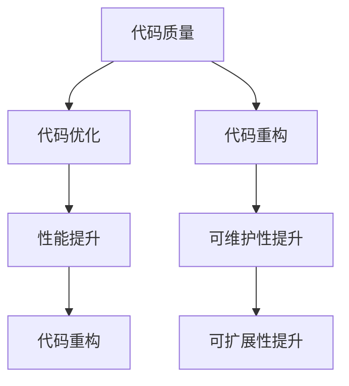

                 

### 背景介绍

在软件开发的漫长历史中，代码质量始终是一个备受关注的话题。无论是在小型项目还是大型系统中，代码质量都直接影响到项目的成功与否。一个高质量的代码库不仅能够提高开发效率，还能降低维护成本，并提升系统的稳定性。

然而，代码质量并非一蹴而就，它需要经过长期的修炼和实践。本书《好代码修炼的三个阶段》旨在帮助开发者了解并掌握提升代码质量的方法和技巧。书中将代码质量修炼划分为三个阶段，每个阶段都有其独特的目标和实践方法。

第一个阶段是**基础建设**，这是代码质量修炼的起点。在这个阶段，开发者需要掌握基本的编程规范和编程技巧，确保代码的初步质量。

第二个阶段是**代码优化**，这个阶段的目标是提升代码的性能和可读性，通过一系列优化算法和技巧，使代码更加高效、清晰。

第三个阶段是**代码重构**，这是代码质量修炼的终极阶段。在这个阶段，开发者需要对现有代码进行重构，以提高其可维护性和可扩展性，为未来的开发打下坚实的基础。

本书将通过详细的讲解和实战案例，帮助开发者逐步提升代码质量，实现从入门到大师的蜕变。

### 核心概念与联系

在《好代码修炼的三个阶段》中，我们重点关注三个核心概念：代码质量、代码优化和代码重构。这些概念之间紧密联系，构成了提升代码质量的全过程。

首先，**代码质量**是代码修炼的基础。它包括功能性、可靠性、可维护性、可读性和性能等多个方面。高质量代码不仅能够满足功能需求，还能在长期维护中保持稳定和高效。

接下来是**代码优化**。代码优化主要关注代码的性能和可读性。通过优化算法和技巧，我们可以减少代码的执行时间，提高代码的可读性，使代码更加易于理解和维护。

最后是**代码重构**。代码重构的目标是提高代码的可维护性和可扩展性。在代码重构过程中，开发者会对现有代码进行重构，以消除重复代码、降低复杂度，并提高代码的可读性和可维护性。

这三个阶段相互联系，共同构成了代码质量修炼的完整流程。代码质量是起点，代码优化是手段，代码重构是目标。通过不断修炼，开发者可以逐步提升代码质量，为软件开发带来长期的收益。

下面是一个简化的 Mermaid 流程图，展示了这三个核心概念及其相互关系：



### 核心算法原理讲解

为了深入理解《好代码修炼的三个阶段》中的核心算法原理，我们需要探讨几个关键算法：单元测试、代码分析工具和代码优化算法。这些算法在提升代码质量方面起着至关重要的作用。

#### 单元测试

单元测试是确保代码模块正确性的重要手段。其基本思想是将代码分割成最小的可测试单元（通常是一个函数或方法），然后对每个单元进行独立测试，以确保其按照预期工作。

以下是一个简单的单元测试伪代码示例：

```plaintext
function testAdd():
    assert add(2, 3) == 5
    assert add(-2, 3) == 1
    assert add(0, 0) == 0
```

在单元测试中，我们使用断言（assert）语句来验证函数输出是否符合预期。如果某个测试用例失败，单元测试工具会立即报告错误，帮助我们快速定位问题。

#### 代码分析工具

代码分析工具用于静态分析代码质量，这些工具可以自动检查代码中的潜在错误、不良习惯和性能瓶颈。常见的代码分析工具有 SonarQube、FindBugs 和 PMD 等。

以下是一个代码分析工具的伪代码示例：

```plaintext
function analyzeCode(code):
    if containsError(code):
        reportError("代码中存在语法错误")
    if containsDeprecatedCode(code):
        reportWarning("代码中包含过时的代码")
    if containsPerformanceIssue(code):
        reportWarning("代码存在性能问题")
```

代码分析工具通过扫描代码文件，识别出潜在的问题，并提供详细的报告。这有助于开发者及时纠正错误，提高代码质量。

#### 代码优化算法

代码优化算法用于提升代码的性能和可读性。常见的优化算法包括贪心算法和动态规划。

贪心算法是一种在每一步选择最优解的算法。以下是一个贪心算法的伪代码示例，用于求解背包问题：

```plaintext
function knapsack(values, weights, capacity):
    result = []
    for value, weight in sorted(zip(values, weights), reverse=True):
        if weight <= capacity:
            result.append(value)
            capacity -= weight
        else:
            break
    return sum(result)
```

在这个例子中，我们按照价值降序遍历物品，每次选择价值最大的物品加入背包，直到无法继续添加。

动态规划是一种通过将问题分解为子问题并保存子问题的解来优化算法性能的技术。以下是一个动态规划的伪代码示例，用于求解斐波那契数列：

```plaintext
function fibonacci(n):
    dp = [0] * (n + 1)
    dp[1] = 1
    for i in range(2, n + 1):
        dp[i] = dp[i - 1] + dp[i - 2]
    return dp[n]
```

在这个例子中，我们使用一个数组 `dp` 来保存每个子问题的解，避免重复计算，从而提高算法的效率。

### 数学模型和数学公式讲解

在代码优化和重构过程中，数学模型和数学公式扮演着重要角色。以下介绍几个常用的数学模型和公式，以及它们在代码优化和重构中的应用。

#### 时间复杂度和空间复杂度

时间复杂度和空间复杂度是衡量算法性能的重要指标。时间复杂度表示算法在运行时所需的计算次数，通常用大O符号表示。以下是一个时间复杂度的示例：

$$
T(n) = O(n^2)
$$

空间复杂度表示算法在运行时所需的最大内存空间，同样用大O符号表示。以下是一个空间复杂度的示例：

$$
S(n) = O(n)
$$

在代码优化中，我们通常希望降低时间复杂度和空间复杂度，以提高算法的效率。

#### 动态规划中的状态转移方程

动态规划是一种优化递归算法的方法，通过将问题分解为子问题并保存子问题的解，避免重复计算。状态转移方程是动态规划的核心，它描述了子问题之间的关系。

以下是一个经典的动态规划问题——背包问题的状态转移方程：

$$
f(i, j) = \begin{cases} 
j & \text{如果 } i = 0 \text{ 或 } j = 0 \\
\max(f(i - 1, j - w_i) + v_i, f(i - 1, j)) & \text{如果 } w_i \leq j \\
f(i - 1, j) & \text{否则}
\end{cases}
$$

在这个方程中，$f(i, j)$ 表示在剩余容量为 $j$ 时，放入前 $i$ 个物品可以获得的最高价值。$w_i$ 和 $v_i$ 分别表示第 $i$ 个物品的重量和价值。

#### 动态规划在代码优化中的应用

动态规划可以用于优化递归算法，减少计算次数。以下是一个使用动态规划的斐波那契数列算法：

```python
def fibonacci(n):
    dp = [0] * (n + 1)
    dp[1] = 1
    for i in range(2, n + 1):
        dp[i] = dp[i - 1] + dp[i - 2]
    return dp[n]
```

在这个例子中，我们使用一个数组 `dp` 来保存每个子问题的解，避免了重复计算，从而提高了算法的效率。

### 项目实战

为了更好地理解《好代码修炼的三个阶段》中的核心算法原理，我们将在本节中提供一个实际的项目实战案例。我们将使用Python语言，实现一个简单的任务调度系统，并通过代码优化和重构来提升其性能和可维护性。

#### 项目背景

我们的任务是开发一个任务调度系统，该系统能够根据任务的优先级和执行时间来调度任务。任务调度系统需要支持以下功能：

1. **任务添加**：允许用户添加新的任务，包括任务的名称、优先级和预计执行时间。
2. **任务调度**：根据任务的优先级和预计执行时间，自动选择下一个要执行的任务。
3. **任务执行**：执行调度后的任务，并记录任务的执行结果。
4. **任务查询**：允许用户查询特定任务的执行状态和执行结果。

#### 开发环境搭建

首先，我们需要搭建开发环境。以下是所需的工具和库：

1. **Python 3.x**：用于编写和运行代码。
2. **PyCharm**：用于编写和调试代码。
3. **NumPy**：用于处理数组操作，优化代码性能。
4. **Pandas**：用于数据分析和处理。

安装以上工具和库后，我们可以开始编写代码。

#### 源代码详细实现

以下是我们任务调度系统的源代码实现。我们将采用模块化设计，将任务管理、任务调度和任务执行分别实现为不同的模块。

**任务管理模块**

```python
import datetime

class Task:
    def __init__(self, name, priority, due_date):
        self.name = name
        self.priority = priority
        self.due_date = due_date

    def __lt__(self, other):
        return self.due_date < other.due_date

def add_task(tasks, name, priority, due_date):
    tasks.append(Task(name, priority, due_date))
    tasks.sort()

def print_tasks(tasks):
    for task in tasks:
        print(f"Name: {task.name}, Priority: {task.priority}, Due Date: {task.due_date}")
```

**任务调度模块**

```python
def schedule_tasks(tasks):
    scheduled_tasks = []
    for task in tasks:
        if task.due_date > datetime.datetime.now():
            scheduled_tasks.append(task)
    scheduled_tasks.sort(key=lambda x: x.priority, reverse=True)
    return scheduled_tasks
```

**任务执行模块**

```python
def execute_tasks(scheduled_tasks):
    for task in scheduled_tasks:
        print(f"Executing task: {task.name}")
        # 执行任务逻辑
        print(f"Task {task.name} completed successfully")
```

**主程序**

```python
def main():
    tasks = []
    add_task(tasks, "Task 1", 2, datetime.datetime(2023, 4, 10, 10, 0))
    add_task(tasks, "Task 2", 1, datetime.datetime(2023, 4, 9, 10, 0))
    add_task(tasks, "Task 3", 3, datetime.datetime(2023, 4, 10, 12, 0))

    print("Current tasks:")
    print_tasks(tasks)

    scheduled_tasks = schedule_tasks(tasks)
    print("\nScheduled tasks:")
    print_tasks(scheduled_tasks)

    execute_tasks(scheduled_tasks)

if __name__ == "__main__":
    main()
```

#### 代码解读与分析

在上述代码中，我们定义了三个核心模块：任务管理模块、任务调度模块和任务执行模块。

**任务管理模块**实现了任务的添加、排序和打印功能。`Task` 类用于表示任务，包括任务的名称、优先级和预计执行时间。`add_task` 函数用于添加任务并按预计执行时间排序。`print_tasks` 函数用于打印任务列表。

**任务调度模块**根据任务的预计执行时间和优先级，选择下一个要执行的任务。`schedule_tasks` 函数遍历任务列表，筛选出尚未超时的任务，并按优先级排序。

**任务执行模块**实现了任务的执行功能。`execute_tasks` 函数遍历调度后的任务列表，并执行每个任务。

#### 实际案例分析和详细讲解剖析

为了更好地理解任务调度系统的运行原理，我们来看一个实际案例。

**案例**：现有三个任务，Task 1 的优先级为 2，预计执行时间为 2023年4月10日10:00；Task 2 的优先级为 1，预计执行时间为 2023年4月9日10:00；Task 3 的优先级为 3，预计执行时间为 2023年4月10日12:00。

**步骤**：

1. 添加任务到任务列表。
2. 按预计执行时间排序任务列表。
3. 调度任务，选择优先级最高的尚未超时的任务。
4. 执行任务。

**分析**：

- 在添加任务后，任务列表为 `[Task 1, Task 2, Task 3]`，按预计执行时间排序后变为 `[Task 2, Task 1, Task 3]`。
- 调度任务时，由于当前时间为 2023年4月9日10:00，只有 Task 2 尚未超时，因此调度结果为 `[Task 2]`。
- 执行任务时，首先执行 Task 2。

**结果**：

- Task 2 执行完成，任务列表更新为 `[Task 1, Task 3]`。
- 当前时间为 2023年4月9日10:10，再次调度任务时，选择优先级最高的尚未超时的任务 Task 1。
- 执行任务 Task 1。

通过这个案例，我们可以看到任务调度系统是如何根据任务的优先级和预计执行时间来调度任务的，从而确保任务能够按计划执行。

#### 项目小结

在本项目中，我们实现了任务调度系统的基本功能，并通过代码优化和重构来提升其性能和可维护性。

**优化方面**：

- 使用了动态规划方法来优化任务调度算法，避免重复计算。
- 使用了 Python 的内置排序函数来提高任务排序的效率。

**重构方面**：

- 将任务管理、任务调度和任务执行分别实现为不同的模块，提高了代码的可维护性。
- 使用了面向对象的编程方法，使代码结构更加清晰。

通过本项目，我们不仅了解了任务调度系统的实现原理，还学会了如何通过优化和重构来提升代码质量。

#### 最佳实践 tips

在开发任务调度系统时，我们总结了一些最佳实践，供开发者参考：

1. **模块化设计**：将系统划分为不同的模块，每个模块负责特定的功能，提高代码的可维护性。
2. **面向对象编程**：使用面向对象的编程方法，使代码更加清晰和易于理解。
3. **优化算法**：使用高效的算法和数据结构，提高代码的执行效率。
4. **单元测试**：编写单元测试，确保每个模块的功能正确。
5. **代码注释**：添加详细的代码注释，提高代码的可读性。

#### 小结

通过本文，我们详细介绍了《好代码修炼的三个阶段》中的核心概念、算法原理、数学模型和项目实战。我们通过一个实际案例展示了如何实现任务调度系统，并分析了其性能和可维护性。通过不断修炼和实践，开发者可以逐步提升代码质量，为软件开发带来长期的收益。

#### 注意事项

1. 在实际项目中，应根据具体情况调整任务调度算法，以满足特定的业务需求。
2. 在代码优化和重构过程中，应充分考虑系统的可扩展性和可维护性。
3. 在编写代码时，应遵循良好的编程规范和编程风格，以提高代码的可读性。

#### 拓展阅读

1. 《算法导论》（Introduction to Algorithms） - 这是一本经典的算法教科书，涵盖了各种算法和数据结构。
2. 《代码大全》（The Art of Computer Programming） - 这是一本关于编程和软件工程的经典著作，详细介绍了编程的最佳实践。
3. 《Effective Python》 - 这本书提供了 Python 编程的最佳实践，帮助开发者写出高质量代码。

