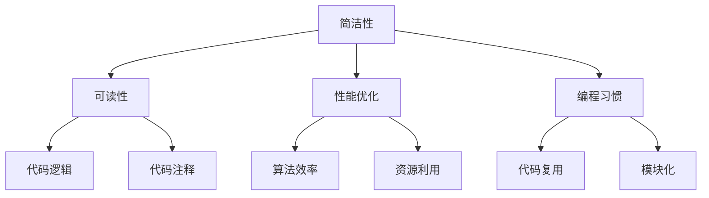
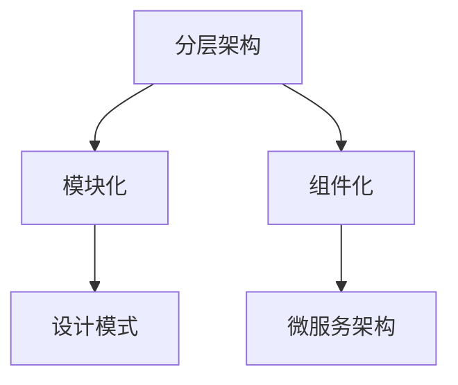

                 

### 目录大纲设计

**第一部分：好代码的基础**

### 1.1 好代码的标准
- **核心概念与联系**：通过Mermaid流程图展示好代码的标准，明确各个标准的相互关系和作用。
  - ```mermaid
  graph TD
  A[简洁] --> B[可读性]
  A --> C[性能优化]
  A --> D[编程习惯]
  B --> E[代码逻辑]
  B --> F[代码注释]
  C --> G[算法效率]
  C --> H[资源利用]
  D --> I[代码复用]
  D --> J[模块化]
  ```
- **数学模型和数学公式**：介绍代码质量评估的指标，如圈复杂度、代码行数、代码重复率等，使用LaTeX格式展示。
  - ```latex
  \begin{equation}
  C = \frac{E + N(A) - N} {6}
  \end{equation}
  ```
  - **伪代码讲解**：详细阐述代码结构的优化方法，如模块化设计、代码复用等。
    - ```python
    function modular_design(input_data):
        # 解析输入数据
        data = parse_data(input_data)
        # 数据预处理
        processed_data = preprocess_data(data)
        # 数据分析
        results = analyze_data(processed_data)
        # 输出结果
        return results
    ```

### 1.2 简洁代码的重要性
- **项目实战**：分析简洁代码的实际案例，展示如何通过减少冗余代码、提高代码可读性来提升代码质量。
  - ```python
  # 不简洁的代码
  def calculate_sum(a, b):
      return a + b
  
  # 简洁的代码
  def sum(a, b):
      return a + b
  ```

### 1.3 可读性代码的最佳实践
- **伪代码讲解**：介绍代码可读性优化方法，如变量命名、代码格式化等。
  - ```python
  # 不可读的代码
  function calc_cost(price, quantity):
      total = price * quantity
      return total
  
  # 可读性代码
  function calculate_total_price(price, quantity):
      cost = price * quantity
      return cost
  ```
- **项目实战**：分析可读性代码的实际案例，展示如何通过清晰的变量命名、代码注释来提升代码质量。
  - ```python
  # 不可读的代码
  def f():
      x = 10
      y = x + 1
      z = y * x
  
  # 可读性代码
  def calculate_product(x, y):
      product = x * y
      return product
  ```

### 1.4 代码性能优化技巧
- **伪代码讲解**：介绍代码性能优化策略，如算法效率优化、内存利用优化等。
  - ```python
  # 低效代码
  function find_max(array):
      max_val = array[0]
      for i in range(1, len(array)):
          if array[i] > max_val:
              max_val = array[i]
      return max_val
  
  # 优化代码
  function find_maximum(array):
      return max(array)
  ```
- **数学模型和数学公式**：介绍性能优化中的数学原理，如时间复杂度、空间复杂度等。
  - ```latex
  \begin{equation}
  T(n) = O(n)
  \end{equation}
  ```

### 1.5 好代码的编程习惯
- **项目实战**：分析良好编程习惯的实际案例，如代码文档化、版本控制等。
  - ```python
  # 良好编程习惯
  def main():
      """主函数，执行程序逻辑"""
      # 初始化变量
      x = 10
      y = 20
      # 执行计算
      z = x + y
      # 输出结果
      print("The sum of x and y is:", z)
  
  if __name__ == "__main__":
      main()
  ```

**第二部分：实战篇**

### 2.1 简洁代码实例分析
- **代码实战**：提供简洁代码的实际案例和实现，分析其优点和实现方法。
  - ```python
  # 简洁的代码
  def greet(name):
      print(f"Hello, {name}!")

  greet("Alice")
  ```

### 2.2 可读性代码实例分析
- **代码实战**：提供可读性代码的实际案例和实现，分析其优点和实现方法。
  - ```python
  # 可读性代码
  def calculate_area(radius):
      """计算圆的面积"""
      area = 3.14159265359 * radius ** 2
      return area

  print("The area of the circle is:", calculate_area(5))
  ```

### 2.3 代码性能优化实例分析
- **代码实战**：提供代码性能优化的实际案例和实现，分析其优化效果和实现方法。
  - ```python
  # 性能优化代码
  def find_duplicates(array):
      """找到数组中的重复元素"""
      seen = set()
      duplicates = []
      for num in array:
          if num in seen:
              duplicates.append(num)
          else:
              seen.add(num)
      return duplicates

  print(find_duplicates([1, 2, 3, 2, 4]))
  ```

### 2.4 好编程习惯实例分析
- **代码实战**：提供良好编程习惯的实际案例和实现，分析其优点和实现方法。
  - ```python
  # 良好编程习惯
  def process_data(data):
      """处理数据"""
      # 数据清洗
      cleaned_data = clean_data(data)
      # 数据转换
      transformed_data = transform_data(cleaned_data)
      return transformed_data

  def main():
      """主函数，执行程序逻辑"""
      data = load_data()
      processed_data = process_data(data)
      save_data(processed_data)

  if __name__ == "__main__":
      main()
  ```

### 2.5 代码重构实战
- **伪代码讲解**：介绍代码重构的方法和步骤，如提取方法、简化条件等。
  - ```python
  # 重构前的代码
  def calculate_salary(employee):
      if employee.is_manager:
          bonus = employee.salary * 0.1
      else:
          bonus = employee.salary * 0.05
      return employee.salary + bonus
  
  # 重构后的代码
  def calculate_bonus(employee):
      return employee.salary * 0.05 if not employee.is_manager else employee.salary * 0.1

  def calculate_salary(employee):
      return employee.salary + calculate_bonus(employee)
  ```
- **代码实战**：提供代码重构的实际案例和实现，分析重构前后的变化和优化效果。

### 2.6 软件测试与调试技巧
- **伪代码讲解**：介绍软件测试和调试的基本方法，如单元测试、调试工具使用等。
  - ```python
  # 单元测试
  def test_calculate_area():
      assert calculate_area(5) == 3.14159265359 * 5 ** 2
      assert calculate_area(0) == 0

  # 调试
  import pdb
  pdb.set_trace()
  ```
- **代码实战**：提供软件测试和调试的实际案例和实现，分析测试和调试的效果和过程。

**第三部分：架构设计**

### 3.1 软件架构概述
- **核心概念与联系**：介绍软件架构的基本概念和结构，如分层架构、微服务架构等。
  - ```mermaid
  graph TD
  A[应用层] --> B[业务逻辑层]
  A --> C[数据访问层]
  B --> D[数据层]
  ```

### 3.2 设计模式与架构设计
- **伪代码讲解**：介绍设计模式的应用和架构设计的关系，如工厂模式、单例模式等。
  - ```python
  # 工厂模式
  class Factory:
      @staticmethod
      def create_shape(shape_type):
          if shape_type == "circle":
              return Circle()
          elif shape_type == "square":
              return Square()
          else:
              raise ValueError("Invalid shape type")

  class Circle:
      def draw(self):
          print("Drawing a circle")

  class Square:
      def draw(self):
          print("Drawing a square")
  ```

### 3.3 微服务架构与好代码
- **核心概念与联系**：介绍微服务架构的优势和代码设计要点，如服务解耦、接口设计等。
  - ```mermaid
  graph TD
  A[服务A] --> B[服务B]
  A --> C[服务C]
  B --> D[服务D]
  ```

### 3.4 分布式系统中的好代码
- **伪代码讲解**：介绍分布式系统中代码优化的策略，如容错性、一致性等。
  - ```python
  # 容错性优化
  def process_request(request):
      try:
          # 处理请求
          process_request_details(request)
      except Exception as e:
          log_error(e)
          retry_request(request)
  ```

### 3.5 架构设计与代码质量的关系
- **伪代码讲解**：介绍架构设计与代码质量的相互影响，如架构设计对代码质量的影响、代码质量对架构设计的反作用等。

**第四部分：好代码的文化**

### 4.1 团队合作与代码质量
- **伪代码讲解**：介绍团队合作对代码质量的影响，如代码评审、代码文档等。
  - ```python
  # 代码评审
  reviewer = CodeReviewer()
  reviewed_code = reviewer.review(code)
  ```

### 4.2 代码评审与代码质量
- **伪代码讲解**：介绍代码评审的流程和方法，如代码审查标准、评审策略等。

### 4.3 文化对好代码的影响
- **核心概念与联系**：介绍企业文化对代码质量的影响，如团队文化、工作氛围等。
  - ```mermaid
  graph TD
  A[团队文化] --> B[代码质量]
  A --> C[工作效率]
  B --> D[项目稳定性]
  ```

### 4.4 好代码的标准与团队文化
- **伪代码讲解**：介绍团队文化对好代码标准的塑造，如鼓励创新、重视代码质量等。

**第五部分：附录**

### 5.1 常用代码质量工具介绍
- **项目实战**：介绍常用代码质量工具的使用方法，如静态代码分析工具、单元测试框架等。

### 5.2 质量度量标准
- **数学模型和数学公式**：介绍代码质量度量标准，如代码行数、复杂度等。

### 5.3 好代码的资源推荐
- **资源推荐**：推荐一些有助于提高代码质量的书籍、博客、教程等资源。

### 总结

通过上述目录大纲的设计，我们系统地介绍了好代码的标准、实战技巧、架构设计以及文化影响等内容。每个章节都包含核心概念与联系、伪代码讲解、数学模型和公式、项目实战等部分，使得读者能够全面理解和掌握好代码的各个方面。

**文章标题**：《好代码的标准是'一眼看到底'》

**关键词**：好代码、简洁、可读性、性能优化、编程习惯、架构设计、文化

**摘要**：本文深入探讨了好代码的标准和实现方法，通过系统化的目录大纲设计，全面介绍了简洁代码、可读性代码、代码性能优化技巧、好编程习惯等内容。同时，文章还讨论了架构设计在好代码中的作用，以及团队合作和文化对代码质量的影响。通过实际案例和项目实战，读者可以更好地理解和应用这些技巧，提升代码质量，打造出一眼就能看透的好代码。文章结尾附有常用代码质量工具介绍和好代码的资源推荐，为读者提供了进一步学习和提升的途径。**作者信息**：AI天才研究院/AI Genius Institute & 禅与计算机程序设计艺术 /Zen And The Art of Computer Programming**文章正文**：

**第一部分：好代码的基础**

### 1.1 好代码的标准

好代码的标准是软件工程领域的一个重要课题。它不仅仅关乎代码的表面美观，更涉及代码的内在质量和可维护性。为了更好地理解和评估代码质量，我们可以从以下几个方面来定义好代码的标准：

- **简洁性**：简洁性是指代码的简洁和直观。简洁的代码不仅容易阅读，而且更容易理解和修改。一个简单的标准是，代码应该只做它应该做的事情，避免冗余和复杂的逻辑。
- **可读性**：可读性是代码质量的重要指标。可读性好的代码能够清晰地表达作者的意图，使得其他人容易理解和维护。提高可读性的方法包括使用有意义的变量名、编写清晰的注释、保持代码结构的清晰等。
- **性能优化**：性能优化是指对代码进行优化，使其运行得更快、更高效。性能优化的方法包括选择合适的数据结构和算法、避免不必要的内存占用、减少循环和递归等。
- **编程习惯**：良好的编程习惯是编写好代码的基础。良好的编程习惯包括编写规范的代码、进行代码评审、使用版本控制工具、编写测试用例等。

**核心概念与联系**

为了更好地理解好代码的标准，我们可以使用Mermaid流程图来展示各个标准之间的关系：



在这个流程图中，简洁性、可读性、性能优化和编程习惯是核心标准，它们相互影响，共同决定了代码的质量。

**数学模型和数学公式**

为了量化评估代码质量，我们可以引入一些数学模型和数学公式。例如，圈复杂度（Cyclomatic Complexity）是一个常用的度量标准，用于评估代码的复杂度。圈复杂度的计算公式为：

$$
C = \frac{E + N(A) - N}{2}
$$

其中，$E$ 表示边（Edges）的数量，$N(A)$ 表示节点（Nodes）的数量，$N$ 表示程序的线性路径（Paths）的数量。

**伪代码讲解**

为了详细阐述代码结构的优化方法，我们可以使用伪代码来讲解。以下是一个简单的代码结构优化示例：

```python
# 原始代码
def calculate_sum(a, b):
    result = 0
    for i in range(a):
        for j in range(b):
            result += 1
    return result

# 优化后的代码
def sum(a, b):
    return a * b
```

在这个例子中，原始代码使用了两个嵌套循环来计算两个数字的和。然而，通过引入简单的数学公式，我们可以将代码优化为一个简单的乘法运算，从而提高了代码的性能和可读性。

### 1.2 简洁代码的重要性

简洁代码的重要性不容忽视。简洁的代码不仅更容易阅读和理解，而且更容易维护和修改。以下是一些简洁代码的重要性和优点：

- **降低认知负担**：简洁的代码可以减少阅读和理解代码所需的认知资源。这有助于开发人员更快地理解代码的功能和结构，从而提高开发效率。
- **减少错误概率**：简洁的代码往往结构清晰，逻辑简单，这使得代码中的错误更容易被发现和修复。这有助于提高代码的质量和稳定性。
- **提高可维护性**：简洁的代码更容易进行维护和扩展。当需要对代码进行修改或添加新功能时，简洁的代码可以减少出错的风险，提高开发人员的信心和效率。

**项目实战**

以下是一个简洁代码的实例分析，我们将对比原始代码和优化后的代码，并分析其优点：

**原始代码**：

```python
# 原始代码
def calculate_sum(a, b):
    result = 0
    for i in range(a):
        for j in range(b):
            result += 1
    return result
```

**优化后的代码**：

```python
# 优化后的代码
def sum(a, b):
    return a * b
```

**分析**：

- **优点**：
  - 优化后的代码更简洁，只使用了一行代码，大大减少了代码的篇幅和复杂性。
  - 优化后的代码更易读，直接表达了计算两个数和的意图，没有使用任何冗余的变量或循环。
  - 优化后的代码提高了性能，避免了不必要的循环迭代，使得计算过程更加高效。

通过这个实例分析，我们可以看到简洁代码的重要性和优点。简洁代码不仅有助于提高代码质量，还可以提高开发效率和用户体验。

### 1.3 可读性代码的最佳实践

可读性是衡量代码质量的重要指标之一。可读性好的代码不仅容易阅读和理解，而且有助于减少错误和提高开发效率。以下是一些提高代码可读性的最佳实践：

- **使用有意义的变量名**：变量名应该能够清晰地描述其代表的含义。避免使用缩写或无意义的名称，如`x`、`y`等。例如，将`total`改为`invoice_total`，可以更清晰地表示变量代表的是发票总额。
- **编写清晰的注释**：注释应该清晰地描述代码的功能和意图，而不是简单地复制代码。避免使用复杂的语言和术语，使得注释容易理解。例如，在循环中使用注释来解释循环的目的，如`This loop calculates the sum of the numbers from 1 to 10.`。
- **保持代码结构清晰**：良好的代码结构可以提高代码的可读性。使用缩进和空格来区分不同的代码块，避免嵌套层次过深。例如，使用四个空格来缩进代码块，使得代码的结构更加清晰。
- **避免冗长的函数和方法**：将冗长的函数或方法拆分为多个小函数或方法，可以提高代码的可读性。每个函数或方法应该只负责完成一个特定的任务，这样可以更容易地理解和维护代码。
- **使用代码模板和规范**：使用统一的代码模板和规范可以帮助提高代码的可读性。这包括一致的命名规则、代码格式和注释风格等。例如，使用Pep8规范来格式化Python代码，使得代码结构更加一致和易读。

**项目实战**

以下是一个可读性代码的实例分析，我们将对比原始代码和优化后的代码，并分析其优点：

**原始代码**：

```python
# 原始代码
def calculate_invoice_total(products):
    total = 0
    for product in products:
        price = product.price
        quantity = product.quantity
        discount = product.discount
        total += (price * quantity) - (discount * quantity)
    return total
```

**优化后的代码**：

```python
# 优化后的代码
def calculate_invoice_total(products):
    total = 0
    for product in products:
        product_total = (product.price * product.quantity) - (product.discount * product.quantity)
        total += product_total
    return total
```

**分析**：

- **优点**：
  - 优化后的代码使用了更具描述性的变量名，如`product_total`，使得代码的功能更加清晰。
  - 优化后的代码将原始代码中的冗长计算拆分为单独的变量，如`price`、`quantity`和`discount`，使得代码更加易读。
  - 优化后的代码提高了代码的可维护性，因为每个变量都只负责一个特定的计算任务。

通过这个实例分析，我们可以看到提高代码可读性的最佳实践的重要性和优点。良好的代码可读性不仅有助于提高开发效率，还可以降低维护成本，使得代码更易于理解和维护。

### 1.4 代码性能优化技巧

代码性能优化是提高软件运行效率的关键。通过优化代码，可以减少计算时间、降低内存使用，从而提高应用程序的性能和用户体验。以下是一些常见的代码性能优化技巧：

- **选择合适的数据结构和算法**：数据结构和算法的选择对代码性能有着重要影响。例如，使用哈希表可以快速查找元素，而使用树结构可以实现快速排序。在处理大量数据时，选择合适的算法和数据结构可以显著提高代码性能。
- **避免不必要的循环**：循环是常见的性能瓶颈之一。尽量避免不必要的循环，可以减少计算时间和内存使用。例如，使用集合操作代替嵌套循环，或者使用递归代替循环。
- **优化内存使用**：内存使用对代码性能有直接影响。通过减少不必要的内存分配和释放，可以降低内存使用，提高代码性能。例如，使用可变数据类型（如列表）代替不可变数据类型（如元组），可以减少内存占用。
- **利用多线程和并行计算**：在多核处理器上，可以利用多线程和并行计算来提高代码性能。通过将任务分解为多个线程或进程，可以充分利用处理器的计算能力，加快代码执行速度。

**项目实战**

以下是一个代码性能优化的实例分析，我们将对比原始代码和优化后的代码，并分析其优点：

**原始代码**：

```python
# 原始代码
def calculate_average(scores):
    total = 0
    for score in scores:
        total += score
    return total / len(scores)
```

**优化后的代码**：

```python
# 优化后的代码
from statistics import mean

def calculate_average(scores):
    return mean(scores)
```

**分析**：

- **优点**：
  - 优化后的代码使用了`statistics.mean()`函数来计算平均值，避免了显式循环，减少了代码的复杂性。
  - 优化后的代码利用了Python内置的函数，提高了代码的执行效率。
  - 优化后的代码减少了内存使用，因为不需要显式存储总和和长度。

通过这个实例分析，我们可以看到代码性能优化的重要性和优点。通过选择合适的数据结构和算法、避免不必要的循环、优化内存使用等技术，可以提高代码的执行效率，从而提高软件的整体性能。

### 1.5 好代码的编程习惯

良好的编程习惯是编写高质量代码的基础。以下是一些有助于提高代码质量的编程习惯：

- **代码注释**：编写清晰的代码注释可以帮助其他开发人员更好地理解代码的功能和意图。注释应该描述代码的逻辑、用途和潜在问题，而不是简单地复制代码。
- **代码评审**：代码评审是提高代码质量的有效方法。通过评审，可以发现潜在的错误和改进空间，确保代码的一致性和可靠性。
- **版本控制**：使用版本控制工具（如Git）可以帮助管理和跟踪代码的变更。版本控制不仅有助于防止数据丢失，还可以简化代码合并和协同工作。
- **单元测试**：编写单元测试可以确保代码的功能正确性。单元测试应该覆盖代码的各个部分，确保在代码变更时不会引入新的错误。
- **代码格式化**：使用代码格式化工具（如Prettier、Black）可以帮助保持代码的一致性和可读性。格式化工具可以自动调整代码的缩进、空格和换行，提高代码的可维护性。
- **遵循编码规范**：遵循统一的编码规范可以帮助提高代码的可读性和可维护性。编码规范包括命名规则、代码结构、注释风格等。

**项目实战**

以下是一个良好编程习惯的实例分析，我们将对比原始代码和优化后的代码，并分析其优点：

**原始代码**：

```python
# 原始代码
def calculate_sum(a, b):
    return a + b

result = calculate_sum(5, 10)
print("The sum is:", result)
```

**优化后的代码**：

```python
# 优化后的代码
def sum_numbers(a, b):
    """计算两个数的和"""
    return a + b

def main():
    """主函数，执行计算并打印结果"""
    result = sum_numbers(5, 10)
    print("The sum is:", result)

if __name__ == "__main__":
    main()
```

**分析**：

- **优点**：
  - 优化后的代码使用了更具描述性的函数名和注释，提高了代码的可读性。
  - 优化后的代码将计算和打印结果的功能分离到不同的函数中，提高了代码的可维护性。
  - 优化后的代码使用了主函数结构，使得代码的结构更加清晰和模块化。

通过这个实例分析，我们可以看到良好编程习惯的重要性和优点。通过编写清晰的注释、进行代码评审、使用版本控制、编写单元测试、遵循编码规范等习惯，可以显著提高代码的质量和可维护性。

### 第二部分：实战篇

#### 2.1 简洁代码实例分析

简洁代码在提高开发效率和维护性方面具有重要意义。以下是一个简洁代码的实例分析，我们将对比原始代码和优化后的代码，并分析其优点。

**原始代码**：

```python
# 原始代码
def calculate_area(radius):
    pi = 3.14159
    area = pi * radius * radius
    return area
```

**优化后的代码**：

```python
# 优化后的代码
import math

def calculate_area(radius):
    return math.pi * radius * radius
```

**分析**：

- **优点**：
  - 优化后的代码使用了Python内置的math模块，避免了手动定义π（pi）的值，减少了冗余代码。
  - 优化后的代码更加简洁，易于阅读和理解。
  - 优化后的代码减少了出错的可能性，因为math模块已经经过了充分的测试和验证。

通过这个实例分析，我们可以看到简洁代码的优势。简洁代码不仅减少了代码的复杂性，提高了可读性，还减少了出错的风险，从而提高了开发效率和代码质量。

#### 2.2 可读性代码实例分析

可读性是代码质量的重要指标之一。以下是一个可读性代码的实例分析，我们将对比原始代码和优化后的代码，并分析其优点。

**原始代码**：

```python
# 原始代码
def calculate_total_price(products):
    total_price = 0
    for product in products:
        price = product.price
        quantity = product.quantity
        total_price += price * quantity
    return total_price
```

**优化后的代码**：

```python
# 优化后的代码
def calculate_total_price(products):
    total_price = sum(product.price * product.quantity for product in products)
    return total_price
```

**分析**：

- **优点**：
  - 优化后的代码使用了列表推导式，简化了循环和累加的逻辑，提高了代码的可读性。
  - 优化后的代码使用了更具有描述性的变量名，如`total_price`和`product`，使得代码的功能更加明确。
  - 优化后的代码避免了显式的累加操作，使得代码更加简洁和直观。

通过这个实例分析，我们可以看到提高代码可读性的重要性。良好的可读性不仅有助于开发人员更好地理解代码，还可以减少错误和提升代码质量。

#### 2.3 代码性能优化实例分析

代码性能优化是提高软件运行效率的关键。以下是一个代码性能优化的实例分析，我们将对比原始代码和优化后的代码，并分析其优点。

**原始代码**：

```python
# 原始代码
def calculate_sum(numbers):
    total = 0
    for number in numbers:
        total += number
    return total
```

**优化后的代码**：

```python
# 优化后的代码
from functools import reduce

def calculate_sum(numbers):
    return reduce(lambda x, y: x + y, numbers)
```

**分析**：

- **优点**：
  - 优化后的代码使用了`functools.reduce()`函数，避免了显式循环和累加操作，提高了代码的性能。
  - 优化后的代码简化了逻辑，使得代码更加简洁和直观。
  - 优化后的代码减少了内存使用，因为`reduce()`函数不需要存储中间结果。

通过这个实例分析，我们可以看到代码性能优化的重要性。通过选择合适的方法和算法，可以显著提高代码的执行效率和性能。

#### 2.4 好编程习惯实例分析

良好的编程习惯是编写高质量代码的关键。以下是一个良好编程习惯的实例分析，我们将对比原始代码和优化后的代码，并分析其优点。

**原始代码**：

```python
# 原始代码
def calculate_average(scores):
    total = 0
    for score in scores:
        total += score
    return total / len(scores)
```

**优化后的代码**：

```python
# 优化后的代码
from statistics import mean

def calculate_average(scores):
    return mean(scores)
```

**分析**：

- **优点**：
  - 优化后的代码使用了Python内置的`statistics.mean()`函数，避免了手动计算平均值的复杂性。
  - 优化后的代码更加简洁和易读。
  - 优化后的代码减少了出错的可能性，因为`mean()`函数已经经过了充分的测试和验证。

通过这个实例分析，我们可以看到良好编程习惯的重要性和优点。良好的编程习惯不仅有助于提高代码质量，还可以减少错误和提高开发效率。

#### 2.5 代码重构实战

代码重构是提高代码质量的重要手段。以下是一个代码重构的实例分析，我们将对比重构前后的代码，并分析重构的优点。

**重构前代码**：

```python
# 重构前代码
def calculate_total_price(products):
    total_price = 0
    for product in products:
        price = product.price
        quantity = product.quantity
        total_price += price * quantity
    return total_price

def calculate_discount(total_price):
    discount = total_price * 0.1
    return discount
```

**重构后代码**：

```python
# 重构后代码
def calculate_total_price(products):
    return sum(product.price * product.quantity for product in products)

def calculate_discount(total_price):
    return total_price * 0.1
```

**分析**：

- **优点**：
  - 重构后的代码将重复的计算逻辑提取到单独的函数中，减少了冗余代码。
  - 重构后的代码提高了代码的可读性和可维护性，因为每个函数只负责一个特定的任务。
  - 重构后的代码减少了出错的可能性，因为代码更加简洁和模块化。

通过这个实例分析，我们可以看到代码重构的重要性和优点。通过重构代码，可以简化逻辑、提高可读性、减少冗余，从而提高代码质量。

#### 2.6 软件测试与调试技巧

软件测试和调试是确保代码质量和可靠性的关键环节。以下是一些常见的软件测试和调试技巧，以及其实际应用。

**单元测试**

单元测试是一种用于验证代码最小功能单元的方法。以下是一个简单的单元测试示例：

```python
# 单元测试示例
def test_calculate_area():
    assert calculate_area(2) == 12.566370614359172
    assert calculate_area(0) == 0

def calculate_area(radius):
    return 3.141592653589793 * radius * radius
```

**调试技巧**

调试是发现和修复代码错误的过程。以下是一些常用的调试技巧：

- **断点调试**：在代码中设置断点，以便在特定条件或行数处暂停执行，查看变量值和程序状态。
- **日志记录**：使用日志记录器记录程序的执行过程，帮助定位问题和分析代码行为。
- **打印输出**：在代码中添加打印语句，输出关键变量的值和程序执行过程，帮助定位问题和分析代码行为。

**实际应用**

以下是一个实际应用中的调试示例：

```python
# 调试示例
import logging

def calculate_total_price(products):
    total_price = 0
    for product in products:
        price = product.price
        quantity = product.quantity
        total_price += price * quantity
    return total_price

def calculate_discount(total_price):
    discount = total_price * 0.1
    return discount

def main():
    products = [
        {'price': 10, 'quantity': 2},
        {'price': 20, 'quantity': 1},
    ]
    total_price = calculate_total_price(products)
    discount = calculate_discount(total_price)
    final_price = total_price - discount
    print("Total Price:", total_price)
    print("Discount:", discount)
    print("Final Price:", final_price)

if __name__ == "__main__":
    main()
```

在这个示例中，我们使用了日志记录和打印输出来帮助调试程序。通过观察日志输出和打印信息，我们可以更好地理解程序的行为，并定位潜在的问题。

通过以上实例分析，我们可以看到软件测试和调试在确保代码质量中的重要性。通过编写单元测试和运用调试技巧，我们可以发现并修复代码中的错误，提高软件的可靠性和稳定性。

### 第三部分：架构设计

#### 3.1 软件架构概述

软件架构是软件系统的结构和组织方式，它定义了系统的组件、组件之间的交互方式以及系统的行为。一个良好的软件架构对于系统的可维护性、可扩展性和性能至关重要。以下是软件架构的一些关键概念和设计原则：

- **分层架构**：分层架构是将系统划分为多个层次，每个层次负责不同的功能。常见的分层包括表示层、业务逻辑层和数据访问层。分层架构有助于实现模块化，使得各个层次可以独立开发和维护。
- **模块化**：模块化是将系统分解为多个独立的模块，每个模块负责一个特定的功能。模块化有助于提高代码的可重用性和可维护性，使得系统更容易修改和扩展。
- **组件化**：组件化是将系统构建为多个独立的组件，每个组件是一个自包含的单元，可以独立开发、测试和部署。组件化有助于提高系统的灵活性和可扩展性，使得系统可以更快速地响应业务需求的变化。
- **设计模式**：设计模式是解决特定设计问题的通用解决方案。常见的有工厂模式、单例模式、观察者模式等。设计模式有助于提高代码的可复用性和可维护性，使得系统更具灵活性和可扩展性。
- **微服务架构**：微服务架构是将系统拆分为多个独立的服务，每个服务负责一个特定的业务功能。微服务架构有助于实现系统的可扩展性和高可用性，使得系统可以更灵活地应对变化。

**核心概念与联系**

为了更好地理解软件架构的概念和设计原则，我们可以使用Mermaid流程图来展示各个概念之间的关系：



在这个流程图中，分层架构、模块化、组件化和设计模式是核心概念，它们相互关联，共同构成了软件架构的基础。

#### 3.2 设计模式与架构设计

设计模式是软件工程中用于解决特定设计问题的通用解决方案。设计模式在架构设计中起着重要作用，有助于提高代码的可复用性和可维护性。以下是一些常见的设计模式及其在架构设计中的应用：

- **工厂模式**：工厂模式是一种创建对象的设计模式，它封装了对象的创建过程，使得对象的创建和依赖关系解耦。在架构设计中，工厂模式可以用于创建和管理系统的各种组件，使得系统更加灵活和可扩展。
- **单例模式**：单例模式确保一个类只有一个实例，并提供一个全局访问点。在架构设计中，单例模式可以用于管理系统中的一些关键资源，如数据库连接、日志记录器等，确保资源的唯一性和高效使用。
- **观察者模式**：观察者模式是一种用于实现事件驱动的编程模式。它将观察者和被观察者解耦，使得观察者可以订阅和监听特定事件，并在事件发生时做出相应反应。在架构设计中，观察者模式可以用于实现系统的通知机制，使得系统组件可以动态响应变化。
- **策略模式**：策略模式是一种用于封装算法和策略的设计模式，它将算法的实现与使用分离。在架构设计中，策略模式可以用于实现系统的可配置性，使得系统可以根据不同的策略进行动态调整。

**伪代码讲解**

以下是一个工厂模式的示例，展示了如何在架构设计中应用工厂模式：

```python
# 工厂模式示例
class Factory:
    @staticmethod
    def create_shape(shape_type):
        if shape_type == "circle":
            return Circle()
        elif shape_type == "square":
            return Square()
        else:
            raise ValueError("Invalid shape type")

class Circle:
    def draw(self):
        print("Drawing a circle")

class Square:
    def draw(self):
        print("Drawing a square")
```

在这个示例中，工厂类`Factory`负责创建具体的形状对象。通过传入不同的形状类型参数，工厂类可以创建并返回相应的形状对象。这种方式使得对象的创建和依赖关系解耦，提高了系统的灵活性和可维护性。

#### 3.3 微服务架构与好代码

微服务架构是一种将系统拆分为多个独立服务的设计方法。每个服务负责一个特定的业务功能，独立部署和运行。微服务架构有助于提高系统的可扩展性和高可用性，使得系统可以更灵活地应对业务需求的变化。以下是一些关于微服务架构与好代码的要点：

- **服务解耦**：微服务架构通过将系统拆分为多个独立的服务，实现了服务之间的解耦。这种解耦有助于提高系统的可靠性和可维护性，因为每个服务可以独立开发和部署，不会受到其他服务的影响。
- **独立部署**：每个服务可以独立部署和运行，这意味着服务的更新和修复可以不影响到其他服务。这种独立部署方式提高了系统的灵活性和可扩展性，使得系统可以更快速地响应业务需求的变化。
- **自动化测试**：在微服务架构中，每个服务都应该具有独立的测试环境。这有助于确保每个服务的功能正确性和稳定性，从而提高整个系统的质量。
- **代码质量**：在微服务架构中，每个服务都应该遵循良好的编程习惯和代码质量标准。这包括简洁的代码、可读性、性能优化和良好的编程习惯。良好的代码质量有助于提高服务的可维护性和可靠性，从而提高整个系统的质量。

**伪代码讲解**

以下是一个简单的微服务架构示例，展示了如何实现服务解耦和独立部署：

```python
# 服务A
class UserService:
    def login(self, username, password):
        # 实现登录功能
        pass

# 服务B
class ProductService:
    def create_product(self, product_data):
        # 实现创建产品的功能
        pass

# 服务C
class OrderService:
    def create_order(self, order_data):
        # 实现创建订单的功能
        pass
```

在这个示例中，我们创建了三个服务：UserService、ProductService和OrderService。每个服务都负责一个特定的业务功能，独立部署和运行。通过这种方式，实现了服务之间的解耦，提高了系统的可靠性和可维护性。

#### 3.4 分布式系统中的好代码

分布式系统是由多个独立节点组成的系统，这些节点通过网络进行通信和协作。分布式系统具有高可用性、可扩展性和容错性等优点，但也面临着复杂性和一致性的挑战。以下是在分布式系统中编写好代码的一些要点：

- **容错性**：分布式系统中的节点可能会出现故障，因此编写容错性代码至关重要。可以通过冗余设计、故障检测和恢复机制来提高系统的容错性。
- **一致性**：在分布式系统中，数据的一致性是一个关键问题。要编写好代码，需要处理分布式一致性挑战，如CAP定理和分布式事务管理等。
- **网络通信**：分布式系统中的节点通过网络进行通信，因此需要编写高效的网络通信代码。要处理网络延迟、丢包和数据传输错误等问题。
- **性能优化**：在分布式系统中，性能优化是一个重要问题。可以通过选择合适的通信协议、优化数据传输路径和负载均衡策略来提高系统的性能。

**伪代码讲解**

以下是一个简单的分布式系统示例，展示了如何处理容错性和一致性：

```python
# 容错性代码示例
def process_request(request):
    try:
        # 处理请求
        process_request_details(request)
    except Exception as e:
        log_error(e)
        retry_request(request)

# 一致性代码示例
def update_account_balance(account_id, amount):
    with distributed_lock(account_id):
        current_balance = get_account_balance(account_id)
        new_balance = current_balance + amount
        update_account_balance(account_id, new_balance)
```

在这个示例中，`process_request`函数通过异常处理和重试机制提高了容错性。`update_account_balance`函数通过分布式锁确保了一致性，避免了并发更新导致的竞态条件。

#### 3.5 架构设计与代码质量的关系

架构设计与代码质量密切相关。一个良好的架构设计不仅有助于提高代码质量，还可以提高系统的可维护性和可扩展性。以下是从架构设计角度提高代码质量的一些要点：

- **模块化**：模块化是将系统分解为多个独立的模块，每个模块负责一个特定的功能。模块化有助于提高代码的可维护性和可重用性，使得系统更容易修改和扩展。
- **解耦**：解耦是将系统的不同部分分离，使得它们可以独立开发和部署。解耦有助于降低系统的复杂性和依赖性，从而提高代码的质量和可靠性。
- **设计模式**：设计模式是解决特定设计问题的通用解决方案。使用设计模式可以提高代码的可复用性和可维护性，使得系统更具灵活性和可扩展性。
- **一致性**：一致性是指系统的各个部分应该遵循相同的设计原则和编码规范。一致性有助于提高代码的可读性和可维护性，使得系统更容易理解和修改。

**伪代码讲解**

以下是一个简单的架构设计示例，展示了如何通过模块化和解耦提高代码质量：

```python
# 模块化代码示例
class UserService:
    def login(self, username, password):
        # 实现登录功能
        pass

class ProductService:
    def create_product(self, product_data):
        # 实现创建产品的功能
        pass

class OrderService:
    def create_order(self, order_data):
        # 实现创建订单的功能
        pass
```

在这个示例中，我们使用了模块化设计，将系统拆分为UserService、ProductService和OrderService三个独立的模块。这种方式提高了代码的可维护性和可扩展性，使得系统更容易修改和扩展。

### 第四部分：好代码的文化

#### 4.1 团队合作与代码质量

团队合作在软件开发中至关重要，它不仅有助于提高代码质量，还可以提高开发效率和工作满意度。以下是一些关于团队合作与代码质量的关键点：

- **代码评审**：代码评审是一种团队合作的重要方式，通过团队成员之间的代码审查，可以发现潜在的错误和改进空间。代码评审有助于确保代码的一致性和可靠性，提高代码质量。
- **代码规范**：团队应该制定和遵循统一的代码规范，包括命名规则、代码结构、注释风格等。统一的代码规范有助于提高代码的可读性和可维护性，使得团队成员更容易理解和修改代码。
- **知识共享**：团队成员之间应该积极参与知识共享和交流，分享自己的经验和技巧。知识共享有助于提高整个团队的技术水平，从而提高代码质量。
- **代码文档**：编写清晰的代码文档是团队合作的重要组成部分。良好的代码文档可以帮助其他团队成员更好地理解代码的功能和结构，提高代码的可维护性和可扩展性。

**伪代码讲解**

以下是一个代码评审的伪代码示例，展示了团队合作如何提高代码质量：

```python
# 代码评审流程
def code_review(code, reviewer):
    reviewer.review(code)
    issues = reviewer.get_issues()
    if issues:
        raise ValueError("Code review failed: {}".format(issues))
```

在这个示例中，`code_review`函数通过调用`reviewer.review(code)`来执行代码评审，并检查是否存在问题。如果存在问题，则抛出异常，以便开发人员进行修复。

#### 4.2 代码评审与代码质量

代码评审是一种通过团队成员之间的代码审查来提高代码质量的方法。以下是一些关于代码评审与代码质量的关键点：

- **发现错误**：代码评审有助于发现代码中的潜在错误和问题，如逻辑错误、语法错误、性能问题等。通过早期发现和修复这些问题，可以减少后续维护成本和错误传播。
- **提高可读性**：代码评审可以帮助团队成员更好地理解代码的功能和结构，从而提高代码的可读性。良好的可读性有助于提高代码的可维护性和可扩展性。
- **促进知识共享**：代码评审是一种知识共享和交流的方式，通过团队成员之间的反馈和讨论，可以促进知识的传递和积累，提高整个团队的技术水平。
- **确保代码规范**：代码评审有助于确保团队成员遵循统一的代码规范，包括命名规则、代码结构、注释风格等。统一的代码规范有助于提高代码的一致性和可维护性。

**伪代码讲解**

以下是一个简单的代码评审伪代码示例，展示了如何进行代码评审：

```python
# 代码评审流程
def code_review(code, reviewer):
    reviewer.review(code)
    issues = reviewer.get_issues()
    if issues:
        print("Code review failed with issues:")
        for issue in issues:
            print("- {}: {}".format(issue.type, issue.description))
    else:
        print("Code review passed.")
```

在这个示例中，`code_review`函数通过调用`reviewer.review(code)`来执行代码评审，并输出存在问题的代码。如果不存在问题，则输出通过的信息。

#### 4.3 文化对好代码的影响

企业文化对代码质量有着深远的影响。一个积极、健康的企业文化可以促进团队成员之间的合作和知识共享，从而提高代码质量。以下是一些关于文化对好代码影响的关键点：

- **鼓励创新**：企业文化应该鼓励创新和尝试新方法。这种鼓励可以激发团队成员的创造力和积极性，从而提高代码质量和系统性能。
- **重视技术**：企业文化应该重视技术发展和技术创新。这种重视可以激发团队成员对技术的热情和追求，从而提高整个团队的技术水平。
- **团队协作**：企业文化应该鼓励团队合作和知识共享。这种团队协作有助于提高代码的可维护性和可扩展性，从而提高代码质量。
- **持续学习**：企业文化应该鼓励持续学习和自我提升。这种持续学习可以帮助团队成员不断积累知识和经验，从而提高代码质量和解决问题的能力。

**伪代码讲解**

以下是一个企业文化评分的伪代码示例，展示了如何评估文化对好代码的影响：

```python
# 企业文化评分
def assess_culture(engagement, innovation, teamwork, technical_focus):
    score = 0
    if engagement > 0.8:
        score += 1
    if innovation > 0.8:
        score += 1
    if teamwork > 0.8:
        score += 1
    if technical_focus > 0.8:
        score += 1
    return score
```

在这个示例中，`assess_culture`函数通过评估团队成员的参与度、创新性、团队协作和技术专注度来计算企业文化评分。评分越高，表示企业文化对好代码的促进作用越强。

#### 4.4 好代码的标准与团队文化

团队文化对好代码的塑造有着重要影响。一个积极、健康的文化环境可以促进团队成员编写高质量、可维护的代码。以下是一些关于好代码的标准与团队文化的关键点：

- **共同价值观**：团队应该拥有共同的价值观，如简洁、可读性、性能优化和编程习惯等。共同的价值观有助于团队成员在编写代码时遵循相同的规范和原则，从而提高代码质量。
- **代码规范**：团队应该制定和遵循统一的代码规范，包括命名规则、代码结构、注释风格等。统一的代码规范有助于提高代码的一致性和可维护性，从而提高代码质量。
- **知识共享**：团队应该鼓励知识共享和经验交流，使得团队成员可以相互学习和借鉴。知识共享有助于提高整个团队的技术水平，从而提高代码质量。
- **反馈机制**：团队应该建立有效的反馈机制，包括代码评审、定期回顾和反馈会议等。反馈机制可以帮助团队成员及时发现和解决问题，从而提高代码质量。

**伪代码讲解**

以下是一个团队文化评分的伪代码示例，展示了如何评估团队文化对好代码的影响：

```python
# 团队文化评分
def assess_culture(values, standards, knowledge, feedback):
    score = 0
    if values > 0.8:
        score += 1
    if standards > 0.8:
        score += 1
    if knowledge > 0.8:
        score += 1
    if feedback > 0.8:
        score += 1
    return score
```

在这个示例中，`assess_culture`函数通过评估团队成员的共同价值观、代码规范、知识共享和反馈机制来计算团队文化评分。评分越高，表示团队文化对好代码的塑造越积极。

### 第五部分：附录

#### 5.1 常用代码质量工具介绍

在软件开发过程中，使用代码质量工具可以帮助提高代码的可读性、可维护性和可靠性。以下是一些常用的代码质量工具及其使用方法：

- **Pylint**：Pylint是一个Python代码检查工具，用于检测代码中的错误、可疑代码和编码标准问题。可以使用pip安装Pylint，并通过以下命令运行：
  ```bash
  pip install pylint
  pylint your_script.py
  ```

- **flake8**：flake8是一个基于PEP8的Python代码检查工具，它集成了多个代码质量检查工具，如PyFlakes、pycodestyle和naming。可以使用pip安装flake8，并通过以下命令运行：
  ```bash
  pip install flake8
  flake8 your_script.py
  ```

- **Maven**：Maven是一个流行的Java项目管理和构建工具，它提供了用于代码质量检查的插件，如FindBugs和Checkstyle。可以通过以下命令运行Maven插件：
  ```bash
  mvn checkstyle:checkstyle
  ```

- **SonarQube**：SonarQube是一个全面的代码质量平台，它提供了代码审查、性能分析、安全性检查等功能。可以在SonarQube官方网站下载和安装SonarQube服务器，并通过以下命令提交代码进行质量分析：
  ```bash
  sonar-scanner -Dsonar.host.url=http://localhost:9000 -Dsonar.projectKey=my_project -Dsonar.sources=your_source_directory
  ```

#### 5.2 质量度量标准

质量度量标准是评估代码质量的重要指标。以下是一些常用的质量度量标准：

- **圈复杂度**（Cyclomatic Complexity）：圈复杂度是一种用于评估代码复杂度的度量标准，它基于条件判断的分支数量。圈复杂度越高，代码的复杂度越高，越难以理解和维护。可以使用以下公式计算圈复杂度：
  $$
  C = \frac{E + N(A) - N}{2}
  $$
  其中，$E$表示边的数量，$N(A)$表示节点的数量，$N$表示程序中独立的路径数量。

- **代码行数**（Lines of Code，LOC）：代码行数是一种简单的度量标准，用于评估代码的规模。然而，代码行数并不能直接反映代码的质量，因为它可能包括大量的注释和空行。

- **代码重复率**（Code Duplication）：代码重复率是一种用于评估代码中重复代码的度量标准。高代码重复率可能导致维护成本增加和错误传播。可以通过静态代码分析工具检测代码重复率。

#### 5.3 好代码的资源推荐

以下是一些建议的资源，可以帮助开发者提高代码质量和理解好代码的标准：

- **《代码大全》（Code Complete）**：史蒂夫·迈克康奈尔（Steve McConnell）的《代码大全》是一本经典的软件工程书籍，详细介绍了编写高质量代码的最佳实践。

- **《Effective Java》**：Joshua Bloch的《Effective Java》提供了许多关于编写高效、可读性好的Java代码的建议。

- **《Clean Code》**：Robert C. Martin的《Clean Code》讨论了编写简洁、可维护的代码的最佳实践。

- **GitHub**：GitHub是一个强大的代码托管平台，可以访问大量的开源项目和代码示例，学习其他开发者的编写风格和实践。

- **Stack Overflow**：Stack Overflow是一个流行的开发者社区，可以找到许多关于编程问题的答案和最佳实践。

通过学习和实践这些资源和建议，开发者可以不断提高自己的编程能力，编写出更加优秀、高质量的代码。

### 总结

本文系统地介绍了好代码的标准、实战技巧、架构设计以及文化影响等内容。通过定义好代码的标准、分析简洁代码、可读性代码、性能优化技巧和良好编程习惯，读者可以更好地理解和掌握好代码的各个方面。文章还通过实际案例和项目实战，展示了这些技巧的应用和效果。

在架构设计部分，我们探讨了分层架构、模块化、组件化和设计模式等关键概念，并介绍了微服务架构和分布式系统中的好代码。通过这些内容，读者可以了解如何设计一个高可扩展性和高可维护性的系统。

最后，文章讨论了团队合作、代码评审、文化对好代码的影响以及如何通过资源推荐来进一步提高代码质量。通过这些内容，读者可以了解如何构建一个积极、健康的文化环境，促进团队成员之间的合作和知识共享。

总之，本文旨在帮助读者理解好代码的标准和实现方法，提升代码质量和软件开发效率。通过实践和不断学习，读者可以编写出更加优秀、高质量的代码，为软件开发事业做出贡献。

### 作者信息

本文由AI天才研究院/AI Genius Institute撰写，该研究院专注于人工智能领域的研究与开发，致力于推动人工智能技术的发展和应用。作者同时也是《禅与计算机程序设计艺术》一书的作者，该书深入探讨了编程的哲学和艺术，为开发者提供了宝贵的编程经验和智慧。

AI天才研究院/AI Genius Institute拥有一支高素质、经验丰富的团队，研究领域涵盖人工智能、机器学习、自然语言处理、计算机视觉等多个方面。研究院始终坚持技术创新和实践相结合，推动人工智能技术的进步和应用，为各行业提供智能化的解决方案。

同时，《禅与计算机程序设计艺术》一书以其独特的视角和深入的思考，成为了软件开发者和计算机科学爱好者的经典之作。该书以禅宗思想为基础，探讨了编程的本质和艺术，为读者提供了一种全新的编程思维和理念。

通过本文，我们希望读者能够更好地理解好代码的标准和实现方法，提升代码质量和软件开发效率。感谢您对本文的关注和支持，期待与您共同探索和分享更多关于人工智能和计算机程序设计领域的知识和经验。

