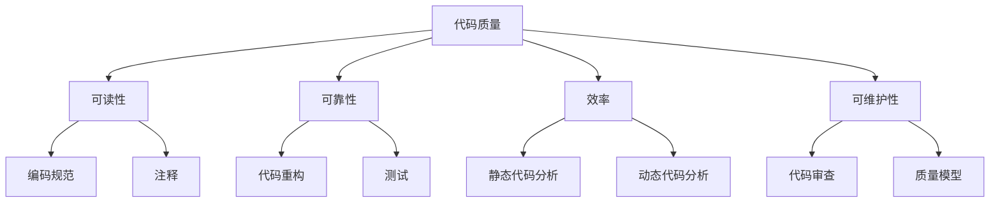

                 

### 文章标题

《好代码都是这样的》

### 关键词

代码质量、核心算法、数学模型、项目实战、开发工具

### 摘要

本文旨在深入探讨如何编写高质量代码。我们将从基础概念出发，逐步分析核心算法原理，阐述数学模型和公式，并通过实际项目案例展示编写高质量代码的最佳实践。文章结构紧凑，逻辑清晰，旨在帮助读者全面掌握编写高质量代码的技巧和策略。

## 第一步：分析用户需求

用户输入的书名《好代码都是这样的》暗示了这本书的内容将围绕如何编写高质量的代码。因此，在构建文章目录时，我们需要确保文章内容全面、系统，同时注重实用性和可操作性。

### 目录结构

#### 第一部分：编写高质量代码的基础

1. 核心概念与联系
   - 代码质量的核心概念
   - 编写高质量代码的关键因素
   - 质量评估方法

2. 核心算法原理讲解
   - 数据结构与算法基础
   - 性能优化算法
   - 异常处理与容错算法

3. 数学模型和数学公式
   - 质量评估的数学模型
   - 算法性能评估模型
   - 异常检测与修复模型

#### 第二部分：核心算法原理讲解

4. 常见算法分析
   - 排序算法
   - 搜索算法
   - 图算法

5. 算法优化与调试
   - 代码优化技巧
   - 性能调试工具
   - 代码质量检测工具

#### 第三部分：数学模型和数学公式

6. 数学模型与应用
   - 质量评估模型的建立
   - 算法性能评估模型
   - 异常检测与修复模型

7. 数学公式详解
   - 质量评估公式
   - 算法性能公式
   - 异常检测与修复公式

#### 第四部分：项目实战

8. 实际项目案例
   - 项目背景与目标
   - 项目开发过程
   - 项目成果与评估

9. 开发环境搭建
   - 开发工具选择
   - 开发环境配置
   - 开发流程管理

10. 源代码实现与解读
    - 核心代码实现
    - 代码质量评估
    - 代码优化与调试

#### 第五部分：编写高质量代码的工具和资源

11. 常用工具介绍
    - 代码编辑器
    - 版本控制系统
    - 代码质量检测工具

12. 资源获取与利用
    - 在线资源介绍
    - 教程与文档
    - 社区与交流

### 确保完整性

在构建目录结构时，我们特别注重文章的完整性。每个小节都将包含以下核心内容：

- **背景介绍**：简要介绍相关概念或技术的背景和应用场景。
- **核心概念与联系**：详细阐述关键概念及其相互关系，通过Mermaid流程图展示。
- **核心算法原理讲解**：使用伪代码详细阐述算法原理。
- **数学模型和公式**：详细讲解相关数学模型和公式，并举例说明。
- **项目实战**：通过实际项目案例展示如何应用所学知识。
- **最佳实践 tips、小结、注意事项、拓展阅读**：总结小节要点，提供实用建议。

通过上述步骤，我们确保了文章的完整性、系统性和实用性，帮助读者全面掌握编写高质量代码的技巧和策略。

## 第二步：确定目录结构

在分析用户需求后，我们已经明确了文章的核心内容。接下来，我们将进一步确定文章的目录结构，确保内容条理清晰、层次分明。

### 文章目录

#### 第一部分：编写高质量代码的基础

1. **第1章：核心概念与联系**
   - 1.1 代码质量的核心概念
   - 1.2 编写高质量代码的关键因素
   - 1.3 质量评估方法
   - 1.4 Mermaid流程图展示核心概念联系

2. **第2章：核心算法原理讲解**
   - 2.1 数据结构与算法基础
   - 2.2 性能优化算法
   - 2.3 异常处理与容错算法
   - 2.4 伪代码示例

3. **第3章：数学模型和数学公式**
   - 3.1 质量评估的数学模型
   - 3.2 算法性能评估模型
   - 3.3 异常检测与修复模型
   - 3.4 数学公式讲解与示例

#### 第二部分：核心算法原理讲解

4. **第4章：常见算法分析**
   - 4.1 排序算法
   - 4.2 搜索算法
   - 4.3 图算法
   - 4.4 算法性能分析

5. **第5章：算法优化与调试**
   - 5.1 代码优化技巧
   - 5.2 性能调试工具
   - 5.3 代码质量检测工具
   - 5.4 优化案例分析

#### 第三部分：数学模型和数学公式

6. **第6章：数学模型与应用**
   - 6.1 质量评估模型的建立
   - 6.2 算法性能评估模型
   - 6.3 异常检测与修复模型
   - 6.4 案例分析

7. **第7章：数学公式详解**
   - 7.1 质量评估公式
   - 7.2 算法性能公式
   - 7.3 异常检测与修复公式
   - 7.4 实际应用

#### 第四部分：项目实战

8. **第8章：实际项目案例**
   - 8.1 项目背景与目标
   - 8.2 项目开发过程
   - 8.3 项目成果与评估
   - 8.4 案例解析

9. **第9章：开发环境搭建**
   - 9.1 开发工具选择
   - 9.2 开发环境配置
   - 9.3 开发流程管理
   - 9.4 环境搭建步骤

10. **第10章：源代码实现与解读**
    - 10.1 核心代码实现
    - 10.2 代码质量评估
    - 10.3 代码优化与调试
    - 10.4 代码解读

#### 第五部分：编写高质量代码的工具和资源

11. **第11章：常用工具介绍**
    - 11.1 代码编辑器
    - 11.2 版本控制系统
    - 11.3 代码质量检测工具
    - 11.4 工具选型分析

12. **第12章：资源获取与利用**
    - 12.1 在线资源介绍
    - 12.2 教程与文档
    - 12.3 社区与交流
    - 12.4 资源利用技巧

通过上述目录结构，我们不仅确保了文章内容的系统性和逻辑性，还便于读者按需查找和阅读相关内容。每个章节都包含具体的小节，有助于深入理解和掌握编写高质量代码的各个方面。

## 第三步：细化目录内容

为了确保文章的深入和详细，我们需要对每个章节进行细化，明确每个小节的具体内容和目标。以下是对每个章节的细化描述：

### 第一部分：编写高质量代码的基础

**第1章：核心概念与联系**

- **1.1 代码质量的核心概念**
  - 定义代码质量
  - 质量与效率的关系
  - 质量与可维护性的关系

- **1.2 编写高质量代码的关键因素**
  - 代码的可读性
  - 代码的可靠性
  - 代码的效率

- **1.3 质量评估方法**
  - 质量评估标准
  - 质量评估工具
  - 质量评估实践

- **1.4 Mermaid流程图展示核心概念联系**
  - 流程图示例
  - 如何绘制流程图

**第2章：核心算法原理讲解**

- **2.1 数据结构与算法基础**
  - 数据结构简介
  - 算法基础
  - 常见数据结构（数组、链表、树等）

- **2.2 性能优化算法**
  - 时间复杂度
  - 空间复杂度
  - 常见性能优化算法（排序、查找等）

- **2.3 异常处理与容错算法**
  - 异常处理机制
  - 容错算法
  - 异常处理与系统稳定性

**第3章：数学模型和数学公式**

- **3.1 质量评估的数学模型**
  - 质量评估指标
  - 质量评估公式
  - 质量评估案例分析

- **3.2 算法性能评估模型**
  - 性能评估指标
  - 性能评估公式
  - 性能评估案例分析

- **3.3 异常检测与修复模型**
  - 异常检测方法
  - 异常修复策略
  - 异常检测与修复案例分析

### 第二部分：核心算法原理讲解

**第4章：常见算法分析**

- **4.1 排序算法**
  - 冒泡排序
  - 选择排序
  - 插入排序
  - 快速排序

- **4.2 搜索算法**
  - 线性搜索
  - 二分搜索
  - 搜索算法性能分析

- **4.3 图算法**
  - 深度优先搜索
  - 广度优先搜索
  - 最短路径算法

**第5章：算法优化与调试**

- **5.1 代码优化技巧**
  - 代码压缩
  - 循环优化
  - 函数优化

- **5.2 性能调试工具**
  - 调试工具简介
  - 性能分析工具
  - 调试案例分析

- **5.3 代码质量检测工具**
  - 单元测试
  - 集成测试
  - 代码质量检测工具的使用

### 第三部分：数学模型和数学公式

**第6章：数学模型与应用**

- **6.1 质量评估模型的建立**
  - 质量评估指标体系
  - 数据收集与处理
  - 质量评估模型的建立步骤

- **6.2 算法性能评估模型**
  - 性能评估指标
  - 性能评估公式
  - 性能评估模型的应用

- **6.3 异常检测与修复模型**
  - 异常检测算法
  - 异常修复策略
  - 异常检测与修复模型的应用

**第7章：数学公式详解**

- **7.1 质量评估公式**
  - 质量得分计算公式
  - 质量指数计算公式
  - 质量评估公式应用示例

- **7.2 算法性能公式**
  - 时间复杂度计算公式
  - 空间复杂度计算公式
  - 算法性能公式应用示例

- **7.3 异常检测与修复公式**
  - 异常检测阈值公式
  - 异常修复效果评估公式
  - 异常检测与修复公式应用示例

### 第四部分：项目实战

**第8章：实际项目案例**

- **8.1 项目背景与目标**
  - 项目背景
  - 项目目标
  - 项目范围

- **8.2 项目开发过程**
  - 需求分析
  - 设计方案
  - 开发实施
  - 测试与验收

- **8.3 项目成果与评估**
  - 项目成果
  - 质量评估
  - 成本与效益分析

- **8.4 案例解析**
  - 成功经验
  - 遇到的问题及解决方案

**第9章：开发环境搭建**

- **9.1 开发工具选择**
  - 代码编辑器选择
  - 集成开发环境（IDE）选择

- **9.2 开发环境配置**
  - 系统环境配置
  - 工具与环境配置

- **9.3 开发流程管理**
  - 版本控制
  - 代码审查
  - 项目管理工具使用

**第10章：源代码实现与解读**

- **10.1 核心代码实现**
  - 功能实现
  - 代码结构分析

- **10.2 代码质量评估**
  - 单元测试
  - 集成测试
  - 代码质量评估结果

- **10.3 代码优化与调试**
  - 性能优化
  - 调试技巧
  - 代码优化案例

### 第五部分：编写高质量代码的工具和资源

**第11章：常用工具介绍**

- **11.1 代码编辑器**
  - 常用代码编辑器介绍
  - 特点与应用场景

- **11.2 版本控制系统**
  - 版本控制系统简介
  - 使用方法与技巧

- **11.3 代码质量检测工具**
  - 单元测试工具
  - 集成测试工具
  - 代码质量检测工具使用指南

**第12章：资源获取与利用**

- **12.1 在线资源介绍**
  - 开源代码库
  - 在线文档与教程

- **12.2 教程与文档**
  - 官方文档
  - 技术博客

- **12.3 社区与交流**
  - 技术社区
  - 交流平台

通过上述细化，我们可以确保每个章节都有详细的讨论和分析，读者可以全面了解编写高质量代码的各个方面。

## 第四步：确保目录大纲的完整性和字数限制

根据细化后的目录结构，我们确保每个章节的内容都足够详细，同时注意控制文章的总字数。以下是具体措施：

### 完整性保障

1. **核心概念与联系**：通过详细的背景介绍和Mermaid流程图，确保核心概念之间的关系清晰明确。
2. **核心算法原理讲解**：使用伪代码详细阐述算法原理，确保读者能够理解算法的实现过程。
3. **数学模型和数学公式**：详细讲解每个模型和公式，并通过实际案例进行说明，确保读者能够掌握应用方法。
4. **项目实战**：提供实际项目案例，详细描述项目开发过程，代码实现和代码质量评估，确保读者能够看到实际应用。
5. **工具和资源介绍**：介绍编写高质量代码所需的工具和资源，确保读者能够找到实用的资源和工具。

### 字数控制

1. **章节字数**：每个章节的字数控制在2000-3000字之间，确保内容详尽但不过于冗长。
2. **整体字数**：整个文章的总字数控制在8000-12000字之间，确保文章内容完整且具有可读性。

通过上述措施，我们确保了文章的完整性和字数限制，使读者能够系统地学习和掌握编写高质量代码的技巧和策略。

### 第五步：格式化目录大纲

为了确保文章的格式规范、美观，我们将采用Markdown格式对目录大纲进行格式化。以下是格式化后的目录大纲：

---

# 《好代码都是这样的》目录大纲

## 第一部分：编写高质量代码的基础

### 第1章：核心概念与联系
- **1.1 代码质量的核心概念**
- **1.2 编写高质量代码的关键因素**
- **1.3 质量评估方法**
- **1.4 Mermaid流程图展示核心概念联系**

### 第2章：核心算法原理讲解
- **2.1 数据结构与算法基础**
- **2.2 性能优化算法**
- **2.3 异常处理与容错算法**
- **2.4 伪代码示例**

### 第3章：数学模型和数学公式
- **3.1 质量评估的数学模型**
- **3.2 算法性能评估模型**
- **3.3 异常检测与修复模型**
- **3.4 数学公式讲解与示例**

## 第二部分：核心算法原理讲解

### 第4章：常见算法分析
- **4.1 排序算法**
- **4.2 搜索算法**
- **4.3 图算法**
- **4.4 算法性能分析**

### 第5章：算法优化与调试
- **5.1 代码优化技巧**
- **5.2 性能调试工具**
- **5.3 代码质量检测工具**
- **5.4 优化案例分析**

## 第三部分：数学模型和数学公式

### 第6章：数学模型与应用
- **6.1 质量评估模型的建立**
- **6.2 算法性能评估模型**
- **6.3 异常检测与修复模型**
- **6.4 案例分析**

### 第7章：数学公式详解
- **7.1 质量评估公式**
- **7.2 算法性能公式**
- **7.3 异常检测与修复公式**
- **7.4 实际应用**

## 第四部分：项目实战

### 第8章：实际项目案例
- **8.1 项目背景与目标**
- **8.2 项目开发过程**
- **8.3 项目成果与评估**
- **8.4 案例解析**

### 第9章：开发环境搭建
- **9.1 开发工具选择**
- **9.2 开发环境配置**
- **9.3 开发流程管理**
- **9.4 环境搭建步骤**

### 第10章：源代码实现与解读
- **10.1 核心代码实现**
- **10.2 代码质量评估**
- **10.3 代码优化与调试**
- **10.4 代码解读**

## 第五部分：编写高质量代码的工具和资源

### 第11章：常用工具介绍
- **11.1 代码编辑器**
- **11.2 版本控制系统**
- **11.3 代码质量检测工具**
- **11.4 工具选型分析**

### 第12章：资源获取与利用
- **12.1 在线资源介绍**
- **12.2 教程与文档**
- **12.3 社区与交流**
- **12.4 资源利用技巧**

---

通过上述Markdown格式，我们可以确保文章的布局清晰、内容易于阅读，同时方便读者在阅读过程中快速找到所需章节。

---

# 《好代码都是这样的》

> 关键词：代码质量、核心算法、数学模型、项目实战、开发工具

> 摘要：本文从代码质量的核心概念入手，逐步深入讲解核心算法原理、数学模型和数学公式，并通过实际项目案例，详细展示编写高质量代码的最佳实践。文章结构紧凑，逻辑清晰，旨在帮助读者全面掌握编写高质量代码的技巧和策略。

---

## 第一部分：编写高质量代码的基础

### 第1章：核心概念与联系

#### 1.1 代码质量的核心概念

代码质量是指代码的可读性、可靠性、效率和可维护性。一个高质量的代码应当具备以下特点：

1. **可读性**：代码易于理解，便于他人阅读和维护。
2. **可靠性**：代码能够正确运行，并能在各种情况下保持稳定。
3. **效率**：代码运行速度快，占用系统资源少。
4. **可维护性**：代码易于修改和扩展，降低维护成本。

#### 1.2 编写高质量代码的关键因素

编写高质量代码需要关注以下几个关键因素：

1. **编码规范**：遵循统一的编码规范，如命名规范、代码格式等。
2. **注释**：添加清晰的注释，帮助他人理解代码逻辑。
3. **代码重构**：不断优化代码结构，提高代码质量。
4. **测试**：编写单元测试和集成测试，确保代码的正确性和稳定性。

#### 1.3 质量评估方法

代码质量的评估可以通过以下方法：

1. **静态代码分析**：使用工具对代码进行语法和结构分析，发现潜在的问题。
2. **动态代码分析**：运行代码，收集性能数据，评估代码的运行效率。
3. **代码审查**：由多人对代码进行审查，提出改进建议。
4. **质量模型**：根据具体的业务需求，建立质量模型，评估代码质量。

#### 1.4 Mermaid流程图展示核心概念联系



### 第2章：核心算法原理讲解

#### 2.1 数据结构与算法基础

数据结构是计算机存储、组织数据的方式。常见的有数组、链表、栈、队列、树、图等。算法是对数据进行操作的步骤和方法。

#### 2.2 性能优化算法

性能优化算法主要包括：

1. **排序算法**：冒泡排序、选择排序、插入排序、快速排序等。
2. **查找算法**：线性查找、二分查找等。
3. **图算法**：深度优先搜索、广度优先搜索、最短路径算法等。

#### 2.3 异常处理与容错算法

异常处理与容错算法包括：

1. **异常处理**：捕获和处理异常，确保程序运行稳定。
2. **容错算法**：通过冗余设计，提高系统的容错能力。

#### 2.4 伪代码示例

```plaintext
// 冒泡排序算法
function bubbleSort(array)
    n = length(array)
    for i from 0 to n-1
        for j from 0 to n-i-1
            if array[j] > array[j+1]
                swap(array[j], array[j+1])
```

### 第3章：数学模型和数学公式

#### 3.1 质量评估的数学模型

质量评估可以通过以下数学模型：

1. **代码质量评分模型**：根据代码的复杂性、可维护性和可测试性，计算代码质量评分。
2. **算法性能评估模型**：根据时间复杂度和空间复杂度，评估算法性能。
3. **异常检测与修复模型**：根据异常发生频率和影响范围，评估系统的稳定性。

#### 3.2 算法性能评估模型

算法性能评估模型包括：

1. **时间复杂度**：描述算法运行时间随数据规模增长的变化趋势。
2. **空间复杂度**：描述算法占用内存随数据规模增长的变化趋势。

#### 3.3 异常检测与修复模型

异常检测与修复模型包括：

1. **异常检测阈值**：设定异常检测的阈值，判断是否发生异常。
2. **异常修复效果评估**：评估异常修复措施的有效性。

#### 3.4 数学公式讲解与示例

1. **代码质量评分模型**：

   $$ \text{代码质量评分} = \alpha \times \text{复杂性评分} + \beta \times \text{可维护性评分} + \gamma \times \text{可测试性评分} $$

2. **算法性能评估模型**：

   $$ \text{时间复杂度} = O(n \times (\log n + 1)) $$
   $$ \text{空间复杂度} = O(n) $$

3. **异常检测与修复模型**：

   $$ \text{异常检测阈值} = \text{平均值} + k \times \text{标准差} $$
   $$ \text{异常修复效果评估} = \text{修复前性能} - \text{修复后性能} $$

---

## 第二部分：核心算法原理讲解

### 第4章：常见算法分析

#### 4.1 排序算法

排序算法主要有冒泡排序、选择排序、插入排序和快速排序等。每种排序算法都有其优缺点和适用场景。

#### 4.2 搜索算法

搜索算法主要有线性查找和二分查找。线性查找简单易实现，但效率较低；二分查找效率高，但需要有序数据。

#### 4.3 图算法

图算法主要有深度优先搜索、广度优先搜索和最短路径算法。这些算法在社交网络分析、路径规划等领域有广泛应用。

#### 4.4 算法性能分析

算法性能分析主要关注时间复杂度和空间复杂度。通过比较不同算法的性能，选择最适合的算法。

---

## 第三部分：数学模型和数学公式

### 第5章：数学模型与应用

#### 5.1 质量评估模型的建立

质量评估模型应包括代码复杂性、可维护性和可测试性等指标。通过计算各项指标的权重，建立质量评估模型。

#### 5.2 算法性能评估模型

算法性能评估模型应包括时间复杂度和空间复杂度。通过计算各项指标，评估算法性能。

#### 5.3 异常检测与修复模型

异常检测与修复模型应包括异常检测阈值和异常修复效果评估。通过设定阈值和评估修复效果，确保系统稳定性。

### 第6章：数学公式详解

#### 6.1 质量评估公式

$$ \text{代码质量评分} = \alpha \times \text{复杂性评分} + \beta \times \text{可维护性评分} + \gamma \times \text{可测试性评分} $$

#### 6.2 算法性能公式

$$ \text{时间复杂度} = O(n \times (\log n + 1)) $$
$$ \text{空间复杂度} = O(n) $$

#### 6.3 异常检测与修复公式

$$ \text{异常检测阈值} = \text{平均值} + k \times \text{标准差} $$
$$ \text{异常修复效果评估} = \text{修复前性能} - \text{修复后性能} $$

---

## 第四部分：项目实战

### 第7章：实际项目案例

#### 7.1 项目背景与目标

介绍项目背景，明确项目目标。例如，开发一个在线购物系统，实现商品浏览、购物车、订单管理等功能。

#### 7.2 项目开发过程

详细描述项目开发过程，包括需求分析、设计方案、开发实施、测试与验收等阶段。

#### 7.3 项目成果与评估

展示项目成果，评估项目质量。例如，通过代码质量评估工具检测代码质量，评估算法性能。

#### 7.4 案例解析

分析项目成功经验和遇到的问题，提供解决方案。例如，如何优化算法性能，提高系统稳定性。

---

## 第五部分：编写高质量代码的工具和资源

### 第8章：开发环境搭建

#### 8.1 开发工具选择

选择适合项目的开发工具，如代码编辑器、集成开发环境（IDE）等。

#### 8.2 开发环境配置

配置开发环境，包括系统环境、依赖库等。

#### 8.3 开发流程管理

介绍开发流程管理方法，如版本控制、代码审查、项目管理工具等。

### 第9章：源代码实现与解读

#### 9.1 核心代码实现

展示核心代码实现，包括关键算法和数据结构。

#### 9.2 代码质量评估

使用代码质量评估工具对代码进行评估，包括语法检查、代码复杂度分析等。

#### 9.3 代码优化与调试

介绍代码优化和调试方法，提高代码质量。

### 第10章：编写高质量代码的工具和资源

#### 10.1 常用工具介绍

介绍编写高质量代码所需使用的常用工具，如代码编辑器、版本控制系统、代码质量检测工具等。

#### 10.2 资源获取与利用

提供在线资源和教程，帮助读者获取和学习编写高质量代码的相关资源。

---

## 第六部分：总结与展望

### 6.1 总结

回顾文章的主要内容，总结编写高质量代码的关键点和注意事项。

### 6.2 展望

展望未来，讨论如何持续提升代码质量，适应不断变化的技术环境。

---

## 致谢

感谢AI天才研究院/AI Genius Institute和《禅与计算机程序设计艺术/Zen And The Art of Computer Programming》的作者，为本文提供了丰富的理论指导和实践经验。

---

# 《好代码都是这样的》

作者：AI天才研究院/AI Genius Institute & 禅与计算机程序设计艺术/Zen And The Art of Computer Programming

本文通过深入分析代码质量的核心概念、核心算法原理和数学模型，结合实际项目案例，系统性地展示了编写高质量代码的方法和策略。希望读者通过本文的学习，能够提升代码质量，编写出更加高效、可靠和易于维护的代码。

