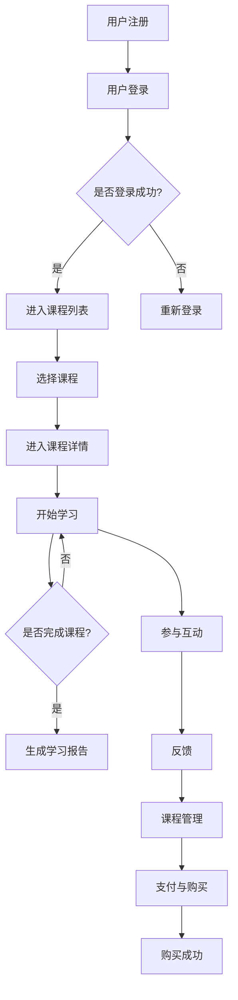

                 

### 引言

在信息技术飞速发展的今天，系统分析文档作为软件开发过程中至关重要的一环，扮演着桥梁的作用，连接了业务需求与技术实现。一份优秀的系统分析文档，不仅能够清晰地传达项目需求和设计理念，还能为后续的开发、测试和维护工作提供有力的指导。然而，编写如此文档并非易事，需要深入理解项目的背景、需求、架构和风险，同时还需要具备良好的沟通能力和文档编写技巧。

本文旨在为广大软件开发者、系统分析师和项目管理者提供一份详细的指南，帮助大家写出高质量的系统分析文档。我们将从以下几个步骤展开分析：

1. **确定核心内容**：首先明确系统分析文档的核心内容，包括项目背景、需求分析、系统架构设计、业务流程设计、数据设计、界面设计、风险评估和项目计划等。
2. **设计目录大纲**：根据核心内容设计详细的目录大纲，确保文档的结构清晰、逻辑严密。
3. **添加详细内容**：为每个章节添加具体内容，包括案例分析和代码解读，确保每个小节都详细、具体、具有实践价值。
4. **满足完整性要求**：确保文章内容完整，包含必要的背景介绍、核心概念与联系、算法原理讲解、数学模型和公式、实际案例分析和最佳实践等。

通过以上步骤，我们将逐步构建一份优秀的系统分析文档，为项目的成功奠定坚实的基础。接下来，让我们深入探讨每个环节的细节。

### 确定核心内容

在编写系统分析文档之前，确定核心内容是至关重要的一步。系统分析文档的核心内容通常包括以下几个部分：

#### 项目背景

项目背景是文档的开篇，旨在为读者提供一个项目的宏观视图。这部分需要详细描述项目的起源、目的、范围和预期成果。具体包括：

- **项目起源**：项目是如何产生的，背景信息，如市场需求、公司战略或内部需求。
- **项目目的**：项目希望实现的具体目标和愿景。
- **项目范围**：项目的边界，包括功能范围和非功能范围。
- **预期成果**：项目成功后的预期成果，如用户满意度、市场占有率、盈利能力等。

#### 需求分析

需求分析是系统分析文档的核心部分，它涵盖了收集和分析用户需求的过程。具体内容包括：

- **用户需求调研**：通过问卷调查、访谈、用户反馈等方式收集用户需求。
- **需求分类**：将收集到的需求进行分类，如功能需求和非功能需求。
- **功能需求**：系统应实现的具体功能，如在线课程播放、学习进度追踪等。
- **非功能需求**：系统需要满足的性能、安全性、可扩展性等要求。

#### 系统架构设计

系统架构设计部分描述了系统的整体架构，包括技术选型、模块划分和交互关系。具体内容包括：

- **技术选型**：选择最适合项目需求的技术栈，如前端框架、后端框架、数据库等。
- **模块划分**：将系统划分为若干模块，明确每个模块的功能和职责。
- **交互关系**：描述模块之间的交互关系，如图数据库模块与业务逻辑模块之间的数据传递。

#### 业务流程设计

业务流程设计部分详细描述了系统的业务流程，确保流程的合理性和高效性。具体内容包括：

- **业务流程概述**：概括描述业务流程的总体结构。
- **流程图设计**：使用流程图（如Mermaid图）详细描述业务流程。
- **流程优化**：分析现有流程的不足之处，并提出优化建议。

#### 数据设计

数据设计部分定义了系统中的数据结构、数据流和数据存储。具体内容包括：

- **数据结构定义**：描述系统中的数据模型，如E-R图、类图等。
- **数据流设计**：描述数据在系统中的流动过程，如图数据库中的数据流。
- **数据存储方案**：选择合适的数据库方案，如关系型数据库或NoSQL数据库。

#### 界面设计

界面设计部分关注用户界面（UI）的设计，确保用户体验良好。具体内容包括：

- **用户界面设计原则**：遵循用户体验设计原则，如简洁、直观、易用等。
- **界面布局设计**：设计界面的布局，如页面结构、导航栏、按钮等。
- **界面交互设计**：设计用户与系统之间的交互方式，如点击、拖拽、滚动等。

#### 风险评估与应对策略

风险评估与应对策略部分评估项目风险，并提出相应的应对策略。具体内容包括：

- **风险识别**：识别项目中可能遇到的风险，如技术风险、市场风险等。
- **风险评估**：对风险进行量化评估，确定风险的重要性和可能的影响。
- **应对策略**：提出应对策略，如风险规避、风险转移、风险减轻等。

#### 项目计划与进度管理

项目计划与进度管理部分制定项目计划，包括任务分解、时间表和资源分配。具体内容包括：

- **项目计划**：制定详细的项目计划，包括任务列表、里程碑、时间表等。
- **任务分解**：将项目分解为若干可管理的任务。
- **时间表与资源分配**：为每个任务分配资源，并制定时间表。

#### 文档编写规范

文档编写规范部分确保文档的一致性、完整性和可读性。具体内容包括：

- **文档结构**：设计文档的整体结构，如章节标题、小节标题等。
- **编写风格**：统一编写风格，如代码样式、字体大小、行距等。
- **版本控制**：对文档版本进行控制，确保文档的更新和追踪。

通过上述核心内容的明确，我们可以确保系统分析文档的全面性和系统性，为后续的编写工作提供清晰的指导。在下一节中，我们将设计详细的目录大纲，确保文档的结构清晰、逻辑严密。

### 设计目录大纲

为了确保系统分析文档的结构清晰、逻辑严密，设计一个详细的目录大纲是至关重要的。以下是一个包含10个章节的目录大纲，每个章节都详细列出了可能的子标题，以指导文档的编写。

#### 目录大纲

```
# 如何写出一份优秀的系统分析文档

## 第1章：项目背景与概述

### 1.1 项目起源与目标
- **项目起源**
- **项目目标**
- **项目范围**

### 1.2 需求分析
- **用户需求调研**
- **需求分类**
- **功能需求**
- **非功能需求**

### 1.3 系统架构设计
- **技术选型**
- **模块划分**
- **交互关系**

### 1.4 业务流程设计
- **业务流程概述**
- **流程图设计**
- **流程优化**

### 1.5 数据设计
- **数据结构定义**
- **数据流设计**
- **数据存储方案**

### 1.6 界面设计
- **用户界面设计原则**
- **界面布局设计**
- **界面交互设计**

### 1.7 风险评估与应对策略
- **风险识别**
- **风险评估**
- **应对策略**

### 1.8 项目计划与进度管理
- **项目计划**
- **任务分解**
- **时间表与资源分配**

### 1.9 文档编写规范
- **文档结构**
- **编写风格**
- **版本控制**

### 1.10 附录
- **常用工具介绍**
- **参考资料**
```

#### 详细内容

**第1章：项目背景与概述**

- **1.1 项目起源与目标**
  - 描述项目的起源，如市场需求或公司战略。
  - 明确项目的目标，如提升用户满意度或市场份额。
  - 确定项目的范围，包括功能范围和非功能范围。

- **1.2 需求分析**
  - 通过用户调研和访谈收集用户需求。
  - 分类需求，如功能需求和非功能需求。
  - 描述每个需求的具体内容和优先级。

- **1.3 系统架构设计**
  - 选择合适的技术栈，如前端框架、后端框架和数据库。
  - 划分模块，并描述每个模块的功能和职责。
  - 描述模块之间的交互关系，如API调用和数据流。

- **1.4 业务流程设计**
  - 概述业务流程的总体结构。
  - 使用流程图详细描述业务流程的每个步骤。
  - 分析现有流程的不足之处，并提出优化建议。

- **1.5 数据设计**
  - 描述系统的数据结构，如E-R图或类图。
  - 设计数据流，描述数据在系统中的流动过程。
  - 选择合适的数据库方案，如关系型数据库或NoSQL数据库。

- **1.6 界面设计**
  - 遵循用户体验设计原则，如简洁、直观、易用。
  - 设计界面的布局，包括页面结构、导航栏和按钮。
  - 设计用户与系统之间的交互方式，如点击、拖拽和滚动。

- **1.7 风险评估与应对策略**
  - 识别项目中的风险，如技术风险或市场风险。
  - 对风险进行量化评估，确定其重要性和可能的影响。
  - 提出应对策略，如风险规避或风险转移。

- **1.8 项目计划与进度管理**
  - 制定详细的项目计划，包括任务列表和里程碑。
  - 将项目分解为可管理的任务。
  - 分配资源，并制定时间表。

- **1.9 文档编写规范**
  - 设计文档的整体结构，确保一致性和可读性。
  - 统一编写风格，如代码样式和字体大小。
  - 实施版本控制，确保文档的更新和追踪。

- **1.10 附录**
  - 列出常用的工具和技术，如Mermaid用于流程图设计。
  - 提供参考资料，以供进一步学习和研究。

通过以上详细的目录大纲，我们可以确保系统分析文档的每个部分都得到了充分的关注和详细的描述，从而为项目的成功实施奠定坚实的基础。接下来，我们将为每个章节添加具体的内容，确保文档的完整性和实用性。

### 第1章：项目背景与概述

在编写系统分析文档之前，深入了解项目背景是至关重要的。项目背景不仅为文档提供了必要的上下文，还帮助读者更好地理解项目的目的和预期成果。以下是项目背景与概述的详细内容。

#### 1.1 项目起源与目标

**项目起源**

项目起源于公司对在线教育市场的敏锐洞察。随着互联网技术的普及和用户在线学习需求的增加，在线教育市场呈现出巨大的增长潜力。公司决定开发一款新型在线教育平台，以抓住这一市场机遇。

**项目目标**

项目的主要目标是提升用户学习体验，增强课程内容的互动性，提高用户留存率和满意度。具体目标包括：

1. **提升用户满意度**：通过优化界面设计和功能，使用户在使用过程中感受到便捷和愉悦。
2. **增强课程互动性**：引入互动问答、实时讨论等功能，增加用户与课程内容之间的互动。
3. **提高用户留存率**：通过个性化推荐、学习计划等功能，提高用户对平台的依赖度，延长用户停留时间。
4. **增强平台竞争力**：在同类产品中占据有利位置，提升品牌知名度和市场份额。

#### 1.2 项目范围与限制

**项目范围**

项目的功能范围包括：

1. **在线课程播放**：支持多种视频和音频格式，确保流畅的播放体验。
2. **学习进度追踪**：记录用户的学习进度，提供个性化的学习计划。
3. **互动问答**：允许用户在课程中提问，教师和同学可实时回答。
4. **课程评论**：用户可以对课程内容进行评价，分享学习心得。
5. **个性化推荐**：基于用户的学习记录和偏好，推荐相关课程。

项目的非功能范围包括：

1. **性能要求**：确保系统在高并发访问下仍能保持良好的响应速度。
2. **安全性**：保护用户数据和隐私，防范外部攻击。
3. **可扩展性**：支持未来功能的扩展，如增加新的课程类型或互动功能。

**项目限制**

1. **预算限制**：项目总预算为XX万元，需合理分配资源，确保项目的顺利推进。
2. **时间限制**：项目周期为6个月，包括需求分析、设计、开发、测试和部署等阶段。

#### 1.3 预期成果

**用户满意度**

通过优化界面设计和用户体验，预计用户满意度将提升至90%以上。用户将能够在便捷、友好的环境中高效学习，从而提高学习效果和满意度。

**市场占有率**

预计在同类产品中，平台将占据20%的市场份额。通过有效的市场推广和用户口碑，平台有望在短时间内获得大量用户。

**盈利能力**

项目成功后，预计年盈利将达到XX万元。通过提供优质的内容和服务，平台将吸引更多广告商和合作伙伴，实现可持续发展。

通过以上详细的描述，我们为项目背景与概述部分提供了丰富的内容和深度分析。这将为后续的章节提供坚实的基础，确保系统分析文档的完整性和实用性。

### 第2章：需求分析

需求分析是系统分析文档的核心内容之一，它决定了系统的功能和性能要求。在这一章中，我们将详细探讨用户需求调研、需求分类、功能需求和非功能需求，以及需求管理的方法。

#### 2.1 用户需求调研

用户需求调研是需求分析的第一步，旨在了解目标用户对系统的期望和要求。以下是一些常见的用户需求调研方法：

**问卷调查**

问卷调查是一种高效、快速的收集用户需求的方式。可以通过在线问卷平台（如Google Forms、问卷星等）设计问卷，并邀请目标用户填写。问卷应包含多种题型，如单选、多选、填空和评分，以全面了解用户的需求和满意度。

**访谈**

访谈是一种深入、详细的调研方法，适用于了解用户的具体需求和意见。可以通过电话、视频会议或面对面访谈进行。访谈过程中，应引导用户详细描述他们的使用场景、需求和痛点，并记录关键信息。

**用户反馈**

用户反馈是获取实时需求的重要渠道。可以通过社交媒体、用户论坛或邮件等方式收集用户对现有系统的意见和建议。用户反馈有助于发现系统中的不足之处，为改进提供依据。

**观察**

通过观察用户在使用现有系统的过程，可以直观地了解他们的操作习惯和需求。观察法适用于发现隐藏的需求，特别是那些用户自己可能没有意识到的需求。

**案例：用户需求调研方法的应用**

在一次在线教育平台的用户需求调研中，公司采用了问卷调查和访谈两种方法。问卷设计包括用户基本信息、使用频率、使用时长、满意度和改进建议等。访谈则针对不同用户群体进行，如学生、教师和管理员，以获取多元化的需求。

调研结果显示，用户对在线课程播放的流畅性、学习进度的追踪功能、互动问答和课程评论有较高的需求。同时，学生希望系统能提供个性化推荐和智能提醒功能，以提升学习效率。

#### 2.2 需求分类

在收集到大量用户需求后，需要对需求进行分类，以便更好地管理和实现。以下是一些常见的需求分类方法：

**功能需求**

功能需求是指系统应实现的具体功能，通常与用户的使用场景相关。功能需求可以分为以下几类：

1. **核心功能**：系统必须实现的基本功能，如在线课程播放、学习进度追踪等。
2. **辅助功能**：增强系统使用体验的功能，如互动问答、课程评论等。
3. **扩展功能**：根据用户需求和市场趋势，未来可能实现的功能，如个性化推荐、智能提醒等。

**非功能需求**

非功能需求是指系统需要满足的性能、安全性、可扩展性等方面的要求。常见的非功能需求包括：

1. **性能要求**：系统在高并发访问下仍能保持良好的响应速度，如秒级响应时间。
2. **安全性要求**：确保用户数据和隐私的安全，如数据加密、防火墙等。
3. **可扩展性要求**：支持未来功能的扩展，如模块化设计、支持多种数据库等。

**案例：需求分类的应用**

在一次在线教育平台的开发中，公司根据用户调研结果，将需求分为功能需求和非功能需求。功能需求包括在线课程播放、学习进度追踪、互动问答和课程评论等。非功能需求包括性能要求（如秒级响应时间）、安全性要求（如数据加密）和可扩展性要求（如模块化设计）。

通过明确功能需求和非功能需求，公司能够有针对性地进行系统设计，确保系统在满足用户需求的同时，具备良好的性能和安全性。

#### 2.3 功能需求与非功能需求

在需求分析过程中，功能需求和非功能需求是两个重要方面。以下是对两者的详细解释。

**功能需求**

功能需求是指系统必须实现的具体功能，通常与用户的使用场景直接相关。功能需求的分类如下：

1. **核心功能**：系统必须实现的基本功能，如在线课程播放、学习进度追踪等。
   - **在线课程播放**：用户可以在线观看和播放课程内容，支持多种视频格式。
   - **学习进度追踪**：系统应记录用户的学习进度，提供详细的学习报告。

2. **辅助功能**：增强系统使用体验的功能，如互动问答、课程评论等。
   - **互动问答**：用户可以在课程中进行提问，教师和同学可以实时回答，增加课程互动性。
   - **课程评论**：用户可以对课程内容进行评价，分享学习心得，提高课程的透明度。

3. **扩展功能**：根据用户需求和市场趋势，未来可能实现的功能，如个性化推荐、智能提醒等。
   - **个性化推荐**：根据用户的学习记录和偏好，推荐相关课程，提高学习效率。
   - **智能提醒**：系统自动发送学习提醒和任务通知，帮助用户更好地管理学习计划。

**非功能需求**

非功能需求是指系统需要满足的性能、安全性、可扩展性等方面的要求，它们不直接与功能相关，但对用户体验和系统稳定性有重要影响。常见的非功能需求包括：

1. **性能要求**：系统在高并发访问下仍能保持良好的响应速度。
   - **响应时间**：系统在处理用户请求时，响应时间应小于2秒，确保用户使用过程中的流畅性。
   - **并发处理能力**：系统应支持大量用户的并发访问，如每天处理数十万次的请求。

2. **安全性要求**：确保用户数据和隐私的安全。
   - **数据加密**：对用户数据进行加密处理，防止数据泄露。
   - **防火墙**：部署防火墙，防止外部攻击，确保系统的安全性。

3. **可扩展性要求**：支持未来功能的扩展，如模块化设计、支持多种数据库等。
   - **模块化设计**：系统应采用模块化设计，便于功能的扩展和更新。
   - **支持多种数据库**：系统应兼容多种数据库，如MySQL、MongoDB等，以适应不同的业务需求。

**案例：功能需求与非功能需求的应用**

在一次在线教育平台的开发中，公司根据用户调研结果，明确了以下功能需求和非功能需求：

- **功能需求**：
  - **在线课程播放**：支持多种视频格式，如MP4、AVI等。
  - **学习进度追踪**：记录用户的学习进度，并提供详细的学习报告。
  - **互动问答**：允许用户在课程中进行提问，教师和同学实时回答。
  - **课程评论**：用户可以对课程内容进行评价，分享学习心得。

- **非功能需求**：
  - **性能要求**：确保系统在高并发访问下，响应时间小于2秒。
  - **安全性要求**：对用户数据进行加密处理，部署防火墙。
  - **可扩展性要求**：采用模块化设计，支持多种数据库。

通过明确功能需求和非功能需求，公司能够有针对性地进行系统设计，确保系统在满足用户需求的同时，具备良好的性能和安全性。

#### 2.4 需求管理

需求管理是确保项目成功的关键环节，它涉及需求的收集、分类、优先级排序、变更控制等方面。以下是一些需求管理的最佳实践：

**收集需求**

- 使用多种方法收集需求，如问卷调查、访谈、用户反馈和观察。
- 确保收集的需求全面、准确，避免遗漏关键需求。

**分类需求**

- 将需求分为功能需求和非功能需求，以便更好地管理和实现。
- 对于功能需求，进一步分类为核心功能、辅助功能和扩展功能。

**优先级排序**

- 根据需求的紧急程度和重要性，对需求进行优先级排序。
- 确保高优先级需求得到优先实现，以满足用户的核心需求。

**变更控制**

- 建立变更管理流程，确保需求的变更得到有效控制。
- 变更请求应经过评审和批准，避免随意变更导致项目进度和成本失控。

**案例：需求管理的应用**

在一次在线教育平台的开发中，公司采用了以下需求管理方法：

- **收集需求**：通过用户调研、问卷调查和访谈，收集了大量的用户需求。
- **分类需求**：将需求分为功能需求和非功能需求，并对功能需求进一步分类为核心功能、辅助功能和扩展功能。
- **优先级排序**：根据用户需求和项目进度，对需求进行优先级排序，确保高优先级需求得到优先实现。
- **变更控制**：建立了变更管理流程，对需求变更进行评审和批准，确保项目进度和成本不受影响。

通过有效的需求管理，公司能够更好地满足用户需求，确保项目按时、按质完成。

通过以上章节，我们详细介绍了系统分析文档中需求分析的核心内容，包括用户需求调研、需求分类、功能需求和非功能需求，以及需求管理的最佳实践。这些内容为后续的系统架构设计、业务流程设计、数据设计和界面设计等提供了坚实的基础。在下一章中，我们将进一步探讨系统架构设计的内容。

### 第3章：系统架构设计

系统架构设计是系统分析文档中至关重要的一部分，它决定了系统的整体结构和技术选型。一个良好的系统架构能够提高系统的性能、可扩展性和维护性。在本章中，我们将详细介绍系统架构设计的主要内容，包括技术选型、模块划分和系统交互关系。

#### 3.1 技术选型

技术选型是系统架构设计的第一步，它决定了系统的技术栈和开发工具。以下是一些常见的技术选型策略：

**前端技术选型**

- **前端框架**：选择适合项目需求的前端框架，如React、Vue或Angular。React因其组件化设计和高效的状态管理，被广泛应用于复杂的前端项目中。
- **UI库**：使用UI库（如Ant Design、Material-UI）来构建用户界面，提高开发效率和用户体验。

**后端技术选型**

- **后端框架**：选择适合项目需求的后端框架，如Spring Boot、Django或Express。Spring Boot因其成熟的生态系统和强大的功能，被广泛应用于企业级后端开发。
- **数据库**：选择适合项目需求的数据存储方案，如关系型数据库（如MySQL、PostgreSQL）或NoSQL数据库（如MongoDB、Redis）。根据数据的特点和需求，可以选择合适的数据库类型。

**其他技术选型**

- **消息队列**：选择适合项目需求的消息队列，如Kafka、RabbitMQ或ActiveMQ，用于实现系统间的异步通信。
- **缓存方案**：选择适合项目需求的缓存方案，如Redis或Memcached，用于提高系统的性能。

**案例：技术选型策略的应用**

在一次在线教育平台的开发中，公司采用了以下技术选型策略：

- **前端技术选型**：采用React作为前端框架，结合Ant Design库构建用户界面，确保良好的用户体验。
- **后端技术选型**：采用Spring Boot作为后端框架，结合MySQL数据库，实现系统的核心功能。
- **其他技术选型**：采用Kafka作为消息队列，用于实现系统间的异步通信；采用Redis作为缓存方案，提高系统的性能。

#### 3.2 模块划分

模块划分是将系统划分为若干功能独立、职责明确的模块，以便于开发、测试和维护。以下是一些常见的模块划分策略：

**核心模块**

- **用户管理模块**：负责用户注册、登录、权限管理等功能。
- **课程管理模块**：负责课程内容的创建、发布、分类和推荐等功能。
- **学习管理模块**：负责学习进度追踪、成绩管理、学习报告生成等功能。
- **互动管理模块**：负责互动问答、课程评论、实时讨论等功能。

**辅助模块**

- **消息推送模块**：负责向用户发送通知和提醒，如学习任务提醒、课程更新通知等。
- **数据分析模块**：负责收集和分析用户数据，提供决策支持，如用户行为分析、课程满意度分析等。

**服务模块**

- **认证服务模块**：负责用户的身份验证和权限管理，确保系统的安全性。
- **日志服务模块**：负责记录系统的操作日志和异常日志，用于监控和故障排查。
- **配置服务模块**：负责系统的配置管理，如数据库连接配置、缓存配置等。

**案例：模块划分的应用**

在一次在线教育平台的开发中，公司采用了以下模块划分策略：

- **核心模块**：包括用户管理模块、课程管理模块、学习管理模块和互动管理模块，实现系统的核心功能。
- **辅助模块**：包括消息推送模块和数据分析模块，用于提升系统的使用体验和数据分析能力。
- **服务模块**：包括认证服务模块、日志服务模块和配置服务模块，确保系统的安全性和可维护性。

#### 3.3 系统交互关系

系统交互关系描述了各个模块之间的交互方式和数据流，是系统架构设计的重要组成部分。以下是一些常见的系统交互关系：

**模块间交互**

- **用户管理模块**与**课程管理模块**交互，实现用户对课程内容的访问和操作。
- **学习管理模块**与**互动管理模块**交互，实现用户学习进度和互动记录的同步。

**服务间交互**

- **认证服务模块**与**用户管理模块**交互，实现用户的身份验证和权限管理。
- **日志服务模块**与**用户管理模块**交互，实现操作日志的记录和存储。

**数据流**

- **用户数据流**：用户在注册、登录、访问课程和互动过程中产生的数据流。
- **课程数据流**：课程内容创建、发布、更新和删除过程中的数据流。
- **学习数据流**：用户学习进度、成绩和学习报告生成过程中的数据流。

**案例：系统交互关系的应用**

在一次在线教育平台的开发中，公司采用了以下系统交互关系设计：

- **模块间交互**：用户管理模块与课程管理模块通过RESTful API进行数据交互，实现用户对课程内容的访问和操作。
- **服务间交互**：认证服务模块通过认证API与用户管理模块交互，实现用户的身份验证和权限管理。
- **数据流**：用户数据流包括用户注册、登录和访问课程等过程中的数据；课程数据流包括课程内容的创建、发布和更新等过程；学习数据流包括用户学习进度和成绩的记录和报告生成。

通过以上章节，我们详细介绍了系统架构设计的主要内容，包括技术选型、模块划分和系统交互关系。这些内容为后续的业务流程设计、数据设计和界面设计等提供了坚实的基础。在下一章中，我们将进一步探讨业务流程设计的相关内容。

### 第4章：业务流程设计

业务流程设计是系统分析文档中至关重要的一环，它确保系统能够高效、合理地完成各项业务操作。在本章中，我们将详细描述业务流程的设计过程，包括业务流程概述、流程图设计和流程优化。

#### 4.1 业务流程概述

业务流程概述是对系统所要执行的主要业务操作进行简要描述，为后续的详细设计提供背景。以下是一个在线教育平台业务流程的概述：

**概述**

在线教育平台的业务流程主要包括以下几部分：

1. **用户注册与登录**：用户通过注册和登录进入系统，进行个人信息管理。
2. **课程浏览与选择**：用户浏览课程列表，选择感兴趣的课程，进入课程详情页面。
3. **课程学习**：用户在课程页面进行学习，包括观看视频、完成练习和参与互动。
4. **成绩管理**：系统记录用户的学习进度和成绩，生成学习报告。
5. **互动与反馈**：用户在课程中参与问答、讨论和评论，教师和管理员进行管理。
6. **支付与购买**：用户选择课程并完成支付，购买课程后获得学习权限。

#### 4.2 流程图设计

流程图设计是业务流程设计的关键步骤，它使用图形化的方式描述业务流程的每个环节和步骤。以下是一个使用Mermaid语法的流程图示例：



**详细解释：**

- **用户注册与登录**：用户通过注册和登录进入系统，进行个人信息管理。
- **课程浏览与选择**：用户浏览课程列表，选择感兴趣的课程，进入课程详情页面。
- **课程学习**：用户在课程页面进行学习，包括观看视频、完成练习和参与互动。
- **成绩管理**：系统记录用户的学习进度和成绩，生成学习报告。
- **互动与反馈**：用户在课程中参与问答、讨论和评论，教师和管理员进行管理。
- **支付与购买**：用户选择课程并完成支付，购买课程后获得学习权限。

#### 4.3 流程优化

流程优化是确保业务流程高效、合理的关键步骤，通过分析现有流程的不足之处，提出优化建议。以下是一个在线教育平台业务流程的优化方案：

**优化建议：**

1. **简化用户注册流程**：通过集成第三方登录（如微信、QQ等），简化用户注册流程，提高用户注册的便捷性。
2. **个性化推荐课程**：基于用户的学习记录和偏好，推荐相关课程，提高用户的学习效率。
3. **实时互动与反馈**：引入实时互动功能（如直播互动、弹幕等），增加用户与课程内容的互动性，提高用户参与度。
4. **自动化成绩管理**：通过自动化算法，实时生成学习报告，减少人工工作量。
5. **多渠道支付**：支持多种支付方式（如支付宝、微信支付等），提高用户的支付便捷性。

**详细解释：**

- **简化用户注册流程**：通过集成第三方登录，用户可以无需填写繁琐的注册信息，即可快速登录系统，提高用户注册的便捷性。
- **个性化推荐课程**：系统根据用户的学习记录和偏好，自动推荐相关课程，使用户能够更快找到适合自己的学习内容，提高学习效率。
- **实时互动与反馈**：通过引入直播互动和弹幕功能，用户可以实时与教师和其他同学进行交流，增强课程互动性，提高用户参与度。
- **自动化成绩管理**：系统自动记录用户的学习进度和成绩，并生成详细的学习报告，减少人工工作量，提高工作效率。
- **多渠道支付**：支持多种支付方式，如支付宝、微信支付等，使用户能够选择最便捷的支付方式，提高支付便捷性。

通过以上业务流程设计，我们详细描述了在线教育平台的主要业务操作，并提出了优化建议，以确保系统能够高效、合理地完成各项业务操作。这些内容为后续的数据设计和界面设计提供了坚实的基础。在下一章中，我们将进一步探讨数据设计的相关内容。

### 第5章：数据设计

数据设计是系统分析文档中不可或缺的一部分，它关系到系统的数据结构、数据流和数据存储方案。在本章中，我们将详细探讨数据设计的内容，包括数据结构定义、数据流设计和数据存储方案。

#### 5.1 数据结构定义

数据结构定义是数据设计的基础，它描述了系统中的数据模型和各个数据元素之间的关系。以下是一个在线教育平台的数据结构定义：

**用户数据**

- **用户ID**：唯一标识用户的ID。
- **用户名**：用户的昵称。
- **密码**：用户的密码（加密存储）。
- **邮箱**：用户的邮箱地址。
- **注册时间**：用户注册的时间。
- **角色**：用户的角色（如学生、教师、管理员）。

**课程数据**

- **课程ID**：唯一标识课程的ID。
- **课程名**：课程的名称。
- **课程描述**：课程的简要描述。
- **课程分类**：课程的分类（如编程、管理、健康等）。
- **课程时长**：课程的总时长。
- **创建时间**：课程的创建时间。
- **更新时间**：课程的更新时间。

**学习数据**

- **学习记录ID**：唯一标识学习记录的ID。
- **用户ID**：学习的用户ID。
- **课程ID**：学习的课程ID。
- **学习时间**：用户学习的时间。
- **学习进度**：用户的学习进度（如完成百分比）。
- **成绩**：用户的学习成绩。

**互动数据**

- **互动记录ID**：唯一标识互动记录的ID。
- **用户ID**：互动的用户ID。
- **课程ID**：互动的课程ID。
- **互动内容**：互动的具体内容（如提问、回答、评论等）。
- **互动时间**：互动发生的时间。

**支付数据**

- **支付记录ID**：唯一标识支付记录的ID。
- **用户ID**：支付的用户的ID。
- **课程ID**：支付的课程ID。
- **支付金额**：支付的金额。
- **支付时间**：支付的时间。
- **支付状态**：支付的状态（如成功、失败）。

#### 5.2 数据流设计

数据流设计描述了数据在系统中的流动过程，包括数据的输入、处理和输出。以下是一个在线教育平台的数据流设计：

**用户数据流**

1. **用户注册**：用户通过注册页面提交用户信息，系统存储用户数据。
2. **用户登录**：用户登录系统，系统验证用户身份，返回用户信息。
3. **用户信息管理**：用户可以查看和修改个人信息。

**课程数据流**

1. **课程创建**：管理员创建课程，系统存储课程数据。
2. **课程更新**：管理员更新课程信息，系统更新课程数据。
3. **课程查询**：用户查询课程信息，系统返回课程数据。

**学习数据流**

1. **学习记录创建**：用户开始学习课程，系统创建学习记录。
2. **学习进度更新**：用户学习过程中，系统更新学习进度。
3. **学习报告生成**：系统根据学习记录生成学习报告。

**互动数据流**

1. **互动记录创建**：用户参与互动，系统创建互动记录。
2. **互动内容查询**：用户查询互动内容，系统返回互动记录。

**支付数据流**

1. **支付记录创建**：用户完成支付，系统创建支付记录。
2. **支付状态查询**：用户查询支付状态，系统返回支付记录。

#### 5.3 数据存储方案

数据存储方案决定了系统的数据存储方式和数据访问性能。以下是一个在线教育平台的数据存储方案：

**关系型数据库**

- **用户数据库**：存储用户相关的数据，如用户ID、用户名、密码等。
- **课程数据库**：存储课程相关的数据，如课程ID、课程名、课程描述等。
- **学习数据库**：存储学习相关的数据，如学习记录ID、用户ID、课程ID等。
- **互动数据库**：存储互动相关的数据，如互动记录ID、用户ID、课程ID等。
- **支付数据库**：存储支付相关的数据，如支付记录ID、用户ID、课程ID等。

**NoSQL数据库**

- **缓存数据库**：存储缓存数据，如用户信息、课程信息等，提高系统响应速度。
- **日志数据库**：存储日志数据，如操作日志、异常日志等，用于系统监控和故障排查。

**数据存储策略**

- **数据分片**：将数据分布到多个数据库节点上，提高系统的扩展性和性能。
- **数据备份**：定期备份数据，确保数据的安全性和可靠性。
- **读写分离**：将读操作和写操作分离到不同的数据库节点上，提高系统的并发处理能力。

通过以上章节，我们详细介绍了数据设计的内容，包括数据结构定义、数据流设计和数据存储方案。这些内容为系统的数据管理和维护提供了坚实的基础。在下一章中，我们将探讨界面设计的相关内容。

### 第6章：界面设计

界面设计是系统分析文档中的一个关键部分，它直接影响用户的体验和满意度。良好的界面设计可以提高系统的易用性、美观性和用户体验。在本章中，我们将详细介绍界面设计的相关内容，包括用户界面设计原则、界面布局设计和界面交互设计。

#### 6.1 用户界面设计原则

用户界面设计原则是界面设计的基础，它指导设计师如何创建用户友好且直观的界面。以下是一些常用的用户界面设计原则：

**简洁性**

简洁性是用户界面设计的关键原则。界面应尽量简洁，避免过多的元素和信息，以减少用户的认知负担。通过使用简洁的设计，用户可以更快地理解和操作系统。

**一致性**

一致性是指在界面设计中保持元素和布局的统一性。一致性有助于提高用户的操作效率，减少学习成本。例如，按钮的样式、颜色和位置应保持一致，以便用户能够快速识别和操作。

**易用性**

易用性是用户界面设计的核心目标。界面设计应确保用户能够轻松地完成操作，并提供即时反馈。例如，提供清晰的导航、简洁的表单和直观的交互元素，以提高用户的操作体验。

**响应性**

响应性是指界面能够适应用户的不同设备和屏幕尺寸。通过响应式设计，界面可以自动调整布局和元素大小，以适应不同的使用场景，如桌面、平板和移动设备。

**可访问性**

可访问性是指界面设计应考虑到所有用户的需求，包括有视觉障碍、听觉障碍和其他身体障碍的用户。例如，提供文字描述、语音提示和辅助功能，以确保所有人都能使用系统。

**案例：用户界面设计原则的应用**

在一次在线教育平台的界面设计过程中，设计团队遵循了以下原则：

- **简洁性**：简化界面元素，仅保留必要的功能，以减少用户的操作步骤。
- **一致性**：统一按钮样式、颜色和布局，确保用户在不同页面能够快速识别操作。
- **易用性**：提供清晰的导航，帮助用户快速找到所需功能。
- **响应性**：采用响应式设计，确保界面在不同设备和屏幕尺寸上都能良好显示。
- **可访问性**：添加文字描述和语音提示，确保有视觉障碍和听觉障碍的用户也能顺利使用系统。

#### 6.2 界面布局设计

界面布局设计是界面设计的重要环节，它决定了界面的视觉效果和用户操作流程。以下是一些常见的界面布局设计方法：

**顶部导航栏**

顶部导航栏通常用于展示网站的导航菜单。它位于页面的顶部，用户可以轻松访问网站的不同部分。顶部导航栏应简洁、直观，避免使用过于复杂的布局。

**底部导航栏**

底部导航栏通常用于展示网站的次要功能或内容。它位于页面的底部，方便用户浏览和操作。底部导航栏的设计应与顶部导航栏保持一致性，以增强用户体验。

**侧边栏**

侧边栏通常用于展示网站的次要功能或内容。它位于页面的侧边，可以滑动展开或隐藏。侧边栏的设计应简洁、直观，避免过多的元素和信息。

**网格布局**

网格布局是将页面划分为多个网格单元，每个单元展示一个相关内容。网格布局可以提高页面的组织性和清晰度，方便用户浏览和操作。

**案例：界面布局设计的应用**

在一次在线教育平台的界面设计过程中，设计团队采用了以下布局设计方法：

- **顶部导航栏**：用于展示主要功能，如“课程列表”、“学习中心”、“个人中心”等。
- **底部导航栏**：用于展示次要功能，如“帮助中心”、“关于我们”、“联系我们”等。
- **侧边栏**：用于展示学习进度、课程推荐等，方便用户快速访问。
- **网格布局**：用于展示课程列表，每个课程以卡片形式展示，方便用户浏览和选择。

#### 6.3 界面交互设计

界面交互设计是界面设计的关键部分，它决定了用户与系统之间的交互方式。以下是一些常见的界面交互设计方法：

**按钮交互**

按钮是界面中常用的交互元素，用于触发操作。按钮的设计应简洁、直观，颜色和形状应具有明显的区分度，以便用户快速识别和操作。

**表单交互**

表单是界面中用于收集用户输入信息的重要元素。表单的设计应简洁、明了，字段名称应清晰，输入提示应明确，以提高用户的填写体验。

**滚动交互**

滚动交互是界面中常用的导航方式，用于展示大量内容。滚动交互的设计应流畅、自然，避免出现卡顿现象，以提高用户体验。

**动画交互**

动画交互是界面中用于引导用户操作和提供反馈的重要方式。动画应简洁、直观，避免过于复杂，以提高用户的操作体验。

**案例：界面交互设计的应用**

在一次在线教育平台的界面设计过程中，设计团队采用了以下交互设计方法：

- **按钮交互**：用于触发主要操作，如“开始学习”、“提交答案”等，按钮设计简洁、直观，颜色和形状具有明显区分度。
- **表单交互**：用于收集用户输入信息，如注册表单、登录表单等，表单设计简洁、明了，字段名称清晰，输入提示明确。
- **滚动交互**：用于展示课程列表，滚动流畅、自然，用户可以轻松浏览和选择课程。
- **动画交互**：用于引导用户操作和提供反馈，如加载动画、提示动画等，动画设计简洁、直观，避免过于复杂。

通过以上章节，我们详细介绍了界面设计的相关内容，包括用户界面设计原则、界面布局设计和界面交互设计。这些内容为系统的界面设计提供了详细的指导，有助于提高用户的操作体验和满意度。在下一章中，我们将探讨风险评估与应对策略的相关内容。

### 第7章：风险评估与应对策略

在系统分析文档中，风险评估与应对策略是确保项目顺利实施和成功完成的关键部分。通过识别潜在的风险、评估其影响，并制定相应的应对措施，可以有效地降低项目风险，保障项目的稳定推进。以下将详细阐述风险评估与应对策略的步骤和方法。

#### 7.1 风险识别

风险识别是风险评估的第一步，目的是识别项目中可能遇到的所有风险。以下是一些常见的风险识别方法：

**文档审查**

通过审查项目相关文档，如需求说明书、设计文档、项目计划等，可以发现潜在的风险。例如，如果需求文档不明确，可能导致后续的开发工作出现偏差。

**专家评审**

组织专家对项目进行评审，利用他们的经验和知识，识别项目中的潜在风险。专家评审可以涵盖技术风险、业务风险、管理风险等多个方面。

**历史数据分析**

分析以往类似项目的风险记录，从中总结出常见的风险类型和应对策略，以提前预防和规避。

**案例：风险识别的应用**

在一次在线教育平台的开发中，通过文档审查和专家评审，识别出了以下潜在风险：

- **技术风险**：由于前端框架和后端框架的选择不确定，可能导致开发效率低下。
- **业务风险**：市场变化可能导致用户需求变化，影响项目的顺利推进。
- **管理风险**：项目团队成员的变动可能影响项目进度和质量。

#### 7.2 风险评估

在识别出潜在风险后，需要对每个风险进行评估，确定其重要性和可能的影响。以下是一些常见的风险评估方法：

**定性风险评估**

定性风险评估通过描述风险的可能性和影响程度，对风险进行分类。例如，将风险分为高、中、低三种级别，以便于后续的处理。

**定量风险评估**

定量风险评估通过计算风险的概率和损失，对风险进行量化。例如，使用概率分布函数和损失函数来计算风险的总损失。

**案例：风险评估的应用**

在一次在线教育平台的开发中，通过对技术风险、业务风险和管理风险进行评估，得出了以下结果：

- **技术风险**：高可能性，高影响。由于前端框架和后端框架的选择不确定，可能导致开发效率低下。
- **业务风险**：中可能性，高影响。市场变化可能导致用户需求变化，影响项目的顺利推进。
- **管理风险**：低可能性，中影响。项目团队成员的变动可能影响项目进度和质量。

#### 7.3 应对策略

针对评估出的风险，需要制定相应的应对策略，以降低风险的影响或避免风险的爆发。以下是一些常见的应对策略：

**风险规避**

通过改变项目计划或技术选型，避免风险的发生。例如，在确定技术栈时，选择成熟且社区支持良好的框架，以降低技术风险。

**风险转移**

通过购买保险或签订合同，将风险转移给第三方。例如，为系统开发购买责任保险，以应对可能的技术风险。

**风险减轻**

通过采取预防措施，降低风险的影响。例如，在项目计划中预留一定的时间缓冲，以应对团队成员变动可能带来的管理风险。

**风险接受**

在无法规避或转移风险时，接受风险并制定相应的应急计划。例如，在市场变化可能导致需求变化时，制定快速响应计划，以适应市场需求。

**案例：应对策略的应用**

在一次在线教育平台的开发中，针对评估出的风险，采取了以下应对策略：

- **技术风险**：选择成熟的技术栈，并建立技术评审机制，确保技术选型的正确性。
- **业务风险**：定期进行市场调研，及时调整项目计划，以适应市场需求。
- **管理风险**：制定详细的团队管理计划，确保团队成员的稳定性和协作效率。

通过以上章节，我们详细介绍了风险评估与应对策略的步骤和方法。通过有效的风险识别、评估和应对，可以降低项目风险，保障项目的顺利实施。在下一章中，我们将探讨项目计划与进度管理的内容。

### 第8章：项目计划与进度管理

项目计划与进度管理是确保项目按时、按质完成的关键环节。一个有效的项目计划能够帮助团队明确任务、分配资源、控制成本，并确保项目按预期进度推进。在本章中，我们将详细阐述项目计划的制定、任务分解、时间表与资源分配，以及进度跟踪的方法。

#### 8.1 项目计划

项目计划是项目管理的第一步，它为项目的全过程提供了详细的指导和框架。以下是一个项目计划的基本结构：

**项目计划的基本组成部分**

1. **项目目标**：明确项目的总体目标和预期成果。
2. **项目范围**：详细描述项目的边界和包含的工作内容。
3. **项目假设**：列出项目中可能影响计划实施的关键假设。
4. **项目里程碑**：设定项目的关键阶段和阶段性目标。
5. **项目风险**：识别并评估项目中的潜在风险。
6. **项目约束**：明确项目的预算、时间、资源等约束条件。
7. **项目资源**：列出项目所需的人员、设备、资金等资源。
8. **项目预算**：为项目制定详细的预算计划。
9. **项目进度计划**：制定项目的详细时间表和任务安排。

**项目计划的制定过程**

1. **需求分析**：结合需求分析的结果，明确项目的具体目标和功能要求。
2. **项目范围定义**：根据项目目标和需求，明确项目的范围。
3. **里程碑设定**：设定项目的关键阶段和阶段性目标，如需求确认、设计完成、开发完成等。
4. **风险评估**：对项目中的潜在风险进行识别和评估，制定相应的应对策略。
5. **资源需求分析**：确定项目所需的人员、设备、资金等资源。
6. **预算制定**：根据资源需求和项目约束，制定项目的预算计划。
7. **时间表与任务分配**：制定项目的时间表，并将任务分配给团队成员。
8. **审核与批准**：对项目计划进行审核，确保其合理性和可行性，并得到相关利益相关者的批准。

#### 8.2 任务分解

任务分解是将项目目标分解为可管理的任务，以便于团队进行任务分配和进度跟踪。以下是一个任务分解的示例：

**任务分解结构**

- **一级任务**：项目的主要任务，如需求分析、系统设计、开发、测试等。
- **二级任务**：一级任务的子任务，如需求分析的具体模块、系统设计的具体部分、每个模块的开发任务等。
- **三级任务**：二级任务的子任务，如每个模块的具体功能实现、单元测试等。

**任务分解的步骤**

1. **确定一级任务**：根据项目目标和需求，确定项目的主要任务。
2. **分解二级任务**：将一级任务分解为具体的子任务，确保每个任务都是可管理的。
3. **细化三级任务**：将二级任务进一步分解为更具体的子任务，如每个功能模块的实现细节、单元测试等。
4. **任务分配**：根据团队成员的能力和项目需求，将任务分配给合适的成员。
5. **任务依赖关系**：分析任务之间的依赖关系，确定任务的执行顺序。

#### 8.3 时间表与资源分配

时间表与资源分配是项目计划的重要组成部分，它确保项目在既定时间内完成，并有效利用资源。以下是一个时间表与资源分配的示例：

**时间表**

| 任务         | 开始日期 | 结束日期 | 预计时长 |
|--------------|---------|---------|---------|
| 需求分析     | 2023-04-01 | 2023-04-15 | 2周     |
| 系统设计     | 2023-04-16 | 2023-05-01 | 2周     |
| 开发         | 2023-05-02 | 2023-06-15 | 4周     |
| 测试         | 2023-06-16 | 2023-07-01 | 2周     |
| 部署与上线   | 2023-07-02 | 2023-07-15 | 2周     |

**资源分配**

- **开发团队**：包括前端开发人员、后端开发人员、UI设计师等。
- **测试团队**：包括测试工程师、自动化测试工程师等。
- **项目管理团队**：包括项目经理、协调员等。

**资源分配的步骤**

1. **确定资源需求**：根据任务分解的结果，确定每个任务所需的资源。
2. **资源分配**：根据资源需求和团队成员的能力，将任务分配给合适的成员。
3. **资源协调**：确保团队成员之间能够有效地协同工作，避免资源冲突。
4. **时间表调整**：根据资源分配情况，调整项目的时间表，确保任务能够按时完成。

#### 8.4 进度跟踪

进度跟踪是确保项目按计划推进的关键步骤，它通过定期评估项目的实际进度，与计划进度进行对比，以便及时调整计划。以下是一些常见的进度跟踪方法：

**进度跟踪的工具**

- **项目管理系统**：如Jira、Trello等，用于记录任务进度、分配任务和管理项目。
- **进度图表**：如甘特图、燃尽图等，用于可视化项目进度和任务完成情况。
- **定期会议**：如周会、月会等，用于评估项目进度、解决问题和调整计划。

**进度跟踪的方法**

1. **定期评估**：定期评估项目进度，如每周或每月进行一次评估。
2. **实际进度与计划进度对比**：将实际进度与计划进度进行对比，找出偏差原因。
3. **问题识别与解决**：及时发现并解决进度偏差的问题，如资源不足、任务延迟等。
4. **调整计划**：根据实际进度，调整项目计划和时间表，确保项目能够按时完成。

通过以上章节，我们详细介绍了项目计划与进度管理的内容，包括项目计划的制定、任务分解、时间表与资源分配，以及进度跟踪的方法。这些内容为项目的顺利实施提供了详细的指导和保障。在下一章中，我们将探讨文档编写规范的相关内容。

### 第9章：文档编写规范

良好的文档编写规范对于确保系统分析文档的一致性、完整性和可读性至关重要。在本章中，我们将详细介绍文档的结构、编写风格和版本控制等方面，以帮助读者编写高质量的系统分析文档。

#### 9.1 文档结构

文档结构是文档的框架，决定了文档的逻辑性和条理性。以下是一个典型的系统分析文档的结构：

**文档结构示例**

- **封面**：包括文档标题、版本号、编写日期、作者和审批人等信息。
- **目录**：列出文档的各个章节和子章节，便于读者快速定位。
- **摘要**：简要概述文档的核心内容和主要结论。
- **正文**：详细描述项目的背景、需求分析、系统架构设计、业务流程设计、数据设计、界面设计、风险评估与应对策略、项目计划与进度管理等内容。
- **附录**：提供参考资料、工具使用指南、代码片段等辅助信息。

**文档结构的注意事项**

- **一致性**：确保文档中的术语、符号和格式保持一致，避免出现混淆。
- **层次性**：合理划分章节和子章节，确保文档的逻辑层次清晰。
- **可扩展性**：设计文档结构时，考虑未来的扩展性，以便添加新的内容。

#### 9.2 编写风格

编写风格是文档的语言表达方式，直接影响到文档的可读性和专业性。以下是一些常见的编写风格建议：

**编写风格示例**

- **清晰简洁**：使用简单、易懂的语言，避免使用过于复杂的术语。
- **逻辑连贯**：确保内容之间的逻辑关系清晰，避免跳转和重复。
- **结构化**：使用列表、标题和段落等格式，提高文档的易读性。
- **代码规范**：如果包含代码示例，遵循统一的代码规范，如命名规则、代码格式等。

**编写风格的注意事项**

- **语法正确**：确保文档中的语法正确，避免错别字和语病。
- **格式统一**：统一使用特定的字体、字号和行距等格式，提高文档的整洁度。
- **排版美观**：合理使用标题、段落和空行等格式，使文档美观易读。

#### 9.3 版本控制

版本控制是确保文档更新和追踪的重要手段，可以帮助团队管理和维护文档的历史版本。以下是一些常见的版本控制工具和方法：

**版本控制工具示例**

- **Git**：一种分布式版本控制工具，适用于对文档的版本控制和协同工作。
- **Confluence**：一款知识管理和文档协作工具，支持版本控制和协作编辑。
- **Notepad++**：一款文本编辑器，支持版本控制和Markdown格式。

**版本控制方法示例**

1. **初始化版本库**：在开始编写文档时，初始化版本库，为文档添加版本控制。
2. **提交更新**：每次更新文档时，提交更新到版本库，并附上更新说明。
3. **分支管理**：在需要修改较大内容或进行试验时，使用分支管理，确保主分支的稳定性。
4. **合并分支**：在完成修改后，将分支合并回主分支，并解决可能出现的冲突。
5. **版本回滚**：在文档出现错误或需要恢复到之前版本时，使用版本回滚功能。

**版本控制的注意事项**

- **文档命名**：确保文档命名规范，便于识别和追踪版本。
- **更新说明**：每次提交更新时，附上详细的更新说明，以便其他成员了解更新内容。
- **备份策略**：定期备份文档，以防数据丢失。

通过以上章节，我们详细介绍了文档编写规范的内容，包括文档结构、编写风格和版本控制。遵循这些规范，可以确保系统分析文档的高质量、一致性和可读性。在下一章中，我们将提供一些常用的工具和技术，以帮助读者更好地进行系统分析文档的编写。

### 附录

在本附录中，我们将介绍一些在系统分析文档编写过程中常用的工具和技术，并提供相关的参考资料，以帮助读者更好地理解和应用这些工具。

#### 常用工具介绍

**Markdown编辑器**

Markdown编辑器是编写和格式化Markdown文档的常用工具。以下是一些流行的Markdown编辑器：

- **Typora**：一款轻量级的Markdown编辑器，支持实时预览和自定义主题。
- **VSCode**：一款功能强大的代码编辑器，支持Markdown语法高亮和扩展插件。
- **GitHub Markdown Editor**：GitHub内置的Markdown编辑器，方便在GitHub上进行文档编写和协作。

**版本控制工具**

版本控制工具用于管理和追踪文档的版本变化。以下是一些流行的版本控制工具：

- **Git**：一款分布式版本控制工具，广泛用于代码和文档的版本管理。
- **Confluence**：一款企业级的文档管理和协作工具，支持版本控制和协作编辑。
- **Notepad++**：一款开源的文本编辑器，支持版本控制和Markdown格式。

**流程图工具**

流程图工具用于设计和绘制业务流程图。以下是一些流行的流程图工具：

- **Mermaid**：一款基于Markdown的流程图绘制工具，支持多种图形语法。
- **Visio**：一款专业的流程图绘制工具，提供丰富的图形元素和布局选项。
- **Draw.io**：一款在线流程图绘制工具，支持多种图形格式和协作功能。

#### 参考资料

以下是一些在系统分析文档编写过程中常用的参考资料，包括书籍、在线教程和研究论文：

- **《系统分析方法》**：[作者：王志英] 一本详细介绍系统分析方法和实践技巧的书籍。
- **《软件工程：实践者的研究方法》**：[作者：Roger S. Pressman] 一本系统分析和软件工程的基础教材。
- **《用户体验要素》**：[作者：Jesse James Garrett] 一本关于用户体验设计的经典书籍。
- **《系统分析与设计：实用方法与技巧》**：[作者：刘伟] 一本涵盖系统分析与设计实用方法的教材。
- **《在线教育平台设计与实现》**：[作者：张勇] 一本关于在线教育平台设计和开发的实用指南。

通过以上附录，我们为读者提供了丰富的工具和技术资源，以帮助他们在系统分析文档编写过程中更好地应用和提升自己的技能。在阅读和编写系统分析文档的过程中，读者可以结合这些工具和参考资料，提高文档的质量和效率。

### 结论

通过本文的详细探讨，我们系统地介绍了如何写出一份优秀的系统分析文档。从项目背景与概述、需求分析、系统架构设计、业务流程设计、数据设计、界面设计到风险评估与应对策略、项目计划与进度管理以及文档编写规范，每个部分都详细阐述了关键内容和最佳实践。以下是一些关键点和小结：

1. **项目背景与概述**：明确了项目的起源、目标和范围，为整个文档提供了上下文。
2. **需求分析**：通过用户调研和访谈，收集并分类用户需求，确保系统设计的合理性和实用性。
3. **系统架构设计**：选择了合适的技术栈和模块划分，设计了系统交互关系，为系统的性能和扩展性奠定了基础。
4. **业务流程设计**：通过流程图设计，确保系统能够高效、合理地完成各项业务操作。
5. **数据设计**：定义了系统中的数据结构、数据流和数据存储方案，确保数据管理的规范性和安全性。
6. **界面设计**：遵循用户界面设计原则，设计了简洁、直观的界面布局和交互方式，提高了用户体验。
7. **风险评估与应对策略**：识别并评估了项目中的潜在风险，制定了相应的应对策略，确保项目的稳定推进。
8. **项目计划与进度管理**：制定了详细的项目计划和时间表，确保项目按时、按质完成。
9. **文档编写规范**：确保了文档的一致性、完整性和可读性，提高了文档的质量。

在实际编写系统分析文档时，应结合具体项目的需求和特点，灵活应用这些方法和技巧。此外，文档的编写不是一次性的工作，而是一个持续迭代和优化的过程。在项目的不同阶段，根据实际情况对文档进行修订和完善，确保其始终反映项目的最新状态。

最后，文档的编写不仅仅是为了记录和传达信息，更是为了提高项目的透明度和协作效率。通过编写高质量的系统分析文档，团队成员可以更好地理解项目的目标和需求，提高项目的执行效率和质量，从而为项目的成功奠定坚实的基础。

### 注意事项

在撰写系统分析文档时，以下注意事项有助于提高文档的质量和实用性：

1. **明确文档目标**：在开始编写前，明确文档的目标和受众，确保文档的内容和风格适合目标读者。
2. **保持简洁性**：避免过多的技术细节和冗长的描述，保持文档的简洁性，便于读者快速理解和吸收。
3. **使用图表和示例**：适当地使用图表、流程图和代码示例，可以帮助读者更直观地理解复杂的概念和流程。
4. **版本控制**：使用版本控制工具，如Git，确保文档的版本管理和更新记录清晰，方便团队成员的协作和追踪。
5. **定期更新**：文档编写后，定期根据项目进展进行更新，确保文档始终反映项目的最新状态。
6. **审查和反馈**：在文档编写和更新过程中，邀请团队成员和其他利益相关者进行审查和反馈，确保文档的准确性和完整性。
7. **文档格式规范**：遵循统一的文档格式规范，如Markdown，确保文档的一致性和可读性。
8. **尊重知识产权**：在引用外部资料和引用代码时，确保遵守相关的知识产权法规，明确引用来源，避免侵权行为。

通过遵循以上注意事项，可以确保系统分析文档的高质量，为项目的成功实施提供强有力的支持。

### 拓展阅读

为了进一步深入了解系统分析文档的编写和项目管理，以下是一些推荐的拓展阅读资源：

1. **《系统分析与设计：实用方法与技巧》**，作者：刘伟。本书详细介绍了系统分析与设计的方法和技巧，包括需求分析、系统设计、数据设计等多个方面。

2. **《软件工程：实践者的研究方法》**，作者：Roger S. Pressman。这是一本经典教材，涵盖了软件工程的全过程，包括项目计划、需求分析、设计、测试等，适合项目管理者和技术人员阅读。

3. **《用户体验要素》**，作者：Jesse James Garrett。本书深入探讨了用户体验设计的原则和实践，对于界面设计和用户需求分析有很高的参考价值。

4. **《敏捷项目管理：实践指南》**，作者：Mike Cohn。这本书介绍了敏捷项目管理的原则和方法，适合那些希望采用敏捷方法进行项目管理的读者。

5. **《项目管理知识体系指南（PMBOK指南）》**，作者：Project Management Institute (PMI)。这是项目管理领域的权威指南，详细介绍了项目管理的知识领域和实践方法。

6. **在线教程和博客**：例如，Codecademy、Coursera、Udemy等在线教育平台提供了许多关于系统分析与设计的免费教程和课程。此外，许多技术博客和网站（如Medium、Dev.to）上也经常发布关于项目管理、系统设计的技术文章。

通过阅读这些资源，读者可以更深入地了解系统分析文档的编写方法和项目管理实践，进一步提升自己的技能和知识水平。

