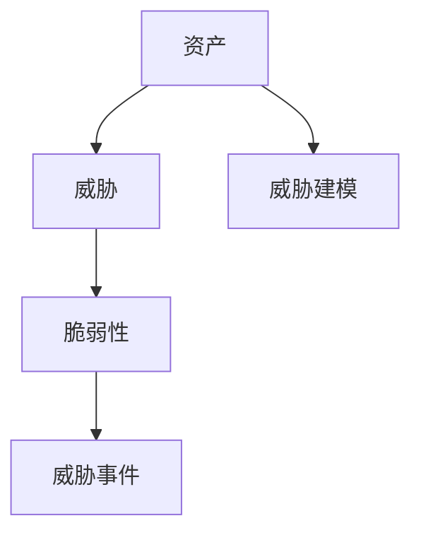

                 

基于您提供的文章标题《威胁建模：系统化识别安全风险的方法》，以及详细的目录大纲，我将分步骤构思并撰写这篇文章。以下是详细的构思过程：

### 第一步：确定文章结构

首先，我们需要根据目录大纲来构建文章的结构。每个部分都需要包含相关的背景介绍、核心概念、算法原理讲解、数学模型和公式、项目实战等元素。以下是一个结构化的步骤：

#### 文章结构确定

1. **引言部分**：介绍威胁建模的重要性、安全风险的背景、文章的目的和结构。
2. **基础部分**：解释威胁建模的定义、关键概念、方法、工具。
3. **实践部分**：描述威胁建模的执行步骤、结果分析、持续改进。
4. **案例分析部分**：通过实际案例展示威胁建模的应用。
5. **附录部分**：提供额外的参考资料、最佳实践、小结和注意事项。

### 第二步：撰写引言部分

#### 引言部分

1. **背景介绍**：简要介绍安全风险的现状和威胁建模的重要性。
2. **核心概念与联系**：用Mermaid流程图展示威胁建模的框架。
3. **目的与结构**：明确文章的目的，概述文章的结构。

```markdown
# 威胁建模：系统化识别安全风险的方法

> 关键词：威胁建模、安全风险管理、攻击树、攻击图、攻击面、案例研究

摘要：本文将详细介绍威胁建模的方法，帮助读者理解如何系统化地识别安全风险。我们将从基础概念出发，逐步深入到实践应用和案例分析。

## 引言

### 背景介绍

随着信息技术的飞速发展，网络安全问题日益突出。威胁建模作为安全风险管理的重要手段，正在得到越来越广泛的应用。本文将探讨威胁建模的核心概念、方法和技术，旨在帮助读者掌握这一关键技能。

### 核心概念与联系

下图展示了威胁建模的基本框架：



### 目的与结构

本文旨在通过系统化的方法，帮助读者掌握威胁建模的技巧。文章将分为五个部分：

1. 基础部分：介绍威胁建模的定义、关键概念、方法和工具。
2. 实践部分：描述威胁建模的执行步骤、结果分析、持续改进。
3. 案例分析部分：通过实际案例展示威胁建模的应用。
4. 附录部分：提供额外的参考资料、最佳实践、小结和注意事项。
```

### 第三步：撰写基础部分

在基础部分，我们将详细讲解威胁建模的定义、关键概念、方法和工具。

#### 威胁建模概述

1. **定义**：威胁建模是一种系统化的方法，用于识别、分类和评估潜在的安全威胁。
2. **目标**：通过威胁建模，组织可以更好地理解潜在的安全风险，并采取相应的预防措施。
3. **步骤**：威胁建模通常包括以下步骤：资产识别、威胁识别、脆弱性识别、威胁事件识别和风险分析。

#### 威胁建模的关键概念

1. **资产**：指组织中的重要信息、系统、应用程序和数据。
2. **威胁**：指可能对资产造成损害的潜在因素。
3. **脆弱性**：指系统或应用程序中的弱点，可能被威胁利用。
4. **威胁事件**：指威胁利用脆弱性对资产造成损害的具体事件。

#### 威胁建模的方法

1. **攻击树方法**：通过构建攻击树来分析威胁和脆弱性之间的关系。
2. **攻击图方法**：通过构建攻击图来展示不同威胁之间的关联和依赖。
3. **攻击面方法**：通过分析攻击面的各个部分来识别潜在的安全威胁。

#### 威胁建模工具和技术

1. **攻击树生成工具**：如OASIS、ThreatModeler等。
2. **攻击图绘制工具**：如Graphviz、Mermaid等。

### 第四步：撰写实践部分

在实践部分，我们将描述威胁建模的执行步骤、结果分析、持续改进。

#### 威胁建模项目规划

1. **项目范围定义**：明确项目的目标和范围。
2. **资源规划**：确定所需的人力、时间和预算。
3. **时间表安排**：制定项目的时间表和关键里程碑。

#### 威胁建模执行

1. **资产识别**：识别组织中的关键资产。
2. **威胁识别**：收集和分类潜在的威胁。
3. **脆弱性识别**：评估系统或应用程序中的脆弱性。
4. **威胁事件识别**：分析潜在的威胁事件。
5. **风险分析**：评估威胁事件对资产的可能影响。

#### 威胁建模结果分析

1. **威胁优先级评估**：根据威胁的影响程度和可能性进行排序。
2. **风险缓解策略制定**：制定相应的风险缓解策略。
3. **威胁建模结果验证**：验证威胁建模的准确性和有效性。

#### 威胁建模持续改进

1. **威胁建模反馈循环**：通过反馈不断改进威胁建模过程。
2. **定期威胁建模**：定期更新威胁建模，以应对新的安全威胁。
3. **持续风险管理**：建立持续的风险管理体系。

### 第五步：撰写案例分析部分

在案例分析部分，我们将通过实际案例展示威胁建模的应用。

#### 案例分析1：金融机构

1. **案例背景**：介绍金融机构的业务和面临的网络安全威胁。
2. **威胁建模过程**：描述金融机构如何进行威胁建模。
3. **威胁建模结果分析**：分析威胁建模的结果，并提出改进建议。

#### 案例分析2：电子商务平台

1. **案例背景**：介绍电子商务平台的业务和面临的网络安全威胁。
2. **威胁建模过程**：描述电子商务平台如何进行威胁建模。
3. **威胁建模结果分析**：分析威胁建模的结果，并提出改进建议。

#### 案例分析3：医疗保健行业

1. **案例背景**：介绍医疗保健行业的业务和面临的网络安全威胁。
2. **威胁建模过程**：描述医疗保健行业如何进行威胁建模。
3. **威胁建模结果分析**：分析威胁建模的结果，并提出改进建议。

### 第六步：撰写附录部分

在附录部分，我们将提供额外的参考资料、最佳实践、小结和注意事项。

#### 附录

1. **威胁建模参考资料**：列出推荐的书籍、文章和在线资源。
2. **最佳实践**：总结威胁建模的最佳实践和建议。
3. **小结**：总结文章的核心内容和关键点。
4. **注意事项**：提醒读者注意的威胁建模中的潜在问题和解决方案。

### 第七步：整合全文

将上述各部分的详细内容整合成一篇完整的文章，确保文章内容丰富、逻辑清晰、结构紧凑，并满足字数要求。

### 最终步骤：编辑和校对

在完成初稿后，进行编辑和校对，确保文章的语法、格式和内容都符合要求。可以邀请同行或团队成员进行审阅，提出修改意见，并进行相应的修改。

通过以上七个步骤，我们可以确保撰写出一份高质量的技术博客文章，满足您的要求。现在，我将开始撰写初稿，并根据步骤逐步完善内容。如果您有任何具体的要求或需要进一步的指导，请随时告诉我。

