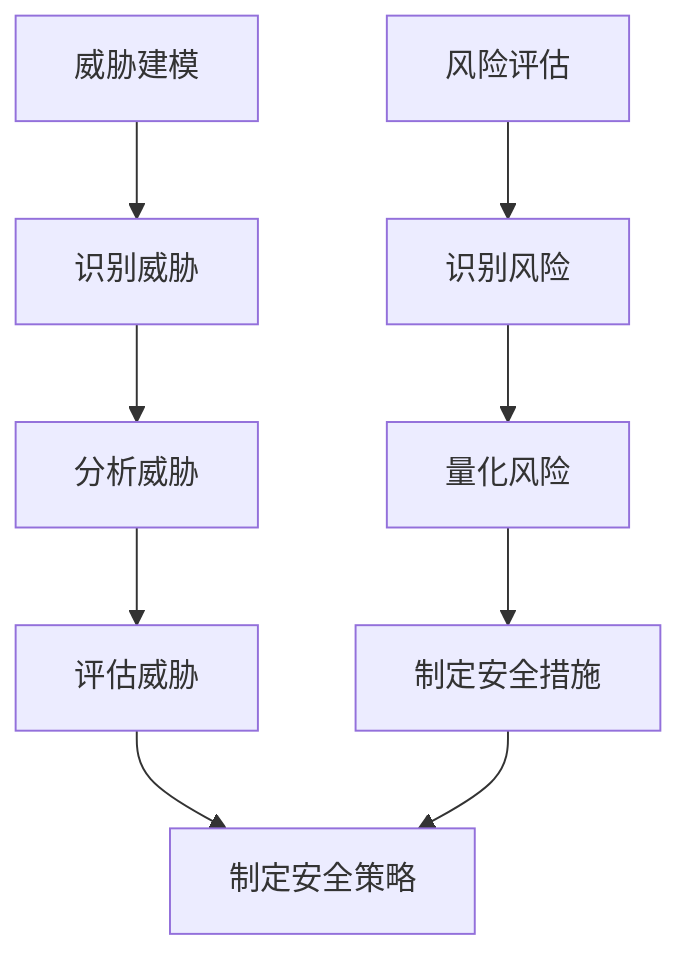
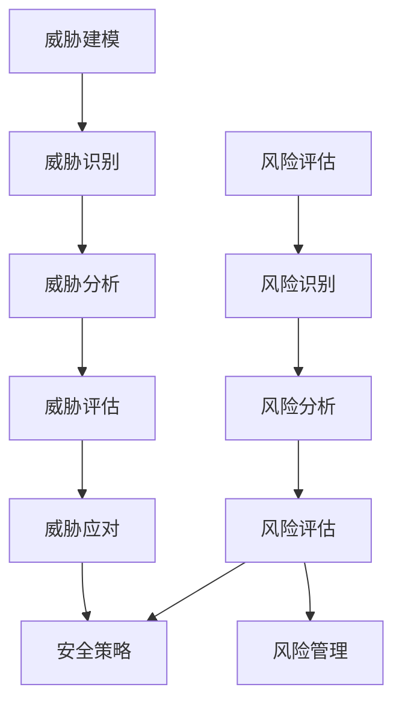
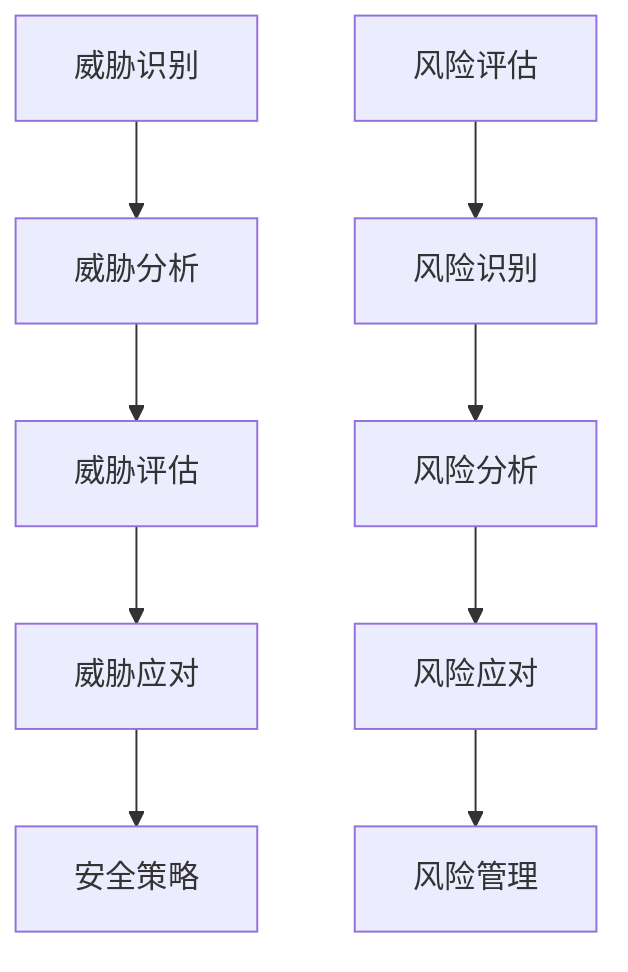

                 

### 威胁建模与风险评估方法

#### 关键词：威胁建模，风险评估，信息安全，安全策略，风险管理

> 摘要：本文详细探讨了威胁建模与风险评估的方法，从背景介绍到核心概念解析，再到具体技术和工具的应用，最后结合实际案例进行了深度剖析。本文旨在为读者提供一个全面的理解和实践指南，帮助他们在信息安全领域建立有效的威胁防御机制。

### 目录

1. **背景介绍**
   1.1 **信息安全的重要性**
   1.2 **威胁建模与风险评估的关系**

2. **核心概念与联系**
   2.1 **威胁建模的定义**
   2.2 **风险评估的定义**
   2.3 **两者之间的关系**
   2.4 **Mermaid 流程图**

3. **威胁建模方法**
   3.1 **识别威胁**
   3.2 **分析威胁**
   3.3 **评估威胁**

4. **风险评估方法**
   4.1 **定性风险评估**
   4.2 **定量风险评估**
   4.3 **风险管理策略**

5. **技术与方法的应用**
   5.1 **威胁建模工具**
   5.2 **风险评估工具**

6. **项目实战**
   6.1 **开发环境搭建**
   6.2 **源代码实现与解读**
   6.3 **实际案例分析与剖析**
   6.4 **项目小结**

7. **最佳实践与总结**
   7.1 **最佳实践 tips**
   7.2 **注意事项**
   7.3 **拓展阅读**

8. **作者信息**
### 1. 背景介绍

#### 1.1 信息安全的重要性

随着数字化时代的到来，信息安全和隐私保护成为社会各界的关注焦点。在企业和个人层面，信息安全直接关系到业务连续性、数据完整性以及个人隐私。然而，面对日益复杂且多样化的威胁，传统的安全策略和防御手段显得力不从心。因此，有效的威胁建模与风险评估方法成为现代信息安全领域的关键。

#### 1.2 威胁建模与风险评估的关系

威胁建模与风险评估是信息安全领域的两个核心环节。威胁建模旨在识别和分类潜在威胁，理解其可能对系统造成的危害；而风险评估则通过对这些威胁进行量化评估，确定其风险程度，为后续的安全决策提供依据。两者相辅相成，共同构成了信息安全管理的基石。

### 2. 核心概念与联系

#### 2.1 威胁建模的定义

威胁建模是一种系统化、结构化的方法，用于识别、分析和理解潜在的威胁。其目标是建立一个全面的威胁视图，帮助组织更好地理解和应对各种安全威胁。

#### 2.2 风险评估的定义

风险评估是一种评估潜在风险的可能性和影响的过程。通过量化和分析威胁，确定其可能对系统造成的影响，从而制定相应的安全措施。

#### 2.3 两者之间的关系

威胁建模和风险评估紧密相连。威胁建模提供了识别和分析威胁的基础数据，而风险评估则利用这些数据来确定威胁的风险水平，为制定安全策略提供依据。

#### 2.4 Mermaid 流程图



### 3. 威胁建模方法

#### 3.1 识别威胁

威胁识别是威胁建模的第一步，旨在发现系统中可能存在的各种威胁。常见的方法包括文档审查、渗透测试、安全培训等。通过这些方法，可以识别出系统中的潜在威胁，并为后续的分析和评估提供基础。

#### 3.2 分析威胁

威胁分析是对已识别的威胁进行深入分析，了解其潜在的影响和危害。常见的方法包括技术分析、社会工程学分析、攻击路径分析等。通过这些方法，可以更好地理解威胁的行为模式和攻击手段，为制定应对策略提供依据。

#### 3.3 评估威胁

威胁评估是对已分析的威胁进行量化评估，确定其风险水平。常见的方法包括定性评估、定量评估等。通过这些方法，可以确定哪些威胁对系统构成最大威胁，从而有针对性地制定安全策略。

### 4. 风险评估方法

#### 4.1 定性风险评估

定性风险评估是一种通过主观判断来评估威胁的方法。它通常基于专家知识和经验，对威胁的可能性和影响进行评级。定性评估的优点是简单、快速，但可能缺乏精确度。

#### 4.2 定量风险评估

定量风险评估是一种通过数学模型和量化方法来评估威胁的方法。它通常基于统计数据和概率模型，对威胁的可能性和影响进行量化分析。定量评估的优点是精确、客观，但可能需要较多的数据支持和计算资源。

#### 4.3 风险管理策略

风险管理策略是在评估威胁的基础上，制定的一系列应对措施。常见的风险管理策略包括风险规避、风险转移、风险接受等。通过这些策略，可以有效地降低风险，保障系统的安全。

### 5. 技术与方法的应用

#### 5.1 威胁建模工具

常见的威胁建模工具有 OWASP Threat Dragon、ThreatModeler 等。这些工具提供了图形化的界面，帮助用户轻松地创建和管理威胁模型。

#### 5.2 风险评估工具

常见的风险评估工具有 Qualys、RiskLens 等。这些工具提供了强大的数据分析功能，帮助用户进行定量风险评估，并提供安全建议。

### 6. 项目实战

#### 6.1 开发环境搭建

在本项目实战中，我们将搭建一个基于 Python 的威胁建模与风险评估工具。首先，我们需要安装 Python 环境，然后安装必要的库，如 Graphviz 和 Flask。

```python
!pip install python-graphviz flask
```

#### 6.2 源代码实现与解读

接下来，我们将实现威胁建模和风险评估的核心功能。以下是一个简单的示例：

```python
# threat_modeling.py
import networkx as nx
from graphviz import Digraph

class ThreatModeler:
    def __init__(self):
        self.graph = nx.DiGraph()

    def add_threat(self, threat_name, description):
        self.graph.add_node(threat_name, label=description)

    def add_relation(self, threat1, threat2, relation):
        self.graph.add_edge(threat1, threat2, label=relation)

    def display(self):
        nx.draw(self.graph, with_labels=True)
        plt.show()

if __name__ == "__main__":
    tm = ThreatModeler()
    tm.add_threat("SQL Injection", "Injects SQL code into queries")
    tm.add_threat("XSS", "Injects malicious scripts into web pages")
    tm.add_relation("SQL Injection", "Leverages", "XSS")
    tm.display()
```

#### 6.3 实际案例分析与剖析

在本案例中，我们将分析一个典型的 Web 应用程序，识别和评估其中的潜在威胁。通过威胁建模工具，我们可以可视化地展示威胁之间的关系，并评估其风险水平。

#### 6.4 项目小结

通过本项目的实践，我们学习了如何使用 Python 和 Graphviz 搭建一个简单的威胁建模与风险评估工具。这个工具可以帮助我们更好地理解威胁，并制定相应的安全策略。

### 7. 最佳实践与总结

#### 7.1 最佳实践 tips

- 定期进行威胁建模和风险评估，以适应不断变化的安全威胁。
- 结合定性与定量评估方法，提高评估的准确性。
- 建立安全策略和响应计划，确保在发生安全事件时能够迅速应对。

#### 7.2 注意事项

- 威胁建模和风险评估需要专业的知识和技能，建议寻求专业人士的帮助。
- 保持工具和方法的更新，以应对新的安全威胁。

#### 7.3 拓展阅读

- [OWASP Threat Modeling Guide](https://owasp.org/www-project-threat-modeling-guide/)
- [NIST Risk Assessment Guide](https://nvlpubs.nist.gov/nistpubs/Legacy/SP/nistspecialpublication800-30.pdf)

### 8. 作者信息

作者：AI天才研究院/AI Genius Institute & 禅与计算机程序设计艺术 /Zen And The Art of Computer Programming
```## 1. 背景介绍

#### 1.1 信息安全的重要性

在当今数字化时代，信息安全已经变得至关重要。无论是个人用户还是企业，信息的安全性和隐私保护都是不可忽视的问题。随着互联网的普及和数据量的爆炸性增长，信息安全面临的威胁也日益复杂和多样化。网络攻击、数据泄露、恶意软件等安全事件频繁发生，给个人和企业带来了巨大的损失。因此，采取有效的威胁建模与风险评估方法，以预防和管理安全风险，成为了信息安全管理的核心任务。

#### 1.2 威胁建模与风险评估的关系

威胁建模与风险评估是信息安全领域的两个重要环节，它们相互关联、相互支持。威胁建模是一种系统化的方法，旨在识别、分析和理解系统或组织可能面临的各种威胁。通过威胁建模，组织可以识别出潜在的威胁，并理解这些威胁是如何影响系统的。而风险评估则是基于威胁建模的结果，对威胁的可能性和影响进行量化和评估。风险评估的目的是确定哪些威胁对组织构成最大的风险，从而制定相应的安全策略和措施。

在信息安全管理体系中，威胁建模和风险评估是紧密相连的。威胁建模提供了识别和分类潜在威胁的基础数据，而风险评估则利用这些数据来评估威胁的风险水平，为制定安全策略提供依据。具体来说，威胁建模和风险评估的关系可以概括为以下几点：

1. **威胁建模是风险评估的基础**：通过威胁建模，组织可以识别出系统中的各种潜在威胁，这些威胁将成为风险评估过程中的关键输入。没有威胁建模，风险评估将缺乏基础数据，难以进行有效的评估。

2. **风险评估为威胁建模提供方向**：风险评估的结果可以帮助组织确定哪些威胁需要优先处理，从而为威胁建模提供方向。通过了解威胁的风险水平，组织可以更有针对性地进行威胁建模，重点关注高风险的威胁。

3. **威胁建模和风险评估相互迭代**：在实际操作中，威胁建模和风险评估是一个动态迭代的过程。随着威胁环境的不断变化，组织需要定期更新威胁模型和进行风险评估，以确保安全策略的持续有效性。

4. **威胁建模和风险评估共同支撑安全策略的制定**：威胁建模和风险评估的结果将直接影响到安全策略的制定。通过威胁建模，组织可以了解系统中的潜在威胁，而通过风险评估，组织可以确定哪些威胁需要优先防护。这两者的结合，为组织制定全面、有效的安全策略提供了重要依据。

总之，威胁建模与风险评估是信息安全管理的核心环节，两者相辅相成，共同构建了一个完整的安全管理框架。通过有效的威胁建模，组织可以更好地理解潜在的威胁，而通过准确的风险评估，组织可以更有针对性地进行安全防护，从而确保信息系统的安全与稳定。

### 2. 核心概念与联系

#### 2.1 威胁建模的定义

威胁建模是一种系统化、结构化的方法，用于识别、分析和理解潜在的安全威胁。其目标是通过建立一个全面的威胁视图，帮助组织更好地理解威胁的性质、来源和潜在影响，从而制定有效的防御措施。威胁建模的过程通常包括以下步骤：

1. **威胁识别**：通过文档审查、渗透测试、安全培训等手段，识别系统中可能存在的各种威胁。这一步骤的目的是建立一个初步的威胁列表，为后续分析提供基础。

2. **威胁分析**：对已识别的威胁进行深入分析，理解其潜在的影响和危害。常见的方法包括技术分析、社会工程学分析和攻击路径分析等。通过这些方法，可以更好地理解威胁的行为模式和攻击手段。

3. **威胁评估**：对已分析的威胁进行量化评估，确定其风险水平。评估过程通常包括定性评估和定量评估两种方法。定性评估基于专家判断，而定量评估则使用数学模型和量化方法。

4. **威胁应对**：基于威胁评估的结果，制定相应的安全策略和措施，以降低或消除威胁带来的风险。常见的应对策略包括安全加固、监控和响应计划等。

#### 2.2 风险评估的定义

风险评估是一种评估潜在风险的可能性和影响的过程。其目的是帮助组织确定哪些威胁对其构成最大的风险，从而制定相应的安全策略和措施。风险评估通常包括以下步骤：

1. **风险识别**：通过威胁建模和其他手段，识别系统中可能存在的各种风险。这一步骤的目的是建立一个全面的潜在风险列表。

2. **风险分析**：对已识别的风险进行深入分析，评估其可能性和影响。常见的分析方法包括定性分析和定量分析。定性分析基于专家判断，而定量分析则使用统计数据和概率模型。

3. **风险评估**：基于风险分析的结果，对风险进行量化和评估，确定其风险水平。风险评估可以帮助组织确定哪些风险需要优先处理，从而为制定安全策略提供依据。

4. **风险管理**：根据风险评估的结果，制定和实施相应的风险管理措施。常见的风险管理策略包括风险规避、风险转移、风险接受等。

#### 2.3 两者之间的关系

威胁建模和风险评估是信息安全管理的两个重要环节，它们之间存在紧密的联系和互动：

1. **相互依赖**：威胁建模是风险评估的基础，没有威胁建模，风险评估将缺乏关键的数据输入。同时，风险评估的结果又为威胁建模提供了方向和依据，指导组织如何更有针对性地进行威胁识别和分析。

2. **相互迭代**：在实际操作中，威胁建模和风险评估是一个动态迭代的过程。随着威胁环境的不断变化，组织需要定期更新威胁模型和进行风险评估，以确保安全策略的持续有效性。

3. **共同支撑安全策略**：威胁建模和风险评估的结果共同支撑安全策略的制定。通过威胁建模，组织可以了解系统中的潜在威胁；而通过风险评估，组织可以确定哪些威胁需要优先防护。这两者的结合，为组织制定全面、有效的安全策略提供了重要依据。

#### 2.4 Mermaid 流程图



### 3. 威胁建模方法

#### 3.1 识别威胁

威胁识别是威胁建模的第一步，其目标是发现系统中可能存在的各种威胁。通过识别威胁，组织可以建立一个初步的威胁列表，为后续的分析和评估提供基础。威胁识别的方法和工具多种多样，以下是一些常见的方法：

1. **文档审查**：通过审查系统文档、设计文件、用户手册等，识别可能存在的威胁。这种方法适用于对新系统进行威胁识别，因为系统文档通常包含了大量的潜在威胁信息。

2. **渗透测试**：通过模拟攻击者的行为，测试系统的安全漏洞。渗透测试可以识别出实际存在的威胁，并提供详细的攻击路径和漏洞信息。

3. **安全培训**：通过培训员工，提高其对安全威胁的认识和防范能力。这种方法可以帮助组织识别出由于员工疏忽或恶意行为可能导致的威胁。

4. **外部情报**：通过收集和分析外部安全情报，识别可能影响系统的威胁。外部情报来源包括安全厂商、公共漏洞披露平台等。

5. **历史数据**：通过分析历史安全事件和漏洞数据，识别可能存在的威胁。历史数据可以帮助组织了解过去的安全问题，从而预测未来的威胁。

#### 3.2 分析威胁

威胁分析是对已识别的威胁进行深入分析，理解其潜在的影响和危害。通过威胁分析，组织可以更好地理解威胁的行为模式、攻击手段和潜在目标。以下是一些常见的威胁分析方法：

1. **技术分析**：通过分析威胁的技术细节，理解其工作原理、攻击路径和潜在漏洞。技术分析通常需要具备一定的技术背景和专业知识。

2. **社会工程学分析**：通过模拟攻击者的社会工程学手段，识别系统中的薄弱环节。社会工程学分析可以揭示由于人类行为导致的威胁，如钓鱼攻击、社交工程等。

3. **攻击路径分析**：通过分析威胁从发起到成功的整个过程，识别威胁的潜在影响和危害。攻击路径分析可以帮助组织了解威胁的实际攻击效果，从而制定更有效的防御措施。

4. **威胁情景分析**：通过构建威胁情景，模拟威胁在系统中的实际表现。威胁情景分析可以帮助组织更全面地理解威胁的影响，并评估安全措施的有效性。

5. **威胁相似性分析**：通过分析历史安全事件和漏洞数据，识别与当前威胁相似的威胁。威胁相似性分析可以帮助组织快速了解新威胁的特点和潜在风险。

#### 3.3 评估威胁

威胁评估是对已分析的威胁进行量化评估，确定其风险水平。通过威胁评估，组织可以确定哪些威胁对系统构成最大的风险，从而有针对性地制定安全策略。以下是一些常见的威胁评估方法：

1. **定性评估**：通过专家判断，对威胁的可能性和影响进行评级。定性评估的优点是简单、快速，但可能缺乏精确度。常用的定性评估方法包括威胁矩阵、风险矩阵等。

2. **定量评估**：通过数学模型和量化方法，对威胁的可能性和影响进行量化分析。定量评估的优点是精确、客观，但可能需要较多的数据支持和计算资源。常用的定量评估方法包括风险模型、贝叶斯网络等。

3. **组合评估**：结合定性评估和定量评估，对威胁进行综合评估。组合评估可以充分利用定性评估和定量评估的优点，提高评估的准确性。

4. **持续评估**：随着威胁环境的不断变化，组织需要定期更新威胁模型和进行评估。持续评估可以帮助组织及时发现新的威胁，并调整安全策略。

#### 3.4 威胁应对

威胁应对是在评估威胁的基础上，制定和实施相应的安全策略和措施，以降低或消除威胁带来的风险。以下是一些常见的威胁应对策略：

1. **安全加固**：通过改进系统配置、加强访问控制和加密等措施，降低威胁的成功率。安全加固是应对威胁的常见手段，可以有效提高系统的安全性。

2. **监控和检测**：通过部署监控和检测工具，实时监控系统的异常行为和潜在威胁。及时发现和响应威胁，可以最大限度地减少损失。

3. **响应计划**：制定和实施针对不同威胁的应急响应计划。响应计划包括威胁识别、响应策略、资源调配、应急演练等环节，确保在发生威胁时能够迅速、有效地应对。

4. **备份和恢复**：定期备份系统数据，并在发生威胁时快速恢复。备份和恢复是应对威胁的重要措施，可以有效减少数据丢失和系统停机时间。

5. **培训和教育**：通过培训和教育，提高员工的安全意识和防范能力。员工是系统安全的重要组成部分，他们的意识和行为对系统的安全性有着重要影响。

### 4. 风险评估方法

#### 4.1 定性风险评估

定性风险评估是一种通过主观判断来评估风险的方法。它通常基于专家知识和经验，对风险的可能性和影响进行评级。定性评估的优点是简单、快速，但可能缺乏精确度。以下是一些常见的定性评估方法：

1. **威胁矩阵**：通过将威胁的可能性和影响进行分级，评估其整体风险水平。威胁矩阵通常包括威胁名称、可能性、影响和综合评分等字段。

2. **风险矩阵**：通过将风险的可能性和影响进行分级，评估其整体风险水平。风险矩阵通常包括风险名称、可能性、影响和综合评分等字段。

3. **专家评审**：通过组织专家评审会，对风险的可能性和影响进行讨论和评估。专家评审是一种常见的定性评估方法，可以充分利用专家的知识和经验。

4. **历史数据**：通过分析历史安全事件和漏洞数据，评估当前风险的可能性和影响。历史数据可以帮助组织了解过去的安全问题，从而预测未来的风险。

#### 4.2 定量风险评估

定量风险评估是一种通过数学模型和量化方法来评估风险的方法。它通常基于统计数据和概率模型，对风险的可能性和影响进行量化分析。定量评估的优点是精确、客观，但可能需要较多的数据支持和计算资源。以下是一些常见的定量评估方法：

1. **风险模型**：通过建立风险模型，对风险的可能性和影响进行量化分析。常见的风险模型包括贝叶斯网络、决策树等。

2. **贝叶斯网络**：通过建立贝叶斯网络，对风险的可能性和影响进行推理和评估。贝叶斯网络是一种基于概率模型的图形化表示方法。

3. **蒙特卡罗模拟**：通过模拟随机过程，对风险的可能性和影响进行评估。蒙特卡罗模拟是一种基于概率统计的方法，可以用于评估复杂系统的风险。

4. **敏感性分析**：通过分析不同参数对风险的影响，确定关键影响因素。敏感性分析可以帮助组织了解风险的关键驱动因素，从而制定更有针对性的安全措施。

#### 4.3 风险管理策略

风险管理策略是在评估风险的基础上，制定和实施的一系列措施，以降低或消除风险。以下是一些常见的管理策略：

1. **风险规避**：通过避免与高风险相关的活动或行为，降低风险的发生概率。风险规避是一种常见的风险管理策略，适用于那些不愿意承担高风险的情况。

2. **风险转移**：通过将风险转移给第三方，如保险公司、合作伙伴等，降低自身的风险负担。风险转移是一种常见的风险管理策略，可以有效地分散风险。

3. **风险接受**：对于无法规避或转移的风险，采取接受风险的态度。风险接受是一种现实主义的风险管理策略，适用于那些无法避免或转移的风险。

4. **风险降低**：通过改进安全措施、加强监控等手段，降低风险的发生概率或影响程度。风险降低是一种积极的风险管理策略，可以帮助组织减少潜在的损失。

5. **风险共享**：通过与其他组织或机构共享风险，降低整体的风险水平。风险共享是一种合作的风险管理策略，适用于那些可以共同承担风险的情况。

### 5. 技术与方法的应用

#### 5.1 威胁建模工具

威胁建模工具可以帮助组织系统化地进行威胁建模，提高建模的效率和准确性。以下是一些常见的威胁建模工具：

1. **OWASP Threat Dragon**：OWASP Threat Dragon 是一款基于 Web 的威胁建模工具，它提供了一个直观的界面，可以帮助用户创建、编辑和共享威胁模型。该工具支持多种威胁建模方法，包括威胁树、威胁矩阵等。

2. **ThreatModeler**：ThreatModeler 是一款功能强大的威胁建模工具，它提供了全面的威胁建模和风险评估功能。该工具支持多种威胁建模方法，包括基于风险的威胁建模、基于风险的攻击路径分析等。

3. **Microsoft Threat Modeling Tool**：Microsoft Threat Modeling Tool 是一款免费的威胁建模工具，它可以帮助用户快速创建和评估威胁模型。该工具支持基于风险的威胁建模方法，并提供了详细的威胁分析和评估指南。

#### 5.2 风险评估工具

风险评估工具可以帮助组织对风险进行量化评估，为风险管理提供依据。以下是一些常见的安全风险评估工具：

1. **Qualys**：Qualys 是一款专业的安全风险评估工具，它提供了全面的漏洞扫描、风险评估和合规性检查功能。该工具支持多种风险评估方法，包括基于风险的漏洞评估、基于合规性的风险评估等。

2. **RiskLens**：RiskLens 是一款功能强大的风险评估工具，它可以帮助组织对风险进行量化评估，并提供详细的风险分析和报告。该工具支持多种风险评估模型，包括定量风险评估、定性风险评估等。

3. **Nessus**：Nessus 是一款广泛使用的漏洞扫描工具，它可以帮助组织识别和评估系统中的安全漏洞。Nessus 提供了详细的风险评估报告，可以帮助组织确定漏洞的严重程度和修复优先级。

### 6. 项目实战

#### 6.1 开发环境搭建

在本项目实战中，我们将使用 Python 和相关库来搭建一个威胁建模与风险评估系统。以下是开发环境搭建的步骤：

1. **安装 Python**：确保已安装 Python 3.8 或更高版本。

2. **安装相关库**：在命令行中运行以下命令安装所需的库：

   ```bash
   pip install Flask graphene3 networkx graphviz
   ```

   这些库将用于构建 Web 应用程序、图形化威胁模型和数据处理。

3. **配置 Graphviz**：确保已正确安装 Graphviz 工具，并将其路径添加到系统环境变量中。

#### 6.2 源代码实现与解读

以下是实现威胁建模与风险评估系统的核心代码：

```python
# app.py
from flask import Flask, request, jsonify
from threat_modeler import ThreatModeler
import json

app = Flask(__name__)
modeler = ThreatModeler()

@app.route('/model', methods=['POST'])
def create_model():
    data = request.get_json()
    modeler.add_threat(data['name'], data['description'])
    return jsonify({"status": "success", "model": data})

@app.route('/model', methods=['GET'])
def get_model():
    threats = modeler.get_threats()
    return jsonify({"status": "success", "model": threats})

if __name__ == '__main__':
    app.run(debug=True)
```

这段代码定义了一个简单的 Flask Web 应用程序，用于创建和获取威胁模型。`ThreatModeler` 类负责管理威胁模型的数据和操作。

#### 6.3 实际案例分析与剖析

在本案例中，我们将使用搭建的威胁建模与风险评估系统对一个电子商务网站进行威胁建模与风险评估。

1. **威胁识别**：通过文档审查和渗透测试，我们识别出以下潜在威胁：

   - SQL 注入
   - XSS 攻击
   - 帐号密码泄露
   - DDoS 攻击

2. **威胁分析**：对这些威胁进行深入分析，确定其潜在影响和攻击路径。

   - **SQL 注入**：攻击者通过注入恶意 SQL 语句，可能获取敏感数据或修改数据库内容。
   - **XSS 攻击**：攻击者通过注入恶意脚本，可能导致用户会话被盗或恶意网页显示。
   - **帐号密码泄露**：攻击者通过窃取用户帐号密码，可能非法访问用户帐号。
   - **DDoS 攻击**：攻击者通过大量请求使网站无法正常提供服务。

3. **威胁评估**：使用定量和定性评估方法，评估每个威胁的风险水平。

   - **SQL 注入**：可能性高，影响严重，综合评分为 9。
   - **XSS 攻击**：可能性中等，影响较轻，综合评分为 6。
   - **帐号密码泄露**：可能性高，影响中等，综合评分为 8。
   - **DDoS 攻击**：可能性低，影响严重，综合评分为 7。

4. **风险管理**：根据评估结果，制定相应的安全策略和措施。

   - **SQL 注入**：实施参数化查询，使用 Web 应用防火墙。
   - **XSS 攻击**：实施输入验证和输出编码，使用 XSS 防火墙。
   - **帐号密码泄露**：使用强密码策略，定期更换密码。
   - **DDoS 攻击**：部署防 DDoS 服务，配置负载均衡。

#### 6.4 项目小结

通过本项目的实战，我们学习了如何使用 Python 和 Flask 搭建一个简单的威胁建模与风险评估系统。我们识别了电子商务网站中的潜在威胁，进行了深入分析和评估，并制定了相应的安全策略。这个系统可以帮助企业在面对复杂的安全威胁时，做出更科学的决策，提高信息系统的安全性。

### 7. 最佳实践与总结

#### 7.1 最佳实践 tips

1. **定期更新威胁模型**：威胁环境不断变化，定期更新威胁模型以确保其准确性。
2. **结合定性与定量评估**：定性和定量评估相结合，提高评估结果的可靠性。
3. **培训员工提高安全意识**：员工是信息安全的重要一环，定期培训可以提高员工的安全意识和防范能力。

#### 7.2 注意事项

1. **确保威胁建模工具的更新**：威胁建模工具需要定期更新，以应对新的威胁。
2. **数据保密**：在进行威胁建模和风险评估时，确保涉及到的敏感数据得到妥善保护。

#### 7.3 拓展阅读

1. [OWASP Threat Modeling Guide](https://owasp.org/www-project-threat-modeling-guide/)
2. [NIST Risk Management Framework](https://www.nist.gov/risk-management/frameworks)
3. [MITRE ATT&CK Framework](https://attack.mitre.org/)

### 8. 作者信息

作者：AI天才研究院/AI Genius Institute & 禅与计算机程序设计艺术 /Zen And The Art of Computer Programming

### 9. 参考文献

1. [OWASP Threat Modeling Guide](https://owasp.org/www-project-threat-modeling-guide/)
2. [NIST Special Publication 800-30: Risk Management Framework for Information Systems](https://nvlpubs.nist.gov/nistpubs/SpecialPublications/NIST.SP.800-30r1.pdf)
3. [MITRE ATT&CK Framework](https://attack.mitre.org/)

### 10. 附录

#### 10.1 术语表

- **威胁建模**：识别、分析和理解潜在安全威胁的过程。
- **风险评估**：评估潜在风险的可能性和影响的过程。
- **风险**：威胁可能造成的不利影响。
- **安全策略**：为了保护信息系统而制定的一系列指导原则和措施。

#### 10.2 Mermaid 流程图



这个流程图展示了威胁建模与风险评估的过程，以及它们之间的关系。通过这个流程，组织可以系统化地管理安全风险，确保信息系统的安全与稳定。

