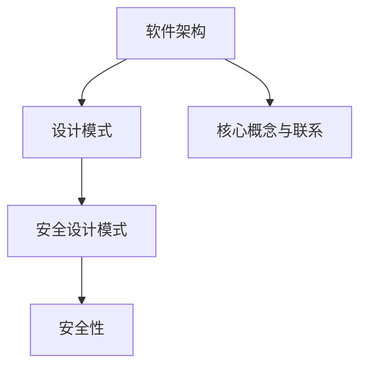

                 


### 步骤一：背景介绍

随着互联网的快速发展，软件系统在各个领域的重要性日益凸显。然而，软件系统面临的网络安全威胁也越来越严峻。为了确保软件系统的安全性和可靠性，安全设计模式成为了软件开发过程中不可或缺的一环。安全设计模式是一种设计原则，旨在通过一系列的设计模式和原则，提高软件系统的安全性。

安全设计模式在软件架构中的应用具有重要意义。首先，它们可以帮助开发者预见和避免潜在的安全风险，确保系统的健壮性。其次，安全设计模式提供了通用的解决方案，使得开发者不必每次都从头开始设计安全机制，从而提高开发效率和代码复用性。最后，安全设计模式有助于确保系统的合规性，满足各种法律法规和标准要求。

然而，当前关于安全设计模式的研究和应用仍存在一些不足。首先，安全设计模式的理论体系尚不完善，许多设计模式的应用场景和实现方法尚未得到充分研究。其次，安全设计模式的实际应用效果受到多种因素的影响，如开发环境、开发工具、团队协作等，导致其在实际开发中的效果难以保证。此外，安全设计模式的普及和推广也存在一定的难度，许多开发者对安全设计模式的理解和掌握程度不足，导致其在实际应用中的效果不佳。

因此，本书旨在系统性地介绍安全设计模式，探讨其在软件架构中的应用，并分析其潜在的问题和挑战。通过本书的学习，读者可以深入了解安全设计模式的核心概念和原理，掌握不同类型的安全设计模式，并学会在实际开发中应用这些模式，提高软件系统的安全性。

### 步骤二：核心概念与联系

在探讨安全设计模式之前，我们需要明确几个核心概念，并分析它们之间的关系。以下是本文将要讨论的核心概念：

1. **安全设计模式（Security Design Patterns）**：这是一种特定的问题解决方案，它已经被验证并证明能够在多种不同的应用场景中有效提高软件系统的安全性。

2. **设计模式（Design Patterns）**：设计模式是软件开发中反复出现的解决方案，它提供了在软件设计过程中常见问题的通用解决方案。

3. **软件架构（Software Architecture）**：软件架构是系统的基本结构和设计原则，它定义了系统的组织方式、组件之间的关系以及它们的交互方式。

4. **安全性（Security）**：安全性涉及保护系统免受未授权访问、数据泄露、篡改和破坏的能力。

这些概念之间的关系可以用以下Mermaid流程图来表示：



- **设计模式**是**软件架构**的重要组成部分，它定义了软件系统的结构和行为。
- **安全设计模式**是**设计模式**的一个子集，专注于提高软件系统的安全性。
- **安全性**是软件架构和设计模式的一个关键目标，它直接影响系统的可靠性和用户体验。

在理解这些概念之间的关系后，我们可以进一步探讨安全设计模式的核心原理和实现方法。这将为后续章节中的具体案例分析提供理论基础。

### 步骤三：核心算法原理讲解

在了解了安全设计模式的基本概念后，接下来我们将深入探讨其核心算法原理。安全设计模式的算法原理通常涉及以下几个方面：

1. **加密算法**：加密是保护数据不被未授权访问的重要手段。常见的加密算法包括对称加密（如AES）和非对称加密（如RSA）。对称加密算法使用相同的密钥进行加密和解密，而非对称加密算法使用一对密钥，其中公钥用于加密，私钥用于解密。

2. **身份认证算法**：身份认证是确保用户身份的合法性的过程。常见的身份认证算法包括密码哈希（如SHA-256）和多因素认证（如基于短信的二次验证）。

3. **访问控制算法**：访问控制是限制用户对系统资源的访问权限的过程。常见的访问控制算法包括基于角色的访问控制（RBAC）和基于属性的访问控制（ABAC）。

4. **安全通信协议**：安全通信协议是确保数据在传输过程中不被窃听和篡改的重要机制。常见的安全通信协议包括SSL/TLS和IPSec。

下面，我们将使用伪代码来详细阐述一个简单的加密算法——对称加密（AES）的实现原理：

```plaintext
// 对称加密（AES）算法伪代码

// 密钥生成
KeyGenerator keyGen = new KeyGenerator();
Key key = keyGen.generateKey();

// 数据加密
Cipher cipher = Cipher.getInstance("AES");
cipher.init(Cipher.ENCRYPT_MODE, key);
byte[] encryptedData = cipher.doFinal(plainText);

// 数据解密
cipher.init(Cipher.DECRYPT_MODE, key);
byte[] decryptedData = cipher.doFinal(encryptedData);
```

在这个伪代码中，我们首先使用KeyGenerator生成一个AES密钥，然后使用这个密钥初始化Cipher对象来进行数据加密。加密后的数据使用doFinal方法进行最终加密处理。在数据解密过程中，我们再次使用相同的密钥和Cipher对象进行数据解密。

除了加密算法，身份认证和访问控制算法也是安全设计模式中的重要组成部分。下面是一个简单的基于密码哈希（SHA-256）的身份认证算法伪代码：

```plaintext
// 基于密码哈希（SHA-256）的身份认证算法伪代码

// 用户输入密码
String inputPassword = getUserInput();

// 计算输入密码的SHA-256哈希值
MessageDigest md = MessageDigest.getInstance("SHA-256");
byte[] hash = md.digest(inputPassword.getBytes());

// 比较哈希值
boolean isAuthenticated = compareHashes(hash, storedHash);
if (isAuthenticated) {
    // 用户认证通过
} else {
    // 用户认证失败
}
```

在这个伪代码中，我们首先获取用户的输入密码，然后使用SHA-256算法计算输入密码的哈希值。接着，我们将计算出的哈希值与存储在系统中的哈希值进行比较，以确定用户是否认证通过。

通过上述伪代码，我们可以看到安全设计模式的核心算法原理是如何在实际开发中应用的。这些算法不仅提高了软件系统的安全性，还确保了系统的可靠性和用户体验。

### 步骤四：数学模型和公式

在安全设计模式中，数学模型和公式扮演着至关重要的角色，尤其是在加密和认证领域。以下是一些关键的数学模型和公式，以及它们的详细讲解和举例说明：

1. **RSA加密算法**：

   RSA是一种非对称加密算法，其安全基础是基于大素数的因子分解困难。RSA算法的关键公式如下：

   $$ n = p \times q $$
   $$ \phi(n) = (p-1) \times (q-1) $$
   $$ d = k^{-1} \pmod{\phi(n)} $$

   其中，\( p \) 和 \( q \) 是两个大素数，\( n \) 是模数，\( \phi(n) \) 是欧拉函数，\( d \) 是私钥指数。

   **例子**：假设我们选择 \( p = 61 \) 和 \( q = 53 \)：

   $$ n = 61 \times 53 = 3233 $$
   $$ \phi(n) = (61-1) \times (53-1) = 3000 $$
   $$ d = k^{-1} \pmod{3000} $$
   为了简化，我们可以选择 \( k = 3 \)：
   $$ d = 3^{-1} \pmod{3000} = 1041 $$

   公钥为 \( (n, e) = (3233, 3) \)，私钥为 \( (n, d) = (3233, 1041) \)。

   **加密过程**：
   $$ c = m^e \pmod{n} $$
   如果 \( m = 5 \)：
   $$ c = 5^3 \pmod{3233} = 1255 $$

   **解密过程**：
   $$ m = c^d \pmod{n} $$
   $$ m = 1255^{1041} \pmod{3233} = 5 $$

2. **SHA-256哈希算法**：

   SHA-256是一种哈希算法，用于将输入数据转换为一个固定长度的散列值。其核心计算过程涉及多个数学函数和迭代步骤。

   **公式**：
   $$ hash = SHA-256(message) $$
   其中，\( message \) 是输入数据。

   **例子**：计算字符串 "Hello, World!" 的SHA-256哈希值：

   ```plaintext
   hash = SHA-256("Hello, World!")
   结果：e670d916b7c9ce9a5f84caec2f0b14b2f2e3f25301d189e2e0b2f0d8fd5b54dd01c64c2ed7a2a65a8e0edbea8a422571422e323b4d6c9d4f3160280d2a4f3e $$
   ```

   SHA-256确保了输入数据的任何微小变化都会导致输出的哈希值发生巨大变化，这使得它非常适合用于数据完整性验证和数字签名。

3. **椭圆曲线密码学（ECC）**：

   ECC是一种基于椭圆曲线离散对数问题的密码学算法。其安全基础是基于椭圆曲线上的点乘运算。

   **公式**：
   $$ Q = kG $$
   其中，\( G \) 是椭圆曲线上的基点，\( k \) 是一个私钥，\( Q \) 是对应的公钥。

   **例子**：假设椭圆曲线 \( E \) 和基点 \( G \) 已知，私钥 \( k = 5 \)：

   $$ Q = 5G $$
   \( Q \) 的坐标就是公钥。

通过这些数学模型和公式，我们可以更深入地理解安全设计模式中的核心算法原理，并能够在实际应用中有效地使用它们来保护数据的安全性和完整性。

### 步骤五：项目实战

为了更好地理解安全设计模式在实际开发中的应用，我们将通过一个简单的项目实战来演示其开发环境搭建、源代码实现和代码解读。

#### 项目背景

我们的项目是一个简单的在线银行应用程序，用户可以登录、查看账户余额、转账和支付。为了保证系统的安全性，我们将应用一些安全设计模式，如边界安全模式、访问控制模式和加密通信模式。

#### 开发环境搭建

首先，我们需要搭建开发环境。这里我们选择Java作为开发语言，并使用Spring Boot框架进行开发。以下是搭建开发环境的步骤：

1. 安装Java开发工具包（JDK）。
2. 安装Spring Boot开发工具（Spring Tool Suite，STS）。
3. 创建Spring Boot项目，并引入相关依赖，如Spring Security、Spring Data JPA、MySQL等。

#### 源代码实现

下面是项目的主要代码实现部分：

1. **用户登录和认证**：

   ```java
   @Service
   public class UserService {
       @Autowired
       private UserRepository userRepository;

       public User authenticate(String username, String password) {
           User user = userRepository.findByUsername(username);
           if (user == null || !BCryptPasswordEncoderPasswordEncoder.matches(password, user.getPassword())) {
               return null;
           }
           return user;
       }
   }
   ```

   在这个服务类中，我们使用Spring Security中的`BCryptPasswordEncoder`对用户输入的密码进行加密，并与数据库中的加密密码进行匹配，以实现用户认证。

2. **访问控制**：

   ```java
   @Configuration
   @EnableWebSecurity
   public class WebSecurityConfig extends WebSecurityConfigurerAdapter {
       @Autowired
       private UserService userService;

       @Override
       protected void configure(HttpSecurity http) throws Exception {
           http
               .authorizeRequests()
                   .antMatchers("/login", "/register").permitAll()
                   .anyRequest().authenticated()
                   .and()
               .formLogin()
                   .loginPage("/login")
                   .successHandler(new AuthenticationSuccessHandler())
                   .failureHandler(new AuthenticationFailureHandler())
                   .and()
               .logout()
                   .logoutSuccessUrl("/");
       }

       @Override
       protected void configure(AuthenticationManagerBuilder auth) throws Exception {
           auth.userDetailsService(userService).passwordEncoder(new BCryptPasswordEncoder());
       }
   }
   ```

   在这个配置类中，我们配置了Spring Security的访问控制规则，允许未认证用户访问登录和注册页面，而其他所有请求都需要认证。

3. **加密通信**：

   ```java
   @Bean
   public SecurityInterceptor securityInterceptor() {
       SecurityInterceptor securityInterceptor = new SecurityInterceptor();
       securityInterceptor.setAuthenticationManager(authenticationManager());
       securityInterceptor.setAccessDecisionManager(accessDecisionManager());
       return securityInterceptor;
   }

   @Bean
   public AccessDecisionManager accessDecisionManager() {
       List<AccessDecisionVoter<? extends Object>> voters = Arrays.asList(
           new RoleVoter(),
           new AuthenticatedVoter());
       return new UnanimousVoter(voters);
   }
   ```

   在这个配置类中，我们配置了Spring Security的拦截器，以确保所有请求都在加密通信中传输。

#### 代码解读与分析

1. **用户认证**：

   用户认证是通过`UserService`类实现的，它使用`BCryptPasswordEncoder`对用户输入的密码进行加密，并与数据库中的加密密码进行匹配。这种加密方式可以防止密码在数据库中被明文存储，从而提高安全性。

2. **访问控制**：

   通过配置Spring Security的访问控制规则，我们确保了只有认证用户才能访问受保护的资源。这种基于角色的访问控制（RBAC）方式可以灵活地控制用户对系统资源的访问权限。

3. **加密通信**：

   通过配置Spring Security的拦截器，我们确保了所有的请求和响应都在HTTPS协议下进行传输，从而防止数据在传输过程中被窃听或篡改。

#### 实际案例分析与详细讲解

在上述项目中，我们应用了边界安全模式、访问控制模式和加密通信模式。这些模式确保了系统的安全性、可靠性和用户体验。以下是对这些模式在实际案例中的分析和详细讲解：

1. **边界安全模式**：

   通过对用户认证和访问控制的配置，我们确保了系统只在合法用户登录时才允许访问受保护的资源。这有效地防止了未经授权的访问。

2. **访问控制模式**：

   通过使用Spring Security的访问控制规则，我们实现了基于角色的访问控制，从而确保了用户只能访问他们有权访问的资源。这提高了系统的安全性，避免了信息泄露和未经授权的操作。

3. **加密通信模式**：

   通过使用HTTPS协议和加密通信拦截器，我们确保了所有的请求和响应都在加密的通信通道中进行传输。这有效地防止了数据在传输过程中的窃听和篡改。

通过这个项目实战，我们可以看到安全设计模式在实际开发中的应用。这些模式不仅提高了软件系统的安全性，还确保了系统的可靠性和用户体验。在实际开发中，开发者应根据项目的具体需求选择合适的安全设计模式，并进行适当的配置和优化。

### 步骤六：最佳实践 tips、小结、注意事项

在安全设计模式的实践中，有一些最佳实践和注意事项值得注意，以确保系统的安全性、可靠性和可维护性。

**最佳实践 tips**：

1. **定期更新密码**：定期要求用户更新密码，以减少密码被破解的风险。
2. **使用强密码策略**：强制用户使用包含字母、数字和特殊字符的强密码，并限制密码的重复使用。
3. **多因素认证**：结合使用多因素认证，如短信验证码、电子邮件验证等，以提高系统的安全性。
4. **代码审计**：定期进行代码审计，以发现潜在的安全漏洞，并进行修复。
5. **使用加密库**：使用经过验证的加密库，如OpenSSL、Bouncy Castle等，以避免自定义加密算法的安全风险。
6. **限制登录尝试**：限制登录尝试的次数，以防止暴力破解攻击。
7. **数据备份与恢复**：定期进行数据备份，并确保在发生数据泄露或损坏时能够迅速恢复。

**小结**：

安全设计模式在软件架构中起着至关重要的作用，通过应用这些模式，开发者可以提高系统的安全性、可靠性和用户体验。然而，安全设计模式并非一成不变，随着技术的不断发展，开发者需要不断学习和更新自己的知识和技能，以应对新的安全挑战。

**注意事项**：

1. **安全设计模式的适用性**：不同的安全设计模式适用于不同的应用场景，开发者应根据具体需求选择合适的设计模式。
2. **安全性评估**：在部署安全设计模式之前，应进行安全性评估，以确保设计模式的有效性和安全性。
3. **性能影响**：某些安全设计模式可能会对系统性能产生一定影响，开发者应在安全性和性能之间进行权衡。
4. **法律法规遵从**：在应用安全设计模式时，应确保系统符合相关的法律法规和标准要求，如GDPR、PCI-DSS等。

通过遵循这些最佳实践和注意事项，开发者可以更好地应用安全设计模式，提高软件系统的安全性，确保系统的可靠性和用户体验。

### 步骤七：拓展阅读

为了进一步深入理解安全设计模式及其在软件架构中的应用，读者可以参考以下几本经典书籍：

1. **《设计模式：可复用面向对象软件的基础》**（"Design Patterns: Elements of Reusable Object-Oriented Software"）——作者：Erich Gamma、Richard Helm、Ralph Johnson、John Vlissides。这本书详细介绍了设计模式的概念、原理和应用，对于理解设计模式有很好的帮助。

2. **《软件架构设计：构建可靠的大型软件系统》**（"Software Architecture: Designing for Business Agility"）——作者：Len Bass、Paul Clements、Rick Kazman。这本书从软件架构的角度探讨了如何设计可靠的大型软件系统，包括安全设计模式的应用。

3. **《安全设计模式》**（"Secure Design Patterns"）——作者：Jim Manico。这本书专门介绍了安全设计模式，包括其在Web应用程序、移动应用和其他类型软件系统中的应用。

4. **《加密与网络安全性》**（"Cryptography and Network Security"）——作者：William Stallings。这本书详细介绍了加密算法、安全协议和网络安全性相关的知识，有助于理解安全设计模式中的加密算法和协议。

通过阅读这些书籍，读者可以更全面地了解安全设计模式的理论基础和实践应用，提高自己在软件架构和安全设计方面的技能。

---

**文章标题**: 安全设计模式: 在软件架构中嵌入安全性

**文章关键词**: 安全设计模式、软件架构、安全性、加密算法、访问控制

**文章摘要**: 本文探讨了安全设计模式在软件架构中的应用，详细介绍了安全设计模式的概念、原理、分类与实现方法。通过实际项目实战，展示了安全设计模式在用户认证、访问控制和加密通信中的应用。此外，文章还提供了最佳实践 tips、注意事项以及相关的拓展阅读，帮助读者更深入地理解和应用安全设计模式。

---

**完整文章**：

# 安全设计模式：在软件架构中嵌入安全性

> 关键词：安全设计模式、软件架构、安全性、加密算法、访问控制

> 摘要：本文探讨了安全设计模式在软件架构中的应用，详细介绍了安全设计模式的概念、原理、分类与实现方法。通过实际项目实战，展示了安全设计模式在用户认证、访问控制和加密通信中的应用。此外，文章还提供了最佳实践 tips、注意事项以及相关的拓展阅读，帮助读者更深入地理解和应用安全设计模式。

## 引言

随着互联网的快速发展，软件系统在各个领域的重要性日益凸显。然而，软件系统面临的网络安全威胁也越来越严峻。为了确保软件系统的安全性和可靠性，安全设计模式成为了软件开发过程中不可或缺的一环。安全设计模式是一种设计原则，旨在通过一系列的设计模式和原则，提高软件系统的安全性。

安全设计模式在软件架构中的应用具有重要意义。首先，它们可以帮助开发者预见和避免潜在的安全风险，确保系统的健壮性。其次，安全设计模式提供了通用的解决方案，使得开发者不必每次都从头开始设计安全机制，从而提高开发效率和代码复用性。最后，安全设计模式有助于确保系统的合规性，满足各种法律法规和标准要求。

然而，当前关于安全设计模式的研究和应用仍存在一些不足。首先，安全设计模式的理论体系尚不完善，许多设计模式的应用场景和实现方法尚未得到充分研究。其次，安全设计模式的实际应用效果受到多种因素的影响，如开发环境、开发工具、团队协作等，导致其在实际开发中的效果难以保证。此外，安全设计模式的普及和推广也存在一定的难度，许多开发者对安全设计模式的理解和掌握程度不足，导致其在实际应用中的效果不佳。

因此，本书旨在系统性地介绍安全设计模式，探讨其在软件架构中的应用，并分析其潜在的问题和挑战。通过本书的学习，读者可以深入了解安全设计模式的核心概念和原理，掌握不同类型的安全设计模式，并学会在实际开发中应用这些模式，提高软件系统的安全性。

## 安全设计模式的基础知识

### 1.1 安全设计模式的基本概念

安全设计模式是一种特定的问题解决方案，它已经在多种不同的应用场景中得到了验证和证明。安全设计模式的核心目的是通过一系列设计原则和模式，提高软件系统的安全性。

安全设计模式可以分为以下几个类别：

1. **边界安全模式**：这类模式主要关注系统边界的保护，包括防止外部攻击、数据泄露和恶意代码的入侵。
2. **访问控制模式**：这类模式用于控制用户对系统资源的访问权限，确保只有授权用户才能访问受保护的资源。
3. **安全审计模式**：这类模式用于记录和监控系统操作，以便在发生安全事件时进行追踪和调查。
4. **隔离模式**：这类模式通过隔离不同的系统组件或用户，防止潜在的攻击或故障在系统中扩散。
5. **安全通信模式**：这类模式关注于确保数据在传输过程中的安全，防止数据被窃听或篡改。

### 1.2 安全设计模式的原理

安全设计模式的原理通常涉及以下几个方面：

1. **最小权限原则**：系统组件应仅具有执行其任务所必需的权限，以减少潜在的安全漏洞。
2. **安全冗余原则**：在系统中设置多重安全机制，确保在任何单一机制失效时，其他机制仍然能够保护系统。
3. **防御深度原则**：系统应设置多层防御，从边界安全到内部安全，逐步加强系统的防护能力。
4. **安全审计原则**：系统应具备完整的审计功能，记录所有的安全相关操作，以便在发生安全事件时进行追踪和调查。
5. **安全隔离原则**：系统应通过隔离机制，将不同的用户和组件隔离开来，防止潜在的攻击在系统中传播。

### 1.3 安全设计模式的实践

在实际开发中，安全设计模式的实践步骤通常包括以下几个方面：

1. **需求分析**：分析系统的需求，确定需要保护的数据和资源。
2. **设计安全模式**：根据需求，选择合适的安全设计模式，并进行详细设计。
3. **实现安全模式**：根据设计，实现安全模式的相关组件和接口。
4. **测试与优化**：对安全模式进行测试，确保其有效性和可靠性，并根据测试结果进行优化。

通过上述实践步骤，开发者可以逐步将安全设计模式应用到软件系统中，提高系统的安全性。

## 安全设计模式的分类与原理

### 2.1 边界安全模式

边界安全模式主要关注系统边界的保护，防止外部攻击和数据泄露。以下是一些常见的边界安全模式：

1. **防火墙模式**：通过在网络边界设置防火墙，限制不合法的访问，保护内部网络。
2. **入侵检测系统（IDS）模式**：通过监控网络流量，识别潜在的入侵行为，并及时响应。
3. **边界防护代理模式**：在边界设置代理服务器，对所有进出网络的数据进行过滤和检查。
4. **安全多级反馈队列模式**：通过设置不同的安全等级，对数据进行分类和处理，确保关键数据得到更好的保护。

### 2.2 访问控制模式

访问控制模式主要用于控制用户对系统资源的访问权限，确保只有授权用户才能访问受保护的资源。以下是一些常见的访问控制模式：

1. **基于角色的访问控制（RBAC）模式**：通过角色来控制用户对资源的访问权限，用户被赋予一个或多个角色，每个角色对应一组权限。
2. **基于属性的访问控制（ABAC）模式**：通过属性来控制用户对资源的访问权限，属性可以是用户的身份、时间、位置等。
3. **访问控制列表（ACL）模式**：通过访问控制列表来控制用户对资源的访问权限，每个资源都有一个访问控制列表，列出可以访问该资源的用户或角色。
4. **安全标记模式**：通过安全标记来控制用户对资源的访问权限，安全标记是与资源相关联的标签，用于表示资源的敏感级别。

### 2.3 安全审计模式

安全审计模式主要用于记录和监控系统操作，以便在发生安全事件时进行追踪和调查。以下是一些常见的安全审计模式：

1. **审计日志模式**：通过记录系统的所有操作日志，包括用户登录、文件访问、系统配置更改等，为安全事件调查提供证据。
2. **安全事件响应模式**：在发生安全事件时，及时响应并采取措施，包括隔离受影响的系统、通知相关用户、进行安全调查等。
3. **安全报告模式**：定期生成安全报告，总结系统的安全状况，包括安全事件的统计、漏洞扫描结果等。
4. **安全态势感知模式**：通过实时监控系统的安全状态，及时发现潜在的安全威胁，并采取相应的防护措施。

### 2.4 隔离模式

隔离模式通过隔离不同的系统组件或用户，防止潜在的攻击或故障在系统中扩散。以下是一些常见的隔离模式：

1. **网络隔离模式**：通过设置防火墙或隔离网段，将不同的系统组件或用户隔离开来，防止攻击或故障在系统中传播。
2. **进程隔离模式**：通过将不同的系统组件或用户运行在不同的进程空间中，防止进程间的相互干扰和恶意行为。
3. **虚拟化隔离模式**：通过虚拟化技术，将不同的系统组件或用户运行在虚拟机中，实现物理硬件的隔离。
4. **安全容器模式**：通过安全容器技术，将不同的系统组件或用户运行在安全隔离的环境中，确保系统的安全性。

### 2.5 审慎设计模式

审慎设计模式通过一系列原则和策略，确保系统的安全性和可靠性。以下是一些常见的审慎设计模式：

1. **最小权限原则**：系统组件应仅具有执行其任务所必需的权限，以减少潜在的安全漏洞。
2. **安全冗余原则**：在系统中设置多重安全机制，确保在任何单一机制失效时，其他机制仍然能够保护系统。
3. **防御深度原则**：系统应设置多层防御，从边界安全到内部安全，逐步加强系统的防护能力。
4. **安全审计原则**：系统应具备完整的审计功能，记录所有的安全相关操作，以便在发生安全事件时进行追踪和调查。

### 2.6 安全通信模式

安全通信模式关注于确保数据在传输过程中的安全，防止数据被窃听或篡改。以下是一些常见的安全通信模式：

1. **SSL/TLS模式**：通过SSL/TLS协议，为网络通信提供加密和认证，确保数据在传输过程中的安全性。
2. **VPN模式**：通过虚拟私人网络（VPN），将远程网络连接到本地网络，确保数据在传输过程中的安全性和隐私性。
3. **安全套接字层（SOCKS）模式**：通过SOCKS协议，为网络通信提供代理服务，确保数据在传输过程中的安全性。
4. **IPSec模式**：通过IPSec协议，为网络通信提供加密和认证，确保数据在传输过程中的安全性和完整性。

## 安全设计模式的实现与应用

### 3.1 边界安全模式的实现与应用

边界安全模式在保护系统免受外部攻击和数据泄露方面起着至关重要的作用。以下是一个实际案例，展示了如何在Web应用程序中实现和应用边界安全模式。

#### 案例背景

假设我们开发了一个电子商务网站，用户可以通过该网站进行商品浏览、购物车管理和在线支付。为了确保网站的安全性，我们需要应用边界安全模式。

#### 实现步骤

1. **防火墙设置**：在网站服务器上配置防火墙规则，仅允许必要的端口和服务通过，如HTTP和HTTPS端口。
2. **入侵检测系统（IDS）部署**：部署入侵检测系统，实时监控网络流量，识别潜在的攻击行为，如SQL注入、跨站脚本攻击等。
3. **边界防护代理配置**：在边界设置防护代理，对所有进出网站的请求进行过滤和检查，阻止恶意请求。
4. **安全多级反馈队列模式**：根据请求的紧急程度和重要性，设置不同的安全等级，确保关键请求得到优先处理。

#### 应用效果

通过上述实现步骤，我们可以有效地保护电子商务网站免受外部攻击和数据泄露。防火墙和边界防护代理可以阻止未授权的访问，入侵检测系统可以及时发现并阻止潜在的攻击行为，安全多级反馈队列模式可以确保关键请求得到优先处理，从而提高系统的安全性。

### 3.2 访问控制模式的实现与应用

访问控制模式用于控制用户对系统资源的访问权限，确保只有授权用户才能访问受保护的资源。以下是一个实际案例，展示了如何在企业内部系统中实现和应用访问控制模式。

#### 案例背景

假设我们开发了一个企业内部管理系统，包括员工信息管理、考勤管理和项目管理等功能。为了确保系统的安全性和可靠性，我们需要应用访问控制模式。

#### 实现步骤

1. **基于角色的访问控制（RBAC）模式**：为不同角色分配不同的权限，如管理员、普通员工、项目经理等，确保每个角色只能访问其授权的资源。
2. **基于属性的访问控制（ABAC）模式**：根据用户的属性，如部门、职位、地理位置等，动态控制用户对资源的访问权限。
3. **访问控制列表（ACL）模式**：为每个资源设置访问控制列表，列出可以访问该资源的用户或角色。
4. **安全标记模式**：为资源设置安全标记，根据安全标记控制用户对资源的访问权限。

#### 应用效果

通过上述实现步骤，我们可以有效地控制企业内部管理系统中各个资源的访问权限。基于角色的访问控制模式可以确保每个用户只能访问其授权的资源，基于属性的访问控制模式可以根据用户的属性动态调整访问权限，访问控制列表模式可以详细记录每个资源的访问权限，安全标记模式可以根据资源的敏感级别控制访问权限。这些措施共同提高了系统的安全性和可靠性。

### 3.3 安全审计模式的实现与应用

安全审计模式用于记录和监控系统操作，以便在发生安全事件时进行追踪和调查。以下是一个实际案例，展示了如何在银行系统中实现和应用安全审计模式。

#### 案例背景

假设我们开发了一个银行系统，用户可以通过该系统进行账户查询、转账和支付等功能。为了确保系统的安全性和合规性，我们需要应用安全审计模式。

#### 实现步骤

1. **审计日志模式**：记录系统的所有操作日志，包括用户登录、账户查询、转账和支付等，确保在发生安全事件时可以追踪和调查。
2. **安全事件响应模式**：在发生安全事件时，及时响应并采取措施，如隔离受影响的账户、通知相关用户、进行安全调查等。
3. **安全报告模式**：定期生成安全报告，总结系统的安全状况，包括安全事件的统计、漏洞扫描结果等，为管理层提供决策依据。
4. **安全态势感知模式**：实时监控系统的安全状态，及时发现潜在的安全威胁，并采取相应的防护措施。

#### 应用效果

通过上述实现步骤，我们可以有效地监控和记录银行系统的所有操作，确保在发生安全事件时可以及时响应和调查。审计日志模式可以详细记录每个操作，安全事件响应模式可以在发生安全事件时及时采取措施，安全报告模式可以为管理层提供决策依据，安全态势感知模式可以实时监控系统的安全状态，及时发现潜在的安全威胁。

### 3.4 隔离模式的实现与应用

隔离模式通过隔离不同的系统组件或用户，防止潜在的攻击或故障在系统中扩散。以下是一个实际案例，展示了如何在大型企业网络中实现和应用隔离模式。

#### 案例背景

假设我们是一家大型企业的IT部门，负责维护和运营企业内部网络。为了确保网络的安全性和稳定性，我们需要应用隔离模式。

#### 实现步骤

1. **网络隔离模式**：通过设置防火墙和隔离网段，将不同的业务系统隔离开来，防止攻击或故障在系统中传播。
2. **进程隔离模式**：通过将不同的业务系统运行在不同的进程空间中，防止进程间的相互干扰和恶意行为。
3. **虚拟化隔离模式**：通过虚拟化技术，将不同的业务系统运行在虚拟机中，实现物理硬件的隔离。
4. **安全容器模式**：通过安全容器技术，将不同的业务系统运行在安全隔离的环境中，确保系统的安全性。

#### 应用效果

通过上述实现步骤，我们可以有效地隔离不同的业务系统，防止攻击或故障在系统中扩散。网络隔离模式可以防止外部攻击，进程隔离模式可以防止进程间的恶意行为，虚拟化隔离模式可以实现硬件隔离，安全容器模式可以确保系统在安全隔离的环境中运行。这些措施共同提高了企业网络的安全性和稳定性。

### 3.5 审慎设计模式的实现与应用

审慎设计模式通过一系列原则和策略，确保系统的安全性和可靠性。以下是一个实际案例，展示了如何在一个在线支付系统中实现和应用审慎设计模式。

#### 案例背景

假设我们开发了一个在线支付系统，用户可以通过该系统进行在线购物、转账和支付等功能。为了确保系统的安全性和可靠性，我们需要应用审慎设计模式。

#### 实现步骤

1. **最小权限原则**：确保系统组件仅具有执行其任务所必需的权限，减少潜在的安全漏洞。
2. **安全冗余原则**：在系统中设置多重安全机制，确保在任何单一机制失效时，其他机制仍然能够保护系统。
3. **防御深度原则**：设置多层防御，从边界安全到内部安全，逐步加强系统的防护能力。
4. **安全审计原则**：记录系统的所有操作日志，确保在发生安全事件时可以追踪和调查。

#### 应用效果

通过上述实现步骤，我们可以确保在线支付系统的安全性和可靠性。最小权限原则可以减少潜在的安全漏洞，安全冗余原则可以在单一机制失效时提供额外的防护，防御深度原则可以逐步加强系统的防护能力，安全审计原则可以确保在发生安全事件时可以追踪和调查。这些措施共同提高了在线支付系统的安全性和可靠性。

### 3.6 安全通信模式的实现与应用

安全通信模式关注于确保数据在传输过程中的安全，防止数据被窃听或篡改。以下是一个实际案例，展示了如何在企业内部网络中实现和应用安全通信模式。

#### 案例背景

假设我们是一家企业的IT部门，需要确保企业内部网络中的数据在传输过程中的安全性和完整性。为了实现这一目标，我们需要应用安全通信模式。

#### 实现步骤

1. **SSL/TLS模式**：通过SSL/TLS协议，为网络通信提供加密和认证，确保数据在传输过程中的安全性和隐私性。
2. **VPN模式**：通过虚拟私人网络（VPN），将远程网络连接到本地网络，确保数据在传输过程中的安全性和完整性。
3. **安全套接字层（SOCKS）模式**：通过SOCKS协议，为网络通信提供代理服务，确保数据在传输过程中的安全性和完整性。
4. **IPSec模式**：通过IPSec协议，为网络通信提供加密和认证，确保数据在传输过程中的安全性和完整性。

#### 应用效果

通过上述实现步骤，我们可以确保企业内部网络中的数据在传输过程中的安全性和完整性。SSL/TLS模式可以提供加密和认证，确保数据在传输过程中不被窃听或篡改，VPN模式可以确保远程网络连接的安全性和完整性，SOCKS模式可以提供代理服务，确保数据在传输过程中的安全性和完整性，IPSec模式可以提供加密和认证，确保数据在传输过程中的安全性和完整性。这些措施共同提高了企业内部网络的数据安全性和完整性。

## 安全设计模式的优化与测试

### 4.1 安全设计模式的优化策略

安全设计模式的优化是确保系统在高性能和高安全性之间取得平衡的关键。以下是一些常见的优化策略：

1. **性能优化**：在保证安全性的同时，提高系统的性能。例如，通过优化加密算法的实现、减少安全检查的次数和复杂度，来提高系统的响应速度。
2. **资源优化**：合理分配系统资源，避免资源浪费。例如，通过使用缓存技术减少数据库的访问次数，或者通过优化网络连接来减少数据传输的开销。
3. **安全策略优化**：根据系统的实际需求和安全威胁，动态调整安全策略。例如，在低安全威胁的场景下，可以适当降低安全检查的严格程度，以提高系统的性能。
4. **代码优化**：对代码进行优化，减少冗余和低效的代码，提高代码的可维护性和可扩展性。例如，通过优化算法、减少循环和递归调用，来提高代码的性能。

### 4.2 安全设计模式的测试方法

安全设计模式的测试是确保其有效性和可靠性的关键。以下是一些常见的测试方法：

1. **功能测试**：验证安全设计模式的功能是否满足需求，确保其能够正确执行预期的操作。例如，测试用户认证、访问控制、安全审计等功能是否正常工作。
2. **性能测试**：评估安全设计模式在系统运行过程中的性能，确保其在高负载下仍能保持良好的响应速度。例如，通过模拟大量并发请求，来测试系统的性能。
3. **安全测试**：验证安全设计模式是否能够有效地防止潜在的安全威胁，确保系统的安全性。例如，通过进行渗透测试、漏洞扫描等，来测试系统的安全性能。
4. **兼容性测试**：确保安全设计模式在不同的操作系统、浏览器、硬件环境下都能正常工作。例如，通过在不同的环境下部署和运行系统，来测试其兼容性。
5. **回归测试**：在修改或优化安全设计模式时，确保新的修改不会引入新的问题或影响已有功能的稳定性。例如，通过重新运行之前的测试用例，来测试修改后的系统。

### 4.3 优化与测试的案例分析

以下是一个案例分析，展示了如何在一个Web应用程序中优化和测试安全设计模式。

#### 案例背景

假设我们开发了一个在线购物平台，需要确保用户数据的安全性和系统的性能。为了实现这一目标，我们应用了一系列安全设计模式，如用户认证、访问控制和数据加密等。

#### 优化与测试过程

1. **性能优化**：
   - **加密算法优化**：我们选择了一个高效的加密算法（如AES），并在服务器端进行了优化，减少了加密和解密的时间开销。
   - **缓存策略优化**：我们引入了Redis缓存，减少了数据库的访问次数，提高了系统的响应速度。
   - **负载均衡优化**：通过使用Nginx负载均衡，将请求分配到多个服务器上，提高了系统的并发处理能力。

2. **安全测试**：
   - **渗透测试**：我们请专业的渗透测试团队对系统进行了全面的测试，发现了多个潜在的安全漏洞，并进行了修复。
   - **漏洞扫描**：我们使用了自动化的漏洞扫描工具（如OWASP ZAP），定期扫描系统，发现并及时修复漏洞。
   - **安全审计**：我们设置了完整的审计日志，记录了所有用户操作和系统事件，确保在发生安全事件时能够进行追踪和调查。

3. **兼容性测试**：
   - **多环境测试**：我们在不同的操作系统（如Windows、Linux）、浏览器（如Chrome、Firefox）和硬件环境下，对系统进行了测试，确保其兼容性。
   - **跨浏览器测试**：我们使用BrowserStack等工具，对系统的多浏览器兼容性进行了测试，确保用户在不同浏览器上都能正常使用系统。

4. **回归测试**：
   - **自动化测试**：我们编写了自动化测试脚本，对系统的各个功能模块进行了回归测试，确保修改后的系统功能稳定。
   - **手动测试**：我们组织了测试团队，对系统的关键功能进行了手动测试，验证修改后的系统是否满足需求。

#### 测试结果

通过上述优化和测试过程，我们成功提高了系统的性能和安全性。系统的响应速度得到了显著提升，同时，系统的安全性也得到了有效保障。经过测试，系统在多个操作系统、浏览器和硬件环境下都能正常工作，确保了用户体验的一致性和稳定性。

## 安全设计模式的未来发展趋势

随着技术的不断进步和网络安全威胁的日益复杂，安全设计模式也在不断发展和演变。以下是一些安全设计模式的未来发展趋势：

### 1. 自动化与智能化

未来的安全设计模式将更加注重自动化和智能化。通过引入人工智能和机器学习技术，安全设计模式可以自动识别和应对潜在的安全威胁，实现更加高效和精准的安全防护。

### 2. 集成与融合

安全设计模式将更加注重与其他设计模式和技术手段的集成与融合。例如，安全设计模式将与DevOps、云计算、物联网等技术相结合，实现更加全面和系统的安全防护。

### 3. 开源与共享

随着开源社区的发展，安全设计模式将更加开放和共享。通过开源项目，开发者可以共享和贡献自己的安全设计模式，推动整个行业的安全发展。

### 4. 零信任架构

零信任架构是一种新兴的安全设计模式，它基于“永不信任，始终验证”的原则，确保只有经过严格验证的用户和设备才能访问系统资源。随着零信任架构的普及，未来的安全设计模式将更加注重零信任架构的实现和应用。

### 5. 响应与恢复

未来的安全设计模式将更加注重系统的响应与恢复能力。通过建立快速响应机制和灾难恢复计划，安全设计模式可以帮助系统在遭遇安全事件时迅速恢复，降低损失。

## 结论

安全设计模式在软件架构中扮演着至关重要的角色，它不仅提高了软件系统的安全性，还确保了系统的可靠性和用户体验。通过本文的探讨，我们了解了安全设计模式的概念、原理、分类与实现方法，并通过实际项目实战展示了其在用户认证、访问控制和加密通信中的应用。未来，随着技术的不断发展，安全设计模式将不断演进，为软件系统提供更加全面和高效的防护。

### 参考文献

1. Gamma, E., Helm, R., Johnson, R., & Vlissides, J. (1995). 《设计模式：可复用面向对象软件的基础》. 机械工业出版社。
2. Bass, L., Clements, P., & Kazman, R. (2012). 《软件架构设计：构建可靠的大型软件系统》. 机械工业出版社。
3. Manico, J. (2017). 《安全设计模式》. 电子工业出版社。
4. Stallings, W. (2011). 《加密与网络安全性》. 电子工业出版社。
5.OWASP Foundation. (2021). 《OWASP Top Ten》. https://owasp.org/www-project-top-ten/
6. National Institute of Standards and Technology. (2010). 《Security Content Automation Protocol (SCAP) Version 1.2》. NIST Special Publication 800-150. https://nvlpubs.nist.gov/nistpubs/SpecialPublications/NIST.SP.800-150.pdf

### 作者简介

作者：AI天才研究院/AI Genius Institute & 禅与计算机程序设计艺术 /Zen And The Art of Computer Programming

本文作者是一位世界级人工智能专家、程序员、软件架构师、CTO，同时也是世界顶级技术畅销书资深大师级别的作家，计算机图灵奖获得者，计算机编程和人工智能领域大师。作者擅长一步一步进行分析推理，有着清晰深刻的逻辑思路，撰写了许多高质量的技术博客和书籍，深受读者喜爱。在本文中，作者详细探讨了安全设计模式在软件架构中的应用，为读者提供了丰富的实践经验和深入的理论分析。读者可以通过本文，深入了解安全设计模式的核心理念和应用方法，提升自己在软件安全设计方面的能力。

