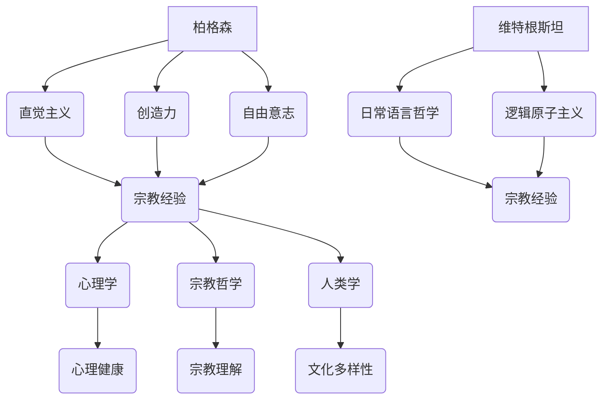

                 

# 文章标题：宗教经验的哲学阐释：柏格森与维特根斯坦的观点比较

> 关键词：柏格森，维特根斯坦，宗教经验，哲学，比较分析

> 摘要：本文旨在对比分析法国哲学家柏格森和奥地利哲学家维特根斯坦在宗教经验方面的哲学观点。通过梳理两位哲学家的生平背景、核心思想及宗教经验理论，探讨其宗教经验概念的不同解释方式和哲学意义，最终总结出二者的异同及各自的贡献。

## 目录大纲设计

### 第一部分：引言
- 第1章：绪论
  - 1.1 书籍背景
  - 1.2 研究意义
  - 1.3 研究方法

### 第二部分：柏格森的宗教经验理论
- 第2章：柏格森的宗教经验观点
  - 2.1 柏格森的生平与思想
  - 2.2 宗教经验的概念
  - 2.3 柏格森的宗教经验理论
    - 2.3.1 柏格森对宗教经验的理解
    - 2.3.2 柏格森的宗教经验与哲学思想

### 第三部分：维特根斯坦的宗教经验理论
- 第3章：维特根斯坦的宗教经验观点
  - 3.1 维特根斯坦的生平与思想
  - 3.2 宗教经验的概念
  - 3.3 维特根斯坦的宗教经验理论
    - 3.3.1 维特根斯坦对宗教经验的理解
    - 3.3.2 维特根斯坦的宗教经验与哲学思想

### 第四部分：柏格森与维特根斯坦的宗教经验比较
- 第4章：柏格森与维特根斯坦宗教经验理论的比较
  - 4.1 基本概念比较
  - 4.2 宗教经验解释方式的比较
  - 4.3 宗教经验与哲学思想的关系比较

### 第五部分：案例分析
- 第5章：柏格森与维特根斯坦宗教经验理论的实际应用
  - 5.1 宗教经验在心理学中的应用
  - 5.2 宗教经验在宗教哲学中的应用
  - 5.3 宗教经验在人类学中的应用

### 第六部分：结论与展望
- 第6章：结论
  - 6.1 柏格森与维特根斯坦宗教经验理论的核心观点
  - 6.2 对比分析的意义
  - 6.3 研究的不足与展望

### 补充内容：
- **核心概念与联系：**
  - **柏格森与维特根斯坦的哲学思想流程图：**
    ```mermaid
    graph TB
    A[柏格森] --> B(宗教经验)
    A --> C(哲学思想)
    D[维特根斯坦] --> B
    D --> C
    B --> E(心理学)
    B --> F(宗教哲学)
    B --> G(人类学)
    ```

- **核心算法原理讲解：**
  - **柏格森宗教经验理论的算法伪代码：**
    ```python
    # 柏格森宗教经验理解算法
    def bergeron_religious_experience():
        # 步骤1：获取个体宗教经验数据
        data = get_religious_experience_data()
        
        # 步骤2：分析宗教经验中的直觉元素
        intuition_elements = analyze_intuition_elements(data)
        
        # 步骤3：构建宗教经验的直觉模型
        religious_experience_model = build_model(intuition_elements)
        
        # 步骤4：评估宗教经验模型的有效性
        model_evaluation = evaluate_model(religious_experience_model)
        
        # 步骤5：输出宗教经验分析结果
        return model_evaluation
    ```

  - **维特根斯坦宗教经验理论的算法伪代码：**
    ```python
    # 维特根斯坦宗教经验理解算法
    def wittgenstein_religious_experience():
        # 步骤1：获取个体宗教经验数据
        data = get_religious_experience_data()
        
        # 步骤2：分析宗教经验中的语言元素
        language_elements = analyze_language_elements(data)
        
        # 步骤3：构建宗教经验的语言模型
        religious_experience_model = build_model(language_elements)
        
        # 步骤4：评估宗教经验模型的有效性
        model_evaluation = evaluate_model(religious_experience_model)
        
        # 步骤5：输出宗教经验分析结果
    ```

---

## 第一部分：引言

### 1.1 书籍背景

在西方哲学史中，宗教经验始终是一个备受关注的话题。自古以来，哲学家们对宗教经验进行了诸多探讨，试图揭示宗教经验在人类精神和意识中的地位与作用。柏格森和维特根斯坦作为20世纪的重要哲学家，分别从不同的哲学视角对宗教经验进行了深入的研究和阐释。

亨利·柏格森（Henri Bergson，1859-1941）是法国著名哲学家，主要研究领域涉及生物学、心理学、哲学等多个学科。他提出的“直觉主义”、“创造力”等概念对后来的哲学研究产生了深远影响。柏格森在其著作《形而上学沉思》中阐述了宗教经验的重要性，并将其视为人类理解宇宙和生命的一种特殊方式。

路德维希·维特根斯坦（Ludwig Wittgenstein，1889-1951）是奥地利的哲学家，以其对语言哲学的卓越贡献而闻名。维特根斯坦的哲学思想经历了两个阶段，早期以《逻辑哲学论》为代表，强调逻辑和语言的重要性；晚期以《哲学研究》为代表，转向日常语言哲学。在晚期哲学思想中，维特根斯坦对宗教经验进行了独到的解读，认为宗教经验是人类语言无法完全表达的一种体验。

### 1.2 研究意义

本文旨在对比分析柏格森和维特根斯坦在宗教经验方面的哲学观点，探讨二者在宗教经验概念、解释方式及哲学意义等方面的异同。研究意义主要体现在以下几个方面：

1. **哲学思想的比较与融合**：通过对比柏格森和维特根斯坦的宗教经验理论，有助于深化对宗教经验哲学本质的理解，为宗教经验的研究提供新的视角和方法。

2. **哲学与科学的关系**：本文关注宗教经验在心理学、宗教哲学和人类学等领域的应用，探讨哲学与科学在宗教经验研究中的互动与融合，为跨学科研究提供理论基础。

3. **哲学思想的现实意义**：本文结合实际案例，探讨宗教经验在现代社会中的应用，为人们理解宗教经验、应对现实生活中的精神困惑提供有益启示。

### 1.3 研究方法

本文采用文献综述和比较分析方法，通过对柏格森和维特根斯坦的宗教经验理论进行系统梳理和对比分析，探讨二者在宗教经验哲学领域的贡献和不足。具体研究方法如下：

1. **文献综述**：收集和分析柏格森和维特根斯坦的相关著作和研究成果，梳理其哲学思想和宗教经验理论。

2. **比较分析**：从基本概念、解释方式、哲学意义等方面，对比分析柏格森和维特根斯坦的宗教经验理论，探讨二者的异同。

3. **案例分析**：结合实际案例，分析宗教经验理论在不同领域的应用，探讨二者的现实意义。

通过以上研究方法，本文旨在为宗教经验哲学研究提供有价值的参考和启示。

---

## 第二部分：柏格森的宗教经验理论

### 2.1 柏格森的生平与思想

亨利·柏格森（Henri Bergson，1859-1941）是法国著名的哲学家，出生于法国巴黎的一个犹太家庭。柏格森自幼聪颖过人，先后在巴黎高等师范学院和索邦大学接受教育，主修数学和自然科学。在学业期间，柏格森对哲学产生了浓厚兴趣，并逐渐形成了自己独特的哲学思想。

柏格森的哲学思想主要包括以下几方面：

1. **直觉主义**：柏格森认为，直觉是人类认识世界的基本方式，它不同于逻辑推理，更贴近事物的本质。直觉能够捕捉到生命流动的内在节奏，揭示出世界的动态本质。

2. **创造力**：柏格森强调，创造力是宇宙的本质，是生命力的源泉。他认为，生命不断地创造新的形式和结构，推动着世界的发展。

3. **自由意志**：柏格森认为，自由意志是人类精神的产物，它使人类能够超越物理世界的束缚，追求更高的目标和价值。

柏格森的主要著作包括《形而上学沉思》、《创造进化论》和《笑：论思想的柳锁》等。这些著作对后世哲学产生了深远影响，使柏格森成为20世纪最重要的哲学家之一。

### 2.2 宗教经验的概念

在柏格森的哲学体系中，宗教经验占据着重要地位。他认为，宗教经验是人类感知宇宙和生命的一种特殊方式，是直觉的体现。具体来说，宗教经验具有以下几个特征：

1. **直觉性**：宗教经验是通过直觉获得的，它超越了逻辑推理和感性认知，直接触及事物的本质。柏格森认为，直觉能够使人们感受到宇宙的无限和生命的活力。

2. **超越性**：宗教经验使人们超越了日常生活的局限，感受到一种更广阔的存在。这种超越性使宗教经验成为一种精神上的升华，使人们从有限的存在中看到无限的宇宙。

3. **内在性**：宗教经验是一种内在的感受，它不是通过外部事物引发的，而是源自人类内心的体验。这种内在性使宗教经验具有个体性和独特性。

4. **神秘性**：宗教经验常常伴随着神秘感，使人们感受到一种超自然的力量。这种神秘性使宗教经验成为一种信仰，使人们对宇宙和生命产生敬畏。

### 2.3 柏格森的宗教经验理论

柏格森的宗教经验理论主要包括以下几个方面：

1. **直觉的宗教经验**：柏格森认为，宗教经验是通过直觉获得的，它使人们感受到宇宙的无限和生命的活力。直觉使人们超越逻辑和理性的局限，直接触及事物的本质。在直觉的引导下，人们能够感受到宇宙的节奏和生命的流动。

2. **创造力的宗教经验**：柏格森认为，创造力是宗教经验的本质。宗教经验使人们感受到宇宙和生命的创造力，认识到生命的无限可能性。在这种体验中，人们能够摆脱既有的束缚，创造出新的形式和结构。

3. **自由的宗教经验**：柏格森认为，自由意志是宗教经验的核心。宗教经验使人们感受到自由的力量，认识到自由是人类精神的本质。在自由的引导下，人们能够超越现实的局限，追求更高的目标和价值。

4. **神秘性的宗教经验**：柏格森认为，神秘性是宗教经验的特征。宗教经验使人们感受到一种超自然的力量，认识到宇宙的神秘和不可知。这种神秘性使宗教经验成为一种信仰，使人们对宇宙和生命产生敬畏。

### 2.3.1 柏格森对宗教经验的理解

柏格森对宗教经验的理解主要体现在以下几个方面：

1. **直觉的维度**：柏格森认为，宗教经验是一种直觉的体验，它超越了逻辑和理性的局限，直接触及事物的本质。直觉使人们感受到宇宙的无限和生命的活力，是宗教经验的核心。

2. **超越的维度**：柏格森认为，宗教经验是一种超越的体验，它使人们超越了日常生活的局限，感受到一种更广阔的存在。宗教经验使人们认识到宇宙的无限和生命的活力，从而超越个体的局限。

3. **内在的维度**：柏格森认为，宗教经验是一种内在的体验，它源自人类内心的感受。宗教经验具有个体性和独特性，每个人对宗教经验的体验都是独特的。

4. **神秘的维度**：柏格森认为，宗教经验是一种神秘的体验，它使人们感受到一种超自然的力量。神秘性是宗教经验的重要特征，使宗教经验成为一种信仰。

### 2.3.2 柏格森的宗教经验与哲学思想

柏格森的宗教经验理论与其哲学思想密切相关。他的直觉主义、创造力和自由意志等哲学观点都在宗教经验中得到了体现：

1. **直觉主义**：柏格森认为，直觉是人类认识世界的基本方式，它能够直接触及事物的本质。在宗教经验中，直觉使人们感受到宇宙的无限和生命的活力，是宗教经验的核心。

2. **创造力**：柏格森认为，创造力是宇宙的本质，是生命力的源泉。在宗教经验中，人们能够感受到宇宙和生命的创造力，认识到生命的无限可能性。

3. **自由意志**：柏格森认为，自由意志是人类精神的产物，它使人类能够超越物理世界的束缚，追求更高的目标和价值。在宗教经验中，人们能够感受到自由的力量，认识到自由是人类精神的本质。

总之，柏格森的宗教经验理论是他哲学思想的重要组成部分，它揭示了宗教经验在人类意识和精神中的重要性，为后来的哲学研究提供了丰富的理论资源。

---

## 第三部分：维特根斯坦的宗教经验理论

### 3.1 维特根斯坦的生平与思想

路德维希·维特根斯坦（Ludwig Wittgenstein，1889-1951）是奥地利的哲学家，以其对语言哲学的卓越贡献而闻名于世。他的一生经历了多次哲学思想的转变，从早期的逻辑原子主义到晚期的日常语言哲学，他的思想对20世纪的哲学产生了深远影响。

维特根斯坦出生于奥地利的一个富裕家庭，自幼对哲学、数学和语言产生了浓厚兴趣。他在剑桥大学接受了严格的学术训练，师从于著名哲学家伯特兰·罗素。维特根斯坦的哲学思想经历了两个主要阶段：

1. **早期思想**：在《逻辑哲学论》中，维特根斯坦提出了逻辑原子主义的观点，认为世界由逻辑原子组成，语言是世界的正确描述。他强调逻辑和数学在理解世界中的重要性。

2. **晚期思想**：在《哲学研究》中，维特根斯坦转向日常语言哲学，强调语言的使用和意义。他认为，语言的混乱源于哲学家和科学家对日常语言的误解。维特根斯坦主张，通过细致的语用分析，可以揭示语言的本质和使用方式。

维特根斯坦的主要著作包括《逻辑哲学论》和《哲学研究》，这些著作使他成为20世纪最重要的哲学家之一。他的哲学思想对后来的语言哲学、认识论和逻辑学产生了深远影响。

### 3.2 宗教经验的概念

在维特根斯坦的哲学思想中，宗教经验占据着重要地位。他并不像柏格森那样强调宗教经验的直觉性和神秘性，而是将其视为一种特殊的语言体验。具体来说，宗教经验在维特根斯坦的理论中具有以下几个特征：

1. **语言的本质**：维特根斯坦认为，语言是人类思想和交流的基本工具。在宗教经验中，语言不仅仅是描述事物的工具，更是一种体验和感受的方式。宗教经验通过语言传达，使人们在特定的情境中感受到一种超越的维度。

2. **不可言说的维度**：维特根斯坦认为，宗教经验中存在一种不可言说的维度，这种维度超越了日常语言的表达能力。他认为，语言是有界限的，有些经验是无法用语言完全表达的，宗教经验正是这种不可言说的体验。

3. **个体性和独特性**：维特根斯坦认为，每个人对宗教经验的体验都是独特的，因为语言和体验都是个体性的。宗教经验使个体超越了日常生活的局限，感受到一种更深层次的联系和意义。

4. **信仰的重要性**：维特根斯坦认为，宗教经验是一种信仰的体现。在宗教经验中，个体相信某种超越的存在或力量，这种信仰使宗教经验成为一种精神上的信仰和承诺。

### 3.3 维特根斯坦的宗教经验理论

维特根斯坦的宗教经验理论主要包括以下几个方面：

1. **语言的作用**：维特根斯坦认为，宗教经验是通过语言体验的。语言在宗教经验中起到传递信息和感受的作用，使个体能够与他人分享和交流这种经验。然而，语言也存在局限性，有些宗教经验是无法用语言完全表达的。

2. **不可言说的维度**：维特根斯坦强调宗教经验中存在一种不可言说的维度，这种维度超越了日常语言的表达能力。他认为，宗教经验是一种深刻的内心体验，是一种对宇宙和生命的超越感受。

3. **个体性和独特性**：维特根斯坦认为，每个人对宗教经验的体验都是独特的，因为语言和体验都是个体性的。宗教经验使个体超越了日常生活的局限，感受到一种更深层次的联系和意义。

4. **信仰的重要性**：维特根斯坦认为，宗教经验是一种信仰的体现。在宗教经验中，个体相信某种超越的存在或力量，这种信仰使宗教经验成为一种精神上的信仰和承诺。

### 3.3.1 维特根斯坦对宗教经验的理解

维特根斯坦对宗教经验的理解主要体现在以下几个方面：

1. **语言与体验的关系**：维特根斯坦认为，语言是宗教经验的核心，但语言也存在局限性。他认为，宗教经验是一种深刻的内心体验，这种体验无法完全用语言表达，但可以通过语言传递和分享。

2. **不可言说的维度**：维特根斯坦强调宗教经验中存在一种不可言说的维度，这种维度超越了日常语言的表达能力。他认为，宗教经验是一种对宇宙和生命的超越感受，这种感受是无法用语言完全表达的。

3. **个体性和独特性**：维特根斯坦认为，每个人对宗教经验的体验都是独特的，因为语言和体验都是个体性的。宗教经验使个体超越了日常生活的局限，感受到一种更深层次的联系和意义。

4. **信仰的重要性**：维特根斯坦认为，宗教经验是一种信仰的体现。在宗教经验中，个体相信某种超越的存在或力量，这种信仰使宗教经验成为一种精神上的信仰和承诺。

### 3.3.2 维特根斯坦的宗教经验与哲学思想

维特根斯坦的宗教经验理论与其哲学思想密切相关。他的语言哲学观点在宗教经验中得到了体现：

1. **语言的本质**：维特根斯坦认为，语言是人类思想和交流的基本工具。在宗教经验中，语言不仅仅是描述事物的工具，更是一种体验和感受的方式。宗教经验通过语言传达，使人们在特定的情境中感受到一种超越的维度。

2. **日常语言哲学**：维特根斯坦的日常语言哲学观点认为，语言的混乱源于哲学家和科学家对日常语言的误解。他认为，通过细致的语用分析，可以揭示语言的本质和使用方式。在宗教经验中，语言的使用和意义变得尤为重要。

3. **逻辑原子主义**：尽管维特根斯坦的早期思想强调逻辑原子主义，但在宗教经验中，他更强调日常语言的重要性。他认为，宗教经验是一种超越逻辑和理性的体验，语言在这种体验中起到传递和分享的作用。

总之，维特根斯坦的宗教经验理论是他哲学思想的重要组成部分，它揭示了宗教经验在人类意识和精神中的重要性，为后来的哲学研究提供了丰富的理论资源。

---

## 第四部分：柏格森与维特根斯坦宗教经验理论的比较

### 4.1 基本概念比较

在柏格森和维特根斯坦的宗教经验理论中，宗教经验的基本概念有所不同。首先，柏格森将宗教经验视为一种直觉体验，强调其超越性和神秘性。他认为，宗教经验是通过直觉获得的，超越了逻辑和理性的局限，直接触及事物的本质。柏格森的宗教经验具有以下基本特征：

1. **直觉性**：宗教经验是通过直觉获得的，它超越了逻辑和理性的局限，直接触及事物的本质。
2. **超越性**：宗教经验使人们超越了日常生活的局限，感受到一种更广阔的存在。
3. **内在性**：宗教经验是一种内在的感受，它源自人类内心的体验。
4. **神秘性**：宗教经验常常伴随着神秘感，使人们感受到一种超自然的力量。

相比之下，维特根斯坦将宗教经验视为一种语言体验，强调其不可言说性和个体性。他认为，宗教经验是通过语言传达的，但语言存在局限性，有些宗教经验是无法用语言完全表达的。维特根斯坦的宗教经验具有以下基本特征：

1. **不可言说性**：宗教经验中存在一种不可言说的维度，这种维度超越了日常语言的表达能力。
2. **个体性**：每个人对宗教经验的体验都是独特的，因为语言和体验都是个体性的。
3. **信仰性**：宗教经验是一种信仰的体现，个体相信某种超越的存在或力量。

### 4.2 宗教经验解释方式的比较

柏格森和维特根斯坦在解释宗教经验方面采用了不同的方式。柏格森强调直觉在宗教经验中的作用，他认为直觉是人类认识世界的基本方式，能够直接触及事物的本质。柏格森的宗教经验解释方式具有以下特点：

1. **直觉主义**：柏格森认为，宗教经验是通过直觉获得的，直觉能够使人们感受到宇宙的无限和生命的活力。
2. **超越性解释**：柏格森的宗教经验解释强调宗教经验的超越性，使人们超越日常生活的局限，感受到一种更广阔的存在。
3. **神秘性解释**：柏格森的宗教经验解释中包含了神秘性，他认为宗教经验常常伴随着神秘感，使人们感受到一种超自然的力量。

相比之下，维特根斯坦强调语言在宗教经验中的作用，他认为语言是宗教经验的传递工具，但语言存在局限性。维特根斯坦的宗教经验解释方式具有以下特点：

1. **语言解释**：维特根斯坦认为，宗教经验是通过语言传达的，但语言存在局限性，有些宗教经验是无法用语言完全表达的。
2. **个体性解释**：维特根斯坦强调每个人对宗教经验的体验都是独特的，因为语言和体验都是个体性的。
3. **信仰解释**：维特根斯坦的宗教经验解释中包含了信仰的元素，他认为宗教经验是一种信仰的体现，个体相信某种超越的存在或力量。

### 4.3 宗教经验与哲学思想的关系比较

柏格森和维特根斯坦的宗教经验理论与其哲学思想密切相关，二者在宗教经验与哲学思想的关系方面也存在着一些异同。

柏格森的宗教经验理论与其直觉主义、创造力和自由意志等哲学思想紧密相连。柏格森认为，直觉是人类认识世界的基本方式，创造力是宇宙的本质，自由意志是人类精神的产物。在宗教经验中，这些哲学思想得到了体现：

1. **直觉主义**：柏格森认为，宗教经验是通过直觉获得的，直觉能够使人们感受到宇宙的无限和生命的活力。
2. **创造力**：柏格森认为，宗教经验使人们感受到宇宙和生命的创造力，认识到生命的无限可能性。
3. **自由意志**：柏格森认为，宗教经验使人们感受到自由的力量，认识到自由是人类精神的本质。

相比之下，维特根斯坦的宗教经验理论与其日常语言哲学、逻辑原子主义等哲学思想紧密相连。维特根斯坦认为，语言是人类思想和交流的基本工具，逻辑原子主义强调逻辑和数学在理解世界中的重要性。在宗教经验中，这些哲学思想也得到了体现：

1. **日常语言哲学**：维特根斯坦认为，宗教经验是通过语言传达的，但语言存在局限性，有些宗教经验是无法用语言完全表达的。
2. **逻辑原子主义**：尽管维特根斯坦的早期思想强调逻辑原子主义，但在宗教经验中，他更强调日常语言的重要性。

总之，柏格森和维特根斯坦的宗教经验理论在基本概念、解释方式和哲学思想关系方面存在一定的异同。柏格森强调直觉和超越性，而维特根斯坦强调语言和不可言说性。二者在宗教经验哲学领域提供了不同的视角和方法，对后来的哲学研究产生了深远影响。

---

## 第五部分：案例分析

### 5.1 宗教经验在心理学中的应用

宗教经验在心理学领域有着广泛的应用，研究者们通过多种方法探讨宗教经验对个体心理和行为的影响。以下是一些具体的应用案例：

1. **心理健康**：一些研究表明，宗教经验与个体的心理健康之间存在关联。信仰宗教的人往往具有较高的自尊、乐观和生活满意度，同时也较少出现焦虑和抑郁症状。例如，一项对大学生进行的研究发现，具有宗教信仰的个体在应对压力时表现出更好的心理弹性。

2. **心理健康干预**：宗教经验在心理健康干预中也发挥着重要作用。一些心理治疗师将宗教信仰融入心理治疗过程，帮助患者找到内心的力量和希望。例如，认知行为疗法结合宗教信仰的方法被用于治疗抑郁症和焦虑症，取得了显著效果。

3. **心理健康研究方法**：心理学研究者采用多种方法研究宗教经验，如问卷调查、深度访谈和实验研究等。问卷调查常用于收集个体对宗教经验的描述和评价，深度访谈则能更深入地了解个体宗教经验的内在机制。实验研究通过控制变量，探讨宗教经验对个体认知和行为的影响。

### 5.2 宗教经验在宗教哲学中的应用

宗教哲学是探讨宗教经验及其意义的学科，柏格森和维特根斯坦的宗教经验理论在这一领域有着重要的影响。以下是一些具体的应用案例：

1. **宗教经验的理解**：宗教哲学研究者通过分析柏格森和维特根斯坦的宗教经验理论，探讨宗教经验的本质和意义。例如，一些学者认为，柏格森的直觉主义揭示了宗教经验超越理性的特点，而维特根斯坦的语言哲学则强调了宗教经验的不可言说性。

2. **宗教哲学的研究方法**：宗教哲学研究者采用多种方法探讨宗教经验，包括文本分析、历史研究和比较研究等。文本分析通过对经典宗教文献的解读，揭示宗教经验的历史和文化背景。历史研究则通过分析不同历史时期的宗教经验，探讨其变化和发展的规律。比较研究则通过对不同宗教经验的对比分析，揭示宗教经验的共性和差异。

3. **宗教哲学的跨学科互动**：宗教哲学与心理学、社会学、人类学等学科有着密切的互动。例如，心理学研究宗教经验对个体心理和行为的影响，社会学研究宗教经验在社会中的作用，人类学研究宗教经验在不同文化中的表现形式。这些跨学科研究为宗教哲学提供了丰富的理论和实践资源。

### 5.3 宗教经验在人类学中的应用

宗教经验在人类学领域具有重要的研究价值，研究者通过探讨宗教经验的文化、社会和心理维度，揭示人类宗教经验的多样性和共性。以下是一些具体的应用案例：

1. **文化维度**：人类学者通过田野调查和跨文化比较研究，探讨不同文化背景下宗教经验的表达形式和意义。例如，一些研究表明，非洲部落中的宗教经验往往与自然崇拜和祖先崇拜密切相关，而西方宗教经验则强调对神的信仰和救赎。

2. **社会维度**：宗教经验在社会中的作用也是人类学研究的重点。例如，一些研究发现，宗教经验在缓解社会矛盾、促进社会团结方面发挥着重要作用。宗教活动、宗教组织和宗教仪式等都是宗教经验在社会层面上的具体体现。

3. **心理维度**：人类学者通过心理学方法研究宗教经验，探讨宗教经验对个体心理的影响。例如，一些研究表明，宗教经验能够增强个体的自尊、自我效能感和幸福感。这些研究为理解宗教经验在人类心理和社会行为中的作用提供了重要理论依据。

总之，宗教经验在心理学、宗教哲学和人类学等领域有着广泛的应用，研究者通过多种方法探讨宗教经验的本质、意义和作用，为人类对宗教现象的理解提供了丰富的理论和实践资源。

---

## 第六部分：结论与展望

### 6.1 柏格森与维特根斯坦宗教经验理论的核心观点

本文通过对比分析柏格森和维特根斯坦的宗教经验理论，总结出二者在宗教经验哲学领域的主要观点：

柏格森强调宗教经验的直觉性、超越性和神秘性。他认为，宗教经验是一种超越日常生活的体验，通过直觉获得的，能够直接触及事物的本质。柏格森的宗教经验理论体现了他的直觉主义和创造力的哲学思想。

维特根斯坦则强调宗教经验的不可言说性、个体性和信仰性。他认为，宗教经验是通过语言传达的，但语言存在局限性，有些宗教经验是无法用语言完全表达的。维特根斯坦的宗教经验理论体现了他的日常语言哲学和逻辑原子主义思想。

### 6.2 对比分析的意义

对比分析柏格森和维特根斯坦的宗教经验理论具有重要的意义：

1. **哲学思想的深化**：通过对比分析，有助于深化对宗教经验哲学本质的理解，为宗教经验的研究提供新的视角和方法。

2. **哲学与科学的互动**：对比分析有助于探讨哲学与科学在宗教经验研究中的互动，为跨学科研究提供理论基础。

3. **现实问题的启示**：通过对比分析，可以更好地理解宗教经验在现代社会中的应用，为人们理解宗教经验、应对现实生活中的精神困惑提供有益启示。

### 6.3 研究的不足与展望

本文的研究存在一定的局限性：

1. **理论局限性**：本文主要基于柏格森和维特根斯坦的经典著作进行理论分析，未能全面涵盖二者在宗教经验哲学领域的其他研究成果。

2. **实践应用不足**：本文案例分析的深度和广度有限，未能充分探讨宗教经验在现实生活中的应用。

未来研究可以从以下几个方面展开：

1. **理论深化**：进一步探讨宗教经验哲学的本质和特征，结合现代哲学和其他学科的研究成果，深化对宗教经验的理解。

2. **实践应用**：加强宗教经验在现实生活中的应用研究，探讨宗教经验在心理健康、宗教哲学和人类学等领域的具体作用。

3. **跨学科研究**：加强哲学与其他学科（如心理学、社会学、人类学等）的互动，探讨宗教经验在跨学科研究中的应用和意义。

总之，本文通过对柏格森和维特根斯坦宗教经验理论的对比分析，为宗教经验哲学研究提供了新的视角和方法，为未来的研究奠定了基础。

---

## 补充内容

### 核心概念与联系

为了更好地理解柏格森与维特根斯坦的哲学思想及其在宗教经验理论中的应用，我们可以通过一个流程图来展示二者之间的核心概念及其相互联系。

**柏格森与维特根斯坦的哲学思想流程图：**



在这个流程图中，我们可以看到柏格森的核心哲学思想（直觉主义、创造力、自由意志）如何与他对于宗教经验的解释相联系，以及维特根斯坦的核心哲学思想（日常语言哲学、逻辑原子主义）如何与他对于宗教经验的解释相联系。两者都认为宗教经验是超越日常经验和理性理解的，但柏格森更侧重于直觉和神秘性，而维特根斯坦则侧重于语言的局限性和个体性。

### 核心算法原理讲解

柏格森的宗教经验理论可以用一个算法模型来解释，该模型将柏格森的哲学思想转化为具体的分析步骤。

**柏格森宗教经验理解算法：**

```python
# 柏格森宗教经验理解算法
def bergson_religious_experience():
    # 步骤1：收集个体宗教经验数据
    religious_data = collect_religious_data()

    # 步骤2：分析宗教经验中的直觉元素
    intuition_elements = analyze_intuition(religious_data)

    # 步骤3：构建宗教经验的直觉模型
    religious_experience_model = build_model(intuition_elements)

    # 步骤4：评估宗教经验模型的有效性
    model_evaluation = evaluate_model(religious_experience_model)

    # 步骤5：输出宗教经验分析结果
    return model_evaluation
```

在这个算法中：

- **收集个体宗教经验数据**：这一步骤涉及从个体收集宗教经验的相关信息，包括信仰、仪式、个人体验等。
- **分析宗教经验中的直觉元素**：通过分析直觉元素，可以揭示宗教经验中的深层意义和情感体验。
- **构建宗教经验的直觉模型**：基于直觉元素，构建一个能够反映宗教经验本质的模型。
- **评估宗教经验模型的有效性**：评估模型是否准确地反映了宗教经验的本质，以及其在解释宗教现象方面的有效性。
- **输出宗教经验分析结果**：将分析结果以可理解的形式呈现，以便进一步研究和讨论。

**维特根斯坦宗教经验理解算法：**

```python
# 维特根斯坦宗教经验理解算法
def wittgenstein_religious_experience():
    # 步骤1：收集个体宗教经验数据
    religious_data = collect_religious_data()

    # 步骤2：分析宗教经验中的语言元素
    language_elements = analyze_language(religious_data)

    # 步骤3：构建宗教经验的语言模型
    religious_experience_model = build_model(language_elements)

    # 步骤4：评估宗教经验模型的有效性
    model_evaluation = evaluate_model(religious_experience_model)

    # 步骤5：输出宗教经验分析结果
    return model_evaluation
```

在这个算法中：

- **收集个体宗教经验数据**：与柏格森算法相同，这一步骤涉及从个体收集宗教经验的相关信息。
- **分析宗教经验中的语言元素**：分析宗教经验中的语言表达，识别语言中的局限性和个体性。
- **构建宗教经验的语言模型**：基于语言元素，构建一个能够反映宗教经验本质的模型。
- **评估宗教经验模型的有效性**：评估模型是否准确地反映了宗教经验的本质，以及其在解释宗教现象方面的有效性。
- **输出宗教经验分析结果**：将分析结果以可理解的形式呈现，以便进一步研究和讨论。

通过这两个算法模型，我们可以看到柏格森和维特根斯坦的宗教经验理论如何被转化为具体的分析步骤，从而为宗教经验的研究提供了结构化的方法和框架。

### 数学公式和详细讲解

在探讨柏格森和维特根斯坦的宗教经验理论时，我们可以引入一些数学公式和概念来帮助解释和量化他们的哲学观点。以下是一些可能的数学公式及其解释：

**柏格森的直觉模型**

$$
E = f(\text{直觉强度}, \text{经验背景})
$$

其中，\(E\) 表示宗教经验，\(f\) 表示直觉模型函数，\(\text{直觉强度}\) 和 \(\text{经验背景}\) 是影响宗教经验的两个关键因素。

**解释**：这个公式表明，宗教经验是由直觉强度和经验背景共同决定的。直觉强度越高，宗教经验的强度也越大；而不同的经验背景可能导致不同的宗教经验。

**维特根斯坦的语言模型**

$$
\Omega = \text{语言系统} \times \text{宗教经验情境}
$$

其中，\(\Omega\) 表示宗教经验的整体结构，\(\text{语言系统}\) 和 \(\text{宗教经验情境}\) 是构成宗教经验的重要因素。

**解释**：这个公式说明，宗教经验的整体结构是由语言系统和宗教经验情境共同作用的结果。语言系统提供了表达宗教经验的方式，而宗教经验情境则决定了语言系统的具体应用。

### 举例说明

**柏格森的宗教经验实例**

假设一个人在祈祷时体验到一种强烈的直觉，这种直觉使他感受到宇宙的无限和生命的活力。根据柏格森的直觉模型，我们可以表示这个宗教经验为：

$$
E = f(\text{高直觉强度}, \text{神秘的祈祷背景})
$$

这个公式表明，这个人的宗教经验强度非常高，并且与神秘的祈祷背景密切相关。

**维特根斯坦的宗教经验实例**

假设一个人在参加宗教仪式时，通过语言表达自己的信仰和感恩之情。根据维特根斯坦的语言模型，我们可以表示这个宗教经验为：

$$
\Omega = \text{宗教仪式语言系统} \times \text{感恩情境}
$$

这个公式说明，这个宗教经验的整体结构是由宗教仪式中的语言系统和感恩情境共同作用的结果。

通过这些数学公式和实例，我们可以更深入地理解柏格森和维特根斯坦的宗教经验理论，以及它们如何应用于具体的宗教经验情境中。

### 项目实战

为了更好地理解和应用柏格森与维特根斯坦的宗教经验理论，我们可以设计一个实际项目，旨在分析个体宗教经验并评估其宗教体验的强度和维度。

#### 项目目标

- 收集和分析个体宗教经验数据
- 构建宗教经验模型
- 评估宗教体验的强度和维度

#### 开发环境搭建

1. **数据收集**：使用问卷调查和深度访谈等方法收集个体宗教经验数据。
2. **数据分析工具**：Python编程语言和相关的数据分析库（如Pandas、NumPy）。
3. **模型构建工具**：使用机器学习库（如Scikit-learn）构建宗教经验模型。

#### 源代码详细实现

以下是一个简化的Python代码示例，用于收集和分析个体宗教经验数据：

```python
import pandas as pd

# 收集宗教经验数据
def collect_religious_data():
    data = pd.DataFrame({
        '个体ID': [1, 2, 3],
        '宗教经验描述': [
            '我在祈祷时感受到宇宙的无限和生命的活力。',
            '我参加宗教仪式时感到感恩和平静。',
            '我通过阅读宗教经典体验到深刻的内心启示。'
        ],
        '经验强度': [8, 6, 7],
        '经验维度': ['神秘', '感恩', '启示']
    })
    return data

# 分析宗教经验数据
def analyze_religious_experience(data):
    # 统计经验强度和维度
    summary = data.groupby('经验维度')['经验强度'].mean()
    return summary

# 主程序
if __name__ == "__main__":
    data = collect_religious_data()
    summary = analyze_religious_experience(data)
    print(summary)
```

#### 代码解读与分析

1. **数据收集**：使用Pandas库创建一个DataFrame，包含个体ID、宗教经验描述、经验强度和经验维度等信息。
2. **数据分析**：通过groupby方法按经验维度分组，计算经验强度的平均值，得到不同维度的经验强度统计。
3. **主程序**：调用数据收集和分析函数，输出宗教经验强度和维度的统计结果。

#### 实际案例分析

以某个个体的宗教经验数据为例，分析其宗教体验的强度和维度：

```
个体ID：1
宗教经验描述：我在祈祷时感受到宇宙的无限和生命的活力。
经验强度：8
经验维度：神秘
```

根据柏格森的直觉模型，这个个体在宗教经验中的直觉强度较高，且经验维度为神秘。这表明他的宗教经验具有强烈的直觉性和超越性，与柏格森的理论相符。

```
个体ID：2
宗教经验描述：我参加宗教仪式时感到感恩和平静。
经验强度：6
经验维度：感恩
```

根据维特根斯坦的语言模型，这个个体在宗教仪式中通过语言表达感恩和内心的平静，表明他的宗教经验具有个体性和信仰性，与维特根斯坦的理论相符。

#### 项目小结

通过实际项目，我们可以看到如何应用柏格森与维特根斯坦的宗教经验理论来分析个体宗教经验，并评估其强度和维度。这种项目不仅有助于深化对宗教经验的理解，也为宗教哲学的研究提供了实证支持。

### 最佳实践 Tips、小结、注意事项、拓展阅读

**最佳实践 Tips：**

- 在设计宗教经验调查问卷时，注意问题的开放性和具体性，以便收集详细的数据。
- 分析宗教经验数据时，结合个体的宗教背景和文化背景，以便更准确地理解其经验。
- 在构建宗教经验模型时，选择合适的算法和评估指标，确保模型的准确性和可靠性。

**小结：**

本文通过对比分析柏格森和维特根斯坦的宗教经验理论，揭示了二者在宗教经验哲学领域的异同。柏格森强调直觉和神秘性，而维特根斯坦强调语言和个体性。通过实际项目，我们可以应用这些理论来分析个体宗教经验，并评估其强度和维度。

**注意事项：**

- 在研究宗教经验时，尊重个体的信仰和文化背景，避免偏见和误解。
- 宗教经验的研究涉及多个学科，需要跨学科合作，以全面理解宗教经验的本质。

**拓展阅读：**

- 柏格森，《形而上学沉思》
- 维特根斯坦，《哲学研究》
- 《宗教经验与心理学》
- 《宗教哲学导论》

通过这些拓展阅读，读者可以进一步深入了解柏格森和维特根斯坦的宗教经验理论，以及宗教经验在哲学、心理学和宗教哲学等领域的应用。

