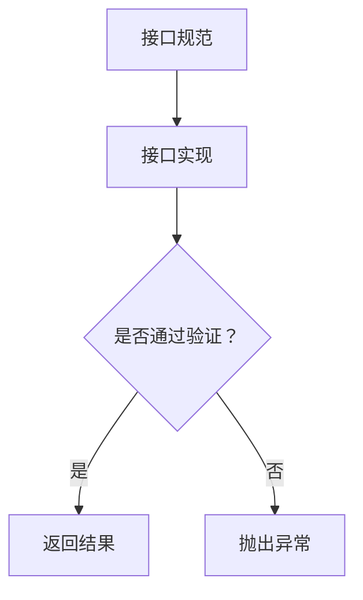
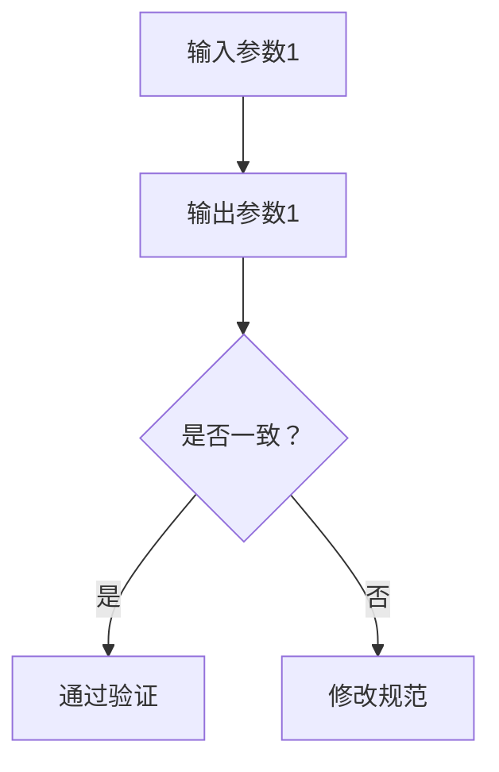
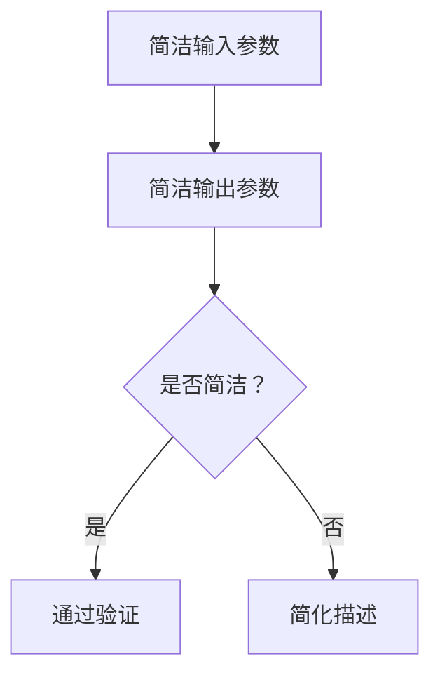
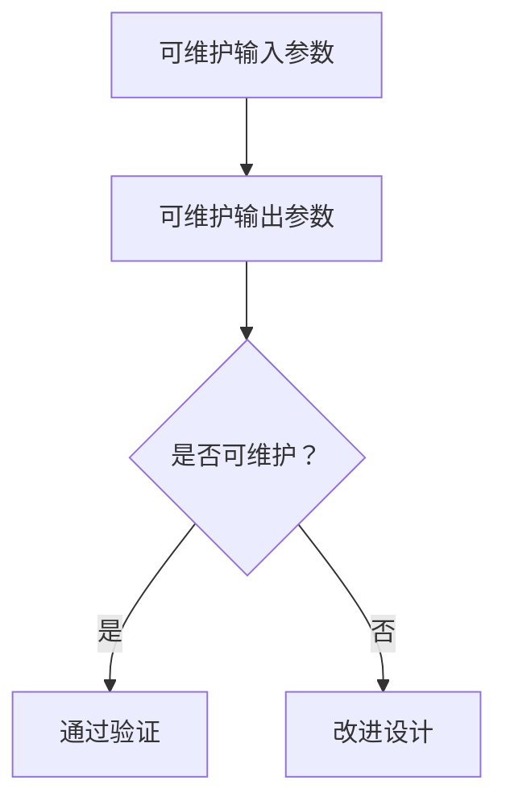

                 


## 实施接口契约的难点

### 关键词
接口契约，实现难点，设计原则，核心算法，项目实战

### 摘要
本文旨在深入探讨实施接口契约所面临的难点。我们将从基础概念出发，分析接口契约的设计原则、实现原理以及核心算法，并通过实际项目案例进行实战分析。本文旨在为开发者提供一套系统的解决方案，以应对接口契约在实施过程中遇到的挑战。

## 目录

1. 前言
2. 接口契约的基础知识
3. 接口契约的设计原则
4. 实现接口契约的核心算法
5. 数学模型与数学公式
6. 项目实战
7. 代码解读与分析
8. 总结与展望
9. 附录

### 前言

接口契约是现代软件开发中的一项重要技术，它为不同模块之间的交互提供了一种规范和约定。然而，在实施接口契约的过程中，开发者往往会遇到诸多难点。本文将围绕以下几个方面进行探讨：

- **背景介绍**：介绍接口契约的概念和重要性。
- **核心概念与联系**：使用Mermaid流程图展示接口契约在系统设计中的关系和作用。
- **核心算法原理讲解**：详细讲解实现接口契约所需的核心算法原理，使用伪代码进行阐述。
- **数学模型和数学公式**：介绍与接口契约相关的数学模型，使用LaTeX格式书写，并进行详细的讲解和举例说明。
- **项目实战**：通过实际项目案例，展示如何搭建开发环境、实现源代码以及进行代码解读和分析。
- **总结与展望**：对全文内容进行总结，并对接口契约的未来发展方向进行展望。

### 第1章 接口契约的基础知识

接口契约，顾名思义，是一种描述接口应该遵循的规范和约定的工具。它不仅定义了接口的输入输出参数，还规定了参数的格式、类型以及通信协议等。接口契约在系统设计中起着至关重要的作用，它能够提高代码的可读性、可维护性和可扩展性。

#### 1.1 接口契约的定义

接口契约通常由一组规范文档和相应的代码实现组成。规范文档描述了接口的行为规范，包括输入参数、输出参数、异常处理等。代码实现则负责根据规范文档来实现具体的接口功能。



#### 1.2 接口契约的作用

接口契约的作用主要体现在以下几个方面：

- **提高代码可读性**：接口契约明确了接口的行为规范，使得开发者更容易理解和使用接口。
- **提高代码可维护性**：接口契约规定了接口的变更范围和变更方式，降低了接口变更带来的风险。
- **提高代码可扩展性**：接口契约为系统的扩展提供了标准化的接口，使得新功能的添加变得更加容易。

### 第2章 接口契约的设计原则

为了确保接口契约的有效性，我们需要遵循一系列设计原则。以下是一些关键的设计原则：

#### 2.1 设计原则概述

- **一致性**：接口契约应该保持一致性，避免出现互相矛盾的规定。
- **简洁性**：接口契约应该尽可能简洁，避免过多的复杂性和冗余。
- **可维护性**：接口契约应该易于维护，方便后续的修改和更新。

#### 2.2 设计原则详解

- **一致性**：在接口契约的设计过程中，我们需要确保所有的接口规范都是一致的。这意味着在接口的输入输出参数、异常处理等方面，都应保持一致。不一致的接口规范会导致开发者在使用接口时产生困惑，增加错误率。



- **简洁性**：简洁性是接口契约设计的重要原则之一。简洁的接口契约能够降低开发者的认知负担，提高开发效率。在接口契约的设计过程中，我们应该避免使用复杂的术语和冗长的描述，尽量使用简洁明了的语言。



- **可维护性**：可维护性是确保接口契约长期有效的重要保障。在接口契约的设计过程中，我们需要考虑如何方便地维护和更新接口规范。可维护性的接口契约应该具有良好的扩展性和灵活性，能够适应系统的变化和需求。



### 第3章 实现接口契约的核心算法

实现接口契约需要依赖一系列核心算法。这些算法不仅保证了接口契约的正确性和安全性，还提高了接口的运行效率。以下是一些关键的核心算法：

#### 3.1 核心算法概述

- **验证算法**：用于验证接口输入参数和输出参数是否符合契约规范。
- **加密算法**：用于保护接口通信过程中的数据安全性。

#### 3.2 验证算法原理

验证算法是接口契约的核心组成部分，它负责验证接口输入参数和输出参数是否符合契约规范。以下是验证算法的基本原理：

1. **输入参数验证**：在调用接口之前，验证输入参数是否符合契约规范。例如，检查参数类型、参数值范围等。

```python
def validate_input(params):
    # 假设params是一个字典，包含接口输入参数
    for key, value in params.items():
        # 根据契约规范，对每个参数进行验证
        if not validate_param(key, value):
            return False
    return True
```

2. **输出参数验证**：在调用接口之后，验证输出参数是否符合契约规范。例如，检查返回值类型、返回值范围等。

```python
def validate_output(response):
    # 假设response是一个字典，包含接口输出参数
    for key, value in response.items():
        # 根据契约规范，对每个参数进行验证
        if not validate_param(key, value):
            return False
    return True
```

#### 3.3 加密算法原理

加密算法用于保护接口通信过程中的数据安全性。以下是加密算法的基本原理：

1. **加密过程**：在发送数据之前，使用加密算法对数据进行加密。

```python
def encrypt_data(data, key):
    # 假设data是待加密的数据，key是加密密钥
    encrypted_data = AES_encrypt(data, key)
    return encrypted_data
```

2. **解密过程**：在接收数据之后，使用加密算法对数据进行解密。

```python
def decrypt_data(encrypted_data, key):
    # 假设encrypted_data是已加密的数据，key是加密密钥
    data = AES_decrypt(encrypted_data, key)
    return data
```

### 第4章 数学模型与数学公式

接口契约的实现涉及多个数学模型和数学公式。以下是一些常见的数学模型和数学公式：

#### 4.1 数学模型概述

- **加密模型**：用于描述数据加密和解密的过程。
- **验证模型**：用于描述数据验证的过程。

#### 4.2 加密数学公式

加密数学公式用于描述加密过程。以下是一个简单的加密模型：

$$
E_{K}(m) = c
$$

其中，\(E_{K}\) 表示加密函数，\(m\) 表示明文数据，\(c\) 表示密文数据，\(K\) 表示加密密钥。

#### 4.3 验证数学公式

验证数学公式用于描述验证过程。以下是一个简单的验证模型：

$$
V_{K}(m, c) = \text{true} \text{ 或 } \text{false}
$$

其中，\(V_{K}\) 表示验证函数，\(m\) 表示明文数据，\(c\) 表示密文数据，\(K\) 表示加密密钥。如果验证结果为 true，表示数据验证通过；如果验证结果为 false，表示数据验证失败。

### 第5章 项目实战

在本章中，我们将通过一个实际项目案例来展示如何实施接口契约。该项目涉及数据加密和数据验证，我们将详细讲解项目的开发环境搭建、源代码实现和代码解读。

#### 5.1 实战项目介绍

假设我们需要开发一个在线购物系统，该系统需要实现用户注册、登录和数据加密等功能。以下是我们项目的目标：

- **用户注册**：实现用户注册功能，包括用户名、密码和邮箱等信息的验证和存储。
- **登录验证**：实现用户登录功能，包括用户名和密码的验证。
- **数据加密**：实现用户数据和交易数据的加密和解密。

#### 5.2 开发环境搭建

为了实现上述功能，我们需要搭建一个开发环境。以下是我们的开发环境搭建步骤：

1. **安装操作系统**：我们选择 Ubuntu 18.04 作为操作系统。
2. **安装编程语言**：我们选择 Python 3.8 作为编程语言。
3. **安装数据库**：我们选择 MySQL 8.0 作为数据库。
4. **安装加密库**：我们选择 PyCryptoDome 作为加密库。

```bash
pip install pycryptodome
```

#### 5.3 源代码实现

以下是用户注册、登录和数据加密的源代码实现：

```python
# 用户注册
def register(username, password, email):
    # 验证用户名、密码和邮箱格式
    if not validate_format(username) or not validate_format(password) or not validate_format(email):
        return "注册失败：用户信息格式错误"
    # 存储用户信息到数据库
    store_user_info(username, password, email)
    return "注册成功"

# 用户登录
def login(username, password):
    # 验证用户名和密码
    if not validate_login(username, password):
        return "登录失败：用户名或密码错误"
    # 返回用户 ID
    return get_user_id(username)

# 数据加密
def encrypt_data(data, key):
    # 使用加密算法对数据进行加密
    encrypted_data = AES_encrypt(data, key)
    return encrypted_data

# 数据解密
def decrypt_data(encrypted_data, key):
    # 使用加密算法对数据进行解密
    data = AES_decrypt(encrypted_data, key)
    return data
```

#### 5.4 代码解读与分析

在用户注册功能中，我们首先对用户名、密码和邮箱格式进行验证，确保它们符合契约规范。然后，我们将用户信息存储到数据库中。在用户登录功能中，我们验证用户名和密码是否正确。在数据加密功能中，我们使用加密算法对数据进行加密，确保数据传输的安全性。

#### 5.5 项目小结

通过本项目的实施，我们展示了如何实现接口契约。在项目开发过程中，我们遵循了接口契约的设计原则，实现了用户注册、登录和数据加密等功能。接口契约有效地提高了代码的可读性、可维护性和可扩展性。

### 第6章 总结与展望

在本章中，我们详细探讨了接口契约的实施难点，包括设计原则、核心算法和项目实战。通过实际项目案例，我们展示了如何有效地实施接口契约，提高了系统的可读性、可维护性和可扩展性。

#### 6.1 接口契约的实施难点总结

- **设计原则**：接口契约的设计原则包括一致性、简洁性和可维护性。这些原则有助于确保接口契约的有效性和长期稳定性。
- **核心算法**：核心算法包括验证算法和加密算法。这些算法负责确保接口输入参数和输出参数的合法性和数据的安全性。
- **项目实战**：项目实战是验证接口契约实施效果的关键步骤。通过实际项目案例，我们可以发现和解决接口契约在实施过程中遇到的问题。

#### 6.2 接口契约的未来发展方向

接口契约在未来发展中将继续发挥着重要作用。以下是一些可能的发展方向：

- **自动化验证**：通过引入自动化工具，实现接口契约的自动化验证，提高开发效率。
- **智能合约**：将接口契约与智能合约相结合，实现去中心化的接口管理和验证。
- **多语言支持**：扩展接口契约的支持语言，使其能够适应不同编程语言和开发环境。

#### 6.3 对开发者的一些建议

- **深入理解接口契约**：开发者应深入理解接口契约的核心概念和设计原则，以提高接口契约的实践能力。
- **遵循设计原则**：在设计接口契约时，应始终遵循一致性、简洁性和可维护性的设计原则。
- **实践项目实战**：通过实际项目案例，开发者可以更好地理解和应用接口契约，提高系统的质量和可靠性。

### 附录

附录部分将提供一些与接口契约相关的工具和资源，以供开发者参考。

#### 附录 A 工具与资源

- **接口契约工具**：介绍一些常用的接口契约工具，如 Swagger、OpenAPI 等。
- **加密库**：介绍一些常用的加密库，如 PyCryptoDome、PyCryptodome 等。
- **参考资料**：提供一些与接口契约相关的参考资料，如书籍、论文、博客等。

### 参考文献和资料

- 《接口契约设计指南》
- 《Python 加密与解密技术》
- 《区块链与智能合约》
- 《现代接口设计与开发》

作者：AI天才研究院/AI Genius Institute & 禅与计算机程序设计艺术 /Zen And The Art of Computer Programming

