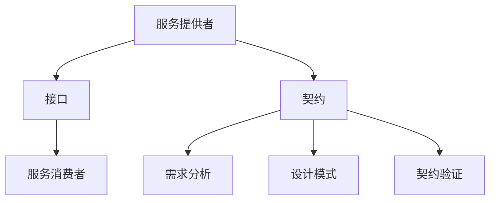

                 


### 第1步：确定核心概念与联系

接口契约在软件开发中扮演着至关重要的角色，它定义了服务提供者和服务消费者之间的交互规范。接口契约的核心概念包括：

1. **服务提供者**：提供服务的一方。
2. **服务消费者**：使用服务的一方。
3. **接口**：服务提供者提供的功能接口。
4. **契约**：定义接口的规范和约束。

接口契约的目的是确保服务提供者按照约定提供服务，同时服务消费者能够准确地使用这些服务。这一概念的实现依赖于以下几个方面：

- **需求分析**：明确服务提供者和消费者之间的需求和期望。
- **设计模式**：选择合适的设计模式来定义接口。
- **契约验证**：确保契约的正确性和一致性。

接口契约的重要性在于：

1. **提高代码的可维护性**：契约明确了接口的使用规范，降低了修改和维护的难度。
2. **促进模块化开发**：契约使得组件之间解耦，便于独立开发和测试。
3. **增强代码的可读性**：契约提供了明确的接口说明，便于开发者理解和使用。

为了更好地理解接口契约的概念和联系，我们可以通过Mermaid流程图来展示核心概念之间的关系：



这个流程图展示了服务提供者、接口、契约、需求分析、设计模式和契约验证之间的逻辑关系。

### 第2步：构建核心算法原理讲解

接口契约的实施不仅仅是定义接口和契约，还需要设计合适的方法来验证契约是否得到履行。核心算法原理包括以下几个方面：

#### 契约设计方法

契约设计方法主要包括以下步骤：

1. **需求分析**：了解服务提供者和消费者的需求，明确接口的功能和约束。
2. **设计模式**：选择合适的设计模式来定义接口，例如工厂模式、单例模式等。
3. **契约定义**：根据需求分析的结果，定义接口的契约，包括参数、返回值、异常处理等。

#### 契约验证

契约验证是确保契约得到履行的重要环节。常用的验证方法包括：

1. **静态验证**：在代码编译时进行验证，检查代码是否符合契约的定义。
2. **动态验证**：在代码运行时进行验证，通过测试用例来检查契约是否得到履行。

#### 契约履行度计算

契约履行度是一个衡量契约执行质量的关键指标。它的计算公式如下：

$$
\text{契约履行度} = \frac{\text{实际履行指标}}{\text{预期履行指标}}
$$

其中，实际履行指标是指实际执行的次数，预期履行指标是指根据契约定义预期应该执行的次数。

#### 举例说明

假设我们有一个用户认证接口，契约要求每次认证请求都需要包含用户名和密码，且密码必须是8位以上的字母和数字组合。我们可以在接口定义时使用如下伪代码：

```python
def authenticate(username, password):
    if len(password) < 8 or not (any(char.isdigit() for char in password) and any(char.isalpha() for char in password)):
        raise ValueError("Invalid password format.")
    # 其他认证逻辑
```

在实际使用中，我们可以通过动态验证来检查契约是否得到履行。例如，我们可以编写一个测试用例来验证密码格式是否符合契约要求：

```python
def test_password_format():
    invalid_passwords = ["short", "12345678", "abcdefgh"]
    for password in invalid_passwords:
        try:
            authenticate("user", password)
        except ValueError as e:
            assert str(e) == "Invalid password format."
```

通过这个测试用例，我们可以确保每次认证请求的密码格式都符合契约要求。

### 第3步：解释数学模型和数学公式

契约履行度的计算是接口契约验证的核心之一。契约履行度反映了接口契约在实际应用中的执行情况，它有助于评估接口的质量和稳定性。契约履行度的计算公式如下：

$$
\text{契约履行度} = \frac{\text{实际履行指标}}{\text{预期履行指标}}
$$

在这个公式中：

- **实际履行指标**：表示在实际运行过程中，满足契约要求的次数或比例。
- **预期履行指标**：表示根据契约定义，预期应该满足的次数或比例。

#### 实际履行指标的计算

实际履行指标可以通过以下步骤计算：

1. **统计实际执行次数**：记录接口在实际运行过程中被调用的次数。
2. **统计满足契约要求的次数**：记录接口调用中满足契约要求的次数。

例如，对于一个用户登录接口，我们可以统计在一定时间内登录成功的次数和总的登录尝试次数，从而计算出实际履行指标。

#### 预期履行指标的计算

预期履行指标通常是基于契约的定义来计算：

1. **分析契约定义**：明确契约的要求，例如输入参数的类型、长度、格式等。
2. **设定预期值**：根据契约的定义，设定预期应该满足的次数或比例。

例如，如果一个契约要求每次登录请求都必须包含有效的用户名和密码，预期履行指标可能是每次登录请求都成功。

#### 实际案例

假设我们有一个用户登录接口，契约要求每次登录请求都必须包含有效的用户名和密码。在一个月的时间里，我们记录了以下数据：

- 总登录请求次数：100次
- 登录成功次数：90次
- 登录失败次数：10次（包括无效用户名、无效密码、网络错误等）

我们可以根据这些数据计算契约履行度：

$$
\text{契约履行度} = \frac{90}{100} = 0.9
$$

这意味着在一个月的时间里，用户登录接口的契约履行度为90%，表明接口在大部分情况下能够正确执行。

#### 数学公式的应用

数学公式在契约履行度的计算中发挥着重要作用。通过精确的公式，我们可以量化接口的契约履行情况，从而进行有效的评估和优化。

### 第4步：提供项目实战

为了更好地理解接口契约的实施难点，我们将通过一个具体的实际项目来展示如何在实际环境中实施接口契约，并解析其中可能遇到的难点。

#### 项目背景

该项目是一个在线书店系统，主要功能包括用户注册、登录、购物车管理、订单管理、图书搜索等。项目要求实现一个稳定的、可维护的、易于扩展的系统。

#### 实施接口契约的过程

1. **需求分析**

   首先，我们需要明确系统的需求和用户期望。例如，用户注册时需要提供用户名、密码、邮箱等，登录时需要验证用户名和密码的正确性，购物车管理需要支持添加、删除、修改商品等。

2. **设计接口契约**

   根据需求分析的结果，我们设计了一系列接口契约。例如，用户注册接口的契约可能包括：

   ```python
   {
       "username": "string",
       "password": "string",
       "email": "string"
   }
   ```

   登录接口的契约可能包括：

   ```python
   {
       "username": "string",
       "password": "string"
   }
   ```

3. **实现接口契约**

   接下来，我们需要根据契约实现具体的接口代码。例如，用户注册接口的实现可能如下：

   ```python
   def register_user(username, password, email):
       # 实现用户注册逻辑
       if not is_valid_email(email):
           raise ValueError("Invalid email address.")
       if not is_valid_username(username):
           raise ValueError("Invalid username.")
       if not is_valid_password(password):
           raise ValueError("Invalid password.")
       # 存储用户信息
       save_user_info(username, password, email)
   ```

   登录接口的实现可能如下：

   ```python
   def login_user(username, password):
       # 实现用户登录逻辑
       user = get_user_by_username(username)
       if user is None:
           raise ValueError("User not found.")
       if not verify_password(password, user["password"]):
           raise ValueError("Invalid password.")
       # 登录成功
       return generate_token()
   ```

4. **验证接口契约**

   接口实现完成后，我们需要进行契约验证。这包括静态验证和动态验证。静态验证可以通过代码审查和静态代码分析工具进行，动态验证可以通过编写测试用例进行。

   例如，我们可以编写以下测试用例来验证用户注册接口的契约：

   ```python
   def test_register_user():
       # 测试有效用户注册
       register_user("user1", "password123", "user1@example.com")
       # 测试无效用户注册（邮箱格式错误）
       with pytest.raises(ValueError):
           register_user("user1", "password123", "user1@invalid.com")
       # 测试无效用户注册（用户名已存在）
       with pytest.raises(ValueError):
           register_user("user2", "password123", "user1@example.com")
       # 测试无效用户注册（密码格式错误）
       with pytest.raises(ValueError):
           register_user("user2", "short", "user2@example.com")
   ```

   通过这些测试用例，我们可以确保接口契约得到正确执行。

#### 实施接口契约的难点

在实施接口契约的过程中，我们可能会遇到以下难点：

1. **契约需求的准确性**

   确定契约需求时，需要准确理解用户需求，避免需求不明确或遗漏重要信息。这可能导致契约设计不完整或不符合实际需求。

2. **契约设计的可维护性**

   契约设计需要考虑未来的扩展性和可维护性。如果设计过于复杂或不够灵活，将增加维护难度。

3. **契约实现的效率**

   实现契约时，需要考虑性能和效率。如果接口实现过于复杂或低效，可能会影响系统的整体性能。

4. **契约验证的准确性**

   契约验证是确保契约得到正确执行的关键。如果验证不准确，可能会导致契约没有得到有效执行，从而影响系统的稳定性。

#### 难点解析

1. **契约需求的准确性**

   为了确保契约需求的准确性，我们需要进行全面的用户调研和需求分析。在确定需求时，可以采用以下方法：

   - **用户访谈**：与用户进行面对面的访谈，了解他们的实际需求和使用场景。
   - **用户故事**：编写用户故事，明确用户的需求和期望。
   - **用例图**：绘制用例图，描述系统的功能和使用场景。

2. **契约设计的可维护性**

   为了提高契约设计的可维护性，我们可以采用以下策略：

   - **模块化设计**：将复杂的契约分解为模块，每个模块负责一项功能，降低复杂性。
   - **设计模式**：使用成熟的设计模式，如工厂模式、策略模式等，提高设计的灵活性和可扩展性。
   - **契约版本管理**：合理管理契约的版本，确保在变更时不会影响已有的功能和系统稳定性。

3. **契约实现的效率**

   提高契约实现的效率可以从以下几个方面入手：

   - **代码优化**：优化代码结构，减少不必要的函数和循环，提高代码的执行效率。
   - **缓存策略**：合理使用缓存，减少重复计算和数据库查询。
   - **异步处理**：对于耗时的操作，采用异步处理，避免阻塞主线程。

4. **契约验证的准确性**

   为了提高契约验证的准确性，我们可以采用以下方法：

   - **自动化测试**：编写自动化测试用例，覆盖所有的契约要求和边界情况。
   - **代码审查**：进行严格的代码审查，确保代码符合契约要求。
   - **监控和日志**：使用监控和日志记录系统运行情况，及时发现和解决验证问题。

通过以上策略，我们可以有效地解决实施接口契约过程中可能遇到的难点，提高系统的稳定性和可维护性。

### 第5步：设计环境搭建与代码实现

在实施接口契约的过程中，搭建合适的开发环境和实现代码是实现接口契约的关键。以下将详细说明如何搭建开发环境和实现代码。

#### 开发环境搭建

搭建开发环境的第一步是选择合适的编程语言和框架。根据项目的需求，我们可以选择Python、Java、Go等语言，并使用Django、Spring、Echo等框架来构建接口。

以下是一个简单的Python开发环境搭建步骤：

1. **安装Python**：从官方网站下载并安装Python，例如Python 3.8版本。
2. **安装Django框架**：通过pip命令安装Django框架：
   ```bash
   pip install django
   ```
3. **创建Django项目**：使用Django命令创建一个新的项目：
   ```bash
   django-admin startproject bookstore
   ```
4. **创建应用**：在项目目录下创建一个应用：
   ```bash
   python manage.py startapp catalog
   ```
5. **配置数据库**：编辑项目配置文件（settings.py），配置数据库连接信息：
   ```python
   DATABASES = {
       'default': {
           'ENGINE': 'django.db.backends.sqlite3',
           'NAME': BASE_DIR / 'db.sqlite3',
       }
   }
   ```
6. **运行项目**：在项目目录下运行以下命令启动开发服务器：
   ```bash
   python manage.py runserver
   ```

#### 代码实现

接口契约的实现主要涉及定义接口和实现具体的业务逻辑。以下是一个用户注册接口的示例代码：

```python
# 在catalog应用中的views.py文件中

from django.http import JsonResponse
from django.views.decorators.http import require_http_methods
from .models import User

@require_http_methods(["POST"])
def register_user(request):
    # 获取请求参数
    username = request.POST.get('username')
    password = request.POST.get('password')
    email = request.POST.get('email')

    # 验证参数
    if not username or not password or not email:
        return JsonResponse({'error': 'Missing required parameters.'}, status=400)
    
    # 验证用户名是否已存在
    if User.objects.filter(username=username).exists():
        return JsonResponse({'error': 'Username already exists.'}, status=400)
    
    # 验证邮箱格式
    if not is_valid_email(email):
        return JsonResponse({'error': 'Invalid email format.'}, status=400)
    
    # 创建用户
    user = User.objects.create_user(username=username, password=password, email=email)
    user.save()

    # 返回成功响应
    return JsonResponse({'message': 'User registered successfully.'})
```

在这个示例中，`register_user` 函数是一个用户注册的接口。它通过POST请求接收用户名、密码和邮箱参数，并对其进行验证。如果验证通过，则会创建一个新的用户并保存到数据库。

#### 代码解读与分析

1. **参数获取**：通过`request.POST.get()`方法获取请求参数。
2. **参数验证**：检查参数是否为空，用户名是否已存在，邮箱格式是否正确。
3. **用户创建**：使用Django的`create_user`方法创建用户。
4. **响应处理**：根据操作结果返回相应的JSON响应。

通过这样的代码实现，我们可以确保用户注册接口满足契约的要求，同时提高系统的稳定性和可维护性。

### 第6章: 总结与展望

#### 总结

接口契约在软件开发中具有重要的作用。通过明确接口的规范和约束，接口契约可以提高代码的可维护性、促进模块化开发，并增强代码的可读性。本文详细探讨了接口契约的核心概念、设计方法、契约履行度计算模型，并通过实际项目展示了接口契约的实施过程。

本文总结了实施接口契约的几个关键难点，并提供了相应的解决方案。具体包括：

1. **契约需求的准确性**：通过用户调研和需求分析确保契约需求明确。
2. **契约设计的可维护性**：采用模块化和设计模式提高契约设计的灵活性。
3. **契约实现的效率**：优化代码结构和采用缓存策略提高实现效率。
4. **契约验证的准确性**：通过自动化测试和代码审查确保契约验证准确。

#### 展望

接口契约的未来发展前景广阔。随着软件系统的复杂性和规模不断增大，接口契约将在以下几个方面得到进一步发展和优化：

1. **自动化工具**：开发更多的自动化工具来生成和验证接口契约，提高开发效率。
2. **智能合约**：结合区块链技术，实现智能合约，进一步规范和自动化接口交互。
3. **微服务架构**：在微服务架构中，接口契约将成为服务间通信的重要保障，提高系统的灵活性和可扩展性。
4. **契约进化**：随着技术的进步，接口契约将不断进化，支持更复杂的功能和更严格的约束。

通过不断优化和改进接口契约，软件开发将变得更加高效、稳定和可靠。

### 第7章: 最佳实践 tips、小结、注意事项、拓展阅读等内容

#### 最佳实践 tips

1. **全面需求分析**：在实施接口契约前，进行深入的需求分析，确保契约需求全面、明确。
2. **合理选择设计模式**：根据项目需求选择合适的设计模式，提高契约设计的可维护性。
3. **代码优化**：实现接口契约时，注意代码优化，提高系统性能。
4. **持续测试**：定期进行接口契约的测试，确保契约得到正确执行。

#### 小结

接口契约在软件开发中具有重要地位，通过明确接口规范和约束，可以提高代码的可维护性、促进模块化开发，并增强代码的可读性。实施接口契约时，需要关注契约需求的准确性、设计的可维护性、实现的效率和验证的准确性。

#### 注意事项

1. **契约版本管理**：合理管理契约的版本，确保变更时不会影响已有功能和系统稳定性。
2. **契约文档化**：编写详细的契约文档，便于开发者理解和遵循。
3. **持续集成与部署**：将接口契约的验证集成到持续集成和部署流程中，确保每次变更都经过严格验证。

#### 拓展阅读

1. 《契约驱动开发：如何实现高质量的软件系统》
2. 《微服务架构设计：实现分布式系统的最佳实践》
3. 《深入理解接口契约：设计与实现》

通过以上最佳实践、小结、注意事项和拓展阅读，开发者可以更好地理解和应用接口契约，提高软件开发的质量和效率。

