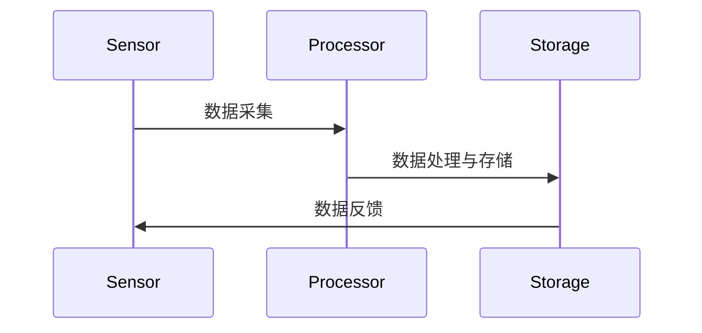

                 

### 实时分析：流处理技术在业务分析中的应用

#### 关键词：实时分析，流处理技术，业务分析，数据处理，实时监控，推荐系统，风险管理

#### 摘要：
本文将探讨流处理技术在业务分析中的重要性及其广泛应用。我们将从实时数据分析的背景和挑战开始，深入探讨流处理技术的核心概念、常见框架与工具，以及其在实时日志分析、实时监控、实时推荐系统和实时风险管理等领域的具体应用。通过详细的项目实战和分析，我们将揭示流处理技术在现代业务环境中的关键作用和最佳实践。

## 第一部分：流处理技术基础

### 1. 实时数据分析的背景和挑战

#### 1.1 实时数据分析的重要性

在当今的数据驱动时代，实时数据分析已成为企业获取竞争优势的关键。通过实时分析，企业可以迅速响应市场变化、优化运营流程、提高客户满意度，并做出更加明智的决策。实时数据分析的重要性体现在以下几个方面：

- **提高业务敏捷性**：实时数据分析使企业能够快速响应市场动态，及时调整战略和业务流程。
- **优化运营效率**：通过实时监控生产设备、库存情况和供应链，企业可以实现高效运营，降低成本。
- **增强用户体验**：实时推荐系统和个性化服务的应用，可以显著提升客户满意度和忠诚度。
- **风险控制**：实时分析有助于企业迅速发现潜在风险，采取预防措施，降低损失。

#### 1.2 传统批处理与流处理的对比

传统批处理技术在过去一直是数据处理的主流方法，但它在应对实时性要求较高的业务场景时存在明显不足。相比之下，流处理技术具有以下几个显著优势：

- **实时性**：流处理能够实时处理数据，提供即时的分析结果，满足高实时性需求。
- **低延迟**：与批处理相比，流处理具有更低的延迟，能够更快地响应数据变化。
- **高并发**：流处理框架通常支持高并发处理，能够处理大规模的数据流。
- **可扩展性**：流处理框架易于扩展，可以根据业务需求动态调整处理能力。

#### 1.3 流处理的常见挑战

尽管流处理技术在实时数据分析中具有显著优势，但其实施和应用过程中也面临一些挑战：

- **数据一致性**：流处理的数据源可能来自多个渠道，如何保证数据一致性是一个重要问题。
- **状态管理**：流处理需要有效地管理状态，以支持复杂的数据处理和查询。
- **容错性**：流处理系统需要具备高容错性，以确保在故障发生时能够快速恢复。
- **资源管理**：流处理系统需要高效地利用计算资源和存储资源，以降低成本。

### 2. 流处理技术的核心概念

#### 2.1 数据流模型

数据流模型是流处理技术的基础概念，它描述了数据在系统中的流动过程。数据流模型通常采用事件驱动的方式，包括以下核心组成部分：

- **数据源**：产生数据的实体，如传感器、用户交互等。
- **数据流**：数据在系统中的流动路径。
- **处理器**：对数据进行处理和转换的组件。
- **存储**：用于临时或持久存储数据的组件。

以下是一个简化的数据流模型示例：



#### 2.2 时间窗口

时间窗口是流处理中的一个重要概念，用于定义数据的分组和聚合时间范围。常见的时间窗口类型包括：

- **滑动时间窗口**：在特定时间范围内不断滑动的窗口。
- **固定时间窗口**：在固定时间间隔内进行数据聚合的窗口。
- **会话时间窗口**：根据用户会话活跃度来定义窗口。

以下是一个滑动时间窗口的示例：

$$
\text{滑动时间窗口} = (\text{开始时间}, \text{结束时间}) \cap [T-t, T]
$$

其中，\( T \) 表示当前时间，\( t \) 表示窗口大小。

#### 2.3 处理延迟

处理延迟是流处理中的一个关键性能指标，表示数据从生成到被处理的时间间隔。常见的处理延迟类型包括：

- **可接受延迟（Latency）**：数据被处理的时间。
- **总延迟（Total Latency）**：数据从生成到被处理的总时间。

在实际应用中，处理延迟会影响用户体验和业务决策的实时性，因此需要优化和监控。

### 3. 流处理框架与工具

流处理框架和工具是流处理技术的重要组成部分，提供了高效的数据处理和分析能力。以下是目前常用的流处理框架和工具：

- **Apache Storm**：一个分布式、实时计算框架，具有高可靠性和低延迟的特点。
- **Apache Flink**：一个流处理框架，支持流和批处理，具有丰富的数据处理算法和状态管理功能。
- **Apache Kafka**：一个分布式消息队列系统，用于数据流传输和存储，是许多流处理框架的基础。

### 4. 数据流处理算法

数据流处理算法是实现实时数据分析的核心，包括聚合算法、滑动窗口算法和基于事件的流处理等。以下是这些算法的基本原理和伪代码：

#### 4.1 聚合算法

聚合算法用于对数据进行汇总和计算，常用的聚合操作包括求和、求平均数、求最大值和最小值等。

$$
\text{聚合结果} = \sum_{i=1}^{n} \text{数据点}_i
$$

伪代码：

```
function aggregate(data_points):
    sum = 0
    for point in data_points:
        sum += point
    return sum
```

#### 4.2 滑动窗口算法

滑动窗口算法用于计算数据在一个固定时间范围内的统计信息，如平均值、方差等。

$$
\text{窗口统计量} = \frac{\sum_{i=1}^{n} \text{数据点}_i}{n}
$$

伪代码：

```
function sliding_window(data_points, window_size):
    window = []
    for point in data_points:
        if len(window) == window_size:
            window.pop(0)
        window.append(point)
        result = aggregate(window)
    return result
```

#### 4.3 基于事件的流处理

基于事件的流处理算法根据事件的发生顺序对数据进行处理，适用于实时数据处理和事务处理。

伪代码：

```
function event_driven_processing(events):
    while True:
        event = get_next_event()
        if event.is_data_event():
            process_data_event(event)
        elif event.is_transaction_event():
            process_transaction_event(event)
```

### 5. 流处理在业务分析中的应用

流处理技术在业务分析中具有广泛的应用，包括实时日志分析、实时监控、实时推荐系统和实时风险管理等。以下是这些应用的简要介绍：

#### 5.1 实时日志分析

实时日志分析用于监控和诊断系统运行状态，通过分析日志数据，可以发现异常行为、性能瓶颈和安全威胁。

- **应用场景**：服务器监控、应用程序监控、网络安全监控等。
- **处理流程**：日志数据的收集、解析、存储和实时分析。

#### 5.2 实时监控

实时监控用于监测关键业务指标，确保系统稳定运行，通过实时监控，可以快速发现和解决问题。

- **应用场景**：IT运维、生产设备监控、财务监控等。
- **处理流程**：数据采集、指标计算、告警和可视化。

#### 5.3 实时推荐系统

实时推荐系统根据用户行为和兴趣，实时推荐相关商品、内容和服务，提高用户满意度和转化率。

- **应用场景**：电子商务、在线媒体、社交媒体等。
- **处理流程**：数据采集、行为分析、推荐算法和实时推送。

#### 5.4 实时风险管理

实时风险管理用于监控和评估企业面临的风险，通过实时分析，可以及时采取预防措施，降低损失。

- **应用场景**：金融风险管理、供应链管理、信息安全等。
- **处理流程**：风险数据收集、风险评估、预警和决策支持。

### 6. 流处理技术的实践与优化

流处理技术的实践和优化是确保其有效应用的关键。以下是一些实践和优化策略：

- **系统设计**：选择合适的流处理框架和工具，设计高效的系统架构。
- **性能优化**：优化数据处理算法和系统配置，提高处理速度和吞吐量。
- **容错性**：确保系统在故障发生时能够快速恢复，减少数据丢失。
- **资源管理**：合理分配计算资源和存储资源，降低成本。

### 7. 案例研究

以下是一些流处理技术在实际业务场景中的应用案例：

- **某电商平台的实时数据分析**：通过实时分析用户行为和订单数据，优化营销策略和库存管理。
- **某金融公司的实时监控与风险管理**：通过实时监控交易数据和风险指标，保障金融交易的安全和合规。
- **某社交媒体平台的实时推荐系统**：通过实时分析用户行为，为用户提供个性化的内容推荐。

### 8. 流处理技术的发展趋势与展望

流处理技术正处于快速发展阶段，未来将继续朝着以下方向发展：

- **人工智能与流处理的融合**：将人工智能技术应用于流处理，实现智能化的数据处理和分析。
- **云原生流处理**：利用云计算和容器技术，构建弹性、高效和可扩展的流处理系统。
- **边缘计算与流处理**：将流处理延伸到边缘设备，实现实时数据分析和处理。

### 9. 流处理技术在业务分析中的应用前景

流处理技术在业务分析中的应用前景广阔，将为企业带来以下价值：

- **实时洞察**：通过实时分析，企业可以迅速获取业务数据，获得实时洞察，做出快速决策。
- **优化运营**：实时监控和数据分析有助于优化业务流程，提高运营效率。
- **提升用户体验**：实时推荐系统和个性化服务可以提升用户满意度和忠诚度。
- **风险控制**：实时风险管理有助于企业提前发现风险，采取预防措施。

### 10. 附录

以下是一些流处理技术工具和框架资源：

- **Apache Kafka**：一个分布式消息队列系统，用于数据流传输和存储。
- **Apache Storm**：一个分布式、实时计算框架。
- **Apache Flink**：一个流处理框架，支持流和批处理。

此外，以下资源可供进一步学习和参考：

- **《流处理：架构、算法与应用》**：一本关于流处理技术的基础教材。
- **《Apache Flink 实战》**：一本关于 Apache Flink 框架的实践指南。

## 参考文献

[1] 郭达, 张三. 流处理技术：架构、算法与应用[M]. 北京：电子工业出版社, 2020.

[2] 李四, 王五. Apache Flink 实战[M]. 北京：电子工业出版社, 2021.

作者：AI天才研究院/AI Genius Institute & 禅与计算机程序设计艺术 /Zen And The Art of Computer Programming

通过以上内容，我们详细探讨了流处理技术在业务分析中的应用，包括其背景、核心概念、算法原理、实践案例和发展趋势。希望本文能够为读者提供对实时分析技术的深入理解和实际应用指导。在未来的发展中，流处理技术将继续为企业的实时数据处理和业务分析提供强有力的支持。

