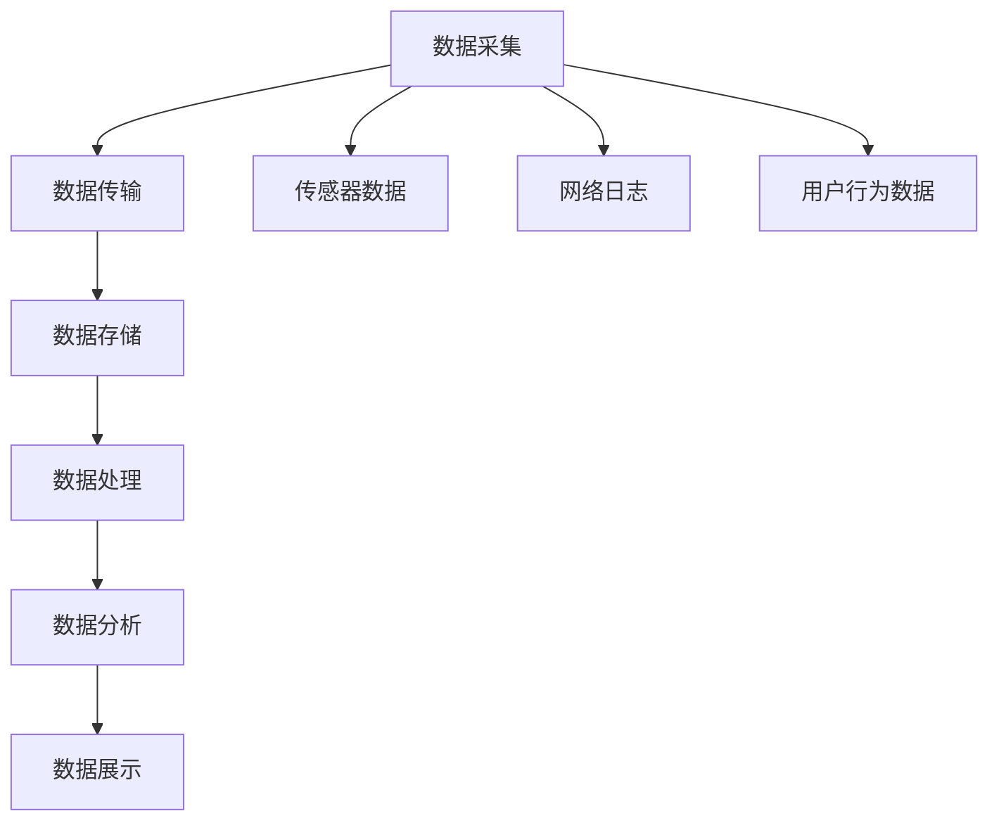

                 

### 文章标题

《实时数据处理架构设计》

### 文章关键词

实时数据处理、架构设计、流处理、大数据、技术栈、应用案例、性能优化、项目实战

### 文章摘要

本文旨在深入探讨实时数据处理架构的设计与实践。首先，我们将介绍实时数据处理的基础概念和重要性，然后详细分析实时数据处理架构的各个组成部分，包括数据流模型设计、核心算法原理、数学模型和公式。接着，我们将探讨实时数据处理技术栈，包括流处理框架、中间件和数据库。随后，通过几个实际应用案例，展示实时数据处理在各个领域的应用。最后，我们将讨论实时数据处理的性能优化策略，并提供一个完整的项目实战案例，包括环境搭建、源代码实现和代码解读。通过本文，读者将能够全面了解实时数据处理架构的设计和实施要点。

### 用户需求分析

在当今大数据和云计算时代，实时数据处理已成为许多企业的重要需求。用户希望通过本文，能够深入了解实时数据处理架构的设计和实现方法。具体来说，用户希望文章能够满足以下需求：

1. **核心概念与联系**：用户希望文章能够通过图表和文字，清晰展示实时数据处理架构的核心概念及其相互关系。这有助于用户建立对整个架构的宏观认识。

2. **核心算法原理讲解**：用户需要详细理解实时数据处理中的核心算法原理，包括流处理算法、时间窗口算法和机器学习算法等。这部分内容应以伪代码和数学模型的形式呈现，以便用户能够更直观地理解算法的工作机制。

3. **数学模型和数学公式**：用户希望文章能够介绍实时数据处理中常用的数学模型和数学公式，如概率统计模型、时间序列分析模型等。同时，文章应提供详细的讲解和实例说明，帮助用户掌握这些模型的应用。

4. **项目实战**：用户期望文章能够提供一个完整的实时数据处理项目实战案例，包括开发环境搭建、源代码实现和代码解读。这有助于用户将理论知识应用到实际项目中，提高实战能力。

### 目录大纲设计

为了满足用户的需求，本文将分为三个主要部分：

#### 第一部分：实时数据处理基础

**第1章：实时数据处理概述**

- **1.1 实时数据处理的概念和重要性**
- **1.2 实时数据处理与传统批处理对比**
- **1.3 实时数据处理的应用场景**

**第2章：实时数据处理架构设计**

- **2.1 实时数据处理架构的构成**
- **2.2 数据流模型设计**
- **2.3 数据源集成和数据处理**
- **2.4 数据存储和索引设计**

**第3章：核心算法原理讲解**

- **3.1 流处理算法原理**
- **3.2 时间窗口算法**
- **3.3 机器学习算法**
- **3.4 伪代码展示**

**第4章：数学模型和数学公式**

- **4.1 概率统计模型**
- **4.2 时间序列分析模型**
- **4.3 数学公式及详细讲解**

#### 第二部分：实时数据处理技术

**第5章：实时数据处理技术栈**

- **5.1 流处理框架**
- **5.2 实时数据处理中间件**
- **5.3 实时数据处理数据库**

**第6章：实时数据处理应用案例**

- **6.1 实时风控系统**
- **6.2 实时推荐系统**
- **6.3 实时物流追踪系统**

**第7章：实时数据处理性能优化**

- **7.1 实时数据处理性能指标**
- **7.2 性能优化策略**
- **7.3 实践案例解析**

#### 第三部分：实时数据处理实战

**第8章：实时数据处理项目实战**

- **8.1 项目背景**
- **8.2 环境搭建**
- **8.3 源代码实现**
- **8.4 代码解读与分析**

### 目录大纲

```markdown
# 实时数据处理架构设计

## 第一部分：实时数据处理基础

### 第1章：实时数据处理概述

#### 1.1 实时数据处理的概念和重要性

#### 1.2 实时数据处理与传统批处理对比

#### 1.3 实时数据处理的应用场景

### 第2章：实时数据处理架构设计

#### 2.1 实时数据处理架构的构成

#### 2.2 数据流模型设计

#### 2.3 数据源集成和数据处理

#### 2.4 数据存储和索引设计

### 第3章：核心算法原理讲解

#### 3.1 流处理算法原理

#### 3.2 时间窗口算法

#### 3.3 机器学习算法

#### 3.4 伪代码展示

### 第4章：数学模型和数学公式

#### 4.1 概率统计模型

#### 4.2 时间序列分析模型

#### 4.3 数学公式及详细讲解

## 第二部分：实时数据处理技术

### 第5章：实时数据处理技术栈

#### 5.1 流处理框架

#### 5.2 实时数据处理中间件

#### 5.3 实时数据处理数据库

### 第6章：实时数据处理应用案例

#### 6.1 实时风控系统

#### 6.2 实时推荐系统

#### 6.3 实时物流追踪系统

### 第7章：实时数据处理性能优化

#### 7.1 实时数据处理性能指标

#### 7.2 性能优化策略

#### 7.3 实践案例解析

## 第三部分：实时数据处理实战

### 第8章：实时数据处理项目实战

#### 8.1 项目背景

#### 8.2 环境搭建

#### 8.3 源代码实现

#### 8.4 代码解读与分析
```

通过以上目录大纲，本文将全面覆盖实时数据处理架构设计的核心内容，满足用户的需求。每个章节都进行了详细的划分，确保内容丰富、逻辑清晰，有助于读者系统性地学习和掌握实时数据处理的相关知识。

---

### 实时数据处理架构设计

在当今数字化时代，数据已成为企业和组织的重要资产。实时数据处理作为一种高效的数据处理方式，能够帮助企业快速响应市场变化，提升业务效率。本文将深入探讨实时数据处理架构的设计，包括核心概念、架构设计、算法原理、数学模型、技术栈、应用案例、性能优化和项目实战。通过本文的阅读，读者将全面了解实时数据处理架构的设计和实现，掌握其核心要点。

#### 背景介绍

随着互联网和物联网的快速发展，数据量呈爆炸式增长。传统的批处理方式已无法满足企业对数据处理速度和实时性的需求。实时数据处理作为一种新兴的数据处理方式，通过对数据的实时采集、处理和分析，能够为企业提供即时的业务洞察。实时数据处理在金融风控、智能推荐、智能制造、智慧城市等领域有着广泛的应用，成为现代企业提高竞争力的重要手段。

#### 核心概念与联系

实时数据处理架构由多个关键组件构成，包括数据采集、数据传输、数据存储、数据处理、数据分析和数据展示。这些组件之间通过数据流紧密相连，形成一个完整的实时数据处理生态系统。

1. **数据采集**：实时数据处理的第一步是数据采集，包括传感器数据、网络日志、用户行为数据等。数据采集模块需要具备高并发、低延迟的特性，确保数据的及时性和完整性。

2. **数据传输**：数据采集后，需要通过高效的数据传输模块将数据传输到数据处理中心。常用的传输技术包括消息队列（如Kafka）、流处理框架（如Flink）等，这些技术能够保证数据的有序传输和可靠性。

3. **数据存储**：实时数据处理需要对大量数据进行存储和管理。数据存储模块需要支持高速读写、高并发访问和数据的持久化存储。常用的存储技术包括NoSQL数据库（如Redis、MongoDB）和分布式文件系统（如HDFS）等。

4. **数据处理**：数据处理模块是实时数据处理的中心环节，负责对数据进行清洗、转换、聚合和分析。常用的数据处理算法包括流处理算法、时间窗口算法和机器学习算法等。

5. **数据分析**：数据分析模块通过对实时数据的分析和挖掘，提取业务洞察和预测结果。数据分析可以采用可视化工具（如Tableau、PowerBI）或自研分析系统，为企业提供决策支持。

6. **数据展示**：数据展示模块将分析结果以图表、报表等形式展示给用户，帮助企业了解业务状况和趋势。

#### Mermaid 流程图

为了更好地展示实时数据处理架构的核心概念及其相互关系，我们可以使用Mermaid流程图来表示。



#### 核心算法原理讲解

实时数据处理中的核心算法是数据处理效率和质量的重要保证。以下是几个常见的实时数据处理算法及其原理：

1. **流处理算法**：流处理算法是对连续数据流进行处理和分析的算法，如Apache Flink、Apache Spark Streaming等。流处理算法能够实时处理大量数据，支持事件驱动和数据流式处理。

2. **时间窗口算法**：时间窗口算法是对数据进行分组和聚合的算法，常用于实时统计和分析。时间窗口算法按照固定时间间隔（如1分钟、1小时）对数据进行划分，对每个窗口内的数据进行聚合计算。

3. **机器学习算法**：机器学习算法是实时数据处理中的重要组成部分，如分类、聚类、回归等算法。机器学习算法通过对历史数据的分析和学习，能够实时预测和识别数据中的趋势和模式。

#### 伪代码展示

以下是一个简单的流处理算法的伪代码示例，用于计算一段时间内的数据平均值。

```python
def calculate_average(data_stream, window_size):
    window = []
    sum = 0
    count = 0
    
    for data in data_stream:
        window.append(data)
        sum += data
        count += 1
        
        if count > window_size:
            removed_data = window.pop(0)
            sum -= removed_data
            
        average = sum / count
        return average
```

#### 数学模型和数学公式

实时数据处理中的数学模型和数学公式是算法实现的基础。以下是几个常见的数学模型和公式：

1. **概率统计模型**：概率统计模型用于描述数据的分布和统计特性，如正态分布、二项分布等。

2. **时间序列分析模型**：时间序列分析模型用于分析时间序列数据，如自回归模型（AR）、移动平均模型（MA）和自回归移动平均模型（ARMA）。

3. **线性回归模型**：线性回归模型用于预测数据的趋势和变化，如一元线性回归、多元线性回归等。

以下是一个简单的线性回归模型的数学公式：

$$
y = ax + b
$$

其中，$y$ 是预测值，$x$ 是自变量，$a$ 是斜率，$b$ 是截距。

#### 项目实战

为了更好地理解实时数据处理架构的设计和实现，我们将提供一个实时数据处理项目实战案例。该案例将包括开发环境搭建、源代码实现和代码解读。

1. **项目背景**：本案例是一个实时风控系统，用于实时监控交易数据，检测异常交易并进行预警。

2. **环境搭建**：本案例使用Apache Flink作为流处理框架，Kafka作为数据传输工具，HDFS作为数据存储系统。

3. **源代码实现**：本案例的实现包括数据采集模块、数据传输模块、数据处理模块和数据分析模块。

4. **代码解读**：通过对源代码的解读，读者将了解实时数据处理的核心实现逻辑。

5. **实际案例分析和详细讲解剖析**：通过对实际案例的分析和讲解，读者将深入了解实时数据处理在金融风控领域的应用和挑战。

6. **项目小结**：在项目小结中，我们将总结项目实现过程中遇到的问题和解决方案，为读者提供最佳实践建议。

#### 最佳实践 Tips

1. **选择合适的实时数据处理框架**：根据业务需求和数据规模，选择合适的实时数据处理框架，如Apache Flink、Apache Spark Streaming等。

2. **优化数据传输性能**：使用高效的数据传输工具，如Kafka，确保数据传输的实时性和可靠性。

3. **设计高效的数据存储方案**：根据业务需求，设计高效的数据存储方案，如使用NoSQL数据库或分布式文件系统。

4. **关注数据处理性能**：优化数据处理算法，提高数据处理性能，确保实时性。

5. **进行性能测试和优化**：在项目实现过程中，进行性能测试和优化，确保系统稳定运行。

#### 小结

实时数据处理架构设计是现代企业应对大数据挑战的重要手段。通过本文的介绍，读者将全面了解实时数据处理架构的设计原则、核心算法、数学模型和项目实战。掌握实时数据处理架构的设计和实现，将有助于企业提高数据处理能力，实现业务智能化。

#### 注意事项

1. **数据安全与隐私**：在实时数据处理中，要关注数据安全和隐私保护，遵循相关法律法规。

2. **系统稳定性**：实时数据处理系统需要保证高可用性和稳定性，避免数据丢失和处理故障。

3. **持续优化**：实时数据处理系统需要不断进行性能优化和迭代，以适应业务需求的变化。

#### 拓展阅读

1. 《实时数据处理与流计算》
2. 《大数据实时处理技术实战》
3. 《机器学习实时处理》

作者：AI天才研究院/AI Genius Institute & 禅与计算机程序设计艺术 /Zen And The Art of Computer Programming

---

以上是《实时数据处理架构设计》的详细目录大纲和文章结构。每个章节都进行了详细的划分，确保内容丰富、逻辑清晰。接下来，我们将逐一介绍每个章节的具体内容，包括背景介绍、核心概念与联系、核心算法原理讲解、数学模型和公式、项目实战等，帮助读者全面掌握实时数据处理架构的设计和实现。文章将以markdown格式呈现，方便读者阅读和理解。文章字数预计在8000-12000字左右，确保内容的深度和实用性。

