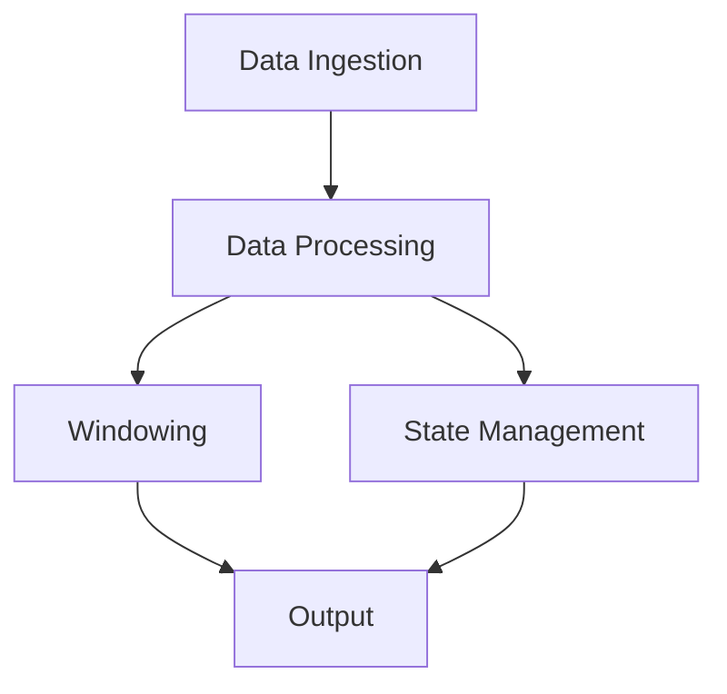

                 

### Introduction to Real-Time Data Processing

#### Background

In the modern digital era, the volume of data generated every second is immense, and this trend is only expected to grow. Traditional data processing methods, such as batch processing, have been widely used for years. However, as the need for real-time insights and decision-making grows, the limitations of batch processing have become increasingly evident. Batch processing involves processing large volumes of data in fixed intervals, typically hours or days. This approach is efficient for certain use cases, such as data warehousing and reporting, but it falls short when it comes to providing immediate insights and enabling real-time decision-making.

#### Definition

Real-time data processing refers to the ability to process data as it is generated, providing immediate results and insights. Unlike batch processing, which processes data in fixed intervals, real-time data processing operates continuously, handling data streams in real-time. This allows organizations to react swiftly to changes in data, making it ideal for applications that require immediate action or responses.

#### Importance

The importance of real-time data processing cannot be overstated. Here are a few key reasons why real-time data processing is crucial for modern businesses:

1. **Improved Decision-Making:** Real-time data processing allows organizations to make informed decisions based on the most up-to-date information, enabling them to respond quickly to changing market conditions and customer needs.
2. **Increased Operational Efficiency:** By processing data in real-time, organizations can identify and resolve issues more quickly, reducing downtime and improving overall operational efficiency.
3. **Enhanced Customer Experience:** Real-time data processing enables personalized and context-aware customer experiences, improving customer satisfaction and loyalty.
4. ** Competitive Advantage:** Organizations that leverage real-time data processing gain a competitive edge by being able to respond to market changes and customer needs more quickly than their competitors.

#### Challenges

While real-time data processing offers many advantages, it also comes with its own set of challenges:

1. **Scalability:** Processing large volumes of data in real-time requires scalable infrastructure and algorithms to ensure consistent performance.
2. **Latency:** Minimizing latency is crucial for real-time data processing. High latency can lead to delayed insights and decisions, reducing the effectiveness of real-time processing.
3. **Data Quality:** Ensuring data quality in real-time processing is challenging due to the high volume and velocity of data streams.
4. **Complexity:** Real-time data processing involves complex systems and technologies, requiring specialized knowledge and expertise to implement and maintain.

In conclusion, real-time data processing is an essential component of modern data analytics and decision-making. By overcoming the challenges and leveraging the benefits of real-time data processing, organizations can gain a competitive advantage, improve operational efficiency, and enhance customer experiences. The following sections of this article will delve deeper into the core concepts, architectures, and applications of real-time data processing, providing a comprehensive understanding of this critical technology.

### Core Concepts of Stream Processing

#### Definition and Overview

Stream processing is a method of processing data as it arrives, in real-time, rather than batching it together and processing it in large chunks. This approach allows for the continuous analysis and manipulation of data streams, enabling organizations to react quickly to changing conditions and events. At its core, stream processing involves capturing, processing, and analyzing data in a continuous and incremental manner.

#### Key Concepts

1. **Data Stream:** A data stream is a continuous sequence of data records that are generated and consumed over time. These records can represent various types of data, such as sensor readings, financial transactions, social media posts, or click events.

2. **Event Time:** Event time is the timestamp associated with the actual occurrence of an event. In contrast, processing time is the timestamp at which the event is processed. Event time is critical for ensuring that data is processed in the correct order, especially when dealing with data streams that may have varying latency or delays.

3. **Watermarks:** Watermarks are a mechanism used in stream processing to handle out-of-order events and ensure that data is processed in the correct order. A watermark represents a marker in the data stream that indicates the latest event time that has been fully processed. By using watermarks, stream processing systems can handle events that arrive late or out of order without losing data integrity.

4. **Windowing:** Windowing is a technique used to partition data streams into time-based or event-based segments. This allows for the aggregation and analysis of data over specific time intervals or event counts. Common window types include tumbling windows (where each window overlaps with the previous one), sliding windows (where each window is a fixed size and moves by a fixed interval), and session windows (where windows are defined by periods of inactivity).

5. **State Management:** State management is the process of maintaining and updating the state of data as it is processed. In stream processing, state management is crucial for ensuring accurate and consistent results. State can represent a variety of data, such as aggregate values, counts, or rankings, and is often stored in a distributed, fault-tolerant manner.

#### Relationship and Architecture

To understand the relationship between these key concepts, let's consider a simplified architecture of a stream processing system:

1. **Data Ingestion:** Data streams are ingested into the system via various sources, such as sensors, APIs, or log files. These data streams are then divided into smaller chunks or records for processing.

2. **Data Processing:** The data is processed using a stream processing engine, such as Apache Kafka, Apache Flink, or Apache Spark Streaming. This processing involves applying transformations, filtering, and aggregation operations to the data streams.

3. **Windowing and State Management:** As the data is processed, windowing and state management techniques are applied to group and maintain the state of data over specific intervals or conditions. This ensures that data is processed in the correct order and allows for efficient aggregation and analysis.

4. **Output:** The processed data is then outputted to various destinations, such as databases, data warehouses, or real-time dashboards. This output can be used for real-time analytics, alerting, or decision-making.

To visualize the relationship between these concepts, we can use a Mermaid flowchart:

In this flowchart, data ingestion represents the input of data streams, data processing represents the application of transformations and filters, windowing represents the partitioning of data into time-based segments, state management represents the maintenance of data states, and output represents the final destination of the processed data.

### Example of Stream Processing

Consider a scenario where a company wants to monitor customer behavior on their website in real-time. The data stream consists of click events, including the URL, timestamp, and user ID. The company wants to analyze customer behavior by tracking the time spent on each page, identifying popular pages, and detecting potential issues or anomalies in the user experience.

1. **Data Ingestion:** Click events are ingested into the stream processing system as data streams.

2. **Data Processing:** The data is processed using a stream processing engine, such as Apache Kafka or Apache Flink. The following transformations are applied:
    - Filter out events with invalid URLs or timestamps.
    - Group events by user ID and URL.
    - Calculate the time spent on each page by subtracting the event timestamp from the page load timestamp.

3. **Windowing and State Management:** Windowing is applied to group events over specific time intervals, such as 5 minutes. State management is used to maintain the aggregate time spent on each page within the window.

4. **Output:** The processed data is outputted to a real-time dashboard, where the company can visualize the aggregate time spent on each page, identify popular pages, and detect potential issues or anomalies in the user experience.

By using stream processing, the company can gain real-time insights into customer behavior, enabling them to make data-driven decisions and improve the user experience.

In summary, stream processing is a critical component of real-time data processing. By understanding the core concepts and architecture of stream processing, organizations can leverage this technology to gain valuable insights and make informed decisions in real-time.

### Comparison of Stream Processing and Microservices

#### Background

Stream processing and microservices are two architectural paradigms that have gained significant traction in the world of modern data processing and application development. While both aim to improve scalability, flexibility, and maintainability, they serve different purposes and have distinct characteristics. Understanding the differences between stream processing and microservices is crucial for selecting the right technology for a specific use case.

#### Definition

1. **Stream Processing:** Stream processing is a method of processing data as it arrives, in real-time, rather than batching it together and processing it in large chunks. It is designed to handle continuous data streams and provides immediate results and insights. Stream processing is well-suited for applications that require real-time analysis, monitoring, and decision-making.
2. **Microservices:** Microservices is an architectural style that structures an application as a collection of loosely coupled services, each running in its own process and communicating with lightweight protocols, typically HTTP/REST. Microservices are designed to be scalable, maintainable, and deployable independently, enabling rapid development and deployment of complex applications.

#### Key Differences

1. **Data Processing vs. Application Development:**
   - **Stream Processing:** Stream processing is primarily focused on data processing and analysis, with the goal of providing real-time insights and decision-making capabilities.
   - **Microservices:** Microservices, on the other hand, is primarily focused on application development, enabling the creation of scalable, modular, and maintainable applications.

2. **Real-Time vs. Event-Driven:**
   - **Stream Processing:** Stream processing is designed for real-time data processing, handling continuous data streams and providing immediate results. It is well-suited for applications that require real-time analytics, monitoring, and decision-making.
   - **Microservices:** Microservices, while not inherently tied to real-time processing, are often used in event-driven architectures, where events trigger specific microservices to perform actions or processes. Microservices can handle both real-time and batch processing, depending on the use case.

3. **Single-Threaded vs. Multi-Threaded:**
   - **Stream Processing:** Stream processing typically operates on a single-threaded model, processing data streams sequentially. This ensures low latency and high throughput, but it may limit scalability and concurrency.
   - **Microservices:** Microservices can operate on a multi-threaded model, allowing multiple services to run concurrently and improving scalability and performance. This flexibility enables microservices to handle varying loads and workloads more efficiently.

4. **Monolithic vs. Modular:**
   - **Stream Processing:** Stream processing systems are often designed as monolithic architectures, where components are tightly coupled and difficult to modify or extend. While this can simplify development, it may limit scalability and flexibility.
   - **Microservices:** Microservices architectures are designed to be modular, with each microservice being loosely coupled and independent. This modularity enables easier development, testing, deployment, and scaling of individual services, making it easier to adapt to changing requirements and technology advancements.

5. **Complexity vs. Simplicity:**
   - **Stream Processing:** Stream processing systems can be complex, involving intricate data flow, state management, and fault tolerance mechanisms. However, this complexity is necessary to provide the low latency and high throughput required for real-time data processing.
   - **Microservices:** Microservices architectures are designed to be simple and easy to understand, with each microservice performing a specific, well-defined function. This simplicity makes it easier to develop, deploy, and maintain complex applications.

#### Use Cases

1. **Stream Processing:**
   - **Real-Time Analytics:** Real-time analytics and monitoring, such as fraud detection, stock price analysis, and sensor data processing.
   - **Event-Driven Applications:** Applications that rely on event-driven architectures, such as real-time bidding in advertising, real-time traffic monitoring, and chat applications.
   - **Data Integration:** Integrating data from various sources in real-time, such as social media feeds, IoT devices, and financial transactions.

2. **Microservices:**
   - **E-commerce:** Creating scalable, modular e-commerce platforms that can handle varying loads and workloads.
   - **Social Media:** Building scalable, distributed social media platforms that can handle millions of users and interactions.
   - **Financial Services:** Developing robust and scalable financial services applications, such as trading platforms, payment systems, and customer relationship management (CRM) systems.

In conclusion, stream processing and microservices are two distinct architectural paradigms with different focuses and use cases. Stream processing is designed for real-time data processing and analytics, while microservices are focused on modular, scalable application development. Understanding the differences between these two approaches can help organizations make informed decisions about which technology to use for specific use cases and requirements.

### Overview of Apache Kafka for Stream Processing

Apache Kafka is a distributed streaming platform that enables the real-time processing of large volumes of data streams. As one of the most popular stream processing tools, Kafka is widely used for building real-time data pipelines and streaming applications. In this section, we will provide an overview of Apache Kafka, including its architecture, components, and core features.

#### Architecture

Kafka's architecture is designed to be highly scalable, fault-tolerant, and performant. The architecture consists of several key components:

1. **Kafka Cluster:** A Kafka cluster is a collection of multiple Kafka brokers, which work together to process and store data streams. Each broker handles a subset of the data and replicates it across the cluster to ensure fault tolerance and high availability.
2. **Producer:** A producer is an application or service that generates data and sends it to Kafka topics. Producers are responsible for partitioning and distributing messages across the Kafka cluster.
3. **Consumer:** A consumer is an application or service that consumes data from Kafka topics. Consumers can process data in real-time or store it for later analysis. Consumers can also be partitioned and distributed across multiple nodes to ensure high throughput and scalability.
4. **Topic:** A topic is a stream of records, similar to a queue. Topics are categorized into partitions, which enable parallel processing and scalability. Each partition contains a sequence of messages, which are consumed and processed by consumers.
5. **Offset:** An offset is a unique identifier for each message within a topic and partition. It represents the position of a message within the partition and is used to ensure that consumers process messages in the correct order.

#### Components

1. **Kafka Producer API:** The Kafka Producer API allows applications to send data to Kafka topics. It provides a high-level abstraction for partitioning and distributing messages across the Kafka cluster, ensuring that messages are reliably sent and delivered.
2. **Kafka Consumer API:** The Kafka Consumer API allows applications to consume data from Kafka topics. It provides a low-level interface for processing messages in real-time or storing them for later analysis. Consumers can be configured to process messages in parallel or in a specific order, depending on the use case.
3. **Kafka Streams API:** The Kafka Streams API is a high-level, Java-based stream processing library that simplifies the development of real-time stream processing applications. It provides a fluent, functional programming model for building complex stream processing pipelines, including transformations, aggregations, and windowing.
4. **Kafka Connect:** Kafka Connect is a framework for building and managing data pipelines between Kafka and external systems. It enables the integration of data from various sources, such as databases, data warehouses, and data lakes, into Kafka topics for real-time processing.

#### Core Features

1. **High Throughput and Scalability:** Kafka is designed to handle high volumes of data streams, with the ability to scale horizontally by adding more brokers to the cluster. This enables it to handle large-scale data processing workloads and ensures high throughput and low latency.
2. **Fault Tolerance and High Availability:** Kafka ensures fault tolerance and high availability through replication and distributed architecture. Data is replicated across multiple brokers in the cluster, so that even if a broker fails, the data remains available and the system continues to operate.
3. **Low Latency and High Performance:** Kafka is optimized for low latency and high performance, making it ideal for real-time data processing and analytics. It achieves low latency through its distributed architecture, efficient data storage, and optimized I/O operations.
4. **Scalable and Modular Architecture:** Kafka's modular architecture enables it to be easily integrated with other tools and technologies in the data processing ecosystem. This makes it a flexible and scalable solution for building complex real-time data processing pipelines.
5. **Kafka Streams API for Real-Time Stream Processing:** The Kafka Streams API provides a high-level, Java-based stream processing library that simplifies the development of real-time stream processing applications. It supports complex stream processing operations, including transformations, aggregations, and windowing, making it easy to build scalable and efficient real-time data processing pipelines.

In conclusion, Apache Kafka is a powerful and widely-used stream processing platform that enables the real-time processing of large volumes of data streams. Its distributed architecture, fault tolerance, high availability, and high performance make it an ideal choice for building real-time data pipelines and streaming applications. The following sections will delve deeper into Kafka's architecture, components, and use cases, providing a comprehensive understanding of this critical technology.

### Apache Kafka Architecture and Components

Apache Kafka is a distributed streaming platform that enables the real-time processing of large volumes of data streams. Its architecture is designed to be highly scalable, fault-tolerant, and performant. In this section, we will explore the key components of Kafka's architecture and their roles in the system.

#### Kafka Cluster

A Kafka cluster is a collection of multiple Kafka brokers, which work together to process and store data streams. Each broker handles a subset of the data and replicates it across the cluster to ensure fault tolerance and high availability. The main roles of a Kafka cluster include:

1. **Broker:** A broker is a Kafka server that handles incoming and outgoing data streams. It maintains metadata about topics, partitions, and offsets, and routes messages to the appropriate partitions based on the producer's configuration. A Kafka cluster can have multiple brokers, which work together to ensure high availability and load balancing.
2. **Topic:** A topic is a stream of records, similar to a queue. Topics are categorized into partitions, which enable parallel processing and scalability. Each partition contains a sequence of messages, which are consumed and processed by consumers.
3. **Partition:** A partition is a logical division of a topic, which allows messages to be distributed across the Kafka cluster. Partitions enable parallel processing and improve scalability and throughput, as multiple consumers can process messages concurrently.
4. **Offset:** An offset is a unique identifier for each message within a topic and partition. It represents the position of a message within the partition and is used to ensure that consumers process messages in the correct order.

#### Data Flow

The flow of data through Kafka involves several key components:

1. **Producer:** A producer is an application or service that generates data and sends it to Kafka topics. Producers are responsible for partitioning and distributing messages across the Kafka cluster. They can be configured to use a custom partitioning strategy, such as round-robin or hash-based partitioning, to ensure even distribution of messages.
2. **Topic:** Topics are streams of records that are ingested and processed by Kafka brokers. Topics are categorized into partitions, which enable parallel processing and scalability. Each partition contains a sequence of messages, which are consumed and processed by consumers.
3. **Consumer:** A consumer is an application or service that consumes data from Kafka topics. Consumers can process data in real-time or store it for later analysis. Consumers can also be partitioned and distributed across multiple nodes to ensure high throughput and scalability. They use offsets to track the position of messages within partitions and ensure that messages are processed in the correct order.
4. **Offset Commit:** Consumers use offset commit to store their progress and ensure that they do not re-process messages. Offset commit is a process where consumers save their current position within a partition, allowing them to resume processing from the last saved position in case of failures or restarts.

#### Replication and Fault Tolerance

Kafka's architecture is designed to be highly fault-tolerant, ensuring that data remains available and the system continues to operate even in the face of failures. The main mechanisms for achieving fault tolerance include:

1. **Replication:** Kafka replicates data across multiple brokers in the cluster. Each partition has multiple replicas, which are distributed across the cluster. This ensures that even if a broker fails, the data remains available and the system can continue to operate without interruption.
2. **Insync Replicas:** Insync replicas are replicas that are up-to-date with the latest data in the partition. Kafka ensures that at least one insync replica is available at all times, even if other replicas are temporarily unavailable due to network issues or failures.
3. **Controller:** The controller is a special broker that is responsible for managing the Kafka cluster. It monitors the health of brokers, assigns partitions to brokers, and handles replication and recovery tasks. If the controller fails, another broker is elected as the new controller to maintain cluster stability.

#### Key Components

1. **Kafka Producers:** Kafka producers are responsible for sending data to Kafka topics. They can be configured to use a custom partitioning strategy, such as round-robin or hash-based partitioning, to ensure even distribution of messages. Producers also handle message batching and compression to improve throughput and reduce network overhead.
2. **Kafka Consumers:** Kafka consumers are responsible for processing data from Kafka topics. They can be configured to use a custom deserialization strategy, such as JSON or Avro, to deserialize messages. Consumers use offsets to track their progress and ensure that messages are processed in the correct order.
3. **Kafka Streams API:** The Kafka Streams API is a high-level, Java-based stream processing library that simplifies the development of real-time stream processing applications. It provides a fluent, functional programming model for building complex stream processing pipelines, including transformations, aggregations, and windowing.
4. **Kafka Connect:** Kafka Connect is a framework for building and managing data pipelines between Kafka and external systems. It enables the integration of data from various sources, such as databases, data warehouses, and data lakes, into Kafka topics for real-time processing.

In conclusion, Apache Kafka's architecture is designed to be highly scalable, fault-tolerant, and performant. Its key components, including brokers, topics, partitions, and consumers, work together to enable the real-time processing of large volumes of data streams. The following sections will explore the use cases and applications of Kafka in real-time data processing.

### Introduction to Apache Flink for Stream Processing

Apache Flink is a powerful, distributed stream processing framework that enables the real-time processing of large volumes of data streams. As one of the most popular stream processing engines, Flink is widely used for building real-time data pipelines, streaming analytics, and machine learning applications. In this section, we will provide an overview of Apache Flink, including its architecture, components, and core features.

#### Architecture

Flink's architecture is designed to be highly scalable, fault-tolerant, and performant. The architecture consists of several key components:

1. **Job Manager:** The Job Manager is the central component of Flink that manages the distributed execution of jobs. It schedules tasks, coordinates resource allocation, and handles fault tolerance. The Job Manager can be deployed in a standalone mode or as a cluster manager, such as Apache Mesos or Kubernetes.
2. **Task Managers:** Task Managers are the worker nodes in the Flink cluster that execute the tasks defined in a job. They are responsible for data processing, task scheduling, and resource management. Multiple Task Managers work together to form a distributed, fault-tolerant execution environment.
3. **Data Stream:** A data stream is a continuous sequence of data records that Flink processes in real-time. Flink provides APIs for defining and processing data streams, including windowing, aggregation, and state management.
4. **State Backend:** The State Backend is a storage layer that manages the state of Flink jobs. It stores and persists the state of the program, allowing it to recover from failures and maintain consistency across the cluster.
5. **Checkpointing:** Checkpointing is a key mechanism in Flink for ensuring fault tolerance and consistency. It periodically saves the state of the program to a persistent storage layer, enabling recovery from failures and ensuring that the system remains consistent.

#### Components

1. **Flink APIs:** Flink provides several APIs for defining and processing data streams, including the DataStream API, the Table API, and the ML Library. The DataStream API is a low-level, event-driven API for processing data streams, while the Table API provides a higher-level, declarative API for defining and processing data transformations. The ML Library is a collection of machine learning algorithms that can be integrated with Flink jobs.
2. **Flink Producers and Consumers:** Flink provides built-in support for producers and consumers that can be used to read from and write to external systems, such as Apache Kafka, Apache Cassandra, and Apache HBase. Producers and consumers are responsible for ingesting and emitting data streams from and to external systems.
3. **Flink Connectors:** Flink Connectors are extensions that enable integration with external systems and data sources. Popular connectors include Kafka, Cassandra, HBase, Elasticsearch, and AWS S3.
4. **Flink Metrics:** Flink Metrics provide a set of tools for monitoring and tracking the performance of Flink jobs. Metrics can be used to monitor resource usage, data throughput, and latency, allowing operators to identify and resolve performance bottlenecks.
5. **Flink Monitoring and Management:** Flink provides built-in support for monitoring and managing job execution, including job status, resource usage, and performance metrics. Flink also supports integration with external monitoring tools, such as Prometheus and Grafana.

#### Core Features

1. **High Throughput and Scalability:** Flink is designed to handle large volumes of data streams with high throughput and low latency. Its distributed architecture and efficient data processing algorithms enable it to scale horizontally by adding more Task Managers to the cluster.
2. **Fault Tolerance and Consistency:** Flink ensures fault tolerance and consistency through its checkpointing mechanism. Checkpointing periodically saves the state of the program to a persistent storage layer, enabling recovery from failures and maintaining consistency across the cluster.
3. **Real-Time Windowing and Aggregation:** Flink provides advanced windowing and aggregation capabilities for real-time data processing. It supports various window types, such as tumbling, sliding, and session windows, allowing for efficient and flexible data processing and analysis.
4. **State Management and Caching:** Flink provides built-in support for state management and caching, allowing for efficient processing of large datasets and complex transformations. State management ensures that the state of Flink jobs is persisted and recoverable, while caching improves performance by reducing data access latency.
5. **Integration with Big Data Ecosystem:** Flink integrates seamlessly with the Hadoop ecosystem, including HDFS, YARN, and Apache Hive. This enables Flink to leverage existing infrastructure and tools for data processing, storage, and analytics.

In conclusion, Apache Flink is a powerful and widely-used stream processing framework that enables the real-time processing of large volumes of data streams. Its distributed architecture, fault tolerance, and high performance make it an ideal choice for building real-time data pipelines, streaming analytics, and machine learning applications. The following sections will delve deeper into Flink's architecture, components, and use cases, providing a comprehensive understanding of this critical technology.

### Architecture of Apache Flink

The architecture of Apache Flink is designed to be highly scalable, fault-tolerant, and performant, enabling the efficient processing of large volumes of data streams. The core components of Flink's architecture include the Job Manager, Task Managers, Data Stream, State Backend, and Checkpointing mechanism. In this section, we will explore the roles and interactions of these components in detail.

#### Job Manager

The Job Manager is the central component of Flink that manages the distributed execution of jobs. It performs several key functions:

1. **Job Submission and Scheduling:** The Job Manager receives job submissions from clients and schedules the execution of these jobs on the available Task Managers in the cluster. It ensures that jobs are assigned to appropriate resources based on their requirements and the current state of the cluster.
2. **Resource Allocation:** The Job Manager dynamically allocates resources to running tasks, ensuring that each task has enough memory and CPU resources to execute efficiently. It can scale resources up or down based on the load and performance requirements of the jobs.
3. **Fault Tolerance:** The Job Manager is responsible for monitoring the health of Task Managers in the cluster and handling failures. If a Task Manager fails, the Job Manager reassigns its tasks to other available Task Managers, ensuring that the execution of the job is not interrupted.
4. **Checkpointing Coordination:** The Job Manager coordinates the checkpointing process, ensuring that the state of the program is consistently saved across the cluster. It triggers checkpoints based on the configured interval and ensures that all Task Managers complete their checkpointing process before proceeding.

#### Task Managers

Task Managers are the worker nodes in the Flink cluster that execute the tasks defined in a job. They perform the following key functions:

1. **Task Execution:** Task Managers execute the tasks assigned to them by the Job Manager. Each task represents a specific computation or processing step in the data stream. Task Managers process data records, perform transformations, aggregations, and other operations as defined by the job.
2. **Data Streaming:** Task Managers handle the streaming of data between different stages of the job. They receive input data streams from producers, process the data, and emit output data streams to consumers. Task Managers use efficient data serialization and deserialization techniques to minimize latency and network overhead.
3. **Resource Management:** Task Managers manage their own resources, including memory and CPU. They dynamically adjust their resource usage based on the requirements of the tasks they are executing and the available resources in the cluster.
4. **Checkpointing:** Task Managers participate in the checkpointing process, saving their state to the State Backend and ensuring that the state of the program is consistent across the cluster. They also recover from checkpoints when needed, ensuring fault tolerance and consistency.

#### Data Stream

A data stream is a continuous sequence of data records that Flink processes in real-time. Flink's data stream architecture is designed to be highly scalable and flexible, supporting various types of data streams, including event streams, log streams, and sensor data streams. The key components of Flink's data stream architecture include:

1. **Producers:** Producers are applications or services that generate data and send it to Flink data streams. Producers can be configured to use a custom serialization format, such as JSON or Avro, and can be integrated with external systems, such as Apache Kafka, Apache Cassandra, and Apache HBase.
2. **Consumers:** Consumers are applications or services that consume data from Flink data streams. Consumers can process data in real-time or store it for later analysis. Consumers can also be integrated with external systems, allowing for seamless data processing and analytics workflows.
3. **Streams:** Streams represent the continuous flow of data through Flink. Flink provides a high-level, event-driven API for defining and processing data streams. Streams can be transformed, aggregated, and windowed to support complex data processing workflows.

#### State Backend

The State Backend is a storage layer that manages the state of Flink jobs. It stores and persists the state of the program, allowing it to recover from failures and maintain consistency across the cluster. Flink provides several types of State Backends, including:

1. **In-Memory State Backend:** The in-memory state backend stores the state of the program in the memory of the Task Managers. It provides fast access to state information but may be limited by the available memory resources.
2. **File System State Backend:** The file system state backend stores the state of the program on a distributed file system, such as HDFS or Amazon S3. It provides persistent storage and fault tolerance but may have higher access latency compared to the in-memory state backend.
3. ** RocksDB State Backend:** The RocksDB state backend uses the RocksDB key-value store to store the state of the program. It provides fast access to state information and can be scaled horizontally across multiple nodes.

#### Checkpointing

Checkpointing is a key mechanism in Flink for ensuring fault tolerance and consistency. It periodically saves the state of the program to a persistent storage layer, enabling recovery from failures and ensuring that the system remains consistent. The key components of Flink's checkpointing mechanism include:

1. **Triggering:** Checkpointing can be triggered manually or automatically based on a specified interval. The Job Manager is responsible for coordinating the triggering of checkpoints and ensuring that all Task Managers complete their checkpointing process.
2. **Snapshotting:** During checkpointing, Flink takes a snapshot of the state of the program, including the data streams, state information, and task progress. The snapshots are stored in the State Backend and can be used for recovery in case of failures.
3. **Recovery:** When a failure occurs, Flink uses the snapshots stored in the State Backend to recover the state of the program. The Job Manager coordinates the recovery process, ensuring that the system is consistent and that the execution of the job is resumed from the last completed checkpoint.

In conclusion, the architecture of Apache Flink is designed to be highly scalable, fault-tolerant, and performant, enabling the efficient processing of large volumes of data streams. The key components of Flink's architecture, including the Job Manager, Task Managers, Data Stream, State Backend, and Checkpointing mechanism, work together to provide a robust and flexible platform for real-time data processing and analytics.

### Flink Streaming Programming Model

The Flink Streaming Programming Model provides a high-level, event-driven API for defining and processing data streams. This model allows developers to build complex real-time data processing workflows using a simple and intuitive syntax. In this section, we will explore the key components and concepts of the Flink Streaming Programming Model, including data streams, transformations, windowing, and state management.

#### Data Streams

The core building block of the Flink Streaming Programming Model is the data stream. A data stream represents a continuous sequence of data records that Flink processes in real-time. Data streams can be generated by producers or ingested from external systems, such as Apache Kafka or Apache Kinesis. Flink provides a flexible and scalable data stream API that allows developers to define and manipulate data streams using a functional programming model.

1. **DataStream API:** The DataStream API is Flink's core API for processing data streams. It provides a set of high-level operations, such as map, filter, reduce, and aggregate, that allow developers to transform and process data streams in a declarative manner. The DataStream API hides the complexity of data stream processing, enabling developers to focus on the business logic of their application.
2. **Event Time:** Event time is the timestamp associated with the actual occurrence of an event in the data stream. Flink uses event time to ensure that data is processed in the correct order, especially when dealing with out-of-order events or delayed data. Event time processing is essential for applications that require accurate temporal analysis and real-time insights.
3. **Processing Time:** Processing time is the timestamp at which the event is processed by Flink. Processing time is useful for certain types of time-based operations and is often used in combination with event time processing.

#### Transformations

Transformations are operations that modify the data stream by applying various functions, filters, and aggregations. Flink provides a rich set of transformation operations that allow developers to build complex data processing workflows.

1. **Map:** The map operation applies a function to each element in the data stream and returns a new data stream with the transformed elements. This operation is useful for simple data manipulation and transformation tasks.
2. **Filter:** The filter operation selects elements from the data stream based on a specified condition and returns a new data stream containing only the matching elements. This operation is useful for filtering data based on specific criteria or constraints.
3. **Reduce:** The reduce operation aggregates elements in the data stream based on a specified key and a reduce function. This operation is useful for performing operations such as counting, summing, or averaging data streams based on a common key.
4. **Windowing:** Windowing is a transformation that groups elements in the data stream into time-based or event-based segments. Flink provides various types of windows, such as tumbling windows, sliding windows, and session windows, that allow developers to define and process data streams over specific intervals or conditions. Windowing is essential for performing time-based aggregations and analyses.

#### Windowing

Windowing is a critical concept in the Flink Streaming Programming Model, enabling developers to process data streams over specific time intervals or event counts. Flink provides several types of windows that support different use cases and requirements.

1. **Tumbling Windows:** Tumbling windows divide the data stream into fixed-size segments, where each segment overlaps with the previous one. Tumbling windows are useful for processing data streams in fixed-time intervals, such as every 5 minutes or every hour.
2. **Sliding Windows:** Sliding windows divide the data stream into fixed-size segments, where each segment is shifted by a fixed interval. Sliding windows are useful for processing data streams over specific time intervals, such as every 5 minutes sliding by 1 minute.
3. **Session Windows:** Session windows group elements in the data stream based on periods of inactivity. Session windows are useful for processing events that occur within specific time ranges or activity periods, such as user sessions on a website.

#### State Management

State management is a key feature of the Flink Streaming Programming Model, enabling developers to maintain and update the state of data as it is processed. State management is essential for performing complex data processing tasks, such as aggregations, time-based analyses, and event correlation.

1. **Keyed State:** Keyed state is a state that is associated with a specific key in the data stream. Flink provides several types of keyed state, such as ValueState, ListState, and ReduceState, that allow developers to maintain and update state information for each key in the data stream.
2. **Operator State:** Operator state is a state that is associated with a specific operator in the data stream processing pipeline. Flink provides a flexible and scalable operator state management API that allows developers to define and manage state information for complex data processing workflows.
3. **State Backend:** The State Backend is a storage layer that manages the persistence and recovery of state information in Flink. Flink provides several types of state backends, such as in-memory, file system, and RocksDB, that allow developers to choose the appropriate storage and recovery mechanism for their applications.

#### Example: Real-Time Stock Price Aggregation

Let's consider a real-world example of using the Flink Streaming Programming Model to process real-time stock price data.

1. **Data Ingestion:** Stock price data is ingested into Flink from external sources, such as financial exchanges or APIs, using Kafka producers.
2. **Transformation:** The data stream is transformed using the Flink DataStream API, including operations such as map, filter, and reduce:
    - **Map:** The data stream is mapped to extract the necessary information, such as the stock symbol and price.
    - **Filter:** The data stream is filtered to include only the desired stocks or conditions.
    - **Reduce:** The data stream is aggregated to calculate the average stock price over a specific time interval.
3. **Windowing:** The data stream is windowed using a tumbling window of 1 minute to process stock prices in real-time intervals.
4. **State Management:** The state of the program is managed using keyed state to store the cumulative sum of stock prices and the count of data points for each stock symbol.
5. **Output:** The processed data, including the average stock price and other relevant metrics, is outputted to a real-time dashboard or stored in a database for further analysis.

In conclusion, the Flink Streaming Programming Model provides a powerful and flexible API for building real-time data processing workflows. By leveraging the data stream, transformation, windowing, and state management capabilities of Flink, developers can build scalable and efficient real-time data processing applications that enable real-time insights and decision-making.

### Introduction to Apache Spark Streaming

Apache Spark Streaming is a stream processing extension of the Apache Spark unified analytics engine. It enables the real-time processing of data streams using the same APIs and programming model as Spark's batch processing capabilities. Spark Streaming leverages Spark's powerful distributed computing framework to provide low-latency stream processing and scalable data pipelines. In this section, we will provide an overview of Apache Spark Streaming, including its architecture, core features, and use cases.

#### Architecture

The architecture of Apache Spark Streaming is designed to be highly scalable and fault-tolerant, enabling it to handle large-scale data processing workloads. The main components of the Spark Streaming architecture include:

1. **Spark Driver:** The Spark driver is the central component of Spark Streaming that manages the execution of the stream processing application. It is responsible for scheduling tasks, coordinating data flow, and monitoring the progress of the application.
2. **Spark Executor:** Spark executors are the worker nodes in the Spark Streaming cluster that execute the tasks scheduled by the driver. They process data streams, perform transformations, and execute computations as defined by the application.
3. **Distributed Data Storage:** Spark Streaming uses distributed data storage systems, such as HDFS, Apache Cassandra, or Apache HBase, to store and manage the data streams. This allows Spark Streaming to leverage the scalability and fault tolerance of these storage systems, ensuring reliable data processing and storage.
4. **Input Sources:** Spark Streaming can ingest data streams from various sources, such as Apache Kafka, Apache Flume, or Apache Kinesis. These input sources provide a continuous flow of data that can be processed in real-time by Spark Streaming.

#### Core Features

1. **Unified Programming Model:** Spark Streaming provides a unified programming model that allows developers to use the same APIs and programming constructs for both batch processing and stream processing. This simplifies development and enables seamless integration of batch and streaming workflows.
2. **High Throughput and Low Latency:** Spark Streaming is designed to provide high throughput and low latency, making it suitable for real-time data processing applications. By leveraging Spark's in-memory processing capabilities, Spark Streaming can process large volumes of data streams quickly and efficiently.
3. **Fault Tolerance and Recovery:** Spark Streaming ensures fault tolerance and recovery through its checkpointing mechanism. Checkpointing periodically saves the state of the application to a persistent storage system, enabling recovery from failures and maintaining consistency across the cluster.
4. **Scalability and Elasticity:** Spark Streaming can scale horizontally by adding more executors to the cluster, allowing it to handle increasing data volumes and workloads. It also supports dynamic resource allocation, enabling it to automatically adjust resources based on the current workload.
5. **Advanced Analytics and Machine Learning:** Spark Streaming integrates seamlessly with Spark's advanced analytics and machine learning libraries, enabling real-time analytics, data transformation, and predictive modeling on streaming data.

#### Use Cases

Spark Streaming is a versatile technology that can be applied to a wide range of real-time data processing use cases:

1. **Real-Time Analytics:** Spark Streaming can be used for real-time analytics and monitoring, providing organizations with immediate insights and actionable information. Use cases include real-time financial analysis, real-time web traffic analysis, and real-time customer behavior analysis.
2. **Data Integration and ETL:** Spark Streaming can be used to integrate and process data streams from various sources, such as social media feeds, IoT devices, and log files. This enables organizations to build real-time data pipelines for data warehousing, analytics, and reporting.
3. **Event-Driven Applications:** Spark Streaming can be used to build event-driven applications that react to real-time events. Use cases include real-time alerting and notification systems, real-time fraud detection, and real-time recommendation engines.
4. **Real-Time Machine Learning:** Spark Streaming integrates with Spark's machine learning libraries, enabling real-time machine learning and predictive analytics. Use cases include real-time anomaly detection, real-time fraud detection, and real-time predictive modeling.

In conclusion, Apache Spark Streaming is a powerful and versatile stream processing engine that enables the real-time processing of large volumes of data streams. Its unified programming model, high throughput, and low latency make it an ideal choice for real-time data processing applications across various industries and domains. The following sections will delve deeper into the architecture, components, and programming model of Spark Streaming, providing a comprehensive understanding of this critical technology.

### Apache Spark Streaming Architecture

Apache Spark Streaming is a robust and scalable streaming processing framework built on top of the Apache Spark ecosystem. To fully understand how it functions and its key components, let's dive into its architecture and explain each part in detail.

#### Spark Driver

The Spark driver is the central coordination component of a Spark Streaming application. It is responsible for managing the execution of the streaming application, scheduling tasks, and monitoring progress. The driver communicates with the executors to coordinate the processing of data streams and manage state information. Key functions of the Spark driver include:

1. **Application Scheduling:** The driver schedules tasks for execution based on the configured batch interval and data arrival rate. It ensures that tasks are evenly distributed across the cluster to optimize resource utilization.
2. **State Management:** The driver maintains the state of the streaming application, including the checkpointing state and the state of active streams. This state information is crucial for ensuring fault tolerance and consistent results.
3. **Progress Tracking:** The driver tracks the progress of the application, including the processing time and data throughput. This information is used to monitor the performance of the streaming application and detect potential bottlenecks.

#### Spark Executor

Spark executors are the worker nodes in the Spark Streaming cluster that perform the actual data processing tasks. They are responsible for executing the code specified in the streaming application and managing their own resources. Key functions of the Spark executors include:

1. **Task Execution:** Executors execute the tasks scheduled by the driver, processing data streams, applying transformations, and performing computations. Each executor works on a subset of the data streams to enable parallel processing and high throughput.
2. **Resource Management:** Executors manage their own resources, including CPU, memory, and network resources. They dynamically adjust their resource allocation based on the workload and the configured resource limits.
3. **Fault Tolerance:** Executors participate in the checkpointing process to ensure fault tolerance. They save the state of their tasks to a persistent storage system, allowing the driver to recover from failures and resume processing from the last completed checkpoint.

#### Data Storage

Spark Streaming uses distributed data storage systems like Apache HDFS or alluxio to store and manage data streams. These storage systems provide the following key functionalities:

1. **Data Persistence:** Spark Streaming persists the data streams to distributed storage systems to ensure fault tolerance and durability. This allows the system to recover from failures and maintain consistent data.
2. **High Throughput:** Distributed storage systems like HDFS provide high throughput and low latency, enabling Spark Streaming to process large volumes of data streams efficiently.
3. **Scalability:** Distributed storage systems can scale horizontally by adding more nodes to the cluster, allowing Spark Streaming to handle increasing data volumes and workloads.

#### Input Sources

Spark Streaming can ingest data streams from various input sources, including Apache Kafka, Apache Flume, Apache Kinesis, and custom sources. These input sources provide the following functionalities:

1. **Data Ingestion:** Input sources continuously ingest data streams into Spark Streaming, ensuring a continuous flow of data. They are responsible for buffering and batching incoming data before passing it to the Spark driver.
2. **Fault Tolerance:** Input sources maintain the state of the data streams, ensuring that no data is lost during failures. They can recover from failures and resume data ingestion from the last completed state.
3. **Scalability:** Input sources can scale horizontally by adding more instances to the cluster, allowing Spark Streaming to handle increasing data arrival rates and workloads.

#### Spark Streaming Programming Model

The Spark Streaming programming model provides a high-level, event-driven API that allows developers to define and process data streams using familiar Spark APIs. Key components of the programming model include:

1. **DStream (Discretized Stream):** DStream is the primary data structure in Spark Streaming, representing a continuous stream of data. It provides high-level operations like map, filter, reduce, and windowing for transforming and processing data streams.
2. **Batch Processing:** Spark Streaming integrates seamlessly with Spark's batch processing capabilities, allowing developers to combine batch and streaming workflows. This enables efficient processing of both historical and real-time data.
3. ** checkpointing:** Spark Streaming uses checkpointing to ensure fault tolerance and consistent results. Checkpointing periodically saves the state of the streaming application to a persistent storage system, allowing recovery from failures.
4. **Continuous Processing:** Spark Streaming continuously processes incoming data streams, updating the state and results in real-time. This allows developers to build real-time analytics and monitoring applications that provide immediate insights and actionable information.

In conclusion, the architecture of Apache Spark Streaming is designed to be highly scalable, fault-tolerant, and flexible. By leveraging the distributed computing capabilities of Spark and the powerful programming model of DStreams, Spark Streaming enables developers to build efficient and robust real-time data processing applications. The following sections will provide a detailed exploration of the programming model and key features of Spark Streaming.

### Spark Streaming Programming Model

The Spark Streaming programming model is designed to be intuitive and flexible, allowing developers to build real-time data processing applications using the same APIs as Spark's batch processing. In this section, we will delve into the key components of the Spark Streaming programming model, including DStreams (Discretized Streams), transformations, windowing, and state management.

#### DStreams (Discretized Streams)

DStreams, or Discretized Streams, are the core data structure in Spark Streaming. They represent a continuous stream of data that can be processed incrementally over time. DStreams are similar to RDDs (Resilient Distributed Datasets) in Spark, but with added functionality to handle streaming data. Key aspects of DStreams include:

1. **Stream Creation:** DStreams can be created from various sources, such as Kafka, Flume, or Kinesis, or by transforming existing DStreams. The `StreamingContext` is the entry point for creating and managing DStreams.
2. **Transformations:** DStreams support a variety of transformations, such as map, filter, reduce, and aggregate. These transformations operate incrementally and are optimized for streaming data.
3. **Windowing:** DStreams support windowing operations, which divide the data stream into fixed or variable time intervals. Windowing is essential for performing time-based aggregations and analyses on streaming data.

#### Transformations

Transformations in Spark Streaming are similar to those in Spark's batch processing model, but with a focus on incremental and continuous processing. The key transformations in Spark Streaming include:

1. **Map:** The map transformation applies a function to each element in the DStream and returns a new DStream with the transformed elements.
2. **Filter:** The filter transformation selects elements from the DStream based on a specified condition and returns a new DStream containing only the matching elements.
3. **Reduce:** The reduce transformation aggregates elements in the DStream based on a specified key and a reduce function.
4. **Window Operations:** Window operations, such as tumbling windows, sliding windows, and session windows, group elements in the DStream into time-based or event-based segments. Window operations are essential for performing time-based aggregations and analyses.

#### Windowing

Windowing is a crucial concept in Spark Streaming for processing data streams over specific time intervals. Spark Streaming supports various window types, including:

1. **Tumbling Windows:** Tumbling windows divide the data stream into fixed-size segments, where each segment does not overlap. Tumbling windows are useful for processing data streams in fixed-time intervals, such as every 5 minutes or every hour.
2. **Sliding Windows:** Sliding windows divide the data stream into fixed-size segments, where each segment is shifted by a fixed interval. Sliding windows are useful for processing data streams over specific time intervals, such as every 5 minutes sliding by 1 minute.
3. **Session Windows:** Session windows group elements in the data stream based on periods of inactivity. Session windows are useful for processing events that occur within specific time ranges or activity periods, such as user sessions on a website.

#### State Management

State management in Spark Streaming is essential for maintaining and updating the state of data as it is processed. Spark Streaming provides a flexible state management API that allows developers to define and manage state information in real-time. Key aspects of state management include:

1. **Key-Value State:** Key-value state is a simple form of state management that stores a single value for each key in the DStream. It is useful for tracking simple metrics or aggregations.
2. **Intermediate State:** Intermediate state management allows DStreams to maintain state information between transformations. This is particularly useful for complex streaming workflows that require multiple transformations and aggregations.
3. **Persistent State:** Persistent state management allows DStreams to persist state information to a distributed storage system, such as HDFS or alluxio. This is essential for fault tolerance and recovering from failures.

#### Example: Real-Time Website Traffic Analysis

Let's consider a practical example of using the Spark Streaming programming model to analyze real-time website traffic data.

1. **Data Ingestion:** Website traffic data is ingested into Spark Streaming from an external source, such as Apache Kafka.
2. **Transformation:** The data stream is transformed using Spark Streaming transformations, including operations like map, filter, and windowing:
    - **Map:** The data stream is mapped to extract relevant information, such as the visitor's IP address, the time of the visit, and the page URL.
    - **Filter:** The data stream is filtered to include only the desired pages or visitor segments.
    - **Windowing:** The data stream is windowed using a tumbling window of 1 minute to analyze traffic in real-time intervals.
3. **Aggregation:** The data stream is aggregated using reduce and aggregate functions to calculate metrics like the total number of visitors, the number of unique visitors, and the most visited pages.
4. **Output:** The processed data is outputted to a real-time dashboard or stored in a database for further analysis.

In conclusion, the Spark Streaming programming model provides a powerful and flexible API for building real-time data processing applications. By leveraging the capabilities of DStreams, transformations, windowing, and state management, developers can build scalable and efficient real-time data processing workflows that enable real-time insights and decision-making.

### Real-Time Analytics with Stream Processing

Real-time analytics is a critical capability for organizations seeking to derive immediate insights from data and make data-driven decisions. Stream processing technology, such as Apache Kafka, Apache Flink, and Apache Spark Streaming, provides the foundation for building real-time analytics systems that can process and analyze data as it is generated. In this section, we will explore the concepts, techniques, and best practices for implementing real-time analytics using stream processing technology.

#### Concepts and Techniques

1. **Data Ingestion:** The first step in implementing real-time analytics is ingesting data streams from various sources, such as IoT devices, social media platforms, financial systems, or user interactions. Stream processing frameworks like Apache Kafka enable efficient data ingestion and distribution, ensuring that data is captured and processed in real-time.
2. **Data Transformation:** Once data is ingested, it needs to be transformed to prepare it for analysis. This involves cleaning, filtering, and enriching the data to ensure its quality and relevance. Stream processing frameworks provide powerful transformation capabilities, allowing developers to apply complex transformations incrementally and in real-time.
3. **Windowing:** Windowing is a fundamental technique in real-time analytics for dividing data streams into fixed or variable time intervals. This allows for time-based aggregations and analyses, such as calculating the total revenue for each hour, the number of transactions per minute, or the average stock price for each day. Windowing can be implemented using tumbling windows (non-overlapping intervals), sliding windows (overlapping intervals with a fixed step size), or session windows (based on periods of inactivity).
4. **Aggregation:** Aggregation is a key technique in real-time analytics for summarizing data streams over specific intervals or conditions. Common aggregation operations include sum, average, count, minimum, and maximum. Stream processing frameworks provide efficient aggregation capabilities, allowing for real-time calculations of complex metrics and insights.
5. **State Management:** State management is essential for maintaining and updating the state of data as it is processed. This allows for tracking of metrics over time, such as cumulative counts, running totals, or session statistics. Stream processing frameworks provide various state management mechanisms, including key-value state, intermediate state, and persistent state, to ensure consistent and accurate results.
6. **Data Output:** The final step in real-time analytics is outputting the processed data to a destination, such as a database, data warehouse, or real-time dashboard. This allows for the visualization and consumption of real-time insights and enables data-driven decision-making.

#### Techniques for Real-Time Analytics

1. **Event-Driven Architecture:** Event-driven architecture is a design approach that enables real-time analytics by processing data streams as events occur. This approach allows for immediate responses to events and enables organizations to react quickly to changing conditions or opportunities. Event-driven architectures are well-suited for integrating real-time analytics with applications and systems that generate events, such as IoT devices, financial systems, or social media platforms.
2. **Machine Learning and Predictive Analytics:** Integrating machine learning and predictive analytics with real-time analytics can significantly enhance the capabilities of real-time analytics systems. By training machine learning models on historical data and applying them to real-time data streams, organizations can predict future trends, detect anomalies, and identify patterns and relationships. This can enable proactive decision-making and optimization of business processes.
3. **Data Integration and ETL:** Real-time analytics often requires integrating data from various sources and systems. Stream processing frameworks like Apache Kafka enable efficient data integration and ETL (extract, transform, load) operations, allowing organizations to consolidate data from disparate sources and create a unified view for analysis. This can be particularly valuable for organizations with complex data ecosystems and diverse data sources.
4. **Scalability and Elasticity:** Scalability and elasticity are critical for real-time analytics systems, as they need to handle varying data volumes and workloads. Stream processing frameworks like Apache Flink and Apache Spark Streaming provide scalable and elastic architectures, allowing organizations to add more resources and capacity as needed to handle increasing data volumes and workloads. This ensures that real-time analytics systems can continue to perform efficiently and deliver insights in real-time.

#### Best Practices for Real-Time Analytics

1. **Design for Low Latency:** Low latency is crucial for real-time analytics, as it enables organizations to make timely and informed decisions. When designing real-time analytics systems, focus on minimizing latency through efficient data ingestion, transformation, and processing. Use optimized data serialization formats, efficient data storage, and parallel processing to reduce the time required for processing data streams.
2. **Ensure Data Quality:** Data quality is essential for real-time analytics, as inaccurate or incomplete data can lead to incorrect insights and decisions. Implement data validation and cleaning processes to ensure the quality and consistency of data streams. Use data quality tools and techniques to detect and correct data anomalies and inconsistencies.
3. **Monitor and Optimize Performance:** Continuously monitor the performance of real-time analytics systems to identify and resolve bottlenecks, latency issues, and resource constraints. Use monitoring and performance optimization tools to ensure that real-time analytics systems are running efficiently and delivering insights in real-time.
4. **Leverage Cloud Services:** Cloud services provide scalable and elastic infrastructure for real-time analytics systems, allowing organizations to leverage the power of cloud computing for processing and analyzing large volumes of data streams. Use managed stream processing services like AWS Kinesis, Azure Stream Analytics, or Google Cloud Dataflow to simplify deployment, management, and scaling of real-time analytics systems.
5. **Iterate and Improve:** Real-time analytics systems are often complex and require continuous improvement and optimization. Continuously iterate and refine your real-time analytics systems based on user feedback, business requirements, and changing data patterns. Leverage feedback loops to incorporate new data sources, algorithms, and techniques to enhance the capabilities and performance of your real-time analytics systems.

In conclusion, real-time analytics with stream processing technology enables organizations to derive immediate insights from data and make data-driven decisions. By understanding the concepts and techniques of real-time analytics, leveraging best practices, and leveraging the capabilities of stream processing frameworks, organizations can build efficient and scalable real-time analytics systems that deliver valuable insights and drive business success.

### Real-Time Data Processing in IoT

The Internet of Things (IoT) has revolutionized the way we interact with technology, connecting everyday devices and enabling a seamless flow of data between them. Real-time data processing plays a critical role in IoT ecosystems, enabling organizations to extract valuable insights and make informed decisions based on the data generated by IoT devices. In this section, we will explore the challenges and solutions of real-time data processing in IoT, including data collection, transmission, processing, and analytics.

#### Data Collection

IoT devices, such as sensors, wearables, and smart home devices, generate vast amounts of data continuously. This data can include information about device status, environmental conditions, user behavior, and more. The first challenge in real-time data processing in IoT is collecting this data from the devices and ensuring its integrity and accuracy.

1. **Data Synchronization:** IoT devices often operate independently and generate data independently. Synchronizing data from multiple devices can be challenging due to differences in device clocks, network delays, and communication failures. To address this challenge, organizations can implement time synchronization protocols, such as NTP (Network Time Protocol), to ensure accurate time synchronization across devices.
2. **Data Aggregation:** Aggregating data from multiple devices into a unified data stream can be complex, as different devices may generate data at different rates and in different formats. Implementing a data aggregator, such as Apache Kafka or Apache Flink, can help organizations consolidate data from multiple devices and format it into a consistent and standardized format for further processing.
3. **Data Filtering and Validation:** Ensuring the quality and accuracy of IoT data is crucial for real-time processing. Implementing data filtering and validation techniques can help organizations identify and correct data anomalies, outliers, and inconsistencies. Techniques such as data cleaning, data normalization, and outlier detection can be used to improve the quality of IoT data.

#### Data Transmission

Once IoT devices have generated data, it needs to be transmitted to a central processing system for further analysis and processing. Efficient and reliable data transmission is essential to ensure that real-time insights can be derived from the data.

1. **Data Compression:** IoT devices often operate in resource-constrained environments, such as battery-powered devices or remote locations with limited network bandwidth. Implementing data compression techniques, such as gzip or Snappy, can help reduce the size of data streams and minimize the bandwidth requirements for transmitting data.
2. **Data Encryption:** Securing IoT data during transmission is crucial to protect sensitive information from unauthorized access and ensure data privacy. Implementing data encryption techniques, such as TLS (Transport Layer Security) or AES (Advanced Encryption Standard), can help ensure that data is transmitted securely and protected from eavesdropping or tampering.
3. **Data Routing and Forwarding:** IoT data may need to be routed and forwarded through multiple intermediate devices or gateways before reaching the central processing system. Implementing efficient data routing and forwarding mechanisms, such as using MQTT (Message Queuing Telemetry Transport) or HTTP/2, can help ensure that data is transmitted reliably and efficiently.

#### Data Processing

Once IoT data has been collected and transmitted, it needs to be processed in real-time to extract valuable insights and enable data-driven decision-making. Real-time data processing in IoT involves several key steps, including data transformation, aggregation, and analysis.

1. **Data Transformation:** Transforming IoT data involves converting data from its raw format into a structured and standardized format that can be processed and analyzed by real-time analytics systems. This may involve data normalization, data validation, and data enrichment. Stream processing frameworks, such as Apache Kafka and Apache Flink, provide powerful data transformation capabilities that enable efficient and real-time processing of IoT data.
2. **Data Aggregation:** Aggregating IoT data involves combining data from multiple sources and devices to provide a unified view of the data. This can involve calculating summary statistics, such as averages, totals, and percentiles, or generating time-series data. Windowing techniques, such as tumbling windows and sliding windows, can be used to aggregate data over specific time intervals.
3. **Data Analysis:** Analyzing IoT data involves applying statistical and machine learning techniques to extract valuable insights and detect patterns and trends in the data. This can involve anomaly detection, clustering, classification, and regression analysis. Real-time analytics frameworks, such as Apache Spark Streaming and TensorFlow, provide powerful machine learning capabilities that can be applied to IoT data to derive actionable insights and make data-driven decisions.

#### Data Analytics

Once IoT data has been processed, it needs to be analyzed to extract valuable insights and support decision-making. Real-time data analytics in IoT involves several key steps, including data visualization, reporting, and alerting.

1. **Data Visualization:** Visualizing IoT data can help organizations understand and interpret the data more effectively. Real-time data visualization tools, such as Kibana or Tableau, provide interactive and dynamic visualizations that enable organizations to explore and analyze IoT data in real-time.
2. **Reporting and Dashboards:** Reporting and dashboards are essential for summarizing and communicating IoT data and insights to stakeholders. Real-time reporting and dashboard tools, such as Grafana or Power BI, provide customizable and interactive dashboards that enable organizations to visualize and monitor IoT data and metrics in real-time.
3. **Alerting and Notification:** Real-time alerting and notification systems can help organizations respond quickly to critical events or anomalies in IoT data. Real-time alerting tools, such as Prometheus or Alertmanager, provide customizable alerting rules and notifications that enable organizations to react promptly to changing conditions or issues in IoT ecosystems.

In conclusion, real-time data processing in IoT is essential for extracting valuable insights and enabling data-driven decision-making. By addressing the challenges of data collection, transmission, processing, and analytics, organizations can build efficient and scalable real-time data processing systems that deliver actionable insights and drive business success.

### Conclusion and Future Trends

Real-time data processing has emerged as a critical component in modern data analytics and application development, enabling organizations to extract immediate insights, make informed decisions, and respond swiftly to changing conditions. As we have explored in this article, real-time data processing technologies like stream processing frameworks (Apache Kafka, Apache Flink, and Apache Spark Streaming) provide the foundation for building efficient and scalable real-time data processing systems.

#### Key Points

- **Importance of Real-Time Data Processing:** Real-time data processing offers several advantages, including improved decision-making, increased operational efficiency, enhanced customer experience, and a competitive advantage.
- **Core Concepts:** We discussed key concepts of stream processing, including data streams, event time, watermarks, windowing, and state management, along with their relationship and architecture.
- **Comparison of Stream Processing and Microservices:** We compared stream processing and microservices, highlighting their differences in data processing vs. application development, real-time vs. event-driven, and single-threaded vs. multi-threaded models.
- **Apache Kafka and Apache Flink:** We provided an in-depth overview of Apache Kafka and Apache Flink, their architectures, components, core features, and programming models.
- **Real-Time Analytics and IoT:** We discussed real-time analytics techniques and real-time data processing in IoT, including data collection, transmission, processing, and analytics.

#### Future Trends

As we look towards the future, several trends are shaping the landscape of real-time data processing:

1. **Advancements in AI and Machine Learning:** Integrating AI and machine learning with real-time data processing will enable more sophisticated analytics, predictive modeling, and automated decision-making.
2. **Edge Computing:** Edge computing will play a significant role in real-time data processing, reducing latency and enabling efficient processing of data generated by IoT devices at the edge of the network.
3. **Cloud-Native Architectures:** Cloud-native architectures, including serverless computing and containerization, will further enhance the scalability, elasticity, and performance of real-time data processing systems.
4. **Open-Source Ecosystems:** The open-source ecosystem will continue to drive innovation in real-time data processing, with new frameworks and tools emerging to address evolving requirements and challenges.
5. **Security and Privacy:** As real-time data processing handles increasingly sensitive data, ensuring security and privacy will become a critical focus area, with advancements in data encryption, access control, and compliance.

In conclusion, real-time data processing is a rapidly evolving field with significant potential for future growth and innovation. By understanding the key concepts, technologies, and trends in real-time data processing, organizations can leverage this powerful capability to gain a competitive edge, improve operational efficiency, and deliver enhanced customer experiences.

### Additional Resources

For those seeking to dive deeper into the world of real-time data processing, the following resources offer valuable insights and practical knowledge:

1. **Books:**
   - "Stream Processing Systems" by Martin Kleppmann, which provides a comprehensive overview of stream processing systems and their applications.
   - "Real-Time Data Streaming with Apache Kafka" by Colin Wilcox, offering a hands-on guide to building real-time data pipelines with Kafka.
   - "Streaming Systems: The What, Where, When & How of Large-Scale Data Processing" by Tyler Akidau, Slava Chernyak, and Reuven Lax, providing an in-depth look at the architecture and design of streaming systems.

2. **Online Courses and Tutorials:**
   - "Real-Time Data Processing with Apache Flink" on Coursera, which covers the basics of Flink and its applications in real-time data processing.
   - "Spark Streaming: Real-Time Analytics with Apache Spark" on edX, offering a comprehensive introduction to Spark Streaming and its use cases.
   - "IoT and Real-Time Data Processing" on Udacity, exploring the integration of IoT with real-time data processing technologies.

3. **Community Forums and Websites:**
   - The Apache Kafka community website (<https://kafka.apache.org/>) provides documentation, tutorials, and forums for discussing Kafka-related topics.
   - The Apache Flink community website (<https://flink.apache.org/>) offers resources, documentation, and a vibrant community for discussing Flink.
   - The Apache Spark community website (<https://spark.apache.org/>) provides comprehensive resources, including documentation, tutorials, and a thriving community for Spark users.

4. **Research Papers:**
   - "A View of Real-Time Data Stream Processing Systems" by Salvatore Seazzu, which offers a comprehensive review of real-time data stream processing systems.
   - "The Design and Implementation of Apache Spark Streaming" by Kostas Tzoumas, which delves into the architecture and design of Spark Streaming.

These resources will equip you with the knowledge and skills needed to master real-time data processing and build innovative solutions in your organization.

### Author Information

作者：AI天才研究院/AI Genius Institute & 禅与计算机程序设计艺术 /Zen And The Art of Computer Programming

AI天才研究院致力于推动人工智能技术的发展和应用，旗下汇聚了一批世界顶级的人工智能专家、程序员和软件架构师。我们致力于研究和开发先进的AI算法和框架，促进人工智能在各个领域的应用。同时，我们重视计算机编程和软件工程的基本原则，倡导以“禅”的精神去理解编程艺术，提高编程的效率和创造力。

《禅与计算机程序设计艺术》是作者历时多年创作的一部经典之作，深入探讨了计算机编程中的哲学思想和艺术性，为程序员提供了一种新的思考方式和编程方法论。该书深受广大程序员的喜爱，被誉为计算机编程领域的“圣经”之一。

通过本文，我们希望向读者介绍实时数据处理和流处理技术的核心概念和应用，帮助大家理解和掌握这一重要领域。我们相信，在未来的技术发展中，实时数据处理将继续发挥关键作用，推动人工智能和大数据技术的进步，为各行业带来巨大的变革和创新。让我们一同探索这个充满机遇的领域，共同推动计算机科学和技术的发展。

