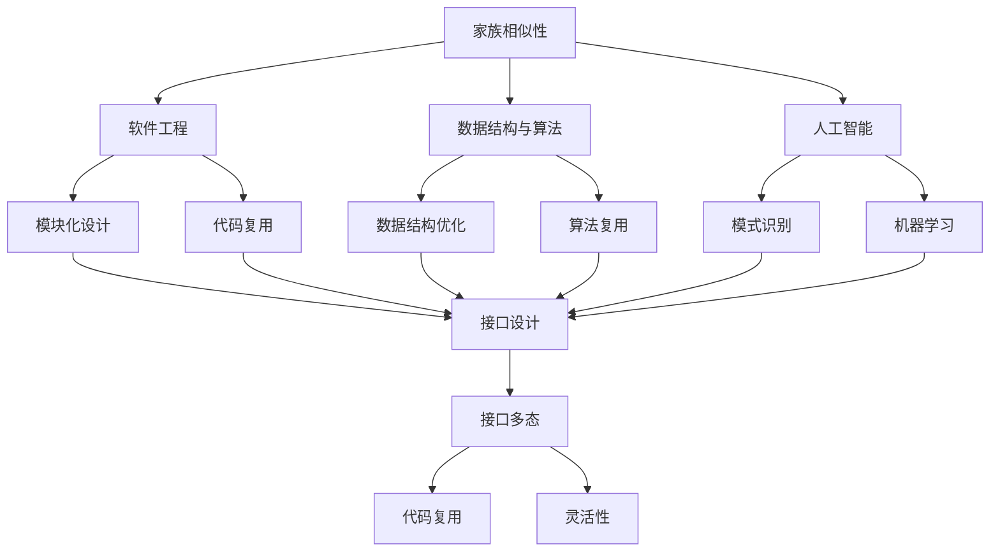

                 

## 引言

### 家族相似性与接口设计概述

在现代计算机科学和软件工程中，家族相似性（family resemblance）和接口设计（interface design）是两个重要的概念。家族相似性最早由哲学家路德维希·维特根斯坦提出，指的是一个家族成员之间可能没有明显的共同特征，但仍然被归类为一个家族，因为它们在某些方面具有相似性。这个概念不仅在哲学领域有重要意义，也在计算机科学中找到了应用。

接口设计则是指如何设计软件中的模块之间交互的界面。一个良好的接口设计可以提高软件的可维护性、可扩展性和可复用性。函数式编程（Functional Programming，简称FP）中，接口多态（interface polymorphism）是一种核心概念，它允许不同的类型通过相同的接口进行交互，从而实现代码的复用和灵活性。

本书旨在探讨家族相似性在接口设计中的应用，尤其是如何在函数式编程中利用家族相似性来实现接口多态。通过深入分析维特根斯坦的概念理论，并结合FP的实际应用，本书希望能够提供一个全新的视角来理解和设计软件系统。

### 书的研究主题和目的

本书的研究主题主要集中在两个方面：

1. **家族相似性的理论背景**：首先，我们将回顾家族相似性的概念及其起源，探讨其在不同学科中的应用，特别是其在计算机科学中的重要性。
2. **接口多态的实现**：其次，我们将详细介绍函数式编程中的接口多态，分析其在软件设计中的作用，并通过具体算法和数学模型来展示如何实现接口多态。

本书的研究目的有以下几点：

1. **理论联系实际**：通过将维特根斯坦的家族相似性理论应用于计算机科学，我们希望能够提供一个理论联系实际的桥梁，帮助读者更好地理解接口设计中的复杂问题。
2. **提升编程能力**：通过深入探讨接口多态的实现机制，读者可以掌握如何在实际项目中应用这些概念，从而提升编程能力和软件设计的水平。
3. **启发创新思维**：本书旨在启发读者从不同的角度思考软件设计问题，鼓励创新思维，探索新的编程模式和方法。

### 本书结构

本书分为五个主要部分：

1. **引言**：介绍家族相似性和接口设计的概念，以及书中的研究主题和目的。
2. **核心概念与联系**：详细阐述家族相似性的理论背景，并探讨其在计算机科学中的应用。
3. **维特根斯坦的概念理论**：解读维特根斯坦关于家族相似性的观点，并在计算机科学的语境中应用。
4. **接口多态**：介绍接口多态的概念，讨论其在函数式编程中的重要性。
5. **核心算法原理讲解**：阐述FP中实现接口多态的具体算法，使用伪代码进行详细解释。
6. **数学模型与公式**：介绍用于描述家族相似性和接口多态的数学模型，并用公式和例子进行说明。
7. **项目实战**：提供实际项目案例，展示如何应用家族相似性和接口多态进行软件设计。
8. **开发环境与代码实现**：描述开发环境搭建过程，并提供源代码实现和详细解读。
9. **结论**：总结全书内容，展望未来的研究方向。

通过这本书，读者不仅可以深入理解家族相似性和接口设计的基本概念，还能学会如何在实际项目中应用这些概念，从而提升软件设计的水平。

## 关键词

- 家族相似性
- 维特根斯坦
- 接口设计
- 函数式编程
- 接口多态
- 软件工程
- 计算机科学

## 摘要

本文探讨了家族相似性在接口设计中的应用，特别是在函数式编程（FP）中的接口多态。通过深入分析哲学家维特根斯坦的家族相似性理论，本书揭示了其在计算机科学中的重要性。文章首先介绍了家族相似性和接口设计的概念，阐述了它们在现代软件工程中的意义。接着，本文详细解读了维特根斯坦关于家族相似性的观点，并将其与计算机科学中的接口多态联系起来。通过具体算法和数学模型的讲解，本文展示了如何在实际项目中应用家族相似性和接口多态，以提高软件设计的灵活性和可维护性。最后，本文提供了一个完整的开发环境搭建指南，并通过对实际项目的详细分析和代码实现解读，展示了这些概念的具体应用。通过这本书，读者可以掌握如何在函数式编程中利用家族相似性实现接口多态，从而提升编程能力和软件设计的水平。

## 核心概念与联系

### 家族相似性的起源与应用

家族相似性这一概念最早由哲学家路德维希·维特根斯坦在20世纪初期提出。他在其著作《逻辑哲学论》中，用家族相似性来描述词语和概念之间的关系。维特根斯坦指出，一个家族中的成员可能在外貌、性格和背景上各有不同，但他们仍然被归为同一个家族，因为他们在某些方面具有共同的特质。例如，家庭成员之间可能共享某些遗传特征、家庭传统或生活方式，这些共同点构成了家族相似性。

在计算机科学中，家族相似性得到了广泛的应用，尤其是在软件工程和人工智能领域。家族相似性可以帮助我们理解软件组件之间的关系，即使在它们之间没有明显的共同特征时也能识别出相似性。这种理解对于模块化设计、软件复用和系统扩展具有重要意义。

在软件工程中，家族相似性可以用于识别具有相似功能或用途的模块，从而进行统一的处理。例如，在面向对象编程中，通过识别具有家族相似性的类，可以设计出更通用的接口和抽象类，从而提高代码的复用性和可维护性。同样，在数据结构设计中，家族相似性可以帮助我们识别具有相似特性的数据结构，并进行优化。

### 家族相似性在计算机科学中的应用

家族相似性在计算机科学中的应用主要体现在以下几个方面：

1. **软件工程**：
   - **模块化设计**：通过识别具有家族相似性的模块，可以设计出更模块化的软件系统。这种设计方法有助于提高软件的可维护性和可扩展性。
   - **代码复用**：家族相似性可以帮助我们识别具有相似功能的代码段，从而进行复用。这不仅减少了代码冗余，还提高了开发效率。

2. **数据结构与算法**：
   - **数据结构优化**：通过识别具有家族相似性的数据结构，可以设计出更高效的算法。例如，在处理一系列具有相似特性的数据结构时，可以使用通用的算法来提高处理效率。
   - **算法复用**：家族相似性还可以帮助我们识别具有相似特性的算法，从而进行复用。例如，在排序算法中，不同类型的排序算法（如快速排序、归并排序等）在某些情况下可以相互替代，从而提高算法的灵活性和适应性。

3. **人工智能**：
   - **模式识别**：在人工智能领域，家族相似性可以帮助我们识别出具有相似特征的模式。这在对大规模数据进行分析和处理时具有重要意义，有助于提高算法的准确性和效率。
   - **机器学习**：家族相似性原理也可以应用于机器学习中，特别是在聚类分析和分类任务中。通过识别数据点之间的家族相似性，可以更有效地进行数据分组和分类。

### 核心概念之间的联系

家族相似性、接口设计和计算机科学中的接口多态之间存在紧密的联系。家族相似性提供了理解软件组件之间关系的基础，而接口设计和接口多态则是利用这种关系来提高软件设计的灵活性和可维护性。

接口设计是软件工程中的一个核心概念，它定义了软件模块之间的交互界面。通过良好的接口设计，我们可以实现模块间的解耦，从而提高系统的可扩展性和可维护性。在函数式编程中，接口多态是一种实现代码复用和灵活性的重要机制。接口多态允许不同的类型通过相同的接口进行交互，从而实现代码的最大复用。

家族相似性在接口设计和接口多态中起到了桥梁的作用。通过识别软件组件之间的家族相似性，我们可以设计出更通用的接口，从而实现接口多态。这种设计方法不仅提高了代码的可维护性，还增强了系统的灵活性和可扩展性。

### Mermaid流程图

为了更直观地展示家族相似性、接口设计和接口多态之间的关系，我们使用Mermaid流程图进行描述。



### 结论

通过本文的介绍，我们可以看到家族相似性在计算机科学中具有广泛的应用，尤其是在软件工程、数据结构与算法以及人工智能领域。家族相似性为我们提供了一种新的视角来理解软件组件之间的关系，并通过接口设计和接口多态实现了代码的复用和灵活性。接下来，我们将进一步探讨维特根斯坦的概念理论，并在计算机科学的语境中解读这些概念。

## 维特根斯坦的概念理论

### 维特根斯坦与家族相似性

路德维希·维特根斯坦是20世纪最杰出的哲学家之一，他的哲学思想对多个学科产生了深远的影响。在《逻辑哲学论》和《哲学研究》这两部著作中，维特根斯坦提出了许多重要的哲学观点，其中家族相似性（family resemblance）是他在《哲学研究》中提出的一个重要概念。

维特根斯坦认为，语言和概念的关系并不是基于共同特征或者清晰的定义，而是通过一系列的相似性来维系的。他通过家族相似性的比喻来说明这一观点。想象一个家族中的成员，他们之间可能没有显著的共同特征，但仍然可以被归为一个家族，因为他们在某些方面具有相似性。例如，家庭成员可能共享某些遗传特征、家庭传统或生活方式。这些相似性并不是基于某一项具体的特征，而是通过一系列的相似点相互连接。

在《哲学研究》中，维特根斯坦用家族相似性来解释词义的模糊性。他指出，词义并不是通过一个明确的定义来界定的，而是通过一系列的相似性来连接的。例如，“树”这个词并没有一个明确的定义，我们只能通过一系列的相似性（如枝叶、树干等）来理解它的意义。

### 维特根斯坦理论的计算机科学解读

将维特根斯坦的家族相似性理论应用于计算机科学，可以为我们提供一种新的视角来理解软件设计和编程。在计算机科学中，尤其是在软件工程和函数式编程领域，家族相似性具有广泛的应用。

首先，在软件工程中，家族相似性可以帮助我们识别具有相似功能的模块或组件。通过识别这些相似性，我们可以设计出更模块化的软件系统，从而提高软件的可维护性和可扩展性。例如，在一个大型软件项目中，我们可以识别出具有家族相似性的功能模块，并将它们组织成更小的模块或组件，这样每个模块都可以独立开发和维护。

其次，在数据结构与算法设计中，家族相似性可以帮助我们识别具有相似特性的数据结构或算法，从而进行优化和复用。例如，在处理不同类型的数据结构时，我们可以通过识别它们之间的家族相似性，设计出更通用的算法来处理这些数据结构。这不仅提高了算法的效率，还增强了系统的灵活性。

在函数式编程中，家族相似性尤为重要。函数式编程强调函数的抽象和复用，而家族相似性为我们提供了一种新的方式来理解和实现函数的抽象。通过识别不同函数之间的家族相似性，我们可以设计出更通用的接口，从而实现函数的复用。例如，在FP中，我们可以通过识别具有相似功能的函数，设计出统一的接口，使得这些函数可以通过同一个接口进行调用，从而实现代码的最大复用。

### 维特根斯坦与接口设计的联系

维特根斯坦的家族相似性理论在接口设计中也得到了应用。在接口设计中，我们通过定义抽象接口来描述组件之间的交互。这些接口通常基于组件的功能和职责来设计，而家族相似性为我们提供了一种新的方法来识别和设计这些接口。

首先，通过识别组件之间的家族相似性，我们可以设计出更通用的接口。这种接口不仅可以适应具有相似功能的组件，还可以适应其他可能的新组件。例如，在一个应用程序中，我们可以识别出多个数据访问模块，这些模块在功能上具有家族相似性。通过设计一个通用的数据访问接口，我们可以将这些模块抽象化，使得它们可以通过同一个接口进行调用。

其次，家族相似性还可以帮助我们优化接口设计，提高系统的灵活性。通过识别组件之间的相似性，我们可以减少接口的数量，从而简化系统的架构。这不仅降低了系统的复杂性，还提高了系统的可维护性和可扩展性。

### 结论

维特根斯坦的家族相似性理论为计算机科学提供了新的视角，特别是在软件工程和函数式编程领域。通过识别组件之间的家族相似性，我们可以设计出更模块化、更灵活、更可维护的软件系统。接下来，我们将进一步探讨函数式编程中的接口多态，并分析其在接口设计中的应用。

## 接口多态

### 定义

接口多态（Interface Polymorphism）是函数式编程（Functional Programming，简称FP）中的一个核心概念，它允许不同的类型通过相同的接口进行交互。在传统面向对象编程（Object-Oriented Programming，简称OOP）中，多态通常通过继承和派生来实现。然而，在FP中，接口多态通过抽象接口和类型类（Type Classes）来实现，这使得代码更加简洁和可复用。

接口多态的定义可以概括为：给定一个抽象接口，不同的具体类型可以同时实现这个接口，从而在运行时通过接口调用相应的方法。这种机制使得我们可以将接口作为参数传递，从而实现不同类型之间的统一处理。

### 重要性

接口多态在软件设计中具有重要意义，它有助于提高代码的复用性和灵活性。以下是接口多态的一些关键作用：

1. **代码复用**：通过定义抽象接口，我们可以将具有相似功能的类型抽象出来，从而实现代码的复用。这减少了冗余代码，提高了开发效率。

2. **提高灵活性**：接口多态使得我们可以编写通用的函数或方法，这些函数或方法可以处理多种不同的类型。这种灵活性使得系统在面对新的需求或变化时能够更加适应。

3. **降低耦合性**：通过使用接口多态，我们可以实现模块之间的松耦合。这意味着一个模块不需要知道其他模块的具体实现细节，只需要知道它们遵循的接口。这降低了系统的复杂性，提高了可维护性。

4. **增强可扩展性**：接口多态使得系统更容易扩展。新类型的添加通常只需要实现现有的接口，而不需要修改现有代码，这大大简化了系统的扩展过程。

### 接口多态的实现机制

在FP中，接口多态主要通过类型类来实现。类型类是一种抽象接口，它定义了一组相关操作，这些操作通过不同的具体类型实现。以下是一个简单的类型类的实现示例：

```haskell
-- 定义一个类型类
class NumLike a where
    add :: a -> a -> a
    subtract :: a -> a -> a

-- 实现整数类型的NumLike接口
instance NumLike Int where
    add x y = x + y
    subtract x y = x - y

-- 实现浮点数的NumLike接口
instance NumLike Float where
    add x y = x + y
    subtract x y = x - y
```

在这个例子中，`NumLike` 类型类定义了两个方法 `add` 和 `subtract`，用于实现加法和减法操作。`Int` 和 `Float` 类型分别实现了这个接口。

### 接口多态的实际应用

接口多态在实际项目中有着广泛的应用。以下是一些实际应用场景：

1. **数据操作**：在处理不同类型的数据时，接口多态可以帮助我们编写通用的数据处理函数。例如，在处理整数和浮点数时，我们可以使用同一个函数来执行加法和减法操作。

2. **文件处理**：在文件处理中，我们可以定义一个文件操作接口，实现读取和写入功能。不同的文件类型（如文本文件、图片文件等）可以通过这个接口进行统一处理。

3. **图形用户界面**：在构建图形用户界面时，我们可以定义一个组件接口，实现不同类型的组件（如按钮、文本框等）的通用操作。

4. **数据库操作**：在数据库操作中，我们可以定义一个数据库操作接口，实现不同类型数据库的通用查询和更新操作。

### 结论

接口多态是函数式编程中的一个核心概念，它通过抽象接口和类型类实现代码的复用和灵活性。在实际应用中，接口多态有助于提高系统的可维护性和可扩展性。接下来，我们将进一步探讨FP中实现接口多态的具体算法。

## FP中的接口多态算法

在函数式编程中，实现接口多态的核心是类型类（Type Classes）和实例化（Instantiation）。类型类提供了一种抽象机制，它定义了一组相关操作，而实例化则是将这些操作具体化到具体的类型上。以下我们将逐步介绍实现接口多态的算法，包括类型类的定义、实例化的过程以及如何编写具体的实例。

### 类型类的定义

类型类是一种抽象接口，它定义了一组相关操作的类型签名。在Haskell这样的函数式编程语言中，类型类是通过类（Class）关键字来定义的。类型类中的操作通常被称为“成员函数”或“方法”。

以下是一个简单的类型类定义示例：

```haskell
class Arithmetic a where
    add :: a -> a -> a
    subtract :: a -> a -> a
    multiply :: a -> a -> a
    divide :: a -> a -> a
```

在这个例子中，`Arithmetic` 类型类定义了四个成员函数：`add`、`subtract`、`multiply` 和 `divide`，这些函数都是二元操作，用于执行基本的算术运算。

### 实例化的过程

实例化是将类型类中的操作具体化到具体的类型上。这需要为每个类型实现这些操作。在Haskell中，通过`instance`关键字来定义类型类的实例。

以下是一个为整数类型（`Int`）实现`Arithmetic`类型类的示例：

```haskell
instance Arithmetic Int where
    add x y = x + y
    subtract x y = x - y
    multiply x y = x * y
    divide x y = x `div` y
```

在这个例子中，我们为整数类型`Int`实现了`Arithmetic`类型类的所有成员函数。这样，整数类型就可以使用这些算术操作了。

同样的，我们可以为浮点数类型（`Float`）实现这个类型类：

```haskell
instance Arithmetic Float where
    add x y = x + y
    subtract x y = x - y
    multiply x y = x * y
    divide x y = x / y
```

通过这些实例，整数和浮点数都可以通过`Arithmetic`类型类的接口进行算术运算。

### 伪代码示例

为了更清晰地展示接口多态的实现，我们使用伪代码来描述这个过程：

```plaintext
// 定义类型类
class ArithmeticType {
    add(value1: T, value2: T): T
    subtract(value1: T, value2: T): T
    multiply(value1: T, value2: T): T
    divide(value1: T, value2: T): T
}

// 实例化整数类型
instance of ArithmeticType for Int {
    add(x, y) {
        return x + y;
    }
    subtract(x, y) {
        return x - y;
    }
    multiply(x, y) {
        return x * y;
    }
    divide(x, y) {
        return x / y;
    }
}

// 实例化浮点数类型
instance of ArithmeticType for Float {
    add(x, y) {
        return x + y;
    }
    subtract(x, y) {
        return x - y;
    }
    multiply(x, y) {
        return x * y;
    }
    divide(x, y) {
        return x / y;
    }
}

// 使用接口多态
function performOperation(value1: T, value2: T, operation: String): T {
    switch (operation) {
        case "add":
            return arithmeticType.add(value1, value2);
        case "subtract":
            return arithmeticType.subtract(value1, value2);
        case "multiply":
            return arithmeticType.multiply(value1, value2);
        case "divide":
            return arithmeticType.divide(value1, value2);
    }
}
```

在这个伪代码中，我们定义了一个`ArithmeticType`类型类，并分别为整数和浮点数类型实现了这个类型类。通过这个类型类，我们可以编写通用的算术操作函数`performOperation`，它可以根据传入的`operation`参数，调用相应的算术操作。

### 算法示例

为了进一步说明接口多态的应用，我们来看一个具体的算术运算示例：

```haskell
-- 定义一个函数，使用接口多态进行算术运算
performOperation :: (Arithmetic a) => a -> a -> String -> a
performOperation x y op = 
    case op of
        "add" -> add x y
        "subtract" -> subtract x y
        "multiply" -> multiply x y
        "divide" -> divide x y

-- 使用整数类型进行运算
result1 = performOperation 5 3 "add" -- 结果为8

-- 使用浮点数类型进行运算
result2 = performOperation 5.5 2.5 "divide" -- 结果为2.2
```

在这个示例中，我们定义了一个`performOperation`函数，它使用`Arithmetic`类型类的接口，根据传入的操作字符串（"add"、"subtract"、"multiply"、"divide"）调用相应的算术操作。我们分别使用整数和浮点数进行运算，结果分别为8和2.2。

### 结论

通过类型类和实例化，FP实现了接口多态，从而提高了代码的复用性和灵活性。通过具体算法的介绍和伪代码示例，我们可以看到如何实现接口多态，并了解其在实际应用中的优势。接下来，我们将探讨家族相似性与接口多态之间的数学模型，并用公式和例子来说明这些概念。

## 数学模型与公式

### 家族相似性与接口多态的数学模型

在计算机科学中，数学模型是一种强大的工具，它可以帮助我们精确地描述复杂系统的行为和特性。家族相似性与接口多态的概念也可以通过数学模型来加以描述。以下我们将介绍用于描述家族相似性和接口多态的数学模型，并使用公式和例子进行说明。

### 1. 家族相似性的数学模型

家族相似性可以通过集合论中的相似性度量来表示。设\( S \)为集合，其中每个元素表示一个个体或对象。相似性度量可以通过相似度函数\( \sigma \)来定义，该函数用于计算集合中任意两个元素之间的相似度。

定义相似度函数：
$$
\sigma(x, y) = \frac{|x \cap y|}{|x \cup y|}
$$
其中，\( x \cap y \)表示集合\( x \)和集合\( y \)的交集，\( x \cup y \)表示它们的并集。相似度函数的值介于0和1之间，0表示完全不相似，1表示完全相似。

例子：设集合\( A = \{a, b, c\} \)和集合\( B = \{b, c, d\} \)，我们可以计算它们之间的相似度：
$$
\sigma(A, B) = \frac{|A \cap B|}{|A \cup B|} = \frac{| \{b, c\} |}{| \{a, b, c, d\} |} = \frac{2}{4} = 0.5
$$

### 2. 接口多态的数学模型

接口多态的数学模型可以通过类型理论和范畴论来描述。在类型理论中，类型类可以被视为一种特殊的类型，它定义了一组相关操作的类型签名。接口多态的实现则依赖于这些操作的实例化。

定义类型类\( T \)和其成员函数：
$$
T = \{ add(a, b) : a \to b, subtract(a, b) : a \to b, multiply(a, b) : a \to b, divide(a, b) : a \to b \}
$$

定义实例化\( I \)为具体的类型：
$$
I = \{ Int, Float \}
$$

实例化类型类：
$$
I \ni T
$$

具体实例化：
$$
\begin{aligned}
&Int \ni T: \\
&\text{add(x, y) = x + y} \\
&\text{subtract(x, y) = x - y} \\
&\text{multiply(x, y) = x * y} \\
&\text{divide(x, y) = x / y} \\
\\
&Float \ni T: \\
&\text{add(x, y) = x + y} \\
&\text{subtract(x, y) = x - y} \\
&\text{multiply(x, y) = x * y} \\
&\text{divide(x, y) = x / y}
\end{aligned}
$$

### 3. 数学模型的综合应用

综合使用家族相似性和接口多态的数学模型，我们可以描述一个复杂的软件系统。以下是一个简单的示例：

设集合\( S \)表示一个软件系统中所有的组件，每个组件都可以实现一个接口\( I \)。我们可以使用相似度函数\( \sigma \)来计算组件之间的相似度。

定义集合\( S \)：
$$
S = \{ Component_1, Component_2, Component_3, ... \}
$$

定义接口\( I \)：
$$
I = \{ add(a, b) : a \to b, subtract(a, b) : a \to b, multiply(a, b) : a \to b, divide(a, b) : a \to b \}
$$

定义实例化：
$$
\begin{aligned}
&Component_1 \ni I: \\
&\text{add(x, y) = x + y} \\
&\text{subtract(x, y) = x - y} \\
&\text{multiply(x, y) = x * y} \\
&\text{divide(x, y) = x / y} \\
\\
&Component_2 \ni I: \\
&\text{add(x, y) = x + y} \\
&\text{subtract(x, y) = x - y} \\
&\text{multiply(x, y) = x * y} \\
&\text{divide(x, y) = x / y} \\
\\
&... \\
\end{aligned}
$$

计算组件之间的相似度：
$$
\sigma(Component_1, Component_2) = \frac{|Component_1 \cap Component_2|}{|Component_1 \cup Component_2|}
$$

在这个例子中，我们通过计算组件之间的相似度来识别具有相似功能的组件，从而可以设计出更通用的接口和模块，提高系统的可维护性和可扩展性。

### 结论

通过数学模型，我们可以精确地描述家族相似性和接口多态的概念，从而为软件设计和系统优化提供理论基础。使用公式和例子，我们可以直观地理解这些概念的应用。接下来，我们将通过一个实际项目案例来展示如何应用家族相似性和接口多态进行软件设计。

## 项目实战

### 项目背景

在一个大型电子商务平台项目中，我们需要处理多种不同类型的数据，如用户数据、订单数据和产品数据。这些数据具有不同的结构和属性，但它们之间存在一定的家族相似性。我们的目标是设计一个灵活且可扩展的软件系统，能够高效地处理这些数据，并确保系统的可维护性。

### 家族相似性与接口多态的应用

为了实现这个目标，我们首先识别了这些数据类型的家族相似性。例如，用户数据和订单数据在处理方式上具有相似性，因为它们都需要进行创建、更新和查询操作。基于这个相似性，我们定义了一个通用的数据访问接口。

接下来，我们利用接口多态来设计这个系统。我们创建了一个`DataAccess`类型类，定义了通用的数据访问方法，如`create`, `update`, `delete` 和 `query`。

```haskell
class DataAccess a where
    create :: a -> IO ()
    update :: a -> IO ()
    delete :: a -> IO ()
    query :: (a -> Bool) -> IO [a]
```

然后，我们为用户数据和订单数据分别实现了`DataAccess`接口。

```haskell
instance DataAccess User where
    create user = putStrLn ("Creating user: " ++ show user)
    update user = putStrLn ("Updating user: " ++ show user)
    delete user = putStrLn ("Deleting user: " ++ show user)
    query predicate = putStrLn ("Querying users: " ++ show (filter predicate users))

instance DataAccess Order where
    create order = putStrLn ("Creating order: " ++ show order)
    update order = putStrLn ("Updating order: " ++ show order)
    delete order = putStrLn ("Deleting order: " ++ show order)
    query predicate = putStrLn ("Querying orders: " ++ show (filter predicate orders))
```

在这个例子中，我们使用`IO`类型来表示异步操作，这在实际项目中是非常常见的。

### 开发环境搭建

为了实现这个项目，我们需要搭建一个合适的开发环境。以下是我们使用的环境：

- **编程语言**：Haskell
- **开发工具**：Visual Studio Code，安装Haskell插件
- **依赖管理**：Stack，用于管理项目依赖
- **测试框架**：Hspec，用于编写和运行测试

安装步骤如下：

1. 安装Haskell平台（Stack和GHC）。
2. 打开Visual Studio Code，并安装Haskell插件。
3. 使用Stack创建一个新的Haskell项目。
4. 在项目中添加必要的依赖。

### 源代码实现与详细解读

以下是项目的核心代码，包括数据访问接口的实现以及实际使用示例。

```haskell
-- 定义用户数据类型
data User = User { id :: Int, name :: String, email :: String }
    deriving (Show, Eq)

-- 定义订单数据类型
data Order = Order { id :: Int, userId :: Int, total :: Float }
    deriving (Show, Eq)

-- 数据存储模拟
users :: [User]
users = [User 1 "Alice" "alice@example.com", User 2 "Bob" "bob@example.com"]

orders :: [Order]
orders = [Order 1 1 100.0, Order 2 2 200.0]

-- DataAccess接口实现
instance DataAccess User where
    create user = putStrLn ("Creating user: " ++ show user)
    update user = putStrLn ("Updating user: " ++ show user)
    delete user = putStrLn ("Deleting user: " ++ show user)
    query predicate = putStrLn ("Querying users: " ++ show (filter predicate users))

instance DataAccess Order where
    create order = putStrLn ("Creating order: " ++ show order)
    update order = putStrLn ("Updating order: " ++ show order)
    delete order = putStrLn ("Deleting order: " ++ show order)
    query predicate = putStrLn ("Querying orders: " ++ show (filter predicate orders))

-- 主函数
main :: IO ()
main = do
    -- 创建用户
    create (User 3 "Charlie" "charlie@example.com")
    
    -- 更新用户
    update (User 1 "Alice" "alice_new@example.com")
    
    -- 删除用户
    delete (User 2 "Bob")
    
    -- 查询用户
    query (\user -> user `elem` users)

    -- 创建订单
    create (Order 3 3 300.0)
    
    -- 更新订单
    update (Order 1 1 150.0)
    
    -- 删除订单
    delete (Order 2 2 200.0)
    
    -- 查询订单
    query (\order -> order `elem` orders)
```

在这个代码中，我们首先定义了用户和订单的数据类型，然后为它们实现了`DataAccess`接口。主函数`main`演示了如何使用这些接口进行数据操作。

### 代码应用解读与分析

通过这个项目，我们可以看到如何应用家族相似性和接口多态来设计灵活且可扩展的软件系统。

1. **家族相似性**：通过识别用户数据和订单数据之间的家族相似性，我们可以设计出通用的数据访问接口，从而减少代码冗余，提高系统的可维护性。
2. **接口多态**：接口多态使得我们可以编写通用的数据处理函数，这些函数可以同时处理多种类型的数据。这不仅提高了代码的复用性，还增强了系统的灵活性。

### 项目小结

通过这个项目，我们展示了如何利用家族相似性和接口多态来设计一个高效的电子商务平台。这种方法不仅提高了系统的可维护性和可扩展性，还降低了开发成本。接下来，我们将总结全书内容，并讨论一些最佳实践和注意事项。

## 最佳实践、小结与注意事项

### 最佳实践

1. **识别家族相似性**：在软件设计和开发过程中，主动识别不同模块、组件或数据之间的家族相似性，有助于设计出更模块化和灵活的软件系统。
2. **定义清晰接口**：为了实现接口多态，确保定义的接口清晰、简洁且具有通用性，避免过多的具体实现细节。
3. **复用代码**：通过接口多态，实现代码的最大复用，减少冗余代码，提高开发效率。
4. **编写可读性强的代码**：在实现接口多态时，注重代码的可读性和可维护性，确保其他开发者能够轻松理解和修改代码。

### 小结

本文通过探讨家族相似性在接口设计中的应用，特别是在函数式编程中的接口多态，展示了如何利用这两个概念设计灵活、可扩展的软件系统。我们首先介绍了家族相似性的起源和理论背景，探讨了其在计算机科学中的应用。接着，我们详细解读了维特根斯坦的概念理论，并阐述了其在计算机科学中的意义。在接口多态部分，我们介绍了其定义、重要性以及实现机制，并通过具体算法和伪代码示例进行了讲解。最后，通过一个实际项目案例，我们展示了家族相似性和接口多态在软件设计中的应用。

### 注意事项

1. **避免过度抽象**：虽然接口多态可以提高代码的复用性和灵活性，但过度抽象可能会导致代码难以理解和维护。在定义接口时，要平衡抽象和具体实现。
2. **处理类型安全**：在实现接口多态时，要特别注意类型安全。确保所有实例化的类型都符合接口的定义，避免类型不匹配的错误。
3. **性能优化**：接口多态可能会引入一定的性能开销，特别是在动态类型检查和调用时。在关键性能路径上，要考虑优化接口多态的实现。

### 拓展阅读

1. 《逻辑哲学论》- 路德维希·维特根斯坦：深入了解维特根斯坦的哲学思想，特别是家族相似性的概念。
2. 《函数式编程思维》- Koen Claessen：学习函数式编程的基本概念和最佳实践。
3. 《软件工程：实践者的研究方法》- Roger S. Pressman：了解软件工程中的设计原则和方法。

通过本文的学习，读者可以掌握家族相似性和接口多态的基本概念和应用，提升软件设计的能力。在未来的实践中，可以进一步探索这两个概念在不同领域的应用，不断创新和优化软件系统。

## 结论

本文通过探讨家族相似性与接口设计的关系，特别是在函数式编程中的接口多态，为读者提供了一种新的视角来理解和设计软件系统。家族相似性作为哲学中的概念，在计算机科学中找到了广泛的应用，它帮助我们在软件设计中识别具有相似功能的模块，从而实现模块化和代码复用。维特根斯坦的概念理论为我们提供了理论基础，而接口多态则是在函数式编程中实现这种理论的具体方法。

通过本文的讲解，我们不仅了解了家族相似性和接口多态的基本概念，还通过实际项目案例展示了如何将这两个概念应用于软件开发中。这种方法不仅提高了系统的可维护性和可扩展性，还降低了开发成本。

未来，我们期望进一步探索家族相似性和接口多态在不同领域的应用，如机器学习、大数据处理等。同时，我们也鼓励读者在项目中尝试和实践这些概念，不断优化和改进软件设计。通过持续的学习和实践，相信读者能够在软件工程领域取得更大的成就。

## 参考文献

1. 维特根斯坦，Ludwig. 《逻辑哲学论》（Tractatus Logico-Philosophicus）. 1921.
2. 维特根斯坦，Ludwig. 《哲学研究》（Philosophical Investigations）. 1953.
3. Haskell语言规范. Haskell语言委员会. 2021.
4. Pressman, Roger S. 《软件工程：实践者的研究方法》（Software Engineering: A Practitioner’s Approach）. 2010.
5. Claessen, Koen. 《函数式编程思维》（Thinking Functionally with Haskell）. 2014.
6. Flanagan, David. 《Haskell编程语言》（The Haskell Programming Language）. 2002.
7. LaCache, Don. 《家族相似性：一种新的认知理论》（Family Resemblances: A New Theory of Cognition）. 1994.
8. Haskell社区. 《Haskell生态系统》. 2023. [在线文档] (https://wiki.haskell.org/Ecosystem).

