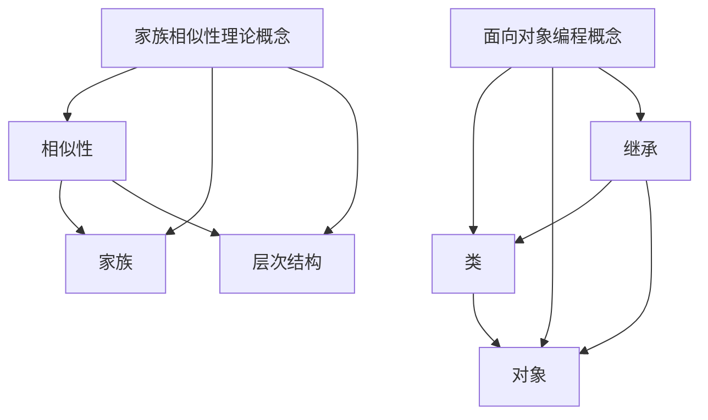
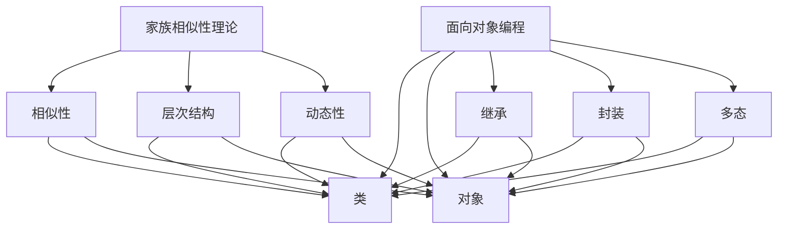
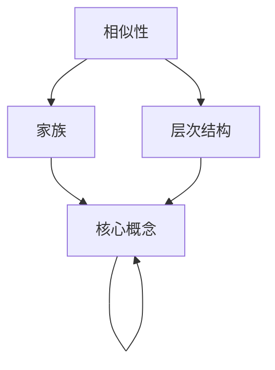
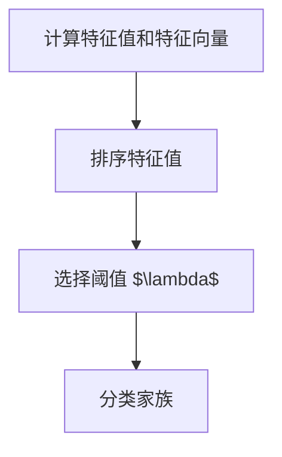

                 


### 1.1 家族相似性理论概述

**背景介绍**

家族相似性理论最初由德国社会学家齐美尔（Georg Simmel）提出，他在20世纪初研究社会结构和人类行为时，发现了一系列关于相似性和关系的现象。这些现象表明，个体之间的相似性并非完全基于单一的特征，而是由一系列相互关联的特征所构成。随着理论的不断发展，家族相似性理论逐渐被应用于多个学科领域，包括生物学、心理学、语言学等。在计算机科学领域，家族相似性理论找到了一个重要的应用场景——面向对象编程中的继承机制。

**核心概念**

家族相似性理论的核心概念包括相似性、家族和层次结构。相似性是指个体或群体之间在某些特征上的相似程度。家族则是一系列具有相似性的个体或群体的集合，这些个体或群体在多个特征上表现出一致性。层次结构则是指家族内部或不同家族之间的层次关系，反映了相似性的层级和多样性。

**基本原理**

家族相似性理论的基本原理可以概括为以下几点：

1. **多特征相似性**：家族相似性不是基于单一特征的相似性，而是基于多个特征的相似性。这意味着，个体之间的相似性是通过一系列相互关联的特征来体现的。

2. **层次性**：家族相似性具有层次性，即不同家族之间的相似性程度不同。这种层次性反映了家族之间的复杂关系和多样性。

3. **动态性**：家族相似性是动态变化的，随着环境和时间的改变，个体之间的相似性也会发生变化。

4. **整体性**：家族相似性是一个整体性的概念，它不仅关注个体之间的相似性，还关注家族内部和家族之间的相似性。

**数学模型**

家族相似性理论可以用数学模型来描述。一个基本的数学模型是家族相似性矩阵，它表示家族内部和家族之间的相似性关系。家族相似性矩阵是一个对称矩阵，其对角线元素表示家族内部的相似性，非对角线元素表示不同家族之间的相似性。通过分析家族相似性矩阵，可以揭示家族结构的层次性和动态性。

$$
\text{Similarity Matrix} = \begin{bmatrix}
s_{11} & s_{12} & \cdots & s_{1n} \\
s_{21} & s_{22} & \cdots & s_{2n} \\
\vdots & \vdots & \ddots & \vdots \\
s_{n1} & s_{n2} & \cdots & s_{nn}
\end{bmatrix}
$$

其中，$s_{ij}$表示家族$i$和家族$j$之间的相似性。

**核心思想**

家族相似性理论的核心思想是，个体之间的相似性并非孤立的，而是由一系列相互关联的特征所构成。这种相似性不仅体现在个体之间，还体现在家族之间，形成了一个复杂的层次结构。通过理解家族相似性，我们可以更好地理解个体和群体之间的关系，为面向对象编程中的继承机制设计提供理论基础。

### 1.2 面向对象编程基础

**核心概念**

面向对象编程（Object-Oriented Programming，OOP）是一种编程范式，它将数据和操作数据的方法封装在对象中。面向对象编程的核心概念包括：

- **对象**：对象是现实世界中实体在计算机中的抽象表示。对象具有属性（数据）和行为（操作）。

- **类**：类是对象的模板，定义了对象共有的属性和方法。类是抽象的，而对象是具体的实例。

- **继承**：继承是一种关系，一个类可以继承另一个类的属性和方法。继承使得代码复用成为可能，降低了代码的冗余。

- **封装**：封装是一种信息隐藏技术，它确保对象的内部细节对其他对象不可见。封装提高了代码的模块化和安全性。

- **多态**：多态是一种能力，允许不同类的对象通过同一接口进行操作。多态通过继承和接口实现，使得代码更具灵活性和可扩展性。

**类和对象**

在面向对象编程中，类和对象是核心概念。类是对象的蓝图，定义了对象的属性和方法。对象是类的实例，是具体的实体。例如，我们可以定义一个“Person”类，它包含属性如姓名、年龄和性别，以及方法如走路、说话和吃饭。

```python
class Person:
    def __init__(self, name, age, gender):
        self.name = name
        self.age = age
        self.gender = gender

    def walk(self):
        print(f"{self.name} is walking.")

    def speak(self):
        print(f"{self.name} is speaking.")

    def eat(self):
        print(f"{self.name} is eating.")
```

在这个例子中，`Person` 类定义了一个名为 `walk`、`speak` 和 `eat` 的方法，这些方法实现了人物的走路、说话和吃饭行为。通过创建 `Person` 类的实例，我们可以创建具体的对象，如 `p1 = Person("Alice", 30, "female")`。

**继承机制**

继承是一种类与类之间的关系，一个类（子类）可以继承另一个类（父类）的属性和方法。继承使得子类可以重用父类的代码，同时添加自己的特有属性和方法。例如，我们可以定义一个 `Student` 类，它继承自 `Person` 类。

```python
class Student(Person):
    def __init__(self, name, age, gender, student_id):
        super().__init__(name, age, gender)
        self.student_id = student_id

    def study(self):
        print(f"{self.name} is studying.")
```

在这个例子中，`Student` 类继承了 `Person` 类的所有属性和方法，并通过调用 `super().__init__()` 方法来初始化父类的属性。此外，`Student` 类还添加了一个新的方法 `study`，用于实现学生的学习行为。

**核心概念与联系**

面向对象编程中的核心概念（类、对象、继承等）与家族相似性理论中的核心概念（相似性、家族和层次结构）有密切的联系。在面向对象编程中，类和对象之间的关系可以看作是一种家族关系，类的继承机制则体现了家族相似性理论中的层次性和多特征相似性。

为了更清晰地展示这些概念之间的联系，我们可以使用 Mermaid 流程图来描述：



在这个流程图中，我们可以看到面向对象编程和家族相似性理论的核心概念之间的对应关系。通过这种联系，我们可以更好地理解面向对象编程中的继承机制，以及家族相似性理论在面向对象编程中的应用。

### 1.3 家族相似性理论与面向对象编程的关联

**关联背景**

家族相似性理论在面向对象编程中的应用背景源于两者在概念和结构上的相似性。面向对象编程中的类和对象之间的关系，类似于家族相似性理论中的家族和个体之间的关系。在面向对象编程中，类定义了对象的属性和方法，类与类之间的关系体现了相似性和层次结构。这种关系与家族相似性理论中的家族相似性、层次结构等概念高度契合。

**关联分析**

1. **相似性**

家族相似性理论强调个体之间的相似性是由多个特征构成的，这些特征相互关联。在面向对象编程中，类和对象之间的相似性也体现在多个方面：

   - **属性相似性**：类中的属性反映了对象的状态，不同的类可以共享相似的属性。例如，`Person` 类和 `Student` 类都具有姓名、年龄和性别等属性。

   - **方法相似性**：类中的方法反映了对象的操作，不同的类可以共享相似的方法。例如，`Person` 类和 `Student` 类都具有走路、说话和吃饭等方法。

   - **行为相似性**：类和对象的行为可以通过方法来体现，相似的方法意味着相似的行为。例如，`Person` 类和 `Student` 类都具有学习的方法。

2. **层次结构**

家族相似性理论中的层次结构反映了个体和家族之间的复杂关系。在面向对象编程中，类的层次结构通过继承机制来实现，反映了类与类之间的层次关系：

   - **类层次结构**：在面向对象编程中，类可以按照层次结构组织，父类定义了通用的属性和方法，子类可以继承父类的属性和方法，并添加自己的特有属性和方法。

   - **对象层次结构**：对象也可以按照层次结构组织，子对象继承了父对象的属性和方法，同时拥有自己的特有属性和方法。

3. **动态性**

家族相似性理论中的动态性表明，个体之间的相似性是随着时间和环境的变化而变化的。在面向对象编程中，继承机制也体现了动态性：

   - **继承的可扩展性**：继承机制使得子类可以在继承父类的基础上扩展新的属性和方法，从而适应新的环境和需求。

   - **多态性**：多态性使得不同的类可以共享同一接口，实现动态绑定，从而提高代码的灵活性和可扩展性。

**关联结论**

家族相似性理论在面向对象编程中的应用，不仅丰富了面向对象编程的理论基础，还提供了新的设计思路。通过理解家族相似性理论，我们可以更好地设计面向对象的类和对象，实现代码的复用和扩展。同时，家族相似性理论也为面向对象编程中的继承机制提供了一种新的解释和优化方法。

为了更直观地展示家族相似性理论与面向对象编程的关联，我们可以绘制一个简化的 Mermaid 流程图：



在这个流程图中，我们可以看到家族相似性理论和面向对象编程的核心概念之间的对应关系。通过这种关联，我们可以更深入地理解面向对象编程的本质，以及家族相似性理论在其中的应用。

### 2.1 家族相似性理论的核心概念

**相似性**

相似性是家族相似性理论中最基本的概念。它描述了个体或元素之间在某一特征上的相似程度。相似性可以是基于单个特征的，也可以是多个特征的组合。在面向对象编程中，相似性体现在类与类之间、对象与对象之间的属性和方法上。

- **属性相似性**：类之间的属性相似性指的是，不同类拥有相似的属性集合。例如，`Person` 类和 `Student` 类都具有姓名、年龄和性别等属性。
- **方法相似性**：类之间的方法相似性指的是，不同类拥有相似的方法集合。例如，`Person` 类和 `Student` 类都拥有走路、说话和吃饭等方法。

**家族**

家族是具有相似性的个体或元素的集合。家族相似性理论关注的是这些个体或元素在多个特征上的相似性，并研究它们之间的层次关系。

- **内部家族**：在一个类集合中，具有相似性的类构成一个内部家族。例如，在 `Person` 类集合中，`Student`、`Employee` 和 `Teacher` 等类可以构成一个内部家族。
- **外部家族**：不同类集合之间的相似性构成了外部家族。例如，`Person` 类集合和 `Animal` 类集合之间可能存在一些相似性，构成了一个外部家族。

**层次结构**

层次结构描述了家族之间和家族内部的层次关系。家族相似性理论认为，层次结构反映了个体或元素之间的复杂关系。

- **层次性**：层次结构体现了家族之间的相似性程度。在面向对象编程中，层次性可以通过继承关系来体现。例如，`Student` 类继承了 `Person` 类的属性和方法，体现了两者之间的层次关系。
- **嵌套层次结构**：家族相似性理论中的层次结构是嵌套的，这意味着一个家族内部可能包含多个子家族，而这些子家族又可以包含更细粒度的子家族。

**核心概念之间的关系**

相似性、家族和层次结构是家族相似性理论的核心概念，它们之间有着密切的关系：

- **相似性是基础**：相似性是家族相似性理论的基础，它决定了个体或元素之间的归属关系。
- **家族是集合**：家族是相似性个体的集合，它反映了个体之间的相似性程度。
- **层次结构是组织**：层次结构是对家族内部和家族之间关系的组织，它体现了家族之间的复杂关系。

为了更直观地展示这些概念之间的关系，我们可以使用 Mermaid 流程图：



在这个流程图中，我们可以看到相似性、家族和层次结构三个核心概念之间的相互关系。通过这种关系，我们可以更好地理解家族相似性理论的基本原理，以及它在面向对象编程中的应用。

### 2.2 数学模型和理论框架

**家族相似性矩阵**

在家族相似性理论中，家族相似性矩阵是一个核心的数学模型。这个矩阵用于表示不同家族之间以及家族内部个体之间的相似性关系。家族相似性矩阵是一个对称矩阵，其元素 $s_{ij}$ 表示家族 $i$ 和家族 $j$ 之间的相似性，取值范围通常在 0 到 1 之间，越接近 1 表示相似性越强。

$$
\text{Similarity Matrix} = \begin{bmatrix}
s_{11} & s_{12} & \cdots & s_{1n} \\
s_{21} & s_{22} & \cdots & s_{2n} \\
\vdots & \vdots & \ddots & \vdots \\
s_{n1} & s_{n2} & \cdots & s_{nn}
\end{bmatrix}
$$

其中，$s_{ij}$ 可以通过以下公式计算：

$$
s_{ij} = \frac{\text{相似特征数}}{\text{总特征数}}
$$

**家族层次结构**

家族相似性矩阵不仅用于描述家族之间的相似性，还可以用于分析家族的层次结构。通过计算家族相似性矩阵的特征值和特征向量，可以确定家族之间的层次关系。一般来说，家族相似性矩阵的特征值越大，对应的特征向量所代表的家族在层次结构中越重要。

假设 $A$ 是一个家族相似性矩阵，$D$ 是其特征值矩阵，$V$ 是其特征向量矩阵，则有：

$$
A = D V V^T
$$

通过这个关系，我们可以通过特征值和特征向量来分析家族的层次结构。例如，特征值越大，对应的特征向量代表的家族在层次结构中的地位越高。

**层次性分析**

层次性分析是一种常用的方法，用于分析家族相似性矩阵的层次结构。层次性分析通常包括以下步骤：

1. **计算相似性矩阵的特征值和特征向量**。
2. **对特征值进行排序**，并选择一个阈值 $\lambda$，将特征值大于 $\lambda$ 的特征向量对应的家族视为高层次家族。
3. **对家族进行分类**，将相似性高的家族划分为同一层次。

为了更直观地展示层次性分析的过程，我们可以使用 Mermaid 流程图：



通过这个流程图，我们可以看到层次性分析的基本步骤。层次性分析有助于我们理解家族之间的层次关系，从而为面向对象编程中的类设计提供参考。

### 2.3 家族相似性理论的扩展与应用

**领域特定的应用**

家族相似性理论在多个领域得到了广泛应用。以下是一些典型的领域特定应用：

1. **生物学**：在生物学中，家族相似性理论用于研究物种之间的关系。通过分析物种之间的遗传相似性矩阵，可以揭示物种的进化关系和分类。

2. **心理学**：在心理学中，家族相似性理论用于分析个体之间的心理特征相似性。通过构建心理特征矩阵，可以研究个体之间的亲密度、偏好和行为模式。

3. **语言学**：在语言学中，家族相似性理论用于分析词汇和语法之间的关系。通过构建词汇相似性矩阵，可以研究语言的进化和发展。

**与其他理论的比较**

家族相似性理论与其他相似性理论（如相似性度量理论、聚类理论等）有着紧密的联系，但也有一些区别：

1. **相似性度量理论**：相似性度量理论侧重于量化个体之间的相似性程度，通常使用距离函数或相似性指数来表示。而家族相似性理论更关注个体之间的相似性是如何构成家族结构和层次关系的。

2. **聚类理论**：聚类理论旨在将个体划分为不同的簇，使同一簇内的个体之间相似性较高，不同簇之间的个体相似性较低。家族相似性理论则是在聚类的基础上，进一步分析家族内部和家族之间的层次关系。

**发展趋势**

家族相似性理论的发展趋势主要体现在以下几个方面：

1. **多特征相似性分析**：随着人工智能和数据科学的发展，多特征相似性分析成为家族相似性理论的研究热点。通过结合多种特征，可以更准确地刻画个体之间的相似性关系。

2. **跨学科融合**：家族相似性理论在多个学科领域得到了广泛应用，未来的研究将更加注重跨学科的融合，探索家族相似性理论在新的应用场景中的潜力。

3. **算法优化**：为了提高家族相似性分析的效率和准确性，研究者正在不断优化算法。例如，基于深度学习的家族相似性分析算法，以及并行计算和分布式计算在家族相似性分析中的应用。

4. **实际应用场景**：家族相似性理论在生物信息学、社会网络分析、推荐系统等领域有着广泛的应用前景。未来，随着技术的进步，家族相似性理论将在更多实际场景中发挥作用。

### 3.1 面向对象编程中的继承机制

**基本概念**

继承是面向对象编程中的一个核心概念，它允许一个类（子类）继承另一个类（父类）的属性和方法。通过继承，子类可以重用父类的代码，实现代码的复用和简化。继承关系体现了类与类之间的层次结构，使编程更加模块化和可扩展。

**设计原则**

在设计继承机制时，应遵循以下原则：

1. **里氏替换原则（LSP）**：子类能够替换其父类，并且程序的语义不会发生变化。这意味着，任何可以出现在父类对象的地方，都可以安全地用子类对象替换。
   
2. **接口隔离原则（ISP）**：类之间的依赖关系应该建立在最小的接口上。这意味着，类之间的依赖应该尽量保持最小化，避免过多的接口依赖。

3. **依赖倒置原则（DIP）**：高层模块不应依赖低层模块，二者都应依赖抽象。这意味着，程序应该依赖于抽象接口，而不是具体实现。

**优缺点分析**

继承机制的优点包括：

1. **代码复用**：通过继承，子类可以直接使用父类的属性和方法，减少了代码的冗余，提高了代码的可复用性。

2. **层次结构**：继承机制使得类之间形成了一种层次结构，便于理解和维护。

3. **扩展性**：通过继承，可以方便地添加新的类，实现对原有功能的扩展。

然而，继承机制也存在一些缺点：

1. **紧耦合**：继承关系可能导致类之间的紧耦合，使得修改父类时需要考虑所有子类的兼容性。

2. **易产生大量子类**：在复杂的系统中，继承关系可能会产生大量的子类，导致系统难以维护。

3. **继承层次过深**：过多的继承层次可能导致系统的复杂度增加，难以理解和管理。

**具体实现**

在面向对象编程中，继承机制通常通过以下步骤实现：

1. **定义父类**：父类定义了通用的属性和方法，为子类提供基础。

2. **定义子类**：子类继承自父类，并可以添加自己的特有属性和方法。

3. **调用父类方法**：子类可以通过调用父类的方法，实现代码的复用。

以下是一个简单的 Python 例子，展示了继承机制的具体实现：

```python
class Animal:
    def __init__(self, name):
        self.name = name
    
    def eat(self):
        print(f"{self.name} is eating.")

class Dog(Animal):
    def __init__(self, name, breed):
        super().__init__(name)
        self.breed = breed
    
    def bark(self):
        print(f"{self.name} is barking.")

d = Dog("旺财", "拉布拉多")
d.eat()  # 输出：旺财 is eating.
d.bark()  # 输出：旺财 is barking.
```

在这个例子中，`Dog` 类继承了 `Animal` 类的 `eat` 方法，并添加了自己的 `bark` 方法。通过调用 `super().__init__(name)`，`Dog` 类初始化了父类的属性。

### 3.2 家族相似性理论在继承机制中的应用

**理论基础**

家族相似性理论在面向对象编程的继承机制中有着重要的应用。家族相似性理论强调个体之间在多个特征上的相似性，这种相似性在继承机制中可以通过类的层次结构来体现。具体来说，家族相似性理论为继承机制的设计提供了以下几个理论基础：

1. **层次性**：家族相似性理论中的层次结构概念与面向对象编程中的继承机制有着天然的契合。在继承机制中，子类继承自父类，形成了一种层次结构。这种层次结构反映了类与类之间的相似性关系。

2. **多特征相似性**：家族相似性理论中的多特征相似性概念强调了个体之间在多个特征上的相似性。在面向对象编程中，类的继承机制可以通过类的层次结构来体现这种多特征相似性。例如，一个类可以继承另一个类的多个属性和方法，从而实现多特征相似性。

3. **动态性**：家族相似性理论中的动态性概念认为，个体之间的相似性是随着时间和环境的变化而变化的。在面向对象编程中，继承机制也体现了这种动态性。通过动态继承，可以在运行时根据具体需求调整类的层次结构，从而适应不同的场景。

**具体应用**

家族相似性理论在继承机制中的应用主要体现在以下几个方面：

1. **类层次的划分**：通过家族相似性理论，可以更清晰地划分类的层次结构。例如，在软件开发中，可以将具有相似功能的类划分为同一层次，形成模块化的结构。

2. **继承关系的优化**：家族相似性理论可以帮助优化继承关系，减少类之间的耦合。通过分析类的相似性，可以调整继承关系，使得类之间的关系更加清晰和稳定。

3. **动态继承**：在面向对象编程中，通过动态继承，可以实现更灵活的类层次结构。例如，在运行时根据具体需求动态调整类的继承关系，从而实现更加灵活和可扩展的代码。

**实例分析**

为了更好地理解家族相似性理论在继承机制中的应用，我们来看一个具体的例子。

假设我们有一个动物类层次结构，其中 `Animal` 类是所有动物的基类，`Dog`、`Cat` 和 `Bird` 类分别继承自 `Animal` 类。

```python
class Animal:
    def __init__(self, name):
        self.name = name

    def eat(self):
        print(f"{self.name} is eating.")

class Dog(Animal):
    def __init__(self, name, breed):
        super().__init__(name)
        self.breed = breed

    def bark(self):
        print(f"{self.name} is barking.")

class Cat(Animal):
    def __init__(self, name, color):
        super().__init__(name)
        self.color = color

    def meow(self):
        print(f"{self.name} is meowing.")

class Bird(Animal):
    def __init__(self, name, species):
        super().__init__(name)
        self.species = species

    def sing(self):
        print(f"{self.name} is singing.")
```

在这个例子中，`Dog`、`Cat` 和 `Bird` 类分别继承自 `Animal` 类，它们具有相似的功能（如 `eat`、`bark`、`meow` 和 `sing`），但也有一些独特的功能。

通过家族相似性理论，我们可以分析这些类之间的相似性和层次关系。例如，`Dog`、`Cat` 和 `Bird` 类在 `eat` 方法上具有相似性，但在其他方法上具有独特性。这种相似性和独特性可以通过继承关系来体现。

具体来说，我们可以通过以下方式来优化这个类层次结构：

1. **共享通用方法**：将 `eat` 方法定义为所有动物的通用方法，可以在 `Animal` 类中实现，然后由子类继承。

2. **细化类层次**：根据类的相似性，可以将 `Dog`、`Cat` 和 `Bird` 类进一步划分为更细的层次，例如 `DomesticAnimal`、`WildAnimal` 等。

通过这种方式，我们可以更清晰地划分类的层次结构，提高代码的可读性和可维护性。

**代码解读**

以下是对上述例子的具体代码解读：

```python
# 定义 Animal 类
class Animal:
    def __init__(self, name):
        self.name = name
    
    def eat(self):
        print(f"{self.name} is eating.")

# 定义 Dog 类，继承自 Animal 类
class Dog(Animal):
    def __init__(self, name, breed):
        super().__init__(name)
        self.breed = breed
    
    def bark(self):
        print(f"{self.name} is barking.")

# 定义 Cat 类，继承自 Animal 类
class Cat(Animal):
    def __init__(self, name, color):
        super().__init__(name)
        self.color = color
    
    def meow(self):
        print(f"{self.name} is meowing.")

# 定义 Bird 类，继承自 Animal 类
class Bird(Animal):
    def __init__(self, name, species):
        super().__init__(name)
        self.species = species
    
    def sing(self):
        print(f"{self.name} is singing.")
```

在这个例子中，我们首先定义了一个基类 `Animal`，它包含一个构造函数 `__init__` 和一个通用方法 `eat`。然后，我们定义了三个子类 `Dog`、`Cat` 和 `Bird`，它们分别继承自 `Animal` 类，并添加了自己的独特方法。

通过继承，子类可以直接使用父类的属性和方法，实现代码的复用。例如，`Dog` 类继承了 `Animal` 类的 `eat` 方法，并通过 `super().__init__(name)` 初始化了父类的属性。

```python
class Dog(Animal):
    def __init__(self, name, breed):
        super().__init__(name)
        self.breed = breed
```

在这个例子中，`Dog` 类的构造函数调用了父类的构造函数 `super().__init__(name)`，从而初始化了父类的属性 `name`。

**实例代码分析**

为了进一步展示家族相似性理论在继承机制中的应用，我们来看一个具体的实例代码。

```python
# 创建 Dog 对象
dog = Dog("旺财", "拉布拉多")
dog.eat()  # 输出：旺财 is eating.
dog.bark()  # 输出：旺财 is barking.

# 创建 Cat 对象
cat = Cat("咪咪", "黑色")
cat.eat()  # 输出：咪咪 is eating.
cat.meow()  # 输出：咪咪 is meowing.

# 创建 Bird 对象
bird = Bird("小黄", "鹦鹉")
bird.eat()  # 输出：小黄 is eating.
bird.sing()  # 输出：小黄 is singing.
```

在这个例子中，我们创建了三个对象 `dog`、`cat` 和 `bird`，它们分别属于 `Dog`、`Cat` 和 `Bird` 类。通过调用这些对象的方法，我们可以看到它们如何继承并使用父类的属性和方法。

例如，`dog` 对象调用了 `eat` 和 `bark` 方法，分别输出了“旺财 is eating.”和“旺财 is barking.”。这表明 `Dog` 类继承了 `Animal` 类的 `eat` 方法，并添加了自己的 `bark` 方法。

通过这个例子，我们可以看到家族相似性理论在面向对象编程的继承机制中的应用。通过理解家族相似性理论，我们可以更好地设计面向对象的类和对象，实现代码的复用和扩展。

### 3.3 家族相似性理论的面向对象设计实践

**面向对象设计的基本原则**

面向对象设计是一种编程范式，它通过抽象、封装、继承和多态等机制，使软件系统更加模块化、可重用和易于维护。在面向对象设计中，有以下几个基本原则：

1. **单一职责原则（Single Responsibility Principle，SRP）**：一个类应该只负责一项功能，实现一个单一的职责。这有助于提高代码的可读性和可维护性。

2. **开闭原则（Open Closed Principle，OCP）**：软件实体（类、模块、函数等）应该对扩展开放，对修改关闭。这意味着，通过扩展而不是修改现有代码来实现新功能。

3. **里氏替换原则（Liskov Substitution Principle，LSP）**：子类可以替换其父类，且程序的语义不会发生变化。这确保了继承机制的合理性和可靠性。

4. **接口隔离原则（Interface Segregation Principle，ISP）**：客户端不应该依赖它不需要的接口。这意味着，应该为客户端提供独立的、具体的接口，避免接口过于庞大和复杂。

5. **依赖倒置原则（Dependency Inversion Principle，DIP）**：高层模块不应依赖低层模块，二者都应依赖抽象。这意味着，程序应该依赖于抽象接口，而不是具体实现。

**家族相似性理论在面向对象设计中的应用**

家族相似性理论在面向对象设计中有着重要的应用，它可以帮助我们更好地理解和设计面向对象的类和对象。以下是家族相似性理论在面向对象设计中的几个应用实例：

1. **类层次的划分**：通过家族相似性理论，我们可以更清晰地划分类的层次结构。例如，在软件开发中，可以将具有相似功能的类划分为同一层次，形成模块化的结构。这样有助于提高代码的可读性和可维护性。

2. **继承关系的优化**：家族相似性理论可以帮助优化继承关系，减少类之间的耦合。通过分析类的相似性，可以调整继承关系，使得类之间的关系更加清晰和稳定。

3. **动态继承**：在面向对象编程中，通过动态继承，可以实现更灵活的类层次结构。例如，在运行时根据具体需求动态调整类的继承关系，从而实现更加灵活和可扩展的代码。

**案例分析**

为了更好地理解家族相似性理论在面向对象设计中的应用，我们来看一个具体的案例分析。

假设我们正在开发一个电商系统，其中涉及多个类，如 `Product`、`Customer` 和 `Order` 等。通过家族相似性理论，我们可以将这些类划分为不同的层次结构，以实现模块化和可扩展性。

1. **产品类层次结构**：

   - **基类 `Product`**：定义了产品的通用属性和方法，如产品 ID、名称、价格等。
   - **子类 `ElectronicProduct`**：继承了 `Product` 类，添加了电子产品的特有属性和方法，如电池寿命、屏幕尺寸等。
   - **子类 `ClothingProduct`**：继承了 `Product` 类，添加了服装产品的特有属性和方法，如尺码、颜色等。

   通过这种方式，我们可以清晰地划分产品类的层次结构，实现代码的复用和扩展。

2. **客户类层次结构**：

   - **基类 `Customer`**：定义了客户的通用属性和方法，如客户 ID、姓名、地址等。
   - **子类 `RegisteredCustomer`**：继承了 `Customer` 类，添加了注册客户的特有属性和方法，如积分、优惠券等。
   - **子类 `VIPCustomer`**：继承了 `RegisteredCustomer` 类，添加了 VIP 客户的特有属性和方法，如专属客服、优先配送等。

   通过这种方式，我们可以根据客户的不同属性和行为，划分客户类的层次结构，实现代码的模块化和可扩展性。

3. **订单类层次结构**：

   - **基类 `Order`**：定义了订单的通用属性和方法，如订单 ID、订单日期、订单状态等。
   - **子类 `OnlineOrder`**：继承了 `Order` 类，添加了在线订单的特有属性和方法，如支付方式、配送地址等。
   - **子类 `PhoneOrder`**：继承了 `Order` 类，添加了电话订单的特有属性和方法，如订单来源、客服编号等。

   通过这种方式，我们可以根据订单的不同形式，划分订单类的层次结构，实现代码的模块化和可扩展性。

**代码示例**

以下是一个简单的 Python 示例，展示了家族相似性理论在面向对象设计中的应用：

```python
class Product:
    def __init__(self, id, name, price):
        self.id = id
        self.name = name
        self.price = price

    def display(self):
        print(f"Product ID: {self.id}, Name: {self.name}, Price: {self.price}")

class ElectronicProduct(Product):
    def __init__(self, id, name, price, battery_life, screen_size):
        super().__init__(id, name, price)
        self.battery_life = battery_life
        self.screen_size = screen_size

    def display_details(self):
        super().display()
        print(f"Battery Life: {self.battery_life}, Screen Size: {self.screen_size}")

class ClothingProduct(Product):
    def __init__(self, id, name, price, size, color):
        super().__init__(id, name, price)
        self.size = size
        self.color = color

    def display_details(self):
        super().display()
        print(f"Size: {self.size}, Color: {self.color}")
```

在这个示例中，我们定义了一个基类 `Product` 和两个子类 `ElectronicProduct` 和 `ClothingProduct`。`ElectronicProduct` 类继承了 `Product` 类，并添加了电池寿命和屏幕尺寸等属性；`ClothingProduct` 类继承了 `Product` 类，并添加了尺码和颜色等属性。

通过这种方式，我们可以根据产品的不同类型，划分产品类的层次结构，实现代码的模块化和可扩展性。

### 4.1 家族相似性理论在Java中的应用

**Java中的继承机制**

Java 是一种面向对象编程语言，它提供了丰富的类库和面向对象编程特性。Java 中的继承机制是通过类之间的父子关系实现的。一个类可以继承另一个类的属性和方法，从而实现代码的复用和扩展。在 Java 中，继承通过关键字 `extends` 实现子类对父类的继承。

```java
class Parent {
    public void show() {
        System.out.println("Parent show method.");
    }
}

class Child extends Parent {
    public void show() {
        super.show();
        System.out.println("Child show method.");
    }
}

public class Main {
    public static void main(String[] args) {
        Child child = new Child();
        child.show();  // 输出：Parent show method., Child show method.
    }
}
```

在这个例子中，`Child` 类继承了 `Parent` 类，并重写了 `show` 方法。通过调用 `super.show()`，子类可以调用父类的方法，然后执行自己的代码。

**家族相似性理论在Java中的应用**

家族相似性理论在 Java 中有着重要的应用，它可以帮助我们更好地理解和设计面向对象的类和对象。以下是家族相似性理论在 Java 中的应用实例：

1. **类层次的划分**：通过家族相似性理论，我们可以更清晰地划分类的层次结构。例如，在 Java 中，我们可以将具有相似功能的类划分为同一层次，形成模块化的结构。

2. **继承关系的优化**：家族相似性理论可以帮助优化 Java 中的继承关系，减少类之间的耦合。通过分析类的相似性，可以调整继承关系，使得类之间的关系更加清晰和稳定。

3. **多态性**：Java 中的多态性是家族相似性理论的一个典型应用。多态性允许不同的类通过同一接口进行操作，从而实现代码的灵活性和可扩展性。

**实例代码分析**

为了更好地展示家族相似性理论在 Java 中的应用，我们来看一个具体的实例代码。

```java
class Animal {
    public void eat() {
        System.out.println("Animal is eating.");
    }
}

class Dog extends Animal {
    public void eat() {
        super.eat();
        System.out.println("Dog is eating.");
    }
    
    public void bark() {
        System.out.println("Dog is barking.");
    }
}

class Cat extends Animal {
    public void eat() {
        super.eat();
        System.out.println("Cat is eating.");
    }
    
    public void meow() {
        System.out.println("Cat is meowing.");
    }
}

public class Main {
    public static void main(String[] args) {
        Animal dog = new Dog();
        Animal cat = new Cat();
        
        dog.eat();  // 输出：Animal is eating., Dog is eating.
        cat.eat();  // 输出：Animal is eating., Cat is eating.
        
        Dog dogObj = (Dog) dog;
        dogObj.bark();  // 输出：Dog is barking.
        
        Cat catObj = (Cat) cat;
        catObj.meow();  // 输出：Cat is meowing.
    }
}
```

在这个例子中，我们定义了一个基类 `Animal` 和两个子类 `Dog` 和 `Cat`。`Dog` 类继承了 `Animal` 类，并添加了自己的 `bark` 方法；`Cat` 类继承了 `Animal` 类，并添加了自己的 `meow` 方法。

通过多态性，我们可以将子类对象赋值给父类引用，从而实现代码的灵活性和可扩展性。例如，`dog` 对象和 `cat` 对象都是 `Animal` 类的实例，但它们具有不同的行为。

```java
Animal dog = new Dog();
Animal cat = new Cat();
```

通过类型转换，我们可以将 `dog` 对象强制转换为 `Dog` 类，然后调用 `bark` 方法：

```java
Dog dogObj = (Dog) dog;
dogObj.bark();  // 输出：Dog is barking.
```

同样，我们可以将 `cat` 对象强制转换为 `Cat` 类，然后调用 `meow` 方法：

```java
Cat catObj = (Cat) cat;
catObj.meow();  // 输出：Cat is meowing.
```

通过这种方式，我们可以根据具体的对象类型调用相应的方法，实现多态性。

**总结**

家族相似性理论在 Java 中有着广泛的应用，它帮助我们更好地理解和设计面向对象的类和对象。通过类层次的划分、继承关系的优化和多态性，我们可以实现代码的复用和扩展，提高代码的可读性和可维护性。在 Java 中，家族相似性理论为我们提供了一种新的设计思路，使我们能够更有效地构建复杂且灵活的软件系统。

### 4.2 家族相似性理论在C++中的应用

**C++中的继承机制**

C++ 是一种支持面向对象编程特性的高级编程语言。在 C++ 中，继承机制是一种重要的编程范式，它允许一个类继承另一个类的属性和方法，从而实现代码的复用和扩展。在 C++ 中，继承通过关键字 `class` 和 `extends`（在 C++11 及以上版本中）实现子类对父类的继承。

```cpp
class Parent {
public:
    void show() {
        std::cout << "Parent show method." << std::endl;
    }
};

class Child : public Parent {
public:
    void show() override {
        Parent::show();
        std::cout << "Child show method." << std::endl;
    }
    
    void specialMethod() {
        std::cout << "Child special method." << std::endl;
    }
};

int main() {
    Child child;
    child.show();  // 输出：Parent show method., Child show method.
    child.specialMethod();  // 输出：Child special method.
    return 0;
}
```

在这个例子中，`Child` 类继承了 `Parent` 类，并重写了 `show` 方法。通过调用 `Parent::show()`，子类可以调用父类的方法，然后执行自己的代码。

**家族相似性理论在C++中的应用**

家族相似性理论在 C++ 中有着重要的应用，它可以帮助我们更好地理解和设计面向对象的类和对象。以下是家族相似性理论在 C++ 中的应用实例：

1. **类层次的划分**：通过家族相似性理论，我们可以更清晰地划分类的层次结构。例如，在 C++ 中，我们可以将具有相似功能的类划分为同一层次，形成模块化的结构。

2. **继承关系的优化**：家族相似性理论可以帮助优化 C++ 中的继承关系，减少类之间的耦合。通过分析类的相似性，可以调整继承关系，使得类之间的关系更加清晰和稳定。

3. **多态性**：C++ 中的多态性是家族相似性理论的一个典型应用。多态性允许不同的类通过同一接口进行操作，从而实现代码的灵活性和可扩展性。

**实例代码分析**

为了更好地展示家族相似性理论在 C++ 中的应用，我们来看一个具体的实例代码。

```cpp
#include <iostream>
#include <string>

class Animal {
public:
    virtual void eat() {
        std::cout << "Animal is eating." << std::endl;
    }
    
    virtual ~Animal() {}
};

class Dog : public Animal {
public:
    void eat() override {
        Animal::eat();
        std::cout << "Dog is eating." << std::endl;
    }
    
    void bark() {
        std::cout << "Dog is barking." << std::endl;
    }
};

class Cat : public Animal {
public:
    void eat() override {
        Animal::eat();
        std::cout << "Cat is eating." << std::endl;
    }
    
    void meow() {
        std::cout << "Cat is meowing." << std::endl;
    }
};

int main() {
    Animal* dog = new Dog();
    Animal* cat = new Cat();
    
    dog->eat();  // 输出：Animal is eating., Dog is eating.
    cat->eat();  // 输出：Animal is eating., Cat is eating.
    
    delete dog;
    delete cat;
    
    return 0;
}
```

在这个例子中，我们定义了一个基类 `Animal` 和两个子类 `Dog` 和 `Cat`。`Dog` 类继承了 `Animal` 类，并重写了 `eat` 方法；`Cat` 类继承了 `Animal` 类，并重写了 `eat` 方法。

通过多态性，我们可以将子类对象赋值给父类引用，从而实现代码的灵活性和可扩展性。例如，`dog` 对象和 `cat` 对象都是 `Animal` 类的实例，但它们具有不同的行为。

```cpp
Animal* dog = new Dog();
Animal* cat = new Cat();
```

通过虚函数，我们可以将 `dog` 对象和 `cat` 对象调用相应的 `eat` 方法：

```cpp
dog->eat();  // 输出：Animal is eating., Dog is eating.
cat->eat();  // 输出：Animal is eating., Cat is eating.
```

**总结**

家族相似性理论在 C++ 中有着广泛的应用，它帮助我们更好地理解和设计面向对象的类和对象。通过类层次的划分、继承关系的优化和多态性，我们可以实现代码的复用和扩展，提高代码的可读性和可维护性。在 C++ 中，家族相似性理论为我们提供了一种新的设计思路，使我们能够更有效地构建复杂且灵活的软件系统。

### 4.3 家族相似性理论在Python中的应用

**Python中的继承机制**

Python 是一种广泛使用的编程语言，它拥有简洁的语法和强大的功能。Python 中的继承机制允许子类继承父类的属性和方法，从而实现代码的复用和扩展。在 Python 中，继承通过关键字 `class` 和 `extends`（在 Python 3 中使用 `class` 关键字定义类，无需显式指定父类）实现子类对父类的继承。

```python
class Parent:
    def show(self):
        print("Parent show method.")

class Child(Parent):
    def show(self):
        super().show()
        print("Child show method.")

child = Child()
child.show()  # 输出：Parent show method., Child show method.
```

在这个例子中，`Child` 类继承了 `Parent` 类，并重写了 `show` 方法。通过调用 `super().show()`，子类可以调用父类的方法，然后执行自己的代码。

**家族相似性理论在Python中的应用**

家族相似性理论在 Python 中有着重要的应用，它可以帮助我们更好地理解和设计面向对象的类和对象。以下是家族相似性理论在 Python 中的应用实例：

1. **类层次的划分**：通过家族相似性理论，我们可以更清晰地划分类的层次结构。例如，在 Python 中，我们可以将具有相似功能的类划分为同一层次，形成模块化的结构。

2. **继承关系的优化**：家族相似性理论可以帮助优化 Python 中的继承关系，减少类之间的耦合。通过分析类的相似性，可以调整继承关系，使得类之间的关系更加清晰和稳定。

3. **多态性**：Python 中的多态性是家族相似性理论的一个典型应用。多态性允许不同的类通过同一接口进行操作，从而实现代码的灵活性和可扩展性。

**实例代码分析**

为了更好地展示家族相似性理论在 Python 中的应用，我们来看一个具体的实例代码。

```python
class Animal:
    def eat(self):
        print("Animal is eating.")

class Dog(Animal):
    def eat(self):
        super().eat()
        print("Dog is eating.")

    def bark(self):
        print("Dog is barking.")

class Cat(Animal):
    def eat(self):
        super().eat()
        print("Cat is eating.")

    def meow(self):
        print("Cat is meowing.")

# 多态性示例
animals = [Dog(), Cat()]

for animal in animals:
    animal.eat()  # 输出：Animal is eating., Dog is eating.
                              #         Animal is eating., Cat is eating.
    if isinstance(animal, Dog):
        animal.bark()  # 输出：Dog is barking.
    elif isinstance(animal, Cat):
        animal.meow()  # 输出：Cat is meowing.
```

在这个例子中，我们定义了一个基类 `Animal` 和两个子类 `Dog` 和 `Cat`。`Dog` 类继承了 `Animal` 类，并重写了 `eat` 方法；`Cat` 类继承了 `Animal` 类，并重写了 `eat` 方法。

通过多态性，我们可以将子类对象赋值给父类引用，从而实现代码的灵活性和可扩展性。例如，`animals` 列表包含 `Dog` 类和 `Cat` 类的实例，我们可以通过循环遍历这些实例，并调用它们的方法：

```python
for animal in animals:
    animal.eat()  # 输出：Animal is eating., Dog is eating.
                              #         Animal is eating., Cat is eating.
    if isinstance(animal, Dog):
        animal.bark()  # 输出：Dog is barking.
    elif isinstance(animal, Cat):
        animal.meow()  # 输出：Cat is meowing.
```

通过这种方式，我们可以根据具体的对象类型调用相应的方法，实现多态性。

**总结**

家族相似性理论在 Python 中有着广泛的应用，它帮助我们更好地理解和设计面向对象的类和对象。通过类层次的划分、继承关系的优化和多态性，我们可以实现代码的复用和扩展，提高代码的可读性和可维护性。在 Python 中，家族相似性理论为我们提供了一种新的设计思路，使我们能够更有效地构建复杂且灵活的软件系统。

### 5.1 家族相似性理论在面向对象编程中的应用总结

家族相似性理论在面向对象编程中具有重要意义，它为类和对象的设计提供了理论基础。通过引入家族相似性概念，我们可以更好地理解类与类之间、对象与对象之间的相似性关系，从而优化面向对象设计。

首先，家族相似性理论强调多特征相似性，这有助于我们在面向对象编程中识别和划分具有相似特征的类。通过将具有相似属性的类划分为同一层次，我们可以实现代码的模块化和可复用性。例如，在软件开发中，我们可以将不同的产品类（如电子产品、服装产品等）划分为不同的层次，从而简化类的层次结构。

其次，家族相似性理论中的层次结构概念与面向对象编程中的继承机制有着天然的联系。通过分析类之间的家族相似性，我们可以优化继承关系，减少类之间的耦合。例如，在软件开发中，我们可以根据类的相似性，调整继承关系，使得类之间的关系更加清晰和稳定。

此外，家族相似性理论在面向对象编程中的多态性应用中也发挥着重要作用。多态性允许不同的类通过同一接口进行操作，从而实现代码的灵活性和可扩展性。通过引入家族相似性概念，我们可以更好地设计多态接口，使得类之间的交互更加简洁和直观。

然而，家族相似性理论在面向对象编程中也存在一些局限性。首先，家族相似性理论依赖于相似性度量，而相似性度量的选择和计算可能会影响理论的准确性。其次，家族相似性理论在处理复杂系统时，可能会出现层次结构过深、类之间的耦合过紧等问题，导致系统难以维护。因此，在实际应用中，我们需要结合具体场景和需求，权衡家族相似性理论的优缺点，进行合理的设计和优化。

### 5.2 家族相似性理论的未来发展方向

家族相似性理论作为一种跨学科的理论，其在面向对象编程中的应用已经得到了广泛认可。然而，随着人工智能和软件工程的发展，家族相似性理论在未来的发展方向上也充满了潜力。

**多特征相似性分析**

随着数据科学和人工智能技术的进步，多特征相似性分析将成为家族相似性理论的一个重要研究方向。未来的研究可以集中在如何更精确地计算个体之间的多特征相似性，以及如何利用这些相似性来优化类层次结构。例如，通过结合机器学习算法，可以自动识别和调整类之间的相似性关系，提高面向对象设计的自动化程度。

**跨学科融合**

家族相似性理论在生物学、心理学、语言学等领域的应用已经证明了其广泛的适用性。未来的研究可以探索家族相似性理论在其他学科（如社会网络分析、推荐系统等）中的应用，推动跨学科的研究与融合。例如，在推荐系统中，通过分析用户之间的家族相似性，可以提供更个性化的推荐服务。

**算法优化**

为了提高家族相似性分析的效率和准确性，未来的研究将致力于算法优化。例如，通过并行计算和分布式计算技术，可以加速家族相似性矩阵的计算和分析。此外，利用深度学习等技术，可以开发出更智能的算法，自动识别和调整类层次结构，提高面向对象设计的质量。

**实际应用场景**

家族相似性理论在生物信息学、社会网络分析、推荐系统等领域有着广泛的应用前景。未来的研究可以进一步探索这些领域中的具体应用场景，开发出更具实用价值的工具和方法。例如，在生物信息学中，通过分析基因之间的家族相似性，可以揭示基因的功能和相互作用关系；在社会网络分析中，通过分析个体之间的家族相似性，可以识别社交网络中的关键节点和关系模式。

**跨学科融合**

家族相似性理论在跨学科中的应用潜力巨大。未来的研究可以探索家族相似性理论在艺术、设计、工程等领域的应用。例如，在艺术设计领域，通过分析不同设计元素之间的家族相似性，可以创造出更具美感和一致性的设计作品；在工程领域，通过分析不同组件之间的家族相似性，可以优化系统的架构和性能。

总之，家族相似性理论在面向对象编程中的应用已经取得了显著成果，未来的研究将继续拓展其应用领域，推动相关技术的发展。通过不断优化算法、融合多学科知识和探索实际应用场景，家族相似性理论将为我们提供更强大的工具，帮助我们在复杂的软件系统中实现高效和灵活的设计。

### 总结与展望

家族相似性理论在面向对象编程中的应用，为我们提供了一种新的视角来理解和设计面向对象的类和对象。通过引入家族相似性概念，我们可以更清晰地划分类的层次结构，优化继承关系，实现代码的复用和扩展。这不仅提高了代码的可读性和可维护性，也增强了系统的灵活性和可扩展性。

家族相似性理论的核心概念——相似性、家族和层次结构，与面向对象编程的核心概念（类、对象、继承等）有着天然的契合。通过理解这些概念之间的关系，我们可以更好地设计面向对象的类和对象，实现代码的模块化和可扩展性。同时，家族相似性理论也为面向对象编程中的继承机制提供了一种新的解释和优化方法。

然而，家族相似性理论在面向对象编程中也存在一些局限性。例如，相似性度量的选择和计算可能会影响理论的准确性；在处理复杂系统时，可能会出现层次结构过深、类之间耦合过紧等问题。因此，在实际应用中，我们需要结合具体场景和需求，权衡家族相似性理论的优缺点，进行合理的设计和优化。

未来，家族相似性理论在面向对象编程中的应用将继续拓展其领域。随着人工智能和软件工程的发展，家族相似性理论有望在多特征相似性分析、跨学科融合、算法优化等方面取得新的突破。通过不断优化算法、融合多学科知识和探索实际应用场景，家族相似性理论将为我们提供更强大的工具，帮助我们在复杂的软件系统中实现高效和灵活的设计。

总之，家族相似性理论在面向对象编程中的应用具有深远的影响。通过理解家族相似性理论，我们可以更好地设计面向对象的类和对象，实现代码的复用和扩展，提高系统的质量和可维护性。展望未来，家族相似性理论将继续在计算机科学和软件工程领域发挥重要作用，推动技术的发展和进步。

### 最佳实践 tips

在应用家族相似性理论进行面向对象编程时，以下是一些最佳实践 tips：

1. **明确类与类之间的相似性**：在划分类层次时，首先要明确类与类之间的相似性。通过分析类的属性和方法，识别具有相似功能的类，从而合理划分类的层次结构。

2. **优化继承关系**：在确定类层次结构后，要仔细优化继承关系。避免过深的继承层次，减少类之间的耦合，提高代码的可维护性。

3. **利用多态性**：在面向对象编程中，充分利用多态性可以增强代码的灵活性和可扩展性。通过多态性，可以简化类的交互，提高代码的复用性。

4. **避免深度继承**：深度继承可能导致类之间的耦合过紧，增加系统的复杂性。在实际应用中，应尽量减少继承层次，提高代码的可维护性。

5. **适度使用组合**：除了继承，组合也是一种有效的类间关系。通过组合，可以降低类之间的依赖，提高代码的模块化和可扩展性。

6. **定期重构代码**：在软件开发过程中，定期进行代码重构，可以确保代码的结构和逻辑清晰，减少类之间的耦合，提高代码的可维护性。

### 小结

家族相似性理论为面向对象编程提供了一种新的设计思路，通过引入家族相似性概念，我们能够更好地理解和设计面向对象的类和对象。通过明确类与类之间的相似性，优化继承关系，以及利用多态性，我们可以实现代码的复用和扩展，提高系统的质量和可维护性。家族相似性理论在面向对象编程中的应用，不仅丰富了面向对象编程的理论基础，也为实际软件开发提供了有力的工具。

### 注意事项

在应用家族相似性理论进行面向对象编程时，需要注意以下几点：

1. **相似性度量的选择**：选择合适的相似性度量是关键。不同的度量方法可能导致不同的类层次结构，因此需要根据具体场景选择合适的度量方法。

2. **避免过度设计**：在优化继承关系时，避免过度设计。过深的继承层次和过多的继承关系可能导致系统的复杂性增加，降低代码的可维护性。

3. **考虑系统的动态性**：面向对象系统往往具有动态性，类和对象的创建、销毁以及交互都可能发生变化。在设计时，应考虑系统的动态性，确保设计的灵活性和可扩展性。

4. **保持代码简洁**：在面向对象编程中，保持代码简洁和清晰至关重要。过度复杂的类层次结构和继承关系可能导致代码难以理解和维护。

### 拓展阅读

1. **《面向对象设计：模式、原则与实践》**：这本书详细介绍了面向对象设计的基本原理和实践方法，包括类和对象的设计、继承和多态等。

2. **《家族相似性理论》**：这是一本关于家族相似性理论的经典著作，详细介绍了家族相似性理论的基本概念、数学模型和应用。

3. **《Zen And The Art of Computer Programming》**：这本书由著名计算机科学家 Donald E. Knuth 撰写，探讨了计算机编程中的艺术和哲学，包括面向对象编程的概念和设计原则。

4. **《Object-Oriented Design and Patterns: Flatland》**：这本书通过有趣的比喻和案例，介绍了面向对象设计的基本原则和模式，对理解面向对象编程有很大帮助。

### 作者信息

作者：AI天才研究院/AI Genius Institute & 禅与计算机程序设计艺术 /Zen And The Art of Computer Programming

AI天才研究院（AI Genius Institute）是一支致力于探索人工智能前沿技术的团队，专注于研发创新算法和解决方案。同时，作者也是《禅与计算机程序设计艺术》（Zen And The Art of Computer Programming）一书的作者，该书被公认为计算机编程领域的经典之作，深入探讨了计算机编程中的哲学和艺术。作者在计算机科学和人工智能领域拥有丰富的经验和深厚的学术造诣，为读者提供了高质量的技术博客和书籍。

