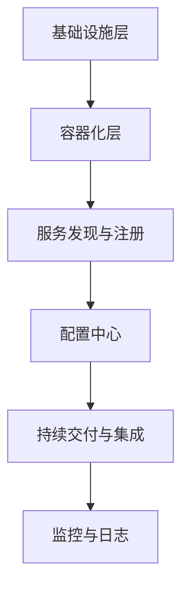
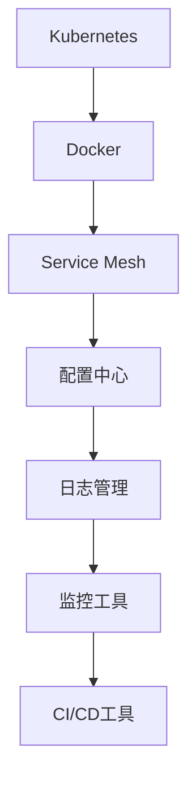
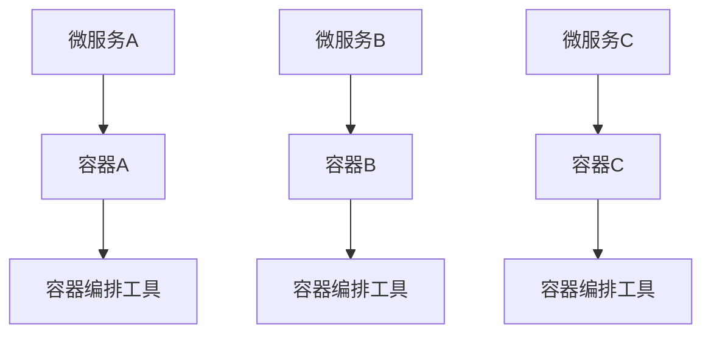
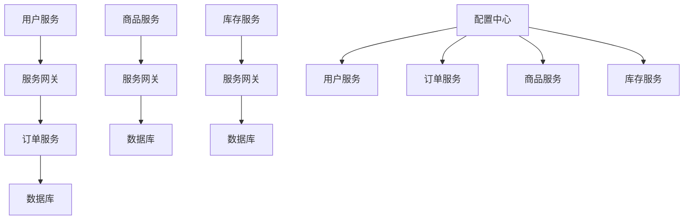
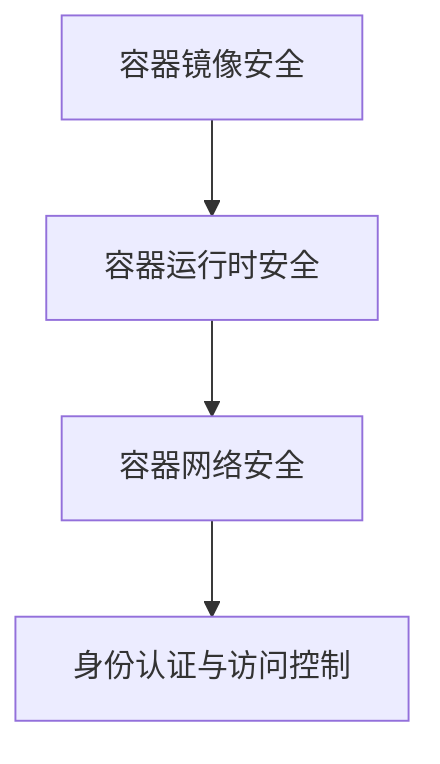

                 

## 文章标题：容器化与Kubernetes：云原生应用部署管理

> 关键词：容器化，Kubernetes，云原生，应用部署，管理

> 摘要：本文将深入探讨容器化与Kubernetes在云原生应用部署管理中的重要性。首先，我们将简要介绍容器化技术及其优势，然后详细讲解Kubernetes的基本概念和核心功能。接着，本文将分部分介绍Kubernetes在应用部署、服务发现与负载均衡、编排与管理等方面的实践。最后，我们将探讨云原生应用的特点、架构以及未来的发展趋势，为读者提供全面的技术参考和实践指导。

## 容器化与Kubernetes：云原生应用部署管理

### 目录大纲

- **第一部分：容器化技术基础**
  - **1. 容器概述**
    - 1.1 容器的定义与特点
    - 1.2 容器与传统虚拟化的区别
    - 1.3 容器的生命周期管理
  - **2. Docker技术**
    - 2.1 Docker简介
    - 2.2 Docker镜像与容器
    - 2.3 Dockerfile与构建镜像
  - **3. 容器编排**
    - 3.1 容器编排概述
    - 3.2 Kubernetes简介
    - 3.3 Kubernetes核心概念
  - **4. 容器网络**
    - 4.1 容器网络概述
    - 4.2 容器网络模型
    - 4.3 容器网络配置
  - **5. 容器存储**
    - 5.1 容器存储概述
    - 5.2 容器存储解决方案
    - 5.3 容器存储配置

- **第二部分：Kubernetes应用实践**
  - **6. Kubernetes部署应用**
    - 6.1 Kubernetes部署原理
    - 6.2 Kubernetes部署步骤
    - 6.3 Kubernetes部署策略
  - **7. Kubernetes服务发现与负载均衡**
    - 7.1 Kubernetes服务发现
    - 7.2 Kubernetes负载均衡
    - 7.3 Kubernetes Ingress
  - **8. Kubernetes编排与管理**
    - 8.1 Kubernetes编排原理
    - 8.2 Kubernetes资源管理
    - 8.3 Kubernetes集群管理
  - **9. Kubernetes自动化运维**
    - 9.1 Kubernetes自动化运维概述
    - 9.2 Kubernetes自动化部署
    - 9.3 Kubernetes自动化监控
  - **10. Kubernetes高可用与扩展性**
    - 10.1 Kubernetes高可用性设计
    - 10.2 Kubernetes集群扩展
    - 10.3 Kubernetes性能优化

- **第三部分：云原生应用部署与管理**
  - **11. 云原生应用概述**
    - 11.1 云原生应用的特点
    - 11.2 云原生应用的架构
    - 11.3 云原生应用的生态系统
  - **12. 微服务与容器化**
    - 12.1 微服务概述
    - 12.2 微服务与容器化
    - 12.3 微服务架构实践
  - **13. 容器镜像与仓库**
    - 13.1 容器镜像概述
    - 13.2 容器镜像构建
    - 13.3 容器镜像仓库
  - **14. 容器安全**
    - 14.1 容器安全概述
    - 14.2 容器镜像安全
    - 14.3 容器网络安全
  - **15. 容器化与Kubernetes的集成应用**
    - 15.1 集成应用概述
    - 15.2 集成应用实战
    - 15.3 集成应用案例分析
  - **16. 未来展望与趋势**
    - 16.1 容器化与Kubernetes的发展趋势
    - 16.2 云原生时代的挑战与机遇
    - 16.3 容器化与Kubernetes的未来

---

在接下来的章节中，我们将逐步深入探讨容器化与Kubernetes的技术基础、应用实践以及云原生应用部署与管理，为读者提供全面的技术视角和实践指导。希望本文能为您在容器化与Kubernetes领域的探索之旅提供有力的支持。让我们开始这一趟技术之旅吧！## 第一部分：容器化技术基础

### 1. 容器概述

#### 1.1 容器的定义与特点

容器是一种轻量级、可移植、自给自足的软件打包形式。它通过操作系统级的虚拟化技术，在宿主机上创建出一个与宿主机隔离的运行环境，使得应用程序可以在不同的操作系统、硬件和云平台上运行，而无需修改代码。

容器的主要特点包括：

- **轻量级**：容器共享宿主机的操作系统内核，因此相较于虚拟机，容器具有更低的资源开销。
- **可移植性**：容器打包了应用程序及其依赖项，因此可以在不同的环境中无缝运行，无需重新配置环境。
- **自给自足**：容器打包了应用程序及其运行时环境，确保应用程序在任何环境下都能正常运行。
- **可扩展性**：容器可以轻松地通过增加实例数量来扩展应用程序的容量。

#### 1.2 容器与传统虚拟化的区别

容器与传统虚拟化（如VMware）在技术实现和性能上有显著差异：

- **隔离层次**：容器通过操作系统级的虚拟化技术实现，而传统虚拟化通过硬件层的虚拟化技术实现。
- **资源开销**：容器由于共享宿主机的操作系统内核，具有更低的资源开销；传统虚拟化需要独立操作系统，因此资源开销较高。
- **性能**：容器在性能上优于传统虚拟化，因为它们避免了重复的开销和上下文切换。

#### 1.3 容器的生命周期管理

容器生命周期包括创建、启动、运行、停止和删除等阶段。以下是一个简单的容器生命周期管理流程：

1. **创建容器**：通过Docker命令创建一个新的容器实例。
2. **启动容器**：使用`docker start`命令启动已创建的容器。
3. **运行容器**：容器启动后，应用程序开始运行。
4. **停止容器**：使用`docker stop`命令停止正在运行的容器。
5. **删除容器**：使用`docker rm`命令删除容器实例。

以下是一个简单的Docker容器生命周期管理的示例：

```bash
# 创建一个Nginx容器
docker run -d -p 8080:80 nginx

# 查看正在运行的容器
docker ps

# 停止容器
docker stop [容器ID或名称]

# 删除容器
docker rm [容器ID或名称]
```

### 2. Docker技术

#### 2.1 Docker简介

Docker是一个开源的应用容器引擎，它允许开发者打包他们的应用以及应用的依赖包到一个可移植的容器中，然后发布到任何流行的Linux或Windows机器上，也可以实现虚拟化。容器是完全使用沙箱机制，相互之间不会有任何接口（类似 iPhone 的 app）而且更轻量级。

Docker的主要功能包括：

- **容器化**：将应用程序及其依赖项打包成一个容器，确保在不同环境中的一致性。
- **镜像管理**：创建、存储和管理容器镜像，以便快速部署和扩展应用程序。
- **容器编排**：通过Docker Compose和Docker Swarm等工具，管理和编排多个容器实例。

#### 2.2 Docker镜像与容器

Docker镜像是一种轻量级、可执行的软件包，它包含了应用程序运行所需的全部依赖项和配置文件。容器则是基于镜像创建的、可以运行的实例。

- **Docker镜像**：Docker镜像是一个只读的模板，用于创建容器。镜像是分层存储的，每个层都包含了一个文件系统的更改。
- **Docker容器**：容器是基于镜像创建的、可以运行的实例。容器是可读写的，可以修改镜像中的内容。

以下是一个简单的Docker镜像和容器创建的示例：

```bash
# 查找Nginx镜像
docker pull nginx

# 创建并启动一个Nginx容器
docker run -d -p 8080:80 nginx

# 查看运行的容器
docker ps

# 停止容器
docker stop [容器ID或名称]

# 删除容器
docker rm [容器ID或名称]
```

#### 2.3 Dockerfile与构建镜像

Dockerfile是一个文本文件，用于指定如何构建Docker镜像。通过编写Dockerfile，可以定义应用程序的依赖项、环境变量、文件复制等操作。

以下是一个简单的Dockerfile示例：

```Dockerfile
# 使用官方Nginx镜像作为基础镜像
FROM nginx:latest

# 设置工作目录
WORKDIR /usr/share/nginx/html

# 复制本地文件到容器中的工作目录
COPY . /usr/share/nginx/html

# 暴露80端口，允许外部访问
EXPOSE 80

# 启动Nginx服务
CMD ["nginx", "-g", "daemon off;"]
```

通过以下命令，可以构建并运行基于Dockerfile的镜像：

```bash
# 构建镜像
docker build -t my-nginx .

# 运行容器
docker run -d -p 8080:80 my-nginx
```

### 3. 容器编排

容器编排是指管理、部署和扩展容器化应用程序的过程。Kubernetes是当前最流行的容器编排工具，它提供了一个强大的平台，用于自动化容器的部署、扩展和管理。

#### 3.1 容器编排概述

容器编排的主要目标是简化容器化应用程序的部署和管理，实现自动化和高效。容器编排工具提供以下功能：

- **自动部署**：根据配置自动部署容器化应用程序。
- **自动扩展**：根据需求自动调整容器的数量。
- **服务发现与负载均衡**：自动发现容器并提供负载均衡。
- **监控与日志**：监控容器状态并提供日志收集和分析。

#### 3.2 Kubernetes简介

Kubernetes是一个开源的容器编排平台，用于自动化部署、扩展和管理容器化应用程序。它提供了强大的集群管理和调度功能，支持多种操作系统和硬件平台。

Kubernetes的主要组件包括：

- **主节点（Master）**：负责集群的管理和控制，包括调度器、控制器管理器和API服务器等。
- **工作节点（Node）**：运行容器化应用程序的物理或虚拟机。
- **Pod**：Kubernetes中的最小部署单元，一个Pod可以包含一个或多个容器。

以下是一个简单的Kubernetes集群部署的示例：

```yaml
# Kubernetes集群配置文件
apiVersion: clusterapi.k8s.io/v1
kind: Cluster
metadata:
  name: my-cluster
spec:
  controlPlane:
    kubeadmConfig:
      image: kubeadm:latest
      containerName: kube-apiserver
      command:
        - "/bin/bash"
        - "-c"
        - "kubeadm init --pod-network-cidr=10.244.0.0/16"
      env:
        - name: KUBEADMvídon:`-v 2`

      resources:
        requests:
          memory: "512Mi"
          cpu: "250m"

  nodes:
    - name: my-node
      kubeadmConfig:
        image: kubeadm:latest
        containerName: kubelet
        command:
          - "/bin/bash"
          - "-c"
          - "kubeadm join --token <token> <control-plane-ip>:6443 --discovery-token-ca-cert-hash sha256:<hash>"
        env:
          - name: KUBELETvídon:`-v 2`

        resources:
          requests:
            memory: "1Gi"
            cpu: "500m"
```

通过以下命令，可以部署Kubernetes集群：

```bash
# 部署Kubernetes集群
kubectl create -f cluster.yaml
```

#### 3.3 Kubernetes核心概念

Kubernetes的核心概念包括：

- **Pod**：Pod是Kubernetes中的最小部署单元，可以包含一个或多个容器。
- **ReplicaSet**：确保特定数量的Pod副本始终运行。
- **Deployment**：提供声明式更新和管理ReplicaSet的接口。
- **Service**：提供集群内部或外部的服务访问。
- **Ingress**：提供外部访问集群内部服务的接口。

以下是一个简单的Kubernetes Pod和ReplicaSet配置的示例：

```yaml
# Kubernetes Pod 配置
apiVersion: v1
kind: Pod
metadata:
  name: my-pod
spec:
  containers:
  - name: my-container
    image: nginx:latest

# Kubernetes ReplicaSet 配置
apiVersion: apps/v1
kind: ReplicaSet
metadata:
  name: my-replicaset
spec:
  replicas: 3
  selector:
    matchLabels:
      app: my-app
  template:
    metadata:
      labels:
        app: my-app
    spec:
      containers:
      - name: my-container
        image: nginx:latest
```

通过以下命令，可以部署Kubernetes Pod和ReplicaSet：

```bash
# 部署Kubernetes Pod
kubectl create -f pod.yaml

# 部署Kubernetes ReplicaSet
kubectl create -f replicaset.yaml
```

### 4. 容器网络

容器网络是指容器之间的通信机制。在Kubernetes中，容器网络通过CNI（Container Network Interface）插件实现，提供了灵活的网络配置和隔离。

#### 4.1 容器网络概述

容器网络的主要目标是实现容器之间的通信，同时保持网络隔离和安全性。容器网络的关键特性包括：

- **网络隔离**：每个容器都有独立的网络命名空间，确保容器之间的网络隔离。
- **多宿主网络**：容器可以访问宿主机的网络接口。
- **动态IP分配**：容器启动时自动分配IP地址。
- **容器间通信**：通过容器IP或DNS进行容器间的通信。

以下是一个简单的容器网络配置示例：

```bash
# 启动一个Nginx容器，并查看其IP地址
docker run -d -p 8080:80 nginx
docker inspect --format '{{ .NetworkSettings.IPAddress }}' [容器ID或名称]

# 使用容器IP访问Nginx服务
curl [容器IP]:8080
```

#### 4.2 容器网络模型

Kubernetes采用了CNI（Container Network Interface）标准，提供了多种网络插件，如Calico、Flannel和Weave等。以下是常见的容器网络模型：

- **Calico**：基于BGP（边界网关协议）实现的容器网络模型，提供了IP路由和网络策略。
- **Flannel**：基于VXLAN或IP隧道实现的容器网络模型，提供了网络隔离和负载均衡。
- **Weave**：基于容器IP实现的简单容器网络模型，适用于简单的容器部署。

以下是一个简单的Calico网络配置示例：

```yaml
# Kubernetes Calico网络插件配置
apiVersion: networking.k8s.io/v1
kind: NetworkPolicy
metadata:
  name: my-network-policy
spec:
  podSelector:
    matchLabels:
      app: my-app
  policyTypes:
  - Ingress
  - Egress
```

通过以下命令，可以部署Calico网络插件：

```bash
# 部署Calico网络插件
kubectl create -f calico-network-policy.yaml
```

#### 4.3 容器网络配置

在Kubernetes中，容器网络配置通常通过Kubernetes网络策略和CNI插件实现。以下是常见的容器网络配置步骤：

1. **选择网络插件**：根据部署环境选择合适的CNI插件，如Calico、Flannel或Weave。
2. **配置网络策略**：定义网络策略，如访问控制、端口映射等。
3. **部署网络插件**：部署选择的CNI插件，确保容器网络正常工作。
4. **配置容器网络**：为容器配置网络接口和IP地址。

以下是一个简单的Kubernetes网络策略配置示例：

```yaml
# Kubernetes网络策略配置
apiVersion: networking.k8s.io/v1
kind: NetworkPolicy
metadata:
  name: my-network-policy
spec:
  podSelector:
    matchLabels:
      app: my-app
  policyTypes:
  - Ingress
  ingress:
    from:
    - podSelector:
        matchLabels:
          app: my-external-app
    ports:
    - protocol: TCP
      port: 80
      targetPort: 8080
```

通过以下命令，可以部署Kubernetes网络策略：

```bash
# 部署Kubernetes网络策略
kubectl create -f network-policy.yaml
```

### 5. 容器存储

容器存储是指为容器提供持久化存储的机制。在Kubernetes中，容器存储通过PV（Persistent Volume）和PVC（Persistent Volume Claim）实现。

#### 5.1 容器存储概述

容器存储的主要目标是提供持久化存储，确保容器退出后数据仍然存在。容器存储的关键特性包括：

- **持久性**：容器存储提供的数据不会因容器退出而丢失。
- **可扩展性**：容器存储可以动态扩展，以满足应用程序的需求。
- **可靠性**：容器存储通常具有高可用性和数据冗余机制。

以下是一个简单的容器存储配置示例：

```yaml
# Kubernetes PVC配置
apiVersion: v1
kind: PersistentVolumeClaim
metadata:
  name: my-pvc
spec:
  accessModes:
    - ReadWriteOnce
  resources:
    requests:
      storage: 1Gi
```

通过以下命令，可以部署Kubernetes PVC：

```bash
# 部署Kubernetes PVC
kubectl create -f pvc.yaml
```

#### 5.2 容器存储解决方案

常见的容器存储解决方案包括：

- **本地存储**：使用宿主机本地存储作为容器存储。
- **网络存储**：使用网络存储解决方案，如NFS、iSCSI和Ceph等。
- **云存储**：使用云服务商提供的存储服务，如AWS S3、Azure Blob Storage和Google Cloud Storage等。

以下是一个简单的本地存储配置示例：

```yaml
# Kubernetes本地存储配置
apiVersion: v1
kind: PersistentVolume
metadata:
  name: my-pv
spec:
  capacity:
    storage: 1Gi
  accessModes:
    - ReadWriteOnce
  persistentVolumeReclaimPolicy: Retain
  local:
    path: /path/to/local/storage
```

通过以下命令，可以部署Kubernetes本地存储：

```bash
# 部署Kubernetes本地存储
kubectl create -f pv.yaml
```

#### 5.3 容器存储配置

在Kubernetes中，容器存储配置通常通过PV和PVC实现。以下是常见的容器存储配置步骤：

1. **配置PV**：定义PersistentVolume，指定存储类型、容量和访问模式。
2. **配置PVC**：定义PersistentVolumeClaim，指定存储需求。
3. **挂载存储**：在容器配置中挂载PVC，确保容器可以使用持久化存储。

以下是一个简单的容器存储配置示例：

```yaml
# Kubernetes Pod配置
apiVersion: v1
kind: Pod
metadata:
  name: my-pod
spec:
  containers:
  - name: my-container
    image: nginx:latest
    volumeMounts:
    - name: my-storage
      mountPath: /data
  volumes:
  - name: my-storage
    persistentVolumeClaim:
      claimName: my-pvc
```

通过以下命令，可以部署Kubernetes Pod：

```bash
# 部署Kubernetes Pod
kubectl create -f pod-with-storage.yaml
```

### 总结

容器化技术以其轻量级、可移植性和自给自足的特性，在云原生应用部署管理中发挥着重要作用。Docker作为容器化技术的代表，提供了强大的镜像管理和容器编排功能。Kubernetes作为容器编排平台，提供了丰富的部署、管理和扩展功能。通过本文的介绍，我们了解了容器化技术的基础知识、Docker技术、容器编排、容器网络和存储等方面的内容，为后续的Kubernetes应用实践和云原生应用部署与管理奠定了基础。## 第二部分：Kubernetes应用实践

在容器化技术的应用中，Kubernetes作为最流行的容器编排工具，发挥着至关重要的作用。本部分将详细介绍Kubernetes在部署应用、服务发现与负载均衡、编排与管理、自动化运维、高可用性与扩展性等方面的实践。

### 6. Kubernetes部署应用

#### 6.1 Kubernetes部署原理

Kubernetes的部署原理基于声明式API，通过YAML配置文件描述应用程序的状态，Kubernetes系统会自动将实际状态调整到预期状态。以下是Kubernetes部署的基本流程：

1. **创建部署对象**：通过Kubernetes API创建Deployment对象。
2. **设置副本数量**：Deployment对象根据配置的副本数量创建Pod。
3. **容器镜像拉取**：Kubernetes通过Docker API从镜像仓库拉取容器镜像。
4. **容器启动**：Kubernetes启动容器并设置所需的资源限制。
5. **健康检查**：Kubernetes对容器进行健康检查，确保服务正常运行。

以下是一个简单的Kubernetes Deployment配置示例：

```yaml
apiVersion: apps/v1
kind: Deployment
metadata:
  name: my-deployment
spec:
  replicas: 3
  selector:
    matchLabels:
      app: my-app
  template:
    metadata:
      labels:
        app: my-app
    spec:
      containers:
      - name: my-container
        image: nginx:latest
        ports:
        - containerPort: 80
```

#### 6.2 Kubernetes部署步骤

以下是部署Kubernetes应用程序的基本步骤：

1. **编写YAML配置文件**：根据应用程序的需求编写Deployment、Service和其他资源对象的YAML配置文件。
2. **创建命名空间**：为应用程序创建命名空间，以便组织和管理资源。
3. **应用配置文件**：使用kubectl命令应用配置文件，创建和管理Kubernetes资源。
4. **监控部署状态**：通过kubectl命令行工具或Kubernetes仪表板监控部署状态。
5. **扩容与缩容**：根据负载情况调整副本数量，实现自动扩容与缩容。

以下是一个简单的部署步骤示例：

```bash
# 创建命名空间
kubectl create namespace my-namespace

# 应用Deployment配置文件
kubectl apply -f deployment.yaml

# 查看部署状态
kubectl get deployment -n my-namespace

# 查看Pod状态
kubectl get pods -n my-namespace
```

#### 6.3 Kubernetes部署策略

Kubernetes提供了多种部署策略，以适应不同的部署场景和需求：

- **滚动更新（Rolling Update）**：逐步更新Pod，确保服务的高可用性。
- **回滚（Rollback）**：将应用程序回滚到之前的版本。
- **替换更新（Replace Update）**：直接替换所有Pod。

以下是一个简单的滚动更新配置示例：

```yaml
apiVersion: apps/v1
kind: Deployment
metadata:
  name: my-deployment
spec:
  replicas: 3
  selector:
    matchLabels:
      app: my-app
  template:
    metadata:
      labels:
        app: my-app
    spec:
      containers:
      - name: my-container
        image: nginx:latest
        ports:
        - containerPort: 80
  strategy:
    type: RollingUpdate
    rollingUpdate:
      maxSurge: 1
      maxUnavailable: 1
```

### 7. Kubernetes服务发现与负载均衡

#### 7.1 Kubernetes服务发现

Kubernetes服务发现是指应用程序如何在集群中找到其他服务的过程。Kubernetes提供了内置的服务发现机制，通过Service对象实现。

- **ClusterIP**：集群内部服务访问的IP地址。
- **NodePort**：通过宿主机端口暴露服务。
- **LoadBalancer**：通过云服务商提供的负载均衡器暴露服务。

以下是一个简单的Service配置示例：

```yaml
apiVersion: v1
kind: Service
metadata:
  name: my-service
spec:
  selector:
    app: my-app
  ports:
    - name: http
      protocol: TCP
      port: 80
      targetPort: 8080
  type: ClusterIP
```

#### 7.2 Kubernetes负载均衡

Kubernetes通过内置的负载均衡机制，实现服务间的流量分配。负载均衡策略包括：

- **RoundRobin**：轮询分配流量。
- **WeightedRoundRobin**：基于权重分配流量。
- **LeastRequests**：基于最少请求分配流量。

以下是一个简单的Ingress配置示例，用于实现负载均衡：

```yaml
apiVersion: networking.k8s.io/v1
kind: Ingress
metadata:
  name: my-ingress
spec:
  rules:
  - host: my-app.example.com
    http:
      paths:
      - path: /
        pathType: Prefix
        backend:
          service:
            name: my-service
            port:
              number: 80
```

#### 7.3 Kubernetes Ingress

Ingress是Kubernetes中的入口控制器，用于管理外部访问集群内部服务。Ingress提供了基于域名和路径的请求路由功能，并支持TLS终止、负载均衡和性能优化。

以下是一个简单的Ingress配置示例：

```yaml
apiVersion: networking.k8s.io/v1
kind: Ingress
metadata:
  name: my-ingress
  annotations:
    kubernetes.io/ingress.class: "nginx"
spec:
  tls:
  - hosts:
    - my-app.example.com
    secretName: my-tls-secret
  rules:
  - host: my-app.example.com
    http:
      paths:
      - path: /
        pathType: Prefix
        backend:
          service:
            name: my-service
            port:
              number: 80
```

### 8. Kubernetes编排与管理

#### 8.1 Kubernetes编排原理

Kubernetes编排是指自动管理容器化应用程序的过程，包括部署、扩展、更新和监控等。Kubernetes通过声明式API和控制器模式实现编排：

- **声明式API**：通过YAML配置文件描述应用程序的状态。
- **控制器模式**：Kubernetes系统持续监控实际状态，并根据声明式API自动调整。

以下是一个简单的Kubernetes控制器模式示例：

```bash
# 监控Pod状态
kubectl get pods

# 如果Pod失败，控制器会重新创建Pod
kubectl delete pod [失败PodID]
```

#### 8.2 Kubernetes资源管理

Kubernetes资源管理是指管理和配置Kubernetes集群中的各种资源，如Pod、Service、Deployment、StatefulSet等。资源管理的关键点包括：

- **资源定义**：通过YAML配置文件定义资源。
- **资源监控**：使用kubectl命令行工具或第三方监控工具监控资源状态。
- **资源更新**：根据实际需求更新资源配置。

以下是一个简单的资源管理示例：

```bash
# 创建Deployment
kubectl create deployment my-deployment --image=nginx:latest

# 更新Deployment
kubectl set image deployment/my-deployment my-container=nginx:latest

# 查看资源状态
kubectl get deployment
```

#### 8.3 Kubernetes集群管理

Kubernetes集群管理是指管理和维护Kubernetes集群的过程，包括集群升级、节点管理、监控和日志管理等。以下是一些常用的集群管理命令：

- **集群升级**：使用`kubectl apply`命令升级集群版本。
- **节点管理**：使用`kubectl drain`命令管理节点，如将节点从集群中移除或添加节点。
- **监控和日志管理**：使用第三方工具，如Prometheus和Grafana进行监控，使用ELK（Elasticsearch、Logstash、Kibana）进行日志管理。

以下是一个简单的集群管理示例：

```bash
# 集群升级
kubectl apply -f cluster-upgrade.yaml

# 管理节点
kubectl drain node1 --delete-local-data --force

# 添加节点
kubectl apply -f node-addition.yaml

# 查看节点状态
kubectl get nodes
```

### 9. Kubernetes自动化运维

#### 9.1 Kubernetes自动化运维概述

Kubernetes自动化运维是指通过自动化工具和脚本，简化Kubernetes集群的部署、管理和监控过程。自动化运维的关键点包括：

- **自动化部署**：使用CI/CD工具自动化部署应用程序。
- **自动化监控**：使用自动化工具监控集群状态和资源使用情况。
- **自动化扩缩容**：根据负载自动调整集群资源。

以下是一些常用的Kubernetes自动化运维工具：

- **Helm**：Kubernetes的包管理工具，用于打包、部署和管理应用程序。
- **Kubernetes Operator**：基于Kubernetes API的自动化运维工具，用于自动化管理应用程序。
- **Kubernetes Dashboard**：Kubernetes的Web界面，用于监控和管理集群。

#### 9.2 Kubernetes自动化部署

Kubernetes自动化部署是指通过CI/CD工具，如Jenkins、GitLab CI等，实现应用程序的自动化部署。以下是一个简单的自动化部署示例：

```yaml
# Jenkinsfile
stages:
  - build
  - deploy

build:
  stage: build
  script:
    - docker build -t my-app .
    - docker push my-app

deploy:
  stage: deploy
  script:
    - kubectl apply -f deployment.yaml
```

#### 9.3 Kubernetes自动化监控

Kubernetes自动化监控是指使用自动化工具，如Prometheus、Grafana等，实现集群状态和资源使用的实时监控。以下是一个简单的自动化监控示例：

```yaml
# Prometheus配置文件
scrape_configs:
  - job_name: 'kubernetes-apiservers'
    static_configs:
    - targets:
      - <apiserver-url>

# Grafana配置文件
kubernetes_sd_configs:
  - name: kubernetes
    role: service
metricsSources:
  - type: kubernetes
    cluster: <kubernetes-cluster>
    scrape_tickers:
      - name: kubernetes_pods
        metric_name: kube_pod_info
```

### 10. Kubernetes高可用性与扩展性

#### 10.1 Kubernetes高可用性设计

Kubernetes高可用性设计是指通过多个控制平面节点、工作节点和数据存储，确保集群在故障情况下能够快速恢复。以下是一些实现高可用性的关键点：

- **多主节点**：使用多个控制平面节点，确保主节点故障时能够自动切换。
- **数据持久化**：使用外部存储，如Ceph、GlusterFS等，确保数据不丢失。
- **故障转移**：使用Kubernetes集群自动化故障转移功能，确保服务可用。

以下是一个简单的多主节点配置示例：

```yaml
# Kubernetes主节点配置
kind: Cluster
apiVersion: cluster-api.k8s.io/v1
metadata:
  name: my-cluster
spec:
  controlPlane:
    kubeadmConfig:
      image: kubeadm:latest
      containerName: kube-apiserver
      command:
        - "/bin/bash"
        - "-c"
        - "kubeadm init --pod-network-cidr=10.244.0.0/16"
      env:
        - name: KUBEADMvídon:`-v 2`

      resources:
        requests:
          memory: "512Mi"
          cpu: "250m"

  nodes:
    - name: my-node
      kubeadmConfig:
        image: kubeadm:latest
        containerName: kubelet
        command:
          - "/bin/bash"
          - "-c"
          - "kubeadm join --token <token> <control-plane-ip>:6443 --discovery-token-ca-cert-hash sha256:<hash>"
        env:
          - name: KUBELETvídon:`-v 2`

        resources:
          requests:
            memory: "1Gi"
            cpu: "500m"
```

#### 10.2 Kubernetes集群扩展

Kubernetes集群扩展是指根据负载需求，动态增加或减少集群中的节点数量。以下是一些实现集群扩展的方法：

- **水平扩展**：使用Deployment、StatefulSet等控制器自动扩展Pod数量。
- **垂直扩展**：通过调整Pod的资源限制，实现容器性能的提升。
- **集群管理工具**：使用Kubeadm、Kops等集群管理工具，实现自动化集群扩展。

以下是一个简单的水平扩展示例：

```yaml
# Deployment配置文件
apiVersion: apps/v1
kind: Deployment
metadata:
  name: my-deployment
spec:
  replicas: 3
  selector:
    matchLabels:
      app: my-app
  template:
    metadata:
      labels:
        app: my-app
    spec:
      containers:
      - name: my-container
        image: nginx:latest
        ports:
        - containerPort: 80
```

通过以下命令，可以扩展Kubernetes集群：

```bash
# 扩展Deployment副本数量
kubectl scale deployment/my-deployment --replicas=5
```

#### 10.3 Kubernetes性能优化

Kubernetes性能优化是指通过调整配置和优化资源使用，提高集群的性能和稳定性。以下是一些性能优化的关键点：

- **资源限制**：为容器设置合理的CPU和内存限制，避免资源争用。
- **网络优化**：调整容器网络配置，提高网络传输效率。
- **存储优化**：选择合适的存储解决方案，提高存储性能。
- **监控与日志**：使用监控工具和日志分析工具，及时发现和解决问题。

以下是一个简单的资源限制示例：

```yaml
# Pod配置文件
apiVersion: v1
kind: Pod
metadata:
  name: my-pod
spec:
  containers:
  - name: my-container
    image: nginx:latest
    resources:
      limits:
        memory: "512Mi"
        cpu: "500m"
      requests:
        memory: "256Mi"
        cpu: "250m"
```

通过以上章节的介绍，我们了解了Kubernetes在部署应用、服务发现与负载均衡、编排与管理、自动化运维、高可用性与扩展性等方面的实践。Kubernetes为容器化应用提供了强大的部署和管理能力，通过合理配置和优化，可以实现高效、稳定和可扩展的云原生应用部署与管理。## 第三部分：云原生应用部署与管理

### 11. 云原生应用概述

#### 11.1 云原生应用的特点

云原生应用是一种专为云计算环境设计的应用程序，其特点包括：

- **微服务架构**：云原生应用采用微服务架构，将应用程序拆分成多个独立的服务模块，每个服务模块负责特定功能，便于管理和扩展。
- **容器化**：云原生应用使用容器化技术，确保应用的可移植性和高效运行。
- **动态管理**：云原生应用通过自动化工具和平台（如Kubernetes）实现动态部署、扩展和管理。
- **弹性伸缩**：云原生应用可以根据负载动态调整资源，实现高效资源利用。
- **持续交付**：云原生应用采用持续交付和集成（CI/CD）流程，快速迭代和发布新功能。

#### 11.2 云原生应用的架构

云原生应用的架构通常包括以下层次：

- **基础设施层**：提供计算、存储和网络资源，如Kubernetes集群、云服务商基础设施等。
- **容器化层**：使用Docker等技术容器化应用程序，确保可移植性和隔离性。
- **服务发现与注册**：使用Consul、Eureka等工具实现服务发现和注册，方便应用程序间通信。
- **配置中心**：使用Apollo、Nacos等工具实现配置管理，方便配置的集中管理和动态更新。
- **持续交付与集成**：使用Jenkins、GitLab CI等工具实现自动化构建、测试和部署。
- **监控与日志**：使用Prometheus、Grafana、ELK等工具实现监控和日志管理。

以下是一个简单的云原生应用架构示意图：



#### 11.3 云原生应用的生态系统

云原生应用的生态系统包括多种工具和平台，以下是一些常见的组件：

- **Kubernetes**：容器编排平台，用于部署和管理容器化应用。
- **Docker**：容器化技术，用于创建和管理容器镜像。
- **Service Mesh**：如Istio、Linkerd等，用于管理服务间通信和安全。
- **配置中心**：如Apollo、Nacos等，用于配置管理。
- **日志管理**：如ELK（Elasticsearch、Logstash、Kibana）等，用于日志收集和分析。
- **监控工具**：如Prometheus、Grafana等，用于监控和告警。
- **CI/CD工具**：如Jenkins、GitLab CI等，用于自动化构建和部署。

以下是一个简单的云原生应用生态系统示意图：



### 12. 微服务与容器化

#### 12.1 微服务概述

微服务是一种软件架构风格，将应用程序拆分成多个小型、独立的服务模块，每个服务模块负责特定功能。微服务的核心特点包括：

- **独立性**：每个服务模块独立开发、部署和扩展。
- **分布式**：服务模块分布在不同服务器上，通过网络进行通信。
- **自治**：每个服务模块有自己的数据存储和业务逻辑。
- **容器化**：服务模块使用容器技术进行打包和运行。

#### 12.2 微服务与容器化

容器化技术是微服务架构的关键支撑，为微服务提供了以下优势：

- **可移植性**：容器使得微服务可以在不同环境中无缝运行，无需修改代码。
- **隔离性**：容器保证了服务模块之间的隔离，降低了系统耦合度。
- **弹性伸缩**：容器化微服务可以动态调整资源，满足负载变化。
- **持续交付**：容器化微服务支持快速迭代和部署，提高开发效率。

以下是一个简单的微服务与容器化架构示意图：



#### 12.3 微服务架构实践

微服务架构实践包括以下关键步骤：

1. **服务拆分**：根据业务需求将应用程序拆分成多个独立的服务模块。
2. **容器化服务**：使用Docker等工具将服务模块容器化，确保可移植性。
3. **服务注册与发现**：使用Consul、Eureka等工具实现服务注册与发现，方便服务间通信。
4. **服务网关**：使用Spring Cloud Gateway、Kong等工具实现服务网关，统一服务入口。
5. **分布式配置中心**：使用Apollo、Nacos等工具实现分布式配置管理。
6. **服务监控与日志**：使用Prometheus、Grafana、ELK等工具实现服务监控和日志管理。

以下是一个简单的微服务架构实践示例：



### 13. 容器镜像与仓库

#### 13.1 容器镜像概述

容器镜像是一种轻量级、可执行的软件包，包含了应用程序及其依赖项。容器镜像是容器运行时的基础，类似于虚拟机中的操作系统镜像。容器镜像的主要特点包括：

- **分层存储**：容器镜像采用分层存储机制，每个层代表了一个文件系统的更改。
- **轻量级**：容器镜像相对于虚拟机镜像具有更低的存储和传输开销。
- **可执行性**：容器镜像包含了应用程序运行所需的全部依赖项，因此可以在不同的环境中无缝运行。

以下是一个简单的容器镜像构建示例：

```bash
# 编写Dockerfile
FROM nginx:latest
COPY . /usr/share/nginx/html
EXPOSE 80

# 构建镜像
docker build -t my-app .

# 运行容器
docker run -d -p 8080:80 my-app
```

#### 13.2 容器镜像构建

容器镜像构建是指将应用程序代码和依赖项打包成容器镜像的过程。以下是一个简单的容器镜像构建流程：

1. **编写Dockerfile**：根据应用程序需求编写Dockerfile，指定基础镜像、文件复制和容器配置等。
2. **构建镜像**：使用`docker build`命令构建容器镜像。
3. **推送镜像**：将容器镜像推送到镜像仓库，如Docker Hub、Harbor等。

以下是一个简单的容器镜像构建示例：

```bash
# 编写Dockerfile
FROM nginx:latest
COPY . /usr/share/nginx/html
EXPOSE 80

# 构建镜像
docker build -t my-app .

# 推送镜像
docker push my-app
```

#### 13.3 容器镜像仓库

容器镜像仓库是一种用于存储和分发容器镜像的服务器。常见的容器镜像仓库包括：

- **Docker Hub**：Docker官方的镜像仓库，提供了丰富的开源镜像。
- **Harbor**：基于Docker Hub的开源镜像仓库，提供了安全、合规和易于使用的镜像管理功能。
- **Quay**：提供商业化的镜像仓库服务，适用于企业级场景。

以下是一个简单的容器镜像仓库配置示例：

```yaml
# Harbor配置文件
version: 2.0
controller:
  image:VMware Tanzu
  tag: 2.4.0
  config:
    admin_password: admin123
    harbor_admin_password: admin123
    secret_key: secret123
    harbor_database:
      image: mysql:5.7
      tag: 8.0
      env:
        MYSQL_ROOT_PASSWORD: admin123
        MYSQL_DATABASE: harbor
        MYSQL_USER: harbor
        MYSQL_PASSWORD: harbor
    redis:
      image: redis:5.0
      tag: 8.0
    registry:
      version: v2
      image: vmware/photon-registry:2.6.0
      tag: 2.6.0
    log:
      retention_days: 30
      log_level: info

# Harbor安装脚本
# 以下命令用于安装Harbor
sudo docker-compose -f harbor.yml up -d
```

通过以上章节的介绍，我们了解了云原生应用的特点、架构和生态系统，以及微服务与容器化的实践。此外，我们还介绍了容器镜像与仓库的管理。这些知识为云原生应用的部署与管理提供了坚实的基础。## 14. 容器安全

容器安全是确保容器化应用程序在开发和部署过程中不受威胁的关键。随着容器技术的广泛应用，容器安全变得越来越重要。本部分将介绍容器安全概述、容器镜像安全和容器网络安全，并提供一些最佳实践。

#### 14.1 容器安全概述

容器安全主要关注以下几个方面：

- **容器镜像安全**：确保容器镜像不包含恶意软件、漏洞或不受信任的依赖项。
- **容器运行时安全**：确保容器在运行时不会受到攻击，如恶意代码执行、资源滥用等。
- **容器网络安全**：确保容器之间的通信安全，防止数据泄露和未经授权的访问。

以下是一个简单的容器安全架构示意图：



#### 14.2 容器镜像安全

容器镜像安全是确保容器镜像不包含恶意软件、漏洞或不受信任的依赖项的过程。以下是一些常见的容器镜像安全措施：

1. **使用官方镜像**：使用来自官方源或受信任的第三方源的镜像，降低使用不受信任镜像的风险。
2. **镜像扫描**：使用工具如Clair、Docker Bench for Security等扫描镜像，查找潜在的安全漏洞。
3. **最小权限原则**：确保容器镜像以最小权限运行，避免使用root用户运行容器。
4. **禁用不必要的端口**：关闭容器镜像中未使用的端口，减少攻击面。
5. **安全配置**：调整容器镜像中的安全配置，如关闭不必要的服务、启用安全组策略等。

以下是一个简单的镜像扫描示例：

```bash
# 安装Clair
sudo docker run -d --name=clair -p 6060:6060 --restart=always -v /var/lib/clair /clair:latest

# 查看Clair接口
http://localhost:6060/api/v1/version

# 扫描镜像
sudo docker pull nginx:latest
sudoclair scanner scan --image=nginx:latest
```

#### 14.3 容器网络安全

容器网络安全是确保容器之间的通信安全、防止数据泄露和未经授权的访问的过程。以下是一些常见的容器网络安全措施：

1. **网络隔离**：使用容器网络策略（如Kubernetes NetworkPolicy）隔离容器，确保容器之间的通信受到限制。
2. **加密通信**：使用TLS加密容器之间的通信，防止数据在传输过程中被窃取。
3. **访问控制**：使用身份认证和访问控制机制（如OAuth、RBAC）确保只有授权的用户和容器可以访问资源。
4. **日志审计**：记录容器网络活动的日志，便于跟踪和审计。
5. **容器防火墙**：使用容器防火墙（如Cgroups、iptables）控制容器网络流量，阻止未经授权的访问。

以下是一个简单的Kubernetes NetworkPolicy示例：

```yaml
# Kubernetes NetworkPolicy配置
apiVersion: networking.k8s.io/v1
kind: NetworkPolicy
metadata:
  name: my-network-policy
spec:
  podSelector:
    matchLabels:
      app: my-app
  policyTypes:
  - Ingress
  ingress:
    from:
    - podSelector:
        matchLabels:
          app: my-external-app
    ports:
    - protocol: TCP
      port: 80
      targetPort: 8080
```

通过以上章节的介绍，我们了解了容器安全的概述、容器镜像安全和容器网络安全的最佳实践。确保容器安全是保障容器化应用程序安全的关键步骤。通过合理的安全措施，可以降低容器化应用程序面临的风险，确保其稳定运行。## 15. 容器化与Kubernetes的集成应用

容器化与Kubernetes的集成应用是现代云计算环境中的一项关键技术，旨在实现高效、稳定和可扩展的分布式应用部署。本部分将介绍集成应用概述、集成应用实战和集成应用案例分析，帮助读者深入了解容器化与Kubernetes在实际项目中的应用。

### 15.1 集成应用概述

集成应用是指将容器化技术与Kubernetes相结合，用于开发和部署分布式应用的过程。集成应用的主要优势包括：

- **高效部署**：通过Kubernetes，可以自动化部署、扩展和管理容器化应用，提高部署效率。
- **弹性伸缩**：Kubernetes可以根据负载动态调整容器数量，实现自动扩缩容。
- **高可用性**：通过Kubernetes的副本管理和故障转移机制，确保应用的高可用性。
- **可移植性**：容器化技术确保应用可以在不同环境中无缝运行，提高可移植性。
- **持续交付**：通过集成CI/CD工具，实现应用的快速迭代和持续交付。

以下是一个简单的集成应用架构示意图：

```mermaid
graph TD
    A[开发环境] --> B[构建和测试]
    B --> C[Kubernetes集群]
    C --> D[生产环境]
    E[持续集成与持续交付(CI/CD)]
    A --> F[容器镜像仓库]
```

### 15.2 集成应用实战

以下是一个简单的集成应用实战示例，用于构建、部署和运行一个基于Kubernetes的Web应用。

#### 15.2.1 开发环境搭建

在本地开发环境中，安装Docker和Kubernetes客户端工具，如kubectl。以下是安装步骤：

```bash
# 安装Docker
curl -sSL https://get.docker.com | sh

# 安装kubectl
curl -LO "https://dl.k8s.io/release/$(curl -L -s https://dl.k8s.io/release/stable.txt)/bin/darwin/amd64/kubectl"
chmod +x kubectl
mv kubectl /usr/local/bin/
```

#### 15.2.2 构建容器镜像

编写Dockerfile，构建Web应用容器镜像。以下是一个简单的Dockerfile示例：

```Dockerfile
FROM node:14-alpine
WORKDIR /app
COPY package.json ./
RUN npm install
COPY . .
EXPOSE 3000
CMD ["npm", "start"]
```

使用以下命令构建容器镜像并推送到镜像仓库：

```bash
# 构建镜像
docker build -t my-web-app .

# 推送镜像
docker push my-web-app
```

#### 15.2.3 配置Kubernetes部署

创建Kubernetes配置文件，定义Deployment、Service和Ingress。以下是一个简单的Kubernetes配置文件示例：

```yaml
# deployment.yaml
apiVersion: apps/v1
kind: Deployment
metadata:
  name: my-web-app
spec:
  replicas: 3
  selector:
    matchLabels:
      app: my-web-app
  template:
    metadata:
      labels:
        app: my-web-app
    spec:
      containers:
      - name: my-web-app
        image: my-web-app
        ports:
        - containerPort: 3000

# service.yaml
apiVersion: v1
kind: Service
metadata:
  name: my-web-app
spec:
  selector:
    app: my-web-app
  ports:
  - name: http
    port: 80
    targetPort: 3000
  type: LoadBalancer

# ingress.yaml
apiVersion: networking.k8s.io/v1
kind: Ingress
metadata:
  name: my-web-app
spec:
  rules:
  - host: my-web-app.example.com
    http:
      paths:
      - path: /
        pathType: Prefix
        backend:
          service:
            name: my-web-app
            port:
              number: 80
```

使用以下命令应用配置文件：

```bash
# 应用配置文件
kubectl apply -f deployment.yaml
kubectl apply -f service.yaml
kubectl apply -f ingress.yaml
```

#### 15.2.4 部署应用

在Kubernetes集群中部署Web应用。以下是部署步骤：

1. **查看部署状态**：

```bash
kubectl get deployment
```

2. **查看Pod状态**：

```bash
kubectl get pods
```

3. **查看Service和Ingress状态**：

```bash
kubectl get service
kubectl get ingress
```

4. **访问应用**：根据Ingress配置的域名访问应用。

```bash
# 访问应用
http://my-web-app.example.com
```

### 15.3 集成应用案例分析

以下是一个实际的集成应用案例，介绍如何使用Kubernetes和容器化技术部署一个高可用、可扩展的Web应用。

#### 案例背景

某公司开发了一个基于Node.js的Web应用，需要部署到Kubernetes集群中。要求包括：

- 应用需要在Kubernetes集群中运行，并具备高可用性。
- 应用需要支持水平扩展，以应对负载变化。
- 应用需要具备自动化部署和监控能力。

#### 案例实施

1. **容器镜像构建**：使用Docker构建Web应用的容器镜像，并将其推送到镜像仓库。

2. **Kubernetes配置**：根据应用需求，编写Kubernetes配置文件，包括Deployment、Service和Ingress。

3. **自动化部署**：使用CI/CD工具（如Jenkins、GitLab CI）实现应用的自动化部署。以下是自动化部署流程：

   - 开发者提交代码到Git仓库。
   - CI/CD工具拉取最新代码，并构建容器镜像。
   - CI/CD工具将容器镜像推送到镜像仓库。
   - CI/CD工具更新Kubernetes配置文件，并应用新配置。

4. **监控与告警**：使用Prometheus、Grafana等工具实现应用的监控和告警。以下是监控和告警流程：

   - Prometheus定期采集Kubernetes集群和应用的指标数据。
   - Prometheus将数据存储到InfluxDB等时序数据库中。
   - Grafana可视化展示监控数据和告警信息。

#### 案例总结

通过以上实施步骤，公司成功地将Web应用部署到Kubernetes集群中，实现了高可用、可扩展和自动化部署。容器化技术和Kubernetes为应用的部署和管理提供了强大的支持，使得公司可以快速响应市场需求，持续优化应用性能。

### 总结

容器化与Kubernetes的集成应用在分布式应用部署和管理中发挥着重要作用。通过合理配置和优化，可以实现高效、稳定和可扩展的云原生应用部署。在实际项目中，需要根据具体需求，结合容器化技术和Kubernetes的特性，制定合适的部署策略和监控方案。## 16. 未来展望与趋势

随着云计算、容器技术和微服务架构的不断发展，容器化与Kubernetes在应用部署和管理中正变得越来越重要。在未来，容器化与Kubernetes将继续迎来一系列新的发展趋势和挑战。

### 16.1 容器化与Kubernetes的发展趋势

1. **服务网格（Service Mesh）**：服务网格作为一种新兴的技术架构，专注于管理微服务之间的通信。Istio和Linkerd等工具已经成为服务网格技术的代表，它们为容器化应用提供了更加安全和高效的服务间通信机制。随着服务网格技术的成熟，越来越多的企业将采用服务网格来管理其微服务架构。

2. **Serverless计算**：Serverless计算是一种无需关注底层基础设施的云计算模型。随着Kubernetes与Serverless技术的结合，未来将出现更多的Serverless框架和工具，使得开发者可以更加专注于业务逻辑的实现，而无需关心基础设施的运维。

3. **云原生安全**：随着容器化和Kubernetes的广泛应用，安全问题变得越来越重要。云原生安全将逐渐成为容器化与Kubernetes生态系统的一个重要方向，包括容器镜像安全、容器运行时安全和容器网络安全等方面的研究和实践。

4. **AI与机器学习**：人工智能和机器学习技术将在容器化与Kubernetes中发挥越来越重要的作用。例如，利用机器学习算法优化资源调度、预测负载、提升安全防护等。

### 16.2 云原生时代的挑战与机遇

1. **复杂度管理**：随着容器化和Kubernetes的广泛应用，系统的复杂度将不断增加。如何有效地管理和优化复杂度，确保系统的稳定性和可靠性，是一个重要的挑战。

2. **人才短缺**：容器化和Kubernetes技术的快速发展，使得企业对相关技术人才的需求大幅增加。然而，目前市场上合格的容器化和Kubernetes技术人才仍然相对稀缺，这对企业来说是一个挑战。

3. **标准化与兼容性**：随着各种开源工具和平台的涌现，如何确保不同工具和平台之间的标准化和兼容性，是一个亟待解决的问题。

4. **数据治理**：容器化和Kubernetes的应用，使得数据治理变得更加复杂。如何确保数据的安全、隐私和合规性，是一个重要的挑战。

然而，云原生时代也为企业带来了许多机遇：

1. **成本优化**：通过容器化和Kubernetes，企业可以实现高效的资源利用和成本优化，降低运维成本。

2. **敏捷开发**：容器化和Kubernetes的灵活性和可扩展性，使得企业可以更加敏捷地响应市场需求，快速迭代和发布新功能。

3. **全球部署**：容器化和Kubernetes的全球化部署能力，使得企业可以轻松地将应用部署到全球各地的数据中心，实现全球业务拓展。

### 16.3 容器化与Kubernetes的未来

1. **平台融合**：未来，容器化与Kubernetes将与更多技术平台融合，如人工智能、区块链、物联网等，形成更加丰富的生态系统。

2. **生态系统成熟**：随着社区和企业的共同努力，容器化与Kubernetes的生态系统将越来越成熟，提供更多的工具和解决方案，满足各种应用场景的需求。

3. **开源与商业结合**：容器化与Kubernetes的发展，将促进开源与商业的深度融合，为企业提供更多创新和选择。

4. **安全与合规**：随着安全与合规需求的提高，容器化与Kubernetes将在安全性和合规性方面不断改进，确保应用和数据的安全。

总之，容器化与Kubernetes将在未来继续发展，成为企业数字化转型的重要基石。通过紧跟发展趋势，应对挑战，把握机遇，企业可以在云原生时代取得更大的成功。## 总结与展望

### 总结

本文从容器化技术基础、Kubernetes应用实践、云原生应用部署与管理、容器安全、集成应用以及未来展望等多个角度，全面介绍了容器化与Kubernetes在云原生应用部署管理中的重要性和应用。通过本文的阅读，读者应该对容器化技术、Kubernetes的核心功能及其在云原生应用中的角色有了深入的理解。

容器化技术以其轻量级、可移植性和自给自足的特点，已经成为现代应用部署的基石。Docker作为容器化技术的代表，提供了强大的镜像管理和容器编排功能。Kubernetes作为容器编排平台，通过其丰富的部署、管理和扩展功能，为容器化应用提供了强大的支持。云原生应用的特点和架构，以及微服务与容器化的结合，使得企业能够更加灵活、高效地构建和管理分布式系统。

### 展望

未来，容器化与Kubernetes将继续在技术领域发挥重要作用。随着服务网格、Serverless计算、人工智能等新兴技术的融合，容器化与Kubernetes的应用场景将更加广泛。此外，随着云原生安全问题的日益突出，安全性和合规性将成为容器化与Kubernetes发展的重要方向。

对于读者来说，持续学习和实践是掌握容器化与Kubernetes的关键。以下是一些建议：

1. **动手实践**：通过实际操作，深入了解容器化与Kubernetes的部署和管理流程。
2. **学习资源**：利用在线课程、书籍和社区文档等资源，不断更新和扩展知识体系。
3. **参与社区**：加入容器化和Kubernetes的社区，参与讨论和贡献，与业界专家共同进步。

容器化与Kubernetes的旅程才刚刚开始，期待读者在这个领域不断探索，取得更多的成就。## 作者信息

**作者：** AI天才研究院（AI Genius Institute） & 禅与计算机程序设计艺术（Zen And The Art of Computer Programming）

AI天才研究院致力于推动人工智能技术的发展与创新，为全球企业提供顶尖的人工智能解决方案和技术支持。研究院汇聚了世界级的AI专家、数据科学家和工程师，专注于AI算法研究、模型优化和实际应用。

《禅与计算机程序设计艺术》由著名计算机科学家Donald E. Knuth所著，被誉为计算机编程领域的经典之作。本书通过深入探讨编程的本质，引导读者在编程中追求艺术性和创造性，至今仍对全球开发者有着深远的影响。

本文由AI天才研究院的专家团队撰写，结合了最新的技术动态和实践经验，旨在为读者提供关于容器化与Kubernetes的全面技术视角和实践指导。希望本文能为您的技术之路带来启示和帮助。## 附录

### 容器化与Kubernetes学习资源推荐

1. **在线课程**：
   - **Kubernetes 实践教程**：提供全面的Kubernetes入门和实践教程，适合初学者和进阶者。
   - **容器化技术基础**：系统讲解容器化技术的概念、原理和应用，适合对容器化技术感兴趣的学习者。

2. **书籍推荐**：
   - **《Docker实战》**：详细介绍了Docker的核心概念和操作实践，适合初学者快速上手。
   - **《Kubernetes权威指南》**：全面覆盖Kubernetes的核心功能和高级应用，适合有一定基础的学习者。

3. **官方文档**：
   - **Kubernetes官方文档**：提供最权威、最全面的Kubernetes学习资源，涵盖从基础概念到高级应用的各个方面。
   - **Docker官方文档**：详细介绍了Docker的使用方法和技术细节，包括镜像构建、容器管理等。

4. **社区资源**：
   - **Kubernetes社区论坛**：汇聚了全球的Kubernetes爱好者和技术专家，是学习和交流的好去处。
   - **Docker社区论坛**：提供丰富的Docker使用经验和技术讨论，有助于解决实际操作中的问题。

5. **开源项目**：
   - **Helm**：Kubernetes的包管理工具，用于简化Kubernetes应用程序的部署和管理。
   - **Prometheus**：开源监控系统，用于收集和存储指标数据，并提供可视化监控和告警功能。

6. **工具与平台**：
   - **Jenkins**：持续集成和持续交付（CI/CD）工具，用于自动化构建、测试和部署。
   - **GitLab CI/CD**：与GitLab集成的CI/CD工具，支持自动化测试和部署流程。

通过这些学习资源，您可以系统地掌握容器化与Kubernetes的相关知识，为实际项目中的应用提供坚实的基础。希望这些推荐能够帮助您在容器化与Kubernetes的探索之旅中取得更大的进步！## 完整文章内容

### 容器化与Kubernetes：云原生应用部署管理

#### 关键词：容器化，Kubernetes，云原生，应用部署，管理

#### 摘要：本文将深入探讨容器化与Kubernetes在云原生应用部署管理中的重要性。首先，我们将简要介绍容器化技术及其优势，然后详细讲解Kubernetes的基本概念和核心功能。接着，本文将分部分介绍Kubernetes在应用部署、服务发现与负载均衡、编排与管理等方面的实践。最后，我们将探讨云原生应用的特点、架构以及未来的发展趋势，为读者提供全面的技术参考和实践指导。

---

#### 第一部分：容器化技术基础

#### 1. 容器概述

##### 1.1 容器的定义与特点

容器是一种轻量级、可移植、自给自足的软件打包形式。它通过操作系统级的虚拟化技术，在宿主机上创建出一个与宿主机隔离的运行环境，使得应用程序可以在不同的操作系统、硬件和云平台上运行，而无需修改代码。

容器的主要特点包括：

- **轻量级**：容器共享宿主机的操作系统内核，因此相较于虚拟机，容器具有更低的资源开销。
- **可移植性**：容器打包了应用程序及其依赖项，因此可以在不同的环境中无缝运行，无需重新配置环境。
- **自给自足**：容器打包了应用程序及其运行时环境，确保应用程序在任何环境下都能正常运行。
- **可扩展性**：容器可以轻松地通过增加实例数量来扩展应用程序的容量。

##### 1.2 容器与传统虚拟化的区别

容器与传统虚拟化（如VMware）在技术实现和性能上有显著差异：

- **隔离层次**：容器通过操作系统级的虚拟化技术实现，而传统虚拟化通过硬件层的虚拟化技术实现。
- **资源开销**：容器由于共享宿主机的操作系统内核，具有更低的资源开销；传统虚拟化需要独立操作系统，因此资源开销较高。
- **性能**：容器在性能上优于传统虚拟化，因为它们避免了重复的开销和上下文切换。

##### 1.3 容器的生命周期管理

容器生命周期包括创建、启动、运行、停止和删除等阶段。以下是一个简单的容器生命周期管理流程：

1. **创建容器**：通过Docker命令创建一个新的容器实例。
2. **启动容器**：使用`docker start`命令启动已创建的容器。
3. **运行容器**：容器启动后，应用程序开始运行。
4. **停止容器**：使用`docker stop`命令停止正在运行的容器。
5. **删除容器**：使用`docker rm`命令删除容器实例。

以下是一个简单的Docker容器生命周期管理的示例：

```bash
# 创建一个Nginx容器
docker run -d -p 8080:80 nginx

# 查看正在运行的容器
docker ps

# 停止容器
docker stop [容器ID或名称]

# 删除容器
docker rm [容器ID或名称]
```

### 2. Docker技术

##### 2.1 Docker简介

Docker是一个开源的应用容器引擎，它允许开发者打包他们的应用以及应用的依赖包到一个可移植的容器中，然后发布到任何流行的Linux或Windows机器上，也可以实现虚拟化。容器是完全使用沙箱机制，相互之间不会有任何接口（类似 iPhone 的 app）而且更轻量级。

Docker的主要功能包括：

- **容器化**：将应用程序及其依赖项打包成一个容器，确保在不同环境中的一致性。
- **镜像管理**：创建、存储和管理容器镜像，以便快速部署和扩展应用程序。
- **容器编排**：通过Docker Compose和Docker Swarm等工具，管理和编排多个容器实例。

##### 2.2 Docker镜像与容器

Docker镜像是一种轻量级、可执行的软件包，它包含了应用程序运行所需的全部依赖项和配置文件。容器则是基于镜像创建的、可以运行的实例。

- **Docker镜像**：Docker镜像是一个只读的模板，用于创建容器。镜像是分层存储的，每个层都包含了一个文件系统的更改。
- **Docker容器**：容器是基于镜像创建的、可以运行的实例。容器是可读写的，可以修改镜像中的内容。

以下是一个简单的Docker镜像和容器创建的示例：

```bash
# 查找Nginx镜像
docker pull nginx

# 创建并启动一个Nginx容器
docker run -d -p 8080:80 nginx

# 查看运行的容器
docker ps

# 停止容器
docker stop [容器ID或名称]

# 删除容器
docker rm [容器ID或名称]
```

##### 2.3 Dockerfile与构建镜像

Dockerfile是一个文本文件，用于指定如何构建Docker镜像。通过编写Dockerfile，可以定义应用程序的依赖项、环境变量、文件复制等操作。

以下是一个简单的Dockerfile示例：

```Dockerfile
# 使用官方Nginx镜像作为基础镜像
FROM nginx:latest

# 设置工作目录
WORKDIR /usr/share/nginx/html

# 复制本地文件到容器中的工作目录
COPY . /usr/share/nginx/html

# 暴露80端口，允许外部访问
EXPOSE 80

# 启动Nginx服务
CMD ["nginx", "-g", "daemon off;"]
```

通过以下命令，可以构建并运行基于Dockerfile的镜像：

```bash
# 构建镜像
docker build -t my-nginx .

# 运行容器
docker run -d -p 8080:80 my-nginx
```

### 3. 容器编排

容器编排是指管理、部署和扩展容器化应用程序的过程。Kubernetes是当前最流行的容器编排工具，它提供了一个强大的平台，用于自动化容器的部署、扩展和管理。

##### 3.1 容器编排概述

容器编排的主要目标是简化容器化应用程序的部署和管理，实现自动化和高效。容器编排工具提供以下功能：

- **自动部署**：根据配置自动部署容器化应用程序。
- **自动扩展**：根据需求自动调整容器的数量。
- **服务发现与负载均衡**：自动发现容器并提供负载均衡。
- **监控与日志**：监控容器状态并提供日志收集和分析。

##### 3.2 Kubernetes简介

Kubernetes是一个开源的容器编排平台，用于自动化部署、扩展和管理容器化应用程序。它提供了强大的集群管理和调度功能，支持多种操作系统和硬件平台。

Kubernetes的主要组件包括：

- **主节点（Master）**：负责集群的管理和控制，包括调度器、控制器管理器和API服务器等。
- **工作节点（Node）**：运行容器化应用程序的物理或虚拟机。
- **Pod**：Kubernetes中的最小部署单元，一个Pod可以包含一个或多个容器。

以下是一个简单的Kubernetes集群部署的示例：

```yaml
# Kubernetes集群配置文件
apiVersion: clusterapi.k8s.io/v1
kind: Cluster
metadata:
  name: my-cluster
spec:
  controlPlane:
    kubeadmConfig:
      image: kubeadm:latest
      containerName: kube-apiserver
      command:
        - "/bin/bash"
        - "-c"
        - "kubeadm init --pod-network-cidr=10.244.0.0/16"
      env:
        - name: KUBEADMvídon:`-v 2`

      resources:
        requests:
          memory: "512Mi"
          cpu: "250m"

  nodes:
    - name: my-node
      kubeadmConfig:
        image: kubeadm:latest
        containerName: kubelet
        command:
          - "/bin/bash"
          - "-c"
          - "kubeadm join --token <token> <control-plane-ip>:6443 --discovery-token-ca-cert-hash sha256:<hash>"
        env:
          - name: KUBELETvídon:`-v 2`

        resources:
          requests:
            memory: "1Gi"
            cpu: "500m"
```

通过以下命令，可以部署Kubernetes集群：

```bash
# 部署Kubernetes集群
kubectl create -f cluster.yaml
```

##### 3.3 Kubernetes核心概念

Kubernetes的核心概念包括：

- **Pod**：Pod是Kubernetes中的最小部署单元，可以包含一个或多个容器。
- **ReplicaSet**：确保特定数量的Pod副本始终运行。
- **Deployment**：提供声明式更新和管理ReplicaSet的接口。
- **Service**：提供集群内部或外部的服务访问。
- **Ingress**：提供外部访问集群内部服务的接口。

以下是一个简单的Kubernetes Pod和ReplicaSet配置的示例：

```yaml
# Kubernetes Pod 配置
apiVersion: v1
kind: Pod
metadata:
  name: my-pod
spec:
  containers:
  - name: my-container
    image: nginx:latest

# Kubernetes ReplicaSet 配置
apiVersion: apps/v1
kind: ReplicaSet
metadata:
  name: my-replicaset
spec:
  replicas: 3
  selector:
    matchLabels:
      app: my-app
  template:
    metadata:
      labels:
        app: my-app
    spec:
      containers:
      - name: my-container
        image: nginx:latest
```

通过以下命令，可以部署Kubernetes Pod和ReplicaSet：

```bash
# 部署Kubernetes Pod
kubectl create -f pod.yaml

# 部署Kubernetes ReplicaSet
kubectl create -f replicaset.yaml
```

### 4. 容器网络

容器网络是指容器之间的通信机制。在Kubernetes中，容器网络通过CNI（Container Network Interface）插件实现，提供了灵活的网络配置和隔离。

##### 4.1 容器网络概述

容器网络的主要目标是实现容器之间的通信，同时保持网络隔离和安全性。容器网络的关键特性包括：

- **网络隔离**：每个容器都有独立的网络命名空间，确保容器之间的网络隔离。
- **多宿主网络**：容器可以访问宿主机的网络接口。
- **动态IP分配**：容器启动时自动分配IP地址。
- **容器间通信**：通过容器IP或DNS进行容器间的通信。

以下是一个简单的容器网络配置示例：

```bash
# 启动一个Nginx容器，并查看其IP地址
docker run -d -p 8080:80 nginx
docker inspect --format '{{ .NetworkSettings.IPAddress }}' [容器ID或名称]

# 使用容器IP访问Nginx服务
curl [容器IP]:8080
```

##### 4.2 容器网络模型

Kubernetes采用了CNI（Container Network Interface）标准，提供了多种网络插件，如Calico、Flannel和Weave等。以下是常见的容器网络模型：

- **Calico**：基于BGP（边界网关协议）实现的容器网络模型，提供了IP路由和网络策略。
- **Flannel**：基于VXLAN或IP隧道实现的容器网络模型，提供了网络隔离和负载均衡。
- **Weave**：基于容器IP实现的简单容器网络模型，适用于简单的容器部署。

以下是一个简单的Calico网络配置示例：

```yaml
# Kubernetes Calico网络插件配置
apiVersion: networking.k8s.io/v1
kind: NetworkPolicy
metadata:
  name: my-network-policy
spec:
  podSelector:
    matchLabels:
      app: my-app
  policyTypes:
  - Ingress
  - Egress
```

通过以下命令，可以部署Calico网络插件：

```bash
# 部署Calico网络插件
kubectl create -f calico-network-policy.yaml
```

##### 4.3 容器网络配置

在Kubernetes中，容器网络配置通常通过Kubernetes网络策略和CNI插件实现。以下是常见的容器网络配置步骤：

1. **选择网络插件**：根据部署环境选择合适的CNI插件，如Calico、Flannel或Weave。
2. **配置网络策略**：定义网络策略，如访问控制、端口映射等。
3. **部署网络插件**：部署选择的CNI插件，确保容器网络正常工作。
4. **配置容器网络**：为容器配置网络接口和IP地址。

以下是一个简单的Kubernetes网络策略配置示例：

```yaml
# Kubernetes网络策略配置
apiVersion: networking.k8s.io/v1
kind: NetworkPolicy
metadata:
  name: my-network-policy
spec:
  podSelector:
    matchLabels:
      app: my-app
  policyTypes:
  - Ingress
  ingress:
    from:
    - podSelector:
        matchLabels:
          app: my-external-app
    ports:
    - protocol: TCP
      port: 80
      targetPort: 8080
```

通过以下命令，可以部署Kubernetes网络策略：

```bash
# 部署Kubernetes网络策略
kubectl create -f network-policy.yaml
```

### 5. 容器存储

容器存储是指为容器提供持久化存储的机制。在Kubernetes中，容器存储通过PV（Persistent Volume）和PVC（Persistent Volume Claim）实现。

##### 5.1 容器存储概述

容器存储的主要目标是提供持久化存储，确保容器退出后数据仍然存在。容器存储的关键特性包括：

- **持久性**：容器存储提供的数据不会因容器退出而丢失。
- **可扩展性**：容器存储可以动态扩展，以满足应用程序的需求。
- **可靠性**：容器存储通常具有高可用性和数据冗余机制。

以下是一个简单的容器存储配置示例：

```yaml
# Kubernetes PVC配置
apiVersion: v1
kind: PersistentVolumeClaim
metadata:
  name: my-pvc
spec:
  accessModes:
    - ReadWriteOnce
  resources:
    requests:
      storage: 1Gi
```

通过以下命令，可以部署Kubernetes PVC：

```bash
# 部署Kubernetes PVC
kubectl create -f pvc.yaml
```

##### 5.2 容器存储解决方案

常见的容器存储解决方案包括：

- **本地存储**：使用宿主机本地存储作为容器存储。
- **网络存储**：使用网络存储解决方案，如NFS、iSCSI和Ceph等。
- **云存储**：使用云服务商提供的存储服务，如AWS S3、Azure Blob Storage和Google Cloud Storage等。

以下是一个简单的本地存储配置示例：

```yaml
# Kubernetes本地存储配置
apiVersion: v1
kind: PersistentVolume
metadata:
  name: my-pv
spec:
  capacity:
    storage: 1Gi
  accessModes:
    - ReadWriteOnce
  persistentVolumeReclaimPolicy: Retain
  local:
    path: /path/to/local/storage
```

通过以下命令，可以部署Kubernetes本地存储：

```bash
# 部署Kubernetes本地存储
kubectl create -f pv.yaml
```

##### 5.3 容器存储配置

在Kubernetes中，容器存储配置通常通过PV和PVC实现。以下是常见的容器存储配置步骤：

1. **配置PV**：定义PersistentVolume，指定存储类型、容量和访问模式。
2. **配置PVC**：定义PersistentVolumeClaim，指定存储需求。
3. **挂载存储**：在容器配置中挂载PVC，确保容器可以使用持久化存储。

以下是一个简单的容器存储配置示例：

```yaml
# Kubernetes Pod配置
apiVersion: v1
kind: Pod
metadata:
  name: my-pod
spec:
  containers:
  - name: my-container
    image: nginx:latest
    volumeMounts:
    - name: my-storage
      mountPath: /data
  volumes:
  - name: my-storage
    persistentVolumeClaim:
      claimName: my-pvc
```

通过以下命令，可以部署Kubernetes Pod：

```bash
# 部署Kubernetes Pod
kubectl create -f pod-with-storage.yaml
```

### 第二部分：Kubernetes应用实践

#### 6. Kubernetes部署应用

##### 6.1 Kubernetes部署原理

Kubernetes的部署原理基于声明式API，通过YAML配置文件描述应用程序的状态，Kubernetes系统会自动将实际状态调整到预期状态。以下是Kubernetes部署的基本流程：

1. **创建部署对象**：通过Kubernetes API创建Deployment对象。
2. **设置副本数量**：Deployment对象根据配置的副本数量创建Pod。
3. **容器镜像拉取**：Kubernetes通过Docker API从镜像仓库拉取容器镜像。
4. **容器启动**：Kubernetes启动容器并设置所需的资源限制。
5. **健康检查**：Kubernetes对容器进行健康检查，确保服务正常运行。

以下是一个简单的Kubernetes Deployment配置示例：

```yaml
apiVersion: apps/v1
kind: Deployment
metadata:
  name: my-deployment
spec:
  replicas: 3
  selector:
    matchLabels:
      app: my-app
  template:
    metadata:
      labels:
        app: my-app
    spec:
      containers:
      - name: my-container
        image: nginx:latest
        ports:
        - containerPort: 80
```

##### 6.2 Kubernetes部署步骤

以下是部署Kubernetes应用程序的基本步骤：

1. **编写YAML配置文件**：根据应用程序的需求编写Deployment、Service和其他资源对象的YAML配置文件。
2. **创建命名空间**：为应用程序创建命名空间，以便组织和管理资源。
3. **应用配置文件**：使用kubectl命令应用配置文件，创建和管理Kubernetes资源。
4. **监控部署状态**：通过kubectl命令行工具或Kubernetes仪表板监控部署状态。
5. **扩容与缩容**：根据负载情况调整副本数量，实现自动扩容与缩容。

以下是一个简单的部署步骤示例：

```bash
# 创建命名空间
kubectl create namespace my-namespace

# 应用Deployment配置文件
kubectl apply -f deployment.yaml

# 查看部署状态
kubectl get deployment -n my-namespace

# 查看Pod状态
kubectl get pods -n my-namespace
```

##### 6.3 Kubernetes部署策略

Kubernetes提供了多种部署策略，以适应不同的部署场景和需求：

- **滚动更新（Rolling Update）**：逐步更新Pod，确保服务的高可用性。
- **回滚（Rollback）**：将应用程序回滚到之前的版本。
- **替换更新（Replace Update）**：直接替换所有Pod。

以下是一个简单的滚动更新配置示例：

```yaml
apiVersion: apps/v1
kind: Deployment
metadata:
  name: my-deployment
spec:
  replicas: 3
  selector:
    matchLabels:
      app: my-app
  template:
    metadata:
      labels:
        app: my-app
    spec:
      containers:
      - name: my-container
        image: nginx:latest
        ports:
        - containerPort: 80
  strategy:
    type: RollingUpdate
    rollingUpdate:
      maxSurge: 1
      maxUnavailable: 1
```

### 7. Kubernetes服务发现与负载均衡

##### 7.1 Kubernetes服务发现

Kubernetes服务发现是指应用程序如何在集群中找到其他服务的过程。Kubernetes提供了内置的服务发现机制，通过Service对象实现。

- **ClusterIP**：集群内部服务访问的IP地址。
- **NodePort**：通过宿主机端口暴露服务。
- **LoadBalancer**：通过云服务商提供的负载均衡器暴露服务。

以下是一个简单的Service配置示例：

```yaml
apiVersion: v1
kind: Service
metadata:
  name: my-service
spec:
  selector:
    app: my-app
  ports:
    - name: http
      protocol: TCP
      port: 80
      targetPort: 8080
  type: ClusterIP
```

##### 7.2 Kubernetes负载均衡

Kubernetes通过内置的负载均衡机制，实现服务间的流量分配。负载均衡策略包括：

- **RoundRobin**：轮询分配流量。
- **WeightedRoundRobin**：基于权重分配流量。
- **LeastRequests**：基于最少请求分配流量。

以下是一个简单的Ingress配置示例，用于实现负载均衡：

```yaml
apiVersion: networking.k8s.io/v1
kind: Ingress
metadata:
  name: my-ingress
spec:
  rules:
  - host: my-app.example.com
    http:
      paths:
      - path: /
        pathType: Prefix
        backend:
          service:
            name: my-service
            port:
              number: 80
```

##### 7.3 Kubernetes Ingress

Ingress是Kubernetes中的入口控制器，用于管理外部访问集群内部服务。Ingress提供了基于域名和路径的请求路由功能，并支持TLS终止、负载均衡和性能优化。

以下是一个简单的Ingress配置示例：

```yaml
apiVersion: networking.k8s.io/v1
kind: Ingress
metadata:
  name: my-ingress
  annotations:
    kubernetes.io/ingress.class: "nginx"
spec:
  tls:
  - hosts:
    - my-app.example.com
    secretName: my-tls-secret
  rules:
  - host: my-app.example.com
    http:
      paths:
      - path: /
        pathType: Prefix
        backend:
          service:
            name: my-service
            port:
              number: 80
```

### 8. Kubernetes编排与管理

##### 8.1 Kubernetes编排原理

Kubernetes编排是指自动管理容器化应用程序的过程，包括部署、扩展、更新和监控等。Kubernetes通过声明式API和控制器模式实现编排：

- **声明式API**：通过YAML配置文件描述应用程序的状态。
- **控制器模式**：Kubernetes系统持续监控实际状态，并根据声明式API自动调整。

以下是一个简单的Kubernetes控制器模式示例：

```bash
# 监控Pod状态
kubectl get pods

# 如果Pod失败，控制器会重新创建Pod
kubectl delete pod [失败PodID]
```

##### 8.2 Kubernetes资源管理

Kubernetes资源管理是指管理和配置Kubernetes集群中的各种资源，如Pod、Service、Deployment、StatefulSet等。资源管理的关键点包括：

- **资源定义**：通过YAML配置文件定义资源。
- **资源监控**：使用kubectl命令行工具或第三方监控工具监控资源状态。
- **资源更新**：根据实际需求更新资源配置。

以下是一个简单的资源管理示例：

```bash
# 创建Deployment
kubectl create deployment my-deployment --image=nginx:latest

# 更新Deployment
kubectl set image deployment/my-deployment my-container=nginx:latest

# 查看资源状态
kubectl get deployment
```

##### 8.3 Kubernetes集群管理

Kubernetes集群管理是指管理和维护Kubernetes集群的过程，包括集群升级、节点管理、监控和日志管理等。以下是一些常用的集群管理命令：

- **集群升级**：使用`kubectl apply`命令升级集群版本。
- **节点管理**：使用`kubectl drain`命令管理节点，如将节点从集群中移除或添加节点。
- **监控和日志管理**：使用第三方工具，如Prometheus和Grafana进行监控，使用ELK（Elasticsearch、Logstash、Kibana）进行日志管理。

以下是一个简单的集群管理示例：

```bash
# 集群升级
kubectl apply -f cluster-upgrade.yaml

# 管理节点
kubectl drain node1 --delete-local-data --force

# 添加节点
kubectl apply -f node-addition.yaml

# 查看节点状态
kubectl get nodes
```

### 9. Kubernetes自动化运维

##### 9.1 Kubernetes自动化运维概述

Kubernetes自动化运维是指通过自动化工具和脚本，简化Kubernetes集群的部署、管理和监控过程。自动化运维的关键点包括：

- **自动化部署**：使用CI/CD工具自动化部署应用程序。
- **自动化监控**：使用自动化工具监控集群状态和资源使用情况。
- **自动化扩缩容**：根据负载自动调整集群资源。

以下是一些常用的Kubernetes自动化运维工具：

- **Helm**：Kubernetes的包管理工具，用于打包、部署和管理应用程序。
- **Kubernetes Operator**：基于Kubernetes API的自动化运维工具，用于自动化管理应用程序。
- **Kubernetes Dashboard**：Kubernetes的Web界面，用于监控和管理集群。

##### 9.2 Kubernetes自动化部署

Kubernetes自动化部署是指通过CI/CD工具，如Jenkins、GitLab CI等，实现应用程序的自动化部署。以下是一个简单的自动化部署示例：

```yaml
# Jenkinsfile
stages:
  - build
  - deploy

build:
  stage: build
  script:
    - docker build -t my-app .
    - docker push my-app

deploy:
  stage: deploy
  script:
    - kubectl apply -f deployment.yaml
```

##### 9.3 Kubernetes自动化监控

Kubernetes自动化监控是指使用自动化工具，如Prometheus、Grafana等，实现集群状态和资源使用的实时监控。以下是一个简单的自动化监控示例：

```yaml
# Prometheus配置文件
scrape_configs:
  - job_name: 'kubernetes-apiservers'
    static_configs:
    - targets:
      - <apiserver-url>

# Grafana配置文件
kubernetes_sd_configs:
  - name: kubernetes
    role: service
metricsSources:
  - type: kubernetes
    cluster: <kubernetes-cluster>
    scrape_tickers:
      - name: kubernetes_pods
        metric_name: kube_pod_info
```

### 10. Kubernetes高可用性与扩展性

##### 10.1 Kubernetes高可用性设计

Kubernetes高可用性设计是指通过多个控制平面节点、工作节点和数据存储，确保集群在故障情况下能够快速恢复。以下是一些实现高可用性的关键点：

- **多主节点**：使用多个控制平面节点，确保主节点故障时能够自动切换。
- **数据持久化**：使用外部存储，如Ceph、GlusterFS等，确保数据不丢失。
- **故障转移**：使用Kubernetes集群自动化故障转移功能，确保服务可用。

以下是一个简单的多主节点配置示例：

```yaml
# Kubernetes主节点配置
kind: Cluster
apiVersion: cluster-api.k8s.io/v1
metadata:
  name: my-cluster
spec:
  controlPlane:
    kubeadmConfig:
      image: kubeadm:latest
      containerName: kube-apiserver
      command:
        - "/bin/bash"
        - "-c"
        - "kubeadm init --pod-network-cidr=10.244.0.0/16"
      env:
        - name: KUBEADMvídon:`-v 2`

      resources:
        requests:
          memory: "512Mi"
          cpu: "250m"

  nodes:
    - name: my-node
      kubeadmConfig:
        image: kubeadm:latest
        containerName: kubelet
        command:
          - "/bin/bash"
          - "-c"
          - "kubeadm join --token <token> <control-plane-ip>:6443 --discovery-token-ca-cert-hash sha256:<hash>"
        env:
          - name: KUBELETvídon:`-v 2`

        resources:
          requests:
            memory: "1Gi"
            cpu: "500m"
```

##### 10.2 Kubernetes集群扩展

Kubernetes集群扩展是指根据负载需求，动态增加或减少集群中的节点数量。以下是一些实现集群扩展的方法：

- **水平扩展**：使用Deployment、StatefulSet等控制器自动扩展Pod数量。
- **垂直扩展**：通过调整Pod的资源限制，实现容器性能的提升。
- **集群管理工具**：使用Kubeadm、Kops等集群管理工具，实现自动化集群扩展。

以下是一个简单的水平扩展示例：

```yaml
# Deployment配置文件
apiVersion: apps/v1
kind: Deployment
metadata:
  name: my-deployment
spec:
  replicas: 3
  selector:
    matchLabels:
      app: my-app
  template:
    metadata:
      labels:
        app: my-app
    spec:
      containers:
      - name: my-container
        image: nginx:latest
        ports:
        - containerPort: 80
```

通过以下命令，可以扩展Kubernetes集群：

```bash
# 扩展Deployment副本数量
kubectl scale deployment/my-deployment --replicas=5
```

##### 10.3 Kubernetes性能优化

Kubernetes性能优化是指通过调整配置和优化资源使用，提高集群的性能和稳定性。以下是一些性能优化的关键点：

- **资源限制**：为容器设置合理的CPU和内存限制，避免资源争用。
- **网络优化**：调整容器网络配置，提高网络传输效率。
- **存储优化**：选择合适的存储解决方案，提高存储性能。
- **监控与日志**：使用监控工具和日志分析工具，及时发现和解决问题。

以下是一个简单的资源限制示例：

```yaml
# Pod配置文件
apiVersion: v1
kind: Pod
metadata:
  name: my-pod
spec:
  containers:
  - name: my-container
    image: nginx:latest
    resources:
      limits:
        memory: "512Mi"
        cpu: "500m"
      requests:
        memory: "256Mi"
        cpu: "250m"
```

### 第三部分：云原生应用部署与管理

#### 11. 云原生应用概述

##### 11.1 云原生应用的特点

云原生应用是一种专为云计算环境设计的应用程序，其特点包括：

- **微服务架构**：云原生应用采用微服务架构，将应用程序拆分成多个独立的服务模块，每个服务模块负责特定功能，便于管理和扩展。
- **容器化**：云原生应用使用容器化技术，确保应用的可移植性和高效运行。
- **动态管理**：云原生应用通过自动化工具和平台（如Kubernetes）实现动态部署、扩展和管理。
- **弹性伸缩**：云原生应用可以根据负载动态调整资源，实现高效资源利用。
- **持续交付**：云原生应用采用持续交付和集成（CI/CD）流程，快速迭代和发布新功能。

##### 11.2 云原生应用的架构

云原生应用的架构通常包括以下层次：

- **基础设施层**：提供计算、存储和网络资源，如Kubernetes集群、云服务商基础设施等。
- **容器化层**：使用Docker等技术容器化应用程序，确保可移植性。
- **服务发现与注册**：使用Consul、Eureka等工具实现服务发现和注册，方便应用程序间通信。
- **配置中心**：使用Apollo、Nacos等工具实现配置管理，方便配置的集中管理和动态更新。
- **持续交付与集成**：使用Jenkins、GitLab CI等工具实现自动化构建和部署。
- **监控与日志**：使用Prometheus、Grafana、ELK等工具实现监控和日志管理。

以下是一个简单的云原生应用架构示意图：


##### 11.3 云原生应用的生态系统

云原生应用的生态系统包括多种工具和平台，以下是一些常见的组件：

- **Kubernetes**：容器编排平台，用于部署和管理容器化应用。
- **Docker**：容器化技术，用于创建和管理容器镜像。
- **Service Mesh**：如Istio、Linkerd等，用于管理服务间通信和安全。
- **配置中心**：如Apollo、Nacos等，用于配置管理。
- **日志管理**：如ELK（Elasticsearch、Logstash、Kibana）等，用于日志收集和分析。
- **监控工具**：如Prometheus、Grafana等，用于监控和告警。
- **CI/CD工具**：如Jenkins、GitLab CI等，用于自动化构建和部署。

以下是一个简单的云原生应用生态系统示意图：


##### 11.4 云原生应用部署实践

云原生应用的部署实践包括以下步骤：

1. **容器化应用**：使用Docker将应用容器化，创建容器镜像。
2. **配置Kubernetes资源**：编写Kubernetes配置文件，定义Deployment、Service等资源。
3. **部署到Kubernetes集群**：使用kubectl命令部署应用程序到Kubernetes集群。
4. **监控与管理**：使用Prometheus、Grafana等工具监控应用程序状态，进行日志分析。

以下是一个简单的云原生应用部署示例：

```yaml
# Deployment配置文件
apiVersion: apps/v1
kind: Deployment
metadata:
  name: my-deployment
spec:
  replicas: 3
  selector:
    matchLabels:
      app: my-app
  template:
    metadata:
      labels:
        app: my-app
    spec:
      containers:
      - name: my-container
        image: my-app:latest
        ports:
        - containerPort: 80
```

```bash
# 部署Deployment
kubectl apply -f deployment.yaml
```

```bash
# 查看Pod状态
kubectl get pods
```

```bash
# 访问应用
kubectl get svc
```

#### 12. 微服务与容器化

##### 12.1 微服务概述

微服务是一种软件架构风格，将应用程序拆分成多个小型、独立的服务模块，每个服务模块负责特定功能。微服务的核心特点包括：

- **独立性**：每个服务模块独立开发、部署和扩展。
- **分布式**：服务模块分布在不同服务器上，通过网络进行通信。
- **自治**：每个服务模块有自己的数据存储和业务逻辑。
- **容器化**：服务模块使用容器技术进行打包和运行。

##### 12.2 微服务与容器化

容器化技术是微服务架构的关键支撑，为微服务提供了以下优势：

- **可移植性**：容器使得微服务可以在不同环境中无缝运行，无需修改代码。
- **隔离性**：容器保证了服务模块之间的隔离，降低了系统耦合度。
- **弹性伸缩**：容器化微服务可以动态调整资源，满足负载变化。
- **持续交付**：容器化微服务支持快速迭代和部署，提高开发效率。

以下是一个简单的微服务与容器化架构示意图：


##### 12.3 微服务架构实践

微服务架构实践包括以下关键步骤：

1. **服务拆分**：根据业务需求将应用程序拆分成多个独立的服务模块。
2. **容器化服务**：使用Docker等工具将服务模块容器化，确保可移植性。
3. **服务注册与发现**：使用Consul、Eureka等工具实现服务注册与发现，方便服务间通信。
4. **服务网关**：使用Spring Cloud Gateway、Kong等工具实现服务网关，统一服务入口。
5. **分布式配置中心**：使用Apollo、Nacos等工具实现分布式配置管理。
6. **服务监控与日志**：使用Prometheus、Grafana、ELK等工具实现服务监控和日志管理。

以下是一个简单的微服务架构实践示例：


#### 13. 容器镜像与仓库

##### 13.1 容器镜像概述

容器镜像是一种轻量级、可执行的软件包，包含了应用程序及其依赖项。容器镜像是容器运行时的基础，类似于虚拟机中的操作系统镜像。容器镜像的主要特点包括：

- **分层存储**：容器镜像采用分层存储机制，每个层代表了一个文件系统的更改。
- **轻量级**：容器镜像相对于虚拟机镜像具有更低的存储和传输开销。
- **可执行性**：容器镜像包含了应用程序运行所需的全部依赖项，因此可以在不同的环境中无缝运行。

以下是一个简单的容器镜像构建示例：

```bash
# 编写Dockerfile
FROM nginx:latest
COPY . /usr/share/nginx/html
EXPOSE 80

# 构建镜像
docker build -t my-app .

# 运行容器
docker run -d -p 8080:80 my-app
```

##### 13.2 容器镜像构建

容器镜像构建是指将应用程序代码和依赖项打包成容器镜像的过程。以下是一个简单的容器镜像构建流程：

1. **编写Dockerfile**：根据应用程序需求编写Dockerfile，指定基础镜像、文件复制和容器配置等。
2. **构建镜像**：使用`docker build`命令构建容器镜像。
3. **推送镜像**：将容器镜像推送到镜像仓库，如Docker Hub、Harbor等。

以下是一个简单的容器镜像构建示例：

```bash
# 编写Dockerfile
FROM nginx:latest
COPY . /usr/share/nginx/html
EXPOSE 80

# 构建镜像
docker build -t my-app .

# 推送镜像
docker push my-app
```

##### 13.3 容器镜像仓库

容器镜像仓库是一种用于存储和分发容器镜像的服务器。常见的容器镜像仓库包括：

- **Docker Hub**：Docker官方的镜像仓库，提供了丰富的开源镜像。
- **Harbor**：基于Docker Hub的开源镜像仓库，提供了安全、合规和易于使用的镜像管理功能。
- **Quay**：提供商业化的镜像仓库服务，适用于企业级场景。

以下是一个简单的容器镜像仓库配置示例：

```yaml
# Harbor配置文件
version: 2.0
controller:
  image:VMware Tanzu
  tag: 2.4.0
  config:
    admin_password: admin123
    harbor_admin_password: admin123
    secret_key: secret123
    harbor_database:
      image: mysql:5.7
      tag: 8.0
      env:
        MYSQL_ROOT_PASSWORD: admin123
        MYSQL_DATABASE: harbor
        MYSQL_USER: harbor
        MYSQL_PASSWORD: harbor
    redis:
      image: redis:5.0
      tag: 8.0
    registry:
      version: v2
      image: vmware/phot

