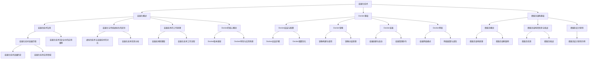

                 

### 文章标题：容器化技术: Docker在企业中的最佳实践

#### 关键词：
- 容器化技术
- Docker
- 微服务
- 企业级应用
- 最佳实践

#### 摘要：
本文旨在深入探讨容器化技术，特别是Docker在企业级应用中的最佳实践。文章从容器化的背景和原理出发，逐步讲解Docker的核心概念、安装配置、镜像和容器管理，以及Docker在网络和编排方面的应用。随后，文章重点分析Docker在微服务架构中的角色，探讨其优势、设计原则以及微服务治理和监控。最后，文章分享Docker在企业应用部署中的挑战及解决方案，并展望未来容器化技术的发展趋势。通过这篇文章，读者将全面了解容器化技术，掌握Docker在企业中的最佳实践。

## 第一部分：容器化与Docker基础

### 第1章：容器化概述

#### 1.1 容器化技术背景

容器化技术是近年来软件开发和运维领域的重要创新，它为企业提供了更加高效、灵活和可伸缩的解决方案。容器化技术的兴起源于软件开发生命周期中对敏捷性、持续集成和持续部署的需求。随着云计算和微服务架构的普及，容器化技术逐渐成为现代软件开发和运维的基础设施。

容器化技术的历史可以追溯到20世纪90年代，当时的Linux操作系统引入了命名空间（Namespace）和内核隔离（Cgroup）的概念。这些技术为容器提供了基础隔离机制，使得多个进程可以运行在同一物理主机上，而互不干扰。2000年代初，用户空间文件系统（UserSpace File System，UFS）和进程容器（Process Container）等工具进一步发展了这一理念。然而，这些早期的容器技术尚未达到现代容器化的成熟度和广泛普及。

随着云计算的兴起，2013年，Docker公司发布了Docker 1.0，标志着容器化技术进入了新的时代。Docker提供了一个简单、易用的容器平台，使得容器化技术得以迅速普及。Docker的成功激发了社区和企业的兴趣，推动了容器化技术的快速发展。如今，容器化已经成为现代软件交付和部署的重要工具。

#### 1.2 容器化与传统虚拟化的区别

容器化与传统虚拟化技术有显著的区别，主要体现在以下几个方面：

1. **资源隔离级别**：
   - 传统虚拟化技术通过虚拟化硬件资源（如CPU、内存、磁盘等）来创建虚拟机（VM），每个虚拟机拥有独立的操作系统和资源。容器化则通过命名空间和Cgroup实现进程级别的隔离，多个容器共享宿主机的操作系统内核。

2. **性能和资源利用率**：
   - 虚拟化需要额外的硬件抽象层，导致较高的资源开销和性能损耗。容器化直接利用宿主机的操作系统内核，因此具有更高的性能和更高效的资源利用率。

3. **可移植性**：
   - 虚拟机依赖于虚拟化硬件和操作系统，导致其可移植性受限。容器则通过Docker镜像实现一致的环境，可以在不同的操作系统和硬件平台上轻松移植和运行。

4. **部署和管理**：
   - 虚拟化通常需要复杂的虚拟化管理工具和流程，如虚拟机管理程序（VMware、VirtualBox等）。容器化则通过简单的命令行工具和配置文件（如Docker Compose）进行部署和管理。

#### 1.3 容器技术的工作原理

容器技术的工作原理主要依赖于以下核心组件：

1. **命名空间（Namespace）**：
   - 命名空间是Linux内核提供的一种隔离机制，用于隔离进程的视图。容器通过命名空间实现进程的隔离，使得容器内的进程无法看到宿主机上的其他进程。

2. **控制组（Cgroup）**：
   - Cgroup是一种用于资源管理的内核功能，允许管理员对进程组进行资源限制和控制。容器通过Cgroup实现对CPU、内存、磁盘等资源的隔离和限制。

3. **联合文件系统（UnionFS）**：
   - 联合文件系统是一种将多个文件系统层次叠加在一起的文件系统，用于构建容器的文件层。Docker镜像通过UnionFS实现分层存储，使得镜像的构建和分发更加高效。

4. **Docker引擎**：
   - Docker引擎是Docker平台的核心组件，负责容器的创建、运行和管理。Docker引擎通过上述命名空间、Cgroup和UnionFS等核心组件，实现对容器的高效管理和调度。

#### 1.4 Docker的核心概念

Docker作为容器化技术的代表，其核心概念包括：

1. **Docker镜像**：
   - Docker镜像是一种静态的、只读的容器模板，包含应用程序和所有依赖项。Docker镜像通过UnionFS分层存储，使得镜像的构建和分发更加高效。

2. **Docker容器**：
   - Docker容器是基于Docker镜像创建的动态运行实例，包含应用程序和运行时环境。容器通过命名空间和Cgroup实现进程和资源的隔离。

3. **Docker仓库**：
   - Docker仓库是一种用于存储和分发Docker镜像的中心化或去中心化存储系统。常用的Docker仓库包括Docker Hub和私有仓库。

4. **Docker Compose**：
   - Docker Compose是一种用于定义和编排多容器应用的配置文件工具。Docker Compose通过YAML文件定义服务和服务之间的关系，实现应用的自动化部署和管理。

5. **Docker Swarm**：
   - Docker Swarm是一种集群管理工具，用于将多个Docker引擎组合成一个分布式系统。Docker Swarm提供集群管理、服务发现和负载均衡等功能，适用于大规模容器部署。

## 第二部分：Docker基础

### 第2章：Docker基础

#### 2.1 Docker安装与配置

要在您的系统上安装Docker，请按照以下步骤进行：

1. **安装Docker引擎**：
   - 对于基于Debian的系统（如Ubuntu），您可以使用以下命令：
     ```bash
     sudo apt-get update
     sudo apt-get install docker.io
     ```
   - 对于基于Red Hat的系统（如Fedora），您可以使用以下命令：
     ```bash
     sudo dnf install docker
     ```

2. **启动Docker服务**：
   - 对于基于Debian的系统，使用以下命令启动Docker服务：
     ```bash
     sudo systemctl start docker
     ```
   - 对于基于Red Hat的系统，使用以下命令启动Docker服务：
     ```bash
     sudo systemctl start docker
     ```

3. **配置Docker**：
   - 为了确保Docker以用户身份运行，您可以将当前用户添加到docker用户组：
     ```bash
     sudo usermod -aG docker $USER
     ```
   - 重启终端或重新登录，以便更新用户组信息。

#### 2.2 Docker镜像

Docker镜像是一种轻量级、可执行的独立软件包，包含运行应用程序所需的所有依赖项和环境设置。以下是关于Docker镜像的详细介绍：

1. **镜像的构建与使用**：

   - **构建镜像**：构建Docker镜像通常使用Dockerfile，这是一种定义镜像构建过程的脚本。以下是一个简单的Dockerfile示例：

     ```Dockerfile
     # 使用官方Python镜像作为基础镜像
     FROM python:3.8-slim
    
     # 设置工作目录
     WORKDIR /app
    
     # 复制应用程序代码到工作目录
     COPY . .
    
     # 安装依赖项
     RUN pip install -r requirements.txt
    
     # 暴露容器的端口
     EXPOSE 8000
    
     # 运行应用程序
     CMD ["python", "app.py"]
     ```

   - **使用镜像**：要使用Docker镜像，您可以使用以下命令：

     ```bash
     # 查找镜像
     docker search python
    
     # 下载并运行镜像
     docker run -d -p 8000:8000 python
     ```

2. **镜像分层原理**：

   Docker镜像是通过分层存储构建的，这意味着每个镜像都是由多个层的组合。每个层代表对镜像的微小修改，从而实现轻量级和高效的镜像分发。以下是镜像分层的一些关键概念：

   - **基础层**：基础层是镜像的底层，包含操作系统和基础软件包。
   - **中间层**：中间层是基础层之上的一系列修改，如安装特定软件包或配置环境变量。
   - **顶层层**：顶层层是最新的修改，通常包含应用程序代码和配置文件。

   Docker使用UnionFS实现分层存储，使得镜像的构建和分发更加高效。在运行容器时，Docker会合并所有相关的镜像层，形成一个动态的容器文件系统。

#### 2.3 Docker容器

Docker容器是基于Docker镜像创建的动态运行实例，包含应用程序和运行时环境。以下是关于Docker容器的详细介绍：

1. **容器的创建与启动**：

   - **创建容器**：要创建一个容器，您可以使用以下命令：

     ```bash
     # 创建一个名为my-container的容器
     docker create --name my-container python
    
     # 查看正在运行的容器
     docker ps
     ```

   - **启动容器**：要启动一个已创建的容器，您可以使用以下命令：

     ```bash
     # 启动my-container容器
     docker start my-container
     ```

2. **容器的管理**：

   Docker提供了丰富的命令来管理容器，包括启动、停止、重启、删除等操作。以下是常用的管理命令：

   - **启动容器**：`docker start [container_name|container_id]`
   - **停止容器**：`docker stop [container_name|container_id]`
   - **重启容器**：`docker restart [container_name|container_id]`
   - **查看容器日志**：`docker logs [container_name|container_id]`
   - **删除容器**：`docker rm [container_name|container_id]`

#### 2.4 Docker网络

Docker网络提供了容器之间以及容器与外部网络进行通信的机制。以下是关于Docker网络的详细介绍：

1. **容器网络模式**：

   Docker支持多种网络模式，允许容器以不同的方式相互连接和访问网络。以下是常见的网络模式：

   - **桥接网络（bridge）**：桥接网络是最常用的网络模式，它为容器创建一个虚拟网络桥，容器通过桥接网络与外部网络进行通信。
   - **主机网络（host）**：主机网络模式将容器的网络栈直接连接到宿主机的网络栈，使得容器与宿主机共享网络命名空间。
   - **容器网络（container）**：容器网络模式允许容器之间通过名称进行通信，类似于进程间的通信。
   - **用户定义网络（user-defined）**：用户定义网络模式允许用户创建自定义的网络，并指定容器连接到哪个网络。

2. **网络配置与调优**：

   Docker提供了多种工具和命令来配置和调优网络。以下是常用的网络配置命令：

   - **创建网络**：`docker network create --driver bridge my-network`
   - **连接容器到网络**：`docker network connect my-network my-container`
   - **断开容器与网络连接**：`docker network disconnect my-network my-container`
   - **查看网络详情**：`docker network inspect my-network`

   在进行网络调优时，您可能需要关注以下几个方面：

   - **网络性能**：通过调整网络参数（如TCP缓冲区大小、拥塞控制算法等）来优化网络性能。
   - **安全性**：使用防火墙规则和网络策略来保护容器和容器网络。
   - **负载均衡**：使用Docker Swarm或第三方负载均衡器来分发网络流量。

## 第三部分：Docker编排与管理

### 第3章：Docker编排与管理

#### 3.1 Docker Compose

Docker Compose是一种用于定义和编排多容器应用的配置文件工具。通过Docker Compose，您可以轻松地管理多个容器，将它们组成一个完整的分布式系统。以下是关于Docker Compose的详细介绍：

1. **服务定义与编排**：

   Docker Compose使用YAML文件（通常命名为`docker-compose.yml`）来定义服务和容器。以下是一个简单的`docker-compose.yml`示例：

   ```yaml
   version: '3'
   services:
     web:
       image: python:3.8-slim
       ports:
         - "8000:8000"
       depends_on:
         - db
     db:
       image: postgres:13
       environment:
         POSTGRES_DB: myapp
         POSTGRES_USER: user
         POSTGRES_PASSWORD: password
   ```

   在此示例中，我们定义了两个服务：`web`和`db`。`web`服务是基于Python镜像构建的，并映射端口8000。`db`服务是基于PostgreSQL镜像构建的，并设置了数据库环境变量。

   - **启动和停止服务**：要启动和停止服务，您可以使用以下命令：

     ```bash
     # 启动服务
     docker-compose up
    
     # 停止服务
     docker-compose down
     ```

   - **查看服务状态**：要查看服务的状态，您可以使用以下命令：

     ```bash
     docker-compose ps
     ```

2. **Compose文件示例**：

   Docker Compose的配置文件（`docker-compose.yml`）可以包含多个服务，每个服务都可以有不同的配置。以下是一个更复杂的示例：

   ```yaml
   version: '3'
   services:
     web:
       image: python:3.8-slim
       ports:
         - "8000:8000"
       depends_on:
         - db
       command: python app.py
     db:
       image: postgres:13
       environment:
         POSTGRES_DB: myapp
         POSTGRES_USER: user
         POSTGRES_PASSWORD: password
       volumes:
         - db_data:/var/lib/postgresql/data
     redis:
       image: redis:6.0
       ports:
         - "6379:6379"
       volumes:
         - redis_data:/data
   volumes:
     db_data:
     redis_data:
   ```

   在此示例中，我们添加了`redis`服务，并使用了卷（volume）来持久化数据。`web`服务和`redis`服务通过环境变量和依赖关系相互通信。

#### 3.2 Docker Swarm

Docker Swarm是一种集群管理工具，用于将多个Docker引擎组合成一个分布式系统。通过Docker Swarm，您可以轻松地部署、管理和扩展容器化应用。以下是关于Docker Swarm的详细介绍：

1. **Swarm集群的搭建**：

   要搭建一个Docker Swarm集群，您需要先安装Docker引擎，然后使用以下命令创建和管理Swarm集群：

   - **初始化Swarm集群**：在管理节点上运行以下命令，将其初始化为Swarm集群的管理节点：

     ```bash
     docker swarm init
     ```

   - **加入Swarm集群**：在普通节点上运行以下命令，将其加入Swarm集群：

     ```bash
     docker swarm join --token <token> <manager-host>:<manager-port>
     ```

     其中，`<token>`是从管理节点获取的加入令牌，`<manager-host>`和`<manager-port>`是管理节点的地址和端口号。

   - **查看Swarm集群状态**：要查看Swarm集群的状态，您可以使用以下命令：

     ```bash
     docker node ls
     ```

2. **服务部署与管理**：

   Docker Swarm提供了一种简单的方式来自动化容器服务的部署和管理。以下是一些关键概念：

   - **服务（Service）**：服务是Swarm中的容器化应用实例。服务可以定义容器的数量、资源需求、网络配置等。
   - **任务（Task）**：任务是Swarm中运行的实际容器实例。任务可以分配到不同的节点上，以实现负载均衡和容错。
   - **网络（Network）**：网络用于容器之间的通信。Swarm支持多种网络模式，如桥接、主机和网络。
   - **卷（Volume）**：卷用于持久化容器的数据。Swarm支持Docker卷和网络卷。

   要部署一个服务，您可以使用以下命令：

   ```bash
   docker service create --name my-service --publish published --replicas 3 python:3.8-slim
   ```

   此命令创建一个名为`my-service`的Python服务，将其暴露在宿主机的8080端口上，并部署3个容器实例。

   要管理服务，您可以使用以下命令：

   ```bash
   # 查看服务状态
   docker service ps my-service
    
   # 更新服务
   docker service update my-service my-service:latest
    
   # 删除服务
   docker service rm my-service
   ```

## 第四部分：Docker与微服务架构

### 第4章：微服务架构基础

#### 4.1 微服务概念

微服务架构是一种设计方法，将大型单体应用拆分为一系列小型、独立的服务。每个微服务负责完成特定的业务功能，可以通过轻量级的通信协议（如HTTP/REST、gRPC等）相互通信。以下是微服务的一些关键概念：

1. **微服务**：微服务是具有独立功能、可独立部署和扩展的小型应用。每个微服务通常包含一个业务逻辑单元，如用户管理、订单处理等。

2. **服务拆分**：服务拆分是将单体应用拆分为多个独立微服务的过程。通过服务拆分，您可以提高系统的可伸缩性、可靠性和可维护性。

3. **服务自治**：服务自治是指每个微服务拥有自己的数据存储、配置和环境，可以独立开发、部署和扩展。服务自治有助于降低系统复杂度，提高开发效率。

4. **分布式通信**：微服务架构中，服务之间通过分布式通信进行交互。常用的通信协议包括HTTP/REST、gRPC、RabbitMQ等。

5. **服务治理**：服务治理是指对微服务架构中的服务进行管理、监控和优化的一系列技术。服务治理包括服务注册与发现、负载均衡、故障转移、服务监控等。

#### 4.2 微服务架构的优势与挑战

微服务架构具有许多优势，但也面临一些挑战。以下是微服务架构的优势和挑战的详细介绍：

1. **优势**：

   - **可伸缩性**：微服务架构允许您独立地伸缩每个服务，从而提高系统的整体可伸缩性。当某个服务负载增加时，您可以增加该服务的实例数量，而不会影响其他服务。

   - **可维护性**：微服务架构使得每个服务都可以独立开发、测试和部署，从而提高了系统的可维护性。开发团队可以专注于特定服务的改进，而不必担心影响其他服务。

   - **灵活性和可移植性**：微服务架构使得应用程序可以运行在不同的操作系统、编程语言和框架上。每个服务都可以独立选择最佳的技术栈，从而提高系统的灵活性和可移植性。

   - **故障隔离**：微服务架构将应用程序拆分为多个独立的单元，当一个服务出现故障时，不会影响整个系统的运行。通过服务自治和分布式通信，您可以快速定位和修复故障。

2. **挑战**：

   - **分布式复杂性**：微服务架构引入了分布式系统的复杂性。服务之间的通信、数据一致性和故障恢复等都需要精心设计和管理。

   - **服务数量激增**：随着服务的拆分和扩展，服务数量会迅速增加，导致系统的管理和监控变得更加复杂。如何有效地管理和监控大量服务成为一项挑战。

   - **数据一致性**：微服务架构中，服务通常拥有自己的数据存储，从而可能导致数据一致性问题。如何在分布式环境中保证数据的一致性是一个重要挑战。

   - **部署和管理**：微服务架构的部署和管理比单体应用更为复杂。需要使用容器化技术、服务网格、配置管理、监控等工具和平台来支持微服务的部署和管理。

#### 4.3 微服务设计原则

为了成功地实施微服务架构，需要遵循一些关键的设计原则。以下是微服务设计原则的详细介绍：

1. **服务自治**：每个微服务应该具有自己的数据存储、配置和环境，可以独立开发、测试和部署。服务自治有助于提高系统的可维护性和灵活性。

2. **最小功能单元**：微服务应该是业务功能的最小单元，每个服务负责完成特定的业务任务。过大的服务会导致依赖关系复杂、可维护性差。

3. **单一职责**：每个微服务应该只完成一个职责，避免过大的服务复杂度和依赖关系。单一职责有助于提高系统的可伸缩性和可维护性。

4. **无状态服务**：微服务应设计为无状态服务，避免在服务之间共享状态。无状态服务可以提高系统的可靠性、可伸缩性和故障恢复能力。

5. **轻量级通信**：微服务之间应使用轻量级通信协议，如HTTP/REST、gRPC等。轻量级通信有助于降低系统复杂度，提高系统的性能和可维护性。

6. **服务发现**：微服务应支持服务发现机制，使得服务可以动态地查找和注册其他服务。服务发现有助于简化服务之间的通信，提高系统的可伸缩性和可靠性。

7. **日志和监控**：微服务应具备完善的日志和监控功能，以便快速识别和解决问题。日志和监控有助于提高系统的可维护性和故障恢复能力。

## 第五部分：Docker与微服务

### 第5章：Docker与微服务

#### 5.1 微服务与容器的结合

微服务架构与容器化技术的结合是现代软件交付和运维的关键。容器化技术为微服务提供了以下几个重要优势：

1. **可移植性和一致性**：容器化技术使得微服务可以在任何支持Docker的操作系统上运行，从而确保了环境的一致性。无论开发、测试还是生产环境，微服务都可以在相同的容器中运行，避免了“环境问题”带来的麻烦。

2. **快速部署和迭代**：容器化技术简化了微服务的部署过程。通过Docker镜像，您可以快速构建、推送和部署微服务。这不仅缩短了部署周期，还提高了开发效率。

3. **高效的资源利用**：容器化技术通过轻量级的虚拟化实现了高效的资源利用。容器共享宿主机的操作系统内核，从而减少了资源消耗，提高了资源利用率。

4. **故障隔离和恢复**：容器化技术提供了良好的故障隔离机制。当一个容器出现问题时，它不会影响到其他容器或宿主机，从而提高了系统的可靠性和稳定性。

#### 5.2 使用Docker部署微服务

使用Docker部署微服务的过程相对简单，主要包括以下几个步骤：

1. **编写Dockerfile**：为每个微服务编写一个Dockerfile，定义构建镜像的过程。Dockerfile通常包含基础镜像、安装依赖项、复制应用程序代码等步骤。

   ```Dockerfile
   # 使用官方Python镜像作为基础镜像
   FROM python:3.8-slim
   
   # 设置工作目录
   WORKDIR /app
   
   # 复制应用程序代码到工作目录
   COPY . .
   
   # 安装依赖项
   RUN pip install -r requirements.txt
   
   # 暴露容器的端口
   EXPOSE 8000
   
   # 运行应用程序
   CMD ["python", "app.py"]
   ```

2. **构建Docker镜像**：使用Docker命令构建Docker镜像。

   ```bash
   docker build -t my-microservice:latest .
   ```

3. **推送Docker镜像**：将Docker镜像推送到Docker仓库，如Docker Hub或私有仓库。

   ```bash
   docker push my-microservice:latest
   ```

4. **部署Docker容器**：使用Docker命令部署Docker容器。

   ```bash
   docker run -d -p 8000:8000 my-microservice:latest
   ```

#### 5.3 微服务之间的通信

微服务之间的通信是微服务架构的核心。Docker提供了多种通信方案，包括HTTP/REST、gRPC等。以下是关于微服务之间通信的详细介绍：

1. **HTTP/REST**：

   HTTP/REST是最常用的微服务通信协议，它基于HTTP协议，使用JSON或XML等数据格式进行通信。以下是使用HTTP/REST进行微服务通信的示例：

   ```python
   # 客户端请求
   import requests
   
   response = requests.get('http://localhost:8000/api/items')
   print(response.json())
   ```

   ```python
   # 服务端响应
   from flask import Flask, jsonify
   
   app = Flask(__name__)
   
   @app.route('/api/items', methods=['GET'])
   def get_items():
       items = ['item1', 'item2', 'item3']
       return jsonify(items)
   
   if __name__ == '__main__':
       app.run(host='0.0.0.0', port=8000)
   ```

2. **gRPC**：

   gRPC是一种高性能、跨平台的通信协议，它基于HTTP/2协议，使用Protocol Buffers（protobuf）作为数据序列化格式。以下是使用gRPC进行微服务通信的示例：

   ```python
   # 客户端请求
   import grpc
   import my_service_pb2
   import my_service_pb2_grpc
   
   with grpc.insecure_channel('localhost:50051') as channel:
       stub = my_service_pb2_grpc.MyServiceStub(channel)
       response = stub.AddItem(my_service_pb2.AddItemRequest(item='item1'))
       print(response)
   ```

   ```python
   # 服务端响应
   import grpc
   from concurrent import futures
   import my_service_pb2
   import my_service_pb2_grpc
   
   class MyServiceServicer(my_service_pb2_grpc.MyServiceServicer):
   
       def AddItem(self, request, context):
           item = request.item
           print(f"Received item: {item}")
           return my_service_pb2.AddItemResponse(result=f"Added item: {item}")
   
   def serve():
       server = grpc.server(futures.ThreadPoolExecutor(max_workers=10))
       my_service_pb2_grpc.add_MyServiceServicer_to_server(MyServiceServicer(), server)
       server.add_insecure_port('[::]:50051')
       server.start()
       server.wait_for_termination()
   
   if __name__ == '__main__':
       serve()
   ```

## 第六部分：微服务治理与监控

### 第6章：微服务治理与监控

#### 6.1 服务注册与发现

服务注册与发现是微服务架构中至关重要的一环。服务注册是指将服务信息注册到一个服务注册中心，服务发现是指应用程序能够动态地查找和连接其他服务。以下是关于服务注册与发现的一些关键概念和解决方案：

1. **服务注册**：

   服务注册是指将服务的信息（如服务名称、地址、端口等）注册到一个服务注册中心。服务注册中心通常是一个分布式服务注册表，如Consul、Eureka、Zookeeper等。以下是一个简单的服务注册示例：

   ```java
   @Service
   public class MyService {
       @PostConstruct
       public void registerService() {
           serviceRegistry.register("my-service", "localhost", 8080);
       }
   }
   ```

2. **服务发现**：

   服务发现是指应用程序能够动态地查找和连接其他服务。服务发现可以通过服务注册中心或直接查询DNS来实现。以下是一个简单的服务发现示例：

   ```java
   public ServiceResponse discoveredService(String serviceName) {
       String serviceUrl = serviceDiscovery.resolveService(serviceName);
       return new ServiceResponse(serviceUrl);
   }
   ```

3. **服务注册与发现的解决方案**：

   - **Consul**：Consul是一个开源的服务注册与发现工具，支持健康检查、服务监控等特性。
   - **Eureka**：Eureka是Spring Cloud组件之一，用于服务注册与发现，支持负载均衡和故障转移。
   - **Zookeeper**：Zookeeper是一个分布式协调服务，用于服务注册、发现和同步。

#### 6.2 服务监控与日志

服务监控与日志是确保微服务稳定运行的重要手段。以下是关于服务监控与日志的一些关键概念和工具：

1. **服务监控**：

   服务监控是指对微服务的运行状态、性能指标和资源消耗进行实时监控。以下是一些常用的服务监控工具：

   - **Prometheus**：Prometheus是一个开源的服务监控解决方案，支持多维数据收集、告警和可视化。
   - **Grafana**：Grafana是一个开源的可视化分析工具，可以与Prometheus等数据源集成，提供丰富的仪表板和告警功能。
   - **StatsD**：StatsD是一个简单但强大的实时数据收集工具，常用于监控微服务的性能指标。

2. **日志**：

   日志是记录微服务运行过程中的关键信息，有助于问题定位和故障排除。以下是一些常用的日志收集工具：

   - **ELK Stack**：ELK Stack包括Elasticsearch、Logstash和Kibana，用于日志收集、存储和可视化。
   - **Fluentd**：Fluentd是一个开源的数据收集和转发工具，可以与ELK Stack等日志处理工具集成。
   - **Logstash**：Logstash是一个开源的数据处理和转发工具，可以将不同格式的日志转换为统一的格式，并存储到Elasticsearch等数据存储中。

#### 6.3 服务部署与回滚

服务部署与回滚是确保微服务稳定运行的重要环节。以下是关于服务部署与回滚的一些关键概念和策略：

1. **服务部署**：

   服务部署是指将微服务实例部署到生产环境的过程。以下是一些常用的服务部署策略：

   - **蓝绿部署**：蓝绿部署是一种无停机部署策略，将新版本的服务部署到一个新的环境（如蓝环境），然后逐步将流量切换到新环境，确保新版本的服务正常运行。
   - **灰度发布**：灰度发布是一种逐步推广新版本的服务策略，通过逐步增加新版本的服务实例占比，确保新版本的服务对用户的影响最小。
   - **滚动更新**：滚动更新是一种逐步更新服务实例的策略，每次更新一个实例，确保服务在更新过程中始终可用。

2. **服务回滚**：

   服务回滚是指当新版本的服务出现问题或性能问题时，将服务恢复到上一个稳定版本的过程。以下是一些常用的服务回滚策略：

   - **回滚点**：在部署新版本的服务时，记录一个回滚点，以便在需要时快速回滚到该点。
   - **自动回滚**：自动回滚是指当监控系统检测到服务性能或稳定性问题时，自动将服务回滚到上一个稳定版本。
   - **手动回滚**：手动回滚是指运维人员根据监控数据和用户反馈，手动选择回滚到上一个稳定版本。

### 第7章：Docker在企业应用部署中的挑战与解决方案

#### 7.1 环境一致性问题

在容器化技术的推广过程中，环境一致性问题是企业面临的主要挑战之一。环境一致性指的是在不同环境中（如开发、测试、生产等）运行的应用程序应具有相同的运行时环境，包括操作系统、依赖库、环境变量等。环境不一致可能导致以下问题：

1. **部署失败**：由于环境不一致，应用程序在测试环境成功运行，但在生产环境失败，导致部署失败。
2. **性能问题**：应用程序在不同环境中运行时，由于环境不一致，可能导致性能问题，如CPU、内存使用率过高。
3. **安全性问题**：环境不一致可能导致安全性问题，如某个环境中的依赖库存在漏洞，而在其他环境中未受到影响。

为了解决环境一致性问题，可以采取以下措施：

1. **使用Docker镜像**：通过使用Docker镜像，可以将应用程序及其依赖库和环境打包为一个独立的容器，从而确保在不同环境中运行的一致性。
2. **持续集成与持续部署（CI/CD）**：通过CI/CD工具，如Jenkins、GitLab CI等，自动化构建、测试和部署应用程序，确保在各个环境中的运行一致性。
3. **配置管理工具**：使用配置管理工具，如Ansible、Puppet等，管理不同环境中的配置文件和依赖库，确保配置的一致性。

#### 7.2 安全与隐私

容器化技术在提供灵活性和便利性的同时，也带来了安全挑战。以下是一些常见的安全问题：

1. **容器逃逸**：容器逃逸是指攻击者通过某种方式从容器中逃逸到宿主机，进而获取宿主机的权限。
2. **容器攻击**：容器攻击是指攻击者利用容器的漏洞或配置错误，对容器内的应用程序进行攻击。
3. **数据泄露**：容器可能会因为配置错误或漏洞导致敏感数据泄露。

为了提高容器安全，可以采取以下措施：

1. **最小权限原则**：容器应只拥有执行任务所需的最低权限，避免容器拥有不必要的权限。
2. **安全基线**：使用安全基线，如Docker安全基线，确保容器镜像和容器配置符合最佳安全实践。
3. **容器扫描**：使用容器扫描工具，如Docker Bench for Security，对容器镜像和容器进行安全扫描，发现潜在的安全漏洞。
4. **加密数据传输**：确保容器之间的通信使用加密协议，如TLS，防止数据泄露。
5. **网络隔离**：使用容器网络模式，如桥接网络或用户定义网络，实现容器之间的隔离。

#### 7.3 性能与可伸缩性

容器化技术提供了高效的资源利用和快速部署的能力，但在性能和可伸缩性方面仍面临一些挑战：

1. **资源争用**：由于容器共享宿主机的资源（如CPU、内存等），可能导致资源争用，影响性能。
2. **网络延迟**：容器之间的网络通信可能会受到宿主机网络配置的影响，导致网络延迟。
3. **数据持久化**：容器通常是无状态的，数据持久化可能需要额外的存储解决方案，如卷（volume）或分布式存储系统。

为了提高性能和可伸缩性，可以采取以下措施：

1. **资源限制与优先级**：使用Cgroup和资源限制策略，合理分配宿主机的资源，确保容器获得足够的资源。
2. **容器编排**：使用容器编排工具，如Docker Compose和Docker Swarm，实现容器的自动化部署和管理，提高系统的可伸缩性。
3. **负载均衡**：使用负载均衡器，如Nginx或HAProxy，分发网络流量，提高系统的吞吐量和性能。
4. **数据持久化优化**：使用性能优异的存储解决方案，如Redis或MongoDB，确保数据持久化过程中的性能。

#### 7.4 持续集成与持续部署

持续集成（CI）和持续部署（CD）是容器化技术的重要应用场景，它们能够自动化构建、测试和部署应用程序，提高开发效率和软件质量。以下是一些关键概念和最佳实践：

1. **持续集成**：

   - **自动化构建**：通过CI工具，自动化构建应用程序，确保每次代码更改都能及时构建和测试。
   - **自动化测试**：通过CI工具，自动化运行单元测试、集成测试和性能测试，确保代码质量。
   - **静态代码分析**：通过CI工具，对代码进行静态分析，发现潜在的安全漏洞和代码缺陷。

2. **持续部署**：

   - **自动化部署**：通过CI/CD工具，自动化部署应用程序到不同的环境（如开发、测试、生产等），确保部署过程的可靠性和一致性。
   - **蓝绿部署**：通过蓝绿部署策略，实现新版本的应用程序逐步替换旧版本，降低风险。
   - **灰度发布**：通过灰度发布策略，逐步增加新版本的应用程序实例占比，确保用户影响最小。

3. **最佳实践**：

   - **代码仓库管理**：使用Git等版本控制工具，管理应用程序的代码仓库，确保代码的版本一致性和可追溯性。
   - **容器镜像管理**：使用Docker镜像仓库，存储和分发应用程序的容器镜像，确保镜像的安全性和可靠性。
   - **环境配置管理**：使用配置管理工具，如Ansible、Puppet等，管理不同环境中的配置文件和依赖库。
   - **监控与日志**：使用监控和日志工具，如Prometheus、ELK Stack等，实时监控应用程序的运行状态，快速发现和解决问题。

## 第8章：Docker最佳实践案例

#### 8.1 金融行业容器化实践

在金融行业，容器化技术被广泛应用于银行、证券、保险等领域的应用开发和运维。以下是一些金融行业容器化实践的最佳案例：

1. **银行系统升级**：

   某大型银行采用Docker技术对核心系统进行升级。通过使用Docker镜像，银行可以将旧版本的核心系统与新版系统并行运行，逐步将流量切换到新版本，确保升级过程的平稳进行。此外，Docker Compose用于管理多个容器，实现应用的自动化部署和管理。

2. **证券交易系统**：

   某证券公司采用Docker技术构建证券交易系统。通过使用Docker镜像和Docker Swarm，证券公司实现了交易系统的自动化部署和管理，提高了系统的可伸缩性和可靠性。同时，Docker Compose用于定义和编排交易系统的各个组件，如订单处理、交易引擎等。

3. **保险产品销售平台**：

   某保险公司采用Docker技术构建保险产品销售平台。通过使用Docker镜像和Docker Compose，保险公司实现了产品的快速上线和迭代。此外，Docker Swarm用于管理销售平台的集群，实现了应用的负载均衡和故障转移。

#### 8.2 零售业容器化案例

在零售行业，容器化技术被广泛应用于电子商务、库存管理、物流配送等领域的应用开发和运维。以下是一些零售业容器化实践的最佳案例：

1. **电子商务平台**：

   某大型电子商务平台采用Docker技术构建和部署其核心系统。通过使用Docker镜像和Docker Swarm，电子商务平台实现了应用的自动化部署和管理，提高了系统的可伸缩性和可靠性。此外，Docker Compose用于定义和编排电子商务平台的各个组件，如订单处理、库存管理、支付系统等。

2. **库存管理系统**：

   某零售企业采用Docker技术构建库存管理系统。通过使用Docker镜像和Docker Compose，零售企业实现了库存管理系统的自动化部署和管理，提高了系统的可伸缩性和可靠性。同时，Docker Swarm用于管理库存管理系统的集群，实现了应用的负载均衡和故障转移。

3. **物流配送平台**：

   某物流公司采用Docker技术构建物流配送平台。通过使用Docker镜像和Docker Compose，物流公司实现了物流配送平台的自动化部署和管理，提高了系统的可伸缩性和可靠性。此外，Docker Swarm用于管理物流配送平台的集群，实现了应用的负载均衡和故障转移。

#### 8.3 教育行业容器化应用

在教育行业，容器化技术被广泛应用于在线教育、学习管理系统、教务系统等领域的应用开发和运维。以下是一些教育行业容器化实践的最佳案例：

1. **在线教育平台**：

   某知名在线教育平台采用Docker技术构建和部署其核心系统。通过使用Docker镜像和Docker Swarm，在线教育平台实现了应用的自动化部署和管理，提高了系统的可伸缩性和可靠性。此外，Docker Compose用于定义和编排在线教育平台的各个组件，如课程管理、学习管理、支付系统等。

2. **学习管理系统**：

   某教育机构采用Docker技术构建学习管理系统。通过使用Docker镜像和Docker Compose，教育机构实现了学习管理系统的自动化部署和管理，提高了系统的可伸缩性和可靠性。同时，Docker Swarm用于管理学习管理系统的集群，实现了应用的负载均衡和故障转移。

3. **教务系统**：

   某高校采用Docker技术构建教务系统。通过使用Docker镜像和Docker Compose，高校实现了教务系统的自动化部署和管理，提高了系统的可伸缩性和可靠性。此外，Docker Swarm用于管理教务系统的集群，实现了应用的负载均衡和故障转移。

## 第9章：未来展望与容器化技术的发展趋势

#### 9.1 容器化技术发展趋势

随着云计算、微服务架构和DevOps的普及，容器化技术正在不断演进，并呈现出以下发展趋势：

1. **容器编排与自动化**：容器编排工具（如Kubernetes、Docker Swarm等）将继续发展和完善，提供更强大的自动化部署、管理和监控功能。自动化部署、自动化扩展和自动故障恢复将成为容器化技术的重要特征。

2. **服务网格技术**：服务网格技术（如Istio、Linkerd等）将为容器化应用提供更高效、可靠和安全的通信基础。服务网格将负责管理容器之间的通信，提供负载均衡、服务发现、安全等功能。

3. **云原生应用**：云原生应用（如Kubernetes应用程序）将逐渐成为主流，利用容器化技术、服务网格和微服务架构的优势，实现更高效、可伸缩和灵活的云原生应用部署。

4. **无服务器架构**：无服务器架构（如Serverless架构）将与传统容器化技术相结合，提供更灵活的云计算解决方案。无服务器架构将简化应用开发和部署过程，提高资源利用率和开发效率。

5. **边缘计算与容器化**：边缘计算与容器化技术的结合将为物联网（IoT）和5G等应用场景提供更高效、低延迟的解决方案。容器化技术将在边缘设备上实现高效的应用部署和资源管理。

#### 9.2 容器化在新兴领域的应用

容器化技术正迅速扩展到新兴领域，为这些领域的创新和发展提供强大支持。以下是一些典型应用场景：

1. **人工智能与机器学习**：容器化技术为人工智能和机器学习应用提供了一种高效、可伸缩的部署方案。通过容器化，研究人员和开发者可以轻松部署和共享预训练模型，提高研究和开发效率。

2. **区块链技术**：容器化技术在区块链领域具有广泛应用前景。通过容器化，可以轻松部署和管理区块链网络中的节点，提高区块链系统的可伸缩性和可靠性。

3. **物联网（IoT）**：容器化技术有助于实现物联网设备的敏捷开发和部署。通过容器化，物联网设备可以快速集成和管理，提高系统的可维护性和可伸缩性。

4. **游戏开发**：容器化技术为游戏开发者提供了一种高效的游戏开发和部署解决方案。通过容器化，游戏开发者可以快速构建、测试和部署游戏，提高开发效率。

5. **大数据与数据分析**：容器化技术有助于构建高效的大数据和数据分析系统。通过容器化，可以轻松部署和管理大数据处理框架（如Hadoop、Spark等），提高数据处理效率和性能。

#### 9.3 容器化技术的未来挑战与解决方案

尽管容器化技术取得了显著进展，但未来仍面临一些挑战：

1. **安全性**：随着容器化技术的广泛应用，安全性问题日益凸显。为了提高容器安全性，需要加强对容器镜像的扫描和验证，确保容器镜像的安全性和完整性。

2. **标准化**：目前，容器化技术尚未完全标准化，不同平台和工具之间存在差异。为了促进容器化技术的普及和生态系统的健康发展，需要加强标准化工作，制定统一的容器化标准和规范。

3. **监控与日志**：容器化环境中的监控和日志管理相对复杂，需要更加高效和智能的监控和日志工具，以实现实时监控和故障排查。

4. **跨平台兼容性**：为了实现容器化技术的广泛应用，需要提高跨平台兼容性，确保容器化应用可以在不同的操作系统、硬件平台上无缝运行。

为了应对这些挑战，可以采取以下解决方案：

1. **加强安全性**：采用安全基线、容器扫描和验证工具，确保容器镜像和容器配置符合最佳安全实践。加强容器网络和存储的安全，使用加密协议保护数据传输。

2. **推动标准化**：积极参与容器化技术标准化工作，制定统一的容器化标准和规范。推动容器化工具和平台的兼容性和互操作性。

3. **优化监控与日志**：采用智能监控和日志分析工具，实现对容器化环境中的实时监控和故障排查。利用机器学习技术，自动识别和预警潜在问题。

4. **提高跨平台兼容性**：采用通用的容器镜像格式和运行时环境，提高容器化应用在不同操作系统和硬件平台上的兼容性和可移植性。

## 附录：实用工具与资源

### A.1 Docker命令行工具

Docker命令行工具是管理Docker环境的主要接口，以下是一些常用的Docker命令：

- **docker build**：构建Docker镜像。
- **docker run**：创建并启动Docker容器。
- **docker ps**：查看当前正在运行的容器。
- **docker stop**：停止一个容器。
- **docker start**：启动一个已停止的容器。
- **docker restart**：重启一个容器。
- **docker rm**：删除一个或多个容器。
- **docker images**：查看所有本地镜像。
- **docker pull**：从Docker仓库拉取镜像。
- **docker push**：将本地镜像推送到Docker仓库。
- **docker exec**：在运行的容器中执行命令。
- **docker logs**：查看容器的日志。
- **docker network**：管理Docker网络。
- **docker volume**：管理Docker卷。

### A.2 Docker官方文档与社区资源

Docker官方文档是学习Docker的最佳资源，以下是一些Docker官方文档和社区资源：

- **Docker官方文档**：[https://docs.docker.com/](https://docs.docker.com/)
- **Docker社区论坛**：[https://forums.docker.com/](https://forums.docker.com/)
- **Docker GitHub仓库**：[https://github.com/docker](https://github.com/docker)
- **Docker Hub**：[https://hub.docker.com/](https://hub.docker.com/)

### A.3 Docker认证与培训

Docker认证是一种验证个人对Docker技术的掌握程度的官方认证。以下是一些Docker认证和培训资源：

- **Docker认证考试**：[https://www.docker.com/training/certification](https://www.docker.com/training/certification)
- **Docker官方培训课程**：[https://www.docker.com/training](https://www.docker.com/training)
- **Docker认证培训机构**：[https://www.docker.com/training/partners](https://www.docker.com/training/partners)

### 附录：Mermaid流程图



## 总结

容器化技术，尤其是Docker，已经彻底改变了企业级应用的部署和运维方式。通过本文的详细分析，我们了解了容器化的背景和原理，学习了Docker的核心概念、安装配置、镜像和容器管理，以及Docker在网络和编排方面的应用。我们还探讨了Docker在微服务架构中的重要性，分析了其优势、设计原则以及微服务治理和监控。最后，我们分享了Docker在企业应用部署中的挑战及解决方案，并展望了未来容器化技术的发展趋势。

容器化技术的核心在于其轻量级、高效性和灵活性。通过容器化，企业可以实现快速部署、环境一致性、高效的资源利用和故障隔离。Docker作为容器化技术的代表，提供了简单、强大的工具和平台，使得容器化变得轻松可行。然而，容器化也带来了一些挑战，如安全性、性能和监控等，需要企业采取相应的最佳实践来应对。

在未来，容器化技术将继续发展，并在更多新兴领域得到广泛应用。随着服务网格、无服务器架构和边缘计算等技术的结合，容器化将为企业带来更多创新和机遇。同时，标准化和跨平台兼容性的提升，也将进一步促进容器化技术的普及和生态系统的健康发展。

作为读者，您现在具备了全面了解容器化技术，特别是Docker在企业中的最佳实践的知识。希望您能将这些知识应用到实际工作中，提升企业的软件交付和运维效率。在接下来的技术旅程中，不断探索和学习，成为容器化技术领域的专家。

### 作者信息：

- 作者：AI天才研究院/AI Genius Institute & 禅与计算机程序设计艺术 /Zen And The Art of Computer Programming

这篇文章由AI天才研究院和禅与计算机程序设计艺术共同撰写。AI天才研究院是一家专注于人工智能研究和应用的创新机构，致力于推动人工智能技术在各个领域的进步。禅与计算机程序设计艺术则是一本经典的技术著作，提倡在编程过程中融入禅宗哲学，追求代码的简洁与优雅。我们希望这篇文章能够帮助您更好地理解容器化技术，掌握Docker在企业中的最佳实践，助力您在技术领域取得更大的成就。

