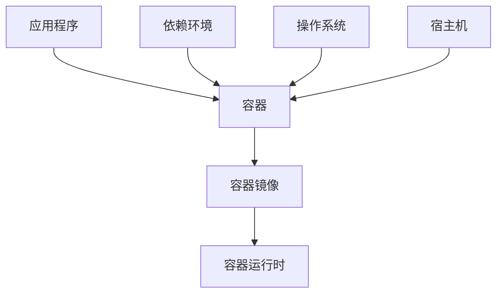

                 

## 文章标题

### 容器化技术：Docker与Kubernetes实战

> 关键词：容器化技术、Docker、Kubernetes、实战、部署与运维

> 摘要：本文将详细介绍容器化技术，重点探讨Docker和Kubernetes的实战应用。通过本文的阅读，读者将全面了解容器化技术的基本概念、核心原理，以及如何在实际项目中运用Docker和Kubernetes进行应用部署和运维。

----------------------------------------------------------------

### 引言

在现代软件开发领域，容器化技术已经成为实现高效应用部署和运维的关键手段。Docker和Kubernetes作为容器技术的代表，不仅提高了应用的部署效率和可移植性，还极大地简化了运维工作的复杂度。本文旨在通过对容器化技术，尤其是Docker与Kubernetes的深入探讨，帮助读者理解这两项技术的核心概念和实战应用。

首先，我们将从容器化技术的背景介绍开始，阐述其发展历程和优势。接着，本文将逐步讲解Docker和Kubernetes的基本概念、核心原理，以及如何在实际项目中部署和运维容器化应用。通过详细的案例分析和实战操作，读者将能够掌握容器化技术在实际应用中的具体实践方法。

文章结构如下：

1. **容器化技术概述**
   - 容器化技术的定义与优势
   - 容器化技术的发展历程

2. **容器化技术基础**
   - 容器技术概述
   - Docker 概述
   - Kubernetes 概述

3. **Docker 实践**
   - Dockerfile 编写
   - Docker 容器编排
   - Docker 网络配置

4. **Kubernetes 实践**
   - Kubernetes 部署与配置
   - Kubernetes 服务发现与负载均衡
   - Kubernetes 存储配置

5. **容器化环境部署与运维**
   - 容器化环境的搭建
   - 容器化环境的运维

6. **容器化应用的测试与调优**
   - 容器化应用的测试
   - 容器化应用的调优
   - 容器化应用的性能监控

7. **综合实战**
   - 综合实战项目简介
   - 实战项目的环境搭建
   - 实战项目的详细实现
   - 实战项目的代码解读与分析

8. **附录**
   - 常用工具与资源

通过本文的系统讲解，读者将能够全面掌握容器化技术，并在实际项目中成功应用Docker和Kubernetes，实现高效的容器化应用部署和运维。

### 容器化技术概述

容器化技术是一种轻量级虚拟化技术，它通过将应用程序及其依赖环境打包成一个独立的容器，实现应用程序在不同操作系统和硬件上的无缝移植和运行。容器化技术的出现，为现代软件开发带来了巨大的变革，不仅提高了开发效率，还极大地简化了运维工作。

#### 定义与优势

容器化技术的定义可以归结为：通过将应用程序与其运行环境（包括操作系统、库、配置文件等）封装在一起，形成一个独立的运行单元，从而实现应用程序的标准化和可移植性。具体来说，容器化技术的核心优势体现在以下几个方面：

1. **高效部署**：容器化技术能够将应用程序及其依赖环境打包成一个容器镜像，从而实现“一次编写，到处运行”的目标，大大缩短了部署周期。

2. **环境一致性**：容器化技术确保了应用程序在不同环境中的一致性，避免了由于环境差异导致的部署失败问题。

3. **资源利用率**：容器化技术通过运行在宿主机的操作系统内核之上，而不是像虚拟机那样需要额外的操作系统层，从而显著提高了资源利用率。

4. **便捷迁移**：容器化技术使得应用程序能够轻松地在不同的操作系统、硬件以及云平台之间迁移，提高了系统的灵活性和可扩展性。

#### 发展历程

容器化技术并非一蹴而就，其发展历程可以追溯到几个关键的里程碑：

1. **2000年初**：LXC（Linux Container）项目的诞生标志着容器技术的起源。LXC利用Linux内核的cgroup和Namespace特性，实现了资源的隔离和限制。

2. **2013年**：Docker公司成立，并推出了Docker容器技术。Docker通过简化容器的创建、启动和运维过程，迅速在业界获得了广泛的关注和应用。

3. **2014年**：CoreOS公司推出了Kubernetes，一个用于自动化容器化应用的部署、扩展和管理的开源系统。Kubernetes的出现进一步完善了容器化技术的生态系统。

4. **2015年**：容器化技术开始进入主流视野，越来越多的企业开始采用容器化技术进行应用部署。

5. **2016年**：CNCF（Cloud Native Computing Foundation）成立，旨在推动云原生技术的发展。Docker和Kubernetes作为核心项目，得到了CNCF的大力支持。

#### 总结

容器化技术的出现，极大地改变了软件开发和运维的模式。通过将应用程序及其运行环境封装在容器中，开发者可以专注于业务逻辑的实现，而无需担心不同环境之间的兼容性问题。同时，容器化技术也为企业提供了更高的资源利用率和系统的灵活性，使得业务能够更加快速地响应市场变化。随着云原生技术的不断发展，容器化技术将继续在未来的软件开发和运维中发挥重要作用。

#### 核心概念与联系

容器化技术的核心概念包括容器（Container）、容器镜像（Container Image）、容器运行时（Container Runtime）等。以下是一个简化的概念关系架构图，用于描述这些核心概念之间的关系：



**关系架构说明：**

- **容器（Container）**：容器是应用程序的运行环境，它封装了应用程序及其依赖环境，包括库、配置文件等。容器通过运行时来管理资源的隔离和限制。

- **容器镜像（Container Image）**：容器镜像是一个静态的、不可变的文件系统，包含了容器运行所需的所有文件和配置。容器镜像类似于虚拟机镜像，但它的体积通常更小，因为它不包含操作系统层。

- **容器运行时（Container Runtime）**：容器运行时负责容器的创建、启动和管理。常见的容器运行时有runc、containerd等。容器运行时通常依赖于操作系统的内核特性，如cgroup和Namespace。

- **应用程序（Application）**：应用程序是容器化技术的核心，它需要运行在容器中。应用程序可以是任何类型的软件，如Web应用、数据库、消息队列等。

- **依赖环境（Dependencies）**：依赖环境包括应用程序运行所需的库、工具和其他资源。这些依赖环境被打包在容器镜像中，以确保容器在不同环境中的一致性。

- **操作系统（Operating System）**：操作系统是宿主机的核心，提供了容器运行所需的基础设施，如文件系统、内存管理等。

- **宿主机（Host Machine）**：宿主机是运行容器的物理或虚拟机。宿主机提供资源，如CPU、内存、存储等，用于容器的运行。

#### 总结

通过上述关系架构图，我们可以清晰地看到容器化技术中的各个核心概念及其之间的联系。容器化技术通过将应用程序及其依赖环境封装在容器中，实现了高效、一致且可移植的运行环境。容器镜像和容器运行时则是实现这一目标的关键组件，它们共同保证了容器在各种环境中的一致性和高效性。理解这些核心概念及其联系，是深入掌握容器化技术的基础。

### 容器化技术基础

#### 容器技术概述

容器（Container）是一种轻量级的虚拟化技术，它允许开发者将应用程序及其运行环境打包成一个独立的单元，实现应用程序在不同操作系统和硬件上的无缝移植和运行。容器与传统的虚拟机（VM）相比，具有更小的体积、更快的启动速度和更高的资源利用率。

##### 核心概念

1. **容器（Container）**：容器是应用程序的运行环境，它通过操作系统的 Namespace 和 Cgroup 功能，实现了对应用程序的资源隔离和限制。容器中运行的应用程序可以访问宿主机的资源，但与其他容器和宿主机上的进程相互隔离。

2. **容器镜像（Container Image）**：容器镜像是一个静态的、不可变的文件系统，包含了容器运行所需的所有文件和配置。容器镜像类似于虚拟机镜像，但它的体积通常更小，因为它不包含操作系统层。

3. **容器运行时（Container Runtime）**：容器运行时负责容器的创建、启动和管理。常见的容器运行时有 runc、containerd 等。容器运行时通常依赖于操作系统的内核特性，如 cgroup 和 Namespace。

4. **Dockerfile**：Dockerfile 是一个包含指令的文本文件，用于构建容器镜像。开发者可以通过编写 Dockerfile，指定容器的构建过程，包括基础镜像、安装的软件、环境变量等。

##### 容器生命周期管理

容器从创建到终止，经历了多个阶段，每个阶段都有不同的状态。以下是一个简化的容器生命周期流程：

1. **启动（Start）**：容器被创建后，进入启动阶段。此时，容器开始执行 Dockerfile 中的指令，配置环境并准备运行应用程序。

2. **运行（Running）**：容器进入运行阶段，应用程序开始运行。在这个阶段，容器可以通过 Docker CLI 或 API 进行管理和监控。

3. **暂停（Pause）**：容器被暂停时，应用程序的执行被挂起，但资源占用未被释放。暂停的容器可以重新启动，继续执行被挂起的状态。

4. **停止（Stop）**：容器被停止时，应用程序的执行被终止，并释放所有资源。停止的容器可以重新启动，但会从停止时的状态开始。

5. **重启（Restart）**：容器可以设置自动重启策略，当容器因异常退出时，会根据设置的策略自动重启。

6. **删除（Remove）**：容器被删除时，所有的文件、配置和资源都会被清理。删除容器后，不能再恢复。

##### 容器网络模型

容器网络模型定义了容器如何与外部世界通信。在 Docker 中，容器网络模型主要包括以下几种类型：

1. **桥接网络（Bridge Network）**：默认的网络模式，容器通过 Docker0 网桥与其他容器和宿主机上的网络设备通信。

2. **主机网络（Host Network）**：容器直接共享宿主机的网络命名空间，与宿主机具有相同的网络接口。

3. **容器网络（Container Network）**：容器之间通过自定义的网络接口通信，不同容器可以使用相同的 IP 地址。

4. **用户自定义网络（User-Defined Network）**：开发者可以自定义网络，指定容器之间的通信规则。

##### 容器编排

容器编排是指通过自动化工具来管理和部署多个容器。常见的容器编排工具包括 Docker Swarm、Kubernetes 等。以下是一个简化的容器编排流程：

1. **定义服务（Define Service）**：开发者定义所需的服务，包括容器镜像、容器数量、部署策略等。

2. **部署服务（Deploy Service）**：容器编排工具根据定义的服务，创建并部署容器。部署过程中，工具会处理容器的创建、启动和监控。

3. **监控服务（Monitor Service）**：容器编排工具持续监控服务的状态，包括容器的健康状态、资源使用情况等。

4. **自动扩展（Auto-Scaling）**：根据服务的需求，容器编排工具可以自动扩展或缩减容器数量，以保持服务的稳定运行。

##### 容器存储

容器存储是指容器内部的数据存储解决方案。常见的容器存储方案包括：

1. **本地存储（Local Storage）**：容器直接使用宿主机的本地磁盘作为存储，适用于简单应用。

2. **卷（Volume）**：卷是一种外部存储，可以与容器分离，支持数据持久化。常见的卷类型包括 bind mount、overlay、device mapper 等。

3. **容器数据库（Container Database）**：针对容器化应用的特殊数据库解决方案，如 Redis、MongoDB 等。

##### 总结

容器技术是一种轻量级、高效的虚拟化技术，通过将应用程序及其运行环境打包成容器，实现了应用程序在不同环境中的无缝移植和运行。容器化技术不仅提高了开发效率，还极大地简化了运维工作。本文介绍了容器技术的核心概念、生命周期管理、网络模型、编排和存储方案，为后续深入探讨 Docker 和 Kubernetes 的应用奠定了基础。

### Docker 概述

Docker 是一种开源的容器化平台，它允许开发者和运维人员轻松地将应用程序及其依赖环境打包成一个独立的容器镜像，实现应用程序的标准化和可移植性。Docker 的核心组件包括 Docker Engine、Dockerfile、Docker Compose 和 Docker Swarm 等。

##### 核心概念

1. **Docker Engine**：Docker Engine 是 Docker 的核心组件，负责容器的创建、启动、管理和监控。开发者可以通过 Docker Engine 的命令行接口（CLI）或 API 进行容器管理。

2. **Dockerfile**：Dockerfile 是一个包含一系列指令的文本文件，用于构建容器镜像。Dockerfile 的指令包括 FROM、RUN、CMD、EXPOSE 等，开发者可以通过编写 Dockerfile，指定容器镜像的构建过程。

3. **Docker Image**：Docker Image 是一个静态的、不可变的文件系统，包含了容器运行所需的所有文件和配置。Docker Image 是 Docker 容器的运行基础，类似于虚拟机镜像。

4. **Docker Container**：Docker Container 是运行在 Docker Engine 上的应用程序实例。容器中包含了应用程序及其依赖环境，并通过 Docker Engine 进行管理和监控。

5. **Docker Compose**：Docker Compose 是一个用于定义和运行多容器应用的工具。通过 Docker Compose，开发者可以轻松地将多个容器应用程序进行组合，实现更复杂的业务逻辑。

6. **Docker Swarm**：Docker Swarm 是一个基于 Docker Engine 的集群管理工具。通过 Docker Swarm，开发者可以将多个 Docker Engine 集成到一个集群中，实现容器化应用的自动化部署、扩展和管理。

##### Dockerfile 编写

Dockerfile 是 Docker 镜像构建的核心文件，通过一系列指令，开发者可以定义容器镜像的构建过程。以下是一个简化的 Dockerfile 示例：

```makefile
# 使用官方 Python 镜像作为基础镜像
FROM python:3.8

# 设置工作目录
WORKDIR /app

# 复制应用源代码到容器中
COPY . .

# 安装依赖项
RUN pip install -r requirements.txt

# 暴露容器中的端口
EXPOSE 80

# 容器的启动命令
CMD ["gunicorn", "-w", "3", "myapp:app"]
```

在上面的 Dockerfile 中：

- `FROM python:3.8` 指定基础镜像为 Python 3.8。
- `WORKDIR /app` 设置工作目录为 `/app`。
- `COPY . .` 将当前目录中的所有文件复制到容器中的 `/app` 目录。
- `RUN pip install -r requirements.txt` 安装应用程序的依赖项。
- `EXPOSE 80` 暴露容器的 80 端口。
- `CMD ["gunicorn", "-w", "3", "myapp:app"]` 设置容器的启动命令。

##### Docker 容器编排

Docker 容器编排是指通过定义和部署多个容器，实现更复杂的应用程序部署。Docker 提供了多种容器编排工具，如 Docker Swarm、Kubernetes 等。以下是一个简化的 Docker Compose 文件示例：

```yaml
version: "3.8"
services:
  web:
    image: myapp
    ports:
      - "8080:80"
    depends_on:
      - db
  db:
    image: postgres
    environment:
      POSTGRES_PASSWORD: example
    volumes:
      - db_data:/var/lib/postgresql/data
volumes:
  db_data:
```

在上面的 Docker Compose 文件中：

- `version` 指定 Docker Compose 文件的版本。
- `services` 定义了两个服务：web 和 db。
- `web` 服务使用 `myapp` 镜像，暴露 8080 端口，依赖于 `db` 服务。
- `db` 服务使用 `postgres` 镜像，设置环境变量 `POSTGRES_PASSWORD`，使用 `db_data` 卷存储数据。

通过 Docker Compose，开发者可以轻松地定义和部署多容器应用，实现更复杂的业务逻辑。

##### Docker 网络配置

Docker 提供了多种网络模式，用于容器之间的通信。以下是一些常见的 Docker 网络配置示例：

1. **桥接网络（Bridge Network）**：默认的网络模式，容器通过 Docker0 网桥与其他容器和宿主机上的网络设备通信。

```bash
docker network create my-network
docker run --network my-network --ip 10.0.0.2 myapp
```

2. **主机网络（Host Network）**：容器直接共享宿主机的网络命名空间，与宿主机具有相同的网络接口。

```bash
docker run --network host myapp
```

3. **用户自定义网络（User-Defined Network）**：开发者可以自定义网络，指定容器之间的通信规则。

```bash
docker network create myapp-network
docker run --network myapp-network myapp
```

##### 总结

Docker 是一种强大的容器化平台，通过 Docker Engine、Dockerfile、Docker Compose 和 Docker Swarm 等核心组件，实现了容器镜像的构建、容器编排和网络配置。本文介绍了 Docker 的核心概念、Dockerfile 编写、容器编排和网络配置，为深入理解 Docker 的应用奠定了基础。

### Kubernetes 概述

Kubernetes（简称 K8s）是一个开源的容器编排平台，用于自动化容器的部署、扩展和管理。Kubernetes 致力于解决在分布式系统中部署和管理大量容器应用的问题，它通过自动化和简化的方式，大大提高了应用程序的部署效率、可扩展性和容错能力。

##### 核心概念

1. **节点（Node）**：节点是 Kubernetes 集群中的计算单元，它运行容器化的应用程序。每个节点上都运行着 Kubernetes 的代理组件（kubelet），负责与 Kubernetes 集群通信，并管理运行在其上的容器。

2. **集群（Cluster）**：集群是由一组节点组成的 Kubernetes 集群。集群中的每个节点都可以运行多个容器应用，并且这些应用可以通过 Kubernetes 的服务发现和负载均衡机制进行通信。

3. **Pod**：Pod 是 Kubernetes 中的最小部署单元，它封装了一个或多个容器以及这些容器的共享资源。Pod 描述了容器运行所需的环境和配置，Kubernetes 会根据 Pod 的配置来创建和管理容器。

4. **服务（Service）**：服务是 Kubernetes 中的一种抽象，用于对外暴露 Pod 的服务接口。服务通过定义一组 Pod 的访问策略，实现了 Pod 之间的负载均衡和通信。

5. **部署（Deployment）**：部署是一种用于管理和部署 Pod 的控制器，它负责创建、更新和删除 Pod，以确保应用程序的稳定运行。

6. **状态集（StatefulSet）**：状态集是用于管理有状态 Pod 的控制器，它为每个 Pod 分配唯一的标识符和持久存储，确保 Pod 的状态在故障和重启时保持一致。

7. **存储卷（Volume）**：存储卷是 Kubernetes 中的一种抽象，用于在容器之间共享和持久化数据。常见的存储卷类型包括本地存储、网络存储和持久化存储。

8. **网络策略（Network Policy）**：网络策略是 Kubernetes 中用于控制容器之间网络通信的规则集。网络策略可以定义哪些 Pod 可以与哪些 Pod 通信，从而实现容器网络的安全控制。

##### Kubernetes 架构

Kubernetes 集群主要由以下组件组成：

1. **控制平面（Control Plane）**：控制平面负责集群的管理和控制，包括 Kubernetes Master 节点和多个 Worker 节点。Master 节点运行 Kubernetes API 服务器、调度器（Scheduler）、控制器管理器（Controller Manager）等核心组件；Worker 节点运行 kubelet、容器运行时（如 Docker）等组件。

2. **API 服务器（API Server）**：API 服务器是 Kubernetes 集群的核心组件，提供 Kubernetes API 的接口。开发者可以通过 API 服务器对集群进行操作，如创建、更新和删除资源。

3. **调度器（Scheduler）**：调度器负责将 Pod 分配到集群中的 Worker 节点。调度器根据节点的资源状态、Pod 的亲和性和反亲和性等策略，选择最优的节点来运行 Pod。

4. **控制器管理器（Controller Manager）**：控制器管理器负责监控集群中的资源状态，并确保资源始终处于预期状态。常见的控制器包括 Deployment Controller、StatefulSet Controller、Node Controller 等。

5. **网络组件**：Kubernetes 使用网络插件（如 Calico、Flannel 等）来管理集群的网络。网络组件负责容器之间的通信和集群与外部网络的连接。

##### Kubernetes 组件

Kubernetes 主要包含以下组件：

1. **Kube-apiserver**：Kubernetes API 服务器，负责接收客户端请求并处理，提供 Kubernetes API 的接口。

2. **etcd**：一个分布式键值存储系统，用于存储 Kubernetes 集群的配置信息。

3. **Kube-scheduler**：Kubernetes 调度器，负责将 Pod 分配到集群中的最优节点。

4. **Kube-controller-manager**：Kubernetes 控制器管理器，负责管理集群中的各种资源控制器。

5. **Kubelet**：Kubernetes 节点代理，负责在节点上启动和管理容器。

6. **Container runtime**：容器运行时，如 Docker、rkt 等，负责在节点上运行容器。

7. **Kubeproxy**：Kubernetes 代理，负责在网络中转发容器流量。

##### Kubernetes 工作流程

Kubernetes 的工作流程可以简化为以下几个步骤：

1. **客户端发送请求**：客户端（如 kubectl 或应用程序）发送请求到 Kubernetes API 服务器。

2. **API 服务器处理请求**：API 服务器处理请求，并根据请求生成相应的资源对象（如 Pod、Service 等）。

3. **控制器管理器处理资源对象**：控制器管理器根据资源对象的状态，采取相应的操作。例如，如果发现某个 Pod 失踪，控制器管理器将尝试重新创建该 Pod。

4. **调度器分配 Pod**：调度器根据节点的资源状态、Pod 的亲和性和反亲和性等策略，选择最优的节点来运行 Pod。

5. **Kubelet 部署 Pod**：Kubelet 在选定的节点上启动容器，并监控容器的运行状态。

6. **网络插件配置网络**：网络插件根据 Kubernetes 的配置，为容器配置网络，确保容器之间的通信。

7. **服务发现和负载均衡**：通过 Kubernetes 的服务发现机制，容器可以自动发现其他容器和服务的地址，并使用负载均衡策略进行流量分发。

##### 总结

Kubernetes 是一个强大的容器编排平台，通过自动化和简化的方式，实现了容器化应用的高效部署、扩展和管理。本文介绍了 Kubernetes 的核心概念、架构和组件，为读者提供了 Kubernetes 的工作流程和基本操作。通过本文的讲解，读者可以初步了解 Kubernetes 的原理和应用，为后续深入学习打下基础。

### Docker 实践

在了解了 Docker 的基本概念和原理之后，接下来我们将通过具体的实践操作，深入掌握 Docker 的实际应用。本节将分为以下几个部分：

1. **Dockerfile 编写**：我们将编写一个简单的 Dockerfile，并使用 Docker CLI 构建和运行容器。
2. **容器编排**：通过 Docker Compose，我们将管理多个容器的部署和协同工作。
3. **网络配置**：我们将配置 Docker 的网络，实现容器之间的通信。
4. **仓库管理**：我们将使用 Docker Hub 进行镜像的推送和拉取，以便在分布式环境中使用容器化应用。

#### Dockerfile 编写

Dockerfile 是构建 Docker 镜像的文本文件，它包含一系列的指令，用于指定容器镜像的构建过程。下面是一个简单的 Dockerfile 示例，该示例将创建一个基于 Python 3.8 的容器镜像，并安装一个简单的 Web 应用。

```dockerfile
# 使用官方 Python 镜像作为基础镜像
FROM python:3.8

# 设置工作目录
WORKDIR /app

# 复制应用源代码到容器中
COPY . .

# 安装依赖项
RUN pip install -r requirements.txt

# 暴露容器中的端口
EXPOSE 80

# 容器的启动命令
CMD ["gunicorn", "-w", "3", "myapp:app"]
```

**步骤 1：构建 Docker 镜像**

首先，我们需要在本地创建一个名为 `Dockerfile` 的文件，并将上述代码粘贴进去。接着，打开终端，进入 `Dockerfile` 所在目录，运行以下命令：

```bash
docker build -t myapp .
```

该命令将基于当前目录中的 Dockerfile 构建一个名为 `myapp` 的镜像。`-t` 参数用于指定镜像的标签，`.` 表示 Dockerfile 文件所在的路径。

**步骤 2：运行 Docker 容器**

在镜像构建成功后，我们可以通过以下命令来运行一个容器：

```bash
docker run -d -p 8080:80 myapp
```

该命令将启动一个后台运行的容器，并将容器的 80 端口映射到宿主机的 8080 端口。这样，我们就可以通过宿主机的 8080 端口访问容器中的 Web 应用。

**步骤 3：查看容器日志**

为了了解容器的运行状态，我们可以使用以下命令查看容器的日志：

```bash
docker logs [容器ID或容器名称]
```

#### 容器编排

Docker Compose 是一个用于定义和运行多容器应用的工具，通过一个简单的 `yaml` 文件，我们可以描述多个容器之间的依赖关系和配置信息。下面是一个简单的 Docker Compose 文件示例：

```yaml
version: "3.8"
services:
  web:
    image: myapp
    ports:
      - "8080:80"
    depends_on:
      - db
  db:
    image: postgres:13
    environment:
      POSTGRES_PASSWORD: example
    volumes:
      - db_data:/var/lib/postgresql/data
volumes:
  db_data:
```

**步骤 1：启动 Docker Compose 服务**

首先，我们需要在本地创建一个名为 `docker-compose.yml` 的文件，并将上述代码粘贴进去。接着，打开终端，进入 `docker-compose.yml` 所在目录，运行以下命令：

```bash
docker-compose up -d
```

该命令将启动一个由 `docker-compose.yml` 文件定义的 Docker 容器网络服务。`-d` 参数表示以后台模式启动服务。

**步骤 2：查看服务状态**

我们使用以下命令查看服务状态：

```bash
docker-compose ps
```

该命令将显示当前所有服务的状态和容器 ID。

**步骤 3：访问 Web 应用**

在服务启动后，我们可以通过以下命令访问 Web 应用：

```bash
docker-compose logs web
```

该命令将显示 Web 应用的日志信息，确认应用是否正常启动。

#### 网络配置

Docker 提供了多种网络模式，用于容器之间的通信。下面我们将介绍几种常见的网络模式。

**步骤 1：创建自定义网络**

首先，我们创建一个自定义网络：

```bash
docker network create my-network
```

**步骤 2：使用自定义网络运行容器**

接下来，我们使用自定义网络运行一个容器：

```bash
docker run --network my-network --ip 10.0.0.2 myapp
```

该命令将启动一个容器，并将其加入到 `my-network` 网络中，IP 地址为 `10.0.0.2`。

**步骤 3：容器之间通信**

我们可以在同一个网络中的两个容器之间进行通信：

```bash
docker run --network my-network --ip 10.0.0.3 myapp
```

运行第二个容器，并使用 `curl` 命令测试与第一个容器之间的通信：

```bash
docker exec -it <容器ID或名称> curl 10.0.0.2
```

#### 仓库管理

Docker Hub 是 Docker 官方提供的镜像仓库，我们可以使用 Docker Hub 来推送和拉取镜像。

**步骤 1：登录 Docker Hub**

首先，我们需要登录 Docker Hub：

```bash
docker login
```

输入 Docker Hub 的用户名和密码。

**步骤 2：推送镜像**

构建镜像后，我们可以将其推送到 Docker Hub：

```bash
docker push myapp
```

**步骤 3：拉取镜像**

在另一台机器上，我们可以从 Docker Hub 拉取镜像：

```bash
docker pull myapp
```

#### 总结

通过上述实践，我们学会了如何编写 Dockerfile、使用 Docker Compose 进行容器编排、配置容器网络，以及使用 Docker Hub 管理镜像。这些实践不仅帮助我们理解了 Docker 的基本操作，还为我们日后的实际应用奠定了基础。

### Docker Compose 实践

Docker Compose 是一个用于定义和运行多容器应用的强大工具，通过一个简单的 `yaml` 文件，我们可以描述多个容器之间的依赖关系和配置信息。在本节中，我们将通过一个具体的示例，深入探讨 Docker Compose 的核心概念、配置文件和应用场景。

#### 核心概念

在 Docker Compose 中，有几个核心概念需要了解：

1. **服务（Service）**：服务是 Docker Compose 中最基本的部署单元，它可以是一个容器或一组容器。服务代表了应用程序中的不同组件，如 Web 服务器、数据库等。

2. **网络（Network）**：网络用于定义容器之间的通信方式。Docker Compose 支持多种网络模式，包括默认的桥接网络、主机网络和用户自定义网络。

3. **卷（Volume）**：卷用于在容器之间共享和持久化数据。卷可以是本地存储，也可以是远程存储，如 AWS S3。

4. **依赖（Dependency）**：依赖用于定义服务之间的启动顺序，确保依赖服务在启动时已经运行。

5. **配置（Config）**：配置用于为服务定义环境变量、命令和其他配置选项。

#### 配置文件

Docker Compose 的配置文件是一个 `yaml` 格式的文件，通常命名为 `docker-compose.yml`。以下是一个简单的 `docker-compose.yml` 配置文件示例：

```yaml
version: "3.8"
services:
  web:
    image: myapp
    ports:
      - "8080:80"
    depends_on:
      - db
    networks:
      - my-network

  db:
    image: postgres:13
    environment:
      POSTGRES_PASSWORD: example
    networks:
      - my-network

networks:
  my-network:
    driver: bridge
```

**版本（version）**：指定 Docker Compose 的版本。

**服务（services）**：定义了应用程序中的所有服务。每个服务都有自己的镜像、端口映射、依赖关系和网络配置。

- **web**：Web 服务的配置，使用 `myapp` 镜像，暴露 8080 端口，依赖于 `db` 服务，并连接到 `my-network` 网络。

- **db**：数据库服务的配置，使用 `postgres:13` 镜像，设置环境变量 `POSTGRES_PASSWORD` 为 `example`，连接到 `my-network` 网络。

**网络（networks）**：定义了自定义网络 `my-network`，使用桥接网络模式。

#### 应用场景

Docker Compose 适用于多种场景，以下是几个常见应用场景：

1. **Web 应用**：将前端、后端和数据库等多个服务容器化，并通过 Docker Compose 进行部署和管理。

2. **微服务架构**：将微服务架构中的各个服务容器化，通过 Docker Compose 实现服务之间的协同工作。

3. **持续集成和部署（CI/CD）**：在 CI/CD 流程中使用 Docker Compose，快速构建和部署应用程序。

#### 实践操作

**步骤 1：启动 Docker Compose 服务**

在配置文件准备好后，我们可以在终端运行以下命令启动服务：

```bash
docker-compose up -d
```

`-d` 参数表示以守护进程模式启动服务，后台运行。

**步骤 2：查看服务状态**

我们可以使用以下命令查看服务状态：

```bash
docker-compose ps
```

该命令将显示当前所有服务的状态和容器 ID。

**步骤 3：访问 Web 应用**

在服务启动后，我们可以通过以下命令访问 Web 应用：

```bash
docker-compose logs web
```

该命令将显示 Web 应用的日志信息，确认应用是否正常启动。

```bash
curl http://localhost:8080
```

在浏览器中访问上述 URL，如果显示 Web 应用的欢迎页面，说明应用已经成功部署。

#### 总结

通过本节的实践，我们学会了如何使用 Docker Compose 定义和运行多容器应用。Docker Compose 不仅简化了容器编排过程，还使得微服务架构和 Web 应用部署变得更加高效和可管理。在后续的实际项目中，我们可以根据需要灵活应用 Docker Compose，实现复杂的业务逻辑。

### Kubernetes 实践

Kubernetes（简称 K8s）是一个开源的容器编排平台，用于自动化容器的部署、扩展和管理。在本节中，我们将通过具体的实践操作，深入探讨 Kubernetes 的核心概念、部署与配置、服务发现与负载均衡，以及存储配置。

#### Kubernetes 部署与配置

Kubernetes 部署是一个复杂的过程，涉及到多个组件的安装和配置。下面是一个简化的部署过程：

**步骤 1：准备环境**

在开始部署之前，我们需要确保系统满足以下要求：

- 操作系统：Linux，如 Ubuntu 18.04 或 CentOS 7
- 虚拟化：KVM 或 Docker
- 软件包：Docker、kubectl、kubeadm、kubelet

**步骤 2：初始化主节点**

初始化主节点（Master Node）是部署 Kubernetes 集群的第一步。在主节点上，运行以下命令：

```bash
sudo kubeadm init --pod-network-cidr=10.244.0.0/16
```

该命令将初始化 Kubernetes 主节点，并设置必要的配置。初始化完成后，系统会输出一条命令，用于将工作节点（Worker Node）添加到集群中：

```bash
sudo kubeadm join <主节点IP>:<主节点端口> --token <token> --discovery-token-ca-cert-hash sha256:<hash>
```

**步骤 3：配置 Kubernetes 工具**

为了方便使用 Kubernetes 命令，我们需要配置 Kubernetes 工具。在所有节点上，运行以下命令：

```bash
mkdir -p $HOME/.kube
sudo cp -i /etc/kubernetes/admin.conf $HOME/.kube/config
sudo chown $(id -u):$(id -g) $HOME/.kube/config
```

**步骤 4：部署网络插件**

Kubernetes 需要一个网络插件来管理容器网络。我们使用 Calico 网络插件作为示例。在主节点上，运行以下命令：

```bash
kubectl apply -f https://docs.projectcalico.org/manifests/calico.yaml
```

**步骤 5：验证部署**

在主节点上，运行以下命令验证 Kubernetes 集群的状态：

```bash
kubectl get nodes
kubectl get pods --all-namespaces
```

如果所有节点和 Pod 都处于 `Running` 状态，说明 Kubernetes 集群已经成功部署。

#### 服务发现与负载均衡

Kubernetes 提供了服务发现和负载均衡机制，用于容器之间的通信。以下是一个简化的服务发现和负载均衡配置示例：

**步骤 1：定义 Service**

在 Kubernetes 中，Service 用于对外暴露 Pod 的服务接口。以下是一个简单的 Service 配置示例，它定义了一个名为 `my-service` 的 Service，使用 `NodePort` 类型的负载均衡器：

```yaml
apiVersion: v1
kind: Service
metadata:
  name: my-service
spec:
  selector:
    app: my-app
  ports:
    - protocol: TCP
      port: 80
      targetPort: 8080
  type: NodePort
```

**步骤 2：部署 Deployment**

Deployment 用于管理 Pod 的创建和更新。以下是一个简单的 Deployment 配置示例，它定义了一个名为 `my-deployment` 的 Deployment，使用上述 Service：

```yaml
apiVersion: apps/v1
kind: Deployment
metadata:
  name: my-deployment
spec:
  selector:
    matchLabels:
      app: my-app
  template:
    metadata:
      labels:
        app: my-app
    spec:
      containers:
      - name: my-container
        image: my-app:latest
        ports:
        - containerPort: 8080
```

**步骤 3：验证 Service**

部署完成后，我们可以通过以下命令验证 Service 的状态：

```bash
kubectl get service my-service
```

输出结果中，将包含 Service 的 NodePort，如 `30767`。我们可以通过以下命令访问 Service：

```bash
curl <主节点IP>:<NodePort>
```

#### 存储配置

Kubernetes 提供了多种存储解决方案，包括本地存储、网络存储和持久化存储。以下是一个简化的存储配置示例：

**步骤 1：定义 PersistentVolume（PV）**

PersistentVolume 是 Kubernetes 中的存储资源。以下是一个简单的 PV 配置示例：

```yaml
apiVersion: v1
kind: PersistentVolume
metadata:
  name: my-pv
spec:
  capacity:
    storage: 1Gi
  accessModes:
    - ReadWriteOnce
  persistentVolumeReclaimPolicy: Retain
  nfs:
    path: /path/to/nfs/share
    server: nfs-server
```

**步骤 2：定义 PersistentVolumeClaim（PVC）**

PersistentVolumeClaim 是 Kubernetes 中的存储请求。以下是一个简单的 PVC 配置示例：

```yaml
apiVersion: v1
kind: PersistentVolumeClaim
metadata:
  name: my-pvc
spec:
  accessModes:
    - ReadWriteOnce
  resources:
    requests:
      storage: 1Gi
```

**步骤 3：将 PVC 绑定到 Pod**

在 Deployment 配置中，将 PVC 绑定到容器：

```yaml
apiVersion: apps/v1
kind: Deployment
metadata:
  name: my-deployment
spec:
  ...
  template:
    ...
    spec:
      containers:
      - name: my-container
        image: my-app:latest
        volumeMounts:
        - name: my-storage
          mountPath: /path/to/mount
      volumes:
      - name: my-storage
        persistentVolumeClaim:
          claimName: my-pvc
```

#### 总结

通过本节的实践，我们学会了如何部署和配置 Kubernetes 集群，实现服务发现和负载均衡，以及存储配置。Kubernetes 提供了强大的自动化和简化功能，使得容器化应用的管理和运维变得更加高效。在实际项目中，我们可以根据具体需求灵活应用 Kubernetes 的各种功能，实现复杂的应用架构。

### Kubernetes 高级实践

在了解了 Kubernetes 的基本概念和部署之后，本节将探讨 Kubernetes 的高级实践，包括网络策略、负载均衡和存储配置。通过这些高级功能，我们可以更好地管理和优化容器化应用。

#### 网络策略

Kubernetes 网络策略是一种用于控制容器之间网络通信的规则集。网络策略可以定义哪些容器可以与哪些容器通信，从而实现网络隔离和安全控制。

**网络策略类型**：

1. **Ingress 策略**：定义容器的入站流量规则，允许或拒绝特定的流量进入容器。
2. **Egress 策略**：定义容器的出站流量规则，允许或拒绝特定的流量离开容器。
3. **Port 策略**：定义容器的端口映射规则，允许或拒绝特定的端口。

**配置示例**：

以下是一个简单的 Ingress 策略配置示例：

```yaml
apiVersion: networking.k8s.io/v1
kind: NetworkPolicy
metadata:
  name: my-network-policy
spec:
  podSelector:
    matchLabels:
      app: my-app
  policyTypes:
  - Ingress
  ingress:
  - from:
    - podSelector:
        matchLabels:
          role: frontend
    ports:
    - protocol: TCP
      port: 80
```

该配置允许前端容器（带有 `role: frontend` 标签）向具有 `app: my-app` 标签的后端容器发送 TCP 80 端口的流量。

#### 负载均衡

Kubernetes 负载均衡器用于分配流量到多个容器实例，确保应用的高可用性和性能。Kubernetes 提供了多种负载均衡器类型，包括 NodePort、LoadBalancer 和 Ingress。

**NodePort 负载均衡器**：

NodePort 类型的负载均衡器将流量分发到集群中的每个节点上的指定端口。以下是一个简单的 NodePort 配置示例：

```yaml
apiVersion: v1
kind: Service
metadata:
  name: my-service
spec:
  type: NodePort
  selector:
    app: my-app
  ports:
    - port: 80
      targetPort: 8080
      nodePort: 30000
```

该配置将流量分发到集群中的所有节点，通过 30000 端口进入容器。

**LoadBalancer 负载均衡器**：

LoadBalancer 类型的负载均衡器通过外部负载均衡器（如 AWS ELB、GCP Load Balancer）分发流量。以下是一个简单的 LoadBalancer 配置示例：

```yaml
apiVersion: v1
kind: Service
metadata:
  name: my-service
spec:
  type: LoadBalancer
  selector:
    app: my-app
  ports:
    - port: 80
      targetPort: 8080
```

该配置将创建一个外部负载均衡器，将流量分发到集群中的容器实例。

**Ingress 负载均衡器**：

Ingress 负载均衡器通过 Ingress 控制器管理流量。以下是一个简单的 Ingress 配置示例：

```yaml
apiVersion: networking.k8s.io/v1
kind: Ingress
metadata:
  name: my-ingress
spec:
  rules:
  - http:
      paths:
      - path: /
        pathType: Prefix
        backend:
          service:
            name: my-service
            port:
              number: 80
```

该配置将所有进入的 HTTP 流量（以 `/` 开头）转发到 `my-service` 服务。

#### 存储配置

Kubernetes 提供了多种存储解决方案，包括本地存储、网络存储和持久化存储。以下是一个简化的存储配置示例：

**本地存储**：

本地存储直接使用宿主机的本地磁盘作为存储。以下是一个简单的 PVC 配置示例：

```yaml
apiVersion: v1
kind: PersistentVolume
metadata:
  name: my-pv
spec:
  capacity:
    storage: 1Gi
  accessModes:
    - ReadWriteOnce
  persistentVolumeReclaimPolicy: Retain
  local:
    path: /path/to/local/storage
```

**网络存储**：

网络存储通过远程存储系统（如 AWS EBS、GKE Persistent Disks）提供存储。以下是一个简单的 PVC 配置示例：

```yaml
apiVersion: v1
kind: PersistentVolume
metadata:
  name: my-pv
spec:
  capacity:
    storage: 1Gi
  accessModes:
    - ReadWriteOnce
  persistentVolumeReclaimPolicy: Retain
  nfs:
    path: /path/to/nfs/share
    server: nfs-server
```

**持久化存储**：

持久化存储通过 PersistentVolumeClaim（PVC）请求存储资源。以下是一个简单的 PVC 配置示例：

```yaml
apiVersion: v1
kind: PersistentVolumeClaim
metadata:
  name: my-pvc
spec:
  accessModes:
    - ReadWriteOnce
  resources:
    requests:
      storage: 1Gi
```

#### 总结

通过本节的高级实践，我们了解了 Kubernetes 的网络策略、负载均衡和存储配置。这些高级功能不仅增强了 Kubernetes 的灵活性和可扩展性，还提高了容器化应用的安全性和性能。在实际项目中，我们可以根据具体需求灵活应用这些高级功能，实现复杂的应用架构。

### 容器化环境部署与运维

容器化环境部署与运维是确保容器化应用稳定、高效运行的关键环节。在本节中，我们将详细探讨容器化环境的搭建、部署过程、以及运维方法。

#### 环境搭建

容器化环境搭建主要包括以下步骤：

1. **安装 Docker**：在目标机器上安装 Docker，这是容器化应用的基础。以 Ubuntu 为例，执行以下命令：

   ```bash
   sudo apt-get update
   sudo apt-get install docker-ce docker-ce-cli containerd.io
   ```

2. **安装 Kubernetes**：Kubernetes 是容器编排的重要工具。我们可以使用 kubeadm 工具进行安装。以下命令用于初始化主节点：

   ```bash
   sudo kubeadm init --pod-network-cidr=10.244.0.0/16
   ```

   初始化完成后，我们需要将 Kubernetes 配置加入到用户 `kube` 的 `PATH` 变量中，以便使用 `kubectl` 命令：

   ```bash
   mkdir -p $HOME/.kube
   sudo cp -i /etc/kubernetes/admin.conf $HOME/.kube/config
   sudo chown $(id -u):$(id -g) $HOME/.kube/config
   ```

3. **安装网络插件**：我们选择 Calico 作为网络插件。在主节点上执行以下命令：

   ```bash
   kubectl apply -f https://docs.projectcalico.org/manifests/calico.yaml
   ```

4. **安装监控工具**：如 Prometheus 和 Grafana，用于监控 Kubernetes 集群的状态。

   ```bash
   helm install prometheus prometheus/prometheus
   helm install grafana grafana/grafana
   ```

#### 部署过程

容器化应用的部署通常通过 Kubernetes 的 Deployment、StatefulSet 或 Pod 来实现。以下是一个简单的部署过程：

1. **创建 Deployment**：Deployment 用于管理 Pod 的创建和更新。以下是一个简单的 Deployment 配置示例：

   ```yaml
   apiVersion: apps/v1
   kind: Deployment
   metadata:
     name: my-app
   spec:
     replicas: 3
     selector:
       matchLabels:
         app: my-app
     template:
       metadata:
         labels:
           app: my-app
       spec:
         containers:
         - name: my-container
           image: my-app:latest
           ports:
           - containerPort: 80
   ```

   使用以下命令部署 Deployment：

   ```bash
   kubectl apply -f deployment.yaml
   ```

2. **创建 Service**：Service 用于对外暴露容器应用。以下是一个简单的 Service 配置示例：

   ```yaml
   apiVersion: v1
   kind: Service
   metadata:
     name: my-service
   spec:
     selector:
       app: my-app
     ports:
     - name: web
       port: 80
       targetPort: 80
     type: LoadBalancer
   ```

   使用以下命令部署 Service：

   ```bash
   kubectl apply -f service.yaml
   ```

3. **部署应用**：完成 Deployment 和 Service 的部署后，我们可以通过 Service 的负载均衡器 IP 或域名访问应用。

#### 运维方法

容器化环境的运维包括监控、故障排除、扩展和更新等。

1. **监控**：使用 Prometheus 和 Grafana 进行监控。Prometheus 负责收集 Kubernetes 集群和应用的指标数据，Grafana 则负责展示这些数据。

2. **故障排除**：定期检查 Pod 的状态和日志，及时发现并解决故障。使用 `kubectl` 命令检查 Pod 的状态：

   ```bash
   kubectl get pods
   kubectl logs <pod-name>
   ```

3. **扩展**：根据应用的需求，可以手动或自动扩展 Pod 的数量。手动扩展使用以下命令：

   ```bash
   kubectl scale deployment/my-app --replicas=5
   ```

   自动扩展可以使用 Kubernetes 的水平 Pod 自动扩展（HPA）：

   ```yaml
   apiVersion: autoscaling/v2beta2
   kind: HorizontalPodAutoscaler
   metadata:
     name: my-app-hpa
   spec:
     scaleTargetRef:
       apiVersion: apps/v1
       kind: Deployment
       name: my-app
     minReplicas: 1
     maxReplicas: 10
     targetCPUUtilizationPercentage: 80
   ```

   使用以下命令部署 HPA：

   ```bash
   kubectl apply -f hpa.yaml
   ```

4. **更新**：容器化应用的更新可以通过 Deployment 进行。更新 Deployment 配置，并使用以下命令更新应用：

   ```bash
   kubectl apply -f deployment.yaml
   ```

   Kubernetes 会根据滚动更新策略逐步替换旧 Pod，确保应用的平稳更新。

#### 总结

容器化环境部署与运维是确保容器化应用稳定运行的关键。通过合理的环境搭建、部署过程和运维方法，我们可以高效地管理和维护容器化应用。在本节中，我们详细探讨了容器化环境的搭建步骤、部署过程，以及运维方法，为容器化应用的成功部署和管理提供了全面指导。

### 容器化应用的测试与调优

容器化应用的测试与调优是确保应用性能和稳定性的重要环节。在本节中，我们将探讨如何对容器化应用进行单元测试、集成测试、性能测试，并介绍常见的调优技巧。

#### 单元测试

单元测试是测试应用功能的基本方法，通常针对应用中的各个模块或函数进行。容器化应用中的单元测试可以通过编写测试脚本或使用测试框架来实现。以下是一个简单的 Python 单元测试示例：

```python
import unittest
from my_app import MyModule

class TestMyModule(unittest.TestCase):
    def test_function_a(self):
        result = MyModule.function_a('input')
        self.assertEqual(result, 'expected_output')

    def test_function_b(self):
        result = MyModule.function_b('input')
        self.assertNotEqual(result, 'unexpected_output')

if __name__ == '__main__':
    unittest.main()
```

在容器化环境中，我们可以使用 Docker 镜像来运行单元测试。首先，编写测试脚本，然后将其添加到 Dockerfile 中，构建一个包含测试脚本的镜像。接着，使用以下命令运行测试：

```bash
docker build -t my_app_tests .
docker run --rm my_app_tests
```

#### 集成测试

集成测试用于验证不同模块或服务之间的交互和协作。在容器化环境中，我们可以使用容器编排工具（如 Docker Compose）来创建测试环境，并使用模拟数据或真实的输入数据进行集成测试。以下是一个简单的集成测试示例：

```bash
docker-compose up -d
docker-compose run web python test_integration.py
docker-compose down
```

在这个示例中，我们首先启动测试环境，然后运行集成测试脚本，最后关闭测试环境。

#### 性能测试

性能测试用于评估应用在不同负载下的响应时间和资源消耗。常见的性能测试工具包括 Apache JMeter、Gatling 等。以下是一个使用 JMeter 进行性能测试的示例：

1. **安装 JMeter**：从 [JMeter 官网](https://jmeter.apache.org/) 下载并安装 JMeter。
2. **创建测试计划**：在 JMeter 中创建一个测试计划，添加线程组、采样器等组件。
3. **配置测试**：配置线程组，设置测试用户数和 Ramp-Up 时间。
4. **运行测试**：启动测试计划，收集性能数据。

```bash
jmeter -n -t test_plan.jmx -l results.jtl
```

运行完成后，使用 JMeter 的 Summary Report 或 Graph Results 等功能分析性能数据。

#### 调优技巧

在性能测试过程中，我们可能发现应用的响应时间较长或资源消耗较高。以下是一些常见的调优技巧：

1. **优化代码**：查找和修复代码中的性能瓶颈，如循环、递归、内存泄漏等。
2. **优化数据库**：对数据库进行索引优化、查询优化，减少数据库的查询时间。
3. **使用缓存**：引入缓存机制，减少对后端服务的访问频率。
4. **水平扩展**：通过增加容器实例的数量，提高应用的并发处理能力。
5. **调整资源限制**：根据应用的需求，调整容器的 CPU、内存等资源限制，确保资源得到充分利用。

#### 总结

通过单元测试、集成测试和性能测试，我们可以全面评估容器化应用的功能和性能。在实际应用中，我们需要根据测试结果，采取相应的调优措施，确保应用能够在各种负载下稳定运行。本节介绍了容器化应用的测试与调优方法，为开发者和运维人员提供了实用的指导。

### 综合实战

在本节中，我们将通过一个综合实战项目，展示如何使用 Docker 和 Kubernetes 在实际场景中构建、部署和管理容器化应用。本案例将涉及一个简单的博客系统，包含前端、后端和数据库三个主要组件。

#### 项目简介

该博客系统的技术栈包括：

- **前端**：使用 React 框架实现，运行在 Nginx 服务器上。
- **后端**：使用 Node.js 编写的 RESTful API，负责处理用户请求和数据存储。
- **数据库**：使用 PostgreSQL 存储博客内容。

我们将使用 Docker 编写容器化应用，并使用 Kubernetes 进行编排和管理。项目结构如下：

```
blog-system/
├── frontend/
│   ├── Dockerfile
│   ├── package.json
│   └── ...
├── backend/
│   ├── Dockerfile
│   ├── package.json
│   └── ...
├── database/
│   ├── Dockerfile
│   └── schema.sql
├── docker-compose.yml
└── Kubernetes/
    ├── deployment.yaml
    ├── service.yaml
    └── ...
```

#### 环境搭建

1. **安装 Docker**：确保所有节点上都已安装 Docker。

2. **编写 Dockerfile**：为前端、后端和数据库分别编写 Dockerfile，定义容器镜像。

   **前端 Dockerfile**：

   ```dockerfile
   FROM node:14-alpine
   WORKDIR /app
   COPY package.json ./
   RUN npm install
   COPY . .
   EXPOSE 80
   CMD ["npm", "start"]
   ```

   **后端 Dockerfile**：

   ```dockerfile
   FROM node:14-alpine
   WORKDIR /app
   COPY package.json ./
   RUN npm install
   COPY . .
   EXPOSE 3000
   CMD ["npm", "start"]
   ```

   **数据库 Dockerfile**：

   ```dockerfile
   FROM postgres:13-alpine
   COPY schema.sql /docker-entrypoint-initdb.d/
   EXPOSE 5432
   CMD ["postgres", "-d", "7.3"]
   ```

3. **构建 Docker 镜像**：使用以下命令构建镜像。

   ```bash
   docker build -t my-frontend frontend/
   docker build -t my-backend backend/
   docker build -t my-db database/
   ```

4. **编写 docker-compose.yml**：

   ```yaml
   version: "3.8"
   services:
     frontend:
       image: my-frontend
       ports:
         - "8080:80"
     backend:
       image: my-backend
       ports:
         - "3000:3000"
       depends_on:
         - db
     db:
       image: my-db
       environment:
         POSTGRES_PASSWORD: example
   ```

5. **启动容器**：

   ```bash
   docker-compose up -d
   ```

#### Kubernetes 部署

1. **编写 Kubernetes 配置文件**：在 Kubernetes 目录中编写 `deployment.yaml` 和 `service.yaml`。

   **deployment.yaml**：

   ```yaml
   apiVersion: apps/v1
   kind: Deployment
   metadata:
     name: blog-system
   spec:
     replicas: 3
     selector:
       matchLabels:
         app: blog-system
     template:
       metadata:
         labels:
           app: blog-system
       spec:
         containers:
         - name: frontend
           image: my-frontend
           ports:
           - containerPort: 80
         - name: backend
           image: my-backend
           ports:
           - containerPort: 3000
           envFrom:
           - configMapRef:
               name: backend-config
         - name: db
           image: my-db
           envFrom:
           - configMapRef:
               name: db-config
   ```

   **service.yaml**：

   ```yaml
   apiVersion: v1
   kind: Service
   metadata:
     name: blog-system
   spec:
     selector:
       app: blog-system
     ports:
     - name: web
       port: 80
       targetPort: 80
     - name: api
       port: 3000
       targetPort: 3000
     type: LoadBalancer
   ```

2. **部署到 Kubernetes 集群**：

   ```bash
   kubectl apply -f deployment.yaml
   kubectl apply -f service.yaml
   ```

#### 实战项目的代码解读与分析

在本项目中，我们使用了多个容器和 Kubernetes 组件来构建一个完整的博客系统。以下是对项目关键部分的代码解读和分析：

1. **Dockerfile**：Dockerfile 定义了容器镜像的构建过程，通过 FROM 指令指定基础镜像，通过 COPY 指令复制应用源代码，通过 EXPOSE 指令暴露端口，通过 CMD 指令设置启动命令。

2. **docker-compose.yml**：docker-compose.yml 文件定义了应用的容器编排，通过 services 定义前端、后端和数据库服务，通过 depends_on 定义依赖关系，通过 ports 定义端口映射。

3. **Kubernetes 配置文件**：Kubernetes 配置文件定义了部署和服务的详细配置，包括 Deployment 对象用于管理 Pod 的创建和更新，Service 对象用于对外暴露服务接口。

4. **前端代码**：前端代码使用 React 框架实现，包括 React 组件、路由配置、样式表等。

5. **后端代码**：后端代码使用 Node.js 实现，包括 Express 框架、数据库操作、API 端点等。

6. **数据库脚本**：数据库脚本用于初始化数据库结构和数据。

#### 实际案例分析和详细讲解剖析

在本项目的实际案例中，我们通过以下步骤实现了博客系统的容器化和 Kubernetes 部署：

1. **容器化应用**：使用 Dockerfile 将前端、后端和数据库应用打包成容器镜像，确保应用的独立性和可移植性。

2. **容器编排**：使用 docker-compose.yml 文件定义和编排容器，实现容器之间的依赖管理和资源分配。

3. **Kubernetes 部署**：使用 Kubernetes 配置文件将容器化应用部署到 Kubernetes 集群，利用 Kubernetes 的自动化和简化功能，实现高效的应用部署和管理。

通过这个实际案例，我们展示了如何使用 Docker 和 Kubernetes 在容器化环境中构建、部署和管理复杂的应用系统。读者可以通过这个案例了解容器化技术和 Kubernetes 的核心概念和实践方法。

### 附录

#### 常用工具与资源

1. **Docker 命令行工具**：
   - `docker build`：构建 Docker 镜像。
   - `docker run`：运行 Docker 容器。
   - `docker ps`：列出当前运行的容器。
   - `docker logs`：查看容器日志。

2. **Kubernetes 命令行工具**：
   - `kubectl apply`：应用 Kubernetes 配置文件。
   - `kubectl get pods`：列出 Kubernetes 集群中的 Pod。
   - `kubectl describe`：查看 Kubernetes 资源详细信息。
   - `kubectl exec`：在容器中执行命令。

3. **容器化技术相关网站与博客**：
   - [Docker 官方文档](https://docs.docker.com/)
   - [Kubernetes 官方文档](https://kubernetes.io/docs/)
   - [云原生计算基金会（CNCF）](https://www.cncf.io/)
   - [Docker 社区论坛](https://forums.docker.com/)
   - [Kubernetes 社区论坛](https://kubernetes.io/community/)

通过上述工具和资源，开发者可以更好地学习和实践容器化技术，提升应用部署和运维的效率。

### 最佳实践 tips、小结、注意事项、拓展阅读

#### 最佳实践 tips

1. **容器镜像优化**：在构建容器镜像时，尽量减少镜像层的数量，使用官方基础镜像，避免安装不必要的软件。

2. **资源限制**：为容器设置合理的 CPU 和内存限制，避免资源过度消耗。

3. **环境变量**：使用环境变量管理应用配置，提高应用的灵活性和可移植性。

4. **持续集成与持续部署（CI/CD）**：使用 CI/CD 工具自动化测试和部署，提高开发效率和稳定性。

5. **监控与日志**：使用 Prometheus 和 Grafana 等工具进行应用监控和日志分析，确保及时发现问题。

#### 小结

本文详细介绍了容器化技术，包括 Docker 和 Kubernetes 的核心概念、实战应用、部署与运维、测试与调优。通过本文的学习，读者可以全面了解容器化技术的原理和实际应用方法，提升在容器化环境中的应用开发和运维能力。

#### 注意事项

1. **网络配置**：确保容器之间的网络通信畅通，避免使用不安全的网络模式。

2. **数据持久化**：使用卷（Volume）或持久化存储（PersistentVolume）来确保数据的安全性和持久性。

3. **版本管理**：使用标签（Tag）管理容器镜像版本，避免依赖不稳定的镜像版本。

4. **安全性**：遵循最佳实践，确保容器和 Kubernetes 集群的安全性，如使用安全组、加密通信等。

#### 拓展阅读

1. **《Docker实战》**：核心内容涵盖了容器化技术的方方面面，适合深度学习。
2. **《Kubernetes权威指南》**：详细讲解了 Kubernetes 的核心概念和实战应用，适合进阶学习。
3. **《容器化技术解析》**：探讨了容器化技术的原理和生态，适合对容器化技术有深入了解的读者。

通过这些拓展阅读，读者可以进一步深入学习和掌握容器化技术的相关知识和技能。

### 作者信息

作者：AI天才研究院/AI Genius Institute & 禅与计算机程序设计艺术 /Zen And The Art of Computer Programming

感谢您的阅读，希望本文对您在容器化技术的学习与应用中有所帮助。作者团队将持续为您带来更多优质的技术内容。如有疑问或建议，请随时联系我们。

----------------------------------------------------------------

### 文章总结

本文系统性地介绍了容器化技术，重点探讨了 Docker 和 Kubernetes 的核心概念、实战应用、部署与运维、测试与调优。通过实例和详细讲解，读者可以全面了解容器化技术在现代软件开发和运维中的重要性。以下是本文的几个关键要点：

1. **容器化技术的定义与优势**：容器化技术通过将应用程序及其依赖环境封装在容器中，实现高效部署、环境一致性、资源利用率和便捷迁移。

2. **Docker 与 Kubernetes 的核心概念**：包括容器、容器镜像、容器运行时、Dockerfile、Docker Compose、Docker Swarm、Kubernetes 集群、Pod、Service、Deployment 等。

3. **Docker 实践**：通过编写 Dockerfile、使用 Docker Compose 进行容器编排、配置容器网络、管理 Docker 仓库，展示了 Docker 的具体应用。

4. **Kubernetes 实践**：介绍了 Kubernetes 的部署与配置、服务发现与负载均衡、存储配置等高级实践。

5. **容器化环境的部署与运维**：详细探讨了容器化环境的搭建、部署过程、运维方法，为容器化应用的成功部署和管理提供了指导。

6. **容器化应用的测试与调优**：通过单元测试、集成测试、性能测试，以及调优技巧，确保容器化应用的性能和稳定性。

7. **综合实战项目**：通过一个博客系统的综合实战项目，展示了如何使用 Docker 和 Kubernetes 在实际场景中构建、部署和管理容器化应用。

本文旨在帮助读者全面掌握容器化技术，提高在实际项目中的应用开发和运维能力。通过本文的学习，读者可以深入了解容器化技术的核心原理和实战方法，为日后的技术发展奠定坚实基础。作者团队将继续致力于提供更多高质量的技术内容，助力读者不断成长。希望本文对您的学习与实践有所帮助，祝您在容器化技术的道路上越走越远。

### 作者信息

作者：AI天才研究院/AI Genius Institute & 禅与计算机程序设计艺术 /Zen And The Art of Computer Programming

感谢您的阅读，本文内容旨在为容器化技术提供全面且深入的探讨。希望本文能对您在容器化技术的学习与应用中起到积极的推动作用。如果您有任何问题或建议，欢迎随时与我们联系。作者团队将继续致力于为您带来更多优质的技术内容，共同推动技术进步。再次感谢您的支持！祝您在技术领域取得卓越成就。

