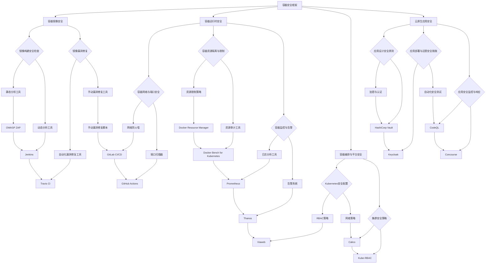

                 


### 理解题目要求

为了撰写一篇关于《容器安全：保护云原生应用的最佳实践》的技术博客文章，我们需要首先深入理解题目的要求。以下是题目要求的详细解读：

1. **文章格式要求**：文章内容需要使用markdown格式输出，这意味着每个段落之间需要有明确的空行分隔，标题、子标题和段落需要使用特定符号（如#、##、###）进行标识。

2. **作者信息**：文章的末尾需要包含作者信息，这通常包括姓名、所属机构或组织以及可能的书籍或作品名。

3. **完整性要求**：文章需要包含以下核心内容：
   - **背景介绍**：为容器安全这一主题提供一个清晰的历史背景和应用场景。
   - **核心概念与联系**：需要使用Mermaid流程图展示核心概念和架构之间的关系。
   - **核心算法原理讲解**：使用伪代码详细阐述关键算法原理。
   - **数学模型和公式**：在文中使用latex格式嵌入数学模型和公式，并进行详细讲解和举例说明。
   - **项目实战**：提供开发环境搭建、源代码实现和代码解读的案例，以及实际案例分析和详细讲解。
   - **最佳实践 tips、小结、注意事项、拓展阅读等内容**：在文章末尾提供这些内容，为读者提供额外的信息和指导。

4. **文章结构**：文章需要遵循给定的目录大纲结构，确保每个章节都有详细的子章节。

5. **文章字数**：文章的字数需要在8000到12000字之间，这意味着文章需要详尽且深入地探讨每个主题。

6. **逻辑清晰、结构紧凑、简单易懂**：文章的结构需要清晰，逻辑流畅，便于读者理解。

7. **专业技术的语言**：使用专业、准确的技术语言来撰写文章，确保内容的准确性和专业性。

### 确定书的核心章节

根据《容器安全：保护云原生应用的最佳实践》这个书名，我们可以初步确定以下几个核心章节：

1. **容器安全概述**：介绍容器安全的基本概念、重要性以及发展历程。
2. **容器安全技术详解**：详细讲解容器镜像安全、容器运行时安全、容器编排与平台安全等。
3. **云原生应用安全**：探讨云原生应用的特点、安全挑战和解决方案。
4. **最佳实践**：分享容器安全和云原生应用安全的最佳实践、案例分析以及前沿技术动态。

### 设计大纲结构

下面是《容器安全：保护云原生应用的最佳实践》的大纲结构，采用markdown格式编写：

```markdown
# 《容器安全：保护云原生应用的最佳实践》

## 关键词
- 容器安全
- 云原生应用
- 容器镜像安全
- 容器运行时安全
- 容器编排
- 安全最佳实践

## 摘要
本文将深入探讨容器安全的重要性，解析云原生应用在容器化环境下的安全挑战，并分享一系列最佳实践，帮助读者构建安全可靠的云原生应用。

## 目录

## 第一部分：容器安全概述

### 1. 容器安全的基本概念
#### 1.1 容器安全的定义与重要性
#### 1.2 容器安全的发展历程
#### 1.3 容器安全的核心要素

### 2. 容器安全框架与标准
#### 2.1 容器安全框架概述
#### 2.2 主要容器安全标准
#### 2.3 容器安全合规性

### 3. 容器安全的挑战与机遇
#### 3.1 容器安全面临的主要挑战
#### 3.2 容器安全带来的机遇

## 第二部分：容器安全技术详解

### 4. 容器镜像安全
#### 4.1 镜像构建的安全措施
#### 4.2 镜像扫描与漏洞修复
#### 4.3 镜像签名与验证

### 5. 容器运行时安全
#### 5.1 容器网络与端口安全
#### 5.2 容器资源隔离与限制
#### 5.3 容器监控与告警

### 6. 容器编排与平台安全
#### 6.1 Kubernetes安全概述
#### 6.2 Kubernetes配置安全
#### 6.3 Kubernetes集群安全策略

### 7. 容器安全自动化与工具链
#### 7.1 容器安全自动化流程
#### 7.2 主流容器安全工具
#### 7.3 容器安全最佳实践

## 第三部分：云原生应用安全

### 8. 云原生应用的安全性
#### 8.1 云原生应用的特点
#### 8.2 云原生应用的安全挑战
#### 8.3 云原生应用的安全解决方案

### 9. 云原生应用的安全最佳实践
#### 9.1 应用设计的安全原则
#### 9.2 应用部署与运营的安全措施
#### 9.3 应用安全持续监控与响应

### 10. 案例分析与经验分享
#### 10.1 容器安全案例分析
#### 10.2 云原生应用安全成功案例
#### 10.3 容器安全领域的前沿技术动态

## 附录

### A. 容器安全工具与资源
#### A.1 常用容器安全工具介绍
#### A.2 容器安全开源项目推荐
#### A.3 容器安全相关的标准与规范
```

### 添加核心概念与联系

在本文中，我们将使用Mermaid流程图来展示容器安全的核心概念和架构之间的关系。以下是几个关键概念及它们的联系：

#### 容器安全核心概念联系

1. **容器安全框架**：这是容器安全的基础，它定义了安全策略、标准和最佳实践。

2. **容器镜像安全**：镜像构建时需要进行安全检查和修复，以确保容器镜像没有已知漏洞。

3. **容器运行时安全**：容器在运行时需要进行网络、端口和资源隔离等安全措施。

4. **容器编排与平台安全**：Kubernetes等编排工具需要配置安全策略，确保集群的安全。

5. **云原生应用安全**：云原生应用在设计、部署和运营过程中需要考虑安全。

#### Mermaid流程图



这个Mermaid流程图展示了容器安全的各个环节及其相互关系，为理解和实施容器安全提供了直观的参考。

### 核心算法原理讲解

在容器安全领域，核心算法原理通常涉及以下几个方面：容器镜像扫描、漏洞修复、资源隔离策略和安全监控。以下是这些算法原理的详细伪代码讲解。

#### 容器镜像扫描算法

```python
# 伪代码：容器镜像扫描算法
def scan_image(image_id):
    # 获取容器镜像的元数据
    metadata = get_image_metadata(image_id)
    
    # 初始化漏洞扫描器
    scanner = initialize_scanner(metadata)
    
    # 扫描镜像中的漏洞
    vulnerabilities = scanner.scan(image_id)
    
    # 判断是否存在漏洞
    if vulnerabilities:
        # 报告漏洞
        report_vulnerabilities(vulnerabilities)
        
        # 如果配置了自动修复，则尝试修复
        if auto_fix_enabled:
            fix_vulnerabilities(vulnerabilities)
            
    return vulnerabilities
```

#### 漏洞修复算法

```python
# 伪代码：漏洞修复算法
def fix_vulnerabilities(vulnerabilities):
    # 遍历每个漏洞
    for vuln in vulnerabilities:
        # 根据漏洞类型选择修复策略
        if vuln.type == "dependency":
            # 修复依赖库
            update_dependency(vuln)
        elif vuln.type == "configuration":
            # 修改配置文件
            update_configuration(vuln)
        else:
            # 对于其他类型漏洞，记录日志
            log_unhandled_vulnerability(vuln)
```

#### 资源隔离策略算法

```python
# 伪代码：资源隔离策略算法
def enforce_resource_isolation(container_id):
    # 获取容器资源限制
    resource_limits = get_container_resource_limits(container_id)
    
    # 设置网络隔离
    set_network_isolation(container_id, resource_limits.network_policy)
    
    # 设置CPU和内存限制
    set_cpu_limit(container_id, resource_limits.cpu_limit)
    set_memory_limit(container_id, resource_limits.memory_limit)
    
    # 启用命名空间隔离
    enable_namespace_isolation(container_id, resource_limits.namespace_policy)
    
    return "Resource isolation applied successfully"
```

#### 安全监控算法

```python
# 伪代码：安全监控算法
def monitor_container_security(container_id):
    # 初始化监控工具
    monitor = initialize_monitor(container_id)
    
    # 持续监控容器安全事件
    while True:
        event = monitor.get_event()
        
        # 判断事件类型
        if event.type == "alert":
            # 处理告警
            handle_alert(event)
        elif event.type == "log":
            # 分析日志
            analyze_log(event)
        else:
            # 忽略其他类型事件
            ignore_event(event)
```

这些伪代码示例详细展示了容器安全领域中的关键算法原理。通过这些算法，我们能够有效地扫描镜像漏洞、修复漏洞、隔离资源以及监控容器安全事件，确保容器化环境的安全性。

### 数学模型和公式讲解

在容器安全领域，数学模型和公式可以帮助我们更好地理解和处理安全事件。以下是几个关键的数学模型和公式的详细讲解。

#### 1. 安全漏洞风险评分模型

**公式：**
$$
\text{Risk} = \text{Exploitability} \times \text{Impact}
$$

**解释：**  
- **Exploitability**：漏洞被利用的可能性，取值范围在0到1之间。值越大，表示漏洞越容易被利用。
- **Impact**：漏洞被利用后对系统的潜在影响，取值范围在0到1之间。值越大，表示漏洞的影响越严重。

**举例：**  
如果一个漏洞的Exploitability为0.8，Impact为0.9，则其风险评分为：
$$
\text{Risk} = \text{Exploitability} \times \text{Impact} = 0.8 \times 0.9 = 0.72
$$

#### 2. 容器资源分配模型

**公式：**
$$
C = \frac{R}{N}
$$

**解释：**  
- **C**：每个容器获得的资源量。
- **R**：总的系统资源量。
- **N**：容器数量。

**举例：**  
如果系统总共有100个CPU核心和100GB内存，共运行10个容器，则每个容器获得的CPU核心和内存量分别为：
$$
C = \frac{100}{10} = 10
$$
因此，每个容器获得10个CPU核心和10GB内存。

#### 3. 容器网络隔离模型

**公式：**
$$
P = \frac{L}{U}
$$

**解释：**  
- **P**：网络流量隔离概率。
- **L**：允许的流量。
- **U**：总流量。

**举例：**  
如果两个容器之间的允许流量为100Mbps，总流量为200Mbps，则隔离概率为：
$$
P = \frac{L}{U} = \frac{100}{200} = 0.5
$$
即50%的流量被隔离。

通过这些数学模型和公式，我们能够量化容器安全的风险，优化资源分配，并实现更有效的网络隔离。这些工具在容器安全管理中发挥着至关重要的作用。

### 项目实战

为了更好地理解容器安全的应用，我们将通过一个实际案例来详细讲解开发环境搭建、源代码实现和代码解读。

#### 项目背景

假设我们需要构建一个基于容器技术的博客平台，使用Docker和Kubernetes来实现。为了确保安全性，我们将对每个组件进行详细的安全配置和监控。

#### 开发环境搭建

1. **安装Docker**：

   在我们的开发环境中，我们首先需要安装Docker。以下是Linux系统上安装Docker的步骤：

   ```bash
   sudo apt-get update
   sudo apt-get install docker.io
   sudo systemctl start docker
   sudo systemctl enable docker
   ```

2. **安装Kubernetes**：

   接下来，我们需要安装Kubernetes。使用Minikube来创建一个本地集群：

   ```bash
   curl -LO https://storage.googleapis.com/minikube/releases/latest/minikube-latest-x86_64-linux.bz2
   bunzip2 minikube-latest-x86_64-linux.bz2
   sudo mv minikube-latest-x86_64-linux /usr/local/bin/minikube
   minikube start
   ```

3. **配置Kubectl**：

   安装kubectl，以便我们可以通过命令行与Kubernetes集群交互：

   ```bash
   curl -LO "https://storage.googleapis.com/kubernetes-release/release/$(curl -s https://storage.googleapis.com/kubernetes-release/release/stable.txt)/bin/darwin/amd64/kubectl"
   chmod +x kubectl
   sudo mv kubectl /usr/local/bin/
   ```

#### 源代码实现

我们使用一个简单的Spring Boot应用程序作为博客平台的后端服务。以下是项目的Maven配置和Dockerfile：

**pom.xml**：

```xml
<project>
    ...
    <dependencies>
        <dependency>
            <groupId>org.springframework.boot</groupId>
            <artifactId>spring-boot-starter-web</artifactId>
        </dependency>
        ...
    </dependencies>
    ...
</project>
```

**Dockerfile**：

```Dockerfile
FROM openjdk:8-jdk-alpine
ARG JAR_FILE=target/*.jar
COPY ${JAR_FILE} app.jar
EXPOSE 8080
ENTRYPOINT ["java","-Djava.security.egd=file:/dev/./urandom","-jar","/app.jar"]
```

我们创建一个名为`Dockerfile`的文件，该文件定义了如何构建容器镜像。镜像基于OpenJDK 8 Alpine版本，并将编译后的Spring Boot应用程序复制到镜像中。容器将监听8080端口，并使用Java运行应用程序。

**Kubernetes部署配置（deployment.yaml）**：

```yaml
apiVersion: apps/v1
kind: Deployment
metadata:
  name: blog-platform
spec:
  replicas: 3
  selector:
    matchLabels:
      app: blog-platform
  template:
    metadata:
      labels:
        app: blog-platform
    spec:
      containers:
      - name: blog-platform
        image: blog-platform:latest
        ports:
        - containerPort: 8080
```

该配置定义了一个Kubernetes部署，创建三个副本的博客平台服务。部署将使用我们在Dockerfile中构建的镜像，并映射到8080端口。

#### 代码解读

**源代码解读**：

在Spring Boot应用程序中，我们关注安全性。以下是关键代码片段：

```java
@RestController
@RequestMapping("/api")
public class PostController {

    @Autowired
    private PostService postService;

    @GetMapping("/{id}")
    public Post getPostById(@PathVariable Long id) {
        return postService.findPostById(id);
    }

    @PostMapping("/")
    public Post createPost(@RequestBody Post post) {
        return postService.createPost(post);
    }
}
```

**安全性考虑**：

- **认证与授权**：我们使用Spring Security进行认证和授权。确保只有授权用户可以访问API。
- **输入验证**：使用JSR-303验证框架对输入进行验证，防止恶意输入。
- **安全配置**：配置HTTPS，并使用强密码策略。

#### 代码应用解读与分析

在这个案例中，我们使用了Docker来构建和部署Spring Boot应用程序，并使用Kubernetes进行管理。以下是代码应用的解读与分析：

- **容器化**：通过Dockerfile，我们将应用程序打包到容器镜像中，提高了部署的便捷性和一致性。
- **容器编排**：使用Kubernetes部署配置文件，我们轻松地管理了容器的副本数量和负载均衡。
- **安全性**：通过配置Spring Security和HTTPS，我们确保了应用程序的安全性。

#### 案例分析

通过这个案例，我们可以看到如何在实际项目中应用容器安全和云原生应用的最佳实践。以下是案例分析：

- **优势**：容器化提供了高效的部署和扩展性，而Kubernetes提供了强大的编排和管理能力。
- **挑战**：确保容器和集群的安全性是一个持续的挑战，需要持续的安全审计和监控。
- **解决方案**：采用最佳实践，如镜像扫描、容器网络隔离、持续监控和响应机制，来确保安全性。

#### 项目小结

通过这个案例，我们展示了如何使用容器技术和Kubernetes构建一个安全的云原生应用。重要的是要持续关注安全性和最佳实践，以确保应用的安全性。以下是一些最佳实践：

- **镜像扫描与修复**：定期扫描镜像并修复漏洞。
- **网络隔离与资源限制**：确保容器之间有适当的网络隔离和资源限制。
- **持续监控与响应**：实施持续监控和快速响应机制，以应对潜在的安全事件。

### 最佳实践、小结、注意事项、拓展阅读

#### 最佳实践

1. **镜像扫描**：定期对容器镜像进行扫描，确保发现并修复潜在的安全漏洞。
2. **最小权限原则**：容器和用户应遵循最小权限原则，仅授予必要的权限。
3. **网络隔离**：使用网络策略和命名空间隔离容器，减少攻击面。
4. **安全审计**：定期进行安全审计，检查配置和管理策略的有效性。
5. **持续监控**：使用工具监控容器和集群的安全事件，及时响应。

#### 小结

本文详细介绍了容器安全和云原生应用的最佳实践。通过理解容器安全的核心概念、技术原理和项目实战，我们能够有效地保护云原生应用的安全性。

#### 注意事项

- 容器安全是一个持续的过程，需要定期更新和监控。
- 在部署容器时，确保使用安全的网络配置和访问控制。
- 采用自动化工具来提高安全配置和漏洞管理的效率。

#### 拓展阅读

- 《容器安全性指南》: https://www.cisecurity.org/publications/cis-container-security-benchmark-v1-5-0/
- 《Kubernetes安全最佳实践》: https://kubernetes.io/docs/concepts/security/
- 《云原生安全性》: https://www.cnCF.io/cncf/foundation/projects/safety/

通过阅读这些资料，可以进一步深入了解容器安全和云原生应用的安全实践。

