                 

### 文章标题

### 容器编排技术：Kubernetes实战指南

> 关键词：容器编排、Kubernetes、容器化、集群管理、微服务架构、云原生应用

> 摘要：
本文深入探讨Kubernetes容器编排技术的实践应用，从基础知识出发，逐步解析Kubernetes的核心组件、高级特性、云平台集成及性能优化策略。通过一系列实际案例，读者将全面掌握Kubernetes的部署、配置与管理，为构建高效可靠的云原生应用奠定坚实基础。

## 第1章 Kubernetes基础

### 1.1 Kubernetes简介

#### 1.1.1 容器和容器化技术

容器技术作为现代软件开发和运维的重要工具，通过封装应用及其依赖环境，实现了应用在不同环境中的高度一致性和可移植性。容器化技术主要包括Docker、rkt等，其中Docker是最为广泛使用的容器运行时环境。

**核心概念与联系：**

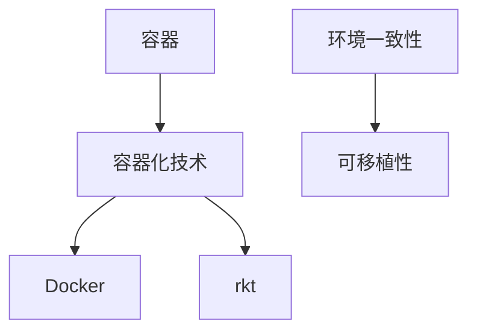

容器化技术使开发者能够将应用程序及其依赖环境打包成一个独立的、轻量级的容器镜像，从而在不同的开发、测试和生产环境中保持一致性，提高开发效率和应用部署的灵活性。

#### 1.1.2 Kubernetes的基本概念

Kubernetes是一种开源的容器编排平台，用于自动化容器的部署、扩展和管理。它基于Google多年的运行和管理大规模集群的经验，旨在提供高性能、可扩展、可恢复的容器编排解决方案。

**核心概念与联系：**

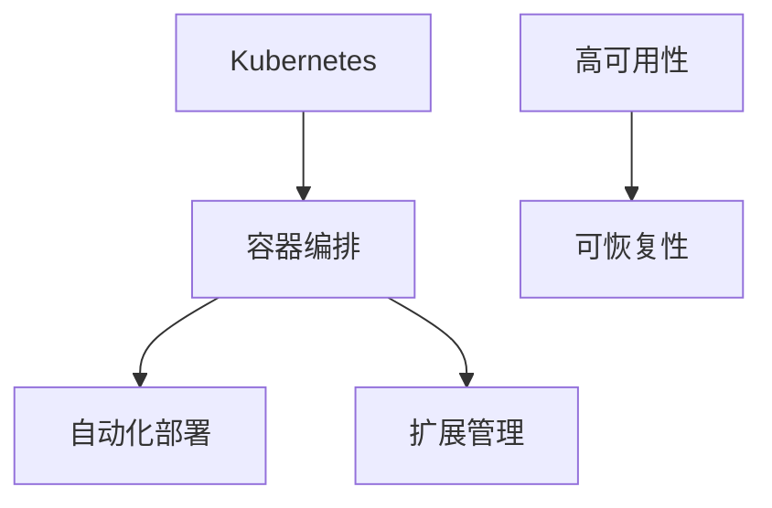

Kubernetes通过其灵活的API、强大的控制器和工作负载管理机制，使得容器化应用能够高效、可靠地运行在分布式环境中。

#### 1.1.3 Kubernetes的发展历史

Kubernetes起源于Google，在2014年开源给社区，并迅速获得了广泛的关注和认可。自2015年以来，Kubernetes每年都会发布新版本，不断完善其功能和稳定性。

**时间线：**

- 2014年：Kubernetes开源，由Google推出。
- 2015年：Kubernetes成为CNCF（Cloud Native Computing Foundation）的一部分。
- 2016年：Kubernetes 1.5版本发布，增加了许多新功能，如StatefulSets和kubectl插件。
- 2017年：Kubernetes 1.7版本发布，增加了对Windows容器和Windows Node的支持。
- 2018年至今：Kubernetes持续迭代，不断推出新功能和改进。

### 1.2 Kubernetes架构

Kubernetes集群由多个节点组成，每个节点上运行着Kubernetes的组件。这些组件协同工作，实现了对容器的自动化部署、扩展和管理。

#### 1.2.1 Kubernetes的主要组件

Kubernetes的主要组件包括：

- **API Server**：Kubernetes的API入口，提供RESTful接口用于与集群交互。
- **Controller Manager**：负责维护集群状态，确保控制器按照预期工作。
- **Scheduler**：负责分配容器到集群中的节点。
- **Kubelet**：运行在每个节点上的守护进程，负责容器生命周期管理。
- **Kube-Proxy**：负责网络和服务发现。

**核心概念与联系：**

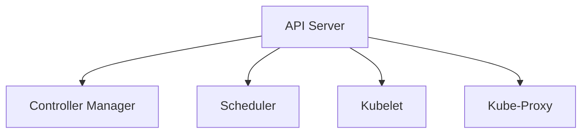

#### 1.2.2 Kubernetes的集群架构

Kubernetes集群通常由控制平面（Control Plane）和工作节点（Worker Node）组成。控制平面负责管理集群资源，而工作节点上运行着容器化的应用。

**集群架构：**

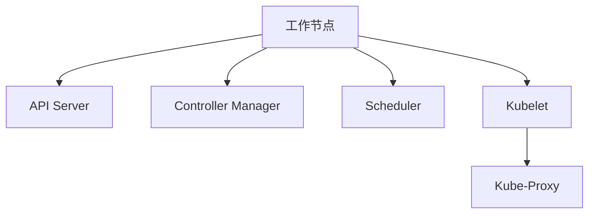

#### 1.2.3 Kubernetes的核心API

Kubernetes提供了一套核心API，用于创建和管理集群资源。这些API包括：

- **Pod**：Kubernetes的基本工作单元，包含一个或多个容器。
- **Service**：提供容器间的服务发现和负载均衡。
- **Deployment**：用于创建和管理Pod的部署。
- **StatefulSet**：用于管理有状态服务。
- **Ingress**：用于管理集群的入口流量。

**核心概念与联系：**

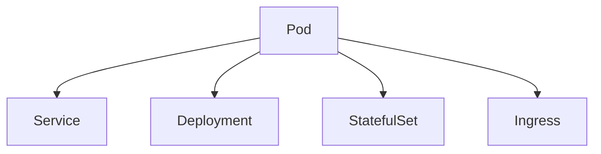

## 第2章 Kubernetes核心组件

### 2.1 Kubernetes控制器

控制器是Kubernetes架构中的核心组件，负责维护集群的状态和资源。以下是一些常见的控制器：

- **ReplicaSet**：确保Pod的副本数量符合预期。
- **Deployments**：管理Pod的创建和更新。
- **StatefulSets**：管理有状态服务。
- **DaemonSets**：确保每个节点上运行特定的Pod。
- **Jobs**：运行一次性的任务。

**核心概念与联系：**

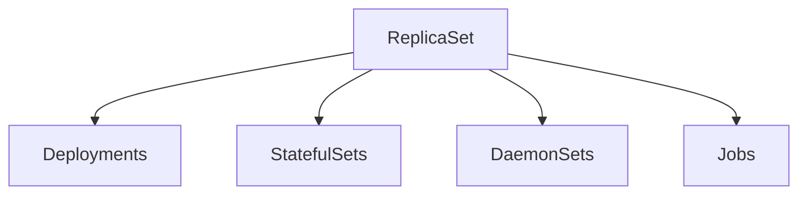

### 2.2 Kubernetes服务发现与负载均衡

服务发现和负载均衡是容器编排中至关重要的一部分。Kubernetes提供了一系列机制来实现这一点：

- **DNS**：通过DNS服务发现来解析服务名到集群内部IP地址。
- **负载均衡**：通过Service实现外部访问和内部负载均衡。
- **Ingress**：通过Ingress资源管理集群的入口流量。

**核心概念与联系：**

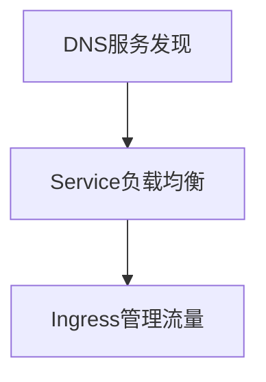

### 2.3 Kubernetes存储管理

Kubernetes提供了多种存储卷类型，用于管理容器持久化数据：

- **本地存储**：直接使用节点上的本地存储。
- **网络存储**：如NFS、iSCSI等。
- **云存储**：如AWS EBS、Azure Disk等。

**核心概念与联系：**

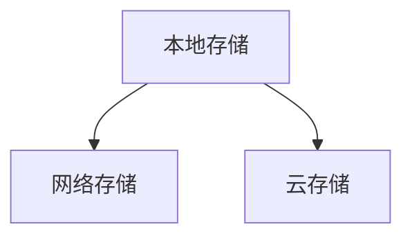

## 第3章 Kubernetes实践

### 3.1 Kubernetes集群部署

部署Kubernetes集群是使用Kubernetes的第一步。以下是一些常用的部署方法：

- **Minikube**：单机版的Kubernetes集群，适合本地开发和测试。
- **Kubeadm**：用于在物理机或虚拟机上部署Kubernetes集群。
- **Helm**：用于部署和管理Kubernetes应用程序。

**核心概念与联系：**

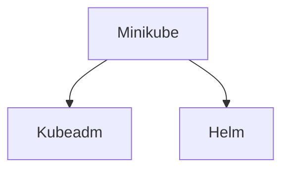

### 3.2 Kubernetes应用部署

部署容器化应用是Kubernetes的核心功能之一。以下是一些常用的部署策略：

- **Deployment**：管理无状态应用的部署。
- **StatefulSet**：管理有状态服务的部署。
- **Job**：运行一次性的任务。

**核心概念与联系：**

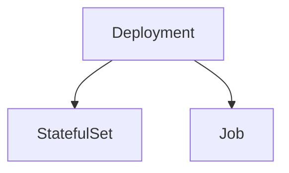

### 3.3 Kubernetes网络配置

Kubernetes网络配置是确保容器间和服务间通信正常的关键。以下是一些核心概念：

- **网络模型**：基于CNI（Container Network Interface）插件。
- **网络策略**：定义容器间的通信规则。
- **命名空间**：用于隔离资源。

**核心概念与联系：**

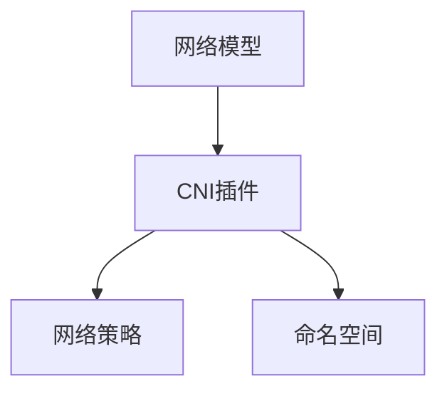

## 第4章 Kubernetes高级特性

### 4.1 Kubernetes多集群管理

多集群管理是现代云原生应用架构的常见需求。Kubernetes支持跨集群的部署、服务和数据管理。

**核心概念与联系：**

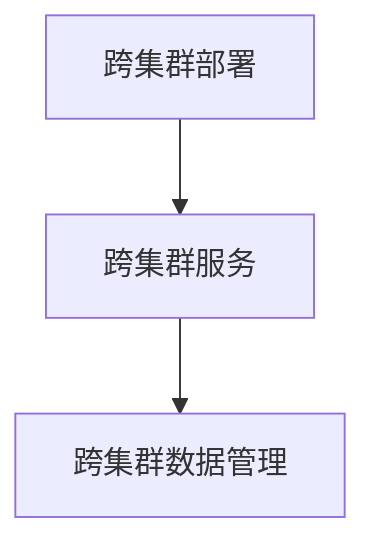

### 4.2 Kubernetes安全特性

Kubernetes提供了丰富的安全特性，确保集群的安全性和数据的机密性。

- **RBAC**：基于角色的访问控制。
- **Pod安全策略**：定义Pod的运行时安全约束。
- **加密**：数据传输和存储的加密机制。

**核心概念与联系：**

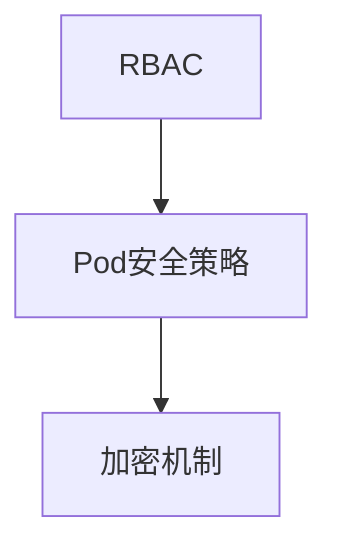

### 4.3 Kubernetes自动化与持续集成

自动化和持续集成是现代软件开发和运维的核心理念。Kubernetes支持CI/CD流程的自动化。

- **CI/CD流程**：集成和部署自动化。
- **Kustomize**：模板化Kubernetes配置。
- **Kubebuilder**：构建自定义Kubernetes资源。

**核心概念与联系：**

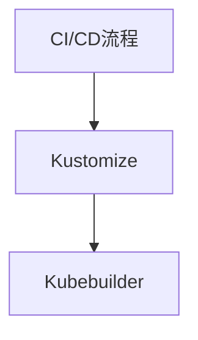

## 第5章 Kubernetes与云平台集成

### 5.1 Kubernetes与云服务集成

Kubernetes可以与各种云服务提供商集成，如AWS、Azure和Google Cloud。

- **AWS**：使用EKS进行Kubernetes集群的托管。
- **Azure**：使用AKS进行Kubernetes集群的托管。
- **Google Cloud**：使用GKE进行Kubernetes集群的托管。

**核心概念与联系：**

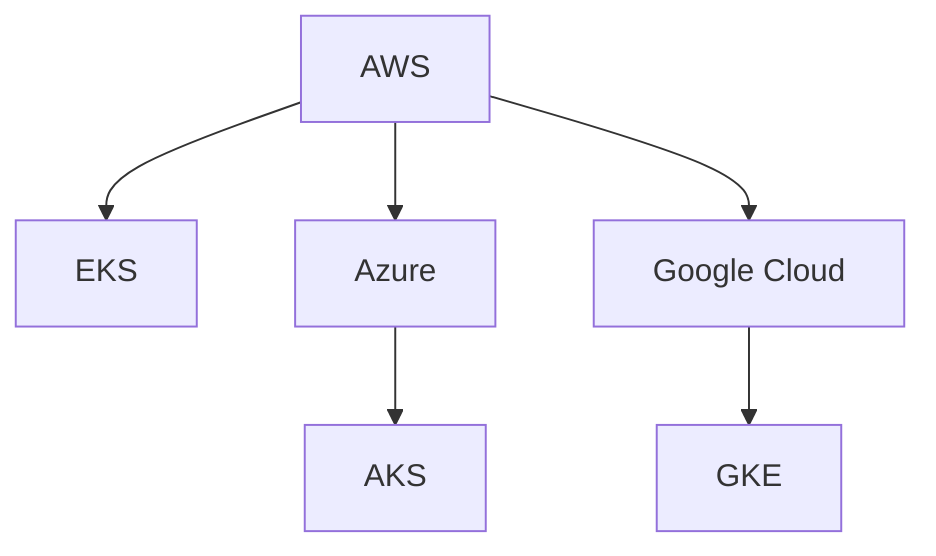

### 5.2 Kubernetes混合云与多云策略

混合云和多云策略是现代企业IT架构的趋势。Kubernetes支持跨云平台的应用部署和管理。

- **混合云架构**：在同一企业内部同时使用多个云服务。
- **多云管理平台**：集中管理多个云平台的资源。
- **跨云迁移策略**：在云平台之间迁移应用程序和数据。

**核心概念与联系：**

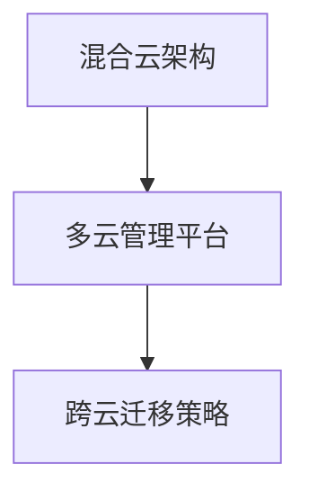

## 第6章 Kubernetes性能优化

### 6.1 Kubernetes性能监控

性能监控是确保Kubernetes集群稳定运行的关键。以下是一些常用的监控工具：

- **Prometheus**：开源监控解决方案。
- **Grafana**：可视化工具。
- **Kubeadm**：集群性能监控。

**核心概念与联系：**

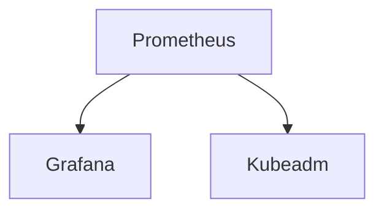

### 6.2 Kubernetes性能调优

性能调优包括资源分配、调度策略和网络优化等方面。

- **资源分配**：根据应用需求合理分配资源。
- **调度策略**：选择合适的调度算法。
- **网络优化**：优化网络性能，减少延迟。

**核心概念与联系：**

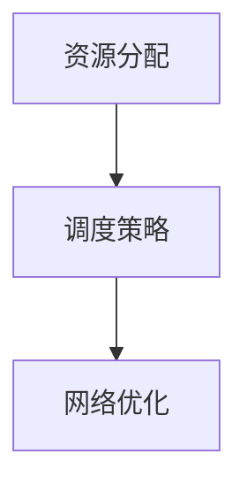

## 第7章 Kubernetes案例分析

### 7.1 企业级Kubernetes实践

在企业级环境中，Kubernetes提供了强大的部署和管理能力。以下是一个案例：

**案例场景：** 一个大型电子商务公司使用Kubernetes进行其核心业务系统的部署和管理。

**解决方案：** 使用Kubernetes进行应用容器化，通过Deployments和StatefulSets管理无状态和有状态服务，利用Ingress进行外部访问和负载均衡。

**核心概念与联系：**

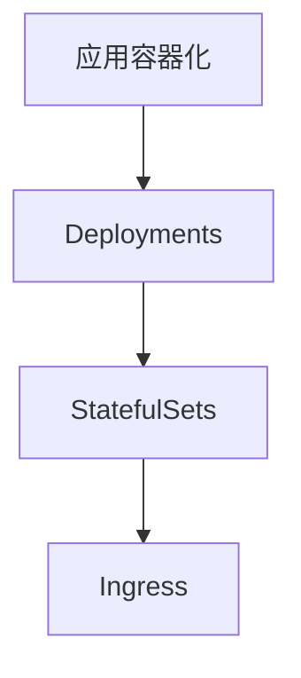

**项目实战：**

1. **环境搭建**：使用Kubeadm部署Kubernetes集群。
2. **应用部署**：使用Helm部署应用。
3. **监控与日志管理**：使用Prometheus和Grafana进行监控。

**源代码解析**：提供Kubernetes配置文件的代码解析。

**实际案例分析**：分析部署过程中遇到的问题和解决方案。

**项目小结**：总结项目经验，提出改进建议。

## 结论

本文通过逐步分析推理，深入探讨了Kubernetes容器编排技术的核心概念、实践应用和高级特性。通过实际案例，读者将能够全面掌握Kubernetes的部署、配置与管理，为构建高效可靠的云原生应用奠定坚实基础。

**最佳实践 Tips**：

- **合理规划集群架构**：根据业务需求规划集群规模和架构。
- **持续监控与优化**：定期监控性能，及时调整配置。
- **安全第一**：严格遵循最佳实践，确保集群和数据安全。

**小结**：

Kubernetes作为容器编排技术的领导者，具有广泛的适用性和强大的功能。通过本文的学习，读者将能够更好地理解和应用Kubernetes，为企业的数字化转型贡献力量。

**注意事项**：

- **环境配置**：确保Kubernetes环境配置正确，避免潜在问题。
- **升级与迁移**：谨慎进行Kubernetes集群的升级和迁移。

**拓展阅读**：

- 《Kubernetes权威指南》
- 《云原生应用架构设计》
- Kubernetes官方文档

作者：AI天才研究院/AI Genius Institute & 禅与计算机程序设计艺术 /Zen And The Art of Computer Programming

## 参考文献

1. **Kubernetes官方文档**：[https://kubernetes.io/docs/](https://kubernetes.io/docs/)
2. **《Kubernetes权威指南》**：[https://www.oreilly.com/library/view/kubernetes-the-hardway/](https://www.oreilly.com/library/view/kubernetes-the-hardway/)
3. **《云原生应用架构设计》**：[https://www.oreilly.com/library/view/cloud-native-application-architecture/](https://www.oreilly.com/library/view/cloud-native-application-architecture/)
4. **CNCF官网**：[https://www.cncf.io/](https://www.cncf.io/)
5. **Docker官方文档**：[https://docs.docker.com/](https://docs.docker.com/)
6. **Prometheus官方文档**：[https://prometheus.io/docs/](https://prometheus.io/docs/)
7. **Grafana官方文档**：[https://grafana.com/docs/](https://grafana.com/docs/)

