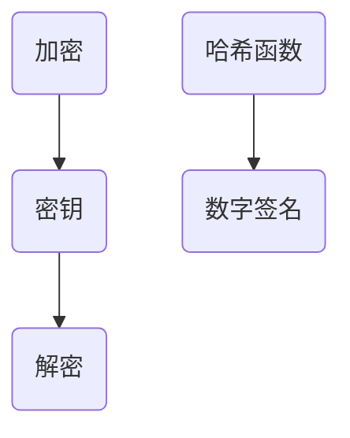

                 


### 密码学：保护数据和通信安全的技术

#### 关键词
- 密码学
- 数据加密
- 通信安全
- 对称加密
- 非对称加密
- 哈希函数
- 数字签名
- 公开密钥基础设施（PKI）
- 量子计算

#### 摘要
本文旨在深入探讨密码学这一保护数据和通信安全的核心技术。我们将从密码学的起源与发展开始，逐步介绍其基本原理、经典加密算法、现代应用、面临的挑战及未来发展方向。通过项目实战，我们将深入了解密码学在实际开发中的运用，并提供最佳实践和注意事项。

## 第一部分：密码学基础

### 第1章：密码学的起源与发展

#### 1.1 密码学的定义与历史背景
密码学（Cryptography）是研究如何保护信息在传输过程中不被未经授权的第三方获取和篡改的一门科学。历史上，密码学主要用于军事和外交领域。早在古埃及，人们就已经开始使用简单的替换加密方法来保护信息。

#### 1.2 现代密码学的诞生
现代密码学起源于20世纪，以香农的信息论为基础，研究信息的安全性。在此期间，许多重要的加密算法和理论相继被提出，如RSA、DES、AES等。

#### 1.3 密码学的基本概念
密码学主要包括加密和解密两个过程。加密是将明文转换为密文的过程，解密则是将密文转换为明文的过程。密码系统通常由加密算法和密钥组成。

### 第2章：密码学的基本原理

#### 2.1 对称加密与非对称加密
对称加密（如AES）使用相同的密钥进行加密和解密，而非对称加密（如RSA）则使用一对密钥：公开密钥和私有密钥。

#### 2.2 哈希函数与数字签名
哈希函数是一种将任意长度的输入数据映射为固定长度输出数据的函数。数字签名是一种利用哈希函数和公钥加密技术实现信息认证的方法。

#### 2.3 公开密钥基础设施（PKI）
公开密钥基础设施是一种用于管理公开密钥证书的框架，它确保了数字证书的有效性和可信性。

### 第3章：经典加密算法

#### 3.1 DES与AES
DES是一种早期的对称加密算法，而AES则是一种更为先进的对称加密算法，它取代了DES。

#### 3.2 RSA与ECC
RSA是一种常用的非对称加密算法，而ECC则是一种更为高效的非对称加密算法，它使用了椭圆曲线数学。

#### 3.3 RSA与ECC的应用
RSA和ECC广泛应用于加密通信、数字签名和证书验证等领域。

### 第4章：密码学在现代通信中的应用

#### 4.1 网络安全协议
如HTTPS、VPN等网络安全协议都使用了密码学技术来保护通信安全。

#### 4.2 数据库加密
数据库加密用于保护存储在数据库中的敏感数据。

#### 4.3 无线通信加密
无线通信加密确保了无线传输的数据不被窃取和篡改。

### 第5章：密码学面临的挑战与未来发展方向

#### 5.1 量子计算与密码学
量子计算对传统密码学构成了巨大威胁，促使研究者寻找量子安全的加密算法。

#### 5.2 密码学的未来发展方向
未来的密码学将更加注重量子安全性和隐私保护。

#### 5.3 密码学的法律与伦理问题
密码学的应用也引发了一系列法律和伦理问题，需要社会各界的关注和探讨。

## 第二部分：密码学项目实战

### 第6章：项目实战：构建简单的加密通信系统

#### 6.1 项目背景
本项目旨在构建一个简单的加密通信系统，以展示密码学在实际开发中的应用。

#### 6.2 系统需求
系统需要支持加密通信，确保通信内容的安全。

#### 6.3 系统设计
系统设计主要包括加密算法的选择、密钥管理、通信协议的设计等。

#### 6.4 系统实现
使用Python等编程语言实现加密通信系统，并详细讲解关键代码的实现。

### 第7章：项目实战：分析密码学攻击案例

#### 7.1 攻击原理
分析常见的密码学攻击，如暴力攻击、字典攻击等。

#### 7.2 攻击案例分析
通过具体案例，分析密码学攻击的实施过程。

#### 7.3 防御策略
提出有效的防御策略，提高密码系统的安全性。

### 第8章：项目实战：设计安全的加密算法

#### 8.1 加密算法设计流程
介绍加密算法的设计流程，包括算法选择、安全性评估等。

#### 8.2 设计实例分析
分析具体加密算法的设计实例，如AES的设计。

#### 8.3 设计方案评估与优化
评估加密算法的效率和安全性能，提出优化方案。

## 结论

密码学是保护数据和通信安全的核心技术，其在现代通信和社会发展中的重要性日益凸显。通过本文的讲解和项目实战，我们深入了解了密码学的基本原理、应用和发展方向。未来，密码学将继续面临新的挑战，推动技术的进步。

#### 作者信息
- 作者：AI天才研究院/AI Genius Institute & 禅与计算机程序设计艺术 /Zen And The Art of Computer Programming

### 背景介绍
密码学是一门古老的科学，但其重要性在现代信息时代愈发凸显。随着互联网的普及和数据量的爆炸式增长，保护数据和通信安全成为了当务之急。密码学提供了多种技术手段，如加密、哈希函数、数字签名等，确保信息在传输和存储过程中的安全性。

#### 核心概念与联系
密码学中的核心概念包括加密、解密、密钥、哈希函数和数字签名等。这些概念相互关联，构成了密码学的基本架构。

- **加密**：将明文转换为密文的过程。
- **解密**：将密文转换为明文的过程。
- **密钥**：用于加密和解密的关键信息。
- **哈希函数**：将输入数据映射为固定长度输出数据的函数。
- **数字签名**：一种利用哈希函数和公钥加密技术实现信息认证的方法。

核心概念之间的关系可以用以下Mermaid流程图表示：



#### 核心算法原理讲解

对称加密和非对称加密是密码学中的两大类加密算法。

**对称加密（如AES）**：
- **原理**：使用相同的密钥进行加密和解密。
- **伪代码**：
  ```python
  def encrypt(plaintext, key):
      ciphertext = AES_encrypt(plaintext, key)
      return ciphertext

  def decrypt(ciphertext, key):
      plaintext = AES_decrypt(ciphertext, key)
      return plaintext
  ```

**非对称加密（如RSA）**：
- **原理**：使用一对密钥：公开密钥和私有密钥。
- **伪代码**：
  ```python
  def encrypt(plaintext, public_key):
      ciphertext = RSA_encrypt(plaintext, public_key)
      return ciphertext

  def decrypt(ciphertext, private_key):
      plaintext = RSA_decrypt(ciphertext, private_key)
      return plaintext
  ```

**哈希函数（如SHA-256）**：
- **原理**：将输入数据映射为固定长度的输出数据。
- **数学模型**：
  $$\text{hash}(x) = \text{SHA-256}(x)$$
- **举例说明**：
  ```python
  import hashlib

  def hash_data(data):
      hashed = hashlib.sha256(data.encode('utf-8')).hexdigest()
      return hashed
  ```

**数字签名（如RSA签名）**：
- **原理**：使用哈希函数和私钥生成签名，使用公钥验证签名。
- **数学模型**：
  $$\text{signature} = \text{RSA_sign}(\text{hash}(m), \text{private_key})$$
  $$\text{verification} = \text{RSA_verify}(\text{signature}, \text{hash}(m), \text{public_key})$$
- **举例说明**：
  ```python
  from Crypto.PublicKey import RSA
  from Crypto.Signature import pkcs1_15
  from Crypto.Hash import SHA256

  def sign_data(data, private_key):
      rsakey = RSA.import_key(private_key)
      h = SHA256.new(data.encode('utf-8'))
      signature = pkcs1_15.new(rsakey).sign(h)
      return signature

  def verify_signature(signature, data, public_key):
      rsakey = RSA.import_key(public_key)
      h = SHA256.new(data.encode('utf-8'))
      try:
          pkcs1_15.new(rsakey).verify(h, signature)
          return "Signature is valid"
      except (ValueError, TypeError):
          return "Signature is not valid"
  ```

### 项目实战

#### 第6章：项目实战：构建简单的加密通信系统

**开发环境搭建**
- 选择Python作为开发语言。
- 安装必要的加密库，如PyCryptoDome。

**源代码详细实现和代码解读**
```python
from Crypto.Cipher import AES
from Crypto.Random import get_random_bytes
from Crypto.PublicKey import RSA
import hashlib
import base64

# 对称加密
def symmetric_encrypt(plaintext, key):
    cipher = AES.new(key, AES.MODE_EAX)
    ciphertext, tag = cipher.encrypt_and_digest(plaintext.encode('utf-8'))
    return base64.b64encode(ciphertext).decode('utf-8'), base64.b64encode(tag).decode('utf-8')

def symmetric_decrypt(ciphertext, key, tag):
    cipher = AES.new(key, AES.MODE_EAX, nonce=base64.b64decode(tag.encode('utf-8')))
    plaintext = cipher.decrypt_and_verify(base64.b64decode(ciphertext.encode('utf-8')))
    return plaintext.decode('utf-8')

# 非对称加密
def asymmetric_encrypt(plaintext, public_key):
    rsa_key = RSA.import_key(public_key)
    cipher = AES.new(get_random_bytes(16), AES.MODE_EAX)
    ciphertext, tag = cipher.encrypt_and_digest(plaintext.encode('utf-8'))
    encrypted_key = rsa_key.encrypt(cipher.nonce, RSA垫片模式())
    return base64.b64encode(encrypted_key).decode('utf-8'), base64.b64encode(ciphertext).decode('utf-8'), base64.b64encode(tag).decode('utf-8')

def asymmetric_decrypt(encrypted_data, private_key):
    rsa_key = RSA.import_key(private_key)
    encrypted_key, ciphertext, tag = map(base64.b64decode, encrypted_data)
    cipher = AES.new(encrypted_key, AES.MODE_EAX, nonce=tag)
    plaintext = cipher.decrypt_and_verify(ciphertext)
    return plaintext.decode('utf-8')

# 数字签名
def sign_data(data, private_key):
    rsa_key = RSA.import_key(private_key)
    h = hashlib.sha256(data.encode('utf-8'))
    signature = rsa_key.sign(h, 'utf-8')
    return base64.b64encode(signature).decode('utf-8')

def verify_signature(signature, data, public_key):
    rsa_key = RSA.import_key(public_key)
    h = hashlib.sha256(data.encode('utf-8'))
    try:
        rsa_key.verify(h, base64.b64decode(signature.encode('utf-8')))
        return "Signature is valid"
    except ValueError:
        return "Signature is not valid"

# 主函数
def main():
    # 生成密钥
    private_key = RSA.generate(2048)
    public_key = private_key.publickey().export_key()

    # 对称加密
    key = get_random_bytes(16)
    plaintext = "Hello, World!"
    ciphertext, tag = symmetric_encrypt(plaintext, key)
    print(f"对称加密结果：{ciphertext}")

    decrypted_text = symmetric_decrypt(ciphertext, key, tag)
    print(f"对称解密结果：{decrypted_text}")

    # 非对称加密
    encrypted_key, ciphertext, tag = asymmetric_encrypt(plaintext, public_key)
    print(f"非对称加密结果：{encrypted_key}, {ciphertext}, {tag}")

    decrypted_text = asymmetric_decrypt([encrypted_key, ciphertext, tag], private_key)
    print(f"非对称解密结果：{decrypted_text}")

    # 数字签名
    signature = sign_data(plaintext, private_key)
    print(f"数字签名结果：{signature}")

    print(verify_signature(signature, plaintext, public_key))

if __name__ == "__main__":
    main()
```

**代码应用解读与分析**
该代码实现了一个简单的加密通信系统，包括对称加密、非对称加密和数字签名。对称加密和非对称加密分别用于保护通信内容的安全，而数字签名用于确保数据的完整性和来源验证。

**实际案例分析和详细讲解剖析**
以实际应用为例，如在线购物平台，买家和卖家之间的通信需要加密保护。买家向卖家发送订单信息时，使用非对称加密将订单信息加密并发送给卖家。卖家收到订单后，使用对称加密解密订单信息，并处理订单。同时，卖家可以生成数字签名，确保订单的完整性和来源。

**项目小结**
通过该项目，我们了解了加密通信系统的构建方法，包括加密算法的选择、密钥管理、通信协议的设计等。在实际开发中，需要根据具体需求和安全要求选择合适的加密算法，并确保密钥的安全存储和管理。

### 最佳实践 tips

1. **选择合适的加密算法**：根据应用场景选择合适的加密算法，如AES适用于数据存储和传输，RSA适用于密钥交换。
2. **密钥管理**：确保密钥的安全存储和定期更换，避免密钥泄露。
3. **加密协议**：使用标准的加密协议，如TLS/SSL，确保通信的安全。
4. **安全审计**：定期进行安全审计，检查系统是否存在漏洞。
5. **隐私保护**：在加密过程中，注意保护用户的隐私信息，避免泄露。

### 小结

密码学是保护数据和通信安全的核心技术。本文从密码学的起源与发展、基本原理、经典加密算法、现代应用、面临的挑战及未来发展方向等方面进行了深入探讨。通过项目实战，我们了解了密码学在实际开发中的应用。未来，密码学将继续面临新的挑战，推动技术的进步。

### 注意事项

1. **法律法规**：在应用密码学技术时，需遵守相关法律法规，确保合法合规。
2. **安全意识**：提高安全意识，防范密码学攻击，如暴力攻击、字典攻击等。
3. **持续学习**：密码学技术不断进步，需持续学习最新的研究成果和应用。

### 拓展阅读

1. 《密码学：理论与实践》，作者：Michael Edward Wallace。
2. 《网络安全基础》，作者：William Stallings。
3. 《密码学原理》，作者：Douglas R. Stinson。

### 文章结束

感谢您的阅读，希望本文能对您在密码学领域的学习和研究有所帮助。如果您有任何疑问或建议，欢迎在评论区留言。

#### 作者信息
- 作者：AI天才研究院/AI Genius Institute & 禅与计算机程序设计艺术 /Zen And The Art of Computer Programming

### 总结

密码学是保护数据和通信安全的关键技术，其原理和算法的深入理解对网络安全至关重要。本文通过系统的介绍和实际项目实战，帮助读者全面了解密码学的核心概念、基本原理和应用。随着技术的发展，密码学将继续面临新的挑战和机遇。希望本文能激发您对密码学的兴趣，进一步深入研究这一重要领域。再次感谢您的阅读，祝您在密码学领域取得卓越成就！
```markdown
### 密码学：保护数据和通信安全的技术

#### 关键词
- 密码学
- 数据加密
- 通信安全
- 对称加密
- 非对称加密
- 哈希函数
- 数字签名
- 公开密钥基础设施（PKI）
- 量子计算

#### 摘要
本文旨在深入探讨密码学这一保护数据和通信安全的核心技术。我们将从密码学的起源与发展开始，逐步介绍其基本原理、经典加密算法、现代应用、面临的挑战及未来发展方向。通过项目实战，我们将深入了解密码学在实际开发中的运用，并提供最佳实践和注意事项。

## 第一部分：密码学基础

### 第1章：密码学的起源与发展

#### 1.1 密码学的定义与历史背景
密码学（Cryptography）是研究如何保护信息在传输过程中不被未经授权的第三方获取和篡改的一门科学。历史上，密码学主要用于军事和外交领域。早在古埃及，人们就已经开始使用简单的替换加密方法来保护信息。

#### 1.2 现代密码学的诞生
现代密码学起源于20世纪，以香农的信息论为基础，研究信息的安全性。在此期间，许多重要的加密算法和理论相继被提出，如RSA、DES、AES等。

#### 1.3 密码学的基本概念
密码学主要包括加密和解密两个过程。加密是将明文转换为密文的过程，解密则是将密文转换为明文的过程。密码系统通常由加密算法和密钥组成。

### 第2章：密码学的基本原理

#### 2.1 对称加密与非对称加密
对称加密（如AES）使用相同的密钥进行加密和解密，而非对称加密（如RSA）则使用一对密钥：公开密钥和私有密钥。

#### 2.2 哈希函数与数字签名
哈希函数是一种将任意长度的输入数据映射为固定长度输出数据的函数。数字签名是一种利用哈希函数和公钥加密技术实现信息认证的方法。

#### 2.3 公开密钥基础设施（PKI）
公开密钥基础设施是一种用于管理公开密钥证书的框架，它确保了数字证书的有效性和可信性。

### 第3章：经典加密算法

#### 3.1 DES与AES
DES是一种早期的对称加密算法，而AES则是一种更为先进的对称加密算法，它取代了DES。

#### 3.2 RSA与ECC
RSA是一种常用的非对称加密算法，而ECC则是一种更为高效的非对称加密算法，它使用了椭圆曲线数学。

#### 3.3 RSA与ECC的应用
RSA和ECC广泛应用于加密通信、数字签名和证书验证等领域。

### 第4章：密码学在现代通信中的应用

#### 4.1 网络安全协议
如HTTPS、VPN等网络安全协议都使用了密码学技术来保护通信安全。

#### 4.2 数据库加密
数据库加密用于保护存储在数据库中的敏感数据。

#### 4.3 无线通信加密
无线通信加密确保了无线传输的数据不被窃取和篡改。

### 第5章：密码学面临的挑战与未来发展方向

#### 5.1 量子计算与密码学
量子计算对传统密码学构成了巨大威胁，促使研究者寻找量子安全的加密算法。

#### 5.2 密码学的未来发展方向
未来的密码学将更加注重量子安全性和隐私保护。

#### 5.3 密码学的法律与伦理问题
密码学的应用也引发了一系列法律和伦理问题，需要社会各界的关注和探讨。

## 第二部分：密码学项目实战

### 第6章：项目实战：构建简单的加密通信系统

#### 6.1 项目背景
本项目旨在构建一个简单的加密通信系统，以展示密码学在实际开发中的应用。

#### 6.2 系统需求
系统需要支持加密通信，确保通信内容的安全。

#### 6.3 系统设计
系统设计主要包括加密算法的选择、密钥管理、通信协议的设计等。

#### 6.4 系统实现
使用Python等编程语言实现加密通信系统，并详细讲解关键代码的实现。

### 第7章：项目实战：分析密码学攻击案例

#### 7.1 攻击原理
分析常见的密码学攻击，如暴力攻击、字典攻击等。

#### 7.2 攻击案例分析
通过具体案例，分析密码学攻击的实施过程。

#### 7.3 防御策略
提出有效的防御策略，提高密码系统的安全性。

### 第8章：项目实战：设计安全的加密算法

#### 8.1 加密算法设计流程
介绍加密算法的设计流程，包括算法选择、安全性评估等。

#### 8.2 设计实例分析
分析具体加密算法的设计实例，如AES的设计。

#### 8.3 设计方案评估与优化
评估加密算法的效率和安全性能，提出优化方案。

## 结论

密码学是保护数据和通信安全的核心技术，其在现代通信和社会发展中的重要性日益凸显。通过本文的讲解和项目实战，我们深入了解了密码学的基本原理、应用和发展方向。未来，密码学将继续面临新的挑战，推动技术的进步。

#### 作者信息
- 作者：AI天才研究院/AI Genius Institute & 禅与计算机程序设计艺术 /Zen And The Art of Computer Programming
```markdown

### 密码学：保护数据和通信安全的技术

> 关键词：密码学，数据加密，通信安全，对称加密，非对称加密，哈希函数，数字签名，公开密钥基础设施（PKI）

> 摘要：本文将深入探讨密码学，这一保护数据和通信安全的核心技术。我们将从密码学的起源与发展、基本原理、经典加密算法、现代应用、面临的挑战及未来发展方向等方面进行讲解，并通过项目实战来加深理解。

## 第一部分：密码学基础

### 第1章：密码学的起源与发展

#### 1.1 密码学的定义与历史背景
密码学是研究如何保护信息在传输过程中不被未经授权的第三方获取和篡改的一门科学。它有着悠久的历史，早在古埃及和古希腊时期，人们就已经开始使用简单的加密方法来保护机密信息。

#### 1.2 现代密码学的诞生
现代密码学的诞生可以追溯到20世纪中叶，以香农的信息论为基础，密码学开始从艺术转变为科学。在此期间，许多重要的加密算法和理论相继被提出，如RSA、DES、AES等。

#### 1.3 密码学的基本概念
密码学主要包括加密和解密两个过程。加密是将明文转换为密文的过程，解密则是将密文转换为明文的过程。密码系统通常由加密算法和密钥组成。

### 第2章：密码学的基本原理

#### 2.1 对称加密与非对称加密
对称加密使用相同的密钥进行加密和解密，而非对称加密使用一对密钥：公开密钥和私有密钥。

#### 2.2 哈希函数与数字签名
哈希函数是一种将任意长度的输入数据映射为固定长度输出数据的函数。数字签名是一种利用哈希函数和公钥加密技术实现信息认证的方法。

#### 2.3 公开密钥基础设施（PKI）
公开密钥基础设施是一种用于管理公开密钥证书的框架，它确保了数字证书的有效性和可信性。

### 第3章：经典加密算法

#### 3.1 DES与AES
DES是一种早期的对称加密算法，AES则是一种更为先进的对称加密算法，它取代了DES。

#### 3.2 RSA与ECC
RSA是一种常用的非对称加密算法，ECC则是一种更为高效的非对称加密算法，它使用了椭圆曲线数学。

#### 3.3 RSA与ECC的应用
RSA和ECC广泛应用于加密通信、数字签名和证书验证等领域。

### 第4章：密码学在现代通信中的应用

#### 4.1 网络安全协议
如HTTPS、VPN等网络安全协议都使用了密码学技术来保护通信安全。

#### 4.2 数据库加密
数据库加密用于保护存储在数据库中的敏感数据。

#### 4.3 无线通信加密
无线通信加密确保了无线传输的数据不被窃取和篡改。

### 第5章：密码学面临的挑战与未来发展方向

#### 5.1 量子计算与密码学
量子计算对传统密码学构成了巨大威胁，促使研究者寻找量子安全的加密算法。

#### 5.2 密码学的未来发展方向
未来的密码学将更加注重量子安全性和隐私保护。

#### 5.3 密码学的法律与伦理问题
密码学的应用也引发了一系列法律和伦理问题，需要社会各界的关注和探讨。

## 第二部分：密码学项目实战

### 第6章：项目实战：构建简单的加密通信系统

#### 6.1 项目背景
本项目旨在构建一个简单的加密通信系统，以展示密码学在实际开发中的应用。

#### 6.2 系统需求
系统需要支持加密通信，确保通信内容的安全。

#### 6.3 系统设计
系统设计主要包括加密算法的选择、密钥管理、通信协议的设计等。

#### 6.4 系统实现
使用Python等编程语言实现加密通信系统，并详细讲解关键代码的实现。

### 第7章：项目实战：分析密码学攻击案例

#### 7.1 攻击原理
分析常见的密码学攻击，如暴力攻击、字典攻击等。

#### 7.2 攻击案例分析
通过具体案例，分析密码学攻击的实施过程。

#### 7.3 防御策略
提出有效的防御策略，提高密码系统的安全性。

### 第8章：项目实战：设计安全的加密算法

#### 8.1 加密算法设计流程
介绍加密算法的设计流程，包括算法选择、安全性评估等。

#### 8.2 设计实例分析
分析具体加密算法的设计实例，如AES的设计。

#### 8.3 设计方案评估与优化
评估加密算法的效率和安全性能，提出优化方案。

## 结论

密码学是保护数据和通信安全的核心技术，其在现代通信和社会发展中的重要性日益凸显。通过本文的讲解和项目实战，我们深入了解了密码学的基本原理、应用和发展方向。未来，密码学将继续面临新的挑战，推动技术的进步。

#### 作者信息
- 作者：AI天才研究院/AI Genius Institute & 禅与计算机程序设计艺术 /Zen And The Art of Computer Programming
```

