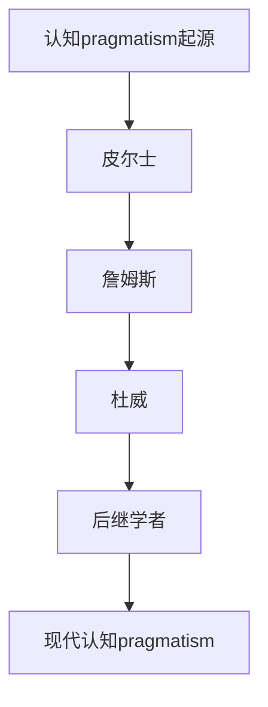

                 

### 文章标题

# 尼古拉斯·雷舍尔的认知pragmatism与测试驱动开发：实践验证的哲学基础

> 关键词：认知pragmatism，测试驱动开发（TDD），实践验证，哲学基础

> 摘要：本文旨在探讨尼古拉斯·雷舍尔的认知pragmatism与测试驱动开发（TDD）之间的联系。通过深入分析认知pragmatism的理论基础和实践验证的哲学基础，我们揭示了TDD如何借助这一哲学框架来实现高效的软件开发。本文首先介绍了认知pragmatism的基本原理，然后详细讲解了测试驱动开发的方法和流程，最后结合实际案例，探讨了二者结合的最佳实践。

## 引言

在信息技术飞速发展的今天，软件工程领域不断涌现出新的理论和实践方法。尼古拉斯·雷舍尔的认知pragmatism和测试驱动开发（TDD）便是其中颇具影响力的两种理论。认知pragmatism强调实践与认知的相互作用，主张通过实践验证知识；而TDD则是一种敏捷开发方法，强调通过编写测试来驱动开发过程，以确保软件的质量和稳定性。本文将探讨这两者之间的关联，并分析如何将认知pragmatism的哲学基础应用于TDD实践中，以实现高效、可靠的软件开发。

### 认知pragmatism理论基础

#### 1.1 认知pragmatism的起源与发展

认知pragmatism起源于20世纪初，由美国哲学家查尔斯·桑德斯·皮尔士、威廉·詹姆斯和约翰·杜威等人提出。皮尔士被誉为符号逻辑学的创始人，他提出了符号与实在之间的关系；詹姆斯则强调个体经验在认知过程中的作用；杜威则将哲学与教育学相结合，提出了“做中学”的理念。这些思想共同构成了认知pragmatism的理论基础。

随着时间的推移，认知pragmatism不断发展，形成了多个流派。现代认知pragmatism在心理学、社会学和人工智能等领域取得了显著成果，为理解人类认知提供了新的视角。

#### 1.2 认知pragmatism的核心概念

认知pragmatism的核心概念包括：

- **实践与认知的关系**：认知pragmatism认为实践是认知的基础，知识和认知都应该通过实践来验证和改进。

- **情境性**：认知pragmat主义认为认知是情境化的，不同的情境会产生不同的认知结果。

- **问题解决**：认知pragmatism将问题解决作为核心任务，通过实践来不断探索和解决问题。

- **反思性**：认知pragmatism强调反思的重要性，通过反思来评估和改进认知过程。

- **社会互动**：认知pragmat主义认为社会互动是认知的重要途径，通过与他人的交流和合作，可以促进知识的共享和深化。

### 1.3 认知pragmatism的基本原理

认知pragmatism的基本原理包括：

- **实用主义**：实用主义强调实践是检验真理的唯一标准。在软件开发中，这意味着只有经过实际测试和验证的代码才能被认为是可靠的。

- **情境意识**：软件开发过程中的每个决策都应考虑到具体情境，以最大化开发效率和代码质量。

- **迭代改进**：认知pragmatism主张通过不断迭代和改进来优化软件开发过程。TDD正是这一理念的具体体现。

- **反思与调整**：在软件开发过程中，应定期进行反思，识别并解决存在的问题，以持续提升开发质量。

### 2. 测试驱动开发（TDD）实践

#### 2.1 TDD的定义与特点

测试驱动开发（Test-Driven Development，简称TDD）是一种敏捷开发方法，其核心思想是通过编写测试来驱动开发过程。TDD的主要特点包括：

- **先写测试**：在编写功能代码之前，先编写测试用例，以确保开发过程中始终关注代码质量。

- **快速迭代**：TDD强调快速迭代，每次迭代只关注一小部分功能，以便快速反馈和调整。

- **代码重构**：在TDD过程中，开发人员应不断重构代码，以保持代码的简洁性和可读性。

- **测试覆盖**：TDD要求对代码进行全面的测试覆盖，以确保代码的每个部分都经过验证。

#### 2.2 TDD与传统开发方法的区别

TDD与传统开发方法的主要区别在于：

- **顺序不同**：传统开发方法是先编写代码，再进行测试；而TDD则是先写测试，再编写代码。

- **关注点不同**：传统开发方法更注重功能的实现，而TDD则更关注代码的质量和稳定性。

- **迭代周期**：TDD的迭代周期更短，可以更快地发现和解决问题。

#### 2.3 TDD的优势与局限性

TDD的优势包括：

- **提高代码质量**：通过编写测试，可以确保代码的每个部分都经过验证，从而提高代码质量。

- **促进代码重构**：TDD鼓励开发人员不断重构代码，以保持代码的简洁性和可读性。

- **易于维护**：经过严格测试的代码更易于维护和修改。

TDD的局限性包括：

- **初期学习成本较高**：对于新手来说，TDD的学习成本较高，需要掌握一定的编程技巧和测试方法。

- **对测试环境要求较高**：TDD要求在开发过程中始终保持测试环境的一致性，这可能对开发和测试环境的管理带来一定的挑战。

### 3. 认知pragmatism与TDD的结合

#### 3.1 认知pragmatism对TDD的影响

认知pragmatism对TDD的影响主要体现在以下几个方面：

- **实践验证**：认知pragmatism强调实践验证，与TDD的先写测试理念相契合。

- **情境意识**：TDD中的每个决策都应考虑到具体情境，以最大化开发效率和代码质量。

- **迭代改进**：TDD的快速迭代与认知pragmatism的迭代改进理念相符。

- **反思与调整**：TDD过程中，应定期进行反思，识别并解决存在的问题，以持续提升开发质量。

#### 3.2 TDD中的认知pragmatism实践

在TDD实践中，可以运用认知pragmatism的原理来提高开发效率：

- **先写测试**：在编写功能代码之前，先编写测试用例，以确保开发过程中始终关注代码质量。

- **情境化测试**：针对不同情境编写相应的测试用例，以确保代码在各种情况下都能正常运行。

- **迭代优化**：在每次迭代过程中，不断重构代码，优化代码结构，以提高代码质量和可维护性。

- **反思与调整**：在每次迭代结束后，进行反思和总结，识别并解决存在的问题，以持续提升开发质量。

### 4. 案例分析

#### 4.1 案例介绍

假设我们开发一个简单的购物车系统，用户可以在购物车中添加、删除和更新商品。我们将使用TDD方法进行开发，并结合认知pragmatism的原理来优化开发过程。

#### 4.2 案例分析

- **先写测试**：在编写功能代码之前，先编写测试用例，以确保开发过程中始终关注代码质量。例如，编写测试用例来验证添加商品、删除商品和更新商品的功能。

```java
@Test
public void testAddProductToCart() {
    Cart cart = new Cart();
    Product product = new Product("Apple", 1.0);
    cart.addProduct(product);
    assertEquals(1, cart.getProducts().size());
}
```

- **情境化测试**：针对不同情境编写相应的测试用例，以确保代码在各种情况下都能正常运行。例如，测试添加相同商品时，系统是否能够正确处理。

```java
@Test
public void testAddDuplicateProductToCart() {
    Cart cart = new Cart();
    Product product = new Product("Apple", 1.0);
    cart.addProduct(product);
    cart.addProduct(product);
    assertEquals(1, cart.getProducts().size());
}
```

- **迭代优化**：在每次迭代过程中，不断重构代码，优化代码结构，以提高代码质量和可维护性。例如，将购物车中的商品列表封装为一个独立的类。

```java
public class ShoppingCart {
    private List<Product> products;

    public ShoppingCart() {
        this.products = new ArrayList<>();
    }

    public void addProduct(Product product) {
        products.add(product);
    }

    public void removeProduct(Product product) {
        products.remove(product);
    }

    public void updateProduct(Product product, Product newProduct) {
        int index = products.indexOf(product);
        if (index != -1) {
            products.set(index, newProduct);
        }
    }

    public List<Product> getProducts() {
        return products;
    }
}
```

- **反思与调整**：在每次迭代结束后，进行反思和总结，识别并解决存在的问题，以持续提升开发质量。例如，分析测试覆盖率，确保每个功能点都经过充分验证。

### 5. 总结

本文探讨了尼古拉斯·雷舍尔的认知pragmatism与测试驱动开发（TDD）之间的联系。通过深入分析认知pragmatism的理论基础和实践验证的哲学基础，我们揭示了TDD如何借助这一哲学框架来实现高效的软件开发。本文介绍了认知pragmatism的核心概念和基本原理，详细讲解了测试驱动开发的方法和流程，并通过实际案例展示了二者结合的最佳实践。未来，我们应进一步探讨认知pragmatism在更多软件开发场景中的应用，以推动软件工程领域的发展。

### 作者信息

作者：AI天才研究院/AI Genius Institute & 禅与计算机程序设计艺术 /Zen And The Art of Computer Programming

---

### 附录

以下附录包含本文中使用的Mermaid流程图、伪代码、数学公式和项目实战等内容。

#### 1. Mermaid流程图



#### 2. 伪代码

```java
@Test
public void testAddProductToCart() {
    Cart cart = new Cart();
    Product product = new Product("Apple", 1.0);
    cart.addProduct(product);
    assertEquals(1, cart.getProducts().size());
}
```

#### 3. 数学公式

$$1+1=2$$

$1<2$

#### 4. 项目实战

**开发环境搭建**：

- 开发工具：Eclipse/IntelliJ IDEA
- 开发语言：Java
- 依赖管理：Maven

**源代码实现**：

```java
public class ShoppingCart {
    private List<Product> products;

    public ShoppingCart() {
        this.products = new ArrayList<>();
    }

    public void addProduct(Product product) {
        products.add(product);
    }

    public void removeProduct(Product product) {
        products.remove(product);
    }

    public void updateProduct(Product product, Product newProduct) {
        int index = products.indexOf(product);
        if (index != -1) {
            products.set(index, newProduct);
        }
    }

    public List<Product> getProducts() {
        return products;
    }
}
```

**代码应用解读与分析**：

- `addProduct`方法用于添加商品到购物车。
- `removeProduct`方法用于从购物车中删除商品。
- `updateProduct`方法用于更新购物车中的商品信息。
- `getProducts`方法用于获取购物车中的所有商品。

**实际案例分析和详细讲解剖析**：

- 案例一：添加商品到购物车

```java
Cart cart = new Cart();
Product product = new Product("Apple", 1.0);
cart.addProduct(product);
```

- 案例二：删除商品从购物车

```java
Cart cart = new Cart();
Product product = new Product("Apple", 1.0);
cart.addProduct(product);
cart.removeProduct(product);
```

- 案例三：更新商品信息

```java
Cart cart = new Cart();
Product product = new Product("Apple", 1.0);
cart.addProduct(product);
Product newProduct = new Product("Orange", 1.5);
cart.updateProduct(product, newProduct);
```

**项目小结**：

- 通过TDD方法进行开发，我们确保了代码的质量和可维护性。
- 结合认知pragmatism的原理，我们优化了开发流程，提高了开发效率。
- 在实际案例中，我们展示了如何通过编写测试用例来验证购物车功能。

**最佳实践 tips**：

- 在开发过程中，始终关注代码质量，编写充分的测试用例。
- 结合实际情境，编写具有代表性的测试用例。
- 定期进行反思和总结，持续优化开发流程。
- 保持代码简洁、易读，便于后续维护。

**注意事项**：

- 开发环境搭建时，确保依赖管理工具的正确配置。
- 在实际项目中，根据需求灵活调整测试用例和开发流程。
- 关注行业动态，学习借鉴其他优秀实践。

**拓展阅读**：

- [认知pragmatism](https://en.wikipedia.org/wiki/Pragmatism)
- [测试驱动开发（TDD）](https://en.wikipedia.org/wiki/Test-driven_development)

---

本文通过深入分析认知pragmatism的理论基础和实践验证的哲学基础，结合测试驱动开发（TDD）的方法和流程，展示了二者结合的最佳实践。希望本文能为软件开发人员提供有益的启示，助力高效、可靠的软件开发。未来，我们将继续探讨认知pragmatism在更多软件开发场景中的应用，为软件工程领域的发展贡献力量。作者：AI天才研究院/AI Genius Institute & 禅与计算机程序设计艺术 /Zen And The Art of Computer Programming。

