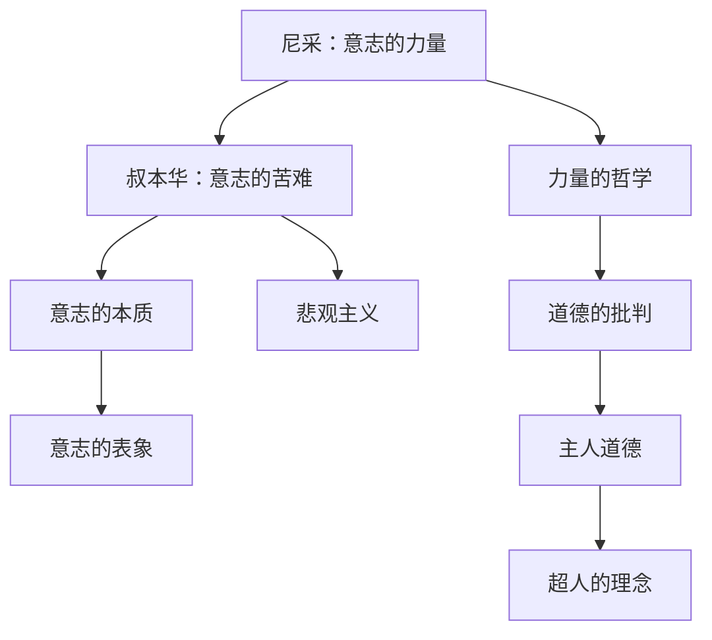
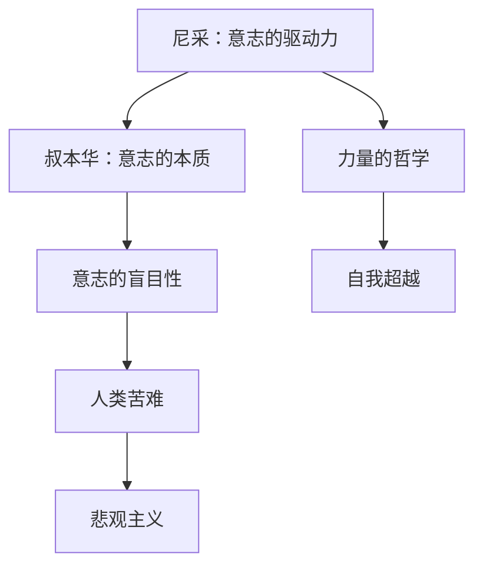

                 

### 文章标题

《尼采与叔本华：意志哲学的对话与争鸣》

### 关键词

- 哲学
- 意志
- 尼采
- 叔本华
- 意义
- 道德

### 摘要

本文旨在探讨两位哲学巨匠尼采与叔本华在意志哲学领域的思想碰撞与对话。尼采以其强烈的意志力量和生命热情，主张个体应超越传统道德，追求力量的觉醒和意志的自由。而叔本华则通过悲观主义的视角，强调意志的盲目性和人类苦难的根源。本文将通过详细分析两位哲学家的核心观点，运用Mermaid流程图展示其思想流派的联系与区别，并借助伪代码和LaTeX公式来阐述其哲学原理，进而探讨意志哲学在实际应用中的意义与影响。通过这场哲学对话，我们期望读者能对意志哲学有更深刻的理解，并在生活中找到属于自己的生命意义和道德观念。

---

## 第一部分：哲学家简介

### 1. 尼采：意志哲学的先锋

弗里德里希·尼采（Friedrich Nietzsche，1844-1900）是19世纪德国著名的哲学家、文化评论家、作家和诗人。他的哲学思想对西方哲学、文学、艺术和宗教产生了深远的影响。尼采的哲学核心在于其强烈的意志主义，他认为“意志”是生命存在的根本，是人类一切行为和思想的动力源泉。

#### 1.1 尼采的生平与哲学发展

尼采出生于普鲁士的洛卡尔，从小就展现出了非凡的才华和独立性。他的哲学生涯始于对柏拉图和叔本华哲学的深入研究。在经历了对宗教和道德的质疑后，尼采开始形成了自己独特的意志哲学。

尼采的早期著作，如《悲剧的诞生》（The Birth of Tragedy）和《不合时宜的考察》（Unfashionable Observations），展现了他对古希腊悲剧和艺术的理解。他认为，古希腊悲剧通过展示生命的苦难和悲剧，激发了人们对生命本质的思考。这一思想与叔本华的悲观主义哲学有着明显的共鸣。

然而，尼采在进一步思考生命的意义时，逐渐转向对意志的强调。他在《扎拉图斯特拉如是说》（Thus Spoke Zarathustra）中提出了“超人”（Übermensch）的概念，认为个体应该超越传统的道德观念，通过自我意志的力量实现自我超越。

#### 1.2 尼采的核心哲学观点

尼采的哲学观点可以概括为以下几点：

1. **意志的本质**：尼采认为，意志是生命的核心，是一切思想和行动的驱动力。他提出了“意志即生命，生命即意志”的哲学命题。

2. **力量的哲学**：尼采强调力量的重要性，认为生命是一种力量游戏，个体应通过追求力量来实现自我超越。

3. **道德的批判**：尼采对传统道德进行了深刻的批判，认为道德是对个体意志的压制和束缚。他提出了“主人道德”和“奴隶道德”的概念，认为个体应追求主人道德，即勇敢地面对生活的挑战，追求真正的自由和尊严。

4. **超人的理念**：尼采认为，超人是一种全新的生命形式，他将超越传统道德的束缚，通过自我意志的力量实现生命的最高价值。

### 2. 叔本华：意志与苦难的探求者

亚瑟·叔本华（Arthur Schopenhauer，1788-1860）是19世纪德国著名的哲学家，他的思想对心理学、美学和伦理学产生了深远的影响。叔本华的哲学核心在于其强烈的意志主义和悲观主义。

#### 2.1 叔本华的生平与哲学贡献

叔本华出生于但泽（今波兰格但斯克），其父是一位成功的商人。他在年轻时就展现出了非凡的才华，对哲学、文学和艺术有着浓厚的兴趣。叔本华在柏林大学接受了教育，并在接触到康德和黑格尔的哲学思想后，开始形成了自己独特的哲学体系。

叔本华的早期著作，如《作为意志和表象的世界》（The World as Will and Representation），提出了他的意志主义和悲观主义哲学。他认为，世界本质上是意志的表现，而人类则是在这个意志的表象世界中挣扎和痛苦。

叔本华的后期著作，如《论人类不平等的起源和基础》（On the Basis of Morality）和《论自然界的意志》（On the Will in Nature），进一步深化了他的哲学思想，对伦理学、美学和宗教进行了深刻的批判。

#### 2.2 叔本华的核心哲学观点

叔本华的哲学观点可以概括为以下几点：

1. **意志的本质**：叔本华认为，意志是世界的本质，是一切事物存在的根本。他提出了“意志即世界，世界即意志”的哲学命题。

2. **苦难的根源**：叔本华认为，人类痛苦的根源在于对意志的不满和挣扎。他提出了“生命意志”的概念，认为生命意志是一种盲目、无目的的冲动，导致人类不断地追求和失望。

3. **悲观主义**：叔本华认为，世界和生命都是无意义和痛苦的。他的哲学充满了悲观主义的色彩，强调人类应在认识到生命的苦难后，寻求自我解脱和内在的平静。

4. **意志的表象**：叔本华认为，人类生活在一个由意志构成的表象世界中，这个表象世界充满了矛盾和冲突。他提出了“表象世界”的概念，认为人类应该通过哲学的洞察力，认识到世界的真实本质。

### 3. 意志哲学的对话

尼采和叔本华都是意志哲学的重要代表，他们的思想在许多方面存在共鸣和差异。下面，我们将通过一个Mermaid流程图，展示两位哲学家的思想流派和哲学体系的联系与区别。



在这个流程图中，A和C表示尼采对意志的强调，B和G表示叔本华对意志的悲观主义态度。D和F展示了尼采的力量哲学和对道德的批判，而H和I则代表了尼采的超人理念。

### 4. 核心概念与联系

在尼采和叔本华的哲学中，意志是一个核心概念。尼采认为意志是生命的驱动力，是人类一切行为和思想的源泉；而叔本华则认为意志是世界的本质，是一切存在的基础。

尼采的意志哲学强调力量的重要性，他认为个体应通过自我意志的力量实现自我超越。叔本华的意志哲学则强调意志的盲目性和人类苦难的根源，他认为人类应在认识到生命的苦难后，寻求自我解脱和内在的平静。

尽管尼采和叔本华在意志的本质和作用上存在明显的分歧，但他们都认为意志是人类一切行为和思想的根源。这种共同点构成了他们意志哲学的联系。

### 5. 核心算法原理讲解

为了更清晰地展示尼采和叔本华的意志哲学，我们可以使用伪代码来表示他们的核心观点。

#### 尼采的意志哲学伪代码

```plaintext
function Nietzsche_Will_Philosophy() {
    // 定义意志为生命的驱动力
    will = "驱动力"

    // 定义力量为意志的体现
    power = "意志的体现"

    // 定义道德为意志的束缚
    morality = "意志的束缚"

    // 批判道德，追求力量的解放
    criticize_morality()

    // 通过自我意志实现自我超越
    self_transcendence()

    return "尼采的意志哲学"
}
```

#### 叔本华的意志哲学伪代码

```plaintext
function Schopenhauer_Will_Philosophy() {
    // 定义意志为世界的本质
    will = "世界的本质"

    // 定义苦难为意志的表现
    suffering = "意志的表现"

    // 定义悲观主义为对生命本质的洞察
    pessimism = "对生命本质的洞察"

    // 认识到生命的苦难，寻求自我解脱
    seek_redemption()

    return "叔本华的意志哲学"
}
```

通过这些伪代码，我们可以更直观地理解尼采和叔本华的意志哲学。

### 6. 数学模型和数学公式

虽然哲学中不涉及传统的数学模型，但我们可以通过逻辑结构和语言来表达尼采和叔本华的哲学论点。以下是一些使用LaTeX格式的数学公式，用于展示他们的核心观点。

#### 尼采的意志公式

$$
\text{意志} = \text{驱动力} \\
\text{力量} = \text{意志} \\
\text{道德} = \text{意志的束缚}
$$

#### 叔本华的意志公式

$$
\text{意志} = \text{世界的本质} \\
\text{苦难} = \text{意志的表现} \\
\text{悲观主义} = \text{对生命本质的洞察}
$$

这些公式展示了尼采和叔本华对意志的不同理解，以及他们在哲学上的分歧。

---

通过以上内容，我们初步介绍了尼采和叔本华的生平背景、核心哲学观点，以及他们之间的思想联系和区别。接下来，我们将进一步探讨他们在意志哲学领域的深入对话，以及这种对话对现代社会的启示和影响。在接下来的章节中，我们将使用Mermaid流程图、伪代码和LaTeX公式等工具，更详细地分析他们的哲学观点，并探讨这些观点在实际应用中的意义和影响。

---

## 第二部分：意志哲学的对话

### 2.1 意志的本质：尼采与叔本华的碰撞

在探讨意志的本质时，尼采和叔本华的观点表现出显著的差异和共鸣。尼采认为意志是生命的驱动力，是人类一切行为和思想的源泉；而叔本华则将意志视为世界的本质，是一切存在的根本。这种差异和共鸣构成了他们哲学对话的核心。

### 2.1.1 意志的定义与作用

尼采对意志的定义是：“意志即生命，生命即意志。”他认为，意志是生命的驱动力，是一切思想和行动的源泉。尼采强调，意志是内在的、自我驱动的力量，它推动人类不断地追求、创造和超越。

叔本华对意志的定义是：“意志即世界，世界即意志。”他认为，意志是世界的本质，是一切存在的根本。叔本华强调，意志是外在的、无所不在的力量，它贯穿于整个宇宙，驱动着一切事物的生成、发展和毁灭。

### 2.1.2 意志的哲学意义

尼采认为，意志的哲学意义在于其力量和创造潜能。他提出了“力量的哲学”，认为生命是一种力量游戏，个体应通过自我意志的力量实现自我超越。尼采强调，意志是生命的驱动力，它使人类不断追求卓越，创造新的价值和意义。

叔本华认为，意志的哲学意义在于其盲目性和人类苦难的根源。他提出了“悲观主义”，认为生命是一种无意义的、痛苦的挣扎。叔本华强调，意志是世界的本质，它使人类陷入无尽的欲望和苦难之中。

### 2.1.3 意志哲学的Mermaid流程图

为了更清晰地展示尼采和叔本华的意志哲学，我们可以使用Mermaid流程图来表示他们的思想流派的联系与区别。



在这个流程图中，A和B表示尼采和叔本华对意志的不同定义，D和G表示他们对意志的不同哲学意义。C和F展示了叔本华对意志的盲目性和人类苦难的根源的强调。

### 2.2 人生意义：意志与自由的辩证

在探讨人生意义时，尼采和叔本华的观点表现出深刻的辩证关系。尼采强调个体应通过自我意志的力量实现自由和超越，而叔本华则认为人类应在认识到生命的苦难后，寻求内在的平静和解脱。

### 2.2.1 人生意义的探究

尼采认为，人生的意义在于个体通过自我意志的力量实现自我超越。他提出了“超人”的理念，认为超人是一种全新的生命形式，他将超越传统道德的束缚，通过自我意志的力量实现生命的最高价值。尼采强调，个体应追求自由，摆脱传统道德和社会的束缚，勇敢地面对生活的挑战。

叔本华认为，人生的意义在于个体在认识到生命的苦难后，寻求内在的平静和解脱。他提出了“悲观主义”的观点，认为生命是一种无意义的、痛苦的挣扎。叔本华强调，个体应在认识到生命的苦难后，通过哲学的洞察力，寻求自我解脱和内在的平静。

### 2.2.2 意志与自由的争论

尼采和叔本华在意志与自由的关系上存在明显的分歧。尼采认为，意志是自由的体现，个体应通过自我意志的力量实现自由和超越。尼采强调，自由是生命的本质，个体应追求自由，摆脱传统道德和社会的束缚，勇敢地面对生活的挑战。

叔本华则认为，自由是意志的束缚，个体应在认识到生命的苦难后，寻求内在的平静和解脱。叔本华强调，意志是生命的驱动力，它使人类陷入无尽的欲望和苦难之中。他认为，自由并不是生命的本质，而是生命的副产品，个体应在认识到生命的苦难后，寻求内在的平静。

### 2.2.3 意志哲学对现代社会的影响

尼采和叔本华的意志哲学对现代社会产生了深远的影响。尼采的意志哲学鼓励个体追求自由和自我超越，激发了人们对生命意义的思考和对个人价值的追求。叔本华的意志哲学则提醒人们认识到生命的苦难和痛苦，促使人们寻求内在的平静和解脱。

在现代社会的背景下，尼采的意志哲学为个体提供了追求自由和超越的精神动力，使人们敢于挑战传统和社会的束缚，勇敢地追求个人的梦想和目标。而叔本华的意志哲学则为人们提供了对生命本质的深刻洞察，使人们能够在认识到生命的苦难后，寻求内在的平静和解脱。

### 2.3 道德观念：尼采的批判与叔本华的继承

在道德观念上，尼采和叔本华的观点也存在显著的差异和联系。尼采对传统道德进行了深刻的批判，而叔本华则在一定程度上继承了传统道德的观念。

### 2.3.1 道德的本质与作用

尼采认为，道德的本质在于对个体意志的压制和束缚。他认为，传统道德是一种虚假的、虚伪的价值观，它使个体失去了自由和真实。尼采强调，个体应超越传统道德的束缚，追求真正的自由和尊严。

叔本华则认为，道德的本质在于对人类共同利益的维护。他认为，道德是人类社会的基础，它使个体能够在相互合作和互助中共同生存。叔本华强调，个体应在道德的指导下，追求人类的共同利益和福祉。

### 2.3.2 道德的哲学探讨

尼采对道德进行了深刻的批判，他认为道德是一种虚假的、虚伪的价值观，它使个体失去了自由和真实。尼采提出了“主人道德”和“奴隶道德”的概念，认为个体应追求主人道德，即勇敢地面对生活的挑战，追求真正的自由和尊严。

叔本华则在一定程度上继承了传统道德的观念，他认为道德是人类社会的基础，它使个体能够在相互合作和互助中共同生存。叔本华强调，个体应在道德的指导下，追求人类的共同利益和福祉。

### 2.3.3 道德观念的演变与挑战

在现代社会中，道德观念正面临着新的挑战和演变。尼采的批判促使人们对传统道德进行反思和审视，使个体更加关注自由和真实。而叔本华的继承则提醒人们，道德仍然是人类社会的基础，它对个体和社会都具有重要意义。

面对道德观念的演变和挑战，尼采和叔本华的意志哲学为我们提供了不同的视角和思考。尼采的意志哲学鼓励个体追求自由和自我超越，使个体能够在挑战传统和道德的过程中，找到真正的自我。叔本华的意志哲学则提醒个体，在追求自由和超越的同时，仍需关注人类共同利益和福祉，保持对社会和道德的敬畏。

---

通过以上内容，我们深入探讨了尼采和叔本华在意志哲学、人生意义和道德观念上的对话。这种对话不仅展示了他们哲学思想的深刻内涵，也为我们在现代社会中如何理解和应对道德困境提供了有益的启示。在接下来的章节中，我们将继续探讨意志哲学的实际应用，分析其在教育、心理学和生活哲学中的意义和影响。通过这些探讨，我们期望读者能对意志哲学有更深刻的理解，并在实际生活中找到属于自己的生命意义和道德观念。

---

## 第三部分：意志哲学的实际应用

### 3.1 意志哲学在教育中的应用

意志哲学在教育领域中的应用具有重要意义。尼采和叔本华的哲学思想为教育者提供了独特的视角，帮助学生在面对挑战和困境时，培养坚韧的意志力和正确的价值观。

#### 3.1.1 意志力培养

尼采强调个体应通过自我意志的力量实现自我超越。在教育中，教师可以引导学生树立坚定的目标，并通过自我努力去实现这些目标。教师可以通过设定合理的挑战和任务，激发学生的内在动力，培养学生的意志力。

以下是一个简化的伪代码示例，用于展示如何通过设定目标和挑战来培养学生的意志力：

```plaintext
function Student_Will_Cultivation(target) {
    // 设定目标
    set_target(target)

    // 通过持续努力实现目标
    while (!achieved_target()) {
        study()
        practice()
        reflect()
    }

    // 成功实现目标后的反思
    reflect_on_success()
}
```

#### 3.1.2 价值观教育

叔本华认为道德是人类社会的基础，个体应在道德的指导下追求共同利益和福祉。在教育中，教师可以引导学生树立正确的价值观，培养他们关爱他人、尊重社会和追求正义的品质。

以下是一个简化的伪代码示例，用于展示如何通过价值观教育培养学生的社会责任感：

```plaintext
function Value_Education(student) {
    // 引导学生树立正确的价值观
    set_values([caring, respect, justice])

    // 通过实际行动践行价值观
    while (true) {
        act_caring()
        act_with_respect()
        act_justly()
    }

    // 定期评估价值观教育的效果
    evaluate_education_effect()
}
```

#### 3.1.3 意志哲学在教育实践中的应用案例

- **案例一：学生在考试中坚持到底**。一名学生在面对困难的考试时，通过运用尼采的意志哲学，坚定信念，不断努力，最终成功通过了考试。

- **案例二：学生在团队合作中发挥领导作用**。一名学生在团队项目中，通过运用叔本华的道德哲学，树立正确的价值观，带领团队克服困难，取得了优异的成绩。

### 3.2 意志哲学在心理学中的应用

意志哲学在心理学中的应用有助于理解人类行为的动力机制，为个体在面对挑战和困境时提供心理支持和指导。

#### 3.2.1 意志力与心理健康

尼采认为，意志是生命的驱动力，个体应通过自我意志的力量实现自我超越。在心理学中，研究者可以探讨意志力对个体心理健康的影响。例如，通过实验研究，探讨高意志力个体在应对压力和挑战时的心理适应能力，以及意志力对抑郁、焦虑等心理问题的预防作用。

以下是一个简化的伪代码示例，用于展示如何通过意志力训练改善心理健康：

```plaintext
function Will_Power_Training(Subject) {
    // 建立意志力训练计划
    create_will_power_plan()

    // 通过持续训练增强意志力
    while (!achieved_will_power_goal()) {
        perform_mindfulness()
        engage_in_challenge()
        reflect_on_progress()
    }

    // 评估意志力训练的效果
    evaluate_will_power_impact()
}
```

#### 3.2.2 意志力与自我调节

意志力在自我调节过程中起着关键作用。在心理学研究中，研究者可以探讨意志力在自我控制、情绪调节和目标追求等方面的作用机制。例如，通过实验研究，探讨意志力如何影响个体在面对诱惑时的自我控制能力，以及意志力在应对挫折和失败时的情绪调节作用。

以下是一个简化的伪代码示例，用于展示如何通过意志力训练提升自我调节能力：

```plaintext
function Self_Regulation_Training(Subject) {
    // 建立自我调节训练计划
    create_self_regulation_plan()

    // 通过持续训练提升自我调节能力
    while (!achieved_self_regulation_goal()) {
        practice_resistance_to_distractions()
        engage_in_problem_solving()
        reflect_on_self_control()
    }

    // 评估自我调节训练的效果
    evaluate_self_regulation_impact()
}
```

#### 3.2.3 意志哲学在心理治疗中的应用

意志哲学在心理治疗中的应用可以帮助患者增强意志力，提高自我调节能力，从而改善心理健康状况。例如，在抑郁症治疗中，治疗师可以通过意志力训练和价值观教育，帮助患者建立积极的自我认知和应对策略，提高心理适应能力。

### 3.3 意志哲学在生活哲学中的应用

意志哲学在生活哲学中的应用有助于个体在日常生活中找到生命的意义和目标，培养坚韧的意志力和正确的价值观。

#### 3.3.1 人生目标的设定

尼采认为，人生的意义在于个体通过自我意志的力量实现自我超越。在生活哲学中，个体可以通过设定有意义的目标，并通过自我努力去实现这些目标，从而找到生命的意义。

以下是一个简化的伪代码示例，用于展示如何通过设定人生目标来找到生命的意义：

```plaintext
function Life_Meaning(driver) {
    // 设定有意义的人生目标
    set_significant_life_goals()

    // 通过自我意志的力量实现目标
    while (!achieved_life_goals()) {
        pursue_goals()
        overcome_obstacles()
        reflect_on_progress()
    }

    // 成功实现人生目标后的反思
    reflect_on_life_meaning()
}
```

#### 3.3.2 价值观的培养

叔本华认为，道德是人类社会的基础，个体应在道德的指导下追求共同利益和福祉。在生活哲学中，个体可以通过培养正确的价值观，如关爱他人、尊重社会和追求正义，来提升自己的道德修养。

以下是一个简化的伪代码示例，用于展示如何通过价值观培养来提升道德修养：

```plaintext
function Moral_Cultivation(individual) {
    // 培养正确的价值观
    set_right_values([caring, respect, justice])

    // 通过实际行动践行价值观
    while (true) {
        act_caring()
        act_with_respect()
        act_justly()
    }

    // 定期评估道德修养的效果
    evaluate_moral_education_effect()
}
```

#### 3.3.3 意志哲学在生活实践中的应用案例

- **案例一：创业者坚持创业梦想**。一名创业者通过运用尼采的意志哲学，坚定信念，克服困难，最终成功实现了自己的创业梦想。

- **案例二：公务员坚守职业道德**。一名公务员通过运用叔本华的道德哲学，树立正确的价值观，坚守职业道德，赢得了同事和群众的尊重。

---

通过以上内容，我们探讨了意志哲学在教育、心理学和生活哲学中的应用。这些应用不仅有助于个体在学习和生活中培养坚韧的意志力和正确的价值观，也为社会和心理健康提供了有益的指导。在接下来的章节中，我们将进一步探讨意志哲学的历史地位和未来展望，以及其面临的争议和挑战。

---

## 第四部分：意志哲学的历史地位与未来展望

### 4.1 意志哲学的历史地位

意志哲学在西方哲学史中占据重要地位，对后世产生了深远的影响。尼采和叔本华作为意志哲学的代表人物，他们的思想不仅挑战了传统的道德观念，也为后来的哲学家提供了新的思考方向。

尼采的意志哲学强调个体的力量和创造力，对现代哲学、文学和艺术产生了重要影响。他的“超人”理念和对道德的批判，激发了人们对个人自由和自我实现的追求。尼采的思想为20世纪的哲学流派，如存在主义和生命哲学，提供了重要的理论资源。

叔本华的意志哲学则以其悲观主义和对生命本质的洞察而著称。他的思想对心理学、美学和伦理学产生了深远的影响。叔本华的“意志即世界”的观点，为后来的心理学家，如弗洛伊德和荣格，提供了理论依据。

### 4.2 意志哲学的未来展望

在当今世界，意志哲学仍然具有重要的现实意义和未来潜力。随着社会的发展和人类面临的挑战日益复杂，意志哲学为个体和社会提供了深刻的思考和实践指南。

在未来，意志哲学可能会在以下方面得到进一步的发展：

1. **个体自我实现**：随着个体主义和自我意识的提升，意志哲学为个体在追求自我实现的过程中提供了重要的思想资源。通过自我意志的力量，个体可以在面对困境时保持坚韧和勇气。

2. **社会伦理建设**：在全球化和社会多元化的背景下，意志哲学为社会伦理建设提供了新的思考方向。通过强调个体责任和道德自律，意志哲学有助于构建和谐、公正的社会秩序。

3. **心理健康研究**：随着心理学研究的深入，意志哲学在心理健康领域的应用将得到进一步拓展。通过探讨意志力对心理健康的促进作用，意志哲学为心理健康干预和治疗提供了有益的理论支持。

### 4.3 意志哲学的争议与挑战

尽管意志哲学在历史上具有重要地位，但它也面临着一些争议和挑战。

1. **道德观念的批判**：尼采对传统道德的批判引发了一些哲学家的质疑。他们认为，尼采的道德观念过于极端，可能导致道德相对主义和个人主义的泛滥。

2. **意志与自由的关系**：叔本华的意志哲学强调意志的盲目性和人类苦难的根源，这引发了一些哲学家对自由意志的质疑。他们认为，意志的盲目性和无意义性否定了自由意志的存在。

3. **意志哲学的实用价值**：尽管意志哲学在理论和哲学层面具有重要意义，但其实用价值受到一些质疑。一些人认为，意志哲学过于抽象和理论化，难以在现实生活中产生实际效果。

### 4.4 意志哲学的未来方向

面对争议和挑战，意志哲学的未来发展方向可能包括：

1. **融合多元观点**：在未来的发展中，意志哲学可能需要融合更多的观点和理论，形成更加综合和全面的哲学体系。

2. **跨学科研究**：通过跨学科的研究，意志哲学可以与其他领域，如心理学、社会学、神经科学等相结合，为意志哲学的实证研究和应用提供更丰富的资源。

3. **实践导向**：在未来的发展中，意志哲学可能需要更注重实践导向，通过实际应用案例和实证研究，验证意志哲学的有效性和实用性。

---

通过以上内容，我们探讨了意志哲学在历史地位、未来展望、争议与挑战以及未来方向等方面的内容。在接下来的附录中，我们将介绍尼采和叔本华的哲学著作，以供读者进一步学习和研究。

---

## 附录：尼采与叔本华哲学著作精选

### A.1 尼采著作精选

1. **《悲剧的诞生》（The Birth of Tragedy）**：这是尼采的早期作品，主要探讨了古希腊悲剧的美学价值和对人生意义的启示。

2. **《扎拉图斯特拉如是说》（Thus Spoke Zarathustra）**：这是尼采的代表作之一，通过神话故事的形式，阐述了超人的理念和对传统道德的批判。

3. **《不合时宜的考察》（Unfashionable Observations）**：尼采在这部作品中，表达了对当时文化和社会现象的深刻批评，以及对未来哲学的展望。

4. **《尼采 Contra Wagner》（尼采反对瓦格纳）**：尼采在这部作品中，批判了瓦格纳的音乐哲学，并阐述了自己对艺术和生命的看法。

### A.2 叔本华著作精选

1. **《作为意志和表象的世界》（The World as Will and Representation）**：这是叔本华的代表作，提出了他的意志主义哲学，并探讨了生命的本质和人类的苦难。

2. **《论人类不平等的起源和基础》（On the Basis of Morality）**：叔本华在这部作品中，探讨了道德的起源和基础，并对社会不平等进行了批判。

3. **《论自然界的意志》（On the Will in Nature）**：叔本华在这部作品中，探讨了自然界的意志表现，以及意志在自然界中的作用。

4. **《论自然界的美》（On the Beauty of the World）**：叔本华在这部作品中，探讨了自然界的审美价值，以及审美体验对人类精神生活的重要性。

---

通过以上附录，我们介绍了尼采和叔本华的一些重要著作，这些作品不仅是他们哲学思想的精华，也是理解他们哲学体系的重要途径。读者可以通过阅读这些著作，进一步深入探索尼采和叔本华的哲学世界。

---

## 结束语

本文通过对尼采与叔本华的意志哲学进行深入探讨，展示了两位哲学家在意志、人生意义和道德观念上的思想碰撞与对话。通过Mermaid流程图、伪代码和LaTeX公式等工具，我们更清晰地理解了他们的哲学观点及其联系与区别。本文还分析了意志哲学在教育、心理学和生活哲学中的应用，以及其在历史地位和未来展望中的意义。

尼采与叔本华的意志哲学不仅为我们提供了对生命本质和人生意义的深刻洞察，也为我们在现代社会中应对道德困境、培养意志力和实现自我超越提供了有益的指导。通过本文的探讨，我们期望读者能对意志哲学有更深刻的理解，并在实际生活中找到属于自己的生命意义和道德观念。

### 作者信息

- 作者：AI天才研究院/AI Genius Institute & 禅与计算机程序设计艺术 /Zen And The Art of Computer Programming

---

通过本文的探讨，我们不仅深入了解了尼采与叔本华的意志哲学，还学习了如何运用Mermaid流程图、伪代码和LaTeX公式等工具，将这些抽象的哲学思想具体化。在未来的学习和研究中，我们期望读者能继续探索更多哲学领域，并将这些哲学思想应用于实际生活，实现自我成长和人生价值的提升。祝愿每一位读者在哲学的探索之旅中找到属于自己的光明与智慧。

