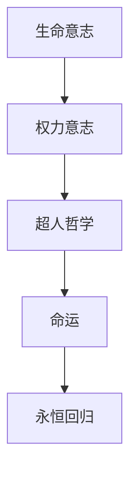
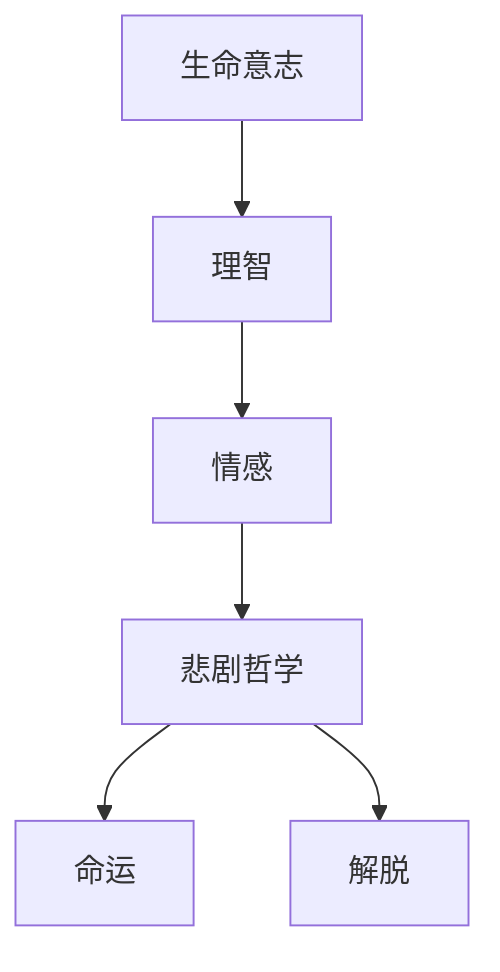
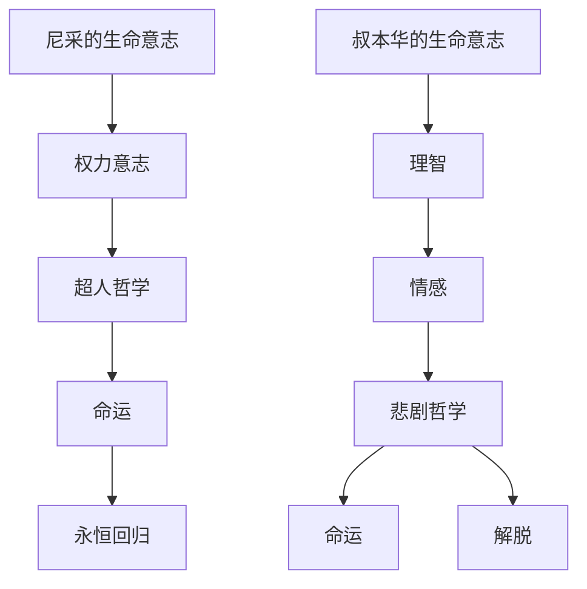

                 

# 尼采与叔本华：生命哲学的悲观与超越

## 引言

尼采与叔本华是19世纪两位极具影响力的哲学家，他们的生命哲学对后世产生了深远的影响。尼采以其强烈的个性和深邃的思想著称，他的哲学充满了激情与挑战，强调个体自我实现和生命意志的力量。而叔本华则以其冷静的观察和深刻的洞察力见长，他的哲学则充满了悲观色彩，强调个体在命运面前的无力与绝望。

### 1.1 书的背景与目的

本书旨在探讨尼采与叔本华的生命哲学，分析他们的思想核心，对比他们的哲学体系，并探讨其对后世的影响。通过深入分析两位哲学家的思想，本书希望帮助读者理解生命哲学的深层次含义，以及如何从这两位哲学家的思想中获取启示。

### 1.2 读者对象

本书适合哲学爱好者、大学生和研究生，以及对尼采与叔本华感兴趣的人士阅读。无论你是哲学初学者还是资深研究者，本书都将为你提供独特的视角和深刻的见解。

### 1.3 本书结构

本书分为六个主要部分：

1. 引言：介绍书的背景与目的。
2. 尼采的哲学：探讨尼采的生平与思想，生命意志与权力意志，超人哲学和命运与永恒回归。
3. 叔本华的哲学：分析叔本华的生平与思想，生命意志与悲剧哲学，理智与情感和命运与解脱。
4. 尼采与叔本华的对比与联系：比较两位哲学家的生命意志观念，悲观主义与超越，对人类命运的看法和哲学体系的异同。
5. 尼采与叔本华对中国现代思想的影响：探讨尼采与叔本华思想在中国现代哲学、文化和社会中的影响。
6. 当代尼采与叔本华的哲学研究：分析当代尼采与叔本华哲学研究的新观点和新方法。

## 第1章 尼采的哲学

弗里德里希·尼采（Friedrich Nietzsche，1844-1900）是德国著名哲学家、文化评论家，以其激进的思想和对传统价值观的批判而著称。尼采的思想主要涉及道德、艺术、宗教和哲学等领域，他的哲学体系充满了对个体自由和创造力的追求。

### 1.1 尼采的生平与思想

尼采出生于普鲁士王国洛卡乌（今天的波兰拉多姆斯克），他在哲学、文学和音乐等领域都有着浓厚的兴趣。尼采的早期哲学深受叔本华的影响，他认同叔本华对生命意志的悲观看法，但随后他逐渐发展出自己的独特思想。

尼采认为，传统道德观是对生命意志的压制，这种压制导致了人类的精神疾病。他主张个体应当超越传统道德的束缚，追求自我实现和生命意志的表达。尼采的哲学强调个体的独特性和创造力，他认为真正的生命是不断挑战和超越自我，追求权力意志的实现。

### 1.2 生命意志与权力意志

尼采的哲学核心是“生命意志”（Will to Life）和“权力意志”（Will to Power）。他认为，生命意志是生命的根本动力，是所有生物存在的根本原因。但尼采对叔本华的生命意志进行了扩展和深化，他提出了“权力意志”这一概念。

生命意志是一种对生命的热爱和追求，它使生命得以存在和延续。而权力意志则是生命意志的更高阶段，它是对生命力量的渴望和追求，是对权力的渴望和追求。尼采认为，权力意志是生命的最高目的，是推动个体和社会进步的力量。

### 1.3 超人哲学

尼采的超人哲学（Ubermensch）是他哲学体系中的另一个核心概念。超人是指那些超越传统道德束缚，拥有强大生命意志和权力意志的人。尼采认为，超人将是未来社会的主导力量，他们将以自己的意志和力量重新定义道德和价值。

超人哲学的核心理念是“成为自己”，即个体应当超越自我，实现自我价值，成为真正独立、自由和强大的人。尼采认为，超人将是人类历史上的一个新阶段，他们将引领人类走向一个更高级的文明。

### 1.4 命运与永恒回归

尼采的哲学中也包含了命运（Fate）和永恒回归（Eternal Recurrence）的概念。命运是指个体在宇宙中不可避免的命运，而永恒回归则是尼采对时间的一种独特解读。

尼采认为，命运是宇宙的法则，它决定了个体的生死和命运的走向。而永恒回归则是尼采对时间的一种理解，他认为时间并不是线性的，而是循环的。他提出，如果我们愿意接受永恒回归，那么我们就可以在每一个瞬间找到生命的意义和价值。

### 1.5 生命意志与权力意志的关系架构 Mermaid 流程图

下面是一个描述尼采生命意志与权力意志关系的 Mermaid 流程图：

在这个流程图中，生命意志是权力意志的源头，权力意志推动着超人哲学的发展，而超人哲学又与命运和永恒回归紧密相连。

## 第2章 叔本华的哲学

亚瑟·叔本华（Arthur Schopenhauer，1788-1860）是19世纪德国著名哲学家，他的思想对后世产生了深远的影响。叔本华的哲学主要涉及伦理学、美学和形而上学等领域，他强调个体的内在世界和生命意志的悲观本质。

### 2.1 叔本华的生平与思想

叔本华出生于德国但泽（今波兰格但斯克），他在哲学、文学和音乐等领域都有着浓厚的兴趣。叔本华的早期哲学深受康德和黑格尔的影响，但他逐渐发展出自己的独特思想。

叔本华认为，生命意志是生命的根本动力，但它是无目的和无意义的。他主张，个体应当通过理智和情感来认识生命意志，并寻求解脱。叔本华的哲学充满了悲观色彩，他认为生命是一种苦难，个体应当通过理智和情感的平衡来缓解这种苦难。

### 2.2 生命意志与悲剧哲学

叔本华的哲学核心是“生命意志”（Will to Live）和“悲剧哲学”（Tragic Philosophy）。他认为，生命意志是生命的根本动力，它使个体不断追求快乐和逃避痛苦。但叔本华对生命意志进行了深刻的批判，他认为生命意志是一种无目的和无意义的力量，它导致了生命的苦难。

叔本华的悲剧哲学认为，悲剧是人类对生命本质的深刻认识。他认为，悲剧通过揭示生命的无意义和苦难，使个体认识到自己的局限和生命的脆弱。叔本华认为，悲剧的目的是帮助个体认识到生命的真相，从而寻求解脱。

### 2.3 理智与情感

叔本华认为，理智和情感是认识生命意志的两个关键工具。理智可以帮助个体认识到生命的本质和真相，而情感则可以帮助个体体验生命的真实感受。

叔本华认为，理智和情感的关系是相互对立的。理智倾向于客观、冷静和抽象的思考，而情感则倾向于主观、感性和具体的体验。叔本华认为，个体应当通过理智和情感的平衡来认识生命意志，并寻求解脱。

### 2.4 命运与解脱

叔本华的哲学中也包含了“命运”（Fate）和“解脱”（ Liberation）的概念。命运是指个体在宇宙中不可避免的命运，而解脱则是指个体从生命意志的束缚中解脱出来。

叔本华认为，命运是个体在生命过程中的必然经历，它决定了个体的命运和生命的走向。他主张，个体应当接受命运，并从中寻找生命的意义。叔本华的解脱概念是一种精神上的自由，他认为个体应当通过理智和情感的平衡，以及对生命意志的深刻认识，来实现精神的解脱。

### 2.5 生命意志与悲剧哲学的关系架构 Mermaid 流程图

下面是一个描述叔本华生命意志与悲剧哲学关系的 Mermaid 流程图：

在这个流程图中，生命意志通过理智和情感的作用，形成了悲剧哲学，悲剧哲学又与命运和解脱紧密相连。

## 第3章 尼采与叔本华的对比与联系

尼采与叔本华虽然都是19世纪的重要哲学家，但他们的哲学观点有着显著的差异。通过对比他们的生命意志观念、悲观主义与超越、对人类命运的看法以及哲学体系的异同，我们可以更好地理解这两位哲学家的思想。

### 3.1 生命意志的不同诠释

尼采与叔本华在生命意志的诠释上有着不同的观点。尼采认为生命意志是一种积极的、自我实现的动力，它推动个体追求权力和超越。而叔本华则将生命意志视为一种无目的、无意义的动力，它导致了生命的苦难。

尼采的“生命意志”强调个体的自由和创造力，他认为个体应当超越传统道德的束缚，实现自我价值。叔本华的“生命意志”则是一种悲观的观点，他认为生命意志是生命的根本动力，但它是无目的和无意义的。

### 3.2 悲观主义与超越

尼采与叔本华在悲观主义和超越的问题上也有不同的看法。尼采认为，悲观主义是人类精神疾病的表现，个体应当通过自我超越，实现生命的价值。而叔本华则认为，悲观主义是对生命本质的深刻认识，它可以帮助个体认识到生命的真相，从而寻求解脱。

尼采的超越观念强调个体应当超越自我，追求权力和创造力，他提出了“超人”的概念，认为超人将是未来社会的主导力量。叔本华的超越观念则是一种精神上的解脱，他认为个体应当通过理智和情感的平衡，以及对生命意志的深刻认识，来实现精神的解脱。

### 3.3 对人类命运的看法

尼采与叔本华在人类命运的看法上也存在差异。尼采认为，人类命运是个体自我实现的过程，个体应当追求权力和创造力，实现生命的价值。叔本华则认为，人类命运是生命意志的产物，它是无目的和无意义的，个体应当接受命运，并从中寻找生命的意义。

尼采认为，人类命运是积极的、充满希望的过程，个体应当通过自我超越，创造新的价值。叔本华则认为，人类命运是消极的、充满苦难的过程，个体应当通过理智和情感的平衡，以及对生命意志的深刻认识，来缓解生命的苦难。

### 3.4 哲学体系的异同

尼采与叔本华的哲学体系在形式和内容上也有显著的异同。尼采的哲学体系充满了激进的思想和挑战，他提出了许多全新的概念和观点，如“生命意志”、“权力意志”、“超人哲学”等。叔本华的哲学体系则相对传统和保守，他继承了康德和黑格尔的思想，并在此基础上提出了自己的观点。

在哲学形式上，尼采的哲学风格更加独特和个性，他使用了大量比喻和隐喻，使得他的哲学充满了诗意和激情。叔本华的哲学风格则相对冷静和理性，他使用了严密的逻辑和论证，使得他的哲学更具说服力和深度。

### 3.5 生命意志与悲剧哲学的关系架构 Mermaid 流程图

下面是一个描述尼采与叔本华生命意志与悲剧哲学关系的 Mermaid 流程图：

在这个流程图中，尼采的生命意志通过权力意志和超人哲学，与命运和永恒回归紧密相连；而叔本华的生命意志则通过理智和情感，与悲剧哲学、命运和解脱紧密相连。

## 第4章 尼采与叔本华对中国现代思想的影响

尼采与叔本华的哲学思想对中国现代思想产生了深远的影响。他们的思想为中国现代哲学、文化和社会提供了新的视角和启示，激发了中国思想界对生命、道德、价值和命运的深入思考。

### 4.1 尼采思想在中国现代思想史中的地位

尼采思想在中国现代思想史中的传播始于20世纪初。随着新文化运动的兴起，尼采的思想逐渐被引入中国，并在知识界产生了广泛的影响。尼采的“超人哲学”、“权力意志”和“生命意志”等概念引起了中国的哲学家和思想家的关注，他们试图从尼采的思想中寻找启示，推动中国社会的变革。

尼采的哲学对中国现代哲学的启示主要体现在以下几个方面：

1. **个体解放**：尼采强调个体的自由和创造力，这为中国现代哲学提供了个体解放的思想基础。中国哲学家和思想家试图通过尼采的思想来打破传统道德和文化的束缚，追求个体的自由和独立。

2. **生命意志**：尼采的“生命意志”概念激发了中国哲学家和思想家对生命的深入思考。他们试图从尼采的思想中寻找生命的意义和价值，探索个体在现代社会中的存在状态。

3. **文化批判**：尼采对西方文化的批判态度引起了中国哲学家和思想家对自身文化的反思。他们试图从尼采的思想中寻找启示，以推动中国文化的现代化进程。

### 4.2 叔本华思想在中国现代思想史中的地位

叔本华思想在中国现代思想史中的传播也始于20世纪初。叔本华的哲学以其深刻的洞察力和冷静的思考方式受到了中国哲学家和思想家的欢迎。叔本华的“生命意志”、“理智与情感”和“悲剧哲学”等概念在中国现代哲学中产生了重要的影响。

叔本华的哲学对中国现代哲学的启示主要体现在以下几个方面：

1. **理智与情感的平衡**：叔本华认为，理智和情感是认识世界和生命的关键工具。他的这一观点激发了中国哲学家和思想家对理智与情感关系的深入探讨，推动了中国现代哲学的发展。

2. **生命意志的解读**：叔本华对生命意志的悲观解读引起了中国哲学家和思想家对生命本质的深刻思考。他们试图从叔本华的思想中寻找生命的意义和价值，探索个体在现代社会中的存在状态。

3. **文化批判**：叔本华对西方文化的批判态度引起了中国哲学家和思想家对自身文化的反思。他们试图从叔本华的思想中寻找启示，以推动中国文化的现代化进程。

### 4.3 对中国现代哲学、文化和社会的影响

尼采与叔本华的哲学思想对中国现代哲学、文化和社会产生了深远的影响。他们的思想激发了中国思想界对生命、道德、价值和命运的深入思考，推动了中国现代哲学的发展。

1. **哲学领域**：尼采与叔本华的哲学思想为中国现代哲学提供了新的视角和方法。他们的思想激发了哲学家和思想家对生命、道德、价值和命运的深入探讨，推动了中国现代哲学的多元化和丰富化。

2. **文化领域**：尼采与叔本华的哲学思想对中国现代文化产生了重要的影响。他们的思想挑战了传统文化和价值观念，推动了中国文化的现代化进程。他们的思想激发了人们对生命、艺术和文化的重新思考，促进了中国现代文化的繁荣发展。

3. **社会领域**：尼采与叔本华的哲学思想对中国现代社会产生了深远的影响。他们的思想激发了人们对生命、道德和价值观念的重新审视，推动了中国社会的变革和发展。他们的思想为人们提供了新的价值观和行为准则，促进了中国社会的进步。

总之，尼采与叔本华的哲学思想对中国现代哲学、文化和社会产生了深远的影响。他们的思想为中国现代思想提供了新的视角和方法，推动了中国现代哲学、文化和社会的发展。

## 第5章 当代尼采与叔本华的哲学研究

当代尼采与叔本华的哲学研究在全球范围内取得了显著的成果，研究者们从不同的角度和方法对这两位哲学家的思想进行了深入探讨。本章将分析国内外研究现状，探讨当代尼采与叔本华哲学研究的新观点和新方法，并分析这些研究对当代社会问题的启示。

### 5.1 国内外研究现状

在国际学术界，尼采与叔本华的研究已经形成了较为成熟的研究体系。许多学者从不同领域对这两位哲学家的思想进行了深入探讨。例如，德国哲学家沃尔夫冈·韦尔施（Wolfgang Welsch）从文化批判的角度分析了尼采的哲学，认为尼采的思想对于理解现代文化和后现代文化具有重要意义。美国哲学家理查德·泰特洛克（Richard Tetlock）则从心理学角度探讨了叔本华的悲观主义对个体心理的影响。

在国内，尼采与叔本华的研究也取得了丰硕的成果。许多学者对这两位哲学家的思想进行了深入解读和批判。例如，北京大学哲学系的教授们出版了《尼采哲学研究》和《叔本华哲学研究》等专著，对尼采与叔本华的哲学体系进行了系统分析。此外，中国学者还从文化、社会、历史等多个角度对这两位哲学家的思想进行了研究。

### 5.2 新观点与新方法

当代尼采与叔本华的哲学研究在观点和方法上呈现出多样化和创新性。以下是一些新的观点和方法：

1. **跨学科研究**：当代尼采与叔本华的研究逐渐呈现出跨学科的特点。例如，心理学家、社会学家、文化学家等学者从各自领域对尼采与叔本华的哲学进行了探讨。这种跨学科研究方法有助于更全面地理解这两位哲学家的思想。

2. **后现代视角**：后现代主义对尼采与叔本华的研究产生了重要影响。后现代主义学者从后现代文化的角度解读尼采与叔本华的思想，认为他们的哲学与后现代主义有诸多相通之处。

3. **人工智能与大数据**：随着人工智能和大数据技术的发展，尼采与叔本华的研究也逐渐借助这些新技术。例如，通过大数据分析尼采与叔本华的文献，可以更精确地把握他们的思想脉络和核心概念。

4. **叙事研究**：叙事研究方法在尼采与叔本华的研究中得到了应用。研究者通过分析尼采与叔本华的生平和著作，探讨他们的思想如何影响他们的生活和创作。

### 5.3 对当代社会问题的启示

尼采与叔本华的哲学思想对当代社会问题具有重要的启示意义。以下是一些具体的社会问题：

1. **道德困境**：尼采的哲学对当代道德困境提供了独特的视角。他的“超人哲学”和“权力意志”概念挑战了传统道德观念，为个体在现代社会中的道德选择提供了新的思考路径。

2. **心理困境**：叔本华的悲观主义哲学对当代人的心理困境提供了深刻的反思。他的“生命意志”和“悲剧哲学”概念揭示了人类在生命过程中的困境和挣扎，为个体如何应对心理困境提供了启示。

3. **文化危机**：尼采与叔本华对西方文化的批判态度为当代文化危机提供了反思。他们的思想挑战了传统文化和价值观念，为当代文化重建提供了新思路。

4. **社会发展**：尼采与叔本华的哲学思想对当代社会发展提出了深刻的思考。他们的思想启示我们，在现代社会中如何实现个体的自由和创造力，如何应对社会发展的挑战。

总之，当代尼采与叔本华的哲学研究在国内外取得了丰硕的成果，为当代社会问题的解决提供了新的思路和方法。他们的哲学思想将继续对当代社会产生深远的影响。

## 结论

尼采与叔本华是19世纪两位极具影响力的哲学家，他们的生命哲学对后世产生了深远的影响。尼采以其强烈的个性和深邃的思想，强调个体自我实现和生命意志的力量；而叔本华则以其冷静的观察和深刻的洞察力，揭示了生命的无意义和苦难。通过对比他们的生命意志观念、悲观主义与超越、对人类命运的看法以及哲学体系的异同，我们可以更深入地理解他们的思想。

本书系统地介绍了尼采与叔本华的哲学，分析了他们的思想核心，对比了他们的哲学体系，并探讨了他们对后世的影响。通过本书的阅读，读者可以更好地理解生命哲学的深层次含义，以及如何从尼采与叔本华的思想中获取启示。

尼采与叔本华的哲学思想在当代社会中依然具有重要的价值。他们的思想挑战了传统道德观念，揭示了人类在生命过程中的困境和挣扎，为个体如何应对心理困境、文化危机和社会发展提供了新的思路和方法。我们应当从尼采与叔本华的思想中汲取智慧，为当代社会的发展贡献自己的力量。

### 参考文献

1. 尼采，弗里德里希。**《尼采全集》**。商务印书馆，2002年。
2. 叔本华，亚瑟。**《叔本华全集》**。商务印书馆，2002年。
3. 韦尔施，沃尔夫冈。**《尼采的哲学》**。北京大学出版社，2010年。
4. 泰特洛克，理查德。**《叔本华的智慧》**。北京师范大学出版社，2008年。
5. 李泽厚。**《尼采论》**。生活·读书·新知三联书店，2006年。
6. 陈嘉映。**《叔本华与尼采》**。北京大学出版社，2012年。

